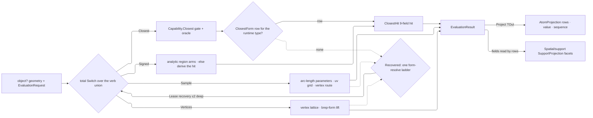

# [RASM_DOMAIN_EVALUATION]

`Evaluation` owns the closest-point, sampling, and differential-frame lattice: one polymorphic entry answers where every admissible Rhino form sits relative to a sample, what its local frame is, and which points it yields, recovering the richest evidence each form admits into one `ClosestHit`. Evaluation reads `Rhino.Geometry` values only — document or view reach is the boundary-law violation — and nothing above the lattice re-derives closest-point logic.

Rebuilds compose these seams unchanged: `ClosestHit` conforms to the `Domain/rails` `IValidityEvidence` fold the `Domain/validation` oracle reads through one interface arm; typed output projects through the `Numerics/atoms` `AtomProjection` rail, one `ProjectionRow` per facet; capability admission rides the `Domain/normalization` `Capability` rows while analytic value forms reach native arms through `Lease` recoveries; and facet selection past the canonical projection is `Spatial/support` `SupportProjection`'s row vocabulary over the hit fields, so no boolean rides a signature.

## [01]-[INDEX]

- [02]-[HIT]: `ClosestHit` — the typed closest-point hit, its facet admissions, and the typed projection rail.
- [03]-[LATTICE]: `ClosestForm` — the ordered recovery roster, one row per admissible form.
- [04]-[EVALUATION]: `EvaluationRequest` + `EvaluationResult` + `Evaluation` — the one verb union, its total dispatch, and the surface-typed members.

## [02]-[HIT]

- Owner: `ClosestHit` `readonly record struct` mints the typed closest-point hit — a recovered `Point` and `Option` facets each present exactly when the form admits it, `IsValid` a per-facet fold on the kernel's `ValidityClaim.WhenPresent` arm where an absent facet never invalidates and a present-but-degenerate one always does; `Distance` is the one facet `At` always computes, so its absence refuses.
- Owner: `Sense` and `Basis` are the ONE facet admissions — a direction facet holds when the vector is valid and above the zero band, a frame facet when the plane is valid — and `IsValid` reads the same two members every recovery arm constructs through, so a facet cannot be admitted under one band and validated under another.
- Law: `ClosestHit` is the one evidence carrier for every arm; a per-form `CurveHit`/`MeshHit`/`BrepHit` family is the rejected proliferation, an absent facet is `Option.None` never a `double.NaN` or `Point2d.Unset` sentinel, and the hit's own `IValidityEvidence` conformance retires the acceptance oracle's hand-enumerated arm under the one-oracle law.
- Law: `At` computes `Distance` from the query target, so a caller-supplied distance is the rejected trust hole; `SignedDistanceFrom` reads the recovered normal and is the one sign convention.
- Growth: a new hit facet is one `Option` field, one `ProjectionRow`, and one `IsValid` conjunct, every existing arm compiling unchanged because an absent facet is `None`.
- Boundary: projection is `ProjectionRow` data through the one `AtomProjection.Rows` rail, so hit and atom projection share one dispatch; distance is the `double` projection at this altitude while parameter, span, signed, and containment facet selection is `Spatial/support` `SupportProjection`'s row vocabulary over the same hit fields, which is the only path to the tangent and parameter facets the CLR-type-keyed projection cannot discriminate.
- Packages: RhinoCommon geometry members, `Rasm.Numerics` `AtomProjection`/`ProjectionRow`, LanguageExt.Core rails, and the Foundation `[BoundaryAdapter]` contract.

```csharp
// --- [IMPORTS] -------------------------------------------------------------------------
using System.Runtime.InteropServices;
using LanguageExt;
using Rasm.Numerics;
using Rhino.Geometry;
using static LanguageExt.Prelude;

namespace Rasm.Domain;

// --- [MODELS] --------------------------------------------------------------------------
[BoundaryAdapter, StructLayout(LayoutKind.Auto)]
public readonly record struct ClosestHit(
    Point3d Point,
    Option<double> Distance,
    Option<double> Parameter,
    Option<Point2d> Uv,
    Option<Vector3d> Normal,
    Option<ComponentIndex> Component,
    Option<MeshPoint> MeshPoint,
    Option<Vector3d> Tangent,
    Option<Plane> Frame) : IValidityEvidence {
    internal static ClosestHit At(
        Point3d target,
        Point3d point,
        Option<double> parameter = default,
        Option<Point2d> uv = default,
        Option<Vector3d> normal = default,
        Option<ComponentIndex> component = default,
        Option<MeshPoint> meshPoint = default,
        Option<Vector3d> tangent = default,
        Option<Plane> frame = default) =>
        new(Point: point, Distance: Some(target.DistanceTo(other: point)), Parameter: parameter, Uv: uv, Normal: normal, Component: component, MeshPoint: meshPoint, Tangent: tangent, Frame: frame);
    internal static Option<Vector3d> Sense(Vector3d value) => value.IsValid && Band.Positive.Admits(value: value.Length) ? Some(value) : Option<Vector3d>.None;
    internal static Option<Plane> Basis(Plane basis) => basis.IsValid ? Some(basis) : Option<Plane>.None;
    internal static Option<Plane> Basis(Point3d origin, Vector3d normal) => Basis(basis: new Plane(origin: origin, normal: normal));
    public bool IsValid => ValidityClaim.All(
        ValidityClaim.Finite(Point),
        Distance.Map(static d => ValidityClaim.Nonnegative(d).Holds).IfNone(noneValue: false),
        ValidityClaim.WhenPresent(Parameter, static t => ValidityClaim.Finite(t)),
        ValidityClaim.WhenPresent(Uv, static uv => uv.IsValid),
        ValidityClaim.WhenPresent(Normal, static n => Sense(value: n).IsSome),
        ValidityClaim.WhenPresent(Component, static c => c is { ComponentIndexType: not ComponentIndexType.InvalidType } && c.Index >= 0),
        ValidityClaim.WhenPresent(MeshPoint, static m => OpAcceptance.ValidityOf(source: m).IfNone(noneValue: false)),
        ValidityClaim.WhenPresent(Tangent, static v => Sense(value: v).IsSome),
        ValidityClaim.WhenPresent(Frame, static p => p.IsValid));
    internal Fin<TOut> Project<TOut>(Op key) {
        ClosestHit hit = this;
        Fin<TValue> Facet<TValue>(Option<TValue> facet) => facet.ToFin(Fail: key.InvalidResult()).Bind(value => key.AcceptValue(value: value));
        return AtomProjection.Rows<ClosestHit, TOut>(
            self: this,
            key: key,
            ProjectionRow.Of<ClosestHit>(() => key.AcceptValue(value: hit)),
            ProjectionRow.Of<Point3d>(() => key.AcceptValue(value: hit.Point)),
            ProjectionRow.Of<double>(() => Facet(facet: hit.Distance)),
            ProjectionRow.Of<Point2d>(() => Facet(facet: hit.Uv)),
            ProjectionRow.Of<Vector3d>(() => Facet(facet: hit.Normal)),
            ProjectionRow.Of<Plane>(() => Facet(facet: hit.Frame)),
            ProjectionRow.Of<ComponentIndex>(() => Facet(facet: hit.Component)),
            ProjectionRow.Of<MeshPoint>(() => Facet(facet: hit.MeshPoint)));
    }
    internal Fin<double> SignedDistanceFrom(Point3d sample, Op key) {
        ClosestHit hit = this;
        return hit.Distance.ToFin(Fail: key.InvalidResult()).Bind(distance =>
            hit.Normal.ToFin(Fail: key.InvalidResult()).Map(normal => ((sample - hit.Point) * normal) >= 0.0 ? distance : -distance));
    }
}
```

## [03]-[LATTICE]

- Owner: `ClosestForm` is the closest-point recovery roster — one row per admissible form, each carrying the type it names, the `TypeMatch` row saying how a runtime type must meet it, and the recovery that mints its `ClosestHit`. Rows carry the lattice as data, so a new evaluatable form lands as one row and no consumer's dispatch changes.
- Owner: `TypeMatch` is the admission correspondence — `Exact` and `Assignable` are the two shapes the whole lattice uses, so a row states its own as a column and carries no predicate body; `Admits` is one derived member reading both columns.

- Law: DECLARATION ORDER is the lattice order and it is load-bearing. `BrepFace` precedes `Surface` because `BrepFace : Surface`, and routing a trimmed face to the untrimmed surface row silently answers off the trim. `Curve`, `Surface`, and `Brep` rows precede nothing analytic because a native reaching this roster has already exhausted every shape above it; their host reads refuse typed rather than falling through to a form recovery that leases the same object and re-enters forever.
- Law: `Capability.Closest` is the WHOLE-lattice gate the dispatch prologue reads, and the rows are the per-form recovery; the gate answers whether a type admits evaluation at all, a row answers how. Neither restates the other.
- Auto: the `Brep` row is the only two-axis recovery — the host answers a component index and the row dispatches face against edge over one joint pattern, its frame slot falling from the edge's perpendicular frame to a tangent-built basis to absence in one priority list.
- Exemption: `Point3d` and `Rhino.Geometry.Point` are two rows because the roster keys on the runtime type and the value shape and its native wrapper are two types carrying one identity.
- Packages: Thinktecture.Runtime.Extensions (`[SmartEnum]` rows), RhinoCommon geometry members, LanguageExt.Core rails.
- Growth: a new form is one row placed by its assignability against the rows above it; a form that subclasses an existing row's type places above it or is unreachable.

```csharp
// --- [IMPORTS] -------------------------------------------------------------------------
using System;
using LanguageExt;
using Rhino.Geometry;
using Thinktecture;
using static LanguageExt.Prelude;
using RhinoPoint = Rhino.Geometry.Point;

namespace Rasm.Domain;

// --- [TYPES] ---------------------------------------------------------------------------
[SmartEnum<string>]
[KeyMemberEqualityComparer<ComparerAccessors.StringOrdinal, string>]
internal sealed partial class TypeMatch {
    public static readonly TypeMatch Exact = new(key: "exact", holds: static (candidate, native) => candidate == native);
    public static readonly TypeMatch Assignable = new(key: "assignable", holds: static (candidate, native) => native.IsAssignableFrom(c: candidate));
    [UseDelegateFromConstructor]
    internal partial bool Holds(Type candidate, Type native);
}

[SmartEnum]
internal sealed partial class ClosestForm {
    public static readonly ClosestForm Point = new(
        native: typeof(Point3d), match: TypeMatch.Exact,
        recover: static (value, target, _) => Fin.Succ(ClosestHit.At(target: target, point: (Point3d)value)));
    public static readonly ClosestForm NativePoint = new(
        native: typeof(RhinoPoint), match: TypeMatch.Assignable,
        recover: static (value, target, _) => Fin.Succ(ClosestHit.At(target: target, point: ((RhinoPoint)value).Location)));
    public static readonly ClosestForm Cloud = new(
        native: typeof(PointCloud), match: TypeMatch.Assignable,
        recover: static (value, target, key) => ((PointCloud)value) switch {
            PointCloud cloud => cloud.ClosestPoint(testPoint: target) switch {
                int index when index >= 0 && index < cloud.Count => Fin.Succ(ClosestHit.At(
                    target: target,
                    point: cloud.PointAt(index: index),
                    normal: ClosestHit.Sense(value: cloud[index].Normal),
                    component: Some(new ComponentIndex(type: ComponentIndexType.PointCloudPoint, index: index)))),
                _ => Fin.Fail<ClosestHit>(key.InvalidResult()),
            },
        });
    public static readonly ClosestForm Line = new(
        native: typeof(Line), match: TypeMatch.Exact,
        recover: static (value, target, _) => {
            Line line = (Line)value;
            Point3d closest = line.ClosestPoint(testPoint: target, limitToFiniteSegment: true);
            return Fin.Succ(ClosestHit.At(
                target: target,
                point: closest,
                parameter: Some(Math.Clamp(value: line.ClosestParameter(testPoint: target), min: 0.0, max: 1.0)),
                tangent: ClosestHit.Sense(value: line.UnitTangent),
                frame: ClosestHit.Basis(origin: closest, normal: line.UnitTangent)));
        });
    public static readonly ClosestForm Polyline = new(
        native: typeof(Polyline), match: TypeMatch.Exact,
        recover: static (value, target, _) => {
            Polyline polyline = (Polyline)value;
            double parameter = polyline.ClosestParameter(testPoint: target);
            Point3d closest = polyline.ClosestPoint(testPoint: target);
            Option<Vector3d> tangent = ClosestHit.Sense(value: polyline.TangentAt(t: parameter));
            return Fin.Succ(ClosestHit.At(
                target: target,
                point: closest,
                parameter: Some(parameter),
                tangent: tangent,
                frame: tangent.Bind(sensed => ClosestHit.Basis(origin: closest, normal: sensed))));
        });
    public static readonly ClosestForm Plane = new(
        native: typeof(Plane), match: TypeMatch.Exact,
        recover: static (value, target, key) => ((Plane)value) switch {
            Plane plane when plane.ClosestParameter(testPoint: target, s: out double s, t: out double t) => Fin.Succ(ClosestHit.At(
                target: target,
                point: plane.PointAt(u: s, v: t),
                uv: Some(new Point2d(x: s, y: t)),
                normal: Some(plane.Normal),
                frame: ClosestHit.Basis(basis: new Plane(origin: plane.PointAt(u: s, v: t), xDirection: plane.XAxis, yDirection: plane.YAxis)))),
            _ => Fin.Fail<ClosestHit>(key.InvalidResult()),
        });
    public static readonly ClosestForm Sphere = new(
        native: typeof(Sphere), match: TypeMatch.Exact,
        recover: static (value, target, key) => Normalization.SurfaceForm(source: (Sphere)value, key: key)
            .Bind(lease => lease.Use((Target: target, Key: key), static (state, surface) => Lifted(surface: surface, target: state.Target, key: state.Key))));
    public static readonly ClosestForm Box = new(
        native: typeof(Box), match: TypeMatch.Exact,
        recover: static (value, target, _) => Fin.Succ(ClosestHit.At(target: target, point: ((Box)value).ClosestPoint(point: target, includeInterior: false))));
    public static readonly ClosestForm Bounds = new(
        native: typeof(BoundingBox), match: TypeMatch.Exact,
        recover: static (value, target, _) => Fin.Succ(ClosestHit.At(target: target, point: ((BoundingBox)value).ClosestPoint(point: target, includeInterior: false))));
    public static readonly ClosestForm Curve = new(
        native: typeof(Curve), match: TypeMatch.Assignable,
        recover: static (value, target, key) => ((Curve)value) switch {
            Curve curve when curve.ClosestPoint(testPoint: target, t: out double parameter) => Fin.Succ(ClosestHit.At(
                target: target,
                point: curve.PointAt(t: parameter),
                parameter: Some(parameter),
                tangent: ClosestHit.Sense(value: curve.TangentAt(t: parameter)),
                frame: (curve.PerpendicularFrameAt(t: parameter, plane: out Plane frame), frame) switch {
                    (true, Plane perpendicular) => ClosestHit.Basis(basis: perpendicular),
                    _ => Option<Plane>.None,
                })),
            _ => Fin.Fail<ClosestHit>(key.InvalidInput()),
        });
    public static readonly ClosestForm Face = new(
        native: typeof(BrepFace), match: TypeMatch.Assignable,
        recover: static (value, target, key) => ((BrepFace)value) switch {
            BrepFace face when face.ClosestPointOnFace(testPoint: target, u: out double u, v: out double v, maximumDistance: 0.0) =>
                Evaluation.NormalAt(surface: face, uv: new Point2d(x: u, y: v), key: key).Map(normal => ClosestHit.At(
                    target: target,
                    point: face.PointAt(u: u, v: v),
                    uv: Some(new Point2d(x: u, y: v)),
                    normal: Some(normal),
                    component: face.FaceIndex >= 0 ? Some(new ComponentIndex(type: ComponentIndexType.BrepFace, index: face.FaceIndex)) : Option<ComponentIndex>.None,
                    frame: Evaluation.FrameAt(surface: face, uv: new Point2d(x: u, y: v), key: key).ToOption())),
            _ => Fin.Fail<ClosestHit>(key.InvalidInput()),
        });
    public static readonly ClosestForm Surface = new(
        native: typeof(Surface), match: TypeMatch.Assignable,
        recover: static (value, target, key) => ((Surface)value) switch {
            Surface surface when surface.ClosestPoint(testPoint: target, u: out double u, v: out double v) =>
                Evaluation.NormalAt(surface: surface, uv: new Point2d(x: u, y: v), key: key).Map(normal => ClosestHit.At(
                    target: target,
                    point: surface.PointAt(u: u, v: v),
                    uv: Some(new Point2d(x: u, y: v)),
                    normal: Some(normal),
                    frame: Evaluation.FrameAt(surface: surface, uv: new Point2d(x: u, y: v), key: key).ToOption())),
            _ => Fin.Fail<ClosestHit>(key.InvalidInput()),
        });
    public static readonly ClosestForm Brep = new(
        native: typeof(Brep), match: TypeMatch.Assignable,
        recover: static (value, target, key) => ((Brep)value) switch {
            Brep brep when brep.ClosestPoint(target, out Point3d point, out ComponentIndex component, out double u, out double v, 0.0, out Vector3d hitVector) =>
                (component, brep) switch {
                    ({ ComponentIndexType: ComponentIndexType.BrepFace, Index: int faceIndex }, Brep owner) when faceIndex >= 0 && faceIndex < owner.Faces.Count =>
                        Evaluation.NormalAt(surface: owner.Faces[faceIndex], uv: new Point2d(x: u, y: v), key: key).Map(oriented => ClosestHit.At(
                            target: target,
                            point: point,
                            uv: Some(new Point2d(x: u, y: v)),
                            normal: Some(oriented),
                            component: Some(component),
                            frame: Evaluation.FrameAt(surface: owner.Faces[faceIndex], uv: new Point2d(x: u, y: v), key: key).ToOption())),
                    ({ ComponentIndexType: ComponentIndexType.BrepEdge, Index: int edgeIndex }, Brep owner) when edgeIndex >= 0 && edgeIndex < owner.Edges.Count =>
                        Fin.Succ(ClosestHit.At(
                            target: target,
                            point: point,
                            parameter: Some(u),
                            component: Some(component),
                            tangent: ClosestHit.Sense(value: hitVector),
                            frame: (owner.Edges[edgeIndex].PerpendicularFrameAt(t: u, plane: out Plane edgeFrame), edgeFrame, ClosestHit.Sense(value: hitVector)) switch {
                                (true, Plane perpendicular, _) => ClosestHit.Basis(basis: perpendicular),
                                (_, _, Option<Vector3d> tangent) => tangent.Bind(sensed => ClosestHit.Basis(origin: point, normal: sensed)),
                            })),
                    _ => Fin.Succ(ClosestHit.At(target: target, point: point, component: Some(component))),
                },
            _ => Fin.Fail<ClosestHit>(key.InvalidInput()),
        });
    public static readonly ClosestForm Mesh = new(
        native: typeof(Mesh), match: TypeMatch.Assignable,
        recover: static (value, target, key) => {
            Mesh mesh = (Mesh)value;
            return Optional(mesh.ClosestMeshPoint(testPoint: target, maximumDistance: 0.0)).ToFin(key.InvalidResult()).Map(meshPoint => {
                Option<Vector3d> normal = ClosestHit.Sense(value: mesh.NormalAt(meshPoint: meshPoint));
                return ClosestHit.At(
                    target: target,
                    point: meshPoint.Point,
                    normal: normal,
                    component: Some(meshPoint.ComponentIndex),
                    meshPoint: Some(meshPoint),
                    frame: normal.Bind(sensed => ClosestHit.Basis(origin: meshPoint.Point, normal: sensed)));
            });
        });
    internal Type Native { get; }
    internal TypeMatch Match { get; }
    [UseDelegateFromConstructor]
    internal partial Fin<ClosestHit> Recover(object value, Point3d target, Op key);
    internal bool Admits(Type type) => Match.Holds(candidate: type, native: Native);
    private static readonly Atom<HashMap<Type, Option<ClosestForm>>> Resolved = Atom(HashMap<Type, Option<ClosestForm>>());
    internal static Option<ClosestForm> Of(Type type) =>
        Cell.Claim(cell: Resolved, key: type, mint: () => toSeq(Items).Find(row => row.Admits(type: type))).Current[type];

    private static Fin<ClosestHit> Lifted(Surface surface, Point3d target, Op key) =>
        Of(type: surface.GetType()).ToFin(key.Unsupported(inputType: surface.GetType(), outputType: typeof(ClosestHit)))
            .Bind(row => row.Recover(value: surface, target: target, key: key));
}
```

## [04]-[EVALUATION]

- Owner: `EvaluationRequest` is the ONE verb union — closest point, signed distance, surface sampling, and vertex reading are four cases under one total `Switch`, each verb's former preamble now its case constructor and the shared null gate the dispatch prologue. `EvaluationResult` carries the three answer shapes one projection rail collapses.
- Entry: `geometry.Evaluate(request, key) : Fin<EvaluationResult>` is the one polymorphic entry; `Analysis/query`'s `AnalysisQuery` forwards its cases here rather than re-wrapping four sibling members, and a new verb breaks every dispatch site at compile time instead of growing a fifth entry.
- Auto: capability admission rides the `Capability` rows so no arm re-derives type admissibility, and `Recovered` is the ONE form-resolve ladder every verb shares — a value shape leases its native, re-enters the same request, and disposes at `Use` scope exit, recursion bounded at two hops because a native never enters the ladder. Sampling is metric-honest: `Sample(n)` yields n arc-length curve samples and an n×n uv grid, and `SurfaceSampleUv` pulls exterior grid samples back onto trimmed faces, failing only when no sample survives the trim.
- Law: signed distance derives its own hit. Callers hand none in, so a hit from a DIFFERENT geometry never pairs with a sample and answers without refusal; a caller already holding a hit reads `ClosestHit.SignedDistanceFrom` directly.
- Law: `SurfaceDomain` is the ONE surface-domain usability answer — both intervals valid and each longer than the model tolerance. `SurfaceUv`, `SurfaceSampleUv`, and `Domain/validation`'s domain readiness row all read it, so a degenerate-domain surface is refused identically at every altitude; the collapse TIGHTENS the two sampling members, which previously admitted a zero-length domain that produced a degenerate grid.
- Law: `NormalAt` flips for `BrepFace.OrientationIsReversed` and `FrameAt` re-handeds the frame to agree, so the hit never carries a frame/normal disagreement.
- Output: `EvaluationResult.Project<TOut>` is the one typed egress — a hit projects through its own facet rows, a distance and a point sequence through the `AtomProjection` value and sequence rails.
- Packages: Thinktecture.Runtime.Extensions (`[Union]` request/result with generated total `Switch`), RhinoCommon geometry members, `Rasm.Numerics` `AtomProjection`, LanguageExt.Core rails.
- Growth: a new verb is one `EvaluationRequest` case and one `Switch` arm; a new evaluatable form is one `ClosestForm` row or one arm in the verb's own lattice.
- Boundary: `Evaluation` preserves every recovery the mature kernel performed; the recursion ordering fixes change no terminating input's result, and the `BrepFace` totalization trades one silently-untrimmed underlying-surface point for a typed refusal.

```csharp
// --- [IMPORTS] -------------------------------------------------------------------------
using System;
using System.Linq;
using LanguageExt;
using Rasm.Numerics;
using Rhino.Geometry;
using Thinktecture;
using static LanguageExt.Prelude;
using RhinoPoint = Rhino.Geometry.Point;

namespace Rasm.Domain;

// --- [TYPES] ---------------------------------------------------------------------------
[Union]
public abstract partial record EvaluationRequest {
    private EvaluationRequest() { }
    public sealed record Closest(Point3d Target) : EvaluationRequest;
    public sealed record Signed(Point3d Sample) : EvaluationRequest;
    public sealed record Sample(int Count, Context Model) : EvaluationRequest;
    public sealed record Vertices : EvaluationRequest;
}

[Union]
public abstract partial record EvaluationResult {
    private EvaluationResult() { }
    public sealed record Hit(ClosestHit Value) : EvaluationResult;
    public sealed record Distance(double Value) : EvaluationResult;
    public sealed record Points(Seq<Point3d> Value) : EvaluationResult;
    internal Fin<TOut> Project<TOut>(Op key) =>
        Switch(
            state: key,
            hit: static (op, result) => result.Value.Project<TOut>(key: op),
            distance: static (op, result) => AtomProjection.Value<double, TOut>(value: result.Value, key: op, owner: typeof(EvaluationResult)),
            points: static (op, result) => AtomProjection.Values<Point3d, TOut>(values: result.Value, key: op, owner: typeof(EvaluationResult)));
}

// --- [OPERATIONS] ----------------------------------------------------------------------
[BoundaryAdapter]
internal static class Evaluation {
    extension(object? geometry) {
        public Fin<EvaluationResult> Evaluate(EvaluationRequest request, Op key) =>
            from source in Optional(geometry).ToFin(key.InvalidInput())
            from result in request.Switch(
                state: (Source: source, Key: key),
                closest: static (state, verb) => Closest(source: state.Source, target: verb.Target, key: state.Key).Map(static hit => (EvaluationResult)new EvaluationResult.Hit(Value: hit)),
                signed: static (state, verb) => Signed(source: state.Source, sample: verb.Sample, key: state.Key).Map(static distance => (EvaluationResult)new EvaluationResult.Distance(Value: distance)),
                sample: static (state, verb) => Sampled(source: state.Source, count: verb.Count, context: verb.Model, key: state.Key).Map(static points => (EvaluationResult)new EvaluationResult.Points(Value: points)),
                vertices: static (state, _) => Vertices(source: state.Source, key: state.Key).Map(static points => (EvaluationResult)new EvaluationResult.Points(Value: points)))
            select result;
    }
    private static Fin<ClosestHit> Closest(object source, Point3d target, Op key) =>
        from _ in guard(target.IsValid, key.InvalidInput()).ToFin()
        from __ in guard(!Capability.Closest.Admits(type: source.GetType()) || OpAcceptance.ValidityOf(source: source).IfNone(noneValue: false), key.InvalidInput()).ToFin()
        from hit in ClosestForm.Of(type: source.GetType()).Case switch {
            ClosestForm row => row.Recover(value: source, target: target, key: key),
            _ => Recovered(source: source, key: key, verb: (value, op) => Closest(source: value, target: target, key: op)),
        }
        select hit;
    private static Fin<double> Signed(object source, Point3d sample, Op key) =>
        from point in key.AcceptValue(value: sample)
        from distance in source switch {
            Plane plane => key.AcceptValue(value: plane.DistanceTo(testPoint: point)),
            Sphere sphere => key.AcceptValue(value: point.DistanceTo(other: sphere.Center) - sphere.Radius),
            Box box => key.AcceptValue(value: (box.Contains(point: point, strict: false) ? -1.0 : 1.0) * point.DistanceTo(other: box.ClosestPoint(point: point, includeInterior: false))),
            BoundingBox box => key.AcceptValue(value: (box.Contains(point: point) ? -1.0 : 1.0) * point.DistanceTo(other: box.ClosestPoint(point: point, includeInterior: false))),
            object value when Capability.ClosestNormal.Admits(type: value.GetType()) =>
                Closest(source: value, target: point, key: key).Bind(hit => hit.SignedDistanceFrom(sample: point, key: key)),
            _ => Fin.Fail<double>(key.Unsupported(inputType: source.GetType(), outputType: typeof(double))),
        }
        select distance;
    private static Fin<Seq<Point3d>> Sampled(object source, int count, Context context, Op key) =>
        guard(count > 0, key.InvalidInput()).ToFin().Bind(_ => source switch {
            Curve curve => CurveSampleParameters(curve: curve, count: count, context: context, key: key).Map(parameters => parameters.Map(curve.PointAt)),
            Surface surface => SurfaceSamplePoints(surface: surface, count: count, context: context, key: key),
            object value when Capability.CurveForm.Admits(type: value.GetType()) || Capability.SurfaceForm.Admits(type: value.GetType()) =>
                Recovered(source: value, key: key, verb: (inner, op) => Sampled(source: inner, count: count, context: context, key: op)),
            object value when Capability.ReadVertices.Admits(type: value.GetType()) => Vertices(source: value, key: key),
            _ => Recovered(source: source, key: key, verb: (value, op) => Sampled(source: value, count: count, context: context, key: op)),
        });
    private static Fin<Seq<Point3d>> Vertices(object source, Op key) =>
        source switch {
            Point3d point => Fin.Succ(Seq(point)),
            RhinoPoint point => Fin.Succ(Seq(point.Location)),
            Line line => Fin.Succ(Seq(line.From, line.To)),
            Arc arc => Fin.Succ(Seq(arc.StartPoint, arc.EndPoint)),
            Polyline polyline => Fin.Succ(toSeq(polyline)),
            BoundingBox box => Fin.Succ(toSeq(box.GetCorners())),
            Box box => Fin.Succ(toSeq(box.GetCorners())),
            Curve curve => curve.TryGetPolyline(polyline: out Polyline poly)
                ? Fin.Succ(toSeq(poly))
                : Fin.Succ(curve.IsClosed ? Seq(curve.PointAtStart) : Seq(curve.PointAtStart, curve.PointAtEnd)),
            Brep brep => Fin.Succ(toSeq(brep.DuplicateVertices())),
            Mesh mesh => Fin.Succ(toSeq(mesh.Vertices.ToPoint3dArray())),
            PointCloud cloud => Fin.Succ(toSeq(cloud.GetPoints())),
            SubD subd => Fin.Succ(toSeq(LanguageExt.List.unfold(
                (SubDVertex?)subd.Vertices.First,
                static vertex => vertex switch { SubDVertex current => Some((current.ControlNetPoint, (SubDVertex?)current.Next)), _ => None }))),
            GeometryBase { HasBrepForm: true } native => Normalization.BrepForm(source: native, key: key)
                .Bind(lease => lease.Use(key, static (op, brep) => Vertices(source: brep, key: op))),
            _ => Recovered(source: source, key: key, verb: static (value, op) => Vertices(source: value, key: op)),
        };
    private static Fin<T> Recovered<T>(object source, Op key, Func<object, Op, Fin<T>> verb) =>
        source switch {
            Curve or Surface or Brep => Fin.Fail<T>(key.InvalidInput()),
            GeometryBase native => Fin.Fail<T>(key.Unsupported(inputType: native.GetType(), outputType: typeof(T))),
            object value when Capability.CurveForm.Admits(type: value.GetType()) =>
                Normalization.CurveForm(source: value, key: key).Bind(lease => lease.Use((Key: key, Verb: verb), static (state, curve) => state.Verb(arg1: curve, arg2: state.Key))),
            object value when Capability.SurfaceForm.Admits(type: value.GetType()) =>
                Normalization.SurfaceForm(source: value, key: key).Bind(lease => lease.Use((Key: key, Verb: verb), static (state, surface) => state.Verb(arg1: surface, arg2: state.Key))),
            object value => Fin.Fail<T>(key.Unsupported(inputType: value.GetType(), outputType: typeof(T))),
        };
    internal static Fin<Seq<double>> CurveSampleParameters(Curve curve, int count, Context context, Op key) =>
        Fractions(count: count, key: key).Bind(fractions =>
            Optional(curve.NormalizedLengthParameters([.. fractions.AsIterable()], context.Absolute.Value, context.Fractional)).ToFin(key.InvalidResult()).Map(static p => toSeq(p)));
    internal static Option<(Interval U, Interval V)> SurfaceDomain(Surface surface, Context context) =>
        (surface.Domain(direction: 0), surface.Domain(direction: 1)) switch {
            (Interval u, Interval v) when u.IsValid && v.IsValid && u.Length > context.Absolute.Value && v.Length > context.Absolute.Value => Some((U: u, V: v)),
            _ => Option<(Interval U, Interval V)>.None,
        };
    internal static Fin<Point2d> SurfaceUv(Surface surface, Point2d uv, Context context, Op key) =>
        SurfaceDomain(surface: surface, context: context)
            .Filter(domain =>
                uv.IsValid
                && domain.U.IncludesParameter(uv.X)
                && domain.V.IncludesParameter(uv.Y)
                && (surface is not BrepFace face || face.IsPointOnFace(u: uv.X, v: uv.Y, tolerance: context.Absolute.Value) != PointFaceRelation.Exterior))
            .Map(_ => uv)
            .ToFin(key.InvalidInput());
    internal static Fin<Seq<Point2d>> SurfaceSampleUv(Surface surface, int count, Context context, Op key) =>
        SurfaceDomain(surface: surface, context: context).ToFin(key.InvalidInput()).Bind(domain =>
            Fractions(count: count, key: key)
                .Map(fractions => fractions.Bind(uf => fractions.Map(vf => new Point2d(x: domain.U.ParameterAt(uf), y: domain.V.ParameterAt(vf)))))
                .Bind(samples => surface switch {
                    BrepFace face => samples.Choose(uv => PullBack(face: face, uv: uv, tolerance: context.Absolute.Value)) switch {
                        Seq<Point2d> valid when !valid.IsEmpty => Fin.Succ(valid),
                        _ => Fin.Fail<Seq<Point2d>>(key.InvalidResult()),
                    },
                    _ => Fin.Succ(samples),
                }));
    internal static Fin<Seq<Point3d>> SurfaceSamplePoints(Surface surface, int count, Context context, Op key) =>
        SurfaceSampleUv(surface: surface, count: count, context: context, key: key)
            .Map(uvs => uvs.Map(uv => surface.PointAt(u: uv.X, v: uv.Y)));
    internal static Fin<Vector3d> NormalAt(Surface surface, Point2d uv, Op key) =>
        ClosestHit.Sense(value: surface.NormalAt(u: uv.X, v: uv.Y))
            .Map(normal => surface is BrepFace { OrientationIsReversed: true } ? -normal : normal)
            .ToFin(key.InvalidResult());
    internal static Fin<Plane> FrameAt(Surface surface, Point2d uv, Op key) =>
        (surface.FrameAt(u: uv.X, v: uv.Y, frame: out Plane frame), frame) switch {
            (true, { IsValid: true } native) => NormalAt(surface: surface, uv: uv, key: key).Bind(normal =>
                Fin.Succ((native.ZAxis * normal) >= 0.0 ? native : new Plane(origin: native.Origin, xDirection: native.XAxis, yDirection: -native.YAxis))),
            _ => Fin.Fail<Plane>(key.InvalidResult()),
        };
    private static Option<Point2d> PullBack(BrepFace face, Point2d uv, double tolerance) =>
        face.IsPointOnFace(u: uv.X, v: uv.Y, tolerance: tolerance) != PointFaceRelation.Exterior
            ? Some(uv)
            : face.ClosestPointOnFace(testPoint: face.PointAt(u: uv.X, v: uv.Y), u: out double fu, v: out double fv, maximumDistance: 0.0)
                && face.IsPointOnFace(u: fu, v: fv, tolerance: tolerance) != PointFaceRelation.Exterior
                ? Some(new Point2d(x: fu, y: fv))
                : Option<Point2d>.None;
    private static Fin<Seq<double>> Fractions(int count, Op key) =>
        count switch {
            1 => Fin.Succ(Seq(0.5)),
            > 1 => Fin.Succ(toSeq(Enumerable.Range(start: 0, count: count).Select(i => i / (count - 1.0)))),
            _ => Fin.Fail<Seq<double>>(key.InvalidInput()),
        };
}
```



## [05]-[RESEARCH]

<!-- source-only: research row template:
[TOKEN]-[OPEN|BLOCKED]: <exact question>; <verification route>.
-->

(none)
