# [RASM_EVENT]

`Rasm.Domain` (`Domain/Event.cs`) owns the .NET branch's CloudEvents 1.0 envelope mechanics — core grammar, mint boundary, carrier access, and format contract. Generated `rasm.contracts.event.Extensions` owns the estate extension vocabulary above this foundation. Envelopes announce a fact and gain no authority over it: the producing receipt stays evidence truth and a consumer routes on attributes without opening the payload.

Bindings, filters, subscriptions, and `dataref` residence policy seat at their consuming owners; nothing transport-shaped enters. Settled vocabulary arrives from siblings: `Op` and the `Fault` band from `rails.md`, the `UInt128` content key AND its one hex projection (`ContentHash.Hex`/`ContentHash.Admit`) from `identity.md`, `TraceCarrier` and `SpanEdge` from `telemetry.md` `[05]-[SIGNAL_TAP]`. Grammar segment `<domain>` is the capability subject every `rasm.*` metric name carries, so the branch conformance minter resolves it and this page publishes the segment that gate reads.

## [01]-[INDEX]

- [02]-[EVENT_GRAMMAR]: `EventType`, `EventSource`, and `EventId` — admitted Rasm profile vocabularies over the SDK's standard attributes.
- [03]-[HANDLING_POLICY]: `DataGrade` and `BrokerReach` — interior egress policy projected once onto the generated event contract above this foundation.
- [04]-[ENVELOPE_MINT]: generic `CloudEventMint`, typed `RasmEventMint<T>`, descriptor-total `EventExtensionContract<T>`, the mint/admission pair, and `EventCarrier` propagation.
- [05]-[FORMAT_CONTRACT]: `EventFormat` rows over JSON, Protobuf, and Avro with derived structured/batch framing, `EventFrame` the body-and-framing carrier, and the one encode/decode pair.
- [06]-[ACCEPTANCE]: contract, profile, descriptor, and format proofs.
- [07]-[DENSITY_BAR]: one owner per axis.

## [02]-[EVENT_GRAMMAR]

- Owner: `EventType` owns `rasm.<domain>.<subject>.<fact>`; `EventSource` owns the producing capability URI-reference; `EventId` owns the operation identity scoped by that source. `ContentHash` remains the sole owner of the `subject` content-key spelling.
- Entry: `EventType.Of` assembles the type; `EventSource.Of(domain, capability)` admits the independently stated producer coordinate; the Rasm profile proves domain agreement only. `EventId.Of(value, key)` admits the operation value; `ContentHash.Hex` and `.Admit` project the optional `subject` at the profile crossing.
- Law: `<fact>` reads past tense and carries the whole announced semantics, so a semantic break mints a fresh fact spelling rather than re-pointing the subscriptions keyed on the standing one. Payload-schema evolution stays independent: `dataschema` moves on its own axis and the type reads unchanged.
- Law: `source` names the producing CAPABILITY and never a host, package, or deployment — a redeployment that re-authors the identity consumers keyed on is the failure the `rasm:` scheme and its two-segment path foreclose, since neither segment has a spelling an environment can move. It never derives from `type.subject`: source context and fact classification are independent CloudEvents attributes.
- Law: `(source, id)` is the uniqueness composite every dedup reads. Producers sharing one capability source draw collision-resistant operation values from that source's namespace; `id` never repeats the capability as a prefix. The payload identity rides `subject`, while `dataref` is the residence URI-reference.
- Law: admission proves the ROUND TRIP, never the parse — a bare `UInt128.TryParse` admits upper-case and short forms this fabric never emits, so `"A"` and a full-width key ending `0a` collapse onto one dedup key while both read correct in isolation. That proof has ONE owner at `identity.md`: `ContentHash.Hex` renders and `ContentHash.Admit` refuses the spellings the outbound half cannot produce, and this page re-declares neither the `x32` literal nor the case rule.
- Packages: Thinktecture.Runtime.Extensions, CloudNative.CloudEvents, LanguageExt.Core (`Fin`, `MapFail`), BCL inbox (`System.Buffers`, `System.Globalization`).
- Growth: a new attribute vocabulary is one value object on this cluster; a new capability subject is one row on the branch conformance roster and none here, because this grammar validates the segment's SHAPE and the minter resolves its MEMBERSHIP.
- Boundary: `EventType.Domain` is the segment `[08]-[OBSERVABILITY_CONFORMANCE]`'s naming gate resolves against the branch roster at the conformance minter, so an unrostered subject refuses at that declaration owner rather than reaching a broker; this page never names that roster, because a kernel page holding an app-platform vocabulary inverts the strata. `subject` is the wire projection of `identity.md`'s `UInt128` currency, so `ContentHash` stays the only digest owner and renderer. `dataref` remains an independent URI-reference on the generated extension message.

```csharp signature
// --- [RUNTIME_PRELUDE] ----------------------------------------------------------------------
using System.Buffers;
using System.Globalization;
using CloudNative.CloudEvents;

namespace Rasm.Domain;

// --- [TYPES] --------------------------------------------------------------------------------
internal static class EventGrammar {
    private static readonly SearchValues<char> SegmentGlyphs =
        SearchValues.Create("abcdefghijklmnopqrstuvwxyz0123456789-");

    // A segment is one or more lowercase-alphanumeric words separated by one hyphen. Keeping the separator out
    // of either edge and refusing a repeated separator makes this exactly `[a-z0-9]+(?:-[a-z0-9]+)*`, matching
    // the Python and TypeScript profile grammar rather than treating hyphen as an arbitrary allowed glyph.
    public static bool Segment(string text) =>
        text.Length > 0
        && text[0] != '-'
        && text[^1] != '-'
        && !text.AsSpan().Contains("--", StringComparison.Ordinal)
        && !text.AsSpan().ContainsAnyExcept(SegmentGlyphs);
}

[ValueObject<string>]
[KeyMemberEqualityComparer<ComparerAccessors.StringOrdinal, string>]
[KeyMemberComparer<ComparerAccessors.StringOrdinal, string>]
public readonly partial struct EventType {
    private const string Prefix = "rasm";

    static partial void ValidateFactoryArguments(ref ValidationError? validationError, ref string value) =>
        validationError = value.Split('.') is [Prefix, var domain, var subject, var fact]
            && EventGrammar.Segment(domain) && EventGrammar.Segment(subject) && EventGrammar.Segment(fact)
            ? null
            : new ValidationError(message: $"EventType requires the rasm.<domain>.<subject>.<fact> grammar: {value}");

    public static EventType Of(string domain, string subject, string fact) =>
        Create(value: $"{Prefix}.{domain}.{subject}.{fact}");

    // `ValidateFactoryArguments` fixes the arity in its list pattern, so each projection is total on an
    // admitted value and forges no fallback arm.
    public string Domain => Part(index: 1);
    public string Subject => Part(index: 2);
    public string Fact => Part(index: 3);

    private string Part(int index) => Value.Split('.')[index];
}

[ValueObject<string>]
[KeyMemberEqualityComparer<ComparerAccessors.StringOrdinal, string>]
[KeyMemberComparer<ComparerAccessors.StringOrdinal, string>]
public readonly partial struct EventSource {
    private const string Scheme = "rasm:";

    // The authority is EMPTY by construction, so no host or deployment can enter an identity a consumer keyed on.
    static partial void ValidateFactoryArguments(ref ValidationError? validationError, ref string value) =>
        validationError = value.StartsWith(Scheme, StringComparison.Ordinal)
            && value[Scheme.Length..].Split('/') is [var domain, var capability]
            && EventGrammar.Segment(domain) && EventGrammar.Segment(capability)
            && Uri.TryCreate(value, UriKind.Absolute, out _)
            ? null
            : new ValidationError(message: $"EventSource requires the rasm:<domain>/<capability> spelling: {value}");

    public static EventSource Of(string domain, string capability) =>
        Create(value: $"{Scheme}{domain}/{capability}");

    public string Domain => Part(index: 0);
    public string Capability => Part(index: 1);

    // `Uri` is the envelope slot, and admission already proved this text parses as one, so the crossing renders
    // without a rail and no consuming seam re-parses the value.
    public Uri Reference => new(uriString: Value, uriKind: UriKind.Absolute);

    private string Part(int index) => Value[Scheme.Length..].Split('/')[index];
}

// `source` supplies the namespace. Repeating its capability inside `id` makes two spellings for the same
// source-scoped identity and is therefore not admitted.
public readonly record struct EventId {
    private EventId(string value) => Value = value;

    public string Value { get; }

    public static Fin<EventId> Of(string value, Op key) =>
        value.Length > 0 && !value.Any(char.IsControl)
            ? Fin.Succ(new EventId(value))
            : Fin.Fail<EventId>(new KernelFault.InvalidValue(
                Label: nameof(EventId), Requirement: "a non-empty control-free operation identity", Key: Some(key)));

    public static Fin<EventId> Admit(string text, Op key) => Of(value: text, key: key);

    public override string ToString() => Value;
}
```

## [03]-[HANDLING_POLICY]

- Owner: `DataGrade` and `BrokerReach` own interior redaction and egress-reach policy. Generated `Extensions.dataclassification` carries the standard string attribute; a publisher projects the admitted interior row's key at its one generated-message boundary.
- Law: `Redact` and `Broker` are independent policy columns read by different gates. The local rows survive because they carry behavior the wire string cannot; they never declare an extension name or field number.
- Packages: Thinktecture.Runtime.Extensions.
- Growth: a handling case is one interior row and every binding must state its posture before a publisher may emit that row's key. The event schema remains the standard non-empty string attribute rather than mirroring this policy table as an enum.
- Boundary: binding trust and `dataref` residence remain at their consuming owners. This foundation never references `Rasm.Contracts` and never maintains a peer-wire roster.

| [INDEX] | [GRADE]      | [REDACT]             | [BROKER]  | [REACH]                              |
| :-----: | :----------- | :------------------- | :-------- | :----------------------------------- |
|  [01]   | `public`     | no obligation        | `every`   | every binding                        |
|  [02]   | `internal`   | no obligation        | `trusted` | estate-trusted bindings alone        |
|  [03]   | `restricted` | redaction route runs | `trusted` | estate-trusted bindings alone        |
|  [04]   | `secret`     | redaction route runs | `barred`  | no binding — reference-only carriage |

```csharp signature
// --- [RUNTIME_PRELUDE] ----------------------------------------------------------------------
namespace Rasm.Domain;

// --- [TYPES] --------------------------------------------------------------------------------
// THREE reaches, three rows: under a bool, `public` and `internal` were byte-identical and `restricted`'s
// estate-trusted reach had no value to inhabit, so the third case stranded exactly as `bool?` strands one
// (`Rasm` RULINGS `[02]`). WHICH bindings the trusted row admits is each binding owner's own trust column, because
// trust is a property of the transport a kernel cannot see; this table fixes how far a class may reach at all.
[SmartEnum<string>]
[KeyMemberEqualityComparer<ComparerAccessors.StringOrdinal, string>]
[KeyMemberComparer<ComparerAccessors.StringOrdinal, string>]
public sealed partial class BrokerReach {
    public static readonly BrokerReach Every = new("every");
    public static readonly BrokerReach Trusted = new("trusted");
    public static readonly BrokerReach Barred = new("barred");
}

[SmartEnum<string>]
[KeyMemberEqualityComparer<ComparerAccessors.StringOrdinal, string>]
[KeyMemberComparer<ComparerAccessors.StringOrdinal, string>]
public sealed partial class DataGrade {
    public static readonly DataGrade Public = new("public", redact: false, broker: BrokerReach.Every);
    public static readonly DataGrade Internal = new("internal", redact: false, broker: BrokerReach.Trusted);
    public static readonly DataGrade Restricted = new("restricted", redact: true, broker: BrokerReach.Trusted);
    public static readonly DataGrade Secret = new("secret", redact: true, broker: BrokerReach.Barred);

    public bool Redact { get; }

    public BrokerReach Broker { get; }
}
```

## [04]-[ENVELOPE_MINT]

- Owner: `CloudEventMint` owns the generic standard construction shape; `RasmEventMint<T>` composes the Rasm grammar, typed content-key subject, and whole generated extension message; `EventExtensionContract<T>` derives the SDK projection from generated descriptors and validates the message; `EventEnvelope` owns the generic mint/raise funnel; `RasmEventEnvelope` owns profile mint/admission.
- Entry: `EventEnvelope.Mint(request, key)` returns the generic strict SDK envelope. `RasmEventEnvelope.Mint(request, contract, key)` projects the generated message without a field roster, and `.Admit(envelope, contract, key)` returns the admitted typed profile. `EventEnvelope.Raise` remains the binary-mode inverse.
- Auto: `CloudEvent.Validate()` throws on a malformed envelope, so construction, projected extension writes, and validation funnel through one `Op.Catch`; the first refused field is the verdict and no partly stamped instance escapes.
- Law: the SDK indexer stamps IN PLACE, so a refused write leaves the instance partly stamped; what the rail guarantees is that such an instance is UNREACHABLE — `Mint` holds the only reference until `Validate()` returns it, and a refusal returns no envelope at all. A rail claiming the stronger "no half-stamped envelope exists" would be a law with no producer.
- Law: the creation-time trace is the generated `event.Extensions` `traceparent`/`tracestate`/`baggage` triplet projected descriptor-total by `EventExtensionContract<T>`. The transport carrier remains the current-hop context; this kernel neither names nor re-stamps any generated trace field.
- Law: `datacontenttype` and `dataschema` are row data off the serdes arrow that produced the body; both collapse to the SDK's nullable slot at this one crossing, exactly as optional `subject` does.
- Law: `time` is the occurrence stamp and `recordedtime` is when the producer created the CloudEvent. A receiver preserves both and records its own arrival time only in its interior delivery carrier; re-stamping `recordedtime` at ingress erases the producer-to-receiver interval and violates the extension.
- Law: the SDK's `DateTimeOffset` timestamp surface resolves 100-nanosecond ticks. Mint refuses a finer `Instant`, and descriptor projection refuses a generated `Timestamp` whose nanos are not tick-aligned; admission never rounds producer time silently.
- Law: `subject` is OPTIONAL under a non-empty validator, so a fact whose payload carries no content key omits the slot — a required slot makes every lifecycle and topic producer fabricate an address, and the empty string such a producer reaches for is the one value the specification's own validator refuses.
- Law: descriptor field number order is the sole projection walk. String fields carrying Protovalidate `uri` or `uri_ref` rules become the SDK's URI or URI-reference type; timestamps, integers, booleans, bytes, and ordinary strings map by generated field kind. Any unsupported field kind refuses at the contract bridge instead of silently degrading to a string.
- Law: `EventCarrier` publishes absence on both halves. It resolves only attributes already declared on the envelope, so an unknown or over-ceiling peer field drops without this foundation inventing or mirroring a roster.
- Receipt: none minted — the message envelope PROJECTS the producing rail's own typed receipt and adds address, trace, and handling facts alone; a parallel event ledger beside those receipts is the deleted form.
- Packages: CloudNative.CloudEvents, Celly.Protovalidate, Google.Protobuf, Generator.Equals, LanguageExt.Core, NodaTime, BCL inbox (`System.Net.Mime`).
- Growth: a new estate extension changes only the generated descriptor; the projection walk, declaration set, construction, and decode consume it automatically. A new unsupported protobuf field kind fails visibly until one CloudEvents abstract-type correspondence is added.
- Boundary: `Rasm` still references no sibling. A higher package references `Rasm.Contracts` and constructs `EventExtensionContract<Extensions>` from the generated `Parser`/`Descriptor` plus its process validator; the whole message crosses this kernel API. The generic `CloudEventMint` remains available to future apps whose extension vocabulary is not the Rasm profile.

```csharp signature
// --- [RUNTIME_PRELUDE] ----------------------------------------------------------------------
using System.Net.Mime;
using Buf.Validate;
using Celly.Protovalidate;
using CloudNative.CloudEvents;
using Generator.Equals;
using Google.Protobuf;
using Google.Protobuf.Reflection;
using Google.Protobuf.WellKnownTypes;
using NodaTime;

namespace Rasm.Domain;

// --- [MODELS] -------------------------------------------------------------------------------
// Ordered equality is DECLARED because a `Seq` member under synthesized record equality compares by REFERENCE, so
// two structurally identical mint requests would otherwise read unequal.
[Equatable]
public sealed partial record CloudEventMint(
    string Type,
    Uri Source,
    string Id,
    Option<string> Subject,
    Option<Instant> Time,
    Option<Uri> DataSchema,
    Option<string> DataContentType,
    object? Data,
    [property: OrderedEquality] Seq<EventField> Extensions);

[Equatable]
public sealed partial record RasmEventMint<TExtensions>(
    EventType Type,
    EventSource Source,
    EventId Id,
    Option<UInt128> Subject,
    Instant Time,
    Option<Uri> DataSchema,
    Option<string> DataContentType,
    object? Data,
    TExtensions Extensions)
    where TExtensions : class, IMessage<TExtensions>;

public sealed record RasmEvent<TExtensions>(
    CloudEvent Envelope,
    EventType Type,
    EventSource Source,
    EventId Id,
    Option<UInt128> Subject,
    Instant Time,
    Option<Uri> DataSchema,
    Option<string> DataContentType,
    object? Data,
    TExtensions Extensions)
    where TExtensions : class, IMessage<TExtensions>;

[BoundaryAdapter]
public readonly record struct EventField(CloudEventAttribute Attribute, object Value) {
    public static CloudEventAttribute Declare(string name, CloudEventAttributeType type) =>
        name.Length is > 0 and <= 20
            ? CloudEventAttribute.CreateExtension(name, type)
            : throw new ArgumentOutOfRangeException(nameof(name), name, "CloudEvents extension names carry at most twenty characters");

    public static EventField Of(string name, CloudEventAttributeType type, object value) =>
        new(Declare(name, type), value);

    public static Fin<Option<T>> Read<T>(CloudEvent envelope, CloudEventAttribute attribute, Op key) =>
        ReadCore<T>(envelope, attribute, key);

    public Fin<Option<T>> Read<T>(CloudEvent envelope, Op key) =>
        ReadCore<T>(envelope, Attribute, key);

    static Fin<Option<T>> ReadCore<T>(CloudEvent envelope, CloudEventAttribute attribute, Op key) =>
        key.Catch(() => envelope[attribute] switch {
            null => Fin.Succ(Option<T>.None),
            T held => Fin.Succ(Some(held)),
            var foreign => Fin.Fail<Option<T>>(new KernelFault.InvalidValue(
                Label: attribute.Name,
                Requirement: $"a {attribute.Type.ClrType.Name} value, not {foreign.GetType().Name}",
                Key: Some(key))),
        });

    public Fin<Unit> Write(CloudEvent envelope, Op key) =>
        key.Catch(() => { envelope[Attribute] = Value; return Fin.Succ(unit); });
}

public sealed record EventExtensionContract<TExtensions>(
    MessageParser<TExtensions> Parser,
    MessageDescriptor Descriptor,
    Validator Validator)
    where TExtensions : class, IMessage<TExtensions> {

    public Fin<Seq<CloudEventAttribute>> Declarations(Op key) => key.Catch(() => Fin.Succ(
        toSeq(Descriptor.Fields.InFieldNumberOrder()).Map(Declare)));

    public Fin<Seq<EventField>> Project(TExtensions message, Op key) =>
        message.Descriptor == Descriptor
            ? Valid(message, key).Bind(_ => toSeq(Descriptor.Fields.InFieldNumberOrder())
                .Filter(field => field.Accessor.HasValue(message))
                .Traverse(field => Project(field: field, value: field.Accessor.GetValue(message), key: key)).As())
            : Fin.Fail<Seq<EventField>>(new KernelFault.InvalidValue(
                Label: message.Descriptor.FullName, Requirement: Descriptor.FullName, Key: Some(key)));

    public Fin<TExtensions> Admit(CloudEvent envelope, Op key) => key.Catch(() => {
        TExtensions message = Parser.ParseFrom(ByteString.Empty);
        if (message.Descriptor != Descriptor) {
            return Fin.Fail<TExtensions>(new KernelFault.InvalidValue(
                Label: message.Descriptor.FullName, Requirement: Descriptor.FullName, Key: Some(key)));
        }
        foreach (FieldDescriptor field in Descriptor.Fields.InFieldNumberOrder()) {
            CloudEventAttribute attribute = Declare(field);
            object? held = envelope[attribute];
            if (held is not null) field.Accessor.SetValue(message, ToGenerated(field: field, value: held));
        }
        return Valid(message, key).Map(_ => message);
    });

    private Fin<Unit> Valid(TExtensions message, Op key) => key.Catch(() => {
        IReadOnlyList<Violation> violations = Validator.Validate(message);
        return violations.Count == 0
            ? Fin.Succ(unit)
            : Fin.Fail<Unit>(new KernelFault.InvalidValue(
                Label: Descriptor.FullName,
                Requirement: string.Join("; ", violations.Select(static violation => $"{violation.RuleId}: {violation.Message}")),
                Key: Some(key)));
    });

    private static Fin<EventField> Project(FieldDescriptor field, object value, Op key) =>
        value is Timestamp stamp && stamp.Nanos % TimeSpan.NanosecondsPerTick != 0
            ? Fin.Fail<EventField>(new KernelFault.InvalidValue(
                Label: field.FullName,
                Requirement: "a timestamp aligned to the CloudEvents SDK's 100-nanosecond instant",
                Key: Some(key)))
            : key.Catch(() => Fin.Succ(new EventField(
                Attribute: Declare(field), Value: ToEnvelope(field: field, value: value))));

    private static CloudEventAttribute Declare(FieldDescriptor field) =>
        EventField.Declare(field.JsonName, AttributeType(field));

    private static CloudEventAttributeType AttributeType(FieldDescriptor field) => field.FieldType switch {
        FieldType.Bool => CloudEventAttributeType.Boolean,
        FieldType.Int32 or FieldType.SInt32 or FieldType.SFixed32
            or FieldType.UInt32 or FieldType.Fixed32 => CloudEventAttributeType.Integer,
        FieldType.String when StringRule(field) is StringRules.WellKnownOneofCase.Uri => CloudEventAttributeType.Uri,
        FieldType.String when StringRule(field) is StringRules.WellKnownOneofCase.UriRef => CloudEventAttributeType.UriReference,
        FieldType.String => CloudEventAttributeType.String,
        FieldType.Bytes => CloudEventAttributeType.Binary,
        FieldType.Message when field.MessageType.FullName == Timestamp.Descriptor.FullName => CloudEventAttributeType.Timestamp,
        _ => throw new NotSupportedException($"{field.FullName} cannot project {field.FieldType} onto a CloudEvents attribute type"),
    };

    private static StringRules.WellKnownOneofCase StringRule(FieldDescriptor field) {
        FieldRules? rules = field.GetOptions().GetExtension(ValidateExtensions.Field);
        return rules?.TypeCase is FieldRules.TypeOneofCase.String
            ? rules.String.WellKnownCase
            : StringRules.WellKnownOneofCase.None;
    }

    private static object ToEnvelope(FieldDescriptor field, object value) => AttributeType(field) switch {
        var type when type == CloudEventAttributeType.Integer => checked(Convert.ToInt32(value, CultureInfo.InvariantCulture)),
        var type when type == CloudEventAttributeType.Uri => new Uri((string)value, UriKind.Absolute),
        var type when type == CloudEventAttributeType.UriReference => new Uri((string)value, UriKind.RelativeOrAbsolute),
        var type when type == CloudEventAttributeType.Binary => ((ByteString)value).ToByteArray(),
        var type when type == CloudEventAttributeType.Timestamp => ((Timestamp)value).ToDateTimeOffset(),
        _ => value,
    };

    private static object ToGenerated(FieldDescriptor field, object value) => field.FieldType switch {
        FieldType.Bool => (bool)value,
        FieldType.Int32 or FieldType.SInt32 or FieldType.SFixed32 => (int)value,
        FieldType.UInt32 or FieldType.Fixed32 => checked((uint)(int)value),
        FieldType.String when value is Uri reference => reference.OriginalString,
        FieldType.String => (string)value,
        FieldType.Bytes => ByteString.CopyFrom((byte[])value),
        FieldType.Message when field.MessageType.FullName == Timestamp.Descriptor.FullName =>
            Timestamp.FromDateTimeOffset((DateTimeOffset)value),
        _ => throw new NotSupportedException($"{field.FullName} cannot admit {field.FieldType} from a CloudEvents attribute"),
    };
}

// --- [OPERATIONS] ---------------------------------------------------------------------------
public static partial class EventEnvelope {
    public static Fin<CloudEvent> Mint(CloudEventMint request, Op key) =>
        from _time in request.Time.Traverse(value => Aligned(value, key)).As()
        from envelope in key.Catch(() => Fin.Succ(new CloudEvent(
            CloudEventsSpecVersion.V1_0,
            request.Extensions.Map(static field => field.Attribute)) {
            Id = request.Id,
            Source = request.Source,
            Type = request.Type,
            Subject = request.Subject.IfNoneUnsafe(default(string)),
            Time = request.Time.Match(
                Some: static value => (DateTimeOffset?)value.ToDateTimeOffset(),
                None: static () => null),
            DataSchema = request.DataSchema.IfNoneUnsafe(default(Uri)),
            DataContentType = request.DataContentType.IfNoneUnsafe(default(string)),
            Data = request.Data,
        }))
        from _extensions in request.Extensions.TraverseM(field => field.Write(envelope: envelope, key: key)).As()
        from validated in key.Catch(() => Fin.Succ(envelope.Validate()))
        select validated;

    private static Fin<Unit> Aligned(Instant instant, Op key) =>
        Instant.FromDateTimeOffset(instant.ToDateTimeOffset()) == instant
            ? Fin.Succ(unit)
            : Fin.Fail<Unit>(new KernelFault.InvalidValue(
                Label: nameof(CloudEvent.Time),
                Requirement: "an instant aligned to the CloudEvents SDK's 100-nanosecond precision",
                Key: Some(key)));

    public static Fin<CloudEvent> Admit(CloudEvent envelope, Op key) =>
        key.Catch(() => Fin.Succ(envelope.Validate()));

    // A binary-mode binding hands ALREADY-UNPREFIXED pairs, so this owner learns no prefix, header shape, or
    // placement and no second envelope construction exists inside this branch.
    public static Fin<CloudEvent> Raise(
        Seq<(string Name, string Value)> attributes,
        Seq<CloudEventAttribute> declared,
        ReadOnlyMemory<byte> data,
        Option<ContentType> dataType,
        Op key) =>
        attributes.Select(static row => row.Name).Distinct(StringComparer.OrdinalIgnoreCase).Count() != attributes.Count
            ? Fin.Fail<CloudEvent>(new KernelFault.InvalidValue(
                Label: nameof(attributes), Requirement: "one value per CloudEvents attribute name", Key: Some(key)))
            : key.Catch(() => Fin.Succ(attributes.Fold(
            new CloudEvent(CloudEventsSpecVersion.V1_0, declared) {
                Data = data,
                DataContentType = dataType.Map(static type => type.ToString()).IfNoneUnsafe(default(string)),
            },
            static (held, row) => Admitted(envelope: held, name: row.Name, value: row.Value))))
            .Bind(envelope => Admit(envelope, key));

    // Core names resolve on the specification's own set and declared generated extensions resolve on the envelope.
    private static CloudEvent Admitted(CloudEvent envelope, string name, string value) {
        if (name == CloudEventsSpecVersion.SpecVersionAttribute.Name) {
            CloudEventsSpecVersion version = CloudEventsSpecVersion.FromVersionId(value)
                ?? throw new ArgumentException($"Unknown CloudEvents specversion: {value}", nameof(value));
            if (version != envelope.SpecVersion) {
                throw new ArgumentException($"Expected CloudEvents specversion {envelope.SpecVersion.VersionId}, not {value}", nameof(value));
            }
            return envelope;
        }
        ignore(Optional(envelope.SpecVersion.GetAttribute(name)).Match(
            Some: core => ignore(envelope[core] = core.Parse(value)),
            None: () => ignore(EventCarrier.Write(envelope: envelope, field: name, value: value))));
        return envelope;
    }

}

public static class RasmEventEnvelope {
    public static Fin<CloudEvent> Mint<TExtensions>(
        RasmEventMint<TExtensions> request,
        EventExtensionContract<TExtensions> contract,
        Op key)
        where TExtensions : class, IMessage<TExtensions> =>
        from _domain in request.Source.Domain == request.Type.Domain
            ? Fin.Succ(unit)
            : Fin.Fail<Unit>(new KernelFault.InvalidValue(
                Label: nameof(EventSource), Requirement: "the same domain as EventType", Key: Some(key)))
        from extensions in contract.Project(message: request.Extensions, key: key)
        from envelope in EventEnvelope.Mint(new CloudEventMint(
            Type: request.Type.ToString(),
            Source: request.Source.Reference,
            Id: request.Id.ToString(),
            Subject: request.Subject.Map(ContentHash.Hex),
            Time: Some(request.Time),
            DataSchema: request.DataSchema,
            DataContentType: request.DataContentType,
            Data: request.Data,
            Extensions: extensions), key)
        select envelope;

    public static Fin<RasmEvent<TExtensions>> Raise<TExtensions>(
        Seq<(string Name, string Value)> attributes,
        EventExtensionContract<TExtensions> contract,
        ReadOnlyMemory<byte> data,
        Option<ContentType> dataType,
        Op key)
        where TExtensions : class, IMessage<TExtensions> =>
        from declared in contract.Declarations(key)
        from envelope in EventEnvelope.Raise(
            attributes: attributes, declared: declared, data: data, dataType: dataType, key: key)
        from admitted in Admit(envelope: envelope, contract: contract, key: key)
        select admitted;

    public static Fin<RasmEvent<TExtensions>> Admit<TExtensions>(
        CloudEvent envelope,
        EventExtensionContract<TExtensions> contract,
        Op key)
        where TExtensions : class, IMessage<TExtensions> =>
        from admitted in EventEnvelope.Admit(envelope: envelope, key: key)
        from type in EventType.Validate(admitted.Type!, provider: null, out EventType? admittedType) is null
                && admittedType is { } profileType
            ? Fin.Succ(profileType)
            : Fin.Fail<EventType>(new KernelFault.InvalidValue(
                Label: nameof(EventType), Requirement: "the generated EventType admission", Key: Some(key)))
        from source in EventSource.Validate(admitted.Source!.ToString(), provider: null, out EventSource? admittedSource) is null
                && admittedSource is { } profileSource
            ? Fin.Succ(profileSource)
            : Fin.Fail<EventSource>(new KernelFault.InvalidValue(
                Label: nameof(EventSource), Requirement: "the generated EventSource admission", Key: Some(key)))
        from id in EventId.Admit(text: admitted.Id!, key: key)
        from _domain in source.Domain == type.Domain
            ? Fin.Succ(unit)
            : Fin.Fail<Unit>(new KernelFault.InvalidValue(
                Label: nameof(EventSource), Requirement: "the same domain as EventType", Key: Some(key)))
        from subject in Optional(admitted.Subject).Traverse(value => ContentHash.Admit(hex: value, key: key)
            .MapFail(_ => new KernelFault.InvalidValue(
                Label: nameof(CloudEvent.Subject),
                Requirement: "thirty-two lowercase hex digits round-tripping ContentHash.Hex",
                Key: Some(key)))).As()
        from time in Optional(admitted.Time).ToFin(new KernelFault.InvalidValue(
            Label: nameof(CloudEvent.Time), Requirement: "a present occurrence instant", Key: Some(key)))
        from extensions in contract.Admit(envelope: admitted, key: key)
        select new RasmEvent<TExtensions>(
            Envelope: admitted,
            Type: type,
            Source: source,
            Id: id,
            Subject: subject,
            Time: Instant.FromDateTimeOffset(time),
            DataSchema: Optional(admitted.DataSchema),
            DataContentType: Optional(admitted.DataContentType),
            Data: admitted.Data,
            Extensions: extensions);
}

// Both halves cross the attribute's OWN canonical codec — `Format` renders a `Timestamp`, a `UriReference`, and a
// `Binary` row as wire text and `Parse` admits it back; a raw string assignment serves string rows alone.
public static class EventCarrier {
    public static Option<string> Read(CloudEvent envelope, string field) =>
        Optional(envelope.GetAttribute(field))
            .Bind(attribute => Optional(envelope[attribute]).Map(attribute.Format));

    public static Option<CloudEventAttribute> Write(CloudEvent envelope, string field, string value) =>
        Optional(envelope.GetAttribute(field)).Bind(attribute => Op.Of(name: nameof(EventCarrier))
            .Catch(() => Fin.Succ(envelope[attribute] = attribute.Parse(value)))
            .ToOption()
            .Map(_ => attribute));
}
```

## [05]-[FORMAT_CONTRACT]

- Owner: `EventFormat` the closed row family over the three admitted event formats, each carrying its media-type suffix, batch reach, and the one formatter instance every binding shares; `EventFrame` carries encoded bytes beside framing; `EventEnvelope` owns bytes and official protobuf message crossings.
- Cases: JSON and Protobuf each define a structured envelope and a distinct batch envelope; Avro defines structured mode alone. A protocol binding owns binary mode, where attributes ride transport metadata and already-encoded data rides the body; the formatter's binary-data helper is package mechanics rather than an event-format capability. Framing derives from `MimeUtilities.MediaType` and `BatchMediaType` with the row's suffix, so no literal media type is spelled anywhere.
- Entry: `EventEnvelope.Encode(format, key, envelopes)` discriminates on arity; generic `.Decode(frame, declared, key)` takes SDK declarations while the profile overload takes `EventExtensionContract<T>` and returns typed admitted extensions. `EventEnvelope.ToProtobuf` and `EventEnvelope.FromProtobuf` expose the formatter's official `CloudEvent` and `CloudEventBatch` messages for registry-framed legs.
- Auto: the local encode convenience refuses an empty span because it carries no send intent. Decode preserves the specification's zero-or-more batch semantics for every batching format, so both JSON `[]` and an empty official protobuf `CloudEventBatch` return an empty sequence.
- Law: structured Protobuf selects its official data `oneof` from the admitted SDK value: string to `text_data`, bytes to `binary_data`, and `IMessage` to `proto_data` packed as `Any`. Binary-mode bindings carry explicitly encoded body bytes and never ask an event-format row to decide transport placement.
- Law: ONE formatter instance per row is the codec identity every transport binding, every mint, and every decode shares — serializer options fix at construction, never per event, and a per-transport or per-event formatter is the rejected form; the JSON row's options identity registers the branch's own converters so a typed payload carrying instants, generated owners, or functional carriers round-trips through the same handle a raw `JsonElement` crosses.
- Law: duplicate JSON object keys are REFUSED at both levels — `JsonDocumentOptions.AllowDuplicateProperties` gates the envelope's own attribute object and `JsonSerializerOptions.AllowDuplicateProperties` gates a typed payload, and both default to admitting duplicates on this runtime, so an unset pair decodes a twice-emitted attribute as last-write-wins with no party raising.
- Law: the Protobuf format's generated envelope message shares the simple name `CloudEvent` with the SDK's own envelope, so every fence touching that surface qualifies both sides; the generated batch message is `CloudNative.CloudEvents.V1.CloudEventBatch`, and `ConvertToProto`/`ConvertFromProto` are the public crossings a registry-framed leg composes instead of re-encoding a body the formatter already holds.
- Law: the Avro formatter's schema is the package's own embedded `RecordSchema` read through the static `AvroSchema` property, and a custom `IGenericRecordSerializer` is the seat where a registry-framed Avro leg binds its own reader and writer — so a schema-registry frame joins the format at that seat and never by re-spelling the envelope schema.
- Boundary: `EventFrame` equality is the CARRIER's — `ReadOnlyMemory<T>` is unreachable to every ordered-equality generator, so two frames compare by the memory's reference and range and never by content; a consumer wanting body identity addresses the bytes through `identity.md`'s `ContentHash` rather than comparing frames. The obsolete top-level `CloudNative.CloudEvents.AvroEventFormatter` never lands — it exists for backward compatibility, carries `[Obsolete]`, and derives from the namespaced formatter this page names; CBOR and XML are working drafts and take no row. A binding chooses structured, batch, or binary placement; this contract supplies event-format codecs only for structured and batch bodies, while binding headers and key mapping seat at the consuming owner.
- Packages: CloudNative.CloudEvents, CloudNative.CloudEvents.SystemTextJson, CloudNative.CloudEvents.Protobuf, CloudNative.CloudEvents.Avro, Thinktecture.Runtime.Extensions, Thinktecture.Runtime.Extensions.Json, NodaTime, NodaTime.Serialization.SystemTextJson, LanguageExt.Core, BCL inbox (`System.Net.Mime`, `System.Text.Json`).
- Growth: a new event format is one `EventFormat` row carrying its suffix, columns, and formatter instance, and every encode, exact framing probe, and refusal reads it untouched; a typed payload lane binds `JsonEventFormatter<T>` against the same options identity.

| [INDEX] | [FORMAT]   | [SUFFIX]    | [STRUCTURED] | [BATCH] |
| :-----: | :--------- | :---------- | :----------: | :-----: |
|  [01]   | `json`     | `+json`     |     yes      |   yes   |
|  [02]   | `protobuf` | `+protobuf` |     yes      |   yes   |
|  [03]   | `avro`     | `+avro`     |     yes      |   no    |

```csharp signature
// --- [RUNTIME_PRELUDE] ----------------------------------------------------------------------
using System.Net.Mime;
using System.Text.Json;
using CloudNative.CloudEvents;
using CloudNative.CloudEvents.Avro;
using CloudNative.CloudEvents.Core;
using CloudNative.CloudEvents.Protobuf;
using CloudNative.CloudEvents.SystemTextJson;
using NodaTime;
using NodaTime.Serialization.SystemTextJson;
using Thinktecture.Text.Json.Serialization;
using ProtoCloudEvent = CloudNative.CloudEvents.V1.CloudEvent;
using ProtoCloudEventBatch = CloudNative.CloudEvents.V1.CloudEventBatch;

namespace Rasm.Domain;

// --- [CONSTANTS] ----------------------------------------------------------------------------
// `AllowDuplicateProperties` defaults TRUE on both shapes at this runtime, so a producer emitting one attribute
// twice decodes last-write-wins with nothing raising; both halves refuse here. Converters register rather than
// re-implement: functional carriers cross through the kernel factory `rails.md` `[08]-[CARRIER_CODEC]` owns,
// generated owners through Thinktecture's factory, and semantic instants through NodaTime's own configuration.
public static class EventJson {
    public static readonly JsonDocumentOptions Documents = new() { AllowDuplicateProperties = false };

    public static readonly JsonSerializerOptions Options = Configured();

    private static JsonSerializerOptions Configured() {
        JsonSerializerOptions options = new(JsonSerializerDefaults.Web) { AllowDuplicateProperties = false };
        options.Converters.Add(new LanguageExtJsonConverterFactory());
        options.Converters.Add(new ThinktectureJsonConverterFactory());
        return options.ConfigureForNodaTime(DateTimeZoneProviders.Tzdb);
    }
}

// --- [TYPES] --------------------------------------------------------------------------------
[SmartEnum<string>]
[KeyMemberEqualityComparer<ComparerAccessors.StringOrdinal, string>]
[KeyMemberComparer<ComparerAccessors.StringOrdinal, string>]
public sealed partial class EventFormat {
    public static readonly EventFormat Json = new(
        "json", "+json", new JsonEventFormatter(EventJson.Options, EventJson.Documents), batches: true);

    // Protobuf libraries themselves pack an `Any` under this default type-URL prefix, so a peer reading the packed
    // message resolves its type without knowing this estate exists.
    public static readonly EventFormat Protobuf = new(
        "protobuf", "+protobuf", new ProtobufEventFormatter(ProtobufEventFormatter.DefaultTypeUrlPrefix), batches: true);

    public static readonly EventFormat Avro = new(
        "avro", "+avro", new AvroEventFormatter(), batches: false);

    public string Suffix { get; }

    public CloudEventFormatter Formatter { get; }

    public bool Batches { get; }

    // Framing DERIVES from the package's own media-type constants, so no literal media type is spelled and a
    // formatter that renames its family moves both spellings at once.
    public string Structured => MimeUtilities.MediaType + Suffix;

    public string Batch => MimeUtilities.BatchMediaType + Suffix;

    // A suffix-only probe admits unrelated vendor media types. Both admitted spellings derive from the package
    // constants and compare as media types, so parameters remain outside the discriminant.
    public static Option<EventFormat> Of(ContentType framing) =>
        toSeq(Items).Find(row =>
            string.Equals(framing.MediaType, row.Structured, StringComparison.OrdinalIgnoreCase)
            || row.Batches && string.Equals(framing.MediaType, row.Batch, StringComparison.OrdinalIgnoreCase));

    public static bool Batched(ContentType framing) =>
        toSeq(Items).Exists(row => string.Equals(framing.MediaType, row.Batch, StringComparison.OrdinalIgnoreCase));
}

// --- [MODELS] -------------------------------------------------------------------------------
// Discarding the formatter's `out ContentType` throws away the only evidence distinguishing a structured body from
// a batch array, so the chosen framing travels with the bytes it framed.
[BoundaryAdapter]
public readonly record struct EventFrame(ReadOnlyMemory<byte> Body, ContentType Framing);

// --- [OPERATIONS] ---------------------------------------------------------------------------
public static partial class EventEnvelope {
    public static Fin<EventFrame> Encode(EventFormat format, Op key, params ReadOnlySpan<CloudEvent> envelopes) =>
        envelopes switch {
            [] => Fin.Fail<EventFrame>(new KernelFault.InvalidValue(
                Label: format.Key, Requirement: "at least one envelope to frame", Key: Some(key))),
            [_, _, ..] when !format.Batches => Fin.Fail<EventFrame>(new KernelFault.InvalidValue(
                Label: format.Key, Requirement: "a batching event format", Key: Some(key))),
            _ => Admitted(format: format, rows: envelopes.ToArray(), key: key),
        };

    private static Fin<EventFrame> Admitted(EventFormat format, CloudEvent[] rows, Op key) =>
        toSeq(rows).TraverseM(envelope => Admit(envelope, key)).As()
            .Bind(admitted => Framed(format: format, rows: admitted.ToArray(), key: key));

    // Exemption: the formatter publishes the framing it chose through an `out` parameter no expression can bind, and
    // a `ReadOnlySpan` cannot enter a closure, so the arity read materializes first and the statement pair is that
    // platform boundary whole — nothing else lives inside it.
    private static Fin<EventFrame> Framed(EventFormat format, CloudEvent[] rows, Op key) =>
        key.Catch(() => {
            ContentType framing;
            ReadOnlyMemory<byte> body = rows is [CloudEvent single]
                ? format.Formatter.EncodeStructuredModeMessage(single, out framing)
                : format.Formatter.EncodeBatchModeMessage(rows, out framing);
            return Fin.Succ(new EventFrame(Body: body, Framing: framing));
        });

    public static Fin<Seq<CloudEvent>> Decode(EventFrame frame, Seq<CloudEventAttribute> declared, Op key) =>
        EventFormat.Of(frame.Framing)
            .ToFin(new KernelFault.InvalidValue(Label: frame.Framing.MediaType, Requirement: "an admitted event format", Key: Some(key)))
            .Bind(format => key.Catch(() => Fin.Succ(EventFormat.Batched(frame.Framing)
                    ? toSeq(format.Formatter.DecodeBatchModeMessage(frame.Body, frame.Framing, declared))
                    : Seq(format.Formatter.DecodeStructuredModeMessage(frame.Body, frame.Framing, declared))))
                .Bind(rows => rows.TraverseM(envelope => Admit(envelope, key)).As()));

    public static Fin<Seq<RasmEvent<TExtensions>>> Decode<TExtensions>(
        EventFrame frame,
        EventExtensionContract<TExtensions> contract,
        Op key)
        where TExtensions : class, IMessage<TExtensions> =>
        from declared in contract.Declarations(key)
        from envelopes in Decode(frame: frame, declared: declared, key: key)
        from admitted in envelopes.TraverseM(envelope => RasmEventEnvelope.Admit(
            envelope: envelope, contract: contract, key: key)).As()
        select admitted;

    public static Fin<ProtoCloudEvent> ToProtobuf(CloudEvent envelope, Op key) =>
        Admit(envelope: envelope, key: key).Bind(admitted => key.Catch(() =>
            Fin.Succ(((ProtobufEventFormatter)EventFormat.Protobuf.Formatter).ConvertToProto(admitted))));

    public static Fin<ProtoCloudEventBatch> ToProtobuf(Seq<CloudEvent> envelopes, Op key) =>
        envelopes.IsEmpty
            ? Fin.Fail<ProtoCloudEventBatch>(new KernelFault.InvalidValue(
                Label: EventFormat.Protobuf.Key, Requirement: "at least one envelope to frame", Key: Some(key)))
            : envelopes.TraverseM(envelope => ToProtobuf(envelope: envelope, key: key)).As()
                .Map(rows => new ProtoCloudEventBatch { Events = { rows } });

    public static Fin<CloudEvent> FromProtobuf(
        ProtoCloudEvent wire,
        Seq<CloudEventAttribute> declared,
        Op key) => key.Catch(() => Fin.Succ(
            ((ProtobufEventFormatter)EventFormat.Protobuf.Formatter).ConvertFromProto(wire, declared)))
            .Bind(envelope => Admit(envelope: envelope, key: key));

    public static Fin<Seq<CloudEvent>> FromProtobuf(
        ProtoCloudEventBatch wire,
        Seq<CloudEventAttribute> declared,
        Op key) => toSeq(wire.Events).TraverseM(row => FromProtobuf(wire: row, declared: declared, key: key)).As();

    public static Fin<RasmEvent<TExtensions>> FromProtobuf<TExtensions>(
        ProtoCloudEvent wire,
        EventExtensionContract<TExtensions> contract,
        Op key)
        where TExtensions : class, IMessage<TExtensions> =>
        from declared in contract.Declarations(key)
        from envelope in FromProtobuf(wire: wire, declared: declared, key: key)
        from admitted in RasmEventEnvelope.Admit(envelope: envelope, contract: contract, key: key)
        select admitted;

    public static Fin<Seq<RasmEvent<TExtensions>>> FromProtobuf<TExtensions>(
        ProtoCloudEventBatch wire,
        EventExtensionContract<TExtensions> contract,
        Op key)
        where TExtensions : class, IMessage<TExtensions> =>
        from declared in contract.Declarations(key)
        from envelopes in FromProtobuf(wire: wire, declared: declared, key: key)
        from admitted in envelopes.TraverseM(envelope => RasmEventEnvelope.Admit(
            envelope: envelope, contract: contract, key: key)).As()
        select admitted;
}
```



```mermaid
---
config:
  layout: elk
  flowchart:
    curve: linear
    padding: 25
---
flowchart LR
    accTitle: Kernel message-envelope algebra
    accDescr: The generic SDK envelope remains open to future apps while the Rasm profile composes typed grammar, content identity, and one whole generated extension message through a descriptor-total bridge.
    Grammar["grammar · EventType · EventSource · EventId"] -->|Rasm profile values| Profile["RasmEventEnvelope"]
    Key["UInt128 subject"] -->|ContentHash.Hex| Profile
    Contract["generated Extensions message"] -->|descriptor-total projection| Profile
    Contract -->|descriptor-derived declarations| Decode["EventEnvelope.Decode"]
    Profile -->|CloudEventMint| Mint["EventEnvelope.Mint — ONE Validate funnel"]
    Mint -->|Fin CloudEvent| Format["EventFormat — json · protobuf · avro"]
    Format -->|arity discriminates| Encode["EventEnvelope.Encode"]
    Format -.->|structured and batch codec reach| Bindings["consuming binding owners"]
    Encode -->|body + framing| Frame["EventFrame"]
    Frame -->|exact media type selects the leg| Decode
    Frame -.->|stamped as the binding's content type| Bindings
```

## [06]-[ACCEPTANCE]

- Generic surface: mint and admit a non-Rasm CloudEvent with omitted `time`, a valid app-owned extension, and SDK-owned standard attributes; the round trip must not invoke the Rasm grammar.
- Rasm identity: mint and admit independently constructed source and type values whose domains agree, and refuse a profile segment with uppercase, a leading or trailing hyphen, or repeated hyphens, plus a type whose segment count misses the grammar's arity. Mint and admit an operation id whose text contains no capability prefix, prove uniqueness is the `(source, id)` pair, prove a present `subject` is exactly `ContentHash.Hex`, and refuse uppercase or short digest text.
- Standard attributes: preserve occurrence `time`, optional absolute `dataschema`, `datacontenttype`, and payload independently; a registry subject, package coordinate, or contract generation presented as `dataschema` must have no special admission path.
- Generated extensions: populate every field on one generated `Extensions` value and prove descriptor-number-order construction and decode return the same generated value. The fixture must cover ordinary strings, the `dataref` URI-reference, integer sample rate, and timestamp fields; a generated timestamp with sub-tick nanos and a mint `Instant` finer than 100 nanoseconds must refuse rather than round. Adding a descriptor field must break this proof until its CloudEvents abstract type is supported.
- Generated validation: one invalid generated value must refuse before mint and after each decode path with the generated rule id preserved. Duplicate extension declarations and duplicate binary attributes refuse; unknown peer attributes and peer names beyond the CloudEvents ceiling do not enter the returned generated message and do not fault the whole event.
- Formats: round-trip JSON structured and non-empty batch, admit inbound JSON `[]`, and round-trip every official protobuf data and attribute `oneof` arm plus non-empty and empty `CloudEventBatch` messages. Round-trip Avro structured mode. Refuse an empty local encode request, Avro batch mode, and unrelated media types that merely end in `+json`, `+protobuf`, or `+avro`; binary placement remains a binding proof over already-encoded data.

## [07]-[DENSITY_BAR]

One owner per axis; capability is a row, case, or column, never a sibling surface, and a consuming stratum composes one instance of this algebra rather than re-declaring a mint.

| [INDEX] | [AXIS_CONCERN]       | [OWNER]                               | [RAIL]                                 |
| :-----: | :------------------- | :------------------------------------ | :------------------------------------- |
|  [01]   | Profile grammar      | `EventGrammar`                        | strict shared segment admission        |
|  [02]   | Type grammar         | `EventType`                           | generated factory + segment projection |
|  [03]   | Producer identity    | `EventSource`                         | generated factory + `Reference`        |
|  [04]   | Operation identity   | `EventId`                             | source-scoped value render/admit       |
|  [05]   | Content-key slots    | `ContentHash`                         | `Hex` / `Admit` at profile crossing    |
|  [06]   | Extension vocabulary | generated `event.Extensions`          | whole generated message                |
|  [07]   | Projected field      | `EventField`                          | SDK attribute + value                  |
|  [08]   | Handling policy      | `DataGrade` + `BrokerReach`           | `Redact` obligation / `Broker` reach   |
|  [09]   | Generated bridge     | `EventExtensionContract<T>`           | descriptor walk + validation           |
|  [10]   | Construction shape   | `CloudEventMint` / `RasmEventMint<T>` | generic standard / typed profile       |
|  [11]   | Mint boundary        | `EventEnvelope` / `RasmEventEnvelope` | generic funnel / profile admission     |
|  [12]   | Creation-time trace  | generated `Extensions` projection     | publisher / consumer boundary          |
|  [13]   | Propagation seam     | `EventCarrier`                        | `Option`-publishing accessor pair      |
|  [14]   | Format rows          | `EventFormat`                         | structured/batch rows + one formatter  |
|  [15]   | Codec options        | `EventJson`                           | one serializer + document identity     |
|  [16]   | Framing carriage     | `EventFrame`                          | body + chosen `ContentType`            |
|  [17]   | Encode / decode      | `EventEnvelope`                       | bytes plus official proto messages     |

## [08]-[RESEARCH]

<!-- source-only: research row template:
[TOKEN]-[OPEN|BLOCKED]: <exact question>; <verification route>.
[SPLIT_MEMBER]-[OPEN]: does `shape-core` expose `split_all`; verify against the member rail.
-->

(none)
