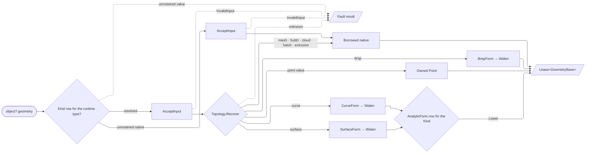

# [RASM_DOMAIN_NORMALIZATION]

`Normalization` owns the Rhino-kind taxonomy and the receiver-local coercion surface every polymorphic geometry ingress crosses before an operation runs — resolving nominal and analytic identity, converting any admitted kernel value into an ownership-bearing `Lease<GeometryBase>`, deriving bounds, and projecting the typed coercion table. It is the kernel's one erased-geometry conversion owner, so no consumer enumerates that space locally; type-level admission, value validity, and readiness answer to their own owners.

`TopologyProjection` folds disposable component-provenance geometry — typed projection, ownership severing, transfer detection, and batch disposal — behind one `IValidityEvidence`-registered carrier. `Kind` is the exemplar instantiation of `Domain/validation`'s `CapabilitySet<TCapability>` column: one declared membership set per row, every type roster and every capability predicate derived from it. `GeometryRequest` stays the `Analysis/query` request algebra; readiness composes `Requirement`, evaluation the form leases, and host consumers `GeometryForm`.

## [01]-[INDEX]

- [02]-[TAXONOMY]: `Topology`, capability-columned `Kind`, `Capability` over the `ICapability` vocabulary floor, and analytic `CurveForm` own the closed kind vocabulary and its admission web.
- [03]-[COERCION]: `AnalyticForm` owns the one analytic correspondence; `Normalization` owns kind inference, geometry-form leasing, bounds, and typed coercion; `TopologyProjection` owns component-aware transfer and disposal.
- [04]-[DENSITY_BAR]: one owner per axis.

## [02]-[TAXONOMY]

- Owner: `Topology` is the topological-stratum discriminant AND the form-recovery row — each stratum answers once how a value of that stratum becomes a `Lease<GeometryBase>`, so `GeometryForm` is a row read and a new stratum is one row that cannot compile without its recovery. `Kind` binds each Rhino `Type` to a `Topology`, declares its capability membership, names its `Rhino.DocObjects.ObjectType` where one exists, and answers its own bounds. `Capability` is the vocabulary those memberships draw from and the type-level admission predicate over erased ingress; `CurveForm` carries analytic classification with case-specific evidence over one universal closedness column.
- Owner: `Kind.Capabilities` is the ONE membership authority — the `ByType`/`ByObjectType` indexes and every `Capability` row's kind arm derive from it through `Items`, and analytic coercion reads the `AnalyticForm.Lane` correspondence directly. Parallel `FrozenSet<Type>` rosters beside the rows are the deleted form: they admit a row edit that nothing breaks.
- Entry: `Kind.Of` resolves type identity, `Capability.Admits` type admission, `Capability.Coercible`/`Capability.Native` the pairwise relations, and `Topology.Recover` the stratum form recovery.
- Cases: `Capability` rows split by what answers them — membership rows (`CurveForm`, `SurfaceForm`, `BrepForm`, `Bound`, `OrientedBound`, `ReadVertices`, `ReadControlPoints`, `ReadEdges`) are declared on `Kind` and read through the set; composite rows (`Form`, `DecomposeFaces`, `EvaluateTopology`, `Closest`, `ClosestNormal`, `ClosestTangent`, `ClosestFrame`, `SignedDistance`) are unions over sibling rows and carry their reach as a delegate. Both answer through one `Admits` body.
- Auto: `Universal` holds erased `object`/`GeometryBase` ingress open until the runtime value refines it, and `SignedDistance` is the one row that does NOT — a signed answer needs a solid whose inside is decidable, which no erased ingress promises. Keyless composite reach binds through predicate delegates, so composite admission reads settled behavior free of smart-enum initialization-order coupling.
- Growth: a Rhino geometry kind lands as a `Kind` row with its capability memberships, its native object type, and its bounds; a type-level capability as a `Capability` row with its natives and reach; an analytic classification as a `CurveForm` case; a topological stratum as a `Topology` row with its recovery.
- Boundary: `ByObjectType` is the sole `Rhino.DocObjects.ObjectType` conversion; `Capability` answers type admission, `Acceptance` value validity, and `Requirement` readiness.
- Packages: Thinktecture.Runtime.Extensions carries the row vocabularies and their delegate columns; BCL frozen collections carry the derived indexes; `Domain/validation` carries `ICapability`/`CapabilitySet`.

```csharp
// --- [IMPORTS] -------------------------------------------------------------------------
using System;
using System.Collections.Frozen;
using System.Linq;
using LanguageExt;
using Rhino.Geometry;
using Thinktecture;
using static LanguageExt.Prelude;
using ObjectType = Rhino.DocObjects.ObjectType;
using RhinoPoint = Rhino.Geometry.Point;

namespace Rasm.Domain;

// --- [TYPES] ---------------------------------------------------------------------------
[SmartEnum<int>]
public sealed partial class Topology {
    public static readonly Topology Point = new(key: 0, recover: static (source, key) => source switch {
        Point3d point => Fin.Succ<Lease<GeometryBase>>(new Lease<GeometryBase>.Owned(Value: new RhinoPoint(location: point))),
        _ => Normalization.BorrowedGeometry(source: source),
    });
    public static readonly Topology Curve = new(key: 1, recover: static (source, key) => Normalization.CurveForm(source: source).Map(static lease => Normalization.Widen(lease: lease)));
    public static readonly Topology Surface = new(key: 2, recover: static (source, key) => Normalization.SurfaceForm(source: source).Map(static lease => Normalization.Widen(lease: lease)));
    public static readonly Topology Brep = new(key: 3, recover: static (source, key) => Normalization.BrepForm(source: source).Map(static lease => Normalization.Widen(lease: lease)));
    public static readonly Topology Mesh = new(key: 4, recover: static (source, key) => Normalization.BorrowedGeometry(source: source));
    public static readonly Topology SubD = new(key: 5, recover: static (source, key) => Normalization.BorrowedGeometry(source: source));
    public static readonly Topology PointCloud = new(key: 6, recover: static (source, key) => Normalization.BorrowedGeometry(source: source));
    public static readonly Topology Hatch = new(key: 7, recover: static (source, key) => Normalization.BorrowedGeometry(source: source));
    public static readonly Topology Extrusion = new(key: 8, recover: static (source, key) => Normalization.BorrowedGeometry(source: source));
    [UseDelegateFromConstructor]
    internal partial Fin<Lease<GeometryBase>> Recover(object source);
}

[SmartEnum<int>]
public sealed partial class Kind {
    public static readonly Kind Point = new(0, typeof(Point3d), Topology.Point,
        CapabilitySet<Capability>.Of(Capability.Bound, Capability.OrientedBound, Capability.ReadVertices), Some(ObjectType.Point),
        static (value, key) => value switch {
            Point3d point => Fin.Succ(new BoundingBox(point, point)),
            RhinoPoint native => Fin.Succ(native.GetBoundingBox(accurate: true)),
            _ => Fin.Fail<BoundingBox>(new KernelFault.InvalidInput()),
        });
    public static readonly Kind Line = new(1, typeof(Line), Topology.Curve,
        CapabilitySet<Capability>.Of(Capability.Bound, Capability.OrientedBound, Capability.ReadVertices, Capability.ReadControlPoints, Capability.ReadEdges, Capability.CurveForm), Option<ObjectType>.None,
        static (value, _) => Fin.Succ(((Line)value).BoundingBox));
    public static readonly Kind Polyline = new(2, typeof(Polyline), Topology.Curve,
        CapabilitySet<Capability>.Of(Capability.Bound, Capability.OrientedBound, Capability.ReadVertices, Capability.ReadControlPoints, Capability.ReadEdges, Capability.CurveForm), Option<ObjectType>.None,
        static (value, _) => Fin.Succ(((Polyline)value).BoundingBox));
    public static readonly Kind Circle = new(3, typeof(Circle), Topology.Curve,
        CapabilitySet<Capability>.Of(Capability.Bound, Capability.OrientedBound, Capability.ReadControlPoints, Capability.CurveForm), Option<ObjectType>.None,
        static (value, _) => Fin.Succ(((Circle)value).BoundingBox));
    public static readonly Kind Arc = new(4, typeof(Arc), Topology.Curve,
        CapabilitySet<Capability>.Of(Capability.Bound, Capability.OrientedBound, Capability.ReadVertices, Capability.ReadControlPoints, Capability.CurveForm), Option<ObjectType>.None,
        static (value, _) => Fin.Succ(((Arc)value).BoundingBox()));
    public static readonly Kind Ellipse = new(5, typeof(Ellipse), Topology.Curve,
        CapabilitySet<Capability>.Of(Capability.Bound, Capability.OrientedBound, Capability.ReadControlPoints, Capability.CurveForm), Option<ObjectType>.None,
        static (value, key) => Normalization.CurveForm(source: value).Map(static lease => lease.Use(static curve => curve.GetBoundingBox(accurate: true))));
    public static readonly Kind Curve = new(6, typeof(Curve), Topology.Curve,
        CapabilitySet<Capability>.Of(Capability.Bound, Capability.OrientedBound, Capability.ReadVertices, Capability.ReadControlPoints, Capability.CurveForm), Some(ObjectType.Curve), NativeBounds);
    public static readonly Kind Surface = new(7, typeof(Surface), Topology.Surface,
        CapabilitySet<Capability>.Of(Capability.Bound, Capability.OrientedBound, Capability.ReadControlPoints, Capability.SurfaceForm, Capability.BrepForm), Some(ObjectType.Surface), NativeBounds);
    public static readonly Kind Plane = new(8, typeof(Plane), Topology.Surface,
        CapabilitySet<Capability>.Of(Capability.ReadControlPoints, Capability.SurfaceForm), Option<ObjectType>.None,
        static (_, key) => Fin.Fail<BoundingBox>(new KernelFault.Unsupported(InputType: typeof(Plane), OutputType: typeof(BoundingBox))));
    public static readonly Kind Sphere = new(9, typeof(Sphere), Topology.Surface,
        CapabilitySet<Capability>.Of(Capability.Bound, Capability.ReadControlPoints, Capability.SurfaceForm, Capability.BrepForm), Option<ObjectType>.None,
        static (value, _) => Fin.Succ(((Sphere)value).BoundingBox));
    public static readonly Kind Cylinder = new(10, typeof(Cylinder), Topology.Surface,
        CapabilitySet<Capability>.Of(Capability.Bound, Capability.OrientedBound, Capability.ReadControlPoints, Capability.SurfaceForm, Capability.BrepForm), Option<ObjectType>.None, SolidBounds);
    public static readonly Kind Cone = new(11, typeof(Cone), Topology.Surface,
        CapabilitySet<Capability>.Of(Capability.Bound, Capability.OrientedBound, Capability.ReadControlPoints, Capability.SurfaceForm, Capability.BrepForm), Option<ObjectType>.None, SolidBounds);
    public static readonly Kind Torus = new(12, typeof(Torus), Topology.Surface,
        CapabilitySet<Capability>.Of(Capability.Bound, Capability.OrientedBound, Capability.ReadControlPoints, Capability.SurfaceForm, Capability.BrepForm), Option<ObjectType>.None, SolidBounds);
    public static readonly Kind Brep = new(13, typeof(Brep), Topology.Brep,
        CapabilitySet<Capability>.Of(Capability.Bound, Capability.OrientedBound, Capability.ReadVertices, Capability.ReadControlPoints, Capability.ReadEdges, Capability.BrepForm), Some(ObjectType.Brep), NativeBounds);
    public static readonly Kind Box = new(14, typeof(Box), Topology.Brep,
        CapabilitySet<Capability>.Of(Capability.Bound, Capability.OrientedBound, Capability.ReadVertices, Capability.ReadControlPoints, Capability.ReadEdges, Capability.BrepForm), Option<ObjectType>.None,
        static (value, _) => Fin.Succ(((Box)value).BoundingBox));
    public static readonly Kind BoundingBox = new(15, typeof(BoundingBox), Topology.Brep,
        CapabilitySet<Capability>.Of(Capability.Bound, Capability.OrientedBound, Capability.ReadVertices, Capability.ReadControlPoints, Capability.ReadEdges, Capability.BrepForm), Option<ObjectType>.None,
        static (value, _) => Fin.Succ((BoundingBox)value));
    public static readonly Kind Mesh = new(16, typeof(Mesh), Topology.Mesh,
        CapabilitySet<Capability>.Of(Capability.Bound, Capability.OrientedBound, Capability.ReadVertices, Capability.ReadEdges), Some(ObjectType.Mesh), NativeBounds);
    public static readonly Kind SubD = new(17, typeof(SubD), Topology.SubD,
        CapabilitySet<Capability>.Of(Capability.Bound, Capability.OrientedBound, Capability.ReadVertices, Capability.ReadEdges, Capability.BrepForm), Some(ObjectType.SubD), NativeBounds);
    public static readonly Kind PointCloud = new(18, typeof(PointCloud), Topology.PointCloud,
        CapabilitySet<Capability>.Of(Capability.Bound, Capability.OrientedBound, Capability.ReadVertices), Some(ObjectType.PointSet), NativeBounds);
    public static readonly Kind Extrusion = new(19, typeof(Extrusion), Topology.Extrusion,
        CapabilitySet<Capability>.Of(Capability.Bound, Capability.OrientedBound, Capability.ReadVertices, Capability.BrepForm), Some(ObjectType.Extrusion), NativeBounds);
    public static readonly Kind Hatch = new(20, typeof(Hatch), Topology.Hatch,
        CapabilitySet<Capability>.Of(Capability.Bound, Capability.OrientedBound), Some(ObjectType.Hatch), NativeBounds);
    private static Fin<BoundingBox> NativeBounds(object value) =>
        Fin.Succ(((GeometryBase)value).GetBoundingBox(accurate: true));
    private static Fin<BoundingBox> SolidBounds(object value) =>
        Normalization.BrepForm(source: value).Map(static lease => lease.Use(static brep => brep.GetBoundingBox(accurate: true)));
    private static readonly Lazy<FrozenDictionary<Type, Kind>> ByType = new(static () => Items.ToFrozenDictionary(static row => row.Type));
    internal static readonly Lazy<FrozenDictionary<ObjectType, Kind>> ByObjectType =
        new(static () => toSeq(Items).Choose(static row => row.Native.Map(native => (Native: native, Row: row))).ToFrozenDictionary(static pair => pair.Native, static pair => pair.Row));
    public Type Type { get; }
    public Topology Topology { get; }
    internal CapabilitySet<Capability> Capabilities { get; }
    internal Option<ObjectType> Native { get; }
    [UseDelegateFromConstructor]
    internal partial Fin<BoundingBox> Bounds(object value);
    internal bool CanCoerceTo(Type target) =>
        target.IsAssignableFrom(c: Type)
        || (target == typeof(Box) && Type == typeof(Brep))
        || (target == typeof(Curve) && Capabilities.Admits(Capability.CurveForm))
        || (Type == typeof(Curve) && AnalyticForm.Lane(topology: Topology.Curve)
            .Exists(row => row.Kind.Type == target))
        || ((Type == typeof(Brep) || Type == typeof(Surface)) && AnalyticForm.Lane(topology: Topology.Surface)
            .Exists(row => row.Kind.Type == target))
        || (target == typeof(Brep) && Capabilities.Admits(Capability.BrepForm));
    public static Option<Kind> Of(Type type) {
        ArgumentNullException.ThrowIfNull(argument: type);
        return type == typeof(RhinoPoint)
            ? Some(Point)
            : Optional(ByType.Value.GetValueOrDefault(key: type)) | InheritsBase(type: type).Bind(static seat => Optional(ByType.Value.GetValueOrDefault(key: seat)));
    }
    private static Option<Type> InheritsBase(Type type) =>
        Optional(type.BaseType).Bind(static seat => ByType.Value.ContainsKey(key: seat) ? Some(seat) : InheritsBase(type: seat));
}

[SmartEnum<string>]
[KeyMemberEqualityComparer<ComparerAccessors.StringOrdinal, string>]
internal sealed partial class Capability : ICapability<Capability> {
    public static readonly Capability CurveForm = new("curve-form", Set(typeof(Curve)), Universal);
    public static readonly Capability SurfaceForm = new("surface-form", Set(typeof(Surface), typeof(Brep)), Universal);
    public static readonly Capability BrepForm = new("brep-form", Set(typeof(Brep)), Universal);
    public static readonly Capability Form = new("form", FrozenSet<Type>.Empty,
        static type => Universal(type: type) || CurveForm.Admits(type: type) || SurfaceForm.Admits(type: type) || Coercible(source: type, target: typeof(Brep)));
    public static readonly Capability Bound = new("bound", Set(typeof(GeometryBase)), Universal);
    public static readonly Capability OrientedBound = new("oriented-bound", Set(typeof(GeometryBase)), Universal);
    public static readonly Capability ReadVertices = new("read-vertices", FrozenSet<Type>.Empty, Universal);
    public static readonly Capability ReadControlPoints = new("read-control-points", FrozenSet<Type>.Empty, Universal);
    public static readonly Capability ReadEdges = new("read-edges", FrozenSet<Type>.Empty, Universal);
    public static readonly Capability DecomposeFaces = new("decompose-faces", Set(typeof(BrepFace)),
        static type => Universal(type: type) || Kind.Of(type: type).Exists(static kind => kind.CanCoerceTo(target: typeof(Brep))));
    public static readonly Capability EvaluateTopology = new("evaluate-topology", Set(typeof(Mesh), typeof(Brep)),
        static type => Universal(type: type) || Kind.Of(type: type).Exists(static kind =>
            kind.Topology.Equals(Topology.Mesh) || kind.Topology.Equals(Topology.Brep) || kind.CanCoerceTo(target: typeof(Brep))));
    public static readonly Capability Closest = new("closest", Set(typeof(RhinoPoint), typeof(PointCloud), typeof(Brep), typeof(Mesh)),
        static type => Universal(type: type) || type == typeof(Point3d) || type == typeof(Box) || type == typeof(BoundingBox)
            || CurveForm.Admits(type: type) || SurfaceForm.Admits(type: type));
    public static readonly Capability ClosestNormal = new("closest-normal", Set(typeof(PointCloud), typeof(BrepFace), typeof(Brep), typeof(Mesh)),
        static type => Universal(type: type) || SurfaceForm.Admits(type: type));
    public static readonly Capability ClosestTangent = new("closest-tangent", Set(typeof(Brep)),
        static type => Universal(type: type) || CurveForm.Admits(type: type));
    public static readonly Capability ClosestFrame = new("closest-frame", Set(typeof(BrepFace), typeof(Mesh)),
        static type => Universal(type: type) || ClosestTangent.Admits(type: type) || SurfaceForm.Admits(type: type));
    public static readonly Capability SignedDistance = new("signed-distance", FrozenSet<Type>.Empty,
        static type => type == typeof(Plane) || type == typeof(Sphere) || type == typeof(Box) || type == typeof(BoundingBox) || ClosestNormal.Admits(type: type));
    private FrozenSet<Type> Natives { get; }
    [UseDelegateFromConstructor]
    private partial bool Reach(Type type);
    internal bool Admits(Type type) =>
        Natives.Any(native => native.IsAssignableFrom(c: type))
        || Reach(type: type)
        || Kind.Of(type: type).Exists(kind => kind.Capabilities.Admits(capability: this));
    internal static bool Universal(Type type) => type == typeof(object) || type == typeof(GeometryBase);
    internal static bool Coercible(Type source, Type target) =>
        Universal(type: source) || Kind.Of(type: source).Map(kind => kind.CanCoerceTo(target: target)).IfNone(target.IsAssignableFrom(c: source));
    internal static bool Native(Type type, Topology topology, params ReadOnlySpan<(Topology Topology, Type Native)> candidates) {
        foreach ((Topology candidate, Type native) in candidates) {
            if (candidate.Equals(topology) && native.IsAssignableFrom(c: type)) { return true; }
        }
        return false;
    }
    private static FrozenSet<Type> Set(params ReadOnlySpan<Type> natives) => natives.ToArray().ToFrozenSet();
}

[Union]
public partial record CurveForm(bool IsClosed) {
    public sealed record LineCase(Line Value) : CurveForm(IsClosed: false);
    public sealed record CircleCase(Circle Value) : CurveForm(IsClosed: true);
    public sealed record ArcCase(Arc Value) : CurveForm(IsClosed: Value.IsCircle);

    public sealed record EllipseCase(Ellipse Value) : CurveForm(IsClosed: true);
    public sealed record PolylineCase(Polyline Value, bool IsClosed) : CurveForm(IsClosed: IsClosed);
    public sealed record NurbsCase(int Degree, bool IsClosed, bool IsPlanar, bool IsPeriodic, int SpanCount, int Dimension) : CurveForm(IsClosed: IsClosed);
}
```

## [03]-[COERCION]

- Owner: `AnalyticForm` is the ONE analytic correspondence — each row binds a `Kind` to its forward `Lower` (primitive to its lane-canonical native) and its inverse `Raise` (native back to the primitive under a tolerance). Declaration order IS the inference order, so recovery, classification, and kind inference read one roster and a new analytic primitive is one row.
- Owner: `Normalization` is the internal coercion owner consumed across the friend-assembly boundary; its `extension(object? geometry)` block resolves kind, leases the geometry vocabulary as `Lease<GeometryBase>`, derives bounds, and projects typed coercions. `CurveForm`, `SurfaceForm`, and `BrepForm` are the three lane entries — each borrows its own native, lowers its lane's analytic rows, and adds only the host members its lane alone publishes. `TopologyProjection` owns component provenance, typed projection, ownership severing, transfer detection, and disposal.
- Entry: `geometry.KindOf`, `geometry.GeometryForm`, `geometry.BoundsOf`, and `geometry.CoerceTo<TTarget>` form the receiver-local ingress; every refusal stays `Fin`-typed as `InvalidInput` or `Unsupported`.
- Auto: `KindOf` resolves analytic identity before native and declared identity; `GeometryForm` reconstructs topology from the source type and reads the stratum's own recovery row, so callers supply no kind, context, ownership, or conversion-mode knob. Kind resolution runs FIRST and the topology rows carry natives and value primitives alike, so no stratum declares a refusal a shape test above it already answered; an unrostered type fails as `Unsupported` before the validity oracle relabels it unless it is native, both admitted paths pass `Acceptance` before conversion, native reference geometry stays borrowed, and every admitted value primitive becomes owned through its form recovery. `BoundsOf` reads the `Kind` row's own bounds answer, so the twelve-arm shape ladder and its unreachable tail are gone. `CoerceTo<TTarget>` type-checks recovered primitives, `BrepForm` derives ownership from reference identity, and `TopologyProjection` ties its face bridge to carrier disposal.
- Law: every `TopologyProjection` factory validates — a component-provenance carrier that can mint itself invalid beside an `IValidityEvidence` conformance is the deleted form, so the whole family returns `Fin<TopologyProjection>` and `IsValid` is proved once at construction.
- Law: `Project` releases inside the exception funnel — the projection runs through `Try.lift`, so a throwing projector still reaches the release fold and the non-transferred duplicates never leak.
- Exemption: RhinoCommon publishes no shared to-brep member across its value structs, so `BrepForm`'s per-shape table is the named host-limit exemption; the analytic half of it composes `AnalyticForm.Box` rather than re-spelling the conversion.
- Packages: Thinktecture.Runtime.Extensions (`[SmartEnum]` rows with `[UseDelegateFromConstructor]` columns), Generator.Equals (`[Equatable]`/`[IgnoreEquality]` on the projection carrier), RhinoCommon geometry members, LanguageExt.Core types.
- Growth: a geometry kind lands in `Kind` and the relevant form table, an analytic primitive as one `AnalyticForm` row carrying both directions, a projection source in `TopologyProjection` with its validity law.
- Boundary: `GeometryRequest` stays in `Analysis/query`, evaluation and sampling in `Domain/evaluation`, and readiness in `Domain/validation`.

```csharp
// --- [IMPORTS] -------------------------------------------------------------------------
using System;
using Generator.Equals;
using LanguageExt;
using Rhino.Geometry;
using Thinktecture;
using static LanguageExt.Prelude;
using RhinoPoint = Rhino.Geometry.Point;

namespace Rasm.Domain;

// --- [TYPES] ---------------------------------------------------------------------------
[SmartEnum]
internal sealed partial class AnalyticForm {
    public static readonly AnalyticForm Line = new(
        kind: Kind.Line,
        lower: static (value, _) => Fin.Succ<GeometryBase>(new LineCurve(line: (Line)value)),
        raise: static (native, context) => native is Curve curve && curve.IsLinear(tolerance: context.Absolute.Value)
            ? Some((object)new Line(from: curve.PointAtStart, to: curve.PointAtEnd))
            : Option<object>.None);
    public static readonly AnalyticForm Circle = new(
        kind: Kind.Circle,
        lower: static (value, _) => Fin.Succ<GeometryBase>(new ArcCurve(circle: (Circle)value)),
        raise: static (native, context) => native is Curve curve && curve.TryGetCircle(circle: out Circle value, tolerance: context.Absolute.Value) ? Some((object)value) : Option<object>.None);
    public static readonly AnalyticForm Arc = new(
        kind: Kind.Arc,
        lower: static (value, _) => Fin.Succ<GeometryBase>(new ArcCurve(arc: (Arc)value)),
        raise: static (native, context) => native is Curve curve && curve.TryGetArc(arc: out Arc value, tolerance: context.Absolute.Value) ? Some((object)value) : Option<object>.None);
    public static readonly AnalyticForm Ellipse = new(
        kind: Kind.Ellipse,
        lower: static (value, key) => Optional(((Ellipse)value).ToNurbsCurve()).ToFin(new KernelFault.InvalidResult()).Map(static curve => (GeometryBase)curve),
        raise: static (native, context) => native is Curve curve && curve.TryGetEllipse(ellipse: out Ellipse value, tolerance: context.Absolute.Value) ? Some((object)value) : Option<object>.None);
    public static readonly AnalyticForm Polyline = new(
        kind: Kind.Polyline,
        lower: static (value, key) => Optional(((Polyline)value).ToPolylineCurve()).ToFin(new KernelFault.InvalidResult()).Map(static curve => (GeometryBase)curve),
        raise: static (native, _) => native is Curve curve && curve.TryGetPolyline(polyline: out Polyline value) ? Some((object)value) : Option<object>.None);
    public static readonly AnalyticForm Box = new(
        kind: Kind.Box,
        lower: static (value, key) => Optional(((Box)value).ToBrep()).ToFin(new KernelFault.InvalidResult()).Map(static brep => (GeometryBase)brep),
        raise: static (native, context) => native is Brep brep
            && brep.IsBox(tolerance: context.Absolute.Value)
            && brep.Faces[0].UnderlyingSurface().TryGetPlane(plane: out Plane plane, tolerance: context.Absolute.Value)
            && new Box(plane: plane, geometry: brep) is { IsValid: true } value
            ? Some((object)value)
            : Option<object>.None);
    public static readonly AnalyticForm Plane = new(
        kind: Kind.Plane,
        lower: static (value, _) => Fin.Succ<GeometryBase>(new PlaneSurface(plane: (Plane)value)),
        raise: static (native, context) => Face(native: native).Bind(surface =>
            surface.TryGetPlane(plane: out Plane value, tolerance: context.Absolute.Value) ? Some((object)value) : Option<object>.None));
    public static readonly AnalyticForm Sphere = new(
        kind: Kind.Sphere,
        lower: static (value, key) => Optional(((Sphere)value).ToNurbsSurface()).ToFin(new KernelFault.InvalidResult()).Map(static surface => (GeometryBase)surface),
        raise: static (native, context) => Face(native: native).Bind(surface =>
            surface.TryGetSphere(sphere: out Sphere value, tolerance: context.Absolute.Value) ? Some((object)value) : Option<object>.None));
    public static readonly AnalyticForm Cylinder = new(
        kind: Kind.Cylinder,
        lower: static (value, key) => Optional(((Cylinder)value).ToNurbsSurface()).ToFin(new KernelFault.InvalidResult()).Map(static surface => (GeometryBase)surface),
        raise: static (native, context) => Face(native: native).Bind(surface =>
            surface.TryGetFiniteCylinder(cylinder: out Cylinder value, tolerance: context.Absolute.Value) ? Some((object)value) : Option<object>.None));
    public static readonly AnalyticForm Cone = new(
        kind: Kind.Cone,
        lower: static (value, key) => Optional(((Cone)value).ToNurbsSurface()).ToFin(new KernelFault.InvalidResult()).Map(static surface => (GeometryBase)surface),
        raise: static (native, context) => Face(native: native).Bind(surface =>
            surface.TryGetCone(cone: out Cone value, tolerance: context.Absolute.Value) ? Some((object)value) : Option<object>.None));
    public static readonly AnalyticForm Torus = new(
        kind: Kind.Torus,
        lower: static (value, key) => Optional(((Torus)value).ToNurbsSurface()).ToFin(new KernelFault.InvalidResult()).Map(static surface => (GeometryBase)surface),
        raise: static (native, context) => Face(native: native).Bind(surface =>
            surface.TryGetTorus(torus: out Torus value, tolerance: context.Absolute.Value) ? Some((object)value) : Option<object>.None));
    internal Kind Kind { get; }
    [UseDelegateFromConstructor]
    internal partial Fin<GeometryBase> Lower(object value);
    [UseDelegateFromConstructor]
    internal partial Option<object> Raise(GeometryBase native, Context context);
    internal static Seq<AnalyticForm> Lane(Topology topology) => toSeq(Items).Filter(row => row.Kind.Topology.Equals(topology));
    internal static Option<AnalyticForm> For(Kind kind) => toSeq(Items).Find(row => row.Kind.Equals(kind));
    private static Option<Surface> Face(GeometryBase native) =>
        native switch {
            Brep { IsSurface: true, Faces.Count: > 0 } brep => Some((Surface)brep.Faces[0]),
            Surface surface => Some(surface),
            _ => Option<Surface>.None,
        };
}

// --- [MODELS] --------------------------------------------------------------------------
[Equatable]
public sealed partial record TopologyProjection : IValidityEvidence, IDisposable {
    private readonly Lease<GeometryBase> value;
    private readonly bool detachedSingleFace;
    [IgnoreEquality]
    private Option<Lease<Brep>> faceBrep;
    private TopologyProjection(Lease<GeometryBase> value, ComponentIndex source, bool reversed, bool detachedSingleFace) {
        this.value = value;
        this.detachedSingleFace = detachedSingleFace;
        Source = source;
        Reversed = reversed;
    }
    public static Fin<TopologyProjection> Of(Curve? curve, ComponentIndex source) =>
        Optional(curve).ToFin(new KernelFault.InvalidInput()).Bind(native =>
            Admitted(value: new Lease<GeometryBase>.Owned(Value: native), source: source, reversed: false, detachedSingleFace: false));
    public static Fin<TopologyProjection> Of(BrepFace? face) =>
        Optional(face).ToFin(new KernelFault.InvalidInput()).Bind(native => Admitted(
            value: new Lease<GeometryBase>.Borrowed(Value: native),
            source: new ComponentIndex(type: ComponentIndexType.BrepFace, index: native.FaceIndex),
            reversed: native.OrientationIsReversed,
            detachedSingleFace: false));
    public static Fin<TopologyProjection> Of(Mesh? mesh, ComponentIndex source) =>
        Optional(mesh).ToFin(new KernelFault.InvalidInput()).Bind(native =>
            Admitted(value: new Lease<GeometryBase>.Borrowed(Value: native), source: source, reversed: false, detachedSingleFace: false));
    public static Fin<TopologyProjection> Of(Lease<GeometryBase>? geometry, ComponentIndex source, bool reversed = false) =>
        Optional(geometry).ToFin(new KernelFault.InvalidInput()).Bind(lease =>
            Admitted(value: lease, source: source, reversed: reversed, detachedSingleFace: false));
    private static Fin<TopologyProjection> Admitted(Lease<GeometryBase> value, ComponentIndex source, bool reversed, bool detachedSingleFace) {
        TopologyProjection projection = new(value: value, source: source, reversed: reversed, detachedSingleFace: detachedSingleFace);
        return Acceptance.Input(value: projection).Rollback(projection);
    }
    public GeometryBase Value => value.Resource;
    public ComponentIndex Source { get; }
    public bool Reversed { get; }
    public bool IsValid =>
        (Value, Source) switch {
            (Curve { IsValid: true }, _) => true,
            (Brep brep, { ComponentIndexType: ComponentIndexType.BrepFace, Index: int f }) => brep.IsValid && f >= 0 && (f < brep.Faces.Count || (detachedSingleFace && brep.Faces.Count == 1)),
            (BrepFace face, { ComponentIndexType: ComponentIndexType.BrepFace, Index: int f }) => face.IsValid && f >= 0 && f == face.FaceIndex,
            (Mesh mesh, { ComponentIndexType: ComponentIndexType.MeshFace, Index: int f }) => mesh.IsValid && f >= 0 && f < mesh.Faces.Count,
            (Mesh mesh, { ComponentIndexType: ComponentIndexType.MeshNgon, Index: int n }) => mesh.IsValid && n >= 0 && n < mesh.Ngons.Count,
            (GeometryBase { IsValid: true }, { ComponentIndexType: not ComponentIndexType.InvalidType }) => true,
            _ => false,
        };
    public Option<T> As<T>() where T : class =>
        (Value, Source) switch {
            (T match, _) => Some(match),
            (Brep { Faces.Count: > 0 } brep, { ComponentIndexType: ComponentIndexType.BrepFace, Index: int index }) when typeof(T) == typeof(BrepFace) => index switch {
                >= 0 when index < brep.Faces.Count => Some((T)(object)brep.Faces[index]),
                >= 0 when detachedSingleFace && brep.Faces.Count == 1 => Some((T)(object)brep.Faces[0]),
                _ => Option<T>.None,
            },
            (BrepFace face, _) when typeof(T) == typeof(Brep) => FaceBrep(face: face).Map(static brep => (T)(object)brep),
            _ => Option<T>.None,
        };
    public Fin<T> As<T>() where T : class =>
        As<T>().ToFin(Fail: new KernelFault.Unsupported(InputType: Value.GetType(), OutputType: typeof(T)));
    public Fin<TopologyProjection> DetachFrom(GeometryBase source) {
        ArgumentNullException.ThrowIfNull(argument: source);
        return (Value, source) switch {
            (BrepFace face, _) when ReferenceEquals(objA: face.Brep, objB: source) => Admitted(
                value: new Lease<GeometryBase>.Owned(Value: face.DuplicateFace(duplicateMeshes: false)),
                source: new ComponentIndex(type: ComponentIndexType.BrepFace, index: face.FaceIndex),
                reversed: face.OrientationIsReversed,
                detachedSingleFace: true),
            (Mesh mesh, Mesh owner) when ReferenceEquals(objA: mesh, objB: owner) =>
                Admitted(value: new Lease<GeometryBase>.Owned(Value: mesh.DuplicateMesh()), source: Source, reversed: Reversed, detachedSingleFace: false),
            (GeometryBase shared, _) when ReferenceEquals(objA: shared, objB: source) =>
                Admitted(value: new Lease<GeometryBase>.Owned(Value: shared.Duplicate()), source: Source, reversed: Reversed, detachedSingleFace: false),
            _ => Fin.Succ(this),
        };
    }
    private bool Transfers(object? output) =>
        output switch {
            TopologyProjection projection => ReferenceEquals(objA: Value, objB: projection.Value) && Source.Equals(projection.Source),
            GeometryBase geometry => ReferenceEquals(objA: Value, objB: geometry)
                || faceBrep.Exists(held => ReferenceEquals(objA: held.Resource, objB: geometry))
                || (Value, geometry) switch {
                    (Brep brep, BrepFace face) => ReferenceEquals(objA: brep, objB: face.Brep),
                    (BrepFace face, Brep brep) => ReferenceEquals(objA: face.Brep, objB: brep),
                    (BrepFace source, BrepFace face) => ReferenceEquals(objA: source.Brep, objB: face.Brep),
                    _ => false,
                },
            _ => false,
        };
    public void Dispose() {
        _ = value.Dispose();
        _ = faceBrep.Iter(static owned => owned.Dispose());
    }
    private Option<Brep> FaceBrep(BrepFace face) {
        if (faceBrep is { IsSome: true, Case: Lease<Brep> held }) { return Some(held.Resource); }
        faceBrep = Optional(face.DuplicateFace(duplicateMeshes: false)).Map(static brep => (Lease<Brep>)new Lease<Brep>.Owned(Value: brep));
        return faceBrep.Map(static lease => lease.Resource);
    }
    internal static Fin<Seq<TValue>> Project<TValue>(Seq<TopologyProjection> all, Seq<TopologyProjection> chosen, Func<Seq<TopologyProjection>, Fin<Seq<TValue>>> project) {
        Fin<Seq<TValue>> result = Try.lift(() => project(arg: chosen)).Run().Bind(static inner => inner);
        _ = all.Filter(item => !result.Exists(values => values.Exists(output => item.Transfers(output)))).Iter(static item => item.Dispose());
        return result;
    }
}

// --- [OPERATIONS] ----------------------------------------------------------------------
internal static class Normalization {
    extension(object? geometry) {
        public Fin<Kind> KindOf(Context context) {
            return Optional(geometry).ToFin(new KernelFault.InvalidInput()).Bind(g =>
                (InferredKind(geometry: g, context: context) | NativeKind(geometry: g) | Kind.Of(type: g.GetType()))
                .ToFin(new KernelFault.InvalidInput()));
        }
        public Fin<Lease<GeometryBase>> GeometryForm() =>
            Optional(geometry).ToFin(new KernelFault.InvalidInput()).Bind(source => Kind.Of(type: source.GetType()).Case switch {
                Kind kind => Acceptance.Input(value: source).Bind(value => kind.Topology.Recover(source: value)),
                _ => source is GeometryBase native
                    ? Acceptance.Input(value: native).Map(static admitted => (Lease<GeometryBase>)new Lease<GeometryBase>.Borrowed(Value: admitted))
                    : UnsupportedGeometry(source: source),
            });
        public Fin<BoundingBox> BoundsOf() =>
            Optional(geometry).ToFin(new KernelFault.InvalidInput()).Bind(source =>
                Acceptance.Input(value: source).Bind(admitted => Kind.Of(type: admitted.GetType()).Case switch {
                    Kind kind => kind.Bounds(value: admitted),
                    _ => admitted is GeometryBase native
                        ? Fin.Succ(native.GetBoundingBox(accurate: true))
                        : Fin.Fail<BoundingBox>(new KernelFault.Unsupported(InputType: admitted.GetType(), OutputType: typeof(BoundingBox))),
                }));
        public Fin<TTarget> CoerceTo<TTarget>(Context context) where TTarget : notnull =>
            Optional(geometry).ToFin(new KernelFault.InvalidInput()).Bind(s => s switch {
                TTarget target => Acceptance.Value(value: target),
                _ => Kind.Of(type: typeof(TTarget))
                    .Bind(kind => PrimitiveOf(kind: kind, source: s, context: context))
                    .Bind(static recovered => recovered is TTarget typed ? Some(typed) : Option<TTarget>.None)
                    .ToFin(new KernelFault.Unsupported(InputType: s.GetType(), OutputType: typeof(TTarget))),
            });
    }
    internal static Fin<Lease<Curve>> CurveForm(object? source) =>
        Optional(source).ToFin(new KernelFault.InvalidInput()).Bind(value => value switch {
            Curve curve => Fin.Succ<Lease<Curve>>(new Lease<Curve>.Borrowed(Value: curve)),
            _ => Owned<Curve>(lane: Topology.Curve, value: value),
        });
    internal static Fin<Lease<Surface>> SurfaceForm(object? source) =>
        Optional(source).ToFin(new KernelFault.InvalidInput()).Bind(value => value switch {
            Surface surface => Fin.Succ<Lease<Surface>>(new Lease<Surface>.Borrowed(Value: surface)),
            Brep { IsSurface: true, Faces.Count: > 0 } brep => Fin.Succ<Lease<Surface>>(new Lease<Surface>.Borrowed(Value: brep.Faces[0])),
            _ => Owned<Surface>(lane: Topology.Surface, value: value),
        });
    internal static Fin<Lease<Brep>> BrepForm(object? source) =>
        Optional(source).ToFin(new KernelFault.InvalidInput()).Bind(value => value switch {
            Brep brep => Fin.Succ<Lease<Brep>>(new Lease<Brep>.Borrowed(Value: brep)),
            GeometryBase { HasBrepForm: true } native => Optional(Brep.TryConvertBrep(geometry: native)).ToFin(new KernelFault.InvalidResult())
                .Map(brep => ReferenceEquals(objA: native, objB: brep) ? (Lease<Brep>)new Lease<Brep>.Borrowed(Value: brep) : new Lease<Brep>.Owned(Value: brep)),
            Box => AnalyticForm.Box.Lower(value: value).Bind(brep => Cast<Brep>(native: brep)),
            BoundingBox box => Optional(box.ToBrep()).ToFin(new KernelFault.InvalidResult()).Map(static brep => (Lease<Brep>)new Lease<Brep>.Owned(Value: brep)),
            Sphere sphere => Optional(sphere.ToBrep()).ToFin(new KernelFault.InvalidResult()).Map(static brep => (Lease<Brep>)new Lease<Brep>.Owned(Value: brep)),
            Cylinder cylinder => Optional(cylinder.ToBrep(capBottom: true, capTop: true)).ToFin(new KernelFault.InvalidResult()).Map(static brep => (Lease<Brep>)new Lease<Brep>.Owned(Value: brep)),
            Cone cone => Optional(cone.ToBrep(capBottom: true)).ToFin(new KernelFault.InvalidResult()).Map(static brep => (Lease<Brep>)new Lease<Brep>.Owned(Value: brep)),
            Torus torus => Optional(torus.ToBrep()).ToFin(new KernelFault.InvalidResult()).Map(static brep => (Lease<Brep>)new Lease<Brep>.Owned(Value: brep)),
            _ => Fin.Fail<Lease<Brep>>(new KernelFault.Unsupported(InputType: value.GetType(), OutputType: typeof(Brep))),
        });
    private static Fin<Lease<TNative>> Owned<TNative>(Topology lane, object value) where TNative : GeometryBase =>
        Kind.Of(type: value.GetType())
            .Filter(kind => kind.Topology.Equals(lane))
            .Bind(AnalyticForm.For)
            .ToFin(new KernelFault.Unsupported(InputType: value.GetType(), OutputType: typeof(TNative)))
            .Bind(row => row.Lower(value: value))
            .Bind(native => Cast<TNative>(native: native));
    private static Fin<Lease<TNative>> Cast<TNative>(GeometryBase native) where TNative : GeometryBase =>
        native is TNative typed
            ? Fin.Succ<Lease<TNative>>(new Lease<TNative>.Owned(Value: typed))
            : Fin.Fail<Lease<TNative>>(new KernelFault.Unsupported(InputType: native.GetType(), OutputType: typeof(TNative)));
    internal static Lease<GeometryBase> Widen<TGeometry>(Lease<TGeometry> lease) where TGeometry : GeometryBase =>
        lease.Switch(
            owned: static owned => (Lease<GeometryBase>)new Lease<GeometryBase>.Owned(Value: owned.Value),
            borrowed: static borrowed => (Lease<GeometryBase>)new Lease<GeometryBase>.Borrowed(Value: borrowed.Value));
    internal static Fin<Lease<GeometryBase>> BorrowedGeometry(object source) =>
        source is GeometryBase native
            ? Fin.Succ<Lease<GeometryBase>>(new Lease<GeometryBase>.Borrowed(Value: native))
            : UnsupportedGeometry(source: source);
    internal static Fin<Lease<GeometryBase>> UnsupportedGeometry(object source) =>
        Fin.Fail<Lease<GeometryBase>>(new KernelFault.Unsupported(InputType: source.GetType(), OutputType: typeof(GeometryBase)));
    internal static CurveForm CurveFormOf(Curve curve, Context context) =>
        AnalyticForm.Lane(topology: Topology.Curve)
            .Choose(row => row.Raise(native: curve, context: context))
            .Head
            .Bind(primitive => primitive switch {
                Line line => Some<CurveForm>(new CurveForm.LineCase(Value: line)),
                Circle circle => Some<CurveForm>(new CurveForm.CircleCase(Value: circle)),
                Arc arc => Some<CurveForm>(new CurveForm.ArcCase(Value: arc)),
                Ellipse ellipse => Some<CurveForm>(new CurveForm.EllipseCase(Value: ellipse)),
                Polyline polyline => Some<CurveForm>(new CurveForm.PolylineCase(Value: polyline, IsClosed: curve.IsClosed)),
                _ => Option<CurveForm>.None,
            })
            .IfNone(() => new CurveForm.NurbsCase(
                Degree: curve.Degree,
                IsClosed: curve.IsClosed,
                IsPlanar: curve.IsPlanar(tolerance: context.Absolute.Value),
                IsPeriodic: curve.IsPeriodic,
                SpanCount: curve.SpanCount,
                Dimension: curve.Dimension));
    internal static Option<object> PrimitiveOf(Kind kind, object source, Context context) =>
        (kind.Type, source) switch {
            (Type t, RhinoPoint point) when t == typeof(Point3d) => Some((object)point.Location),
            (Type t, object value) when t == typeof(Curve) => CurveForm(source: value).ToOption().Map(static lease => (object)lease.Resource),
            (Type t, object value) when t == typeof(Brep) => BrepForm(source: value).ToOption().Map(static lease => (object)lease.Resource),
            (_, GeometryBase native) => AnalyticForm.For(kind: kind).Bind(row => row.Raise(native: native, context: context)),
            _ => Option<object>.None,
        };
    private static Option<Kind> InferredKind(object geometry, Context context) =>
        geometry switch {
            Curve curve => Inferred(rows: AnalyticForm.Lane(topology: Topology.Curve), native: curve, context: context),
            Brep brep => Inferred(rows: AnalyticForm.Lane(topology: Topology.Brep) + AnalyticForm.Lane(topology: Topology.Surface), native: brep, context: context),
            Surface surface => Inferred(rows: AnalyticForm.Lane(topology: Topology.Surface), native: surface, context: context),
            _ => Option<Kind>.None,
        };
    private static Option<Kind> Inferred(Seq<AnalyticForm> rows, GeometryBase native, Context context) =>
        rows.Choose(row => row.Raise(native: native, context: context).Map(_ => row.Kind)).Head;
    private static Option<Kind> NativeKind(object geometry) =>
        geometry is GeometryBase native
            ? Optional(Kind.ByObjectType.Value.GetValueOrDefault(native.ObjectType)) | (native.HasBrepForm ? Some(Kind.Brep) : Option<Kind>.None)
            : Option<Kind>.None;
}
```



## [04]-[DENSITY_BAR]

One owner per axis; capability is a row, case, or set member, never a sibling surface or a bool column.

| [INDEX] | [OWNER]              | [SHAPE]                                    | [RESULT]                               |
| :-----: | :------------------- | :----------------------------------------- | :------------------------------------- |
|  [01]   | `Topology`           | `[SmartEnum<int>]` + recovery row          | `Fin<Lease<GeometryBase>>`             |
|  [02]   | `Kind`               | `[SmartEnum<int>]` + capability set column | `Kind.Of → Option<Kind>`               |
|  [03]   | `Capability`         | `[SmartEnum<string>]` `ICapability` row    | `Admits → bool`                        |
|  [04]   | `CurveForm`          | analytic `[Union]` over one closed column  | `CurveFormOf → CurveForm`              |
|  [05]   | `AnalyticForm`       | forward and inverse correspondence rows    | `Fin<GeometryBase>` / `Option<object>` |
|  [06]   | `Normalization`      | receiver ingress + three lane entries      | `Fin<T>` / `Fin<Lease<T>>`             |
|  [07]   | `TopologyProjection` | component-aware `IValidityEvidence` lease  | `Fin<TopologyProjection>` / `As<T>`    |

## [05]-[RESEARCH]

<!-- source-only: research row template:
[TOKEN]-[OPEN|BLOCKED]: <exact question>; <verification route>.
-->

(none)
