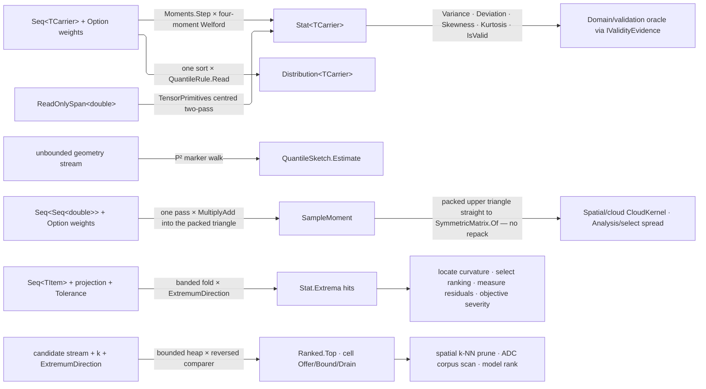

# [RASM_DOMAIN_STATS]

`Rasm.Domain` statistics is the kernel's evidence layer over scalar samples: every summary, extremum, quantile, and moment a host evaluation produces becomes one typed, admitted summary minted here. One four-moment Welford recurrence, one order-statistic reader, and one bounded-selection cell serve every carrier the branch measures in, so a folder holding durations, distances, or dimensioned quantities reads the same statistic — and keeps its best k of a stream — rather than re-spelling it.

Every summary composes the `Domain/results` `ValidityClaim` rows and re-enters the `Domain/validation` oracle through `Op.AcceptValue`, registering through the single `IValidityEvidence` arm. Bands arrive as `Domain/context` `Tolerance` values already gated by their lane, triangular addressing delegates to `Numerics/matrix` `SymmetricMatrix.FlatIndex`, and epsilon anchors read `Numerics/atoms` `EpsilonPolicy`.

## [01]-[INDEX]

- [02]-[SCALAR_CARRIER]: carrier axis on LanguageExt value traits, the two kernel conformances, the metric/extremum/provenance vocabulary, and the `MomentNormalizer`/`QuantileRule` policy rows every reader states.
- [03]-[MOMENTS]: `Stat<TCarrier>` — the one four-moment Welford recurrence over sequence, span, and incremental legs — its tolerance-banded `Extrema`, and the `SampleMoment` packed covariance.
- [04]-[ORDER_STATISTICS]: `Distribution<TCarrier>` exact order statistics over a bounded materialized sample beside the `QuantileSketch` P² streaming estimate, and `Ranked` the bounded top-K selection every k-smallest or k-largest read composes.

## [02]-[SCALAR_CARRIER]

- Owner: `Scalar` and `Elapsed` are the two kernel measurement carriers, each a generated `[ValueObject<double>]` owner standing on the LanguageExt `Amount`/`DomainType` value-trait axes; `ScalarMetric` `[SmartEnum<int>]` carries one projection column per host payload shape; `ExtremumDirection` `[SmartEnum<int>]` owns the banded comparison the extremum fold asks; `StatContext` `[Union]` carries summary provenance; `MomentNormalizer` and `QuantileRule` `[SmartEnum<string>]` are the two definition choices a reader states rather than inherits.
- Cases: `Scalar`/`Elapsed`; `ScalarMetric` — `Magnitude`/`Gaussian`/`Mean`; `ExtremumDirection` — `Maximum`/`Minimum`; `StatContext` — `NoneCase`/`MetricCase`/`BandCase`; `MomentNormalizer` — `Population`/`Sample`; `QuantileRule` — `NearestRank`/`Interpolated`.
- Law: the LanguageExt `LanguageExt.Traits.Domain` value traits ARE the constraint — `Amount<TSelf, double>` grants the ordered measure fragment `Stat` consumes (comparison, pairwise addition and subtraction, scalar multiply and divide, negation) and `DomainType<TSelf, double>` carries the `From`/`To` admission pair, so a bespoke scalar interface is the deleted form. Both axes are named on the constraint because `Amount` inherits only the arity-one `DomainType<SELF>` marker; the arity-two axis holding `From`/`To` is a separate declaration. `double` and NodaTime `Duration` cannot stand on the axis themselves — C# admits no retroactive interface implementation and a C# 14 `extension` block carries static members but never an interface implementation — so the kernel declares the two generated owners and `Stat<Scalar>`/`Distribution<Elapsed>` are what a bare-measure or duration reader spells. `MeasureValue` conforms the same way at `Rasm.Element`, never here: branch RULINGS `[02]` seats dimensioned measurement there and leaves kernel measures bare `double`, which is the whole reason `TCarrier` is a parameter rather than a widened field. `MomentNormalizer` is EXPLICIT at every call site: the collapse is loud, and the named loss is the implicit population default the old `Variance` column carried — a reader that meant the unbiased estimate and inherited the biased one had no site at which to notice.
- Entry: `TCarrier.From(double) : Fin<TCarrier>` and instance `To()` are the axis's own admission and egress, the only carrier crossings on the page, and `Elapsed.OfDuration`/`ToDuration` the NodaTime bridge at the boundary; `metric.Of(value, key) : Fin<double>` projects one host scalar and refuses a payload the row carries no column for; `direction.Beats`/`Within` answer the banded comparison so no consumer multiplies a sign; `normalizer.Apply(m2, count, mass)` and `rule.Read(sorted, fraction)` are the two definition reads.
- Auto: `ScalarMetric` states its sparsity as DATA — three rows × two payload columns, three of them absent — so a new payload is one column and a new metric one row, never a third `Switch` carrying three more refusal arms. `MomentNormalizer.Sample` answers `NaN` at one observation OR at a weighted mass of one or less — the unbiased denominator is undefined at the first and negative below it — and a fabricated `0.0` certifies a spread no sample measured; the reader's own `ValidityClaim.Finite` screen is the guard. `StatContext.BandCase` carries the admitted `Tolerance` alone — a stored `bool WithinTolerance` and a coherence conjunct re-proving it both die, because the verdict derives from the summary's own extrema and the band's admission already happened at its lane.
- Packages: LanguageExt.Core (`Traits.Domain.Amount`/`DomainType`, `Option`/`Fin`/`Seq`), Thinktecture.Runtime.Extensions (`[ValueObject<double>]`, default `ValidationError`, `[SmartEnum]` + `[UseDelegateFromConstructor]` columns, `[Union]` with generated total `Switch`), NodaTime (`Duration.TotalSeconds`/`FromSeconds`), RhinoCommon (`Vector3d`/`SurfaceCurvature` payloads), `Rasm.Numerics` (`EpsilonPolicy.ZeroTolerance`).
- Growth: a new measurement carrier is one generated owner declaring the same two axes — every fold, quantile, and extremum on the page is already generic in it, and `MeasureValue` at `Rasm.Element` conforms by the same bridge with no second contract; a new host payload is one `ScalarMetric` column and one `Of` arm; a new quantile convention is one `QuantileRule` row that every exact reader inherits at once.
- Boundary: generated default `ValidationError` is ephemeral factory evidence; each `From` crosses it once through `Op.AcceptValidated` into `KernelFault.InvalidValue`. Key egress stays implicit and key ingress explicit, so the raw `double` never re-enters unadmitted. Measurements whose scale is non-linear in `double` are not `Amount` and belong at their own owner.

```csharp
// --- [IMPORTS] -------------------------------------------------------------------------
using System;
using LanguageExt;
using LanguageExt.Traits.Domain;
using NodaTime;
using Rasm.Numerics;
using Rhino.Geometry;
using Thinktecture;
using static LanguageExt.Prelude;

namespace Rasm.Domain;

// --- [TYPES] ---------------------------------------------------------------------------
[SmartEnum<int>]
public sealed partial class ScalarMetric {
    public static readonly ScalarMetric Magnitude = new(key: 0, vector: Some<Func<Vector3d, double>>(static value => value.Length), curvature: None);
    public static readonly ScalarMetric Gaussian = new(key: 1, vector: None, curvature: Some<Func<SurfaceCurvature, double>>(static value => value.Gaussian));
    public static readonly ScalarMetric Mean = new(key: 2, vector: None, curvature: Some<Func<SurfaceCurvature, double>>(static value => value.Mean));
    public Option<Func<Vector3d, double>> Vector { get; }
    public Option<Func<SurfaceCurvature, double>> Curvature { get; }
    internal Fin<double> Of(Vector3d value, Op key) => Read(column: Vector, value: value, key: key);
    internal Fin<double> Of(SurfaceCurvature value, Op key) => Read(column: Curvature, value: value, key: key);
    private static Fin<double> Read<TPayload>(Option<Func<TPayload, double>> column, TPayload value, Op key) => column.Match(
        Some: project => key.AcceptValue(value: value).Bind(admitted => key.AcceptValue(value: project(arg: admitted))),
        None: () => Fin.Fail<double>(error: key.Unsupported(inputType: typeof(TPayload), outputType: typeof(double))));
}

[SmartEnum<int>]
public sealed partial class ExtremumDirection {
    public static readonly ExtremumDirection Maximum = new(key: +1, seed: double.NegativeInfinity,
        beats: static (candidate, best, band) => candidate > best + band,
        within: static (candidate, best, band) => candidate >= best - band);
    public static readonly ExtremumDirection Minimum = new(key: -1, seed: double.PositiveInfinity,
        beats: static (candidate, best, band) => candidate < best - band,
        within: static (candidate, best, band) => candidate <= best + band);
    public double Seed { get; }
    [UseDelegateFromConstructor] public partial bool Beats(double candidate, double best, double band);
    [UseDelegateFromConstructor] public partial bool Within(double candidate, double best, double band);
}

[SmartEnum<string>]
[KeyMemberEqualityComparer<ComparerAccessors.StringOrdinal, string>]
public sealed partial class MomentNormalizer {
    public static readonly MomentNormalizer Population = new(key: "population", apply: static (m2, count, mass) => m2 / mass);
    public static readonly MomentNormalizer Sample = new(key: "sample", apply: static (m2, count, mass) => count > 1 && mass > 1.0 ? m2 / (mass - 1.0) : double.NaN);
    [UseDelegateFromConstructor] public partial double Apply(double m2, int count, double mass);
}

[SmartEnum<string>]
[KeyMemberEqualityComparer<ComparerAccessors.StringOrdinal, string>]
public sealed partial class QuantileRule {
    public static readonly QuantileRule NearestRank = new(key: "nearest-rank",
        read: static (sorted, fraction) => sorted[(int)Math.Clamp(value: Math.Ceiling(a: fraction * sorted.Count) - 1.0, min: 0.0, max: sorted.Count - 1)]);
    public static readonly QuantileRule Interpolated = new(key: "interpolated",
        read: static (sorted, fraction) => (sorted.Count - 1) * Math.Clamp(value: fraction, min: 0.0, max: 1.0) switch {
            double index when Math.Min(val1: index - Math.Floor(d: index), val2: Math.Ceiling(a: index) - index) <= EpsilonPolicy.ZeroTolerance =>
                sorted[(int)Math.Round(a: index)],
            double index => sorted[(int)Math.Floor(d: index)]
                + ((sorted[(int)Math.Ceiling(a: index)] - sorted[(int)Math.Floor(d: index)]) * (index - Math.Floor(d: index))),
        });
    [UseDelegateFromConstructor] internal partial double Read(Seq<double> sorted, double fraction);
}

[Union(ConversionFromValue = ConversionOperatorsGeneration.None)]
public partial record StatContext {
    private StatContext() { }
    public sealed record NoneCase : StatContext;
    public sealed record MetricCase(ScalarMetric Metric) : StatContext;
    public sealed record BandCase(Tolerance Band) : StatContext;
    public static StatContext None { get; } = new NoneCase();
    public static StatContext Metric(ScalarMetric metric) => new MetricCase(Metric: metric);
    public static StatContext Band(Tolerance band) => new BandCase(Band: band);
}

// --- [MODELS] --------------------------------------------------------------------------
[ValueObject<double>(
    MultiplyOperators = OperatorsGeneration.DefaultWithKeyTypeOverloads,
    DivisionOperators = OperatorsGeneration.DefaultWithKeyTypeOverloads)]
public readonly partial struct Scalar : Amount<Scalar, double>, DomainType<Scalar, double> {
    private static readonly Op Admission = Op.Of(name: nameof(Scalar));
    static partial void ValidateFactoryArguments(ref ValidationError? validationError, ref double value) =>
        validationError = ValidityClaim.Finite(value: value).Holds
            ? null
            : new ValidationError(string.Join(" | ", new object?[] { "Scalar admits a finite measurement; the host sentinel and the infinities do not." }));
    public static Fin<Scalar> From(double repr) =>
        Admission.AcceptValidated<Scalar>(Validate(repr, null, out Scalar value), value);
    public double To() => (double)this;
    public static Scalar operator -(Scalar value) => Create(-(double)value);
}

[ValueObject<double>(
    MultiplyOperators = OperatorsGeneration.DefaultWithKeyTypeOverloads,
    DivisionOperators = OperatorsGeneration.DefaultWithKeyTypeOverloads)]
public readonly partial struct Elapsed : Amount<Elapsed, double>, DomainType<Elapsed, double> {
    private static readonly Op Admission = Op.Of(name: nameof(Elapsed));
    static partial void ValidateFactoryArguments(ref ValidationError? validationError, ref double value) =>
        validationError = ValidityClaim.Finite(value: value).Holds
            ? null
            : new ValidationError(string.Join(" | ", new object?[] { "Elapsed admits a finite second count." }));
    public static Fin<Elapsed> From(double repr) =>
        Admission.AcceptValidated<Elapsed>(Validate(repr, null, out Elapsed value), value);
    public double To() => (double)this;
    public static Elapsed operator -(Elapsed value) => Create(-(double)value);
    public static Fin<Elapsed> OfDuration(Duration span) => From(repr: span.TotalSeconds);
    public Duration ToDuration() => Duration.FromSeconds(seconds: To());
}
```

## [03]-[MOMENTS]

- Owner: `Moments` is the ONE four-moment weighted Welford recurrence on the page, held as the fold state its two admission legs share; `Stat<TCarrier>` is the summary over that state, owning the sequence fold, the span SIMD leg, and the incremental `Update`; the non-generic `Stat` owner carries the carrier-free `Extrema<TItem>` banded fold; `SampleMoment` public `readonly record struct` owns weighted first and second moments — public because the AppHost health forecast (a separate assembly) composes `Of` and the indexer directly — as a packed upper-triangular covariance behind a symmetric `this[row, column]` indexer.
- Law: `M2`/`M3`/`M4` are STORED, so `Update` advances the same recurrence the batch fold ran instead of reconstructing a second moment from a clamped variance, which keeps the incremental and batch legs identical the moment a stream hits the clamp. `Extrema` is the branch's ONE tolerance-banded extremum, taking an admitted `Tolerance` and an `ExtremumDirection` row; a hand max-fold beside a consumer is the deleted form. Packed-upper addressing delegates to `SymmetricMatrix.FlatIndex` — that member is the ONE packed-upper index mint, and `SampleMoment`'s indexer, its accumulation slices, and `Lm.PackedIndex` all read it, so a layout change is unrepresentable here.
- Exemption: the `Of(ReadOnlySpan<double>)` two-pass and the `SampleMoment` accumulation are measured span kernels — statement bodies, pooled scratch, and index arithmetic confined to them, never reached by domain flow.
- Entry: `Stat.Of(values, key, weights, context) : Fin<Stat<TCarrier>>` is the one sequence entry, discriminating on the weights `Option` so an unweighted call IS the mass-one call; `Stat.Of(plane, key)` admits an already-contiguous double plane through `TensorPrimitives`; `Stat.Update(prior, sample, weight, key)` advances a live stream; `Stat.Merge(left, right, key)` joins two independently folded summaries pairwise (the Pebay combination Update's single-point step specializes); `Stat.Extrema(items, projection, band, direction) : Seq<TItem>` folds any projected stream and `stat.WithinBand` is the band verdict a conformance reader takes off the summary; `SampleMoment.Of(rows, key, weights) : Fin<SampleMoment>` derives its dimension from the first row and refuses a ragged one.
- Auto: the Welford recurrence updates mean and all three central moments in one pass, so variance escapes the catastrophic cancellation of the naive sum-of-squares form; min/max ride the same fold. Non-finite samples and non-positive weights raise `Rejected` rather than failing the stream — that column carries the sentinel screen, and it screens the host `RhinoMath.UnsetValue` a bare `double.IsFinite` admits as an ordinary value. `Skewness` and `Kurtosis` divide by `M2` powers and answer `NaN` on a zero-spread sample, which is the undefined the IEEE spec already spells. `Extrema` tracks the running best under the row's own comparison, resets the hit set on strict improvement beyond the band, appends score-carrying ties within it, and re-proves every retained candidate against the FINAL extremum before `Rev()` restores encounter order. `SampleMoment.Of` normalizes supplied weights to unit sum or derives the uniform row, accumulates the whole upper triangle in ONE pass over rows — each row one vectorized `MultiplyAdd` per lead component, where a per-cell walk re-reads every row `d(d+1)/2` times — and clamps each diagonal at zero.
- Law: `Stat<TCarrier>` and `SampleMoment` ARE the typed summaries, each conforming to `IValidityEvidence` with its invariant co-located as a `ValidityClaim.All` fold (`Stat`: count floor, non-negative rejection count, positive mass, ordered extrema, finite mean, non-negative `M2`, finite `M3`/`M4`; `SampleMoment`: shape-coherent packed lengths, finite moments, non-negative diagonals). Construction re-enters the oracle through `Op.AcceptValue`, so every minted summary is valid by construction. `CountExactly` states the packed lengths because an over-long buffer is as wrong as a short one; a `CountAtLeast` pair admits the first.
- Packages: LanguageExt.Core (`Seq`/`Arr`/`Fin`/`Option`/`Fold`/`Zip`), System.Numerics.Tensors (`Average`/`Min`/`Max`/`Sum`/`SumOfSquares`/`Dot`/`Subtract`/`Multiply`/`MultiplyAdd`/`IsFiniteAll`), CommunityToolkit.HighPerformance (`SpanOwner<T>` pooled scratch), `Rasm.Numerics` (`SymmetricMatrix.FlatIndex`), Foundation.
- Growth: a fifth moment is one `Moments` slot and one recurrence line; a new carrier costs nothing here; a new weighting is already the `Option<Seq<double>>` axis.
- Boundary: sample admission runs once inside the fold and the summary's `IsValid` is the sole downstream evidence of a summarized stream. NAMED LOSS on the rejection column: a stream carrying one sentinel used to fail whole, and now yields a summary over its survivors — a caller demanding purity reads `Rejected == 0`, and only an all-sentinel or empty stream still faults `InvalidResult`. WITNESS for the collapse: the AppHost `Observability/health` anomaly band, a naive sum-of-squares fold that fabricated `(0d, 0d)` on an empty baseline, rebuilds as `Stat<Scalar>.Of(read.Baseline.Map(static v => (Scalar)v), key).Map(stat => double.Abs(read.Value - stat.Mean) > a.Sigma * stat.Deviation(MomentNormalizer.Population)).IfFail(false)` — the cancellation-prone denominator and the forged zero leave together.

```csharp
// --- [IMPORTS] -------------------------------------------------------------------------
using System;
using System.Linq;
using System.Numerics.Tensors;
using System.Runtime.InteropServices;
using CommunityToolkit.HighPerformance.Buffers;
using LanguageExt;
using LanguageExt.Traits.Domain;
using Rasm.Numerics;
using static LanguageExt.Prelude;

namespace Rasm.Domain;

// --- [MODELS] --------------------------------------------------------------------------
[StructLayout(LayoutKind.Auto)]
internal readonly record struct Moments(
    int Count, int Rejected, double Mass, double Minimum, double Maximum, double Mean, double M2, double M3, double M4) {
    internal static readonly Moments Seed = new(
        Count: 0, Rejected: 0, Mass: 0.0, Minimum: double.PositiveInfinity, Maximum: double.NegativeInfinity,
        Mean: 0.0, M2: 0.0, M3: 0.0, M4: 0.0);
    internal Moments Step(double sample, double weight) =>
        ValidityClaim.Finite(value: sample).Holds && ValidityClaim.Positive(value: weight).Holds
            ? Advance(sample: sample, weight: weight, mass: Mass + weight, delta: sample - Mean)
            : this with { Rejected = Rejected + 1 };
    private Moments Advance(double sample, double weight, double mass, double delta) => new(
        Count: Count + 1,
        Rejected: Rejected,
        Mass: mass,
        Minimum: Math.Min(val1: Minimum, val2: sample),
        Maximum: Math.Max(val1: Maximum, val2: sample),
        Mean: Mean + (delta * weight / mass),
        M2: M2 + (delta * delta * Mass * weight / mass),
        M3: M3 + (delta * delta * delta * Mass * weight * (Mass - weight) / (mass * mass)) - (3.0 * delta * weight * M2 / mass),
        M4: M4 + (delta * delta * delta * delta * Mass * weight * ((Mass * Mass) - (Mass * weight) + (weight * weight)) / (mass * mass * mass))
            + (6.0 * delta * delta * weight * weight * M2 / (mass * mass)) - (4.0 * delta * weight * M3 / mass));

    internal Moments Join(Moments other) {
        if (other.Mass <= 0.0) { return this with { Count = Count + other.Count, Rejected = Rejected + other.Rejected }; }
        if (Mass <= 0.0) { return other with { Count = Count + other.Count, Rejected = Rejected + other.Rejected }; }
        double mass = Mass + other.Mass;
        double delta = other.Mean - Mean;
        return new(
            Count: Count + other.Count,
            Rejected: Rejected + other.Rejected,
            Mass: mass,
            Minimum: Math.Min(val1: Minimum, val2: other.Minimum),
            Maximum: Math.Max(val1: Maximum, val2: other.Maximum),
            Mean: Mean + (delta * other.Mass / mass),
            M2: M2 + other.M2 + (delta * delta * Mass * other.Mass / mass),
            M3: M3 + other.M3 + (delta * delta * delta * Mass * other.Mass * (Mass - other.Mass) / (mass * mass))
                + (3.0 * delta * ((Mass * other.M2) - (other.Mass * M2)) / mass),
            M4: M4 + other.M4 + (delta * delta * delta * delta * Mass * other.Mass * ((Mass * Mass) - (Mass * other.Mass) + (other.Mass * other.Mass)) / (mass * mass * mass))
                + (6.0 * delta * delta * ((Mass * Mass * other.M2) + (other.Mass * other.Mass * M2)) / (mass * mass))
                + (4.0 * delta * ((Mass * other.M3) - (other.Mass * M3)) / mass));
    }
}

[StructLayout(LayoutKind.Auto)]
public readonly record struct Stat<TCarrier>(
    int Count, int Rejected, double Mass,
    TCarrier Minimum, TCarrier Maximum,
    double Mean, double M2, double M3, double M4,
    StatContext Context) : IValidityEvidence
    where TCarrier : Amount<TCarrier, double>, DomainType<TCarrier, double> {
    public double Variance(MomentNormalizer normalizer) => normalizer.Apply(m2: M2, count: Count, mass: Mass);
    public double Deviation(MomentNormalizer normalizer) => Math.Sqrt(d: Variance(normalizer: normalizer));
    public double Skewness => Math.Sqrt(d: Mass) * M3 / Math.Pow(x: M2, y: 1.5);
    public double Kurtosis => (Mass * M4 / (M2 * M2)) - 3.0;
    public double Rms => Math.Sqrt(d: (Mean * Mean) + Variance(normalizer: MomentNormalizer.Population));
    public ValidityClaim WithinBand => Context is StatContext.BandCase held
        && Math.Max(val1: Math.Abs(value: Minimum.To()), val2: Math.Abs(value: Maximum.To())) <= held.Band.Value;
    public bool IsValid => ValidityClaim.All(
        ValidityClaim.CountAtLeast(count: Count, floor: 1),
        ValidityClaim.CountAtLeast(count: Rejected, floor: 0),
        ValidityClaim.Positive(Mass),
        ValidityClaim.Ordered(lower: Minimum.To(), upper: Maximum.To()),
        ValidityClaim.Finite(Mean),
        ValidityClaim.Nonnegative(M2),
        ValidityClaim.Finite(M3),
        ValidityClaim.Finite(M4));
    private Moments State => new(
        Count: Count, Rejected: Rejected, Mass: Mass,
        Minimum: Minimum.To(), Maximum: Maximum.To(),
        Mean: Mean, M2: M2, M3: M3, M4: M4);
    public static Fin<Stat<TCarrier>> Of(Seq<TCarrier> values, Op key, Option<Seq<double>> weights = default, Option<StatContext> context = default) =>
        weights.Match(
            Some: mass => mass.Count == values.Count
                ? Admit(
                    held: values.Zip(mass, static (value, weight) => (Value: value, Weight: weight))
                        .Fold(Moments.Seed, static (held, pair) => held.Step(sample: pair.Value.To(), weight: pair.Weight)),
                    context: context.IfNone(StatContext.None), key: key)
                : Fin.Fail<Stat<TCarrier>>(error: key.InvalidInput()),
            None: () => Admit(
                held: values.Fold(Moments.Seed, static (held, value) => held.Step(sample: value.To(), weight: 1.0)),
                context: context.IfNone(StatContext.None), key: key));

    public static Fin<Stat<TCarrier>> Of(ReadOnlySpan<double> plane, Op key) {
        if (plane.IsEmpty || !TensorPrimitives.IsFiniteAll(plane)) { return Fin.Fail<Stat<TCarrier>>(error: key.InvalidResult()); }
        double mean = TensorPrimitives.Average<double>(plane);
        using SpanOwner<double> centred = SpanOwner<double>.Allocate(plane.Length);
        using SpanOwner<double> squares = SpanOwner<double>.Allocate(plane.Length);
        TensorPrimitives.Subtract<double>(plane, mean, centred.Span);
        TensorPrimitives.Multiply<double>(centred.Span, centred.Span, squares.Span);
        return Admit(
            held: new Moments(
                Count: plane.Length, Rejected: 0, Mass: plane.Length,
                Minimum: TensorPrimitives.Min<double>(plane), Maximum: TensorPrimitives.Max<double>(plane),
                Mean: mean,
                M2: TensorPrimitives.Sum<double>(squares.Span),
                M3: TensorPrimitives.Dot<double>(squares.Span, centred.Span),
                M4: TensorPrimitives.SumOfSquares<double>(squares.Span)),
            context: StatContext.None, key: key);
    }
    public static Fin<Stat<TCarrier>> Merge(Stat<TCarrier> left, Stat<TCarrier> right, Op? key = null) =>
        left.IsValid && right.IsValid && left.Context == right.Context
            ? Admit(held: left.State.Join(other: right.State), context: left.Context, key: key.OrDefault())
            : Fin.Fail<Stat<TCarrier>>(error: key.OrDefault().InvalidInput());
    public static Fin<Stat<TCarrier>> Update(Stat<TCarrier> prior, TCarrier sample, Option<double> weight = default, Op? key = null) =>
        prior.IsValid
            ? Admit(held: prior.State.Step(sample: sample.To(), weight: weight.IfNone(1.0)),
                context: prior.Context, key: key.OrDefault())
            : Fin.Fail<Stat<TCarrier>>(error: key.OrDefault().InvalidInput());
    private static Fin<Stat<TCarrier>> Admit(Moments held, StatContext context, Op key) =>
        held.Count > 0
            ? from minimum in TCarrier.From(held.Minimum)
              from maximum in TCarrier.From(held.Maximum)
              from summary in key.AcceptValue(value: new Stat<TCarrier>(
                  Count: held.Count, Rejected: held.Rejected, Mass: held.Mass,
                  Minimum: minimum, Maximum: maximum,
                  Mean: held.Mean, M2: held.M2, M3: held.M3, M4: held.M4, Context: context))
              select summary
            : Fin.Fail<Stat<TCarrier>>(error: key.InvalidResult());
}

public static class Stat {
    public static Seq<TItem> Extrema<TItem>(Seq<TItem> items, Func<TItem, double> projection, Tolerance band, ExtremumDirection direction) =>
        items.Fold(
            initialState: (Best: direction.Seed, Hits: Seq<(TItem Item, double Score)>(), Band: band.Value, Axis: direction, Projection: projection),
            f: static (held, item) => held.Projection(arg: item) switch {
                double score when held.Axis.Beats(candidate: score, best: held.Best, band: held.Band) =>
                    held with { Best = score, Hits = Seq((Item: item, Score: score)) },
                double score when held.Axis.Within(candidate: score, best: held.Best, band: held.Band) =>
                    held with {
                        Best = held.Axis.Beats(candidate: score, best: held.Best, band: 0.0) ? score : held.Best,
                        Hits = (Item: item, Score: score).Cons(held.Hits),
                    },
                _ => held,
            }) switch {
                (double best, Seq<(TItem Item, double Score)> hits, double edge, ExtremumDirection axis, _) =>
                    hits.Filter(hit => axis.Within(candidate: hit.Score, best: best, band: edge)).Map(static hit => hit.Item).Rev(),
            };
}

[StructLayout(LayoutKind.Auto)]
public readonly record struct SampleMoment(int Dimension, Arr<double> Mean, Arr<double> UpperCovariance) : IValidityEvidence {
    public double this[int row, int column] {
        get {
            (int i, int j) = row <= column ? (row, column) : (column, row);
            return UpperCovariance[index: SymmetricMatrix.FlatIndex(n: Dimension, i: i, j: j)];
        }
    }
    public bool IsValid {
        get {
            SampleMoment self = this;
            return ValidityClaim.All(
                ValidityClaim.CountAtLeast(count: Dimension, floor: 1),
                ValidityClaim.CountExactly(count: Mean.Count, expected: Dimension),
                ValidityClaim.CountExactly(count: UpperCovariance.Count, expected: Dimension * (Dimension + 1) / 2),
                Mean.ForAll(static value => ValidityClaim.Finite(value).Holds),
                UpperCovariance.ForAll(static value => ValidityClaim.Finite(value).Holds),
                Enumerable.Range(start: 0, count: Dimension).All(k => ValidityClaim.Nonnegative(self[k, k]).Holds));
        }
    }
    public static Fin<SampleMoment> Of(Seq<Seq<double>> rows, Op key, Option<Seq<double>> weights = default) =>
        rows.Head.Map(static head => head.Count).IfNone(0) switch {
            int dimension when dimension > 0 && rows.ForAll(row => row.Count == dimension && row.ForAll(static value => ValidityClaim.Finite(value: value).Holds)) =>
                weights.Match(
                    Some: raw => raw.Fold(0.0, static (sum, value) => sum + value) switch {
                        double sum when raw.Count == rows.Count
                            && raw.ForAll(static value => ValidityClaim.Positive(value: value).Holds)
                            && Band.Positive.Admits(value: sum) =>
                            MomentOf(rows: rows, weights: raw.Map(value => value / sum), dimension: dimension, key: key),
                        _ => Fin.Fail<SampleMoment>(error: key.InvalidInput()),
                    },
                    None: () => MomentOf(rows: rows, weights: rows.Map(_ => 1.0 / rows.Count), dimension: dimension, key: key)),
            _ => Fin.Fail<SampleMoment>(error: key.InvalidInput()),
        };
    private static Fin<SampleMoment> MomentOf(Seq<Seq<double>> rows, Seq<double> weights, int dimension, Op key) {
        using SpanOwner<double> mean = SpanOwner<double>.Allocate(dimension, AllocationMode.Clear);
        using SpanOwner<double> upper = SpanOwner<double>.Allocate(dimension * (dimension + 1) / 2, AllocationMode.Clear);
        using SpanOwner<double> centred = SpanOwner<double>.Allocate(dimension);
        for (int row = 0; row < rows.Count; row++) {
            TensorPrimitives.MultiplyAdd<double>(rows[row].AsSpan(), weights[row], mean.Span, mean.Span);
        }
        for (int row = 0; row < rows.Count; row++) {
            TensorPrimitives.Subtract<double>(rows[row].AsSpan(), mean.Span, centred.Span);
            for (int lead = 0; lead < dimension; lead++) {
                Span<double> band = upper.Span.Slice(start: SymmetricMatrix.FlatIndex(n: dimension, i: lead, j: lead), length: dimension - lead);
                TensorPrimitives.MultiplyAdd<double>(centred.Span[lead..], weights[row] * centred.Span[lead], band, band);
            }
        }
        for (int diagonal = 0; diagonal < dimension; diagonal++) {
            int slot = SymmetricMatrix.FlatIndex(n: dimension, i: diagonal, j: diagonal);
            upper.Span[slot] = Math.Max(val1: 0.0, val2: upper.Span[slot]);
        }
        return key.AcceptValue(value: new SampleMoment(
            Dimension: dimension, Mean: new Arr<double>([.. mean.Span]), UpperCovariance: new Arr<double>([.. upper.Span])));
    }
}
```

## [04]-[ORDER_STATISTICS]

- Owner: `Distribution<TCarrier>` `readonly record struct` carries median, IQR, MAD, and caller-chosen percentiles as EXACT order statistics over a bounded materialized sample, nesting the `Stat<TCarrier>` summary rather than duplicating its columns; `QuantileSketch` `readonly record struct` carries the five-marker P² streaming estimate for a geometry stream no materialization can hold, its marker state riding the `[InlineArray(5)]` `MarkerRow` pair so a per-sample advance copies through the stack instead of allocating working arrays on an unbounded stream; `Ranked<T,TKey>` is the branch's ONE bounded top-K selection — a k-capacity cell over one BCL `PriorityQueue` whose direction rides the `[02]` `ExtremumDirection` rows — beside its static `Ranked.Top` one-shot fold, so a spatial walk, a corpus scan, and a model rank all read one heap law instead of each minting a local heap.
- Cases: `QuantileRule` selects the order-statistic definition every `Distribution` figure reads; absent, `Interpolated` is the row that lands.
- Law: branch RULINGS splits this module by EXACT-versus-ESTIMATOR, never by reader count — `Distribution.Of` sorts a bounded sample and reads its own observations, `QuantileSketch` and `Rasm.Compute` `StreamMonitor.Quantile` estimate from constant state, and no bench gate compares an estimate against a held claim because the estimate grades a value no run produced. NAMED LOSS on the bench collapse: folding the three duration triples onto `Distribution<Elapsed>` drops three independently-chosen column sets, which is the point — one carried `(Median, P95, Iqr)`, one `(Mean, Median, P95, StdDev)`, one `(Median, P95)`, and a gate reading across them compared different statistics under one caption. What survives is the guarantee the ruling protects: exact order statistics over a bounded materialized sample, which `Distribution.Of` is and a sketch is not. Bounded selection is the third form on the same axis — EXACT over a stream under a k bound: `Ranked`'s eviction order is a REVERSED COMPARER minted from the direction row, never a negated priority, because negation is not an ordering — a `NaN` float key sorts arbitrarily and `int.MinValue` overflows — admission is STRICTLY better than the incumbent worst so bound-ties keep the first arrival and the fill is deterministic in encounter order, and `Drain` reverse-fills from the eviction head so no full sort re-ranks what the heap already ordered.
- Exemption: the P² marker-adjustment walk is a measured span kernel — its statement body, inline marker rows, and index arithmetic never leave `Update`.
- Entry: `Distribution.Of(values, percentiles, key, rule, context) : Fin<Distribution<TCarrier>>` admits percentiles through an ACCUMULATING `Validation`, so a caller passing three malformed percentiles learns all three; `Distribution.Of` is the published exact read and `rule.Read(sorted, fraction)` its assembly-internal convention arm over an already-admitted non-empty sample, so no consumer transcribes the convention and none reaches the rule with an empty roster; `QuantileSketch.Of(fraction, key)` seeds and `Update(prior, sample, key)` advances the sketch, `Estimate()` reading the current value; `Ranked.Top(source, keep, key, direction) : Seq<T>` is the one-shot bounded selection over any enumerable source, and `new Ranked<T,TKey>(keep, direction)` with `Offer(item, key)`/`Bound`/`Drain()` is the streaming arm a stateful walk composes — `Bound` answering the incumbent worst as the `Option` a `double.MaxValue` sentinel mis-spelled, which is exactly the admission threshold a pruning descent reads to skip whole subtrees.
- Auto: one sort serves median, both quartiles, and every percentile row; MAD folds a second sort over the absolute deviations from that median, which is one more order statistic off a sample already materialized rather than a second pass at each call site. `Estimate()` answers the exact order statistic below the marker count and the centre marker at and beyond it; an unfed sketch has NO quantile, and the `Option` is the absence a fabricated `0.0` cannot spell. `Percentiles` preserves CALLER order, so two distributions built from the same rows in different order compare unequal — a byte-deriving reader publishes its own canonical order first. `Ranked` keeps at most k of n candidates at O(n log k) offers and drains best-first in direction order — ascending keys under `Minimum`, descending under `Maximum`; the k bound admits UPSTREAM at each consumer's own typed gate (a query's own `K` guard, a store's positive limit carrier), the same admission-gated posture `rule.Read` holds over its non-empty sample, so the cell re-validates nothing.
- Law: `Distribution` and `QuantileSketch` conform to `IValidityEvidence` (`Distribution`: nested summary evidence, finite median, non-negative IQR and MAD, every percentile row in `[0,100]` with a finite value; `QuantileSketch`: unit-open fraction, non-negative count, finite heights — marker width is STRUCTURAL on `MarkerRow`, so no conjunct re-checks it).
- Packages: LanguageExt.Core (`Seq`/`Arr`/`Fin`/`Option`/`Validation`/`Traverse`/`ToFin`/`Order`), Foundation BCL inbox (`Math`, `PriorityQueue<TElement,TPriority>` + `Comparer<T>.Create` — the one heap the selection cell wraps).
- Growth: a new figure off the same sorted array is one field and one `Settle` line; a new quantile convention is one `QuantileRule` row; a second sketched fraction is one more `QuantileSketch` value, sketch state being per-fraction by construction rather than a widened marker set; a new ranked consumer is one `Top` call or one composed cell — a folder-local bounded heap, negated priority, or sort-then-take over an unbounded candidate set is the deleted form.
- Boundary: `QuantileSketch` stays `double`-carried and geometry-lane by charter — the operational-latency lane is `Rasm.Compute` `StreamMonitor.Quantile` and it composes this marker walk rather than re-implementing Jain-Chlamtac beside it. `Ranked` tiebreaks compose INSIDE `TKey` as tuple components under the one direction — a secondary component whose order must OPPOSE the primary spells an order-reversing bijection on an UNSIGNED key (complement), never float negation, because complement is total where negation folds `NaN`; key finiteness is the caller's admission concern, since the cell orders by `CompareTo`'s total order alone.

```csharp
// --- [IMPORTS] -------------------------------------------------------------------------
using System;
using System.Collections.Generic;
using System.Linq;
using System.Runtime.CompilerServices;
using System.Runtime.InteropServices;
using LanguageExt;
using LanguageExt.Common;
using LanguageExt.Traits.Domain;
using static LanguageExt.Prelude;

namespace Rasm.Domain;

// --- [TYPES] ---------------------------------------------------------------------------
[InlineArray(5)]
public struct MarkerRow : IEquatable<MarkerRow> {
    private double slot;

    public readonly bool Equals(MarkerRow other) => ((ReadOnlySpan<double>)this).SequenceEqual(other);

    public override readonly bool Equals(object? obj) => obj is MarkerRow other && Equals(other);

    public override readonly int GetHashCode() {
        HashCode hash = new();
        foreach (double value in this) { hash.Add(value); }
        return hash.ToHashCode();
    }

    public readonly bool Finite() {
        foreach (double value in this) {
            if (!double.IsFinite(value)) { return false; }
        }
        return true;
    }
}

// --- [MODELS] --------------------------------------------------------------------------
[StructLayout(LayoutKind.Auto)]
public readonly record struct Distribution<TCarrier>(
    Stat<TCarrier> Summary, TCarrier Median, TCarrier Iqr, TCarrier Mad,
    Seq<(double Percentile, TCarrier Value)> Percentiles) : IValidityEvidence
    where TCarrier : Amount<TCarrier, double>, DomainType<TCarrier, double> {
    public bool IsValid => ValidityClaim.All(
        ValidityClaim.Evidence(Summary),
        ValidityClaim.Finite(Median.To()),
        ValidityClaim.Nonnegative(Iqr.To()),
        ValidityClaim.Nonnegative(Mad.To()),
        Percentiles.ForAll(static row =>
            Band.Percentile.Admits(value: row.Percentile) && ValidityClaim.Finite(row.Value.To()).Holds));
    public static Fin<Distribution<TCarrier>> Of(Seq<TCarrier> values, Seq<double> percentiles, Op key,
        Option<QuantileRule> rule = default, Option<StatContext> context = default) =>
        percentiles.Traverse(row => Admit(row: row, key: key)).As().ToFin()
            .Bind(rows => Stat<TCarrier>.Of(values: values, key: key, context: context)
                .Map(summary => (
                    Rows: rows,
                    Summary: summary,
                    Sorted: toSeq(values.Map(static value => value.To()).Filter(static value => ValidityClaim.Finite(value: value)).Order()),
                    Rule: rule.IfNone(QuantileRule.Interpolated))))
            .Bind(held => Settle(held: held, median: held.Rule.Read(sorted: held.Sorted, fraction: 0.5)))
            .Bind(spread => key.AcceptValue(value: spread));
    private static Validation<Error, double> Admit(double row, Op key) =>
        Band.Percentile.Admits(value: row)
            ? Validation<Error, double>.Success(row)
            : Validation<Error, double>.Fail(key.InvalidInput());
    private static Fin<Distribution<TCarrier>> Settle(
        (Seq<double> Rows, Stat<TCarrier> Summary, Seq<double> Sorted, QuantileRule Rule) held, double median) =>
        from centre in TCarrier.From(median)
        from upper in TCarrier.From(held.Rule.Read(sorted: held.Sorted, fraction: 0.75))
        from lower in TCarrier.From(held.Rule.Read(sorted: held.Sorted, fraction: 0.25))
        from deviation in TCarrier.From(held.Rule.Read(
            sorted: toSeq(held.Sorted.Map(value => Math.Abs(value: value - median)).Order()), fraction: 0.5))
        from rows in held.Rows.Traverse(row => TCarrier
            .From(held.Rule.Read(sorted: held.Sorted, fraction: row / 100.0))
            .Map(value => (Percentile: row, Value: value))).As()
        select new Distribution<TCarrier>(
            Summary: held.Summary, Median: centre, Iqr: upper - lower, Mad: deviation, Percentiles: rows);
}

[StructLayout(LayoutKind.Auto)]
public readonly record struct QuantileSketch(double Fraction, int Count, MarkerRow Heights, MarkerRow Positions) : IValidityEvidence {
    private const int Markers = 5;
    public bool IsValid => ValidityClaim.All(
        Fraction is > 0.0 and < 1.0,
        ValidityClaim.Nonnegative(Count),
        Heights.Finite());
    public Option<double> Estimate() {
        if (Count == 0) { return None; }
        if (Count >= Markers) { MarkerRow full = Heights; return Some(full[Markers / 2]); }
        MarkerRow row = Heights;
        Span<double> held = stackalloc double[Count];
        ((ReadOnlySpan<double>)row)[..Count].CopyTo(held);
        held.Sort();
        return Some(held[(int)Math.Clamp(value: Math.Round(a: Fraction * (Count - 1)), min: 0, max: Count - 1)]);
    }
    public static Fin<QuantileSketch> Of(double fraction, Op? key = null) {
        if (fraction is not (> 0.0 and < 1.0)) { return Fin.Fail<QuantileSketch>(error: key.OrDefault().InvalidInput()); }
        MarkerRow positions = default;
        for (int marker = 0; marker < Markers; marker++) { positions[marker] = marker + 1.0; }
        return Fin.Succ(new QuantileSketch(Fraction: fraction, Count: 0, Heights: default, Positions: positions));
    }
    public static Fin<QuantileSketch> Update(QuantileSketch prior, double sample, Op? key = null) {
        Op op = key.OrDefault();
        if (!ValidityClaim.Finite(value: sample).Holds) { return Fin.Fail<QuantileSketch>(error: op.InvalidInput()); }
        MarkerRow q = prior.Heights;
        MarkerRow n = prior.Positions;
        int count = prior.Count;
        if (count < Markers) {
            int slot = count;
            while (slot > 0 && q[slot - 1] > sample) { q[slot] = q[slot - 1]; slot--; }
            q[slot] = sample;
            for (int marker = 0; marker <= count; marker++) { n[marker] = marker + 1.0; }
            return op.AcceptValue(value: prior with { Count = count + 1, Heights = q, Positions = n });
        }
        if (sample < q[0]) { q[0] = sample; }
        if (sample > q[4]) { q[4] = sample; }
        int cell = sample < q[1] ? 0 : sample < q[2] ? 1 : sample < q[3] ? 2 : 3;
        for (int marker = cell + 1; marker < Markers; marker++) { n[marker] += 1.0; }
        for (int marker = 1; marker <= Markers - 2; marker++) {
            double drift = Desired(marker: marker, fraction: prior.Fraction, count: count) - n[marker];
            if ((drift >= 1.0 && n[marker + 1] - n[marker] > 1.0) || (drift <= -1.0 && n[marker - 1] - n[marker] < -1.0)) {
                double sign = Math.Sign(value: drift);
                double parabolic = q[marker] + ((sign / (n[marker + 1] - n[marker - 1])) * (((n[marker] - n[marker - 1] + sign) * (q[marker + 1] - q[marker]) / (n[marker + 1] - n[marker])) + ((n[marker + 1] - n[marker] - sign) * (q[marker] - q[marker - 1]) / (n[marker] - n[marker - 1]))));
                q[marker] = q[marker - 1] < parabolic && parabolic < q[marker + 1]
                    ? parabolic
                    : q[marker] + (sign * (q[marker + (int)sign] - q[marker]) / (n[marker + (int)sign] - n[marker]));
                n[marker] += sign;
            }
        }
        return op.AcceptValue(value: prior with { Count = count + 1, Heights = q, Positions = n });
    }
    private static double Desired(int marker, double fraction, int count) => marker switch {
        1 => 1.0 + (fraction * count / 2.0),
        2 => 1.0 + (fraction * count),
        _ => 1.0 + ((1.0 + fraction) * count / 2.0),
    };
}

// --- [OPERATIONS] ----------------------------------------------------------------------
public sealed class Ranked<T, TKey> where TKey : IComparable<TKey> {
    private static readonly Comparer<TKey> Forward = Comparer<TKey>.Default;
    private static readonly Comparer<TKey> Reversed = Comparer<TKey>.Create(static (left, right) => right.CompareTo(left));

    private readonly PriorityQueue<T, TKey> heap;
    private readonly Comparer<TKey> evict;
    private readonly int keep;

    public Ranked(int keep, ExtremumDirection direction) {
        (this.keep, Direction) = (keep, direction);
        evict = direction.Map(maximum: Forward, minimum: Reversed);
        heap = new PriorityQueue<T, TKey>(initialCapacity: keep, comparer: evict);
    }

    public ExtremumDirection Direction { get; }

    public Option<TKey> Bound => heap.Count >= keep && heap.TryPeek(out _, out TKey worst) ? Some(worst) : None;

    public void Offer(T item, TKey key) {
        if (heap.Count < keep) { heap.Enqueue(item, key); }
        else if (heap.TryPeek(out _, out TKey worst) && evict.Compare(key, worst) > 0) { heap.EnqueueDequeue(item, key); }
    }

    public Seq<T> Drain() {
        int kept = heap.Count;
        T[] ordered = new T[kept];
        for (int slot = kept - 1; slot >= 0; slot--) { ordered[slot] = heap.Dequeue(); }
        return toSeq(ordered);
    }
}

public static class Ranked {
    public static Seq<T> Top<T, TKey>(IEnumerable<T> source, int keep, Func<T, TKey> key, ExtremumDirection direction)
        where TKey : IComparable<TKey> {
        Ranked<T, TKey> cell = new(keep, direction);
        foreach (T item in source) { cell.Offer(item, key(item)); }
        return cell.Drain();
    }
}
```



## [05]-[DENSITY_BAR]

One owner per statistical axis; a new statistic lands as a fold slot, vocabulary row, or case on the owner that already holds its axis.

| [INDEX] | [CONCERN]           | [OWNER]                  | [KIND]                        | [RESULT]                            | [CASES] |
| :-----: | :------------------ | :----------------------- | :---------------------------- | :---------------------------------- | :-----: |
|  [01]   | Carrier axis        | `Scalar` · `Elapsed`     | value objects on `Amount`     | `From → Fin<TCarrier>` · `To()`     |    2    |
|  [02]   | Scalar provenance   | `ScalarMetric`           | smart-enum + payload columns  | `Of → Fin<double>`                  |    3    |
|  [03]   | Extremum axis       | `ExtremumDirection`      | smart-enum + comparison rows  | `Beats`/`Within` (pure)             |    2    |
|  [04]   | Summary provenance  | `StatContext`            | union                         | carried case (pure)                 |    3    |
|  [05]   | Moment denominator  | `MomentNormalizer`       | smart-enum delegate column    | `Apply → double`                    |    2    |
|  [06]   | Quantile definition | `QuantileRule`           | smart-enum delegate column    | `Read → double`                     |    2    |
|  [07]   | Moment recurrence   | `Moments`                | internal fold state           | `Step → Moments` (pure)             |   9f    |
|  [08]   | Sample summary      | `Stat<TCarrier>`         | record + three admission legs | `Of`/`Update → Fin<Stat<TCarrier>>` |   10f   |
|  [09]   | Extremum query      | `Stat.Extrema<TItem>`    | generic banded fold           | `Seq<TItem>` (pure)                 |    1    |
|  [10]   | Order statistics    | `Distribution<TCarrier>` | record + quantile reads       | `Of → Fin<Distribution<TCarrier>>`  |   5f    |
|  [11]   | Weighted moments    | `SampleMoment`           | internal packed record        | `Of → Fin<SampleMoment>`            |   3f    |
|  [12]   | Streaming quantile  | `QuantileSketch`         | record + inline `MarkerRow`s  | `Update → Fin<QuantileSketch>`      |   4f    |
|  [13]   | Bounded selection   | `Ranked<T,TKey>` · `Top` | selection cell + one-shot     | `Offer`/`Bound`/`Drain` · `Seq<T>`  |    2    |

## [06]-[RESEARCH]

<!-- source-only: research row template:
[TOKEN]-[OPEN|BLOCKED]: <exact question>; <verification route>.
-->

(none)
