# [RASM_HATCHING_HATCH]

`Rasm.Drawing` hatching folds one `HatchOp` through `Hatching.Apply` into the successor-linked SoA `HatchResult` wire: pattern courses generate against the region's own extent, clip by EXACT winding parity over the region boundary, and motif patterns orbit under the `Parametric` wallpaper vocabulary — filled sheet drawings leave the kernel wire with no host hatch round-trip and no approximate clipping. `HatchPattern` rows carry their line-family rhythm as row data; the per-region angle, spacing, and origin ride `HatchPlan` on the request shape.

This page founds no clipping kernel: regions normalize once through `ArrangementOp.PlanarOverlay` — the SAME overlay `DrawingProjection.Fill` routes — whose loops emit oriented (outer CCW, holes CW); course crossings resolve through `IntersectOp.SegmentSegment` exact straddles beside `Predicate.Orient2D` endpoint signs; motif orbits compose `Patterning.Apply`'s theorem-closed Seitz fold. Faults ride the locked two-family split, `GeometryFault.HatchFailed` the page's own direct case.

## [01]-[INDEX]

- [02]-[HATCHING]: `HatchPattern` rhythm rows over `HatchFamily`/`HatchRhythm` columns; `HatchPlan`/`HatchPolicy` the per-region and solve policy rows; `HatchOp` folded by ONE `Hatching.Apply`; the overlay normalization, exact crossing-parity course weave, dash carve, and `Patterning` motif arm; `HatchResult` the successor-linked SoA wire with its `IsMotif` discriminant column and its `HatchCount`-keyed census map.
- [03]-[DENSITY_BAR]: per-axis owner, result, and case partition this page holds.

## [02]-[HATCHING]

- Owner: `HatchRhythm` is the dash law (`Length`/`Gap`/`Stagger` in spacing units) and `HatchFamily` one course family (`AngleOffset`, `PositiveMagnitude` `SpacingScale`, `Phase`, `Option<HatchRhythm>` dash), both `[ComplexValueObject]` reading `Band` rows and returning default factory evidence for the kernel bridge, so a family or rhythm outside its band is unrepresentable rather than guarded per weave; `HatchPattern` `[SmartEnum<int>]` binds each pattern to its `Seq<HatchFamily>` rhythm table — the row IS the pattern's structure, so a new pattern is one row of family data, never a per-pattern class; `HatchPlan` carries the per-region policy (`Pattern`, absolute `Angle`/`Spacing`/`Origin`, `Option<HatchMotif>`) behind a `Of` accumulating its five claims, so an admitted plan needs no guard at use; `HatchMotif` pairs the `Parametric` `PatternPlan` orbit with the motif rings it stamps; `HatchPolicy` binds the composed `ArrangementPolicy`/`BuildPolicy` rows and the `CourseBudget` census ceiling; `HatchCount` is the census slot vocabulary, `IsMotif` the row column telling a motif ring from a course run, and `HatchStore` the single-writer emission arena over a pooled `HatchRow` stream under the `Meshing/edit` arena law, `Freeze()` its one columnar projection; `HatchOp`/`HatchResult` are the request/result shapes and `Hatching` owns the ONE `Apply`.
- Cases: `HatchOp` cases `Regions` (per-region ring sets, each with its own plan — per-region policy IS the request shape) · `Projection` (a `DrawingProjection` whose `Fill` loops seed one plan); `HatchPattern` rows `Parallel` · `Crosshatch` · `Staggered` · `Motif` — the first three are family-table data over one weave, `Motif` carries no families because its plan's orbit realizes it; both op cases meet at one `Weave` fold, so ingress never forks the algebra.
- Entry: `public static Fin<HatchResult> Hatching.Apply(HatchOp op)` — the ONE entrypoint discriminating by op case, no `HatchRegion`/`HatchDrawing`/`HatchMotif` sibling statics. `DegenerateInput` routes the empty region SET; an empty covered region (a fully-clipped fill) hatches to nothing and is legal; a course or dash census over `CourseBudget` or an orbit extent under the region radius routes `HatchFailed` naming the pattern row and region ordinal, while an unadmissible plan refuses at `HatchPlan.Of` naming the claim that failed; a composed sibling fault — overlay, crossing, orbit — surfaces unchanged, and non-geometric refusals ride the `Op` channel.
- Auto: the `Regions` arm resolves each raw ring set ONCE through `ArrangementOp.PlanarOverlay` (`BooleanOp.Union`, `Axis.Z`) so every region enters as the canonical covered-region loops — outer CCW, holes CW — and the `Projection` case reads the SAME loops off `DrawingProjection.Fill`; `Frames` projects the loop ordinates ONCE per region and reduces them per family through `TensorPrimitives` into the course frame (direction `d`, normal `n`, spacing, phase), each frame proving its own `int` course count in the result; `Courses` gates the summed census against `CourseBudget` BEFORE any generation and prunes candidates per course through one BVH box `SpatialIndex.Query`; `Rows` decides each crossing by exact `Predicate.Orient2D` endpoint signs under the closed-open lift (a `Zero` sign reads `Positive`), the strict straddle minting its point through `IntersectOp.SegmentSegment` and a grazing vertex contributing its own explicit point, each row carrying the exact ±1 winding delta and the whole scan riding one `Fin` fold so no crossing is read off a forged empty answer; the winding walk opens a run at 0→nonzero and closes at nonzero→0, `Dashes` carves runs on the world dash grid anchored at the plan origin over LONG ordinals under the same census budget (`Stagger` phase-shifts alternate courses), and `Motifs` orbits the motif through `Patterning.Apply`, mints the loop-invariant orbit turn once, stamps each planar site by its spin and mirror parity, and clips each instance through `PlanarOverlay` intersection so per-instance provenance survives as columns.
- Output: `HatchResult.Census` is ONE `HashMap<HatchCount, int>` — region, course, crossing, grazing-incidence, instance, and culled-instance slots read through `Find` as `Option<int>`, so a seventh census axis is one `HatchCount` row and zero signature edits. Every slot the taken arm measures seeds at zero in `Weave`, so a measured zero is PRESENT and an untaken arm's slot is ABSENT; `HatchResult` registers `IValidityEvidence`, its claims rejecting torn columns, out-of-range links, or a culled count that outruns or outlives its instance census.
- Packages: `Rasm.Meshing` (`Arrangement.Apply`/`ArrangementOp.PlanarOverlay`/`BooleanOp`, `Intersection.Apply`/`IntersectOp.SegmentSegment`, `Chain`), `Rasm.Spatial` (`SpatialIndex.Build`, the box `Query` arm), `Rasm.Parametric` (`Patterning.Apply`, `PatternPlan`, `PlanarInstances` — the wallpaper-group symmetry vocabulary composed, never re-minted), `Rasm.Numerics` (`Predicate.Orient2D`, `Implicit`, `Sign`, `Axis`, `Band`, `Dimension`, `PositiveMagnitude`, `GeometryFault` family), `Rasm.Domain` (`Op`, `Admit.Claims`, `Kind`, `ValidityClaim`/`IValidityEvidence`), `Drawing/view` (`DrawingProjection`, `SuccessorChain` the shared chain walk), `System.Numerics.Tensors` (`TensorPrimitives` extent reduction), `CommunityToolkit.HighPerformance` (`ArrayPoolBufferWriter`/`MemoryOwner` arenas), `Rhino.Geometry`, Generator.Equals, Thinktecture.Runtime.Extensions, LanguageExt.Core, BCL inbox.
- Growth: a new pattern is one `HatchPattern` row of family data; a new rhythm axis (a dot rhythm, a per-course weight) is one `HatchFamily`/`HatchRhythm` column; a new ingress is one `HatchOp` case over the SAME `Weave` fold; a new per-region knob is one `HatchPlan` column; a new census axis is one `HatchCount` row; a third emission kind graduates the `IsMotif` column to a closed row owner; a per-course render cue is one `HatchRow` column projected by `Freeze`; the frieze census (the 7 border groups, for curve-borne hatches) enters through `Patterning`'s own vocabulary, never a second orbit fold here; zero new entry surfaces.
- Law: `HatchLaws` is the tier-2 law matrix over this owner — the parity verdict agrees with a point-in-polygon oracle at every emitted segment midpoint, the closed-open lift keeps the winding walk total through vertex and collinear incidences (a boundary-through-vertex crossing counts exactly once, a tangent touch nets zero), the dash grid aligns across courses and regions because `s` measures from the plan origin, a mirrored orbit seat places a mirrored motif, the wire's links partition into disjoint chains, and emission is a deterministic function of the input.
- Law: at one coincident ordinate an ENTRY sorts before an exit, so a run passing through a shared boundary vertex stays one continuous row; the inverse tie-break closes and reopens the run at the same `s` and emits two chained rows where the geometry has one.
- Boundary: the hatch owner is the ONE polymorphic `HatchOp` fold — a `ParallelHatcher`/`CrosshatchHatcher`/`MotifStamper` sibling-class family is the named density defect. Clipping is EXACT: region algebra composes `PlanarOverlay` (a page-local polygon clipper is deleted), crossing existence is the exact lifted-sign straddle and the crossing point the `SegmentSegment` construction (an epsilon-band straddle or a slope-intercept solve is the non-determinism defect), and the winding walk starts at zero because every course spans the extent with padded endpoints — no seed battery, no interior probe. Symmetry composes the `Parametric` wallpaper vocabulary (`Patterning.Apply` the orbit fold); a page-local Seitz table or a hand-rolled reflection coset is the deleted re-mint, and the `Drawing`→`Parametric` read is the recorded same-stratum S3 reach. Host `Rhino.Geometry.Hatch` never enters — the wire is host-neutral SoA data, host hatch materialization living at host `Annotation/hatch`, the hatch-table custody tier this synthesis stands beside, consumers selecting by output target; screen-plane raw `double` stays inside the course kernels, `Point3d`/`Line`/`Polyline` the only public coordinate carriers, and a magnitude, count, or unit-bounded fraction crossing a signature carries its band owner rather than a bare `double`. Dash rhythm is row data in spacing units — an absolute dash length beside the spacing is the killed twin knob — and the census is one slot-keyed fact stream over one `HatchRow`, so six parallel accumulators and the multi-argument delta signature that fed them are the killed parallel-counter form. Chain assembly composes `SuccessorChain` at `Drawing/view`, the ONE successor walk both Drawing carriers read; a second cursor loop beside it is the deleted twin. `Apply` is total over `Fin`; admission refusals ride the `Op` channel and geometry defects ride `GeometryFault` family, neither family absorbing the other.

```csharp
// --- [IMPORTS] -------------------------------------------------------------------------
using System;
using System.Collections.Generic;
using System.Linq;
using System.Numerics.Tensors;
using CommunityToolkit.HighPerformance.Buffers;
using Generator.Equals;
using LanguageExt;
using Rasm.Domain;
using Rasm.Meshing;
using Rasm.Numerics;
using Rasm.Parametric;
using Rasm.Spatial;
using Rhino.Geometry;
using Thinktecture;
using static LanguageExt.Prelude;

namespace Rasm.Drawing;

// --- [TYPES] ---------------------------------------------------------------------------
[ComplexValueObject]
public readonly partial struct HatchRhythm {
    public double Length { get; }
    public double Gap { get; }
    public double Stagger { get; }

    static partial void ValidateFactoryArguments(ref ValidationError? validationError, ref double length, ref double gap, ref double stagger) =>
        validationError = Band.Nonnegative.Guard(label: nameof(Length), value: ref length)
            ?? Band.Nonnegative.Guard(label: nameof(Gap), value: ref gap)
            ?? Band.Fractional.Guard(label: nameof(Stagger), value: ref stagger)
            ?? (length + gap > 0.0
                ? null
                : ValidationError.Create("Length + Gap must be strictly positive."));
}

[ComplexValueObject]
public readonly partial struct HatchFamily {
    public double AngleOffset { get; }
    public PositiveMagnitude SpacingScale { get; }
    public double Phase { get; }
    public Option<HatchRhythm> Dash { get; }

    static partial void ValidateFactoryArguments(ref ValidationError? validationError, ref double angleOffset, ref PositiveMagnitude spacingScale, ref double phase, ref Option<HatchRhythm> dash) =>
        validationError = ValidityClaim.Finite(value: angleOffset).Holds
            ? Band.Fractional.Guard(label: nameof(Phase), value: ref phase)
            : ValidationError.Create("AngleOffset must be a finite radian offset from the plan angle.");
}

[SmartEnum<int>]
public sealed partial class HatchPattern {
    private static readonly PositiveMagnitude Unscaled = PositiveMagnitude.Create(value: 1.0);

    public static readonly HatchPattern Parallel = new(key: 0, families: Seq(
        HatchFamily.Create(angleOffset: 0.0, spacingScale: Unscaled, phase: 0.0, dash: None)));
    public static readonly HatchPattern Crosshatch = new(key: 1, families: Seq(
        HatchFamily.Create(angleOffset: 0.0, spacingScale: Unscaled, phase: 0.0, dash: None),
        HatchFamily.Create(angleOffset: double.DegreesToRadians(90), spacingScale: Unscaled, phase: 0.0, dash: None)));
    public static readonly HatchPattern Staggered = new(key: 2, families: Seq(
        HatchFamily.Create(angleOffset: 0.0, spacingScale: Unscaled, phase: 0.0,
            dash: Some(HatchRhythm.Create(length: 1.0, gap: 1.0, stagger: 0.5)))));
    public static readonly HatchPattern Motif = new(key: 3, families: Seq<HatchFamily>());

    public Seq<HatchFamily> Families { get; }
}

[SmartEnum<int>]
public sealed partial class HatchCount {
    public static readonly HatchCount Regions   = new(0);
    public static readonly HatchCount Courses   = new(1);
    public static readonly HatchCount Crossings = new(2);
    public static readonly HatchCount Grazed    = new(3);
    public static readonly HatchCount Instances = new(4);
    public static readonly HatchCount Culled    = new(5);
}

// --- [MODELS] --------------------------------------------------------------------------
[Equatable]
public sealed partial record HatchMotif(PatternPlan Orbit, [property: OrderedEquality] Seq<Polyline> Rings);

public sealed record HatchPlan {
    private HatchPlan(HatchPattern pattern, double angle, PositiveMagnitude spacing, Point2d origin, Option<HatchMotif> motif) {
        Pattern = pattern;
        Angle = angle;
        Spacing = spacing;
        Origin = origin;
        Motif = motif;
    }

    public HatchPattern Pattern { get; }
    public double Angle { get; }
    public PositiveMagnitude Spacing { get; }
    public Point2d Origin { get; }
    public Option<HatchMotif> Motif { get; }

    public static Fin<HatchPlan> Of(
        HatchPattern pattern, double angle, PositiveMagnitude spacing, Point2d origin,
        Option<HatchMotif> motif = default) {
        return Admit.Claims((ValidityClaim.Finite(value: angle).Holds, nameof(Angle)),
                (origin.IsValid, nameof(Origin)),
                ((pattern == HatchPattern.Motif) == motif.IsSome, "motif-pattern-agreement"),
                (ValidityClaim.Evidence(evidence: motif.Map(static m => m.Orbit)).Holds, "motif-orbit"),
                (motif.Map(static m => !m.Rings.IsEmpty && m.Rings.ForAll(static ring => ring.IsClosed)).IfNone(true), "motif-rings"))
            .Map(_ => new HatchPlan(pattern, angle, spacing, origin, motif));
    }
}

[Equatable]
public sealed partial record HatchResult(
    [property: OrderedEquality] Arr<Point3d> Start, [property: OrderedEquality] Arr<Point3d> End,
    [property: OrderedEquality] Arr<int> Region, [property: OrderedEquality] Arr<int> Family,
    [property: OrderedEquality] Arr<int> Course, [property: OrderedEquality] Arr<int> Next,
    [property: OrderedEquality] Arr<bool> IsMotif,
    [property: UnorderedEquality] HashMap<HatchCount, int> Census) : IValidityEvidence {

    public bool IsValid => ValidityClaim.All(
        ValidityClaim.CountExactly(count: End.Count, expected: Start.Count),
        ValidityClaim.CountExactly(count: Region.Count, expected: Start.Count),
        ValidityClaim.CountExactly(count: Family.Count, expected: Start.Count),
        ValidityClaim.CountExactly(count: Course.Count, expected: Start.Count),
        ValidityClaim.CountExactly(count: Next.Count, expected: Start.Count),
        ValidityClaim.CountExactly(count: IsMotif.Count, expected: Start.Count),
        Next.All(link => link >= -1 && link < Start.Count),
        Census.Values.ForAll(static count => count >= 0),
        Census.Find(HatchCount.Instances).Match(
            Some: total => Census.Find(HatchCount.Culled).Exists(culled => culled <= total),
            None: () => !Census.ContainsKey(HatchCount.Culled)));

    public Seq<Line> ToSegments() => toSeq(Enumerable.Range(0, Start.Count).Select(i => new Line(Start[i], End[i])));

    public Seq<Polyline> ToPolylines() =>
        SuccessorChain.Walk(
                toSeq(Enumerable.Range(0, Start.Count)),
                i => Next[i] >= 0 ? Some(Next[i]) : Option<int>.None)
            .Map(chain => new Polyline(Start[chain[0]].Cons(chain.Map(i => End[i]))));
}

internal readonly record struct HatchRow(Point3d A, Point3d B, int Region, int Family, int Course, int Next, bool IsMotif);

internal sealed class HatchStore : IDisposable {
    readonly ArrayPoolBufferWriter<HatchRow> rows = new();
    HashMap<HatchCount, int> counts = HashMap<HatchCount, int>();

    internal int Add(in HatchRow row) {
        Span<HatchRow> slot = rows.GetSpan(sizeHint: 1);
        slot[0] = row;
        rows.Advance(count: 1);
        return rows.WrittenCount - 1;
    }

    internal void Link(int fromSlot, int toSlot) {
        ArraySegment<HatchRow> written = rows.DangerousGetArray();
        written.Array![written.Offset + fromSlot] = written.Array[written.Offset + fromSlot] with { Next = toSlot };
    }

    internal void Tally(HatchCount slot, int delta = 1) => counts = counts.AddOrUpdate(slot, held => held + delta, delta);

    internal HatchResult Freeze() {
        ReadOnlySpan<HatchRow> written = rows.WrittenSpan;
        (Point3d[] start, Point3d[] end) = (new Point3d[written.Length], new Point3d[written.Length]);
        (int[] region, int[] family) = (new int[written.Length], new int[written.Length]);
        (int[] course, int[] next) = (new int[written.Length], new int[written.Length]);
        bool[] isMotif = new bool[written.Length];
        for (int i = 0; i < written.Length; i++) {
            (start[i], end[i], region[i], family[i], course[i], next[i], isMotif[i]) =
                (written[i].A, written[i].B, written[i].Region, written[i].Family, written[i].Course, written[i].Next, written[i].IsMotif);
        }
        return new(new(start), new(end), new(region), new(family), new(course), new(next), new(isMotif), counts);
    }

    public void Dispose() => rows.Dispose();
}

// --- [POLICIES] ------------------------------------------------------------------------
public sealed record HatchPolicy(ArrangementPolicy Arrange, BuildPolicy Broad, Dimension CourseBudget) {
    public static readonly HatchPolicy Canonical = new(
        Arrange: ArrangementPolicy.Canonical, Broad: BuildPolicy.Canonical, CourseBudget: Dimension.Create(value: 100_000));
}

// --- [OPERATIONS] ----------------------------------------------------------------------
[Union(ConversionFromValue = ConversionOperatorsGeneration.None)]
public abstract partial record HatchOp {
    private HatchOp(HatchPolicy policy) => Policy = policy;

    public sealed record Regions : HatchOp {
        public Regions(Seq<(Seq<Polyline> Rings, HatchPlan Plan)> set, HatchPolicy policy) : base(policy) => Set = set;
        public Seq<(Seq<Polyline> Rings, HatchPlan Plan)> Set { get; }
    }

    public sealed record Projection : HatchOp {
        public Projection(DrawingProjection source, HatchPlan plan, HatchPolicy policy) : base(policy) {
            Source = source;
            Plan = plan;
        }
        public DrawingProjection Source { get; }
        public HatchPlan Plan { get; }
    }

    internal HatchPolicy Policy { get; }
}

public static class Hatching {
    public static Fin<HatchResult> Apply(HatchOp op) {
        using HatchStore store = new();
        return op.Switch(
            state: (Store: store, Key: k),
            regions: static (s, r) => r.Set.IsEmpty
                ? Fin.Fail<HatchResult>(new GeometryFault.DegenerateInput(Kind.Polyline, None, "empty region set"))
                : r.Set.Map(static (region, ordinal) => (Region: region, Ordinal: ordinal))
                    .TraverseM(entry => Arrangement.Apply(new ArrangementOp.PlanarOverlay(
                            A: entry.Region.Rings, B: Seq<Polyline>(), Op: BooleanOp.Union, Plane: Axis.Z, Policy: r.Policy.Arrange))
                        .Bind(result => result is ArrangementResult.Overlay overlay
                            ? Weave(s.Store, entry.Ordinal, overlay.Loops, entry.Region.Plan, r.Policy)
                            : Fin.Fail<Unit>(new KernelFault.InvalidResult())))
                    .As()
                    .Map(_ => s.Store.Freeze()),
            projection: static (s, p) => p.Source.Fill(p.Policy.Arrange, s.Key)
                .Bind(result => result is ArrangementResult.Overlay overlay
                    ? Fin.Succ(overlay.Loops)
                    : Fin.Fail<Seq<Chain>>(new KernelFault.InvalidResult()))
                .Bind(loops => Weave(s.Store, 0, loops, p.Plan, p.Policy))
                .Map(_ => s.Store.Freeze()));
    }

    // --- [WEAVE]
    static Fin<Unit> Weave(HatchStore store, int region, Seq<Chain> loops, HatchPlan plan, HatchPolicy policy) {
        if (loops.IsEmpty) { return Fin.Succ(unit); }
        store.Tally(HatchCount.Regions);
        (plan.Motif.IsSome
            ? Seq(HatchCount.Instances, HatchCount.Culled)
            : Seq(HatchCount.Courses, HatchCount.Crossings, HatchCount.Grazed)).Iter(slot => store.Tally(slot, delta: 0));
        return plan.Motif.Match(
            Some: motif => Motifs(store, region, loops, plan, motif, policy),
            None: () => Courses(store, region,
                [.. loops.Bind(static loop => toSeq(loop.Points.GetSegments()).Map(static segment => (A: segment.From, B: segment.To)))],
                plan, policy));
    }

    // --- [COURSES]
    static Fin<Unit> Courses(HatchStore store, int region, (Point3d A, Point3d B)[] edges, HatchPlan plan, HatchPolicy policy) {
        Point3d origin = new(plan.Origin.X, plan.Origin.Y, 0.0);
        Seq<CourseFrame> frames = Frames(origin, plan, edges);
        return frames.TraverseM(frame => frame.Count()).As().Bind(counts =>
            counts.Fold(0L, static (sum, rung) => sum + rung) is long census && census > policy.CourseBudget.Value
                ? Fin.Fail<Unit>(new GeometryFault.HatchFailed(plan.Pattern, region, $"course census {census} over budget {policy.CourseBudget.Value}"))
                : SpatialIndex.Build(SpatialKind.Bvh, System.Array.ConvertAll(edges, static edge => new BoundingBox([edge.A, edge.B])), policy.Broad).Bind(index =>
                    frames.Map(static (frame, ordinal) => (Frame: frame, Ordinal: ordinal))
                        .TraverseM(entry => toSeq(Enumerable.Range(0, counts[entry.Ordinal]))
                            .TraverseM(ordinal => CourseOf(store, index, edges, origin, entry.Frame, ordinal, region, plan.Pattern, policy))
                            .As()
                            .Map(static _ => unit))
                        .As()
                        .Map(static _ => unit)));
    }

    readonly record struct CourseFrame(
        int Family, Vector3d D, Vector3d N, double Spacing, double Phase0, double KLo, double KHi, double TMin, double TMax, Option<HatchRhythm> Dash) {
        public Fin<int> Count() =>
            KHi - KLo + 1.0 is var span && span >= 0.0 && span <= int.MaxValue
                ? Fin.Succ((int)span)
                : Fin.Fail<int>(new KernelFault.InvalidInput());
    }

    static Seq<CourseFrame> Frames(Point3d origin, HatchPlan plan, (Point3d A, Point3d B)[] edges) {
        if (edges.Length == 0) { return Seq<CourseFrame>(); }
        using MemoryOwner<double> xOwner = MemoryOwner<double>.Allocate(size: edges.Length * 2);
        using MemoryOwner<double> yOwner = MemoryOwner<double>.Allocate(size: edges.Length * 2);
        using MemoryOwner<double> staging = MemoryOwner<double>.Allocate(size: edges.Length * 2);
        Span<double> x = xOwner.Span;
        Span<double> y = yOwner.Span;
        for (int e = 0; e < edges.Length; e++) {
            (x[2 * e], y[2 * e]) = (edges[e].A.X - origin.X, edges[e].A.Y - origin.Y);
            (x[(2 * e) + 1], y[(2 * e) + 1]) = (edges[e].B.X - origin.X, edges[e].B.Y - origin.Y);
        }
        return plan.Pattern.Families.Map((familyRow, ordinal) => {
            double angle = plan.Angle + familyRow.AngleOffset;
            Vector3d d = new(Math.Cos(angle), Math.Sin(angle), 0.0);
            Vector3d n = new(-Math.Sin(angle), Math.Cos(angle), 0.0);
            double spacing = plan.Spacing.Value * familyRow.SpacingScale.Value;
            (double tMin, double tMax) = Extent(xOwner.Span, yOwner.Span, staging.Span, d.X, d.Y);
            (double cMin, double cMax) = Extent(xOwner.Span, yOwner.Span, staging.Span, n.X, n.Y);
            double phase0 = familyRow.Phase * spacing;
            return new CourseFrame(ordinal, d, n, spacing, phase0,
                Math.Ceiling((cMin - phase0) / spacing), Math.Floor((cMax - phase0) / spacing), tMin, tMax, familyRow.Dash);
        });
    }

    static (double Min, double Max) Extent(ReadOnlySpan<double> x, ReadOnlySpan<double> y, Span<double> staging, double ax, double ay) {
        TensorPrimitives.Multiply(x, ax, staging);
        TensorPrimitives.MultiplyAdd(y, ay, staging, staging);
        return (TensorPrimitives.Min<double>(staging), TensorPrimitives.Max<double>(staging));
    }

    static Fin<Unit> CourseOf(HatchStore store, SpatialIndex index, (Point3d A, Point3d B)[] edges, Point3d origin, CourseFrame frame, int ordinal, int region, HatchPattern pattern, HatchPolicy policy) {
        double c = frame.Phase0 + ((frame.KLo + ordinal) * frame.Spacing);
        bool odd = (((long)frame.KLo + ordinal) & 1L) != 0;
        double pad = frame.Spacing;
        Line hatch = new(At(origin, frame, c, frame.TMin - pad), At(origin, frame, c, frame.TMax + pad));
        store.Tally(HatchCount.Courses);
        BoundingBox box = new([hatch.From, hatch.To]);
        box.Inflate(hatch.Length * EpsilonPolicy.SqrtEpsilon);
        return index.Query(box)
            .Bind(ids => Rows((hatch, origin, frame.D), edges, ids))
            .Bind(scan => scan.Rows
                .FoldBackM((Winding: 0, Open: 0.0), (held, row) => {
                    int stepped = held.Winding + row.Delta;
                    return held.Winding == 0 && stepped != 0
                        ? Fin.Succ((stepped, row.S))
                        : held.Winding != 0 && stepped == 0 && row.S > held.Open
                            ? Dashes(store, origin, frame, region, ordinal, odd, c, held.Open, row.S, pattern, policy).Map(_ => (stepped, held.Open))
                            : Fin.Succ((stepped, held.Open));
                }).As()
                .Map(_ => {
                    store.Tally(HatchCount.Crossings, scan.Rows.Count);
                    store.Tally(HatchCount.Grazed, scan.Grazed);
                    return unit;
                }));
    }

    // --- [PARITY]
    static Fin<(Seq<(double S, int Delta)> Rows, int Grazed)> Rows((Line Hatch, Point3d Origin, Vector3d D) course, (Point3d A, Point3d B)[] edges, Seq<int> ids) =>
        ids.FoldBackM((Rows: Seq<(double S, int Delta)>(), Grazed: 0), (acc, id) => {
                (Point3d ea, Point3d eb) = edges[id];
                Sign rawFrom = Predicate.Orient2D(course.Hatch.From, course.Hatch.To, ea, Axis.Z);
                Sign rawTo = Predicate.Orient2D(course.Hatch.From, course.Hatch.To, eb, Axis.Z);
                int grazed = acc.Grazed + (rawFrom == Sign.Zero || rawTo == Sign.Zero ? 1 : 0);
                Sign from = rawFrom == Sign.Zero ? Sign.Positive : rawFrom;
                Sign to = rawTo == Sign.Zero ? Sign.Positive : rawTo;
                if (from == to) { return Fin.Succ((acc.Rows, grazed)); }
                int delta = from == Sign.Negative ? 1 : -1;
                if (rawFrom.Times(rawTo) != Sign.Negative) {
                    Point3d vertex = rawFrom == Sign.Zero ? ea : eb;
                    return Fin.Succ((acc.Rows.Add((((vertex - course.Origin) * course.D), delta)), grazed));
                }
                return Intersection.Apply(new IntersectOp.SegmentSegment(course.Hatch, new Line(ea, eb), Axis.Z))
                    .Bind(result => result is IntersectResult.Points { Hits: var hits } && !hits.IsEmpty
                        ? Fin.Succ((acc.Rows.Add((((hits[0] - course.Origin) * course.D), delta)), grazed))
                        : Fin.Fail<(Seq<(double S, int Delta)>, int)>(new KernelFault.InvalidResult()));
            }).As()
            .Map(static acc => (toSeq(acc.Rows.OrderBy(static row => row.S).ThenByDescending(static row => row.Delta)), acc.Grazed));

    // --- [DASHES]
    static Fin<Unit> Dashes(HatchStore store, Point3d origin, CourseFrame frame, int region, int course, bool odd, double c, double sA, double sB, HatchPattern pattern, HatchPolicy policy) {
        if (frame.Dash.Case is not HatchRhythm dash) {
            _ = store.Add(new HatchRow(At(origin, frame, c, sA), At(origin, frame, c, sB), region, frame.Family, course, -1, IsMotif: false));
            return Fin.Succ(unit);
        }
        double period = (dash.Length + dash.Gap) * frame.Spacing;
        double onSpan = dash.Length * frame.Spacing;
        double phase = odd ? dash.Stagger * period : 0.0;
        long first = (long)Math.Floor((sA - phase) / period);
        long span = (long)Math.Ceiling((sB - phase) / period) - first;
        if (span > policy.CourseBudget.Value) {
            return Fin.Fail<Unit>(new GeometryFault.HatchFailed(pattern, region, $"dash census {span} over budget {policy.CourseBudget.Value}"));
        }
        Range(0, (int)Math.Max(0L, span)).Iter(step => {
            double a = Math.Max(sA, ((first + step) * period) + phase);
            double b = Math.Min(sB, ((first + step) * period) + phase + onSpan);
            if (b > a) {
                _ = store.Add(new HatchRow(At(origin, frame, c, a), At(origin, frame, c, b), region, frame.Family, course, -1, IsMotif: false));
            }
        });
        return Fin.Succ(unit);
    }

    static Point3d At(Point3d origin, CourseFrame frame, double c, double s) => origin + (c * frame.N) + (s * frame.D);

    // --- [MOTIF]
    static Fin<Unit> Motifs(HatchStore store, int region, Seq<Chain> loops, HatchPlan plan, HatchMotif motif, HatchPolicy policy) {
        Point3d origin = new(plan.Origin.X, plan.Origin.Y, 0.0);
        double reach = loops.Bind(static loop => toSeq(loop.Points)).Fold(0.0, (held, p) => Math.Max(held, (p - origin).SquareLength));
        if (motif.Orbit.Extent.Value * motif.Orbit.Extent.Value < reach) {
            return Fin.Fail<Unit>(new GeometryFault.HatchFailed(plan.Pattern, region, $"orbit extent {motif.Orbit.Extent.Value:R} under region radius {Math.Sqrt(reach):R}"));
        }
        Transform orbitTurn = Transform.Rotation(angleRadians: plan.Angle, rotationAxis: Vector3d.ZAxis, rotationCenter: Point3d.Origin);
        return Patterning.Apply(motif.Orbit)
            .Bind(planar => toSeq(Enumerable.Range(0, planar.Site.Count))
                .TraverseM(i => Stamp(store, region, loops, plan, motif, planar, orbitTurn, i, policy))
                .As()
                .Map(static _ => unit));
    }

    static Fin<Unit> Stamp(HatchStore store, int region, Seq<Chain> loops, HatchPlan plan, HatchMotif motif, PlanarInstances planar, Transform orbitTurn, int i, HatchPolicy policy) {
        (double U, double V) site = planar.Site[i];
        Point3d world = new Point3d(plan.Origin.X, plan.Origin.Y, 0.0) + (orbitTurn * new Vector3d(site.U, site.V, 0.0));
        Transform seat = Transform.Translation(world - Point3d.Origin)
            * Transform.Rotation(angleRadians: planar.Instances.Spin[i] + plan.Angle, rotationAxis: Vector3d.ZAxis, rotationCenter: Point3d.Origin)
            * (planar.Instances.Mirrored[i] ? Transform.Mirror(new Plane(Point3d.Origin, Vector3d.YAxis)) : Transform.Identity);
        Seq<Polyline> stamped = motif.Rings.Map(ring => new Polyline(ring.Select(p => seat * p)));
        store.Tally(HatchCount.Instances);
        return Arrangement.Apply(new ArrangementOp.PlanarOverlay(
                A: stamped, B: loops.Map(static loop => loop.Points), Op: BooleanOp.Intersection, Plane: Axis.Z, Policy: policy.Arrange))
            .Bind(result => result is ArrangementResult.Overlay overlay
                ? Fin.Succ(overlay.Loops)
                : Fin.Fail<Seq<Chain>>(new KernelFault.InvalidResult()))
            .Map(clipped => {
                if (clipped.IsEmpty) { store.Tally(HatchCount.Culled); return unit; }
                foreach (Chain loop in clipped) { Ring(store, region, planar.Instances.Seat[i], i, loop); }
                return unit;
            });
    }

    static void Ring(HatchStore store, int region, int familyOrdinal, int courseOrdinal, Chain loop) {
        (int head, int prev) = (-1, -1);
        for (int v = 0; v + 1 < loop.Points.Count; v++) {
            int slot = store.Add(new HatchRow(loop.Points[v], loop.Points[v + 1], region, familyOrdinal, courseOrdinal, -1, IsMotif: true));
            if (head < 0) { head = slot; }
            if (prev >= 0) { store.Link(prev, slot); }
            prev = slot;
        }
        if (loop.Points.IsClosed && prev >= 0 && prev != head) { store.Link(prev, head); }
    }
}
```

```mermaid
---
config:
  layout: elk
  flowchart:
    curve: linear
    padding: 25
---
flowchart LR
    accTitle: Hatch synthesis flow
    accDescr: Hatch operations normalize regions through the planar overlay, weave pattern courses by exact crossing parity or orbit motifs through the wallpaper fold, and emit the successor-linked SoA hatch wire.
    HatchOp -->|"Regions rings / Projection Fill loops"| Overlay["ArrangementOp.PlanarOverlay — outer CCW / holes CW"]
    Overlay -->|"HatchPattern.Families frames + census gate"| Courses["course generation over the region extent"]
    Courses -->|"BVH box Query"| Pruned["candidate boundary edges"]
    Pruned -->|"exact Orient2D lifted signs + SegmentSegment points"| Parity["crossing rows (s, ±1 delta) on one Fin fold"]
    Parity -->|"winding walk — runs where w != 0"| Dashes["dash carve on the origin-anchored grid"]
    Overlay -->|"Motif plan"| Orbit["Patterning.Apply — PatternPlan orbit"]
    Orbit -->|"seat spin + mirror parity stamp"| Clip["per-instance PlanarOverlay intersection"]
    Dashes --> Wire["HatchResult — successor-linked SoA wire"]
    Clip --> Wire
    Wire -->|"HatchCount slot census"| Census["HatchResult.Census map"]
    Wire -->|"ToSegments / ToPolylines"| Sheet["Fabrication Documentation/projection sheet layer"]
    HatchOp -.->|"DegenerateInput / HatchFailed"| GeometryFault
```



## [03]-[DENSITY_BAR]

`[RESULT]` cells name each owner's return type — `Fin`/`GeometryFault` where normalization, parity, or the orbit can fail its post-condition, pure carriers elsewhere.

| [INDEX] | [AXIS_CONCERN] | [OWNER]        | [RESULT]                              | [CASES] |
| :-----: | :------------- | :------------- | :------------------------------------ | :-----: |
|  [01]   | Hatching       | `HatchOp`      | `Hatching.Apply → Fin<HatchResult>`   |    2    |
|  [02]   | Pattern rows   | `HatchPattern` | rhythm rows (families column)         |    4    |
|  [03]   | Family rhythm  | `HatchFamily`  | `Create → HatchFamily` (band-guarded) |    —    |
|  [04]   | Region plan    | `HatchPlan`    | `Of(…) → Fin<HatchPlan>`              |    —    |
|  [05]   | Solve policy   | `HatchPolicy`  | value                                 |    —    |
|  [06]   | Census slots   | `HatchCount`   | census rows (pure)                    |    6    |
|  [07]   | Result carrier | `HatchResult`  | carrier (`ToSegments`/`ToPolylines`)  |    —    |

- [01]-[HATCHING]: `[Union]` (`Regions`/`Projection`) folded by ONE `Apply` with `Op?` threading, policy threaded through the base positional.
- [02]-[PATTERN_ROWS]: `[SmartEnum<int>]` four rows — family-table data over one weave, `Motif` realized by its plan's orbit.
- [03]-[FAMILY_RHYTHM]: `[ComplexValueObject]` relative angle/spacing/phase and the spacing-unit dash law, bounds read off `Band` rows at construction and default validation evidence crossing through the kernel bridge; absolute scale enters once on the plan.
- [04]-[REGION_PLAN]: per-region pattern, angle, `PositiveMagnitude` spacing, origin, and the optional `Patterning` orbit — policy on the request shape, five claims accumulated once at `Of`.
- [05]-[SOLVE_POLICY]: composed `ArrangementPolicy`/`BuildPolicy` rows + the `Dimension` `CourseBudget` census ceiling.
- [06]-[CENSUS_SLOTS]: `[SmartEnum<int>]` six slots over ONE `HashMap`-backed fact stream, read through `Find` as `Option<int>` so an unmeasured slot never reads as a measured zero.
- [07]-[RESULT_CARRIER]: successor-linked SoA columns with the `IsMotif` discriminant column — separating a family ordinal from an orbit seat, a course ordinal from an instance one — + the slot-keyed `Census` map; chaining composes `SuccessorChain`, and every collection member carries its equality attribute.

Every cluster — `[WEAVE]`, `[COURSES]`, `[PARITY]`, `[DASHES]`, `[MOTIF]` — composes only landed public entries; no member depends on a host spelling beyond the stable `Point3d`/`Line`/`Polyline`/`Plane`/`Transform` surface the siblings pin.

## [04]-[RESEARCH]

<!-- source-only: research row template:
[TOKEN]-[OPEN|BLOCKED]: <exact question>; <verification route>.
-->

(none)
