# [RASM_ENCODING_PACK]

`Rasm.Drawing` encoding folds one `PackOp` through `Encode.Apply` into a dtype-strided `EncodedGeometry`, every active channel proven against its quantization tolerance or routed as its direct encoding fault case. `ToolpathPath` retains line and circular spans, so arc centre and sense survive packing, posting, and reconciliation as content, never collapsing to sampled chords.

`Meshing/mesh` composes `Encode.Of` as the arena mint behind `MeshDraft.Close`, and its `MeshSource.Arena`/`MeshSource.Volume` arms carry `EncodedGeometry` verbatim. Compute wraps `EncodedGeometry.Payload` and its descriptors as an `EncodedTensor` residency view, and AppHost marshals the descriptor set through `SolverKind` rows whose `Input`/`Output` columns speak `PackKind` directly.

## [01]-[INDEX]

- [02]-[ENCODING]: `PackOp` fold over its channel, dtype, and kind vocabulary into the descriptor-tiled `EncodedGeometry` with round-trip witness.
- [03]-[CHANNEL]: `EncodingChannel` wire columns — the glTF accessor semantic and the `MeshoptFilter` post-decompression row every interchange writer reads instead of re-deriving.
- [04]-[SCHEMA_AND_EVIDENCE]: `PackSchema` columnar schema identity, the frozen `EvidenceCodec.Json` wire identity, and the `EvidenceCodec` exact-hi/lo binary block.

## [02]-[ENCODING]

- Owner: `PackKind` binds each representation to its active `EncodingChannel` set; `EncodingChannel` is pure ROW DATA — arity, dtype, wire columns — and the lane that fills it belongs to the `PackOp` case that owns the source, so no channel row carries a dispatch over inputs it cannot see. `ChannelDtype` owns the quantization boundary — width, tolerance, the `ToleranceMode` that says whether that tolerance is a relative mantissa fact or an absolute rounding step, the `Complex` pairing column, and the bulk `TensorPrimitives` pack/unpack arms — as the ONE storage-type roster the `Rasm.Element` raster sample vocabulary and the `Rasm.Materials` plane depth vocabulary seat onto; every channel writes into one descriptor-tiled byte arena carrying its round-trip proof. `Uv` stays `Float32` by law — the surface parameter domain is unbounded and a normalized dtype clamps silently while passing its own witness — and it reads the per-corner UV column the `Meshing/edit` arena publishes through its `ToSpace` freeze, so a textured `MeshPatch` travels as one payload.
- Cases: `ToolpathSpan` splits `Line` and `Arc`, the arc retaining its analytic centre and sense; the voxel sweep addresses through the `Numerics/atoms` `CellLattice`; `GaussianSplat` packs per-point scale, rotation, and SH-coefficient blocks over the SAME witness and schema identity; every `PackKind` shares one `Apply`, one lane map, and one witness fold.
- Entry: `Encode.Apply(PackOp)` is the ONE encoding entrypoint, discriminating by `PackOp` case on `Fin` and gating `EncodedGeometry` at `key.AcceptValue`; `Encode.Of(int count, Seq<(EncodingChannel, float[], Option<EncodingChannel>)> lanes)` is its raw-lane modality — the interchange entry's mint for a decode already holding per-lane floats and, where the source column is sparse, the validity lane that masks it; the mint `MeshDraft.Close` composes — running the SAME reserve/pack/witness tail with the digest rooted on the packed payload, so its witness stamps `DigestRoot.Payload` where `Apply` stamps `DigestRoot.Source`. `PackPolicy.Tolerance` sets the voxel SDF iso-band and the field-sampling floor, never a domain-local epsilon. `UnboundEncodingChannel`, `DuplicateEncodingChannel`, `ChannelArityMismatch`, and `EncodingRoundTripExceeded` route an unbound lane, a doubled raw-lane channel, an extent-versus-arity disagreement, and an unpack breaching `Dtype.Tolerance`; `DegenerateInput` routes an empty or sub-floor source; a non-digest reconcile answer routes the typed admission channel.
- Auto: `PackOp.Lanes` is the ONE total `Switch` on this page — each case answers with the lane map its own source can fill, and `PackChannels` resolves every channel `PackKind.Channels` declares against that map, so an eighth case breaks the build at exactly one site and a kind declaring a channel its case cannot fill routes `UnboundEncodingChannel` naming the channel. `SourceDigest` reads a `ToolpathPath`'s own framed `CanonicalWriter` preimage — the span kind rides an ordinal frame and an arc carries centre and sense as fields — so every analytic distinction keys, and neither sampled chords nor a coordinate-encoded discriminant stands in for one.
- Output: `EncodedGeometry` is the `IValidityEvidence` carrier; its claim set rejects any descriptor set that gaps, overlaps, or carries a non-finite witness error, so a hand-assembled carrier fails the acceptance oracle. `RoundTripWitness.Lossless` is DERIVED from the per-channel census against the dtype rows — a stored verdict beside the census it restates gives one fact two authorities — and the census keys on the typed `EncodingChannel` so no reader round trips through its text. `Lane<T>` is the fallible resolve — an absent channel or a width the `Dtype` row does not spell refuses typed — and `View<T>` is TOTAL on a lane this carrier issued, so no reader ever reads an empty view as a legitimately empty channel. Structural equality is Generator.Equals-generated with `Payload` excluded and every collection member attributed: `Witness.ContentHash` keys the content under its `Witness.Root` provenance, and an `ImmutableArray<byte>` carrier swap re-types the public residency surface every wrapper composes.
- Packages: `Rasm.Meshing`, `Rasm.Spatial`, `Rasm.Numerics`, `Rasm.Domain`, RhinoCommon, `System.Numerics.Tensors`, `CommunityToolkit.HighPerformance`, `Thinktecture.Runtime.Extensions`, `Generator.Equals`, `LanguageExt.Core`, and BCL inbox.
- Growth: a new modality is one `PackKind` row, one `PackOp` case, and that case's lane map; a new feature is one `EncodingChannel` row with its lane entry on each kind that carries it; a new quantization is one `ChannelDtype` row carrying its `ToleranceMode` over the SAME witness; a per-instance block descriptor is one column on `EncodingChannelDescriptor`. Zero new surface.
- Law: `EncodingLaws` is the tier-2 law matrix — descriptor tiling, per-channel recovery within `Dtype.Tolerance`, active-set equality against `PackKind.Channels`, lane-map coverage of that active set, and schema-id agreement between kind declaration and packed instance.
- Law: `BrepPatch` control-net quantization answers to the NURBS owner — any lane carrying the underlying control net ties to the `Rasm/Parametric/nurbs#NURBS_ENGINE` `NurbsForm` homogeneous SoA columns and the reconciliation `EncodeForm.Parametric` identity, whose admission gates (weights strictly positive, knots normalized) a dtype's rounding must preserve; a quantization whose round trip breaks either gate refuses at the witness rather than packing a net `Nurbs.Of` faults on re-admission.
- Boundary: one `PackOp` `[Union]` folds through `Apply` with no per-kind encoder class; reconciliation owns the content digest, so the page binds `(form, digest)` pairs and cloud, mesh, and parametric byte layouts share one digest owner rather than crossing as raw bytes; raw `float`/`byte` stay inside the pack loop, and the only public residency surface is the `Payload`/descriptor pair. `ScalarField` cases the policy already vetted are constructed DIRECTLY — `PackPolicy.Of` admitted the curvature step and iteration count into their band owners, so a re-admitting factory re-gates proven values; raw-ingress siblings keep their `Fin` factory. A lane whose source column is ABSENT refuses typed rather than filling a constant: an opaque-white colour plane and a fabricated (0, 0) UV plane both pass the round-trip witness exactly, so the witness can never be the gate that catches them. Digest provenance splits TWO ways — `Apply` roots `Witness.ContentHash` on the SOURCE, `Of` on the PACKED PAYLOAD through `ContentHash.Of`; the source root runs through reconciliation's `EncodeForm` for every case that HAS one, and `Toolpath` is the single exception, a line/arc span stream with no canonical byte layout there, rooting on its own framed `CanonicalWriter` preimage — and no validity claim can adjudicate which is right, so `RoundTripWitness.Root` names the root and a consumer keying dedup or lake identity MUST read it: a source-rooted and a payload-rooted digest of ONE geometry differ by construction.

```csharp
// --- [IMPORTS] -------------------------------------------------------------------------
using System;
using System.Numerics.Tensors;
using System.Runtime.CompilerServices;
using System.Runtime.InteropServices;
using CommunityToolkit.HighPerformance.Buffers;
using Generator.Equals;
using LanguageExt;
using Rasm.Domain;
using Rasm.Meshing;
using Rasm.Numerics;
using Rasm.Spatial;
using Rhino.Geometry;
using Thinktecture;
using static LanguageExt.Prelude;

namespace Rasm.Drawing;

// --- [TYPES] ---------------------------------------------------------------------------
[SmartEnum<int>]
public sealed partial class ToleranceMode {
    public static readonly ToleranceMode Absolute = new(0);
    public static readonly ToleranceMode Relative = new(1);
}

[SmartEnum<int>]
public sealed partial class ChannelDtype {
    public static readonly ChannelDtype Float32  = new(key: 0,  width: 4,  tolerance: 0.0,           complex: false, mode: ToleranceMode.Relative);
    public static readonly ChannelDtype Float16  = new(key: 1,  width: 2,  tolerance: 9.77e-4,       complex: false, mode: ToleranceMode.Relative);
    public static readonly ChannelDtype Unorm8   = new(key: 2,  width: 1,  tolerance: 1.0 / 255.0,   complex: false, mode: ToleranceMode.Absolute);
    public static readonly ChannelDtype Unorm16  = new(key: 3,  width: 2,  tolerance: 1.0 / 65535.0, complex: false, mode: ToleranceMode.Absolute);
    public static readonly ChannelDtype Int8     = new(key: 4,  width: 1,  tolerance: 0.5,           complex: false, mode: ToleranceMode.Absolute);
    public static readonly ChannelDtype Int16    = new(key: 5,  width: 2,  tolerance: 0.5,           complex: false, mode: ToleranceMode.Absolute);
    public static readonly ChannelDtype UInt16   = new(key: 6,  width: 2,  tolerance: 0.5,           complex: false, mode: ToleranceMode.Absolute);
    public static readonly ChannelDtype Int32    = new(key: 7,  width: 4,  tolerance: 0.5,           complex: false, mode: ToleranceMode.Absolute);
    public static readonly ChannelDtype UInt32   = new(key: 8,  width: 4,  tolerance: 0.5,           complex: false, mode: ToleranceMode.Absolute);
    public static readonly ChannelDtype Int64    = new(key: 9,  width: 8,  tolerance: 0.5,           complex: false, mode: ToleranceMode.Absolute);
    public static readonly ChannelDtype UInt64   = new(key: 10, width: 8,  tolerance: 0.5,           complex: false, mode: ToleranceMode.Absolute);
    public static readonly ChannelDtype Float64  = new(key: 11, width: 8,  tolerance: 0.0,           complex: false, mode: ToleranceMode.Relative);
    public static readonly ChannelDtype CInt16   = new(key: 12, width: 4,  tolerance: 0.5,           complex: true,  mode: ToleranceMode.Absolute);
    public static readonly ChannelDtype CInt32   = new(key: 13, width: 8,  tolerance: 0.5,           complex: true,  mode: ToleranceMode.Absolute);
    public static readonly ChannelDtype CFloat32 = new(key: 14, width: 8,  tolerance: 0.0,           complex: true,  mode: ToleranceMode.Relative);
    public static readonly ChannelDtype CFloat64 = new(key: 15, width: 16, tolerance: 0.0,           complex: true,  mode: ToleranceMode.Relative);
    public static readonly ChannelDtype UInt8    = new(key: 16, width: 1,  tolerance: 0.5,           complex: false, mode: ToleranceMode.Absolute);
    public static readonly ChannelDtype CFloat16 = new(key: 17, width: 4,  tolerance: 9.77e-4,       complex: true,  mode: ToleranceMode.Relative);

    public int Width { get; }
    public double Tolerance { get; }
    public bool Complex { get; }
    public ToleranceMode Mode { get; }

    public int Components => Complex ? 2 : 1;

    public void Pack(ReadOnlySpan<float> raw, Span<byte> stored) {
        if (this == Float32 || this == CFloat32) { MemoryMarshal.Cast<float, byte>(raw).CopyTo(stored); return; }
        if (this == Float16 || this == CFloat16) { TensorPrimitives.ConvertToHalf(raw, MemoryMarshal.Cast<byte, Half>(stored)); return; }
        if (this == Float64 || this == CFloat64) { TensorPrimitives.ConvertChecked<float, double>(raw, MemoryMarshal.Cast<byte, double>(stored)); return; }
        using SpanOwner<float> staging = SpanOwner<float>.Allocate(raw.Length);
        Span<float> quantized = staging.Span;
        if (this == Unorm8 || this == Unorm16) {
            TensorPrimitives.Clamp<float>(raw, 0f, 1f, quantized);
            TensorPrimitives.Multiply<float>(quantized, this == Unorm8 ? 255f : 65535f, quantized);
            TensorPrimitives.Round<float>(quantized, quantized);
        }
        else { TensorPrimitives.Round<float>(raw, quantized); }
        if (this == Unorm8 || this == UInt8) { TensorPrimitives.ConvertSaturating<float, byte>(quantized, stored); return; }
        if (this == Unorm16 || this == UInt16) { TensorPrimitives.ConvertSaturating<float, ushort>(quantized, MemoryMarshal.Cast<byte, ushort>(stored)); return; }
        if (this == Int8) { TensorPrimitives.ConvertSaturating<float, sbyte>(quantized, MemoryMarshal.Cast<byte, sbyte>(stored)); return; }
        if (this == Int16 || this == CInt16) { TensorPrimitives.ConvertSaturating<float, short>(quantized, MemoryMarshal.Cast<byte, short>(stored)); return; }
        if (this == Int32 || this == CInt32) { TensorPrimitives.ConvertSaturating<float, int>(quantized, MemoryMarshal.Cast<byte, int>(stored)); return; }
        if (this == UInt32) { TensorPrimitives.ConvertSaturating<float, uint>(quantized, MemoryMarshal.Cast<byte, uint>(stored)); return; }
        if (this == Int64) { TensorPrimitives.ConvertSaturating<float, long>(quantized, MemoryMarshal.Cast<byte, long>(stored)); return; }
        if (this == UInt64) { TensorPrimitives.ConvertSaturating<float, ulong>(quantized, MemoryMarshal.Cast<byte, ulong>(stored)); }
    }

    public void Unpack(ReadOnlySpan<byte> stored, Span<float> restored) {
        if (this == Float32 || this == CFloat32) { MemoryMarshal.Cast<byte, float>(stored).CopyTo(restored); return; }
        if (this == Float16 || this == CFloat16) { TensorPrimitives.ConvertToSingle(MemoryMarshal.Cast<byte, Half>(stored), restored); return; }
        if (this == Float64 || this == CFloat64) { TensorPrimitives.ConvertSaturating<double, float>(MemoryMarshal.Cast<byte, double>(stored), restored); return; }
        if (this == Unorm8 || this == UInt8) {
            TensorPrimitives.ConvertChecked<byte, float>(stored, restored);
            if (this == Unorm8) { TensorPrimitives.Divide<float>(restored, 255f, restored); }
            return;
        }
        if (this == Unorm16 || this == UInt16) {
            TensorPrimitives.ConvertChecked<ushort, float>(MemoryMarshal.Cast<byte, ushort>(stored), restored);
            if (this == Unorm16) { TensorPrimitives.Divide<float>(restored, 65535f, restored); }
            return;
        }
        if (this == Int8) { TensorPrimitives.ConvertChecked<sbyte, float>(MemoryMarshal.Cast<byte, sbyte>(stored), restored); return; }
        if (this == Int16 || this == CInt16) { TensorPrimitives.ConvertChecked<short, float>(MemoryMarshal.Cast<byte, short>(stored), restored); return; }
        if (this == Int32 || this == CInt32) { TensorPrimitives.ConvertChecked<int, float>(MemoryMarshal.Cast<byte, int>(stored), restored); return; }
        if (this == UInt32) { TensorPrimitives.ConvertChecked<uint, float>(MemoryMarshal.Cast<byte, uint>(stored), restored); return; }
        if (this == Int64) { TensorPrimitives.ConvertChecked<long, float>(MemoryMarshal.Cast<byte, long>(stored), restored); return; }
        if (this == UInt64) { TensorPrimitives.ConvertChecked<ulong, float>(MemoryMarshal.Cast<byte, ulong>(stored), restored); }
    }
}

[SmartEnum<int>]
public sealed partial class DigestRoot {
    public static readonly DigestRoot Source  = new(0);
    public static readonly DigestRoot Payload = new(1);
}

[SmartEnum<string>]
[KeyMemberEqualityComparer<ComparerAccessors.StringOrdinal, string>]
[KeyMemberComparer<ComparerAccessors.StringOrdinal, string>]
public sealed partial class PackKind {
    public static readonly PackKind PointCloud = new("point-cloud", Seq(EncodingChannel.Position, EncodingChannel.Normal, EncodingChannel.ColorRgba, EncodingChannel.Verticality));
    public static readonly PackKind MeshPatch  = new("mesh-patch",  Seq(EncodingChannel.Position, EncodingChannel.Normal, EncodingChannel.Uv, EncodingChannel.Curvature, EncodingChannel.Geodesic, EncodingChannel.Weight));
    public static readonly PackKind VoxelGrid  = new("voxel-grid",  Seq(EncodingChannel.Position, EncodingChannel.Occupancy, EncodingChannel.Weight));
    public static readonly PackKind BrepPatch  = new("brep-patch",  Seq(EncodingChannel.Position, EncodingChannel.Normal, EncodingChannel.Curvature));
    public static readonly PackKind Field      = new("field",       Seq(EncodingChannel.Geodesic, EncodingChannel.Weight));
    public static readonly PackKind Toolpath   = new("toolpath",    Seq(EncodingChannel.Position, EncodingChannel.SpanKind, EncodingChannel.ArcCenter, EncodingChannel.ArcSense, EncodingChannel.Weight));
    public static readonly PackKind GaussianSplat = new("gaussian-splat", Seq(EncodingChannel.Position, EncodingChannel.Scale, EncodingChannel.Rotation, EncodingChannel.ColorRgba, EncodingChannel.Harmonic, EncodingChannel.Weight));

    public Seq<EncodingChannel> Channels { get; }
}

// --- [MODELS] --------------------------------------------------------------------------
public sealed record EncodingChannelDescriptor(EncodingChannel Channel, int ByteOffset, Option<EncodingChannel> Mask = default);

[Equatable]
public sealed partial record RoundTripWitness(
    GeometryHash ContentHash, DigestRoot Root, [property: UnorderedEquality] HashMap<EncodingChannel, double> ChannelError);

[Equatable]
public sealed partial record EncodedGeometry(
    [property: OrderedEquality] Seq<EncodingChannelDescriptor> Descriptors,
    [property: IgnoreEquality] ReadOnlyMemory<byte> Payload, int Count, RoundTripWitness Witness) : IValidityEvidence {

    public bool IsValid => ValidityClaim.All(
        ValidityClaim.CountAtLeast(count: Count, floor: 1),
        Descriptors.Map(static d => d.Channel).Distinct().Count == Descriptors.Count,
        Descriptors.ForAll(d => d.Mask.Match(
            Some: mask => mask != d.Channel && mask.Arity == 1 && Descriptors.Exists(candidate => candidate.Channel == mask),
            None: static () => true)),
        ValidityClaim.CountExactly(count: Witness.ChannelError.Count, expected: Descriptors.Count),
        Descriptors.ForAll(d => (long)Count * d.Channel.Arity * d.Channel.Dtype.Width is > 0 and <= int.MaxValue),
        Descriptors.Fold((Offset: 0L, Holds: true), (acc, d) => {
            long bytes = (long)Count * d.Channel.Arity * d.Channel.Dtype.Width;
            return (acc.Offset + bytes, acc.Holds && d.ByteOffset == acc.Offset);
        }) is var tile && tile.Holds && tile.Offset == Payload.Length,
        Witness.ChannelError.Values.AsIterable().ForAll(static error => double.IsFinite(error) && error >= 0.0),
        Lossless);

    public bool Lossless => Descriptors.ForAll(d => Witness.ChannelError.Find(d.Channel).Exists(error => error <= d.Channel.Dtype.Tolerance));

    public Option<ReadOnlyMemory<byte>> Channel(EncodingChannel channel) =>
        Descriptors.Find(d => d.Channel == channel).Map(d => Payload.Slice(
            d.ByteOffset, checked(Count * d.Channel.Arity * d.Channel.Dtype.Width)));

    public Fin<EncodingChannelDescriptor> Lane<T>(EncodingChannel channel) where T : unmanaged =>
        Descriptors.Find(d => d.Channel == channel && Unsafe.SizeOf<T>() == d.Channel.Dtype.Width)
            .ToFin(new GeometryFault.ChannelWidthMismatch(channel, Unsafe.SizeOf<T>()));

    public ReadOnlyTensorSpan<T> View<T>(EncodingChannelDescriptor lane) where T : unmanaged {
        ReadOnlySpan<T> cast = MemoryMarshal.Cast<byte, T>(Payload.Span.Slice(
            lane.ByteOffset, checked(Count * lane.Channel.Arity * lane.Channel.Dtype.Width)));
        return TensorMarshal.CreateReadOnlyTensorSpan(
            ref MemoryMarshal.GetReference(cast), cast.Length, lengths: [Count, lane.Channel.Arity], strides: [], pinned: false);
    }
}

internal sealed record EncodedStore(int Count, byte[] Payload, EncodingChannelDescriptor[] Descriptors) {
    internal static EncodedStore Reserve(int count, Seq<EncodingChannel> channels) =>
        new(count, new byte[checked((int)channels.Fold(0L,
                (extent, channel) => extent + ((long)count * channel.Arity * channel.Dtype.Width)))],
            new EncodingChannelDescriptor[channels.Count]);
}

internal readonly record struct PackedLane(EncodingChannelDescriptor Descriptor, float[] Raw);

internal sealed record PackedChannels(EncodedStore Store, Seq<PackedLane> Lanes);

[SmartEnum<int>]
public sealed partial class ToolpathArcSense {
    public static readonly ToolpathArcSense Clockwise = new(-1);
    public static readonly ToolpathArcSense Counterclockwise = new(1);
}

[Union(ConversionFromValue = ConversionOperatorsGeneration.None)]
public abstract partial record ToolpathSpan {
    private ToolpathSpan() { }

    public sealed record Line(Point3d Target) : ToolpathSpan;
    public sealed record Arc(Point3d Target, Point3d Center, ToolpathArcSense Sense) : ToolpathSpan;

    public Point3d Target => Switch(
        line: static span => span.Target,
        arc: static span => span.Target);
}

public sealed record ToolpathPath(Point3d Start, Seq<ToolpathSpan> Spans) {
    public Seq<Point3d> Vertices => Start.Cons(Spans.Map(static span => span.Target));

    public UInt128 Digest => ContentHash.Of(this, static (path, sink) => sink
        .Doubles([path.Start.X, path.Start.Y, path.Start.Z])
        .Rows(path.Spans, static (span, row) => span.Switch(
            state: row,
            line: static (frame, hop) => frame.Ordinal(0).Doubles([hop.Target.X, hop.Target.Y, hop.Target.Z]),
            arc: static (frame, hop) => frame.Ordinal(1)
                .Doubles([hop.Target.X, hop.Target.Y, hop.Target.Z])
                .Doubles([hop.Center.X, hop.Center.Y, hop.Center.Z])
                .Ordinal(hop.Sense.Key))));
}

// --- [POLICIES] ------------------------------------------------------------------------
public sealed record PackPolicy(
    Seq<int> GeodesicSources, PositiveMagnitude CurvatureStep, Dimension CurvatureRounds,
    SdfMeshPolicy Sdf, Option<NeighborhoodPolicy> Cloud, Context Tolerance) {

    public static readonly Dimension Rounds = Dimension.Create(value: 1);

    public static Fin<PackPolicy> Of(
        Context tolerance, SdfMeshPolicy sdf, Seq<int> geodesicSources = default, Option<NeighborhoodPolicy> cloud = default,
        Option<PositiveMagnitude> curvatureStep = default, Option<Dimension> curvatureRounds = default) {
        return curvatureStep.Match(
                Some: static row => Fin.Succ(row),
                None: () => FactoryBridge.Accept<PositiveMagnitude>(candidate: tolerance.For(ToleranceLane.Mollification).Value))
            .Map(step => new PackPolicy(geodesicSources, step, curvatureRounds.IfNone(Rounds), sdf, cloud, tolerance));
    }
}

// --- [OPERATIONS] ----------------------------------------------------------------------
[Union(ConversionFromValue = ConversionOperatorsGeneration.None)]
public abstract partial record PackOp {
    private PackOp() { }

    public sealed record PointCloud(VectorCloud.ClusterCase Source, Option<Arr<float>> Colors, PackPolicy Policy) : PackOp;
    public sealed record MeshPatch(MeshSpace Source, PackPolicy Policy) : PackOp;
    public sealed record VoxelGrid(MeshSpace Source, CellLattice Grid, PackPolicy Policy) : PackOp;
    public sealed record BrepPatch(MeshSpace Source, PackPolicy Policy) : PackOp;
    public sealed record Field(MeshSpace Source, ScalarField Values, PackPolicy Policy) : PackOp;
    public sealed record Toolpath(ToolpathPath Source, PackPolicy Policy) : PackOp;
    public sealed record GaussianSplat(VectorCloud.ClusterCase Source, Arr<float> Scales, Arr<float> Rotations, Arr<float> Harmonics, Arr<float> Colors, PackPolicy Policy) : PackOp;

    public PackKind Kind => Switch(
        pointCloud:    static _ => PackKind.PointCloud,
        meshPatch:     static _ => PackKind.MeshPatch,
        voxelGrid:     static _ => PackKind.VoxelGrid,
        brepPatch:     static _ => PackKind.BrepPatch,
        field:         static _ => PackKind.Field,
        toolpath:      static _ => PackKind.Toolpath,
        gaussianSplat: static _ => PackKind.GaussianSplat);

    internal HashMap<EncodingChannel, Func<Fin<float[]>>> Lanes() => Switch(
        pointCloud: static (k, c) => {
            Fin<Vector3d[]> normals = VectorCloudMetric.OrientedNormals
                .Project<Seq<Vector3d>>(cloud: c.Source, policy: c.Policy.Cloud, key: k)
                .Map(static values => values.ToArray());
            return HashMap(
                (EncodingChannel.Position, () => Fin.Succ(Encode.Points(c.Source.Vertices))),
                (EncodingChannel.Normal, () => normals.Map(vectors => Encode.Interleave3(
                    vectors.Length, i => (vectors[i].X, vectors[i].Y, vectors[i].Z)))),
                (EncodingChannel.ColorRgba, () => c.Colors
                    .ToFin(new GeometryFault.MissingEncodingChannel(EncodingChannel.ColorRgba))
                    .Bind(rows => Encode.Block(rows, c.Source.Vertices.Count, EncodingChannel.ColorRgba))),
                (EncodingChannel.Verticality, () => normals.Map(static vectors =>
                    Array.ConvertAll(vectors, static vector => (float)Math.Abs(vector.Z)))));
        },
        meshPatch: static (k, m) => HashMap(
            (EncodingChannel.Position,  () => Fin.Succ(Encode.Vertices(m.Source))),
            (EncodingChannel.Normal,    () => Fin.Succ(Encode.Normals(m.Source))),
            (EncodingChannel.Uv,        () => Encode.Uvs(m.Source)),
            (EncodingChannel.Curvature, () => Encode.Vertexwise(
                new ScalarField.MeanCurvatureFlowCase(m.Source, m.Policy.CurvatureStep, m.Policy.CurvatureRounds),
                m.Source, m.Policy.Tolerance, k)),
            (EncodingChannel.Geodesic,  () => ScalarField.Geodesic(m.Source, m.Policy.GeodesicSources, k)
                .Bind(field => Encode.Vertexwise(field, m.Source, m.Policy.Tolerance, k))),
            (EncodingChannel.Weight,    () => Fin.Succ(Encode.AreaWeight(m.Source)))),
        voxelGrid: static (k, v) => HashMap(
            (EncodingChannel.Position,  () => Fin.Succ(Encode.Cells(v.Grid))),
            (EncodingChannel.Occupancy, () => Encode.Occupancy(v.Source, v.Grid, v.Policy, k)),
            (EncodingChannel.Weight,    () => Fin.Succ(Encode.Fill((int)v.Grid.CellCount, 1f)))),
        brepPatch: static (k, b) => HashMap(
            (EncodingChannel.Position,  () => Fin.Succ(Encode.Vertices(b.Source))),
            (EncodingChannel.Normal,    () => Fin.Succ(Encode.Normals(b.Source))),
            (EncodingChannel.Curvature, () => Encode.Vertexwise(
                new ScalarField.MeanCurvatureFlowCase(b.Source, b.Policy.CurvatureStep, b.Policy.CurvatureRounds),
                b.Source, b.Policy.Tolerance, k))),
        field: static (k, f) => HashMap(
            (EncodingChannel.Geodesic,  () => Encode.Vertexwise(f.Values, f.Source, f.Policy.Tolerance, k)),
            (EncodingChannel.Weight,    () => Fin.Succ(Encode.AreaWeight(f.Source)))),
        toolpath: static (_, t) => HashMap(
            (EncodingChannel.Position,  () => Fin.Succ(Encode.Points(t.Source.Vertices))),
            (EncodingChannel.SpanKind,  () => Fin.Succ(Encode.Kinds(t.Source))),
            (EncodingChannel.ArcCenter, () => Fin.Succ(Encode.Centers(t.Source))),
            (EncodingChannel.ArcSense,  () => Fin.Succ(Encode.Senses(t.Source))),
            (EncodingChannel.Weight,    () => Fin.Succ(Encode.ChordWeight(t.Source.Vertices)))),
        gaussianSplat: static (_, g) => HashMap(
            (EncodingChannel.Position,  () => Fin.Succ(Encode.Points(g.Source.Vertices))),
            (EncodingChannel.Scale,     () => Encode.Block(g.Scales, g.Source.Vertices.Count, EncodingChannel.Scale)),
            (EncodingChannel.Rotation,  () => Encode.Block(g.Rotations, g.Source.Vertices.Count, EncodingChannel.Rotation)),
            (EncodingChannel.ColorRgba, () => Encode.Block(g.Colors, g.Source.Vertices.Count, EncodingChannel.ColorRgba)),
            (EncodingChannel.Harmonic,  () => Encode.Block(g.Harmonics, g.Source.Vertices.Count, EncodingChannel.Harmonic)),
            (EncodingChannel.Weight,    () => Fin.Succ(Encode.Fill(g.Source.Vertices.Count, 1f)))));
}

public static class Encode {
    public static Fin<EncodedGeometry> Apply(PackOp op) {
        return Census()
            .Bind(count => PackChannels(op.Kind, count, k)
                .Bind(packed => SourceDigest(k)
                    .Bind(digest => Witness(packed, digest, DigestRoot.Source))
                    .Map(witness => new EncodedGeometry(packed.Store.Descriptors.ToSeq(), packed.Store.Payload, packed.Store.Count, witness))))
            .Bind(geometry => Acceptance.Value(geometry));
    }

    public static Fin<EncodedGeometry> Of(int count, Seq<(EncodingChannel Channel, float[] Raw, Option<EncodingChannel> Mask)> lanes) {
        if (count <= 0 || lanes.IsEmpty) return Fin.Fail<EncodedGeometry>(new KernelFault.InvalidInput());
        Option<EncodingChannel> doubled = lanes.Fold(
            (Seen: Set<EncodingChannel>(), Dup: Option<EncodingChannel>.None),
            static (acc, lane) => acc.Seen.Contains(lane.Channel)
                ? (acc.Seen, acc.Dup.IsNone ? Some(lane.Channel) : acc.Dup)
                : (acc.Seen.Add(lane.Channel), acc.Dup)).Dup;
        if (doubled.Case is EncodingChannel dup) {
            return Fin.Fail<EncodedGeometry>(new GeometryFault.DuplicateEncodingChannel(dup));
        }
        Seq<EncodingChannel> channels = lanes.Map(static lane => lane.Channel);
        return Extent(count, channels)
            .Map(_ => EncodedStore.Reserve(count, channels))
            .Bind(store => lanes.Fold(Fin.Succ((Slot: 0, Offset: 0, Packed: Seq<PackedLane>())), (state, lane) =>
                    state.Bind(s => lane.Raw.LongLength == (long)count * lane.Channel.Arity
                        ? Fin.Succ(Write(store, s, lane.Channel, count, lane.Raw, lane.Mask))
                        : Fin.Fail<(int, int, Seq<PackedLane>)>(new GeometryFault.ChannelArityMismatch(
                            lane.Channel, (long)count * lane.Channel.Arity, lane.Raw.LongLength))))
                .Map(s => new PackedChannels(store, s.Packed)))
            .Bind(packed => Witness(packed, GeometryHash.Create(ContentHash.Of(packed.Store.Payload)), DigestRoot.Payload)
                .Map(witness => new EncodedGeometry(packed.Store.Descriptors.ToSeq(), packed.Store.Payload, packed.Store.Count, witness)))
            .Bind(geometry => Acceptance.Value(geometry));
    }

    // --- [PACK]
    static Fin<PackedChannels> PackChannels(PackOp op, PackKind kind, int count) {
        HashMap<EncodingChannel, Func<Fin<float[]>>> lanes = op.Lanes();
        return Extent(count, kind.Channels)
            .Map(_ => EncodedStore.Reserve(count, kind.Channels))
            .Bind(store => kind.Channels.Fold(Fin.Succ((Slot: 0, Offset: 0, Packed: Seq<PackedLane>())), (state, channel) =>
                    state.Bind(s => lanes.Find(channel)
                        .ToFin(new GeometryFault.UnboundEncodingChannel(channel))
                        .Bind(lane => lane())
                        .Bind(raw => raw.LongLength == (long)count * channel.Arity
                            ? Fin.Succ(Write(store, s, channel, count, raw, Option<EncodingChannel>.None))
                            : Fin.Fail<(int, int, Seq<PackedLane>)>(new GeometryFault.ChannelArityMismatch(
                                channel, (long)count * channel.Arity, raw.LongLength)))))
                .Map(s => new PackedChannels(store, s.Packed)));
    }

    static Fin<Unit> Extent(int count, Seq<EncodingChannel> channels) {
        long bytes = channels.Fold(0L, (extent, channel) => extent + ((long)count * channel.Arity * channel.Dtype.Width));
        return bytes <= Array.MaxLength
            ? Fin.Succ(unit)
            : Fin.Fail<Unit>(new GeometryFault.EncodingPayloadTooLarge(bytes));
    }

    static (int Slot, int Offset, Seq<PackedLane> Packed) Write(
        EncodedStore store, (int Slot, int Offset, Seq<PackedLane> Packed) state, EncodingChannel channel, int count, float[] raw, Option<EncodingChannel> mask) {
        int bytes = checked(count * channel.Arity * channel.Dtype.Width);
        EncodingChannelDescriptor descriptor = new(channel, state.Offset, mask);
        channel.Dtype.Pack(raw, store.Payload.AsSpan(state.Offset, bytes));
        store.Descriptors[state.Slot] = descriptor;
        return (state.Slot + 1, state.Offset + bytes, state.Packed.Add(new PackedLane(descriptor, raw)));
    }

    // --- [WITNESS]
    static Fin<RoundTripWitness> Witness(PackedChannels packed, GeometryHash digest, DigestRoot root) {
        Seq<(EncodingChannel Channel, double Error)> errors = packed.Lanes.Map(lane => (
            lane.Descriptor.Channel,
            Error(lane.Raw, packed.Store.Payload.AsSpan(
                lane.Descriptor.ByteOffset, lane.Raw.Length * lane.Descriptor.Channel.Dtype.Width), lane.Descriptor.Channel.Dtype)));
        return errors.Find(e => !double.IsFinite(e.Error) || e.Error > e.Channel.Dtype.Tolerance).Match(
            Some: breach => Fin.Fail<RoundTripWitness>(new GeometryFault.EncodingRoundTripExceeded(breach.Channel, breach.Error)),
            None: () => Fin.Succ(new RoundTripWitness(digest, root, toHashMap(errors))));
    }

    static double Error(float[] raw, ReadOnlySpan<byte> stored, ChannelDtype dtype) {
        using SpanOwner<float> staging = SpanOwner<float>.Allocate(raw.Length);
        Span<float> restored = staging.Span;
        dtype.Unpack(stored, restored);
        TensorPrimitives.Subtract<float>(restored, raw, restored);
        TensorPrimitives.Abs<float>(restored, restored);
        double delta = TensorPrimitives.MaxMagnitude<float>(restored);
        return dtype.Mode == ToleranceMode.Relative ? delta / Math.Max(1f, TensorPrimitives.MaxMagnitude<float>(raw)) : delta;
    }

    static Fin<GeometryHash> SourceDigest(PackOp op) => op.Switch(
        pointCloud:    static (k, s) => Digest(EncodeForm.Of(s.Source), k),
        meshPatch:     static (k, s) => Digest(EncodeForm.Of(s.Source), k),
        voxelGrid:     static (k, s) => Digest(EncodeForm.Of(s.Source), k),
        brepPatch:     static (k, s) => Digest(EncodeForm.Of(s.Source), k),
        field:         static (k, s) => Digest(EncodeForm.Of(s.Source), k),
        toolpath:      static (_, s) => Fin.Succ(GeometryHash.Create(s.Source.Digest)),
        gaussianSplat: static (k, s) => Digest(EncodeForm.Of(s.Source), k));

    static Fin<GeometryHash> Digest(EncodeForm form) =>
        Reconciliation.Apply(new ReconcileOp.Encode(form))
            .Bind(answer => answer.Switch(
                digest:     static (_, d) => Fin.Succ(d.Value),
                reconciled: static (k, _) => Fin.Fail<GeometryHash>(new KernelFault.InvalidResult())));

    // --- [CENSUS]
    static Fin<int> Census(PackOp op) => op.Switch(
        pointCloud: static c => Elements(c.Source.Vertices.Count, 1, Kind.PointCloud),
        meshPatch:  static m => Elements(m.Source.Native.Vertices.Count, 1, Kind.Mesh),
        voxelGrid:  static v => v.Grid.CellCount <= int.MaxValue
            ? Elements((int)v.Grid.CellCount, 1, Kind.BoundingBox)
            : Fin.Fail<int>(new GeometryFault.DegenerateInput(Kind.BoundingBox, None, "cell-census-over-int")),
        brepPatch:  static b => Elements(b.Source.Native.Vertices.Count, 1, Kind.Mesh),
        field:      static f => Elements(f.Source.Native.Vertices.Count, 1, Kind.Mesh),
        toolpath:   static t => Elements(t.Source.Vertices.Count, 2, Kind.Polyline),
        gaussianSplat: static g => Elements(g.Source.Vertices.Count, 1, Kind.PointCloud));

    static Fin<int> Elements(int count, int floor, Kind kind) =>
        count >= floor
            ? Fin.Succ(count)
            : Fin.Fail<int>(new GeometryFault.DegenerateInput(kind, None, $"under {floor} elements"));

    // --- [LANES]
    internal static float[] Interleave3(int count, Func<int, (double X, double Y, double Z)> read) {
        float[] buffer = new float[count * 3];
        for (int i = 0; i < count; i++) {
            (double x, double y, double z) = read(i);
            (buffer[3 * i], buffer[(3 * i) + 1], buffer[(3 * i) + 2]) = ((float)x, (float)y, (float)z);
        }
        return buffer;
    }

    internal static float[] Points(Seq<Point3d> points) =>
        Interleave3(points.Count, i => (points[i].X, points[i].Y, points[i].Z));

    internal static float[] Vertices(MeshSpace space) {
        Mesh native = space.Native;
        return Interleave3(native.Vertices.Count, i => {
            Point3f v = native.Vertices[i];
            return ((double)v.X, (double)v.Y, (double)v.Z);
        });
    }

    internal static float[] Normals(MeshSpace space) {
        using Mesh native = space.DuplicateNative();
        if (native.Normals.Count != native.Vertices.Count) native.Normals.ComputeNormals();
        return Interleave3(native.Normals.Count, i => {
            Vector3f n = native.Normals[i];
            return ((double)n.X, (double)n.Y, (double)n.Z);
        });
    }

    internal static Fin<float[]> Uvs(MeshSpace space) {
        Mesh native = space.Native;
        if (native.TextureCoordinates.Count != native.Vertices.Count) {
            return Fin.Fail<float[]>(new GeometryFault.MissingEncodingChannel(EncodingChannel.Uv));
        }
        float[] buffer = new float[native.TextureCoordinates.Count * 2];
        for (int i = 0; i < native.TextureCoordinates.Count; i++) {
            (buffer[2 * i], buffer[(2 * i) + 1]) = (native.TextureCoordinates[i].X, native.TextureCoordinates[i].Y);
        }
        return Fin.Succ(buffer);
    }

    internal static float[] Cells(CellLattice grid) =>
        Interleave3((int)grid.CellCount, i => {
            (int column, int row, int layer) = grid.Coordinate(i);
            Point3d c = grid.Center(column: column, row: row, layer: layer);
            return (c.X, c.Y, c.Z);
        });

    internal static float[] Centers(ToolpathPath path) =>
        Points(path.Start.Cons(path.Spans.Map(static span => span.Switch(
            line: static row => row.Target,
            arc:  static row => row.Center))));

    internal static float[] Senses(ToolpathPath path) =>
        0f.Cons(path.Spans.Map(static span => span.Switch(
            line: static _ => 0f,
            arc:  static row => (float)row.Sense.Key))).ToArray();

    internal static float[] Kinds(ToolpathPath path) =>
        0f.Cons(path.Spans.Map(static span => span.Switch(
            line: static _ => 0f,
            arc:  static _ => 1f))).ToArray();

    internal static Fin<float[]> Block(Arr<float> block, int count, EncodingChannel channel) =>
        block.Count == (long)count * channel.Arity
            ? Fin.Succ(block.ToArray())
            : Fin.Fail<float[]>(new GeometryFault.ChannelArityMismatch(channel, (long)count * channel.Arity, block.Count));

    internal static float[] Fill(int count, float value) {
        float[] buffer = new float[count];
        System.Array.Fill(buffer, value);
        return buffer;
    }

    internal static float[] AreaWeight(MeshSpace space) {
        Mesh native = space.Native;
        float[] weight = new float[native.Vertices.Count];
        for (int face = 0; face < native.Faces.Count; face++) {
            MeshFace mf = native.Faces[face];
            Point3d a = native.Vertices.Point3dAt(mf.A), b = native.Vertices.Point3dAt(mf.B), c = native.Vertices.Point3dAt(mf.C);
            float abc = (float)(0.5 * Vector3d.CrossProduct(b - a, c - a).Length / 3.0);
            weight[mf.A] += abc; weight[mf.B] += abc; weight[mf.C] += abc;
            if (mf.IsQuad) {
                Point3d d = native.Vertices.Point3dAt(mf.D);
                float acd = (float)(0.5 * Vector3d.CrossProduct(c - a, d - a).Length / 3.0);
                weight[mf.A] += acd; weight[mf.C] += acd; weight[mf.D] += acd;
            }
        }
        return Normalize(weight);
    }

    internal static float[] ChordWeight(Seq<Point3d> chain) {
        float[] weight = new float[chain.Count];
        for (int i = 0; i + 1 < chain.Count; i++) {
            float half = (float)(0.5 * chain[i].DistanceTo(chain[i + 1]));
            weight[i] += half; weight[i + 1] += half;
        }
        return Normalize(weight);
    }

    static float[] Normalize(float[] values) {
        float max = TensorPrimitives.MaxMagnitude<float>(values);
        if (!(max > 0f)) return values;
        float[] scaled = new float[values.Length];
        TensorPrimitives.Divide<float>(values, max, scaled);
        return scaled;
    }

    // --- [FIELDS]
    internal static Fin<float[]> Vertexwise(ScalarField field, MeshSpace space, Context tolerance) {
        Mesh native = space.Native;
        return toSeq(Enumerable.Range(0, native.Vertices.Count))
            .TraverseM(i => field.SampleDetailed(native.Vertices.Point3dAt(i), tolerance).Map(static sample => (float)sample.Value))
            .As()
            .Map(static values => values.ToArray());
    }

    internal static Fin<float[]> Occupancy(MeshSpace space, CellLattice grid, PackPolicy policy) {
        ScalarField field = new ScalarField.SignedDistanceFromMeshCase(Space: space, Policy: policy.Sdf);
        double isoBand = policy.Tolerance.For(ToleranceLane.PlaneDistance).Value;
        return toSeq(Enumerable.Range(0, (int)grid.CellCount))
            .TraverseM(i => {
                (int column, int row, int layer) = grid.Coordinate(i);
                return field.SampleSdfDetailed(grid.Center(column: column, row: row, layer: layer), policy.Tolerance)
                    .Map(sample => sample.Value <= isoBand ? 1f : 0f);
            })
            .As()
            .Map(static values => values.ToArray());
    }
}
```



```mermaid
---
config:
  layout: elk
  flowchart:
    curve: linear
    padding: 25
---
flowchart LR
    accTitle: Encoding channel flow
    accDescr: Pack operations resolve one lane map per case, write one typed byte arena, and bind round-trip evidence to the reconciliation digest.
    PackOp["PackOp (PointCloud / MeshPatch / VoxelGrid / BrepPatch / Field / Toolpath / GaussianSplat)"] -->|"PackOp.Lanes — the ONE total Switch"| Lanes["HashMap&lt;EncodingChannel, lane&gt;"]
    PackOp -->|"ToolpathPath.Digest — framed CanonicalWriter preimage"| Witness
    Lanes -->|"resolved against PackKind.Channels"| PackChannels
    PackChannels -->|position / normal / curvature| Kernel["Rasm.Meshing MeshSpace / Rasm.Spatial VectorCloudMetric.OrientedNormals"]
    PackChannels -->|geodesic scalar lane| Fields["ScalarField.SampleDetailed"]
    PackChannels -->|occupancy SDF sign| Sdf["ScalarField.SignedDistanceFromMeshCase / SampleSdfDetailed"]
    PackChannels -->|"Dtype.Pack — TensorPrimitives round / clamp / saturating convert"| Payload["dtype-strided byte[] arena"]
    Payload -->|"Dtype.Unpack → Subtract·Abs·MaxMagnitude"| Witness["per-channel round-trip error"]
    PackOp -->|"EncodeForm.Of(source)"| Reconcile["Reconciliation.Apply(ReconcileOp.Encode)"]
    Reconcile -->|"ReconcileAnswer.Digest → GeometryHash"| Witness
    Witness -->|"per-channel census + descriptors"| EncodedGeometry
    EncodedGeometry -->|"Lane&lt;T&gt; → View&lt;T&gt; on the Dtype row"| Compute["Rasm.Compute EncodedTensor"]
    EncodedGeometry -->|"MeshSource.Arena / MeshSource.Volume lane pair"| Mesh["Rasm.Meshing MeshDraft.Close"]
    EncodedGeometry -->|"PackSchema.Of — ContentHash schema id"| Schema["PackSchema — columnar field rows"]
    Schema -->|"WireName + MeshoptFilter columns"| Wire["glTF / USD interchange writers"]
    Schema -->|"SchemaId keys the lake generation"| Lake["Rasm.Compute ArrowBatch → Persistence lake"]
    PackOp -.->|"DegenerateInput / direct encoding cases"| GeometryFault
```

## [03]-[CHANNEL]

- Owner: `EncodingChannel` is the feature roster and the ONE place a channel's wire identity lives — `Arity` and `Dtype` the residency columns, `WireName` the glTF 2.0 accessor semantic an interchange writer emits, `Filter` the `MeshoptFilter` row that same writer stamps on the compressed bufferView. Both columns are DATA on the row, so an exporter reads them and never re-derives a token table per format.
- Cases: `MeshoptFilter` carries the five `KHR_meshopt_compression` post-decompression filters, each row keyed by its bitstream token and holding its own `Admits(arity, width)` law — octahedral takes four 8- or 16-bit components, quaternion four 16-bit, color four 8- or 16-bit, exponential 4-byte float components, none everything. Each law is the SPEC's stride and component rule per filter, so a channel electing a filter its layout cannot carry refuses at the schema rather than emitting an undecodable bufferView.
- Law: `WireName` is the glTF accessor semantic where the spec publishes one (`POSITION`, `NORMAL`, `COLOR_0`, `TEXCOORD_0`) and the underscore-prefixed application-specific spelling glTF 2.0 §3.7.2.1 mandates elsewhere; USD reads the SAME token behind its `primvars:` prefix at the format writer, so the correspondence is declared once here and projected there, never forked into a second column.
- Law: a lane that is only meaningful under a companion column declares that companion rather than fabricating a value — `SpanKind` is the toolpath discriminant under which `ArcCenter` and `ArcSense` become declared-unread on a line row, and `Verticality` carries an estimate where `Intensity` would have claimed a measurement. A wire token whose declared meaning and packed quantity disagree is the defect both rows close.
- Law: every channel's `Filter` satisfies `Filter.Admits(Arity, Dtype.Width)`, and `PackSchema.IsValid` is the reader — a filter and a layout that disagree fail the schema before a byte moves. `Normal` and `Rotation` take `Exponential` rather than the semantically closer octahedral and quaternion rows because both carry `Float32` components: octahedral needs a four-component 8- or 16-bit lane, quaternion exactly four 16-bit, and claiming either at `Float32` width is the undecodable emission the law forecloses.
- Boundary: this owner declares wire IDENTITY, never wire MACHINERY — no meshopt encoder, no glTF document model, and no `EXT_meshopt_compression` fallback-buffer policy lives in the kernel; the `Rasm.Element` interchange writer and the TypeScript `viewer/scene` decoder gate consume these rows, and the kernel's `Directory.Packages.props` carries no meshopt reference precisely because the rows are tokens and laws rather than a codec.

```csharp
// --- [IMPORTS] -------------------------------------------------------------------------
using Thinktecture;

namespace Rasm.Drawing;

// --- [TYPES] ---------------------------------------------------------------------------
[SmartEnum<string>]
[KeyMemberEqualityComparer<ComparerAccessors.StringOrdinal, string>]
public sealed partial class MeshoptFilter {
    public static readonly MeshoptFilter None        = new("NONE",        admits: static (_, _) => true);
    public static readonly MeshoptFilter Octahedral  = new("OCTAHEDRAL",  admits: static (arity, width) => arity == 4 && width is 1 or 2);
    public static readonly MeshoptFilter Quaternion  = new("QUATERNION",  admits: static (arity, width) => arity == 4 && width == 2);
    public static readonly MeshoptFilter Exponential = new("EXPONENTIAL", admits: static (_, width) => width == 4);
    public static readonly MeshoptFilter Color       = new("COLOR",       admits: static (arity, width) => arity == 4 && width is 1 or 2);

    [UseDelegateFromConstructor] public partial bool Admits(int arity, int width);
}

[SmartEnum<string>]
public sealed partial class ChannelPlacement {
    public static readonly ChannelPlacement Positional = new("positional");
    public static readonly ChannelPlacement Directional = new("directional");
    public static readonly ChannelPlacement Invariant = new("invariant");
}

[SmartEnum<string>]
[KeyMemberEqualityComparer<ComparerAccessors.StringOrdinal, string>]
[KeyMemberComparer<ComparerAccessors.StringOrdinal, string>]
public sealed partial class EncodingChannel {
    public static readonly EncodingChannel Position  = new("position",   arity: 3, dtype: ChannelDtype.Float32, wire: "POSITION",   filter: MeshoptFilter.Exponential, placement: ChannelPlacement.Positional);
    public static readonly EncodingChannel Normal    = new("normal",     arity: 3, dtype: ChannelDtype.Float32, wire: "NORMAL",     filter: MeshoptFilter.Exponential, placement: ChannelPlacement.Directional);
    public static readonly EncodingChannel ColorRgba = new("color-rgba", arity: 4, dtype: ChannelDtype.Unorm8,  wire: "COLOR_0",    filter: MeshoptFilter.Color, placement: ChannelPlacement.Invariant);
    public static readonly EncodingChannel Uv        = new("uv",         arity: 2, dtype: ChannelDtype.Float32, wire: "TEXCOORD_0", filter: MeshoptFilter.Exponential, placement: ChannelPlacement.Invariant);
    public static readonly EncodingChannel Curvature = new("curvature",  arity: 1, dtype: ChannelDtype.Float16, wire: "_CURVATURE", filter: MeshoptFilter.None, placement: ChannelPlacement.Invariant);
    public static readonly EncodingChannel Geodesic  = new("geodesic",   arity: 1, dtype: ChannelDtype.Float16, wire: "_GEODESIC",  filter: MeshoptFilter.None, placement: ChannelPlacement.Invariant);
    public static readonly EncodingChannel Intensity = new("intensity",  arity: 1, dtype: ChannelDtype.Float16, wire: "_INTENSITY", filter: MeshoptFilter.None, placement: ChannelPlacement.Invariant);
    public static readonly EncodingChannel Verticality = new("verticality", arity: 1, dtype: ChannelDtype.Float16, wire: "_VERTICALITY", filter: MeshoptFilter.None, placement: ChannelPlacement.Invariant);
    public static readonly EncodingChannel Occupancy = new("occupancy",  arity: 1, dtype: ChannelDtype.Float16, wire: "_OCCUPANCY", filter: MeshoptFilter.None, placement: ChannelPlacement.Invariant);
    public static readonly EncodingChannel Weight    = new("weight",     arity: 1, dtype: ChannelDtype.Float16, wire: "_WEIGHT",    filter: MeshoptFilter.None, placement: ChannelPlacement.Invariant);
    public static readonly EncodingChannel ArcCenter = new("arc-center", arity: 3, dtype: ChannelDtype.Float32, wire: "_ARCCENTER", filter: MeshoptFilter.Exponential, placement: ChannelPlacement.Positional);
    public static readonly EncodingChannel ArcSense  = new("arc-sense",  arity: 1, dtype: ChannelDtype.Float32, wire: "_ARCSENSE",  filter: MeshoptFilter.Exponential, placement: ChannelPlacement.Invariant);
    public static readonly EncodingChannel SpanKind  = new("span-kind",  arity: 1, dtype: ChannelDtype.Unorm8,  wire: "_SPANKIND",  filter: MeshoptFilter.None, placement: ChannelPlacement.Invariant);
    public static readonly EncodingChannel Scale     = new("scale",      arity: 3,  dtype: ChannelDtype.Float32, wire: "_SCALE",    filter: MeshoptFilter.Exponential, placement: ChannelPlacement.Invariant);
    public static readonly EncodingChannel Rotation  = new("rotation",   arity: 4,  dtype: ChannelDtype.Float32, wire: "_ROTATION", filter: MeshoptFilter.Exponential, placement: ChannelPlacement.Invariant);
    public static readonly EncodingChannel Harmonic  = new("harmonic",   arity: 48, dtype: ChannelDtype.Float16, wire: "_HARMONIC", filter: MeshoptFilter.None, placement: ChannelPlacement.Invariant);

    public int Arity { get; }
    public ChannelDtype Dtype { get; }
    public string WireName { get; }
    public MeshoptFilter Filter { get; }
    public ChannelPlacement Placement { get; }
}
```

## [04]-[SCHEMA_AND_EVIDENCE]

- Owner: `PackSchema` is the columnar schema identity every kernel wire carries beside its payload — a `ContentHash`-derived `SchemaId` over the owning `PackKind` and one `PackSchemaField` per active channel, each field naming its channel row and optional validity `Mask`, so a wire token, filter, or mask drift RE-KEYS the schema through the channel authority. Null semantics ride the field's own `Mask` column — a masked lane names its validity channel and an unmasked lane is dense by construction, so no parallel nullability roster restates the option. `EvidenceCodec` owns both evidence lanes: the lossless 106-bit count-prefixed binary block over `DoubleDoubleIOExpand`, and `Json`, one sealed `JsonSerializerOptions` identity carrying `DDoubleJsonConverter` over the `PackEvidenceContext` resolver.
- Entry: `PackSchema.Of` is ONE polymorphic derivation discriminating on input shape — the `PackKind` projects the declaration truth, an `EncodedGeometry` projects the packed instance — and `Describes` validates both carriers before comparing ids on `Fin`; `EvidenceCodec.WriteBlock`/`ReadBlock` are the binary arms, both on `Fin` over `DoubleDoubleIOExpand`'s exact hi/lo extensions, and `EvidenceCodec.Json` is the one options argument every JSON evidence read and write binds.
- Law: the schema id derives through the kernel `CanonicalWriter` — the framed writer, never a hand-joined preimage: one `String` for the kind key then one framed row per field in active-set order, so two kinds sharing an active set still key distinct and any channel key, arity, dtype, width, wire token, filter key, or mask drift re-keys. `Tag` is `ContentHash.Hex`, the ONE hex projection, so no consumer spells a format string.
- Law: `Json` seals at type init through `JsonSerializerOptions.MakeReadOnly()`, so the converter set and resolver chain are fixed before the first evidence byte moves and a composition appending to either throws at the append; both lanes therefore carry the same 106-bit value and a `double`-degrading round trip is structurally unreachable.
- Boundary: `SchemaId` is `UInt128` identity currency, its hex, two-lane `ulong`, and byte-order encodings consumer-side projections; schema identity binds the representation vocabulary declared here, so a consumer-side roster re-declaring field rows diverges. Each derived-stride column stays contiguous at its descriptor offset, so a consumer wraps every field zero-copy while the kernel never touches a columnar client — `Rasm.Compute` `Runtime/codecs#ARROW_BATCH` borrows those slices into record-batch columns and `Rasm.Persistence` `Query/lakehouse#FLAT_TABLE_EGRESS` owns the writers, hive generation, and Flight serving beneath them; the kernel reaches neither, and `SchemaId` is the identity the lake generation keys its tree on. `PackEvidenceContext` declares the kernel evidence payload alone and folds into the app-root suite as one `SuiteContracts.Wire` context argument — the kernel mints no second suite and admits no reflection resolver.

```csharp
// --- [IMPORTS] -------------------------------------------------------------------------
using System;
using System.IO;
using System.Text.Json;
using System.Text.Json.Serialization;
using DoubleDouble;
using Generator.Equals;
using LanguageExt;
using Rasm.Domain;
using Rasm.Numerics;
using Thinktecture;
using static LanguageExt.Prelude;

namespace Rasm.Drawing;

// --- [MODELS] --------------------------------------------------------------------------
public sealed record PackSchemaField(EncodingChannel Channel, Option<EncodingChannel> Mask);

[Equatable]
public sealed partial record PackSchema(
    UInt128 SchemaId, PackKind Kind, [property: OrderedEquality] Seq<PackSchemaField> Fields) : IValidityEvidence {

    public bool IsValid => ValidityClaim.All(
        Fields.Map(static field => field.Channel) == Kind.Channels,
        Fields.ForAll(field =>
            field.Channel.Filter.Admits(field.Channel.Arity, field.Channel.Dtype.Width)
            && field.Mask.Match(
                Some: mask => mask != field.Channel && mask.Arity == 1 && Fields.Exists(row => row.Channel == mask),
                None: static () => true)),
        SchemaId == Of(kind: Kind, fields: Fields).SchemaId);

    public static PackSchema Of(PackKind kind) =>
        Of(kind: kind, fields: kind.Channels.Map(static channel => new PackSchemaField(channel, None)));

    public static PackSchema Of(EncodedGeometry geometry, PackKind kind) =>
        Of(kind: kind, fields: geometry.Descriptors.Map(static descriptor =>
            new PackSchemaField(descriptor.Channel, descriptor.Mask)));

    public Fin<Unit> Describes(EncodedGeometry geometry) {
        PackSchema instance = Of(geometry: geometry, kind: Kind);
        return IsValid && geometry.IsValid && instance.IsValid && instance.SchemaId == SchemaId
            ? Fin.Succ(unit)
            : Fin.Fail<Unit>(new KernelFault.InvalidResult(Detail: Some($"descriptor set diverges from schema {Tag}")));
    }

    public string Tag => ContentHash.Hex(SchemaId);

    private static PackSchema Of(PackKind kind, Seq<PackSchemaField> fields) =>
        new(SchemaId: ContentHash.Of(
                state: (Kind: kind, Fields: fields),
                chunks: static (state, sink) => sink
                    .String(state.Kind.Key)
                    .Rows(state.Fields, static (field, row) => row
                        .String(field.Channel.Key).Ordinal(field.Channel.Arity)
                        .Ordinal(field.Channel.Dtype.Key).Ordinal(field.Channel.Dtype.Width)
                        .String(field.Channel.WireName).String(field.Channel.Filter.Key)
                        .Optional(field.Mask, static (mask, framed) => framed.String(mask.Key)))),
            Kind: kind, Fields: fields);
}

// --- [BOUNDARIES] ----------------------------------------------------------------------
[JsonSerializable(typeof(ddouble[]))]
public sealed partial class PackEvidenceContext : JsonSerializerContext;

// --- [OPERATIONS] ----------------------------------------------------------------------
public static class EvidenceCodec {
    public static readonly JsonSerializerOptions Json = Sealed();

    private static JsonSerializerOptions Sealed() {
        JsonSerializerOptions wire = new(JsonSerializerOptions.Strict) {
            TypeInfoResolver = PackEvidenceContext.Default,
            NumberHandling = JsonNumberHandling.AllowNamedFloatingPointLiterals,
            Converters = { new DDoubleJsonConverter() },
        };
        wire.MakeReadOnly();
        return wire;
    }

    public static Fin<Unit> WriteBlock(BinaryWriter writer, ReadOnlySpan<ddouble> evidence) {
        ddouble[] block = evidence.ToArray();
        return Try.lift(() => {
            writer.Write(block.Length);
            foreach (ddouble value in block) { writer.Write(value); }
            return Fin.Succ(unit);
        }).Run().Bind(static inner => inner);
    }

    public static Fin<ddouble[]> ReadBlock(BinaryReader reader, Dimension ceiling) {
        return Try.lift(() => {
            int count = reader.ReadInt32();
            if (count < 0 || count > ceiling.Value) { return Fin.Fail<ddouble[]>(new KernelFault.InvalidResult(Detail: Some($"evidence block count {count} outside [0, {ceiling.Value}]"))); }
            ddouble[] values = new ddouble[count];
            for (int i = 0; i < count; i++) { values[i] = reader.ReadDDouble(); }
            return Fin.Succ(values);
        }).Run().Bind(static inner => inner);
    }
}
```

## [05]-[RESEARCH]

<!-- source-only: research row template:
[TOKEN]-[OPEN|BLOCKED]: <exact question>; <verification route>.
-->

(none)
