# [RASM_PROJECTION_VIEW]

`Rasm.Drawing` owns exact analytic visibility on the projection fault band: Appel quantitative-invisibility resolved through exact sign arithmetic, so the missed-occluder count is zero by construction rather than by a tuning knob. One `ViewOp` `[Union]` folds every view modality through one `View.Apply` over a PART ROSTER — one QI solve over the offset union soup, so occlusion BETWEEN parts rides the same walk that resolves occlusion within one, and a per-part solve loop is the named wrong form an assembly drawing cannot survive. `DrawingProjection` is the sole carrier the host-free sheet layer reads — the RhinoCommon `Point3d`/`Polyline` drawing surface reaches that layer only through that carrier, every segment carrying its part and source-face provenance.

This page founds nothing: every silhouette, crossing, seed, section, crease, fill, and inter-part kernel composes a landed sibling owner, so a rebuild reuses the intersect, spatial, feature, arrangement, and graph owners rather than re-deriving them. Faults ride the locked two-family split — the `Op` admission channel and `GeometryFault` family geometry, neither absorbing the other. Exact-arithmetic visibility here stands beside the host `Silhouette.Compute` capture tier in `Analysis/select` under the capture law, consumers selecting by altitude.

## [01]-[INDEX]

- [02]-[PROJECTION]: `ViewOp` `[Union]` over the `ViewSubject` part roster folded by one `View.Apply`; the exact `Orient3D` silhouette locus; the pairwise inter-part contact pass; the Appel quantitative-invisibility solve over the `SpatialIndex.Query`/`Intersection.Apply` crossing table with exact ±1 deltas and two-stage seeding; the `Section` cut through `IntersectOp.PlaneMesh` per part; `DrawingProjection` the successor-linked visible/hidden carrier with part provenance and the interference roster; the `ViewConvention` drafting catalog deriving `ViewPose` poses.
- [03]-[DENSITY_BAR]: per-axis owner, result, and case partition this page holds.

## [02]-[PROJECTION]

- Owner: `ViewKind` `[SmartEnum<string>]` discriminates the four operations, binding the shipped `ComparerAccessors.StringOrdinal` comparer and carrying ONE `CapabilitySet<ViewTrait>` column over the `Resolves`/`Retains` vocabulary; `ViewSubject` pairs one `MeshSpace` with its optional rigid `Pose` behind a fallible `Of`, so a default slot is unrepresentable and exploded views and positioned instances stay roster DATA applied once at admission; `PartSpan` is the union-soup offset row making face-to-part an O(1) read; `Camera` owns `Project`/`Depth`/`SideOf`/`ScreenBasis`, and `SideOf` IS the exact `Predicate.Orient3D` of the eye against a face; `EdgeKind` classifies silhouette/crease/boundary/intersection, `ProjectedSegment.Visible` derives the visible/hidden verdict from the invisibility count, `ViewPolicy` binds the `WeldCoplanar` contact decision and the part-keyed `Occludes` exception table beside the lane-derived crease dihedral, winding β², run `Context`, and composed `Narrow`/`Broad` policies; `PartContact` carries the interference roster with its `Penetrating` fact, `ProjectedSegment`/`DrawingProjection`/`EdgeHistogram` complete the emission and result surface over `SuccessorChain`, the ONE chain walk both Drawing carriers read; `ViewOp` owns the shared roster/pose/policy payload once while `Section` alone adds its cut plane, and `View` owns the ONE `Apply`; `ViewProjectionIntent`/`ViewConvention`/`ViewPose` are the drafting-convention catalog folding bounds-relative placement through ONE derived `Pose` body, whose `ToCamera` lowers the SAME pose onto this page's exact `Camera` and is that camera's ONLY mint.
- Cases: `outline` is the visible slice of the SAME silhouette walk and QI solve (visible silhouette + boundary, no hidden set), never a parallel outliner; the four kinds differ ONLY in which slice of the shared solve they project and in `Section`'s cut delegation — one walk, one table, one solve, over one union soup whatever the roster count.
- Entry: `public static Fin<DrawingProjection> View.Apply(ViewOp op)` — the ONE entrypoint discriminating by op case through the generated total `Switch`, no `ExtractSilhouette`/`RemoveHiddenLines`/`SectionCut`/`ProjectOutline` sibling family and no assembly sibling: one part is a roster of one (`ViewSubject.Of`). Admission refusals ride the `Op` channel (`new KernelFault.InvalidInput()` on a degenerate camera or an out-of-roster mask key), geometry defects ride `GeometryFault` family (`DegenerateInput` naming the part ordinal on a default, empty, or non-finite part; the same case naming the pair on a coplanar contact `WeldCoplanar` refuses), an empty locus routes `EmptyProjection`, a non-chain section result routes `Op.InvalidResult`, and a composed sibling fault surfaces unchanged — the fold never re-labels a sibling's typed fault.
- Auto: `Admit` traverses the roster one fallible `Seat` per part (`MeshEdit.Of(space).Apply(pose)` frozen through `ToSpace`, which reads the arena's OWN bound context; identity poses pass the space through) and `Freeze` welds the lifts into the offset union soup in one pass, projecting `PartSpan`, `FaceOwner`, and the complementary `Occludes`/`Draws` columns together — per-part vertex/face offsets make cross-part welds unrepresentable in the edge-incidence fold, emptiness and finiteness gate per part, and the mask table folds ONCE for every reader; `Contacts` runs the pairwise inter-part pass, ONE overlap `SpatialIndex.Query` of the memoized `MeshSpace.Bounds` index against itself pruning the pairs on the mesh-intersection lane, `IntersectOp.MeshMesh` resolving each survivor, the lattice's transversal `Segments` setting `Penetrating` and its `Coplanar` rows leaving it false as tangent contact; penetrating chains append as `EdgeKind.Intersection` locus edges (candidate-only, `Apex = -1`) with their synthetic vertices where the kind's traits admit `Contacts`, so inter-part contacts draw, the section cut pays no contact materialization, and the QI solve stays untouched; `Silhouettes` walks the edge-incidence fold once over the union — a boundary edge is always a silhouette, a two-face edge a silhouette exactly where its two faces' `SideOf` signs are opposite and nonzero, and a crease above the dihedral threshold lifts `EdgeKind.Crease` from the per-part `FeatureEdges` classification with the lift failure propagating — every locus edge tagged with its part and classifying face; `Resolve` owns the QI solve — QuikGraph-component labeling, the exact `SegmentSegment` crossing table, exact ±1 deltas off the eye–silhouette plane, and two-stage seeding (a batched `Winding` CULLS components the field places strictly outside, the exact `SegmentTriangle` battery counting every one it keeps) — reading only occlusion-eligible faces and occluder edges under the mask table; `Emit` splits each edge at its crossings, threads the running count, rounds coordinates ONCE, links same-visibility successors, retains hidden runs under `ViewTrait.Retains`, skips parts whose `Draws` column is false, and folds the flat and per-part histograms in one pass; `Section` partitions the per-part `PlaneMesh` chains closed/open, emitting an open chain as a typed row, never silently closed.
- Output: `DrawingProjection` (visible/hidden `Seq<ProjectedSegment>` + `EdgeHistogram` + per-part `Parts` tallies + the `Contacts` interference roster) IS the typed result — each segment carries its exact `Invisibility`, `EdgeKind`, per-endpoint `Depth` cue, `Part` ordinal, and `SourceFace` (the classifying union-soup face, ABSENT on inter-part and section segments), so a dashed-hidden render, per-part layer assignment, depth-weighted line weight, or face-grain attribution reads the full set from one carrier; `PartContact` rows surface the pairwise pass as clash evidence — penetrating versus tangent per pair with the chain census — from work the locus already paid for; this owner mints no second identity, content-addressing through the `Polyline`/`Line` projection.
- Packages: `Rasm.Meshing` (`MeshEdit.Of` soup adapter, `MeshEdit.Apply` the pose transform, `Intersection.Apply` for `PlaneMesh`/`SegmentSegment`/`SegmentTriangle`/`MeshMesh`, `Arrangement.Apply`/`ArrangementOp.PlanarOverlay` fill), `Rasm.Processing` (`MeshFeaturePolicy.Of` and the `FeatureEdges` dihedral vocabulary through `SegmentKernel.DetectFeatureEdgesDetailed`), `Rasm.Spatial` (`SpatialIndex.Build`, the overlap, box, and winding `Query` arms), `Rasm.Numerics` (`Predicate.Orient3D`, `Sign`, `Axis`, `VectorAngle`, `PositiveMagnitude`, `GeometryFault` family), `Rasm.Domain` (`Op`, `Kind`, `Context`, `ICapability`/`CapabilitySet`/`CapabilityLaw`), QuikGraph (`ConnectedComponents` component walk), `Rhino.Geometry`, Thinktecture.Runtime.Extensions, LanguageExt.Core, BCL inbox.
- Growth: a new view modality is one `ViewKind` row and one `ViewOp` case reading the SAME walk and solve — `outline` is this leaf's executed precedent, and the case set is closed by the generated `Switch`, so the fifth case breaks `Apply` at one site; a new edge classification is one `EdgeKind` row and one `Silhouettes` arm reading the `FeatureEdges` lift; a new solve trait is one `ViewTrait` row with its legal corners on `ViewTrait.Law`; a new camera projection is one column on `Camera`; a new per-segment render cue is one field on `ProjectedSegment` beside `Depth` — `Part` and `SourceFace` are the executed precedent; a part's occlusion exception is one `Occludes` entry read by the same `Freeze` fold; the coplanar posture is the one `WeldCoplanar` decision on the same admission gate; a fifth view kind enters only by charter amendment; zero new surface.
- Law: `ProjectionLaws` is the tier-2 law matrix over this owner — the opposite-nonzero-sign silhouette test agrees with a rational eye-vs-plane determinant oracle, the silhouette set is rigid-transform invariant and closed on a closed manifold, the emitted visibility agrees with a brute-force per-face occlusion oracle OVER THE WHOLE ROSTER (the union-occlusion law: solving parts separately and merging is the enumerated wrong form, since it cannot count one part's faces against another's edges) and is permutation-deterministic, `Part`/`SourceFace` agree with the `PartSpan` lookup on every emitted segment, a partially-occluded edge yields both runs with the hidden run retained, the section curve lies on both the cutting plane and its part's mesh, and `ScreenBasis` agrees with `Project` on the parallel path — the transformed point's first two coordinates equal the projected `(u, v)`.
- Law: `ViewTrait.Law` states the corner a boolean triple cannot: retaining hidden runs REQUIRES the QI solve, because a hidden run has no classification without an invisibility count, so `Retains` without `Resolves` is unrepresentable. `Contacts` is orthogonal — the section cut reads the contact roster and never a boundary edge — which leaves six legal corners and makes the contact demand a row on `ViewKind` rather than a caller-supplied flag.
- Law: `ViewConvention` rows are AUTHORED studio drafting conventions, not a published standard, so each column states its own derivation where one exists — the axonometric elevation is `atan(1/√2)`, the plan and reflected-ceiling elevations are ±90°, the axonometric azimuth 45°, every remaining bearing a named degree measure — and the remaining values are declared data with no upstream to cite. `ViewProjectionIntent.Rectify` carries the screen-basis correction each intent owes; the two-point vertical rectification is a function of the camera basis, not a constant, so that row states its absence rather than fabricating one. `Elevation` and `Azimuth` stay signed radians because a spherical coordinate is not the two-vector measurement `VectorAngle` admits; `DistanceFactor`, `Lens`, `CreaseDihedral`, and `BetaSquared` carry their band owners.
- Boundary: the projection owner is the ONE polymorphic `ViewOp` `[Union]` folded by one `Apply`, and a `SilhouetteExtractor`/`HiddenLineRemover`/`Sectioner`/`OutlineProjector` sibling-class family is the named density defect — as is a per-part solve loop at any consumer, which the roster payload exists to foreclose. Visibility is EXACT ANALYTIC: the silhouette locus composes `Predicate.Orient3D` (an epsilon-tolerant float dot test is the non-determinism defect), every crossing/delta/seed is an exact sign through the intersect and predicate owners, candidate-component labeling composes QuikGraph `ConnectedComponents` (a page-local union-find is deleted), the `Section` cut composes `IntersectOp.PlaneMesh` (an inline plane-mesh test or a host `Make2D` round-trip is deleted), the inter-part contact composes `IntersectOp.MeshMesh` (a page-local mesh-mesh march is deleted), the crease composes the `FeatureEdges` dihedral (a local re-derivation is the deleted double owner), region fill composes `ArrangementOp.PlanarOverlay` (a local filler is deleted), the soup is `MeshEdit.Of` with poses applied through `MeshEdit.Apply` (a page-local `Soup`/`BuildNative` pair is the deleted third carrier), and `ToPolylines` walks successor links per visibility set (a `GroupBy(kind)` concat merging visible with hidden is the deleted lie). Coplanar face-to-face contact between parts is where `Orient3D` reads `Sign.Zero` and QI deltas silently stop transitioning, so contact takes ONE admission decision, `ViewPolicy.WeldCoplanar`, rather than per-predicate guards: `true` accepts the joint — coincident surfaces change no visibility, the contact records on the projection, and the parts' own locus edges draw the contact — while `false` faults typed naming the pair; the decision defaults to weld at `Of`, so an unstated posture is never a silent third form. Occlusion exceptions are a `HashMap<int, bool> Occludes` KEYED on the part ordinal resolved ONCE into the assembly's `Occludes`/`Draws` columns — a present key is the exception (`true` occludes without drawing, `false` draws without occluding), an absent key the drawn-and-occluding default — so one part cannot carry two contradicting rows and no default-minted slot can ghost a role; a ghosted-context boolean per call site is the killed knob pair and the ordered row array the killed ambiguity. `Apply` is total over `Fin` — a thrown exception on a degenerate camera or empty locus is forbidden, admission refusals ride the `Op` channel and geometry defects ride `GeometryFault` family, neither family absorbing the other. Screen coordinates operate on raw `double` only inside the projection kernels; a bare `double` crossing the public surface outside `Point3d`/`Plane`/`Polyline`/`Line`/`Transform` is the boundary violation. Hidden runs classify and RETAIN under `ViewTrait.Retains`, never discarded to satisfy a budget; the emission keys its run sets and head maps on the derived `Visible` boolean — the same partition `DrawingProjection`'s two sets already name, so no second visibility vocabulary exists to drift from the count. `ViewConvention` seats at THIS drawing tier as drafting-presentation policy — a geometry-band seat or a host-folder recipe catalog with inline multipliers is the killed form; the host viewport owner consumes `ViewPose` while this page's exact drawing consumes `ToCamera`, and annotation owners (GD&T datum targets, basic dimensions) consume `Camera.ScreenBasis` rather than re-deriving a basis.

```csharp
// --- [IMPORTS] -------------------------------------------------------------------------
using System;
using System.Collections.Generic;
using System.Linq;
using LanguageExt;
using QuikGraph;
using QuikGraph.Algorithms;
using Rasm.Domain;
using Rasm.Meshing;
using Rasm.Numerics;
using Rasm.Processing;
using Rasm.Spatial;
using Rhino.Geometry;
using Thinktecture;
using static LanguageExt.Prelude;

namespace Rasm.Drawing;

// --- [TYPES] ---------------------------------------------------------------------------
[SmartEnum<string>]
public sealed partial class ViewTrait : ICapability<ViewTrait> {
    public static readonly ViewTrait Resolves = new("resolves", rank: 0);
    public static readonly ViewTrait Retains  = new("retains", rank: 1);
    public static readonly ViewTrait Contacts = new("contacts", rank: 2);

    public int Rank { get; }

    public static readonly CapabilityLaw<ViewTrait> Law = new(Legal: Seq(
        CapabilitySet<ViewTrait>.None,
        CapabilitySet<ViewTrait>.Of(Contacts),
        CapabilitySet<ViewTrait>.Of(Resolves),
        CapabilitySet<ViewTrait>.Of(Resolves).With(Contacts),
        CapabilitySet<ViewTrait>.Of(Resolves).With(Retains),
        CapabilitySet<ViewTrait>.All));
}

[SmartEnum<string>]
[KeyMemberEqualityComparer<ComparerAccessors.StringOrdinal, string>]
[KeyMemberComparer<ComparerAccessors.StringOrdinal, string>]
public sealed partial class ViewKind {
    public static readonly ViewKind Silhouette = new("silhouette", traits: CapabilitySet<ViewTrait>.Of(ViewTrait.Contacts));
    public static readonly ViewKind HiddenLine = new("hidden-line", traits: CapabilitySet<ViewTrait>.All);
    public static readonly ViewKind Section    = new("section", traits: CapabilitySet<ViewTrait>.None);
    public static readonly ViewKind Outline    = new("outline", traits: CapabilitySet<ViewTrait>.Of(ViewTrait.Resolves).With(ViewTrait.Contacts));

    public CapabilitySet<ViewTrait> Traits { get; }
}

[SmartEnum<int>]
public sealed partial class EdgeKind {
    public static readonly EdgeKind Silhouette   = new(0);
    public static readonly EdgeKind Crease       = new(1);
    public static readonly EdgeKind Boundary     = new(2);
    public static readonly EdgeKind Intersection = new(3);
}

[SmartEnum<int>]
public sealed partial class ViewProjectionIntent {
    public static readonly ViewProjectionIntent Parallel = new(key: 0, perspective: false, rectify: None);
    public static readonly ViewProjectionIntent Perspective = new(key: 1, perspective: true, rectify: None);
    public static readonly ViewProjectionIntent TwoPoint = new(key: 2, perspective: true, rectify: None);
    public static readonly ViewProjectionIntent ParallelReflected = new(key: 3, perspective: false,
        rectify: Some(Transform.Mirror(Plane.WorldZX)));

    public bool Perspective { get; }
    public Option<Transform> Rectify { get; }
}

[SmartEnum<int>]
public sealed partial class ViewConvention {
    public static readonly ViewConvention TwoPointElevation = new(key: 0, projection: ViewProjectionIntent.TwoPoint,
        elevation: 0.0, azimuth: 0.0, distanceFactor: PositiveMagnitude.Create(value: 1.5), lens: PositiveMagnitude.Create(value: 35.0));
    public static readonly ViewConvention ParallelPlan = new(key: 1, projection: ViewProjectionIntent.Parallel,
        elevation: double.DegreesToRadians(90), azimuth: 0.0, distanceFactor: PositiveMagnitude.Create(value: 1.5), lens: PositiveMagnitude.Create(value: 50.0));
    public static readonly ViewConvention Axonometric = new(key: 2, projection: ViewProjectionIntent.Parallel,
        elevation: Math.Atan(1.0 / Math.Sqrt(2.0)), azimuth: double.DegreesToRadians(45), distanceFactor: PositiveMagnitude.Create(value: 2.0), lens: PositiveMagnitude.Create(value: 50.0));
    public static readonly ViewConvention TopPerspective = new(key: 3, projection: ViewProjectionIntent.Perspective,
        elevation: double.DegreesToRadians(63), azimuth: double.DegreesToRadians(45), distanceFactor: PositiveMagnitude.Create(value: 1.75), lens: PositiveMagnitude.Create(value: 35.0));
    public static readonly ViewConvention SectionPerspective = new(key: 4, projection: ViewProjectionIntent.Perspective,
        elevation: 0.0, azimuth: 0.0, distanceFactor: PositiveMagnitude.Create(value: 0.75), lens: PositiveMagnitude.Create(value: 24.0));
    public static readonly ViewConvention ReflectedCeiling = new(key: 5, projection: ViewProjectionIntent.ParallelReflected,
        elevation: double.DegreesToRadians(-90), azimuth: 0.0, distanceFactor: PositiveMagnitude.Create(value: 1.5), lens: PositiveMagnitude.Create(value: 50.0));

    public ViewProjectionIntent Projection { get; }
    public double Elevation { get; }
    public double Azimuth { get; }
    public PositiveMagnitude DistanceFactor { get; }
    public PositiveMagnitude Lens { get; }

    public Fin<ViewPose> Pose(BoundingBox subject, Option<Direction> facing, Context context) {
        ViewConvention row = this;
        return from _ in guard(subject.IsValid && subject.Diagonal.Length > context.For(ToleranceLane.Length).Value, new KernelFault.InvalidInput()).ToFin()
               from horizontal in Direction.Of(
                   value: facing.Map(static hint => new Vector3d(hint.Value.X, hint.Value.Y, 0.0)).Filter(static bearing => !bearing.IsTiny()).IfNone(-Vector3d.YAxis),
                   context: context)
               from look in Direction.Of(
                   value: (Math.Cos(row.Elevation) * (Transform.Rotation(angleRadians: row.Azimuth, rotationAxis: Vector3d.ZAxis, rotationCenter: Point3d.Origin) * horizontal.Value))
                        - (Math.Sin(row.Elevation) * Vector3d.ZAxis),
                   context: context)
               from standoff in Admit.Positive(value: subject.Diagonal.Length * row.DistanceFactor.Value)
               from frame in VectorFrame.Of(
                   origin: subject.Center - (look.Value * standoff),
                   normal: look.Value,
                   xHint: Math.Abs(row.Elevation) >= Math.PI / 2.0 - context.For(ToleranceLane.Orientation).Value ? Some(horizontal.Value) : Option<Vector3d>.None,
                   context: context)
               select new ViewPose(Frame: frame, Eye: subject.Center - (look.Value * standoff), Target: subject.Center, Subject: subject, Projection: row.Projection, Lens: row.Lens);
    }
}

// --- [MODELS] --------------------------------------------------------------------------
public readonly record struct ViewSubject {
    private ViewSubject(MeshSpace mesh, Option<Transform> pose) {
        Mesh = mesh;
        Pose = pose;
    }

    public MeshSpace Mesh { get; }
    public Option<Transform> Pose { get; }

    public static Fin<ViewSubject> Of(MeshSpace mesh, Option<Transform> pose = default) {
        return Admit.Need(mesh).Bind(seated => Admit.Need(seated.Native)).Map(_ => new ViewSubject(mesh, pose));
    }
}

public readonly record struct PartSpan(int VertexStart, int VertexCount, int FaceStart, int FaceCount);

public sealed record PartContact(int A, int B, bool Penetrating, int Chains);

public readonly record struct ViewPose(VectorFrame Frame, Point3d Eye, Point3d Target, BoundingBox Subject, ViewProjectionIntent Projection, PositiveMagnitude Lens) {
    public Fin<Camera> ToCamera(Context tolerance) {
        ViewPose self = this;
        return from look in Direction.Of(value: self.Target - self.Eye, context: tolerance)
               from _ in guard(!self.Projection.Perspective
                       || self.Subject.GetCorners().AsIterable().ForAll(c => (c - self.Eye) * look.Value > tolerance.For(ToleranceLane.Length).Value),
                   new KernelFault.InvalidInput())
               from screen in Admit.Plane(basis: new Plane(origin: self.Target, normal: look.Value))
               select Camera.Admitted(eye: self.Eye, direction: look.Value, screen: Rectified(screen, self.Projection),
                   perspective: self.Projection.Perspective, tolerance: tolerance);
    }

    static Plane Rectified(Plane screen, ViewProjectionIntent intent) =>
        intent.Rectify.Match(
            Some: turn => { Plane rectified = screen; _ = rectified.Transform(turn); return rectified; },
            None: () => screen);
}

public sealed record Camera {
    private Camera(Point3d eye, Vector3d direction, Plane screen, bool perspective, Context tolerance) {
        Eye = eye;
        Direction = direction;
        Screen = screen;
        Perspective = perspective;
        Tolerance = tolerance;
    }

    public Point3d Eye { get; }
    public Vector3d Direction { get; }
    public Plane Screen { get; }
    public bool Perspective { get; }
    public Context Tolerance { get; }

    internal static Camera Admitted(Point3d eye, Vector3d direction, Plane screen, bool perspective, Context tolerance) =>
        new(eye, direction, screen, perspective, tolerance);

    public Point3d Project(Point3d world) {
        Screen.ClosestParameter(world, out double u, out double v);
        double depth = Perspective ? Depth(world) : 1.0;
        return new Point3d(u / depth, v / depth, 0.0);
    }

    public double Depth(Point3d world) => (world - Eye) * Direction;

    public Sign SideOf(Point3d a, Point3d b, Point3d c) => Predicate.Orient3D(a, b, c, Eye);

    public Fin<Transform> ScreenBasis() =>
        Perspective
            ? Fin.Fail<Transform>(key.OrDefault().InvalidInput())
            : Fin.Succ(Transform.ChangeBasis(plane0: Plane.WorldXY, plane1: Screen));
}

public sealed record ProjectedSegment(
    Point3d ScreenA, Point3d ScreenB, EdgeKind Edge, int Invisibility, Option<int> Next,
    Option<int> SourceA, Option<int> SourceB, (double A, double B) Depth, Option<int> Part, Option<int> SourceFace) {
    public bool Visible => Invisibility == 0;
}

public sealed record EdgeHistogram(HashMap<EdgeKind, int> Counts, int VisibleCount, int HiddenCount) {
    public static readonly EdgeHistogram Empty = new(new HashMap<EdgeKind, int>(), 0, 0);

    public EdgeHistogram Add(ProjectedSegment segment) => new(
        Counts.AddOrUpdate(segment.Edge, static count => count + 1, 1),
        VisibleCount + (segment.Visible ? 1 : 0),
        HiddenCount + (segment.Visible ? 0 : 1));
}

public sealed record DrawingProjection(Seq<ProjectedSegment> Visible, Seq<ProjectedSegment> Hidden, EdgeHistogram Histogram, Arr<EdgeHistogram> Parts, Seq<PartContact> Contacts) {
    public Seq<Polyline> ToPolylines() => Chains(Visible) + Chains(Hidden);

    public Seq<Line> ToSegments() => (Visible + Hidden).Map(static s => new Line(s.ScreenA, s.ScreenB));

    public Fin<ArrangementResult> Fill(ArrangementPolicy policy) =>
        Arrangement.Apply(new ArrangementOp.PlanarOverlay(
            A: Chains(Visible).Filter(static loop => loop.IsClosed), B: Seq<Polyline>(), Op: BooleanOp.Union, Plane: Axis.Z, Policy: policy));

    static Seq<Polyline> Chains(Seq<ProjectedSegment> set) =>
        SuccessorChain.Walk(set, static s => s.Next)
            .Map(chain => new Polyline(set[chain[0]].ScreenA.Cons(chain.Map(i => set[i].ScreenB))));
}

public static class SuccessorChain {
    public static Seq<Seq<int>> Walk<T>(Seq<T> rows, Func<T, Option<int>> next) {
        Set<int> linked = toSet(rows.Map(next).Somes());
        bool[] visited = new bool[rows.Count];
        Seq<int> order = toSeq(Enumerable.Range(0, rows.Count).Where(head => !linked.Contains(head)))
            + toSeq(Enumerable.Range(0, rows.Count));
        return order.Fold(Seq<Seq<int>>(), (chains, head) =>
            visited[head] ? chains : chains.Add(Trail(rows, next, head, visited)));
    }

    static Seq<int> Trail<T>(Seq<T> rows, Func<T, Option<int>> next, int head, bool[] visited) {
        visited[head] = true;
        return head.Cons(toSeq(LanguageExt.List.unfold(head, cursor => next(rows[cursor])
            .Filter(step => !visited[step])
            .Map(step => { visited[step] = true; return (step, step); }))));
    }
}

// --- [POLICIES] ------------------------------------------------------------------------
public sealed record ViewPolicy(
    VectorAngle CreaseDihedral, PositiveMagnitude BetaSquared, IntersectPolicy Narrow, BuildPolicy Broad,
    bool WeldCoplanar, HashMap<int, bool> Occludes, Context Tolerance) {

    public static Fin<ViewPolicy> Of(
        Context context, Option<VectorAngle> creaseDihedral = default, Option<PositiveMagnitude> betaSquared = default,
        Option<IntersectPolicy> narrow = default, Option<BuildPolicy> broad = default,
        bool weldCoplanar = true, HashMap<int, bool> occludes = default) {
        return from dihedral in creaseDihedral.Match(
                   Some: static row => Fin.Succ(row),
                   None: () => FactoryBridge.Accept<VectorAngle>(candidate: context.For(ToleranceLane.Torsal).Value))
               from admitted in betaSquared.Match(
                   Some: static row => Fin.Succ(row),
                   None: () => FactoryBridge.Accept<PositiveMagnitude>(candidate: 4.0))
               select new ViewPolicy(dihedral, admitted, narrow.IfNone(IntersectPolicy.Canonical), broad.IfNone(BuildPolicy.Canonical), weldCoplanar, occludes, context);
    }
}

// --- [OPERATIONS] ----------------------------------------------------------------------
[Union(ConversionFromValue = ConversionOperatorsGeneration.None)]
public abstract partial record ViewOp {
    private ViewOp(Seq<ViewSubject> parts, ViewPose pose, ViewPolicy policy) {
        Parts = parts;
        Pose = pose;
        Policy = policy;
    }

    public sealed record Silhouette : ViewOp {
        public Silhouette(Seq<ViewSubject> parts, ViewPose pose, ViewPolicy policy) : base(parts, pose, policy) { }
    }
    public sealed record HiddenLine : ViewOp {
        public HiddenLine(Seq<ViewSubject> parts, ViewPose pose, ViewPolicy policy) : base(parts, pose, policy) { }
    }
    public sealed record Section : ViewOp {
        public Section(Seq<ViewSubject> parts, Plane cut, ViewPose pose, ViewPolicy policy) : base(parts, pose, policy) => Cut = cut;
        public Plane Cut { get; }
    }
    public sealed record Outline : ViewOp {
        public Outline(Seq<ViewSubject> parts, ViewPose pose, ViewPolicy policy) : base(parts, pose, policy) { }
    }

    internal Seq<ViewSubject> Parts { get; }
    internal ViewPose Pose { get; }
    internal ViewPolicy Policy { get; }

    public ViewKind Kind =>
        Switch(
            silhouette: static _ => ViewKind.Silhouette,
            hiddenLine: static _ => ViewKind.HiddenLine,
            section:    static _ => ViewKind.Section,
            outline:    static _ => ViewKind.Outline);
}

public static class View {
    public static Fin<DrawingProjection> Apply(ViewOp op) {
        if (op.Parts.IsEmpty || op.Policy.Occludes.Keys.Exists(part => part < 0 || part >= op.Parts.Count)) {
            return Fin.Fail<DrawingProjection>(new KernelFault.InvalidInput());
        }
        return op.Pose.ToCamera(op.Policy.Tolerance, k).Bind(camera =>
            Admit(op.Parts, op.Policy.Occludes, k).Bind(assembly =>
                Contacts(assembly, op.Policy, op.Kind.Traits, k).Bind(contact => op.Switch(
                    state: (Assembly: assembly, Contact: contact, Camera: camera, Key: k),
                    section:    static (s, section) => Cut(s.Assembly, s.Contact.Roster, section.Cut, s.Camera, section.Policy, s.Key),
                    silhouette: static (s, view) => Trace(s.Assembly, s.Contact, view, s.Camera, s.Key),
                    hiddenLine: static (s, view) => Trace(s.Assembly, s.Contact, view, s.Camera, s.Key),
                    outline:    static (s, view) => Trace(s.Assembly, s.Contact, view, s.Camera, s.Key)))));
    }

    static Fin<DrawingProjection> Trace(Assembly assembly, ContactSet contact, ViewOp op, Camera camera) =>
        Silhouettes(assembly, contact.ContactEdges, camera, op.Policy).Bind(locus =>
            op.Kind.Traits.Admits(ViewTrait.Resolves)
                ? Resolve(assembly, locus, contact.Roster, camera, op.Policy, op.Kind.Traits)
                : Fin.Succ(Emit(assembly, locus.Edges, [.. Enumerable.Repeat(Seq<(double T, int Delta)>(), locus.Edges.Count)], new int[locus.Edges.Count],
                    contact.Roster, camera, CapabilitySet<ViewTrait>.None, locus.V)));

    // --- [ADMISSION]
    internal readonly record struct Assembly(
        MeshSpace[] Posed, Point3d[] V, (int A, int B, int C)[] F, PartSpan[] Spans, int[] FaceOwner,
        bool[] Occludes, bool[] Draws);

    readonly record struct PartMesh(MeshSpace Posed, Point3d[] V, (int A, int B, int C)[] F);

    static Fin<Assembly> Admit(Seq<ViewSubject> parts, HashMap<int, bool> occludes) =>
        parts.Map(static (part, ordinal) => (Part: part, Ordinal: ordinal))
            .TraverseM(entry => Seat(entry.Part, entry.Ordinal))
            .As()
            .Map(seated => Freeze(seated, occludes));

    static Fin<PartMesh> Seat(ViewSubject subject, int ordinal) {
        if (subject.Mesh?.Native is null) {
            return Fin.Fail<PartMesh>(new GeometryFault.DegenerateInput(Kind.Mesh, ordinal, "default subject"));
        }
        return subject.Pose.Match(
            Some: pose => {
                using MeshEdit arena = MeshEdit.Of(subject.Mesh);
                return arena.Apply(pose).ToSpace();
            },
            None: () => Fin.Succ(subject.Mesh))
            .Bind(posed => Lift(posed, ordinal));
    }

    static Fin<PartMesh> Lift(MeshSpace posed, int ordinal) {
        using MeshEdit edit = MeshEdit.Of(posed);
        if (edit.VertexCount == 0 || edit.FaceCount == 0) {
            return Fin.Fail<PartMesh>(new GeometryFault.DegenerateInput(Kind.Mesh, ordinal, "empty part"));
        }
        Point3d[] points = [.. Enumerable.Range(0, edit.VertexCount).Select(edit.Position)];
        return System.Array.Exists(points, static at => !ValidityClaim.Finite(value: at).Holds)
            ? Fin.Fail<PartMesh>(new GeometryFault.DegenerateInput(Kind.Mesh, ordinal, "non-finite vertex"))
            : Fin.Succ(new PartMesh(posed, points, [.. Enumerable.Range(0, edit.FaceCount).Select(edit.Face)]));
    }

    static Assembly Freeze(Seq<PartMesh> parts, HashMap<int, bool> mask) {
        MeshSpace[] posed = new MeshSpace[parts.Count];
        PartSpan[] spans = new PartSpan[parts.Count];
        List<Point3d> vertices = [];
        List<(int A, int B, int C)> faces = [];
        for (int p = 0; p < parts.Count; p++) {
            (MeshSpace space, Point3d[] v, (int A, int B, int C)[] f) = parts[p];
            int offset = vertices.Count;
            posed[p] = space;
            spans[p] = new PartSpan(offset, v.Length, faces.Count, f.Length);
            vertices.AddRange(v);
            faces.AddRange(f.Select(face => (face.A + offset, face.B + offset, face.C + offset)));
        }
        int[] owner = new int[faces.Count];
        for (int p = 0; p < spans.Length; p++) System.Array.Fill(owner, p, spans[p].FaceStart, spans[p].FaceCount);
        bool[] occludes = new bool[parts.Count];
        bool[] draws = new bool[parts.Count];
        System.Array.Fill(occludes, true);
        System.Array.Fill(draws, true);
        foreach ((int part, bool occludesPart) in mask)
            (occludes[part], draws[part]) = (occludesPart, !occludesPart);
        return new Assembly(posed, [.. vertices], [.. faces], spans, owner, occludes, draws);
    }

    // --- [CONTACT]
    internal readonly record struct ContactSet(Seq<PartContact> Roster, Seq<(Point3d A, Point3d B, int Part)> ContactEdges);

    static Fin<ContactSet> Contacts(Assembly assembly, ViewPolicy policy, CapabilitySet<ViewTrait> traits) {
        if (assembly.Spans.Length < 2) return Fin.Succ(new ContactSet(Seq<PartContact>(), Seq<(Point3d, Point3d, int)>()));
        BoundingBox[] bounds = [.. assembly.Posed.Select(static space => space.Bounds)];
        return SpatialIndex.Build(SpatialKind.Bvh, bounds, policy.Broad).Bind(index =>
            index.Query(index, policy.Tolerance.For(ToleranceLane.MeshIntersection).Value).Bind(pairs =>
                pairs.Filter(static pair => pair.Left < pair.Right)
                    .TraverseM(pair => Intersection
                        .Apply(new IntersectOp.MeshMesh(assembly.Posed[pair.Left], assembly.Posed[pair.Right], policy.Narrow))
                        .Bind(result => result is IntersectResult.Chains chains
                            ? Contact(pair.Left, pair.Right, chains, policy.WeldCoplanar, assembly.Draws, traits)
                            : Fin.Fail<Option<(PartContact, Seq<(Point3d, Point3d, int)>)>>(new KernelFault.InvalidResult())))
                    .As()
                    .Map(static rows => rows.Bind(static row => row.ToSeq()))
                    .Map(static rows => new ContactSet(rows.Map(static row => row.Item1), rows.Bind(static row => row.Item2)))));
    }

    static Fin<Option<(PartContact, Seq<(Point3d A, Point3d B, int Part)>)>> Contact(int a, int b, IntersectResult.Chains chains, bool weldCoplanar, bool[] draws, CapabilitySet<ViewTrait> traits) {
        bool penetrating = chains.Table.Segments.Count > 0;
        bool coplanar = chains.Table.Coplanar.Count > 0;
        if (!penetrating && !coplanar) return Fin.Succ(Option<(PartContact, Seq<(Point3d, Point3d, int)>)>.None);
        if (coplanar && !weldCoplanar)
            return Fin.Fail<Option<(PartContact, Seq<(Point3d, Point3d, int)>)>>(
                new GeometryFault.DegenerateInput(Kind.Mesh, b, $"coplanar contact with part {a}"));
        int carried = draws[a] ? a : b;
        Seq<(Point3d, Point3d, int)> contacts = penetrating && (draws[a] || draws[b]) && traits.Admits(ViewTrait.Contacts)
            ? chains.Walked.Bind(chain => toSeq(Enumerable.Range(0, chain.Points.Count - 1)
                .Select(i => (chain.Points[i], chain.Points[i + 1], carried))))
            : Seq<(Point3d, Point3d, int)>();
        return Fin.Succ(Some((new PartContact(a, b, penetrating, chains.Walked.Count), contacts)));
    }

    // --- [SILHOUETTE]
    readonly record struct Locus(Seq<(int A, int B, EdgeKind Kind, int Apex, int Part, int Face)> Edges, Sign[] Side, Point3d[] V);

    static Fin<Locus> Silhouettes(Assembly assembly, Seq<(Point3d A, Point3d B, int Part)> contacts, Camera camera, ViewPolicy policy) =>
        CreaseEdges(assembly, policy).Bind(creases => {
            (Point3d[] V, (int A, int B, int C)[] F) soup = (assembly.V, assembly.F);
            Sign[] side = new Sign[soup.F.Length];
            for (int f = 0; f < soup.F.Length; f++) side[f] = camera.SideOf(soup.V[soup.F[f].A], soup.V[soup.F[f].B], soup.V[soup.F[f].C]);
            Dictionary<(int, int), List<int>> incident = [];
            for (int f = 0; f < soup.F.Length; f++) {
                (int a, int b, int c) = soup.F[f];
                Register(incident, a, b, f); Register(incident, b, c, f); Register(incident, c, a, f);
            }
            List<(int A, int B, EdgeKind Kind, int Apex, int Part, int Face)> edges = [];
            foreach (((int u, int v) edge, List<int> faces) in incident) {
                if (faces.Count == 1) {
                    int face = faces[0];
                    edges.Add((edge.u, edge.v, EdgeKind.Boundary, side[face] == Sign.Positive ? ThirdVertex(soup.F[face], edge.u, edge.v) : -1, assembly.FaceOwner[face], face));
                    continue;
                }
                if (faces.Count != 2) continue;
                if (side[faces[0]] != side[faces[1]] && side[faces[0]] != Sign.Zero && side[faces[1]] != Sign.Zero) {
                    int front = side[faces[0]] == Sign.Positive ? faces[0] : faces[1];
                    edges.Add((edge.u, edge.v, EdgeKind.Silhouette, ThirdVertex(soup.F[front], edge.u, edge.v), assembly.FaceOwner[front], front));
                }
                else if (creases.Contains(edge)) {
                    int lower = int.Min(faces[0], faces[1]);
                    edges.Add((edge.u, edge.v, EdgeKind.Crease, -1, assembly.FaceOwner[lower], lower));
                }
            }
            Point3d[] grown = soup.V;
            if (!contacts.IsEmpty) {
                List<Point3d> extended = [.. soup.V];
                foreach ((Point3d a, Point3d b, int part) in contacts) {
                    edges.Add((extended.Count, extended.Count + 1, EdgeKind.Intersection, -1, part, -1));
                    extended.Add(a);
                    extended.Add(b);
                }
                grown = [.. extended];
            }
            return edges.Count == 0
                ? Fin.Fail<Locus>(new GeometryFault.EmptyProjection())
                : Fin.Succ(new Locus(toSeq(edges), side, grown));
        });

    static Fin<System.Collections.Generic.HashSet<(int A, int B)>> CreaseEdges(Assembly assembly, ViewPolicy policy) =>
        toSeq(Enumerable.Range(0, assembly.Posed.Length))
            .TraverseM(p => Creases(assembly, p, policy))
            .As()
            .Map(static sets => sets.Fold(new System.Collections.Generic.HashSet<(int A, int B)>(), static (union, set) => { union.UnionWith(set); return union; }));

    static Fin<System.Collections.Generic.HashSet<(int A, int B)>> Creases(Assembly assembly, int part, ViewPolicy policy) {
        int offset = assembly.Spans[part].VertexStart;
        return MeshFeaturePolicy.Of(dihedralRadians: policy.CreaseDihedral.Value, space: assembly.Posed[part], faceRegions: Option<Arr<int>>.None)
            .Bind(features => SegmentKernel.DetectFeatureEdgesDetailed(space: assembly.Posed[part], policy: features))
            .Map(features => new System.Collections.Generic.HashSet<(int A, int B)>(features.Edges
                .Filter(static e => e.Kind == MeshFeatureKind.Crease)
                .Map(e => (int.Min(e.A, e.B) + offset, int.Max(e.A, e.B) + offset))));
    }

    static void Register(Dictionary<(int, int), List<int>> incident, int a, int b, int face) {
        (int lo, int hi) = a < b ? (a, b) : (b, a);
        (incident.TryGetValue((lo, hi), out List<int>? list) ? list : incident[(lo, hi)] = []).Add(face);
    }

    static int ThirdVertex((int A, int B, int C) face, int u, int v) =>
        face.A != u && face.A != v ? face.A : face.B != u && face.B != v ? face.B : face.C;

    // --- [QI_SOLVE]
    static Fin<DrawingProjection> Resolve(Assembly assembly, Locus locus, Seq<PartContact> contacts, Camera camera, ViewPolicy policy, CapabilitySet<ViewTrait> traits) {
        int[] component = Components(locus.Edges);
        (BoundingBox[] boxes, Arr<(Point3d A, Point3d B, Point3d C)> triangles, int[] worldFace) = Occluders(assembly);
        return SpatialIndex.Build(SpatialKind.Bvh, boxes, policy.Broad).Bind(world =>
            Crossings(assembly, locus, camera, policy).Bind(table =>
                Seeds(assembly, locus, component, camera, world, worldFace, triangles, policy).Map(seeds =>
                    Emit(assembly, locus.Edges, table, System.Array.ConvertAll(component, label => seeds[label]), contacts, camera, traits, locus.V))));
    }

    static Fin<Seq<(double T, int Delta)>[]> Crossings(Assembly assembly, Locus locus, Camera camera, ViewPolicy policy) {
        (Line[] candidate2d, Line[] occluder2d, int[] occluderEdge) = ScreenSegments(locus.Edges, locus.V, camera, assembly.Occludes);
        return SpatialIndex.Build(SpatialKind.Bvh, SegmentBounds(candidate2d), policy.Broad).Bind(cand =>
            SpatialIndex.Build(SpatialKind.Bvh, SegmentBounds(occluder2d), policy.Broad).Bind(occ =>
                cand.Query(occ, camera.Tolerance.For(ToleranceLane.MeshIntersection).Value).Bind(pairs =>
                    pairs.Filter(pair => pair.Left != occluderEdge[pair.Right] && assembly.Draws[locus.Edges[pair.Left].Part])
                        .TraverseM(pair => Intersection
                            .Apply(new IntersectOp.SegmentSegment(candidate2d[pair.Left], occluder2d[pair.Right], Axis.Z))
                            .Map(result => result is IntersectResult.Points points
                                ? points.Hits.Map(hit => (Edge: pair.Left, Row: (candidate2d[pair.Left].ClosestParameter(hit),
                                    Delta(locus, pair.Left, occluderEdge[pair.Right], camera))))
                                : Seq<(int, (double, int))>()))
                        .As()
                        .Map(rows => Bucket(rows.Bind(identity), locus.Edges.Count)))));
    }

    static int Delta(Locus locus, int candidate, int occluderEdge, Camera camera) {
        (int candA, int candB, _, _, _, _) = locus.Edges[candidate];
        (int silA, int silB, _, int apex, _, _) = locus.Edges[occluderEdge];
        if (apex < 0) return 0;
        Sign apexSide = Predicate.Orient3D(camera.Eye, locus.V[silA], locus.V[silB], locus.V[apex]);
        Sign nearSide = Predicate.Orient3D(camera.Eye, locus.V[silA], locus.V[silB], locus.V[candA]);
        Sign farSide = Predicate.Orient3D(camera.Eye, locus.V[silA], locus.V[silB], locus.V[candB]);
        if (apexSide == Sign.Zero || nearSide == Sign.Zero || farSide == Sign.Zero) return 0;
        return (nearSide == apexSide, farSide == apexSide) switch {
            (false, true) => 1,
            (true, false) => -1,
            _ => 0,
        };
    }

    static Fin<int[]> Seeds(Assembly assembly, Locus locus, int[] component, Camera camera, SpatialIndex world, int[] worldFace, Arr<(Point3d A, Point3d B, Point3d C)> triangles, ViewPolicy policy) {
        Point3d[] seed = ComponentSeeds(locus.Edges, component, locus.V, camera);
        return toSeq(Enumerable.Range(0, seed.Length))
            .TraverseM(i => Direction.Of(value: camera.Eye - seed[i], context: camera.Tolerance)
                .Map(toEye => seed[i] + (camera.Tolerance.For(ToleranceLane.Approach).Value * toEye.Value)))
            .As()
            .Map(static probes => probes.ToArray())
            .Bind(probes => world.Query(new Arr<Point3d>(probes), triangles, policy.BetaSquared))
            .Bind(field => toSeq(Enumerable.Range(0, seed.Length))
                .TraverseM(i => field[i] <= 0.5
                    ? Fin.Succ(0)
                    : StabCount(assembly, locus.Side, seed[i], camera, world, worldFace, policy))
                .As()
                .Map(static counts => counts.ToArray()));
    }

    static Fin<int> StabCount(Assembly assembly, Sign[] side, Point3d seed, Camera camera, SpatialIndex world, int[] worldFace, ViewPolicy policy) =>
        world.Query(new BoundingBox([seed, camera.Eye]))
            .Bind(candidates => candidates
                .Map(id => worldFace[id])
                .Filter(f => side[f] == Sign.Positive)
                .TraverseM(f => Intersection
                    .Apply(new IntersectOp.SegmentTriangle(new Line(seed, camera.Eye), assembly.V[assembly.F[f].A], assembly.V[assembly.F[f].B], assembly.V[assembly.F[f].C]))
                    .Map(static r => r is IntersectResult.Points p ? p.Hits.Count : 0))
                .As()
                .Map(static counts => counts.Fold(0, static (total, count) => total + count)));

    static DrawingProjection Emit(Assembly assembly, Seq<(int A, int B, EdgeKind Kind, int Apex, int Part, int Face)> edges, Seq<(double T, int Delta)>[] table, int[] edgeSeed, Seq<PartContact> contacts, Camera camera, CapabilitySet<ViewTrait> traits, Point3d[] vertices) {
        bool retains = traits.Admits(ViewTrait.Retains);
        Dictionary<bool, List<ProjectedSegment>> sets = new() { [true] = [], [false] = [] };
        Dictionary<(bool Visible, int Vertex), int> heads = [];
        List<(bool Visible, int Run, int EndVertex)> terminals = [];
        EdgeHistogram histogram = EdgeHistogram.Empty;
        EdgeHistogram[] parts = new EdgeHistogram[assembly.Spans.Length];
        System.Array.Fill(parts, EdgeHistogram.Empty);
        for (int e = 0; e < edges.Count; e++) {
            (int a, int b, EdgeKind kind, _, int part, int face) = edges[e];
            if (part >= 0 && !assembly.Draws[part]) continue;
            Point3d pa = camera.Project(vertices[a]);
            Point3d pb = camera.Project(vertices[b]);
            (double da, double db) = (camera.Depth(vertices[a]), camera.Depth(vertices[b]));
            (double prevT, int count, Option<int> prevRun, bool prevVisible) = (0.0, edgeSeed[e], Option<int>.None, true);
            foreach ((double t, int delta) in table[e].Append((T: 1.0, Delta: 0))) {
                double at = Math.Clamp(t, 0.0, 1.0);
                if (at > prevT) {
                    bool visible = count == 0;
                    if (!visible && !retains) { prevRun = Option<int>.None; }
                    else {
                        List<ProjectedSegment> set = sets[visible];
                        int run = set.Count;
                        ProjectedSegment segment = new(
                            ScreenA: pa + (prevT * (pb - pa)), ScreenB: pa + (at * (pb - pa)), Edge: kind, Invisibility: count,
                            Next: Option<int>.None, SourceA: prevT == 0.0 ? Some(a) : Option<int>.None,
                            SourceB: at == 1.0 ? Some(b) : Option<int>.None,
                            Depth: (da + (prevT * (db - da)), da + (at * (db - da))),
                            Part: part >= 0 ? Some(part) : Option<int>.None,
                            SourceFace: face >= 0 ? Some(face) : Option<int>.None);
                        set.Add(segment);
                        histogram = histogram.Add(segment);
                        if (part >= 0) parts[part] = parts[part].Add(segment);
                        prevRun.Filter(_ => prevVisible == visible).Iter(prior => set[prior] = set[prior] with { Next = Some(run) });
                        segment.SourceA.Iter(source => heads.TryAdd((visible, source), run));
                        segment.SourceB.Iter(_ => terminals.Add((visible, run, b)));
                        (prevRun, prevVisible) = (Some(run), visible);
                    }
                    prevT = at;
                }
                count += delta;
            }
        }
        foreach ((bool visible, int run, int endVertex) in terminals) {
            List<ProjectedSegment> set = sets[visible];
            if (set[run].Next.IsNone && heads.TryGetValue((visible, endVertex), out int next) && next != run) {
                set[run] = set[run] with { Next = Some(next) };
            }
        }
        return new DrawingProjection(toSeq(sets[true]), toSeq(sets[false]), histogram, new Arr<EdgeHistogram>(parts), contacts);
    }

    // --- [SECTION]
    static Fin<DrawingProjection> Cut(Assembly assembly, Seq<PartContact> contacts, Plane plane, Camera camera, ViewPolicy policy) =>
        toSeq(Enumerable.Range(0, assembly.Posed.Length))
            .Filter(p => assembly.Draws[p])
            .TraverseM(p => Intersection.Apply(new IntersectOp.PlaneMesh(plane, assembly.Posed[p], policy.Narrow))
                .Bind(result => result is IntersectResult.Chains chains
                    ? Fin.Succ((Part: p, chains.Walked))
                    : Fin.Fail<(int, Seq<Chain>)>(new KernelFault.InvalidResult())))
            .As()
            .Map(cut => SectionDrawing(cut, contacts, camera, assembly.Spans.Length));

    static DrawingProjection SectionDrawing(Seq<(int Part, Seq<Chain> Walked)> cut, Seq<PartContact> contacts, Camera camera, int partCount) {
        List<ProjectedSegment> visible = [];
        EdgeHistogram histogram = EdgeHistogram.Empty;
        EdgeHistogram[] parts = new EdgeHistogram[partCount];
        System.Array.Fill(parts, EdgeHistogram.Empty);
        foreach ((int part, Seq<Chain> chains) in cut) {
            foreach (Chain chain in chains) {
                int first = visible.Count;
                for (int i = 0; i + 1 < chain.Points.Count; i++) {
                    bool last = i + 2 >= chain.Points.Count;
                    ProjectedSegment segment = new(
                        camera.Project(chain.Points[i]), camera.Project(chain.Points[i + 1]), EdgeKind.Intersection,
                        Invisibility: 0,
                        Next: last ? (chain.Points.IsClosed ? Some(first) : Option<int>.None) : Some(visible.Count + 1),
                        SourceA: Option<int>.None, SourceB: Option<int>.None,
                        Depth: (camera.Depth(chain.Points[i]), camera.Depth(chain.Points[i + 1])),
                        Part: Some(part), SourceFace: Option<int>.None);
                    visible.Add(segment);
                    histogram = histogram.Add(segment);
                    parts[part] = parts[part].Add(segment);
                }
            }
        }
        return new DrawingProjection(toSeq(visible), Seq<ProjectedSegment>(), histogram, new Arr<EdgeHistogram>(parts), contacts);
    }

    // --- [PRIMITIVES]
    static (BoundingBox[] Boxes, Arr<(Point3d A, Point3d B, Point3d C)> Triangles, int[] Face) Occluders(Assembly assembly) {
        List<BoundingBox> boxes = [];
        List<(Point3d A, Point3d B, Point3d C)> triangles = [];
        List<int> map = [];
        for (int f = 0; f < assembly.F.Length; f++) {
            if (!assembly.Occludes[assembly.FaceOwner[f]]) continue;
            (Point3d a, Point3d b, Point3d c) = (assembly.V[assembly.F[f].A], assembly.V[assembly.F[f].B], assembly.V[assembly.F[f].C]);
            boxes.Add(new BoundingBox([a, b, c]));
            triangles.Add((a, b, c));
            map.Add(f);
        }
        return ([.. boxes], new Arr<(Point3d, Point3d, Point3d)>([.. triangles]), [.. map]);
    }

    static int[] Components(Seq<(int A, int B, EdgeKind Kind, int Apex, int Part, int Face)> edges) {
        UndirectedGraph<int, SEdge<int>> graph = new(allowParallelEdges: true, EqualityComparer<SEdge<int>>.Default);
        graph.AddVertexRange(edges.Bind(static edge => Seq(edge.A, edge.B)).Distinct());
        edges.Iter(edge => graph.AddEdge(new SEdge<int>(edge.A, edge.B)));
        Dictionary<int, int> component = [];
        _ = graph.ConnectedComponents(component);
        Dictionary<int, int> dense = [];
        int[] labels = new int[edges.Count];
        for (int e = 0; e < edges.Count; e++) {
            int raw = component[edges[e].A];
            labels[e] = dense.TryGetValue(raw, out int label) ? label : dense[raw] = dense.Count;
        }
        return labels;
    }

    static Point3d[] ComponentSeeds(Seq<(int A, int B, EdgeKind Kind, int Apex, int Part, int Face)> edges, int[] component, Point3d[] vertices, Camera camera) {
        int count = component.Length == 0 ? 0 : component.Max() + 1;
        Point3d[] seeds = new Point3d[count];
        (double U, double V)[] best = new (double, double)[count];
        System.Array.Fill(best, (double.PositiveInfinity, double.PositiveInfinity));
        for (int e = 0; e < edges.Count; e++) {
            foreach (int v in (ReadOnlySpan<int>)[edges[e].A, edges[e].B]) {
                Point3d screen = camera.Project(vertices[v]);
                int c = component[e];
                if (screen.X < best[c].U || (screen.X == best[c].U && screen.Y < best[c].V)) {
                    (best[c], seeds[c]) = ((screen.X, screen.Y), vertices[v]);
                }
            }
        }
        return seeds;
    }

    static (Line[] Candidate, Line[] Occluder, int[] OccluderEdge) ScreenSegments(Seq<(int A, int B, EdgeKind Kind, int Apex, int Part, int Face)> edges, Point3d[] vertices, Camera camera, bool[] occludes) {
        Line[] candidate = new Line[edges.Count];
        List<Line> occluder = [];
        List<int> occluderEdge = [];
        for (int e = 0; e < edges.Count; e++) {
            (int a, int b, _, int apex, int part, _) = edges[e];
            candidate[e] = new Line(camera.Project(vertices[a]), camera.Project(vertices[b]));
            if (apex >= 0 && (part < 0 || occludes[part])) { occluder.Add(candidate[e]); occluderEdge.Add(e); }
        }
        return (candidate, [.. occluder], [.. occluderEdge]);
    }

    static BoundingBox[] SegmentBounds(Line[] segments) =>
        System.Array.ConvertAll(segments, static s => new BoundingBox([s.From, s.To]));

    static Seq<(double T, int Delta)>[] Bucket(Seq<(int Edge, (double T, int Delta) Row)> rows, int edgeCount) {
        List<(double T, int Delta)>[] buckets = [.. Enumerable.Range(0, edgeCount).Select(static _ => new List<(double T, int Delta)>())];
        rows.Iter(row => buckets[row.Edge].Add(row.Row));
        return [.. buckets.Select(static bucket => toSeq(bucket.OrderBy(static row => row.T)))];
    }
}
```

```mermaid
---
config:
  layout: elk
  flowchart:
    curve: linear
    padding: 25
---
flowchart LR
    accTitle: Drawing view projection flow
    accDescr: View.Apply folds ViewOp cases over the part roster through the union silhouette walk, inter-part contact pass, and QI solve into DrawingProjection segments with part provenance, composing arrangement fill, plane-mesh and mesh-mesh intersection, and the spatial broad phase.
    ViewOp -->|"ViewSubject roster — MeshEdit.Apply poses, MeshEdit.Of the ONE soup adapter"| Soup["offset union soup + PartSpan rows"]
    Soup -->|"part-bounds Overlap → IntersectOp.MeshMesh"| Contact["PartContact roster + inter-part contact edges"]
    Soup -->|exact eye-side Orient3D| Locus["silhouette / boundary / crease / contact locus — Part + Face tagged"]
    Locus -->|"per-part FeatureEdges dihedral lift"| Crease["SegmentKernel.DetectFeatureEdgesDetailed"]
    Locus -->|"screen boxes → overlap Query"| Pairs["crossing candidate pairs"]
    Pairs -->|"IntersectOp.SegmentSegment (Axis.Z) exact"| Table["crossing rows (T, ±1 delta)"]
    Locus -->|"batched winding Query over occluding faces"| Cull["buried-component cull"]
    Cull -->|"unresolved seeds: Range + SegmentTriangle"| Seeds["exact absolute QI"]
    Table -->|"seed + Σdelta, split at crossings, masks applied"| Emit["successor-linked runs + per-part tallies"]
    Emit -->|"visible / hidden retained per ViewTrait.Retains"| DrawingProjection
    ViewOp -->|"Section: ONE IntersectOp.PlaneMesh per drawn part"| DrawingProjection
    Contact --> DrawingProjection
    DrawingProjection -->|"ToPolylines / ToSegments / Fill(PlanarOverlay)"| Boundary["Fabrication Documentation/projection"]
    DrawingProjection -->|"Fill loops → HatchOp.Projection"| Hatch["hatch.md pattern synthesis"]
    Boundary -->|"HiddenLineResult — Part → layers, SourceFace → attribution"| AppUi["AppUi drafting"]
    ViewOp -.->|"DegenerateInput / InvalidInput / EmptyProjection"| GeometryFault
```



## [03]-[DENSITY_BAR]

`[RESULT]` cells name each owner's return type — `Fin`/`GeometryFault` where the locus, contact pass, table, seeding, or section cut can fail its post-condition, pure carriers elsewhere; the per-axis collapse kind rides the indexed notes below.

| [INDEX] | [AXIS_CONCERN]      | [OWNER]                     | [RESULT]                                   | [CASES] |
| :-----: | :------------------ | :-------------------------- | :----------------------------------------- | :-----: |
|  [01]   | Projection          | `ViewOp`                    | `View.Apply → Fin<DrawingProjection>`      |    4    |
|  [02]   | Operation kind      | `ViewKind`                  | discriminant (pure)                        |    4    |
|  [03]   | Solve traits        | `ViewTrait`                 | `CapabilityLaw.Admit → Fin<CapabilitySet>` |    3    |
|  [04]   | Edge classification | `EdgeKind`                  | discriminant (pure)                        |    4    |
|  [05]   | Segment visibility  | `ProjectedSegment.Visible`  | derived `bool` (pure)                      |    —    |
|  [06]   | Solve policy        | `ViewPolicy`                | `Of(Context, …) → Fin<ViewPolicy>`         |    —    |
|  [07]   | Result carrier      | `DrawingProjection`         | carrier (`Fill → Fin<ArrangementResult>`)  |    —    |
|  [08]   | View conventions    | `ViewConvention`            | `Pose → Fin<ViewPose>`                     |    6    |
|  [09]   | Projection intent   | `ViewProjectionIntent`      | discriminant (pure)                        |    4    |
|  [10]   | Contact roster      | `PartContact`               | contact rows (pure)                        |    —    |
|  [11]   | Chain walk          | `SuccessorChain`            | `Walk<T> → Seq<Seq<int>>` (pure)           |    —    |

- [01]-[PROJECTION]: `[Union]` (`Silhouette`/`HiddenLine`/`Section`/`Outline`) over the `ViewSubject` roster folded by ONE `Apply` through the generated total `Switch`.
- [02]-[OPERATION_KIND]: `[SmartEnum<string>]` four rows carrying ONE `CapabilitySet<ViewTrait>` column — the bool pair the set replaces spells an illegal corner.
- [03]-[SOLVE_TRAITS]: `ICapability` vocabulary (`Resolves`/`Retains`/`Contacts`) with `CapabilityLaw` refusing `Retains` alone and leaving `Contacts` free of both.
- [04]-[EDGE_CLASSIFICATION]: `[SmartEnum<int>]` silhouette/crease/boundary/intersection — the fault payload vocabulary; inter-part contacts ride the intersection row.
- [05]-[SEGMENT_VISIBILITY]: one `bool` DERIVED from the Appel count — zero invisibility is visible; a payload-free two-row owner beside it is the deleted form.
- [06]-[SOLVE_POLICY]: lane-derived `VectorAngle` crease dihedral · `PositiveMagnitude` winding β² · composed `IntersectPolicy`/`BuildPolicy` rows · the `WeldCoplanar` contact decision · the part-keyed `HashMap<int, bool>` occlusion-exception table · the run `Context` every gate reads.
- [07]-[RESULT_CARRIER]: successor-linked visible/hidden sets + flat and per-part histograms + `Contacts` interference roster + `ToPolylines`/`ToSegments`/`Fill` projections; the `Fill` loops seed `Drawing/hatch` pattern synthesis through `HatchOp.Projection`.
- [08]-[VIEW_CONVENTIONS]: `[SmartEnum<int>]` six drafting rows, placement as column data, one derived `Pose` body, `ViewPose.ToCamera` the exact-drawing lowering, `Camera.ScreenBasis` the annotation-side consumable.
- [09]-[PROJECTION_INTENT]: `[SmartEnum<int>]` host-agnostic projection rows with the `Perspective` camera-derivation and `Option<Transform> Rectify` screen-basis columns.
- [10]-[CONTACT_ROSTER]: `PartContact` rows carrying the `Penetrating` fact off the MeshMesh lattice's own `Segments`/`Coplanar` split — clash evidence from paid-for work, the weld/refuse posture and the occlusion exceptions riding `ViewPolicy` columns rather than payload-free rosters.
- [11]-[CHAIN_WALK]: unlinked-head then leftover-ring passes over an `Option<int>` successor, cursor riding `List.unfold`; both carriers read it.

Every cluster — `[ADMISSION]`, `[CONTACT]`, `[SILHOUETTE]`, `[QI_SOLVE]`, `[SECTION]`, and `[PRIMITIVES]` — composes only landed public entries, no member depending on a host spelling beyond the stable `Plane`/`Line`/`Polyline`/`BoundingBox`/`Transform` surface the siblings pin.

## [04]-[RESEARCH]

<!-- source-only: research row template:
[TOKEN]-[OPEN|BLOCKED]: <exact question>; <verification route>.
-->

(none)
