# [RASM_ARRANGEMENT]

`Rasm.Meshing` owns the exact mesh-and-polygon arrangement: ONE `ArrangementOp` `[Union]` — `MeshBoolean`, `PlanarOverlay`, `CellComplex` — folded by ONE `Arrangement.Apply` entry over the shared subdivide → classify → keep → weld algebra, `BooleanOp` the region-predicate vocabulary keep and flip derive from, four booleans as four data rows over one classification. Managed exactness is the ONE correctness owner, `manifoldc` the tier-3 scale companion behind the finite `ScaleCeiling`, an over-ceiling call with no per-RID native asset failing typed on the `GeometryFault` union.

Rebuilding composes each floor from its owner: the crossing table from `Intersection.Apply` (`CrossTable`), per-face constrained re-triangulation from `Tessellation.Build` (`Conform.Crossing` rows, `CrossKey`-interned `ImplicitPoint` vertices), the batched inside/outside scalar from ONE winding `SpatialIndex.Query` per operand, soup and weld from `MeshEdit.Of` + `MeshEdit.Weld`, and both graph products — component severance and rim decomposition — from the ONE admitted QuikGraph walk family. `BooleanOp`, `BooleanCensus`, and its nested `ManifoldEvidence` record mint here; `Processing/session` composes `BooleanCensus` as the heal-session payload, `Processing/repair`'s `HealOp.Boolean` delegates to `Arrangement.Apply`, and an `Analysis` `Eff<Env, T>` pipeline descending into this synchronous fold seats its governance onto `ArrangementPolicy`'s own `Progress` and `Cancel` columns at the crossing — the descent is one-way and `Analysis` gains no `Meshing` reference.

## [01]-[INDEX]

- [02]-[ARRANGEMENT]: `Arrangement.Apply` folds the subdivide → classify → keep → weld algebra over `BooleanOp` region-predicate rows; the private `PatchStore` arena whose immutable `Arr` columns land on `ArrangementResult.Complex`; `BooleanCensus` over census and the native guarantee that carries its own source attribution; the direct-cancellation governance band both routes read; the `manifoldc` tier-3 scale gate.
- [03]-[DENSITY_BAR]: one owner per axis with its return type and case count.

## [02]-[ARRANGEMENT]

- Owner: `BooleanOp` `[SmartEnum]` (`Union`/`Difference`/`Intersection`/`Xor`) — each row carries the `[UseDelegateFromConstructor]` `Region` predicate column alone, the `ManifoldOpType` ordinal riding the generated exhaustive `Switch` at the `manifoldc` boundary (`ManifoldOpType` has no symmetric difference, so the `Xor` arm decomposes it as union-minus-intersection under its own handle custody); keep and orientation DERIVE over `Region` at their ONE consumer, one classification never four keep bodies; `PolygonFill` `[SmartEnum]` (`NonZero`/`EvenOdd`/`Positive`/`Negative`) the fill-rule rows whose `Inside` delegate classifies the overlay's signed winding count; `BooleanCensus` the one typed boolean evidence over two axes — the summing census columns and the nested `Option<ManifoldEvidence>` native axis carrying genus/V-E-F/volume/area guarantee BESIDE the operand-seated run windows, run ids, and per-triangle face ids its one `OperandOf` join reads, its PRESENCE the route evidence itself and its one optional slot spelling absence where the arm took no measure; the operand side riding one named `fromA` fact through the subdivision walk, translated to the crossing table's side ordinal at that boundary alone; `ArrangementPolicy` the policy row binding GWN accuracy, winding admission, the fill rule, the finite `ScaleCeiling`, the constrained `Substrate`, spatial/intersect policies, the weld `Arena`, and the execution-governance band BOTH routes read (`Cancel` token and `Progress` sink, a composition site projecting both down from the ambient `Env` in the one `with` expression it already owns); `PatchStore` the `Arrangement`-private single-writer patch arena (triangle corners, operand origin, per-operand inside bits) whose ONE published product is the immutable `Arr` column set on `ArrangementResult.Complex`; `ArrangementOp`/`ArrangementResult` the request/result unions; `Arrangement` the static surface.
- Cases: `BooleanOp` 4 (`Union`/`Difference`/`Intersection`/`Xor`), `PolygonFill` 4, `ArrangementOp` 3 (`MeshBoolean`/`PlanarOverlay`/`CellComplex`), `ArrangementResult` 3 (`Boolean`/`Overlay`/`Complex`); the fence carries every roster. `MeshBoolean` carries its operands as one `Seq<MeshSpace>` — a pair is the two-element case, an N-solid fold one request — and `Boolean` returns `Seq<MeshSpace> Shells` so a severed result expresses its components on BOTH routes, the managed route decomposing its welded terminal through the one graph-walk owner and the native route reading its `manifold_decompose` vector. `PlanarOverlay` admits ring sets directly (the `Meshing/offset` self-overlap owner); `CellComplex` retains the classified arrangement un-welded for the `Rasm.Bim` solid classifier.
- Entry: one polymorphic `Apply` discriminating on the op case; no `MeshBool`/`PolygonBool`/`BuildComplex` sibling statics, and every interior static takes the typed outright. `Fin` routes `GeometryFault.DegenerateInput` on an empty mesh operand or an open/degenerate/non-finite overlay ring (rings arrive raw and admit here once; mesh operands carry the `MeshSpace` admission's evidence, the interior never re-validating), `ArrangementSubdivisionFailed` on a per-face substrate failure with its operand, face, and preserved cause, `ManifoldOperandRejected`/`ManifoldBooleanRejected` on a typed `ManifoldError` refusal, `ArrangementCancelled` with its `ArrangementStage` and optional operand EXACTLY when the governance token cancels, the Manifold engine's `MANIFOLD_CANCELLED` status and the managed fold's stage reads each lowering the staged case carrying the fraction the abandoning stage measured, and `ManifoldLibraryUnavailable` EXACTLY when combined operand faces exceed `ScaleCeiling` and the per-RID native asset does not resolve — under the ceiling the managed body serves every workload and the gate is never consulted; an over-ceiling `CellComplex` refuses TYPED as `CellComplexScaleExceeded`, the native engine emitting no classified cell set so the caller raises the revisable `ScaleCeiling` row for a managed run. Both volumetric cases share ONE fold with ONE soup admission per operand — gate, subdivision, classification, native raise, and emission read the same two arenas. `PlanarOverlay` returns oriented loops (outer CCW / holes CW) on intersect's chain vocabulary.
- Auto: `MeshBoolean`/`CellComplex` run the shared `Arrange` fold — (1) `Intersection.Apply(IntersectOp.MeshMesh(a, b, policy.Narrow))` yields the frozen `CrossTable` (defining-entity crossing rows, per-face segments, coplanar constraint rows recorded on BOTH operand faces so the two surfaces split coherently on their shared curve); (2) per operand face, `table.OnFace` + `table.CoplanarOnFace` drive the subdivision — an un-cut face passes whole as one patch, a cut face builds `Tessellation.Build(TessellationOp.Points(...))` whose vertex rows are the three explicit corners and each crossing endpoint's `ImplicitPoint` construction interned by its `CrossKey`, piercing conforms `Conform.Crossing` rows carrying the OTHER operand's face plane and coplanar sub-segments the perpendicular plane `(S, T, S + ê)` through their carrier edge, the sub-triangles read back through `Triangles()` as corners beside face indices; (3) classification batches every patch probe (centroid nudged along the patch normal by the operand context's own `ToleranceLane.Offset` read) into ONE winding `SpatialIndex.Query(probes, otherSoup, BetaSquared)` per operand, its `double[]` scalars crossing `WindingThreshold` into the per-operand inside bits; (4) `MeshBoolean` reads `op.Region` on both arms of each patch's own membership — the patch survives where the two arms disagree and its winding flips where the outside arm holds — and welds through `MeshEdit.Of` + `MeshEdit.Weld` + `ToSpace`; `CellComplex` stops after (3) and copies the full arena into `ArrangementResult.Complex`'s immutable `Arr` columns. `PlanarOverlay` is the SAME algebra on rings: all ring vertices enter ONE constrained `Tessellation.Build` with every ring edge a `Conform.Edge`, each triangle's centroid gathers its exact SIGNED winding count against each operand's ring set (upward crossings +1 / downward −1, exact signs with no epsilon band), the policy's `PolygonFill` row classifies the raw count — `NonZero` canonical, so a self-overlapping cycle set resolves to its true covered region, with even-odd and one-sided fills the same walk under different rows — the region keeps per `op.Region(inA, inB)` directly, and the kept-region rim decomposes into oriented `Chain` loops through the folder's ONE `Chain.Of` owner over the substrate's own corner ordinals. Each managed stage — the two subdivision walks, the batched classification, the weld — OPENS by publishing its declared progress fraction and reading `policy.Cancel`, the subdivision walk re-reading the bare token per face, and the terminal welded result then decomposes into connected shells through the one QuikGraph component walk. Its native lane raises every operand ONCE and re-seats it through `manifold_as_original` so the result's runs name an operand the kernel declared, packs the operands into ONE `manifold_manifold_vec` and folds them in ONE `manifold_batch_boolean` call — `Xor` decomposing as union-minus-intersection over the same seated handles — then attaches the execution context to the RESULT, because a deferred batch op ignores an operand-attached context and returns one carrying none: `manifold_status` on that bound copy is the single eager force, the one point where `Cancel` reaches the evaluation and the progress read has anything to report. It reads the genus/census/volume/area guarantee off that forced handle, the run windows, run ids, and per-triangle face ids off its `meshgl64` as the attribution axis, and decomposes a severed result into shells.
- Output: `BooleanCensus` — the classified-patch census, keep survivor count, weld vertex-collapse count, and one slot absent wherever the arm took no measure: `Option<ManifoldEvidence>` the native lane's genus, V/E/F triple, volume, and area read off the forced result handle beside the run attribution measured from the same `meshgl64` — the manifoldness guarantee the tier-3 route is bought for, witnessed rather than asserted, and the ONE route authority, present exactly on a native result and absent on every managed one, guarantee and attribution never splitting into a half-native state. `ArrangementResult.Boolean.Shells` is the SOLE severance census — the shells themselves, never a count beside them that can disagree. Patch-count delta with that route evidence is the boolean evidence `Processing/session` carries as the heal-session payload, and `ManifoldEvidence.OperandOf` is the source key `Rasm.Bim` reconstruction joins an output face back to its operand on.
- Law: every `ArrangementPolicy` column is a guarded value object — `PositiveMagnitude` accuracy and nudge, `UnitInterval` admission, `Dimension` ceiling — so a nonpositive or out-of-band policy is unrepresentable and the record carries no evidence fold; the interior reads `.Value` and never re-guards.
- Exemption: mutable tables live inside one statement kernel and never freeze — the private `PatchStore`'s four SoA columns (the arena itself), `slotOf` per face build, `dense` per shell re-index, the QuikGraph `label` sink (the algorithm's own out-parameter shape), and the `rim` cancellation set per overlay. None survives its enclosing fold, and no fold publishes one.
- Packages: `Rasm.Meshing` (`Intersection.Apply`, `CrossTable`/`CrossKey`/`Chain` — the crossing table, composed), `Rasm.Meshing` delaunay owners (`Tessellation.Build`, `TessellationOp.Points`, `Conform.Edge`/`Conform.Crossing`, `TessellationPolicy.Constrained`, `Triangles()` — the constrained substrate, composed), `Rasm.Spatial` (`SpatialIndex.Build` + the batched winding `Query` arm — composed, never re-built), `Rasm.Meshing` (`MeshEdit.Of`, `MeshEdit.Weld`, `ArenaPolicy` — the soup and weld owners), `Rasm.Numerics` (`Predicate`/`ImplicitPoint`/`Sign`/`Axis` — the parity classification signs; `Dimension`/`PositiveMagnitude`/`UnitInterval` the policy bands), `Rasm.Numerics` (`GeometryFault`), `Rasm.Domain` (`Kind`, `Context`, `ValidityClaim`), `Rasm.Meshing` (`MeshSpace`), `Rhino.Geometry` (`Point3d`/`Polyline`), `manifoldc` (in-house P/Invoke, `api-manifold.md` — the tier-3 scale companion; NO NuGet pin), `Rasm.Meshing` intersect owners (`Chain.Of` — the folder's ONE oriented-edge decomposition, composed by the overlay rim), QuikGraph (`UndirectedGraph`/`SEdge` + `AddVerticesAndEdge` + `ConnectedComponents` — the shell labeller, the one graph product this page mints directly), Thinktecture.Runtime.Extensions, LanguageExt.Core, BCL inbox (`NativeLibrary`, `RuntimeInformation`, `FrozenDictionary`).
- Growth: a new arrangement modality (a Nef-style 3D cell refinement, a coplanar-face merge overlay) is one `ArrangementOp` case over the SAME arrange fold; a new boolean operation is ONE `BooleanOp` row — its `Region` delegate derives keep and flip with zero new bodies; a new classification or weld knob is one `ArrangementPolicy` column; a new managed governance checkpoint is one `ArrangementStage` member carried by the existing cancellation fault with its declared fraction; the tier-3 native path grows only behind the existing `ScaleCeiling` gate (a second native engine is a charter amendment); zero new surface.
- Boundary: ONE `ArrangementOp` `[Union]` owns all three modalities, keep and flip DERIVING from the one `Region` column; composition stops at the public entries — `Tessellation.Build`'s op and `Triangles` projection, never the interior `SimplexStore` or a page-local triangulator, and ONE batched `Spatial/index` `Winding` per operand, the 2D ring parity being the overlay's own exact classification owned here; the managed arrangement is the correctness owner, the native route a scale companion only, and the native extraction feeds `ToSpace` with NO re-weld — a tolerance-grid weld over the engine's topologically-welded output destroys the guaranteed-manifold property the route buys; `Apply` is total over `Fin`; `CellComplex` retains classification un-welded while the welded boolean is terminal; shells express disconnection LANE-UNIFORMLY, the managed route labelling components through the one admitted graph-walk owner and never a page-local flood fill, and governance is one band both routes read — the token gates the managed stage walks and the engine's own context alike, so abandonment never forks into two vocabularies.

```csharp
// --- [IMPORTS] -------------------------------------------------------------------------
using System;
using System.Collections.Frozen;
using System.Collections.Generic;
using System.Linq;
using System.Runtime.InteropServices;
using System.Threading;
using LanguageExt;
using QuikGraph;
using QuikGraph.Algorithms;
using Rasm.Domain;
using Rasm.Numerics;
using Rasm.Spatial;
using Rhino.Geometry;
using Thinktecture;
using static LanguageExt.Prelude;

namespace Rasm.Meshing;

// --- [TYPES] ---------------------------------------------------------------------------
[SmartEnum]
public sealed partial class BooleanOp {
    public static readonly BooleanOp Union        = new(region: static (inA, inB) => inA || inB);
    public static readonly BooleanOp Difference   = new(region: static (inA, inB) => inA && !inB);
    public static readonly BooleanOp Intersection = new(region: static (inA, inB) => inA && inB);
    public static readonly BooleanOp Xor          = new(region: static (inA, inB) => inA ^ inB);

    [UseDelegateFromConstructor]
    internal partial bool Region(bool inA, bool inB);
}

[SmartEnum]
public sealed partial class PolygonFill {
    public static readonly PolygonFill NonZero  = new(inside: static winding => winding != 0);
    public static readonly PolygonFill EvenOdd  = new(inside: static winding => (winding & 1) != 0);
    public static readonly PolygonFill Positive = new(inside: static winding => winding > 0);
    public static readonly PolygonFill Negative = new(inside: static winding => winding < 0);

    [UseDelegateFromConstructor]
    public partial bool Inside(int winding);
}

public enum ManifoldError {
    MANIFOLD_NO_ERROR,
    MANIFOLD_NON_FINITE_VERTEX,
    MANIFOLD_NOT_MANIFOLD,
    MANIFOLD_VERTEX_INDEX_OUT_OF_BOUNDS,
    MANIFOLD_PROPERTIES_WRONG_LENGTH,
    MANIFOLD_MISSING_POSITION_PROPERTIES,
    MANIFOLD_MERGE_VECTORS_DIFFERENT_LENGTHS,
    MANIFOLD_MERGE_INDEX_OUT_OF_BOUNDS,
    MANIFOLD_TRANSFORM_WRONG_LENGTH,
    MANIFOLD_RUN_INDEX_WRONG_LENGTH,
    MANIFOLD_FACE_ID_WRONG_LENGTH,
    MANIFOLD_INVALID_CONSTRUCTION,
    MANIFOLD_RESULT_TOO_LARGE,
    MANIFOLD_INVALID_TANGENTS,
    MANIFOLD_CANCELLED,
}

public enum ArrangementStage { Subdivision, Classification, Weld, Manifold }

// --- [CONSTANTS] -----------------------------------------------------------------------
public sealed record ArrangementPolicy(
    PositiveMagnitude BetaSquared, UnitInterval WindingThreshold,
    Dimension ScaleCeiling, TessellationPolicy Substrate, BuildPolicy Broad, IntersectPolicy Narrow,
    ArenaPolicy Arena, PolygonFill Fill,
    CancellationToken Cancel = default, Option<IProgress<double>> Progress = default) {
    public static readonly ArrangementPolicy Canonical = new(
        BetaSquared: PositiveMagnitude.Create(value: 4.0),
        WindingThreshold: UnitInterval.Create(value: 0.5),
        ScaleCeiling: Dimension.Create(value: 1_000_000),
        Substrate: TessellationPolicy.Constrained, Broad: BuildPolicy.Canonical,
        Narrow: IntersectPolicy.Canonical, Arena: ArenaPolicy.Canonical, Fill: PolygonFill.NonZero);
}

// --- [MODELS] --------------------------------------------------------------------------
public sealed record BooleanCensus(
    long Classified, long Kept, long Welded, Option<ManifoldEvidence> Native = default) {
    public sealed record ManifoldEvidence(
        int Genus, int Vertices, int Edges, int Triangles, double Volume, double SurfaceArea,
        Seq<int> OperandIds, Seq<uint> RunIds, Seq<(int From, int To)> RunFaces, Seq<ulong> FaceIds) {
        readonly int[] starts = [.. RunFaces.Select(static window => window.From)];
        readonly Lazy<FrozenDictionary<uint, int>> operandOfRun = new(() =>
            OperandIds.Index().ToFrozenDictionary(static row => (uint)row.Item, static row => row.Index));

        public Option<int> OperandOf(int face) {
            int probe = System.Array.BinarySearch(starts, face);
            int run = probe >= 0 ? probe : ~probe - 1;
            return run >= 0 && run < RunFaces.Count && face < RunFaces[run].To
                && operandOfRun.Value.TryGetValue(RunIds[run], out int operand)
                    ? Some(operand)
                    : None;
        }
    }
}

// --- [OPERATIONS] ----------------------------------------------------------------------
[Union(ConversionFromValue = ConversionOperatorsGeneration.None)]
public abstract partial record ArrangementOp {
    private ArrangementOp() { }

    public sealed record MeshBoolean(Seq<MeshSpace> Operands, BooleanOp Op, ArrangementPolicy Policy) : ArrangementOp;
    public sealed record PlanarOverlay(Seq<Polyline> A, Seq<Polyline> B, BooleanOp Op, Axis Plane, ArrangementPolicy Policy) : ArrangementOp;
    public sealed record CellComplex(MeshSpace A, MeshSpace B, ArrangementPolicy Policy) : ArrangementOp;
}

[Union(ConversionFromValue = ConversionOperatorsGeneration.None)]
public abstract partial record ArrangementResult {
    private ArrangementResult() { }

    public sealed record Boolean(Seq<MeshSpace> Shells, BooleanCensus Census) : ArrangementResult;
    public sealed record Overlay(Seq<Chain> Loops, BooleanCensus Census) : ArrangementResult;
    public sealed record Complex(
        Arr<(Point3d A, Point3d B, Point3d C)> Patches,
        Arr<bool> FromA, Arr<bool> InsideA, Arr<bool> InsideB,
        BooleanCensus Census) : ArrangementResult;
}

public static partial class Arrangement {
    private sealed class PatchStore {
        internal (Point3d A, Point3d B, Point3d C)[] patches;
        internal bool[] fromA, insideA, insideB;
        internal int count;

        internal PatchStore(int seed) {
            patches = new (Point3d, Point3d, Point3d)[seed];
            fromA = new bool[seed];
            insideA = new bool[seed];
            insideB = new bool[seed];
        }

        internal int Count => count;

        internal int Add((Point3d A, Point3d B, Point3d C) patch, bool fromA) {
            if (count == patches.Length) {
                int extent = int.Max(count + 1, patches.Length << 1);
                System.Array.Resize(ref patches, extent);
                System.Array.Resize(ref this.fromA, extent);
                System.Array.Resize(ref insideA, extent);
                System.Array.Resize(ref insideB, extent);
            }
            (patches[count], this.fromA[count]) = (patch, fromA);
            return count++;
        }

        internal static Point3d Centroid(Point3d a, Point3d b, Point3d c) =>
            new((a.X + b.X + c.X) / 3.0, (a.Y + b.Y + c.Y) / 3.0, (a.Z + b.Z + c.Z) / 3.0);
    }

    public static Fin<ArrangementResult> Apply(ArrangementOp op) =>
        op.Switch(
            meshBoolean:   static m => Volumetric(m.Operands, m.Policy),
            planarOverlay: static p => Overlay(p),
            cellComplex:   static c => Volumetric(Seq(c.A, c.B), None, c.Policy));

    static Fin<ArrangementResult> Volumetric(Seq<MeshSpace> operands, Option<BooleanOp> keep, ArrangementPolicy policy) =>
        Gate(operands, policy).Bind(gate => (gate.Native, keep.Case) switch {
            (true, BooleanOp op) => ManifoldGate.Boolean(operands, gate.First.Tolerance, policy),
            (true, _) => Fin.Fail<ArrangementResult>(new GeometryFault.CellComplexScaleExceeded(gate.Faces, policy.ScaleCeiling)),
            (false, BooleanOp op) => operands.Tail
                .FoldM((Solid: gate.First, Census: new BooleanCensus(0L, 0L, 0L)),
                    (state, next) => Arrange(state.Solid, next, policy)
                        .Bind(store => KeepAndWeld(store, state.Solid.Tolerance, policy))
                        .Map(step => (Solid: step.Solid, Census: new BooleanCensus(
                            Classified: state.Census.Classified + step.Census.Classified,
                            Kept: state.Census.Kept + step.Census.Kept,
                            Welded: state.Census.Welded + step.Census.Welded))))
                .As()
                .Bind(final => Severed(final.Solid, policy).Map(shells =>
                    (ArrangementResult)new ArrangementResult.Boolean(shells, final.Census))),
            (false, _) => Arrange(gate.First, gate.Second, policy).Map(store =>
                (ArrangementResult)new ArrangementResult.Complex(
                    new([.. store.patches.AsSpan(0, store.count)]), new([.. store.fromA.AsSpan(0, store.count)]),
                    new([.. store.insideA.AsSpan(0, store.count)]), new([.. store.insideB.AsSpan(0, store.count)]),
                    new BooleanCensus(store.Count, store.Count, 0L))),
        });

    static Fin<(bool Native, long Faces, MeshSpace First, MeshSpace Second)> Gate(
        Seq<MeshSpace> operands, ArrangementPolicy policy) {
        if (operands.Count < 2 || operands.Exists(static space => space.Native.Vertices.Count == 0)) {
            return Fin.Fail<(bool, long, MeshSpace, MeshSpace)>(
                new GeometryFault.DegenerateInput(Kind.Mesh, operands.Count, "fewer than two operands or an empty operand"));
        }
        MeshSpace first = operands[0], second = operands[1];
        long faces = operands.Sum(static space => (long)space.Native.Faces.Count);
        if (faces <= policy.ScaleCeiling.Value) {
            return Fin.Succ((Native: false, Faces: faces, First: first, Second: second));
        }
        if (NativeLibrary.TryLoad("manifoldc", out nint handle)) {
            NativeLibrary.Free(handle);
            return Fin.Succ((Native: true, Faces: faces, First: first, Second: second));
        }
        return Fin.Fail<(bool, long, MeshSpace, MeshSpace)>(new GeometryFault.ManifoldLibraryUnavailable(
            RuntimeInformation.RuntimeIdentifier, faces, policy.ScaleCeiling));
    }

    // --- [GOVERNANCE]
    static bool Opened(UnitInterval progress, ArrangementPolicy policy) {
        policy.Progress.Iter(sink => sink.Report(progress.Value));
        return policy.Cancel.IsCancellationRequested;
    }

    // --- [SEVERANCE]
    static Fin<Seq<MeshSpace>> Severed(MeshSpace solid, ArrangementPolicy policy) {
        using MeshEdit welded = MeshEdit.Of(solid);
        UndirectedGraph<int, SEdge<int>> graph = new(allowParallelEdges: false);
        for (int f = 0; f < welded.FaceCount; f++) {
            (int a, int b, int c) = welded.Face(f);
            foreach ((int u, int v) in (ReadOnlySpan<(int, int)>)[(a, b), (b, c), (c, a)]) {
                if (u != v) { graph.AddVerticesAndEdge(new SEdge<int>(int.Min(u, v), int.Max(u, v))); }
            }
        }
        Dictionary<int, int> label = new();
        int shells = graph.ConnectedComponents(label);
        List<int>[] buckets = [.. Enumerable.Range(0, shells).Select(static _ => new List<int>())];
        for (int f = 0; f < welded.FaceCount; f++) { (int a, _, _) = welded.Face(f); buckets[label[a]].Add(f); }
        return toSeq(buckets).TraverseM(bucket => Shell(welded, bucket, solid.Tolerance, policy)).As()
            .Map(static shells => shells.Strict());
    }

    static Fin<MeshSpace> Shell(MeshEdit welded, List<int> bucket, Context context, ArrangementPolicy policy) {
        Dictionary<int, int> dense = new();
        List<Point3d> vertices = new();
        List<(int, int, int)> faces = new(bucket.Count);
        int Slot(int v) {
            if (dense.TryGetValue(v, out int at)) { return at; }
            vertices.Add(welded.Position(v));
            return dense[v] = vertices.Count - 1;
        }
        foreach (int f in bucket) {
            (int a, int b, int c) = welded.Face(f);
            faces.Add((Slot(a), Slot(b), Slot(c)));
        }
        using MeshEdit edit = MeshEdit.Of([.. vertices], [.. faces], context, policy.Arena);
        return edit.ToSpace();
    }

    // --- [ARRANGE]
    static Fin<PatchStore> Arrange(MeshSpace a, MeshSpace b, ArrangementPolicy policy) {
        using MeshEdit ea = MeshEdit.Of(a);
        using MeshEdit eb = MeshEdit.Of(b);
        PatchStore store = new(int.Max(ea.FaceCount + eb.FaceCount, 16));
        return Intersection.Apply(new IntersectOp.MeshMesh(a, b, policy.Narrow))
            .Bind(result => result is IntersectResult.Chains chains
                ? Fin.Succ(chains.Table)
                : Fin.Fail<CrossTable>(new KernelFault.InvalidResult()))
            .Bind(table => Subdivided(store, ea, table, fromA: true, eb, policy)
                .Bind(_ => Subdivided(store, eb, table, fromA: false, ea, policy)))
            .Bind(_ => Classify(store, ea, eb, a.Tolerance, policy));
    }

    static Fin<Unit> Subdivided(PatchStore store, MeshEdit soup, CrossTable table, bool fromA, MeshEdit other, ArrangementPolicy policy) {
        int side = fromA ? 0 : 1;
        UnitInterval progress = UnitInterval.Create(value: fromA ? 0.00 : 0.25);
        GeometryFault cancelled = new GeometryFault.ArrangementCancelled(ArrangementStage.Subdivision, Some(side), progress);
        if (Opened(progress, policy)) { return Fin.Fail<Unit>(cancelled); }
        for (int f = 0; f < soup.FaceCount; f++) {
            if (policy.Cancel.IsCancellationRequested) { return Fin.Fail<Unit>(cancelled); }
            (int A, int B, int FaceA, int FaceB)[] cuts = table.OnFace(side, f).ToArray();
            (int A, int B, int FaceA, int FaceB, int CarrierU, int CarrierV, int CarrierSide)[] flush = table.CoplanarOnFace(side, f).ToArray();
            (int v0, int v1, int v2) = soup.Face(f);
            (Point3d ca, Point3d cb, Point3d cc) = (soup.Position(v0), soup.Position(v1), soup.Position(v2));
            if (cuts.Length == 0 && flush.Length == 0) {
                store.Add((ca, cb, cc), fromA);
                continue;
            }
            Fin<Unit> built = FaceBuild(store, table, cuts, flush, fromA, (ca, cb, cc), f, soup, other, policy);
            if (built.IsFail) { return built; }
        }
        return Fin.Succ(unit);
    }

    static Fin<Unit> FaceBuild(PatchStore store, CrossTable table,
        (int A, int B, int FaceA, int FaceB)[] cuts,
        (int A, int B, int FaceA, int FaceB, int CarrierU, int CarrierV, int CarrierSide)[] flush,
        bool fromA, (Point3d A, Point3d B, Point3d C) face, int faceId,
        MeshEdit soup, MeshEdit other, ArrangementPolicy policy) {
        int side = fromA ? 0 : 1;
        List<ImplicitPoint> rows = new() { new(face.A), new(face.B), new(face.C) };
        Dictionary<CrossKey, int> slotOf = new();
        int Intern(int tableRow) {
            CrossTable.Row crossing = table.Rows[tableRow];
            if (slotOf.TryGetValue(crossing.Key, out int at)) { return at; }
            rows.Add(crossing.Point);
            return slotOf[crossing.Key] = rows.Count - 1;
        }
        return Axis.DominantOf(Vector3d.CrossProduct(face.B - face.A, face.C - face.A)).Bind(plane => {
            Vector3d lift = plane.Basis;
            List<Conform> conforms = new(cuts.Length + flush.Length);
            foreach ((int A, int B, int FaceA, int FaceB) cut in cuts) {
                (int o0, int o1, int o2) = other.Face(fromA ? cut.FaceB : cut.FaceA);
                conforms.Add(new Conform.Crossing(Intern(cut.A), Intern(cut.B), other.Position(o0), other.Position(o1), other.Position(o2)));
            }
            foreach ((int A, int B, int FaceA, int FaceB, int CarrierU, int CarrierV, int CarrierSide) row in flush) {
                MeshEdit carrier = row.CarrierSide == side ? soup : other;
                (Point3d s, Point3d t) = (carrier.Position(row.CarrierU), carrier.Position(row.CarrierV));
                conforms.Add(new Conform.Crossing(Intern(row.A), Intern(row.B), s, t, s + lift));
            }
            return Tessellation.Build(
                    new TessellationOp.Points(TessellationKind.Triangulation, new Arr<ImplicitPoint>([.. rows]), toSeq(conforms), policy.Substrate, plane, Some((face.A, face.B, face.C))))
                .MapFail(fail => new GeometryFault.ArrangementSubdivisionFailed(side, faceId, fail))
                .Bind(static t => t.Triangles())
                .Map(tris => {
                    foreach ((int a, int b, int c) in tris.Faces) { store.Add((tris.Corners[a], tris.Corners[b], tris.Corners[c]), fromA); }
                    return unit;
                });
        });
    }

    static Fin<PatchStore> Classify(PatchStore store, MeshEdit ea, MeshEdit eb, Context context, ArrangementPolicy policy) {
        UnitInterval progress = UnitInterval.Create(value: 0.50);
        if (Opened(progress, policy)) { return Fin.Fail<PatchStore>(new GeometryFault.ArrangementCancelled(ArrangementStage.Classification, default, progress)); }
        Point3d[] probes = new Point3d[store.Count];
        double nudge = context.For(ToleranceLane.Offset).Value;
        for (int p = 0; p < store.Count; p++) {
            (Point3d a, Point3d b, Point3d c) = store.patches[p];
            Point3d centroid = PatchStore.Centroid(a, b, c);
            Vector3d normal = Vector3d.CrossProduct(b - a, c - a);
            probes[p] = normal.IsTiny() ? centroid : centroid + (nudge * (normal / normal.Length));
        }
        return (Field(probes, ea, policy), Field(probes, eb, policy)).Apply((wa, wb) => (wa, wb)).As()
            .Map(t => {
                for (int p = 0; p < store.Count; p++) {
                    store.insideA[p] = t.wa[p] > policy.WindingThreshold.Value;
                    store.insideB[p] = t.wb[p] > policy.WindingThreshold.Value;
                }
                return store;
            });
    }

    static Fin<double[]> Field(Point3d[] probes, MeshEdit soup, ArrangementPolicy policy) {
        (Point3d A, Point3d B, Point3d C)[] triangles = new (Point3d A, Point3d B, Point3d C)[soup.FaceCount];
        BoundingBox[] boxes = new BoundingBox[soup.FaceCount];
        for (int f = 0; f < soup.FaceCount; f++) {
            (int a, int b, int c) = soup.Face(f);
            triangles[f] = (soup.Position(a), soup.Position(b), soup.Position(c));
            boxes[f] = soup.Bounds(f);
        }
        return SpatialIndex.Build(SpatialKind.Bvh, boxes, policy.Broad)
            .Bind(built => built.Query(probes, triangles, policy.BetaSquared));
    }

    // --- [KEEP_AND_WELD]
    static Fin<(MeshSpace Solid, BooleanCensus Census)> KeepAndWeld(PatchStore store, BooleanOp op, Context context, ArrangementPolicy policy) {
        UnitInterval progress = UnitInterval.Create(value: 0.75);
        if (Opened(progress, policy)) { return Fin.Fail<(MeshSpace, BooleanCensus)>(new GeometryFault.ArrangementCancelled(ArrangementStage.Weld, default, progress)); }
        List<Point3d> vertices = new(3 * store.Count);
        List<(int, int, int)> faces = new(store.Count);
        int kept = 0;
        for (int p = 0; p < store.Count; p++) {
            bool fromA = store.fromA[p];
            bool insideOther = fromA ? store.insideB[p] : store.insideA[p];
            bool outside = fromA ? op.Region(false, insideOther) : op.Region(insideOther, false);
            bool inside = fromA ? op.Region(true, insideOther) : op.Region(insideOther, true);
            if (inside == outside) { continue; }
            (Point3d a, Point3d b, Point3d c) = store.patches[p];
            int at = vertices.Count;
            vertices.AddRange([a, b, c]);
            faces.Add(outside ? (at, at + 2, at + 1) : (at, at + 1, at + 2));
            kept++;
        }
        using MeshEdit edit = MeshEdit.Of([.. vertices], [.. faces], context, policy.Arena);
        int before = edit.VertexCount;
        edit.Weld();
        return edit.ToSpace().Map(solid =>
            (solid, new BooleanCensus(store.Count, kept, before - edit.VertexCount)));
    }

    // --- [PLANAR_OVERLAY]
    static Fin<ArrangementResult> Overlay(ArrangementOp.PlanarOverlay op) {
        List<ImplicitPoint> rows = new();
        List<Conform> conforms = new();
        int ordinal = 0;
        foreach (Polyline ring in op.A.Concat(op.B)) {
            if (ring.Count < 4 || !ring.IsClosed) {
                return Fin.Fail<ArrangementResult>(new GeometryFault.DegenerateInput(Kind.Polyline, ordinal, "open or degenerate ring"));
            }
            for (int v = 0; v < ring.Count - 1; v++) {
                if (!ValidityClaim.Finite(ring[v])) { return Fin.Fail<ArrangementResult>(new GeometryFault.DegenerateInput(Kind.Polyline, ordinal, "non-finite ring vertex")); }
            }
            int baseAt = rows.Count;
            for (int v = 0; v < ring.Count - 1; v++) { rows.Add(ring[v]); }
            for (int v = 0; v < ring.Count - 1; v++) { conforms.Add(new Conform.Edge(baseAt + v, baseAt + ((v + 1) % (ring.Count - 1)))); }
            ordinal++;
        }
        return Tessellation.Build(new TessellationOp.Points(TessellationKind.Triangulation, new Arr<ImplicitPoint>([.. rows]), toSeq(conforms), op.Policy.Substrate, op.Plane))
            .Bind(static t => t.Triangles())
            .Bind(tris => {
                bool[] region = new bool[tris.Faces.Count];
                for (int i = 0; i < tris.Faces.Count; i++) {
                    (int a, int b, int c) = tris.Faces[i];
                    Point3d probe = PatchStore.Centroid(tris.Corners[a], tris.Corners[b], tris.Corners[c]);
                    region[i] = op.Op.Region(
                        op.Policy.Fill.Inside(winding: Winding(probe, op.A, op.Plane)),
                        op.Policy.Fill.Inside(winding: Winding(probe, op.B, op.Plane)));
                }
                return BoundaryLoops(tris, region).Map(loops => (ArrangementResult)new ArrangementResult.Overlay(
                    loops, new BooleanCensus(tris.Faces.Count, region.Count(static r => r), 0)));
            });
    }

    static int Winding(Point3d probe, Seq<Polyline> rings, Axis plane) {
        Axis v = plane.V;
        int count = 0;
        foreach (Polyline ring in rings) {
            for (int e = 0; e < ring.Count - 1; e++) {
                (Point3d a, Point3d b) = (ring[e], ring[e + 1]);
                bool aBelow = Sign.Of(v.Read(a).CompareTo(v.Read(probe))) == Sign.Negative;
                bool bBelow = Sign.Of(v.Read(b).CompareTo(v.Read(probe))) == Sign.Negative;
                if (aBelow == bBelow) { continue; }
                Sign side = Predicate.Orient2D(a, b, probe, plane);
                if (side == Sign.Zero) { continue; }
                if (aBelow ? side == Sign.Positive : side == Sign.Negative) { count += aBelow ? 1 : -1; }
            }
        }
        return count;
    }

    // --- [RIM]
    static Fin<Seq<Chain>> BoundaryLoops((Arr<Point3d> Corners, Arr<(int A, int B, int C)> Faces) tris, bool[] region) {
        HashSet<(int From, int To)> rim = new();
        for (int i = 0; i < tris.Faces.Count; i++) {
            if (!region[i]) { continue; }
            (int ra, int rb, int rc) = tris.Faces[i];
            foreach ((int p, int q) in (ReadOnlySpan<(int, int)>)[(ra, rb), (rb, rc), (rc, ra)]) {
                if (!rim.Remove((q, p))) { rim.Add((p, q)); }
            }
        }
        return Chain.Of(rim, at => Some(tris.Corners[at]), PrimitiveKind.Triangle, PrimitiveKind.Triangle);
    }

    // --- [NATIVE_LANE]
    private static partial class ManifoldGate {
        [LibraryImport("manifoldc")] private static partial nint manifold_alloc_meshgl64();
        [LibraryImport("manifoldc")] private static partial nint manifold_alloc_manifold();
        [LibraryImport("manifoldc")] private static partial nint manifold_alloc_manifold_vec();
        [LibraryImport("manifoldc")] private static partial nint manifold_alloc_execution_context();
        [LibraryImport("manifoldc")] private static partial nint manifold_execution_context(nint mem);
        [LibraryImport("manifoldc")] private static partial nint manifold_meshgl64(nint mem, [In] double[] vertProps, nuint nVerts, nuint nProps, [In] ulong[] triVerts, nuint nTris);
        [LibraryImport("manifoldc")] private static partial nint manifold_of_meshgl64(nint mem, nint mesh);
        [LibraryImport("manifoldc")] private static partial nint manifold_as_original(nint mem, nint m);
        [LibraryImport("manifoldc")] private static partial int manifold_original_id(nint m);
        [LibraryImport("manifoldc")] private static partial nint manifold_boolean(nint mem, nint a, nint b, int op);
        [LibraryImport("manifoldc")] private static partial nint manifold_batch_boolean(nint mem, nint vec, int op);
        [LibraryImport("manifoldc")] private static partial nint manifold_decompose(nint mem, nint m);
        [LibraryImport("manifoldc")] private static partial nint manifold_manifold_vec(nint mem, nuint sz);
        [LibraryImport("manifoldc")] private static partial void manifold_manifold_vec_set(nint ms, nuint idx, nint m);
        [LibraryImport("manifoldc")] private static partial nuint manifold_manifold_vec_length(nint ms);
        [LibraryImport("manifoldc")] private static partial nint manifold_manifold_vec_get(nint mem, nint ms, nuint idx);
        [LibraryImport("manifoldc")] private static partial ManifoldError manifold_status(nint m);
        [LibraryImport("manifoldc")] private static partial int manifold_genus(nint m);
        [LibraryImport("manifoldc")] private static partial nuint manifold_num_vert(nint m);
        [LibraryImport("manifoldc")] private static partial nuint manifold_num_edge(nint m);
        [LibraryImport("manifoldc")] private static partial nuint manifold_num_tri(nint m);
        [LibraryImport("manifoldc")] private static partial double manifold_volume(nint m);
        [LibraryImport("manifoldc")] private static partial double manifold_surface_area(nint m);
        [LibraryImport("manifoldc")] private static partial void manifold_execution_context_cancel(nint context);
        [LibraryImport("manifoldc")] private static partial double manifold_execution_context_progress(nint context);
        [LibraryImport("manifoldc")] private static partial nint manifold_with_context(nint mem, nint m, nint context);
        [LibraryImport("manifoldc")] private static partial nint manifold_get_meshgl64(nint mem, nint m);
        [LibraryImport("manifoldc")] private static partial nuint manifold_meshgl64_num_vert(nint m);
        [LibraryImport("manifoldc")] private static partial nuint manifold_meshgl64_num_tri(nint m);
        [LibraryImport("manifoldc")] private static partial nuint manifold_meshgl64_num_run(nint m);
        [LibraryImport("manifoldc")] private static partial nuint manifold_meshgl64_run_index_length(nint m);
        [LibraryImport("manifoldc")] private static partial nuint manifold_meshgl64_run_original_id_length(nint m);
        [LibraryImport("manifoldc")] private static partial nuint manifold_meshgl64_face_id_length(nint m);
        [LibraryImport("manifoldc")] private static partial nint manifold_meshgl64_vert_properties([Out] double[] mem, nint m);
        [LibraryImport("manifoldc")] private static partial nint manifold_meshgl64_tri_verts([Out] ulong[] mem, nint m);
        [LibraryImport("manifoldc")] private static partial nint manifold_meshgl64_run_index([Out] ulong[] mem, nint m);
        [LibraryImport("manifoldc")] private static partial nint manifold_meshgl64_run_original_id([Out] uint[] mem, nint m);
        [LibraryImport("manifoldc")] private static partial nint manifold_meshgl64_face_id([Out] ulong[] mem, nint m);
        [LibraryImport("manifoldc")] private static partial void manifold_delete_manifold(nint m);
        [LibraryImport("manifoldc")] private static partial void manifold_delete_manifold_vec(nint ms);
        [LibraryImport("manifoldc")] private static partial void manifold_delete_meshgl64(nint m);
        [LibraryImport("manifoldc")] private static partial void manifold_delete_execution_context(nint context);

        internal static Fin<ArrangementResult> Boolean(Seq<MeshSpace> operands, BooleanOp op, Context context, ArrangementPolicy policy) {
            nint host = manifold_execution_context(manifold_alloc_execution_context());
            using CancellationTokenRegistration cancel = policy.Cancel.Register(() => manifold_execution_context_cancel(host));
            nint[] raised = new nint[operands.Count];
            int[] seated = new int[operands.Count];
            nint raw = 0;
            nint observed = 0;
            long classified = operands.Sum(static space => (long)space.Native.Faces.Count);
            try {
                for (int i = 0; i < operands.Count; i++) {
                    using MeshEdit soup = MeshEdit.Of(operands[i]);
                    raised[i] = Raise(soup);
                    ManifoldError raisedStatus = manifold_status(raised[i]);
                    if (raisedStatus != ManifoldError.MANIFOLD_NO_ERROR) {
                        return Fin.Fail<ArrangementResult>(new GeometryFault.ManifoldOperandRejected(i, raisedStatus));
                    }
                    seated[i] = manifold_original_id(raised[i]);
                }
                raw = op.Switch(
                    state: raised,
                    union:        static xs => BatchBoolean(xs, op: 0),
                    difference:   static xs => BatchBoolean(xs, op: 1),
                    intersection: static xs => BatchBoolean(xs, op: 2),
                    xor: static xs => {
                        nint union = 0, intersection = 0;
                        try {
                            union = BatchBoolean(xs, op: 0);
                            intersection = BatchBoolean(xs, op: 2);
                            return manifold_boolean(manifold_alloc_manifold(), union, intersection, op: 1);
                        }
                        finally {
                            if (union != 0) { manifold_delete_manifold(union); }
                            if (intersection != 0) { manifold_delete_manifold(intersection); }
                        }
                    });
                observed = manifold_with_context(manifold_alloc_manifold(), raw, host);
                ManifoldError status = manifold_status(observed);
                policy.Progress.Iter(sink => sink.Report(manifold_execution_context_progress(host)));
                return status switch {
                    ManifoldError.MANIFOLD_NO_ERROR => Shells(observed, context, policy)
                            .Map(shells => {
                                BooleanCensus.ManifoldEvidence evidence = Evidence(observed, seated);
                                return (ArrangementResult)new ArrangementResult.Boolean(shells, new BooleanCensus(
                                    Classified: classified, Kept: evidence.Triangles, Welded: 0, Native: Some(evidence)));
                            }),
                    ManifoldError.MANIFOLD_CANCELLED => Fin.Fail<ArrangementResult>(
                        new GeometryFault.ArrangementCancelled(ArrangementStage.Manifold, default, UnitInterval.Create(value: Math.Clamp(manifold_execution_context_progress(host), 0.0, 1.0)))),
                    _ => Fin.Fail<ArrangementResult>(new GeometryFault.ManifoldBooleanRejected(status)),
                };
            }
            finally {
                if (observed != 0) { manifold_delete_manifold(observed); }
                if (raw != 0) { manifold_delete_manifold(raw); }
                foreach (nint handle in raised) { if (handle != 0) { manifold_delete_manifold(handle); } }
                manifold_delete_execution_context(host);
            }
        }

        static BooleanCensus.ManifoldEvidence Evidence(nint result, int[] seated) {
            nint mesh = manifold_get_meshgl64(manifold_alloc_meshgl64(), result);
            try {
                int runs = (int)manifold_meshgl64_num_run(mesh);
                ulong[] bounds = new ulong[(int)manifold_meshgl64_run_index_length(mesh)];
                uint[] ids = new uint[(int)manifold_meshgl64_run_original_id_length(mesh)];
                ulong[] faces = new ulong[(int)manifold_meshgl64_face_id_length(mesh)];
                _ = manifold_meshgl64_run_index(bounds, mesh);
                _ = manifold_meshgl64_run_original_id(ids, mesh);
                _ = manifold_meshgl64_face_id(faces, mesh);
                (int From, int To)[] windows = new (int, int)[runs];
                for (int r = 0; r < runs; r++) { windows[r] = ((int)(bounds[r] / 3), (int)(bounds[r + 1] / 3)); }
                return new BooleanCensus.ManifoldEvidence(
                    manifold_genus(result), (int)manifold_num_vert(result), (int)manifold_num_edge(result),
                    (int)manifold_num_tri(result), manifold_volume(result), manifold_surface_area(result),
                    toSeq(seated), toSeq(ids), toSeq(windows), toSeq(faces));
            }
            finally { manifold_delete_meshgl64(mesh); }
        }

        static nint BatchBoolean(nint[] raised, int op) {
            nint vec = manifold_manifold_vec(manifold_alloc_manifold_vec(), (nuint)raised.Length);
            try {
                for (int i = 0; i < raised.Length; i++) { manifold_manifold_vec_set(vec, (nuint)i, raised[i]); }
                return manifold_batch_boolean(manifold_alloc_manifold(), vec, op);
            }
            finally { manifold_delete_manifold_vec(vec); }
        }

        static Fin<Seq<MeshSpace>> Shells(nint result, Context context, ArrangementPolicy policy) {
            nint vec = manifold_decompose(manifold_alloc_manifold_vec(), result);
            try {
                int count = (int)manifold_manifold_vec_length(vec);
                return toSeq(Enumerable.Range(0, count)).TraverseM(at => Lower(vec, at, context, policy)).As()
                    .Map(static solids => solids.Strict());
            }
            finally { manifold_delete_manifold_vec(vec); }
        }

        static nint Raise(MeshEdit soup) {
            double[] props = new double[3 * soup.VertexCount];
            for (int v = 0; v < soup.VertexCount; v++) { (props[3 * v], props[(3 * v) + 1], props[(3 * v) + 2]) = (soup.X[v], soup.Y[v], soup.Z[v]); }
            ulong[] tris = new ulong[3 * soup.FaceCount];
            for (int f = 0; f < soup.FaceCount; f++) {
                (int a, int b, int c) = soup.Face(f);
                (tris[3 * f], tris[(3 * f) + 1], tris[(3 * f) + 2]) = ((ulong)a, (ulong)b, (ulong)c);
            }
            nint mesh = manifold_meshgl64(manifold_alloc_meshgl64(), props, (nuint)soup.VertexCount, 3, tris, (nuint)soup.FaceCount);
            nint plain = 0;
            try {
                plain = manifold_of_meshgl64(manifold_alloc_manifold(), mesh);
                return manifold_as_original(manifold_alloc_manifold(), plain);
            }
            finally {
                if (plain != 0) { manifold_delete_manifold(plain); }
                manifold_delete_meshgl64(mesh);
            }
        }

        static Fin<MeshSpace> Lower(nint vec, int at, Context context, ArrangementPolicy policy) {
            nint shell = manifold_manifold_vec_get(manifold_alloc_manifold(), vec, (nuint)at);
            nint mesh = manifold_get_meshgl64(manifold_alloc_meshgl64(), shell);
            try {
                int nv = (int)manifold_meshgl64_num_vert(mesh);
                int nt = (int)manifold_meshgl64_num_tri(mesh);
                double[] props = new double[3 * nv];
                ulong[] tris = new ulong[3 * nt];
                _ = manifold_meshgl64_vert_properties(props, mesh);
                _ = manifold_meshgl64_tri_verts(tris, mesh);
                Point3d[] vertices = new Point3d[nv];
                for (int v = 0; v < nv; v++) { vertices[v] = new Point3d(props[3 * v], props[(3 * v) + 1], props[(3 * v) + 2]); }
                (int, int, int)[] faces = new (int, int, int)[nt];
                for (int f = 0; f < nt; f++) { faces[f] = ((int)tris[3 * f], (int)tris[(3 * f) + 1], (int)tris[(3 * f) + 2]); }
                using MeshEdit edit = MeshEdit.Of(vertices, faces, context, policy.Arena);
                return edit.ToSpace();
            }
            finally { manifold_delete_meshgl64(mesh); manifold_delete_manifold(shell); }
        }
    }
}
```

```mermaid
---
config:
  layout: elk
  flowchart:
    curve: linear
    padding: 25
---
flowchart LR
    accTitle: Arrangement composition flow
    accDescr: Request flows from the arrangement op through the crossing table, constrained re-triangulation, batched winding classification, and region keep into the welded result.
    ArrangementOp -->|MeshMesh table| Intersection
    Intersection -->|CrossTable: defining-entity carriage| Substrate["Tessellation.Build (constrained)"]
    Substrate -->|Triangles projection| PatchStore
    PatchStore -->|ONE batched Winding per operand| GWN["SpatialIndex winding Query"]
    GWN -->|inside bits| Keep["BooleanOp.Region derivation"]
    Keep -->|kept + flipped patches| Weld["MeshEdit.Of + Weld"]
    Weld -->|ConnectedComponents split + ToSpace freeze| MeshSpaceOut["Seq&lt;MeshSpace&gt; Shells + BooleanCensus"]
    PatchStore -->|un-welded Arr columns| Complex["ArrangementResult.Complex"]
    ArrangementOp -->|rings| Overlay["PlanarOverlay: parity + Chain.Of rim"]
    ArrangementOp -.->|over ceiling, RID asset| ManifoldGate
    ManifoldGate -.->|asset missing| Fault["ManifoldLibraryUnavailable"]
```



## [03]-[DENSITY_BAR]

`[RESULT]` cells name the one return type each owner exposes.

| [INDEX] | [AXIS_CONCERN]     | [OWNER]                              | [RESULT]                                     | [CASES] |
| :-----: | :----------------- | :----------------------------------- | :------------------------------------------- | :-----: |
|  [01]   | Arrangement        | `ArrangementOp`                      | `Arrangement.Apply → Fin<ArrangementResult>` |    3    |
|  [02]   | Boolean vocabulary | `BooleanOp`                          | policy rows (repair delegates)               |    4    |
|  [03]   | Fill rule          | `PolygonFill`                        | policy rows (`Inside` delegate)              |    4    |
|  [04]   | Boolean evidence   | `BooleanCensus`                      | carrier (census, guarantee, attribution)     |    —    |
|  [05]   | Managed governance | `GeometryFault` cancellation leaves  | direct fault rows (progress fraction)        |    4    |
|  [06]   | Patch arena        | `Arrangement.PatchStore` (private)   | frozen projection                            |    —    |
|  [07]   | Scale companion    | `Arrangement.ManifoldGate` (private) | `Fin` ( on missing asset)                    |    —    |

## [04]-[RESEARCH]

<!-- source-only: research row template:
[TOKEN]-[OPEN|BLOCKED]: <exact question>; <verification route>.
-->

(none)
