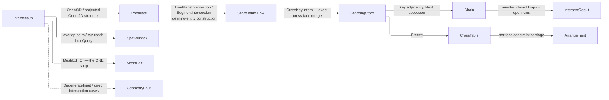

# [RASM_INTERSECTION_INTERSECT]

`Rasm.Meshing` owns the predicate-exact crossing table: one `IntersectOp` `[Union]` folded by one `Intersection.Apply` entry, crossing EXISTENCE decided by exact straddle signs, every crossing POINT an `Implicit` construction rounded at the `Round()` emission boundary. Endpoints key by defining entities through `CrossKey`, adjacent-face crossings interning to one row by integer equality, and chains walk that adjacency into oriented closed loops and open runs, closure reading off the polyline endpoints. Predicate-exact discrete crossing is the whole charter; host-parametric NURBS/Brep intersection homes at `Analysis/relations`.

Rebuilding composes the broad phase from `SpatialIndex.Build` and its typed `Query` arms, the triangle soups from `MeshEdit.Of`, and exact ordering from `Predicate.Compare`, authoring the Guigue-Devillers narrow phase and the key-connectivity chain assembly alone. `CrossingStore` binds the `Meshing/edit` arena law, and `IntersectResult.Chains` carries the frozen `CrossTable` so `Meshing/arrangement` consumes the same run without a second narrow phase.

## [01]-[INDEX]

- [02]-[INTERSECTION]: one `Intersection.Apply` folding seven `IntersectOp` cases; `CrossTable.Row` = `Implicit` construction + `CrossKey` merge key over the `CrossingStore` arena; Guigue-Devillers narrow phase; key-connectivity chain walk with oriented loops and open runs.
- [03]-[DENSITY_BAR]: one owner per axis with its return type and case count.

## [02]-[INTERSECTION]

- Owner: `PrimitiveKind` `[SmartEnum<string>]` mints the primitive vocabulary the direct intersection fault payloads read; `CrossKey` is the defining-entity merge key where integer equality IS the cross-face merge; `CrossTable.Row` pairs the `Implicit` exact point with its `CrossKey`; `CrossingStore` interns key-classified crossing rows and segment pairs, freezing into the `CrossTable` projection; `Chain` is the result row and `Chain.Of` the ONE oriented-edge decomposition minting it, composed here and by the arrangement rim; `IntersectOp`/`IntersectResult` are the request/result unions folded by the `Intersection` static surface.
- Cases: `IntersectOp` cases `SegmentSegment` · `SegmentTriangle` · `TriangleTriangle` · `RayMesh` · `MeshMesh` · `SelfMesh` · `PlaneMesh`; `IntersectResult` cases `Points` · `Segments` · `Chains`.
- Entry: `Apply` discriminates on the op case and resolves the ONE key every interior static then takes outright; `Fin<T>` routes `GeometryFault.DegenerateInput` on an inadmissible primitive and `GeometryFault.NonManifoldIntersection` — carrying the offending endpoint in its `Junction` column — on a section edge key incident to three or more faces, while an OPEN section on a boundaried mesh is a chain whose endpoints differ, never a fault. `SegmentSegment` carries its projection `Axis`, so the 2D restriction lives in the request shape.
- Auto: point-level cases run the exact straddle directly; mesh-level cases fold `MeshEdit.Of`, the `SpatialIndex` BVH broad phase, and the narrow phase, interning each crossing endpoint into `CrossingStore` by `CrossKey` so a crossing reached from two face pairs lands on one row and a hit on a pierced edge or corner keys by its classified landing, not by either incident face. Chain assembly hands the material-oriented segments stored `from → to` to `Chain.Of`, which seats them in a bidirectional container source-first: an out-degree or in-degree above one on any endpoint routes the non-manifold junction fault carrying that endpoint, a zero-indegree head opens an open run, a head the container gives a predecessor sits on a cycle and closes an oriented loop, and every remaining component is reached by the one depth-first sweep.
- Output: `IntersectResult`, its `Chains` case carrying the frozen `CrossTable` as payload; the hash-eligible artifacts are the `Polyline`/`Point3d` values at the `Round()` boundary.
- Law: every crossing row keys by INTEGER defining entities, and the one coincidence fallback keys by `Axis.BitKey` — the predicate owner's exact IEEE triple with signed zero folded onto positive, the same zero the exact `Compare` reads — so the arena carries no float-keyed table, no page re-derives that ordinal, and no tolerance decides identity. Broad-phase inflation reads `Context.For(ToleranceLane.MeshIntersection)` off the operand's own bound context, so the sweep band scales with the model instead of pinning an absolute epsilon on the policy row. `IntersectPolicy.KeepCoplanar` stays a bare bool: it gates whether the coplanar AREA contact emits constraint rows at all, and no second policy column shares a legal-corner law with it.
- Exemption: the mutable tables are arena or statement-kernel state, never frozen — `CrossingStore`'s `interned`/`byBits` intern maps and `segments`/`coplanar` accumulators (the arena's own columns, published only through `Freeze`), the `shared` third-vertex ledger inside one `Section` sweep, and `Chain.Of`'s `incoming` seed set, which orders the container's insertion and dies with the build.
- Packages: `Rasm.Numerics` (`Predicate`, `Implicit` with its `SegmentIntersection`/`LinePlaneIntersection` cases, `Sign`, `Axis` with `Along`/`BitKey`, `Dimension`, `GeometryFault`), `Rasm.Spatial` (`SpatialIndex.Build`, the overlap and box `Query` arms), `Rasm.Meshing` (`MeshEdit.Of`, `MeshSpace`), `Rasm.Domain` (`Kind`, `Context`/`ToleranceLane`), QuikGraph (`GraphExtensions.ToBidirectionalGraph`, `BidirectionalGraph`/`SEdge`, `DepthFirstSearchAlgorithm` under `ProcessAllComponents`, `VertexPredecessorPathRecorderObserver` — the chain decomposition's one container, one walk, one observer), `Rhino.Geometry`, Thinktecture.Runtime.Extensions, LanguageExt.Core.
- Growth: a new crossing modality is one `IntersectOp` case reading the same narrow phase and key-connectivity assembly; a new crossing construction is a predicate-owner `Implicit` case; a new broad-phase knob is one `IntersectPolicy` column, and a new band is one `ToleranceLane` row at the context owner.
- Boundary: one `IntersectOp` `[Union]` folds every case; connectivity derives from integer `CrossKey` equality and exact `Compare` signs; every ordering is a TOTAL function of the input, the arena slot or arrival ordinal settling the `Compare` tie a collinear multi-touch produces, so no emission depends on an unstable sort's array layout; loops emit oriented at emission with their seed repeated, so `Polyline.IsClosed` is the one closure read; `Apply` is total over `Fin`; `CrossingStore` is the single-writer arena whose frozen `CrossTable` is the only projection consumers hold.

```csharp
// --- [IMPORTS] -------------------------------------------------------------------------
using System;
using System.Collections.Generic;
using System.Linq;
using LanguageExt;
using QuikGraph;
using QuikGraph.Algorithms;
using QuikGraph.Algorithms.Observers;
using QuikGraph.Algorithms.Search;
using Rasm.Domain;
using Rasm.Numerics;
using Rasm.Spatial;
using Rhino.Geometry;
using Thinktecture;
using static LanguageExt.Prelude;

namespace Rasm.Meshing;

// --- [TYPES] ---------------------------------------------------------------------------
[SmartEnum<string>]
[KeyMemberEqualityComparer<ComparerAccessors.StringOrdinal, string>]
[KeyMemberComparer<ComparerAccessors.StringOrdinal, string>]
public sealed partial class PrimitiveKind {
    public static readonly PrimitiveKind Segment  = new("segment");
    public static readonly PrimitiveKind Triangle = new("triangle");
    public static readonly PrimitiveKind Ray      = new("ray");
    public static readonly PrimitiveKind Plane    = new("plane");
    public static readonly PrimitiveKind Mesh     = new("mesh");
}

// --- [CONSTANTS] -----------------------------------------------------------------------
public sealed record IntersectPolicy(Dimension SeedCapacity, bool KeepCoplanar) {
    public static readonly IntersectPolicy Canonical = new(Dimension.Create(value: 256), KeepCoplanar: true);
}

// --- [MODELS] --------------------------------------------------------------------------
public readonly record struct CrossKey(int Side, int EdgeU, int EdgeV, int Face, int OtherU = -1, int OtherV = -1) {
    public static CrossKey Of(int side, int u, int v, int face) => new(side, int.Min(u, v), int.Max(u, v), face);
    public static CrossKey Vertex(int side, int w) => new(side, w, w, -1);
    public static CrossKey Coplanar(int u, int v, int s, int t) => new(0, int.Min(u, v), int.Max(u, v), -1, int.Min(s, t), int.Max(s, t));
}

public sealed record Chain(Polyline Points) {
    internal static Fin<Seq<Chain>> Of(IEnumerable<(int From, int To)> edges, Func<int, Option<Point3d>> corner, PrimitiveKind a, PrimitiveKind b) {
        (int From, int To)[] rows = [.. edges];
        HashSet<int> incoming = [.. rows.Select(static row => row.To)];
        BidirectionalGraph<int, SEdge<int>> graph = rows
            .OrderBy(row => incoming.Contains(row.From)).ThenBy(static row => row.From)
            .Select(static row => new SEdge<int>(row.From, row.To))
            .ToBidirectionalGraph<int, SEdge<int>>(allowParallelEdges: true);
        if (toSeq(graph.Vertices).Find(v => graph.OutDegree(v) > 1 || graph.InDegree(v) > 1).Case is int junction) {
            return Fin.Fail<Seq<Chain>>(new GeometryFault.NonManifoldIntersection(a, b, junction));
        }
        if (graph.EdgeCount == 0) { return Fin.Succ(Seq<Chain>()); }
        DepthFirstSearchAlgorithm<int, SEdge<int>> walk = new(graph) { ProcessAllComponents = true };
        VertexPredecessorPathRecorderObserver<int, SEdge<int>> recorder = new();
        using (recorder.Attach(walk)) { walk.Compute(graph.Vertices.First()); }
        List<Chain> chains = new();
        int covered = 0;
        foreach (IEnumerable<SEdge<int>> path in recorder.AllPaths()) {
            SEdge<int>[] run = [.. path];
            if (run.Length == 0) { continue; }
            bool closed = graph.InDegree(run[0].Source) == 1;
            covered += run.Length + (closed ? 1 : 0);
            Fin<Polyline> walked = toSeq(run.Select(static edge => edge.Source).Append(run[^1].Target))
                .TraverseM(slot => corner(slot).ToFin(new GeometryFault.MissingIntersectionVertex(a, b, slot)))
                .As()
                .Map(static points => new Polyline(points));
            if (walked.Case is not Polyline points) { return walked.Map(static _ => Seq<Chain>()); }
            if (closed) { points.Add(points[0]); }
            chains.Add(new Chain(points));
        }
        if (covered == graph.EdgeCount) { return Fin.Succ(toSeq(chains)); }
        SEdge<int> missed = graph.Edges.First();
        return Fin.Fail<Seq<Chain>>(new GeometryFault.IncompleteIntersectionWalk(a, b, missed.Source, missed.Target));
    }
}

public sealed record CrossTable(
    Arr<CrossTable.Row> Rows,
    Arr<(int A, int B, int FaceA, int FaceB)> Segments,
    Arr<(int A, int B, int FaceA, int FaceB, int CarrierU, int CarrierV, int CarrierSide)> Coplanar) {
    public readonly record struct Row(Implicit Point, CrossKey Key);

    readonly ILookup<int, (int A, int B, int FaceA, int FaceB)>[] onFace =
        [toSeq(Segments).ToLookup(static s => s.FaceA), toSeq(Segments).ToLookup(static s => s.FaceB)];
    readonly ILookup<int, (int A, int B, int FaceA, int FaceB, int CarrierU, int CarrierV, int CarrierSide)>[] onCoplanar =
        [toSeq(Coplanar).ToLookup(static s => s.FaceA), toSeq(Coplanar).ToLookup(static s => s.FaceB)];

    public IEnumerable<(int A, int B, int FaceA, int FaceB)> OnFace(int side, int face) => onFace[side][face];

    public IEnumerable<(int A, int B, int FaceA, int FaceB, int CarrierU, int CarrierV, int CarrierSide)> CoplanarOnFace(int side, int face) =>
        onCoplanar[side][face];
}

[Union(ConversionFromValue = ConversionOperatorsGeneration.None)]
public abstract partial record IntersectResult {
    private IntersectResult() { }

    public sealed record Points(Seq<Point3d> Hits) : IntersectResult;
    public sealed record Segments(Seq<Line> Crossings) : IntersectResult;
    public sealed record Chains(Seq<Chain> Walked, CrossTable Table) : IntersectResult;
}

// --- [OPERATIONS] ----------------------------------------------------------------------
[Union(ConversionFromValue = ConversionOperatorsGeneration.None)]
public abstract partial record IntersectOp {
    private IntersectOp() { }

    public sealed record SegmentSegment(Line A, Line B, Axis Plane) : IntersectOp;
    public sealed record SegmentTriangle(Line Edge, Point3d Ta, Point3d Tb, Point3d Tc) : IntersectOp;
    public sealed record TriangleTriangle(Point3d Pa, Point3d Pb, Point3d Pc, Point3d Qa, Point3d Qb, Point3d Qc) : IntersectOp;
    public sealed record RayMesh(Ray3d Ray, double MaxT, MeshSpace Mesh) : IntersectOp;
    public sealed record MeshMesh(MeshSpace A, MeshSpace B, IntersectPolicy Policy) : IntersectOp;
    public sealed record SelfMesh(MeshSpace Mesh, IntersectPolicy Policy) : IntersectOp;
    public sealed record PlaneMesh(Plane Cut, MeshSpace Mesh, IntersectPolicy Policy) : IntersectOp;
}

public static class Intersection {
    private sealed class CrossingStore {
        internal readonly List<CrossTable.Row> rows;
        internal readonly List<(int A, int B, int FaceA, int FaceB)> segments = [];
        internal readonly List<(int A, int B, int FaceA, int FaceB, int CarrierU, int CarrierV, int CarrierSide)> coplanar = [];
        readonly Dictionary<CrossKey, int> interned = [];
        readonly Dictionary<(long X, long Y, long Z), int> byBits = [];

        public CrossingStore(Dimension seed) { rows = new(seed.Value); }

        public int Intern(in Implicit point, CrossKey key) {
            if (interned.TryGetValue(out int at)) { return at; }
            if (point.IsExplicit && byBits.TryGetValue(Axis.BitKey(point.AsExplicit), out int shared)) { return interned[key] = shared; }
            int slot = rows.Count;
            rows.Add(new CrossTable.Row(point));
            if (point.IsExplicit) { byBits[Axis.BitKey(point.AsExplicit)] = slot; }
            return interned[key] = slot;
        }

        public CrossTable Freeze() => new([.. rows], [.. segments], [.. coplanar]);
    }

    public static Fin<IntersectResult> Apply(IntersectOp op) {
        return Admit().Bind(_ => op.Switch(
            segmentSegment:   s => Fin.Succ((IntersectResult)new IntersectResult.Points(
                CrossSegments2D(s.A, s.B, s.Plane).Map(static point => point.Round()).ToSeq())),
            segmentTriangle:  s => Fin.Succ((IntersectResult)new IntersectResult.Points(
                EdgePierce(s.Edge.From, s.Edge.To, s.Ta, s.Tb, s.Tc).Map(static point => point.Round()).ToSeq())),
            triangleTriangle: t => Fin.Succ((IntersectResult)new IntersectResult.Segments(
                TriTriSegment(t.Pa, t.Pb, t.Pc, t.Qa, t.Qb, t.Qc)
                    .Map(static segment => new Line(segment.A.Round(), segment.B.Round())).ToSeq())),
            rayMesh:          r => FirstHit(r, site),
            meshMesh:         m => Cross(m, site).Bind(store => Chains(store.Freeze(), PrimitiveKind.Mesh, PrimitiveKind.Mesh)),
            selfMesh:         sm => SelfCross(sm, site).Bind(store => Chains(store.Freeze(), PrimitiveKind.Mesh, PrimitiveKind.Mesh)),
            planeMesh:        p => Chains(Section(p).Freeze(), PrimitiveKind.Plane, PrimitiveKind.Mesh)));
    }

    static Fin<Unit> Admit(IntersectOp op) =>
        op.Switch(
            segmentSegment:   static s => s.A.Length == 0.0 || s.B.Length == 0.0 ? Reject(Kind.Line, "zero-length segment") : Fin.Succ(unit),
            segmentTriangle:  static s => s.Edge.Length == 0.0 ? Reject(Kind.Line, "zero-length segment")
                : Sliver(s.Ta, s.Tb, s.Tc) ? Reject(Kind.Mesh, "sliver triangle") : Fin.Succ(unit),
            triangleTriangle: static t => Sliver(t.Pa, t.Pb, t.Pc) || Sliver(t.Qa, t.Qb, t.Qc) ? Reject(Kind.Mesh, "sliver triangle") : Fin.Succ(unit),
            rayMesh:          static r => !(r.MaxT > 0.0) || !r.Ray.Direction.IsValid || r.Ray.Direction.IsZero ? Reject(Kind.Point, "degenerate ray") : Fin.Succ(unit),
            meshMesh:         static _ => Fin.Succ(unit),
            selfMesh:         static _ => Fin.Succ(unit),
            planeMesh:        static p => p.Cut.IsValid ? Fin.Succ(unit) : Reject(Kind.Plane, "non-finite plane"));

    static Fin<Unit> Reject(Kind kind, string witness) =>
        Fin.Fail<Unit>(new GeometryFault.DegenerateInput(kind, None, witness));

    static bool Sliver(Point3d a, Point3d b, Point3d c) =>
        Predicate.Orient2D(a, b, c, Axis.Z) == Sign.Zero
        && Predicate.Orient2D(a, b, c, Axis.X) == Sign.Zero
        && Predicate.Orient2D(a, b, c, Axis.Y) == Sign.Zero;

    // --- [NARROW_PHASE]
    static Option<Implicit> CrossSegments2D(Line a, Line b, Axis plane) {
        Sign d1 = Predicate.Orient2D(a.From, a.To, b.From, plane);
        Sign d2 = Predicate.Orient2D(a.From, a.To, b.To, plane);
        Sign d3 = Predicate.Orient2D(b.From, b.To, a.From, plane);
        Sign d4 = Predicate.Orient2D(b.From, b.To, a.To, plane);
        return d1.Times(d2) == Sign.Negative && d3.Times(d4) == Sign.Negative
            ? Some<Implicit>(new Implicit.SegmentIntersection(a.From, a.To, b.From, b.To, plane))
            : None;
    }

    static Option<Implicit> EdgePierce(Point3d u, Point3d v, Point3d a, Point3d b, Point3d c) {
        Sign su = Predicate.Orient3D(a, b, c, u), sv = Predicate.Orient3D(a, b, c, v);
        if (su.Times(sv) != Sign.Negative) { return None; }
        Implicit hit = new Implicit.LinePlaneIntersection(u, v, a, b, c);
        return Axis.DominantOf(a, b, c).Case is Axis axis && InsideProjected(in hit, a, b, c, axis) ? Some(hit) : None;
    }

    static bool InsideProjected(in Implicit p, Point3d a, Point3d b, Point3d c, Axis axis) =>
        Placed(in p, a, b, c, axis).IsSome;

    static Option<(int Edge, int Vertex)> Placed(in Implicit p, Point3d a, Point3d b, Point3d c, Axis axis) {
        Sign s0 = Predicate.Orient2D(a, b, in p, axis);
        Sign s1 = Predicate.Orient2D(b, c, in p, axis);
        Sign s2 = Predicate.Orient2D(c, a, in p, axis);
        bool inside = (s0 != Sign.Negative && s1 != Sign.Negative && s2 != Sign.Negative)
            || (s0 != Sign.Positive && s1 != Sign.Positive && s2 != Sign.Positive);
        return !inside ? None
            : (s0 == Sign.Zero, s1 == Sign.Zero, s2 == Sign.Zero) switch {
                (true, true, _)  => Some((-1, 1)),
                (_, true, true)  => Some((-1, 2)),
                (true, _, true)  => Some((-1, 0)),
                (true, _, _)     => Some((0, -1)),
                (_, true, _)     => Some((1, -1)),
                (_, _, true)     => Some((2, -1)),
                _                => Some((-1, -1)),
            };
    }

    // --- [GUIGUE_DEVILLERS]
    static Option<(Implicit A, Implicit B)> TriTriSegment(Point3d pa, Point3d pb, Point3d pc, Point3d qa, Point3d qb, Point3d qc) {
        Span<Sign> q = [Predicate.Orient3D(pa, pb, pc, qa), Predicate.Orient3D(pa, pb, pc, qb), Predicate.Orient3D(pa, pb, pc, qc)];
        if (q[0] == Sign.Zero && q[1] == Sign.Zero && q[2] == Sign.Zero) { return None; }
        if (ZeroPair(q).Case is int zq) {
            (Point3d u, Point3d v) = zq == 0 ? (qa, qb) : zq == 1 ? (qb, qc) : (qc, qa);
            List<Implicit> clip = Axis.DominantOf(pa, pb, pc).Case is Axis plane ? ClipToTriangle(u, v, pa, pb, pc, plane) : [];
            return clip.Count >= 2 ? Some((clip[0], clip[^1])) : None;
        }
        if (SameSide(q)) { return None; }
        Span<Sign> p = [Predicate.Orient3D(qa, qb, qc, pa), Predicate.Orient3D(qa, qb, qc, pb), Predicate.Orient3D(qa, qb, qc, pc)];
        if (ZeroPair(p).Case is int zp) {
            (Point3d u, Point3d v) = zp == 0 ? (pa, pb) : zp == 1 ? (pb, pc) : (pc, pa);
            List<Implicit> clip = Axis.DominantOf(qa, qb, qc).Case is Axis plane ? ClipToTriangle(u, v, qa, qb, qc, plane) : [];
            return clip.Count >= 2 ? Some((clip[0], clip[^1])) : None;
        }
        if (SameSide(p)) { return None; }
        List<Implicit> hits = new(4);
        Collect(hits, pa, pb, pc, p, qa, qb, qc);
        Collect(hits, qa, qb, qc, q, pa, pb, pc);
        if (hits.Count < 2) { return None; }
        if (Axis.DominantOf(Vector3d.CrossProduct(Vector3d.CrossProduct(pb - pa, pc - pa), Vector3d.CrossProduct(qb - qa, qc - qa))).Case is not Axis order) { return None; }
        (int lo, int hi) = (0, 0);
        for (int i = 1; i < hits.Count; i++) {
            (Implicit here, Implicit least, Implicit greatest) = (hits[i], hits[lo], hits[hi]);
            if (Predicate.Compare(in here, in least, order) == Sign.Negative) { lo = i; }
            if (Predicate.Compare(in here, in greatest, order) != Sign.Negative) { hi = i; }
        }
        return Some((hits[lo], hits[hi]));

        static void Collect(List<Implicit> hits, Point3d a, Point3d b, Point3d c, ReadOnlySpan<Sign> signs, Point3d ta, Point3d tb, Point3d tc) {
            if (Axis.DominantOf(ta, tb, tc).Case is not Axis axis) { return; }
            Span<(Point3d W, Sign S)> verts = [(a, signs[0]), (b, signs[1]), (c, signs[2])];
            foreach ((Point3d w, Sign s) in verts) {
                Implicit row = new(w);
                if (s == Sign.Zero && InsideProjected(in row, ta, tb, tc, axis)) { hits.Add(row); }
            }
            Span<(Point3d U, Point3d V, Sign Su, Sign Sv)> edges = [(a, b, signs[0], signs[1]), (b, c, signs[1], signs[2]), (c, a, signs[2], signs[0])];
            foreach ((Point3d u, Point3d v, Sign su, Sign sv) in edges) {
                if (su.Times(sv) == Sign.Negative && EdgePierce(u, v, ta, tb, tc).Case is Implicit hit) { hits.Add(hit); }
            }
        }
    }

    static bool SameSide(ReadOnlySpan<Sign> s) =>
        (s[0] != Sign.Negative && s[1] != Sign.Negative && s[2] != Sign.Negative && (s[0] == Sign.Positive || s[1] == Sign.Positive || s[2] == Sign.Positive))
        || (s[0] != Sign.Positive && s[1] != Sign.Positive && s[2] != Sign.Positive && (s[0] == Sign.Negative || s[1] == Sign.Negative || s[2] == Sign.Negative));

    static Option<int> ZeroPair(ReadOnlySpan<Sign> s) =>
        (s[0] == Sign.Zero, s[1] == Sign.Zero, s[2] == Sign.Zero) switch {
            (true, true, false) => Some(0),
            (false, true, true) => Some(1),
            (true, false, true) => Some(2),
            _                   => Option<int>.None,
        };

    static List<Implicit> ClipToTriangle(Point3d u, Point3d v, Point3d a, Point3d b, Point3d c, Axis plane) {
        List<Implicit> kept = new(4);
        Implicit ru = new(u), rv = new(v);
        if (InsideProjected(in ru, a, b, c, plane)) { kept.Add(ru); }
        if (InsideProjected(in rv, a, b, c, plane)) { kept.Add(rv); }
        foreach ((Point3d s, Point3d t) in (ReadOnlySpan<(Point3d, Point3d)>)[(a, b), (b, c), (c, a)]) {
            if (CrossSegments2D(new Line(u, v), new Line(s, t), plane).Case is Implicit hit) { kept.Add(hit); }
        }
        if (Axis.DominantOf(v - u).Case is not Axis along) { return kept; }
        int[] ranked = [.. Enumerable.Range(0, kept.Count)];
        System.Array.Sort(ranked, (l, r) => {
            (Implicit left, Implicit right) = (kept[l], kept[r]);
            Sign side = Predicate.Compare(in left, in right, along);
            return side != Sign.Zero ? side.Key : l.CompareTo(r);
        });
        return [.. ranked.Select(at => kept[at])];
    }

    // --- [BROAD_PHASE]
    static Fin<SpatialIndex> Bvh(MeshEdit soup) {
        BoundingBox[] boxes = new BoundingBox[soup.FaceCount];
        for (int f = 0; f < soup.FaceCount; f++) { boxes[f] = soup.Bounds(f); }
        return SpatialIndex.Build(SpatialKind.Bvh, boxes, BuildPolicy.Canonical);
    }

    // --- [CROSSINGS]
    static Fin<CrossingStore> Cross(IntersectOp.MeshMesh op) {
        using MeshEdit ea = MeshEdit.Of(op.A);
        using MeshEdit eb = MeshEdit.Of(op.B);
        return (Bvh(ea), Bvh(eb)).Apply((ia, ib) => (ia, ib)).As()
            .Bind(t => t.ia.Query(t.ib, op.A.Tolerance.For(ToleranceLane.MeshIntersection).Value))
            .Map(pairs => pairs.Fold(new CrossingStore(op.Policy.SeedCapacity), (store, pair) => PairCrossings(store, ea, eb, pair.Left, pair.Right, op.Policy)));
    }

    static Fin<CrossingStore> SelfCross(IntersectOp.SelfMesh op) {
        using MeshEdit soup = MeshEdit.Of(op.Mesh);
        return Bvh(soup)
            .Bind(index => index.Query(index, op.Mesh.Tolerance.For(ToleranceLane.MeshIntersection).Value))
            .Map(pairs => pairs.Fold(new CrossingStore(op.Policy.SeedCapacity), (store, pair) => {
                if (pair.Left >= pair.Right) { return store; }
                (int a0, int a1, int a2) = soup.Face(pair.Left);
                (int b0, int b1, int b2) = soup.Face(pair.Right);
                int shared = 0;
                foreach (int vertex in (ReadOnlySpan<int>)[a0, a1, a2]) {
                    if (vertex == b0 || vertex == b1 || vertex == b2) { shared++; }
                }
                return shared < 2 ? PairCrossings(store, soup, soup, pair.Left, pair.Right, op.Policy, sideA: 0, sideB: 0) : store;
            }));
    }

    static CrossingStore PairCrossings(CrossingStore store, MeshEdit a, MeshEdit b, int fa, int fb, IntersectPolicy policy, int sideA = 0, int sideB = 1) {
        (int a0, int a1, int a2) = a.Face(fa);
        (int b0, int b1, int b2) = b.Face(fb);
        (Point3d pa, Point3d pb, Point3d pc) = (a.Position(a0), a.Position(a1), a.Position(a2));
        (Point3d qa, Point3d qb, Point3d qc) = (b.Position(b0), b.Position(b1), b.Position(b2));
        Span<Sign> qs = [Predicate.Orient3D(pa, pb, pc, qa), Predicate.Orient3D(pa, pb, pc, qb), Predicate.Orient3D(pa, pb, pc, qc)];
        if (qs[0] == Sign.Zero && qs[1] == Sign.Zero && qs[2] == Sign.Zero) {
            return policy.KeepCoplanar ? CoplanarCrossings(store, a, b, fa, fb, sideA, sideB) : store;
        }
        Span<Sign> ps = [Predicate.Orient3D(qa, qb, qc, pa), Predicate.Orient3D(qa, qb, qc, pb), Predicate.Orient3D(qa, qb, qc, pc)];
        List<int> ends = new(4);
        Pierce(store, ends, sideA, sideB, a, (a0, a1, a2), ps, b, (b0, b1, b2), fb);
        Pierce(store, ends, sideB, sideA, b, (b0, b1, b2), qs, a, (a0, a1, a2), fa);
        if (ends.Count < 2) { return store; }
        Vector3d material = Vector3d.CrossProduct(Vector3d.CrossProduct(pb - pa, pc - pa), Vector3d.CrossProduct(qb - qa, qc - qa));
        if (Axis.DominantOf(material).Case is not Axis axis) { return store; }
        Sign forward = Sign.Of(axis.Along(material));
        ends.Sort((l, r) => {
            (Implicit left, Implicit right) = (store.rows[l].Point, store.rows[r].Point);
            Sign side = Predicate.Compare(in left, in right, axis).Times(forward);
            return side != Sign.Zero ? side.Key : l.CompareTo(r);
        });
        for (int k = 0; k + 1 < ends.Count; k++) { store.segments.Add((ends[k], ends[k + 1], fa, fb)); }
        return store;

        static void Pierce(CrossingStore store, List<int> ends, int side, int otherSide, MeshEdit soup, (int V0, int V1, int V2) f, ReadOnlySpan<Sign> signs, MeshEdit other, (int W0, int W1, int W2) g, int otherFace) {
            (Point3d ta, Point3d tb, Point3d tc) = (other.Position(g.W0), other.Position(g.W1), other.Position(g.W2));
            if (Axis.DominantOf(ta, tb, tc).Case is not Axis plane) { return; }
            Span<int> verts = [f.V0, f.V1, f.V2];
            int W(int ordinal) => ordinal == 0 ? g.W0 : ordinal == 1 ? g.W1 : g.W2;
            for (int i = 0; i < 3; i++) {
                Implicit row = new(soup.Position(verts[i]));
                if (signs[i] == Sign.Zero && InsideProjected(in row, ta, tb, tc, plane)) {
                    Keep(ends, store.Intern(in row, CrossKey.Vertex(side, verts[i])));
                }
            }
            for (int e = 0; e < 3; e++) {
                (int u, int v) = (verts[e], verts[(e + 1) % 3]);
                Sign su = signs[e], sv = signs[(e + 1) % 3];
                if (su.Times(sv) == Sign.Negative) {
                    Implicit hit = new Implicit.LinePlaneIntersection(soup.Position(u), soup.Position(v), ta, tb, tc);
                    if (Placed(in hit, ta, tb, tc, plane).Case is (int onEdge, int onVertex)) {
                        Keep(ends, onVertex >= 0
                            ? store.Intern(other.Position(W(onVertex)), CrossKey.Vertex(otherSide, W(onVertex)))
                            : onEdge >= 0
                                ? store.Intern(in hit, CoplanarKey(side, otherSide, u, v, W(onEdge), W((onEdge + 1) % 3)))
                                : store.Intern(in hit, CrossKey.Of(side, u, v, otherFace)));
                    }
                }
                else if (su == Sign.Zero && sv == Sign.Zero) {
                    foreach ((int s2, int t2) in (ReadOnlySpan<(int, int)>)[(g.W0, g.W1), (g.W1, g.W2), (g.W2, g.W0)]) {
                        if (CrossSegments2D(new Line(soup.Position(u), soup.Position(v)), new Line(other.Position(s2), other.Position(t2)), plane).Case is Implicit hit) {
                            Keep(ends, store.Intern(in hit, CoplanarKey(side, otherSide, u, v, s2, t2)));
                        }
                    }
                }
            }
        }
    }

    static CrossKey CoplanarKey(int side, int otherSide, int u, int v, int s, int t) =>
        side == otherSide
            ? ((int.Min(u, v), int.Max(u, v)).CompareTo((int.Min(s, t), int.Max(s, t))) <= 0 ? CrossKey.Coplanar(u, v, s, t) : CrossKey.Coplanar(s, t, u, v))
            : side == 0 ? CrossKey.Coplanar(u, v, s, t) : CrossKey.Coplanar(s, t, u, v);

    static void Keep(List<int> ends, int slot) {
        if (!ends.Contains(slot)) { ends.Add(slot); }
    }

    static (int From, int To) Oriented(CrossingStore store, int e0, int e1, Vector3d material) {
        if (Axis.DominantOf(material).Case is not Axis axis) { return (e0, e1); }
        Implicit p0 = store.rows[e0].Point;
        Implicit p1 = store.rows[e1].Point;
        Sign order = Predicate.Compare(in p0, in p1, axis).Times(Sign.Of(axis.Along(material)));
        return order == Sign.Negative ? (e0, e1) : (e1, e0);
    }

    static CrossingStore CoplanarCrossings(CrossingStore store, MeshEdit a, MeshEdit b, int fa, int fb, int sideA = 0, int sideB = 1) {
        (int a0, int a1, int a2) = a.Face(fa);
        (int b0, int b1, int b2) = b.Face(fb);
        if (Axis.DominantOf(a.Position(a0), a.Position(a1), a.Position(a2)).Case is not Axis plane) { return store; }
        Flush(store, plane, sideA, sideB, a, (a0, a1, a2), b, (b0, b1, b2), fa, fb);
        Flush(store, plane, sideB, sideA, b, (b0, b1, b2), a, (a0, a1, a2), fa, fb);
        return store;

        static void Flush(CrossingStore store, Axis plane, int carrierSide, int otherSide, MeshEdit own, (int V0, int V1, int V2) f, MeshEdit other, (int W0, int W1, int W2) g, int fa, int fb) {
            (Point3d ta, Point3d tb, Point3d tc) = (other.Position(g.W0), other.Position(g.W1), other.Position(g.W2));
            foreach ((int u, int v) in (ReadOnlySpan<(int, int)>)[(f.V0, f.V1), (f.V1, f.V2), (f.V2, f.V0)]) {
                (Point3d pu, Point3d pv) = (own.Position(u), own.Position(v));
                List<int> kept = new(4);
                Implicit ru = new(pu), rv = new(pv);
                if (InsideProjected(in ru, ta, tb, tc, plane)) { Keep(kept, store.Intern(in ru, CrossKey.Vertex(carrierSide, u))); }
                if (InsideProjected(in rv, ta, tb, tc, plane)) { Keep(kept, store.Intern(in rv, CrossKey.Vertex(carrierSide, v))); }
                foreach ((int s, int t) in (ReadOnlySpan<(int, int)>)[(g.W0, g.W1), (g.W1, g.W2), (g.W2, g.W0)]) {
                    if (CrossSegments2D(new Line(pu, pv), new Line(other.Position(s), other.Position(t)), plane).Case is Implicit hit) {
                        Keep(kept, store.Intern(in hit, CoplanarKey(carrierSide, otherSide, u, v, s, t)));
                    }
                }
                if (kept.Count < 2) { continue; }
                if (Axis.DominantOf(pv - pu).Case is not Axis along) { continue; }
                kept.Sort((l, r) => {
                    (Implicit left, Implicit right) = (store.rows[l].Point, store.rows[r].Point);
                    Sign side = Predicate.Compare(in left, in right, along);
                    return side != Sign.Zero ? side.Key : l.CompareTo(r);
                });
                for (int k = 0; k + 1 < kept.Count; k++) { store.coplanar.Add((kept[k], kept[k + 1], fa, fb, u, v, carrierSide)); }
            }
        }
    }

    static CrossingStore Section(IntersectOp.PlaneMesh op) {
        using MeshEdit soup = MeshEdit.Of(op.Mesh);
        (Point3d po, Point3d px, Point3d py) = (op.Cut.Origin, op.Cut.Origin + op.Cut.XAxis, op.Cut.Origin + op.Cut.YAxis);
        CrossingStore store = new(op.Policy.SeedCapacity);
        Dictionary<(int U, int V), Sign> shared = new();
        for (int f = 0; f < soup.FaceCount; f++) {
            (int v0, int v1, int v2) = soup.Face(f);
            Span<int> verts = [v0, v1, v2];
            Span<Sign> s = [
                Predicate.Orient3D(po, px, py, soup.Position(v0)),
                Predicate.Orient3D(po, px, py, soup.Position(v1)),
                Predicate.Orient3D(po, px, py, soup.Position(v2))];
            if (s[0] == Sign.Zero && s[1] == Sign.Zero && s[2] == Sign.Zero) { continue; }
            Vector3d faceNormal = Vector3d.CrossProduct(soup.Position(v1) - soup.Position(v0), soup.Position(v2) - soup.Position(v0));
            Vector3d material = Vector3d.CrossProduct(op.Cut.Normal, faceNormal);
            if (ZeroPair(s).Case is int lying) {
                (int u, int v) = (verts[lying], verts[(lying + 1) % 3]);
                (int cu, int cv) = (int.Min(u, v), int.Max(u, v));
                Sign third = s[(lying + 2) % 3];
                if (!shared.TryGetValue((cu, cv), out Sign facing)) { shared[(cu, cv)] = third; continue; }
                if (facing.Times(third) != Sign.Negative) { continue; }
                int au = store.Intern(soup.Position(u), CrossKey.Vertex(0, u));
                int av = store.Intern(soup.Position(v), CrossKey.Vertex(0, v));
                (int from, int to) = Oriented(store, au, av, material);
                store.segments.Add((from, to, f, -1));
                continue;
            }
            List<int> ends = new(2);
            for (int i = 0; i < 3; i++) {
                if (s[i] == Sign.Zero) { Keep(ends, store.Intern(soup.Position(verts[i]), CrossKey.Vertex(0, verts[i]))); }
            }
            for (int e = 0; e < 3; e++) {
                (int u, int v) = (verts[e], verts[(e + 1) % 3]);
                if (s[e].Times(s[(e + 1) % 3]) == Sign.Negative) {
                    Keep(ends, store.Intern(new Implicit.LinePlaneIntersection(soup.Position(u), soup.Position(v), po, px, py), CrossKey.Of(0, u, v, -1)));
                }
            }
            if (ends.Count == 2) {
                (int from, int to) = Oriented(store, ends[0], ends[1], material);
                store.segments.Add((from, to, f, -1));
            }
        }
        return store;
    }

    static Fin<IntersectResult> FirstHit(IntersectOp.RayMesh op) {
        using MeshEdit soup = MeshEdit.Of(op.Mesh);
        (Point3d from, Point3d to) = (op.Ray.Position, op.Ray.PointAt(op.MaxT));
        if (Axis.DominantOf(op.Ray.Direction).Case is not Axis axis) { return Fin.Fail<IntersectResult>(new KernelFault.InvalidInput()); }
        Sign forward = Sign.Of(axis.Along(op.Ray.Direction));
        return Bvh(soup)
            .Bind(index => index.Query(new BoundingBox([from, to])))
            .Map(faces => {
                Option<Implicit> best = None;
                foreach (int f in faces) {
                    (int v0, int v1, int v2) = soup.Face(f);
                    if (EdgePierce(from, to, soup.Position(v0), soup.Position(v1), soup.Position(v2)).Case is not Implicit hit) { continue; }
                    best = best.Match(
                        Some: held => Predicate.Compare(in hit, in held, axis).Times(forward) == Sign.Negative ? Some(hit) : Some(held),
                        None: () => Some(hit));
                }
                return (IntersectResult)new IntersectResult.Points(best.Map(static hit => hit.Round()).ToSeq());
            });
    }

    // --- [CHAIN]
    static Fin<IntersectResult> Chains(CrossTable table, PrimitiveKind a, PrimitiveKind b) =>
        Chain.Of(table.Segments.Map(static s => (s.A, s.B)), slot => table.Rows[slot].Point.Round(), a, b)
            .Map(chains => (IntersectResult)new IntersectResult.Chains(chains, table));
}
```



## [03]-[DENSITY_BAR]

`[RESULT]` cells name the one return type each owner exposes.

| [INDEX] | [AXIS_CONCERN]   | [OWNER]           | [RESULT]                                          | [CASES] |
| :-----: | :--------------- | :---------------- | :------------------------------------------------ | :-----: |
|  [01]   | Intersection     | `IntersectOp`     | `Intersection.Apply → Fin<IntersectResult>`       |    7    |
|  [02]   | Primitive kinds  | `PrimitiveKind`   | payload row (faults compose it)                   |    5    |
|  [03]   | Crossing carrier | `CrossTable.Row`  | carrier (`Round()` at emission only)              |    —    |
|  [04]   | Chain arena      | `CrossingStore`   | frozen projection                                 |    —    |
|  [05]   | Result           | `IntersectResult` | carrier                                           |    3    |
|  [06]   | Chain assembly   | `Chain`           | `Of → Fin<Seq<Chain>>`                            |    —    |

## [04]-[RESEARCH]

<!-- source-only: research row template:
[TOKEN]-[OPEN|BLOCKED]: <exact question>; <verification route>.
-->

(none)
