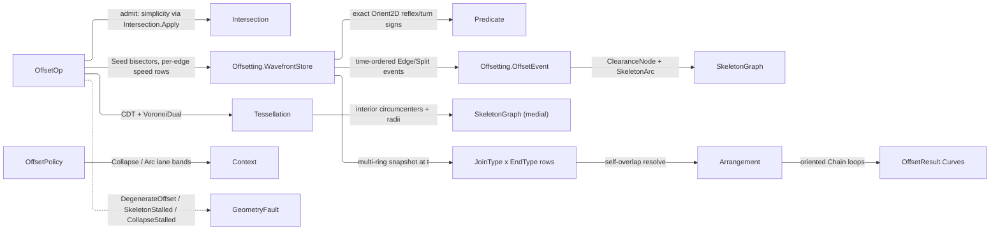

# [RASM_OFFSETTING_OFFSET]

`OffsetOp` owns exact wavefront offsetting in `Rasm.Meshing`: straight-skeleton, offset, medial axis, Minkowski sum, and clearance are peer modality cases on one `[Union]` folded by one `Offsetting.Apply` entry over an Aichholzer-Aurenhammer wavefront. Exactness lives where a sign decides structure — reflex classification, split admission, ring simplicity, and convolution compatibility read exact `Predicate.Orient2D` turn signs over INPUT geometry — while event times stay analytic schedule data validated at fire by liveness, ring adjacency, and the collapse band.

Rebuilding composes ring simplicity and convolution crossings from `Meshing/intersect` `Intersection.Apply`, self-overlap resolution from `Meshing/arrangement` `Arrangement.Apply` `PlanarOverlay` under the nonzero winding rule, the medial locus from `Meshing/delaunay` `VoronoiDual`, and both metric bands from `Domain/context` `ToleranceLane` rows read off the policy's bound `Context`. It mints `ClearanceNode` and `ClearanceProbe` — the clearance family `Meshing/skeleton` composes verbatim — the `SkeletonGraph`/`SkeletonArc` carriers, the `JoinType`/`EndType` generators, the `OffsetOp`/`OffsetResult` unions, and, private inside `Offsetting`, the `WavefrontStore` arena under the `Meshing/edit` arena law beside the `OffsetEvent` algebra; every failure returns over `Fin`.

## [01]-[INDEX]

- [02]-[OFFSETTING]: one `Offsetting.Apply` folding six `OffsetOp` cases over one wavefront; the nested `Edge`/`Split` event queue on the nested `WavefrontStore` arena; the minted `ClearanceNode` family and `Clearance(probe)` query; medial via the delaunay `VoronoiDual`; `JoinType`×`EndType` corner/cap generators; the support-vertex Minkowski walk; loop resolution through the arrangement.
- [03]-[DENSITY_BAR]: one owner per axis with its return type and case count.

## [02]-[OFFSETTING]

- Owner: `OffsetOp` mints the one request `[Union]` and `Offsetting.Apply` the sole fold. `JoinType` and `EndType` are `[SmartEnum]` generators — each row carries its own `Corner`/`Cap` emission delegate, so a join or cap `switch` is unspellable. `OffsetPolicy` binds ONE `Context` for the run, derives the two metric bands off it through `Context.For`, and takes every ceiling — time budget, event budget, arena capacity law — as an `Of` argument over its canonical row, so a caller re-budgets a run without a second factory; `OffsetReach` is the ONE reach vocabulary — `Uniform` carries the signed scalar and `PerEdge` the per-edge table, so the variable lane is a CASE and never an empty-table sentinel beside a scalar. `Weighted` carries its own `EdgeSpeed` table; every per-edge table addresses the ORIGINAL ring edges and crosses the one `EdgeTable` gate — arity against the edge count, finite, strictly positive, reoriented with its ring. `ClearanceProbe` is the ONE indexed nearest-segment query the family reads — admission builds it per ring and the medial fold, the wavefront drain, and the probe query all share it. `SkeletonGraph` is one graph shape for skeleton and medial alike, the REQUEST carrying the semantics; the fence declares each supporting owner — the `ClearanceNode`/`SkeletonArc` carriers module-level, the `WavefrontStore` arena and the `OffsetEvent` algebra NESTED inside `Offsetting` where no caller can couple to live wavefront state — one per row.
- Cases: `OffsetOp` discriminates the offsetting modality, `OffsetReach` the uniform-or-per-edge reach it carries, and `OffsetResult` the return shape — `Skeleton`/`Weighted`/`Medial` yield `Graph`, `Offset`/`Minkowski` `Curves`, `Clearance` a `Probe`; the ad-hoc union carries the three real payloads and mints no wrapper.
- Entry: one polymorphic `Apply` discriminates on the op case and resolves the key every interior static then takes outright — no `BuildSkeleton`/`BuildMedial`/`OffsetPolyline` sibling statics. Its `Fin` result routes `DegenerateOffset` on an inadmissible input (open or non-finite ring, zero area, self-intersection via `Intersection.Apply`, or a per-edge table whose `Count` mismatches the edge count or carries a non-finite or non-positive row — the one policy invariant no value object can hold, gated once at `EdgeTable`), `SkeletonStalled` on budget exhaustion, and `CollapseStalled` on a zero-progress event cycle. `Offset` owns every offset modality in the one case: inward closed-ring (`Uniform` with positive `Distance`, or `PerEdge`, the wavefront lane), outward closed-ring (`Uniform` with negative `Distance`, the direct ribbon), and open-path (the two-sided ribbon with `EndType` caps) — the input shape and the reach case discriminate, never a sibling `OffsetOpen`/`OffsetOutward` entry; a reach past the inradius vanishes to an empty curve set, never a fault. `PerEdge` is closed-ring inward alone, its `Span` the greatest reach the drain freezes on. Evaluation runs on the XY projection, every emission returning at the ring's leading elevation.
- Auto: admission seats the ring's ONE `ClearanceProbe`, whose self-overlap walk supplies the simplicity sweep's candidate pairs and whose box-ordered nearest query answers every boundary distance downstream. `Skeleton`, `Weighted`, and `Offset` share one `Propagate` wavefront — `Seed` builds each vertex's inward velocity solving both incident edges at their own speed, so the weighted skeleton and the variable offset are the same queue at non-unit speeds and `EdgeOf` keys every respawn's speeds through each rewire; `PerEdge` derives its speeds as each reach over `OffsetReach.Span`, so that one span stays the reach authority the drain freezes on. Exact `Orient2D` signs decide reflex classification and split admission while the time-ordered queue drains `Edge` and `Split` events, each re-validated at fire against the `Collapse` lane band and minting a `ClearanceNode` whose radius is the boundary distance — recomputed as the true Euclidean distance under `Weighted` so the payload never carries a weighted time. `Offset` freezes the drain at `until = Reach.Span`: every surviving ring walks out and each reflex corner dresses with the arc of radius `Span − spawn` centred on its emanating node and the `JoinType` fan sampled to the `Arc` lane band, convex corners passing through, while outward and open offsets ride the direct ribbon — input CLOSURE decides the contour count, so a closed ring emits one side and every open path emits both, and the end row's `ClosesRibbon` verdict decides only whether cap points join them. `Medial` composes the constrained-Delaunay `VoronoiDual` interior circumcenters, whose curved sampling carries the parabolic reflex arcs; `Minkowski` walks the support vertices emitting both convolution directions from one walk over a convex-gated element; every self-overlapping loop set resolves through the arrangement's nonzero winding.
- Output: the `OffsetResult` ad-hoc union over `SkeletonGraph`, `Seq<Chain>`, and `ClearanceNode`, every node carrying its clearance radius; the hash-eligible artifacts are the emitted `Polyline`/`Chain` values, never the live `WavefrontStore`.
- Law: every budget and ratio is a guarded value object and both metric bands are `ToleranceLane` rows derived from the bound `Context`, so the policy carries no evidence fold and no page-local epsilon; the only invariant left is each speed table's arity-and-positivity, and it is gated once at the arm that reads it.
- Exemption: the wavefront's BCL `PriorityQueue` is the named span-kernel stay — an event simulation orders by a schedule TIME the fire re-validates, not by a graph relaxation, and QuikGraph publishes no event queue; the `free` slot recycler is a stack the arena pops and pushes with no traversal reading it; the ring walk reads the arena's own successor column and its product is the CYCLIC ORDER no component labeller publishes. Mutable tables — `keep` in the medial fold, `seen` in the ring walk, the `WavefrontStore` columns themselves — live inside one statement kernel and never freeze.
- Packages: `Rasm.Numerics` (`Predicate` exact-turn floor, `EpsilonPolicy.ZeroTolerance` the dimensionless degeneracy floor, `Dimension`/`PositiveMagnitude` the guarded budgets, `GeometryFault`), `Rasm.Meshing` (`Intersection.Apply` crossing checks and `Chain` loop rows, `Containment.Of` the ONE even-odd ring predicate, `ArenaPolicy` the wavefront capacity law, `Tessellation.Build`/`VoronoiDual` medial substrate with `Conform.Edge` ring conforms, `Arrangement.Apply` loop resolution), `Rasm.Spatial` (`SpatialIndex.Build` and the k-nearest and self-overlap `Query` arms — the probe's index and the simplicity broad phase), `Rasm.Domain` (`Context`/`ToleranceLane` the two metric bands, `ValidityClaim`), CommunityToolkit.HighPerformance (`MemoryOwner<T>` the support-dot plane), System.Numerics.Tensors (`TensorPrimitives.IndexOfMax` the support search), `Rhino.Geometry` (`Point3d`/`Vector3d`/`Line.ClosestParameter`/`PointAt`/`DistanceTo`/`Polyline`/`BoundingBox`), Thinktecture.Runtime.Extensions, LanguageExt.Core, BCL `PriorityQueue`.
- Growth: a new offsetting modality is one `OffsetOp` case over the same propagation; a new corner strategy one `JoinType` row carrying its emission delegate; a new cap one `EndType` row; a new event shape one `OffsetEvent` case and one drain arm; a new metric band one `ToleranceLane` read off the bound `Context`. Clearance family widens by zero new types; variable-speed demands ride `EdgeSpeed`, variable-reach demands one `OffsetReach` case.
- Boundary: `OffsetOp` is the sole offsetting `[Union]`; exact turn signs decide reflex classification, split admission, ring simplicity, and convolution compatibility over input geometry, while event ordering stays analytic schedule data validated at fire. Ring simplicity and convolution crossings route `Intersection.Apply` behind the probe's own broad phase; the interior test routes `slice.md`'s `Containment.Of`, since a page-local straddle forks the crossing kernel's verdict; loop resolution routes `Arrangement.Apply` `PlanarOverlay` ring-direct; the medial composes the delaunay `VoronoiDual`. `Apply` is total over `Fin`, so a degenerate ring or stalled queue returns a fault rather than throwing, and a `Split` divides the ring rather than dropping a reflex chain to satisfy a budget.

```csharp
// --- [IMPORTS] -------------------------------------------------------------------------
using System;
using System.Collections.Generic;
using System.Linq;
using System.Numerics.Tensors;
using CommunityToolkit.HighPerformance.Buffers;
using LanguageExt;
using Rasm.Domain;
using Rasm.Numerics;
using Rasm.Spatial;
using Rhino.Geometry;
using Thinktecture;
using static LanguageExt.Prelude;

namespace Rasm.Meshing;

// --- [TYPES] ---------------------------------------------------------------------------
[SmartEnum]
public sealed partial class JoinType {
    public static readonly JoinType Miter  = new(corner: static (apex, nIn, nOut, distance, policy) => {
        Vector3d bisector = nIn + nOut;
        double len = bisector.Length;
        if (len <= EpsilonPolicy.ZeroTolerance) return Seq<Point3d>();
        double reach = distance / (0.5 * len);
        return reach <= policy.MiterLimit.Value * Math.Abs(distance)
            ? Seq(apex + (reach / len) * bisector)
            : Seq<Point3d>();
    });
    public static readonly JoinType Round  = new(corner: static (apex, nIn, nOut, distance, policy) => {
        double cross = (nIn.X * nOut.Y) - (nIn.Y * nOut.X);
        double sweep = Math.Atan2(Math.Abs(cross), (nIn.X * nOut.X) + (nIn.Y * nOut.Y));
        double turn = cross < 0.0 ? -1.0 : 1.0;
        Vector3d perp = new(-turn * nIn.Y, turn * nIn.X, 0.0);
        int steps = int.Max(1, (int)Math.Ceiling(sweep / (2.0 * Math.Acos(double.Clamp(1.0 - (policy.ArcBand / Math.Abs(distance)), -1.0, 1.0)))));
        return toSeq(Enumerable.Range(1, steps - 1).Select(i => apex + distance
            * ((Math.Cos(sweep * i / steps) * nIn) + (Math.Sin(sweep * i / steps) * perp))));
    });
    public static readonly JoinType Bevel  = new(corner: static (_, _, _, _, _) => Seq<Point3d>());
    public static readonly JoinType Square = new(corner: static (apex, nIn, nOut, distance, _) => {
        Vector3d bisector = nIn + nOut;
        double len = bisector.Length;
        if (len <= EpsilonPolicy.ZeroTolerance) return Seq<Point3d>();
        (double bx, double by) = (bisector.X / len, bisector.Y / len);
        double cos = (nIn.X * bx) + (nIn.Y * by);
        double dotIn = (-nIn.Y * bx) + (nIn.X * by), dotOut = (-nOut.Y * bx) + (nOut.X * by);
        return Math.Abs(dotIn) <= EpsilonPolicy.ZeroTolerance || Math.Abs(dotOut) <= EpsilonPolicy.ZeroTolerance
            ? Seq<Point3d>()
            : Seq(apex + (distance * nIn) + ((distance * (1.0 - cos) / dotIn) * new Vector3d(-nIn.Y, nIn.X, 0.0)),
                  apex + (distance * nOut) + ((distance * (1.0 - cos) / dotOut) * new Vector3d(-nOut.Y, nOut.X, 0.0)));
    });

    [UseDelegateFromConstructor]
    public partial Seq<Point3d> Corner(Point3d apex, Vector3d nIn, Vector3d nOut, double distance, OffsetPolicy policy);
}

[SmartEnum]
public sealed partial class EndType {
    public static readonly EndType Closed = new(cap: static (_, _, _, _) => Seq<Point3d>(), closesRibbon: true);
    public static readonly EndType Joined = new(cap: static (_, _, _, _) => Seq<Point3d>(), closesRibbon: true);
    public static readonly EndType Butt   = new(cap: static (_, _, _, _) => Seq<Point3d>(), closesRibbon: false);
    public static readonly EndType Square = new(cap: static (end, tangent, distance, _) =>
        Seq(end + distance * new Vector3d(tangent.Y, -tangent.X, 0.0) + distance * tangent,
            end + distance * new Vector3d(-tangent.Y, tangent.X, 0.0) + distance * tangent), closesRibbon: false);
    public static readonly EndType Round  = new(cap: static (end, tangent, distance, policy) =>
        JoinType.Round.Corner(end, new Vector3d(tangent.Y, -tangent.X, 0.0),
            new Vector3d(-tangent.Y, tangent.X, 0.0), distance, policy), closesRibbon: false);

    public bool ClosesRibbon { get; }

    [UseDelegateFromConstructor]
    public partial Seq<Point3d> Cap(Point3d end, Vector3d tangent, double distance, OffsetPolicy policy);
}

// --- [CONSTANTS] -----------------------------------------------------------------------
public sealed record OffsetPolicy(
    Context Context, PositiveMagnitude TimeBudget, Dimension MaxEvents, Dimension SameTimeMultiple,
    ArenaPolicy Arena, Dimension NearestCandidates, PositiveMagnitude MiterLimit) {
    public static OffsetPolicy Of(Context context, Option<PositiveMagnitude> timeBudget = default,
        Option<Dimension> maxEvents = default, Option<ArenaPolicy> arena = default) => new(
        context, timeBudget.IfNone(PositiveMagnitude.Create(1e9)),
        maxEvents.IfNone(Dimension.Create(1 << 20)), Dimension.Create(4),
        arena.IfNone(ArenaPolicy.Canonical), Dimension.Create(16), PositiveMagnitude.Create(2.0));

    public double CollapseBand => Context.For(ToleranceLane.Collapse).Value;
    public double ArcBand => Context.For(ToleranceLane.Arc).Value;
}

// --- [MODELS] --------------------------------------------------------------------------
public sealed record ClearanceNode(Point3d At, double Radius, int NearestEdge);

public sealed class ClearanceProbe {
    readonly Arr<Line> segments;
    readonly Option<SpatialIndex> index;
    readonly Dimension ceiling;

    ClearanceProbe(Arr<Line> segments, Option<SpatialIndex> index, Dimension ceiling) =>
        (this.segments, this.index, this.ceiling) = (segments, index, ceiling);

    internal int Count => segments.Count;
    internal Line this[int segment] => segments[segment];

    public static ClearanceProbe Of(Arr<Line> segments, Dimension ceiling) {
        BoundingBox[] boxes = [.. segments.Map(static segment => segment.BoundingBox)];
        Option<SpatialIndex> index = SpatialIndex.Build(SpatialKind.Bvh, boxes, BuildPolicy.Canonical).ToOption();
        return new(segments, index, ceiling);
    }

    public (double Distance, int Segment, double Parameter) Nearest(Point3d probe) {
        for (int candidates = int.Min(ceiling.Value, Count); ;
            candidates = int.Min(candidates << 1, Count)) {
            (double best, int at, double foot, bool closed) = (double.PositiveInfinity, 0, 0.0, false);
            IEnumerable<int> ordered = index.Bind(seated => seated.Query(probe, candidates).ToOption())
                .Map(static ranked => ranked.AsEnumerable())
                .IfNone(() => Enumerable.Range(0, Count));
            foreach (int s in ordered) {
                if (index.IsSome && segments[s].BoundingBox.ClosestPoint(probe, true).DistanceTo(probe) >= best) { closed = true; break; }
                Line segment = segments[s];
                double t = segment.Length <= EpsilonPolicy.ZeroTolerance
                    ? 0.0 : Math.Clamp(segment.ClosestParameter(probe), 0.0, 1.0);
                double distance = segment.PointAt(t).DistanceTo(probe);
                if (distance < best) (best, at, foot) = (distance, s, t);
            }
            if (closed || candidates >= Count) return (best, at, foot);
        }
    }

    internal IEnumerable<(int I, int J)> Overlaps(double tolerance) =>
        index.Bind(seated => seated.Query(tolerance).ToOption())
            .Map(static pairs => pairs.AsEnumerable().Select(static pair =>
                (int.Min(pair.Left, pair.Right), int.Max(pair.Left, pair.Right))))
            .IfNone(() => from i in Enumerable.Range(0, Count)
                from j in Enumerable.Range(i + 1, Count - i - 1) select (i, j));
}

public sealed record SkeletonArc(int From, int To, int OriginEdge);
public sealed record SkeletonGraph(Seq<ClearanceNode> Nodes, Seq<SkeletonArc> Arcs);

[Union<SkeletonGraph, Seq<Chain>, ClearanceNode>(
    T1Name = "Graph", T2Name = "Curves", T3Name = "Probe")]
public readonly partial struct OffsetResult;

// --- [OPERATIONS] ----------------------------------------------------------------------
[Union(ConversionFromValue = ConversionOperatorsGeneration.None)]
public abstract partial record OffsetReach {
    private OffsetReach() { }

    public sealed record Uniform(double Distance) : OffsetReach;
    public sealed record PerEdge(Arr<double> Distances) : OffsetReach;

    public double Span => Switch(
        uniform: static u => u.Distance,
        perEdge: static p => p.Distances.Max(0.0));
}

[Union(ConversionFromValue = ConversionOperatorsGeneration.None)]
public abstract partial record OffsetOp {
    private OffsetOp() { }

    public sealed record Skeleton(Polyline Ring, OffsetPolicy Policy) : OffsetOp;
    public sealed record Weighted(Polyline Ring, Arr<double> EdgeSpeed, OffsetPolicy Policy) : OffsetOp;
    public sealed record Offset(Polyline Path, OffsetReach Reach, JoinType Join, EndType End, OffsetPolicy Policy) : OffsetOp;
    public sealed record Medial(Polyline Ring, OffsetPolicy Policy) : OffsetOp;
    public sealed record Minkowski(Polyline Ring, Polyline Element, OffsetPolicy Policy) : OffsetOp;
    public sealed record Clearance(Polyline Ring, Point3d Probe, OffsetPolicy Policy) : OffsetOp;
}

public static partial class Offsetting {
    sealed class WavefrontStore {
        double[] px, py, vx, vy, spawnTime;
        int[] prev, next, node, edgeOf;
        bool[] dead;
        readonly Stack<int> free = new();
        readonly double plane;
        int count;

        public WavefrontStore(ArenaPolicy policy, double plane) {
            int seed = policy.Capacity.Value;
            (px, py, vx, vy, spawnTime) = (new double[seed], new double[seed], new double[seed], new double[seed], new double[seed]);
            (prev, next, node, edgeOf, dead) = (new int[seed], new int[seed], new int[seed], new int[seed], new bool[seed]);
            this.plane = plane;
        }

        public int Count => count;
        public bool Alive(int v) => v >= 0 && v < count && !dead[v];
        public int Prev(int v) => prev[v];
        public int Next(int v) => next[v];
        public int Node(int v) => node[v];
        public int EdgeOf(int v) => edgeOf[v];
        public double SpawnTime(int v) => spawnTime[v];
        public Point3d At(int v, double time) =>
            new(px[v] + ((time - spawnTime[v]) * vx[v]), py[v] + ((time - spawnTime[v]) * vy[v]), plane);
        public Vector3d Velocity(int v) => new(vx[v], vy[v], 0.0);

        public int Spawn(Point3d at, Vector3d velocity, double time, int fromNode, int outEdge) {
            int v = free.Count > 0 ? free.Pop() : count++;
            if (v >= px.Length) {
                int extent = int.Max(v + 1, px.Length << 1);
                System.Array.Resize(ref px, extent); System.Array.Resize(ref py, extent);
                System.Array.Resize(ref vx, extent); System.Array.Resize(ref vy, extent);
                System.Array.Resize(ref spawnTime, extent);
                System.Array.Resize(ref prev, extent); System.Array.Resize(ref next, extent);
                System.Array.Resize(ref node, extent); System.Array.Resize(ref edgeOf, extent);
                System.Array.Resize(ref dead, extent);
            }
            (px[v], py[v], vx[v], vy[v]) = (at.X, at.Y, velocity.X, velocity.Y);
            (spawnTime[v], node[v], edgeOf[v], dead[v]) = (time, fromNode, outEdge, false);
            return v;
        }

        public void Kill(int v) { dead[v] = true; free.Push(v); }
        public void LinkRing(int a, int b) { next[a] = b; prev[b] = a; }
    }

    [Union(ConversionFromValue = ConversionOperatorsGeneration.None)]
    abstract partial record OffsetEvent {
        private OffsetEvent() { }

        public sealed record Edge(double Time, int Vertex, int NextVertex) : OffsetEvent;
        public sealed record Split(double Time, int Reflex, int OpposingA, int OpposingB) : OffsetEvent;

        public double Time =>
            Switch(edge: static e => e.Time, split: static s => s.Time);
    }

    public static Fin<OffsetResult> Apply(OffsetOp op) {
        return op.Switch(
            skeleton:  s => AdmitRing(s.Ring, s.Policy, site)
                .Bind(admitted => Propagate(admitted, s.Policy, Arr<double>.Empty))
                .Map(static trace => (OffsetResult)trace.Graph),
            weighted:  w => AdmitRing(w.Ring, w.Policy, site)
                .Bind(admitted => EdgeTable(w.EdgeSpeed, admitted.Edges.Count, w.Ring)
                    .Bind(speeds => Propagate(admitted, w.Policy, speeds)))
                .Map(static trace => (OffsetResult)trace.Graph),
            offset:    o => Snapshot(o, site),
            medial:    m => AdmitRing(m.Ring, m.Policy, site).Bind(static admitted => MedialOf(admitted)).Map(static graph => (OffsetResult)graph),
            minkowski: k => AdmitRing(k.Ring, k.Policy, site).Bind(ring =>
                    AdmitRing(k.Element, k.Policy, site).Bind(element =>
                        Convolve(ring.Ring, element.Ring, site)))
                .Map(static curves => (OffsetResult)curves),
            clearance: c => AdmitRing(c.Ring, c.Policy, site).Map(admitted => {
                (double radius, int edge, double _) = admitted.Edges.Nearest(c.Probe);
                return (OffsetResult)new ClearanceNode(c.Probe, radius, edge);
            }));
    }

    static Fin<(Polyline Ring, ClearanceProbe Edges)> AdmitRing(
        Polyline ring, OffsetPolicy policy) {
        if (ring.Count < 4 || !ring.IsClosed) return new GeometryFault.DegenerateOffset(0);
        for (int i = 0; i < ring.Count; i++) {
            if (!ValidityClaim.Finite(ring[i])
                || i > 0 && ring[i].DistanceTo(ring[i - 1]) <= policy.CollapseBand)
                return new GeometryFault.DegenerateOffset(i);
        }
        Sign orientation = Orientation(ring);
        if (orientation == Sign.Zero) return new GeometryFault.DegenerateOffset(0);
        Polyline oriented = ring;
        if (orientation == Sign.Negative) {
            oriented = new(ring);
            oriented.Reverse();
        }
        ClearanceProbe edges = EdgesOf(oriented, policy);
        return SelfCrossing(edges, policy).Bind(crossing => crossing.Match(
            Some: vertex => Fin.Fail<(Polyline Ring, ClearanceProbe Edges)>(
                new GeometryFault.DegenerateOffset(vertex)),
            None: () => Fin.Succ((oriented, edges))));
    }

    static ClearanceProbe EdgesOf(Polyline ring, OffsetPolicy policy) =>
        ClearanceProbe.Of(new Arr<Line>([.. Enumerable.Range(0, ring.Count - 1)
            .Select(edge => new Line(ring[edge], ring[edge + 1]))]), policy.NearestCandidates);

    static Fin<Option<int>> SelfCrossing(ClearanceProbe edges, OffsetPolicy policy) =>
        toSeq(edges.Overlaps(policy.CollapseBand)
            .Where(pair => pair.J - pair.I >= 2 && (pair.I != 0 || pair.J != edges.Count - 1)))
        .TraverseM(pair => Intersection.Apply(new IntersectOp.SegmentSegment(
                edges[pair.I], edges[pair.J], Axis.Z))
            .Map(result => result.Switch(
                points:   points => points.Hits.IsEmpty ? Option<int>.None : Some(pair.I),
                segments: segments => segments.Crossings.IsEmpty ? Option<int>.None : Some(pair.I),
                chains:   chains => chains.Walked.IsEmpty ? Option<int>.None : Some(pair.I))))
        .As()
        .Map(crossings => crossings.Find(static crossing => crossing.IsSome)
            .Bind(static crossing => crossing));

    static Fin<Polyline> AdmitPath(Polyline path, OffsetPolicy policy) {
        if (path.Count < 2) return new GeometryFault.DegenerateOffset(0);
        for (int i = 0; i < path.Count; i++) {
            if (!ValidityClaim.Finite(path[i])
                || i > 0 && path[i].DistanceTo(path[i - 1]) <= policy.CollapseBand)
                return new GeometryFault.DegenerateOffset(i);
        }
        return path;
    }

    // --- [WAVEFRONT]
    static Fin<(WavefrontStore Store, SkeletonGraph Graph)> Propagate(
        (Polyline Ring, ClearanceProbe Edges) admitted,
        OffsetPolicy policy, Arr<double> speeds, double until = double.PositiveInfinity) {
        Polyline ring = admitted.Ring;
        WavefrontStore store = Seed(ring, policy, speeds);
        PriorityQueue<OffsetEvent, double> queue = new();
        int n = ring.Count - 1;
        List<ClearanceNode> nodes = new(Enumerable.Range(0, n).Select(i => new ClearanceNode(ring[i], 0.0, i)));
        List<SkeletonArc> arcs = new();
        for (int v = 0; v < store.Count; v++) { EnqueueAt(store, queue, v, 0.0, speeds); }
        (int fired, Option<double> lastTime, int sameTime) = (0, None, 0);
        while (queue.Count > 0 && queue.Peek().Time <= until) {
            if (fired++ >= policy.MaxEvents.Value)
                return Fin.Fail<(WavefrontStore Store, SkeletonGraph Graph)>(
                    new GeometryFault.SkeletonStalled(queue.Count, Some(queue.Peek().Time)));
            OffsetEvent ev = queue.Dequeue();
            if (ev.Time > policy.TimeBudget.Value)
                return Fin.Fail<(WavefrontStore Store, SkeletonGraph Graph)>(
                    new GeometryFault.SkeletonStalled(queue.Count, Some(ev.Time)));
            sameTime = lastTime.Exists(prior => ev.Time == prior) ? sameTime + 1 : 0;
            if (sameTime > store.Count * policy.SameTimeMultiple.Value) {
                return Fin.Fail<(WavefrontStore Store, SkeletonGraph Graph)>(
                    new GeometryFault.CollapseStalled(fired, ev.Time - lastTime.IfNone(ev.Time)));
            }
            lastTime = Some(ev.Time);
            ev.Switch(
                edge: e => {
                    if (store.Alive(e.Vertex) && store.Alive(e.NextVertex) && store.Next(e.Vertex) == e.NextVertex
                        && store.At(e.Vertex, e.Time).DistanceTo(store.At(e.NextVertex, e.Time)) <= policy.CollapseBand) {
                        Collapse(store, e, admitted.Edges, nodes, arcs, queue, speeds);
                    }
                },
                split: s => {
                    if (store.Alive(s.Reflex) && store.Alive(s.OpposingA) && store.Alive(s.OpposingB)
                        && store.Next(s.OpposingA) == s.OpposingB
                        && new Line(store.At(s.OpposingA, s.Time), store.At(s.OpposingB, s.Time))
                            .DistanceTo(store.At(s.Reflex, s.Time), true) <= policy.CollapseBand) {
                        Divide(store, s, admitted.Edges, nodes, arcs, queue, speeds);
                    }
                });
        }
        return (store, new SkeletonGraph(toSeq(nodes), toSeq(arcs)));
    }

    static WavefrontStore Seed(Polyline ring, OffsetPolicy policy, Arr<double> speeds) {
        int n = ring.Count - 1;
        WavefrontStore store = new(policy.Arena, ring[0].Z);
        for (int i = 0; i < n; i++) {
            int inEdge = (i - 1 + n) % n;
            store.Spawn(ring[i], Bisector(ring[inEdge], ring[i], ring[(i + 1) % n], Speed(speeds, inEdge), Speed(speeds, i)), 0.0, fromNode: i, outEdge: i);
        }
        for (int i = 0; i < n; i++) { store.LinkRing(i, (i + 1) % n); }
        return store;
    }

    static double Speed(Arr<double> speeds, int edge) => speeds.Count > 0 ? speeds[edge] : 1.0;

    static Vector3d Bisector(Point3d prev, Point3d cur, Point3d next, double speedIn, double speedOut) {
        Vector3d nIn = Unit(new Vector3d(prev.Y - cur.Y, cur.X - prev.X, 0.0));
        Vector3d nOut = Unit(new Vector3d(cur.Y - next.Y, next.X - cur.X, 0.0));
        double det = (nIn.X * nOut.Y) - (nIn.Y * nOut.X);
        return Math.Abs(det) <= EpsilonPolicy.ZeroTolerance
            ? speedOut * nOut
            : new Vector3d(((speedIn * nOut.Y) - (speedOut * nIn.Y)) / det, ((speedOut * nIn.X) - (speedIn * nOut.X)) / det, 0.0);
    }

    static void EnqueueAt(
        WavefrontStore store, PriorityQueue<OffsetEvent, double> queue,
        int v, double now, Arr<double> speeds) {
        if (!store.Alive(v)) return;
        int next = store.Next(v);
        EdgeCollapseTime(store, v, next, now)
            .IfSome(time => queue.Enqueue(new OffsetEvent.Edge(time, v, next), time));
        if (Predicate.Orient2D(
                store.At(store.Prev(v), now), store.At(v, now), store.At(next, now)) == Sign.Negative)
            SplitTime(store, v, now, speeds).IfSome(split =>
                queue.Enqueue(new OffsetEvent.Split(split.Time, v, split.A, split.B), split.Time));
    }

    static void Collapse(
        WavefrontStore store, OffsetEvent.Edge ev, ClearanceProbe edges, List<ClearanceNode> nodes,
        List<SkeletonArc> arcs, PriorityQueue<OffsetEvent, double> queue, Arr<double> speeds) {
        Point3d meet = store.At(ev.Vertex, ev.Time);
        (double radius, int witness, double _) = edges.Nearest(meet);
        int node = nodes.Count;
        nodes.Add(new ClearanceNode(meet, speeds.Count == 0 ? ev.Time : radius, witness));
        arcs.Add(new SkeletonArc(store.Node(ev.Vertex), node, store.EdgeOf(ev.Vertex)));
        arcs.Add(new SkeletonArc(store.Node(ev.NextVertex), node, store.EdgeOf(ev.NextVertex)));
        (int before, int after) = (store.Prev(ev.Vertex), store.Next(ev.NextVertex));
        store.Kill(ev.Vertex);
        store.Kill(ev.NextVertex);
        if (before == ev.NextVertex || after == ev.Vertex) { return; }
        int outEdge = store.EdgeOf(ev.NextVertex);
        int merged = store.Spawn(meet,
            Bisector(store.At(before, ev.Time), meet, store.At(after, ev.Time), Speed(speeds, store.EdgeOf(before)), Speed(speeds, outEdge)),
            ev.Time, node, outEdge);
        store.LinkRing(before, merged);
        store.LinkRing(merged, after);
        EnqueueAt(store, queue, before, ev.Time, speeds);
        EnqueueAt(store, queue, merged, ev.Time, speeds);
    }

    static void Divide(
        WavefrontStore store, OffsetEvent.Split ev, ClearanceProbe edges, List<ClearanceNode> nodes,
        List<SkeletonArc> arcs, PriorityQueue<OffsetEvent, double> queue, Arr<double> speeds) {
        Point3d hit = store.At(ev.Reflex, ev.Time);
        (double radius, int witness, double _) = edges.Nearest(hit);
        int node = nodes.Count;
        nodes.Add(new ClearanceNode(hit, speeds.Count == 0 ? ev.Time : radius, witness));
        arcs.Add(new SkeletonArc(store.Node(ev.Reflex), node, store.EdgeOf(ev.Reflex)));
        (int before, int after) = (store.Prev(ev.Reflex), store.Next(ev.Reflex));
        int opposingEdge = store.EdgeOf(ev.OpposingA);
        int left = store.Spawn(hit,
            Bisector(store.At(before, ev.Time), hit, store.At(ev.OpposingB, ev.Time), Speed(speeds, store.EdgeOf(before)), Speed(speeds, opposingEdge)),
            ev.Time, node, opposingEdge);
        int right = store.Spawn(hit,
            Bisector(store.At(ev.OpposingA, ev.Time), hit, store.At(after, ev.Time), Speed(speeds, opposingEdge), Speed(speeds, store.EdgeOf(ev.Reflex))),
            ev.Time, node, store.EdgeOf(ev.Reflex));
        store.Kill(ev.Reflex);
        store.LinkRing(before, left);
        store.LinkRing(left, ev.OpposingB);
        store.LinkRing(ev.OpposingA, right);
        store.LinkRing(right, after);
        foreach (int v in (ReadOnlySpan<int>)[before, left, ev.OpposingA, right]) { EnqueueAt(store, queue, v, ev.Time, speeds); }
    }

    static Option<double> EdgeCollapseTime(WavefrontStore store, int u, int v, double now) {
        (Point3d pu, Point3d pv) = (store.At(u, now), store.At(v, now));
        (Vector3d du, Vector3d dv) = (store.Velocity(u), store.Velocity(v));
        Vector3d gap = pv - pu, rel = dv - du;
        double closing = (gap.X * rel.X) + (gap.Y * rel.Y);
        double speed2 = (rel.X * rel.X) + (rel.Y * rel.Y);
        return closing < 0.0 && speed2 > 0.0 ? Some(now + (-closing / speed2)) : None;
    }

    static Option<(double Time, int A, int B)> SplitTime(WavefrontStore store, int reflex, double now, Arr<double> speeds) {
        Point3d p = store.At(reflex, now);
        Vector3d d = store.Velocity(reflex);
        (Option<(double, int, int)> best, double bestTime) = (None, double.PositiveInfinity);
        for (int e = store.Next(reflex); store.Alive(e) && e != store.Prev(reflex); e = store.Next(e)) {
            int f = store.Next(e);
            if (e == reflex || f == reflex || !store.Alive(f)) { continue; }
            (Point3d a, Point3d b) = (store.At(e, now), store.At(f, now));
            Vector3d m = Unit(new Vector3d(a.Y - b.Y, b.X - a.X, 0.0));
            double approach = (d.X * m.X) + (d.Y * m.Y) - Speed(speeds, store.EdgeOf(e));
            if (approach >= 0.0) { continue; }
            double t = now + (((m.X * (a.X - p.X)) + (m.Y * (a.Y - p.Y))) / approach);
            if (t > now && t < bestTime) { (best, bestTime) = (Some((t, e, f)), t); }
        }
        return best.Map(static x => (x.Item1, x.Item2, x.Item3));
    }

    // --- [OFFSET_ASSEMBLY]
    // one arity, finiteness, and positivity gate over an ORIGINAL-edge table, reoriented with its ring
    static Fin<Arr<double>> EdgeTable(Arr<double> rows, int edges, Polyline ring) =>
        rows.Count == edges && rows.ForAll(static row => double.IsFinite(row) && row > 0.0)
            ? Fin.Succ(Orientation(ring) == Sign.Negative ? rows.Reverse() : rows)
            : Fin.Fail<Arr<double>>(new GeometryFault.DegenerateOffset(rows.Count));

    static Fin<OffsetResult> Snapshot(OffsetOp.Offset op) =>
        op.Reach.Switch(
            state: (Op: op, Key: key, Span: op.Reach.Span),
            uniform: static (s, u) => double.IsFinite(u.Distance)
                ? s.Op.Path.IsClosed && u.Distance > 0.0
                    ? AdmitRing(s.Op.Path, s.Op.Policy)
                        .Bind(admitted => Propagate(admitted, s.Op.Policy, Arr<double>.Empty, until: u.Distance))
                        .Map(trace => Rings(trace.Store).Map(loop => Dressed(trace, loop, u.Distance)))
                    : s.Op.Path.IsClosed
                        ? AdmitRing(s.Op.Path, s.Op.Policy).Map(admitted => Ribbon(s.Op with { Path = admitted.Ring }, u.Distance))
                        : AdmitPath(s.Op.Path, s.Op.Policy).Map(path => Ribbon(s.Op with { Path = path }, u.Distance))
                : Fin.Fail<Seq<Polyline>>(new GeometryFault.DegenerateOffset(0)),
            perEdge: static (s, p) => s.Op.Path.IsClosed
                ? AdmitRing(s.Op.Path, s.Op.Policy)
                    .Bind(admitted => EdgeTable(p.Distances, admitted.Edges.Count, s.Op.Path)
                        .Bind(reaches => Propagate(admitted, s.Op.Policy,
                            reaches.Map(reach => reach / s.Span), until: s.Span)))
                    .Map(trace => Rings(trace.Store).Map(loop => Dressed(trace, loop, s.Span)))
                : Fin.Fail<Seq<Polyline>>(new GeometryFault.DegenerateOffset(p.Distances.Count)))
        .Bind(loops => loops.IsEmpty ? Fin.Succ(Seq<Chain>()) : Resolve(loops, op.Policy))
        .Map(chains => (OffsetResult)chains);

    static Seq<int[]> Rings(WavefrontStore store) {
        HashSet<int> seen = new();
        List<int[]> loops = new();
        for (int v = 0; v < store.Count; v++) {
            if (!store.Alive(v) || seen.Contains(v)) { continue; }
            List<int> loop = new();
            int cur = v;
            do {
                seen.Add(cur);
                loop.Add(cur);
                cur = store.Next(cur);
            } while (store.Alive(cur) && cur != v && !seen.Contains(cur));
            if (loop.Count > 2) { loops.Add([.. loop]); }
        }
        return toSeq(loops);
    }

    static Polyline Dressed((WavefrontStore Store, SkeletonGraph Graph) trace, int[] loop, OffsetOp.Offset op, double span) {
        WavefrontStore store = trace.Store;
        Polyline dressed = new();
        int n = loop.Length;
        for (int k = 0; k < n; k++) {
            int v = loop[k];
            Point3d at = store.At(v, span);
            (Point3d prev, Point3d next) = (store.At(loop[(k - 1 + n) % n], span), store.At(loop[(k + 1) % n], span));
            double r = span - store.SpawnTime(v);
            if (!(r > 0.0 && Predicate.Orient2D(prev, at, next) == Sign.Negative)) { dressed.Add(at); continue; }
            Point3d centre = trace.Graph.Nodes[store.Node(v)].At;
            Vector3d mIn = Unit(new Vector3d(prev.Y - at.Y, at.X - prev.X, 0.0));
            Vector3d mOut = Unit(new Vector3d(at.Y - next.Y, next.X - at.X, 0.0));
            dressed.Add(centre + (r * mIn));
            foreach (Point3d fan in op.Join.Corner(centre, mIn, mOut, r, op.Policy)) { dressed.Add(fan); }
            dressed.Add(centre + (r * mOut));
        }
        if (dressed.Count > 2) { dressed.Add(dressed[0]); }
        return dressed;
    }

    static Seq<Polyline> Ribbon(OffsetOp.Offset op, double distance) {
        Polyline path = op.Path;
        bool ring = path.IsClosed;
        int n = path.Count - (ring ? 1 : 0);
        double d = Math.Abs(distance);
        Polyline cycle = new();
        Emit(cycle, path, n, closed: ring, d);
        if (!ring) {
            if (!op.End.ClosesRibbon)
                foreach (Point3d cap in op.End.Cap(path[n - 1], Unit(path[n - 1] - path[n - 2]), d, op.Policy)) cycle.Add(cap);
            Emit(cycle, Reversed(path), n, closed: false, d);
            if (!op.End.ClosesRibbon)
                foreach (Point3d cap in op.End.Cap(path[0], Unit(path[0] - path[1]), d, op.Policy)) cycle.Add(cap);
        }
        if (cycle.Count > 2) { cycle.Add(cycle[0]); return Seq(cycle); }
        return Seq<Polyline>();

        static void Emit(Polyline cycle, Polyline path, int n, bool closed, double d, OffsetOp.Offset op) {
            int edges = closed ? n : n - 1;
            for (int i = 0; i < edges; i++) {
                (Point3d a, Point3d b) = (path[i], path[(i + 1) % n]);
                Vector3d normal = d * Unit(Normal(a, b));
                cycle.Add(a + normal);
                cycle.Add(b + normal);
                if (closed || i + 1 < edges) {
                    foreach (Point3d fan in op.Join.Corner(b, Unit(Normal(a, b)), Unit(Normal(b, path[(i + 2) % n])), d, op.Policy)) { cycle.Add(fan); }
                }
            }
        }

        static Polyline Reversed(Polyline path) {
            Polyline back = new(path);
            back.Reverse();
            return back;
        }
    }

    static Fin<Seq<Chain>> Resolve(Seq<Polyline> loops, OffsetPolicy policy) =>
        loops.TraverseM(loop => SelfCrossing(EdgesOf(loop, policy), policy)).As()
            .Bind(crossings => crossings.Exists(static crossing => crossing.IsSome)
                ? Arrangement.Apply(new ArrangementOp.PlanarOverlay(
                        loops, Seq<Polyline>(), BooleanOp.Union, Axis.Z, ArrangementPolicy.Canonical))
                    .Bind(static result => result is ArrangementResult.Overlay overlay
                        ? Fin.Succ(overlay.Loops)
                        : Fin.Fail<Seq<Chain>>(new GeometryFault.DegenerateOffset(0)))
                : Fin.Succ(loops.Map(static loop => new Chain(loop))));

    // --- [MEDIAL]
    static Fin<SkeletonGraph> MedialOf((Polyline Ring, ClearanceProbe Edges) admitted) {
        Polyline ring = admitted.Ring;
        int n = ring.Count - 1;
        Arr<Implicit> rows = new([.. Enumerable.Range(0, n).Select(i => (Implicit)ring[i])]);
        Seq<Conform> edges = toSeq(Enumerable.Range(0, n).Select(i => (Conform)new Conform.Edge(i, (i + 1) % n)));
        return Tessellation.Build(new TessellationOp.Points(TessellationKind.Triangulation, rows, edges, TessellationPolicy.Canonical, Axis.Z))
            .Bind(static t => t.VoronoiDual().Map(dual => (Tess: t, Dual: dual)))
            .Bind(static pair => pair.Tess.Triangles().Map(tris => (pair.Dual,
                Tris: toArray(tris.Faces.AsIterable().Map(f => (tris.Corners[f.A], tris.Corners[f.B], tris.Corners[f.C]))))))
            .Map(x => {
                bool[] interior = [.. x.Tris.Select(tri => Containment.Of(new Point3d(
                    (tri.A.X + tri.B.X + tri.C.X) / 3.0,
                    (tri.A.Y + tri.B.Y + tri.C.Y) / 3.0,
                    (tri.A.Z + tri.B.Z + tri.C.Z) / 3.0), ring, Axis.Z, Axis.Y).Equals(Containment.Inside))];
                Dictionary<int, int> keep = new();
                List<ClearanceNode> nodes = new();
                for (int i = 0; i < x.Dual.Circumcenters.Count; i++) {
                    if (i < interior.Length && interior[i]) {
                        keep[i] = nodes.Count;
                        (double radius, int edge, double _) = admitted.Edges.Nearest(x.Dual.Circumcenters[i]);
                        nodes.Add(new ClearanceNode(x.Dual.Circumcenters[i], double.Min(radius, x.Dual.Radius[i]), edge));
                    }
                }
                List<SkeletonArc> arcs = new();
                for (int e = 0; e < x.Dual.Edges.Count; e++) {
                    (int a, int b) = x.Dual.Edges[e];
                    if (keep.TryGetValue(a, out int ka) && keep.TryGetValue(b, out int kb)) { arcs.Add(new SkeletonArc(ka, kb, x.Dual.Across[e].U)); }
                }
                return new SkeletonGraph(toSeq(nodes), toSeq(arcs));
            });
    }

    // --- [MINKOWSKI]
    static Fin<Seq<Chain>> Convolve(Polyline ring, Polyline element) {
        Polyline b = element;
        int rn = ring.Count - 1, en = b.Count - 1;
        for (int j = 0; j < en; j++) {
            if (Predicate.Orient2D(b[(j - 1 + en) % en], b[j], b[(j + 1) % en]) == Sign.Negative)
                return new GeometryFault.DegenerateOffset(j);
        }
        using MemoryOwner<double> reach = MemoryOwner<double>.Allocate(size: en);
        int Support(Vector3d outward) {
            Span<double> dots = reach.Span;
            for (int j = 0; j < en; j++) { dots[j] = (b[j].X * outward.X) + (b[j].Y * outward.Y); }
            return TensorPrimitives.IndexOfMax<double>(x: dots);
        }
        Span<int> support = new int[rn];
        for (int i = 0; i < rn; i++) { support[i] = Support(Normal(ring[i], ring[(i + 1) % rn])); }
        Polyline cycle = new();
        for (int i = 0; i < rn; i++) {
            int from = support[(i - 1 + rn) % rn], to = support[i];
            bool convex = Predicate.Orient2D(ring[(i - 1 + rn) % rn], ring[i], ring[(i + 1) % rn]) != Sign.Negative;
            for (int k = from, step = 0; k != to && step <= en; k = (k + (convex ? 1 : en - 1)) % en, step++) {
                cycle.Add(ring[i] + (b[k] - Point3d.Origin));
            }
            cycle.Add(ring[i] + (b[to] - Point3d.Origin));
            cycle.Add(ring[(i + 1) % rn] + (b[to] - Point3d.Origin));
        }
        cycle.Add(cycle[0]);
        return Arrangement.Apply(new ArrangementOp.PlanarOverlay(Seq(cycle), Seq<Polyline>(), BooleanOp.Union, Axis.Z, ArrangementPolicy.Canonical))
            .Bind(static result => result is ArrangementResult.Overlay overlay
                ? Fin.Succ(overlay.Loops)
                : Fin.Fail<Seq<Chain>>(new GeometryFault.DegenerateOffset(0)));
    }

    // --- [PRIMITIVES]
    static Vector3d Normal(Point3d a, Point3d b) => new(b.Y - a.Y, a.X - b.X, 0.0);
    static Vector3d Unit(Vector3d v) { double len = v.Length; return len == 0.0 ? v : (1.0 / len) * v; }

    static Sign Orientation(Polyline ring) {
        int n = ring.Count - 1;
        int extreme = 0;
        for (int i = 1; i < n; i++) {
            if (ring[i].X < ring[extreme].X || (ring[i].X == ring[extreme].X && ring[i].Y < ring[extreme].Y)) { extreme = i; }
        }
        for (int offset = 0; offset < n; offset++) {
            int at = (extreme + offset) % n;
            Sign turn = Predicate.Orient2D(ring[(at - 1 + n) % n], ring[at], ring[(at + 1) % n]);
            if (turn != Sign.Zero) { return turn; }
        }
        return Sign.Zero;
    }
}
```



## [03]-[DENSITY_BAR]

Each `[RESULT]` cell names the one return type its owner exposes; the per-axis kind rides the indexed notes below.

| [INDEX] | [AXIS_CONCERN]   | [OWNER]                     | [RESULT]                                  | [CASES] |
| :-----: | :--------------- | :-------------------------- | :---------------------------------------- | :-----: |
|  [01]   | Offsetting       | `OffsetOp`                  | `Offsetting.Apply → Fin<OffsetResult>`    |    6    |
|  [02]   | Reach vocabulary | `OffsetReach`               | value (`Span` freezes the drain)          |    2    |
|  [03]   | Corner generator | `JoinType`                  | policy rows (the next join is a row)      |    4    |
|  [04]   | Cap generator    | `EndType`                   | policy rows (`Ribbon` reads ClosesRibbon) |    5    |
|  [05]   | Run policy       | `OffsetPolicy`              | value (bound `Context` + guarded budgets) |    —    |
|  [06]   | Clearance family | `ClearanceNode`             | rows + `ClearanceProbe.Nearest`           |    —    |
|  [07]   | Skeleton graph   | `SkeletonGraph`             | result payload (the `Graph` arm)          |    —    |
|  [08]   | Wavefront arena  | `Offsetting.WavefrontStore` | arena (trace projections)                 |    —    |
|  [09]   | Event algebra    | `Offsetting.OffsetEvent`    | carrier (drained in `Propagate`)          |    2    |

- [01]-[OFFSETTING]: `[Union]` six cases folded by ONE `Apply`.
- [02]-[REACH_VOCABULARY]: `[Union]` — `Uniform` signed scalar, `PerEdge` original-edge table; `Span` is the freeze time both lanes read.
- [03]-[CORNER_GENERATOR]: `[SmartEnum]` — each row carries its `Corner` emission delegate.
- [04]-[CAP_GENERATOR]: `[SmartEnum]` — each row carries its `Cap` emission delegate.
- [05]-[RUN_POLICY]: bound `Context` · `Collapse`/`Arc` bands read through `Context.For` · caller-raisable guarded budgets · arena law.
- [06]-[CLEARANCE_FAMILY]: minted clearance carrier — position, radius, nearest-feature witness — beside the ONE indexed nearest-segment probe both this page and `Meshing/skeleton` read.
- [07]-[SKELETON_GRAPH]: ONE graph shape for skeleton AND medial — ring seeds are radius-zero nodes, arcs node-uniform.
- [08]-[WAVEFRONT_ARENA]: `Offsetting`-private single-writer SoA arena under `ArenaPolicy` capacity — amortized-doubling `Spawn`, ring links, node/edge provenance, elevation.
- [09]-[EVENT_ALGEBRA]: `Offsetting`-private `[Union]` (`Edge`/`Split`) drained time-ordered.

## [04]-[RESEARCH]

<!-- source-only: research row template:
[TOKEN]-[OPEN|BLOCKED]: <exact question>; <verification route>.
-->

(none)
