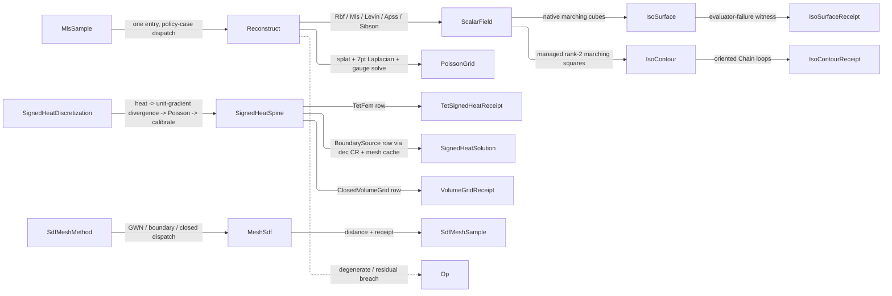

# [RASM_RECONSTRUCTION_RECONSTRUCT]

`Reconstruction` owns one `Reconstruct` entry over `ReconstructionPolicy`; each policy case builds a `Spatial/fields` scalar field carrying typed reconstruction evidence. `SignedHeatSpine`, `MeshSdf`, and `IsoSurface` own the delegated signed-distance and native-extraction rails, every native callback boundary converted through `Op.Catch` and every failure kept on `Fin`; `IsoContour` is the managed rank-2 iso lane beside the native 3D adapter — the correctness rail the iso family shares with `Meshing/arrangement`'s `BooleanRoute` pattern.

`Spatial/fields` owns the `ScalarField` union and its frozen cases; this page owns the kernels those cases delegate to. `Meshing/mesh` owns the type-keyed `Memoized` solver slot and `SpdMassShift`, so this page declares `BoundarySignedHeatKey`/`ClosedSignedHeatKey` and composes the memo at `SignedHeatSpine.BoundarySolutionOf`/`ClosedSolutionOf`. `Meshing/dec` owns the Crouzeix-Raviart assembly the boundary-source row composes, `Spatial/index` the accelerated winding lane the GWN row composes, `Numerics/matrix` every linear solve, and `Numerics/calculus` the kernel-profile math.

## [01]-[INDEX]

- [02]-[RECONSTRUCTION]: `ReconstructionPolicy` construction discriminant and its one `Reconstruct` entry, the `SignedHeatDiscretization` four-stage spine, `SdfMeshMethod` mesh-SDF dispatch, native `IsoSurface` extraction, and the managed `IsoContour` rank-2 lane.
- [03]-[DENSITY_BAR]: one owner per axis with its return rail and case count.

## [02]-[RECONSTRUCTION]

- Owner: `ReconstructionPolicy` `[Union]` is the one construction discriminant, each case carrying its typed policy payload — `MlsPolicy` beside `LevinMlsPolicy` and `ApssPolicy`, so all three MLS-family arms read their neighbourhood axes from a row — and deriving its `ReconstructionMode` row; `Reconstruction` is the build/evaluate kernel; `SignedHeatDiscretization` `[Union]` the spine discriminant and `SignedHeatSpine` its one four-stage signed-heat law; `MeshSdf` the mesh-SDF dispatch over `SdfMeshMethod`; `IsoSurface` the native extraction adapter; `TetMeshDomain` the validated tetrahedral domain deriving its full face roster and boundary topology at admission, `TetFace` the Crouzeix-Raviart degree of freedom that roster seats; `PlaneSeat` and `NormalPosture` the two Levin frame rows the sample receipt witnesses. Every knob is a validated policy row carrying a preset, every THRESHOLD is a `Tolerance` minted off its own `ToleranceLane` through the run's `Context`, and every optional argument is an `Option<T>` the owner resolves through `IfNone` against its own canonical row — no factory tail spells absence as null and no factory mints an epsilon literal.
- Cases: `ReconstructionPolicy` cases `RbfCase`/`MlsCase`/`LevinCase`/`ApssCase`/`PoissonCase`/`SibsonCase` select the build kernel; `ReconstructionMode` carries the eight modes with normals, degree, and status columns, the normal column the one admission fold's own clause; `SignedHeatDiscretization` cases `TetFem`/`BoundarySource`/`ClosedVolumeGrid`; `SdfMeshMethod` carries `GeneralizedWindingNumber`/`BoundarySignedHeat`/`ClosedSurfaceSignedHeat`, and the method row IS the mesh-SDF classification; `PoissonBoundary` carries `Neumann` (singular) and `Dirichlet` (definite) over ONE `Singular` column, its complement and its unread exterior constant both deleted; `IsoSurfaceStatus` carries three reachable rows, each with its own receipt-evidence predicate; `PlaneSeat` carries `Centroid`/`ThroughPoint` and `NormalPosture` `Raw`/`Oriented`, the two axes the Levin frame once spelled as bool knobs. Every single-value policy enum lands one row in the fence.
- Entry: `Reconstruction.Reconstruct` is the one reconstruction entry — the policy case selects the build kernel, admission internalizes per case (finite positions/normals/values, mode-specific guards), and the result carries a frozen `Spatial/fields` case with `ReconstructionReceipt`. `SignedHeatSpine.Solve` routes each `SignedHeatDiscretization` case to its row kernel over the same four-stage law. `MeshSdf.SignedDistanceDetailed` dispatches on `policy.Method` and `MeshSdf.Prewarm` factors and caches the solves without sampling. `IsoSurface.Detailed` returns the classified receipt for every native outcome — admission failures alone fail the rail, consumers gate on `Receipt.Valid` — and its extracted host mesh admits ONCE through `MeshSpace.Of(new MeshSource.Native(…))`, so the result carries an `Option<MeshSpace>` and an extraction that produced nothing carries ABSENCE rather than an empty mesh. `IsoContour.Detailed` is the rank-2 managed analogue, gated `grid.Rank is 2`, chaining crossings into oriented `Meshing/intersect` `Chain` loops. No per-mode public factory siblings on the surface.
- Auto: RBF selects interpolation vs approximation by the smoothing row (`≤ ZeroTolerance` → exact kernel-matrix solve; `> 0` → `√smoothing`-diagonal-augmented least squares) — the mode split is a value consequence, not a knob. MLS solves the 4-equation-per-neighbor design (`[1, −offset] · [value; gradient]` rows weighted by `√profile`) and gates on rank ≥ 4 and normal agreement against `MlsPolicy.NormalAgreementFloor`, its own policy column. Levin runs step one as covariance plane seed (smallest eigenvector, orientation-corrected) then alternates Brent root-finding on the weighted energy derivative along the normal (bracket/accuracy scale-derived from support) with normal re-estimation (at most `NormalMaxIter` inner steps against `NormalTau`, offset/normal convergence at `StepEps`/`NormalStepTol`), gated by the planarity ratio `λ0/λ2 ≤ PlanarityTau`; step two fits the ridge-regularized degree-`PolyDegree` height polynomial in the local tangent frame. APSS fits the algebraic sphere `(hc, hl, hq)` by Pratt normalization, classifies the plane-degenerate branch by `DegeneracyRatio ≤ EpsDegeneracy`, and projects iteratively with `StepDamping` under `ProjTol`. Poisson splats inward normals trilinearly onto the `2^Depth` lattice — the degree-1 discretization, the ONE splat the lattice owns (splat radius `Width`-scaled per cell; density estimate normalized by `SamplesPerNode` with weight floor `max(√ε, Density)`; bounding box grown by `Scale`) — assembles the 7-point Laplacian with one-sided boundary differences, adds `α = 8^Depth · PointWeight` screening outer products per sample when screened, imposes the boundary's row set when `Boundary.Singular` is false, solves definite systems by `CholeskySparse` and singular unscreened ones by `SingularSolveDetailed` under `GaugePolicy.PinConstant(interior, GaugeShift.PinZero)` — residual-gated against `Solver.ResidualTolerance` like every other solve on this page — and derives the isovalue `γ` as the density-weighted mean sample indicator. Sibson is EVALUATED, never fitted: the build admits the position/value pairs and resolves the dual tolerance, and each query derives its own natural-neighbour weights from the `Spatial/cloud` Voronoi dual over samples-plus-query, so the exactness at the samples is a property of the weights rather than of a solve. Signed-heat rows specialize the same four stages across Crouzeix-Raviart tet FEM, boundary CR, and closed volume-grid discretizations — the tet row seating one degree of freedom per FACE and closing with the `(AᵀMA)w = AᵀMu` projection onto vertices — heat time resolving per row from `SignedHeatTime` against that row's own node spacing.
- Receipt: every build, point evaluation, and spine step carries its typed receipt as one `ValidityClaim.All` fold. `ReconstructionReceipt`/`ReconstructionSampleReceipt` ride the RBF/MLS/Sibson rail with the interpolation verdict on `Mode.Status` and every measurement an arm skips — kernel, radius, rank, condition, agreement, gradient, solve — on its own optional slot; the deep `LevinMlsSampleReceipt`/`ApssSampleReceipt` carry their solver witnesses; `PoissonReceipt` carries the splat-conservation claim; `SignedHeatReceipt`/`VolumeGridReceipt`/`TetSignedHeatReceipt` sit per spine row, `SdfMeshReceipt` on the mesh-SDF rail, `IsoSurfaceReceipt` inside `IsoSurfaceResult`, and `IsoContourReceipt` witnessing the lattice, isovalue, ambiguous-cell census, and open-run count inside `IsoContourResult`.
- Packages: `Rasm.Numerics` `Numerics/matrix` (sparse and dense solves, gauge policy, solve receipts) and `Numerics/calculus` (kernel-profile math, composed never re-minted); `Meshing/mesh` (the `MeshSpace` snapshot and its `MeshSource` admission discriminant, cache memo slots, `TopologyReceipt`) and `Meshing/dec` (CR heat-system assembly, face-field sampling, intrinsic divergence); `Spatial/fields` (`ScalarField` frozen cases as the build product); `Spatial/index` (`Spatial.Apply` over `SpatialQuery.Winding`, the accelerated GWN lane); `Spatial/cloud` (`NaturalNeighborField.Of`/`Weights` over the `VoronoiMesh` dual — the one hull owner, never a page-local dual, and the base dual minted once per field rather than per query); `Domain/rails` and `Domain/context` (`Context.For` the ONE tolerance read, `Tolerance` every threshold column, `ToleranceLane` rows `Neglect`/`Step`/`Residual`/`Fraction`/`Convergence`); CommunityToolkit.HighPerformance (`MemoryOwner<T>` + `Span2D<T>` the RBF design plane); MathNet.Numerics (`RootFinding.Brent` for the Levin energy root); RhinoCommon (`Mesh.CreateFromIsosurface` and the inside/closest/orientation predicates, genuinely Rhino-boundary, never thinned); LanguageExt.Core; BCL (`Interlocked`).
- Law: absence is `Option` everywhere past a factory — a `T? x = null` tail, a `?? new Mesh()` fallback, and a `bool` frame knob are all the deleted forms; every evidence fold reads the implicit `bool -> ValidityClaim` conversion and no `ValidityClaim.Of(` wrapper survives; a positivity a value object's `Band` already holds never re-appears as a hand clause, so a record with nothing left to claim carries no fold at all.
- Growth: a new EVALUATED reconstruction family (partition-of-unity implicits, neural pull) is one `ReconstructionPolicy` case + one `ReconstructionMode` row + one `AdmitAndSeat` line naming its seat — no new build body, since the mode row carries the normal requirement and the degree the admission reads; a new signed-heat discretization (polygon FEM, adaptive octree grid) is one `SignedHeatDiscretization` case + one stage row on the same four-stage spine — never a parallel heat→Poisson pipeline; a new mesh-SDF method is one `SdfMeshMethod` row; a new lattice boundary condition is one `PoissonBoundary` row with its column values; a grid ceiling change is a policy-row edit; a managed 3D iso lane is one `IsoSurfaceRoute` row over the same receipt law — the `BooleanRoute` pattern one rank up from the landed `IsoContour` rail; a new Levin frame seat or normal posture is one row on its own `[SmartEnum]`; zero new entry surface.
- Boundary: `SignedHeatSpine` owns one heat→divergence→Poisson→calibrate law, and each row states its own heat-time scale — `0.5·MeanEdgeLength` for the boundary-source row, the source mesh's `MeanEdgeLength` for the closed grid, and the mean tet face-barycenter pair spacing for the tet row — so no row inherits another's clock. Boundary-source rows reject flipped intrinsic snapshots; closed-grid rows admit only closed, oriented topology and carry the orientation integer onto every source normal instead of a heuristic interior flip. Lattice-backed samples outside the grid take the exact eikonal extension off the clamped point, never a fabricated far constant nor a clamp-to-edge interior reading. `Mesh.IsPointInside` is BARRED — it is the tolerance-bearing approximate predicate the generalized winding test `|w| > 0.5` replaces, and the winding test is the only inside test on this page. Native evaluator callbacks count failures with `Interlocked` and return `NaN`, which the extractor absorbs as inside, so that tally is the sole failure evidence; every linear solve routes through `Numerics/matrix`, and `Op.Catch` converts the native callback boundary. Comment mass on this page is SPECIFICATION, not narration: `[OPERATIONS]` declares bodiless kernel signatures and each block's comment IS that kernel's algorithm — trimming it deletes the design, so only narration and card restatements retire.

```csharp signature
// --- [RUNTIME_PRELUDE] -----------------------------------------------------------------
using System;
using System.Collections.Generic;
using System.Linq;
using System.Runtime.InteropServices;
using System.Threading;
using CommunityToolkit.HighPerformance;
using CommunityToolkit.HighPerformance.Buffers;
using LanguageExt;
using Rasm.Domain;
using Rasm.Numerics;
using Rasm.Spatial;
using Rhino;
using Rhino.Geometry;
using Thinktecture;
using static LanguageExt.Prelude;
using Dimension = Rasm.Numerics.Dimension;

namespace Rasm.Meshing;

// --- [TYPES] ---------------------------------------------------------------------------
[SmartEnum<int>]
public sealed partial class ReconstructionStatus {
    public static readonly ReconstructionStatus ExactInterpolation = new(key: 0);
    public static readonly ReconstructionStatus ApproximateSdf     = new(key: 1);
    public static readonly ReconstructionStatus PoissonIndicator   = new(key: 2);
}

[SmartEnum<int>]
public sealed partial class PlaneSeat {
    public static readonly PlaneSeat Centroid     = new(key: 0);
    public static readonly PlaneSeat ThroughPoint = new(key: 1);
}

[SmartEnum<int>]
public sealed partial class NormalPosture {
    public static readonly NormalPosture Raw      = new(key: 0);
    public static readonly NormalPosture Oriented = new(key: 1);
}

[SmartEnum<int>]
public sealed partial class ReconstructionMode {
    public static readonly ReconstructionMode RbfInterpolation          = new(key: 0, requiresNormals: false, polynomialDegree: 0, status: ReconstructionStatus.ExactInterpolation);
    public static readonly ReconstructionMode RbfApproximation          = new(key: 1, requiresNormals: false, polynomialDegree: 0, status: ReconstructionStatus.ApproximateSdf);
    public static readonly ReconstructionMode MovingLeastSquares        = new(key: 2, requiresNormals: true, polynomialDegree: 1, status: ReconstructionStatus.ApproximateSdf);
    public static readonly ReconstructionMode LevinMovingLeastSquares   = new(key: 3, requiresNormals: true, polynomialDegree: 2, status: ReconstructionStatus.ApproximateSdf);
    public static readonly ReconstructionMode AlgebraicPointSetSurfaces = new(key: 4, requiresNormals: true, polynomialDegree: 2, status: ReconstructionStatus.ApproximateSdf);
    public static readonly ReconstructionMode Poisson                   = new(key: 5, requiresNormals: true, polynomialDegree: 0, status: ReconstructionStatus.PoissonIndicator);
    public static readonly ReconstructionMode ScreenedPoisson           = new(key: 6, requiresNormals: true, polynomialDegree: 0, status: ReconstructionStatus.PoissonIndicator);
    public static readonly ReconstructionMode NaturalNeighbor           = new(key: 7, requiresNormals: false, polynomialDegree: 0, status: ReconstructionStatus.ExactInterpolation);
    public bool RequiresNormals { get; }
    public int PolynomialDegree { get; }
    public ReconstructionStatus Status { get; }
}

[SmartEnum<int>]
public sealed partial class PoissonBoundary {
    public static readonly PoissonBoundary Neumann   = new(key: 0, singular: true);
    public static readonly PoissonBoundary Dirichlet = new(key: 1, singular: false);
    public bool Singular { get; }
}

[SmartEnum<int>]
public sealed partial class SdfMeshMethod {
    public static readonly SdfMeshMethod GeneralizedWindingNumber = new(key: 0);
    public static readonly SdfMeshMethod BoundarySignedHeat      = new(key: 1);
    public static readonly SdfMeshMethod ClosedSurfaceSignedHeat = new(key: 2);
}

[SmartEnum<int>]
public sealed partial class SdfSignConvention {
    public static readonly SdfSignConvention NegativeInsidePositiveOutside = new(key: 0, multiplier: 1.0);
    public static readonly SdfSignConvention PositiveInsideNegativeOutside = new(key: 1, multiplier: -1.0);
    public double Multiplier { get; }
}

[SmartEnum<int>]
public sealed partial class IsoSurfaceStatus {
    public static readonly IsoSurfaceStatus NativeValid = new(key: 0,
        admitsEvidence: static (failures, vertices, faces, naked) => failures == 0 && vertices > 0 && faces > 0 && naked.IsSome);
    public static readonly IsoSurfaceStatus EvaluatorFailure = new(key: 1,
        admitsEvidence: static (failures, _, _, _) => failures > 0);
    public static readonly IsoSurfaceStatus NativeInvalidMesh = new(key: 2,
        admitsEvidence: static (failures, _, _, naked) => failures == 0 && naked.IsNone);

    [UseDelegateFromConstructor]
    internal partial bool AdmitsEvidence(int failures, int vertices, int faces, Option<int> nakedBoundaryLoops);
}

[SmartEnum<int>] public sealed partial class TetGaugePolicy { public static readonly TetGaugePolicy PinnedFirstBoundary = new(key: 0); }
[SmartEnum<int>] public sealed partial class TetInterpolation { public static readonly TetInterpolation Barycentric = new(key: 0); }
[SmartEnum<int>] public sealed partial class VolumeSolverKind { public static readonly VolumeSolverKind SparseCholeskyPinned = new(key: 0); }
[SmartEnum<int>] public sealed partial class VolumeBoundaryCondition { public static readonly VolumeBoundaryCondition NeumannGaugePinned = new(key: 0); }

[Union]
public abstract partial record ReconstructionPolicy {
    private ReconstructionPolicy() { }
    public sealed record RbfCase(KernelKind Kernel, PositiveMagnitude Radius, double Smoothing) : ReconstructionPolicy;
    public sealed record MlsCase(MlsPolicy Policy) : ReconstructionPolicy;
    public sealed record LevinCase(LevinMlsPolicy Policy) : ReconstructionPolicy;
    public sealed record ApssCase(ApssPolicy Policy) : ReconstructionPolicy;
    public sealed record PoissonCase(PoissonPolicy Policy) : ReconstructionPolicy;
    public sealed record SibsonCase(SibsonPolicy Policy) : ReconstructionPolicy;
    public static Fin<ReconstructionPolicy> Rbf(KernelKind kernel, double radius, double smoothing = 0.0, Op? key = null);
    public static Fin<ReconstructionPolicy> Mls(MlsPolicy policy, Op? key = null);
    public static Fin<ReconstructionPolicy> Levin(LevinMlsPolicy policy, Op? key = null);
    public static Fin<ReconstructionPolicy> Apss(ApssPolicy policy, Op? key = null);
    public static Fin<ReconstructionPolicy> Poisson(PoissonPolicy policy, Op? key = null);
    public static Fin<ReconstructionPolicy> Sibson(SibsonPolicy policy, Op? key = null);
    public ReconstructionMode Mode => Switch(
        rbfCase:     static c => c.Smoothing <= EpsilonPolicy.ZeroTolerance ? ReconstructionMode.RbfInterpolation : ReconstructionMode.RbfApproximation,
        mlsCase:     static _ => ReconstructionMode.MovingLeastSquares,
        levinCase:   static _ => ReconstructionMode.LevinMovingLeastSquares,
        apssCase:    static _ => ReconstructionMode.AlgebraicPointSetSurfaces,
        poissonCase: static c => c.Policy.PointWeight > 0.0 ? ReconstructionMode.ScreenedPoisson : ReconstructionMode.Poisson,
        sibsonCase:  static _ => ReconstructionMode.NaturalNeighbor);
}

[Union]
public abstract partial record SignedHeatDiscretization {
    private SignedHeatDiscretization() { }
    public sealed record TetFemCase(TetMeshDomain Domain, TetSignedHeatPolicy Policy) : SignedHeatDiscretization;
    public sealed record BoundarySourceCase(MeshSpace Space, SdfMeshPolicy Policy) : SignedHeatDiscretization;
    public sealed record ClosedVolumeGridCase(MeshSpace Space, SdfMeshPolicy Policy) : SignedHeatDiscretization;
    public static Fin<SignedHeatDiscretization> TetFem(TetMeshDomain domain, Option<TetSignedHeatPolicy> policy = default, Op? key = null);
    public static Fin<SignedHeatDiscretization> BoundarySource(MeshSpace space, SdfMeshPolicy policy, Op? key = null);
    public static Fin<SignedHeatDiscretization> ClosedVolumeGrid(MeshSpace space, SdfMeshPolicy policy, Op? key = null);
}

// --- [CONSTANTS] -----------------------------------------------------------------------
[BoundaryAdapter, StructLayout(LayoutKind.Auto)]
public readonly record struct SignedHeatTime(Option<PositiveMagnitude> Explicit, PositiveMagnitude Coefficient) {
    public static Fin<SignedHeatTime> Scaled(double coefficient = 1.0, Op? key = null);
    public static Fin<SignedHeatTime> Fixed(double value, Op? key = null);
    internal double Resolve(double cellSize) =>
        Explicit.Map(static heat => heat.Value).IfNone(noneValue: Coefficient.Value * cellSize * cellSize);
}

[BoundaryAdapter, StructLayout(LayoutKind.Auto)]
public readonly record struct VolumeSolverPolicy(VolumeSolverKind Kind, PositiveMagnitude ResidualTolerance) {
    public static Fin<VolumeSolverPolicy> SparseCholesky(Context context, Op? key = null) =>
        key.OrDefault() switch {
            Op op => op.AcceptValidated<PositiveMagnitude>(candidate: SolvePath.SparseLdl.Cap.In(context: Some(context)))
                .Map(static tolerance => new VolumeSolverPolicy(Kind: VolumeSolverKind.SparseCholeskyPinned, ResidualTolerance: tolerance)),
        };
}

[BoundaryAdapter, StructLayout(LayoutKind.Auto)]
public readonly record struct VolumeGridPolicy(
    Option<Dimension> Resolution, Option<PositiveMagnitude> CellSize, PositiveMagnitude Padding,
    Dimension MaxNodes, UnitInterval KernelSofteningRatio) : IValidityEvidence {
    public static Fin<VolumeGridPolicy> ByResolution(int resolution = 16, double padding = 1.0, Op? key = null);
    public static Fin<VolumeGridPolicy> ByCellSize(double cellSize, double padding = 1.0, Op? key = null);
    public static readonly Dimension DefaultMaxNodes = Dimension.Create(value: 1_000_000);
    public static readonly UnitInterval DefaultKernelSofteningRatio = UnitInterval.Create(value: 0.0625);
    public bool IsValid => ValidityClaim.All(Resolution.IsSome != CellSize.IsSome);
}

[BoundaryAdapter, StructLayout(LayoutKind.Auto)]
public readonly record struct SdfMeshPolicy(
    SdfMeshMethod Method, SdfSignConvention SignConvention, Option<VolumeGridPolicy> Grid,
    SignedHeatTime Heat, VolumeSolverPolicy Solver, LatticeInterpolation Interpolation, VolumeBoundaryCondition BoundaryCondition,
    double WindingBetaSquared) {
    public static Fin<SdfMeshPolicy> GeneralizedWinding(Context context, Option<SdfSignConvention> signConvention = default, double betaSquared = 4.0, Op? key = null);
    public static Fin<SdfMeshPolicy> BoundarySignedHeat(Context context, Option<SignedHeatTime> heat = default, Option<VolumeSolverPolicy> solver = default, Option<SdfSignConvention> signConvention = default, Op? key = null);
    public static Fin<SdfMeshPolicy> ClosedSignedHeat(VolumeGridPolicy grid, Context context, Option<SignedHeatTime> heat = default, Option<VolumeSolverPolicy> solver = default, Option<SdfSignConvention> signConvention = default, Op? key = null);
    internal Fin<SdfMeshPolicy> Admit(Op key);
}

[BoundaryAdapter, StructLayout(LayoutKind.Auto)]
public readonly record struct TetSignedHeatPolicy(
    SignedHeatTime Heat, VolumeSolverPolicy Solver, SdfSignConvention SignConvention, TetGaugePolicy Gauge, TetInterpolation Interpolation) {
    public static Fin<TetSignedHeatPolicy> Of(Context context, Option<SignedHeatTime> heat = default, Option<VolumeSolverPolicy> solver = default,
        Option<SdfSignConvention> signConvention = default, Option<TetGaugePolicy> gauge = default, Option<TetInterpolation> interpolation = default, Op? key = null);
    internal Fin<TetSignedHeatPolicy> Admit(Op key);
}

[BoundaryAdapter, StructLayout(LayoutKind.Auto)]
public readonly record struct LevinMlsPolicy(
    PositiveMagnitude Support, int PolyDegree, Tolerance NeglectEps, int MinNeighbors, double BracketFactor,
    int MaxOuterIter, Tolerance StepEps, Tolerance RootTol, int NormalMaxIter, Tolerance NormalStepTol, Tolerance PlanarityTau,
    double RidgeLambda, Tolerance NormalTau, Tolerance ProjEps, PlaneSeat Seat, NormalPosture Normals, WeightKernelFamily WeightKernel) {
    public static Fin<LevinMlsPolicy> Of(double support, Context context, int polyDegree = 2, int minNeighbors = 6,
        double bracketFactor = 2.0, int maxOuterIter = 16, int normalMaxIter = 32, double ridgeLambda = 0.0,
        Option<PlaneSeat> seat = default, Option<NormalPosture> normals = default,
        Option<WeightKernelFamily> weightKernel = default, Op? key = null);
}

[BoundaryAdapter, StructLayout(LayoutKind.Auto)]
public readonly record struct MlsPolicy(
    KernelKind Kernel, PositiveMagnitude Radius, WeightKernelFamily WeightKernel, Tolerance Neglect,
    int MinNeighbors, UnitInterval NormalAgreementFloor) {
    public static Fin<MlsPolicy> Of(KernelKind kernel, double radius, Context context, int minNeighbors = 4,
        Option<WeightKernelFamily> weightKernel = default, Option<UnitInterval> normalAgreementFloor = default, Op? key = null);
}

[BoundaryAdapter, StructLayout(LayoutKind.Auto)]
public readonly record struct SibsonPolicy(Option<PositiveMagnitude> Tolerance, int MinNeighbors) {
    public static Fin<SibsonPolicy> Of(double tolerance = 0.0, int minNeighbors = 5, Op? key = null) =>
        key.OrDefault() switch {
            Op op => from _ in guard(minNeighbors >= 5 && double.IsFinite(tolerance) && tolerance >= 0.0, op.InvalidInput())
                     from admitted in tolerance > 0.0
                         ? op.AcceptValidated<PositiveMagnitude>(candidate: tolerance).Map(Some)
                         : Fin.Succ(Option<PositiveMagnitude>.None)
                     select new SibsonPolicy(Tolerance: admitted, MinNeighbors: minNeighbors),
        };
    internal PositiveMagnitude Resolve(Context context) => Tolerance.IfNone(noneValue: PositiveMagnitude.Create(value: context.Absolute.Value));
}

[BoundaryAdapter, StructLayout(LayoutKind.Auto)]
public readonly record struct ApssPolicy(
    PositiveMagnitude Support, WeightKernelFamily WeightKernel, double Beta, Tolerance NeglectEps, Tolerance EpsDegeneracy,
    Tolerance EpsPratt, int ProjMaxIter, Tolerance ProjTol, double StepDamping, int MinNeighbors) {
    public static Fin<ApssPolicy> Of(double support, Context context, Option<WeightKernelFamily> weightKernel = default,
        double beta = 1.0, int projMaxIter = 16, double stepDamping = 1.0, int minNeighbors = 6, Op? key = null);
}

[BoundaryAdapter, StructLayout(LayoutKind.Auto)]
public readonly record struct PoissonPolicy(
    Dimension Depth, PositiveMagnitude Width, PositiveMagnitude Scale, PositiveMagnitude SamplesPerNode,
    double PointWeight, PoissonBoundary Boundary, VolumeSolverPolicy Solver, Option<PositiveMagnitude> Density) {
    public static Fin<PoissonPolicy> Of(Context context, int depth = 6, double width = 1.0, double scale = 1.1,
        double samplesPerNode = 1.5, double pointWeight = 0.0, Option<PoissonBoundary> boundary = default,
        Option<VolumeSolverPolicy> solver = default, double density = 0.0, Op? key = null);
}

[BoundaryAdapter, StructLayout(LayoutKind.Auto)]
public readonly record struct IsoSurfacePolicy(Dimension MaxRootSteps, double IsoValue) {
    public static readonly IsoSurfacePolicy Default = new(MaxRootSteps: Dimension.Create(value: 32), IsoValue: 0.0);
    public static Fin<IsoSurfacePolicy> Of(int maxRootSteps = 32, double isoValue = 0.0, Op? key = null) =>
        key.OrDefault() switch {
            Op op => from steps in op.AcceptValidated<Dimension>(candidate: maxRootSteps)
                     from _ in guard(steps.Value >= 1 && double.IsFinite(isoValue), op.InvalidInput())
                     select new IsoSurfacePolicy(MaxRootSteps: steps, IsoValue: isoValue),
        };
}

// --- [MODELS] --------------------------------------------------------------------------
[BoundaryAdapter, StructLayout(LayoutKind.Auto)] public readonly record struct MlsSample(Point3d Position, Vector3d Normal, double Value);

[BoundaryAdapter, StructLayout(LayoutKind.Auto)]
public readonly record struct ReconstructionReceipt(
    ReconstructionMode Mode, Option<KernelKind> Kernel, Option<double> Radius, Option<double> Smoothing,
    int SampleCount, int CenterCount, int PolynomialDegree, Option<SolveReceipt> Solve) : IValidityEvidence {
    public bool IsValid => ValidityClaim.All(
        ValidityClaim.CountAtLeast(count: SampleCount, floor: 1), ValidityClaim.CountAtLeast(count: CenterCount, floor: 0),
        ValidityClaim.CountAtLeast(count: PolynomialDegree, floor: 0),
        Radius.Map(static r => ValidityClaim.Positive(r).Holds).IfNone(noneValue: true),
        Smoothing.Map(static s => ValidityClaim.Nonnegative(s).Holds).IfNone(noneValue: true),
        Solve.Map(static receipt => receipt.IsValid).IfNone(noneValue: true));
}

[BoundaryAdapter, StructLayout(LayoutKind.Auto)]
public readonly record struct ReconstructionResult(ScalarField Field, ReconstructionReceipt Receipt) {
    internal Fin<TOut> Project<TOut>(Op key) {
        ReconstructionResult self = this;
        return AtomProjection.Rows<ReconstructionResult, TOut>(self: self, key: key,
            ProjectionRow.Of<ReconstructionReceipt>(() => Fin.Succ(self.Receipt)),
            ProjectionRow.Of<ScalarField>(() => Optional(self.Field).ToFin(key.InvalidResult())));
    }
}

[BoundaryAdapter, StructLayout(LayoutKind.Auto)]
public readonly record struct ReconstructionSample(double Value, ReconstructionSampleReceipt Receipt) {
    internal Fin<TOut> Project<TOut>(Op key);
}

[BoundaryAdapter, StructLayout(LayoutKind.Auto)]
public readonly record struct ReconstructionSampleReceipt(
    ReconstructionMode Mode, Option<KernelKind> Kernel, Option<double> Radius, int SampleCount,
    int NeighborhoodCount, int RejectedWeightCount, double WeightSum, Option<int> Rank,
    Option<double> Condition, Option<double> NormalAgreement, Option<double> GradientNorm, Option<SolveReceipt> Solve) : IValidityEvidence {
    public bool IsValid => ValidityClaim.All(
        ValidityClaim.CountAtLeast(count: SampleCount, floor: 1), ValidityClaim.CountAtLeast(count: NeighborhoodCount, floor: 0),
        ValidityClaim.CountAtLeast(count: RejectedWeightCount, floor: 0),
        Rank.Map(static rank => rank >= 1).IfNone(noneValue: true),
        ValidityClaim.Nonnegative(WeightSum),
        Radius.Map(static r => ValidityClaim.Positive(r).Holds).IfNone(noneValue: true),
        Solve.Map(static receipt => receipt.IsValid).IfNone(noneValue: true));
}

[BoundaryAdapter, StructLayout(LayoutKind.Auto)]
public readonly record struct LevinMlsSampleReceipt(
    Point3d PlaneOrigin, Vector3d PlaneNormal, Vector3d MlsNormal, double Offset, Vector3d FrameU, Vector3d FrameV,
    int Step1Iterations, bool Step1Converged, int RootIterations, double RootResidual, double SecondDerivative,
    int NormalIterations, double NormalResidual, double Lambda0, double Lambda2, double Planarity,
    int NeighborCount, double WeightSum, double Step1Energy, int PolyDegree, int CoefficientCount,
    double Step2Residual, double Step2Rms, double DesignCondition, int Rank, double GradientMagnitude,
    double NormalAgreement, double ProjDisplacement, double ProjResidual, bool ProjConverged, PlaneSeat Seat, SolveReceipt Solve) : IValidityEvidence {
    public bool IsValid => ValidityClaim.All(
        ValidityClaim.CountAtLeast(count: NeighborCount, floor: 1), ValidityClaim.Positive(WeightSum),
        ValidityClaim.CountAtLeast(count: PolyDegree, floor: 1), ValidityClaim.CountAtLeast(count: CoefficientCount, floor: 1),
        ValidityClaim.CountAtLeast(count: Rank, floor: 1),
        ValidityClaim.Finite(PlaneOrigin), ValidityClaim.Finite(PlaneNormal), ValidityClaim.Finite(Offset),
        ValidityClaim.Finite(RootResidual), ValidityClaim.Finite(Step2Residual), ValidityClaim.Finite(GradientMagnitude),
        ValidityClaim.Evidence(Solve));
}

[BoundaryAdapter, StructLayout(LayoutKind.Auto)]
public readonly record struct ApssSampleReceipt(
    double Hc, Vector3d Hl, double Hq, double PrattNormSquared, bool IsPlane, double DegeneracyRatio,
    Point3d Center, double Radius, double MeanCurvature, double FieldValue, double GradientNorm, Vector3d Normal,
    int NeighborCount, double WeightSum, int ProjIterations, double TaubinResidual, double ProjDisplacement) : IValidityEvidence {
    public bool IsValid => ValidityClaim.All(
        ValidityClaim.Positive(PrattNormSquared), ValidityClaim.CountAtLeast(count: NeighborCount, floor: 1),
        ValidityClaim.Positive(WeightSum), ValidityClaim.Finite(FieldValue), ValidityClaim.Nonnegative(DegeneracyRatio),
        ValidityClaim.CountAtLeast(count: ProjIterations, floor: 0));
}

[BoundaryAdapter, StructLayout(LayoutKind.Auto)]
public readonly record struct PoissonGrid(CellLattice Grid, Arr<double> Chi, Arr<double> Density) : IValidityEvidence {
    internal static Fin<PoissonGrid> Of(CellLattice grid, Arr<double> chi, double[] density, Op key);
    public bool IsValid => ValidityClaim.All(
        ValidityClaim.CountExactly(count: Chi.Count, expected: (int)Grid.CellCount),
        ValidityClaim.CountExactly(count: Density.Count, expected: Chi.Count),
        Grid.Columns.Value >= 2);
}

[BoundaryAdapter, StructLayout(LayoutKind.Auto)]
public readonly record struct PoissonReceipt(
    ReconstructionMode Mode, Dimension Depth, CellLattice Grid, int SystemDof, PoissonBoundary Boundary,
    double PointWeight, double Scale, int SampleCount, int ContributionCount, int RejectedCount, int ClampedCount,
    double WeightSum, int LaplacianNonZeros, int ScreeningNonZeros, double RhsNorm, double Isovalue, double IsovalueStdDev,
    double MeanAbsChi, double MaxAbsChi, double GradientEnergy, double ScreeningEnergy, Option<double> DataResidual,
    double GradientResidual, bool UnscreenedEquivalence, Option<GaugeReceipt> Gauge, SolveReceipt Solve) : IValidityEvidence {
    public bool IsValid => ValidityClaim.All(
        ValidityClaim.CountExactly(count: SystemDof, expected: (int)Grid.CellCount),
        ValidityClaim.CountExactly(count: SystemDof, expected: Solve.Cols.Value),
        ValidityClaim.CountExactly(count: ContributionCount + RejectedCount + ClampedCount, expected: SampleCount),
        ValidityClaim.Nonnegative(WeightSum), ValidityClaim.Finite(Isovalue), ValidityClaim.Nonnegative(GradientEnergy),
        ValidityClaim.Nonnegative(ScreeningEnergy), ValidityClaim.Finite(GradientResidual),
        !UnscreenedEquivalence || (ScreeningNonZeros == 0 && PointWeight <= 0.0 && ScreeningEnergy == 0.0 && DataResidual.IsNone),
        ValidityClaim.Evidence(Solve),
        Gauge.Map(static receipt => receipt.IsValid).IfNone(noneValue: true));
}

[BoundaryAdapter, StructLayout(LayoutKind.Auto)]
public readonly record struct SignedHeatReceipt(
    int BoundarySourceVertexCount, int BoundaryEncodedEdgeSourceCount, int BoundaryRejectedPointCount,
    int BoundaryUnmatchedSegmentCount, Option<SolveReceipt> HeatSolve, SolveReceipt PoissonSolve,
    Option<SpectralAssemblyReceipt> EdgeAssembly = default, Option<double> SpdMassShift = default,
    Option<double> SourceNormalAgreement = default) : IValidityEvidence {
    public bool IsValid => ValidityClaim.All(
        SourceNormalAgreement.Map(static agreement => double.IsFinite(agreement) && agreement >= 0.0).IfNone(noneValue: true),
        ValidityClaim.CountAtLeast(count: BoundarySourceVertexCount, floor: 0),
        ValidityClaim.CountAtLeast(count: BoundaryEncodedEdgeSourceCount, floor: 0),
        ValidityClaim.CountAtLeast(count: BoundaryRejectedPointCount, floor: 0),
        ValidityClaim.CountAtLeast(count: BoundaryUnmatchedSegmentCount, floor: 0),
        HeatSolve.Map(static receipt => receipt.IsValid).IfNone(noneValue: true),
        ValidityClaim.Evidence(PoissonSolve),
        EdgeAssembly.Map(static receipt => receipt.IsValid).IfNone(noneValue: true),
        SpdMassShift.Map(static shift => ValidityClaim.Positive(shift).Holds).IfNone(noneValue: true));
}

[BoundaryAdapter, StructLayout(LayoutKind.Auto)]
public readonly record struct VolumeGridReceipt(
    CellLattice Grid, double Padding, int SourceTriangleCount, int DegenerateTriangleCount, double SourceArea,
    int InsideNodeCount, int OutsideNodeCount, int NearSurfaceNodeCount, int RejectedVectorCount, double HeatTime,
    int GaugeNode, double SurfaceShift, LatticeInterpolation Interpolation, VolumeBoundaryCondition BoundaryCondition,
    VolumeSolverPolicy Solver, int OperatorNonZeros, Option<int> FactorNonZeros, double Residual) : IValidityEvidence {
    public bool IsValid => ValidityClaim.All(
        ValidityClaim.CountAtLeast(count: (int)Grid.NodeCount, floor: InsideNodeCount + OutsideNodeCount),
        ValidityClaim.Positive(HeatTime), ValidityClaim.Nonnegative(SourceArea),
        ValidityClaim.CountAtLeast(count: SourceTriangleCount, floor: 1), ValidityClaim.Finite(SurfaceShift), ValidityClaim.Finite(Residual));
}

[BoundaryAdapter, StructLayout(LayoutKind.Auto)]
public readonly record struct SdfMeshReceipt(
    SdfMeshMethod Method, TopologyReceipt Topology,
    Option<SignedHeatReceipt> SignedHeat, Option<VolumeGridReceipt> VolumeGrid = default) : IValidityEvidence {
    public bool IsValid => ValidityClaim.All(
        SignedHeat.Map(static receipt => receipt.IsValid).IfNone(noneValue: true),
        VolumeGrid.Map(static receipt => receipt.IsValid).IfNone(noneValue: true));
}

[BoundaryAdapter, StructLayout(LayoutKind.Auto)] public readonly record struct SdfMeshSample(double Distance, SdfMeshReceipt Receipt);

[BoundaryAdapter, StructLayout(LayoutKind.Auto)]
public readonly record struct TetCell(int A, int B, int C, int D) { internal int[] Indices => [A, B, C, D]; }

[BoundaryAdapter, StructLayout(LayoutKind.Auto)]
public readonly record struct TetFace(int A, int B, int C, int Cell0, int Cell1, int Opposite0, int Opposite1) {
    internal bool IsBoundary => Cell1 < 0;
}

[BoundaryAdapter, StructLayout(LayoutKind.Auto)]
public readonly record struct TetMeshDomain(
    Seq<Point3d> Vertices, Seq<TetCell> Cells, Seq<TetFace> Faces, Context Context, Arr<double> CellVolumes,
    Seq<int> BoundaryVertices, BoundingBox Bounds, int BoundaryFaceCount, int InteriorVertexCount, double TotalVolume) {
    public static Fin<TetMeshDomain> Of(Seq<Point3d> vertices, Seq<TetCell> cells, Context context, Op? key = null);
    internal Fin<TetMeshDomain> Admit(Op key);
    internal static Fin<TetCellMetric> MetricOf(Point3d[] points, TetCell cell, Op key);
    internal double MeanNodeSpacing();
}
internal readonly record struct TetCellMetric(double Volume, Vector3d[] Gradients) {
    internal Vector3d FaceNormal(int corner) => -3.0 * Volume * Gradients[corner];
    internal Vector3d CrouzeixGradient(int corner) => -3.0 * Gradients[corner];
}

[BoundaryAdapter, StructLayout(LayoutKind.Auto)]
public readonly record struct TetFemReceipt(
    int VertexCount, int CellCount, int FaceCount, int BoundaryVertexCount, int BoundaryFaceCount, int InteriorVertexCount,
    int IncidenceCount, double TotalVolume, double MinCellVolume, double MaxCellVolume,
    int MassNonZeros, int StiffnessNonZeros, int HeatOperatorNonZeros, int DivergenceNonZeros,
    int ProjectionRows, int ProjectionCols, int RejectedGradientCellCount) : IValidityEvidence {
    public bool IsValid => ValidityClaim.All(
        ValidityClaim.CountExactly(count: BoundaryVertexCount + InteriorVertexCount, expected: VertexCount),
        ValidityClaim.CountExactly(count: ProjectionRows, expected: FaceCount),
        ValidityClaim.CountExactly(count: ProjectionCols, expected: VertexCount),
        ValidityClaim.CountAtLeast(count: FaceCount, floor: BoundaryFaceCount),
        ValidityClaim.CountExactly(count: 4 * CellCount, expected: (2 * FaceCount) - BoundaryFaceCount),
        ValidityClaim.Ordered(lower: MinCellVolume, upper: MaxCellVolume),
        ValidityClaim.CountAtLeast(count: CellCount, floor: 1), ValidityClaim.Positive(TotalVolume),
        ValidityClaim.CountAtLeast(count: RejectedGradientCellCount, floor: 0));
}

[BoundaryAdapter, StructLayout(LayoutKind.Auto)]
public readonly record struct TetInterpolationReceipt(TetInterpolation Interpolation, int CellIndex, Arr<double> Barycentric, bool Inside) : IValidityEvidence {
    public bool IsValid => !Inside || Barycentric.Count == 4;
}

[BoundaryAdapter, StructLayout(LayoutKind.Auto)]
public readonly record struct TetSignedHeatReceipt(
    TetFemReceipt Fem, SignedHeatTime Heat, VolumeSolverPolicy Solver, SdfSignConvention SignConvention,
    TetGaugePolicy Gauge, TetInterpolation Interpolation, int GaugeFace, double HeatTime,
    double BoundaryShift, double InteriorMean, SolveReceipt HeatSolve, SolveReceipt PoissonSolve) : IValidityEvidence {
    public bool IsValid => ValidityClaim.All(
        ValidityClaim.Evidence(Fem), ValidityClaim.Positive(HeatTime),
        ValidityClaim.Finite(BoundaryShift), ValidityClaim.Finite(InteriorMean),
        ValidityClaim.Evidence(HeatSolve), ValidityClaim.Evidence(PoissonSolve));
}

[BoundaryAdapter, StructLayout(LayoutKind.Auto)]
public readonly record struct TetSignedHeatSample(double Value, TetSignedHeatReceipt Receipt, TetInterpolationReceipt Interpolation);

[BoundaryAdapter, StructLayout(LayoutKind.Auto)]
public readonly record struct IsoSurfaceReceipt(
    bool NativeRouted, IsoSurfaceStatus Status, CellLattice Grid, long HexCellCount, long CornerSampleCount,
    int MaxRootSteps, double IsoValue, bool NativeNormalsDiscarded,
    bool ParallelCallback, int EvaluatorFailures, int VertexCount, int FaceCount, Option<int> NakedBoundaryLoopCount,
    Option<double> FixedTolerance, Option<double> FixedNormalSampleDistance, Option<SdfMeshReceipt> MeshPreflight) : IValidityEvidence {
    public bool Valid => Status is not null && Status.Equals(IsoSurfaceStatus.NativeValid);
    public bool IsValid => ValidityClaim.All(
        Status is not null && Status.AdmitsEvidence(
            failures: EvaluatorFailures, vertices: VertexCount, faces: FaceCount, nakedBoundaryLoops: NakedBoundaryLoopCount),
        ValidityClaim.CountAtLeast(count: EvaluatorFailures, floor: 0),
        HexCellCount == Grid.CellCount && CornerSampleCount == Grid.NodeCount,
        ValidityClaim.Finite(IsoValue), NativeNormalsDiscarded,
        NakedBoundaryLoopCount.Map(static count => count >= 0).IfNone(noneValue: true),
        MeshPreflight.Map(static receipt => receipt.IsValid).IfNone(noneValue: true));
}

[BoundaryAdapter, StructLayout(LayoutKind.Auto)] public readonly record struct IsoSurfaceResult(Option<MeshSpace> Space, IsoSurfaceReceipt Receipt);

internal readonly record struct BoundarySignedHeatKey(SignedHeatTime Heat, VolumeSolverPolicy Solver);
internal readonly record struct ClosedSignedHeatKey(VolumeGridPolicy Grid, SignedHeatTime Heat, VolumeSolverPolicy Solver, LatticeInterpolation Interpolation, VolumeBoundaryCondition BoundaryCondition);
internal readonly record struct SignedHeatSolution(Arr<double> Values, SignedHeatReceipt Receipt, TopologyReceipt Topology);
internal readonly record struct ClosedSignedHeatSolution(VolumeGridReceipt Grid, Arr<double> Values, SignedHeatReceipt Receipt, TopologyReceipt Topology);

[Union]
public abstract partial record SignedHeatOutcome {
    private SignedHeatOutcome() { }
    public sealed record SurfaceCase(SignedHeatSolution Solution) : SignedHeatOutcome;
    public sealed record VolumeCase(ClosedSignedHeatSolution Solution) : SignedHeatOutcome;
    public sealed record TetCase(Arr<double> Values, TetSignedHeatReceipt Receipt) : SignedHeatOutcome;
}

// --- [OPERATIONS] ----------------------------------------------------------------------
public static class Reconstruction {
    public static Fin<ReconstructionResult> Reconstruct(Seq<MlsSample> samples, ReconstructionPolicy policy, Context context, Op? key = null) =>
        key.OrDefault() switch {
            Op op => policy.Switch(
                rbfCase:     c => BuildRbf(samples: samples.Map(static s => (s.Position, s.Value)), kernel: c.Kernel, radius: c.Radius, smoothing: c.Smoothing, key: op),
                mlsCase:     c => AdmitAndSeat(samples: samples, mode: ReconstructionMode.MovingLeastSquares, floor: c.Policy.MinNeighbors,
                                      degree: 1, kernel: Some(c.Policy.Kernel), radius: Some(c.Policy.Radius.Value),
                                      seat: receipt => new ScalarField.MlsCase(Samples: samples, Policy: c.Policy, Receipt: receipt), key: op),
                levinCase:   c => AdmitAndSeat(samples: samples, mode: ReconstructionMode.LevinMovingLeastSquares, floor: c.Policy.MinNeighbors,
                                      degree: c.Policy.PolyDegree, kernel: Option<KernelKind>.None, radius: Some(c.Policy.Support.Value),
                                      seat: receipt => new ScalarField.LevinMlsCase(Samples: samples, Policy: c.Policy, Receipt: receipt), key: op),
                apssCase:    c => AdmitAndSeat(samples: samples, mode: ReconstructionMode.AlgebraicPointSetSurfaces, floor: c.Policy.MinNeighbors,
                                      degree: 2, kernel: Option<KernelKind>.None, radius: Some(c.Policy.Support.Value),
                                      seat: receipt => new ScalarField.ApssCase(Samples: samples, Policy: c.Policy, Receipt: receipt), key: op),
                poissonCase: c => BuildPoisson(samples: samples, policy: c.Policy, context: context, key: op),
                sibsonCase:  c => NaturalNeighborField.Of(sites: samples.Map(static s => s.Position),
                                      tolerance: c.Policy.Resolve(context: context).Value, key: op).Bind(field =>
                                  AdmitAndSeat(samples: samples, mode: ReconstructionMode.NaturalNeighbor, floor: c.Policy.MinNeighbors,
                                      degree: 0, kernel: Option<KernelKind>.None, radius: Option<double>.None,
                                      seat: receipt => new ScalarField.SibsonCase(Field: field,
                                          Values: new Arr<double>([.. samples.Map(static s => s.Value)]), Receipt: receipt), key: op))),
        };
    private static Fin<ReconstructionResult> BuildRbf(Seq<(Point3d Position, double Value)> samples, KernelKind kernel, PositiveMagnitude radius, double smoothing, Op key) {
        (Point3d Position, double Value)[] points = [.. samples];
        int n = points.Length, tail = kernel.PolynomialOrder switch { 0 => 0, 1 => 1, _ => 4 };
        bool exact = smoothing <= EpsilonPolicy.ZeroTolerance;
        int rows = exact ? n + tail : (2 * n) + tail, cols = n + tail;
        using MemoryOwner<double> designOwner = MemoryOwner<double>.Allocate(size: rows * cols, mode: AllocationMode.Clear);
        using MemoryOwner<double> rhsOwner = MemoryOwner<double>.Allocate(size: rows, mode: AllocationMode.Clear);
        Span2D<double> design = designOwner.Memory.AsMemory2D(height: rows, width: cols).Span;
        Span<double> rhs = rhsOwner.Span;
        for (int i = 0; i < n; i++) {
            rhs[i] = points[i].Value;
            Span<double> row = design.GetRowSpan(i);
            for (int j = 0; j < n; j++) row[j] = kernel.Weight(distance: points[i].Position.DistanceTo(other: points[j].Position), radius: radius);
            for (int t = 0; t < tail; t++) {
                double basis = Basis(t, points[i].Position);
                row[n + t] = basis;
                if (exact) design[n + t, i] = basis;
            }
            if (!exact) design[n + i, i] = Math.Sqrt(d: smoothing);
        }
        if (!exact) for (int t = 0; t < tail; t++) {
            Span<double> tailRow = design.GetRowSpan((2 * n) + t);
            for (int i = 0; i < n; i++) tailRow[i] = Basis(t, points[i].Position);
        }
        (Arr<double> entries, Arr<double> targets) = (new(designOwner.Span.ToArray()), new(rhs.ToArray()));
        return from _ in guard(n >= 1, key.InvalidInput()).ToFin()
               from rowDim in key.AcceptValidated<Dimension>(candidate: rows)
               from colDim in key.AcceptValidated<Dimension>(candidate: cols)
               from matrix in Matrix.Of(rows: rowDim, cols: colDim, entries: entries, key: key)
               from solve in exact
                   ? matrix.SolveDetailed(rhs: targets, key: key)
                   : matrix.LeastSquaresDetailed(rhs: targets, key: key)
               let coefficients = toArr(solve.Solution.Take(count: n))
               select new ReconstructionResult(
                   Field: new ScalarField.RbfCase(Samples: samples, Kernel: kernel, Radius: radius, Coefficients: coefficients,
                       Receipt: ReceiptOf(mode: exact ? ReconstructionMode.RbfInterpolation : ReconstructionMode.RbfApproximation, kernel: kernel, radius: radius.Value, smoothing: smoothing, n: n, degree: tail is 0 ? 0 : tail is 1 ? 0 : 1, solve: solve)),
                   Receipt: ReceiptOf(mode: exact ? ReconstructionMode.RbfInterpolation : ReconstructionMode.RbfApproximation, kernel: kernel, radius: radius.Value, smoothing: smoothing, n: n, degree: tail is 0 ? 0 : tail is 1 ? 0 : 1, solve: solve));
    }
    private static ReconstructionReceipt ReceiptOf(ReconstructionMode mode, KernelKind kernel, double radius, double smoothing, int n, int degree, SolveReceipt solve) =>
        new(Mode: mode, Kernel: Some(kernel), Radius: Some(radius), Smoothing: Some(smoothing),
            SampleCount: n, CenterCount: n, PolynomialDegree: degree, Solve: Some(solve));
    private static double Basis(int term, Point3d at) => term switch { 0 => 1.0, 1 => at.X, 2 => at.Y, _ => at.Z };

    private static Fin<ReconstructionResult> AdmitAndSeat(Seq<MlsSample> samples, ReconstructionMode mode, int floor,
        int degree, Option<KernelKind> kernel, Option<double> radius, Func<ReconstructionReceipt, ScalarField> seat, Op key) =>
        from _ in guard(samples.Count >= floor && samples.ForAll(s =>
            s.Position.IsValid && (!mode.RequiresNormals || s.Normal.IsValid) && double.IsFinite(s.Value)), key.InvalidInput()).ToFin()
        let receipt = new ReconstructionReceipt(Mode: mode, Kernel: kernel, Radius: radius, Smoothing: Option<double>.None,
            SampleCount: samples.Count, CenterCount: samples.Count, PolynomialDegree: degree, Solve: Option<SolveReceipt>.None)
        select new ReconstructionResult(Field: seat(receipt), Receipt: receipt);

    private static Fin<ReconstructionResult> BuildPoisson(Seq<MlsSample> samples, PoissonPolicy policy, Context context, Op key) {
        int resolution = 1 << policy.Depth.Value;
        return from bounds in key.AcceptValue(value: GrownBounds(samples: samples, scale: policy.Scale.Value))
               from cell in key.AcceptValidated<PositiveMagnitude>(candidate: bounds.Diagonal.MaximumCoordinate / resolution)
               from grid in CellLattice.Of(bounds: bounds, cell: cell, ceiling: (long)resolution * resolution * resolution, key: key)
               from splat in key.AcceptValue(value: SplatNormals(samples: samples, grid: grid, policy: policy))
               from laplacian in AssembleLaplacian(grid: grid, policy: policy, splat: splat, key: key)
               from solve in policy.Boundary.Singular && policy.PointWeight <= 0.0
                   ? laplacian.System.SingularSolveDetailed(rhs: laplacian.Rhs, gauge: GaugePolicy.PinConstant(index: 0, shift: GaugeShift.PinZero), context: context, key: key)
                   : CholeskySparse.Of(symmetric: laplacian.System, key: key).Bind(factor => factor.SolveDetailed(rhs: laplacian.Rhs, key: key))
               from _ in guard(solve.Residual <= policy.Solver.ResidualTolerance.Value, key.InvalidResult()).ToFin()
               from gamma in key.AcceptValue(value: IsovalueOf(samples: samples, grid: grid, chi: solve.Solution, splat: splat))
               from poissonGrid in PoissonGrid.Of(grid: grid, chi: solve.Solution, density: splat.Density, key: key)
               let receipt = PoissonReceiptOf(policy: policy, grid: grid, splat: splat, laplacian: laplacian, solve: solve, gamma: gamma, sampleCount: samples.Count)
               select new ReconstructionResult(
                   Field: new ScalarField.PoissonCase(Grid: poissonGrid, Gamma: gamma.Value, Receipt: receipt),
                   Receipt: new ReconstructionReceipt(Mode: policy.PointWeight > 0.0 ? ReconstructionMode.ScreenedPoisson : ReconstructionMode.Poisson,
                       Kernel: Option<KernelKind>.None, Radius: Option<double>.None, Smoothing: Option<double>.None,
                       SampleCount: samples.Count, CenterCount: (int)grid.CellCount, PolynomialDegree: 1, Solve: Some(solve)));
    }
    private static BoundingBox GrownBounds(Seq<MlsSample> samples, double scale);
    private static (double[] Vector, double[] Density, int ContributionCount, int RejectedCount, int ClampedCount, double WeightSum) SplatNormals(Seq<MlsSample> samples, CellLattice grid, PoissonPolicy policy);
    private static Fin<(SparseMatrix System, Arr<double> Rhs, int LaplacianNonZeros, int ScreeningNonZeros)> AssembleLaplacian(CellLattice grid, PoissonPolicy policy, (double[] Vector, double[] Density, int ContributionCount, int RejectedCount, int ClampedCount, double WeightSum) splat, Op key);
    private static (double Value, double StdDev) IsovalueOf(Seq<MlsSample> samples, CellLattice grid, Arr<double> chi, (double[] Vector, double[] Density, int ContributionCount, int RejectedCount, int ClampedCount, double WeightSum) splat);
    private static PoissonReceipt PoissonReceiptOf(PoissonPolicy policy, CellLattice grid, (double[] Vector, double[] Density, int ContributionCount, int RejectedCount, int ClampedCount, double WeightSum) splat, (SparseMatrix System, Arr<double> Rhs, int LaplacianNonZeros, int ScreeningNonZeros) laplacian, SolveReceipt solve, (double Value, double StdDev) gamma, int sampleCount);

    internal static Fin<double> EvaluateRbf(Seq<(Point3d Position, double Value)> samples, KernelKind kernel, PositiveMagnitude radius, Arr<double> coefficients, Point3d sample, Op key) =>
        from _ in guard(coefficients.Count == samples.Count, key.InvalidInput()).ToFin()
        from value in key.AcceptValue(value: samples.Map((s, index) => coefficients[index] * kernel.Weight(distance: sample.DistanceTo(other: s.Position), radius: radius)).Fold(0.0, static (acc, term) => acc + term))
        select value;
    internal static Fin<ReconstructionSample> EvaluateMls(Seq<MlsSample> samples, MlsPolicy policy, Point3d sample, Context context, Op key) {
        return from hood in CollectNeighborhood(samples: samples, sample: sample, support: policy.Radius.Value, kernel: policy.WeightKernel,
                   neglectEps: policy.Neglect.Value, minNeighbors: policy.MinNeighbors, context: context, key: key)
               from design in DesignOf(hood: hood, key: key)
               from solve in design.Matrix.LeastSquaresDetailed(rhs: design.Rhs, key: key)
               from _ in guard(solve.FullRank.IfNone(noneValue: true), key.InvalidResult()).ToFin()
               let gradient = new Vector3d(x: solve.Solution[1], y: solve.Solution[2], z: solve.Solution[3])
               let agreement = AgreementOf(gradient: gradient, hood: hood)
               from __ in guard(agreement >= policy.NormalAgreementFloor.Value, key.InvalidResult()).ToFin()
               select new ReconstructionSample(Value: solve.Solution[0],
                   Receipt: new ReconstructionSampleReceipt(Mode: ReconstructionMode.MovingLeastSquares, Kernel: Some(policy.Kernel), Radius: Some(policy.Radius.Value),
                       SampleCount: samples.Count, NeighborhoodCount: hood.Length, RejectedWeightCount: samples.Count - hood.Length,
                       WeightSum: hood.Sum(static n => n.Weight), Rank: Some(4),
                       Condition: Option<double>.None, NormalAgreement: Some(agreement), GradientNorm: Some(gradient.Length), Solve: Some(solve)));
        static Fin<(Matrix Matrix, Arr<double> Rhs)> DesignOf(Neighbor[] hood, Op key);
        static double AgreementOf(Vector3d gradient, Neighbor[] hood);
    }
    internal static Fin<(ReconstructionSample Sample, LevinMlsSampleReceipt Levin)> EvaluateLevinMls(Seq<MlsSample> samples, LevinMlsPolicy policy, Point3d sample, Context context, Op key) =>
        from hood in CollectNeighborhood(samples: samples, sample: sample, support: policy.Support.Value, kernel: policy.WeightKernel,
            neglectEps: policy.NeglectEps.Value, minNeighbors: policy.MinNeighbors, context: context, key: key)
        from plane in ConvergeLevinPlane(hood: hood, sample: sample, policy: policy, key: key)
        from _ in guard(plane.Planarity <= policy.PlanarityTau.Value, key.InvalidResult()).ToFin()
        from fit in FitLevinHeight(hood: hood, plane: plane, policy: policy, key: key)
        let receipt = new LevinMlsSampleReceipt(
            PlaneOrigin: plane.Origin, PlaneNormal: plane.Normal, MlsNormal: plane.MlsNormal, Offset: plane.Offset,
            FrameU: plane.FrameU, FrameV: plane.FrameV, Step1Iterations: plane.Step1Iterations, Step1Converged: plane.Step1Converged,
            RootIterations: plane.RootIterations, RootResidual: plane.RootResidual, SecondDerivative: plane.SecondDerivative,
            NormalIterations: plane.NormalIterations, NormalResidual: plane.NormalResidual,
            Lambda0: plane.Lambda0, Lambda2: plane.Lambda2, Planarity: plane.Planarity,
            NeighborCount: hood.Length, WeightSum: hood.Sum(static n => n.Weight), Step1Energy: plane.Step1Energy,
            PolyDegree: policy.PolyDegree, CoefficientCount: fit.CoefficientCount, Step2Residual: fit.Step2Residual,
            Step2Rms: fit.Step2Rms, DesignCondition: fit.DesignCondition, Rank: fit.Rank,
            GradientMagnitude: fit.Gradient.Length, NormalAgreement: fit.NormalAgreement,
            ProjDisplacement: fit.ProjDisplacement, ProjResidual: fit.ProjResidual, ProjConverged: fit.ProjConverged,
            Seat: policy.Seat, Solve: fit.Solve)
        select (new ReconstructionSample(Value: fit.Value,
                Receipt: new ReconstructionSampleReceipt(Mode: ReconstructionMode.LevinMovingLeastSquares, Kernel: Option<KernelKind>.None,
                    Radius: Some(policy.Support.Value), SampleCount: samples.Count, NeighborhoodCount: hood.Length,
                    RejectedWeightCount: samples.Count - hood.Length, WeightSum: hood.Sum(static n => n.Weight), Rank: Some(fit.Rank),
                    Condition: Some(fit.DesignCondition), NormalAgreement: Some(fit.NormalAgreement),
                    GradientNorm: Some(fit.Gradient.Length), Solve: Some(fit.Solve))),
            receipt);
    private static Fin<LevinPlane> ConvergeLevinPlane(Neighbor[] hood, Point3d sample, LevinMlsPolicy policy, Op key);
    private readonly record struct LevinPlane(
        Point3d Origin, Vector3d Normal, Vector3d MlsNormal, double Offset, Vector3d FrameU, Vector3d FrameV,
        int Step1Iterations, bool Step1Converged, int RootIterations, double RootResidual, double SecondDerivative,
        int NormalIterations, double NormalResidual, double Lambda0, double Lambda2, double Planarity, double Step1Energy);
    private static Fin<LevinHeight> FitLevinHeight(Neighbor[] hood, LevinPlane plane, LevinMlsPolicy policy, Op key);
    private readonly record struct LevinHeight(
        double Value, Vector3d Gradient, int CoefficientCount, double Step2Residual, double Step2Rms,
        double DesignCondition, int Rank, double NormalAgreement, double ProjDisplacement, double ProjResidual,
        bool ProjConverged, SolveReceipt Solve);
    internal static Fin<(ReconstructionSample Sample, ApssSampleReceipt Apss)> EvaluateApss(Seq<MlsSample> samples, ApssPolicy policy, Point3d sample, Context context, Op key) =>
        from hood in CollectNeighborhood(samples: samples, sample: sample, support: policy.Support.Value, kernel: policy.WeightKernel,
            neglectEps: policy.NeglectEps.Value, minNeighbors: policy.MinNeighbors, context: context, key: key)
        from fit in AlgebraicSphereOf(hood: hood, support: policy.Support.Value, epsDegeneracy: policy.EpsDegeneracy.Value, epsPratt: policy.EpsPratt.Value, key: key)
        from projected in key.AcceptValue(value: ProjectApss(fit: fit, sample: sample, policy: policy))
        let gradient = fit.IsPlane ? fit.Hl : fit.Hl + (2.0 * fit.Hq * (Vector3d)sample)
        let value = fit.Hc + (fit.Hl * (Vector3d)sample) + (fit.Hq * ((Vector3d)sample * (Vector3d)sample))
        let receipt = new ApssSampleReceipt(
            Hc: fit.Hc, Hl: fit.Hl, Hq: fit.Hq, PrattNormSquared: fit.PrattNormSquared, IsPlane: fit.IsPlane,
            DegeneracyRatio: fit.DegeneracyRatio, Center: fit.Center, Radius: fit.Radius, MeanCurvature: fit.MeanCurvature,
            FieldValue: value, GradientNorm: gradient.Length, Normal: gradient.Length > EpsilonPolicy.ZeroTolerance ? gradient / gradient.Length : fit.Hl,
            NeighborCount: hood.Length, WeightSum: hood.Sum(static n => n.Weight),
            ProjIterations: projected.Iterations, TaubinResidual: projected.TaubinResidual, ProjDisplacement: projected.Displacement)
        select (new ReconstructionSample(Value: value,
                Receipt: new ReconstructionSampleReceipt(Mode: ReconstructionMode.AlgebraicPointSetSurfaces, Kernel: Option<KernelKind>.None,
                    Radius: Some(policy.Support.Value), SampleCount: samples.Count, NeighborhoodCount: hood.Length,
                    RejectedWeightCount: samples.Count - hood.Length, WeightSum: hood.Sum(static n => n.Weight), Rank: Option<int>.None,
                    Condition: Option<double>.None, NormalAgreement: Option<double>.None,
                    GradientNorm: Some(gradient.Length), Solve: Option<SolveReceipt>.None)),
            receipt);
    private static Fin<AlgebraicSphere> AlgebraicSphereOf(Neighbor[] hood, double support, double epsDegeneracy, double epsPratt, Op key);
    private readonly record struct AlgebraicSphere(
        double Hc, Vector3d Hl, double Hq, double PrattNormSquared, bool IsPlane, double DegeneracyRatio,
        Point3d Center, double Radius, double MeanCurvature);
    private static (int Iterations, double Displacement, double TaubinResidual) ProjectApss(AlgebraicSphere fit, Point3d sample, ApssPolicy policy);
    internal static Fin<ReconstructionSample> EvaluateSibson(NaturalNeighborField field, Arr<double> values, Point3d sample, Op key) =>
        from weights in field.Weights(query: sample, key: key)
        from _ in guard(!weights.IsEmpty && weights.ForAll(w => w.Site >= 0 && w.Site < values.Count), key.InvalidResult()).ToFin()
        let sum = weights.Fold(0.0, static (acc, w) => acc + w.Weight)
        from __ in guard(Math.Abs(value: 1.0 - sum) <= EpsilonPolicy.SqrtEpsilon, key.InvalidResult()).ToFin()
        select new ReconstructionSample(
            Value: weights.Fold(0.0, (acc, w) => acc + (w.Weight * values[w.Site])),
            Receipt: new ReconstructionSampleReceipt(Mode: ReconstructionMode.NaturalNeighbor, Kernel: Option<KernelKind>.None,
                Radius: Option<double>.None, SampleCount: values.Count, NeighborhoodCount: weights.Count,
                RejectedWeightCount: values.Count - weights.Count, WeightSum: sum, Rank: Option<int>.None,
                Condition: Option<double>.None, NormalAgreement: Option<double>.None,
                GradientNorm: Option<double>.None, Solve: Option<SolveReceipt>.None));
    private static Fin<Neighbor[]> CollectNeighborhood(Seq<MlsSample> samples, Point3d sample, double support, WeightKernelFamily kernel, double neglectEps, int minNeighbors, Context context, Op key) {
        double neglect = support * Math.Sqrt(d: Math.Log(d: 1.0 / neglectEps));
        Neighbor[] survivors = [.. samples
            .Map(s => (Sample: s, Offset: s.Position - sample))
            .Filter(pair => pair.Offset.Length <= neglect)
            .Map(pair => new Neighbor(Sample: pair.Sample, Offset: pair.Offset, Distance: pair.Offset.Length,
                Weight: kernel.Weight(distance: pair.Offset.Length, support: PositiveMagnitude.Create(value: support))))
            .Filter(n => n.Weight > context.Relative.Value)];
        return survivors.Length >= minNeighbors ? Fin.Succ(survivors) : Fin.Fail<Neighbor[]>(error: key.InvalidInput());
    }
    private readonly record struct Neighbor(MlsSample Sample, Vector3d Offset, double Distance, double Weight);
}

public static class SignedHeatSpine {
    public static Fin<SignedHeatOutcome> Solve(SignedHeatDiscretization discretization, Op? key = null) =>
        key.OrDefault() switch {
            Op op => discretization.Switch(
                tetFemCase:         c => SolveTetSignedHeat(domain: c.Domain, policy: c.Policy, key: op)
                                             .Map(solved => (SignedHeatOutcome)new SignedHeatOutcome.TetCase(Values: solved.Values, Receipt: solved.Receipt)),
                boundarySourceCase: c => BoundarySolutionOf(space: c.Space, policy: c.Policy, key: op)
                                             .Map(solution => (SignedHeatOutcome)new SignedHeatOutcome.SurfaceCase(Solution: solution)),
                closedVolumeGridCase: c => ClosedSolutionOf(space: c.Space, policy: c.Policy, key: op)
                                             .Map(solution => (SignedHeatOutcome)new SignedHeatOutcome.VolumeCase(Solution: solution))),
        };

    internal static Fin<SignedHeatSolution> BoundarySolutionOf(MeshSpace space, SdfMeshPolicy policy, Op key) =>
        space.Cache.Memoized(probe: new BoundarySignedHeatKey(Heat: policy.Heat, Solver: policy.Solver),
            compute: () => ComputeSignedHeatDetailed(space: space, policy: policy, key: key));
    internal static Fin<ClosedSignedHeatSolution> ClosedSolutionOf(MeshSpace space, SdfMeshPolicy policy, Op key) =>
        policy.Grid.ToFin(key.InvalidInput()).Bind(grid =>
            space.Cache.Memoized(
                probe: new ClosedSignedHeatKey(Grid: grid, Heat: policy.Heat, Solver: policy.Solver,
                    Interpolation: policy.Interpolation, BoundaryCondition: policy.BoundaryCondition),
                compute: () => ComputeClosedSignedHeatDetailed(space: space, policy: policy, key: key)));

    internal static Fin<(Arr<double> Values, TetSignedHeatReceipt Receipt)> SolveTetSignedHeat(TetMeshDomain domain, TetSignedHeatPolicy policy, Op key);
    internal static Fin<TetSignedHeatSample> SampleTetSignedHeat(TetMeshDomain domain, TetSignedHeatPolicy policy, Arr<double> values, Point3d sample, Context context, Op key);

    internal static Fin<SignedHeatSolution> ComputeSignedHeatDetailed(MeshSpace space, SdfMeshPolicy policy, Op key) {
        double h = space.Cache.MeanEdgeLength;
        if (h <= EpsilonPolicy.ZeroTolerance) return Fin.Fail<SignedHeatSolution>(key.InvalidResult());
        double t = policy.Heat.Resolve(cellSize: 0.5 * h);
        return from imesh in space.Cache.IntrinsicMeshSnapshot(key: key)
               from _ in guard(!imesh.HasFlips, key.Unsupported(inputType: typeof(MeshKernel.IntrinsicMesh), outputType: typeof(SignedHeatSolution)))
               from admitted in AdmitBoundarySignedHeat(space: space, imesh: imesh, key: key)
               from heatFactor in space.Cache.EdgeConnectionCholeskyDetailed(time: t, key: key)
               from heatSolve in heatFactor.Factor.SolveDetailed(rhs: admitted.Source.Rhs, key: key)
               let faceField = DecAssembly.FaceField(mesh: space.Native, imesh: imesh, stacked: heatSolve.Solution)
               let divergence = DecAssembly.IntrinsicDivergence(mesh: space.Native, imesh: imesh, faceFields: faceField)
               from poissonFactor in space.Cache.Cholesky(key: key)
               from poissonSolve in poissonFactor.SolveDetailed(rhs: divergence, key: key)
               from residuals in heatSolve.Residual <= policy.Solver.ResidualTolerance.Value && poissonSolve.Residual <= policy.Solver.ResidualTolerance.Value
                   ? Fin.Succ(unit) : Fin.Fail<Unit>(key.InvalidResult())
               from shifted in ShiftSignedHeat(phi: poissonSolve.Solution, sourceVertices: admitted.Source.SourceVertices, vertexCount: space.Native.Vertices.Count, key: key)
               select new SignedHeatSolution(
                   Values: shifted,
                   Receipt: new SignedHeatReceipt(
                       BoundarySourceVertexCount: admitted.Source.SourceVertices.Count,
                       BoundaryEncodedEdgeSourceCount: admitted.Source.EncodedEdgeSourceCount,
                       BoundaryRejectedPointCount: admitted.Source.RejectedBoundaryPointCount,
                       BoundaryUnmatchedSegmentCount: admitted.Source.UnmatchedBoundarySegmentCount,
                       HeatSolve: Some(heatSolve), PoissonSolve: poissonSolve,
                       EdgeAssembly: Some(heatFactor.Receipt), SpdMassShift: Some(space.Cache.SpdMassShift),
                       SourceNormalAgreement: SourceNormalAgreementOf(space: space, imesh: imesh, source: admitted.Source, faceField: faceField)),
                   Topology: admitted.Topology);
    }
    private static Fin<(TopologyReceipt Topology, BoundarySignedHeatSource Source)> AdmitBoundarySignedHeat(MeshSpace space, MeshKernel.IntrinsicMesh imesh, Op key);
    private static Fin<Arr<double>> ShiftSignedHeat(Arr<double> phi, Seq<int> sourceVertices, int vertexCount, Op key);

    internal static Fin<ClosedSignedHeatSolution> ComputeClosedSignedHeatDetailed(MeshSpace space, SdfMeshPolicy policy, Op key);
    private static Fin<VolumeGridReceipt> VolumeGridOf(BoundingBox source, VolumeGridPolicy grid, Op key);
    internal static Fin<double> InterpolateVolumeGrid(VolumeGridReceipt grid, Arr<double> values, Point3d sample, Op key);
    internal readonly record struct BoundarySignedHeatSource(Arr<double> Rhs, Seq<int> SourceVertices, Arr<Vector3d> SourceNormals, int EncodedEdgeSourceCount, int RejectedBoundaryPointCount, int UnmatchedBoundarySegmentCount);
    private static Option<double> SourceNormalAgreementOf(MeshSpace space, MeshKernel.IntrinsicMesh imesh, BoundarySignedHeatSource source, Vector3d[] faceField);
}

public static class MeshSdf {
    public static Fin<SdfMeshSample> SignedDistanceDetailed(MeshSpace space, SdfMeshPolicy policy, Point3d sample, Op? key = null) =>
        key.OrDefault() switch {
            Op op => policy.Admit(key: op).Bind(active => active.Method.Switch(
                generalizedWindingNumber: () =>
                    from distance in GeneralizedWindingDistance(space: space, policy: active, sample: sample, key: op)
                    from receipt in ReceiptOf(space: space, policy: active, signedHeat: Option<SignedHeatReceipt>.None)
                    select new SdfMeshSample(Distance: active.SignConvention.Multiplier * distance, Receipt: receipt),
                boundarySignedHeat: () =>
                    from solution in SignedHeatSpine.BoundarySolutionOf(space: space, policy: active, key: op)
                    from signed in InterpolateOnMesh(space: space, sample: sample, perVertex: solution.Values, key: op)
                    from receipt in ReceiptOf(space: space, policy: active, signedHeat: Some(solution.Receipt), topology: Some(solution.Topology))
                    select new SdfMeshSample(Distance: active.SignConvention.Multiplier * signed, Receipt: receipt),
                closedSurfaceSignedHeat: () =>
                    from solution in SignedHeatSpine.ClosedSolutionOf(space: space, policy: active, key: op)
                    from signed in SignedHeatSpine.InterpolateVolumeGrid(grid: solution.Grid, values: solution.Values, sample: sample, key: op)
                    from receipt in ReceiptOf(space: space, policy: active, signedHeat: Some(solution.Receipt), topology: Some(solution.Topology), volumeGrid: Some(solution.Grid))
                    select new SdfMeshSample(Distance: active.SignConvention.Multiplier * signed, Receipt: receipt))),
        };
    public static Fin<SdfMeshReceipt> Prewarm(MeshSpace space, SdfMeshPolicy policy, Op? key = null);
    private static Fin<SdfMeshReceipt> ReceiptOf(MeshSpace space, SdfMeshPolicy policy, Option<SignedHeatReceipt> signedHeat, Option<TopologyReceipt> topology = default, Option<VolumeGridReceipt> volumeGrid = default);
    internal readonly record struct WindingIndexKey;
    internal static Fin<double[]> WindingFieldOf(MeshSpace space, Point3d[] samples, SdfMeshPolicy policy, Op key);
    private static Fin<double> GeneralizedWindingDistance(MeshSpace space, SdfMeshPolicy policy, Point3d sample, Op key) =>
        from field in WindingFieldOf(space: space, samples: [sample], policy: policy, key: key)
        from winding in field.Length == 1 ? Fin.Succ(field[0]) : Fin.Fail<double>(key.InvalidResult())
        from distance in ClosestDistanceOf(space: space, sample: sample, key: key)
        select Math.Abs(value: winding) > 0.5 ? -distance : distance;
    private static Fin<double> ClosestDistanceOf(MeshSpace space, Point3d sample, Op key) =>
        space.Native.ClosestPoint(testPoint: sample, pointOnMesh: out Point3d hit, maximumDistance: 0.0) < 0
            ? Fin.Fail<double>(key.InvalidResult())
            : Fin.Succ(sample.DistanceTo(other: hit));
    private static (BoundingBox[] Boxes, Point3d[] Triangles) TriangleSoup(MeshSpace space);
    private static Fin<double> InterpolateOnMesh(MeshSpace space, Point3d sample, Arr<double> perVertex, Op key) =>
        Optional(space.Native.ClosestMeshPoint(testPoint: sample, maximumDistance: 0.0))
            .Filter(static point => point.FaceIndex >= 0)
            .ToFin(key.InvalidResult())
            .Bind(point => CornerSlotsOf(face: space.Native.Faces[index: point.FaceIndex], triangle: point.Triangle)
                .ToFin(key.Unsupported(inputType: typeof(MeshPoint), outputType: typeof(double)))
                .Bind(slots => guard(slots.ForAll(slot => slot.Vertex >= 0 && slot.Vertex < perVertex.Count), key.InvalidResult()).ToFin()
                    .Map(_ => slots.Fold(0.0, (sum, slot) => sum + (point.T[slot.Slot] * perVertex[index: slot.Vertex])))));
    private static Option<Seq<(int Slot, int Vertex)>> CornerSlotsOf(MeshFace face, char triangle);
}

public static class IsoSurface {
    private const double NativeFixedTolerance = 0.001;
    private const double NativeFixedNormalSampleDistance = 1.0e-5;
    public static Fin<IsoSurfaceResult> Detailed(ScalarField field, CellLattice grid, IsoSurfacePolicy policy, Context context, Op? key = null) {
        Op op = key.OrDefault();
        return PreflightOf(field: field, context: context, key: op)
            .Bind(preflight => op.Catch(() => {
                int failures = 0;
                int resolution = Math.Min(val1: grid.Columns.Value, val2: Math.Min(val1: grid.Rows.Value, val2: grid.Layers.Value));
                BoundingBox indexBox = new(min: Point3d.Origin, max: new Point3d(x: grid.Columns.Value, y: grid.Rows.Value, z: grid.Layers.Value));
                double EvaluateIso(Point3d point) =>
                    field.SampleScalar(sample: grid.IndexToWorld * point, context: context, key: op).Match(
                        Succ: value => value - policy.IsoValue,
                        Fail: _ => { _ = Interlocked.Increment(location: ref failures); return double.NaN; });
                Mesh? result = Mesh.CreateFromIsosurface(scalarFieldEvaluator: EvaluateIso, box: indexBox, resolution: resolution, RootFindingMaxSteps: policy.MaxRootSteps.Value);
                _ = result?.Transform(xform: grid.IndexToWorld);
                _ = result?.RebuildNormals();
                Option<int> nakedBoundaryLoops = result switch {
                    { IsValid: true, IsClosed: true } => Some(0),
                    { IsValid: true } mesh => Optional(mesh.GetNakedEdges()).Map(static loops => loops.Length),
                    _ => Option<int>.None,
                };
                Option<MeshSpace> space = Optional(result)
                    .Filter(static mesh => mesh.IsValid)
                    .Bind(mesh => MeshSpace.Of(source: new MeshSource.Native(Value: mesh), context: context, key: op).ToOption());
                IsoSurfaceStatus status = (failures, space.IsSome) switch {
                    ( > 0, _) => IsoSurfaceStatus.EvaluatorFailure,
                    (_, true) => IsoSurfaceStatus.NativeValid,
                    _ => IsoSurfaceStatus.NativeInvalidMesh,
                };
                return Fin.Succ(new IsoSurfaceResult(
                    Space: space,
                    Receipt: new IsoSurfaceReceipt(NativeRouted: true, Status: status, Grid: grid,
                        HexCellCount: grid.CellCount, CornerSampleCount: grid.NodeCount,
                        MaxRootSteps: policy.MaxRootSteps.Value, IsoValue: policy.IsoValue, NativeNormalsDiscarded: true,
                        ParallelCallback: true, EvaluatorFailures: failures,
                        VertexCount: result?.Vertices.Count ?? 0, FaceCount: result?.Faces.Count ?? 0,
                        NakedBoundaryLoopCount: nakedBoundaryLoops,
                        FixedTolerance: Some(NativeFixedTolerance), FixedNormalSampleDistance: Some(NativeFixedNormalSampleDistance), MeshPreflight: preflight)));
            }));
    }
    private static Fin<Option<SdfMeshReceipt>> PreflightOf(ScalarField field, Context context, Op key);
}

public static class IsoContour {
    public static Fin<IsoContourResult> Detailed(ScalarField field, CellLattice grid, IsoContourPolicy policy, Context context, Op? key = null) {
        Op op = key.OrDefault();
        return from _ in guard(grid.Rank is 2, op.InvalidInput()).ToFin()
               from corners in CornerFieldOf(field: field, grid: grid, context: context, key: op)
               from cells in op.AcceptValue(value: ClassifyCells(corners: corners, grid: grid, isovalue: policy.IsoValue))
               from chains in ChainSegments(cells: cells, grid: grid, context: context, key: op)
               select new IsoContourResult(
                   Loops: chains.Loops,
                   Receipt: new IsoContourReceipt(Grid: grid, IsoValue: policy.IsoValue,
                       CellCount: grid.CellCount, AmbiguousCellCount: cells.AmbiguousCount, OpenRunCount: chains.OpenRuns));
    }
    private static Fin<double[]> CornerFieldOf(ScalarField field, CellLattice grid, Context context, Op key);
    private static (Seq<(Point3d A, Point3d B)> Segments, int AmbiguousCount) ClassifyCells(double[] corners, CellLattice grid, double isovalue);
    private static Fin<(Seq<Chain> Loops, int OpenRuns)> ChainSegments((Seq<(Point3d A, Point3d B)> Segments, int AmbiguousCount) cells, CellLattice grid, Context context, Op key);
}

[BoundaryAdapter, StructLayout(LayoutKind.Auto)]
public readonly record struct IsoContourPolicy(double IsoValue) {
    public static readonly IsoContourPolicy Default = new(IsoValue: 0.0);
}

[BoundaryAdapter, StructLayout(LayoutKind.Auto)]
public readonly record struct IsoContourReceipt(
    CellLattice Grid, double IsoValue, long CellCount, int AmbiguousCellCount, int OpenRunCount) : IValidityEvidence {
    public bool IsValid => ValidityClaim.All(
        ValidityClaim.Finite(IsoValue), ValidityClaim.CountAtLeast(count: AmbiguousCellCount, floor: 0),
        ValidityClaim.CountAtLeast(count: OpenRunCount, floor: 0));
}

[BoundaryAdapter, StructLayout(LayoutKind.Auto)] public readonly record struct IsoContourResult(Seq<Chain> Loops, IsoContourReceipt Receipt);
```



## [03]-[DENSITY_BAR]

Each `[RAIL]` cell names the one return rail its owner exposes; the per-axis collapse kind rides the indexed notes below.

| [INDEX] | [AXIS_CONCERN]    | [OWNER]                                               | [RAIL]                                        | [CASES] |
| :-----: | :---------------- | :---------------------------------------------------- | :-------------------------------------------- | :-----: |
|  [01]   | Construction      | `ReconstructionPolicy` → `Reconstruction.Reconstruct` | `Reconstruct → Fin<ReconstructionResult>`     |    6    |
|  [02]   | Mode vocabulary   | `ReconstructionMode`                                  | discriminant                                  |    8    |
|  [03]   | Signed-heat spine | `SignedHeatDiscretization` → `SignedHeatSpine.Solve`  | `Solve → Fin<SignedHeatOutcome>`              |    3    |
|  [04]   | Mesh SDF          | `SdfMeshPolicy` → `MeshSdf`                           | `SignedDistanceDetailed → Fin<SdfMeshSample>` |    3    |
|  [05]   | Tet domain        | `TetMeshDomain`                                       | `Of → Fin<TetMeshDomain>`                     |    1    |
|  [06]   | Volume grid       | `VolumeGridPolicy` / `VolumeGridReceipt`              | `VolumeGridOf → Fin<VolumeGridReceipt>`       |    —    |
|  [07]   | Iso extraction    | `IsoSurface`                                          | `Detailed → Fin<IsoSurfaceResult>`            |    3    |
|  [08]   | Iso contouring    | `IsoContour`                                          | `Detailed → Fin<IsoContourResult>`            |    —    |
|  [09]   | Policy family     | `SignedHeatTime` … `PoissonPolicy`                    | `Of → Fin<policy>` per record                 |    —    |
|  [10]   | Levin frame       | `PlaneSeat` / `NormalPosture`                         | policy rows (receipt witnesses the seat)      |  2 / 2  |

- [01]-[CONSTRUCTION]: `[Union]` policy discriminant, one entry, per-case admission.
- [02]-[MODE_VOCABULARY]: `[SmartEnum<int>]` with normals/sparse/degree/status columns, the normal column read by the one admission fold.
- [03]-[SIGNED_HEAT_SPINE]: `[Union]` rows over ONE four-stage law.
- [04]-[MESH_SDF]: method-row dispatch, cache-backed solves.
- [05]-[TET_DOMAIN]: validated domain, boundary topology derived at admission.
- [06]-[VOLUME_GRID]: resolution-xor-cellsize + ceiling policy rows.
- [07]-[ISO_EXTRACTION]: native marching-cubes adapter, failure-classified receipt.
- [08]-[ISO_CONTOURING]: managed rank-2 marching squares, exact saddle resolution, `Chain` egress.
- [09]-[POLICY_FAMILY]: validated policy records with presets over the one `VolumeSolverPolicy` solve gate.
- [10]-[LEVIN_FRAME]: frame axes as `[SmartEnum<int>]` rows, resolved from `Option` at the factory.

## [04]-[RESEARCH]

<!-- source-only: research row template:
[TOKEN]-[OPEN|BLOCKED]: <exact question>; <verification route>.
[SPLIT_MEMBER]-[OPEN]: does `shape-core` expose `split_all`; verify against the member rail.
-->

(none)
