# [RASM_OFFSETTING_SKELETON]

`Skeletonize` owns 3D curve-skeleton extraction in `Rasm.Meshing`: ONE `Skeletonize.Apply(SkeletonOp, Op? key = null)` folds mean-curvature-flow contraction toward the medial curve, cost-ordered edge-collapse surgery that eliminates every face-bearing edge to the 1D remnant, and QuikGraph tree extraction into one `Fin<CurveSkeleton>`. Admission gates a watertight oriented manifold: the contraction flows a closed surface toward its interior medial, so an open shell carries no interior curve-skeleton and refuses.

`CurveSkeleton` composes `offset.md`'s clearance vocabulary whole: nodes are `ClearanceNode` rows, arcs `SkeletonArc` rows, the typed view the `SkeletonGraph` the 2D medial emits, and `Clearance(Point3d)` answers an arbitrary probe with the same distance-to-boundary semantics (`r(foot) − |probe − foot|`), so medial and curve-skeleton speak one clearance language across the `Rasm.Fabrication` toolpath seam. Skeleton topology is a kernel-owned SoA wire minting those rows FROM the columns on read, QuikGraph serving in-computation only.

## [01]-[INDEX]

- [02]-[SKELETONIZATION]: ONE `Skeletonize.Apply` folding implicit-MCF contraction, cost-ordered surgery to 1D, and QuikGraph tree/branch extraction into the `CurveSkeleton` SoA wire that composes offset's clearance family.
- [03]-[DENSITY_BAR]: one owner per axis with its return rail and case count.

## [02]-[SKELETONIZATION]

- Owner: `ContractStop` the `[SmartEnum]` contraction verdict whose `[UseDelegateFromConstructor]` `Settle` column owns each terminal's own outcome, so the round fold carries a verdict rather than a branch; `BranchFinish` the `[SmartEnum]` post-extraction pass whose `Resample` column IS the smoothing decision; `SkeletonPolicy` the Au weight/convergence/surgery policy row minted through `Of(Context, …)`, every budget a guarded value object, both convergence RATIOS `Tolerance` reads off the run's own context, and the two magnitudes no lane owns required arguments rather than pinned literals; `SkeletonOp(Mesh, Policy)` the request record, one modality with the probe query a result member; `CurveSkeleton` the frozen SoA result — `Arr` node position/radius/section-ellipse/witness columns, `Arr` arc endpoint/provenance/component columns, and offset's `ClearanceProbe` over its own primitive roster — projecting the composed `SkeletonGraph` through `Graph` and answering `Clearance(Point3d)`; `Skeletonize` the static surface.
- Cases: `ContractStop` 2 (`Settled`/`Stalled`), `BranchFinish` 2 (`Sampled`/`Smoothed`); the clearance family (`ClearanceNode` · `SkeletonArc` · `SkeletonGraph`) is `offset.md`'s, composed verbatim, and the result's node and arc rows ARE that family's rows read off the columns.
- Entry: `[BoundaryAdapter] public static Fin<CurveSkeleton> Apply(SkeletonOp op, Op? key = null)` — the ONE entry, the probe riding the result with no `Contract`/`ExtractSkeleton`/`ProbeClearance` sibling. Admission gates `Traits.Require(Manifold, Oriented) ∧ BoundaryComponents == 0` over the landed `MeshKernel.TopologyDetailed` witness, routing `DegenerateInput` on an empty mesh or an open shell rather than a silent garbage graph — the trait half naming the MISSING traits and the boundary half its component count, so the two causes never wear one another's evidence; a stalled area ratio and an exhausted round budget both route `CollapseStalled` through the ONE `ContractStop.Stalled` row, an unusable solve receipt the same, and an exhausted surgery queue `SkeletonStalled`.
- Auto: admission snapshots the ORIGINAL positions and one-ring areas (the `W_H` anchoring denominators and the radius provenance) and opens ONE `MeshEdit.Of` arena with the policy floor threaded into `ArenaPolicy`. Contraction rides `Cell.Converge` under `MaxIterations`: each round re-assembles the clamped cotangent stiffness from LIVE arena positions, factors `diag(W_H) + w_L·L_k` once through `CholeskySparse`, solves the three coordinate axes' mass-weighted right-hand sides through `SolveDetailed` and REFUSES a receipt whose own evidence fold rejects its stop, writes contracted positions back, kills sub-floor faces, refreshes `W_H` off the collapsing one-ring areas, and scales `w_L` — seating `ContractStop.Settled` when the area ratio meets `CollapseAreaRatio`, `ContractStop.Stalled` inside `StallBand`, and taking `Stalled` again when the budget runs out with no verdict, so no fall-through certifies an unconverged contraction as converged. Surgery then drains a cost-ordered `PriorityQueue` over FACE-BEARING edges: a dequeued edge collapses only while a live face carries both endpoints, so every accepted collapse kills at least one face and a face-less edge — the emerging 1D skeleton — survives untouched, each collapse folding the victim's merge set into the survivor. Extraction folds the survivors into a transient `UndirectedGraph`, takes `MinimumSpanningTreeKruskal` to prune contraction-noise cycles to the tree and span a multi-shell remnant as a forest, labels branches through `ConnectedComponents`, recovers `Radius` and `Witness` from the merge provenance — through the policy's `RadiusMeasure` binding when supplied, the Euclidean witness distance otherwise — fits `SectionA`/`SectionB` as the merge set's two principal spreads in the arc-normal plane (frame from the arc tangent and the witness direction; an isotropic section reports `SectionB == Radius`), and hands the result to the policy's `BranchFinish` row, whose `Smoothed` arm re-samples each maximal degree-2 chain's interior through `Interpolate.CubicSplineRobust`.
- Receipt: none on a dedicated rail — `CurveSkeleton` IS the typed result and the wire; the frozen node/arc/radius columns are the evidence the Fabrication decoder binds, never the live arena or the transient graph.
- Law: the sparse rail's receipt is READ, never projected away — every axis solve gates `SolveReceipt.IsValid` (which folds the solve stop's usability) and refuses typed, so an unusable factorization can never write positions back as if it had converged.
- Exemption: the surgery `PriorityQueue` is the named span-kernel stay — the collapse order is a COST schedule the dequeue re-validates against live adjacency, not a graph relaxation, and QuikGraph carries no event queue; a stale row skips rather than corrupting the fold. The branch descent keeps its half-edge key set for the same reason offset's ring walk does: its product is each maximal degree-2 chain's ORDER, which no observer publishes, so `EdgeRecorderObserver` would hand back whole-walk visit order and this descent again to cut it into chains. Surgery's `facesOf` incidence map, the extraction `dense`/`components` tables, and the pooled provenance and moment planes are statement-kernel state dying with the fold that fills it; the transient `UndirectedGraph` containers never leave their folds.
- Packages: `Rasm.Meshing` sibling file (`ClearanceNode`/`SkeletonArc`/`SkeletonGraph`, composed never re-minted), `Rasm.Meshing` (`MeshEdit.Of`/`SetPosition`/`SetFace`/`KillFace`/`Parallel` the arena; `ArenaPolicy` the floor carrier; `MeshSpace` the admission snapshot; `MeshKernel.TopologyDetailed` + `CapabilitySet<MeshTrait>` the watertight gate; `Cotangent.OfEdges` THE cotangent arithmetic), `Rasm.Numerics` (`SparseMatrix.FromTriplets` + `CholeskySparse.Of`/`SolveDetailed` the landed sparse owners; `EpsilonPolicy.ZeroTolerance` the dimensionless floor; `Dimension`/`PositiveMagnitude` the guarded budgets; `GeometryFault`), `Meshing/dec` (`TripletStencil`, the ONE sparse-assembly accumulator both pages write through), `Meshing/offset` (`ClearanceNode`/`SkeletonArc`/`SkeletonGraph` AND `ClearanceProbe` — the clearance family composed verbatim, never re-minted), `Rhino.Geometry` (`Point3d`/`Vector3d`/`BoundingBox`), MathNet.Numerics (`Interpolate.CubicSplineRobust` → `IInterpolation.Interpolate` the branch-smoothing pass), QuikGraph (`UndirectedGraph<int, SEdge<int>>` with `AddVerticesAndEdge`/`AdjacentEdges`/`AdjacentDegree`/`ContainsEdge`/`RemoveVertex`, `GraphExtensions.ToUndirectedGraph`, `AddVertexRange`, `MinimumSpanningTreeKruskal`, `ConnectedComponents`, `ForestDisjointSet<int>` the merge partition), CommunityToolkit.HighPerformance (`IAction` struct actions through the arena's `Parallel` verb, `MemoryOwner<T>` + `Span2D<T>` the pooled scratch planes), `Rasm.Domain` (`Op`, `Kind`, `Context`/`ToleranceLane.Area`/`Fraction`/`Drift`, `ValidityClaim`/`IValidityEvidence`, `Cell.Converge`/`Transition`), BCL inbox (`PriorityQueue<TElement,TPriority>`, `CollectionsMarshal`), Thinktecture.Runtime.Extensions, LanguageExt.Core (`Atom`/`Fin`).
- Growth: a new contraction law (anisotropic weighting, feature-pinned contraction) is a policy column feeding the SAME assembly; a new contraction terminal is one `ContractStop` row carrying its own settle delegate; a new post-extraction pass is one `BranchFinish` row; a new surgery cost term is one addend in the cost fold; a further per-node section measure follows the `SectionA`/`SectionB` column pair; a new provenance measure is a `RadiusMeasure` binding, the consumer supplying its own arm at its own stratum; a cycle-preserving policy for genus-bearing input retains the MST's dropped longest-cycle edge; zero new entry surface, zero new clearance types.
- Boundary: the clearance vocabulary is `offset.md`'s ONE family — `Radius` means distance-to-boundary on BOTH pages and the probe returns `r(foot) − |probe − foot|`. The probe answers over ONE primitive roster, arcs where arcs exist and isolated nodes as degenerate segments otherwise, so the fully-merged-shell branch and its `-1` witness sentinel are gone and every answer names a real primitive; `Reach` is offset's `ClearanceProbe` composed verbatim — this page mints no probe of its own and interpolates only the per-endpoint radius the clearance vocabulary defines. Contraction composes the landed owners and re-derives none: `Cotangent.OfEdges` is the one cotangent arithmetic, `SparseMatrix.FromTriplets`/`CholeskySparse` the one sparse rail, while the per-round re-assembly is skeleton's OWN loop because the substrate `Laplacian(Cotangent)` row quality-gates exactly the degenerate regime the contraction inhabits and `IntrinsicDelaunay` re-triangulates away the connectivity the surgery must own — the composed-primitive/authored-loop split is the design. `geodesics.md`'s memoized MCF arm stays the SCALAR-FIELD owner (fixed connectivity, one factor, displacement magnitudes) and the two MCF forms share no interior. QuikGraph stays transient in-computation state with the frozen SoA columns the complete contract. Arena state stays single-writer with the surgery's adjacency scratch kernel-local, and the ORIGINAL mesh is never mutated — the arena copies at admission and radius provenance reads the snapshot. `Apply` is total over the `Fin` rail, so a thrown exception on a stalled contraction or an open shell is forbidden.

```csharp
// --- [RUNTIME_PRELUDE] -----------------------------------------------------------------
using System;
using System.Collections.Generic;
using System.Linq;
using System.Runtime.InteropServices;
using CommunityToolkit.HighPerformance;
using CommunityToolkit.HighPerformance.Buffers;
using CommunityToolkit.HighPerformance.Helpers;
using LanguageExt;
using MathNet.Numerics;
using MathNet.Numerics.Interpolation;
using QuikGraph;
using QuikGraph.Algorithms;
using QuikGraph.Algorithms.Observers;
using QuikGraph.Algorithms.Search;
using QuikGraph.Collections;
using Rasm.Domain;
using Rasm.Numerics;
using Rhino.Geometry;
using Thinktecture;
using static LanguageExt.Prelude;
using EdgeKeySet = System.Collections.Generic.HashSet<(int, int)>;
using IndexSet = System.Collections.Generic.HashSet<int>;
using Dimension = Rasm.Numerics.Dimension;

namespace Rasm.Meshing;

// --- [TYPES] ---------------------------------------------------------------------------
[SmartEnum]
internal sealed partial class ContractStop {
    public static readonly ContractStop Settled = new(static (_, _) => Fin.Succ(unit));
    public static readonly ContractStop Stalled = new(static (round, ratio) =>
        Fin.Fail<Unit>(new GeometryFault.CollapseStalled(round, ratio)));

    [UseDelegateFromConstructor]
    internal partial Fin<Unit> Settle(int round, double ratio);
}

[SmartEnum]
public sealed partial class BranchFinish {
    public static readonly BranchFinish Sampled  = new(static skeleton => skeleton);
    public static readonly BranchFinish Smoothed = new(Skeletonize.Smooth);

    [UseDelegateFromConstructor]
    internal partial CurveSkeleton Resample(CurveSkeleton skeleton);
}

// --- [CONSTANTS] -----------------------------------------------------------------------
public sealed record SkeletonPolicy(
    PositiveMagnitude LaplaceSeed, PositiveMagnitude ContractionScale, PositiveMagnitude Attraction,
    PositiveMagnitude CotangentCeiling, Dimension MaxIterations, Tolerance CollapseAreaRatio,
    Tolerance StallBand, double SamplingWeight, BranchFinish Finish, Dimension ParallelFloor,
    Dimension ProbeCeiling,
    Option<Func<Point3d, Point3d, Fin<double>>> RadiusMeasure = default) : IValidityEvidence {
    public static SkeletonPolicy Of(Context context, PositiveMagnitude laplaceSeed, PositiveMagnitude cotangentCeiling) => new(
        LaplaceSeed: laplaceSeed, ContractionScale: PositiveMagnitude.Create(value: 2.0),
        Attraction: PositiveMagnitude.Create(value: 1.0), CotangentCeiling: cotangentCeiling,
        MaxIterations: Dimension.Create(value: 24), CollapseAreaRatio: context.For(lane: ToleranceLane.Fraction),
        StallBand: context.For(lane: ToleranceLane.Drift), SamplingWeight: 0.1,
        Finish: BranchFinish.Smoothed, ParallelFloor: Dimension.Create(value: 4_096),
        ProbeCeiling: Dimension.Create(value: 16));

    public bool IsValid => ValidityClaim.All(
        ValidityClaim.Nonnegative(value: SamplingWeight),
        ValidityClaim.Evidence(CollapseAreaRatio), ValidityClaim.Evidence(StallBand));
}

// --- [MODELS] --------------------------------------------------------------------------
public sealed record SkeletonOp(MeshSpace Mesh, SkeletonPolicy Policy);

public sealed record CurveSkeleton(
    Arr<double> NodeX, Arr<double> NodeY, Arr<double> NodeZ, Arr<double> Radius, Arr<double> SectionA,
    Arr<double> SectionB, Arr<int> Witness, Arr<int> ArcFrom, Arr<int> ArcTo, Arr<int> ArcOrigin, Arr<int> Component,
    ClearanceProbe Reach) {

    public int NodeCount => Radius.Count;
    public int ArcCount => ArcFrom.Count;
    public Point3d NodeAt(int n) => new(NodeX[n], NodeY[n], NodeZ[n]);

    public SkeletonGraph Graph => new(
        toSeq(Enumerable.Range(0, NodeCount).Select(n => new ClearanceNode(NodeAt(n), Radius[n], Witness[n]))),
        toSeq(Enumerable.Range(0, ArcCount).Select(a => new SkeletonArc(ArcFrom[a], ArcTo[a], ArcOrigin[a]))));

    internal (int From, int To) Ends(int primitive) => ArcCount > 0 ? (ArcFrom[primitive], ArcTo[primitive]) : (primitive, primitive);

    public ClearanceNode Clearance(Point3d probe) {
        (double distance, int primitive, double t) = Reach.Nearest(probe);
        (int from, int to) = Ends(primitive);
        return new ClearanceNode(probe, (((1.0 - t) * Radius[from]) + (t * Radius[to])) - distance, primitive);
    }
}

// --- [OPERATIONS] ----------------------------------------------------------------------
public static class Skeletonize {
    [BoundaryAdapter]
    public static Fin<CurveSkeleton> Apply(SkeletonOp op, Op? key = null) {
        Op site = key.OrDefault();
        return Admit(op).Bind(_ => {
            using MeshEdit arena = MeshEdit.Of(op.Mesh, ArenaPolicy.Canonical with { ParallelFloor = op.Policy.ParallelFloor });
            return Contract(arena, op, site)
                .Bind(state => Surgery(state, op.Policy))
                .Map(state => op.Policy.Finish.Resample(Extract(state, op.Policy)));
        });
    }

    static Fin<Unit> Admit(SkeletonOp op) =>
        op.Mesh.Native.Faces.Count == 0 ? Fin.Fail<Unit>(new GeometryFault.DegenerateInput(Kind.Mesh, None, "empty mesh"))
        : !op.Policy.IsValid ? Fin.Fail<Unit>(new GeometryFault.DegenerateInput(Kind.Mesh, None, "negative sampling weight"))
        : MeshKernel.TopologyDetailed(op.Mesh).Bind(static topology => {
            Error Unwatertight(string cause) => new GeometryFault.DegenerateInput(
                Kind.Mesh, topology.BoundaryComponents, $"skeletonization requires a watertight oriented manifold; {cause}");
            return topology.Traits
                .Require(demanded: CapabilitySet<MeshTrait>.Of(MeshTrait.Manifold, MeshTrait.Oriented),
                    refuse: missing => Unwatertight($"missing <{missing.Wire}>"))
                .Bind(_ => topology.BoundaryComponents == 0
                    ? Fin.Succ(unit)
                    : Fin.Fail<Unit>(Unwatertight($"open shell across {topology.BoundaryComponents} boundary components")));
        });

    sealed record ContractState(MeshEdit Arena, Point3d[] Original, (int A, int B, int C)[] OriginalFaces,
        ForestDisjointSet<int> Merged, int[] Live) {
        internal int Survivor(int original) => Live[Merged.FindSet(original)];
        internal void Collapse(int victim, int survivor) {
            if (Merged.Union(victim, survivor)) { Live[Merged.FindSet(survivor)] = survivor; }
        }
    }

    sealed record ContractRound(int Round, double Wl, double Ratio, Option<ContractStop> Stop);

    readonly struct AttractionAction(double[] ringArea, double[] originalRingArea, double attraction, double areaFloor, double[] wh) : IAction {
        public void Invoke(int v) =>
            wh[v] = attraction * Math.Sqrt(originalRingArea[v] / Math.Max(ringArea[v], areaFloor));
    }

    static Fin<ContractState> Contract(MeshEdit arena, SkeletonOp op, Op key) {
        int n = arena.VertexCount;
        Point3d[] original = new Point3d[n];
        for (int v = 0; v < n; v++) { original[v] = arena.Position(v); }
        (int, int, int)[] faces = new (int, int, int)[arena.FaceCount];
        for (int f = 0; f < arena.FaceCount; f++) { faces[f] = arena.Face(f); }
        double[] ringSeed = RingAreas(arena);
        double totalSeed = ringSeed.Sum();
        double meanFace = totalSeed / double.Max(arena.FaceCount, 1);
        double[] wh = new double[n];
        Array.Fill(wh, op.Policy.Attraction.Value);

        Atom<Fin<ContractRound>> cell = Atom(value: Fin.Succ(
            new ContractRound(Round: 0, Wl: op.Policy.LaplaceSeed.Value * Math.Sqrt(meanFace), Ratio: 1.0, Stop: None)));
        Transition<Fin<ContractRound>> driven = Cell.Converge(
            cell: cell,
            step: state => Some(state.Bind(active => active.Stop.IsSome
                ? Fin.Succ(active)
                : Round(arena, op.Policy, active, wh, ringSeed, totalSeed, key))),
            settled: state => state.Match(Succ: static active => active.Stop.IsSome, Fail: static _ => true),
            budget: op.Policy.MaxIterations,
            declined: key.InvalidResult());

        return driven.Current.Bind(final =>
            final.Stop.IfNone(ContractStop.Stalled).Settle(final.Round, final.Ratio)
                .Map(_ => {
                    ForestDisjointSet<int> merged = new(capacity: n);
                    for (int v = 0; v < n; v++) { merged.MakeSet(v); }
                    return new ContractState(arena, original, faces, merged, [.. Enumerable.Range(0, n)]);
                }));
    }

    static Fin<ContractRound> Round(MeshEdit arena, SkeletonPolicy policy, ContractRound at, double[] wh, double[] ringSeed, double totalSeed, Op key) =>
        Assemble(arena, at.Wl, wh, policy.CotangentCeiling.Value, key)
            .Bind(system => CholeskySparse.Of(symmetric: system, key: key))
            .Bind(factor => SolveAxes(arena, factor, wh, at.Round, key))
            .Map(_ => {
                double areaFloor = arena.Tolerance.For(lane: ToleranceLane.Area).Value;
                KillDegenerate(arena, areaFloor);
                double[] ringArea = RingAreas(arena);
                arena.Parallel(arena.VertexCount, new AttractionAction(ringArea, ringSeed, policy.Attraction.Value, areaFloor, wh));
                double ratio = ringArea.Sum() / totalSeed;
                return new ContractRound(
                    Round: at.Round + 1,
                    Wl: at.Wl * policy.ContractionScale.Value,
                    Ratio: ratio,
                    Stop: ratio <= policy.CollapseAreaRatio.Value ? Some(ContractStop.Settled)
                        : at.Ratio - ratio < policy.StallBand.Value * at.Ratio ? Some(ContractStop.Stalled)
                        : None);
            });

    static Fin<SparseMatrix> Assemble(MeshEdit arena, double wl, double[] wh, double ceiling, Op key) {
        using TripletStencil stencil = new();
        double areaFloor = arena.Tolerance.For(lane: ToleranceLane.Area).Value;
        for (int f = 0; f < arena.FaceCount; f++) {
            if (!arena.Alive(f)) { continue; }
            (int a, int b, int c) = arena.Face(f);
            (Point3d pa, Point3d pb, Point3d pc) = (arena.Position(a), arena.Position(b), arena.Position(c));
            double twoArea = Vector3d.CrossProduct(pb - pa, pc - pa).Length;
            if (twoArea <= areaFloor) { continue; }
            Span<(int I, int J, double Cot)> corners = [
                (b, c, Math.Clamp(Cotangent.OfEdges(pb - pa, pc - pa, twoArea), -ceiling, ceiling)),
                (c, a, Math.Clamp(Cotangent.OfEdges(pc - pb, pa - pb, twoArea), -ceiling, ceiling)),
                (a, b, Math.Clamp(Cotangent.OfEdges(pa - pc, pb - pc, twoArea), -ceiling, ceiling))];
            foreach ((int i, int j, double cot) in corners) { stencil.Laplace(i: i, j: j, w: 0.5 * wl * cot); }
        }
        for (int v = 0; v < arena.VertexCount; v++) { stencil.At(row: v, col: v, value: wh[v]); }
        return stencil.Freeze(rowCount: Dimension.Create(arena.VertexCount), colCount: Dimension.Create(arena.VertexCount), key: key);
    }

    static Fin<Unit> SolveAxes(MeshEdit arena, CholeskySparse factor, double[] wh, int round, Op key) {
        int n = arena.VertexCount;
        double[][] rhs = [new double[n], new double[n], new double[n]];
        for (int v = 0; v < n; v++) {
            Point3d p = arena.Position(v);
            (rhs[0][v], rhs[1][v], rhs[2][v]) = (wh[v] * p.X, wh[v] * p.Y, wh[v] * p.Z);
        }
        return toSeq(rhs)
            .TraverseM(axis => factor.SolveDetailed(rhs: new Arr<double>(axis), key: key)
                .Bind(receipt => guard(receipt.IsValid, new GeometryFault.CollapseStalled(round, receipt.Residual))
                    .ToFin().Map(_ => receipt.Solution)))
            .As()
            .Map(axes => {
                Arr<double>[] solved = [.. axes];
                for (int v = 0; v < n; v++) { arena.SetPosition(v, new Point3d(solved[0][v], solved[1][v], solved[2][v])); }
                return unit;
            });
    }

    static double[] RingAreas(MeshEdit arena) {
        double[] ring = new double[arena.VertexCount];
        for (int f = 0; f < arena.FaceCount; f++) {
            if (!arena.Alive(f)) { continue; }
            (int a, int b, int c) = arena.Face(f);
            double third = Vector3d.CrossProduct(arena.Position(b) - arena.Position(a), arena.Position(c) - arena.Position(a)).Length / 6.0;
            ring[a] += third; ring[b] += third; ring[c] += third;
        }
        return ring;
    }

    static void KillDegenerate(MeshEdit arena, double areaFloor) {
        for (int f = 0; f < arena.FaceCount; f++) {
            if (!arena.Alive(f)) { continue; }
            (int a, int b, int c) = arena.Face(f);
            if (Vector3d.CrossProduct(arena.Position(b) - arena.Position(a), arena.Position(c) - arena.Position(a)).Length <= areaFloor) {
                arena.KillFace(f);
            }
        }
    }

    // --- [SURGERY]
    static Fin<ContractState> Surgery(ContractState state, SkeletonPolicy policy) {
        MeshEdit arena = state.Arena;
        UndirectedGraph<int, SEdge<int>> adjacency = new(allowParallelEdges: false);
        Dictionary<int, IndexSet> facesOf = [];
        int liveFaces = 0;
        for (int f = 0; f < arena.FaceCount; f++) {
            if (!arena.Alive(f)) { continue; }
            liveFaces++;
            (int a, int b, int c) = arena.Face(f);
            foreach ((int u, int v) in (ReadOnlySpan<(int, int)>)[(a, b), (b, c), (c, a)]) { Link(adjacency, u, v); }
            foreach (int v in (ReadOnlySpan<int>)[a, b, c]) { Incident(facesOf, v).Add(f); }
        }
        PriorityQueue<(int U, int V), double> queue = new();
        foreach (SEdge<int> edge in adjacency.Edges) {
            queue.Enqueue((edge.Source, edge.Target), Cost(arena, adjacency, edge.Source, edge.Target, policy.SamplingWeight));
        }
        int rounds = 0;
        while (liveFaces > 0) {
            if (!queue.TryDequeue(out (int U, int V) row, out _)) {
                return Fin.Fail<ContractState>(new GeometryFault.SkeletonStalled(liveFaces));
            }
            (int u, int v) = row;
            if (!adjacency.ContainsEdge(int.Min(u, v), int.Max(u, v))) { continue; }
            if (!(facesOf.TryGetValue(u, out IndexSet? uFaces) && uFaces.Any(f => arena.Alive(f) && Holds(arena.Face(f), v)))) {
                continue;
            }
            rounds++;
            foreach (int f in uFaces.ToArray()) {
                if (!arena.Alive(f)) { continue; }
                (int a, int b, int c) = arena.Face(f);
                (a, b, c) = (a == u ? v : a, b == u ? v : b, c == u ? v : c);
                if (a == b || b == c || c == a) {
                    arena.KillFace(f);
                    liveFaces--;
                }
                else {
                    arena.SetFace(f, a, b, c);
                    Incident(facesOf, v).Add(f);
                }
            }
            facesOf.Remove(u);
            foreach (int w in Around(adjacency, u).Where(w => w != v).ToArray()) {
                Link(adjacency, v, w);
                queue.Enqueue((int.Min(v, w), int.Max(v, w)), Cost(arena, adjacency, v, w, policy.SamplingWeight));
            }
            adjacency.RemoveVertex(u);
            state.Collapse(victim: u, survivor: v);
        }
        return Fin.Succ(state);

        static void Link(UndirectedGraph<int, SEdge<int>> graph, int u, int v) =>
            graph.AddVerticesAndEdge(new SEdge<int>(int.Min(u, v), int.Max(u, v)));

        static IndexSet Incident(Dictionary<int, IndexSet> map, int vertex) {
            ref IndexSet? slot = ref CollectionsMarshal.GetValueRefOrAddDefault(map, vertex, out _);
            return slot ??= [];
        }
    }

    static bool Holds((int A, int B, int C) face, int v) => face.A == v || face.B == v || face.C == v;

    static IEnumerable<int> Around(UndirectedGraph<int, SEdge<int>> adjacency, int vertex) =>
        adjacency.ContainsVertex(vertex)
            ? adjacency.AdjacentEdges(vertex).Select(edge => edge.Source == vertex ? edge.Target : edge.Source)
            : [];

    static double Cost(MeshEdit arena, UndirectedGraph<int, SEdge<int>> adjacency, int u, int v, double lambda) {
        double length = arena.Position(u).DistanceTo(arena.Position(v));
        double sampling = Around(adjacency, u).Sum(w => arena.Position(u).DistanceTo(arena.Position(w)));
        return length + (lambda * length * sampling);
    }

    // --- [EXTRACTION]
    static CurveSkeleton Extract(ContractState state, SkeletonPolicy policy) {
        MeshEdit arena = state.Arena;
        int[] survivors = [.. Enumerable.Range(0, state.Live.Length).Where(o => state.Survivor(o) == o).Order()];
        Dictionary<int, int> dense = survivors.Index().ToDictionary(static row => row.Item, static row => row.Index);
        UndirectedGraph<int, SEdge<int>> graph = new(allowParallelEdges: false);
        graph.AddVertexRange(Enumerable.Range(0, survivors.Length));
        foreach ((int a, int b, int c) in state.OriginalFaces) {
            foreach ((int u, int v) in (ReadOnlySpan<(int, int)>)[(a, b), (b, c), (c, a)]) {
                (int hu, int hv) = (dense[state.Survivor(u)], dense[state.Survivor(v)]);
                if (hu != hv) { graph.AddEdge(new SEdge<int>(int.Min(hu, hv), int.Max(hu, hv))); }
            }
        }
        SEdge<int>[] tree = [.. graph.MinimumSpanningTreeKruskal(e =>
            arena.Position(survivors[e.Source]).DistanceTo(arena.Position(survivors[e.Target])))];
        Dictionary<int, int> components = [];
        graph.ConnectedComponents(components);

        int nodes = survivors.Length;
        (double[] nx, double[] ny, double[] nz, double[] radius, int[] witness) =
            (new double[nodes], new double[nodes], new double[nodes], new double[nodes], new int[nodes]);
        using MemoryOwner<int> census = MemoryOwner<int>.Allocate(size: 2 * nodes, mode: AllocationMode.Clear);
        using MemoryOwner<double> nearest = MemoryOwner<double>.Allocate(size: nodes);
        Span2D<int> tally = census.Memory.AsMemory2D(height: 2, width: nodes).Span;
        (Span<int> count, Span<int> seed, Span<double> best) = (tally.GetRowSpan(0), tally.GetRowSpan(1), nearest.Span);
        seed.Fill(int.MaxValue);
        best.Fill(double.PositiveInfinity);
        for (int nId = 0; nId < nodes; nId++) {
            Point3d p = arena.Position(survivors[nId]);
            (nx[nId], ny[nId], nz[nId]) = (p.X, p.Y, p.Z);
        }
        (int[] arcFrom, int[] arcTo, int[] arcOrigin, int[] arcComponent) =
            (new int[tree.Length], new int[tree.Length], new int[tree.Length], new int[tree.Length]);
        for (int a = 0; a < tree.Length; a++) { (arcFrom[a], arcTo[a]) = (tree[a].Source, tree[a].Target); }
        for (int o = 0; o < state.Live.Length; o++) {
            int nId = dense[state.Survivor(o)];
            double d = state.Original[o].DistanceTo(arena.Position(survivors[nId]));
            radius[nId] += d;
            count[nId]++;
            if (o < seed[nId]) { seed[nId] = o; }
            if (d < best[nId]) { (best[nId], witness[nId]) = (d, o); }
        }
        for (int nId = 0; nId < nodes; nId++) { radius[nId] /= double.Max(count[nId], 1); }
        (double[] sectionA, double[] sectionB) = Section(state: state, dense: dense, tree: tree, arcFrom: arcFrom,
            arcTo: arcTo, nx: nx, ny: ny, nz: nz, witness: witness, count: count);

        for (int a = 0; a < tree.Length; a++) {
            arcOrigin[a] = seed[tree[a].Source];
            arcComponent[a] = components[tree[a].Source];
        }
        return new CurveSkeleton(
            NodeX: new Arr<double>(nx), NodeY: new Arr<double>(ny), NodeZ: new Arr<double>(nz),
            Radius: new Arr<double>(radius), SectionA: new Arr<double>(sectionA), SectionB: new Arr<double>(sectionB),
            Witness: new Arr<int>(witness), ArcFrom: new Arr<int>(arcFrom), ArcTo: new Arr<int>(arcTo),
            ArcOrigin: new Arr<int>(arcOrigin), Component: new Arr<int>(arcComponent),
            Reach: ReachOf(nx, ny, nz, arcFrom, arcTo, policy.ProbeCeiling));

        static (double[] Major, double[] Minor) Section(ContractState state, Dictionary<int, int> dense, SEdge<int>[] tree,
            int[] arcFrom, int[] arcTo, double[] nx, double[] ny, double[] nz, int[] witness, ReadOnlySpan<int> count) {
            int nodes = nx.Length;
            (double[] major, double[] minor) = (new double[nodes], new double[nodes]);
            using MemoryOwner<Vector3d> frameOwner = MemoryOwner<Vector3d>.Allocate(size: 3 * nodes, mode: AllocationMode.Clear);
            using MemoryOwner<double> momentOwner = MemoryOwner<double>.Allocate(size: 3 * nodes, mode: AllocationMode.Clear);
            Span2D<Vector3d> frames = frameOwner.Memory.AsMemory2D(height: 3, width: nodes).Span;
            Span2D<double> moments = momentOwner.Memory.AsMemory2D(height: 3, width: nodes).Span;
            (Span<Vector3d> tangent, Span<Vector3d> across, Span<Vector3d> normal) =
                (frames.GetRowSpan(0), frames.GetRowSpan(1), frames.GetRowSpan(2));
            (Span<double> mUU, Span<double> mUV, Span<double> mVV) =
                (moments.GetRowSpan(0), moments.GetRowSpan(1), moments.GetRowSpan(2));
            for (int arc = 0; arc < tree.Length; arc++) {
                Vector3d step = new Point3d(nx[arcTo[arc]], ny[arcTo[arc]], nz[arcTo[arc]])
                    - new Point3d(nx[arcFrom[arc]], ny[arcFrom[arc]], nz[arcFrom[arc]]);
                if (!step.Unitize()) { continue; }
                foreach (int end in (ReadOnlySpan<int>)[arcFrom[arc], arcTo[arc]]) {
                    tangent[end] += tangent[end].IsTiny() || tangent[end] * step >= 0.0 ? step : -step;
                }
            }
            for (int nId = 0; nId < nodes; nId++) {
                Vector3d t = tangent[nId];
                if (!t.Unitize()) { t = Vector3d.ZAxis; }
                Vector3d toward = state.Original[witness[nId]] - new Point3d(nx[nId], ny[nId], nz[nId]);
                Vector3d inPlane = toward - ((toward * t) * t);
                if (!inPlane.Unitize()) {
                    inPlane = Vector3d.CrossProduct(t, double.Abs(t.X) < 0.9 ? Vector3d.XAxis : Vector3d.YAxis);
                    inPlane.Unitize();
                }
                (across[nId], normal[nId]) = (inPlane, Vector3d.CrossProduct(t, inPlane));
            }
            for (int o = 0; o < state.Live.Length; o++) {
                int nId = dense[state.Survivor(o)];
                Vector3d spread = state.Original[o] - new Point3d(nx[nId], ny[nId], nz[nId]);
                (double u, double v) = (spread * across[nId], spread * normal[nId]);
                (mUU[nId], mUV[nId], mVV[nId]) = (mUU[nId] + (u * u), mUV[nId] + (u * v), mVV[nId] + (v * v));
            }
            for (int nId = 0; nId < nodes; nId++) {
                double inverse = 1.0 / double.Max(count[nId], 1);
                (double uu, double uv, double vv) = (mUU[nId] * inverse, mUV[nId] * inverse, mVV[nId] * inverse);
                double mid = (uu + vv) * 0.5;
                double half = (uu - vv) * 0.5;
                double band = double.Sqrt((half * half) + (uv * uv));
                (major[nId], minor[nId]) = (double.Sqrt(double.Max(2.0 * (mid + band), 0.0)), double.Sqrt(double.Max(2.0 * (mid - band), 0.0)));
            }
            return (major, minor);
        }
    }

    internal static ClearanceProbe ReachOf(double[] nx, double[] ny, double[] nz, int[] arcFrom, int[] arcTo, Dimension ceiling) {
        int primitives = arcFrom.Length > 0 ? arcFrom.Length : nx.Length;
        (Point3d[] from, Point3d[] to) = (new Point3d[primitives], new Point3d[primitives]);
        for (int p = 0; p < primitives; p++) {
            (int a, int b) = arcFrom.Length > 0 ? (arcFrom[p], arcTo[p]) : (p, p);
            (from[p], to[p]) = (new Point3d(nx[a], ny[a], nz[a]), new Point3d(nx[b], ny[b], nz[b]));
        }
        return ClearanceProbe.Of(from: new Arr<Point3d>(from), to: new Arr<Point3d>(to), ceiling: ceiling);
    }

    internal static CurveSkeleton Smooth(CurveSkeleton skeleton) {
        UndirectedGraph<int, SEdge<int>> graph = Enumerable.Range(0, skeleton.ArcCount)
            .Select(a => new SEdge<int>(skeleton.ArcFrom[a], skeleton.ArcTo[a]))
            .ToUndirectedGraph<int, SEdge<int>>(allowParallelEdges: false);
        (double[] nx, double[] ny, double[] nz) = ([.. skeleton.NodeX], [.. skeleton.NodeY], [.. skeleton.NodeZ]);
        foreach (int[] chain in Branches(skeleton, graph)) {
            if (chain.Length < 4) { continue; }
            double[] t = new double[chain.Length];
            for (int i = 1; i < chain.Length; i++) { t[i] = t[i - 1] + skeleton.NodeAt(chain[i - 1]).DistanceTo(skeleton.NodeAt(chain[i])); }
            IInterpolation sx = Interpolate.CubicSplineRobust(t, [.. chain.Select(n => skeleton.NodeX[n])]);
            IInterpolation sy = Interpolate.CubicSplineRobust(t, [.. chain.Select(n => skeleton.NodeY[n])]);
            IInterpolation sz = Interpolate.CubicSplineRobust(t, [.. chain.Select(n => skeleton.NodeZ[n])]);
            for (int i = 1; i < chain.Length - 1; i++) {
                (nx[chain[i]], ny[chain[i]], nz[chain[i]]) = (sx.Interpolate(t[i]), sy.Interpolate(t[i]), sz.Interpolate(t[i]));
            }
        }
        (int[] arcFrom, int[] arcTo) = ([.. skeleton.ArcFrom], [.. skeleton.ArcTo]);
        return skeleton with {
            NodeX = new Arr<double>(nx), NodeY = new Arr<double>(ny), NodeZ = new Arr<double>(nz),
            Reach = ReachOf(nx, ny, nz, arcFrom, arcTo, skeleton.Reach.Ceiling),
        };
    }

    static IEnumerable<int[]> Branches(CurveSkeleton skeleton, UndirectedGraph<int, SEdge<int>> graph) {
        EdgeKeySet visited = [];
        foreach (int anchor in graph.Vertices.Where(n => graph.AdjacentDegree(n) != 2)) {
            foreach (int start in Around(graph, anchor)) {
                if (!visited.Add((anchor, start))) { continue; }
                List<int> chain = [anchor, start];
                (int prior, int at) = (anchor, start);
                while (graph.AdjacentDegree(at) == 2) {
                    int forward = Around(graph, at).First(w => w != prior);
                    visited.Add((at, forward));
                    chain.Add(forward);
                    (prior, at) = (at, forward);
                }
                visited.Add((at, prior));
                yield return [.. chain];
            }
        }
    }
}
```

```mermaid
---
config:
  layout: elk
  flowchart:
    curve: linear
    padding: 25
---
flowchart LR
    accTitle: Curve-skeleton flow
    accDescr: Meshes flow through contraction rounds, edge-collapse surgery, and tree extraction into the frozen skeleton columns.
    SkeletonOp -->|TopologyDetailed watertight gate| MeshKernel
    SkeletonOp -->|MeshEdit.Of — the arena| MeshEdit
    MeshEdit -->|clamped Cotangent.OfEdges triplets per round| SparseMatrix
    SparseMatrix -->|"(diag W_H + wL·L) SPD factor"| CholeskySparse
    CholeskySparse -->|"SolveDetailed receipts → SetPosition"| MeshEdit
    MeshEdit -->|"Cell.Converge → ContractStop"| Contract["contraction verdict"]
    Contract -->|cost-ordered collapse to 1D| Surgery["edge surgery"]
    Surgery -->|surviving edges| QuikGraph["Kruskal MST forest + connected components"]
    QuikGraph -->|SoA node/arc/radius columns| CurveSkeleton
    CurveSkeleton -->|BranchFinish row| Resample["Sampled | Smoothed"]
    CurveSkeleton -->|Graph projection — offset's ONE clearance family| SkeletonGraph
    CurveSkeleton -->|"Clearance(probe) → ClearanceNode"| Fabrication["FAB:22 toolpath seam"]
    SkeletonOp -.->|DegenerateInput / CollapseStalled / SkeletonStalled| GeometryFault
```



## [03]-[DENSITY_BAR]

One owner per axis; capability is a case, row, or fold arm, never a sibling surface. `[RAIL]` cells name the one return rail each owner exposes; the per-axis kind rides the indexed notes below.

| [INDEX] | [AXIS_CONCERN]      | [OWNER]          | [RAIL]                                   | [CASES] |
| :-----: | :------------------ | :--------------- | :--------------------------------------- | :-----: |
|  [01]   | Skeletonization     | `SkeletonOp`     | `Skeletonize.Apply → Fin<CurveSkeleton>` |    —    |
|  [02]   | Contraction policy  | `SkeletonPolicy` | `Of(Context, …) → value` (lane columns)  |    —    |
|  [03]   | Contraction verdict | `ContractStop`   | policy rows (`Settle → Fin<Unit>`)       |    2    |
|  [04]   | Branch finish       | `BranchFinish`   | policy rows (`Resample` column)          |    2    |
|  [05]   | Result + wire       | `CurveSkeleton`  | carrier (columns frozen at extraction)   |    —    |

- [01]-[SKELETONIZATION]: request record folded by ONE `Apply` (contract → surgery → extract → finish).
- [02]-[CONTRACTION_POLICY]: policy row — Au weight laws, cot clamp, `Fraction`/`Drift` lane bands, surgery λ, finish row, floors.
- [03]-[CONTRACTION_VERDICT]: round-fold terminals as rows, each carrying its own settle outcome.
- [04]-[BRANCH_FINISH]: post-extraction passes as rows, each carrying its own re-sampling delegate.
- [05]-[RESULT_AND_WIRE]: frozen `Arr` node/arc/radius columns + the clearance index + `Graph` projection (offset's family) + `Clearance`.

## [04]-[RESEARCH]

<!-- source-only: research row template:
[TOKEN]-[OPEN|BLOCKED]: <exact question>; <verification route>.
[SPLIT_MEMBER]-[OPEN]: does `shape-core` expose `split_all`; verify against the member rail.
-->

(none)
