# [RASM_INTERSECTION_SLICE]

`Slicing.Apply(MeshSpace, Plane, LayerPlan, SlicePolicy)` owns the slice stack of `Rasm.Meshing` — one section fold composing `Intersection.Apply(IntersectOp.PlaneMesh(...))` over a parallel-plane family. Crossing existence, on-plane vertex handling, segment orientation, and chain connectivity are the intersect owner's exact machinery, composed one level up. `LayerPlan` generates the plane family rather than enumerating it: its cases are height-law data over one `March` integrator, so the next layer policy is one case carrying one height law, never a sibling planner body.

Per-layer contours arrive oriented from the composed fold — segments store `from → to` along `cut.Normal × faceNormal`, closing outer loops CCW and holes CW — and a non-watertight section lands as open `Chain` rows whose endpoints differ or the typed `OpenSection` under the policy's `AllowOpen` column. Nesting is an exact-parity containment fold over the datum-space coordinates every decoder reads; QuikGraph serves in-computation only. `SliceStack`, the kernel-owned SoA forest wire, binds the `Rasm.Fabrication` and `Rasm.Compute` decoders, `Chain` rows projecting from the channels on read.

## [01]-[INDEX]

- [02]-[SLICING]: `Slicing.Apply`, the section fold — `LayerPlan` height-law generator over one `March`, the parallel per-plane `IntersectOp.PlaneMesh` fold, exact-parity nesting into the `SliceStack` SoA forest wire and its `Chain` projections.
- [03]-[DENSITY_BAR]: one owner per axis with its return type and case count.

## [02]-[SLICING]

- Owner: `Containment` the `[SmartEnum]` nesting verdict — its `Record` column owns what each verdict DOES to the containment graph, so the overlap contradiction is a row and never a null, and `Of` is THE even-odd point-in-ring predicate the nesting fold here and `Meshing/offset`'s medial interior test both read; `SlicePolicy` the policy row — the `AllowOpen` seal column, guarded `Dimension` layer ceiling, slope-bin count, parallel floor, and the composed `IntersectPolicy` every per-plane fold threads; `LayerPlan` the `[Union]` height-law seed roster, each case read by the private `Slicing.Elevations` fold that lowers it to a `Func<double,double>` height law over the one `March` body; `Slicing.Frame` the run-local facts computed once from the soup — nesting axis, elevation extent, and the binned steepest-slope and start-sorted overhang tables the height laws read, transient state the operation owns and no consumer sees; `SliceStack` the frozen `Arr`-column result carrier admitted through `Of`, with `ContourAt`/`LayerAt`/`RootsOf`/`Depth` projections; `Slicing` the static surface.
- Cases: `LayerPlan` cases `Uniform(Height)` · `Adaptive(CuspHeight, MinHeight, MaxHeight)` · `BySlope(Arr<(SlopeCeiling, Height)> Bands)` · `SupportInterface(BaseHeight, InterfaceHeight, InterfaceLayers, OverhangCosine)` · `AtElevations(Arr<double> Elevations)` — height-law seed data the `Rasm.Fabrication` additive lane and the `Rasm.Compute` circulation bind, the family open to one more case; `Containment` 3 (`Inside`/`Outside`/`Overlap`).
- Entry: `public static Fin<SliceStack> Apply(MeshSpace mesh, Plane datum, LayerPlan plan, SlicePolicy policy)` — the one entry, resolving the key every interior static then takes outright. `Fin<T>` routes `GeometryFault.DegenerateInput(Kind, index, detail)` on an inadmissible request, `GeometryFault.OpenSection(layer, elevation, chains)` on a non-watertight layer the policy's `AllowOpen` refuses, and `GeometryFault.InvalidSectionNesting(layer, elevation, contours)` on a nesting contradiction, containment cycle, or multi-parent reduction. Composed per-plane failures surface unchanged; the fold never re-labels a sibling's typed fault. No `SliceUniform`/`SliceAdaptive`/`SliceAt` siblings — one polymorphic `Apply`, the plan case discriminating.
- Auto: `Frame.Of` makes one soup pass — reading each vertex's signed `Plane.DistanceTo` for the extent, binning per-face `|n·d|` into the max-slope table, and collecting start-sorted overhang rows so the interface law filters past its own `OverhangCosine` at read, never a frame re-pass per plan. `Elevations` folds the plan's generated switch: `Adaptive` is the cusp-height bound `clamp(cusp / maxSlope, hMin, hMax)` — the geometric-error law, a height-`h` layer over cosine `|n·d|` leaving cusp `c = h·|n·d|`, so flat caps force fine layers and vertical walls admit coarse ones; `BySlope`'s band table IS the law; `SupportInterface` opens an interface band around overhangs steeper than its cosine floor; `AtElevations` validates finite, strictly ascending, in-extent. `March` is the one integrator, `MaxLayers`-gated. `ParallelHelper` partitions the plane family across pooled result slots the section fold rents — each plane's sweep independent, the fold the parallel axis and the intersect owner single-threaded per plane. Assembly drains the slots in layer order: the `AllowOpen` gate refuses any layer carrying open rows, closed rings append their vertices without the duplicate terminal, and nesting runs per layer — bbox-pruned pairs cast an exact `+U` ray whose RAW crossing count classifies even-odd into a `Containment` row, each row's `Record` column folding into the containment DAG, `ComputeTransitiveReduction` yields the immediate-parent forest (laminar ⇒ in-degree ≤ 1, a violation faults), and an in-degree-0 contour keeps `Parent = -1`, the root encoding. `SliceStack.Of` materializes the channels once as frozen `Arr` columns — never live pool leases on the wire — and re-proves the whole parent forest acyclic there, so `Depth` needs no cycle guard of its own.
- Output: `SliceStack`, the result and the wire at once — the admitted `Datum` plus datum-space `U`/`V` coordinates are the primary representation, its remaining channels carrying the layer, contour, nesting-forest, open-chain, and elevation census, and the `Chain`, area, perimeter, and centroid projections rebuild world space through `Plane.PointAt` at the read edge alone; the hash-eligible artifacts are the frozen channel arrays, never the pooled writers or slots.
- Law: `SlicePolicy`'s three counts are guarded `Dimension` values, so a nonpositive ceiling, bin count, or floor is unrepresentable and the record carries no evidence fold of its own; the composed `IntersectPolicy` keeps its own. Height-law scalars are guarded `PositiveMagnitude`/`UnitInterval`/`Dimension` columns, so `March` never sees a non-positive step and the plan walk gates only the RELATIONS no column proves — adaptive ordering, a nonzero cosine floor, an ascending band table, and elevation order — inside the one generated switch.
- Exemption: the mutable tables live inside one assembly sweep and publish only through `SliceStack.Of` — the `layerPtr`/`contourPtr`/`parent`/`open` channel accumulators, the pooled `MemoryOwner` slot span the parallel fold writes, and the two `ArrayPoolBufferWriter` coordinate writers.
- Packages: `Rasm.Meshing` (sibling — `Intersection.Apply`/`IntersectOp.PlaneMesh`/`IntersectResult.Chains`/`Chain`/`IntersectPolicy` composed never re-founded, `MeshEdit.Of` the one soup adapter, `MeshSpace`), `Rasm.Numerics` (`Predicate.Orient2D`/`Predicate.Compare` + `Sign`/`Axis` the exact nesting signs, `Dimension`/`PositiveMagnitude`/`UnitInterval` the guarded scalars, `EpsilonPolicy`, `GeometryFault`), `Rasm.Domain` (`Kind`, `ValidityClaim`/`IValidityEvidence`), `Rhino.Geometry` (`Point3d`/`Vector3d`/`Plane`/`Polyline`/`BoundingBox`), QuikGraph (`BidirectionalGraph`/`AddVertexRange`/`AddEdge`/`IsDirectedAcyclicGraph`/`ComputeTransitiveReduction`/`InDegree`/`InEdge` — every member the deepest binding rung for its concern, in-computation only per the bounded-lane law), CommunityToolkit.HighPerformance (`MemoryOwner<T>` slots, `ArrayPoolBufferWriter<T>` channel emit, `ParallelHelper.For` + `IAction`), Thinktecture.Runtime.Extensions, LanguageExt.Core (`Arr<T>` the frozen channel carrier), BCL (`Array.BinarySearch` over the frame's own sorted overhang starts).
- Growth: a new layer policy is one `LayerPlan` case carrying its height law into the same `March`; a per-layer plane-slab broad-phase prune is the recorded growth row on `Spatial/index` (the plane-slab `SpatialIndex.Query` arm over `CellLattice`, never a slice-local acceleration structure); a further per-layer metric follows the `AreaAt`/`PerimeterAt`/`CentroidAt` projection rows over the existing channels; one more wire channel is a further frozen column the decoders re-bind loudly; zero new entry surface.
- Boundary: the slice owner composes `Intersection.Apply` — a slice-local plane sweep, crossing kernel, or chain walker re-founds geometry that has one owner; contour orientation is inherited from intersect's material-oriented accumulation, so a slice-side re-orientation pass repeats a decision the fold already made. Open sections are typed rows or `GeometryFault.OpenSection` where `AllowOpen` refuses, never silent closure or drop. Nesting verdicts are exact parity signs — the bbox prune alone is float, a winding-number point-in-polygon with epsilon ray offsets is the deleted form — and a hand-rolled O(C²) immediate-parent scan re-does what `ComputeTransitiveReduction` owns. Wire storage is the frozen channel schema; a `Seq<Seq<Chain>>` nested-collection result beside it is a dual carriage, typed rows minting from the channels instead. Channel arrays materialize at freeze and the pool dies at assembly end, so no pooled lease crosses the boundary. `Apply` is total over `Fin` — a thrown exception on a degenerate plan or non-watertight layer is unrepresentable.

```csharp
// --- [IMPORTS] -------------------------------------------------------------------------
using System;
using System.Collections.Generic;
using System.Linq;
using CommunityToolkit.HighPerformance.Buffers;
using CommunityToolkit.HighPerformance.Helpers;
using LanguageExt;
using LanguageExt.Common;
using QuikGraph;
using QuikGraph.Algorithms;
using Rasm.Domain;
using Rasm.Numerics;
using Rhino.Geometry;
using Thinktecture;
using static LanguageExt.Prelude;

namespace Rasm.Meshing;

// --- [TYPES] ---------------------------------------------------------------------------
[SmartEnum]
internal sealed partial class Containment {
    public static readonly Containment Inside = new(static (graph, outer, inner, _) => {
        graph.AddEdge(new SEdge<int>(outer, inner));
        return Fin.Succ(unit);
    });
    public static readonly Containment Outside = new(static (_, _, _, _) => Fin.Succ(unit));
    public static readonly Containment Overlap = new(static (_, _, _, contradiction) => Fin.Fail<Unit>(contradiction()));

    [UseDelegateFromConstructor]
    internal partial Fin<Unit> Record(BidirectionalGraph<int, SEdge<int>> graph, int outer, int inner, Func<Error> contradiction);

    internal static Containment Of(Point3d probe, Polyline ring, Axis plane, Axis vAxis) {
        int crossings = 0;
        for (int i = 0; i < ring.Count - 1; i++) {
            (Point3d s, Point3d t) = (ring[i], ring[i + 1]);
            Sign sv = Predicate.Compare(s, probe, vAxis);
            Sign tv = Predicate.Compare(t, probe, vAxis);
            bool sBelow = sv == Sign.Negative;
            bool tBelow = tv == Sign.Negative;
            if (sBelow == tBelow) { continue; }
            Sign side = Predicate.Orient2D(s, t, probe, plane);
            if (side == Sign.Zero) { return Overlap; }
            if (sBelow ? side == Sign.Positive : side == Sign.Negative) { crossings++; }
        }
        return (crossings & 1) != 0 ? Inside : Outside;
    }
}

[Union(ConversionFromValue = ConversionOperatorsGeneration.None)]
public abstract partial record LayerPlan {
    private LayerPlan() { }

    public sealed record Uniform(PositiveMagnitude Height) : LayerPlan;
    public sealed record Adaptive(PositiveMagnitude CuspHeight, PositiveMagnitude MinHeight, PositiveMagnitude MaxHeight) : LayerPlan;
    public sealed record BySlope(Arr<(UnitInterval SlopeCeiling, PositiveMagnitude Height)> Bands) : LayerPlan;
    public sealed record SupportInterface(PositiveMagnitude BaseHeight, PositiveMagnitude InterfaceHeight, Dimension InterfaceLayers, UnitInterval OverhangCosine) : LayerPlan;
    public sealed record AtElevations(Arr<double> Elevations) : LayerPlan;
}

// --- [CONSTANTS] -----------------------------------------------------------------------
public sealed record SlicePolicy(bool AllowOpen, Dimension MaxLayers, Dimension FrameBins, Dimension ParallelFloor, IntersectPolicy Intersect) {
    public static readonly SlicePolicy Canonical = new(
        AllowOpen: true, MaxLayers: Dimension.Create(value: 1 << 14),
        FrameBins: Dimension.Create(value: 256), ParallelFloor: Dimension.Create(value: 1),
        Intersect: IntersectPolicy.Canonical);
}

// --- [MODELS] --------------------------------------------------------------------------
public sealed class SliceStack {
    private SliceStack(Plane datum, Arr<double> elevations, Arr<int> layerPtr, Arr<int> contourPtr, Arr<double> u,
        Arr<double> v, Arr<int> parent, Arr<bool> open) =>
        (Datum, Elevations, LayerPtr, ContourPtr, U, V, Parent, Open) =
            (datum, elevations, layerPtr, contourPtr, u, v, parent, open);

    public Plane Datum { get; }
    public Arr<double> Elevations { get; }
    public Arr<int> LayerPtr { get; }
    public Arr<int> ContourPtr { get; }
    public Arr<double> U { get; }
    public Arr<double> V { get; }
    public Arr<int> Parent { get; }
    public Arr<bool> Open { get; }

    internal static Fin<SliceStack> Of(Plane datum, Arr<double> elevations, Arr<int> layerPtr, Arr<int> contourPtr, Arr<double> u,
        Arr<double> v, Arr<int> parent, Arr<bool> open) =>
        Enumerable.Range(0, parent.Count)
            .Where(c => parent[c] >= 0)
            .Select(c => new SEdge<int>(parent[c], c))
            .IsDirectedAcyclicGraph<int, SEdge<int>>()
                ? Fin.Succ(new SliceStack(datum, elevations, layerPtr, contourPtr, u, v, parent, open))
                : Fin.Fail<SliceStack>(new KernelFault.InvalidResult());

    public int LayerCount => Elevations.Count;
    public int ContourCount => ContourPtr.Count - 1;

    public Chain ContourAt(int layer, int contour) {
        bool closed = !Open[contour];
        Plane cut = new(Datum.Origin + (Elevations[layer] * Datum.Normal), Datum.XAxis, Datum.YAxis);
        Polyline polyline = new();
        for (int v = ContourPtr[contour]; v < ContourPtr[contour + 1]; v++) { polyline.Add(cut.PointAt(U[v], V[v])); }
        if (closed && polyline.Count > 0) { polyline.Add(polyline[0]); }
        return new Chain(polyline);
    }

    public Seq<Chain> LayerAt(int layer) =>
        toSeq(Enumerable.Range(LayerPtr[layer], LayerPtr[layer + 1] - LayerPtr[layer]).Select(contour => ContourAt(layer, contour)));

    public Seq<int> RootsOf(int layer) => toSeq(Enumerable
        .Range(LayerPtr[layer], LayerPtr[layer + 1] - LayerPtr[layer])
        .Where(contour => Parent[contour] < 0 && !Open[contour]));

    public int Depth(int contour) {
        int depth = 0;
        for (int at = Parent[contour]; at >= 0; at = Parent[at]) { depth++; }
        return depth;
    }

    public double AreaAt(int layer) {
        double area = 0.0;
        for (int c = LayerPtr[layer]; c < LayerPtr[layer + 1]; c++) {
            if (Open[c]) { continue; }
            for (int v = ContourPtr[c]; v < ContourPtr[c + 1]; v++) {
                int w = v + 1 < ContourPtr[c + 1] ? v + 1 : ContourPtr[c];
                area += (U[v] * V[w]) - (U[w] * V[v]);
            }
        }
        return area / 2.0;
    }

    public double PerimeterAt(int layer) {
        double length = 0.0;
        for (int c = LayerPtr[layer]; c < LayerPtr[layer + 1]; c++) {
            if (Open[c]) { continue; }
            for (int v = ContourPtr[c]; v < ContourPtr[c + 1]; v++) {
                int w = v + 1 < ContourPtr[c + 1] ? v + 1 : ContourPtr[c];
                length += Math.Sqrt(((U[w] - U[v]) * (U[w] - U[v])) + ((V[w] - V[v]) * (V[w] - V[v])));
            }
        }
        return length;
    }

    public Point3d CentroidAt(int layer) {
        (double mx, double my, double area) = (0.0, 0.0, 0.0);
        for (int c = LayerPtr[layer]; c < LayerPtr[layer + 1]; c++) {
            if (Open[c]) { continue; }
            for (int v = ContourPtr[c]; v < ContourPtr[c + 1]; v++) {
                int w = v + 1 < ContourPtr[c + 1] ? v + 1 : ContourPtr[c];
                double cross = (U[v] * V[w]) - (U[w] * V[v]);
                mx += (U[v] + U[w]) * cross;
                my += (V[v] + V[w]) * cross;
                area += cross;
            }
        }
        Plane cut = new(Datum.Origin + (Elevations[layer] * Datum.Normal), Datum.XAxis, Datum.YAxis);
        if (Math.Abs(area) > EpsilonPolicy.ZeroTolerance) { return cut.PointAt(mx / (3.0 * area), my / (3.0 * area)); }
        (int first, int last) = (ContourPtr[LayerPtr[layer]], ContourPtr[LayerPtr[layer + 1]]);
        (double sx, double sy) = (0.0, 0.0);
        for (int v = first; v < last; v++) { sx += U[v]; sy += V[v]; }
        int count = Math.Max(1, last - first);
        return cut.PointAt(sx / count, sy / count);
    }
}

// --- [OPERATIONS] ----------------------------------------------------------------------
public static class Slicing {
    public static Fin<SliceStack> Apply(MeshSpace mesh, Plane datum, LayerPlan plan, SlicePolicy policy) {
        return Admit(mesh, datum)
            .Bind(_ => Frame.Of(mesh, datum, policy, site))
            .Bind(frame => Elevations(plan, frame, policy).Bind(elevations => Fold(mesh, datum, policy, frame, elevations, site)));
    }

    static Fin<Unit> Admit(MeshSpace mesh, Plane datum) =>
        !datum.IsValid ? Fin.Fail<Unit>(new GeometryFault.DegenerateInput(Kind.Plane, None, "non-finite datum plane"))
        : mesh.Native.Faces.Count == 0 ? Fin.Fail<Unit>(new GeometryFault.DegenerateInput(Kind.Mesh, None, "empty mesh"))
        : Fin.Succ(unit);

    readonly struct SectionAction(MeshSpace mesh, Plane datum, ReadOnlyMemory<double> elevations, IntersectPolicy policy, Memory<Fin<IntersectResult>> slots) : IAction {
        public void Invoke(int i) {
            double e = elevations.Span[i];
            Plane cut = new(datum.Origin + (e * datum.Normal), datum.XAxis, datum.YAxis);
            slots.Span[i] = Intersection.Apply(new IntersectOp.PlaneMesh(cut, mesh, policy));
        }
    }

    sealed record Frame(Axis Vertical, double Lo, double Hi, double[] MaxSlope, double[] OverhangStarts, double[] OverhangCosines) {
        internal static Fin<Frame> Of(MeshSpace mesh, Plane datum, SlicePolicy policy) {
            using MeshEdit soup = MeshEdit.Of(mesh);
            Vector3d d = datum.Normal;
            (double lo, double hi) = (double.PositiveInfinity, double.NegativeInfinity);
            for (int v = 0; v < soup.VertexCount; v++) {
                double e = datum.DistanceTo(soup.Position(v));
                (lo, hi) = (double.Min(lo, e), double.Max(hi, e));
            }
            double span = double.Max(hi - lo, EpsilonPolicy.ZeroTolerance);
            int bins = policy.FrameBins.Value;
            double[] slope = new double[bins];
            List<(double Start, double Cos)> overhang = [];
            int Bin(double e) => int.Clamp((int)((e - lo) / span * bins), 0, bins - 1);
            for (int f = 0; f < soup.FaceCount; f++) {
                (int a, int b, int c) = soup.Face(f);
                (double ea, double eb, double ec) = (datum.DistanceTo(soup.Position(a)), datum.DistanceTo(soup.Position(b)), datum.DistanceTo(soup.Position(c)));
                Vector3d n = Vector3d.CrossProduct(soup.Position(b) - soup.Position(a), soup.Position(c) - soup.Position(a));
                if (!n.Unitize()) { continue; }
                double cos = n * d;
                (double fl, double fh) = (Math.Min(ea, Math.Min(eb, ec)), Math.Max(ea, Math.Max(eb, ec)));
                for (int k = Bin(fl); k <= Bin(fh); k++) { slope[k] = double.Max(slope[k], Math.Abs(cos)); }
                if (cos < 0.0) { overhang.Add((fl, -cos)); }
            }
            (double Start, double Cos)[] rows = [.. overhang.OrderBy(static row => row.Start)];
            return Axis.DominantOf(d).Map(vertical => new Frame(vertical, lo, hi, slope, [.. rows.Select(static row => row.Start)], [.. rows.Select(static row => row.Cos)]));
        }

        internal double SteepestSlope(double z, double ahead) {
            double span = double.Max(Hi - Lo, EpsilonPolicy.ZeroTolerance);
            int a = int.Clamp((int)((z - Lo) / span * MaxSlope.Length), 0, MaxSlope.Length - 1);
            int b = int.Clamp((int)((z + ahead - Lo) / span * MaxSlope.Length), 0, MaxSlope.Length - 1);
            double peak = 0.0;
            for (int k = a; k <= b; k++) { peak = double.Max(peak, MaxSlope[k]); }
            return double.Max(peak, EpsilonPolicy.ZeroTolerance);
        }

        internal bool NearInterface(double z, double band, double cosineFloor) {
            int at = System.Array.BinarySearch(OverhangStarts, z - band);
            for (int i = at >= 0 ? at : ~at; i < OverhangStarts.Length && OverhangStarts[i] <= z + band; i++) {
                if (OverhangCosines[i] >= cosineFloor) { return true; }
            }
            return false;
        }
    }

    static Fin<Arr<double>> Elevations(LayerPlan plan, Frame frame, SlicePolicy policy) => plan.Switch(
        state: (Frame: frame, Policy: policy),
        uniform: static (s, u) => March(s.Frame, s.Policy, _ => u.Height.Value),
        adaptive: static (s, a) => a.MaxHeight.Value >= a.MinHeight.Value
            ? March(s.Frame, s.Policy, z => Math.Clamp(a.CuspHeight.Value / s.Frame.SteepestSlope(z, a.MaxHeight.Value), a.MinHeight.Value, a.MaxHeight.Value))
            : Reject("maximum height below minimum"),
        bySlope: static (s, b) => b.Bands.Count > 0
            && b.Bands.ForAll(static row => row.SlopeCeiling.Value > 0.0)
            && Enumerable.Range(1, b.Bands.Count - 1)
                .All(i => b.Bands[i - 1].SlopeCeiling.Value < b.Bands[i].SlopeCeiling.Value)
            ? March(s.Frame, s.Policy, z => {
                double slope = s.Frame.SteepestSlope(z, b.Bands.Fold(0.0, static (m, row) => double.Max(m, row.Height.Value)));
                return b.Bands.Find(row => slope <= row.SlopeCeiling.Value)
                    .Map(static row => row.Height.Value).IfNone(b.Bands[^1].Height.Value);
            })
            : Reject("empty, zero, or unordered slope bands"),
        supportInterface: static (s, i) => i.OverhangCosine.Value > 0.0
            ? March(s.Frame, s.Policy, z => s.Frame.NearInterface(z, i.InterfaceLayers.Value * i.InterfaceHeight.Value, i.OverhangCosine.Value) ? i.InterfaceHeight.Value : i.BaseHeight.Value)
            : Reject("zero overhang cosine"),
        atElevations: static (s, x) => x.Elevations.Count > 0
            && x.Elevations.ForAll(e => double.IsFinite(e) && e > s.Frame.Lo && e < s.Frame.Hi)
            && Enumerable.Range(1, x.Elevations.Count - 1).All(i => x.Elevations[i - 1] < x.Elevations[i])
                ? Fin.Succ(x.Elevations)
                : Reject("empty, non-finite, out-of-extent, or unsorted elevations"));

    static Fin<Arr<double>> Reject(string witness) =>
        Fin.Fail<Arr<double>>(new GeometryFault.DegenerateInput(Kind.Plane, None, witness));

    static Fin<Arr<double>> March(Frame frame, SlicePolicy policy, Func<double, double> height) {
        List<double> rows = [];
        for (double z = frame.Lo + height(frame.Lo); z < frame.Hi; z += height(z)) {
            if (rows.Count >= policy.MaxLayers.Value) {
                return Fin.Fail<Arr<double>>(new GeometryFault.DegenerateInput(Kind.Plane, rows.Count, "layer plan exceeds MaxLayers"));
            }
            rows.Add(z);
        }
        return Fin.Succ(new Arr<double>([.. rows]));
    }

    static Fin<SliceStack> Fold(MeshSpace mesh, Plane datum, SlicePolicy policy, Frame frame, Arr<double> elevations) {
        int layers = elevations.Count;
        using MemoryOwner<Fin<IntersectResult>> slots = MemoryOwner<Fin<IntersectResult>>.Allocate(layers);
        double[] family = [.. elevations];
        ParallelHelper.For(0, layers, new SectionAction(mesh, datum, family, policy.Intersect, slots.Memory), policy.ParallelFloor.Value);

        using ArrayPoolBufferWriter<double> u = new();
        using ArrayPoolBufferWriter<double> v = new();
        (List<int> layerPtr, List<int> contourPtr, List<int> parent, List<bool> open) = ([0], [0], [], []);

        Fin<Unit> Layer(int k) =>
            slots.Span[k]
                .Bind(result => result is IntersectResult.Chains chains
                    ? Fin.Succ(chains.Walked)
                    : Fin.Fail<Seq<Chain>>(new KernelFault.InvalidResult()))
                .Bind(walked => {
                    (Seq<Chain> closed, Seq<Chain> openRows) = walked.Partition(static chain => chain.Points.IsClosed);
                    return guard(policy.AllowOpen || openRows.IsEmpty,
                        new GeometryFault.OpenSection(k, family[k], openRows.Count)).ToFin().Bind(_ => {
                        int baseOrdinal = contourPtr.Count - 1;
                        foreach (Chain chain in closed.Concat(openRows)) {
                            int extent = chain.Points.IsClosed ? chain.Points.Count - 1 : chain.Points.Count;
                            (Span<double> su, Span<double> sv) = (u.GetSpan(sizeHint: extent), v.GetSpan(sizeHint: extent));
                            for (int p = 0; p < extent; p++) {
                                datum.RemapToPlaneSpace(chain.Points[p], out Point3d local);
                                (su[p], sv[p]) = (local.X, local.Y);
                            }
                            u.Advance(count: extent); v.Advance(count: extent);
                            contourPtr.Add(contourPtr[^1] + extent);
                            open.Add(!chain.Points.IsClosed);
                            parent.Add(-1);
                        }
                        return Nest(frame, closed, baseOrdinal, parent, k, family[k])
                            .Map(_ => { layerPtr.Add(contourPtr.Count - 1); return unit; });
                    });
                });

        return toSeq(Enumerable.Range(0, layers))
            .TraverseM(Layer).As().Map(_ => unit)
            .Bind(_ => SliceStack.Of(
                datum: datum, elevations: new Arr<double>(family), layerPtr: new Arr<int>([.. layerPtr]), contourPtr: new Arr<int>([.. contourPtr]),
                u: new Arr<double>(u.WrittenSpan.ToArray()), v: new Arr<double>(v.WrittenSpan.ToArray()),
                parent: new Arr<int>([.. parent]), open: new Arr<bool>([.. open])));
    }

    // --- [NESTING]
    static Fin<Unit> Nest(Frame frame, Seq<Chain> closed, int baseOrdinal, List<int> parent, int layer, double elevation) {
        int n = closed.Count;
        if (n <= 1) { return Fin.Succ(unit); }
        Axis v = frame.Vertical.V;
        (double LoU, double HiU, double LoV, double HiV)[] boxes = new (double LoU, double HiU, double LoV, double HiV)[n];
        Point3d[] anchors = new Point3d[n];
        for (int i = 0; i < n; i++) {
            Polyline ring = closed[i].Points;
            (double loU, double hiU, double loV, double hiV) = (double.PositiveInfinity, double.NegativeInfinity, double.PositiveInfinity, double.NegativeInfinity);
            Point3d anchor = ring[0];
            (double aU, double aV) = (frame.Vertical.U.Read(anchor), frame.Vertical.V.Read(anchor));
            for (int p = 0; p < ring.Count - 1; p++) {
                (double pu, double pv) = (frame.Vertical.U.Read(ring[p]), frame.Vertical.V.Read(ring[p]));
                (loU, hiU, loV, hiV) = (double.Min(loU, pu), double.Max(hiU, pu), double.Min(loV, pv), double.Max(hiV, pv));
                if (pu > aU || (pu == aU && pv > aV)) { (anchor, aU, aV) = (ring[p], pu, pv); }
            }
            (boxes[i], anchors[i]) = ((loU, hiU, loV, hiV), anchor);
        }
        BidirectionalGraph<int, SEdge<int>> graph = new(allowParallelEdges: false);
        graph.AddVertexRange(Enumerable.Range(0, n));
        Error Contradiction() => new GeometryFault.InvalidSectionNesting(layer, elevation, n);
        for (int i = 0; i < n; i++) {
            for (int j = 0; j < n; j++) {
                if (i == j || boxes[i].LoU < boxes[j].LoU || boxes[i].HiU > boxes[j].HiU || boxes[i].LoV < boxes[j].LoV || boxes[i].HiV > boxes[j].HiV) { continue; }
                Fin<Unit> recorded = Containment.Of(anchors[i], closed[j].Points, frame.Vertical, v).Record(graph, outer: j, inner: i, Contradiction);
                if (recorded.IsFail) { return recorded; }
            }
        }
        if (!graph.IsDirectedAcyclicGraph<int, SEdge<int>>()) { return Fin.Fail<Unit>(Contradiction()); }
        BidirectionalGraph<int, SEdge<int>> forest = graph.ComputeTransitiveReduction();
        foreach (int inner in forest.Vertices) {
            if (forest.InDegree(inner) > 1) { return Fin.Fail<Unit>(Contradiction()); }
            if (forest.InDegree(inner) == 1) { parent[baseOrdinal + inner] = baseOrdinal + forest.InEdge(inner, 0).Source; }
        }
        return Fin.Succ(unit);
    }
}
```

```mermaid
---
config:
  layout: elk
  flowchart:
    curve: linear
    padding: 25
---
flowchart LR
    accTitle: Slice stack flow
    accDescr: Layer plans generate plane families folded per plane through the intersect owner into nested contours frozen as the slice stack wire.
    Apply["Slicing.Apply"] -->|Frame.Of — one soup pass| Frame
    Frame -->|height laws over ONE March| LayerPlan
    LayerPlan -->|elevation family| Fold["parallel plane fold"]
    Fold -->|IntersectOp.PlaneMesh per plane| Intersection
    Intersection -->|oriented Chains — outer CCW / holes CW| Fold
    Fold -->|exact parity signs → Containment rows| Predicate
    Fold -->|containment DAG → transitive reduction| QuikGraph
    QuikGraph -->|immediate-parent forest| SliceStack
    SliceStack -->|datum + U/V SoA wire| Decoders["Fabrication Additive/slicing · Compute circulation"]
    Apply -.->|DegenerateInput / OpenSection / InvalidSectionNesting| GeometryFault
```



## [03]-[DENSITY_BAR]

One owner per axis; capability is a case, row, or fold arm, never a sibling surface. Each `[RESULT]` cell names the one return type its owner exposes; the per-axis kind rides the indexed notes below.

| [INDEX] | [AXIS_CONCERN]  | [OWNER]       | [RESULT]                                    | [CASES] |
| :-----: | :-------------- | :------------ | :------------------------------------------ | :-----: |
|  [01]   | Slice stack     | `Slicing`     | `Apply → Fin<SliceStack>`                   |    —    |
|  [02]   | Layer policies  | `LayerPlan`   | case rows (`Elevations → Fin<Arr<double>>`) |    5    |
|  [03]   | Run facts       | `Frame`       | operation-local (read by the height laws)   |    —    |
|  [04]   | Slice policy    | `SlicePolicy` | value (`AllowOpen` + guarded counts)        |    —    |
|  [05]   | Nesting verdict | `Containment` | rows + `Of → Containment` (predicate)       |    3    |
|  [06]   | Result + wire   | `SliceStack`  | `Of → Fin<SliceStack>` (frozen columns)     |    —    |

- [01]-[SLICE_STACK]: direct-argument entry (one modality; the plan union is the modality axis) folded by ONE `Apply`.
- [02]-[LAYER_POLICIES]: `[Union]` height-law seed rows folded by `Slicing.Elevations` over ONE `March` integrator (`[GENERATOR_LAW]`).
- [03]-[RUN_FACTS]: `Slicing`-private derived record — extent, binned steepest slope, overhang start+cosine rows, nesting axis (one soup pass).
- [04]-[SLICE_POLICY]: policy row — `AllowOpen` seal column · layer ceiling · bins · parallel floor · composed `IntersectPolicy`.
- [05]-[NESTING_VERDICT]: containment verdicts as rows, each carrying what it records on the DAG; `Of` is the solution's ONE even-odd ring predicate.
- [06]-[RESULT_WIRE]: frozen `Arr` SoA forest wire admitted through `Of` + `ContourAt`/`LayerAt`/`RootsOf`/`Depth` typed projections.

## [04]-[RESEARCH]

<!-- source-only: research row template:
[TOKEN]-[OPEN|BLOCKED]: <exact question>; <verification route>.
-->

(none)
