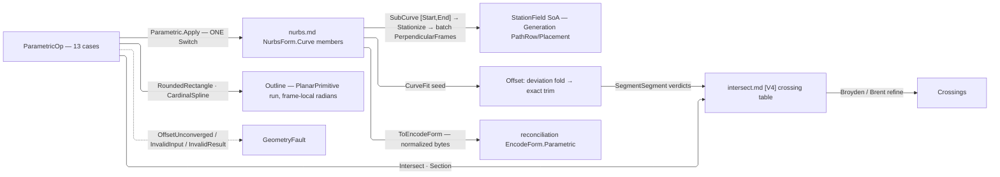

# [RASM_PARAMETRIC_CURVE]

`Rasm.Parametric` owns the host-neutral curve op algebra — one static owner folding `ParametricOp` through `Parametric.Apply`, at OP altitude composing the `nurbs.md` engine members over `NurbsForm.Curve` and, for the planar constructions, over the frame-local `PlanarPrimitive` run.

Every reachable failure routes its direct `GeometryFault` case or the resolved `Op` admission channel, and no exception crosses the public surface; degeneracy-sensitive verdicts escalate to `Numerics/predicates`. Every emitted curve content-keys through `ToEncodeForm()` into the reconciliation identity chain, minting no second identity.

## [01]-[INDEX]

- [02]-[PARAMETRIC]: `ParametricOp` request `[Union]` folds through ONE `Apply` into typed `ParametricResult`, over the division/measure/planar-primitive vocabularies and the shared deviation-refinement driver.

## [02]-[PARAMETRIC]

- Owner: `DivideRule` and `PlanarPrimitive` `[Union]` the division and planar-primitive payload vocabularies as cases, and `MeasureAt` is the ad-hoc `[Union<Unit, UnitInterval, Point3d>]` measure address whose stateless `Whole` arm is the whole-length read; `StationPlan` and `RefinePolicy` are the `[ComplexValueObject]` station and deviation-refinement policy rows, admitted once at generated construction, with `RefinePolicy.Run` the one bounded refinement driver; `ParametricOp` and `ParametricResult` `[Union]` the request and result algebra; `Parametric` mints the static `Apply` entry.
- Cases: `ParametricOp` folds the request cases `Evaluate`, `Measure`, `Divide`, `Stations`, `Split`, `Reconstruct`, `Offset`, `Blend`, `Project`, `Intersect`, `Section`, `RoundedRectangle`, and `CardinalSpline`, each paired to one typed `ParametricResult` carrier and each carrying its unit-domain parameters and counts already admitted as `UnitInterval`/`Dimension`; the two planar constructions answer one `Outline` run because a rounded corner and a spline span lower to the same three primitives.
- Entry: `Apply` discriminates the op case through the generated total `Switch` — the one entry, no per-op sibling family, and the one `Op` key threads into every kernel including the planar constructors; a region owner lowers closed loops under its own admitted fidelity and calls `Arrangement.Apply(PlanarOverlay)` itself.
- Auto: each op case internalizes its vendored-engine kernel at the fence with no per-op knob; `Divide` and `Stations` share ONE `Stationize` arc→parameter kernel, and both offset lanes ride ONE `RefinePolicy.Run`.
- Law: `RefinePolicy` carries a `Tolerance` — the lane-resolved deviation band, minted through `RefinePolicy.Of(context, limit)` onto `Fin<RefinePolicy>` — never a bare double, so a refusal names WHICH gate refused and a coarse-tolerance document does not chase a fabricated 1e-6. NAMED LOSS: the context-free `RefinePolicy.Canonical` static; a caller with no model context has no honest deviation band to spend.
- Law: `Refinement` publishes the band the fit MET. `Limit` is a second lane-resolved `Tolerance` — the band a final still-breaching round may be accepted under — carried beside `Target`, both admitted at policy construction so half-present evidence is unrepresentable and no consumer reads a tolerance the refinement never cleared; `Rounds` counts rounds RUN while the zero-based `RefineRound.Index` stays internal. NAMED LOSS: `double Budget: 8.0`, a dimensionless multiplier on a document tolerance that admitted a fit eight times outside the band it published; a caller wanting slack now states an admitted allowance in model units and the default limit IS the target.
- Law: `Order` and every count on this page are `Dimension`. NAMED LOSS: `int.Max(1, op.Order)`, a silent clamp answering order 1 where `locate.md` refuses the same request — three regimes for one concept across three pages collapse to the carrier's own guard.
- Output: `Refinement` carries the deviation evidence on `Offsets`; `Refit` publishes the measured deviation and sample count of its one reconstruction pass and fabricates no band; `StationField` carries the frame batch `PerpendicularFrames` already proved orthonormal, with no second witness, and an empty batch refuses rather than publishing a fabricated zero; offset tallies are `Dimension` counts.
- Packages: `Rasm.Parametric` `nurbs.md` (the vendored engine — `RationalDerivatives`/`TangentAt`/`CurvatureAt`/`Length`/`LengthAt`/`ParameterAtLength`/`ParameterAtChordLength`/`ClosestParameter`/`PerpendicularFrames`/`SplitAt`/`SubCurve`/`IsClosed` carrier members, `Nurbs.Of` + `NurbsInput.CurveFit` + `SplinePolicy` the fit seed, `NurbsPolicy` the G7 knobs), `Rasm.Numerics` (`Interpolant.PchipSpline` the batch inversion table — the ONE interpolation owner, never a raw MathNet reach; `Predicate`/`Axis` the exact escalation ladder; the `GeometryFault` union; `Dimension`/`PositiveMagnitude`/`UnitInterval`/`VectorAngle` atoms), MathNet.Numerics (`Brent.TryFindRoot` the section roots; `Broyden.FindRoot` the 2-var crossing refinement, `Op.Catch`-funnelled), `Rasm.Meshing` (`Intersection.Apply` + `IntersectOp.SegmentSegment` the exact candidate table), `Rasm.Domain` (`Op` + `AcceptValidated` the policy admission lift, `Context`/`ToleranceLane`), `Rhino.Geometry` (`Point3d`/`Point2d`/`Vector3d`/`Plane`/`Interval`/`Line` carriers), Thinktecture.Runtime.Extensions (`[Union]`/`[Union<T1, T2, T3>]` dispatch, `[ComplexValueObject]` policy admission), LanguageExt.Core (`Fin`/`Arr`/`Seq`/`Option`, `FoldUntil` the halting fold both bounded refinements ride, `FoldBackM` the head-to-tail dependent split fold).
- Growth: a new op is one `ParametricOp` case over the SAME carrier members — `Blend` and `Project` are the executed precedent; a new division scheme is one `DivideRule` case read by the shared `Stationize` kernel; a new measure address is one `MeasureAt` slot; a new crossing (the host-deferred triple arriving in-kernel) is one direct `ParametricOp` case beside `Intersect` and `Section`; a new planar construction is one op case lowering onto the SAME `PlanarPrimitive` run, and a new primitive shape is one `PlanarPrimitive` case every construction and every rendering arm gains together; zero new entry surfaces.
- Boundary: OP altitude composes `nurbs.md`'s ENGINE members — an op union there, or a basis/insertion/arc-length/RMF kernel re-minted here instead of the vendored instance surface, is the altitude violation. Runtime reciprocals hold one anchor each: `projections.md` Rhino evaluation, `locate.md` Rhino location, `relations.md` the host-deferred SSI/surface-plane/curve-surface triple; a second location algebra or a kernel SSI beside them is the double-owner defect. `Intersect`/`Section` existence is EXACT and coordinates are refined `double` — an unrefined crossing or unescalated near-tangent verdict downstream is the precision defect. `Offset` trims by exact `SegmentSegment` verdicts on neighbor-excluded pairs — trusting the raw fit or trimming by float chords is the G8 regression. `StationField` binds the Generation entry directly as SoA columns; a row-object re-pack is the rejected layout. Composite planar outlines are DERIVED ONCE here — a host path backend and a NURBS emission both read the `Outline` run, so a host composite factory on one arm and a hand-derived corner walk on the other, two derivations of one shape that silently disagree, is the deleted form; the run is frame-local and radian-valued, and the pixel or degree conversion is the consuming boundary's own.

```csharp
// --- [IMPORTS] -------------------------------------------------------------------------
using System;
using System.Linq;
using LanguageExt;
using LanguageExt.Common;
using MathNet.Numerics.RootFinding;
using Rasm.Domain;
using Rasm.Meshing;
using Rasm.Numerics;
using Rhino.Geometry;
using Thinktecture;
using static LanguageExt.Prelude;

namespace Rasm.Parametric;

// --- [TYPES] ---------------------------------------------------------------------------
[Union(ConversionFromValue = ConversionOperatorsGeneration.None)]
public abstract partial record DivideRule {
    private DivideRule() { }

    public sealed record ByCount(Dimension Count) : DivideRule;
    public sealed record ByLength(PositiveMagnitude Maximum) : DivideRule;
    public sealed record ByEqualLength(PositiveMagnitude Maximum) : DivideRule;
    public sealed record ByChord(PositiveMagnitude Chord) : DivideRule;
}

[Union<Unit, UnitInterval, Point3d>(T1Name = "Whole", T1IsStateless = true, T2Name = "Parameter", T3Name = "Point")]
public readonly partial struct MeasureAt;

[Union(ConversionFromValue = ConversionOperatorsGeneration.None)]
public abstract partial record PlanarPrimitive {
    private PlanarPrimitive() { }

    public sealed record Segment(Point2d From, Point2d To) : PlanarPrimitive;
    public sealed record Arc(Point2d Center, PositiveMagnitude Radius, VectorAngle Start, VectorAngle Sweep) : PlanarPrimitive;
    public sealed record Bezier(Point2d Start, Point2d Control1, Point2d Control2, Point2d End) : PlanarPrimitive;
}

// --- [POLICIES] ------------------------------------------------------------------------
[ComplexValueObject]
public sealed partial class StationPlan {
    public UnitInterval Start { get; }
    public UnitInterval End { get; }
    public DivideRule Rule { get; }

    static partial void ValidateFactoryArguments(
        ref ValidationError? validationError,
        ref UnitInterval start,
        ref UnitInterval end,
        ref DivideRule rule) =>
        validationError = start.Value < end.Value && rule is not null
            ? null
            : new ValidationError("StationPlan requires an ordered unit-domain window and a division rule.");
}

[ComplexValueObject]
public sealed partial class RefinePolicy {
    public Tolerance Target { get; }
    public Tolerance Limit { get; }
    public Dimension Rounds { get; }
    public Dimension Seed { get; }

    static partial void ValidateFactoryArguments(
        ref ValidationError? validationError,
        ref Tolerance target,
        ref Tolerance limit,
        ref Dimension rounds,
        ref Dimension seed) =>
        validationError = target.IsValid
            && limit.IsValid
            && target.Lane == ToleranceLane.Deviation
            && limit.Lane == target.Lane
            && limit.Value >= target.Value
            && seed.Value >= 4
                ? null
                : new ValidationError("Refinement requires one deviation lane, an ordered limit, and at least four seeds.");

    public static Fin<RefinePolicy> Of(Context context, Option<Tolerance> limit = default) {
        Tolerance target = context.For(lane: ToleranceLane.Deviation);
        Tolerance accepted = limit.IfNone(target);
        return key.OrDefault().AcceptValidated<RefinePolicy>(
            Validate(
                target, accepted,
                Dimension.Create(value: 6), Dimension.Create(value: 24),
                out RefinePolicy? policy),
            policy);
    }

    internal Fin<(TFit Fit, Refinement Evidence)> Run<TFit, TStation>(
        Arr<TStation> seed,
        Func<Arr<TStation>, int, Fin<RefineRound<TFit, TStation>>> fit,
        Func<Arr<TStation>, Arr<TStation>, Arr<TStation>> densify,
        Func<double, Error> unconverged) =>
        Range(0, Rounds.Value).FoldUntil(
            initialState: fit(seed, 0),
            f: (state, _) => state.Bind(current => current.Breaching.Count == 0
                ? state
                : fit(densify(current.Stations, current.Breaching), current.Index + 1)),
            predicate: static step => step.State.Match(
                Succ: static current => current.Breaching.Count == 0,
                Fail: static _ => true))
        .Bind(final => !double.IsFinite(final.Deviation)
            || final.Deviation < 0.0
            || (final.Breaching.Count > 0 && final.Deviation > Limit.Value)
                ? Fin.Fail<(TFit Fit, Refinement Evidence)>(unconverged(final.Deviation))
                : Fin.Succ((final.Fit, new Refinement(
                    Target, Limit, final.Deviation,
                    Dimension.Create(value: final.Index + 1),
                    Dimension.Create(value: final.Stations.Count)))));
}

// --- [MODELS] --------------------------------------------------------------------------
public sealed record Refinement(Tolerance Target, Tolerance Limit, double Deviation, Dimension Rounds, Dimension Samples);

internal readonly record struct RefineRound<TFit, TStation>(
    TFit Fit, Arr<TStation> Stations, Arr<TStation> Breaching, double Deviation, int Index);

// --- [OPERATIONS] ----------------------------------------------------------------------
[Union(ConversionFromValue = ConversionOperatorsGeneration.None)]
public abstract partial record ParametricOp {
    private ParametricOp() { }

    public sealed record Evaluate(NurbsForm.Curve Curve, UnitInterval Parameter, Dimension Order) : ParametricOp;
    public sealed record Measure(NurbsForm.Curve Curve, MeasureAt At, Context Model) : ParametricOp;
    public sealed record Divide(NurbsForm.Curve Curve, DivideRule Rule) : ParametricOp;
    public sealed record Stations(NurbsForm.Curve Curve, StationPlan Plan) : ParametricOp;
    public sealed record Split(NurbsForm.Curve Curve, Arr<UnitInterval> At) : ParametricOp;
    public sealed record Reconstruct(NurbsForm.Curve Curve, SplinePolicy Fit, Dimension Samples) : ParametricOp;
    public sealed record Offset(NurbsForm.Curve Curve, Plane Frame, double Distance, RefinePolicy Refine) : ParametricOp;
    public sealed record Blend(NurbsForm.Curve A, UnitInterval AtA, NurbsForm.Curve B, UnitInterval AtB, Dimension Continuity, RefinePolicy Refine) : ParametricOp;
    public sealed record Project(NurbsForm.Curve Curve, Plane Frame, SplinePolicy Fit, RefinePolicy Refine) : ParametricOp;
    public sealed record Intersect(NurbsForm.Curve Curve, NurbsForm.Curve Other, Axis Plane) : ParametricOp;
    public sealed record Section(NurbsForm.Curve Curve, Plane Cut) : ParametricOp;
    public sealed record RoundedRectangle(Plane Frame, Interval X, Interval Y, double NW, double NE, double SE, double SW) : ParametricOp;
    public sealed record CardinalSpline(Plane Frame, Arr<Point2d> Points, UnitInterval Tension, bool Closed) : ParametricOp;
}

[Union(ConversionFromValue = ConversionOperatorsGeneration.None)]
public abstract partial record ParametricResult {
    private ParametricResult() { }

    public sealed record Sample(Point3d Point, Vector3d Tangent, Arr<Vector3d> Derivatives, Plane Frame, Vector3d Curvature) : ParametricResult;
    public sealed record Measured(double Length, double Parameter, Point3d Point, Vector3d Curvature, bool Closed) : ParametricResult;
    public sealed record Division(Arr<double> Parameters, Arr<Point3d> Points) : ParametricResult;
    public sealed record StationField(Arr<double> Arcs, Arr<double> Parameters, Arr<Point3d> Points, Arr<Plane> Frames) : ParametricResult;
    public sealed record Pieces(Arr<NurbsForm.Curve> Curves) : ParametricResult;
    public sealed record Refit(NurbsForm.Curve Curve, double Deviation, Dimension Samples) : ParametricResult;
    public sealed record Offsets(Arr<NurbsForm.Curve> Curves, Refinement Refinement, Dimension Trimmed, Dimension Kept) : ParametricResult;
    public sealed record Crossings(Arr<(double TA, double TB, Point3d At)> Hits) : ParametricResult;
    public sealed record Outline(Arr<PlanarPrimitive> Run, Plane Frame, bool Closed) : ParametricResult;
}

public static class Parametric {
    public static Fin<ParametricResult> Apply(ParametricOp op) =>
        op.Switch(
            state: key.OrDefault(),
            evaluate:         static (k, e) => EvaluateOf(e, k),
            measure:          static (k, m) => MeasureOf(m, k),
            divide:           static (k, d) => Stationize(d.Curve, d.Rule, k).Map(rows =>
                (ParametricResult)new ParametricResult.Division(
                    rows.Parameters,
                    new Arr<Point3d>([.. rows.Parameters.Select(d.Curve.PointAt)]))),
            stations:         static (k, s) => StationsOf(s, k),
            split:            static (k, s) => SplitOf(s, k),
            reconstruct:      static (k, r) => ReconstructOf(r, k),
            offset:           static (k, o) => OffsetOf(o, k),
            blend:            static (k, b) => BlendOf(b, k),
            project:          static (k, p) => ProjectOf(p, k),
            intersect:        static (k, i) => CrossingsOf(i.Curve, i.Other, i.Plane, k),
            section:          static (k, s) => SectionOf(s.Curve, s.Cut, k),
            roundedRectangle: static (k, r) => RoundedOf(r, k),
            cardinalSpline:   static (k, c) => CardinalOf(c, k));

    // --- [EVALUATE_MEASURE]
    static Fin<ParametricResult> EvaluateOf(ParametricOp.Evaluate op) =>
        op.Curve.PerpendicularFrames([op.Parameter.Value]).Map(frames => {
            (Point3d point, Arr<Vector3d> derivatives) = op.Curve.RationalDerivatives(op.Parameter.Value, Some(op.Order));
            return (ParametricResult)new ParametricResult.Sample(
                point, op.Curve.TangentAt(op.Parameter.Value), derivatives,
                frames[0], op.Curve.CurvatureAt(op.Parameter.Value));
        });

    static Fin<ParametricResult> MeasureOf(ParametricOp.Measure op) =>
        op.At.Switch<Fin<(double Parameter, double Length)>>(
                whole: _ => op.Curve.Length()
                    .Map(static length => (Parameter: 1.0, Length: length)),
                parameter: value => op.Curve.LengthAt(value.Value)
                    .Map(length => (Parameter: value.Value, Length: length)),
                point: value => op.Curve.ClosestParameter(value)
                    .Bind(parameter => op.Curve.LengthAt(parameter)
                        .Map(length => (Parameter: parameter, Length: length))))
            .Bind(row => Fin.Succ((ParametricResult)new ParametricResult.Measured(
                row.Length, row.Parameter, op.Curve.PointAt(row.Parameter),
                op.Curve.CurvatureAt(row.Parameter), op.Curve.IsClosed(op.Model))));

    // --- [STATION_KERNEL]
    private static readonly Dimension TableThreshold = Dimension.Create(value: 256);

    static Fin<(Arr<double> Arcs, Arr<double> Parameters)> Stationize(NurbsForm.Curve curve, DivideRule rule) =>
        ArcTargets(curve, rule).Bind(arcs => arcs.Count < TableThreshold.Value
            ? arcs.TraverseM(arc => curve.ParameterAtLength(arc)).As()
                .Map(parameters => (Arcs: arcs, Parameters: new Arr<double>([.. parameters])))
            : InvertByTable(curve, arcs));

    static Fin<Arr<double>> ArcTargets(NurbsForm.Curve curve, DivideRule rule);
    static Fin<(Arr<double> Arcs, Arr<double> Parameters)> InvertByTable(NurbsForm.Curve curve, Arr<double> arcs);

    static Fin<ParametricResult> StationsOf(ParametricOp.Stations op) =>
        op.Curve.SubCurve(op.Plan.Start.Value, op.Plan.End.Value)
            .Bind(window => Stationize(window, op.Plan.Rule).Bind(rows =>
                window.PerpendicularFrames([.. rows.Parameters]).Bind(frames => frames.Count == 0
                    ? Fin.Fail<ParametricResult>(new KernelFault.InvalidResult())
                    : Fin.Succ((ParametricResult)new ParametricResult.StationField(
                        rows.Arcs,
                        new Arr<double>([.. rows.Parameters.Select(parameter => op.Plan.Start.Value
                            + (parameter * (op.Plan.End.Value - op.Plan.Start.Value)))]),
                        new Arr<Point3d>([.. frames.Select(static frame => frame.Origin)]),
                        frames)))));

    // --- [SPLIT_RECONSTRUCT]
    static Fin<ParametricResult> SplitOf(ParametricOp.Split op) =>
        toSeq(toSeq(op.At)
                .Map(static parameter => parameter.Value)
                .Filter(static parameter => parameter is > 0.0 and < 1.0)
                .Distinct()
                .OrderBy(static parameter => parameter))
            .FoldBackM( // FoldM walks tail-to-head on the landed release; FoldBackM is the head-to-tail walk the ascending Consumed renormalization needs
                (Head: op.Curve, Done: Seq<NurbsForm.Curve>(), Consumed: 0.0),
                (split, parameter) => split.Head.SplitAt((parameter - split.Consumed) / (1.0 - split.Consumed))
                    .Map(pair => (pair.Tail, split.Done.Add(pair.Head), parameter)))
            .As()
            .Map(static split => (ParametricResult)new ParametricResult.Pieces(
                new Arr<NurbsForm.Curve>([.. split.Done.Add(split.Head)])));

    static Fin<ParametricResult> ReconstructOf(ParametricOp.Reconstruct op) =>
        Stationize(
                op.Curve,
                new DivideRule.ByCount(Dimension.Create(value: int.Max(op.Fit.Degree.Value + 1, op.Samples.Value))))
            .Bind(rows => Nurbs.Of(new NurbsInput.CurveFit(
                new Arr<Point3d>([.. rows.Parameters.Select(op.Curve.PointAt)]), op.Fit)))
            .Bind(form => form is NurbsForm.Curve refit
                ? DeviationAgainst(op.Curve, refit, 2 * op.Samples.Value).Map(deviation =>
                    (ParametricResult)new ParametricResult.Refit(refit, deviation, op.Samples))
                : Fin.Fail<ParametricResult>(new KernelFault.InvalidResult()));

    static Fin<double> DeviationAgainst(NurbsForm.Curve reference, NurbsForm.Curve candidate, int probes);

    // --- [OFFSET_LOOP]
    static Fin<ParametricResult> BlendOf(ParametricOp.Blend op);
    static Fin<ParametricResult> ProjectOf(ParametricOp.Project op);

    static Fin<ParametricResult> OffsetOf(ParametricOp.Offset op) =>
        Stationize(op.Curve, new DivideRule.ByCount(op.Refine.Seed))
            .Bind(rows => op.Refine.Run(
                seed: rows.Parameters,
                fit: (stations, index) => stations.TraverseM(
                        parameter => OffsetLocus(op.Curve, op.Frame, op.Distance, parameter))
                    .As()
                    .Bind(samples => Nurbs.Of(new NurbsInput.CurveFit(
                        new Arr<Point3d>([.. samples]), SplinePolicy.Canonical)))
                    .Bind(form => form is NurbsForm.Curve fit
                        ? Fin.Succ(Probed(fit, stations, index))
                        : Fin.Fail<RefineRound<NurbsForm.Curve, double>>(new KernelFault.InvalidResult())),
                densify: Densified,
                unconverged: deviation => new GeometryFault.OffsetUnconverged(Kind.Curve, deviation)))
            .Bind(final => TrimLoops(final.Fit, final.Evidence));

    static Fin<Point3d> OffsetLocus(NurbsForm.Curve curve, Plane frame, double distance, double t);
    static RefineRound<NurbsForm.Curve, double> Probed(ParametricOp.Offset op, NurbsForm.Curve fit, Arr<double> stations, int index);
    static Arr<double> Densified(Arr<double> stations, Arr<double> breaching);

    static Fin<ParametricResult> TrimLoops(ParametricOp.Offset op, NurbsForm.Curve fit, Refinement refinement);

    // --- [PLANAR_CROSSINGS]
    static Fin<ParametricResult> SectionOf(NurbsForm.Curve curve, Plane cut);

    static Fin<ParametricResult> CrossingsOf(NurbsForm.Curve a, NurbsForm.Curve b, Axis plane);

    // --- [PLANAR_CONSTRUCTION]
    static Fin<ParametricResult> RoundedOf(ParametricOp.RoundedRectangle op);
    static Fin<ParametricResult> CardinalOf(ParametricOp.CardinalSpline op);
}
```



## [03]-[DENSITY_BAR]

One owner per axis; capability is a case, row, or fold arm, never a sibling surface. Each `[RESULT]` names one return type, and indexed notes state the collapse.

| [INDEX] | [AXIS_CONCERN]    | [OWNER]                                      | [RESULT]                          | [CASES] |
| :-----: | :---------------- | :------------------------------------------- | :-------------------------------- | :-----: |
|  [01]   | Curve op algebra  | `ParametricOp` + `Parametric`                | `Apply → Fin<ParametricResult>`   |   13    |
|  [02]   | Result carrier    | `ParametricResult`                           | carrier (drained at the consumer) |    9    |
|  [03]   | Division rules    | `DivideRule`                                 | payload                           |    4    |
|  [04]   | Measure address   | `MeasureAt`                                  | payload                           |    3    |
|  [05]   | Planar primitives | `PlanarPrimitive`                            | payload                           |    3    |
|  [06]   | Policy rows       | `StationPlan`/`RefinePolicy` + `Run`         | values + the one driver           |    —    |

- [01]-[CURVE_OP_ALGEBRA]: `[Union]` request cases folded by ONE `Apply`; the planar curve crossing and the plane section are direct cases, and the SSI triple stays host-deferred.
- [02]-[RESULT_CARRIER]: `[Union]` typed results; `StationField` the SoA wire, `Offsets`/`Refit` evidence-bearing, `Outline` the planar run.
- [03]-[DIVISION_RULES]: `[Union]` count/capped/equalized/chord — rule DATA the one `Stationize` kernel reads.
- [04]-[MEASURE_ADDRESS]: ad-hoc `[Union]` whole/parameter/point.
- [05]-[PLANAR_PRIMITIVES]: `[Union]` segment/arc/bezier, the arc radius and radian angles admitted where `RoundedOf` emits them — the one lowering both planar constructions emit and every rendering arm reads.
- [06]-[POLICY_ROWS]: ordered unit window + rule · lane-resolved deviation target and limit with the one `RefinePolicy.Run` driver, both admitted through generated construction.

Signature-pinned kernels compose vendored engine members and the exact table; no textbook arithmetic is local.

## [04]-[RESEARCH]

<!-- source-only: research row template:
[TOKEN]-[OPEN|BLOCKED]: <exact question>; <verification route>.
-->

(none)
