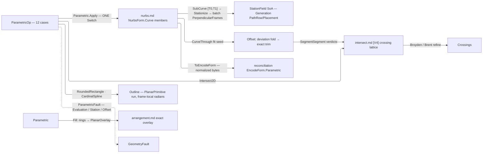

# [RASM_PARAMETRIC_CURVE]

`Rasm.Parametric` owns the host-neutral curve op algebra — one static rail folding `ParametricOp` through `Parametric.Apply`, at OP altitude composing the `nurbs.md` engine members over `NurbsForm.Curve` and, for the planar constructions, over the frame-local `PlanarPrimitive` run.

Every reachable failure routes `GeometryFault.ParametricFault(stage, carrier, witness)`, and no exception crosses the public surface; degeneracy-sensitive verdicts escalate to `Numerics/predicates`. Every emitted curve content-keys through `ToEncodeForm()` into the reconciliation identity chain, minting no second identity.

## [01]-[INDEX]

- [02]-[PARAMETRIC]: `ParametricOp` request `[Union]` folds through ONE `Apply` into typed `ParametricResult`, over the division/measure/crossing/planar-primitive vocabularies and the shared deviation-refinement driver.

## [02]-[PARAMETRIC]

- Owner: `DivideRule`, `MeasureProbe`, `IntersectTarget`, and `PlanarPrimitive` `[Union]` the division, measure-address, planar-crossing, and planar-primitive payload vocabularies as cases; `StationPlan` and `RefinePolicy` bind the station and deviation-refinement policy rows as `IValidityEvidence`, with `Refine.Fold` the one bounded refinement driver; `ParametricOp` and `ParametricResult` `[Union]` the request and result algebra; `Parametric` mints the static `Apply` entry and the `Fill` projection.
- Cases: `ParametricOp` folds the request cases `Evaluate`, `Measure`, `Divide`, `Stations`, `Split`, `Reconstruct`, `Offset`, `Blend`, `Project`, `Intersect2D`, `RoundedRectangle`, and `CardinalSpline`, each paired to one typed `ParametricResult` carrier; the two planar constructions answer one `Outline` run because a rounded corner and a spline span lower to the same three primitives.
- Entry: `Apply` discriminates the op case through the generated total `Switch` — the one entry, no per-op sibling family; `Fill` projects closed loops to the arrangement overlay.
- Auto: each op case internalizes its vendored-engine kernel at the fence with no per-op knob; `Divide` and `Stations` share ONE `Stationize` arc→parameter kernel, and both offset lanes ride ONE `Refine.Fold`.
- Law: `RefinePolicy` carries a `Tolerance` — the lane-resolved deviation band, minted through `RefinePolicy.Of(context)` — never a bare double, so a refusal names WHICH gate refused and a coarse-tolerance document does not chase a fabricated 1e-6. NAMED LOSS: the context-free `RefinePolicy.Canonical` static; a caller with no model context has no honest deviation band to spend.
- Law: `Refinement` publishes the band the fit MET. `Slack` is a second lane-resolved `Tolerance` — the band a final still-breaching round may be accepted under — and `Applied` carries it beside `Target`, so no consumer reads a tolerance the refinement never cleared. NAMED LOSS: `double Budget: 8.0`, a dimensionless multiplier on a document tolerance that admitted a fit eight times outside the band it published; a caller wanting slack now states an admitted allowance in model units and the default slack IS the band.
- Law: `Order` and every count on this page are `Dimension`. NAMED LOSS: `int.Max(1, op.Order)`, a silent clamp answering order 1 where `locate.md` refuses the same request — three regimes for one concept across three pages collapse to the carrier's own guard.
- Output: `Refinement` carries the deviation evidence on `Refit`/`Offsets`, both bands absent on an arm that ran no refinement; `StationField.FrameDefect` is the orthonormality witness whose vectorized reduction rides the registered `FrameDefectClaim`, correctness never on it, and an empty batch refuses rather than publishing a fabricated zero.
- Packages: `Rasm.Parametric` `nurbs.md` (the vendored engine — `RationalDerivatives`/`TangentAt`/`CurvatureAt`/`Length`/`LengthAt`/`ParameterAtLength`/`ParameterAtChordLength`/`ClosestParameter`/`PerpendicularFrames`/`SplitAt`/`SubCurve`/`IsClosed` carrier members, `Nurbs.Of` + `NurbsWire.CurveThrough` + `SplinePolicy` the fit seed, `NurbsPolicy` the G7 knobs), `Rasm.Numerics` (`Interpolant.CubicSplineMonotone` the batch inversion table — the ONE interpolation owner, never a raw MathNet reach; `Predicate`/`Axis` the exact escalation seam; `GeometryFault.ParametricFault` + `ParametricStage`; `Dimension` atoms), MathNet.Numerics (`Brent.TryFindRoot` the section roots; `Broyden.FindRoot` the 2-var crossing refinement, `Op.Catch`-funnelled), `Rasm.Meshing` (`Intersection.Apply` + `IntersectOp.SegmentSegment` + `IntersectPolicy` the exact candidate lattice; `Arrangement.Apply` + `ArrangementOp.PlanarOverlay` + `BooleanOp` + `ArrangementPolicy` the `Fill` delegation), `Rasm.Domain` (`Op`, `Context`/`ToleranceLane`, `ValidityClaim`/`IValidityEvidence`, `BenchClaim` the registered claim row), `Rhino.Geometry` (`Point3d`/`Point2d`/`Vector3d`/`Plane`/`Interval`/`Line`/`Polyline` carriers), Thinktecture.Runtime.Extensions, LanguageExt.Core (`Fin`/`Arr`/`Seq`/`Option`, `FoldUntil` the halting fold both bounded refinements ride), System.Numerics.Tensors (`TensorPrimitives.Max` the SoA wire reduction under the registered claim row), CommunityToolkit.HighPerformance (`MemoryOwner<double>` the frame-defect staging plane).
- Growth: a new op is one `ParametricOp` case over the SAME carrier members — `Blend` and `Project` are the executed precedent; a new division scheme is one `DivideRule` case read by the shared `Stationize` kernel; a new measure address is one `MeasureProbe` case; a new crossing target (the host-deferred triple arriving in-kernel) is one `IntersectTarget` case; a new planar construction is one op case lowering onto the SAME `PlanarPrimitive` run, and a new primitive shape is one `PlanarPrimitive` case every construction and every rendering arm gains together; zero new entry surfaces.
- Boundary: OP altitude composes `nurbs.md`'s ENGINE members — an op union there, or a basis/insertion/arc-length/RMF kernel re-minted here instead of the vendored instance surface, is the altitude violation. Runtime reciprocals hold one anchor each: `projections.md` Rhino evaluation, `locate.md` Rhino location, `relations.md` the host-deferred SSI/surface-plane/curve-surface triple; a second location algebra or a kernel SSI beside them is the double-owner defect. `Intersect2D` existence is EXACT and coordinates are refined `double` — an unrefined crossing or unescalated near-tangent verdict downstream is the precision defect. `Fill` DELEGATES — a local winding fill or re-derived overlay is the deleted form. `Offset` trims by exact `SegmentSegment` verdicts on neighbor-excluded pairs — trusting the raw fit or trimming by float chords is the G8 regression. `StationField` binds the Generation seam directly as SoA columns; a row-object re-pack is the rejected layout. Composite planar outlines are DERIVED ONCE here — a host path backend and a NURBS emission both read the `Outline` run, so a host composite factory on one arm and a hand-derived corner walk on the other, two derivations of one shape that silently disagree, is the deleted form; the run is frame-local and radian-valued, and the pixel or degree conversion is the consuming boundary's own.

```csharp
// --- [RUNTIME_PRELUDE] -----------------------------------------------------------------
using System;
using System.Linq;
using System.Numerics.Tensors;
using CommunityToolkit.HighPerformance.Buffers;
using LanguageExt;
using LanguageExt.Common;
using MathNet.Numerics.RootFinding;
using Rasm.Domain;
using Rasm.Meshing;
using Rasm.Numerics;
using Rhino.Geometry;
using Thinktecture;
using static LanguageExt.Prelude;

namespace Rasm.Parametric;

// --- [TYPES] ---------------------------------------------------------------------------
[Union(ConversionFromValue = ConversionOperatorsGeneration.None)]
public abstract partial record DivideRule {
    private DivideRule() { }

    public sealed record ByCount(int Count) : DivideRule;
    public sealed record ByLength(double MaxSegment) : DivideRule;
    public sealed record ByEqualLength(double MaxSegment) : DivideRule;
    public sealed record ByChord(double Chord) : DivideRule;
}

[Union(ConversionFromValue = ConversionOperatorsGeneration.None)]
public abstract partial record MeasureProbe {
    private MeasureProbe() { }

    public sealed record Whole : MeasureProbe;
    public sealed record AtParameter(double T) : MeasureProbe;
    public sealed record NearPoint(Point3d P) : MeasureProbe;
}

[Union(ConversionFromValue = ConversionOperatorsGeneration.None)]
public abstract partial record IntersectTarget {
    private IntersectTarget() { }

    public sealed record Curve2d(NurbsForm.Curve Other, Axis Plane) : IntersectTarget;
    public sealed record SectionPlane(Plane Cut) : IntersectTarget;
}

[Union(ConversionFromValue = ConversionOperatorsGeneration.None)]
public abstract partial record PlanarPrimitive {
    private PlanarPrimitive() { }

    public sealed record Segment(Point2d From, Point2d To) : PlanarPrimitive;
    public sealed record Sweep(Point2d Center, double Radius, double Start, double Angle) : PlanarPrimitive;
    public sealed record Cubic(Point2d Start, Point2d Control1, Point2d Control2, Point2d End) : PlanarPrimitive;
}

// --- [CONSTANTS] -----------------------------------------------------------------------
public sealed record StationPlan(double T0, double T1, DivideRule Rule, Dimension TableFloor) : IValidityEvidence {
    public static readonly Dimension TableCeiling = Dimension.Create(value: 256);
    public static readonly Dimension TableSeed = Dimension.Create(value: 16);

    public static StationPlan Of(double t0, double t1, DivideRule rule) => new(t0, t1, rule, TableSeed);

    public bool IsValid => ValidityClaim.All(
        ValidityClaim.UnitInterval(value: T0), ValidityClaim.UnitInterval(value: T1),
        T0 < T1,
        ValidityClaim.CountAtLeast(count: TableFloor.Value, floor: 2));
}

public sealed record RefinePolicy(Tolerance Band, Tolerance Slack, Dimension Rounds, Dimension Seed) : IValidityEvidence {
    public static RefinePolicy Of(Context context, Option<Tolerance> slack = default) =>
        context.For(lane: ToleranceLane.Deviation) switch {
            Tolerance band => new RefinePolicy(
                Band: band, Slack: slack.IfNone(band),
                Rounds: Dimension.Create(value: 6), Seed: Dimension.Create(value: 24)),
        };

    public bool IsValid => ValidityClaim.All(
        Band.IsValid, Slack.IsValid,
        Slack.Value >= Band.Value,
        ValidityClaim.CountAtLeast(count: Seed.Value, floor: 4));
}

// --- [MODELS] --------------------------------------------------------------------------
public sealed record Refinement(Option<double> Target, Option<double> Applied, double Achieved, int Rounds, int Samples);

public readonly record struct RefineRound<TFit, TStation>(TFit Fit, Arr<TStation> Stations, Arr<TStation> Breaching, double Deviation, int Round);

public static class Refine {
    public static Fin<(TFit Fit, Refinement Refinement)> Fold<TFit, TStation>(
        RefinePolicy policy,
        Arr<TStation> seed,
        Func<Arr<TStation>, int, Fin<RefineRound<TFit, TStation>>> fit,
        Func<Arr<TStation>, Arr<TStation>, Arr<TStation>> densify,
        Func<double, Error> unconverged) =>
        Range(0, policy.Rounds.Value).FoldUntil(
            state: fit(seed, 0),
            f: (state, _) => state.Bind(s => fit(densify(s.Stations, s.Breaching), s.Round + 1)),
            stateP: static state => state.Match(Succ: static s => s.Breaching.Count == 0, Fail: static _ => true))
        .Bind(final => !double.IsFinite(final.Deviation) || final.Deviation < 0.0
            || (final.Breaching.Count > 0 && final.Deviation > policy.Slack.Value)
            ? Fin.Fail<(TFit Fit, Refinement Refinement)>(unconverged(final.Deviation))
            : Fin.Succ((final.Fit, new Refinement(
                Target: Some(policy.Band.Value), Applied: Some(policy.Slack.Value),
                Achieved: final.Deviation, Rounds: final.Round, Samples: final.Stations.Count))));
}

// --- [OPERATIONS] ----------------------------------------------------------------------
[Union(ConversionFromValue = ConversionOperatorsGeneration.None)]
public abstract partial record ParametricOp {
    private ParametricOp() { }

    public sealed record Evaluate(NurbsForm.Curve Curve, double T, Dimension Order) : ParametricOp;
    public sealed record Measure(NurbsForm.Curve Curve, MeasureProbe Probe, Context Model) : ParametricOp;
    public sealed record Divide(NurbsForm.Curve Curve, DivideRule Rule) : ParametricOp;
    public sealed record Stations(NurbsForm.Curve Curve, StationPlan Plan) : ParametricOp;
    public sealed record Split(NurbsForm.Curve Curve, Arr<double> At) : ParametricOp;
    public sealed record Reconstruct(NurbsForm.Curve Curve, SplinePolicy Fit, int Samples) : ParametricOp;
    public sealed record Offset(NurbsForm.Curve Curve, Plane Frame, double Distance, RefinePolicy Refine) : ParametricOp;
    public sealed record Blend(NurbsForm.Curve A, double TA, NurbsForm.Curve B, double TB, int Continuity, RefinePolicy Refine) : ParametricOp;
    public sealed record Project(NurbsForm.Curve Curve, Plane Frame, SplinePolicy Fit, RefinePolicy Refine) : ParametricOp;
    public sealed record Intersect2D(NurbsForm.Curve Curve, IntersectTarget Target) : ParametricOp;
    public sealed record RoundedRectangle(Plane Frame, Interval X, Interval Y, double NW, double NE, double SE, double SW) : ParametricOp;
    public sealed record CardinalSpline(Plane Frame, Arr<Point2d> Points, double Tension, bool Closed) : ParametricOp;
}

[Union(ConversionFromValue = ConversionOperatorsGeneration.None)]
public abstract partial record ParametricResult {
    private ParametricResult() { }

    public sealed record Sample(Point3d Point, Vector3d Tangent, Arr<Vector3d> Derivatives, Plane Frame, Vector3d Curvature) : ParametricResult;
    public sealed record Measured(double Length, double Parameter, Point3d Point, Vector3d Curvature, bool Closed) : ParametricResult;
    public sealed record Division(Arr<double> Parameters, Arr<Point3d> Points) : ParametricResult;

    public sealed record StationField(Arr<double> Arcs, Arr<double> Parameters, Arr<Point3d> Points, Arr<Plane> Frames, double FrameDefect) : ParametricResult;

    public sealed record Pieces(Arr<NurbsForm.Curve> Curves) : ParametricResult;
    public sealed record Refit(NurbsForm.Curve Curve, Refinement Refinement) : ParametricResult;
    public sealed record Offsets(Arr<NurbsForm.Curve> Curves, Refinement Refinement, int TrimmedCrossings, int KeptSegments) : ParametricResult;
    public sealed record Crossings(Arr<(double TA, double TB, Point3d At)> Hits) : ParametricResult;

    public sealed record Outline(Arr<PlanarPrimitive> Run, Plane Frame, bool Closed) : ParametricResult;
}

public static class Parametric {
    public static readonly BenchClaim FrameDefectClaim = new(
        Claim: Op.Of(name: nameof(ParametricResult.StationField)),
        VectorizedLane: "TensorPrimitives.Max<double> over the filled |X̂·Ŷ| plane",
        ReferenceLane: "scalar LINQ Max fold over the frame batch",
        SpeedupFloor: 1.0);

    public static Fin<ParametricResult> Apply(ParametricOp op, Op? key = null) =>
        op.Switch(
            state: key.OrDefault(),
            evaluate:    static (_, e) => EvaluateOf(e),
            measure:     static (k, m) => MeasureOf(m, k),
            divide:      static (k, d) => Stationize(d.Curve, d.Rule, StationPlan.TableCeiling, k).Map(static rows =>
                (ParametricResult)new ParametricResult.Division(rows.Parameters, new Arr<Point3d>([.. rows.Parameters.Select(rows.Curve.PointAt)]))),
            stations:    static (k, s) => StationsOf(s, k),
            split:       static (_, s) => SplitOf(s),
            reconstruct: static (k, r) => ReconstructOf(r, k),
            offset:      static (k, o) => OffsetOf(o, k),
            blend:       static (k, b) => BlendOf(b, k),
            project:     static (k, p) => ProjectOf(p, k),
            intersect2D: static (k, i) => i.Target.Switch(
                curve2d:      c => CrossingsOf(i.Curve, c, k),
                sectionPlane: p => SectionOf(i.Curve, p.Cut, k)),
            roundedRectangle: static (_, r) => RoundedOf(r),
            cardinalSpline:   static (_, c) => CardinalOf(c));

    public static Fin<ArrangementResult> Fill(Arr<NurbsForm.Curve> loops, Axis plane, Context model, Option<ArrangementPolicy> policy = default, Op? key = null) {
        Op site = key.OrDefault();
        return loops.Exists(loop => !loop.IsClosed(model))
            ? Fault<ArrangementResult>(ParametricStage.Evaluation, ParametricCarrier.Fill, "open loop in a region fill")
            : loops.TraverseM(loop => Stationize(loop, new DivideRule.ByCount(int.Max(16, 4 * loop.ControlCount)), StationPlan.TableCeiling, site)
                    .Map(static rows => new Polyline(rows.Parameters.Select(rows.Curve.PointAt))))
                .As()
                .Bind(rings => Arrangement.Apply(
                    new ArrangementOp.PlanarOverlay(toSeq(rings), Seq<Polyline>(), BooleanOp.Union, plane,
                        policy.IfNone(noneValue: ArrangementPolicy.Canonical)), site));
    }

    // --- [EVALUATE_MEASURE]
    static Fin<ParametricResult> EvaluateOf(ParametricOp.Evaluate op) =>
        op.T is < 0.0 or > 1.0
            ? Fault<ParametricResult>(ParametricStage.Evaluation, ParametricCarrier.Curve, $"parameter {op.T} outside the normalized domain")
            : op.Curve.PerpendicularFrames([op.T]).Map(frames => {
                (Point3d point, Vector3d[] ders) = op.Curve.RationalDerivatives(op.T, Some(op.Order));
                return (ParametricResult)new ParametricResult.Sample(
                    point, op.Curve.TangentAt(op.T), new Arr<Vector3d>(ders), frames[0], op.Curve.CurvatureAt(op.T));
            });

    static Fin<ParametricResult> MeasureOf(ParametricOp.Measure op, Op key) =>
        op.Probe.Switch<(Fin<double> Parameter, Func<double, Fin<double>> Measure)>(
            whole:       _ => (Fin.Succ(1.0), _ => op.Curve.Length(key: key)),
            atParameter: a => (Fin.Succ(a.T), t => op.Curve.LengthAt(t, key: key)),
            nearPoint:   n => (op.Curve.ClosestParameter(n.P, key: key), t => op.Curve.LengthAt(t, key: key)))
        switch {
            (Fin<double> parameter, Func<double, Fin<double>> measure) => parameter.Bind(t => t is < 0.0 or > 1.0
                ? Fault<ParametricResult>(ParametricStage.Evaluation, ParametricCarrier.Curve, $"measure parameter {t} outside the normalized domain")
                : measure(t).Map(measured => (ParametricResult)new ParametricResult.Measured(
                    measured, t, op.Curve.PointAt(t), op.Curve.CurvatureAt(t), op.Curve.IsClosed(op.Model)))),
        };

    // --- [STATION_KERNEL]
    internal readonly record struct StationRows(NurbsForm.Curve Curve, Arr<double> Arcs, Arr<double> Parameters);

    internal static Fin<StationRows> Stationize(NurbsForm.Curve curve, DivideRule rule, Dimension tableFloor, Op key) =>
        ArcTargets(curve, rule).Bind(arcs => arcs.Count < tableFloor.Value
            ? arcs.TraverseM(arc => curve.ParameterAtLength(arc, key: key)).As()
                .Map(ts => new StationRows(curve, arcs, new Arr<double>([.. ts])))
            : InvertByTable(curve, arcs, key));

    static Fin<Arr<double>> ArcTargets(NurbsForm.Curve curve, DivideRule rule);
    static Fin<StationRows> InvertByTable(NurbsForm.Curve curve, Arr<double> arcs, Op key);

    static Fin<ParametricResult> StationsOf(ParametricOp.Stations op, Op key) =>
        !op.Plan.IsValid
            ? Fault<ParametricResult>(ParametricStage.Station, ParametricCarrier.Station, "degenerate window or table floor")
            : op.Curve.SubCurve(op.Plan.T0, op.Plan.T1)
                .Bind(window => Stationize(window, op.Plan.Rule, op.Plan.TableFloor, key))
                .Bind(rows => rows.Curve.PerpendicularFrames([.. rows.Parameters]).Bind(frames => {
                    if (frames.Length == 0) {
                        return Fault<ParametricResult>(ParametricStage.Station, ParametricCarrier.Station, "empty station batch");
                    }
                    Arr<double> parent = new([.. rows.Parameters.Select(t => op.Plan.T0 + (t * (op.Plan.T1 - op.Plan.T0)))]);
                    Arr<Point3d> points = new([.. frames.Select(static f => f.Origin)]);
                    using MemoryOwner<double> staging = MemoryOwner<double>.Allocate(frames.Length);
                    Span<double> dots = staging.Span;
                    for (int i = 0; i < dots.Length; i++) { dots[i] = Math.Abs(frames[i].XAxis * frames[i].YAxis); }
                    return Fin.Succ((ParametricResult)new ParametricResult.StationField(
                        rows.Arcs, parent, points, new Arr<Plane>(frames), TensorPrimitives.Max<double>(dots)));
                }));

    // --- [SPLIT_RECONSTRUCT]
    static Fin<ParametricResult> SplitOf(ParametricOp.Split op) =>
        op.At.Exists(static t => !double.IsFinite(t))
            ? Fault<ParametricResult>(ParametricStage.Evaluation, ParametricCarrier.Curve, "non-finite split parameter")
            : toSeq(op.At.Filter(static t => t is > 0.0 and < 1.0).Distinct().OrderBy(static t => t)).Fold(
                Fin.Succ((Head: op.Curve, Done: Seq<NurbsForm.Curve>(), Consumed: 0.0)),
                (state, t) => state.Bind(s => s.Head.SplitAt((t - s.Consumed) / (1.0 - s.Consumed))
                    .Map(pair => (pair.Tail, s.Done.Add(pair.Head), t))))
            .Map(static s => (ParametricResult)new ParametricResult.Pieces(new Arr<NurbsForm.Curve>([.. s.Done.Add(s.Head)])));

    static Fin<ParametricResult> ReconstructOf(ParametricOp.Reconstruct op, Op key) =>
        Stationize(op.Curve, new DivideRule.ByCount(int.Max(op.Fit.Degree.Value + 1, op.Samples)), StationPlan.TableCeiling, key)
            .Bind(rows => Nurbs.Of(new NurbsWire.CurveThrough(new Arr<Point3d>([.. rows.Parameters.Select(rows.Curve.PointAt)]), op.Fit), key))
            .Bind(form => form is NurbsForm.Curve refit
                ? DeviationAgainst(op.Curve, refit, 2 * op.Samples).Map(deviation =>
                    (ParametricResult)new ParametricResult.Refit(refit, new Refinement(
                        Target: None, Applied: None, Achieved: deviation, Rounds: 1, Samples: op.Samples)))
                : Fault<ParametricResult>(ParametricStage.Construction, ParametricCarrier.Curve, "refit produced a non-curve carrier"));

    static Fin<double> DeviationAgainst(NurbsForm.Curve reference, NurbsForm.Curve candidate, int probes);

    // --- [OFFSET_LOOP]
    static Fin<ParametricResult> BlendOf(ParametricOp.Blend op, Op key);
    static Fin<ParametricResult> ProjectOf(ParametricOp.Project op, Op key);

    static Fin<ParametricResult> OffsetOf(ParametricOp.Offset op, Op key) =>
        Stationize(op.Curve, new DivideRule.ByCount(op.Refine.Seed.Value), StationPlan.TableCeiling, key)
            .Bind(rows => Refine.Fold(
                op.Refine, rows.Parameters,
                fit: (stations, round) => SeedFit(op, stations, round, key),
                densify: Densified,
                unconverged: deviation => new GeometryFault.ParametricFault(ParametricStage.Offset, ParametricCarrier.Curve, $"offset unconverged at deviation {deviation}")))
            .Bind(final => TrimLoops(op, final.Fit, final.Refinement, key));

    static Fin<RefineRound<NurbsForm.Curve, double>> SeedFit(ParametricOp.Offset op, Arr<double> stations, int round, Op key) =>
        stations.TraverseM(t => OffsetLocus(op.Curve, op.Frame, op.Distance, t)).As()
            .Bind(samples => Nurbs.Of(new NurbsWire.CurveThrough(new Arr<Point3d>([.. samples]), SplinePolicy.Canonical), key))
            .Bind(form => form is NurbsForm.Curve fit
                ? Fin.Succ(Probed(op, fit, stations, round))
                : Fault<RefineRound<NurbsForm.Curve, double>>(ParametricStage.Offset, ParametricCarrier.Curve, "offset fit produced a non-curve carrier"));

    static Fin<Point3d> OffsetLocus(NurbsForm.Curve curve, Plane frame, double distance, double t);
    static RefineRound<NurbsForm.Curve, double> Probed(ParametricOp.Offset op, NurbsForm.Curve fit, Arr<double> stations, int round);
    static Arr<double> Densified(Arr<double> stations, Arr<double> breaching);

    static Fin<ParametricResult> TrimLoops(ParametricOp.Offset op, NurbsForm.Curve fit, Refinement refinement, Op key);

    // --- [PLANAR_CROSSINGS]
    static Fin<ParametricResult> SectionOf(NurbsForm.Curve curve, Plane cut, Op key);

    static Fin<ParametricResult> CrossingsOf(NurbsForm.Curve a, IntersectTarget.Curve2d target, Op key);

    // --- [PLANAR_CONSTRUCTION]
    static Fin<ParametricResult> RoundedOf(ParametricOp.RoundedRectangle op);
    static Fin<ParametricResult> CardinalOf(ParametricOp.CardinalSpline op);

    static Fin<T> Fault<T>(ParametricStage stage, ParametricCarrier carrier, string witness) =>
        Fin.Fail<T>(new GeometryFault.ParametricFault(stage, carrier, witness));
}
```



## [03]-[DENSITY_BAR]

One owner per axis; capability is a case, row, or fold arm, never a sibling surface. Each `[RAIL]` names one return rail, and indexed notes state the collapse.

| [INDEX] | [AXIS_CONCERN]    | [OWNER]                                      | [RAIL]                            | [CASES] |
| :-----: | :---------------- | :------------------------------------------- | :-------------------------------- | :-----: |
|  [01]   | Curve op algebra  | `ParametricOp` + `Parametric`                | `Apply → Fin<ParametricResult>`   |   12    |
|  [02]   | Result carrier    | `ParametricResult`                           | carrier (drained at the consumer) |    9    |
|  [03]   | Division rules    | `DivideRule`                                 | payload                           |    4    |
|  [04]   | Measure address   | `MeasureProbe`                               | payload                           |    3    |
|  [05]   | Crossing targets  | `IntersectTarget`                            | payload                           |    2    |
|  [06]   | Planar primitives | `PlanarPrimitive`                            | payload                           |    3    |
|  [07]   | Policy rows       | `StationPlan`/`RefinePolicy` + `Refine.Fold` | values + the one driver           |    —    |
|  [08]   | Region delegation | `Parametric.Fill`                            | `Fill → Fin<ArrangementResult>`   |    —    |

- [01]-[CURVE_OP_ALGEBRA]: `[Union]` request cases folded by ONE `Apply`.
- [02]-[RESULT_CARRIER]: `[Union]` typed results; `StationField` the SoA wire, `Offsets`/`Refit` evidence-bearing, `Outline` the planar run.
- [03]-[DIVISION_RULES]: `[Union]` count/capped/equalized/chord — rule DATA the one `Stationize` kernel reads.
- [04]-[MEASURE_ADDRESS]: `[Union]` whole/parameter/point.
- [05]-[CROSSING_TARGETS]: `[Union]` planar curve/section; the SSI triple stays host-deferred.
- [06]-[PLANAR_PRIMITIVES]: `[Union]` segment/sweep/cubic — the one lowering both planar constructions emit and every rendering arm reads.
- [07]-[POLICY_ROWS]: window + inversion-table floor · lane-resolved deviation band with its one `Refine.Fold` driver.
- [08]-[REGION_DELEGATION]: ring sampling → `PlanarOverlay` — delegation, never a local fill.

Signature-pinned kernels compose vendored engine members and the exact lattice; no textbook arithmetic is local.

## [04]-[RESEARCH]

<!-- source-only: research row template:
[TOKEN]-[OPEN|BLOCKED]: <exact question>; <verification route>.
-->

(none)
