# [RASM_PARAMETRIC_DEVELOP]

`Rasm.Parametric` develops a UV-provenanced surface into guaranteed-isometric planar strips, the exact-isometry fabrication tier: `Development.Apply` folds near-developable bands between exact geodesic edges, torsal ruling lines per band, and a rigid length-preserving unroll. Each strip proves itself through a per-strip `ddouble` isometry witness — a Fabrication acceptance reads its edge-length defect as evidence — and a strip over budget faults on its unit, never emitting an unwitnessed atlas.

`surface.md`'s `SurfaceResult.UvTessellation` — mesh, per-vertex `(u, v)`, and a live `NurbsForm.Surface` binding — carries the input, and edges compose through `Surfaces.Apply(SurfaceOp.Geodesics)` at `GeodesicGrade.Exact`. Emission converges on `flatten.md`'s `ChartAtlas` carrier type, and strip layout composes through QuikGraph.

## [01]-[INDEX]

- [02]-[DEVELOPMENT]: `DevelopOp` the two-case request `[Union]` folded by ONE `Apply` into strip decomposition, torsal rulings, and the exact unroll, `Isometry` carrying the `ddouble` isometry evidence.

## [02]-[DEVELOPMENT]

- Owner: `DevelopPolicy` the policy row (`StripWidth` the geodesic edge spacing · `RulingStations` the per-strip station count · `Torsal` the lane-resolved ruling residual gate · `Isometry` the lane-resolved per-strip witness ceiling the acceptance reads · `Seed` the UV seed polyline the distance field grows from, empty = the `u = 0` boundary isoline) registering `IValidityEvidence`; `DevelopOp` the request `[Union]` (`Decompose` the strip partition + rulings for inspection · `Unroll` the full pipeline through the witness and atlas); `StripField` the SoA wire (edge offset-columns in UV · ruling endpoint/residual columns · per-strip component and MST layout-parent columns); `Isometry` the evidence row (`Strips` · `Rulings` · the per-strip `Witness` column with its one derived `Stat<Scalar>` band · `Torsal` the one `Stat<Scalar>` derived off the field's `TorsalResidual` column · `Components`); `DevelopmentResult` the result `[Union]`; `Development` the static entry.
- Cases: `DevelopOp` cases `Decompose` · `Unroll` (2 — inspection versus fabrication modality, `Unroll` composing `Decompose`'s own fold, never a re-derivation); `DevelopmentResult` cases `Strips` · `Unrolled` (2).
- Entry: `public static Fin<DevelopmentResult> Apply(DevelopOp op, Op? key = null)` — the ONE entry discriminating on the op case; both cases take the `SurfaceResult.UvTessellation` carrier, so the UV-provenance input law is the parameter TYPE.
- Auto: `Decompose` composes the geodesic distance through `Surfaces.Apply(SurfaceOp.Geodesics)` with `Grade` PINNED `Exact` on the `k·StripWidth` ladder, takes the iso-distance contours as strip EDGES (UV and world columns lerp-consistent by the tessellation's own provenance), assigns faces to bands by vertex distance, and roots the torsal coplanarity residual per station (arc-spaced on the lower edge) through `Brent.TryFindRoot` coupled by one `Op.Catch`-funnelled `Broyden.FindRoot` pass; a station short of the `Torsal` band records into `TorsalResidual` rather than faulting, because a mildly non-torsal ruling that still unrolls within budget is fabrication-acceptable and the witness is the acceptance criterion. `Unroll` develops each strip by rigid placement on exact edge lengths — ruling quads split on the shorter diagonal, the triangle chain seated from the origin by two-circle intersection with no solve or relaxation — accumulates the squared edge defect and its edge count per strip in `ddouble`, answers the RMS defect as the WITNESS, narrows at readout onto the isometry band, and faults `Isometry` breaches as `Strip`; layout folds strip adjacency into an `UndirectedGraph`, reads `ConnectedComponents` and a shared-edge-weighted `MinimumSpanningTreeKruskal`, and the atlas emits one `UvIsland` per strip with edge `FeatureEdge` cuts beside a cross-check `Distortion`.
- Law: the layout tree is KRUSKAL, not Prim. Prim returns one component's tree, so on a multi-component strip graph — the ordinary case for a trimmed surface — a Prim ordering silently drops every strip outside the seeded component and the atlas packs a subset while `Components` reports the truth. Kruskal returns the forest the component labels already promise.
- Law: the two gates are `Tolerance` values off `ToleranceLane.Torsal` and `ToleranceLane.Deviation`, minted through `DevelopPolicy.Of(context, stripWidth)`. NAMED LOSS: the `DevelopPolicy.Canonical` static and its 1e-8/1e-10 literals; a fabrication gate a document's own tolerance did not set is a number nobody can defend at acceptance. `StripWidth` stays a caller value because an edge spacing is a design width in model units, not a tolerance.
- Law: the isometry witness is the RMS edge defect, a LENGTH, so it gates against a `ToleranceLane.Deviation` band of the same dimension and carries no edge count. NAMED LOSS: the raw sum of squares — a length² growing with tessellation density, under which a fine strip failed the band a coarse one at identical per-edge defect cleared. The comparison stays in `ddouble` (`policy.Isometry.Value` widens, the witness never narrows) so the 106-bit accumulation survives the gate.
- Output: `Isometry` — strip/ruling census, the per-strip isometry witness column with its one derived `Stat<Scalar>` band, the torsal-residual band derived off its own column, component count — the Fabrication unroll dry-run and Generation developable-gate evidence; the `ChartAtlas.Distortion` rides BESIDE it for carrier-type compatibility, never instead of it.
- Packages: `Rasm.Parametric` `surface.md` (`SurfaceResult.UvTessellation` the input carrier; `Surfaces.Apply(SurfaceOp.Geodesics)` the exact-edge composition) + `nurbs.md` (`NurbsForm.Surface.NormalAt`/`RationalDerivatives` — the ruling normals and strip evaluation), `Rasm.Processing` (`GeodesicKernel.PropagateWindows` machinery surfaced through the surface geodesic lane; `FeatureEdge`/`MeshFeatureKind` — the cut-edge rows `segment.md` mints; `ChartAtlas`/`UvIsland`/`Distortion`/`ChartId` — the flatten carrier types, composed never re-minted), `Rasm.Meshing` (`MeshSpace`), TYoshimura.DoubleDouble (`ddouble` — the 106-bit cancellation-safe witness accumulation, `INumber<ddouble>`-bound fold), MathNet.Numerics (`Brent.TryFindRoot` the per-station torsal root; `Broyden.FindRoot` the coupled station refinement, `Op.Catch`-funnelled), QuikGraph (`UndirectedGraph<int, SEdge<int>>` + `ConnectedComponents` + `MinimumSpanningTreeKruskal` — the layout fold), `Rasm.Numerics` (`Predicate.Orient2D` the flip-free proof; `Dimension`; the `GeometryFault` union), `Rasm.Domain` (`Op`/`Op.Catch`, `Context`/`ToleranceLane`/`Tolerance`, `Stat<Scalar>`/`Scalar`, `ValidityClaim`/`IValidityEvidence`), Rhino.Geometry (`Point3d`/`Vector3d`/`Point2d`), Thinktecture.Runtime.Extensions, LanguageExt.Core.
- Growth: a new decomposition driver (principal-curvature-aligned edges instead of distance edges) is one edge-derivation arm feeding the SAME strip fold; a new ruling condition (a cone-point-aware torsal variant) is one residual function the same Brent/Broyden solve roots; a further layout packing modality is one ordering projection beside `PlacementOrder` off the same MST columns; zero new entry surfaces.
- Boundary: this owner holds the EXACT-ISOMETRY tier — re-deriving a conformal or distortion-minimizing solve here, or claiming isometry without the `ddouble` witness, is the tier violation; the input is the `UvTessellation` TYPE and an unbound mesh cannot enter, so the provenance law is structural; edges are `GeodesicGrade.Exact` by law — a heat-grade edge is the drift defect, edge error becoming strip skew becoming witness noise; ruling normals read the surface BINDING at provenance UV — a mesh-normal approximation is the substitution defect; the unroll is rigid placement on exact edge lengths — a spring relaxation, an ARAP pass, or any distortion-minimizing solve here is the tier regression; the witness accumulates in `ddouble` and narrows ONLY at readout — a `double` running sum re-introduces the cancellation the fold exists to kill; every geometric failure routes `NoDevelopableStrips` or `StripIsometryExceeded` with the strip unit and its isometry measure, every admission or impossible-result branch the resolved `Op.InvalidInput`/`Op.InvalidResult` channel, no exception crossing the surface.

```csharp
// --- [IMPORTS] -------------------------------------------------------------------------
using System.Collections.Generic;
using System.Linq;
using DoubleDouble;
using LanguageExt;
using QuikGraph;
using QuikGraph.Algorithms;
using Rasm.Domain;
using Rasm.Numerics;
using Rasm.Processing;
using Rhino.Geometry;
using Thinktecture;
using static LanguageExt.Prelude;

namespace Rasm.Parametric;

// --- [CONSTANTS] -----------------------------------------------------------------------
public sealed record DevelopPolicy(
    double StripWidth, Dimension RulingStations, Tolerance Torsal, Tolerance Isometry,
    Arr<Point2d> Seed) : IValidityEvidence {
    public static DevelopPolicy Of(Context context, double stripWidth) => new(
        StripWidth: stripWidth, RulingStations: Dimension.Create(value: 32),
        Torsal: context.For(lane: ToleranceLane.Torsal),
        Isometry: context.For(lane: ToleranceLane.Deviation),
        Seed: Arr<Point2d>.Empty);

    public bool IsValid => ValidityClaim.All(
        ValidityClaim.Positive(value: StripWidth),
        Torsal.IsValid, Isometry.IsValid,
        ValidityClaim.CountAtLeast(count: RulingStations.Value, floor: 2));
}

// --- [MODELS] --------------------------------------------------------------------------
public sealed record StripField(
    Arr<int> RailOffsets, Arr<Point2d> RailUv,
    Arr<int> RulingOffsets, Arr<Point2d> RulingA, Arr<Point2d> RulingB, Arr<double> TorsalResidual,
    Arr<int> Component, Arr<int> LayoutParent);

public sealed record Isometry(int Strips, int Rulings, Arr<double> Witness, Stat<Scalar> Band, Stat<Scalar> Torsal, int Components);

// --- [OPERATIONS] ----------------------------------------------------------------------
[Union(ConversionFromValue = ConversionOperatorsGeneration.None)]
public abstract partial record DevelopOp {
    private DevelopOp() { }

    public sealed record Decompose(SurfaceResult.UvTessellation Source, DevelopPolicy Policy) : DevelopOp;
    public sealed record Unroll(SurfaceResult.UvTessellation Source, DevelopPolicy Policy) : DevelopOp;
}

[Union(ConversionFromValue = ConversionOperatorsGeneration.None)]
public abstract partial record DevelopmentResult {
    private DevelopmentResult() { }

    public sealed record Strips(StripField Field) : DevelopmentResult;

    public sealed record Unrolled(ChartAtlas Atlas, StripField Field, Isometry Isometry) : DevelopmentResult;
}

public static class Development {
    public static Fin<DevelopmentResult> Apply(DevelopOp op, Op? key = null) =>
        op.Switch(
            state: key.OrDefault(),
            decompose: static (k, d) => DecomposeOf(d.Source, d.Policy, k).Map(static field => (DevelopmentResult)new DevelopmentResult.Strips(field)),
            unroll:    static (k, u) => DecomposeOf(u.Source, u.Policy, k).Bind(field => UnrollOf(u.Source, u.Policy, field, k)));

    // --- [STRIP_DECOMPOSITION]
    static Fin<StripField> DecomposeOf(SurfaceResult.UvTessellation source, DevelopPolicy policy, Op key) =>
        !policy.IsValid
            ? Fin.Fail<StripField>(key.InvalidInput())
            : Surfaces.Apply(
                    new SurfaceOp.Geodesics(source, new GeodesicPlan(
                        SeedOf(source, policy), LevelLadder(source, policy.StripWidth), GeodesicGrade.Exact)), key)
                .Bind(edges => edges is SurfaceResult.GeodesicField field
                    ? Rulings(source, policy, field, key)
                    : Fin.Fail<StripField>(key.InvalidResult()));

    static Arr<Point2d> SeedOf(SurfaceResult.UvTessellation source, DevelopPolicy policy);
    static Arr<double> LevelLadder(SurfaceResult.UvTessellation source, double stripWidth);

    static Fin<StripField> Rulings(SurfaceResult.UvTessellation source, DevelopPolicy policy, SurfaceResult.GeodesicField edges, Op key);

    // --- [EXACT_UNROLL]
    static Fin<DevelopmentResult> UnrollOf(SurfaceResult.UvTessellation source, DevelopPolicy policy, StripField field, Op key) =>
        StripCount(field) switch {
            0 => Fin.Fail<DevelopmentResult>(new GeometryFault.NoDevelopableStrips()),
            int strips => Range(0, strips).ToSeq()
                .TraverseM(strip => Develop(source, field, strip).Bind(unrolled =>
                    unrolled.Witness <= (ddouble)policy.Isometry.Value
                        ? Fin.Succ(unrolled)
                        : Fin.Fail<UnrolledStrip>(new GeometryFault.StripIsometryExceeded(strip, (double)unrolled.Witness, policy.Isometry))))
                .As()
                .Bind(unrolled => Emit(source, field, unrolled, key)),
        };

    internal readonly record struct UnrolledStrip(int Strip, Arr<int> Vertices, Arr<(int A, int B, int C)> Faces, Arr<Point2d> Planar, ddouble Witness, double MaxJacobianRatio);

    static int StripCount(StripField field);
    static Fin<UnrolledStrip> Develop(SurfaceResult.UvTessellation source, StripField field, int strip);

    // --- [LAYOUT_AND_ATLAS]
    static Fin<DevelopmentResult> Emit(SurfaceResult.UvTessellation source, StripField field, Seq<UnrolledStrip> strips, Op key) {
        UndirectedGraph<int, SEdge<int>> adjacency = new(allowParallelEdges: false);
        adjacency.AddVertexRange(Enumerable.Range(0, strips.Count));
        foreach ((int a, int b) in SharedRails(field)) { adjacency.AddEdge(new SEdge<int>(a, b)); }
        Dictionary<int, int> components = new();
        int componentCount = adjacency.ConnectedComponents(components);
        Arr<int> componentOf = new([.. Enumerable.Range(0, strips.Count).Select(strip => components[strip])]);
        IEnumerable<SEdge<int>> order = adjacency.MinimumSpanningTreeKruskal(edge => 1.0 / (1.0 + SharedRailLength(field, edge.Source, edge.Target)));
        return Atlas(source, field, strips, componentOf, toSeq(order), componentCount, key);
    }

    static Seq<(int A, int B)> SharedRails(StripField field);
    static double SharedRailLength(StripField field, int a, int b);
    internal static Arr<int> PlacementOrder(Seq<UnrolledStrip> strips, Arr<int> componentOf, Seq<SEdge<int>> forest);
    static Fin<DevelopmentResult> Atlas(
        SurfaceResult.UvTessellation source, StripField field, Seq<UnrolledStrip> strips,
        Arr<int> componentOf, Seq<SEdge<int>> forest, int componentCount, Op key);
}
```

```mermaid
---
config:
  layout: elk
  flowchart:
    curve: linear
    padding: 25
---
flowchart LR
    accTitle: Development strip pipeline
    accDescr: Development.Apply decomposes exact geodesic edges into strips, roots torsal rulings, unrolls rigidly under the ddouble witness, and emits the strip atlas through the flatten carrier.
    UvT["surface.md UvTessellation — mesh + (u,v) + binding"] -->|"Development.Apply — ONE Switch"| Edges["Surfaces.Apply(Geodesics) — Grade PINNED Exact"]
    Edges -->|"iso-distance edges at k·StripWidth"| Strips["strip bands"]
    Strips -->|"torsal g(t) roots — Brent per station, Broyden coupling"| Rulings["ruling rows + TorsalResidual"]
    Rulings -->|"rigid two-circle placement on exact lengths"| Unroll["planar strips"]
    Unroll -->|"ddouble √(Σ(‖e‖₃D−‖e‖₂D)²/edges) — narrow at readout"| Witness["RMS isometry witness — Isometry band gate"]
    Strips -->|"UndirectedGraph → components + Kruskal forest"| Layout["strip layout"]
    Unroll -->|"UvIsland strips · FeatureEdge cuts · Distortion"| AtlasOut["flatten.md ChartAtlas + Isometry"]
    UvT -.->|"NoDevelopableStrips / StripIsometryExceeded"| GeometryFault
```



## [03]-[DENSITY_BAR]

One owner per axis; capability is a case, row, or fold arm, never a sibling surface. `[RESULT]` names the owner's one return type.

| [INDEX] | [AXIS_CONCERN]      | [OWNER]                     | [RESULT]                          | [CASES] |
| :-----: | :------------------ | :-------------------------- | :-------------------------------- | :-----: |
|  [01]   | Development algebra | `DevelopOp` + `Development` | `Apply → Fin<DevelopmentResult>`  |    2    |
|  [02]   | Result carrier      | `DevelopmentResult`         | carrier (drained at the consumer) |    2    |
|  [03]   | Strip wire          | `StripField`                | value                             |    —    |
|  [04]   | Policy row          | `DevelopPolicy`             | value (`IValidityEvidence`)       |    —    |
|  [05]   | Evidence            | `Isometry`                  | value                             |    —    |

One transcription-complete source file carries the op algebra, carriers, and kernels; each signature-pinned kernel's contract rides its in-fence comment. Distance field, projection arithmetic, graph algorithms, moment bands, and atlas types are composed owners; the only local mathematics is the torsal residual and the rigid placement, the pair no admitted surface carries.

## [04]-[RESEARCH]

<!-- source-only: research row template:
[TOKEN]-[OPEN|BLOCKED]: <exact question>; <verification route>.
-->

(none)
