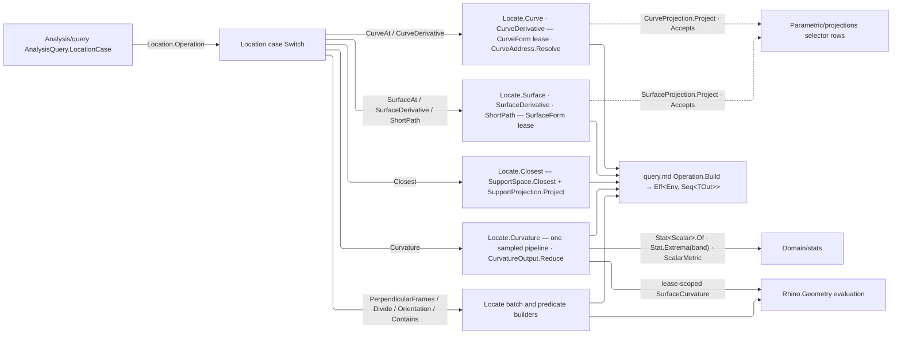

# [RASM_PARAMETRIC_LOCATE]

`Rasm.Parametric` location algebra measures WHERE a point sits on a live `Curve`/`Surface` and WHAT value lives there, folding every addressing, value, subdivision, and curvature query to one `Operation<TGeometry, TOut>` the `Rasm.Analysis` runtime executes under `Eff<Env, Seq<TOut>>`. `AnalysisQuery.LocationCase` construction is the sole public route in — everything behind that case is this owner's.

Structural law is one `Location` case per operation, each carrying its request data — a `CurveAddress` station set, a UV, a probe, a division law, a curvature output — beside the selector row that names its value: the `Parametric/projections` `CurveProjection`/`SurfaceProjection` and `Spatial/support` `SupportProjection` rows are the value vocabularies, carried on the case and never mirrored here. Addressing and division carry their own admission and readiness policy, the page-local `Locate` static owner is the operation spine, the `Analysis/query` `Analyze` facade its only caller. Surface evaluation composes the selector gate directly, coercion rides `Domain/normalization` leases, station grids ride `Domain/evaluation`, and statistics ride `Domain/stats`; every builder lands in `Operation<TGeometry, TOut>.Build`, whose substrate owns readiness and cancellation through `Prepare` so no arm re-checks them.

## [01]-[INDEX]

- [02]-[LOCATION]: vocabulary unions — `CurveAddress` stations, `Division` laws, `CurvatureSample`/`CurvatureOutput`, and the `Location` operation family the query folds.
- [03]-[OPERATIONS]: `Locate` spine — one builder per `Location` case, gated by capability rows and selector output columns, and the sampled curvature sweep.

## [02]-[LOCATION]

- Owner: `CurveAddress` `[Union]` is the curve-station algebra — `Parameter`, `Length`, `Normalized`, `Samples`; `Normalized` carries a `UnitInterval` and `Samples` a `Dimension`, so normalized-position and positive-count admission happen at the atom, while curve-domain membership and nonnegative length admit at `Resolve` where the live curve is in hand. Addressing carries its own policy: `Resolve` lowers every case to ONE `Seq<double>` station shape under `Context.Fractional` — a single station and a sampled station set read as one sequence, the sampled set the `Domain/evaluation` `CurveSampleParameters` grid — and `Requirement` derives the readiness gate by generated `Map` (`Requirement.CurveLength` for the length-driven addresses, `Requirement.Basic` otherwise), never a per-arm literal. Surface UVs, proximity probes, and perpendicular-frame batches are operations, not curve addresses, and seat as their own `Location` cases.
- Owner: `Division` `[Union]` — `Count`, `Length`, `Chord`, `Contour`, each carrying its generated scalar owner (`Dimension` for the count, `PositiveMagnitude` for every spacing) so primitive validity admits at the atom and only the model-dependent gates remain here: `Apply(Curve, Context)` lowers each case to `Curve.DivideByCount`/`DivideByLength`/`DivideEquidistant`/`DivideAsContour` inside the generated fold, the one `Above` band gate reading the spacing against `ToleranceLane.Length`/`ToleranceLane.Chord` and the contour axis span against the length band, run inside `Locate.Divide`'s lease where the runtime `Context` is in hand; `Requirement` derives readiness by generated `Map` (`Requirement.CurveLength` for the length-driven cases), and each case is its own division LAW — arc-length, straight-line chord, and contour-plane spacing never collapse onto one distance knob.
- Owner: `CurvatureSample` `readonly record struct` is the station carrier — the sampled point beside its signed scalar reading, finite on both columns through the `Domain/results` validity fold, so a negative Gaussian or mean curvature is a valid reading and only a degenerate host evaluation faults the sweep; `CurvatureOutput` `[Union]` — `Samples`, `Summary`, `Extrema(Direction, Band)` — is the one typed output algebra: `Accepts(Type)` derives the output shape each case publishes by generated `Map` (`CurvatureSample` for the two station cases, `Stat<Scalar>` for the summary), and `Reduce<TOut>` is the ONE station→output projection, `Summary` folding the readings through `Stat<Scalar>.Of` under the metric as `StatContext`, `Extrema` the `Stat.Extrema` plateau set under `Band` resolved against the runtime `Context`. The `ScalarMetric` rides the `Location` case directly — a page-local mode union re-deriving metric compatibility from the `Domain/stats` sparse payload columns is the deleted duplicate.
- Owner: `Location` `[Union]` — the operation family the query routes, each case the request data one `Locate` builder consumes: `CurveAt(CurveAddress, CurveProjection)`, `SurfaceAt(Point2d, SurfaceProjection)`, `Closest(Point3d, SupportProjection)`, `PerpendicularFrames(Seq<double>)`, `CurveDerivative(CurveAddress, Dimension)`, `SurfaceDerivative(Point2d, Dimension)`, `Curvature(Dimension, ScalarMetric, CurvatureOutput)`, `Divide(Division)`, `Orientation(Plane)`, `Contains(Point3d, Plane)`, `ShortPath(Point2d, Point2d)`. Selector rows ride the case as payload, so the value vocabulary is the selector owner's and never a page-local mirror; `PerpendicularFrames` stays its own case because the host batch minimizes rotation across the ordered station sequence, which independent per-station frame reads never equal; samples, summary, and extrema are `CurvatureOutput` values on ONE `Curvature` case, never sibling cases; the cases construct directly, a forwarding factory per case the deleted form.
- Entry: `Operation<TGeometry, TOut>()` is the generated `Switch` fold from case to operation — `AnalysisQuery.LocationCase.Build` receives that key and hands it through, so this page mints no key of its own — and direct `AnalysisQuery.LocationCase` construction is the ONLY public route in; no forwarding factory exposes a second surface.
- Law: the operation identity has ONE plane, the `Analysis/query` verb key threaded into every builder. A page-local key table beside it is the second identity plane the caller's key already retires, and a generated per-case key would restate the same duplication under another mechanism.
- Law: the extremum plateau is a `ToleranceLane` on the case, resolved to a `Tolerance` at the sweep where the runtime `Context` is in hand — a stored double band cannot say WHICH gate widened the plateau, and a caller minting one has no document to mint it from. NAMED LOSS: the exact `band = 0.0` extremum; `ToleranceLane.Neglect` is the canonical row a caller names where no plateau is wanted, a sub-tolerance floor no measured curvature pair separates.
- Output: the typed value sequence IS the result, `Stat<Scalar>` the `Domain/stats` summary carrier, and refusals ride the typed fault taxonomy: `Reject` for admission-invalid requests, `Unsupported` for impossible (case, geometry, output) combinations, `InvalidResult` for host-evaluation refusals.
- Growth: a new curve or surface value is one selector row at its `Parametric/projections` owner, reached through the existing `CurveAt`/`SurfaceAt` case unchanged; a new curve address is one `CurveAddress` case with its `Resolve` arm and `Map` row; a new division law one `Division` case; a new curvature reduction one `CurvatureOutput` case; a new operation one `Location` case and one `Switch` arm — zero new entrypoints, zero new keys, zero new runtimes.
- Boundary: this owner is Rhino-parametric ANALYSIS altitude, measuring live `Curve`/`Surface` under the `Analysis` runtime; `Parametric/curve` is the host-neutral counterpart for the non-Rhino runtime. Curve, surface, and closest reads carry the `Parametric/projections` `CurveProjection`/`SurfaceProjection` and `Spatial/support` `SupportProjection` selector rows DIRECTLY on the `Location` case — a page-local value union mirroring those three vocabularies is the deleted duplicate, and its output admission, dynamic-derivative policy, and disposable-curvature policy live with their operation owners. Closest-point addressing composes `SupportSpace.Of` + `SupportSpace.Closest` + the `SupportProjection` row's `Project<TOut>`; a locate-local closest-point implementation is the parallel-path defect. Coercion is always the `CurveForm`/`SurfaceForm` LEASE, a raw cast beside it the ownership leak. No `SurfaceCurvature` bundle ever leaves a lease: a surface curvature reading is a `SurfaceProjection` scalar row or the scalar sweep, never a raw bundle output.

## [03]-[OPERATIONS]

- Owner: `Locate` `internal static class` — the operation spine, one builder per `Location` case. Every builder gates on the `Domain/normalization` capability row of its native family (`Capability.CurveForm`/`SurfaceForm`/`Closest`) AND, where a selector rides the case, that selector's own `Accepts<TOut>()` output column — output support derives from the selector owner's stored raw type through the `Numerics/atoms` `ResultProjection` pair predicate, so no builder re-discriminates `TOut` beside it and a family-of-native helper beside the capability rows is the deleted indirection. `Curve` leases once, resolves the address to its station sequence, and traverses `CurveProjection.Project<TOut>` over it under the runtime `Context`; `Surface` leases and hands the UV to `SurfaceProjection.Project<TOut>`, whose gate owns the UV normalization; `Closest` composes the support owner; `Perpendicular` dedups and orders the stations, refuses an empty or out-of-domain set, and lowers the whole sequence to `Curve.GetPerpendicularFrames`; `CurveDerivative` reads the order-`k` vector off `Curve.DerivativeAt`, and `SurfaceDerivative` the order-`k` jet off `Surface.Evaluate` at offset `(k-1)(k+2)/2` with width `k+1`, order request data on the case and never a value row; `Divide` lets `Division.Apply` lower itself inside one lease; `Orientation`/`Contains`/`ShortPath` each lower one predicate and ADMIT their request geometry at construction — a valid frame, a finite probe, two valid and distinct UV endpoints — as `Reject`, never deferred to host evaluation; the two closed-planar predicates carry `Requirement.AreaMass`, the existing closed-planar readiness owner, and the host sentinels `CurveOrientation.Undefined`/`PointContainment.Unset` fault as `InvalidResult` instead of passing as output.
- Owner: the curvature sweep — `Curvature` is ONE sampled scalar pipeline: family compatibility derives from the `ScalarMetric` row's own sparse payload columns (`Vector` present admits the curve family, `Curvature` present the surface family), output compatibility from `CurvatureOutput.Accepts`, and the body leases the native once, samples every station in one traversal — `CurveSamples` over the `Domain/evaluation` arc-length grid reading `Curve.CurvatureAt`, `SurfaceSamples` over the UV grid reading `Surface.CurvatureAt` with EVERY `SurfaceCurvature` bundle scoped on a `Lease` at the point of projection — and reduces once through `CurvatureOutput.Reduce`. A raw curve curvature vector is `CurveAddress.Samples` under `CurveProjection.Curvature`, a raw surface metric an explicit `SurfaceProjection.Gaussian`/`Mean` read, so the sweep carries no second lane for either.
- Boundary: the family and output gates are COMPILE-SHAPE capability gates on a generic operation — the legitimate generic-dispatch idiom, never the runtime raw→typed projection dispatch the `Numerics/atoms` `ProjectionRow` fold owns; a selector's `Accepts<TOut>()`, `CurvatureOutput.Accepts`, and the three predicate builders' `typeof(TOut)` checks are those gates, and no builder re-discriminates `TOut` inside its evaluator; requirement values arrive from the address, division, or selector columns, never inline per arm; a lane-per-family delegate matrix and a builder returning live `IDisposable` bundles are the deleted forms.

```csharp
// --- [IMPORTS] -------------------------------------------------------------------------

using Rasm.Analysis;
using Rasm.Domain;
using Rasm.Numerics;
using Rasm.Spatial;
using Thinktecture;
using Dimension = Rasm.Numerics.Dimension;

namespace Rasm.Parametric;

// --- [TYPES] ---------------------------------------------------------------------------
[Union]
public abstract partial record CurveAddress {
    private CurveAddress() { }
    public sealed record Parameter(double Value) : CurveAddress;
    public sealed record Length(double Value) : CurveAddress;
    public sealed record Normalized(UnitInterval Value) : CurveAddress;
    public sealed record Samples(Dimension Count) : CurveAddress;

    internal Requirement Requirement => Map(
        parameter: Requirement.Basic,
        length: Requirement.CurveLength,
        normalized: Requirement.CurveLength,
        samples: Requirement.CurveLength);

    internal Fin<Seq<double>> Resolve(Curve curve, Context context) => Switch(
        state: (Curve: curve, Context: context),
        parameter: static (s, at) => guard(s.Curve.Domain.IncludesParameter(at.Value), new KernelFault.InvalidInput()).ToFin().Map(_ => Seq(at.Value)),
        length: static (s, at) => guard(double.IsFinite(at.Value) && at.Value >= 0.0, new KernelFault.InvalidInput()).ToFin()
            >> guard(s.Curve.LengthParameter(at.Value, out double t, s.Context.Fractional), new KernelFault.InvalidResult()).ToFin().Map(_ => Seq(t)),
        normalized: static (s, at) => guard(s.Curve.NormalizedLengthParameter(at.Value.Value, out double t, s.Context.Fractional), new KernelFault.InvalidResult()).ToFin().Map(_ => Seq(t)),
        samples: static (s, at) => Evaluation.CurveSampleParameters(s.Curve, at.Count.Value, s.Context, s.Key));
}

[Union]
public abstract partial record Division {
    private Division() { }
    public sealed record Count(Dimension Value) : Division;
    public sealed record Length(PositiveMagnitude Value) : Division;
    public sealed record Chord(PositiveMagnitude Value) : Division;
    public sealed record Contour(Point3d Start, Point3d End, PositiveMagnitude Interval) : Division;

    internal Requirement Requirement => Map(
        count: Requirement.Basic,
        length: Requirement.CurveLength,
        chord: Requirement.CurveLength,
        contour: Requirement.Basic);

    internal Fin<Seq<Point3d>> Apply(Curve curve, Context context) => Switch(
        state: (Curve: curve, Context: context),
        count: static (s, row) => Optional(s.Curve.DivideByCount(row.Value.Value, true, out Point3d[] points) is double[] ? points : null).ToFin(new KernelFault.InvalidResult()).Map(static values => toSeq(values)),
        length: static (s, row) =>
            from _ in Above(row.Value.Value, s.Context.For(ToleranceLane.Length), s.Key)
            from points in Optional(s.Curve.DivideByLength(row.Value.Value, true, out Point3d[] values) is double[] ? values : null).ToFin(new KernelFault.InvalidResult())
            select toSeq(points),
        chord: static (s, row) =>
            from _ in Above(row.Value.Value, s.Context.For(ToleranceLane.Chord), s.Key)
            from points in Optional(s.Curve.DivideEquidistant(row.Value.Value, out double[] _)).ToFin(new KernelFault.InvalidResult())
            select toSeq(points),
        contour: static (s, row) =>
            from start in Admit.Value(row.Start)
            from end in Admit.Value(row.End)
            from _ in Above(row.Interval.Value, s.Context.For(ToleranceLane.Length), s.Key)
            from __ in guard(start.DistanceTo(end) > s.Context.For(ToleranceLane.Length).Value, new KernelFault.InvalidInput()).ToFin()
            from points in Optional(s.Curve.DivideAsContour(start, end, row.Interval.Value)).Filter(static values => values.Length > 0).ToFin(new KernelFault.InvalidResult())
            select toSeq(points));

    private static Fin<Unit> Above(double value, Tolerance band) => guard(value > band.Value, new KernelFault.InvalidInput()).ToFin();
}

public readonly record struct CurvatureSample(Point3d Point, double Value) : IValidityEvidence {
    public bool IsValid => ValidityClaim.All(ValidityClaim.Finite(Point), ValidityClaim.Finite(Value));
}

[Union]
public abstract partial record CurvatureOutput {
    private CurvatureOutput() { }
    public sealed record Samples : CurvatureOutput;
    public sealed record Summary : CurvatureOutput;
    public sealed record Extrema(ExtremumDirection Direction, ToleranceLane Band) : CurvatureOutput;

    internal bool Accepts(Type output) => output == Map(
        samples: typeof(CurvatureSample),
        summary: typeof(Stat<Scalar>),
        extrema: typeof(CurvatureSample));

    internal Fin<Seq<TOut>> Reduce<TOut>(Seq<CurvatureSample> samples, ScalarMetric metric, Context context) => Switch(
        state: (Samples: samples, Metric: metric, Context: context),
        samples: static (s, _) => Acceptance.Results<CurvatureSample, TOut>(s.Samples),
        summary: static (s, _) => Stat<Scalar>.Of(values: s.Samples.Map(static sample => (Scalar)sample.Value), context: Some((StatContext)s.Metric))
            .Bind(stat => Acceptance.Results<Stat<Scalar>, TOut>(Seq(stat))),
        extrema: static (s, row) => Acceptance.Results<CurvatureSample, TOut>(Stat.Extrema(
            items: s.Samples, projection: static sample => sample.Value, band: s.Context.For(row.Band), direction: row.Direction)));
}

[Union]
public abstract partial record Location {
    private Location() { }
    public sealed record CurveAt(CurveAddress Address, CurveProjection Projection) : Location;
    public sealed record SurfaceAt(Point2d Uv, SurfaceProjection Projection) : Location;
    public sealed record Closest(Point3d Probe, SupportProjection Projection) : Location;
    public sealed record PerpendicularFrames(Seq<double> Parameters) : Location;
    public sealed record CurveDerivative(CurveAddress Address, Dimension Order) : Location;
    public sealed record SurfaceDerivative(Point2d Uv, Dimension Order) : Location;
    public sealed record Curvature(Dimension Count, ScalarMetric Metric, CurvatureOutput Output) : Location;
    public sealed record Divide(Division By) : Location;
    public sealed record Orientation(Plane Frame) : Location;
    public sealed record Contains(Point3d Probe, Plane Frame) : Location;
    public sealed record ShortPath(Point2d Start, Point2d End) : Location;

    internal Operation<TGeometry, TOut> Operation<TGeometry, TOut>() where TGeometry : notnull => Switch(
        curveAt: static (row) => Locate.Curve<TGeometry, TOut>(row.Address, row.Projection),
        surfaceAt: static (row) => Locate.Surface<TGeometry, TOut>(row.Uv, row.Projection),
        closest: static (row) => Locate.Closest<TGeometry, TOut>(row.Probe, row.Projection),
        perpendicularFrames: static (row) => Locate.Perpendicular<TGeometry, TOut>(row.Parameters),
        curveDerivative: static (row) => Locate.CurveDerivative<TGeometry, TOut>(row.Address, row.Order),
        surfaceDerivative: static (row) => Locate.SurfaceDerivative<TGeometry, TOut>(row.Uv, row.Order),
        curvature: static (row) => Locate.Curvature<TGeometry, TOut>(row.Count, row.Metric, row.Output),
        divide: static (row) => Locate.Divide<TGeometry, TOut>(row.By),
        orientation: static (row) => Locate.Orientation<TGeometry, TOut>(row.Frame),
        contains: static (row) => Locate.Contains<TGeometry, TOut>(row.Probe, row.Frame),
        shortPath: static (row) => Locate.ShortPath<TGeometry, TOut>(row.Start, row.End));
}

// --- [OPERATIONS] ----------------------------------------------------------------------
internal static class Locate {
    internal static Operation<TGeometry, TOut> Curve<TGeometry, TOut>(CurveAddress address, CurveProjection projection) where TGeometry : notnull =>
        Capability.CurveForm.Admits(typeof(TGeometry)) && projection.Accepts<TOut>()
            ? Operation<TGeometry, TOut>.Build(requirement: Some(address.Requirement), requiresContext: true,
                state: (Address: address, Projection: projection),
                evaluator: static (state, geometry) =>
                    from context in Env.Asks
                    from values in Normalization.CurveForm(geometry, state.Key).Bind(lease => lease.Use(curve =>
                        state.Address.Resolve(curve, context, state.Key).Bind(parameters => parameters
                            .TraverseM(t => state.Projection.Project<TOut>(curve, t, context, state.Key)).As()))).ToEff()
                    select values)
            : new KernelFault.Unsupported();

    internal static Operation<TGeometry, TOut> Surface<TGeometry, TOut>(Point2d uv, SurfaceProjection projection) where TGeometry : notnull =>
        Capability.SurfaceForm.Admits(typeof(TGeometry)) && projection.Accepts<TOut>()
            ? Operation<TGeometry, TOut>.Build(requirement: Some(Requirement.SurfaceEvaluation), requiresContext: true,
                state: (Uv: uv, Projection: projection),
                evaluator: static (state, geometry) =>
                    from context in Env.Asks
                    from value in Normalization.SurfaceForm(geometry, state.Key).Bind(lease => lease.Use(surface =>
                        state.Projection.Project<TOut>(surface, state.Uv.X, state.Uv.Y, context, state.Key))).ToEff()
                    select Seq(value))
            : new KernelFault.Unsupported();

    internal static Operation<TGeometry, TOut> Closest<TGeometry, TOut>(Point3d probe, SupportProjection projection) where TGeometry : notnull =>
        (ValidityClaim.Finite(probe).Holds, Capability.Closest.Admits(typeof(TGeometry)), projection.Accepts<TOut>()) switch {
            (false, _, _) => Operation<TGeometry, TOut>.Reject(new KernelFault.InvalidInput()),
            (true, true, true) => Operation<TGeometry, TOut>.Build(requiresContext: true,
                state: (Probe: probe, Projection: projection),
                evaluator: static (state, geometry) =>
                    from context in Env.Asks
                    from space in SupportSpace.Of(geometry, state.Key).ToEff()
                    from hit in space.Closest(state.Probe, state.Key).ToEff()
                    from value in state.Projection.Project<TOut>(space, hit, state.Probe, context, state.Key).ToEff()
                    select Seq(value)),
            _ => new KernelFault.Unsupported(),
        };

    internal static Operation<TGeometry, TOut> Perpendicular<TGeometry, TOut>(Seq<double> parameters) where TGeometry : notnull =>
        Capability.CurveForm.Admits(typeof(TGeometry))
            ? Operation<TGeometry, Plane>.Build(requirement: Some(Requirement.CurveLength), state: parameters,
                evaluator: static (state, geometry) => Normalization.CurveForm(geometry, state.Key).Bind(lease => lease.Use(curve =>
                    from ordered in Fin.Succ(toSeq(state.Distinct().Order()))
                    from _ in guard(!ordered.IsEmpty && ordered.ForAll(curve.Domain.IncludesParameter), new KernelFault.InvalidInput()).ToFin()
                    from frames in Optional(curve.GetPerpendicularFrames(ordered)).ToFin(new KernelFault.InvalidResult())
                    from accepted in Acceptance.Rows(values: frames)
                    select accepted)).ToEff()).As<TGeometry, TOut>()
            : new KernelFault.Unsupported();

    internal static Operation<TGeometry, TOut> CurveDerivative<TGeometry, TOut>(CurveAddress address, Dimension order) where TGeometry : notnull =>
        Capability.CurveForm.Admits(typeof(TGeometry))
            ? Operation<TGeometry, Vector3d>.Build(requirement: Some(address.Requirement), requiresContext: true,
                state: (Address: address, Order: order), evaluator: static (state, geometry) =>
                    from context in Env.Asks
                    from values in Normalization.CurveForm(geometry, state.Key).Bind(lease => lease.Use(curve =>
                        state.Address.Resolve(curve, context, state.Key).Bind(parameters => parameters.TraverseM(t =>
                            Optional(curve.DerivativeAt(t, state.Order.Value)).Filter(ds => state.Order.Value < ds.Length).ToFin(new KernelFault.InvalidResult())
                                .Bind(ds => Acceptance.Value(ds[state.Order.Value]))).As()))).ToEff()
                    select values).As<TGeometry, TOut>()
            : new KernelFault.Unsupported();

    internal static Operation<TGeometry, TOut> SurfaceDerivative<TGeometry, TOut>(Point2d uv, Dimension order) where TGeometry : notnull =>
        Capability.SurfaceForm.Admits(typeof(TGeometry))
            ? Operation<TGeometry, Vector3d>.Build(requirement: Some(Requirement.SurfaceEvaluation), requiresContext: true,
                state: (Uv: uv, Order: order, Offset: ((order.Value - 1) * (order.Value + 2)) / 2, Width: order.Value + 1),
                evaluator: static (state, geometry) =>
                    from context in Env.Asks
                    from values in Normalization.SurfaceForm(geometry, state.Key).Bind(lease => lease.Use(surface =>
                        Evaluation.SurfaceUv(surface, state.Uv, context, state.Key).Bind(at =>
                            surface.Evaluate(at.X, at.Y, state.Order.Value, out Point3d _, out Vector3d[] derivatives)
                            && derivatives.Length >= state.Offset + state.Width
                                ? Acceptance.Rows(values: derivatives.Skip(state.Offset).Take(state.Width))
                                : Fin.Fail<Seq<Vector3d>>(new KernelFault.InvalidResult())))).ToEff()
                    select values).As<TGeometry, TOut>()
            : new KernelFault.Unsupported();

    internal static Operation<TGeometry, TOut> Divide<TGeometry, TOut>(Division division) where TGeometry : notnull =>
        Capability.CurveForm.Admits(typeof(TGeometry))
            ? Operation<TGeometry, Point3d>.Build(requirement: Some(division.Requirement), requiresContext: true,
                state: division, evaluator: static (state, geometry) =>
                    from context in Env.Asks
                    from values in Normalization.CurveForm(geometry, state.Key).Bind(lease => lease.Use(curve =>
                        state.Apply(curve, context, state.Key).Bind(points => Acceptance.Rows(values: points)))).ToEff()
                    select values).As<TGeometry, TOut>()
            : new KernelFault.Unsupported();

    internal static Operation<TGeometry, TOut> Orientation<TGeometry, TOut>(Plane frame) where TGeometry : notnull =>
        (frame.IsValid, Capability.CurveForm.Admits(typeof(TGeometry)), typeof(TOut) == typeof(CurveOrientation)) switch {
            (false, _, _) => Operation<TGeometry, TOut>.Reject(new KernelFault.InvalidInput()),
            (true, true, true) => Operation<TGeometry, CurveOrientation>.Build(requirement: Some(Requirement.AreaMass), state: frame,
                evaluator: static (state, geometry) => Normalization.CurveForm(geometry, state.Key).Bind(lease => lease.Use(curve =>
                    curve.ClosedCurveOrientation(state) switch {
                        CurveOrientation.Undefined => Fin.Fail<Seq<CurveOrientation>>(new KernelFault.InvalidResult()),
                        CurveOrientation value => Acceptance.Rows(value),
                    })).ToEff()).As<TGeometry, TOut>(),
            _ => new KernelFault.Unsupported(),
        };

    internal static Operation<TGeometry, TOut> Contains<TGeometry, TOut>(Point3d probe, Plane frame) where TGeometry : notnull =>
        (ValidityClaim.Finite(probe).Holds && frame.IsValid, Capability.CurveForm.Admits(typeof(TGeometry)), typeof(TOut) == typeof(PointContainment)) switch {
            (false, _, _) => Operation<TGeometry, TOut>.Reject(new KernelFault.InvalidInput()),
            (true, true, true) => Operation<TGeometry, PointContainment>.Build(requirement: Some(Requirement.AreaMass), requiresContext: true,
                state: (Probe: probe, Frame: frame), evaluator: static (state, geometry) =>
                    from context in Env.Asks
                    from values in Normalization.CurveForm(geometry, state.Key).Bind(lease => lease.Use(curve =>
                        curve.Contains(state.Probe, state.Frame, context.Absolute.Value) switch {
                            PointContainment.Unset => Fin.Fail<Seq<PointContainment>>(new KernelFault.InvalidResult()),
                            PointContainment value => Acceptance.Rows(value),
                        })).ToEff()
                    select values).As<TGeometry, TOut>(),
            _ => new KernelFault.Unsupported(),
        };

    internal static Operation<TGeometry, TOut> ShortPath<TGeometry, TOut>(Point2d start, Point2d end) where TGeometry : notnull =>
        (start.IsValid && end.IsValid && start != end, Capability.SurfaceForm.Admits(typeof(TGeometry)), typeof(TOut) == typeof(Curve)) switch {
            (false, _, _) => Operation<TGeometry, TOut>.Reject(new KernelFault.InvalidInput()),
            (true, true, true) => Operation<TGeometry, Curve>.Build(requirement: Some(Requirement.SurfaceEvaluation), requiresContext: true,
                state: (Start: start, End: end), evaluator: static (state, geometry) =>
                    from context in Env.Asks
                    from paths in Normalization.SurfaceForm(geometry, state.Key).Bind(lease => lease.Use(surface =>
                        from a in Evaluation.SurfaceUv(surface, state.Start, context, state.Key)
                        from b in Evaluation.SurfaceUv(surface, state.End, context, state.Key)
                        from path in Optional(surface.ShortPath(a, b, context.Absolute.Value)).ToFin(new KernelFault.InvalidResult())
                        select Seq(path))).ToEff()
                    select paths).As<TGeometry, TOut>(),
            _ => new KernelFault.Unsupported(),
        };

    // --- [CURVATURE_SWEEP]
    internal static Operation<TGeometry, TOut> Curvature<TGeometry, TOut>(Dimension count, ScalarMetric metric, CurvatureOutput output) where TGeometry : notnull {
        bool curve = Capability.CurveForm.Admits(typeof(TGeometry)) && metric.Vector.IsSome;
        bool surface = Capability.SurfaceForm.Admits(typeof(TGeometry)) && metric.Curvature.IsSome;
        return !output.Accepts(typeof(TOut)) || (!curve && !surface)
            ? new KernelFault.Unsupported()
            : Operation<TGeometry, TOut>.Build(requirement: Some(curve ? Requirement.CurveLength : Requirement.SurfaceEvaluation), requiresContext: true,
                state: (Curve: curve, Count: count, Metric: metric, Output: output), evaluator: static (state, geometry) =>
                    from context in Env.Asks
                    from samples in (state.Curve
                        ? Normalization.CurveForm(geometry, state.Key).Bind(lease => lease.Use(curve =>
                            CurveSamples(curve, state.Count, state.Metric, context, state.Key)))
                        : Normalization.SurfaceForm(geometry, state.Key).Bind(lease => lease.Use(surface =>
                            SurfaceSamples(surface, state.Count, state.Metric, context, state.Key)))).ToEff()
                    from result in state.Output.Reduce<TOut>(samples, state.Metric, context, state.Key).ToEff()
                    select result);
    }

    private static Fin<Seq<CurvatureSample>> CurveSamples(Curve curve, Dimension count, ScalarMetric metric, Context context) =>
        Evaluation.CurveSampleParameters(curve, count.Value, context).Bind(parameters => parameters
            .TraverseM(t => metric.Of(curve.CurvatureAt(t))
                .Map(value => new CurvatureSample(curve.PointAt(t), value))).As());

    private static Fin<Seq<CurvatureSample>> SurfaceSamples(Surface surface, Dimension count, ScalarMetric metric, Context context) =>
        Evaluation.SurfaceSampleUv(surface, count.Value, context).Bind(uvs => uvs.TraverseM(uv =>
            Optional(surface.CurvatureAt(uv.X, uv.Y)).ToFin(new KernelFault.InvalidResult()).Bind(bundle =>
                new Lease<SurfaceCurvature>.Owned(bundle).Use(scoped => scoped.IsSet
                    ? metric.Of(scoped).Map(value => new CurvatureSample(scoped.Point, value))
                    : Fin.Fail<CurvatureSample>(new KernelFault.InvalidResult())))).As());
}
```



## [04]-[DENSITY_BAR]

One owner per axis; capability is a case, column, or fold arm, never a sibling surface. `[RESULT]` names each owner's one return type.

| [INDEX] | [AXIS_CONCERN]     | [OWNER]           | [RESULT]                                    | [CASES] |
| :-----: | :----------------- | :---------------- | :------------------------------------------ | :-----: |
|  [01]   | location operation | `Location`        | `Operation<TGeometry,TOut>() → Operation` |   11    |
|  [02]   | addressing         | `CurveAddress`    | `Resolve → Fin<Seq<double>>`                |    4    |
|  [03]   | subdivision        | `Division`        | `Apply → Fin<Seq<Point3d>>`                 |    4    |
|  [04]   | curvature station  | `CurvatureSample` | carrier (validity fold)                     |    —    |
|  [05]   | curvature output   | `CurvatureOutput` | `Reduce<TOut> → Fin<Seq<TOut>>`             |    3    |
|  [06]   | operation spine    | `Locate`          | `Operation.Build → Eff<Env, Seq<TOut>>`     |    —    |

Every union, case row, `Resolve`, and `Locate` builder composes the RhinoCommon location surface and the upstream `Domain` tables; no location arm re-mints an evaluation kernel.

## [05]-[RESEARCH]

<!-- source-only: research row template:
[TOKEN]-[OPEN|BLOCKED]: <exact question>; <verification route>.
-->

(none)
