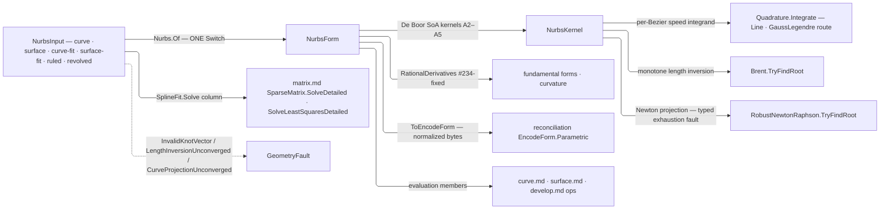

# [RASM_PARAMETRIC_NURBS]

`Rasm.Parametric` owns the host-neutral NURBS engine — the whole rational curve and surface algorithm set in-kernel over `Rhino.Geometry` `Point3d`/`Vector3d`/`Plane` native carriers, control nets held in homogeneous form. `Nurbs.Of` is the ONE polymorphic admission for every wire ingress; evaluation members live on the `NurbsForm` carriers, and the op APIs compose this engine from `curve.md`/`surface.md`.

Fitting solves compose the `matrix.md` sparse owners through `SplineFit`'s own solve column; arc-length routes its per-Bezier speed integrals through the kernel `Numerics/integrate` `Quadrature.Integrate` owner and composes `MathNet` for length inversion and Newton projection while the Bezier decomposition and `|C′(t)|` speed integrand stay local. `ToEncodeForm()` projects into the reconciliation `EncodeForm` chain for one content key per curve across every ingress spelling, and a degeneracy-sensitive verdict escalates to the `Numerics/predicates` exact ladder at the consumer boundary — evaluation is `double`-only geometry, never the adjudication.

## [01]-[INDEX]

- [02]-[NURBS_ENGINE]: `KnotVector` the normalized clamped-or-periodic knot algebra with `ParametricDirection` the axis vocabulary; `SplineFit`/`ChordRule`/`FrameClosure` the behavior-bearing rows; `NurbsInput` the admission `[Union]`; `NurbsForm` the curve/surface carrier `[Union]` holding the full evaluation surface; `NurbsPolicy` the engine knob row; `Nurbs.Of` the ONE admission.

## [02]-[NURBS_ENGINE]

- Owner: `Nurbs` mints the static admission surface folding the `NurbsInput` admission `[Union]` into the `NurbsForm` carrier `[Union]`; `KnotVector` owns the knot algebra proving monotone/finite and clamped-or-wrap-periodic, admitting the full, Rhino-trimmed, and periodic spellings at one entry; `NurbsPolicy` registers `IValidityEvidence`; `ParametricDirection` is the keyless `[SmartEnum]` axis discriminant, and clamped-versus-periodic is the ONE admitted `KnotVector.IsPeriodic` fact, never a second vocabulary; `SplineFit`/`ChordRule`/`FrameClosure` are the `[SmartEnum]` rows carrying the solve, parameterization, and frame-defect laws as delegate columns.
- Cases: `NurbsInput` cases `Curve`, `Surface`, `CurveFit`, `SurfaceFit`, `Ruled`, `Revolved` — the raw cases carry each control point PAIRED with its weight so point/weight arity drift is unrepresentable, and their degree and grid counts arrive as admitted `Dimension`; fitting modality is `SplinePolicy` data, so interpolate-versus-approximate mints no case, and the constructive cases fold admitted curve carriers through the same `Of` (the loft unifies degree and knots then lofts degree-1, the revolution mints exact rational arcs); the surface grid flattens V-inner (`index = u·CountV + v`), the one flattening law the identity projection shares. `NurbsForm` cases `Curve`, `Surface`.
- Entry: `Of` folds every input shape through one generated `Switch` — raw inputs validate and freeze into the homogeneous columns, fit inputs parameterize, average knots, and solve. No `OfCurve`/`Interpolate` sibling factory — the input shape discriminates (`MODAL_ARITY`).
- Auto: evaluation is the internalized NURBS-Book kernel set over the columns — point/derivative, arc-length, closest-parameter projection, double-reflection frame, fundamental-form, iso-curve, and Boehm/Oslo refinement machinery re-emitting normalized clamped forms; the fence pins each member to its algorithm number.
- Law: the two fitting regimes are ONE `SplineFit` roster whose `Solve` column carries the linear system each regime forms — interpolation the banded `N·P = Q`, approximation the SPD `NᵀN·P = NᵀQ` — so the fit lane never branches on row equality and a third regime (penalized, tangent-constrained) is one row. `Solve` binds the `SparseMatrix.SolveDetailed`/`SolveLeastSquaresDetailed` catalog members directly and answers the whole `LinearSolution`; `FitCurve`/`FitSurface` read `Stop.IsUsable` before consuming `Solution` and propagate an unusable stop as the fit's typed failure — projecting the vector past its stop is the consumer defect `matrix.md [04]` names.
- Law: parameterization is `ChordRule` data — `Uniform`/`Chord`/`Centripetal` are the A9.3 exponents as one `Metric` column, so the deleted `bool Centripetal` knob cannot spell the uniform third the literature carries.
- Law: every count on the engine's PUBLIC surface is `Dimension` — policy orders and budgets, derivative order, and the degree targets `ElevateDegree`/`ReduceDegree` take — so a non-positive order or target is unrepresentable rather than guarded at each read, and no consumer clamps one into range on this engine's behalf. `KnotVector.Of(int degree, …)` stays raw because it IS the boundary admission. The two tolerance columns anchor on `EpsilonPolicy` and `Of(context)` derives them from `ToleranceLane.Length`/`ToleranceLane.Root` wherever a caller holds a model context.
- Law: closure is MODEL-SPACE and reads `ToleranceLane.Closure` off a threaded `Context`, on both carriers. NAMED LOSS: the parameterless `IsClosed` accessor; a dimensionless anchor called essentially nothing closed on a metre model and disagreed with a millimetre one about the same curve.
- Law: knot coincidence has ONE regime — the `Coincident` band both multiplicity walks and the wrap proof read. NAMED LOSS: exact float equality at the ends, which held only on an unstated bit-exactness invariant a later change to the normalization would have broken silently.
- Packages: `MathNet.Numerics` (`Brent.TryFindRoot` length inversion, `RobustNewtonRaphson.TryFindRoot` guarded Newton projection — both no-throw twins, so budget exhaustion lands as a typed fault in the result); `TYoshimura.DoubleDouble` (`ddouble` + `DoubleDoubleEnumerableExpand.Sum` — the 106-bit arc-length table, narrowed only at public signatures); `Rhino.Geometry` (`Point3d`/`Vector3d`/`Plane` native carriers); `Rasm.Numerics` (`Quadrature.Integrate`/`QuadratureDomain.Line`/`QuadratureRoute.GaussLegendre`/`QuadratureControl` arc-length quadrature, `SparseMatrix.FromTriplets`/`SolveDetailed`/`SolveLeastSquaresDetailed` the fitting solves and `LinearSolution`/`SolveStop.IsUsable` their evidence, `EpsilonPolicy`/`Dimension` atoms, `Reduce.Floored` the periodic span wrap, the `GeometryFault` union); `Rasm.Spatial` (`EncodeForm` identity target, its parametric head admitting `(int Degree, Arr<double> Knots)` direction rows); `Rasm.Domain` (`Try.lift`, `Context`/`ToleranceLane`, `ValidityClaim`/`IValidityEvidence`, `AdmissionSlots.Gate`/`Accumulate` the paired-control refusal accumulation); `Thinktecture.Runtime.Extensions`; `LanguageExt.Core` (`Fin`/`Arr`/`Seq`/`Option`, `Validation<Error, _>` + applicative `Apply` the accumulating admission); `System.Numerics.Tensors` (`TensorPrimitives.Subtract`/`Divide`/`IsFiniteAll` — the knot normalization and its one finiteness reduction); BCL inbox.
- Growth: a new evaluation member is one projection over the existing derivative kernels; a new fitting scheme is one `SplineFit` row carrying its own `Solve` column, consumers untouched; a further constructive input (swept, lofted-through-N) is one `NurbsInput` case folded by the same `Of` — `Ruled`/`Revolved` are the executed precedent — zero new entry surfaces, zero new carriers.
- Boundary: evaluation members live on `NurbsForm` and the op APIs live in `curve.md`/`surface.md`, so an op union here or an evaluation re-derivation there is the altitude violation; the engine speaks `Point3d`/`Vector3d`/`Plane` natively with no private point vocabulary or marshal layer; parameters are the normalized `[0,1]`/`[0,1]²` domain and knots store clamped-normalized — or wrap-periodic UNCLAMPED under `KnotVector.IsPeriodic`, where the span arm wraps the parameter and closure holds at `C^{p−1}`; weights are strictly positive at admission and a zero-or-negative weight or non-finite point is a `DegenerateInput` admission fault naming its index — every control refusal accumulates into ONE verdict, and only the knot-dependent extent gate runs after it — never a NaN downstream; `ToEncodeForm` re-proves `EncodeForm.Of`'s normalized-CLAMPED gate, so a periodic carrier refuses identity projection until a consumer clamps it — one key per curve is worth the refusal, a second layout is not; every failure routes its direct `GeometryFault` case — `InvalidKnotVector`, `LengthInversionUnconverged`, `CurveProjectionUnconverged`, or `DegenerateInput` — over `Fin`, and no exception crosses the public surface; RhinoCommon owns the Rhino-host parametric surface and this engine the host-neutral one — a runtime split, never capability — with the Rhino-trimmed knot spelling extending at the wire under one admission law.

```csharp
// --- [IMPORTS] -------------------------------------------------------------------------
using System;
using System.Linq;
using System.Numerics.Tensors;
using DoubleDouble;
using LanguageExt;
using LanguageExt.Common;
using MathNet.Numerics.RootFinding;
using Rasm.Domain;
using Rasm.Numerics;
using Rasm.Spatial;
using Rhino.Geometry;
using Thinktecture;
using static LanguageExt.Prelude;

namespace Rasm.Parametric;

// --- [TYPES] ---------------------------------------------------------------------------
[SmartEnum]
public sealed partial class ParametricDirection {
    public static readonly ParametricDirection U = new();
    public static readonly ParametricDirection V = new();
}

[SmartEnum]
public sealed partial class SplineFit {
    public static readonly SplineFit Interpolate = new(
        solve: static (basis, rhs, key) => basis.SolveDetailed(rhs));
    public static readonly SplineFit Approximate = new(
        solve: static (basis, rhs, key) => basis.SolveLeastSquaresDetailed(rhs));

    [UseDelegateFromConstructor]
    public partial Fin<LinearSolution> Solve(SparseMatrix basis, Arr<double> rhs);
}

[SmartEnum]
public sealed partial class ChordRule {
    public static readonly ChordRule Uniform     = new(metric: static _ => 1.0);
    public static readonly ChordRule Chord       = new(metric: static chord => chord);
    public static readonly ChordRule Centripetal = new(metric: Math.Sqrt);

    [UseDelegateFromConstructor] public partial double Metric(double chord);
}

[SmartEnum]
public sealed partial class FrameClosure {
    public static readonly FrameClosure Distributed = new(
        twist: static (defect, arc, total) => -defect * arc / total);
    public static readonly FrameClosure Raw = new(
        twist: static (_, _, _) => 0.0);

    [UseDelegateFromConstructor] public partial double Twist(double defect, double arc, double total);
}

// --- [POLICIES] ------------------------------------------------------------------------
public sealed record NurbsPolicy(
    Dimension GaussOrder, double LengthTolerance, Dimension ProjectIterations, double ProjectTolerance,
    Dimension ProjectSubdivision, FrameClosure Closure) : IValidityEvidence {
    public static readonly NurbsPolicy Canonical = new(
        GaussOrder: Dimension.Create(value: 32),
        LengthTolerance: EpsilonPolicy.SqrtEpsilon * EpsilonPolicy.SubTolerance,
        ProjectIterations: Dimension.Create(value: 64),
        ProjectTolerance: EpsilonPolicy.ZeroTolerance,
        ProjectSubdivision: Dimension.Create(value: 20),
        Closure: FrameClosure.Distributed);

    public static NurbsPolicy Of(Context context) => Canonical with {
        LengthTolerance = context.For(lane: ToleranceLane.Length).Value,
        ProjectTolerance = context.For(lane: ToleranceLane.Root).Value,
    };

    public bool IsValid => ValidityClaim.All(
        ValidityClaim.Positive(value: LengthTolerance),
        ValidityClaim.Positive(value: ProjectTolerance));
}

public sealed record SplinePolicy(
    SplineFit Fit, Dimension Degree, ChordRule Rule,
    Option<Vector3d> StartTangent = default, Option<Vector3d> EndTangent = default,
    Option<Dimension> ControlCount = default) {
    public static readonly SplinePolicy Canonical = new(SplineFit.Interpolate, Degree: Dimension.Create(value: 3), Rule: ChordRule.Chord);
}

// --- [MODELS] --------------------------------------------------------------------------
internal readonly record struct KnotVector {
    private KnotVector(int degree, Arr<double> knots, bool isPeriodic) =>
        (Degree, Knots, IsPeriodic) = (degree, knots, isPeriodic);

    internal int Degree { get; }
    internal Arr<double> Knots { get; }
    internal bool IsPeriodic { get; }
    internal int ControlCount => Knots.Count - Degree - 1;

    internal static Fin<KnotVector> Of(int degree, ReadOnlySpan<double> raw) {
        if (degree < 1 || raw.Length < 2 * degree) {
            return Fail(degree, raw.Length, "degree under 1 or knot vector under the trimmed floor");
        }
        if (!TensorPrimitives.IsFiniteAll<double>(raw)) {
            return Fail(degree, raw.Length, "non-finite knot");
        }
        for (int i = 1; i < raw.Length; i++) {
            if (raw[i] < raw[i - 1]) { return Fail(degree, raw.Length, $"non-monotone knot at {i}"); }
        }

        int head = 1;
        while (head < raw.Length && Coincident(raw[head], raw[0])) { head++; }
        int tail = 1;
        while (tail < raw.Length && Coincident(raw[^(tail + 1)], raw[^1])) { tail++; }
        return (head, tail) switch {
            (int h, int t) when h == degree + 1 && t == degree + 1 => Normalize(raw.ToArray(), false),
            (int h, int t) when h == degree && t == degree => Normalize([raw[0], .. raw, raw[^1]], false),
            _ => Normalize(raw.ToArray(), true),
        };

        Fin<KnotVector> Normalize(double[] knots, bool periodic) {
            int controls = knots.Length - degree - 1;
            if (controls < degree + 1) { return Fail(degree, knots.Length, "control extent under degree + 1"); }
            (double lo, double hi) = periodic
                ? (knots[degree], knots[controls])
                : (knots[0], knots[^1]);
            if (hi <= lo) { return Fail(degree, knots.Length, "degenerate active knot extent"); }
            TensorPrimitives.Subtract<double>(knots, lo, knots);
            TensorPrimitives.Divide<double>(knots, hi - lo, knots);
            int period = controls - degree;
            if (periodic && !PeriodicWrap(knots, period)) {
                return Fail(degree, knots.Length, "unclamped knot vector is not periodic over its active domain");
            }
            return Fin.Succ(new KnotVector(degree, new Arr<double>(knots), periodic));
        }

        static Fin<KnotVector> Fail(int degree, int knotCount, string detail) =>
            Fin.Fail<KnotVector>(new GeometryFault.InvalidKnotVector(degree, knotCount, detail));
    }

    static bool Coincident(double a, double b) => Math.Abs(a - b) <= EpsilonPolicy.SqrtEpsilon;

    static bool PeriodicWrap(ReadOnlySpan<double> knots, int period) {
        for (int i = 0; i + period < knots.Length; i++) {
            if (!Coincident(knots[i + period], knots[i] + 1.0)) { return false; }
        }
        return true;
    }

    internal int SpanAt(double t) {
        if (IsPeriodic) {
            (double lo, double hi) = (Knots[Degree], Knots[ControlCount]);
            t = lo + Reduce.Floored(t - lo, hi - lo);
        }
        int n = ControlCount - 1;
        if (t >= Knots[n + 1]) { return n; }
        (int lo2, int hi2) = (Degree, n + 1);
        while (hi2 - lo2 > 1) {
            int mid = (lo2 + hi2) >> 1;
            if (t < Knots[mid]) { hi2 = mid; } else { lo2 = mid; }
        }
        return lo2;
    }

    internal Arr<double> Merge(ReadOnlySpan<double> inserts) {
        double[] merged = new double[Knots.Count + inserts.Length];
        (int a, int b, int at) = (0, 0, 0);
        while (a < Knots.Count && b < inserts.Length) { merged[at++] = Knots[a] <= inserts[b] ? Knots[a++] : inserts[b++]; }
        while (a < Knots.Count) { merged[at++] = Knots[a++]; }
        while (b < inserts.Length) { merged[at++] = inserts[b++]; }
        return new Arr<double>(merged);
    }
}

[Union(ConversionFromValue = ConversionOperatorsGeneration.None)]
public abstract partial record NurbsInput {
    private NurbsInput() { }

    public sealed record Curve(Dimension Degree, Arr<double> Knots, Arr<(Point3d Point, double Weight)> Controls) : NurbsInput;
    public sealed record Surface(Dimension DegreeU, Dimension DegreeV, Arr<double> KnotsU, Arr<double> KnotsV, Dimension CountU, Arr<(Point3d Point, double Weight)> Controls) : NurbsInput;
    public sealed record CurveFit(Arr<Point3d> Samples, SplinePolicy Policy) : NurbsInput;
    public sealed record SurfaceFit(Dimension CountU, Arr<Point3d> Samples, SplinePolicy Policy) : NurbsInput;
    public sealed record Ruled(NurbsForm.Curve Edge, NurbsForm.Curve Opposite) : NurbsInput;
    public sealed record Revolved(NurbsForm.Curve Profile, Line Axis, double AngleRadians) : NurbsInput;
}

// --- [OPERATIONS] ----------------------------------------------------------------------
[Union(ConversionFromValue = ConversionOperatorsGeneration.None)]
public abstract partial record NurbsForm {
    private NurbsForm() { }

    // --- [CURVE_CARRIER]
    public sealed record Curve : NurbsForm {
        internal Curve(KnotVector knots, Arr<double> wx, Arr<double> wy, Arr<double> wz, Arr<double> w) =>
            (Knots, WX, WY, WZ, W) = (knots, wx, wy, wz, w);

        internal KnotVector Knots { get; }
        internal Arr<double> WX { get; }
        internal Arr<double> WY { get; }
        internal Arr<double> WZ { get; }
        internal Arr<double> W { get; }

        public Dimension ControlCount => Dimension.Create(value: W.Count);
        public Arr<Point3d> ControlPoints => new([.. Enumerable.Range(0, W.Count).Select(i => new Point3d(WX[i] / W[i], WY[i] / W[i], WZ[i] / W[i]))]);
        public Arr<double> Weights => W;
        public bool IsClosed(Context context) => PointAt(0.0).DistanceTo(PointAt(1.0)) <= context.For(lane: ToleranceLane.Closure).Value;

        public Point3d PointAt(double t);

        public (Point3d Point, Arr<Vector3d> Derivatives) RationalDerivatives(double t, Option<Dimension> order = default);

        public Vector3d TangentAt(double t);
        public Vector3d CurvatureAt(double t);

        public Fin<double> Length(Option<NurbsPolicy> policy = default);
        public Fin<double> LengthAt(double t, Option<NurbsPolicy> policy = default);

        public Fin<double> ParameterAtLength(double length, Option<NurbsPolicy> policy = default);

        public Fin<double> ParameterAtChordLength(double t0, double chordLength, Option<NurbsPolicy> policy = default);

        public Fin<double> ClosestParameter(Point3d probe, Option<NurbsPolicy> policy = default);

        public Fin<Arr<Plane>> PerpendicularFrames(ReadOnlySpan<double> parameters, Option<NurbsPolicy> policy = default);

        public Fin<(Curve Head, Curve Tail)> SplitAt(double t);
        public Fin<Curve> SubCurve(double t0, double t1);
        public Fin<Curve> Refine(ReadOnlySpan<double> insertions);
        public Fin<Curve> ElevateDegree(Dimension target);
        public Fin<Curve> ReduceDegree(Dimension target, Option<NurbsPolicy> policy = default);
        public Fin<Arr<Curve>> DecomposeIntoBeziers();
        public Curve Reverse();
    }

    // --- [SURFACE_CARRIER]
    public sealed record Surface : NurbsForm {
        internal Surface(KnotVector knotsU, KnotVector knotsV, Arr<double> wx, Arr<double> wy, Arr<double> wz, Arr<double> w) =>
            (KnotsU, KnotsV, WX, WY, WZ, W) = (knotsU, knotsV, wx, wy, wz, w);

        internal KnotVector KnotsU { get; }
        internal KnotVector KnotsV { get; }
        internal Arr<double> WX { get; }
        internal Arr<double> WY { get; }
        internal Arr<double> WZ { get; }
        internal Arr<double> W { get; }

        public Dimension CountU => Dimension.Create(value: KnotsU.ControlCount);
        public Dimension CountV => Dimension.Create(value: KnotsV.ControlCount);
        public Arr<Point3d> ControlPoints => new([.. Enumerable.Range(0, W.Count).Select(i => new Point3d(WX[i] / W[i], WY[i] / W[i], WZ[i] / W[i]))]);
        public Arr<double> Weights => W;
        public bool IsClosed(ParametricDirection direction, Context context);

        public Point3d PointAt(double u, double v);

        public Arr<Arr<Vector3d>> RationalDerivatives(double u, double v, Option<Dimension> order = default);

        public Fin<Vector3d> NormalAt(double u, double v);

        public Fin<(double E, double F, double G, double L, double M, double N)> FundamentalForms(double u, double v);

        public Fin<(double K1, double K2, Vector3d Dir1, Vector3d Dir2, double Gaussian, double Mean)> CurvatureAt(double u, double v);

        public Fin<Curve> IsoCurve(double parameter, ParametricDirection direction);

        public Fin<(double U, double V)> ClosestParameter(Point3d probe, Option<NurbsPolicy> policy = default, Option<(double U, double V)> seed = default);

        public Fin<(Surface Head, Surface Tail)> SplitAt(double parameter, ParametricDirection direction);
        public Fin<Surface> Refine(ReadOnlySpan<double> insertions, ParametricDirection direction);

        public Fin<Surface> SubSurface(double u0, double u1, double v0, double v1);
        public Fin<Surface> ElevateDegree(Dimension target, ParametricDirection direction);
        public Fin<Arr<Surface>> DecomposeIntoBeziers();
        public Surface Transpose();
        public Fin<double> Area(Option<NurbsPolicy> policy = default);
    }

    // --- [IDENTITY_PROJECTION]
    public Fin<EncodeForm> ToEncodeForm() => Switch(
        curve: static c => EncodeForm.Of(
            new Arr<(int Degree, Arr<double> Knots)>([(c.Knots.Degree, c.Knots.Knots)]),
            c.Weights, c.ControlPoints),
        surface: static s => EncodeForm.Of(
            new Arr<(int Degree, Arr<double> Knots)>([
                (s.KnotsU.Degree, s.KnotsU.Knots),
                (s.KnotsV.Degree, s.KnotsV.Knots)]),
            s.Weights, s.ControlPoints));
}

public static class Nurbs {
    public static Fin<NurbsForm> Of(NurbsInput input) =>
        input.Switch(
            curve:      static c => AdmitCurve(c),
            surface:    static s => AdmitSurface(s),
            curveFit:   static f => FitCurve(f.Samples, f.Policy),
            surfaceFit: static f => FitSurface(f.CountU, f.Samples, f.Policy),
            ruled:      static r => AdmitRuled(r.Edge, r.Opposite),
            revolved:   static r => AdmitRevolved(r.Profile, r.Axis, r.AngleRadians));

    static Fin<NurbsForm> AdmitCurve(NurbsInput.Curve input) =>
        (KnotVector.Of(input.Degree.Value, [.. input.Knots]).ToValidation(),
         AdmitControls(input.Controls, Kind.Curve))
        .Apply(static (knots, _) => knots).As().ToFin()
        .Bind(knots => knots.ControlCount != input.Controls.Count
            ? Fin.Fail<NurbsForm>(new GeometryFault.DegenerateInput(Kind.Curve, None, "control extent disagrees with the knot vector"))
            : Homogenize(input.Controls) switch {
                (Arr<double> wx, Arr<double> wy, Arr<double> wz, Arr<double> w) =>
                    Fin.Succ<NurbsForm>(new NurbsForm.Curve(knots, wx, wy, wz, w)),
            });

    static Fin<NurbsForm> AdmitSurface(NurbsInput.Surface input) =>
        (KnotVector.Of(input.DegreeU.Value, [.. input.KnotsU]).ToValidation(),
         KnotVector.Of(input.DegreeV.Value, [.. input.KnotsV]).ToValidation(),
         AdmitControls(input.Controls, Kind.Surface))
        .Apply(static (u, v, _) => (U: u, V: v)).As().ToFin()
        .Bind(axes => axes.U.ControlCount != input.CountU.Value
                || input.Controls.Count != axes.U.ControlCount * axes.V.ControlCount
            ? Fin.Fail<NurbsForm>(new GeometryFault.DegenerateInput(Kind.Surface, None, "grid extent disagrees with the knot vectors"))
            : Homogenize(input.Controls) switch {
                (Arr<double> wx, Arr<double> wy, Arr<double> wz, Arr<double> w) =>
                    Fin.Succ<NurbsForm>(new NurbsForm.Surface(axes.U, axes.V, wx, wy, wz, w)),
            });

    static Validation<Error, Unit> AdmitControls(Arr<(Point3d Point, double Weight)> controls, Kind kind) =>
        AdmissionSlots.Accumulate(toSeq(Enumerable.Range(0, controls.Count)).Bind(i => {
            (Point3d point, double weight) = controls[i];
            return Seq(
                AdmissionSlots.Gate(ValidityClaim.Finite(point), new GeometryFault.DegenerateInput(kind, i, "non-finite control point")),
                AdmissionSlots.Gate(ValidityClaim.Positive(weight), new GeometryFault.DegenerateInput(kind, i, "non-positive weight")));
        }));

    static (Arr<double> WX, Arr<double> WY, Arr<double> WZ, Arr<double> W) Homogenize(Arr<(Point3d Point, double Weight)> controls) {
        (double[] wx, double[] wy, double[] wz, double[] w) = (new double[controls.Count], new double[controls.Count], new double[controls.Count], new double[controls.Count]);
        for (int i = 0; i < controls.Count; i++) {
            (Point3d point, double weight) = controls[i];
            (wx[i], wy[i], wz[i], w[i]) = (weight * point.X, weight * point.Y, weight * point.Z, weight);
        }
        return (new Arr<double>(wx), new Arr<double>(wy), new Arr<double>(wz), new Arr<double>(w));
    }

    // --- [FITTING]
    static Fin<NurbsForm> FitCurve(Arr<Point3d> samples, SplinePolicy policy);
    static Fin<NurbsForm> FitSurface(Dimension countU, Arr<Point3d> samples, SplinePolicy policy);

    // --- [CONSTRUCTIVE]
    static Fin<NurbsForm> AdmitRuled(NurbsForm.Curve edge, NurbsForm.Curve opposite);
    static Fin<NurbsForm> AdmitRevolved(NurbsForm.Curve profile, Line axis, double angleRadians);

    internal static Fin<double[]> ParameterizeSamples(Arr<Point3d> samples, ChordRule rule);
    internal static Fin<KnotVector> AveragedKnots(double[] parameters, int degree, int controlCount);
}

// --- [KERNELS] -------------------------------------------------------------------------
internal static class NurbsKernel {
    internal static void BasisFunctions(in KnotVector knots, int span, double t, Span<double> basis);
    internal static void DersBasisFunctions(in KnotVector knots, int span, double t, int order, Span<double> ders);
    internal static Point3d CurvePoint(NurbsForm.Curve curve, double t);
    internal static (Point3d Point, Arr<Vector3d> Ders) CurveRationalDerivatives(NurbsForm.Curve curve, double t, int order);
    internal static Point3d SurfacePoint(NurbsForm.Surface surface, double u, double v);
    internal static Arr<Arr<Vector3d>> SurfaceRationalDerivatives(NurbsForm.Surface surface, double u, double v, int order);
    internal static NurbsForm.Curve InsertKnot(NurbsForm.Curve curve, double t, int multiplicity);
    internal static Arr<NurbsForm.Curve> BezierSegments(NurbsForm.Curve curve);
    internal static NurbsForm.Curve Elevate(NurbsForm.Curve curve, int target);

    internal static Fin<ddouble[]> CumulativeLengths(NurbsForm.Curve curve, NurbsPolicy policy) {
        QuadratureControl control = QuadratureControl.Default with { LegendreOrder = policy.GaussOrder.Value, RequireErrorWitness = false };
        return toSeq(BezierSegments(curve))
            .TraverseM(segment => Quadrature.Integrate(
                new QuadratureDomain.Line(
                    F: t => CurveRationalDerivatives(segment, t, 1).Ders[0].Length,
                    Bounds: new IntegrationInterval(Lower: 0.0, Upper: 1.0),
                    Route: QuadratureRoute.GaussLegendre),
                control: control)).As()
            .Map(static evidence => {
                ddouble[] cumulative = new ddouble[evidence.Count + 1];
                int s = 0;
                foreach (QuadratureEvidence leg in evidence) { cumulative[s + 1] = cumulative[s] + (ddouble)leg.Value; s++; }
                return cumulative;
            });
    }

    internal static Fin<double> InvertLength(NurbsForm.Curve curve, ddouble[] cumulative, double target, NurbsPolicy policy) {
        int at = System.Array.BinarySearch(cumulative, (ddouble)target);
        (double lo, double hi) = SegmentDomain(curve, int.Clamp(at >= 0 ? at : ~at - 1, 0, cumulative.Length - 2));
        return Brent.TryFindRoot(
                t => LengthTo(curve, cumulative, t, policy) - target, lo, hi,
                policy.LengthTolerance, policy.ProjectIterations.Value, out double root)
            ? Fin.Succ(root)
            : Fin.Fail<double>(new GeometryFault.LengthInversionUnconverged(target));
    }

    internal static Fin<double> NewtonProject(
        NurbsForm.Curve curve, Point3d probe, double seedLo, double seedHi, NurbsPolicy policy) {
        double Objective(double t) => CurveRationalDerivatives(curve, t, 2) switch
            { var jet => (jet.Point - probe) * jet.Ders[0] };
        double Slope(double t) => CurveRationalDerivatives(curve, t, 2) switch
            { var jet => (jet.Ders[0] * jet.Ders[0]) + ((jet.Point - probe) * jet.Ders[1]) };

        return Try.lift(() => RobustNewtonRaphson.TryFindRoot(
                Objective, Slope, seedLo, seedHi,
                policy.ProjectTolerance, policy.ProjectIterations.Value, policy.ProjectSubdivision.Value,
                out double root)
            ? Fin.Succ(root)
            : Fin.Fail<double>(new GeometryFault.CurveProjectionUnconverged(probe))).Run().Bind(static inner => inner);
    }

    internal static double LengthTo(NurbsForm.Curve curve, ddouble[] cumulative, double t, NurbsPolicy policy);
    internal static (double Lo, double Hi) SegmentDomain(NurbsForm.Curve curve, int segment);

    internal static Fin<Arr<Plane>> DoubleReflectionFrames(NurbsForm.Curve curve, ReadOnlySpan<double> parameters, NurbsPolicy policy);
}
```



## [03]-[DENSITY_BAR]

One owner per axis; capability is a case, row, or member on the owning carrier, never a sibling surface.

| [INDEX] | [AXIS_CONCERN] | [OWNER]                          | [RESULT]                    | [CASES] |
| :-----: | :------------- | :------------------------------- | :-------------------------- | :-----: |
|  [01]   | Admission      | `NurbsInput` + `Nurbs`           | `Nurbs.Of → Fin<NurbsForm>` |    6    |
|  [02]   | Carrier        | `NurbsForm`                      | member `Fin` results        |    2    |
|  [03]   | Knot algebra   | `KnotVector`                     | `Of → Fin<KnotVector>`      |    —    |
|  [04]   | Engine knobs   | `NurbsPolicy`                    | `IValidityEvidence`         |    —    |
|  [05]   | Fitting rows   | `SplineFit` + `SplinePolicy`     | `Solve` column              |    2    |
|  [06]   | Vocabularies   | `ParametricDirection`            | discriminants               |    2    |
|  [07]   | Behavior rows  | `ChordRule`/`FrameClosure`       | delegate columns            |   3·2   |

- [01]-[ADMISSION]: `[Union]` input shapes folded by ONE `Of` (`MODAL_ARITY` — fitting is policy data).
- [02]-[CARRIER]: `[Union]` `Curve`/`Surface` over homogeneous SoA columns, evaluation members ON the cases.
- [03]-[KNOT_ALGEBRA]: normalized clamped-or-periodic vector, `IsPeriodic`-dispatched span search, and merge, three wire spellings admitted at one entry.
- [04]-[ENGINE_KNOBS]: `Dimension` orders and budgets, `EpsilonPolicy`-anchored tolerances, `Of(context)` the lane derivation.
- [05]-[FITTING_ROWS]: interpolate/approximate rows carrying their own linear system; degree, parameterization, tangents, and control budget are `SplinePolicy` columns.
- [06]-[VOCABULARIES]: keyless `[SmartEnum]` U/V axis rows; clamped/periodic is a `KnotVector` fact, not a row.
- [07]-[BEHAVIOR_ROWS]: A9.3 parameterization metrics and the frame-defect twist law as `[UseDelegateFromConstructor]` columns — the two deleted bools.

`NurbsKernel` signatures are the owned textbook-arithmetic transcription targets; the page's own bodies are the composed library calls — that split between owned arithmetic and composed depth is the density law.

## [04]-[RESEARCH]

<!-- source-only: research row template:
[TOKEN]-[OPEN|BLOCKED]: <exact question>; <verification route>.
-->

(none)
