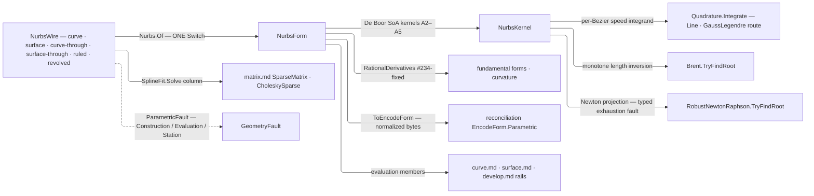

# [RASM_PARAMETRIC_NURBS]

`Rasm.Parametric` owns the host-neutral NURBS engine — the whole rational curve and surface algorithm set in-kernel over `Rhino.Geometry` `Point3d`/`Vector3d`/`Plane` native carriers, control nets held in homogeneous form. `Nurbs.Of` is the ONE polymorphic admission for every wire ingress; evaluation members live on the `NurbsForm` carriers, and the op rails compose this engine from `curve.md`/`surface.md`.

Fitting solves compose the `matrix.md` sparse owners through `SplineFit`'s own solve column; arc-length routes its per-Bezier speed integrals through the kernel `Numerics/integrate` `Quadrature.Integrate` owner and composes `MathNet` for length inversion and Newton projection while the Bezier decomposition and `|C′(t)|` speed integrand stay local. `ToEncodeForm()` projects into the reconciliation `EncodeForm` chain for one content key per curve across every ingress spelling, and a degeneracy-sensitive verdict escalates to the `Numerics/predicates` exact ladder at the consumer seam — evaluation is `double`-only geometry, never the adjudication.

## [01]-[INDEX]

- [02]-[NURBS_ENGINE]: `KnotVector` the normalized clamped-or-periodic knot algebra with `KnotForm`/`ParametricDirection` vocabularies; `SplineFit`/`ChordRule`/`FrameClosure` the behavior-bearing rows; `NurbsWire` the admission `[Union]`; `NurbsForm` the curve/surface carrier `[Union]` holding the full evaluation surface; `NurbsPolicy` the engine knob row; `Nurbs.Of` the ONE admission.

## [02]-[NURBS_ENGINE]

- Owner: `Nurbs` mints the static admission surface folding the `NurbsWire` admission `[Union]` into the `NurbsForm` carrier `[Union]`; `KnotVector` owns the knot algebra proving monotone/finite and clamped-or-wrap-periodic, admitting the full, Rhino-trimmed, and periodic spellings at one seam; `NurbsPolicy` registers `IValidityEvidence`; `ParametricDirection`/`KnotForm` are the `[SmartEnum]` axis and closure-origin discriminants; `SplineFit`/`ChordRule`/`FrameClosure` are the `[SmartEnum]` rows carrying the solve, parameterization, and frame-defect laws as delegate columns.
- Cases: `NurbsWire` cases `Curve`, `Surface`, `CurveThrough`, `SurfaceThrough`, `Ruled`, `Revolved` — fitting modality is `SplinePolicy` data, so interpolate-versus-approximate mints no case, and the constructive cases fold admitted curve carriers through the same `Of` (the loft unifies degree and knots then lofts degree-1, the revolution mints exact rational arcs); the surface grid flattens V-inner (`index = u·CountV + v`), the one flattening law the identity projection shares. `NurbsForm` cases `Curve`, `Surface`.
- Entry: `Of` folds every wire shape through one generated `Switch` — explicit wires validate and freeze into the homogeneous columns, fitting wires parameterize, average knots, and solve. No `OfCurve`/`Interpolate` sibling factory — the wire shape discriminates (`MODAL_ARITY`).
- Auto: evaluation is the internalized NURBS-Book kernel set over the columns — point/derivative, arc-length, closest-parameter projection, double-reflection frame, fundamental-form, iso-curve, and Boehm/Oslo refinement machinery re-emitting normalized clamped forms; the fence pins each member to its algorithm number.
- Law: the two fitting regimes are ONE `SplineFit` roster whose `Solve` column carries the linear system each regime forms — interpolation the banded `N·P = Q`, approximation the SPD `NᵀN·P = NᵀQ` — so the fit lane never branches on row equality and a third regime (penalized, tangent-constrained) is one row. `Solve` reads its `LinearSolution` stop rather than projecting a solution vector past it, the consumer defect `matrix.md [04]` names.
- Law: parameterization is `ChordRule` data — `Uniform`/`Chord`/`Centripetal` are the A9.3 exponents as one `Metric` column, so the deleted `bool Centripetal` knob cannot spell the uniform third the literature carries.
- Law: every count on the engine's PUBLIC surface is `Dimension` — policy orders and budgets, derivative order, and the degree targets `ElevateDegree`/`ReduceDegree` take — so a non-positive order or target is unrepresentable rather than guarded at each read, and no consumer clamps one into range on this engine's behalf. `KnotVector.Of(int degree, …)` stays raw because it IS the boundary admission. The two tolerance columns anchor on `EpsilonPolicy` and `Of(context)` derives them from `ToleranceLane.Length`/`ToleranceLane.Root` wherever a caller holds a model context.
- Law: closure is MODEL-SPACE and reads `ToleranceLane.Closure` off a threaded `Context`, on both carriers. NAMED LOSS: the parameterless `IsClosed` accessor; a dimensionless anchor called essentially nothing closed on a metre model and disagreed with a millimetre one about the same curve.
- Law: knot coincidence has ONE regime — the `Coincident` band both multiplicity walks and the wrap proof read. NAMED LOSS: exact float equality at the ends, which held only on an unstated bit-exactness invariant a later change to the normalization would have broken silently.
- Packages: `MathNet.Numerics` (`Brent.TryFindRoot` length inversion, `RobustNewtonRaphson.TryFindRoot` guarded Newton projection — both no-throw twins, so budget exhaustion lands as a typed fault on the rail); `TYoshimura.DoubleDouble` (`ddouble` + `DoubleDoubleEnumerableExpand.Sum` — the 106-bit arc-length table, narrowed only at public signatures); `Rhino.Geometry` (`Point3d`/`Vector3d`/`Plane` native carriers); `Rasm.Numerics` (`Quadrature.Integrate`/`IntegrationDomain.Line`/`QuadratureRoute.GaussLegendre`/`QuadratureControl` arc-length quadrature, `SparseMatrix.FromTriplets`/`SolveDetailed` and `CholeskySparse.SolveDetailed` fitting solves, `EpsilonPolicy`/`Dimension` atoms, `GeometryFault.ParametricFault`/`ParametricStage`); `Rasm.Spatial` (`EncodeForm`/`EncodeForm.Direction` identity target); `Rasm.Domain` (`Op`/`Op.Catch`, `Context`/`ToleranceLane`, `ValidityClaim`/`IValidityEvidence`); `Thinktecture.Runtime.Extensions`; `LanguageExt.Core` (`Fin`/`Arr`/`Seq`/`Option`, `Validation` + applicative `Apply` the accumulating admission); `System.Numerics.Tensors` (`TensorPrimitives.Subtract`/`Divide`/`IsFiniteAll` — the knot normalization and its one finiteness reduction); `CommunityToolkit.HighPerformance` (`MemoryOwner<double>` the knot-merge staging plane); BCL inbox.
- Growth: a new evaluation member is one projection over the existing derivative kernels; a new fitting scheme is one `SplineFit` row carrying its own `Solve` column, consumers untouched; a further constructive wire (swept, lofted-through-N) is one `NurbsWire` case folded by the same `Of` — `Ruled`/`Revolved` are the executed precedent — zero new entry surfaces, zero new carriers.
- Boundary: evaluation members live on `NurbsForm` and the op rails live in `curve.md`/`surface.md`, so an op union here or an evaluation re-derivation there is the altitude violation; the engine speaks `Point3d`/`Vector3d`/`Plane` natively with no private point vocabulary or marshal layer; parameters are the normalized `[0,1]`/`[0,1]²` domain and knots store clamped-normalized — or wrap-periodic UNCLAMPED under `KnotForm.Periodic`, where the span arm wraps the parameter and closure holds at `C^{p−1}`; weights are strictly positive at admission and a zero-or-negative weight is a `Construction` fault, never a NaN downstream; `ToEncodeForm` re-proves `EncodeForm.Of`'s normalized-CLAMPED gate, so a periodic carrier refuses identity projection until a consumer clamps it — one key per curve is worth the refusal, a second layout is not; every failure routes `GeometryFault.ParametricFault` naming the failing stage over `Fin`, and no exception crosses the public surface; RhinoCommon owns the Rhino-host parametric surface and this engine the host-neutral one — a runtime split, never capability — with the Rhino-trimmed knot spelling extending at the wire under one admission law.

```csharp
// --- [IMPORTS] -------------------------------------------------------------------------
using System;
using System.Linq;
using System.Numerics.Tensors;
using CommunityToolkit.HighPerformance.Buffers;
using DoubleDouble;
using LanguageExt;
using MathNet.Numerics.RootFinding;
using Rasm.Domain;
using Rasm.Numerics;
using Rasm.Spatial;
using Rhino.Geometry;
using Thinktecture;
using static LanguageExt.Prelude;

namespace Rasm.Parametric;

// --- [TYPES] ---------------------------------------------------------------------------
[SmartEnum<int>]
public sealed partial class ParametricDirection {
    public static readonly ParametricDirection U = new(0);
    public static readonly ParametricDirection V = new(1);
}

[SmartEnum<string>]
[KeyMemberEqualityComparer<ComparerAccessors.StringOrdinal, string>]
[KeyMemberComparer<ComparerAccessors.StringOrdinal, string>]
public sealed partial class KnotForm {
    public static readonly KnotForm Clamped  = new("clamped");
    public static readonly KnotForm Periodic = new("periodic");
}

[SmartEnum<string>]
[KeyMemberEqualityComparer<ComparerAccessors.StringOrdinal, string>]
[KeyMemberComparer<ComparerAccessors.StringOrdinal, string>]
public sealed partial class SplineFit {
    public static readonly SplineFit Interpolate = new("interpolate", Collocate);
    public static readonly SplineFit Approximate = new("approximate", Normalize);

    [UseDelegateFromConstructor] public partial Fin<Arr<double>> Solve(SparseMatrix basis, Arr<double> rhs, Op key);

    static Fin<Arr<double>> Collocate(SparseMatrix basis, Arr<double> rhs, Op key);
    static Fin<Arr<double>> Normalize(SparseMatrix basis, Arr<double> rhs, Op key);
}

[SmartEnum<string>]
[KeyMemberEqualityComparer<ComparerAccessors.StringOrdinal, string>]
[KeyMemberComparer<ComparerAccessors.StringOrdinal, string>]
public sealed partial class ChordRule {
    public static readonly ChordRule Uniform     = new("uniform", static _ => 1.0);
    public static readonly ChordRule Chord       = new("chord", static chord => chord);
    public static readonly ChordRule Centripetal = new("centripetal", Math.Sqrt);

    [UseDelegateFromConstructor] public partial double Metric(double chord);
}

[SmartEnum<string>]
[KeyMemberEqualityComparer<ComparerAccessors.StringOrdinal, string>]
[KeyMemberComparer<ComparerAccessors.StringOrdinal, string>]
public sealed partial class FrameClosure {
    public static readonly FrameClosure Distributed = new("distributed", static (defect, arc, total) => -defect * arc / total);
    public static readonly FrameClosure Raw         = new("raw", static (_, _, _) => 0.0);

    [UseDelegateFromConstructor] public partial double Twist(double defect, double arc, double total);
}

// --- [CONSTANTS] -----------------------------------------------------------------------
public sealed record NurbsPolicy(
    Dimension GaussOrder, double LengthTolerance, Dimension ProjectIterations, double ProjectTolerance,
    Dimension ProjectSubdivision, FrameClosure Closure) : IValidityEvidence {
    public static readonly NurbsPolicy Canonical = new(
        GaussOrder: Dimension.Create(value: 32),
        LengthTolerance: EpsilonPolicy.SqrtEpsilon * EpsilonPolicy.SubTolerance,
        ProjectIterations: Dimension.Create(value: 64),
        ProjectTolerance: EpsilonPolicy.ZeroTolerance,
        ProjectSubdivision: Dimension.Create(value: 20),
        Closure: FrameClosure.Distributed);

    public static NurbsPolicy Of(Context context) => Canonical with {
        LengthTolerance = context.For(lane: ToleranceLane.Length).Value,
        ProjectTolerance = context.For(lane: ToleranceLane.Root).Value,
    };

    public bool IsValid => ValidityClaim.All(
        ValidityClaim.Positive(value: LengthTolerance),
        ValidityClaim.Positive(value: ProjectTolerance));
}

public sealed record SplinePolicy(
    SplineFit Fit, Dimension Degree, ChordRule Rule,
    Option<Vector3d> StartTangent = default, Option<Vector3d> EndTangent = default,
    Option<Dimension> ControlCount = default) {
    public static readonly SplinePolicy Canonical = new(SplineFit.Interpolate, Degree: Dimension.Create(value: 3), Rule: ChordRule.Chord);
}

// --- [MODELS] --------------------------------------------------------------------------
public readonly record struct KnotVector(int Degree, Arr<double> Knots, KnotForm Form) {
    public int Count => Knots.Count;
    public int ControlCount => Knots.Count - Degree - 1;

    [BoundaryAdapter]
    public static Fin<KnotVector> Of(int degree, ReadOnlySpan<double> raw) {
        if (degree < 1 || raw.Length < 2 * degree) { return Fail("degree under 1 or knot vector under the trimmed floor"); }
        (double lo, double hi) = (raw[0], raw[^1]);
        if (!double.IsFinite(lo) || !double.IsFinite(hi) || hi <= lo) { return Fail("degenerate knot extent"); }
        double[] knots = new double[raw.Length];
        TensorPrimitives.Subtract(raw, lo, knots);
        TensorPrimitives.Divide<double>(knots, hi - lo, knots);
        if (!TensorPrimitives.IsFiniteAll<double>(knots)) { return Fail("non-finite knot after normalization"); }
        for (int i = 1; i < knots.Length; i++) {
            if (knots[i] < knots[i - 1]) { return Fail($"non-monotone knot at {i}"); }
        }
        int head = 0;
        while (head < knots.Length && Coincident(knots[head], 0.0)) { head++; }
        int tail = 0;
        while (tail < knots.Length && Coincident(knots[^(tail + 1)], 1.0)) { tail++; }
        Option<double[]> clamped = (head, tail) switch {
            (int h, int t) when h == degree + 1 && t == degree + 1 => Some(knots),
            (int h, int t) when h == degree && t == degree => Some<double[]>([0.0, .. knots, 1.0]),
            _ => Option<double[]>.None,
        };
        return clamped.Match(
            Some: vector => vector.Length - degree - 1 < degree + 1
                ? Fail("control extent under degree + 1")
                : Fin.Succ(new KnotVector(degree, new Arr<double>(vector), KnotForm.Clamped)),
            None: () => !PeriodicWrap(knots, degree)
                ? Fail("unclamped knot vector — neither clamped, trimmed, nor wrap-periodic")
                : knots.Length - degree - 1 < degree + 1
                    ? Fail("control extent under degree + 1")
                    : Fin.Succ(new KnotVector(degree, new Arr<double>(knots), KnotForm.Periodic)));

        static Fin<KnotVector> Fail(string witness) =>
            Fin.Fail<KnotVector>(new GeometryFault.ParametricFault(ParametricStage.Construction, ParametricCarrier.Knots, witness));
    }

    static bool Coincident(double a, double b) => Math.Abs(a - b) <= EpsilonPolicy.SqrtEpsilon;

    static bool PeriodicWrap(ReadOnlySpan<double> knots, int degree) {
        int n = knots.Length - degree - 1;
        for (int i = 0; i < degree; i++) {
            if (!Coincident(knots[i + n], knots[i] + 1.0)) { return false; }
        }
        return true;
    }

    public int SpanAt(double t) {
        if (Form == KnotForm.Periodic) {
            (double lo, double hi) = (Knots[Degree], Knots[ControlCount]);
            t = lo + ((((t - lo) % (hi - lo)) + (hi - lo)) % (hi - lo));
        }
        int n = ControlCount - 1;
        if (t >= Knots[n + 1]) { return n; }
        (int lo2, int hi2) = (Degree, n + 1);
        while (hi2 - lo2 > 1) {
            int mid = (lo2 + hi2) >> 1;
            if (t < Knots[mid]) { hi2 = mid; } else { lo2 = mid; }
        }
        return lo2;
    }

    public Arr<double> Merged(ReadOnlySpan<double> inserts) {
        using MemoryOwner<double> staging = MemoryOwner<double>.Allocate(Knots.Count + inserts.Length);
        Span<double> merged = staging.Span;
        (int a, int b, int at) = (0, 0, 0);
        while (a < Knots.Count && b < inserts.Length) { merged[at++] = Knots[a] <= inserts[b] ? Knots[a++] : inserts[b++]; }
        while (a < Knots.Count) { merged[at++] = Knots[a++]; }
        while (b < inserts.Length) { merged[at++] = inserts[b++]; }
        return new Arr<double>([.. merged]);
    }
}

[Union(ConversionFromValue = ConversionOperatorsGeneration.None)]
public abstract partial record NurbsWire {
    private NurbsWire() { }

    public sealed record Curve(int Degree, Arr<double> Knots, Arr<Point3d> Points, Arr<double> Weights, KnotForm Origin) : NurbsWire;
    public sealed record Surface(int DegreeU, int DegreeV, Arr<double> KnotsU, Arr<double> KnotsV, int CountU, Arr<Point3d> Grid, Arr<double> Weights, KnotForm Origin) : NurbsWire;
    public sealed record CurveThrough(Arr<Point3d> Samples, SplinePolicy Policy) : NurbsWire;
    public sealed record SurfaceThrough(int CountU, Arr<Point3d> Samples, SplinePolicy Policy) : NurbsWire;
    public sealed record Ruled(NurbsForm.Curve Rail, NurbsForm.Curve Opposite) : NurbsWire;
    public sealed record Revolved(NurbsForm.Curve Profile, Line Axis, double AngleRadians) : NurbsWire;
}

// --- [OPERATIONS] ----------------------------------------------------------------------
[Union(ConversionFromValue = ConversionOperatorsGeneration.None)]
public abstract partial record NurbsForm {
    private NurbsForm() { }

    // --- [CURVE_CARRIER]
    public sealed record Curve : NurbsForm {
        internal Curve(KnotVector knots, double[] wx, double[] wy, double[] wz, double[] w, KnotForm origin) {
            (Knots, WX, WY, WZ, W, Origin) = (knots, wx, wy, wz, w, origin);
        }

        public KnotVector Knots { get; }
        public KnotForm Origin { get; }
        internal double[] WX { get; }
        internal double[] WY { get; }
        internal double[] WZ { get; }
        internal double[] W { get; }

        public int ControlCount => W.Length;
        public Arr<Point3d> ControlPoints => new([.. Enumerable.Range(0, W.Length).Select(i => new Point3d(WX[i] / W[i], WY[i] / W[i], WZ[i] / W[i]))]);
        public Arr<double> Weights => new((double[])W.Clone());
        public bool IsClosed(Context context) => PointAt(0.0).DistanceTo(PointAt(1.0)) <= context.For(lane: ToleranceLane.Closure).Value;

        public Point3d PointAt(double t);

        public (Point3d Point, Vector3d[] Derivatives) RationalDerivatives(double t, Option<Dimension> order = default);

        public Vector3d TangentAt(double t);
        public Vector3d CurvatureAt(double t);

        public Fin<double> Length(Option<NurbsPolicy> policy = default, Op? key = null);
        public Fin<double> LengthAt(double t, Option<NurbsPolicy> policy = default, Op? key = null);

        public Fin<double> ParameterAtLength(double length, Option<NurbsPolicy> policy = default, Op? key = null);

        public Fin<Point3d> PointAtLength(double length, Option<NurbsPolicy> policy = default, Op? key = null);

        public Fin<double> ParameterAtChordLength(double t0, double chordLength, Option<NurbsPolicy> policy = default, Op? key = null);

        public Fin<double> ClosestParameter(Point3d probe, Option<NurbsPolicy> policy = default, Op? key = null);

        public Fin<Plane[]> PerpendicularFrames(ReadOnlySpan<double> parameters, Option<NurbsPolicy> policy = default);

        public Fin<(Curve Head, Curve Tail)> SplitAt(double t);
        public Fin<Curve> SubCurve(double t0, double t1);
        public Fin<Curve> Refine(ReadOnlySpan<double> insertions);
        public Fin<Curve> ElevateDegree(Dimension target);
        public Fin<Curve> ReduceDegree(Dimension target, Option<NurbsPolicy> policy = default);
        public Fin<Curve[]> DecomposeIntoBeziers();
        public Curve Reverse();
    }

    // --- [SURFACE_CARRIER]
    public sealed record Surface : NurbsForm {
        internal Surface(KnotVector knotsU, KnotVector knotsV, double[] wx, double[] wy, double[] wz, double[] w, KnotForm origin) {
            (KnotsU, KnotsV, WX, WY, WZ, W, Origin) = (knotsU, knotsV, wx, wy, wz, w, origin);
        }

        public KnotVector KnotsU { get; }
        public KnotVector KnotsV { get; }
        public KnotForm Origin { get; }
        internal double[] WX { get; }
        internal double[] WY { get; }
        internal double[] WZ { get; }
        internal double[] W { get; }

        public int CountU => KnotsU.ControlCount;
        public int CountV => KnotsV.ControlCount;
        public Arr<Point3d> ControlPoints => new([.. Enumerable.Range(0, W.Length).Select(i => new Point3d(WX[i] / W[i], WY[i] / W[i], WZ[i] / W[i]))]);
        public Arr<double> Weights => new((double[])W.Clone());
        public bool IsClosed(ParametricDirection direction, Context context);

        public Point3d PointAt(double u, double v);

        public Vector3d[][] RationalDerivatives(double u, double v, Option<Dimension> order = default);

        public Fin<Vector3d> NormalAt(double u, double v);

        public Fin<(double E, double F, double G, double L, double M, double N)> FundamentalForms(double u, double v);

        public Fin<(double K1, double K2, Vector3d Dir1, Vector3d Dir2, double Gaussian, double Mean)> CurvatureAt(double u, double v);

        public Fin<Curve> IsoCurve(double parameter, ParametricDirection direction);

        public Fin<(double U, double V)> ClosestParameter(Point3d probe, Option<NurbsPolicy> policy = default, Option<(double U, double V)> seed = default, Op? key = null);

        public Fin<(Surface Head, Surface Tail)> SplitAt(double parameter, ParametricDirection direction);
        public Fin<Surface> Refine(ReadOnlySpan<double> insertions, ParametricDirection direction);

        public Fin<Surface> SubSurface(double u0, double u1, double v0, double v1);
        public Fin<Surface> ElevateDegree(Dimension target, ParametricDirection direction);
        public Fin<Surface[]> DecomposeIntoBeziers();
        public Surface Transpose();
        public Fin<double> Area(Option<NurbsPolicy> policy = default, Op? key = null);
    }

    // --- [IDENTITY_PROJECTION]
    [BoundaryAdapter]
    public Fin<EncodeForm> ToEncodeForm(Op? key = null) => Switch(
        state: key.OrDefault(),
        curve: static (k, c) => EncodeForm.Of(
            new Arr<EncodeForm.Direction>([new EncodeForm.Direction(c.Knots.Degree, c.Knots.Knots)]),
            c.Weights, c.ControlPoints, k),
        surface: static (k, s) => EncodeForm.Of(
            new Arr<EncodeForm.Direction>([
                new EncodeForm.Direction(s.KnotsU.Degree, s.KnotsU.Knots),
                new EncodeForm.Direction(s.KnotsV.Degree, s.KnotsV.Knots)]),
            s.Weights, s.ControlPoints, k));
}

public static class Nurbs {
    [BoundaryAdapter]
    public static Fin<NurbsForm> Of(NurbsWire wire, Op? key = null) =>
        wire.Switch(
            state: key.OrDefault(),
            curve:          static (_, c) => AdmitCurve(c),
            surface:        static (_, s) => AdmitSurface(s),
            curveThrough:   static (k, f) => FitCurve(f.Samples, f.Policy, k),
            surfaceThrough: static (k, f) => FitSurface(f.CountU, f.Samples, f.Policy, k),
            ruled:          static (k, r) => AdmitRuled(r.Rail, r.Opposite, k),
            revolved:       static (k, r) => AdmitRevolved(r.Profile, r.Axis, r.AngleRadians, k));

    static Fin<NurbsForm> AdmitCurve(NurbsWire.Curve wire) =>
        (KnotVector.Of(wire.Degree, [.. wire.Knots]).ToValidation(),
         WeightsPositive(wire.Weights, ParametricCarrier.Curve).ToValidation(),
         PointsFinite(wire.Points, ParametricCarrier.Curve).ToValidation())
        .Apply(static (knots, _, _) => knots).As().ToFin()
        .Bind(knots => knots.ControlCount != wire.Points.Count || wire.Weights.Count != wire.Points.Count
            ? Construction<NurbsForm>(ParametricCarrier.Curve, "control/weight extent disagrees with the knot vector")
            : Homogenize(wire.Points, wire.Weights) switch {
                (double[] wx, double[] wy, double[] wz, double[] w) =>
                    Fin.Succ<NurbsForm>(new NurbsForm.Curve(knots, wx, wy, wz, w, wire.Origin)),
            });

    static Fin<NurbsForm> AdmitSurface(NurbsWire.Surface wire) =>
        (KnotVector.Of(wire.DegreeU, [.. wire.KnotsU]).ToValidation(),
         KnotVector.Of(wire.DegreeV, [.. wire.KnotsV]).ToValidation(),
         WeightsPositive(wire.Weights, ParametricCarrier.Surface).ToValidation(),
         PointsFinite(wire.Grid, ParametricCarrier.Surface).ToValidation())
        .Apply(static (u, v, _, _) => (U: u, V: v)).As().ToFin()
        .Bind(axes => axes.U.ControlCount != wire.CountU
                || wire.Grid.Count != axes.U.ControlCount * axes.V.ControlCount
                || wire.Weights.Count != wire.Grid.Count
            ? Construction<NurbsForm>(ParametricCarrier.Surface, "grid extent disagrees with the knot vectors")
            : Homogenize(wire.Grid, wire.Weights) switch {
                (double[] wx, double[] wy, double[] wz, double[] w) =>
                    Fin.Succ<NurbsForm>(new NurbsForm.Surface(axes.U, axes.V, wx, wy, wz, w, wire.Origin)),
            });

    static Fin<Arr<double>> WeightsPositive(Arr<double> weights, ParametricCarrier carrier) =>
        weights.Exists(static w => !ValidityClaim.Positive(value: w))
            ? Construction<Arr<double>>(carrier, "non-positive weight")
            : Fin.Succ(weights);

    static Fin<Arr<Point3d>> PointsFinite(Arr<Point3d> points, ParametricCarrier carrier) =>
        points.Exists(static p => !ValidityClaim.Finite(value: p))
            ? Construction<Arr<Point3d>>(carrier, "non-finite control point")
            : Fin.Succ(points);

    static (double[] WX, double[] WY, double[] WZ, double[] W) Homogenize(Arr<Point3d> points, Arr<double> weights) {
        int n = points.Count;
        (double[] wx, double[] wy, double[] wz, double[] w) = (new double[n], new double[n], new double[n], new double[n]);
        for (int i = 0; i < n; i++) {
            (wx[i], wy[i], wz[i], w[i]) = (weights[i] * points[i].X, weights[i] * points[i].Y, weights[i] * points[i].Z, weights[i]);
        }
        return (wx, wy, wz, w);
    }

    // --- [FITTING]
    static Fin<NurbsForm> FitCurve(Arr<Point3d> samples, SplinePolicy policy, Op key);
    static Fin<NurbsForm> FitSurface(int countU, Arr<Point3d> samples, SplinePolicy policy, Op key);

    // --- [CONSTRUCTIVE]
    static Fin<NurbsForm> AdmitRuled(NurbsForm.Curve rail, NurbsForm.Curve opposite, Op key);
    static Fin<NurbsForm> AdmitRevolved(NurbsForm.Curve profile, Line axis, double angleRadians, Op key);

    internal static Fin<double[]> ParameterizeSamples(Arr<Point3d> samples, ChordRule rule, Op key);
    internal static Fin<KnotVector> AveragedKnots(double[] parameters, int degree, int controlCount, Op key);

    static Fin<T> Construction<T>(ParametricCarrier carrier, string witness) =>
        Fin.Fail<T>(new GeometryFault.ParametricFault(ParametricStage.Construction, carrier, witness));
}

// --- [KERNELS] -------------------------------------------------------------------------
internal static class NurbsKernel {
    internal static void BasisFunctions(in KnotVector knots, int span, double t, Span<double> basis);
    internal static void DersBasisFunctions(in KnotVector knots, int span, double t, int order, Span<double> ders);
    internal static Point3d CurvePoint(NurbsForm.Curve curve, double t);
    internal static (Point3d Point, Vector3d[] Ders) CurveRationalDerivatives(NurbsForm.Curve curve, double t, int order);
    internal static Point3d SurfacePoint(NurbsForm.Surface surface, double u, double v);
    internal static Vector3d[][] SurfaceRationalDerivatives(NurbsForm.Surface surface, double u, double v, int order);
    internal static NurbsForm.Curve InsertKnot(NurbsForm.Curve curve, double t, int multiplicity);
    internal static NurbsForm.Curve[] BezierSegments(NurbsForm.Curve curve);
    internal static NurbsForm.Curve Elevate(NurbsForm.Curve curve, int target);

    internal static Fin<ddouble[]> CumulativeLengths(NurbsForm.Curve curve, NurbsPolicy policy, Op key) {
        QuadratureControl control = QuadratureControl.Default with { LegendreOrder = policy.GaussOrder.Value, RequireErrorWitness = false };
        return toSeq(BezierSegments(curve))
            .TraverseM(segment => Quadrature.Integrate(
                new IntegrationDomain.Line(
                    F: t => CurveRationalDerivatives(segment, t, 1).Ders[0].Length,
                    Bounds: new IntervalSpec(Lower: 0.0, Upper: 1.0),
                    Route: QuadratureRoute.GaussLegendre),
                control: control, key: key)).As()
            .Map(static evidence => {
                ddouble[] cumulative = new ddouble[evidence.Count + 1];
                int s = 0;
                foreach (QuadratureEvidence leg in evidence) { cumulative[s + 1] = cumulative[s] + (ddouble)leg.Value; s++; }
                return cumulative;
            });
    }

    internal static double TotalLength(ReadOnlySpan<ddouble> cumulative) =>
        cumulative.IsEmpty ? 0.0 : (double)cumulative[^1];

    internal static Fin<double> InvertLength(NurbsForm.Curve curve, ddouble[] cumulative, double target, NurbsPolicy policy) {
        int at = Array.BinarySearch(cumulative, (ddouble)target);
        (double lo, double hi) = SegmentDomain(curve, int.Clamp(at >= 0 ? at : ~at - 1, 0, cumulative.Length - 2));
        return Brent.TryFindRoot(
                t => LengthTo(curve, cumulative, t, policy) - target, lo, hi,
                policy.LengthTolerance, policy.ProjectIterations.Value, out double root)
            ? Fin.Succ(root)
            : Fin.Fail<double>(new GeometryFault.ParametricFault(ParametricStage.Station, ParametricCarrier.Curve, $"length inversion unconverged at {target}"));
    }

    internal static Fin<double> NewtonProject(NurbsForm.Curve curve, Point3d probe, double seedLo, double seedHi, NurbsPolicy policy, Op key) =>
        key.Catch(() => Fin.Succ(RobustNewtonRaphson.TryFindRoot(
                t => ProjectionObjective(curve, probe, t),
                t => ProjectionSlope(curve, probe, t),
                seedLo, seedHi, policy.ProjectTolerance, policy.ProjectIterations.Value, policy.ProjectSubdivision.Value,
                out double root)
            ? Some(root)
            : Option<double>.None))
        .Bind(root => root.ToFin(Fail: new GeometryFault.ParametricFault(
            ParametricStage.Evaluation, ParametricCarrier.Curve, $"newton projection unconverged at {probe}")));

    internal static double ProjectionObjective(NurbsForm.Curve curve, Point3d probe, double t) =>
        Jet(curve, t) switch { var jet => (jet.Point - probe) * jet.Ders[0] };
    internal static double ProjectionSlope(NurbsForm.Curve curve, Point3d probe, double t) =>
        Jet(curve, t) switch { var jet => (jet.Ders[0] * jet.Ders[0]) + ((jet.Point - probe) * jet.Ders[1]) };

    static (Point3d Point, Vector3d[] Ders) Jet(NurbsForm.Curve curve, double t) => CurveRationalDerivatives(curve, t, 2);

    internal static double LengthTo(NurbsForm.Curve curve, ddouble[] cumulative, double t, NurbsPolicy policy);
    internal static (double Lo, double Hi) SegmentDomain(NurbsForm.Curve curve, int segment);

    internal static Fin<Plane[]> DoubleReflectionFrames(NurbsForm.Curve curve, ReadOnlySpan<double> parameters, NurbsPolicy policy);
}
```



## [03]-[DENSITY_BAR]

One owner per axis; capability is a case, row, or member on the owning carrier, never a sibling surface.

| [INDEX] | [AXIS_CONCERN] | [OWNER]                          | [RAIL]                      | [CASES] |
| :-----: | :------------- | :------------------------------- | :-------------------------- | :-----: |
|  [01]   | Admission      | `NurbsWire` + `Nurbs`            | `Nurbs.Of → Fin<NurbsForm>` |    6    |
|  [02]   | Carrier        | `NurbsForm`                      | member `Fin` rails          |    2    |
|  [03]   | Knot algebra   | `KnotVector`                     | `Of → Fin<KnotVector>`      |    —    |
|  [04]   | Engine knobs   | `NurbsPolicy`                    | `IValidityEvidence`         |    —    |
|  [05]   | Fitting rows   | `SplineFit` + `SplinePolicy`     | `Solve` column              |    2    |
|  [06]   | Vocabularies   | `ParametricDirection`/`KnotForm` | discriminants               |   2·2   |
|  [07]   | Behavior rows  | `ChordRule`/`FrameClosure`       | delegate columns            |   3·2   |

- [01]-[ADMISSION]: `[Union]` wire shapes folded by ONE `Of` (`MODAL_ARITY` — fitting is policy data).
- [02]-[CARRIER]: `[Union]` `Curve`/`Surface` over homogeneous SoA columns, evaluation members ON the cases.
- [03]-[KNOT_ALGEBRA]: normalized clamped-or-periodic vector, form-dispatched span search, and merge, three wire spellings admitted at one seam.
- [04]-[ENGINE_KNOBS]: `Dimension` orders and budgets, `EpsilonPolicy`-anchored tolerances, `Of(context)` the lane derivation.
- [05]-[FITTING_ROWS]: interpolate/approximate rows carrying their own linear system; degree, parameterization, tangents, and control budget are `SplinePolicy` columns.
- [06]-[VOCABULARIES]: `[SmartEnum]` U/V axis rows, clamped/periodic origin rows.
- [07]-[BEHAVIOR_ROWS]: A9.3 parameterization metrics and the frame-defect twist law as `[UseDelegateFromConstructor]` columns — the two deleted bools.

`NurbsKernel` signatures are the owned textbook-arithmetic transcription targets; the page's own bodies are the composed library seams — that split between owned arithmetic and composed depth is the density law.

## [04]-[RESEARCH]

<!-- source-only: research row template:
[TOKEN]-[OPEN|BLOCKED]: <exact question>; <verification route>.
-->

(none)
