# [RASM_PARAMETRIC_PANELIZE]

`Panelization` owns cross-field-guided panelization: `Apply` maps a UV-provenanced surface into a panel graph whose every panel leaves with a placement frame — origin, field-aligned x-axis, and metric-true binding normal — because position without orientation is half a panel. `PanelFamily` rides the request as data, so a new family is one case over the shared assembly fold rather than a sibling mapper, and per-panel planarity is the fabrication acceptance measure whose breach routes a fault instead of shipping an unfabricatable lattice. Mould reuse keys through the `patternmap.md` material-symmetry law: a mirrored congruence merges only where the material's `MirrorGrant` merges it, `Flipped` records which panels ride the mirrored digest, and the merges the law refused count on the census as the mould-cost delta of the material choice.

Input is `surface.md`'s `SurfaceResult.UvTessellation` — mesh, per-vertex `(u, v)`, and live `NurbsForm.Surface` binding — so an unbound mesh cannot enter and every `PanelField` keeps its UV provenance. `Lattice` consumes the remesh substrate's `QuadLayout` without re-running any field solve while `Seeded` lands geodesic-Voronoi cells over the `sample.md` distribution suite, `Order` the one `segment` `RosyOrder` row keying both arms; adjacency packs as CSR straight off the shared-wall table.

## [01]-[INDEX]

- [02]-[PANELIZATION]: `PanelFamily` family-as-data folded by one `Panelization.Apply` into a placement-framed, planarity-gated `PanelField` panel graph.

## [02]-[PANELIZATION]

- Owner: `Panelization` mints the one static entry; `PanelFamily` carries the family as data, `PanelPolicy` the `IValidityEvidence` policy row carrying the lane-resolved planarity band and the required `MaterialSymmetry` `Symmetry` policy the congruence fold reads (`Of` seats `Free`), and `PanelResult` carries the panel-graph-plus-frame `PanelField` with its retained fabrication measures.
- Cases: `PanelFamily` cases `Lattice` and `Seeded` — the substrate-guided lattice and the sample-suite distribution, `Order` the one `segment` `RosyOrder` row keying both.
- Entry: `public static Fin<PanelResult> Apply(SurfaceResult.UvTessellation source, PanelFamily family, PanelPolicy policy, Op? key = null)` — the one entry admitting the policy once, the generated `PanelFamily.Switch` discriminating the family, and the raw assembly binding into the planarity gate before it can escape; no second planarization request exists.
- Auto: `Lattice` binds the substrate's `QuadLayout` as the panel lattice and restores UV through one batch `Project`; `Seeded` lands geodesic-Voronoi cells from cached heat-distance fields walled at the equidistance lerp. Both arms assemble identically — RhinoCommon least-squares plane per panel (`Plane.FitPlaneToPoints`, its maximum deviation over the panel diameter the dimensionless defect), planarity defect, CSR adjacency packed off the shared-wall table — and the planarity gate passes an already-accepted band untouched, else runs bounded proximal rounds toward it — each round fits the same least-squares plane the defect reads, averages the projection displacement at every shared indexed vertex, and refits every moved panel's frame through the one `Frame` admission with the normal held to its prior orientation — keeping each panel's pre-planarization UV feet while the `ShapeClass`/`Flipped`/`ChiralSplit` evidence classifies exactly once off the admitted geometry — congruence answers the final rings, never the ones the rewrite retired.
- Law: the result's planarity band is ONE `Stat<Scalar>` derived from the field's own `Planarity` column, never a max/mean pair beside it. NAMED LOSS: the two scalar fields; the gain is that the band cannot disagree with the column it summarizes, and the consumer reads variance and RMS no pair carries. WITNESS: `result.MaxPlanarity` rebuilt as `result.Planarity.Maximum.To()`, the same value off `Stat<Scalar>.Of(column.AsSpan(), key)`.
- Law: the acceptance ceiling is `Tolerance` off `ToleranceLane.Fraction` — the defect is dimensionless (max vertex-plane deviation over panel diameter), so it belongs to the ratio band and the document sets it. NAMED LOSS: `PanelPolicy.Canonical` and its `5e-3` literal.
- Exemption: `Loops`, `Pack`, `Cells`, `AdjacencyOf`, and `ShapeClasses` hold mutable `Dictionary`/`HashSet`/`List` accumulators inside their own span windows — a walled-cell loop set, a grain-interned vertex table, a wall pairing, and a first-seen class roster are single-pass build state that never escapes the member, and `Grain` states its quantum (the model's absolute tolerance, the branch's emission-boundary grain) on site for both the loop stitch and the vertex intern.
- Output: `PanelResult` carries the planarity band, the `ChiralSplit` count, and planarize rounds beside the field; counts derivable from the field and unconsumed build tallies do not leave the producer.
- Packages: `Rasm.Processing` for the remesh substrate (`QuadLayout`, `RemeshOp`, `RemeshPolicy`, `RosyOrder`) and the seed suite (`SampleKind`, `SampleKernel.Sample`, `SegmentKernel.CrossFieldAt`, `GeodesicKernel.EnsureGeodesicDistances`, `ExtractionDomain.Mesh`); `Rasm.Parametric` `surface.md` for the `UvTessellation` input and `Project` restore, `nurbs.md` for the frame normals, and `patternmap.md` for the `MaterialSymmetry` law the congruence fold reads; `Rasm.Spatial` `ScalarField` for density seeds and `NeighborIndex`/`NeighborSource`/`NeighborKernel` for the one batch seed snap; `Rasm.Numerics` for `Dimension`/`PositiveMagnitude` and `GeometryFault`; `Rasm.Domain` for `Op`, `Context`/`ToleranceLane`/`Tolerance`, `ContentHash`/`CanonicalWriter`, `Stat<Scalar>`/`Scalar`, and `IValidityEvidence`; Rhino.Geometry, Thinktecture.Runtime.Extensions, LanguageExt.Core.
- Growth: a new panel family is one `PanelFamily` case over the same assembly fold; a new seed distribution is one `SampleKind` row; a new panel measure is one `PanelField` column — `ShapeClass` congruence and its `Flipped` parity are the executed precedent; a fabrication-nesting order is one projection off the adjacency columns.
- Boundary: the field solve is the substrate's — a `CrossFieldAt`/`StripeAt` loop here is the named re-derivation defect, the lattice arm consuming `QuadLayout` whole, its sole local frame read (stripe-U off the quad's own corners) holding only because the emitted geometry is the integrated field. Output keeps provenance — a wire without UV columns is the named drop, restored by one batch `Project` never a per-vertex `ClosestParameter` loop; seeded labels are geodesic, a Euclidean nearest-seed the named naivety defect across folds. The planarity gate fits per-panel planes and never parameterizes, a conformal or ARAP energy belonging to `flatten.md`; every content key rides the branch `CanonicalWriter` — a second hasher or a hand `BinaryPrimitives` preimage forks the seed the federation reproduces; mould-reuse congruence merges a mirrored digest only where the material law's `MirrorRight.Merge` right licenses it — an unconditional min-digest merge cuts a mirrored panel from a blank a chiral material cannot flip, and a fold branching on grant identity instead of the rights set is the named re-derivation; a planarity breach routes `PanelPlanarityExceeded` with the worst panel and its measured deviation, every admission or impossible-result branch the resolved `Op.InvalidInput`/`Op.InvalidResult` channel, composed owners surfacing their own faults untranslated.

```csharp
// --- [IMPORTS] -------------------------------------------------------------------------
using System;
using System.Collections.Generic;
using System.Linq;
using LanguageExt;
using Rasm.Domain;
using Rasm.Numerics;
using Rasm.Processing;
using Rasm.Spatial;
using Rhino.Geometry;
using Thinktecture;
using static LanguageExt.Prelude;

namespace Rasm.Parametric;

// --- [TYPES] ---------------------------------------------------------------------------
[Union(ConversionFromValue = ConversionOperatorsGeneration.None)]
public abstract partial record PanelFamily {
    private PanelFamily() { }

    public sealed record Lattice(RosyOrder Order, PositiveMagnitude TargetLength) : PanelFamily;
    public sealed record Seeded(SampleKind Seeds, RosyOrder Order) : PanelFamily;
}

// --- [POLICIES] ------------------------------------------------------------------------
public sealed record PanelPolicy(
    Tolerance Planarity, Dimension Rounds, RemeshPolicy Remesh, ProjectionPolicy Projection,
    MaterialSymmetry Symmetry) : IValidityEvidence {
    public static PanelPolicy Of(Context context) => new(
        Planarity: context.For(lane: ToleranceLane.Fraction), Rounds: Dimension.Create(value: 32),
        Remesh: RemeshPolicy.Canonical, Projection: ProjectionPolicy.Of(context: context),
        Symmetry: MaterialSymmetry.Free);

    public bool IsValid => ValidityClaim.All(Planarity.IsValid, Remesh.IsValid);
}

// --- [MODELS] --------------------------------------------------------------------------
public sealed record PanelField(
    Arr<int> CornerOffsets, Arr<int> Corners, Arr<Point3d> Vertices, Arr<Point2d> Uv,
    Arr<Point3d> Origin, Arr<Vector3d> XAxis, Arr<Vector3d> ZAxis, Arr<double> Planarity,
    Arr<int> PatchOf, Arr<int> AdjacencyOffsets, Arr<int> Adjacent, Arr<int> ShapeClass, Arr<bool> Flipped,
    Context Model);

public sealed record PanelResult(PanelField Field, Stat<Scalar> Planarity, int ChiralSplit, int Rounds);

// --- [OPERATIONS] ----------------------------------------------------------------------
public static class Panelization {
    public static Fin<PanelResult> Apply(
        SurfaceResult.UvTessellation source, PanelFamily family, PanelPolicy policy, Op? key = null) {
        Op op = key.OrDefault();
        if (!policy.IsValid) { return Fin.Fail<PanelResult>(op.InvalidInput()); }
        return family.Switch(
                state: (Source: source, Policy: policy, Key: op),
                lattice: static (s, f) =>
                    Remeshing.Apply(new RemeshOp(s.Source.Mesh, f.TargetLength, s.Policy.Remesh, Some(f.Order)), s.Key)
                        .Bind(remesh => remesh.Quads.Match(
                            Some: quads => {
                                Point3d[] vertices = remesh.Mesh.Native.Vertices.ToPoint3dArray();
                                int panels = quads.Corners.Count / 4;
                                return Surfaces.Apply(
                                        new SurfaceOp.Project(s.Source.Source, toArray(vertices), s.Policy.Projection), s.Key)
                                    .Bind(result => result is SurfaceResult.Projection projection
                                        ? Assemble(s.Source, new PanelBuild(
                                            toArray(Enumerable.Range(0, panels + 1).Select(static p => 4 * p)),
                                            quads.Corners, toArray(vertices), projection.Uv, quads.PatchOf),
                                            fieldOrder: None, s.Policy, s.Key)
                                        : Fin.Fail<PanelResult>(s.Key.InvalidResult()));
                            },
                            None: () => Fin.Fail<PanelResult>(s.Key.InvalidResult()))),
                seeded: static (s, f) =>
                    ExtractionDomain.Mesh(s.Source.Mesh, s.Key)
                        .Bind(domain => SampleKernel.Sample(f.Seeds, domain, s.Source.Mesh.Tolerance, s.Key))
                        .Bind(seeds => SeededCells(s.Source, seeds.Points, s.Key))
                        .Bind(build => Assemble(s.Source, build, fieldOrder: Some(f.Order), s.Policy, s.Key)))
            .Bind(prior => PlanarizeOf(prior, policy, op));
    }

    // --- [SEEDED]
    static Fin<PanelBuild> SeededCells(SurfaceResult.UvTessellation source, Seq<Point3d> seeds, Op key) {
        Point3d[] vertices = source.Mesh.Native.Vertices.ToPoint3dArray();
        return NeighborIndex.Of(source: new NeighborSource.PointsCase(Values: toSeq(vertices)), key: key)
            .Bind(index => NeighborKernel.GraphOf(
                index: index, needles: [.. seeds], count: Some(Dimension.Create(value: 1)), radius: Option<PositiveMagnitude>.None, key: key))
            .Bind(graph => toSeq(graph.Ids).TraverseM(hits => hits.Length > 0
                ? Fin.Succ(hits[0])
                : Fin.Fail<int>(key.InvalidResult())).As())
            .Bind(snapped => {
                Seq<int> sources = snapped.Distinct();
                return sources.IsEmpty
                    ? Fin.Fail<Seq<Arr<double>>>(key.InvalidResult())
                    : sources.TraverseM(vertex =>
                        GeodesicKernel.EnsureGeodesicDistances(source.Mesh, Seq(vertex), key)).As();
            })
            .Bind(fields => Cells(source, vertices, fields, key));
    }

    internal readonly record struct BaryPoint(int A, int B, int C, double W0, double W1, double W2) {
        internal double Of(Arr<double> field) => (W0 * field[A]) + (W1 * field[B]) + (W2 * field[C]);
        internal Point3d World(Point3d[] rows) => new(
            (W0 * rows[A].X) + (W1 * rows[B].X) + (W2 * rows[C].X),
            (W0 * rows[A].Y) + (W1 * rows[B].Y) + (W2 * rows[C].Y),
            (W0 * rows[A].Z) + (W1 * rows[B].Z) + (W2 * rows[C].Z));
        internal Point2d Uv(Arr<Point2d> rows) => new(
            (W0 * rows[A].X) + (W1 * rows[B].X) + (W2 * rows[C].X),
            (W0 * rows[A].Y) + (W1 * rows[B].Y) + (W2 * rows[C].Y));
    }

    static Fin<PanelBuild> Cells(SurfaceResult.UvTessellation source, Point3d[] vertices, Seq<Arr<double>> fields, Op key) {
        Dictionary<int, List<BaryPoint[]>> byCell = new();
        Mesh native = source.Mesh.Native;
        for (int f = 0; f < native.Faces.Count; f++) {
            MeshFace face = native.Faces[f];
            Seq<(int A, int B, int C)> triangles = face.IsQuad
                ? Seq((face.A, face.B, face.C), (face.A, face.C, face.D))
                : Seq((face.A, face.B, face.C));
            foreach ((int a, int b, int c) in triangles) {
                for (int cell = 0; cell < fields.Count; cell++) {
                    BaryPoint[] fragment = Clip(fields, a, b, c, cell);
                    if (fragment.Length < 3) { continue; }
                    if (!byCell.TryGetValue(cell, out List<BaryPoint[]>? rows)) { byCell[cell] = rows = []; }
                    rows.Add(fragment);
                }
            }
        }
        return toSeq(byCell.OrderBy(static row => row.Key))
            .TraverseM(row => Loops(row.Value, vertices, source.Mesh.Tolerance, key)
                .Map(rings => rings.Map(ring => (Cell: row.Key, Ring: ring)))).As()
            .Map(groups => Pack(groups.Bind(static group => group), vertices, source.Uv, source.Mesh.Tolerance));
    }

    static BaryPoint[] Clip(Seq<Arr<double>> fields, int a, int b, int c, int cell) {
        List<BaryPoint> ring = [
            new(a, b, c, 1.0, 0.0, 0.0),
            new(a, b, c, 0.0, 1.0, 0.0),
            new(a, b, c, 0.0, 0.0, 1.0)];
        for (int rival = 0; rival < fields.Count && ring.Count >= 3; rival++) {
            if (rival == cell) { continue; }
            List<BaryPoint> kept = new(ring.Count + 2);
            for (int i = 0; i < ring.Count; i++) {
                (BaryPoint u, BaryPoint v) = (ring[i], ring[(i + 1) % ring.Count]);
                double du = u.Of(fields[cell]) - u.Of(fields[rival]);
                double dv = v.Of(fields[cell]) - v.Of(fields[rival]);
                if (du <= 0.0) { kept.Add(u); }
                if (du * dv < 0.0) {
                    double t = du / (du - dv);
                    kept.Add(new BaryPoint(a, b, c,
                        u.W0 + ((v.W0 - u.W0) * t),
                        u.W1 + ((v.W1 - u.W1) * t),
                        u.W2 + ((v.W2 - u.W2) * t)));
                }
            }
            ring = kept;
        }
        return [.. ring];
    }

    static Fin<Seq<BaryPoint[]>> Loops(List<BaryPoint[]> fragments, Point3d[] vertices, Context model, Op key) {
        Dictionary<(long, long, long), BaryPoint> seat = new();
        HashSet<((long, long, long) From, (long, long, long) To)> directed = [];
        foreach (BaryPoint[] fragment in fragments) {
            for (int i = 0; i < fragment.Length; i++) {
                (BaryPoint from, BaryPoint to) = (fragment[i], fragment[(i + 1) % fragment.Length]);
                ((long, long, long) lo, (long, long, long) hi) = (Grain(from, vertices, model), Grain(to, vertices, model));
                if (lo == hi) { continue; }
                seat.TryAdd(lo, from);
                seat.TryAdd(hi, to);
                if (!directed.Remove((hi, lo))) { directed.Add((lo, hi)); }
            }
        }

        Dictionary<(long, long, long), (long, long, long)> next = new();
        HashSet<(long, long, long)> incoming = [];
        foreach (((long, long, long) from, (long, long, long) to) in directed) {
            if (!next.TryAdd(from, to) || !incoming.Add(to)) {
                return Fin.Fail<Seq<BaryPoint[]>>(key.InvalidResult());
            }
        }

        List<BaryPoint[]> rings = [];
        while (next.Count > 0) {
            int budget = next.Count;
            (long, long, long) start = next.Keys.Min();
            (long, long, long) walk = start;
            List<BaryPoint> ring = [];
            for (int step = 0; step < budget; step++) {
                ring.Add(seat[walk]);
                if (!next.Remove(walk, out walk)) { return Fin.Fail<Seq<BaryPoint[]>>(key.InvalidResult()); }
                if (walk == start) { break; }
            }
            if (walk != start || ring.Count < 3) { return Fin.Fail<Seq<BaryPoint[]>>(key.InvalidResult()); }
            rings.Add([.. ring]);
        }
        return rings.Count > 0 ? Fin.Succ(toSeq(rings)) : Fin.Fail<Seq<BaryPoint[]>>(key.InvalidResult());
    }

    static (long, long, long) Grain(BaryPoint at, Point3d[] vertices, Context model) {
        Point3d point = at.World(vertices);
        double grain = model.Absolute.Value;
        return ((long)Math.Round(point.X / grain), (long)Math.Round(point.Y / grain), (long)Math.Round(point.Z / grain));
    }

    static PanelBuild Pack(Seq<(int Cell, BaryPoint[] Ring)> rings, Point3d[] vertices, Arr<Point2d> uv, Context model) {
        Dictionary<(long, long, long), int> vertexOf = new();
        List<int> offsets = [0];
        List<int> corners = [];
        List<int> patchOf = [];
        List<Point3d> points = [];
        List<Point2d> feet = [];
        foreach ((int cell, BaryPoint[] ring) in rings) {
            foreach (BaryPoint corner in ring) {
                (long, long, long) grain = Grain(corner, vertices, model);
                if (!vertexOf.TryGetValue(grain, out int vertex)) {
                    vertexOf.Add(grain, vertex = points.Count);
                    points.Add(corner.World(vertices));
                    feet.Add(corner.Uv(uv));
                }
                corners.Add(vertex);
            }
            offsets.Add(corners.Count);
            patchOf.Add(cell);
        }
        return new PanelBuild(toArray(offsets), toArray(corners), toArray(points), toArray(feet), toArray(patchOf));
    }

    internal readonly record struct PanelBuild(
        Arr<int> CornerOffsets, Arr<int> Corners, Arr<Point3d> Vertices, Arr<Point2d> Uv, Arr<int> PatchOf);

    // --- [ASSEMBLY]
    static Fin<PanelResult> Assemble(
        SurfaceResult.UvTessellation source, PanelBuild build, Option<RosyOrder> fieldOrder, PanelPolicy policy, Op key) {
        (Arr<int> offsets, Arr<int> adjacent) = AdjacencyOf(build);
        return Frames(source, build, fieldOrder, key).Bind(frames => {
            Arr<double> planarity = PlanarityOf(build.CornerOffsets, build.Corners, build.Vertices);
            (Arr<int> shapeClass, Arr<bool> flipped, int chiralSplit) = ShapeClasses(
                build.CornerOffsets, build.Corners, build.Vertices, frames, source.Mesh.Tolerance, policy.Symmetry);
            return Stat<Scalar>.Of(planarity.AsSpan(), key).Map(band => new PanelResult(
                new PanelField(
                    build.CornerOffsets, build.Corners, build.Vertices, build.Uv,
                    frames.Origin, frames.X, frames.Z, planarity, build.PatchOf, offsets, adjacent,
                    shapeClass, flipped, source.Mesh.Tolerance),
                band, chiralSplit, Rounds: 0));
        });
    }

    static Point3d[] Ring(Arr<int> offsets, Arr<int> corners, Arr<Point3d> vertices, int panel) =>
        [.. Enumerable.Range(offsets[panel], offsets[panel + 1] - offsets[panel]).Select(i => vertices[corners[i]])];

    static (Arr<int> Offsets, Arr<int> Adjacent) AdjacencyOf(PanelBuild build) {
        int panels = build.CornerOffsets.Count - 1;
        Dictionary<(int, int), int> byWall = new();
        List<int>[] neighbors = [.. Enumerable.Range(0, panels).Select(static _ => new List<int>())];
        for (int panel = 0; panel < panels; panel++) {
            (int lo, int hi) = (build.CornerOffsets[panel], build.CornerOffsets[panel + 1]);
            for (int i = lo; i < hi; i++) {
                (int u, int v) = (build.Corners[i], build.Corners[lo + (((i - lo) + 1) % (hi - lo))]);
                (int a, int b) = (int.Min(u, v), int.Max(u, v));
                if (byWall.Remove((a, b), out int other)) {
                    neighbors[other].Add(panel);
                    neighbors[panel].Add(other);
                } else {
                    byWall[(a, b)] = panel;
                }
            }
        }

        int[] offsets = new int[panels + 1];
        for (int panel = 0; panel < panels; panel++) {
            offsets[panel + 1] = offsets[panel] + neighbors[panel].Count;
        }
        int[] adjacent = new int[offsets[panels]];
        for (int panel = 0; panel < panels; panel++) {
            neighbors[panel].CopyTo(adjacent, offsets[panel]);
        }
        return (toArray(offsets), toArray(adjacent));
    }

    static Arr<double> PlanarityOf(Arr<int> offsets, Arr<int> corners, Arr<Point3d> vertices) =>
        toArray(Enumerable.Range(0, offsets.Count - 1).Select(p => Defect(Ring(offsets, corners, vertices, p))));

    static double Defect(Point3d[] ring) {
        double diameter = 0.0;
        for (int i = 0; i < ring.Length; i++) {
            for (int j = i + 1; j < ring.Length; j++) { diameter = double.Max(diameter, ring[i].DistanceTo(ring[j])); }
        }
        return diameter > 0.0
            && Plane.FitPlaneToPoints(ring, out Plane plane, out double maximumDeviation) is PlaneFitResult.Success
            && plane.IsValid && double.IsFinite(maximumDeviation)
                ? maximumDeviation / diameter
                : double.PositiveInfinity;
    }

    static Point3d Centroid(ReadOnlySpan<Point3d> ring) {
        Point3d seat = Point3d.Origin;
        foreach (Point3d corner in ring) { seat += corner; }
        return seat / ring.Length;
    }

    static Fin<(Arr<Point3d> Origin, Arr<Vector3d> X, Arr<Vector3d> Z)> Frames(
        SurfaceResult.UvTessellation source, PanelBuild build, Option<RosyOrder> fieldOrder, Op key) =>
        Range(0, build.CornerOffsets.Count - 1).ToSeq()
            .TraverseM(panel => {
                (int lo, int hi) = (build.CornerOffsets[panel], build.CornerOffsets[panel + 1]);
                Point3d origin = Centroid(Ring(build.CornerOffsets, build.Corners, build.Vertices, panel));
                (double u, double v) = (0.0, 0.0);
                for (int i = lo; i < hi; i++) {
                    Point2d uv = build.Uv[build.Corners[i]];
                    (u, v) = (u + uv.X, v + uv.Y);
                }
                Point2d foot = new(u / (hi - lo), v / (hi - lo));
                Vector3d stripe = hi - lo == 4
                    ? ((build.Vertices[build.Corners[lo + 1]] - build.Vertices[build.Corners[lo]])
                       + (build.Vertices[build.Corners[lo + 2]] - build.Vertices[build.Corners[lo + 3]])) * 0.5
                    : build.Vertices[build.Corners[lo + 1]] - build.Vertices[build.Corners[lo]];
                return from normal in source.Source.NormalAt(foot.X, foot.Y)
                       from axis in fieldOrder.Match(
                           Some: order => SegmentKernel.CrossFieldAt(source.Mesh, order, None, None, origin, key),
                           None: () => Fin.Succ(stripe))
                       from frame in Frame(origin, normal, axis, key)
                       select frame;
            }).As()
            .Map(static frames => (
                toArray(frames.Map(static frame => frame.Origin)),
                toArray(frames.Map(static frame => frame.XAxis)),
                toArray(frames.Map(static frame => frame.ZAxis))));

    static Fin<Plane> Frame(Point3d origin, Vector3d normal, Vector3d axis, Op key) {
        Vector3d z = normal;
        if (!z.Unitize()) { return Fin.Fail<Plane>(key.InvalidResult()); }
        Vector3d x = axis - ((z * axis) * z);
        if (!x.Unitize()) { return Fin.Fail<Plane>(key.InvalidResult()); }
        Plane frame = new(origin, x, Vector3d.CrossProduct(z, x));
        return frame.IsValid ? Fin.Succ(frame) : Fin.Fail<Plane>(key.InvalidResult());
    }

    static (Arr<int> Classes, Arr<bool> Flipped, int ChiralSplit) ShapeClasses(
        Arr<int> offsets, Arr<int> corners, Arr<Point3d> vertices,
        (Arr<Point3d> Origin, Arr<Vector3d> X, Arr<Vector3d> Z) frames, Context model, MaterialSymmetry law) {
        Dictionary<UInt128, int> ordinalOf = new();
        HashSet<UInt128> merged = [];
        int[] classes = new int[offsets.Count - 1];
        bool[] flipped = new bool[classes.Length];
        bool merges = law.Mirror.Rights.Admits(MirrorRight.Merge);
        for (int p = 0; p < classes.Length; p++) {
            long[] forward = LeastRotation(Invariants(offsets, corners, vertices, frames, p, model));
            long[] mirrored = LeastRotation(Mirrored(forward));
            (UInt128 f, UInt128 m) = (Digest(forward), Digest(mirrored));
            UInt128 least = UInt128.Min(f, m);
            UInt128 key = merges ? least : f;
            flipped[p] = merges && m < f;
            classes[p] = ordinalOf.TryGetValue(key, out int seen) ? seen : ordinalOf[key] = ordinalOf.Count;
            merged.Add(least);
        }
        return (toArray(classes), toArray(flipped), ordinalOf.Count - merged.Count);
    }

    static long[] Mirrored(long[] forward) {
        int n = forward.Length / 2;
        long[] mirrored = new long[forward.Length];
        for (int j = 0; j < n; j++) {
            mirrored[2 * j] = forward[2 * (n - 1 - j)];
            mirrored[(2 * j) + 1] = -forward[(2 * ((n - j) % n)) + 1];
        }
        return mirrored;
    }

    static long[] LeastRotation(long[] pairs) {
        int n = pairs.Length / 2;
        if (n <= 1) { return pairs; }
        int[] failure = new int[2 * n];
        System.Array.Fill(failure, -1);
        int least = 0;
        for (int j = 1; j < 2 * n; j++) {
            int i = failure[j - least - 1];
            while (i != -1 && Compare(pairs, n, j, least + i + 1) != 0) {
                if (Compare(pairs, n, j, least + i + 1) < 0) { least = j - i - 1; }
                i = failure[i];
            }
            if (Compare(pairs, n, j, least + i + 1) != 0) {
                if (Compare(pairs, n, j, least) < 0) { least = j; }
                failure[j - least] = -1;
            } else {
                failure[j - least] = i + 1;
            }
        }
        long[] rotated = new long[pairs.Length];
        for (int i = 0; i < n; i++) {
            int at = (least + i) % n;
            (rotated[2 * i], rotated[(2 * i) + 1]) = (pairs[2 * at], pairs[(2 * at) + 1]);
        }
        return rotated;
    }

    static int Compare(long[] pairs, int n, int left, int right) {
        (int a, int b) = (left % n, right % n);
        return pairs[2 * a] != pairs[2 * b]
            ? pairs[2 * a].CompareTo(pairs[2 * b])
            : pairs[(2 * a) + 1].CompareTo(pairs[(2 * b) + 1]);
    }

    static UInt128 Digest(long[] rows) =>
        ContentHash.Of(rows, static (measures, sink) => sink.Rows(toSeq(measures), static (measure, lane) => lane.I64(measure)));

    static long[] Invariants(
        Arr<int> offsets, Arr<int> corners, Arr<Point3d> vertices,
        (Arr<Point3d> Origin, Arr<Vector3d> X, Arr<Vector3d> Z) frames, int panel, Context model) {
        Point3d[] ring = Ring(offsets, corners, vertices, panel);
        (Point3d seat, Vector3d ax, Vector3d az) = (frames.Origin[panel], frames.X[panel], frames.Z[panel]);
        Vector3d ay = Vector3d.CrossProduct(az, ax);
        Point2d[] flat = [.. ring.Select(corner => new Point2d((corner - seat) * ax, (corner - seat) * ay))];
        long[] measures = new long[2 * flat.Length];
        for (int i = 0; i < flat.Length; i++) {
            Vector2d edge = flat[(i + 1) % flat.Length] - flat[i];
            Vector2d prior = flat[i] - flat[((i - 1) + flat.Length) % flat.Length];
            measures[2 * i] = (long)Math.Round(edge.Length / model.Absolute.Value);
            measures[(2 * i) + 1] = (long)Math.Round(
                Math.Atan2((prior.X * edge.Y) - (prior.Y * edge.X), (prior.X * edge.X) + (prior.Y * edge.Y)) / model.Angle.Value);
        }
        return measures;
    }

    // --- [PLANARIZE]
    static Fin<PanelResult> PlanarizeOf(PanelResult prior, PanelPolicy policy, Op key) {
        if (prior.Planarity.Maximum.To() <= policy.Planarity.Value) { return Fin.Succ(prior); }
        return Range(0, policy.Rounds.Value).FoldUntil(
                initialState: Fin.Succ((Field: prior.Field, Band: prior.Planarity, Rounds: 0)),
                f: (state, _) => state.Bind(s =>
                    ProjectRound(s.Field, key).Map(next => (next.Field, next.Band, s.Rounds + 1))),
                predicate: row => row.State.Match(
                    Succ: s => s.Band.Maximum.To() <= policy.Planarity.Value,
                    Fail: static _ => true))
            .Bind(final => {
                double maximum = final.Band.Maximum.To();
                if (maximum > policy.Planarity.Value) {
                    int panel = Enumerable.Range(0, final.Field.Planarity.Count)
                        .MaxBy(p => final.Field.Planarity[p]);
                    return Fin.Fail<PanelResult>(
                        new GeometryFault.PanelPlanarityExceeded(panel, maximum, policy.Planarity));
                }
                (Arr<int> classes, Arr<bool> flipped, int chiralSplit) = ShapeClasses(
                    final.Field.CornerOffsets, final.Field.Corners, final.Field.Vertices,
                    (final.Field.Origin, final.Field.XAxis, final.Field.ZAxis),
                    final.Field.Model, policy.Symmetry);
                return Fin.Succ(new PanelResult(
                    final.Field with { ShapeClass = classes, Flipped = flipped },
                    final.Band, chiralSplit, final.Rounds));
            });
    }

    static Fin<(PanelField Field, Stat<Scalar> Band)> ProjectRound(PanelField field, Op key) {
        Vector3d[] displacement = new Vector3d[field.Vertices.Count];
        int[] hits = new int[field.Vertices.Count];
        int panels = field.CornerOffsets.Count - 1;
        for (int panel = 0; panel < panels; panel++) {
            Point3d[] ring = Ring(field.CornerOffsets, field.Corners, field.Vertices, panel);
            if (Plane.FitPlaneToPoints(ring, out Plane plane, out _) is not PlaneFitResult.Success || !plane.IsValid) {
                return Fin.Fail<(PanelField, Stat<Scalar>)>(key.InvalidResult());
            }
            for (int i = field.CornerOffsets[panel]; i < field.CornerOffsets[panel + 1]; i++) {
                int vertex = field.Corners[i];
                displacement[vertex] += plane.ClosestPoint(field.Vertices[vertex]) - field.Vertices[vertex];
                hits[vertex]++;
            }
        }

        Arr<Point3d> moved = toArray(Enumerable.Range(0, field.Vertices.Count).Select(vertex =>
            hits[vertex] == 0
                ? field.Vertices[vertex]
                : field.Vertices[vertex] + (displacement[vertex] / hits[vertex])));
        Arr<double> planarity = PlanarityOf(field.CornerOffsets, field.Corners, moved);
        return Range(0, panels).ToSeq().TraverseM(panel => {
                Point3d[] ring = Ring(field.CornerOffsets, field.Corners, moved, panel);
                if (Plane.FitPlaneToPoints(ring, out Plane plane, out _) is not PlaneFitResult.Success || !plane.IsValid) {
                    return Fin.Fail<Plane>(key.InvalidResult());
                }
                Vector3d normal = plane.Normal * field.ZAxis[panel] < 0.0 ? -plane.Normal : plane.Normal;
                return Frame(Centroid(ring), normal, field.XAxis[panel], key);
            }).As()
            .Bind(frames => Stat<Scalar>.Of(planarity.AsSpan(), key).Map(band => (
                field with {
                    Vertices = moved,
                    Planarity = planarity,
                    Origin = toArray(frames.Map(static frame => frame.Origin)),
                    XAxis = toArray(frames.Map(static frame => frame.XAxis)),
                    ZAxis = toArray(frames.Map(static frame => frame.ZAxis)),
                },
                band)));
    }
}
```

```mermaid
---
config:
  layout: elk
  flowchart:
    curve: linear
    padding: 25
---
flowchart LR
    accTitle: Panelization flow
    accDescr: Panelization.Apply folds seeds through the cross-field remesh and projection into the PanelField SoA wire with frames, planarity, adjacency, shape-class, and flip-parity columns, gated on planarity before it leaves.
    UvT["surface.md UvTessellation — mesh + (u,v) + binding"] -->|"Panelization.Apply — policy admitted once, ONE family Switch"| Family["PanelFamily — data rows"]
    Family -->|"Lattice: Remeshing.Apply(RemeshOp with Order)"| Remesh["remesh.md QuadLayout channels"]
    Remesh -->|"ONE batch Project — provenance restore"| Build["PanelBuild — polygons + UV"]
    Family -->|"Seeded: SampleKernel.Sample over ExtractionDomain.Mesh"| Seeds["sample.md CCVT / blue-noise seeds"]
    Seeds -->|"k cached heat solves → lower-envelope clip → lerp walls"| Build
    Build -->|"least-squares planes · planarity defects · CrossFieldAt / stripe-U frames"| Field["PanelField — frames + defects"]
    Build -->|"shared-wall table → CSR adjacency"| Field
    Field -->|"Stat&lt;Scalar&gt; band over the planarity column"| Result["PanelResult — field + retained measures"]
    Field -->|"bounded proximal rounds toward the Planarity band"| Planar["planarity gate — fabrication grade"]
    Field --> Gate["Generation panelization gate"]
    UvT -.->|"PanelPlanarityExceeded — planarity defect"| GeometryFault
```



## [03]-[RESEARCH]

<!-- source-only: research row template:
[TOKEN]-[OPEN|BLOCKED]: <exact question>; <verification route>.
-->

(none)
