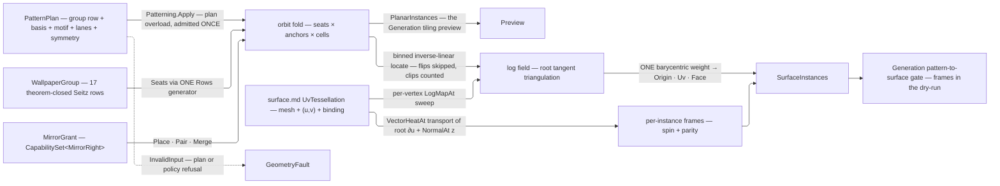

# [RASM_PARAMETRIC_PATTERNMAP]

`Patterning` owns pattern-to-surface instancing in `Rasm.Parametric` — `Fin<PlanarInstances> Patterning.Apply(PatternPlan, Op? key = null)` orbits a motif under a WALLPAPER GROUP in the root tangent plane, and `Fin<SurfaceInstances> Patterning.Apply(PatternMap, Op? key = null)` maps that orbit onto a UV-provenanced surface through the landed tangent LOG/EXP machinery and emits the surface-mapped `SurfaceInstances` the Generation PATTERN/TILING plane consumes as exact input. Symmetry vocabulary is DATA closed by theorem: the 17 wallpaper groups are the complete plane-symmetry census, `[SmartEnum<string>]` rows whose `(lattice, order, mirror-axis, glide, centered)` columns feed ONE Seitz generator, so the orbit fold never branches on the group and a motif, basis, or group change is a data change against one fold. Material legality rides the same data: a `MaterialSymmetry` law admits a plan by SUBGROUP CONTAINMENT read off the group's own seat set — rotations against the admitted rotation order, mirror and glide seats against the mirror grant — so a chiral material refuses every mirror-bearing group as a consequence of the seat data, never a curated roster, and a book-matched material obligates its mirrors in adjacent pairs at orbit emission, where reflected pairs exist — admission never demands that a rotation-only group carry a reflection. Every instance carries a FRAME parallel-transported by the landed vector-heat lane — position without orientation is half an instance — re-seated on the metric-true binding normal and rotated by the instance's own seat spin, so the group's rotations and reflections survive onto the surface.

Input is `surface.md`'s `SurfaceResult.UvTessellation` — mesh + per-vertex `(u, v)` + live `NurbsForm.Surface` binding — so an unbound world-space mesh cannot feed the pipeline by construction. 2D pattern currency is HOST-NEUTRAL `(U, V)` double pairs end to end — plan basis, anchors, root, seat shifts, the planar stream, and the mapped UV column alike, the `CellLattice` neutral-affine precedent — so a host-free consumer composes the pattern surface with no host lift; `Point3d`/`Vector3d` remain only on the `SurfaceInstances` world lane, the kernel's 3D geometry currency. Surface mapping is the piecewise-linear INVERSION of the per-vertex log field, never a per-site geodesic shoot; the log/exp and vector-heat lanes are `geodesics.md`'s landed machinery composed here, and the `LogMapAlgorithm` grade is a `PatternPolicy` data row, never a hardcoded arm. This page INSTANCES a motif onto a surface where `panelize.md` PARTITIONS one into panels — sibling Pattern-stage producers, one anchor each — and every admission failure routes the resolved `Op.InvalidInput` channel, no exception crossing the owner.

## [01]-[INDEX]

- [02]-[PATTERNING]: `PatternLattice` the five-row basis-law vocabulary; `PatternSeat` + `WallpaperGroup` the 17 theorem-closed Seitz rows over ONE seat generator; `RotationOrder`/`MirrorRight`/`MirrorGrant`/`MaterialSymmetry` the derived material-legality algebra; `PatternPlan`/`PatternPolicy`/`PatternMap` the orbit candidate, the mapping policy, and the mapping request; `InstanceBatch`/`PlanarInstances`/`SurfaceInstances` the shared placement provenance and the two typed results; the orbit, log-field, locate, and transport kernels.

## [02]-[PATTERNING]

- Owner: `PatternLattice` `[SmartEnum<string>]` the five plane-lattice rows (`oblique` · `rectangular` · `centered` · `square` · `hexagonal`), `Admits` proving the basis pair through the generated exhaustive `Map` over ONE symmetric metric projection (square: `|A| = |B| ∧ A ⊥ B`; hexagonal: `|A| = |B| ∧ 120°`; rectangular/centered: `A ⊥ B`; oblique: non-degenerate only) so a row change is one `Map` arm, never a hand switch; `PatternSeat` the Seitz-operator row (rotation/reflection linear part as `Cos`/`Sin` + `Mirror` parity + fractional `Shift` in lattice coordinates); `WallpaperGroup` `[SmartEnum<string>]` the 17 rows binding lattice + the seat set `Rows` materializes ONCE at row initialization; `MaterialSymmetry` the material-legality law — `RotationOrder` the admitted crystallographic rotation order (`Free` · `Identity` · `Twofold` · `Threefold` · `Fourfold` · `Sixfold`), congruence derived from the generated integer `Key` and admitted under the CALLER's angular tolerance, never a kernel epsilon — `MirrorGrant` the mirror grant (`Reflective` · `Turned` · `Matched` · `Refused`) whose `Rights` capability set over the `MirrorRight` vocabulary is the whole dispatch — admitting a group by subgroup containment over its OWN realized seat set; `PatternPlan` the orbit candidate (`Group` · `BasisA`/`BasisB` the conventional cell in root-tangent meters · `Anchors` the motif sites + spins in cell coordinates `[0,1)²` · `Extent` the `PositiveMagnitude` geodesic fill radius · `AngleTolerance`/`LengthTolerance` the resolved `Orientation`/`Fraction` lanes the lattice and material proofs read · `Symmetry` the material's admitted symmetry, `MaterialSymmetry.Free` the isotropic row) registering `IValidityEvidence` — `IsValid` is the ONE complete gate `Apply` reads: anchor count, finite in-cell anchors and spins, the lattice basis proof, and material subgroup containment; `PatternPolicy` the mapping row (`HeatTime` the MOUNT-MEASURED `PositiveMagnitude` vector-heat time for log arm and transport · `Algorithm` the log-map grade row · `Trace`/`Windows` the exact-arm policies · `FrameTolerance` the lane-resolved tangency-defect ceiling) registering `IValidityEvidence`, `Of` its ONE admission measuring `h` off the tessellation; `PatternMap` the mapping request (`Source` the UV-provenanced carrier · `Plan` · `Root` the UV map origin · `Policy`); `InstanceBatch` the placement provenance both results share (`Spin` · `Mirrored` · `Anchor` · `Seat` · `PairOf`); `PlanarInstances` the plane result (`Site` + batch); `SurfaceInstances` the surface result (`Origin` · `Uv` · `XAxis` · `ZAxis` · `Face` · `FrameDefect` + batch); `Patterning` the static entry.
- Cases: `WallpaperGroup` rows 17 — CLOSED BY THEOREM (the crystallographic plane-group classification), the census admits no 18th; `PatternLattice` rows 5; `RotationOrder` rows 6, `MirrorRight` rows 3 and `MirrorGrant` rows 4 — the two orthogonal material-legality axes, so a chiral-safe census is a derivation, never a row set.
- Entry: `public static Fin<PlanarInstances> Apply(PatternPlan plan, Op? key = null)` and `public static Fin<SurfaceInstances> Apply(PatternMap map, Op? key = null)` — ONE verb, the compiler fixing each result shape from the request shape, so no orbit consumer carries an impossible surface arm; the plan overload takes NO surface (pure plane algebra) and admits the plan ONCE, the map overload admits plan, policy, and finite root ONCE and carries the `SurfaceResult.UvTessellation` so the provenance law is the parameter type; the admitted orbit kernel is a TOTAL value function both overloads share; no `TilePlane`/`MapPattern`/`TransportFrames` sibling family.
- Auto: `Orbit` reads the group's stored `Seats` (the immutable column `Rows` fills from `(order, mirror-axis, glide, centered)`, deduped modulo lattice translation, closure-under-composition proven per row), walks the lattice cells `(i, j)` whose corners intersect the extent disc, and emits `seat ∘ (anchor + i·A + j·B)` per seat per anchor with the site's accumulated spin (anchor spin + seat rotation angle), seat ordinal, anchor ordinal, and mirror parity as columns, pairing each seat with its mirror mate as ONE placement unit under a pairing grant (both inside the extent or neither, `PairOf` linking the two ordinals symmetrically) — the planar stream downstream tiling UIs edit without any surface. The surface `Apply` seats the root on the nearest UV-column vertex to `PatternMap.Root`, sweeps the LOG FIELD — per tessellation vertex ONE `LogMapAt(space, root, vertex, HeatTime, Algorithm, Trace, Windows, key)` whose 3D log vector lands in 2D root-basis coordinates; the per-source memo caches make the sweep k solves and n samples, never n propagations — then runs `Orbit`'s own fold and locates every site: faces register in every integer cell their log-image extent overlaps (the 4-bin corner lookup — a boundary site always finds its containing face), the inverse-linear barycentric solve places the site in its log-triangle, triangles whose log-image orientation flips are skipped past the cut locus, sites no triangle contains are clipped, and under a pairing grant a rejected site drops with its mate; `PairOf` re-links on survivor ordinals so the mapped stream never carries a half pair. One barycentric weight lifts world `Origin`, `Uv`, and landing `Face` in each surviving placement. Frames: the root direction x₀ = ∂S/∂u off `Source.RationalDerivatives` at the root's own UV (metric-true, never a mesh-edge guess) transports to every instance origin through ONE cached `VectorHeatAt(space, [(root, x₀)], HeatTime, origin, key)` solve; the transported axis's tangency defect `|x̂ · n̂|` against the binding `NormalAt(uv)` records per instance and breaches `FrameTolerance` as the `Pattern` fault naming the instance; the surviving axis re-projects into the tangent plane, rotates by the instance spin about the normal, and `Mirrored` flips the y-handedness at the consumer (`y = ±(z × x)`) so reflected seats place reflected instances.
- Law: the grant's three bools collapse onto `CapabilitySet<MirrorRight>` because their corners are LEGAL, not free — `Pair` and `Merge` each presuppose `Place`, so a grant admitting a book match while refusing the mirror is unrepresentable. NAMED LOSS: per-capability compile-time exhaustiveness, bought back by the closed four-row grant set — no consumer constructs a free set. WITNESS: `law.Mirror.MergesMirror` at `panelize.md`'s mould fold rebuilt as `law.Mirror.Rights.Admits(MirrorRight.Merge)`.
- Law: lattice predicates are DIMENSIONLESS. The basis pair proves through a sine, a cosine, and a relative length disparity read against `ToleranceLane.Orientation` and `ToleranceLane.Fraction`, so one anchor no longer gates an area and a length at once and a millimetre and a metre model admit the same cells. The plan CARRIES its two resolved lanes as columns, so `IsValid` proves the cell with no `Context` in reach and no factory beside the record — a caller resolves the lanes once at construction and every later read is the same proof.
- Law: `HeatTime` is a MOUNT measurement, never a preset. The heat method's diffusion time is `m·h²` on the mean edge length (Crane-Weischedel-Wardetzky), so `PatternPolicy.Of` takes the `UvTessellation` that sets `h`, the caller's `multiplier` argument the one tuning axis, and admits `m·h²` through `PositiveMagnitude` — no site can mount an unmeasured or non-positive diffusion scale, and the multiplier never survives onto the policy as a second column.
- Law: `Reflective` and `Turned` hold the SAME rights and survive as two rows because the discriminant is the shop-floor instruction, not the placement law — `Turned` realizes a mirror by turning the blank, and a fabrication consumer reads `grant.Key` to know which. Any third row with identical rights and no such consumer is a defect.
- Exemption: `Orbit` accumulates six parallel `List<>` columns and a `placed` scratch array inside its own cell walk — single-pass SoA build state that never escapes the member, frozen into `Arr` at the return.
- Output: `SurfaceInstances` carries only the surviving placement, binding, frame, and frame-defect columns over ONE `InstanceBatch`. Instance count and measure bands derive from those columns; material law stays on the `PatternPlan` and the log-map grade on the `PatternPolicy`; clipped and flipped sites do not leave the producer.
- Packages: `Rasm.Parametric` `surface.md` (`SurfaceResult.UvTessellation` the input carrier) + `nurbs.md` (`NurbsForm.Surface.NormalAt`/`RationalDerivatives` — the frame normal and the root ∂u), `Rasm.Meshing` (`MeshSpace`), `Rasm.Processing` (`GeodesicKernel.LogMapAt`/`StraightestLogMapAt` + `LogMapAlgorithm` + `GeodesicTracePolicy`/`WindowPropagationPolicy` — the landed log/exp lane; `GeodesicKernel.VectorHeatAt` — the Sharp-Soliman-Crane transport), `Rasm.Numerics` (`PositiveMagnitude` the extent and heat-time owner; the `GeometryFault` union), `Rasm.Domain` (`Op`/`AcceptValidated`, `Context`/`ToleranceLane`/`Tolerance`, `ICapability`/`CapabilitySet`, `ValidityClaim`/`IValidityEvidence`), Rhino.Geometry (`Point3d`/`Vector3d` — the `SurfaceInstances` world lane alone; the 2D pattern currency is neutral `(U, V)` pairs), Thinktecture.Runtime.Extensions (`[SmartEnum]` rows + generated exhaustive `Map`), LanguageExt.Core.
- Growth: the wallpaper census cannot grow — recorded structural fact, not a gap; the FRIEZE census (the 7 border groups, for curve-borne patterns along `curve.md` stations) is one further theorem-closed vocabulary feeding the SAME orbit fold and arrives chirality-aware for free — the subgroup admission reads frieze seat data unchanged; an orbit filter (a thinning field, a mask region, a per-seat cull) enters as an ADMITTED unit-interval projection executed inside the orbit fold — pair-unit sampling under a pairing grant and propagated field failures included — never a raw fallible scalar on the plan; a new material right is one `MirrorRight` row every grant gains together; a multi-root chart atlas for closed surfaces (orbits from several roots, cut-reconciled) is one `PatternMap` widening over the same log-field kernel; a new anchor payload (per-anchor scale column) is one `Anchors` tuple widening; zero new entry surfaces, zero new carriers.
- Boundary: a straightest-geodesic tracer, window propagation, or vector-heat solve re-derived here is the `geodesics.md` altitude violation; a per-site `StraightestLogMapAt` shoot is the rejected mapping default — it re-pays propagation per instance and cannot see the cut-locus overlap the field triangulation makes skippable, so flipped triangles are rejected at the producer; instance lift reads the tessellation's OWN UV column through the locate's barycentric weight, and a `ClosestParameter` round trip on an already-parameterized point is the named re-projection defect; frames transport through vector heat and rotate by seat spin, so a global UV-gradient frame (shears with the parameterization) and an untransported constant axis (ignores holonomy) are the named naive substitutes; the stream is host-neutral SoA data, Rhino block/instance materialization living at the host wire, never this owner; the 2D pattern currency admits and answers in neutral `(U, V)` doubles — a host pair on the plan, a seat, or a 2D stream column is the named boundary regression, and only the `SurfaceInstances` world columns carry the kernel's 3D host currency; material legality is DERIVED subgroup containment over the group's own seat set — a hardcoded chiral-safe roster, a bool column pair beside the rights set, or a fold branching on grant identity instead of `Rights.Admits` is the named re-mint; every admission failure routes the resolved `Op.InvalidInput` channel, composed owners surfacing their own faults untranslated.

```csharp
// --- [IMPORTS] -------------------------------------------------------------------------
using System;
using System.Collections.Generic;
using System.Linq;
using LanguageExt;
using Rasm.Domain;
using Rasm.Meshing;
using Rasm.Numerics;
using Rasm.Processing;
using Rhino.Geometry;
using Thinktecture;
using static LanguageExt.Prelude;

namespace Rasm.Parametric;

// --- [TYPES] ---------------------------------------------------------------------------
[SmartEnum<string>]
[KeyMemberEqualityComparer<ComparerAccessors.StringOrdinal, string>]
[KeyMemberComparer<ComparerAccessors.StringOrdinal, string>]
public sealed partial class PatternLattice {
    public static readonly PatternLattice Oblique     = new("oblique");
    public static readonly PatternLattice Rectangular = new("rectangular");
    public static readonly PatternLattice Centered    = new("centered");
    public static readonly PatternLattice Square      = new("square");
    public static readonly PatternLattice Hexagonal   = new("hexagonal");

    public bool Admits((double U, double V) a, (double U, double V) b, Tolerance angle, Tolerance ratio) {
        (double sine, double cosine, double signedCosine, double disparity) = Metrics(a, b);
        return Map(
            oblique: sine > angle.Value,
            rectangular: sine > angle.Value && cosine <= angle.Value,
            centered: sine > angle.Value && cosine <= angle.Value,
            square: disparity <= ratio.Value && cosine <= angle.Value,
            hexagonal: disparity <= ratio.Value && Math.Abs(signedCosine + 0.5) <= angle.Value);
    }

    static (double Sine, double Cosine, double SignedCosine, double Disparity) Metrics(
        (double U, double V) a, (double U, double V) b) {
        double aLength = Math.Sqrt((a.U * a.U) + (a.V * a.V));
        double bLength = Math.Sqrt((b.U * b.U) + (b.V * b.V));
        double denominator = aLength * bLength;
        double signedCosine = ((a.U * b.U) + (a.V * b.V)) / denominator;
        return (Math.Abs((a.U * b.V) - (a.V * b.U)) / denominator, Math.Abs(signedCosine), signedCosine,
            Math.Abs(aLength - bLength) / Math.Max(aLength, bLength));
    }
}

public readonly record struct PatternSeat(double Cos, double Sin, bool Mirror, (double U, double V) Shift);

[SmartEnum<string>]
[KeyMemberEqualityComparer<ComparerAccessors.StringOrdinal, string>]
[KeyMemberComparer<ComparerAccessors.StringOrdinal, string>]
public sealed partial class WallpaperGroup {
    public static readonly WallpaperGroup P1   = new("p1",   PatternLattice.Oblique,     Rows(1, None, None, false));
    public static readonly WallpaperGroup P2   = new("p2",   PatternLattice.Oblique,     Rows(2, None, None, false));
    public static readonly WallpaperGroup Pm   = new("pm",   PatternLattice.Rectangular, Rows(1, Some(0.0), None, false));
    public static readonly WallpaperGroup Pg   = new("pg",   PatternLattice.Rectangular, Rows(1, None, Some((0.0, (0.5, 0.0))), false));
    public static readonly WallpaperGroup Cm   = new("cm",   PatternLattice.Centered,    Rows(1, Some(0.0), None, true));
    public static readonly WallpaperGroup Pmm  = new("pmm",  PatternLattice.Rectangular, Rows(2, Some(0.0), None, false));
    public static readonly WallpaperGroup Pmg  = new("pmg",  PatternLattice.Rectangular, Rows(2, Some(Math.PI / 2.0), Some((0.0, (0.5, 0.0))), false));
    public static readonly WallpaperGroup Pgg  = new("pgg",  PatternLattice.Rectangular, Rows(2, None, Some((0.0, (0.5, 0.5))), false));
    public static readonly WallpaperGroup Cmm  = new("cmm",  PatternLattice.Centered,    Rows(2, Some(0.0), None, true));
    public static readonly WallpaperGroup P4   = new("p4",   PatternLattice.Square,      Rows(4, None, None, false));
    public static readonly WallpaperGroup P4m  = new("p4m",  PatternLattice.Square,      Rows(4, Some(0.0), None, false));
    public static readonly WallpaperGroup P4g  = new("p4g",  PatternLattice.Square,      Rows(4, Some(Math.PI / 4.0), Some((0.0, (0.5, 0.5))), false));
    public static readonly WallpaperGroup P3   = new("p3",   PatternLattice.Hexagonal,   Rows(3, None, None, false));
    public static readonly WallpaperGroup P3m1 = new("p3m1", PatternLattice.Hexagonal,   Rows(3, Some(0.0), None, false));
    public static readonly WallpaperGroup P31m = new("p31m", PatternLattice.Hexagonal,   Rows(3, Some(Math.PI / 6.0), None, false));
    public static readonly WallpaperGroup P6   = new("p6",   PatternLattice.Hexagonal,   Rows(6, None, None, false));
    public static readonly WallpaperGroup P6m  = new("p6m",  PatternLattice.Hexagonal,   Rows(6, Some(0.0), None, false));

    public PatternLattice Lattice { get; }
    public Arr<PatternSeat> Seats { get; }

    static Arr<PatternSeat> Rows(int order, Option<double> mirrorAxis, Option<(double Axis, (double U, double V) Shift)> glide, bool centered);
}

[SmartEnum<int>]
public sealed partial class RotationOrder {
    public static readonly RotationOrder Free      = new(0);
    public static readonly RotationOrder Identity  = new(1);
    public static readonly RotationOrder Twofold   = new(2);
    public static readonly RotationOrder Threefold = new(3);
    public static readonly RotationOrder Fourfold  = new(4);
    public static readonly RotationOrder Sixfold   = new(6);

    public bool Admits(double angle, double tolerance) =>
        Key == 0 || Math.Abs(Math.IEEERemainder(angle, Math.Tau / Key)) <= tolerance;
}

[SmartEnum<string>]
[KeyMemberEqualityComparer<ComparerAccessors.StringOrdinal, string>]
public sealed partial class MirrorRight : ICapability<MirrorRight> {
    public static readonly MirrorRight Place = new("place", 0);
    public static readonly MirrorRight Pair  = new("pair",  1);
    public static readonly MirrorRight Merge = new("merge", 2);

    public int Rank { get; }
}

[SmartEnum<string>]
[KeyMemberEqualityComparer<ComparerAccessors.StringOrdinal, string>]
[KeyMemberComparer<ComparerAccessors.StringOrdinal, string>]
public sealed partial class MirrorGrant {
    public static readonly MirrorGrant Reflective = new("reflective", CapabilitySet<MirrorRight>.Of(MirrorRight.Place, MirrorRight.Merge));
    public static readonly MirrorGrant Turned     = new("turned",     CapabilitySet<MirrorRight>.Of(MirrorRight.Place, MirrorRight.Merge));
    public static readonly MirrorGrant Matched    = new("matched",    CapabilitySet<MirrorRight>.Of(MirrorRight.Place, MirrorRight.Pair, MirrorRight.Merge));
    public static readonly MirrorGrant Refused    = new("refused",    CapabilitySet<MirrorRight>.None);

    public CapabilitySet<MirrorRight> Rights { get; }
}

public sealed record MaterialSymmetry(RotationOrder Rotation, MirrorGrant Mirror) {
    public static readonly MaterialSymmetry Free = new(RotationOrder.Free, MirrorGrant.Reflective);

    public bool Admits(WallpaperGroup group, Tolerance angle) => group.Seats.ForAll(seat =>
        seat.Mirror
            ? Mirror.Rights.Admits(MirrorRight.Place)
            : Rotation.Admits(Math.Atan2(seat.Sin, seat.Cos), angle.Value));
}

// --- [MODELS] --------------------------------------------------------------------------
public sealed record PatternPlan(
    WallpaperGroup Group, (double U, double V) BasisA, (double U, double V) BasisB,
    Arr<(double U, double V, double Spin)> Anchors, PositiveMagnitude Extent,
    Tolerance AngleTolerance, Tolerance LengthTolerance, MaterialSymmetry Symmetry) : IValidityEvidence {
    public bool IsValid => Group is not null && Symmetry is not null && ValidityClaim.All(
        ValidityClaim.CountAtLeast(Anchors.Count, 1),
        Anchors.All(static anchor =>
            double.IsFinite(anchor.U) && double.IsFinite(anchor.V) && double.IsFinite(anchor.Spin)
            && anchor.U is >= 0.0 and < 1.0 && anchor.V is >= 0.0 and < 1.0),
        Group.Lattice.Admits(BasisA, BasisB, AngleTolerance, LengthTolerance),
        Symmetry.Admits(Group, AngleTolerance));
}

public sealed record PatternPolicy(
    PositiveMagnitude HeatTime, LogMapAlgorithm Algorithm,
    GeodesicTracePolicy Trace, WindowPropagationPolicy Windows, Tolerance FrameTolerance) : IValidityEvidence {
    public static Fin<PatternPolicy> Of(
        SurfaceResult.UvTessellation source, Context context, LogMapAlgorithm algorithm, Op key,
        double multiplier = 1.0) {
        if (source is null || algorithm is null) { return Fin.Fail<PatternPolicy>(key.InvalidInput()); }
        double h = source.Mesh.Cache.MeanEdgeLength;
        return key.AcceptValidated<PositiveMagnitude>(candidate: multiplier * h * h)
            .Map(time => new PatternPolicy(time, algorithm, GeodesicTracePolicy.Default,
                WindowPropagationPolicy.Default, context.For(ToleranceLane.Orientation)));
    }

    public bool IsValid => Algorithm is not null && Band.Positive.Admits(HeatTime.Value) && FrameTolerance.IsValid;
}

public sealed record PatternMap(
    SurfaceResult.UvTessellation Source, PatternPlan Plan,
    (double U, double V) Root, PatternPolicy Policy);

public sealed record InstanceBatch(
    Arr<double> Spin, Arr<bool> Mirrored, Arr<int> Anchor, Arr<int> Seat, Arr<Option<int>> PairOf);

public sealed record PlanarInstances(Arr<(double U, double V)> Site, InstanceBatch Instances);

public sealed record SurfaceInstances(
    Arr<Point3d> Origin, Arr<(double U, double V)> Uv, Arr<Vector3d> XAxis, Arr<Vector3d> ZAxis,
    Arr<int> Face, Arr<double> FrameDefect, InstanceBatch Instances);

// --- [OPERATIONS] ----------------------------------------------------------------------
public static class Patterning {
    public static Fin<PlanarInstances> Apply(PatternPlan plan, Op? key = null) =>
        plan is not null && plan.IsValid
            ? Fin.Succ(Orbit(plan))
            : Fin.Fail<PlanarInstances>(key.OrDefault().InvalidInput());

    public static Fin<SurfaceInstances> Apply(PatternMap map, Op? key = null) {
        Op operation = key.OrDefault();
        if (map is null || !map.Plan.IsValid || !map.Policy.IsValid
            || !double.IsFinite(map.Root.U) || !double.IsFinite(map.Root.V)) {
            return Fin.Fail<SurfaceInstances>(operation.InvalidInput());
        }
        return RootVertex(map.Source, map.Root).Bind(root =>
            LogField(map.Source, root, map.Policy, operation).Bind(log =>
                Instances(map.Source, root, Orbit(map.Plan), log, map.Policy, operation)));
    }

    // --- [ORBIT]
    static PlanarInstances Orbit(PatternPlan plan) {
        Arr<PatternSeat> seats = plan.Group.Seats;
        bool pairing = plan.Symmetry.Mirror.Rights.Admits(MirrorRight.Pair);
        (List<(double U, double V)> site, List<double> spin, List<bool> mirrored, List<int> anchor, List<int> seat, List<int> pair) =
            (new List<(double U, double V)>(), new List<double>(), new List<bool>(), new List<int>(), new List<int>(), new List<int>());
        int[] placed = new int[seats.Count];
        double reach = plan.Extent.Value * plan.Extent.Value;
        foreach ((int i, int j) in CellWindow(plan)) {
            for (int a = 0; a < plan.Anchors.Count; a++) {
                System.Array.Fill(placed, -1);
                for (int s = 0; s < seats.Count; s++) {
                    (double U, double V) at = Placed(plan, seats[s], (plan.Anchors[a].U, plan.Anchors[a].V), i, j);
                    if (!Inside(at, reach)) { continue; }
                    if (pairing && !Inside(Placed(plan, seats[MateOf(seats, s)], (plan.Anchors[a].U, plan.Anchors[a].V), i, j), reach)) {
                        continue;
                    }
                    placed[s] = site.Count;
                    site.Add(at);
                    spin.Add(plan.Anchors[a].Spin + SpinOf(seats[s]));
                    mirrored.Add(seats[s].Mirror);
                    anchor.Add(a);
                    seat.Add(s);
                    pair.Add(-1);
                }
                if (pairing) {
                    for (int s = 0; s < seats.Count; s++) {
                        if (placed[s] < 0 || !seats[s].Mirror) { continue; }
                        int mate = placed[MateOf(seats, s)];
                        if (mate < 0) { continue; }
                        (pair[placed[s]], pair[mate]) = (mate, placed[s]);
                    }
                }
            }
        }
        return new PlanarInstances(new([.. site]),
            new InstanceBatch(new([.. spin]), new([.. mirrored]), new([.. anchor]), new([.. seat]),
                new([.. pair.Select(static value => value < 0 ? Option<int>.None : Some(value))])));
    }

    static bool Inside((double U, double V) at, double reach) => (at.U * at.U) + (at.V * at.V) <= reach;
    static Seq<(int I, int J)> CellWindow(PatternPlan plan);
    static (double U, double V) Placed(PatternPlan plan, PatternSeat seat, (double U, double V) anchor, int i, int j);
    static double SpinOf(PatternSeat seat);
    static int MateOf(Arr<PatternSeat> seats, int seat);

    // --- [SURFACE_MAP]
    static Fin<int> RootVertex(SurfaceResult.UvTessellation source, (double U, double V) rootUv);

    static Fin<Arr<(double U, double V)>> LogField(
        SurfaceResult.UvTessellation source, int root, PatternPolicy policy, Op key);

    static Fin<SurfaceInstances> Instances(
        SurfaceResult.UvTessellation source, int root, PlanarInstances planar,
        Arr<(double U, double V)> log, PatternPolicy policy, Op key);
}
```



## [03]-[RESEARCH]

<!-- source-only: research row template:
[TOKEN]-[OPEN|BLOCKED]: <exact question>; <verification route>.
-->

(none)
