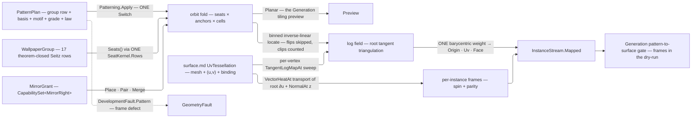

# [RASM_PARAMETRIC_PATTERNMAP]

`Patterning` owns pattern-to-surface instancing in `Rasm.Parametric` — `Fin<InstanceStream> Patterning.Apply(PatternOp, Op? key = null)` orbits a motif under a WALLPAPER GROUP in the root tangent plane, maps the orbit onto a UV-provenanced surface through the landed tangent LOG/EXP machinery, and emits the surface-mapped INSTANCE STREAM the Generation PATTERN/TILING plane consumes as exact input. Symmetry vocabulary is DATA closed by theorem: the 17 wallpaper groups are the complete plane-symmetry census, `[SmartEnum<string>]` rows whose `(lattice, order, mirror-axis, glide, centered)` columns feed ONE Seitz generator, so the orbit fold never branches on the group and a motif, basis, or group change is a data change against one fold. Material legality rides the same data: a `MaterialSymmetry` law admits a plan by SUBGROUP CONTAINMENT read off the group's own seat set — rotations against the admitted fold, mirror and glide seats against the mirror grant — so a chiral material refuses every mirror-bearing group as a consequence of the seat data, never a curated roster, and a book-matched material obligates its mirrors in adjacent pairs. Every instance carries a FRAME parallel-transported by the landed vector-heat lane — position without orientation is half an instance — re-seated on the metric-true binding normal and rotated by the instance's own seat spin, so the group's rotations and reflections survive onto the surface.

Input is `surface.md`'s `SurfaceResult.UvTessellation` — mesh + per-vertex `(u, v)` + live `NurbsForm.Surface` binding — so an unbound world-space mesh cannot feed the pipeline by construction. 2D pattern currency is HOST-NEUTRAL `(U, V)` double pairs end to end — plan basis, anchors, root, seat shifts, the planar stream, and the mapped UV column alike, the `CellLattice` neutral-affine precedent — so a host-free consumer composes the pattern surface with no host lift; `Point3d`/`Vector3d` remain only on the `Mapped` world lane, the kernel's 3D geometry currency. Surface mapping is the piecewise-linear INVERSION of the per-vertex log field, never a per-site geodesic shoot; the log/exp and vector-heat lanes are `geodesics.md`'s landed machinery composed here, and the `TangentLogMapAlgorithm` grade is a PLAN data row, never a hardcoded arm. This page INSTANCES a motif onto a surface where `panelize.md` PARTITIONS one into panels — sibling Pattern-stage producers, one anchor each — and every failure routes `GeometryFault.DevelopmentFault(DevelopmentStage.Pattern, unit, defect)` naming the instance, no exception crossing the owner.

## [01]-[INDEX]

- [02]-[PATTERNING]: `PatternLattice` the five-row basis-law vocabulary; `PatternSeat` + `WallpaperGroup` the 17 theorem-closed Seitz rows over ONE seat generator; `SymmetryFold`/`MirrorRight`/`MirrorGrant`/`MaterialSymmetry` the derived material-legality algebra; `PatternPlan`/`PatternPolicy` the orbit and mapping rows; `PatternOp` the two-case request `[Union]` folded by ONE `Apply`; `InstanceStream` the planar/mapped result `[Union]`; the orbit, log-field, locate, and transport kernels.

## [02]-[PATTERNING]

- Owner: `PatternLattice` `[SmartEnum<string>]` the five plane-lattice rows (`oblique` · `rectangular` · `centered` · `square` · `hexagonal`), each carrying its basis-proof delegate column — the row PROVES the basis pair (square: `|A| = |B| ∧ A ⊥ B`; hexagonal: `|A| = |B| ∧ 120°`; rectangular/centered: `A ⊥ B`; oblique: non-degenerate only) so plan validity is data-driven, never a switch; `PatternSeat` the Seitz-operator row (rotation/reflection linear part as `Cos`/`Sin` + `Mirror` parity + fractional `Shift` in lattice coordinates); `WallpaperGroup` `[SmartEnum<string>]` the 17 rows binding lattice + seat-generator delegate; `MaterialSymmetry` the material-legality law — `SymmetryFold` the admitted rotation fold — a spin admits under a CALLER CONE, the kernel epsilon the parameterless default — `MirrorGrant` the mirror grant (`Reflective` · `Turned` · `Matched` · `Refused`) whose `Rights` capability set over the `MirrorRight` vocabulary is the whole dispatch — admitting a group by subgroup containment over its OWN realized seat set; `PatternPlan` the orbit row (`Group` · `BasisA`/`BasisB` the conventional cell in root-tangent meters · `Anchors` the motif sites + spins in cell coordinates `[0,1)²` · `Extent` the geodesic fill radius · `Root` the UV map origin · `Algorithm` the log-map grade row · `Law` the material's admitted symmetry, `None` reading `Free`) registering `IValidityEvidence`; `PatternPolicy` the mapping row (`HeatTime` the MOUNT-MEASURED vector-heat time for log arm and transport, `HeatMultiplier` its dimensionless tuning column · `Trace`/`Windows` the exact-arm policies · `FrameBudget` the lane-resolved tangency-defect ceiling) registering `IValidityEvidence`; `PatternOp` the request `[Union]`; `InstanceStream` the result `[Union]`; `Patterning` the static entry.
- Cases: `WallpaperGroup` rows 17 — CLOSED BY THEOREM (the crystallographic plane-group classification), the census admits no 18th; `PatternLattice` rows 5; `SymmetryFold` rows 6, `MirrorRight` rows 3 and `MirrorGrant` rows 4 — the two orthogonal material-legality axes, so a chiral-safe census is a derivation, never a row set; `PatternOp` cases `Orbit` · `Map` (2 — the planar tiling preview the Generation plane edits versus the full surface mapping, `Map` composing `Orbit`'s own fold); `InstanceStream` cases `Planar` · `Mapped` (2).
- Entry: `public static Fin<InstanceStream> Apply(PatternOp op, Op? key = null)` — the ONE entry discriminating on the op case; `Orbit` takes NO surface (pure plane algebra), `Map` takes the `SurfaceResult.UvTessellation` carrier so the provenance law is the parameter type; no `TilePlane`/`MapPattern`/`TransportFrames` sibling family.
- Auto: `Orbit` resolves the group's seats ONCE (`Seats()` — the delegate column feeding `SeatKernel.Rows`, deduped modulo lattice translation, closure-under-composition proven per row), walks the lattice cells `(i, j)` whose corners intersect the extent disc, and emits `seat ∘ (anchor + i·A + j·B)` per seat per anchor with the site's accumulated spin (anchor spin + seat rotation angle), seat ordinal, anchor ordinal, and mirror parity as columns, pairing each seat with its mirror mate as ONE placement unit under a pairing grant (both inside the extent or neither, `PairOf` linking the two ordinals symmetrically) — the planar stream downstream tiling UIs edit without any surface. `Map` seats the root on the nearest UV-column vertex to `Plan.Root`, sweeps the LOG FIELD — per tessellation vertex ONE `TangentLogMapAt(space, root, vertex, HeatTime, Algorithm, Trace, Windows, key)` whose 3D tangent lands in 2D root-basis coordinates; the per-source memo caches make the sweep k solves and n samples, never n propagations — then runs `Orbit`'s own fold and locates every site: faces register in every integer cell their log-image extent overlaps (the 4-bin corner lookup — a boundary site always finds its containing face), the inverse-linear barycentric solve places the site in its log-triangle, triangles whose log-image orientation flips are skipped past the cut locus, sites no triangle contains are clipped, and under a pairing grant a rejected site drops with its mate; `PairOf` re-links on survivor ordinals so the mapped stream never carries a half pair. One barycentric weight lifts world `Origin`, `Uv`, and landing `Face` in each surviving placement. Frames: the root direction x₀ = ∂S/∂u off `Source.RationalDerivatives` at the root's own UV (metric-true, never a mesh-edge guess) transports to every instance origin through ONE cached `VectorHeatAt(space, [(root, x₀)], HeatTime, origin, key)` solve; the transported axis's tangency defect `|x̂ · n̂|` against the binding `NormalAt(uv)` records per instance and breaches `FrameBudget` as the `Pattern` fault naming the instance; the surviving axis re-projects into the tangent plane, rotates by the instance spin about the normal, and `Mirrored` flips the y-handedness at the consumer (`y = ±(z × x)`) so reflected seats place reflected instances. `Density` plan rows filter each surviving site before its columns emit — the `fields.md` sample (plane point for `Planar`, lifted world origin for `Mapped`) against the site's `Deterministic.Unit(lanes: [seat, i, j])` draw — so thinning follows the field gradient and replays byte-stable; under a pairing grant the PAIR is the thinning unit, one draw on the unmirrored mate's lanes placing or culling both.
- Law: the grant's three bools collapse onto `CapabilitySet<MirrorRight>` because their corners are LEGAL, not free — `Pair` and `Merge` each presuppose `Place`, so a grant admitting a book match while refusing the mirror is unrepresentable. NAMED LOSS: per-capability compile-time exhaustiveness, bought back by the closed four-row grant set — no consumer constructs a free set. WITNESS: `law.Mirror.MergesMirror` at `panelize.md`'s mould fold rebuilt as `law.Mirror.Rights.Admits(MirrorRight.Merge)`.
- Law: lattice predicates are DIMENSIONLESS. The basis pair proves through a sine, a cosine, and a relative length disparity read against `ToleranceLane.Orientation` and `ToleranceLane.Fraction`, so one anchor no longer gates an area and a length at once and a millimetre and a metre model admit the same cells. NAMED LOSS: the context-free `IsValid` basis claim, which no `Context` could reach; `PatternPlan.Of` is the one admission that proves a cell.
- Law: `HeatTime` is a MOUNT measurement, never a preset. The heat method's diffusion time is `m·h²` on the mean edge length (Crane-Weischedel-Wardetzky), so `PatternPolicy.Of` takes the `UvTessellation` that sets `h` and the context-free overload deletes — no site can mount an unmeasured diffusion scale, and `HeatMultiplier` is the tuning axis a caller actually owns.
- Law: `Reflective` and `Turned` hold the SAME rights and survive as two rows because the discriminant is the shop-floor instruction, not the placement law — `Turned` realizes a mirror by turning the blank, and a fabrication consumer reads `grant.Key` to know which. Any third row with identical rights and no such consumer is a defect.
- Exemption: `OrbitOf` accumulates six parallel `List<>` columns and a `placed` scratch array inside its own cell walk — single-pass SoA build state that never escapes the member, frozen into `Arr` at the return.
- Output: `InstanceStream.Mapped` carries only the surviving placement, binding, frame, radius, and frame-defect columns. Instance count and measure bands derive from those columns; algorithm and material law remain on the owning `PatternPlan`; clipped and flipped sites do not leave the producer.
- Packages: `Rasm.Parametric` `surface.md` (`SurfaceResult.UvTessellation` the input carrier) + `nurbs.md` (`NurbsForm.Surface.NormalAt`/`RationalDerivatives` — the frame normal and the root ∂u), `Rasm.Meshing` (`MeshSpace`), `Rasm.Processing` (`GeodesicKernel.TangentLogMapAt`/`ExactExpMapAt` + `TangentLogMapAlgorithm` + `GeodesicTracePolicy`/`WindowPropagationPolicy` — the landed log/exp lane; `GeodesicKernel.VectorHeatAt` — the Sharp-Soliman-Crane transport), `Rasm.Spatial` (`ScalarField` — the density filter), `Rasm.Numerics` (`EpsilonPolicy`; `GeometryFault.DevelopmentFault` + `DevelopmentStage`), `Rasm.Domain` (`Op`, `Context`/`ToleranceLane`/`Tolerance`, `Deterministic.Unit`, `ICapability`/`CapabilitySet`, `ValidityClaim`/`IValidityEvidence`), Rhino.Geometry (`Point3d`/`Vector3d` — the `Mapped` world lane alone; the 2D pattern currency is neutral `(U, V)` pairs), Thinktecture.Runtime.Extensions (`[SmartEnum]` + `[UseDelegateFromConstructor]` columns), LanguageExt.Core.
- Growth: the wallpaper census cannot grow — recorded structural fact, not a gap; the FRIEZE census (the 7 border groups, for curve-borne patterns along `curve.md` stations) is one further theorem-closed vocabulary feeding the SAME orbit fold and arrives chirality-aware for free — the subgroup admission reads frieze seat data unchanged; a further orbit filter (a mask region, a per-seat cull) is one filter row beside the executed `Density` precedent; a new material right is one `MirrorRight` row every grant gains together; a multi-root chart atlas for closed surfaces (orbits from several roots, cut-reconciled) is one plan widening over the same log-field kernel; a new anchor payload (per-anchor scale column) is one `Anchors` tuple widening; zero new entry surfaces, zero new carriers.
- Boundary: a straightest-geodesic tracer, window propagation, or vector-heat solve re-derived here is the `geodesics.md` altitude violation; a per-site `ExactExpMapAt` shoot is the rejected mapping default — it re-pays propagation per instance and cannot see the cut-locus overlap the field triangulation makes skippable, so flipped triangles are rejected at the producer; instance lift reads the tessellation's OWN UV column through the locate's barycentric weight, and a `ClosestParameter` round trip on an already-parameterized point is the named re-projection defect; frames transport through vector heat and rotate by seat spin, so a global UV-gradient frame (shears with the parameterization) and an untransported constant axis (ignores holonomy) are the named naive substitutes; the stream is host-neutral SoA data, Rhino block/instance materialization living at the host wire, never this owner; the 2D pattern currency admits and answers in neutral `(U, V)` doubles — a host pair on the plan, a seat, or a 2D stream column is the named boundary regression, and only the `Mapped` world columns carry the kernel's 3D host currency; material legality is DERIVED subgroup containment over the group's own seat set — a hardcoded chiral-safe roster, a bool column pair beside the rights set, or a fold branching on grant identity instead of `Rights.Admits` is the named re-mint; every failure routes `Pattern` with the instance unit and the frame or admission measure as witness, composed owners surfacing their own faults untranslated.

```csharp
// --- [IMPORTS] -------------------------------------------------------------------------
using System;
using System.Collections.Generic;
using System.Linq;
using LanguageExt;
using Rasm.Domain;
using Rasm.Meshing;
using Rasm.Numerics;
using Rasm.Processing;
using Rasm.Spatial;
using Rhino.Geometry;
using Thinktecture;
using static LanguageExt.Prelude;

namespace Rasm.Parametric;

// --- [TYPES] ---------------------------------------------------------------------------
[SmartEnum<string>]
[KeyMemberEqualityComparer<ComparerAccessors.StringOrdinal, string>]
[KeyMemberComparer<ComparerAccessors.StringOrdinal, string>]
public sealed partial class PatternLattice {
    public static readonly PatternLattice Oblique = new("oblique", static (a, b, orientation, _) =>
        Sine(a, b) > orientation.Value);
    public static readonly PatternLattice Rectangular = new("rectangular", static (a, b, orientation, _) =>
        Sine(a, b) > orientation.Value && Cosine(a, b) <= orientation.Value);
    public static readonly PatternLattice Centered = new("centered", static (a, b, orientation, _) =>
        Sine(a, b) > orientation.Value && Cosine(a, b) <= orientation.Value);
    public static readonly PatternLattice Square = new("square", static (a, b, orientation, fraction) =>
        Disparity(a, b) <= fraction.Value && Cosine(a, b) <= orientation.Value);
    public static readonly PatternLattice Hexagonal = new("hexagonal", static (a, b, orientation, fraction) =>
        Disparity(a, b) <= fraction.Value && Math.Abs(SignedCosine(a, b) + 0.5) <= orientation.Value);

    static double Cross((double U, double V) a, (double U, double V) b) => (a.U * b.V) - (a.V * b.U);
    static double Dot((double U, double V) a, (double U, double V) b) => (a.U * b.U) + (a.V * b.V);
    static double Len((double U, double V) a) => Math.Sqrt((a.U * a.U) + (a.V * a.V));

    static double Sine((double U, double V) a, (double U, double V) b) => Math.Abs(Cross(a, b)) / (Len(a) * Len(b));
    static double SignedCosine((double U, double V) a, (double U, double V) b) => Dot(a, b) / (Len(a) * Len(b));
    static double Cosine((double U, double V) a, (double U, double V) b) => Math.Abs(SignedCosine(a, b));
    static double Disparity((double U, double V) a, (double U, double V) b) => Math.Abs(Len(a) - Len(b)) / Len(a);

    [UseDelegateFromConstructor] public partial bool Admits((double U, double V) a, (double U, double V) b, Tolerance orientation, Tolerance fraction);
}

public readonly record struct PatternSeat(double Cos, double Sin, bool Mirror, (double U, double V) Shift);

[SmartEnum<string>]
[KeyMemberEqualityComparer<ComparerAccessors.StringOrdinal, string>]
[KeyMemberComparer<ComparerAccessors.StringOrdinal, string>]
public sealed partial class WallpaperGroup {
    public static readonly WallpaperGroup P1   = new("p1",   number: 1,  PatternLattice.Oblique,     static () => SeatKernel.Rows(order: 1, mirrorAxis: None, glide: None, centered: false));
    public static readonly WallpaperGroup P2   = new("p2",   number: 2,  PatternLattice.Oblique,     static () => SeatKernel.Rows(order: 2, mirrorAxis: None, glide: None, centered: false));
    public static readonly WallpaperGroup Pm   = new("pm",   number: 3,  PatternLattice.Rectangular, static () => SeatKernel.Rows(order: 1, mirrorAxis: Some(0.0), glide: None, centered: false));
    public static readonly WallpaperGroup Pg   = new("pg",   number: 4,  PatternLattice.Rectangular, static () => SeatKernel.Rows(order: 1, mirrorAxis: None, glide: Some((0.0, (0.5, 0.0))), centered: false));
    public static readonly WallpaperGroup Cm   = new("cm",   number: 5,  PatternLattice.Centered,    static () => SeatKernel.Rows(order: 1, mirrorAxis: Some(0.0), glide: None, centered: true));
    public static readonly WallpaperGroup Pmm  = new("pmm",  number: 6,  PatternLattice.Rectangular, static () => SeatKernel.Rows(order: 2, mirrorAxis: Some(0.0), glide: None, centered: false));
    public static readonly WallpaperGroup Pmg  = new("pmg",  number: 7,  PatternLattice.Rectangular, static () => SeatKernel.Rows(order: 2, mirrorAxis: Some(Math.PI / 2.0), glide: Some((0.0, (0.5, 0.0))), centered: false));
    public static readonly WallpaperGroup Pgg  = new("pgg",  number: 8,  PatternLattice.Rectangular, static () => SeatKernel.Rows(order: 2, mirrorAxis: None, glide: Some((0.0, (0.5, 0.5))), centered: false));
    public static readonly WallpaperGroup Cmm  = new("cmm",  number: 9,  PatternLattice.Centered,    static () => SeatKernel.Rows(order: 2, mirrorAxis: Some(0.0), glide: None, centered: true));
    public static readonly WallpaperGroup P4   = new("p4",   number: 10, PatternLattice.Square,      static () => SeatKernel.Rows(order: 4, mirrorAxis: None, glide: None, centered: false));
    public static readonly WallpaperGroup P4m  = new("p4m",  number: 11, PatternLattice.Square,      static () => SeatKernel.Rows(order: 4, mirrorAxis: Some(0.0), glide: None, centered: false));
    public static readonly WallpaperGroup P4g  = new("p4g",  number: 12, PatternLattice.Square,      static () => SeatKernel.Rows(order: 4, mirrorAxis: Some(Math.PI / 4.0), glide: Some((0.0, (0.5, 0.5))), centered: false));
    public static readonly WallpaperGroup P3   = new("p3",   number: 13, PatternLattice.Hexagonal,   static () => SeatKernel.Rows(order: 3, mirrorAxis: None, glide: None, centered: false));
    public static readonly WallpaperGroup P3m1 = new("p3m1", number: 14, PatternLattice.Hexagonal,   static () => SeatKernel.Rows(order: 3, mirrorAxis: Some(0.0), glide: None, centered: false));
    public static readonly WallpaperGroup P31m = new("p31m", number: 15, PatternLattice.Hexagonal,   static () => SeatKernel.Rows(order: 3, mirrorAxis: Some(Math.PI / 6.0), glide: None, centered: false));
    public static readonly WallpaperGroup P6   = new("p6",   number: 16, PatternLattice.Hexagonal,   static () => SeatKernel.Rows(order: 6, mirrorAxis: None, glide: None, centered: false));
    public static readonly WallpaperGroup P6m  = new("p6m",  number: 17, PatternLattice.Hexagonal,   static () => SeatKernel.Rows(order: 6, mirrorAxis: Some(0.0), glide: None, centered: false));

    public int Number { get; }
    public PatternLattice Lattice { get; }

    [UseDelegateFromConstructor] public partial Arr<PatternSeat> Seats();
}

internal static class SeatKernel {
    internal static Arr<PatternSeat> Rows(int order, Option<double> mirrorAxis, Option<(double Axis, (double U, double V) Shift)> glide, bool centered);
}

[SmartEnum<int>]
public sealed partial class SymmetryFold {
    public static readonly SymmetryFold Free    = new(key: 0, admits: static (_, _) => true);
    public static readonly SymmetryFold Fixed   = new(key: 1, admits: static (spin, cone) => Congruent(spin: spin, order: 1, cone: cone));
    public static readonly SymmetryFold Half    = new(key: 2, admits: static (spin, cone) => Congruent(spin: spin, order: 2, cone: cone));
    public static readonly SymmetryFold Third   = new(key: 3, admits: static (spin, cone) => Congruent(spin: spin, order: 3, cone: cone));
    public static readonly SymmetryFold Quarter = new(key: 4, admits: static (spin, cone) => Congruent(spin: spin, order: 4, cone: cone));
    public static readonly SymmetryFold Sixth   = new(key: 6, admits: static (spin, cone) => Congruent(spin: spin, order: 6, cone: cone));

    static bool Congruent(double spin, int order, double cone) => Math.Abs(Math.IEEERemainder(spin, Math.Tau / order)) <= cone;

    [UseDelegateFromConstructor] public partial bool Admits(double spin, double cone);

    public bool Admits(double spin) => Admits(spin, EpsilonPolicy.SqrtEpsilon);
}

[SmartEnum<string>]
[KeyMemberEqualityComparer<ComparerAccessors.StringOrdinal, string>]
public sealed partial class MirrorRight : ICapability<MirrorRight> {
    public static readonly MirrorRight Place = new("place", 0);
    public static readonly MirrorRight Pair  = new("pair",  1);
    public static readonly MirrorRight Merge = new("merge", 2);

    public int Rank { get; }
}

[SmartEnum<string>]
[KeyMemberEqualityComparer<ComparerAccessors.StringOrdinal, string>]
[KeyMemberComparer<ComparerAccessors.StringOrdinal, string>]
public sealed partial class MirrorGrant {
    public static readonly MirrorGrant Reflective = new("reflective", CapabilitySet<MirrorRight>.Of(MirrorRight.Place, MirrorRight.Merge));
    public static readonly MirrorGrant Turned     = new("turned",     CapabilitySet<MirrorRight>.Of(MirrorRight.Place, MirrorRight.Merge));
    public static readonly MirrorGrant Matched    = new("matched",    CapabilitySet<MirrorRight>.Of(MirrorRight.Place, MirrorRight.Pair, MirrorRight.Merge));
    public static readonly MirrorGrant Refused    = new("refused",    CapabilitySet<MirrorRight>.None);

    public CapabilitySet<MirrorRight> Rights { get; }
}

public sealed record MaterialSymmetry(SymmetryFold Fold, MirrorGrant Mirror) {
    public static readonly MaterialSymmetry Free = new(SymmetryFold.Free, MirrorGrant.Reflective);

    public bool Admits(WallpaperGroup group) {
        Arr<PatternSeat> seats = group.Seats();
        bool mirrors = seats.Exists(static row => row.Mirror);
        return seats.Filter(static row => !row.Mirror)
                    .ForAll(row => Fold.Admits(spin: Math.Atan2(row.Sin, row.Cos)))
            && (Mirror.Rights.Admits(MirrorRight.Place) || !mirrors)
            && (!Mirror.Rights.Admits(MirrorRight.Pair) || mirrors);
    }
}

// --- [CONSTANTS] -----------------------------------------------------------------------
public sealed record PatternPlan(
    WallpaperGroup Group, (double U, double V) BasisA, (double U, double V) BasisB,
    Arr<(double U, double V, double Spin)> Anchors, double Extent, (double U, double V) Root,
    TangentLogMapAlgorithm Algorithm, Option<ScalarField> Density = default,
    Option<MaterialSymmetry> Law = default) : IValidityEvidence {
    public static Fin<PatternPlan> Of(
        WallpaperGroup group, (double U, double V) basisA, (double U, double V) basisB,
        Arr<(double U, double V, double Spin)> anchors, double extent, (double U, double V) root,
        TangentLogMapAlgorithm algorithm, Context context, Op key,
        Option<ScalarField> density = default, Option<MaterialSymmetry> law = default) {
        PatternPlan plan = new(group, basisA, basisB, anchors, extent, root, algorithm, density, law);
        return plan.IsValid && group.Lattice.Admits(
                basisA, basisB,
                orientation: context.For(lane: ToleranceLane.Orientation),
                fraction: context.For(lane: ToleranceLane.Fraction))
            ? Fin.Succ(plan)
            : Patterning.Fault<PatternPlan>(witness: "pattern cell basis", measure: extent);
    }

    public bool IsValid => ValidityClaim.All(
        ValidityClaim.Positive(value: Extent),
        ValidityClaim.CountAtLeast(count: Anchors.Count, floor: 1),
        Anchors.All(static a => a.U is >= 0.0 and < 1.0 && a.V is >= 0.0 and < 1.0),
        Law.Map(law => law.Admits(group: Group)).IfNone(true));
}

public sealed record PatternPolicy(
    double HeatTime, double HeatMultiplier, GeodesicTracePolicy Trace, WindowPropagationPolicy Windows,
    Tolerance FrameBudget) : IValidityEvidence {
    public static PatternPolicy Of(SurfaceResult.UvTessellation source, Context context, double multiplier = 1.0) =>
        source.Mesh.Cache.MeanEdgeLength switch {
            double h => new PatternPolicy(
                HeatTime: multiplier * h * h, HeatMultiplier: multiplier,
                GeodesicTracePolicy.Default, WindowPropagationPolicy.Default,
                FrameBudget: context.For(lane: ToleranceLane.Orientation)),
        };

    public bool IsValid => ValidityClaim.All(
        ValidityClaim.Positive(value: HeatTime), ValidityClaim.Positive(value: HeatMultiplier), FrameBudget.IsValid);
}

// --- [OPERATIONS] ----------------------------------------------------------------------
[Union(ConversionFromValue = ConversionOperatorsGeneration.None)]
public abstract partial record PatternOp {
    private PatternOp() { }

    public sealed record Orbit(PatternPlan Plan) : PatternOp;
    public sealed record Map(SurfaceResult.UvTessellation Source, PatternPlan Plan, PatternPolicy Policy) : PatternOp;
}

[Union(ConversionFromValue = ConversionOperatorsGeneration.None)]
public abstract partial record InstanceStream {
    private InstanceStream() { }

    public sealed record Planar(
        Arr<(double U, double V)> Site, Arr<double> Spin, Arr<bool> Mirrored, Arr<int> Anchor, Arr<int> Seat, Arr<Option<int>> PairOf) : InstanceStream;

    public sealed record Mapped(
        Arr<Point3d> Origin, Arr<(double U, double V)> Uv, Arr<Vector3d> XAxis, Arr<Vector3d> ZAxis,
        Arr<double> Spin, Arr<bool> Mirrored, Arr<int> Anchor, Arr<int> Seat, Arr<Option<int>> PairOf, Arr<int> Face,
        Arr<double> Radius, Arr<double> FrameDefect) : InstanceStream;
}

public static class Patterning {
    public static Fin<InstanceStream> Apply(PatternOp op, Op? key = null) =>
        op.Switch(
            state: key.OrDefault(),
            orbit: static (k, o) => OrbitOf(o.Plan, k).Map(static planar => (InstanceStream)planar),
            map:   static (k, m) => !m.Policy.IsValid
                ? Fault<InstanceStream>(witness: "frame budget", measure: m.Policy.FrameBudget.Value)
                : OrbitOf(m.Plan, k).Bind(planar => MapOf(m.Source, m.Plan, m.Policy, planar, k)));

    // --- [ORBIT]
    static Fin<InstanceStream.Planar> OrbitOf(PatternPlan plan, Op key) {
        if (!plan.IsValid) { return Fault<InstanceStream.Planar>(witness: "plan extent", measure: plan.Extent); }
        Arr<PatternSeat> seats = plan.Group.Seats();
        bool pairing = plan.Law.IfNone(MaterialSymmetry.Free).Mirror.Rights.Admits(MirrorRight.Pair);
        (List<(double U, double V)> site, List<double> spin, List<bool> mirrored, List<int> anchor, List<int> seat, List<int> pair) =
            (new List<(double U, double V)>(), new List<double>(), new List<bool>(), new List<int>(), new List<int>(), new List<int>());
        int[] placed = new int[seats.Count];
        double reach = plan.Extent * plan.Extent;
        foreach ((int i, int j) in CellWindow(plan)) {
            for (int a = 0; a < plan.Anchors.Count; a++) {
                Array.Fill(placed, -1);
                for (int s = 0; s < seats.Count; s++) {
                    (double U, double V) at = Placed(plan, seats[s], (plan.Anchors[a].U, plan.Anchors[a].V), i, j);
                    if (!Inside(at, reach)) { continue; }
                    if (pairing && !Inside(Placed(plan, seats[MateOf(seats, s)], (plan.Anchors[a].U, plan.Anchors[a].V), i, j), reach)) {
                        continue;
                    }
                    placed[s] = site.Count;
                    site.Add(at);
                    spin.Add(plan.Anchors[a].Spin + SpinOf(seats[s]));
                    mirrored.Add(seats[s].Mirror);
                    anchor.Add(a);
                    seat.Add(s);
                    pair.Add(-1);
                }
                if (pairing) {
                    for (int s = 0; s < seats.Count; s++) {
                        if (placed[s] < 0 || !seats[s].Mirror) { continue; }
                        int mate = placed[MateOf(seats, s)];
                        if (mate < 0) { continue; }
                        (pair[placed[s]], pair[mate]) = (mate, placed[s]);
                    }
                }
            }
        }
        return Fin.Succ(new InstanceStream.Planar(
            new([.. site]), new([.. spin]), new([.. mirrored]), new([.. anchor]), new([.. seat]),
            new([.. pair.Select(static p => p < 0 ? Option<int>.None : Some(p))])));
    }

    static bool Inside((double U, double V) at, double reach) => (at.U * at.U) + (at.V * at.V) <= reach;
    static Seq<(int I, int J)> CellWindow(PatternPlan plan);
    static (double U, double V) Placed(PatternPlan plan, PatternSeat seat, (double U, double V) anchor, int i, int j);
    static double SpinOf(PatternSeat seat);
    static int MateOf(Arr<PatternSeat> seats, int seat);

    // --- [SURFACE_MAP]
    static Fin<InstanceStream> MapOf(
        SurfaceResult.UvTessellation source, PatternPlan plan, PatternPolicy policy, InstanceStream.Planar planar, Op key) =>
        RootVertex(source, plan.Root).Bind(root =>
            LogField(source, root, plan, policy, key).Bind(log =>
                Instances(source, root, planar, log, plan, policy, key)));

    static Fin<int> RootVertex(SurfaceResult.UvTessellation source, (double U, double V) rootUv);

    static Fin<Arr<(double U, double V)>> LogField(SurfaceResult.UvTessellation source, int root, PatternPlan plan, PatternPolicy policy, Op key);

    static Fin<InstanceStream> Instances(
        SurfaceResult.UvTessellation source, int root, InstanceStream.Planar planar, Arr<(double U, double V)> log,
        PatternPlan plan, PatternPolicy policy, Op key);

    internal static Fin<T> Fault<T>(string witness, Option<int> unit = default, Option<double> measure = default) =>
        Fin.Fail<T>(new GeometryFault.DevelopmentFault(DevelopmentStage.Pattern, unit, witness, measure));
}
```



## [03]-[RESEARCH]

<!-- source-only: research row template:
[TOKEN]-[OPEN|BLOCKED]: <exact question>; <verification route>.
-->

(none)
