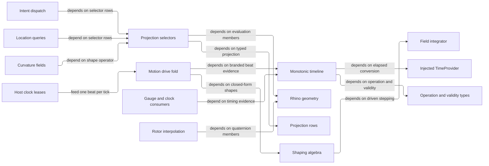

# [RASM_PARAMETRIC_PROJECTIONS]

`CurveProjection`, `SurfaceProjection`, and `ConeProjection` own Rhino-native parameter-addressed evaluation; the host-neutral owners beside them govern rotor interpolation, the shaping algebra a drive samples, provider-relative time, and the one sampled-motion fold every host clock lease feeds. Each selector drains one `Project<TOut>` gate into `ResultProjection.Raw`, every captured clock value stays branded to the injected `TimeProvider` timeline that minted it, and `MotionDrive` answers one beat with one sample and one continuation verdict while the timer attachment, the run-loop lifecycle, and the host invalidation stay at the boundary that owns them.

Every fallible read stays on the `Op`-keyed `Fin<T>` result: Rhino-read material admits through the Rhino acceptance oracle, the host-neutral owners through their own validity evidence. Range guards read `Band` rows and model-space thresholds read `Context.For(lane)`; `ICapability`/`CapabilitySet` come from `Domain/validation`, `PositiveMagnitude`/`EpsilonPolicy`/`Band`/`RawAdmission` from `Numerics/atoms`, and `Duration` from NodaTime under a prelude alias because the injected LanguageExt global using binds the bare name to its schedule-stream span. Perceptual colour interpolation stays the `Numerics/atoms` `PerceptualColor`/`BlendPath` owner — a colour tween is an `Eased` script whose apply samples `PerceptualColor.Mix` at the eased parameter, never a fourth drive case.

## [01]-[INDEX]

- [02]-[SELECTORS]: `CurveProjection`, `SurfaceProjection`, `ConeProjection`, and the `SurfaceSpace` capsule — delegate-row `[SmartEnum<int>]` vocabularies, one `Project<TOut>` gate each, row-factory folds, and the `Admits` capability column replacing identity probes.
- [03]-[ROTORS]: `MotionInterpolation` — the branch's one quaternion-interpolation law over poses and directions.
- [04]-[SHAPES]: `Easing`, `BezierEase`, `CycleShape`/`CyclePosture`/`CyclePlan`, `SpringShape`, and `DecayShape` — the closed-form shaping algebra a drive samples and a host token names as values.
- [05]-[TIMELINE]: `IGaugeLane`, `GaugedSpan<TLane>`, `MonotonicTimeline`, `MonotonicStamp`, `BeatSeed`, and `MonotonicBeat` — the one gauged span and the one branded beat chain.
- [06]-[MOTION]: `MotionConcession`, `PaceBand`, `SettleBand`, `MotionPosture`, `MotionScript`, `MotionSample`, and `MotionDrive` — the one sampled-motion fold both host boundaries pace.

## [02]-[SELECTORS]

- Owner: `CurveProjection` `[SmartEnum<int>]` — a row vocabulary over one `[UseDelegateFromConstructor]` `Sample(Curve, double, Context, Op)` column and the `Admits` capability column. `Vector(key, admits, sample)` owns vector admission, `FrameRow(key, perpendicular, project)` owns moving and sweep-frame recovery with axis projection, `TorsionRow(key, side)` owns third-order Frenet torsion with the kink-evaluation side as its column, and the arc-length row owns the domain-length call.
- Owner: `SurfaceProjection` `[SmartEnum<int>]` — a row vocabulary over `Sample(Surface, Point2d, Context, Op)`. `WithCurvature` scopes every disposable `SurfaceCurvature` projection on the `Lease` carrier, `Derivatives(key, project)` derives the first-fundamental forms from one `Surface.Evaluate(u, v, numberDerivatives: 1, ...)` call, and `ShapeOperator` remains the sole second-fundamental-form owner.
- Owner: `ConeProjection` `[SmartEnum<int>]` — an accessor-row vocabulary over one `Sample(VectorCone)` column: half angle, solid angle, axis, apex, and the `Spread` beam-radius-per-unit-distance scalar a spotlight or capture boundary otherwise re-derives with inline trig. `VectorIntent.Cone(cone, mode)` carries the row as its modality discriminant, which an instance accessor on `VectorCone` cannot replace.
- Owner: `SurfaceSpace` `readonly record struct` — the validated `Surface` + `Context` capsule: `Of(Surface, Context, Op?)` admits once (context present, surface non-null and `IsValid`), `Sample<TOut>(SurfaceProjection, double u, double v, Op)` delegates to the selector gate with the captured tolerance. `Sample` is internal, so the `Domain/results` threading law requires the key and `Processing/intent` `surfaceCase` supplies it; `Spatial/support` owns `SupportSpace` closest-point over ANY geometry while `SurfaceSpace` owns parameter-addressed evaluation on a typed surface, `VectorIntent.SurfaceCase` the shared wire.
- Entry: each selector exposes exactly one `internal Fin<TOut> Project<TOut>(...)` gate — `CurveProjection.Project<TOut>(Curve, double, Context, Op)` admits the curve (non-null, `IsValid`, `Domain.IncludesParameter`), samples the row, and drains `ResultProjection.Raw<TOut>(raw, Some(context), key, owner: typeof(CurveProjection), admits: Admits)`; `SurfaceProjection.Project<TOut>(Surface, double u, double v, Context, Op)` admits the surface, normalizes `(u,v)` through the `Domain/evaluation` `SurfaceUv`, samples, and drains the same fold; `ConeProjection.Project<TOut>(VectorCone, Op)` drains context-free. No per-row public methods, no output-type overloads — the raw→typed step is the row's.
- Law: magnitude admission is ROW DATA on a `CapabilitySet<RawAdmission>` column, never an identity probe and never a boolean beside the payload: the `ReferenceEquals(this, Curvature)` special case and the `bool admitsVectorMagnitude` knob it fed are both the deleted form, and a second conditional raw arm is one more `RawAdmission` row the same column already carries.
- Packages: RhinoCommon (`Curve.TangentAt`/`CurvatureAt`/`FrameAt`/`PerpendicularFrameAt`/`DerivativeAt(t, derivativeCount, CurveEvaluationSide)`/`GetLength(fractionalTolerance, subdomain)`/`Domain.IncludesParameter`; `CurveEvaluationSide.Default`/`Below`/`Above`; `Surface.CurvatureAt`/`PointAt`/`Evaluate`; `SurfaceCurvature.Kappa`/`Direction`/`OsculatingCircle`/`MaximumPrincipalCurvature`/`MinimumPrincipalCurvature`/`IsSet` — an `IDisposable` bundle; `Interval`, `Circle.IsValid`, `Vector3d.CrossProduct`/`IsValid`/`IsTiny`), Thinktecture.Runtime.Extensions (`[SmartEnum<int>]`, `[UseDelegateFromConstructor]`), LanguageExt.Core (`Fin`/`Option`/`guard`/`Optional`), `Domain/results` (`Op`, `Lease<T>`), `Domain/validation` (`Admit.Plane`, `CapabilitySet<T>`), `Domain/context` (`Context.For`), `Domain/evaluation` (`NormalAt`/`FrameAt`/`SurfaceUv`), `Domain/stats` (`ScalarMetric`), `Numerics/atoms` (`ResultProjection.Raw`, `RawAdmission`, `Direction.Of`, `Dimension`, `VectorCone`, `EpsilonPolicy`), `Numerics/matrix` (`SymmetricMatrix.Of`, `Matrix.Of`).
- Growth: a new curve or surface probe is one row through an existing factory fold or a direct constructor where the read is scalar-shaped; a new derivative form is one `Derivatives(...)` row; a new output type for an existing row is a `ProjectionRow` addition in the `Numerics/atoms` rows, never a selector edit. Existing selector gates absorb every row extension.
- Boundary: the selector family is the ONE row vocabulary for parameter-addressed evaluation behind the intent API — a per-output `CurveEvaluator`/`SurfaceAnalyzer` method family is the named defect collapsed here, and a row exists where evaluation carries ROW SEMANTICS (validity gating, magnitude admission, moving-vs-sweep frame choice, the curvature-bundle lease, the derivative fold); `Domain/evaluation` is the shared derivation floor both these rows and the `Parametric/locate` arms compose — an arm re-implementing row semantics beside the row is the killed duplicate, while a `Parametric/locate` surface arm reading the floor directly (point/frame/normal, UV pre-normalized) is lawful composition; `SurfaceProjection.ShapeOperator` is the sole second-fundamental-form assembly, `TensorField.Curvature` composes its `Project` and a second `k·d⊗d` assembly is the named double-owner defect; rows sample the LIVE Rhino object under the caller's lease (`Parametric/locate` inside `Lease<Curve>`/`Lease<Surface>`, `VectorIntent.CurveCase` holding the reference) and never duplicate, cache, or outlive their geometry; `SurfaceCurvature` is disposable host memory, so every bundle read runs inside `Lease<SurfaceCurvature>.Owned(...).Use(...)` and an escaping bundle is the named leak defect; the `Domain/evaluation` family owns closest-point/normal/frame over ARBITRARY geometry while these selectors own only parameter-addressed evaluation on an already-typed `Curve`/`Surface`, so routing a closest-point through a selector is the altitude violation.

```csharp
// --- [IMPORTS] -------------------------------------------------------------------------
using Rasm.Domain;
using Rasm.Numerics;
using Thinktecture;
using Dimension = Rasm.Numerics.Dimension;
using Matrix = Rasm.Numerics.Matrix;

namespace Rasm.Parametric;

// --- [TYPES] ---------------------------------------------------------------------------
[SmartEnum<int>]
public sealed partial class CurveProjection {
    public static readonly CurveProjection Tangent = Vector(key: 0, admits: CapabilitySet<RawAdmission>.None, sample: static (curve, t) => curve.TangentAt(t: t));
    public static readonly CurveProjection Curvature = Vector(key: 1, admits: CapabilitySet<RawAdmission>.Of(RawAdmission.VectorMagnitude), sample: static (curve, t) => curve.CurvatureAt(t: t));
    public static readonly CurveProjection Frame = FrameRow(key: 2, perpendicular: false, project: static frame => frame);
    public static readonly CurveProjection PerpendicularFrame = FrameRow(key: 3, perpendicular: true, project: static frame => frame);
    public static readonly CurveProjection ArcLength = new(key: 4, admits: CapabilitySet<RawAdmission>.None,
        sample: static (curve, t, context, key) => curve.GetLength(fractionalTolerance: context.For(lane: ToleranceLane.Fraction).Value, subdomain: new Interval(curve.Domain.T0, t)) switch {
            double length when RhinoMath.IsValidDouble(x: length) && (length > 0.0 || curve.Domain.NormalizedParameterAt(t) <= context.For(lane: ToleranceLane.Fraction).Value) => Fin.Succ((object)length),
            _ => Fin.Fail<object>(key.InvalidResult()),
        });
    public static readonly CurveProjection FrameNormal = FrameRow(key: 5, perpendicular: false, project: static frame => frame.YAxis);
    public static readonly CurveProjection FrameBinormal = FrameRow(key: 6, perpendicular: false, project: static frame => frame.ZAxis);
    public static readonly CurveProjection PerpendicularNormal = FrameRow(key: 7, perpendicular: true, project: static frame => frame.YAxis);
    public static readonly CurveProjection PerpendicularBinormal = FrameRow(key: 8, perpendicular: true, project: static frame => frame.ZAxis);
    public static readonly CurveProjection Torsion = TorsionRow(key: 9, side: CurveEvaluationSide.Default);
    public static readonly CurveProjection TorsionBelow = TorsionRow(key: 10, side: CurveEvaluationSide.Below);
    public static readonly CurveProjection TorsionAbove = TorsionRow(key: 11, side: CurveEvaluationSide.Above);

    public CapabilitySet<RawAdmission> Admits { get; }
    [UseDelegateFromConstructor] private partial Fin<object> Sample(Curve curve, double parameter, Context context, Op key);

    internal Fin<TOut> Project<TOut>(Curve curve, double parameter, Context context, Op key) =>
        from active in Optional(curve).ToFin(key.InvalidInput())
        from _ in guard(active.IsValid && active.Domain.IncludesParameter(t: parameter), key.InvalidInput())
        from raw in Sample(curve: active, parameter: parameter, context: context, key: key).BindFail(_ => Fin.Fail<object>(key.InvalidResult()))
        from output in ResultProjection.Raw<TOut>(raw: raw, context: Some(context), key: key, owner: typeof(CurveProjection), admits: Admits)
        select output;

    private static CurveProjection Vector(int key, CapabilitySet<RawAdmission> admits, Func<Curve, double, Vector3d> sample) =>
        new(key: key, admits: admits, sample: (curve, t, _, op) => sample(arg1: curve, arg2: t) switch {
            Vector3d vector when vector.IsValid && (admits.Admits(RawAdmission.VectorMagnitude) || !vector.IsTiny()) => Fin.Succ((object)vector),
            _ => Fin.Fail<object>(op.InvalidResult()),
        });
    private static CurveProjection TorsionRow(int key, CurveEvaluationSide side) =>
        new(key: key, admits: CapabilitySet<RawAdmission>.None, sample: (curve, t, _, op) => curve.DerivativeAt(t: t, derivativeCount: 3, side: side) switch {
            [_, var d1, var d2, var d3] when Vector3d.CrossProduct(a: d1, b: d2) is var binormal
                && binormal.SquareLength > EpsilonPolicy.ZeroTolerance =>
                Fin.Succ((object)((binormal * d3) / binormal.SquareLength)),
            _ => Fin.Fail<object>(op.InvalidResult()),
        });
    private static CurveProjection FrameRow(int key, bool perpendicular, Func<Plane, object> project) =>
        new(key: key, admits: CapabilitySet<RawAdmission>.None, sample: (curve, t, _, op) => perpendicular switch {
            true => curve.PerpendicularFrameAt(t: t, plane: out Plane frame) ? Fin.Succ(project(arg: frame)) : Fin.Fail<object>(op.InvalidResult()),
            false => curve.FrameAt(t: t, plane: out Plane frame) ? Fin.Succ(project(arg: frame)) : Fin.Fail<object>(op.InvalidResult()),
        });
}

[SmartEnum<int>]
public sealed partial class SurfaceProjection {
    public static readonly SurfaceProjection PrincipalCurvatures = new(key: 0, sample: static (surface, uv, _, key) => WithCurvature(surface: surface, uv: uv, key: key, project: static sc => Fin.Succ((object)Seq(sc.MaximumPrincipalCurvature, sc.MinimumPrincipalCurvature))));
    public static readonly SurfaceProjection Gaussian = new(key: 1, sample: static (surface, uv, _, key) => WithCurvature(surface: surface, uv: uv, key: key, project: sc => ScalarMetric.Gaussian.Of(value: sc, key: key).Map(static value => (object)value)));
    public static readonly SurfaceProjection Mean = new(key: 2, sample: static (surface, uv, _, key) => WithCurvature(surface: surface, uv: uv, key: key, project: sc => ScalarMetric.Mean.Of(value: sc, key: key).Map(static value => (object)value)));
    public static readonly SurfaceProjection MaximumOsculatingCircle = Osculating(key: 3, direction: 0);
    public static readonly SurfaceProjection Normal = new(key: 4, sample: static (surface, uv, _, key) => Evaluation.NormalAt(surface: surface, uv: uv, key: key).Map(static normal => (object)normal));
    public static readonly SurfaceProjection ShapeOperator = new(key: 5, sample: static (surface, uv, context, key) => WithCurvature(surface: surface, uv: uv, key: key, project: sc => ShapeOperatorOf(curvature: sc, context: context, key: key).Map(static value => (object)value)));
    public static readonly SurfaceProjection MinimumOsculatingCircle = Osculating(key: 6, direction: 1);
    public static readonly SurfaceProjection Point = new(key: 7, sample: static (surface, uv, _, key) => key.AcceptValue(value: surface.PointAt(u: uv.X, v: uv.Y)).Map(static point => (object)point));
    public static readonly SurfaceProjection Frame = new(key: 8, sample: static (surface, uv, _, key) => Evaluation.FrameAt(surface: surface, uv: uv, key: key).Map(static value => (object)value));
    public static readonly SurfaceProjection UvFrame = Derivatives(key: 9, project: static (surface, uv, d, _, key) => OrientedFrame(surface: surface, uv: uv, frame: new Plane(origin: d.Point, xDirection: d.Du, yDirection: d.Dv), key: key).Map(static value => (object)value));
    public static readonly SurfaceProjection Jacobian = Derivatives(key: 10, project: static (_, _, d, _, key) => Matrix.Of(rows: Dimension.Create(value: 3), cols: Dimension.Create(value: 2), entries: [d.Du.X, d.Dv.X, d.Du.Y, d.Dv.Y, d.Du.Z, d.Dv.Z], key: key).Map(static value => (object)value));
    public static readonly SurfaceProjection Metric = Derivatives(key: 11, project: static (_, _, d, _, key) => SymmetricMatrix.Of(dim: Dimension.Create(value: 2), upper: [d.Du * d.Du, d.Du * d.Dv, d.Dv * d.Dv], key: key).Map(static value => (object)value));
    public static readonly SurfaceProjection AreaScale = Derivatives(key: 12, project: static (_, _, d, _, key) => key.AcceptValue(value: Vector3d.CrossProduct(a: d.Du, b: d.Dv).Length).Map(static value => (object)value));
    public static readonly SurfaceProjection MeanCurvatureVector = new(key: 13, sample: static (surface, uv, _, key) =>
        WithCurvature(surface: surface, uv: uv, key: key, project: sc => ScalarMetric.Mean.Of(value: sc, key: key)
            .Bind(mean => Evaluation.NormalAt(surface: surface, uv: uv, key: key).Map(normal => (object)(normal * mean)))));

    [UseDelegateFromConstructor] private partial Fin<object> Sample(Surface surface, Point2d uv, Context context, Op key);

    internal Fin<TOut> Project<TOut>(Surface surface, double u, double v, Context context, Op key) =>
        from active in Optional(surface).ToFin(key.InvalidInput())
        from _ in guard(active.IsValid, key.InvalidInput())
        from uv in Evaluation.SurfaceUv(surface: active, uv: new Point2d(x: u, y: v), context: context, key: key)
        from raw in Sample(surface: active, uv: uv, context: context, key: key).BindFail(_ => Fin.Fail<object>(key.InvalidResult()))
        from output in ResultProjection.Raw<TOut>(raw: raw, context: Some(context), key: key, owner: typeof(SurfaceProjection), admits: CapabilitySet<RawAdmission>.None)
        select output;

    private static Fin<T> WithCurvature<T>(Surface surface, Point2d uv, Op key, Func<SurfaceCurvature, Fin<T>> project) =>
        Optional(surface.CurvatureAt(u: uv.X, v: uv.Y)).ToFin(key.InvalidResult())
            .Bind(sc => new Lease<SurfaceCurvature>.Owned(Value: sc)
                .Use(bundle => bundle.IsSet ? project(arg: bundle) : Fin.Fail<T>(key.InvalidResult())));

    private static Fin<SymmetricMatrix> ShapeOperatorOf(SurfaceCurvature curvature, Context context, Op key) {
        double k0 = curvature.Kappa(direction: 0);
        double k1 = curvature.Kappa(direction: 1);
        return from d0 in Direction.Of(value: curvature.Direction(direction: 0), context: context, key: key)
               from d1 in Direction.Of(value: curvature.Direction(direction: 1), context: context, key: key)
               from matrix in SymmetricMatrix.Of(
                   dim: Dimension.Create(value: 3),
                   upper: [
                       (k0 * d0.Value.X * d0.Value.X) + (k1 * d1.Value.X * d1.Value.X),
                       (k0 * d0.Value.X * d0.Value.Y) + (k1 * d1.Value.X * d1.Value.Y),
                       (k0 * d0.Value.X * d0.Value.Z) + (k1 * d1.Value.X * d1.Value.Z),
                       (k0 * d0.Value.Y * d0.Value.Y) + (k1 * d1.Value.Y * d1.Value.Y),
                       (k0 * d0.Value.Y * d0.Value.Z) + (k1 * d1.Value.Y * d1.Value.Z),
                       (k0 * d0.Value.Z * d0.Value.Z) + (k1 * d1.Value.Z * d1.Value.Z),
                   ],
                   key: key)
               select matrix;
    }
    private static Fin<(Point3d Point, Vector3d Du, Vector3d Dv)> SurfaceDerivatives(Surface surface, Point2d uv, Op key) =>
        surface.Evaluate(u: uv.X, v: uv.Y, numberDerivatives: 1, point: out Point3d point, derivatives: out Vector3d[] derivatives)
        && derivatives is { Length: >= 2 }
            ? from validPoint in key.AcceptValue(value: point)
              from du in key.AcceptValue(value: derivatives[0])
              from dv in key.AcceptValue(value: derivatives[1])
              select (Point: validPoint, Du: du, Dv: dv)
            : Fin.Fail<(Point3d Point, Vector3d Du, Vector3d Dv)>(key.InvalidResult());
    private static Fin<Plane> OrientedFrame(Surface surface, Point2d uv, Plane frame, Op key) =>
        from basis in Admit.Plane(basis: frame, key: key)
        from normal in Evaluation.NormalAt(surface: surface, uv: uv, key: key)
        from oriented in Admit.Plane(
            basis: basis.ZAxis * normal >= 0.0 ? basis : new Plane(origin: basis.Origin, xDirection: basis.XAxis, yDirection: -basis.YAxis),
            key: key)
        select oriented;
    private static SurfaceProjection Osculating(int key, int direction) =>
        new(key: key, sample: (surface, uv, _, op) => WithCurvature(surface: surface, uv: uv, key: op, project: sc => sc.OsculatingCircle(direction) switch {
            Circle circle when circle.IsValid => Fin.Succ((object)circle),
            _ => Fin.Fail<object>(op.InvalidResult()),
        }));
    private static SurfaceProjection Derivatives(int key, Func<Surface, Point2d, (Point3d Point, Vector3d Du, Vector3d Dv), Context, Op, Fin<object>> project) =>
        new(key: key, sample: (surface, uv, context, op) => SurfaceDerivatives(surface: surface, uv: uv, key: op).Bind(d => project(arg1: surface, arg2: uv, arg3: d, arg4: context, arg5: op)));
}

[SmartEnum<int>]
public sealed partial class ConeProjection {
    public static readonly ConeProjection HalfAngle = new(key: 0, sample: static (cone, _) => Fin.Succ<object>(cone.HalfAngle));
    public static readonly ConeProjection SolidAngle = new(key: 1, sample: static (cone, _) => Fin.Succ<object>(cone.SolidAngle));
    public static readonly ConeProjection Axis = new(key: 2, sample: static (cone, _) => Fin.Succ<object>(cone.Axis));
    public static readonly ConeProjection Apex = new(key: 3, sample: static (cone, _) => Fin.Succ<object>(cone.Apex));
    public static readonly ConeProjection Spread = new(key: 4, sample: static (cone, key) =>
        cone.HalfAngle.Value < Math.PI / 2.0
            ? Fin.Succ<object>(Math.Tan(cone.HalfAngle.Value))
            : Fin.Fail<object>(key.InvalidResult()));
    [UseDelegateFromConstructor] private partial Fin<object> Sample(VectorCone cone, Op key);
    internal Fin<TOut> Project<TOut>(VectorCone cone, Op key) =>
        Sample(cone: cone, key: key).Bind(raw =>
            ResultProjection.Raw<TOut>(raw: raw, context: Option<Context>.None, key: key, owner: typeof(ConeProjection), admits: CapabilitySet<RawAdmission>.None));
}

// --- [MODELS] --------------------------------------------------------------------------
[StructLayout(LayoutKind.Auto)]
public readonly record struct SurfaceSpace {
    private SurfaceSpace(Surface native, Context tolerance) { Native = native; Tolerance = tolerance; }
    public Surface Native { get; }
    public Context Tolerance { get; }
    public static Fin<SurfaceSpace> Of(Surface native, Context context, Op? key = null) {
        Op op = key.OrDefault();
        return from ctx in Optional(context).ToFin(op.MissingContext())
               from active in Optional(native).Filter(static surface => surface.IsValid).ToFin(op.InvalidInput())
               select new SurfaceSpace(native: active, tolerance: ctx);
    }
    internal Fin<TOut> Sample<TOut>(SurfaceProjection projection, double u, double v, Op key) {
        (Surface native, Context tolerance) = (Native, Tolerance);
        return Optional(projection).ToFin(key.InvalidInput()).Bind(mode => mode.Project<TOut>(surface: native, u: u, v: v, context: tolerance, key: key));
    }
}
```

## [03]-[ROTORS]

- Owner: `MotionInterpolation` `[SmartEnum<int>]` — `Linear` (key 0, `Quaternion.Lerp`) and `Slerp` (key 1, `Quaternion.Slerp`) over ONE `[UseDelegateFromConstructor]` `Combine(Quaternion, Quaternion, double)` column; both interpolation surfaces derive from that single column (`DERIVED_LOGIC`). `Interpolate(Plane a, Plane b, UnitInterval t, Context, Op)` short-circuits on coincidence, rotates `Quaternion.Rotation(Plane.WorldXY, …)` rotors, and interpolates the origin onto the rotated axes; `Rotate(Direction a, Direction b, UnitInterval t, Context, Op)` takes the π rotor about `VectorFrame.SeedPerpendicular` for the antiparallel pair (`IsParallelTo == -1` under the Angle lane) and the shortest-arc rotor from `Transform.Rotation(...).GetQuaternion(...)` otherwise. `Slerp` is the geodesic row; `Linear` yields nlerp on directions (renormalized by `Direction.Of` admission) and screw-free frame lerp on poses.
- Law: pose coincidence is a MODEL-SPACE question, so the short-circuit reads `Context.For(ToleranceLane.PlaneDistance)` and never a dimensionless floor — a millimetre model and a metre model disagree about which two poses are the same pose, and a fixed epsilon answers for exactly one of them.
- Entry: `Interpolate` and `Rotate` are the branch's one rotor-interpolation law — public members the intent dispatch composes and every host-stratum rotor consumer calls directly.
- Packages: RhinoCommon (`Quaternion.Lerp`/`Slerp`/`Rotation`/`Identity`/`GetRotation`/`Rotate`, `Transform.Rotation`, `Plane.EpsilonEquals`, `Vector3d.IsParallelTo`), Thinktecture.Runtime.Extensions, LanguageExt.Core, `Domain/validation` (`Admit.Plane`), `Domain/context` (`Context.For`), `Numerics/atoms` (`Direction`, `UnitInterval`, `VectorFrame.SeedPerpendicular`).
- Boundary: `MotionInterpolation` starts where rotation requires a quaternion, vector arithmetic staying on the admitted direction algebra; a per-consumer slerp beside it is the killed duplicate.

```csharp
// --- [IMPORTS] -------------------------------------------------------------------------
using Rasm.Domain;
using Rasm.Numerics;
using Thinktecture;

namespace Rasm.Parametric;

// --- [TYPES] ---------------------------------------------------------------------------
[SmartEnum<int>]
public sealed partial class MotionInterpolation {
    public static readonly MotionInterpolation Linear = new(key: 0, combine: static (a, b, t) => Quaternion.Lerp(a: a, b: b, t: t));
    public static readonly MotionInterpolation Slerp = new(key: 1, combine: static (a, b, t) => Quaternion.Slerp(a: a, b: b, t: t));
    [UseDelegateFromConstructor] private partial Quaternion Combine(Quaternion a, Quaternion b, double t);

    public Fin<Plane> Interpolate(Plane a, Plane b, UnitInterval t, Context context, Op key) =>
        from left in Admit.Plane(basis: a, key: key)
        from right in Admit.Plane(basis: b, key: key)
        from output in left.EpsilonEquals(other: right, epsilon: context.For(lane: ToleranceLane.PlaneDistance).Value)
            ? Fin.Succ(left)
            : Combine(a: Quaternion.Rotation(plane0: Plane.WorldXY, plane1: left), b: Quaternion.Rotation(plane0: Plane.WorldXY, plane1: right), t: t.Value)
                  .GetRotation(plane: out Plane oriented) && oriented.IsValid
                ? Admit.Plane(basis: new Plane(origin: left.Origin + ((right.Origin - left.Origin) * t.Value), xDirection: oriented.XAxis, yDirection: oriented.YAxis), key: key)
                : Fin.Fail<Plane>(key.InvalidResult())
        select output;

    public Fin<Direction> Rotate(Direction a, Direction b, UnitInterval t, Context context, Op key) =>
        from rotor in a.Value.IsParallelTo(other: b.Value, angleTolerance: context.For(lane: ToleranceLane.Orientation).Value) switch {
            -1 => Fin.Succ(Quaternion.Rotation(Math.PI, VectorFrame.SeedPerpendicular(axis: a.Value))),
            _ => Transform.Rotation(startDirection: a.Value, endDirection: b.Value, rotationCenter: Point3d.Origin).GetQuaternion(quaternion: out Quaternion target)
                ? Fin.Succ(target)
                : Fin.Fail<Quaternion>(key.InvalidResult()),
        }
        from rotated in Direction.Of(value: Combine(a: Quaternion.Identity, b: rotor, t: t.Value).Rotate(v: a.Value), context: context, key: key)
        select rotated;
}
```

## [04]-[SHAPES]

- Owner: `DampingRegime` `[SmartEnum<int>]` — `Critical`/`Under`/`Over` over two `[UseDelegateFromConstructor]` columns, `Respond` the closed-form response and `Envelope` its decaying bound, with `Of(zeta)` owning the critical window; both spring readers take a ROW.
- Owner: `Easing` `[SmartEnum<int>]` — a family-and-polarity row product over one `[UseDelegateFromConstructor]` `Curve(double)` column. Each named row composes a family kernel with `In`, `Out`, or `InOut`, so polarity behavior remains fold-owned. `Evaluate(UnitInterval t)` is the one read: input arrives admitted, output is unclamped because overshooting kernels legitimately leave the unit band and the consumer's carrier owns its own range semantics.
- Owner: `BezierEase` readonly record struct — the imported-token easing carrier: `Of(x1, y1, x2, y2, Op?)` admits a CSS-convention cubic Bezier (control abscissae clamped to the unit band so `x(u)` stays monotone and invertible), `Evaluate(UnitInterval t, Op?)` inverts `x(u) = t` by a BUDGETED Newton-with-bisection fallback and reads `y(u)`, an exhausted budget refusing in the result rather than publishing its last iterate.
- Owner: `CycleShape` `[SmartEnum<int>]` owns the traversal a repeat performs and `CyclePosture` `[SmartEnum<int>]` where one iteration faces; `CyclePlan` readonly record struct owns repeat arithmetic: `Of(Option<int> count, CycleShape shape, Op?)` admits the plan (`None` count is unbounded, a bounded count is at least one), `Phase(Duration elapsed, Duration period, Op)` folds wall progress onto `CyclePhase`, and `Terminal` reads the posture a collapsed or completed run rests at.
- Owner: `SpringShape` readonly record struct — the analytic damped-spring owner. `Of(angularFrequency > 0, dampingRatio >= 0)` admits the shape and `OfResponse(response, dampingFraction, key)` is the second admission — the (response, damping-fraction) parameterization design tokens spell, mapping omega = `Math.Tau`/response and zeta = dampingFraction onto the same gate. `Evaluate(origin, target, elapsed, key)` returns the closed-form response the `DampingRegime` row `zeta` resolves to, `Step(origin, target, h, integrator, key)` runs ONE `RungeKuttaIntegrator.Step` over the page-declared `SpringShape.Module` for a driven target the closed form's fixed target does not hold between frames, and `Settle(origin, target, band, key)` projects the duration after which the response stays inside the band's position rung. `SpringState` carries position and velocity as one evidence value.
- Owner: `DecayShape` readonly record struct — the inertial twin of the damped spring for motion released into FREE decay with no target: `Of(0 < retention < 1)` admits the fraction of velocity surviving one time unit, `Rate` is its continuous decay constant, `Project(velocity, key)` returns the resting displacement a release travels, `Advance(origin, velocity, elapsed, key)` the position under way, and `Settle(velocity, epsilon, key)` the duration until the remaining travel falls inside epsilon. Releases approaching a chosen stop hand their live velocity to `SpringShape`, so the two owners compose as decay-then-approach and neither re-derives the other.
- Cases: `Easing` 28 rows — the closed CSS `<easing-function>` named set over Robert Penner's equation families (quad, cubic, quint, sine, expo, circ, back, elastic, bounce) crossed with the three polarities, and `Linear`; the upstream is a published vocabulary, so the rows are data and a per-occurrence curve rides `BezierEase` instead of a new row. `CycleShape` — `Repeat`, `Yoyo`. `CyclePosture` — `Forward`, `Reversed`, `Completed`.
- Law: the two `CyclePhase` booleans are gone: `CycleShape` answers which way an iteration faces and `CyclePosture.Place` mirrors the local position for that facing, so the `reversed ? 1 - local : local` ternary and the completion clamp are both row data and neither re-appears at a consumer.
- Law: `CycleShape`'s posture column is a DELEGATE, so the row's reference to `CyclePosture` resolves at call time — an eager column reads a sibling generated roster mid-initialization.
- Law: the time axis is NodaTime `Duration` at every public member: a bare `double` seconds cannot say whether it is a period, an elapsed span, or a rate, and the three met at every host pump. Interior closed forms read `TotalSeconds` once.
- Law: `Settle` refuses at zero damping rather than answering an infinity, and `DecayShape` refuses a retention at or outside the open unit interval for the same reason at its own rate — an undamped shape has no decaying envelope to invert. Both retention bounds are `Band` rows read through ONE member, so no factory spells a range its own reader disagrees with.
- Law: independent admission columns ACCUMULATE. `BezierEase.Of`'s four coordinates, `SpringShape.Of`'s two, `CyclePlan.Of`'s pair, and `DecayShape.Advance`'s three each fan in applicatively, so an imported design token with three bad values reports three defects instead of the first.
- Law: every bounded iterate on this page carries its budget as a column and refuses on exhaustion. NAMED LOSS: `BezierEase.Evaluate`'s bare `double` return and the twelve-probe claim its own bisection fallback refuted — twelve halvings reach 2.4e-4, four orders above the convergence band the comment asserted.
- Entry: `Easing.Evaluate`, `BezierEase.Of`/`Evaluate`, `CyclePlan.Of`/`Phase`/`Terminal`, `SpringShape.Of`/`OfResponse`/`Evaluate`/`Step`/`Settle`, and `DecayShape.Of`/`Project`/`Advance`/`Settle` are the public shaping surface, each fallible operation resolving one `Op` key and returning `Fin<T>`.
- Packages: Thinktecture.Runtime.Extensions (`[SmartEnum<int>]`, `[UseDelegateFromConstructor]`), LanguageExt.Core (`Fin`, `Option`, `guard`), NodaTime (`Duration.FromSeconds`/`TotalSeconds`/`Zero`), `Numerics/atoms` (`UnitInterval`, `PositiveMagnitude`, `EpsilonPolicy`), `Numerics/integrate` (`RungeKuttaIntegrator`, `IntegrationModule`, `IntegrationStep`).
- Growth: a new easing family is one kernel folded through the existing polarities, and a value-parameterized curve rides `BezierEase`, never a vocabulary row; a new physical modality is one shape struct beside `SpringShape` and `DecayShape` carrying its own admission and its own closed forms, never a per-consumer integration loop.
- Boundary: the two settling reads partition by QUESTION — `Settle` answers how long a run must be BOUND before it starts, and `SettleBand.Settles` (`[06]`) answers when a stepped drive may STOP. That projection stays conservative because an early answer truncates a tail, while the band test reads the state it already holds; a consumer computing a duration from a band test, or stepping until a projected duration expires, has crossed the two.

```csharp
// --- [IMPORTS] -------------------------------------------------------------------------
using Rasm.Domain;
using Rasm.Numerics;
using Thinktecture;
using Duration = NodaTime.Duration;

namespace Rasm.Parametric;

// --- [TYPES] ---------------------------------------------------------------------------
[SmartEnum<int>]
public sealed partial class Easing {
    public static readonly Easing Linear = new(key: 0, curve: static t => t);
    public static readonly Easing QuadIn = In(key: 1, family: Power(exponent: 2.0));
    public static readonly Easing QuadOut = Out(key: 2, family: Power(exponent: 2.0));
    public static readonly Easing QuadInOut = InOut(key: 3, family: Power(exponent: 2.0));
    public static readonly Easing CubicIn = In(key: 4, family: Power(exponent: 3.0));
    public static readonly Easing CubicOut = Out(key: 5, family: Power(exponent: 3.0));
    public static readonly Easing CubicInOut = InOut(key: 6, family: Power(exponent: 3.0));
    public static readonly Easing QuintIn = In(key: 7, family: Power(exponent: 5.0));
    public static readonly Easing QuintOut = Out(key: 8, family: Power(exponent: 5.0));
    public static readonly Easing QuintInOut = InOut(key: 9, family: Power(exponent: 5.0));
    public static readonly Easing SineIn = In(key: 10, family: Sine);
    public static readonly Easing SineOut = Out(key: 11, family: Sine);
    public static readonly Easing SineInOut = InOut(key: 12, family: Sine);
    public static readonly Easing ExpoIn = In(key: 13, family: Expo);
    public static readonly Easing ExpoOut = Out(key: 14, family: Expo);
    public static readonly Easing ExpoInOut = InOut(key: 15, family: Expo);
    public static readonly Easing CircIn = In(key: 16, family: Circ);
    public static readonly Easing CircOut = Out(key: 17, family: Circ);
    public static readonly Easing CircInOut = InOut(key: 18, family: Circ);
    public static readonly Easing BackIn = In(key: 19, family: Back(overshoot: BackOvershoot));
    public static readonly Easing BackOut = Out(key: 20, family: Back(overshoot: BackOvershoot));
    public static readonly Easing BackInOut = InOut(key: 21, family: Back(overshoot: BackOvershoot));
    public static readonly Easing ElasticIn = In(key: 22, family: Elastic(amplitude: ElasticAmplitude, period: ElasticPeriod));
    public static readonly Easing ElasticOut = Out(key: 23, family: Elastic(amplitude: ElasticAmplitude, period: ElasticPeriod));
    public static readonly Easing ElasticInOut = InOut(key: 24, family: Elastic(amplitude: ElasticAmplitude, period: ElasticPeriod));
    public static readonly Easing BounceIn = In(key: 25, family: Bounce);
    public static readonly Easing BounceOut = Out(key: 26, family: Bounce);
    public static readonly Easing BounceInOut = InOut(key: 27, family: Bounce);

    private const double BackOvershoot = 1.70158;
    private const double ElasticAmplitude = 1.0;
    private const double ElasticPeriod = 0.3;

    [UseDelegateFromConstructor] private partial double Curve(double t);
    public double Evaluate(UnitInterval t) => Curve(t: t.Value);

    private static Easing In(int key, Func<double, double> family) => new(key: key, curve: family);
    private static Easing Out(int key, Func<double, double> family) => new(key: key, curve: t => 1.0 - family(arg: 1.0 - t));
    private static Easing InOut(int key, Func<double, double> family) =>
        new(key: key, curve: t => t < 0.5 ? family(arg: 2.0 * t) / 2.0 : 1.0 - (family(arg: 2.0 - (2.0 * t)) / 2.0));
    private static Func<double, double> Power(double exponent) => t => Math.Pow(x: t, y: exponent);
    private static double Sine(double t) => 1.0 - Math.Cos(d: t * Math.PI / 2.0);
    private static double Expo(double t) => t <= 0.0 ? 0.0 : Math.Pow(x: 2.0, y: 10.0 * (t - 1.0));
    private static double Circ(double t) => 1.0 - Math.Sqrt(d: 1.0 - (t * t));
    private static Func<double, double> Back(double overshoot) => t => t * t * (((overshoot + 1.0) * t) - overshoot);
    private static Func<double, double> Elastic(double amplitude, double period) => t => t switch {
        <= 0.0 => 0.0,
        >= 1.0 => 1.0,
        _ => -(amplitude * Math.Pow(x: 2.0, y: 10.0 * (t - 1.0)) * Math.Sin(a: ((t - 1.0) - (period / (2.0 * Math.PI) * Math.Asin(d: 1.0 / amplitude))) * (2.0 * Math.PI) / period)),
    };
    private static double Bounce(double t) => 1.0 - BounceTail(t: 1.0 - t);
    private static readonly (double Edge, double Centre, double Lift)[] BounceArcs = [
        (1.0 / 2.75, 0.0, 0.0),
        (2.0 / 2.75, 1.5 / 2.75, 0.75),
        (2.5 / 2.75, 2.25 / 2.75, 0.9375),
        (double.PositiveInfinity, 2.625 / 2.75, 0.984375),
    ];
    private static double BounceTail(double t) {
        int at = 0;
        while (t >= BounceArcs[at].Edge) { at++; }
        return (7.5625 * (t - BounceArcs[at].Centre) * (t - BounceArcs[at].Centre)) + BounceArcs[at].Lift;
    }
}

[SmartEnum<int>]
public sealed partial class CycleShape {
    public static readonly CycleShape Repeat = new(key: 0, posture: static _ => CyclePosture.Forward);
    public static readonly CycleShape Yoyo = new(key: 1, posture: static iteration => (iteration % 2L) == 1L ? CyclePosture.Reversed : CyclePosture.Forward);
    [UseDelegateFromConstructor] public partial CyclePosture Posture(long iteration);
}

[SmartEnum<int>]
public sealed partial class CyclePosture {
    public static readonly CyclePosture Forward = new(key: 0, continues: true, place: static local => local);
    public static readonly CyclePosture Reversed = new(key: 1, continues: true, place: static local => 1.0 - local);
    public static readonly CyclePosture Completed = new(key: 2, continues: false, place: static local => local);
    public bool Continues { get; }
    [UseDelegateFromConstructor] public partial double Place(double local);
}

// --- [MODELS] --------------------------------------------------------------------------
[StructLayout(LayoutKind.Auto)]
public readonly record struct BezierEase(double X1, double Y1, double X2, double Y2, Dimension Probes) {
    public static readonly Dimension ProbeBudget = Dimension.Create(value: 64);

    public static Fin<BezierEase> Of(double x1, double y1, double x2, double y2, Op? key = null, Option<Dimension> probes = default) {
        Op op = key.OrDefault();
        return (op.Finite(value: x1).ToValidation(), op.Finite(value: y1).ToValidation(),
                op.Finite(value: x2).ToValidation(), op.Finite(value: y2).ToValidation())
            .Apply((a, b, c, d) => new BezierEase(
                X1: Math.Clamp(value: a, min: 0.0, max: 1.0), Y1: b,
                X2: Math.Clamp(value: c, min: 0.0, max: 1.0), Y2: d,
                Probes: probes.IfNone(noneValue: ProbeBudget)))
            .As().ToFin();
    }

    public Fin<double> Evaluate(UnitInterval t, Op? key = null) {
        Op op = key.OrDefault();
        (double x1, double x2, double y1, double y2, double target) = (X1, X2, Y1, Y2, t.Value);
        return Range(0, Probes.Value).FoldUntil(
                state: (U: target, Lo: 0.0, Hi: 1.0, Settled: Option<double>.None),
                f: (state, _) => {
                    double x = Axis(a: x1, b: x2, u: state.U) - target;
                    if (Math.Abs(value: x) <= EpsilonPolicy.SqrtEpsilon) { return (state.U, state.Lo, state.Hi, Some(state.U)); }
                    (double lo, double hi) = x > 0.0 ? (state.Lo, state.U) : (state.U, state.Hi);
                    double slope = AxisSlope(a: x1, b: x2, u: state.U);
                    return (slope > EpsilonPolicy.ZeroTolerance ? Math.Clamp(value: state.U - (x / slope), min: lo, max: hi) : (lo + hi) / 2.0,
                        lo, hi, Option<double>.None);
                },
                stateP: static state => state.Settled.IsSome)
            .Settled
            .Map(u => Axis(a: y1, b: y2, u: u))
            .ToFin(Fail: op.InvalidResult());
    }
    private static double Axis(double a, double b, double u) =>
        ((((1.0 - (3.0 * b) + (3.0 * a)) * u) + ((3.0 * b) - (6.0 * a))) * u + (3.0 * a)) * u;
    private static double AxisSlope(double a, double b, double u) =>
        (3.0 * (1.0 - (3.0 * b) + (3.0 * a)) * u * u) + (2.0 * ((3.0 * b) - (6.0 * a)) * u) + (3.0 * a);
}

[StructLayout(LayoutKind.Auto)]
public readonly record struct CyclePhase(long Iteration, UnitInterval Local, CyclePosture Posture) : IValidityEvidence {
    public bool IsValid => ValidityClaim.All(Iteration >= 0L, ValidityClaim.UnitInterval(value: Local.Value), Posture is not null);
}

[StructLayout(LayoutKind.Auto)]
public readonly record struct CyclePlan(Option<int> Count, CycleShape Shape) {
    public static Fin<CyclePlan> Of(Option<int> count, CycleShape shape, Op? key = null) {
        Op op = key.OrDefault();
        return (op.Need(value: shape).ToValidation(),
                count.TraverseM(value => guard(value >= 1, op.InvalidInput()).ToFin().Map(_ => value)).As().ToValidation())
            .Apply(static (traversal, bounded) => new CyclePlan(Count: bounded, Shape: traversal)).As().ToFin();
    }
    public CyclePosture Terminal => Count.Match(Some: bounded => Shape.Posture(iteration: bounded - 1L), None: () => CyclePosture.Forward);
    public Fin<CyclePhase> Phase(Duration elapsed, Duration period, Op key) {
        CyclePlan plan = this;
        return from time in key.Finite(value: elapsed.TotalSeconds).Bind(value => guard(value >= 0.0, key.InvalidInput()).ToFin().Map(_ => value))
               from span in key.Positive(value: period.TotalSeconds)
               from progress in key.AcceptValue(value: time / span)
               let completed = plan.Count.Filter(bounded => progress >= bounded)
               from iteration in completed.Match(
                   Some: bounded => Fin.Succ((long)bounded - 1L),
                   None: () => guard(Math.Floor(d: progress) < long.MaxValue, key.InvalidResult()).ToFin()
                       .Map(_ => checked((long)Math.Floor(d: progress))))
               let facing = plan.Shape.Posture(iteration: iteration)
               from local in key.AcceptValidated<UnitInterval>(candidate: facing.Place(local: completed.IsSome ? 1.0 : progress - iteration))
               select new CyclePhase(Iteration: iteration, Local: local, Posture: completed.IsSome ? CyclePosture.Completed : facing);
    }
}

[StructLayout(LayoutKind.Auto)]
public readonly record struct SpringState(double Position, double Velocity) : IValidityEvidence {
    public bool IsValid => ValidityClaim.All(ValidityClaim.Finite(value: Position), ValidityClaim.Finite(value: Velocity));
}

[StructLayout(LayoutKind.Auto)]
public readonly record struct SpringShape(double AngularFrequency, double DampingRatio) : IValidityEvidence {
    public bool IsValid => ValidityClaim.All(ValidityClaim.Positive(value: AngularFrequency), ValidityClaim.Nonnegative(value: DampingRatio));

    public static IntegrationModule<SpringState, SpringState> Module { get; } = new(
        Add: static (state, h, delta) => new SpringState(Position: state.Position + (h * delta.Position), Velocity: state.Velocity + (h * delta.Velocity)),
        Scale: static (factor, delta) => new SpringState(Position: factor * delta.Position, Velocity: factor * delta.Velocity),
        Sum: static (left, right) => new SpringState(Position: left.Position + right.Position, Velocity: left.Velocity + right.Velocity),
        Norm: static delta => Math.Max(val1: Math.Abs(value: delta.Position), val2: Math.Abs(value: delta.Velocity)),
        Zero: new SpringState(Position: 0.0, Velocity: 0.0));

    public static Fin<SpringShape> Of(double angularFrequency, double dampingRatio, Op? key = null) {
        Op op = key.OrDefault();
        return (op.Positive(value: angularFrequency).ToValidation(),
                op.Finite(value: dampingRatio).Bind(value => guard(value >= 0.0, op.InvalidInput()).ToFin().Map(_ => value)).ToValidation())
            .Apply(static (omega, zeta) => new SpringShape(AngularFrequency: omega, DampingRatio: zeta)).As().ToFin();
    }

    public static Fin<SpringShape> OfResponse(double response, double dampingFraction, Op? key = null) {
        Op op = key.OrDefault();
        return from period in op.Positive(value: response)
               from shape in Of(angularFrequency: Math.Tau / period, dampingRatio: dampingFraction, key: op)
               select shape;
    }

    public Fin<SpringState> Evaluate(SpringState origin, double target, Duration elapsed, Op key) {
        (double omega, double zeta) = (AngularFrequency, DampingRatio);
        return from time in key.Finite(value: elapsed.TotalSeconds).Bind(value => guard(value >= 0.0, key.InvalidInput()).ToFin().Map(_ => value))
               from goal in key.Finite(value: target)
               from settled in key.AcceptValue(value: DampingRegime.Of(zeta: zeta)
                   .Respond(origin: origin, target: goal, omega: omega, zeta: zeta, t: time))
               from valid in guard(settled.IsValid, key.InvalidResult()).ToFin().Map(_ => settled)
               select valid;
    }

    public Fin<IntegrationStep<SpringState, SpringState>> Step(SpringState origin, double target, Duration h, RungeKuttaIntegrator integrator, Op key) {
        (double omega, double zeta) = (AngularFrequency, DampingRatio);
        return from active in RungeKuttaIntegrator.Admit(value: integrator, key: key)
               from span in key.Positive(value: h.TotalSeconds)
               from step in active.Step(
                   module: Module,
                   sample: state => key.AcceptValue(value: new SpringState(
                       Position: state.Velocity,
                       Velocity: -(2.0 * zeta * omega * state.Velocity) - (omega * omega * (state.Position - target)))),
                   state: origin,
                   h: span,
                   key: key)
               select step;
    }

    public Fin<Duration> Settle(SpringState origin, double target, SettleBand band, Op key) {
        (double omega, double zeta) = (AngularFrequency, DampingRatio);
        return from tolerance in key.Positive(value: band.Position)
               from goal in key.Finite(value: target)
               from decaying in guard(zeta > 0.0, key.InvalidInput()).ToFin()
               let offset = origin.Position - goal
               let bound = DampingRegime.Of(zeta: zeta).Envelope(offset: offset, velocity: origin.Velocity, omega: omega, zeta: zeta)
               from seconds in key.Finite(value: Math.Max(
                   val1: 0.0,
                   val2: Math.Log(x: Math.Max(val1: bound.Amplitude, val2: tolerance) / tolerance) / bound.Rate))
               select Duration.FromSeconds(seconds);
    }
}


internal readonly record struct DecayBound(double Amplitude, double Rate);

[SmartEnum<int>]
public sealed partial class DampingRegime {
    public static readonly DampingRegime Critical = new(key: 0,
        respond: static (origin, target, omega, _, t) => CriticalResponse(origin: origin, target: target, omega: omega, t: t),
        envelope: static (offset, velocity, omega, _) => CriticalBound(offset: offset, velocity: velocity, omega: omega));
    public static readonly DampingRegime Under = new(key: 1, respond: UnderdampedResponse, envelope: UnderdampedBound);
    public static readonly DampingRegime Over = new(key: 2, respond: OverdampedResponse, envelope: OverdampedBound);

    internal static DampingRegime Of(double zeta) =>
        Math.Abs(value: zeta - 1.0) <= EpsilonPolicy.SqrtEpsilon ? Critical : zeta < 1.0 ? Under : Over;

    [UseDelegateFromConstructor] internal partial SpringState Respond(SpringState origin, double target, double omega, double zeta, double t);
    [UseDelegateFromConstructor] internal partial DecayBound Envelope(double offset, double velocity, double omega, double zeta);

    internal static DecayBound UnderdampedBound(double offset, double velocity, double omega, double zeta) {
        double damped = omega * Math.Sqrt(d: 1.0 - (zeta * zeta));
        double rotor = (velocity + (zeta * omega * offset)) / damped;
        return new DecayBound(Amplitude: Math.Sqrt(d: (offset * offset) + (rotor * rotor)), Rate: zeta * omega);
    }

    internal static DecayBound CriticalBound(double offset, double velocity, double omega) =>
        new(Amplitude: Math.Abs(value: offset) + (2.0 * Math.Abs(value: velocity + (omega * offset)) / (Math.E * omega)),
            Rate: omega / 2.0);

    internal static DecayBound OverdampedBound(double offset, double velocity, double omega, double zeta) {
        double root = omega * Math.Sqrt(d: (zeta * zeta) - 1.0);
        double slow = (-zeta * omega) + root;
        double fast = (-zeta * omega) - root;
        double tail = ((slow * offset) - velocity) / (slow - fast);
        return new DecayBound(Amplitude: Math.Abs(value: offset - tail) + Math.Abs(value: tail), Rate: -slow);
    }

    internal static SpringState UnderdampedResponse(SpringState origin, double target, double omega, double zeta, double t) {
        double damped = omega * Math.Sqrt(d: 1.0 - (zeta * zeta));
        double a = origin.Position - target;
        double b = (origin.Velocity + (zeta * omega * a)) / damped;
        double decay = Math.Exp(d: -zeta * omega * t);
        double cos = Math.Cos(d: damped * t);
        double sin = Math.Sin(a: damped * t);
        return new SpringState(
            Position: target + (decay * ((a * cos) + (b * sin))),
            Velocity: (decay * (((b * damped) - (a * zeta * omega)) * cos - ((a * damped) + (b * zeta * omega)) * sin)));
    }
    internal static SpringState CriticalResponse(SpringState origin, double target, double omega, double t) {
        double a = origin.Position - target;
        double b = origin.Velocity + (omega * a);
        double decay = Math.Exp(d: -omega * t);
        return new SpringState(
            Position: target + (decay * (a + (b * t))),
            Velocity: decay * (b - (omega * (a + (b * t)))));
    }
    internal static SpringState OverdampedResponse(SpringState origin, double target, double omega, double zeta, double t) {
        double root = omega * Math.Sqrt(d: (zeta * zeta) - 1.0);
        double slow = (-zeta * omega) + root;
        double fast = (-zeta * omega) - root;
        double a = origin.Position - target;
        double c2 = ((slow * a) - origin.Velocity) / (slow - fast);
        double c1 = a - c2;
        return new SpringState(
            Position: target + (c1 * Math.Exp(d: slow * t)) + (c2 * Math.Exp(d: fast * t)),
            Velocity: (c1 * slow * Math.Exp(d: slow * t)) + (c2 * fast * Math.Exp(d: fast * t)));
    }
}

[StructLayout(LayoutKind.Auto)]
public readonly record struct DecayShape(double Retention) : IValidityEvidence {
    internal static bool Admits(double retention) =>
        Band.Ratio.Admits(value: retention) && Band.Fractional.Admits(value: retention);

    public bool IsValid => Admits(retention: Retention);

    public double Rate => -Math.Log(x: Retention);

    public static Fin<DecayShape> Of(double retention, Op? key = null) {
        Op op = key.OrDefault();
        return from admitted in op.Finite(value: retention)
               from bounded in guard(Admits(retention: admitted), op.InvalidInput()).ToFin().Map(_ => admitted)
               select new DecayShape(Retention: bounded);
    }

    public Fin<double> Project(double velocity, Op key) =>
        from initial in key.Finite(value: velocity)
        select initial / Rate;

    public Fin<double> Advance(double origin, double velocity, Duration elapsed, Op key) {
        double rate = Rate;
        return (key.Finite(value: origin).ToValidation(),
                key.Finite(value: velocity).ToValidation(),
                key.Finite(value: elapsed.TotalSeconds).Bind(value => guard(value >= 0.0, key.InvalidInput()).ToFin().Map(_ => value)).ToValidation())
            .Apply((start, initial, time) => start + (initial * (1.0 - Math.Exp(d: -rate * time)) / rate)).As().ToFin();
    }

    public Fin<Duration> Settle(double velocity, PositiveMagnitude epsilon, Op key) =>
        from initial in key.Finite(value: velocity)
        let remaining = Math.Abs(value: initial) / Rate
        from seconds in key.Finite(value: Math.Max(val1: 0.0, val2: Math.Log(x: Math.Max(val1: remaining, val2: epsilon.Value) / epsilon.Value) / Rate))
        select Duration.FromSeconds(seconds);
}
```

## [05]-[TIMELINE]

- Owner: `MonotonicTimeline` sealed service — `Of(TimeProvider, Op?)` admits an injected provider with a positive `TimestampFrequency`. Each timeline instance is its own identity token; serialized `Capture` mints an opaque `MonotonicStamp`, `Elapsed` derives a non-negative interval, `Order` answers a `StampOrder` row for left-before, identical, or left-after ordering, `Gauged` brackets one body against its lane's declared bound, and `Beat` derives ordinal timer evidence from one `BeatSeed`.
- Owner: `IGaugeLane<TSelf>` is the gauge-vocabulary floor — a closed roster whose rows carry the `TimeSpan Bound` that lane is judged against; `GaugedSpan<TLane>` is the measured crossing, carrying the lane, the operation, the elapsed span, and the bound in force, with `Breached` and `Overrun` DERIVED. Stored breach flags are the deleted form: each is a fabricated measurement the moment a bound moves.
- Owner: `StampOrder` `[SmartEnum<int>]` is the ordering verdict — `Before`/`Same`/`After` over the sign a comparison produces, so no consumer re-derives three cases from an `int`.
- Owner: `BeatSeed` `[Union<MonotonicStamp, MonotonicBeat>]` — `Origin` starts an independently branded sequence and `Previous` advances only that sequence's current tail. Generated case probes reject the struct's default ghost before the total `Switch` owns both modalities, and the atomic tail gate refuses replayed or concurrently substituted predecessors.
- Law: a lane's bound has ONE owner, its roster row. `Gauged` reads `lane.Bound` and carries no bound parameter, so two call sites judging one lane cannot disagree and a per-call bound is unspellable; a lane whose budget derives from a live frame period states that derivation on its own row.
- Law: the span lands whether the body succeeded or refused — `Gauged` answers `(Fin<T> Value, GaugedSpan<TLane> Span)` inside its result, so a pulse publisher reads every crossing's evidence and only a gauge failure (an unadmitted body, a broken capture) fails the outer `Fin`.
- Law: `Ordinal` counts CADENCE PERIODS, never callbacks. Hosts that coalesce ticks under load report the coalescing as a gap in the ordinal instead of as an invisible slowdown, and every advance moves at least one period; NAMED LOSS — first-beat delta equality is no structural claim, and `Delta <= Elapsed` remains the ordering witness.
- Output: `MonotonicBeat` exposes immutable `Ordinal`, `Stamp`, `Elapsed`, and `Delta` evidence. Its `ValidityClaim.All` fold requires one timeline, an origin-bound sequence brand, non-negative intervals, and monotone elapsed time; the private origin and sequence brands prevent chain mixing.
- Entry: `MonotonicTimeline.Of`/`Capture`/`Elapsed`/`Order`/`Gauged`/`Beat`, each fallible operation resolving one `Op` key and returning `Fin<T>`.
- Packages: `TimeProvider` supplies monotonic timestamps and provider-defined elapsed conversion; Thinktecture owns the generated `[Union<T1,T2>]` seed and the `StampOrder` roster; LanguageExt owns `Fin`, `Option`, `Atom`, and guards; `Domain/results` owns `Cell`/`Transition`, the branch's ONE lock-free transition mechanism; `Numerics/atoms` owns `PositiveMagnitude`.
- Growth: a new gauged concern is one `IGaugeLane` roster at its owning sub-domain, never a second span type; a new measured coordinate is one column on `GaugedSpan` answered by the one bracket that produces it.
- Law: both serialized cells are `Atom` transitions under `Cell.Step`, so the CAS verdict is a `Transition` a reader discriminates and the claimed ordinal reads off the COMMITTED post-state. NAMED LOSS: the two `object` monitors and the two `bool` exhaustion flags — a refused tail substitution and a saturated ordinal space read alike through one swallowed `InvalidResult`.
- Boundary: `MonotonicTimeline` admits reference identity with the capturing timeline and provider before any `GetElapsedTime` call, and each beat sequence atomically admits only its current tail, so foreign timestamps and replayed predecessors never enter accepted timing evidence. `Stopwatch`, a raw `TimeProvider` mark/elapsed pair, and a host presentation timestamp below the app root are the deleted form; a display link's predicted present time stays at the boundary that reads it. A carrier fusing this timeline with a semantic NodaTime `IClock` is refused the same way — no joint invariant binds a wall instant to a monotonic mark (contrast `Domain/frame` `Hlc`, whose stamp binds the wall and logical halves), so a crossing needing both takes two parameters and each leg answers its own kernel owner.

```csharp
// --- [IMPORTS] -------------------------------------------------------------------------
using Rasm.Domain;
using Rasm.Numerics;
using Thinktecture;

namespace Rasm.Parametric;

// --- [TYPES] ---------------------------------------------------------------------------
public interface IGaugeLane<TSelf> where TSelf : IGaugeLane<TSelf> {
    static abstract IReadOnlyList<TSelf> Items { get; }
    TimeSpan Bound { get; }
}

[Union<MonotonicStamp, MonotonicBeat>(T1Name = "Origin", T2Name = "Previous")]
public readonly partial struct BeatSeed;

[SmartEnum<int>]
public sealed partial class StampOrder {
    public static readonly StampOrder Before = new(key: -1);
    public static readonly StampOrder Same = new(key: 0);
    public static readonly StampOrder After = new(key: 1);

    internal static StampOrder Of(int sign) => sign < 0 ? Before : sign > 0 ? After : Same;
}

// --- [MODELS] --------------------------------------------------------------------------
[StructLayout(LayoutKind.Auto)]
public readonly record struct GaugedSpan<TLane>(TLane Lane, Op Work, TimeSpan Elapsed, TimeSpan Bound) : IValidityEvidence
    where TLane : notnull, IGaugeLane<TLane> {
    public bool Breached => Elapsed > Bound;
    public TimeSpan Overrun => Breached ? Elapsed - Bound : TimeSpan.Zero;
    public bool IsValid => ValidityClaim.All(Elapsed >= TimeSpan.Zero, Bound > TimeSpan.Zero);
}

public sealed class MonotonicStamp : IValidityEvidence {
    private readonly MonotonicTimeline _timeline;
    private readonly TimeProvider _provider;
    private readonly long _timestamp;
    private readonly long _captureOrdinal;

    internal MonotonicStamp(MonotonicTimeline timeline, TimeProvider provider, long timestamp, long captureOrdinal) {
        _timeline = timeline;
        _provider = provider;
        _timestamp = timestamp;
        _captureOrdinal = captureOrdinal;
    }

    public bool IsValid => ValidityClaim.All(_timeline is not null, _provider is not null, _captureOrdinal >= 0L);
    internal bool BelongsTo(MonotonicTimeline timeline) =>
        ReferenceEquals(objA: _timeline, objB: timeline) && timeline.Owns(provider: _provider);
    internal bool SharesTimeline(MonotonicStamp other) =>
        ReferenceEquals(objA: _timeline, objB: other._timeline) && ReferenceEquals(objA: _provider, objB: other._provider);
    internal int CompareCapture(MonotonicStamp other) => _captureOrdinal.CompareTo(value: other._captureOrdinal);
    internal Fin<TimeSpan> SpanTo(MonotonicStamp end, Op key) =>
        from active in key.Need(value: end)
        from owned in guard(IsValid && active.IsValid && SharesTimeline(other: active), key.InvalidInput()).ToFin()
        from elapsed in key.Catch(body: () => Fin.Succ(_provider.GetElapsedTime(startingTimestamp: _timestamp, endingTimestamp: active._timestamp)))
        select elapsed;
}

public sealed class MonotonicBeat : IValidityEvidence {
    private readonly MonotonicStamp _origin;
    private readonly BeatSequence _sequence;

    internal MonotonicBeat(long ordinal, MonotonicStamp origin, BeatSequence sequence, MonotonicStamp stamp, TimeSpan elapsed, TimeSpan delta) {
        Ordinal = ordinal;
        _origin = origin;
        _sequence = sequence;
        Stamp = stamp;
        Elapsed = elapsed;
        Delta = delta;
    }

    public long Ordinal { get; }
    public MonotonicStamp Stamp { get; }
    public TimeSpan Elapsed { get; }
    public TimeSpan Delta { get; }
    internal MonotonicStamp Origin => _origin;
    internal BeatSequence Sequence => _sequence;
    public bool IsValid => ValidityClaim.All(
        Ordinal >= 0L,
        ValidityClaim.Evidence(evidence: Optional(_origin)),
        ValidityClaim.Evidence(evidence: Optional(Stamp)),
        _sequence.BelongsTo(origin: _origin),
        Stamp.SharesTimeline(other: _origin),
        Elapsed >= TimeSpan.Zero,
        Delta >= TimeSpan.Zero && Delta <= Elapsed);
}

// --- [SERVICES] ------------------------------------------------------------------------
internal readonly record struct BeatTail(MonotonicStamp Tail, long NextOrdinal);

internal sealed class BeatSequence {
    private readonly MonotonicStamp _origin;
    private readonly Atom<BeatTail> _cell;

    internal BeatSequence(MonotonicStamp origin) {
        _origin = origin;
        _cell = Atom(new BeatTail(Tail: origin, NextOrdinal: 0L));
    }

    internal bool BelongsTo(MonotonicStamp origin) => ReferenceEquals(objA: _origin, objB: origin);

    internal Fin<long> Advance(MonotonicStamp expected, MonotonicStamp current, TimeSpan delta, PositiveMagnitude cadence, Op key) {
        long periods = Math.Max(val1: 1L, val2: (long)Math.Floor(d: delta.TotalSeconds / cadence.Value));
        return Cell.Step(
                cell: _cell,
                step: held => ReferenceEquals(objA: held.Tail, objB: expected) && long.MaxValue - periods >= held.NextOrdinal
                    ? Some(new BeatTail(Tail: current, NextOrdinal: held.NextOrdinal + periods))
                    : Option<BeatTail>.None,
                declined: key.InvalidInput()) switch {
            Transition<BeatTail>.Committed committed => Fin.Succ(committed.State.NextOrdinal - periods),
            Transition<BeatTail> declined => Fin.Fail<long>(declined is Transition<BeatTail>.Refused refused ? refused.Cause : key.InvalidInput()),
        };
    }
}

public sealed class MonotonicTimeline {
    private readonly TimeProvider _provider;
    private readonly Atom<long> _captureOrdinal = Atom(0L);

    private MonotonicTimeline(TimeProvider provider) => _provider = provider;

    public static Fin<MonotonicTimeline> Of(TimeProvider provider, Op? key = null) {
        Op op = key.OrDefault();
        return from active in op.Need(value: provider)
               from admitted in op.Catch(body: () => active.TimestampFrequency > 0
                   ? Fin.Succ(active)
                   : Fin.Fail<TimeProvider>(op.InvalidInput()))
               select new MonotonicTimeline(provider: admitted);
    }

    public Fin<MonotonicStamp> Capture(Op? key = null) {
        Op op = key.OrDefault();
        return op.Catch(body: () => {
            long timestamp = _provider.GetTimestamp();
            return Cell.Step(
                    cell: _captureOrdinal,
                    step: static held => held == long.MaxValue ? Option<long>.None : Some(held + 1L),
                    declined: op.InvalidResult()) switch {
                Transition<long>.Committed committed =>
                    Fin.Succ(new MonotonicStamp(timeline: this, provider: _provider, timestamp: timestamp, captureOrdinal: committed.State - 1L)),
                Transition<long> declined => Fin.Fail<MonotonicStamp>(declined is Transition<long>.Refused refused ? refused.Cause : op.InvalidResult()),
            };
        });
    }

    public Fin<TimeSpan> Elapsed(MonotonicStamp start, MonotonicStamp end, Op? key = null) {
        Op op = key.OrDefault();
        return from left in Admit(stamp: start, key: op)
               from right in Admit(stamp: end, key: op)
               from elapsed in Elapsed(start: left, end: right, key: op)
               select elapsed;
    }

    public Fin<StampOrder> Order(MonotonicStamp left, MonotonicStamp right, Op? key = null) {
        Op op = key.OrDefault();
        return from first in Admit(stamp: left, key: op)
               from second in Admit(stamp: right, key: op)
               from delta in first.SpanTo(end: second, key: op)
               select StampOrder.Of(sign: delta == TimeSpan.Zero ? first.CompareCapture(other: second) : TimeSpan.Zero.CompareTo(delta));
    }

    public Fin<(Fin<T> Value, GaugedSpan<TLane> Span)> Gauged<T, TLane>(TLane lane, Op work, Func<Fin<T>> body, Op? key = null)
        where TLane : notnull, IGaugeLane<TLane> {
        Op op = key.OrDefault();
        return from measured in op.Need(value: body)
               from start in Capture(key: op)
               let value = op.Catch(measured)
               from end in Capture(key: op)
               from elapsed in Elapsed(start: start, end: end, key: op)
               select (value, new GaugedSpan<TLane>(Lane: lane, Work: work, Elapsed: elapsed, Bound: lane.Bound));
    }

    public Fin<MonotonicBeat> Beat(BeatSeed seed, PositiveMagnitude cadence, Op? key = null) {
        Op op = key.OrDefault();
        Fin<BeatSeed> activeSeed = seed.IsOrigin || seed.IsPrevious
            ? Fin.Succ(seed)
            : Fin.Fail<BeatSeed>(op.InvalidInput());
        Fin<(MonotonicStamp Origin, Option<MonotonicBeat> Previous, BeatSequence Sequence)> cursor = activeSeed.Bind(active => active.Switch(
            state: (Timeline: this, Key: op),
            origin: static (state, origin) => state.Timeline.Admit(stamp: origin, key: state.Key)
                .Map(static admitted => (Origin: admitted, Previous: Option<MonotonicBeat>.None, Sequence: new BeatSequence(origin: admitted))),
            previous: static (state, previous) => state.Timeline.Admit(beat: previous, key: state.Key)
                .Map(static admitted => (Origin: admitted.Origin, Previous: Some(admitted), Sequence: admitted.Sequence))));
        return from admitted in cursor
               let start = admitted.Origin
               let prior = admitted.Previous
               from current in Capture(key: op)
               from elapsed in Elapsed(start: start, end: current, key: op)
               from delta in prior.Match(
                   Some: beat => Elapsed(start: beat.Stamp, end: current, key: op),
                   None: () => Fin.Succ(elapsed))
               from ordered in guard(prior.Map(beat => elapsed >= beat.Elapsed && delta <= elapsed).IfNone(noneValue: true), op.InvalidResult()).ToFin()
               let expected = prior.Map(static beat => beat.Stamp).IfNone(start)
               from ordinal in admitted.Sequence.Advance(expected: expected, current: current, delta: delta, cadence: cadence, key: op)
               from beat in op.AcceptValue(value: new MonotonicBeat(ordinal: ordinal, origin: start, sequence: admitted.Sequence, stamp: current, elapsed: elapsed, delta: delta))
               select beat;
    }

    private Fin<MonotonicStamp> Admit(MonotonicStamp stamp, Op key) =>
        from active in key.Need(value: stamp)
        from owned in guard(active.IsValid && active.BelongsTo(timeline: this), key.InvalidInput()).ToFin()
        select active;

    private Fin<MonotonicBeat> Admit(MonotonicBeat beat, Op key) =>
        from active in key.Need(value: beat)
        from valid in guard(active.IsValid, key.InvalidInput()).ToFin()
        from origin in Admit(stamp: active.Origin, key: key)
        from stamp in Admit(stamp: active.Stamp, key: key)
        select active;

    internal bool Owns(TimeProvider provider) => ReferenceEquals(objA: _provider, objB: provider);

    private static Fin<TimeSpan> Elapsed(MonotonicStamp start, MonotonicStamp end, Op key) =>
        start.SpanTo(end: end, key: key)
            .Bind(span => span >= TimeSpan.Zero ? Fin.Succ(span) : Fin.Fail<TimeSpan>(key.InvalidResult()));
}
```

## [06]-[MOTION]

- Owner: `MotionDrive` static — the ONE sampled-motion fold. `Admit` bounds a script before any clock mounts, `Step` answers one `MonotonicBeat` with one `MotionSample` and one continuation verdict, and `Retarget` re-seats a running spring from its live state. Hosts own their timer lease, run-loop lifecycle, invalidation, and apply delegate; none owns arithmetic, because the fold hands it nothing to compute with.
- Owner: `MotionScript` `[Union]` — the drive plan: `Eased(Easing Curve, Duration Period, CyclePlan Cycle)`, `Sprung(SpringShape Shape, double From, double To, double Velocity, SettleBand Band)`, `Glided(DecayShape Decay, double Origin, double Velocity, Duration Bound)`. `MotionSample` `[Union]` — the per-beat reading, each case carrying the posture it was sampled under.
- Owner: `MotionConcession` `[SmartEnum<string>]` is the accessibility vocabulary and `MotionPosture(CapabilitySet<MotionConcession> Concessions, PaceBand Pace)` the coherent snapshot every sample carries; `PaceBand` `[ComplexValueObject]` is the cadence band both boundaries minted and `SettleBand` the stop band both spelled — one as a typed pair, one as an inline epsilon expression.
- Cases: `MotionConcession` — `ReduceMotion`, `IncreaseContrast`, `DifferentiateColour`, `ReduceTransparency`, `InvertColors`, the closed macOS accessibility-display axis set; `CapabilitySet` carries the combination, so the five bool columns three folders declared independently are one canonical key-ordered membership.
- Law: colour is NOT a case. Colour tweens are an `Eased` script whose apply samples `PerceptualColor.Mix` at the eased parameter, so a colour case bakes an interpolation SPACE into a drive plan — the product the branch colour ruling forbids. NAMED LOSS: the blend path stops being part of the drive value and lives in the consumer's apply closure, which is where it already lives on one of the two boundaries.
- Law: reduced motion is a COLLAPSE, not a skip. Folds answer the terminal sample once — the cycle's terminal pose for an ease, the settled state for a spring, the resting position for a glide — with `Continues` false, so perceivable state changes still land and motion does not.
- Law: settling has ONE test and it is the band's. `SettleBand.Settles` is SCALE-RELATIVE on position because a spring settling on a thousand and one settling on a thousandth are the same motion at two scales, and one absolute floor calls the first settled before it arrives; a spring inside the band snaps to target at zero velocity.
- Law: the bound/band partition is enforced HERE. Glides read `DecayShape.Settle` ONCE at admission and complete when elapsed crosses that bound; a spring reads no duration and stops on its band. Neither script case carries the other's terminator, so a caller cannot cross them.
- Law: `Step` is addressed by elapsed from the script's own origin, so `Retarget` re-seats the SCRIPT and the caller re-seats its beat sequence through `BeatSeed.Origin` — a retarget that keeps the old chain samples a spring that never started. NAMED REFUSAL: Rhino's `MotionStepPolicy` frame-delta clamp does not land, because it guarded a per-frame integrator step and the closed form has no frame-delta dependence.
- Law: steering a coast means minting the spring. `Retarget` seeds a `Sprung` script from the live release velocity — the decay-then-approach composition the shape owners already publish — and refuses on an ease and on a glide alike, so no case grows a second terminator.
- Entry: `MotionDrive.Admit`/`Step`/`Retarget`, `MotionScript.Glide`, `PaceBand.ScaleTo`, `SettleBand.Settles`.
- Auto: the eased value is admitted FINITE and never clamped — a back, elastic, or spring excursion the producing law licensed never terminates a drive at an admission gate; `Continues` derives from the phase posture, the settle band, and the glide bound, so no case stores a settled flag.
- Output: `MotionSample` per beat beside the verdict; the drive keeps no history, so a caller wanting only the write pays nothing.
- Packages: Thinktecture.Runtime.Extensions (`[Union]`, `[SmartEnum<string>]`, `[ComplexValueObject]`, `[KeyMemberEqualityComparer]`), LanguageExt.Core (`Fin`, `Option`, `guard`), NodaTime (`Duration.FromTimeSpan`/`Zero`), `Domain/validation` (`ICapability`, `CapabilitySet`), `Numerics/atoms` (`Band`, `EpsilonPolicy`, `PositiveMagnitude`, `UnitInterval`).
- Growth: a new drive modality is one `MotionScript` case, one `MotionSample` case, and one arm in `Step` — every pacer inherits the beat, posture, terminal, and verdict semantics with no parallel sampling arm; a new accessibility axis is one `MotionConcession` row nothing else touches.
- Boundary: a host clock lease, its run-loop attach and detach, its workspace observation, its transaction fence, and its invalidation request stay at the boundary — none has kernel meaning. Sets of drives are `Seq.Traverse` over this one `Step` followed by a filter on the verdict, so a set-shaped entry point is the arity twin this owner refuses. Device density is a display fact, not a motion fact: a backing scale pinned to a motion sample makes every non-motion consumer read it through a drive, so it stays with the display owner that reads it. Delegated interpolation is not motion algebra — a compositor-run animation projects `SpringShape` onto its own animation object and owns attachment alone.

```csharp
// --- [IMPORTS] -------------------------------------------------------------------------
using Rasm.Domain;
using Rasm.Numerics;
using Thinktecture;
using Duration = NodaTime.Duration;

namespace Rasm.Parametric;

// --- [TYPES] ---------------------------------------------------------------------------
[SmartEnum<string>]
[KeyMemberEqualityComparer<ComparerAccessors.StringOrdinal, string>]
public sealed partial class MotionConcession : ICapability<MotionConcession> {
    public static readonly MotionConcession ReduceMotion = new(key: "reduce-motion", rank: 0);
    public static readonly MotionConcession IncreaseContrast = new(key: "increase-contrast", rank: 1);
    public static readonly MotionConcession DifferentiateColour = new(key: "differentiate-colour", rank: 2);
    public static readonly MotionConcession ReduceTransparency = new(key: "reduce-transparency", rank: 3);
    public static readonly MotionConcession InvertColors = new(key: "invert-colors", rank: 4);
    public int Rank { get; }
}

[Union(ConversionFromValue = ConversionOperatorsGeneration.None)]
public abstract partial record MotionScript {
    private MotionScript() { }
    public sealed record Eased(Easing Curve, Duration Period, CyclePlan Cycle) : MotionScript;
    public sealed record Sprung(SpringShape Shape, double From, double To, double Velocity, SettleBand Band) : MotionScript;
    public sealed record Glided(DecayShape Decay, double Origin, double Velocity, Duration Bound) : MotionScript;

    public static Fin<MotionScript> Glide(DecayShape decay, double origin, double velocity, PositiveMagnitude epsilon, Op? key = null) {
        Op op = key.OrDefault();
        return from shape in guard(decay.IsValid, op.InvalidInput()).ToFin().Map(_ => decay)
               from start in op.Finite(value: origin)
               from release in op.Finite(value: velocity)
               from bound in shape.Settle(velocity: release, epsilon: epsilon, key: op)
               select (MotionScript)new Glided(Decay: shape, Origin: start, Velocity: release, Bound: bound);
    }
}

[Union(ConversionFromValue = ConversionOperatorsGeneration.None)]
public abstract partial record MotionSample {
    private MotionSample() { }
    public sealed record Eased(double Value, CyclePosture Posture, MotionPosture Motion) : MotionSample;
    public sealed record Sprung(SpringState State, MotionPosture Motion) : MotionSample;
    public sealed record Glided(double Value, MotionPosture Motion) : MotionSample;
}

// --- [MODELS] --------------------------------------------------------------------------
[ComplexValueObject]
public sealed partial class PaceBand {
    public static PaceBand Portable { get; } = Create(minimum: 30.0, maximum: 60.0, preferred: 60.0);
    public double Minimum { get; }
    public double Maximum { get; }
    public double Preferred { get; }
    static partial void ValidateFactoryArguments(ref ValidationError? validationError, ref double minimum, ref double maximum, ref double preferred) =>
        validationError = Band.Positive.Guard(label: nameof(Minimum), value: ref minimum)
            ?? Band.Positive.Guard(label: nameof(Preferred), value: ref preferred)
            ?? Band.Positive.Guard(label: nameof(Maximum), value: ref maximum)
            ?? (ValidityClaim.Ordered(lower: minimum, upper: preferred) && ValidityClaim.Ordered(lower: preferred, upper: maximum)
                ? null
                : new ValidationError(message: "PaceBand requires minimum <= preferred <= maximum."));

    public TimeSpan Fastest => TimeSpan.FromSeconds(value: 1.0 / Maximum);
    public TimeSpan Slowest => TimeSpan.FromSeconds(value: 1.0 / Minimum);
    public TimeSpan Period => TimeSpan.FromSeconds(value: 1.0 / Preferred);

    public Fin<PaceBand> ScaleTo(PositiveMagnitude reference, Op? key = null) {
        double factor = Period.TotalSeconds / reference.Value;
        return key.OrDefault().AcceptValidated<PaceBand>(
            Validate(minimum: Minimum * factor, maximum: Maximum * factor, preferred: Preferred * factor, obj: out PaceBand? scaled),
            scaled);
    }
}

[StructLayout(LayoutKind.Auto)]
public readonly record struct SettleBand(double Position, double Velocity) : IValidityEvidence {
    public static SettleBand Perceptual { get; } = new(Position: EpsilonPolicy.SqrtEpsilon, Velocity: EpsilonPolicy.SqrtEpsilon);
    public bool Settles(SpringState state, double target) =>
        Math.Abs(value: state.Position - target) <= Position * Math.Max(val1: 1.0, val2: Math.Abs(value: target))
        && Math.Abs(value: state.Velocity) <= Velocity;
    public bool IsValid => ValidityClaim.All(ValidityClaim.Positive(value: Position), ValidityClaim.Positive(value: Velocity));
}

[StructLayout(LayoutKind.Auto)]
public readonly record struct MotionPosture(CapabilitySet<MotionConcession> Concessions, PaceBand Pace);

// --- [OPERATIONS] ----------------------------------------------------------------------
public static class MotionDrive {
    public static Fin<MotionScript> Admit(MotionScript script, Op? key = null) {
        Op op = key.OrDefault();
        return script.Switch(
            state: op,
            eased: static (key, row) =>
                from curve in key.Need(value: row.Curve)
                from period in key.Positive(value: row.Period.TotalSeconds)
                from plan in CyclePlan.Of(count: row.Cycle.Count, shape: row.Cycle.Shape, key: key)
                select (MotionScript)row,
            sprung: static (key, row) =>
                from shape in guard(row.Shape.IsValid && row.Band.IsValid, key.InvalidInput()).ToFin()
                from origin in key.Finite(value: row.From)
                from target in key.Finite(value: row.To)
                from release in key.Finite(value: row.Velocity)
                select (MotionScript)row,
            glided: static (key, row) =>
                from shape in guard(row.Decay.IsValid, key.InvalidInput()).ToFin()
                from origin in key.Finite(value: row.Origin)
                from release in key.Finite(value: row.Velocity)
                from bound in key.Positive(value: row.Bound.TotalSeconds)
                select (MotionScript)row);
    }

    public static Fin<(MotionSample Sample, bool Continues)> Step(MotionScript script, MonotonicBeat beat, MotionPosture posture, Op? key = null) {
        Op op = key.OrDefault();
        return from evidence in guard(beat.IsValid && posture.Pace is not null, op.InvalidInput()).ToFin()
               from sampled in script.Switch(
                   state: (Elapsed: Duration.FromTimeSpan(beat.Elapsed),
                           Collapsed: posture.Concessions.Admits(capability: MotionConcession.ReduceMotion),
                           Motion: posture,
                           Key: op),
                   eased: static (state, row) => state.Collapsed
                       ? from stop in state.Key.AcceptValidated<UnitInterval>(candidate: row.Cycle.Terminal.Place(local: 1.0))
                         from value in state.Key.Finite(value: row.Curve.Evaluate(t: stop))
                         select ((MotionSample)new MotionSample.Eased(Value: value, Posture: CyclePosture.Completed, Motion: state.Motion), false)
                       : from phase in row.Cycle.Phase(elapsed: state.Elapsed, period: row.Period, key: state.Key)
                         from value in state.Key.Finite(value: row.Curve.Evaluate(t: phase.Local))
                         select ((MotionSample)new MotionSample.Eased(Value: value, Posture: phase.Posture, Motion: state.Motion), phase.Posture.Continues),
                   sprung: static (state, row) => state.Collapsed
                       ? Fin.Succ(((MotionSample)new MotionSample.Sprung(State: new SpringState(Position: row.To, Velocity: 0.0), Motion: state.Motion), false))
                       : from live in row.Shape.Evaluate(origin: new SpringState(Position: row.From, Velocity: row.Velocity), target: row.To, elapsed: state.Elapsed, key: state.Key)
                         let settled = row.Band.Settles(state: live, target: row.To)
                         select ((MotionSample)new MotionSample.Sprung(
                             State: settled ? new SpringState(Position: row.To, Velocity: 0.0) : live,
                             Motion: state.Motion), !settled),
                   glided: static (state, row) => state.Collapsed
                       ? from rest in row.Decay.Project(velocity: row.Velocity, key: state.Key)
                         select ((MotionSample)new MotionSample.Glided(Value: row.Origin + rest, Motion: state.Motion), false)
                       : from value in row.Decay.Advance(origin: row.Origin, velocity: row.Velocity, elapsed: state.Elapsed, key: state.Key)
                         select ((MotionSample)new MotionSample.Glided(Value: value, Motion: state.Motion), state.Elapsed < row.Bound))
               select sampled;
    }

    public static Fin<MotionScript> Retarget(MotionScript script, MotionSample from, double to, Op? key = null) {
        Op op = key.OrDefault();
        return from target in op.Finite(value: to)
               from steered in script.Switch(
                   state: (Sample: from, Target: target, Key: op),
                   eased: static (state, row) => Fin.Fail<MotionScript>(state.Key.Unsupported(inputType: typeof(MotionScript.Eased), outputType: typeof(MotionScript.Sprung))),
                   sprung: static (state, row) => state.Sample is MotionSample.Sprung live
                       ? Fin.Succ((MotionScript)new MotionScript.Sprung(
                           Shape: row.Shape, From: live.State.Position, To: state.Target, Velocity: live.State.Velocity, Band: row.Band))
                       : Fin.Fail<MotionScript>(state.Key.InvalidInput()),
                   glided: static (state, row) => Fin.Fail<MotionScript>(state.Key.Unsupported(inputType: typeof(MotionScript.Glided), outputType: typeof(MotionScript.Sprung))))
               select steered;
    }
}
```



## [07]-[RESEARCH]

<!-- source-only: research row template:
[TOKEN]-[OPEN|BLOCKED]: <exact question>; <verification route>.
-->

(none)
