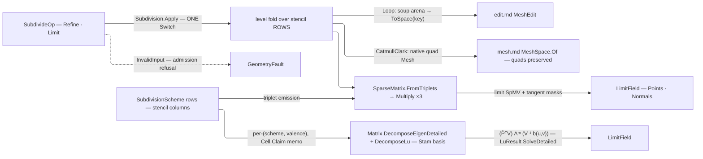

# [RASM_PARAMETRIC_SUBDIVIDE]

`Rasm.Parametric` subdivision refines a mesh through one fold over stencil-row schemes: each `SubdivisionScheme` carries its stencil data as columns — fixed coefficients as data, valence-dependent ones as delegates — and every level emits the subdivision operator as a sparse matrix, so refinement is SpMV sweeps over the level positions and the next scheme is one row, never a sibling subdivider. Limit-surface evaluation through the Stam eigen lane is mandatory: an owner emitting refined positions with no limit lane is a discrete-refinement half-concept.

Refinement is the only Parametric surface that outputs a mesh, published through the `MeshEdit` arena and the `MeshSpace` quad carrier; a `Uv` channel rides the same operator as two more SpMV planes, so a refined `UvTessellation` hand-off keeps its parameterization. Quads stay quads for `panelize.md` — pre-triangulating corrupts every level-≥2 re-subdivision, so triangulation is the consumer's arena-admission choice. Region subdivision rides `Refine.Region` — a refinement-only column with no meaning for pointwise limit sampling — sealing T-junctions at the region boundary, serving the Generation gate with no new surface; publication constructs one `LimitField`, returned bare by `Limit` and carried inside `Refined`.

## [01]-[INDEX]

- [02]-[SUBDIVISION]: `SubdivisionScheme` stencil-row schemes, one `Apply` fold emitting the sparse subdivision operator, and the Stam limit lane.

## [02]-[SUBDIVISION]

- Owner: `SubdivisionScheme` `[SmartEnum<string>]` mints the scheme vocabulary as stencil columns the fold never branches on — a coefficient that depends on nothing is a data column, one that depends on valence a delegate column, and every stencil is `internal` because the fold is its only reader; `Sharpness` carries the edge-crease and vertex-corner rows as plain data, absence riding `Option<Sharpness>` rather than a canonical empty instance, and claims no validity of its own — bounds, self-edges, duplicate undirected keys, and canonical edge identity are mesh-relative, so one admission gate beside the mesh-consuming operation proves them.
- Entry: `Apply` is the one polymorphic entry, discriminating on the op case.
- Auto: `Refine` folds levels through the per-level sparse operator, the terminal level emitting the limit operator; `Limit` reuses the sharpness admission, accumulates every sample's face-bound, face-arity, and triangular-domain refusal against the mesh, and only then traverses the probes through the Stam eigen lane, each basis read off the private `(scheme, valence)` memo and each factor solve consumed as a whole `LinearSolution` verdict.
- Law: the per-`(scheme, valence)` basis memo is `Subdivision`-private — no public basis type and no forwarding cache class — and seats through `Cell.Claim`, so the CAS verdict is a `Transition` a reader can discriminate rather than a discarded `Swap` return; the mint runs once outside the CAS and a `Ceded` claim returns the first-seated basis, recompute being idempotent. The memo keys on the `SubdivisionScheme` ROW under its own `[KeyMemberEqualityComparer]`, and the post-state read is `Find(...).ToFin(...)` — `HashMap`'s indexer throws, so a totality claim resting on it is a `Fin` escape wearing a memo.
- Law: a limit probe is admitted material. `FaceSample.Of` proves the face ordinal nonnegative and both parameters through `UnitInterval` ONCE as three independent gates accumulated under `Validation`, so a caller reads every offending coordinate in one refusal and the eigen lane holds no per-sample predicate; face bounds and the triangular domain need the mesh and scheme, so they gate at operation admission. NAMED LOSS: the raw `(int, double, double)` tuple column a caller could hand-build; the gain is that the only refusal left in the lane names a real offending face.
- Law: admission runs ONCE per operation and the generated `Apply(...).Switch(...)` stays the dispatch, because only the selected arm may run. The shared `Admit(space, sharpness, key)` overload accumulates every sharpness refusal — non-finite or non-positive values, self-edges, out-of-range vertex ids, duplicate undirected edge or corner keys — then canonicalizes edge keys into the `HashMap`s; the `Refine` overload adds face arity equal to `Scheme.Arity`, `Uv` count equal to the vertex count, admitted levels, and in-range region face ids before the region becomes a `Set<int>`, and returns the one `State` the fold and publication thread. A `bool IsValid` precheck beside a second admission step is the deleted form.
- Law: boundary behavior is scheme ROW data — `BoundaryVertexStencil`/`BoundaryEdgeStencil` columns seeded with the cubic-B-spline boundary curve rule (⅛, ¾, ⅛). NAMED LOSS: the shared `BoundaryMask` const class no row owned, whose masks the fence never clause-named while every sibling weight cited its source.
- Packages: `Rasm.Numerics` for the sparse operators, the `Dimension` level budget, and the Stam EVD (`Matrix.DecomposeEigenDetailed`) with its retained eigenvector factor (`Matrix.DecomposeLu`, `LuResult.SolveDetailed`, `LinearSolution`), `Rasm.Meshing` for the `MeshSpace` quad publish and `MeshEdit` tri arena, `Rasm.Domain` for `Cell`/`Transition`/`ValidityClaim` (tolerance is `MeshSpace.Tolerance`, never a second `Context` column), Rhino.Geometry for the native quad types, Thinktecture.Runtime.Extensions for `[SmartEnum]` delegate columns, LanguageExt.Core for the `Fin` result, the `Validation` admission fan-in, and the `Atom` cache cell, and BCL `ArrayPool<double>` for level staging.
- Growth: a new primal scheme is one `SubdivisionScheme` row with its stencil columns; a dual (Doo-Sabin) or √3 scheme adds one refinement-topology delegate the same fold reads, the `Arity ∈ {3,4}` gate keeping a topology-less row loud. New boundary behavior is one row's own stencil pair, adaptive sharpness a `Creases`/`Corners` widening, a new per-vertex channel one more SpMV plane beside the UV pair, a new limit quantity one mask column and one SpMV — zero new entry surfaces.
- Boundary: the scheme is data and the fold is one, so a per-scheme subdivider class, a hand-rolled half-edge beside the flat SoA incidence, or a per-vertex weight loop re-deriving the SpMV is the density defect; the operator is a `matrix.md` sparse value and its eigenstructure the landed complex-general EVD, never a local eigensolver.

```csharp
// --- [IMPORTS] -------------------------------------------------------------------------
using System;
using LanguageExt;
using Rasm.Domain;
using Rasm.Meshing;
using Rasm.Numerics;
using Rhino.Geometry;
using Thinktecture;
using static LanguageExt.Prelude;
using Matrix = Rasm.Numerics.Matrix;
using Dimension = Rasm.Numerics.Dimension;

namespace Rasm.Parametric;

// --- [TYPES] ---------------------------------------------------------------------------
[SmartEnum<string>]
[KeyMemberEqualityComparer<ComparerAccessors.StringOrdinal, string>]
[KeyMemberComparer<ComparerAccessors.StringOrdinal, string>]
public sealed partial class SubdivisionScheme {
    public static readonly SubdivisionScheme CatmullClark = new(
        "catmull-clark", arity: 4,
        edgeStencil: (0.25, 0.25), boundaryVertexStencil: (0.75, 0.125), boundaryEdgeStencil: 0.5,
        vertexStencil: static n => ((n - 2.0) / n, 1.0 / (n * (double)n), 1.0 / (n * (double)n)),
        limitStencil: static n => (n / (n + 5.0), 4.0 / (n * (n + 5.0)), 1.0 / (n * (n + 5.0))),
        tangentWeight: TangentCc);

    public static readonly SubdivisionScheme Loop = new(
        "loop", arity: 3,
        edgeStencil: (0.375, 0.125), boundaryVertexStencil: (0.75, 0.125), boundaryEdgeStencil: 0.5,
        vertexStencil: static n => Beta(n) switch { double b => (1.0 - (n * b), b, 0.0) },
        limitStencil: static n => (3.0 / (8.0 * Beta(n))) switch { double w => (w / (w + n), 1.0 / (w + n), 0.0) },
        tangentWeight: TangentLoop);

    public int Arity { get; }
    internal (double Ends, double Wings) EdgeStencil { get; }
    internal (double Self, double End) BoundaryVertexStencil { get; }
    internal double BoundaryEdgeStencil { get; }

    // Generated ctor: key, plain columns in declaration order, then delegates in partial-method declaration order.
    [UseDelegateFromConstructor] internal partial (double Self, double Ring, double Face) VertexStencil(int valence);
    [UseDelegateFromConstructor] internal partial (double Self, double Ring, double Face) LimitStencil(int valence);
    [UseDelegateFromConstructor] internal partial (double Along, double Across) TangentWeight(int valence, int k);

    static double Beta(int n) => (1.0 / n) * (0.625 - Math.Pow(0.375 + (Math.Cos(2.0 * Math.PI / n) / 4.0), 2));
    static (double, double) TangentCc(int valence, int k);
    static (double, double) TangentLoop(int valence, int k);
}

// --- [MODELS] --------------------------------------------------------------------------
// Raw crease and corner rows; validity is relational to the mesh, so admission runs beside the operation, never here.
public sealed record Sharpness(Arr<(int A, int B, double Value)> Creases, Arr<(int Vertex, double Value)> Corners);

public readonly record struct FaceSample {
    private FaceSample(int face, UnitInterval u, UnitInterval v) => (Face, U, V) = (face, u, v);

    public int Face { get; }
    public UnitInterval U { get; }
    public UnitInterval V { get; }

    // Three independent gates: Validation accumulates every refusal, and Fin is entered only after admission is complete.
    public static Fin<FaceSample> Of(int face, double u, double v) =>
        (
            Admit.Demand(claim: face >= 0, value: face, requirement: "nonnegative face ordinal").ToValidation(),
            FactoryBridge.Accept<UnitInterval>(candidate: u).ToValidation(),
            FactoryBridge.Accept<UnitInterval>(candidate: v).ToValidation()
        ).Apply(static (ordinal, du, dv) => new FaceSample(face: ordinal, u: du, v: dv)).As().ToFin();
}

// --- [OPERATIONS] ----------------------------------------------------------------------
[Union(ConversionFromValue = ConversionOperatorsGeneration.None)]
public abstract partial record SubdivideOp {
    private SubdivideOp() { }

    // Tolerance reads off Space alone; a default Region is the whole mesh, and Uv is parametric provenance, never SetCornerUv wedge data.
    public sealed record Refine(MeshSpace Space, SubdivisionScheme Scheme, Dimension Levels, Arr<int> Region = default, Option<Sharpness> Sharpness = default, Option<Arr<Point2d>> Uv = default) : SubdivideOp;
    public sealed record Limit(MeshSpace Space, SubdivisionScheme Scheme, Arr<FaceSample> Samples, Option<Sharpness> Sharpness = default) : SubdivideOp;
}

[Union(ConversionFromValue = ConversionOperatorsGeneration.None)]
public abstract partial record SubdivisionResult {
    private SubdivisionResult() { }

    public sealed record Refined(MeshSpace Mesh, LimitField Limit, Option<Arr<Point2d>> Uv) : SubdivisionResult;
    public sealed record LimitField(Arr<Point3d> Points, Arr<Vector3d> Normals) : SubdivisionResult;
}

public static class Subdivision {
    // --- [STAM_BASIS]
    // Valence lives in the memo key alone; Factor is the retained Matrix.DecomposeLu() output, so V⁻¹b(u,v) is one LuResult.SolveDetailed whose whole LinearSolution verdict is read before its vector is taken.
    sealed record StamBasis(Arr<double> Eigenvalues, Matrix Basis, LuResult Factor);

    static readonly Atom<HashMap<(SubdivisionScheme Scheme, int Valence), StamBasis>> Bases = Atom(HashMap<(SubdivisionScheme, int), StamBasis>());

    static Fin<StamBasis> Basis(SubdivisionScheme scheme, int valence) =>
        Bases.Value.Find((scheme, valence)).Match(
            Some: Fin.Succ,
            None: () => AssembleBasis(scheme, valence).Bind(minted =>
                Cell.Claim(Bases, (scheme, valence), () => minted).Current
                    .Find((scheme, valence))
                    .ToFin(Fail: new KernelFault.InvalidResult())));

    static Fin<StamBasis> AssembleBasis(SubdivisionScheme scheme, int valence);

    public static Fin<SubdivisionResult> Apply(SubdivideOp op) =>
        op.Switch(
            refine: static r => RefineOf(r),
            limit:  static l => LimitOf(l));

    // --- [REFINEMENT_FOLD]
    sealed record Level(double[] X, double[] Y, double[] Z, int[] Corners, int[] FaceOffsets, Edges Edges, Option<(double[] U, double[] V)> Uv);
    sealed record Edges(int[] A, int[] B, int[] LeftFace, int[] RightFace, double[] Sharpness);
    // Creases key on the canonical undirected (A < B) edge; Closures accumulates across levels inside Advance.
    sealed record State(Level Level, HashMap<(int A, int B), double> Creases, HashMap<int, double> Corners, Set<int> Region, int Closures);

    static Fin<SubdivisionResult> RefineOf(SubdivideOp.Refine op) =>
        Admit().Bind(seed =>
            Range(0, op.Levels.Value).Fold(
                Fin.Succ(seed),
                (state, iteration) => state.Bind(current => Advance(op.Scheme, current, iteration)))
            .Bind(final => Publish(final)));

    static Fin<(HashMap<(int A, int B), double> Creases, HashMap<int, double> Corners)> Admit(MeshSpace space, Option<Sharpness> sharpness);
    static Fin<State> Admit(SubdivideOp.Refine op);
    static Fin<State> Advance(SubdivisionScheme scheme, State current, int iteration);
    static Fin<SubdivisionResult> Publish(SubdivideOp.Refine op, State state);

    // --- [STAM_LIMIT]
    static Fin<SubdivisionResult> LimitOf(SubdivideOp.Limit op) =>
        Admit()
            .Bind(input => input.Op.Samples.TraverseM(sample => EvaluateLimit(input, sample)).As())
            .Map(rows => (SubdivisionResult)new SubdivisionResult.LimitField(
                rows.Map(static row => row.Point),
                rows.Map(static row => row.Normal)));

    // Face bounds and arity against Space.Native accumulate per sample; a triangular face further requires U.Value + V.Value <= 1.
    static Fin<(SubdivideOp.Limit Op, HashMap<(int A, int B), double> Creases, HashMap<int, double> Corners)> Admit(SubdivideOp.Limit op);
    static Fin<(Point3d Point, Vector3d Normal)> EvaluateLimit(
        (SubdivideOp.Limit Op, HashMap<(int A, int B), double> Creases, HashMap<int, double> Corners) input, FaceSample sample);
}
```



## [03]-[RESEARCH]

<!-- source-only: research row template:
[TOKEN]-[OPEN|BLOCKED]: <exact question>; <verification route>.
-->

(none)
