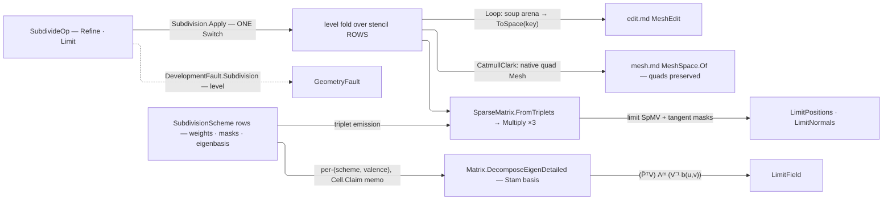

# [RASM_PARAMETRIC_SUBDIVIDE]

`Rasm.Parametric` subdivision refines a mesh through one fold over stencil-row schemes: each `SubdivisionScheme` carries its stencil data as delegate columns, and every level emits the subdivision operator as a sparse matrix, so refinement is SpMV sweeps over the level positions and the next scheme is one row, never a sibling subdivider. Limit-surface evaluation through the Stam eigen lane is mandatory: an owner emitting refined positions with no limit lane is a discrete-refinement half-concept.

Refinement is the only Parametric surface that outputs a mesh, published through the `MeshEdit` arena and the `MeshSpace` quad seam; a `Uv` channel rides the same operator as two more SpMV planes, so a refined `UvTessellation` hand-off keeps its parameterization. Quads stay quads for `panelize.md` — pre-triangulating corrupts every level-≥2 re-subdivision, so triangulation is the consumer's arena-admission choice. Region subdivision rides `SubdividePolicy.Region` as a policy column sealing T-junctions at the region boundary, serving the Generation gate with no new surface.

## [01]-[INDEX]

- [02]-[SUBDIVISION]: `SubdivisionScheme` stencil-row schemes, one `Apply` fold emitting the sparse subdivision operator, and the Stam limit lane.

## [02]-[SUBDIVISION]

- Owner: `SubdivisionScheme` `[SmartEnum<string>]` mints the scheme vocabulary as delegate-column data the fold never branches on; `SubdividePolicy` binds the edge-crease, vertex-corner, and region rows as `IValidityEvidence`.
- Entry: `Apply` is the one polymorphic entry, discriminating on the op case.
- Auto: `Refine` folds levels through the per-level sparse operator, the terminal level emitting the limit operator; `Limit` routes admitted `FaceSample` probes through the Stam eigen lane.
- Law: the per-`(scheme, valence)` basis memo seats through `Cell.Claim`, so the CAS verdict is a `Transition` a reader can discriminate rather than a discarded `Swap` return; the mint runs once outside the CAS and a `Ceded` claim returns the first-seated basis, recompute being idempotent. The memo keys on the `SubdivisionScheme` ROW under its own `[KeyMemberEqualityComparer]`, and the post-state read is `Find(...).ToFin(...)` — `HashMap`'s indexer throws, so a totality claim resting on it is a rail escape wearing a memo.
- Law: a limit probe is admitted material. `FaceSample.Of` proves the face ordinal nonnegative and both parameters through `UnitInterval` ONCE, so the eigen lane holds no per-sample predicate and no refusal carrying an unmeasured witness. NAMED LOSS: the raw `(int, double, double)` tuple column a caller could hand-build; the gain is that the only refusal left in the lane names a real offending face.
- Law: boundary behavior is scheme ROW data — `BoundaryVertexStencil`/`BoundaryEdgeStencil` columns seeded with the cubic-B-spline boundary curve rule (⅛, ¾, ⅛). NAMED LOSS: the shared `BoundaryMask` const class no row owned, whose masks the fence never clause-named while every sibling weight cited its source.
- Packages: `Rasm.Numerics` for the sparse operators, the `Dimension` level budget, and the Stam EVD (`Matrix.DecomposeEigenDetailed`), `Rasm.Meshing` for the `MeshSpace` quad publish and `MeshEdit` tri arena, `Rasm.Domain` for `Op`/`Context`/`Cell`/`Transition`/validity, Rhino.Geometry for the native quad seam, Thinktecture.Runtime.Extensions for `[SmartEnum]` delegate columns, LanguageExt.Core for the `Fin` rail and the `Atom` cache cell, and BCL `ArrayPool<double>` for level staging.
- Growth: a new primal scheme is one `SubdivisionScheme` row with its delegate columns; a dual (Doo-Sabin) or √3 scheme adds one refinement-topology delegate the same fold reads, the `Arity ∈ {3,4}` gate keeping a topology-less row loud. New boundary behavior is one row's own stencil pair, adaptive sharpness a `Creases`/`Corners` widening, a new per-vertex channel one more SpMV plane beside the UV pair, a new limit quantity one mask column and one SpMV — zero new entry surfaces.
- Boundary: the scheme is data and the fold is one, so a per-scheme subdivider class, a hand-rolled half-edge beside the flat SoA incidence, or a per-vertex weight loop re-deriving the SpMV is the density defect; the operator is a `matrix.md` sparse value and its eigenstructure the landed complex-general EVD, never a local eigensolver.

```csharp
// --- [RUNTIME_PRELUDE] -----------------------------------------------------------------
using System;
using System.Linq;
using LanguageExt;
using Rasm.Domain;
using Rasm.Meshing;
using Rasm.Numerics;
using Rhino.Geometry;
using Thinktecture;
using static LanguageExt.Prelude;
using Matrix = Rasm.Numerics.Matrix;
using Dimension = Rasm.Numerics.Dimension;

namespace Rasm.Parametric;

// --- [TYPES] ---------------------------------------------------------------------------
[SmartEnum<string>]
[KeyMemberEqualityComparer<ComparerAccessors.StringOrdinal, string>]
[KeyMemberComparer<ComparerAccessors.StringOrdinal, string>]
public sealed partial class SubdivisionScheme {
    public static readonly SubdivisionScheme CatmullClark = new(
        "catmull-clark", arity: 4,
        vertexStencil: static n => ((n - 2.0) / n, 1.0 / (n * (double)n), 1.0 / (n * (double)n)),
        edgeStencil: static () => (0.25, 0.25),
        limitStencil: static n => (n / (n + 5.0), 4.0 / (n * (n + 5.0)), 1.0 / (n * (n + 5.0))),
        tangentWeight: TangentCc,
        boundaryVertexStencil: static () => (0.75, 0.125),
        boundaryEdgeStencil: static () => 0.5);

    public static readonly SubdivisionScheme Loop = new(
        "loop", arity: 3,
        vertexStencil: static n => Beta(n) switch { double b => (1.0 - (n * b), b, 0.0) },
        edgeStencil: static () => (0.375, 0.125),
        limitStencil: static n => (3.0 / (8.0 * Beta(n))) switch { double w => (w / (w + n), 1.0 / (w + n), 0.0) },
        tangentWeight: TangentLoop,
        boundaryVertexStencil: static () => (0.75, 0.125),
        boundaryEdgeStencil: static () => 0.5);

    public int Arity { get; }

    [UseDelegateFromConstructor] public partial (double Self, double Ring, double Face) VertexStencil(int valence);
    [UseDelegateFromConstructor] public partial (double Ends, double Wings) EdgeStencil();
    [UseDelegateFromConstructor] public partial (double Self, double Ring, double Face) LimitStencil(int valence);
    [UseDelegateFromConstructor] public partial (double Along, double Across) TangentWeight(int valence, int k);
    [UseDelegateFromConstructor] public partial (double Self, double End) BoundaryVertexStencil();
    [UseDelegateFromConstructor] public partial double BoundaryEdgeStencil();

    public Fin<StamBasis> Eigenbasis(int valence, Op key) => StamCache.For(scheme: this, valence: valence, key: key);

    static double Beta(int n) => (1.0 / n) * (0.625 - Math.Pow(0.375 + (Math.Cos(2.0 * Math.PI / n) / 4.0), 2));
    static (double, double) TangentCc(int valence, int k);
    static (double, double) TangentLoop(int valence, int k);
}

// --- [CONSTANTS] -----------------------------------------------------------------------
public sealed record SubdividePolicy(Arr<(int A, int B, double Sharpness)> Creases, Arr<(int Vertex, double Sharpness)> Corners, Arr<int> Region) : IValidityEvidence {
    public static readonly SubdividePolicy Canonical = new(Arr<(int, int, double)>.Empty, Arr<(int, double)>.Empty, Arr<int>.Empty);

    public bool IsValid => ValidityClaim.All(
        Creases.All(static edge => edge.A != edge.B && ValidityClaim.Positive(value: edge.Sharpness)),
        Corners.All(static corner => corner.Vertex >= 0 && ValidityClaim.Positive(value: corner.Sharpness)));
}

// --- [MODELS] --------------------------------------------------------------------------
public readonly record struct FaceSample {
    private FaceSample(int face, UnitInterval u, UnitInterval v) => (Face, U, V) = (face, u, v);

    public int Face { get; }
    public UnitInterval U { get; }
    public UnitInterval V { get; }

    public static Fin<FaceSample> Of(int face, double u, double v, Op key) =>
        from ordinal in key.Demand(claim: face >= 0, value: face, requirement: "nonnegative face ordinal")
        from du in key.AcceptValidated<UnitInterval>(candidate: u)
        from dv in key.AcceptValidated<UnitInterval>(candidate: v)
        select new FaceSample(face: ordinal, u: du, v: dv);
}

public sealed record StamBasis(int Valence, Arr<double> Eigenvalues, Matrix Basis, Matrix InverseBasis);

internal static class StamCache {
    static readonly Atom<HashMap<(SubdivisionScheme Scheme, int Valence), StamBasis>> Cache = Atom(HashMap<(SubdivisionScheme, int), StamBasis>());

    internal static Fin<StamBasis> For(SubdivisionScheme scheme, int valence, Op key) =>
        Cache.Value.Find((scheme, valence)).Match(
            Some: Fin.Succ,
            None: () => Assemble(scheme, valence, key).Bind(minted =>
                Cell.Claim(Cache, (scheme, valence), () => minted).Current
                    .Find((scheme, valence))
                    .ToFin(Fail: key.InvalidResult())));

    static Fin<StamBasis> Assemble(SubdivisionScheme scheme, int valence, Op key);
}

// --- [OPERATIONS] ----------------------------------------------------------------------
[Union(ConversionFromValue = ConversionOperatorsGeneration.None)]
public abstract partial record SubdivideOp {
    private SubdivideOp() { }

    public sealed record Refine(MeshSpace Space, SubdivisionScheme Scheme, Dimension Levels, SubdividePolicy Policy, Context Model, Option<Arr<Point2d>> Uv = default) : SubdivideOp;
    public sealed record Limit(MeshSpace Space, SubdivisionScheme Scheme, Arr<FaceSample> Samples, SubdividePolicy Policy) : SubdivideOp;
}

[Union(ConversionFromValue = ConversionOperatorsGeneration.None)]
public abstract partial record SubdivisionResult {
    private SubdivisionResult() { }

    public sealed record Refined(MeshSpace Mesh, Arr<Point3d> LimitPositions, Arr<Vector3d> LimitNormals, Option<Arr<Point2d>> Uv) : SubdivisionResult;
    public sealed record LimitField(Arr<Point3d> Points, Arr<Vector3d> Normals) : SubdivisionResult;
}

public static class Subdivision {
    public static Fin<SubdivisionResult> Apply(SubdivideOp op, Op? key = null) =>
        op.Switch(
            state: key.OrDefault(),
            refine: static (k, r) => RefineOf(r, k),
            limit:  static (k, l) => LimitOf(l, k));

    // --- [REFINEMENT_FOLD]
    static Fin<SubdivisionResult> RefineOf(SubdivideOp.Refine op, Op key) =>
        !op.Policy.IsValid
            ? Fault<SubdivisionResult>(witness: "subdivision policy inadmissible")
            : AdmitBase(op).Bind(baseLevel => Range(0, op.Levels.Value).Fold(
                    Fin.Succ((Level: baseLevel, Creases: op.Policy.Creases, Corners: op.Policy.Corners, Closures: 0)),
                    (state, level) => state.Bind(s => Advance(op.Scheme, s.Level, s.Creases, s.Corners, op.Policy.Region, level)
                        .Map(next => (next.Level, next.Creases, next.Corners, s.Closures + next.Closures)))))
                .Bind(terminal => Publish(op, terminal.Level, terminal.Closures, key));

    internal sealed record SubdivisionLevel(double[] X, double[] Y, double[] Z, int[] Corners, int[] FaceOffsets, EdgeTable Edges, Option<(double[] U, double[] V)> Uv);
    internal sealed record EdgeTable(int[] A, int[] B, int[] LeftFace, int[] RightFace, double[] Sharpness);

    static Fin<SubdivisionLevel> AdmitBase(SubdivideOp.Refine op);
    static Fin<(SubdivisionLevel Level, Arr<(int A, int B, double Sharpness)> Creases, Arr<(int Vertex, double Sharpness)> Corners, int Closures)> Advance(
        SubdivisionScheme scheme, SubdivisionLevel level, Arr<(int A, int B, double Sharpness)> creases, Arr<(int Vertex, double Sharpness)> corners, Arr<int> region, int at);

    static Fin<SubdivisionResult> Publish(SubdivideOp.Refine op, SubdivisionLevel terminal, int closures, Op key);

    // --- [STAM_LIMIT]
    static Fin<SubdivisionResult> LimitOf(SubdivideOp.Limit op, Op key) =>
        op.Samples.TraverseM(sample => EvaluateLimit(op, sample, key))
            .As()
            .Map(rows => (SubdivisionResult)new SubdivisionResult.LimitField(
                new Arr<Point3d>([.. rows.Select(static r => r.Point)]),
                new Arr<Vector3d>([.. rows.Select(static r => r.Normal)])));

    static Fin<(Point3d Point, Vector3d Normal)> EvaluateLimit(SubdivideOp.Limit op, FaceSample sample, Op key);

    static Fin<T> Fault<T>(string witness, Option<int> unit = default) =>
        Fin.Fail<T>(new GeometryFault.DevelopmentFault(DevelopmentStage.Subdivision, unit, witness));
}
```



## [03]-[RESEARCH]

<!-- source-only: research row template:
[TOKEN]-[OPEN|BLOCKED]: <exact question>; <verification route>.
-->

(none)
