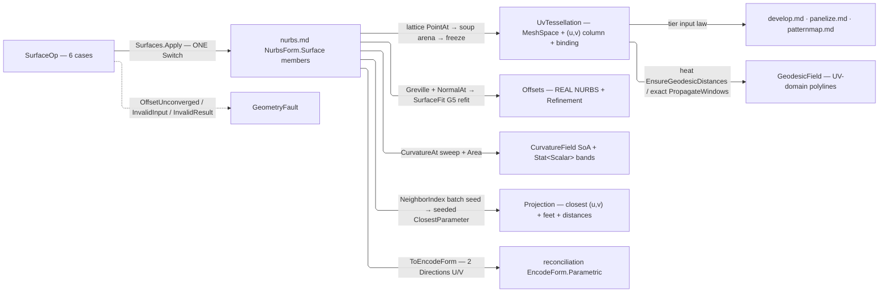

# [RASM_PARAMETRIC_SURFACE]

`Surfaces` owns the surface op algebra of `Rasm.Parametric` and mints its UV-provenance carrier: `Tessellate` emits `UvTessellation`, a frozen mesh carrying an index-aligned per-vertex `(u, v)` column beside its live surface binding — the one surface input the tier's downstream consumers admit by type.

Every emitted `NurbsForm.Surface` carries `ToEncodeForm()` into the reconciliation `EncodeForm.Parametric` identity chain.

## [01]-[INDEX]

- [02]-[SURFACES]: `SurfaceOp` folded by one `Apply` over the rule and policy vocabularies into typed `SurfaceResult` carriers.

## [02]-[SURFACES]

- Owner: `Surfaces` mints the one static entry, `Apply` folding every `SurfaceOp` case through the generated total `Switch`.
- Cases: `SurfaceOp` is the request `[Union]`, one case per surface operation; `SurfaceResult` the result `[Union]`, one typed carrier per request family; rule and policy rows are the vocabularies the ops read.
- Entry: `Geodesics` takes the `UvTessellation` carrier, so the provenance proof is the parameter type.
- Auto: every op composes the vendored engine with the landed distance, refit, and arena machinery; no evaluation arithmetic is local.
- Law: the curvature bands are `Stat<Scalar>` off `Stat<Scalar>.Of(ReadOnlySpan<double>, key)` — the kernel's ONE moment owner and the leg that already carries the vectorized reduction. NAMED LOSS: the page's local `FieldExtrema` triple and its registered `CurvatureSummaryClaim`; the speed claim belongs to the reduction's owner, and the consumer gains variance, RMS, and the rejected count no triple carries. WITNESS: `FieldExtrema.Of(k1Plane)` rebuilt as `Stat<Scalar>.Of(k1Plane)`, whose `Minimum`/`Maximum`/`Mean` read the same three values.
- Law: the curvature sweep's area is `NurbsForm.Surface.Area` on the same live surface — the engine's one area owner with its guarded cubature and error witness; a local Jacobian integral over a hardcoded unit rectangle re-derives that engine and suppresses its witness.
- Law: the dense-projection seed lookup is `NeighborIndex` — Rasm `RULINGS [02]` seats bare-point neighborhoods there, and the query subject is a bare point. NAMED LOSS: the page-local `Supercluster.KDTree.Net` admission, its per-probe boxing of three doubles into an `IReadOnlyList<double>`, and a `.First()` that threw on an empty answer; the gain is one batch query, one owner, and a `Fin` result through the seed leg.
- Law: `GeodesicPlan.Windows` selects the distance lane — `None` the cached heat-distance lane, `Some(policy)` exact MMP propagation under that caller-visible budget — and `VertexDistances` dispatches through `Windows.Match`; `ChainContours` copies `plan.Windows` onto `GeodesicField.Windows`, so the executed policy is result evidence that outlives the request — a heat field reads `None`, an exact field the budget that shaped it. The compact offset-plus-column contour layout stays; nested per-contour arrays add allocations and weaken the dense carrier. `UvTessellation` carries its own provenance and nothing beside it.
- Packages: `nurbs.md` the vendored engine (`NurbsPolicy` knobs, `SplinePolicy` the G5 refit seed); `Rasm.Numerics` for `Dimension`/`PositiveMagnitude` atoms and the `GeometryFault` union; `Rasm.Spatial` for the `NeighborIndex`/`NeighborSource`/`NeighborKernel` bare-point seed lookup; `Rasm.Meshing` for the `MeshEdit` arena, the `MeshSpace` freeze, the `Chain` ring carrier, and the `Conform` constrained-tessellation carriage; `Rasm.Processing` for the landed distance lanes; `Rasm.Domain` for `Context`/`ToleranceLane`, `Stat<Scalar>`/`Scalar`, and validity; Rhino.Geometry, Thinktecture.Runtime.Extensions, LanguageExt.Core.
- Growth: a new tessellation density is one `TessellateRule` case; a new isoline selection one `IsolineRule` case; a new field quantity one `CurvatureField` column off the same `CurvatureAt` sweep; a lofted, swept, or revolved construction is a growth row on the engine admission.
- Boundary: basis, derivative, and projection arithmetic stay `nurbs.md`'s engine members; a trimmed region is `Trim` DATA on the one `Tessellate` case — the constrained cells ride the `Meshing/delaunay` `Tessellation.Build` substrate with `PlanarOverlay`'s exact winding classification, so THIS owner emits both the full-domain and the trimmed `UvTessellation` and no consumer mints a constrained substrate beside it.

```csharp
// --- [IMPORTS] -------------------------------------------------------------------------
using System;
using System.Linq;
using LanguageExt;
using LanguageExt.Common;
using Rasm.Domain;
using Rasm.Meshing;
using Rasm.Numerics;
using Rasm.Processing;
using Rasm.Spatial;
using Rhino.Geometry;
using Thinktecture;
using static LanguageExt.Prelude;

namespace Rasm.Parametric;

// --- [TYPES] ---------------------------------------------------------------------------
[Union(ConversionFromValue = ConversionOperatorsGeneration.None)]
public abstract partial record TessellateRule {
    private TessellateRule() { }

    public sealed record Grid(Dimension Nu, Dimension Nv) : TessellateRule;
    public sealed record Adaptive(Dimension BudgetU, Dimension BudgetV) : TessellateRule;
}

[Union(ConversionFromValue = ConversionOperatorsGeneration.None)]
public abstract partial record IsolineRule {
    private IsolineRule() { }

    public sealed record Even(Dimension CountU, Dimension CountV) : IsolineRule;
    public sealed record AtKnots : IsolineRule;
    public sealed record AtParameters(Arr<double> U, Arr<double> V) : IsolineRule;
}

// --- [POLICIES] ------------------------------------------------------------------------
public sealed record GeodesicPlan(
    Arr<Point2d> Sources, Arr<double> Levels,
    Option<WindowPropagationPolicy> Windows = default) : IValidityEvidence {
    public bool IsValid => ValidityClaim.All(
        ValidityClaim.CountAtLeast(count: Sources.Count, floor: 1),
        ValidityClaim.CountAtLeast(count: Levels.Count, floor: 1),
        Sources.All(static source => double.IsFinite(source.X) && double.IsFinite(source.Y)),
        Levels.All(static level => ValidityClaim.Positive(value: level)));
}

public sealed record ProjectionPolicy(Dimension SeedThreshold, Dimension SeedU, Dimension SeedV, NurbsPolicy Nurbs) : IValidityEvidence {
    public static readonly ProjectionPolicy Canonical = new(
        SeedThreshold: Dimension.Create(value: 32), SeedU: Dimension.Create(value: 24), SeedV: Dimension.Create(value: 24),
        Nurbs: NurbsPolicy.Canonical);

    public static ProjectionPolicy Of(Context context) => Canonical with { Nurbs = NurbsPolicy.Of(context: context) };

    public bool IsValid => ValidityClaim.All(
        ValidityClaim.CountAtLeast(count: SeedU.Value, floor: 2),
        ValidityClaim.CountAtLeast(count: SeedV.Value, floor: 2),
        Nurbs.IsValid);
}

// --- [OPERATIONS] ----------------------------------------------------------------------
[Union(ConversionFromValue = ConversionOperatorsGeneration.None)]
public abstract partial record SurfaceOp {
    private SurfaceOp() { }

    public sealed record Tessellate(NurbsForm.Surface Surface, TessellateRule Rule, Context Model, Option<Seq<Chain>> Trim = default) : SurfaceOp;
    public sealed record Isolines(NurbsForm.Surface Surface, IsolineRule Rule) : SurfaceOp;
    public sealed record Geodesics(SurfaceResult.UvTessellation Source, GeodesicPlan Plan) : SurfaceOp;
    public sealed record NormalOffset(NurbsForm.Surface Surface, double Distance, SplinePolicy Refit, RefinePolicy Refine) : SurfaceOp;
    public sealed record CurvatureSample(NurbsForm.Surface Surface, Dimension Nu, Dimension Nv, Option<NurbsPolicy> Policy = default) : SurfaceOp;
    public sealed record Project(NurbsForm.Surface Surface, Arr<Point3d> Probes, ProjectionPolicy Policy) : SurfaceOp;
}

[Union(ConversionFromValue = ConversionOperatorsGeneration.None, SwitchMethods = SwitchMapMethodsGeneration.DefaultWithPartialOverloads)]
public abstract partial record SurfaceResult {
    private SurfaceResult() { }

    public sealed record UvTessellation(NurbsForm.Surface Source, MeshSpace Mesh, Arr<Point2d> Uv) : SurfaceResult;

    public sealed record Isolines(Arr<(ParametricDirection Direction, double Parameter, NurbsForm.Curve Curve)> Curves) : SurfaceResult;

    public sealed record GeodesicField(Arr<int> ContourOffsets, Arr<Point2d> Uv, Arr<Point3d> World, Arr<double> LevelOf, Option<WindowPropagationPolicy> Windows) : SurfaceResult;

    public sealed record Offsets(NurbsForm.Surface Surface, Refinement Refinement) : SurfaceResult;

    public sealed record CurvatureField(
        Arr<Point2d> Uv, Arr<double> K1, Arr<double> K2, Arr<double> Gaussian, Arr<double> Mean,
        Arr<Vector3d> Dir1, Arr<Vector3d> Dir2, Arr<double> AreaElement,
        Stat<Scalar> K1Band, Stat<Scalar> K2Band, double Area, int DegenerateNodes) : SurfaceResult;

    public sealed record Projection(Arr<Point2d> Uv, Arr<Point3d> Feet, Arr<double> Distances) : SurfaceResult;
}

public static class Surfaces {
    public static Fin<SurfaceResult> Apply(SurfaceOp op) =>
        op.Switch(
            tessellate:      static t => TessellateOf(t),
            isolines:        static i => IsolinesOf(i),
            geodesics:       static g => GeodesicsOf(g),
            normalOffset:    static o => NormalOffsetOf(o),
            curvatureSample: static c => CurvatureOf(c),
            project:         static p => ProjectOf(p));

    // --- [TESSELLATE]
    static Fin<SurfaceResult> TessellateOf(SurfaceOp.Tessellate op) =>
        Lattice(op.Surface, op.Rule).Bind(grid =>
            op.Trim.Match(
                Some: rings => TrimmedCells(grid, rings, op.Model)
                    .Bind(cells => Lift(op.Surface, cells.Uv, _ => cells.Triangles, op.Model)),
                None: () => Lift(
                    op.Surface,
                    new Arr<Point2d>([.. grid.U.SelectMany(u => grid.V.Select(v => new Point2d(u, v)))]),
                    points => CellTriangles(grid.U.Length, grid.V.Length, points),
                    op.Model)));

    static Fin<(double[] U, double[] V)> Lattice(NurbsForm.Surface surface, TessellateRule rule);
    static (int A, int B, int C)[] CellTriangles(int nu, int nv, ReadOnlySpan<Point3d> points);
    static Fin<(Arr<Point2d> Uv, (int A, int B, int C)[] Triangles)> TrimmedCells((double[] U, double[] V) grid, Seq<Chain> rings, Context model);

    static Fin<SurfaceResult> Lift(NurbsForm.Surface surface, Arr<Point2d> uv, Func<Point3d[], (int A, int B, int C)[]> cells, Context model) {
        Point3d[] points = new Point3d[uv.Count];
        for (int i = 0; i < uv.Count; i++) { points[i] = surface.PointAt(uv[i].X, uv[i].Y); }
        using MeshEdit arena = MeshEdit.Of(points, cells(points), model);
        return arena.ToSpace().Map(space => (SurfaceResult)new SurfaceResult.UvTessellation(surface, space, uv));
    }

    // --- [ISOLINES]
    static Fin<SurfaceResult> IsolinesOf(SurfaceOp.Isolines op) =>
        IsoRows(op.Surface, op.Rule).Bind(rows =>
            rows.U.TraverseM(u => op.Surface.IsoCurve(u, ParametricDirection.U)
                .Map(curve => (Direction: ParametricDirection.U, Parameter: u, Curve: curve))).As().Bind(uCurves =>
            rows.V.TraverseM(v => op.Surface.IsoCurve(v, ParametricDirection.V)
                .Map(curve => (Direction: ParametricDirection.V, Parameter: v, Curve: curve))).As().Map(vCurves =>
                (SurfaceResult)new SurfaceResult.Isolines(
                    new Arr<(ParametricDirection Direction, double Parameter, NurbsForm.Curve Curve)>([.. uCurves, .. vCurves])))));

    static Fin<(Arr<double> U, Arr<double> V)> IsoRows(NurbsForm.Surface surface, IsolineRule rule);

    // --- [GEODESICS]
    static Fin<SurfaceResult> GeodesicsOf(SurfaceOp.Geodesics op) =>
        !op.Plan.IsValid
            ? Fin.Fail<SurfaceResult>(new KernelFault.InvalidInput())
            : VertexDistances(op.Source, op.Plan).Map(distances =>
                (SurfaceResult)ChainContours(op.Source, distances, op.Plan));

    static Fin<Arr<double>> VertexDistances(SurfaceResult.UvTessellation source, GeodesicPlan plan);
    static SurfaceResult.GeodesicField ChainContours(SurfaceResult.UvTessellation source, Arr<double> distances, GeodesicPlan plan);

    // --- [NORMAL_OFFSET]
    static Fin<SurfaceResult> NormalOffsetOf(SurfaceOp.NormalOffset op) =>
        op.Refine.Run(
            seed: GrevilleGrid(op.Surface),
            fit: (grid, index) => OffsetFit(op, grid, index, key),
            densify: Densified,
            unconverged: deviation => new GeometryFault.OffsetUnconverged(Kind.Surface, deviation))
        .Map(final => (SurfaceResult)new SurfaceResult.Offsets(final.Fit, final.Evidence));

    static Arr<Point2d> GrevilleGrid(NurbsForm.Surface surface);
    static Fin<RefineRound<NurbsForm.Surface, Point2d>> OffsetFit(SurfaceOp.NormalOffset op, Arr<Point2d> grid, int index);
    static Arr<Point2d> Densified(Arr<Point2d> grid, Arr<Point2d> breaching);

    // --- [CURVATURE_SAMPLE]
    static Fin<SurfaceResult> CurvatureOf(SurfaceOp.CurvatureSample op) =>
        op.Surface.Area(policy: op.Policy)
            .Bind(area => SweepCurvature(op, area, key));

    static Fin<SurfaceResult> SweepCurvature(SurfaceOp.CurvatureSample op, double area);

    // --- [PROJECTION]
    static Fin<SurfaceResult> ProjectOf(SurfaceOp.Project op) =>
        !op.Policy.IsValid
            ? Fin.Fail<SurfaceResult>(new KernelFault.InvalidInput())
            : Seeds(op, key)
                .Bind(seeds => toSeq(op.Probes)
                    .Zip(toSeq(seeds), static (probe, seed) => (Probe: probe, Seed: seed))
                    .TraverseM(row => op.Surface.ClosestParameter(row.Probe, Some(op.Policy.Nurbs), row.Seed)).As())
                .Map(uv => Emit(op, new Arr<(double U, double V)>([.. uv])));

    static Fin<Arr<Option<(double U, double V)>>> Seeds(SurfaceOp.Project op) {
        if (op.Probes.Count < op.Policy.SeedThreshold.Value) {
            return Fin.Succ(new Arr<Option<(double U, double V)>>([.. op.Probes.Map(static _ => Option<(double U, double V)>.None)]));
        }
        (Point3d[] seeds, Point2d[] seedUv) = SeedGrid(op.Surface, op.Policy);
        return NeighborIndex.Of(source: new NeighborSource.PointsCase(Values: toSeq(seeds)))
            .Bind(index => NeighborKernel.GraphOf(
                index: index, needles: [.. op.Probes], count: Some(Dimension.Create(value: 1)),
                radius: Option<PositiveMagnitude>.None))
            .Map(graph => new Arr<Option<(double U, double V)>>([.. graph.Ids.Select(hits =>
                hits.Length > 0 ? Some((seedUv[hits[0]].X, seedUv[hits[0]].Y)) : Option<(double U, double V)>.None)]));
    }

    static (Point3d[] Seeds, Point2d[] SeedUv) SeedGrid(NurbsForm.Surface surface, ProjectionPolicy policy);
    static SurfaceResult Emit(SurfaceOp.Project op, Arr<(double U, double V)> uv);
}
```



## [03]-[DENSITY_BAR]

`Surfaces` is the one entry-bearing owner; every other axis is a payload, discriminant, or policy row.

| [INDEX] | [AXIS_CONCERN]     | [OWNER]                  | [RESULT]                          |
| :-----: | :----------------- | :----------------------- | :-------------------------------- |
|  [01]   | Surface op algebra | `SurfaceOp` + `Surfaces` | `Apply → Fin<SurfaceResult>`      |
|  [02]   | Result carrier     | `SurfaceResult`          | carrier (drained at the consumer) |
|  [03]   | Grid rules         | `TessellateRule`         | payload                           |
|  [04]   | Isoline rules      | `IsolineRule`            | payload                           |
|  [05]   | Geodesic policy    | `GeodesicPlan`           | values (`IValidityEvidence`)      |
|  [06]   | Projection policy  | `ProjectionPolicy`       | values (`IValidityEvidence`)      |

## [04]-[RESEARCH]

<!-- source-only: research row template:
[TOKEN]-[OPEN|BLOCKED]: <exact question>; <verification route>.
-->

(none)
