# [RASM_SIMPLIFICATION_DECIMATE]

`SimplifyOp` owns predicate-gated mesh decimation and LOD: one `SimplifyMode` row folds every modality through one quadric-error collapse queue admitting a fold only on an exact `Orient3D` sign against the pre-collapse supporting plane, so a flipped face is refused by construction and the boundary link condition decimates open-mesh rims. This owner mints the exact-plane gate, the sampled source-to-simplified directed Hausdorff budget, and the reversible vertex-split stream `Mesh.Reduce` lacks, and that host reduce keeps the fast face-count lane.

Rebuilds compose the `Meshing/edit` arena as sole position/face carrier, the `Numerics/predicates` exact `Orient3D` floor as collapse gate, the admitted `Mesh.ClosestPoint` on the frozen simplified snapshot for the directed bound, the `Meshing/reconstruct` iso lane for the `VoxelRemesh` resample, the `Numerics/matrix` Cholesky for the optimal-position solve, the `Domain/identity` `Deterministic` draw for every sampled distance, and the kernel curvature and feature signals for the weight rows. Every failure routes the `GeometryFault` union on `Fin`, and the result carriers content-address through the `Spatial/reconciliation` `Encode` boundary.

## [01]-[INDEX]

- [02]-[ROBUST_MESH_DECIMATION]: `SimplifyOp` folds every modality through one exact-plane-gated collapse queue to the typed `DecimationResult`.

## [02]-[ROBUST_MESH_DECIMATION]

- Owner: `Simplify` mints the one static `Apply` fold and owns modality dispatch; `SimplifyMode` carries each mode's `Weigh` weight law and its guarantee set on the vocabulary; `FaceTarget` is the one target carrier; the edge, plane, quadric, and store kernel state nests privately under `Simplify`, never a module-level shape; `VertexSplit` is the reversible-collapse inverse a continuous-LOD consumer replays.
- Cases: every modality shares one quadric accumulation, one exact-plane-gated collapse loop, one Hausdorff bound, and one vsplit recorder.
- Entry: `Simplify.Apply(SimplifyOp)` is the one decimation entrypoint, discriminating by the `SimplifyMode` row the request carries and total over `Fin<DecimationResult>`, `DecimationResult.Project<TOut>` its one typed egress; `SimplifyPolicy.Of` is the one construction path so no entry re-tests it, and a budget no manifold-preserving collapse reaches faults typed.
- Law: the target is ONE `FaceTarget` case, never a fraction-and-count knob pair a `> 0` sentinel selects between — the two spellings are one decision, the ad-hoc union names which was made, and `Of` refuses the generated struct's no-case default. The fraction arm clamps to the source extent, so a target never exceeds the faces it decimates. Ceilings that admit every bound read `None`, never a positive-infinity literal.
- Law: one complete priority queue owns termination — every live edge is seeded once, a collapse bumps the survivor's version alone and re-enqueues its whole current ring, and the drain runs to queue exhaustion; a live count still above the target when the queue empties lowers `FaceBudgetMissed` instead of becoming success-shaped termination, and no pass budget, global rescan, or second admissibility probe exists beside the queue.
- Law: the directed Hausdorff bound is a SAMPLED source-to-simplified distance, MEASURED or absent — samples draw on the original source so a region decimation removed still measures, each sample resolves through the exact `Mesh.ClosestPoint` on the frozen simplified mesh, a run that sampled nothing lowers typed instead of publishing 0.0, and an invalid closest point lowers naming its sample ordinal, so `TensorPrimitives.Max` folds only measured distances.
- Law: `SimplifyMode` carries ONE `CapabilitySet<SimplifyTrait>` column because the three guarantees have a corner law — a resampling mode rebuilds the surface from a level set, so `Resample` and `Topology` never co-occur on a row, and three independent bool columns spell that corner as representable.
- Exemption: `QuadricStore.Pq` is a BCL `PriorityQueue` (K3): the collapse queue is a cost-keyed EVENT stream with lazy staleness rejection, not a graph walk, and QuikGraph carries no event queue. One-ring/incidence `HashSet[]` columns and the boundary-fan `Dictionary` stay mutable inside the single-writer span kernel — each is seeded once at `Seed` and mutated only by `ApplyCollapse` under the arena's own writer.
- Output: `DecimationResult` carries the directed `Hausdorff` bound a LOD consumer thresholds, the `MidpointFallbacks` census counting every degenerate quadric that took the midpoint arm, the `SimplifyTrait` set the run carried, and its `VertexSplit` stream gated on the `Reversible` trait at the projection row.
- Growth: a new decimation modality is one `SimplifyMode` row with its `Weigh` delegate and trait set over the same collapse loop, the request record untouched; a new quadric weight is one `Weigh` row reading one `SimplifyPolicy` column with its default on `Canonical` and its optional at `Of`; a new error bound is one `DecimationResult` column over the same sampler and reduction plane; a new draw is one `DecimateLane` row.
- Boundary: the `HausdorffClaim` `BenchClaim` registers the vectorized reduction's speed against its scalar reference lane, so the corpus gate proves it while correctness rides the exact predicates alone. The nearest point on the simplified mesh is the admitted `Mesh.ClosestPoint` — the exact mesh query the host already owns — never a page-local broad phase, one-box prune, or Ericson foot.

```csharp
// --- [IMPORTS] -------------------------------------------------------------------------
using System;
using System.Collections.Generic;
using System.Linq;
using System.Numerics.Tensors;
using CommunityToolkit.HighPerformance.Buffers;
using CommunityToolkit.HighPerformance.Helpers;
using DoubleDouble;
using LanguageExt;
using Rasm.Domain;
using Rasm.Meshing;
using Rasm.Numerics;
using Rasm.Spatial;
using Rhino.Geometry;
using Thinktecture;
using static LanguageExt.Prelude;
using IndexSet = System.Collections.Generic.HashSet<int>;
using Dimension = Rasm.Numerics.Dimension;

namespace Rasm.Processing;

// --- [TYPES] ---------------------------------------------------------------------------
[SmartEnum<string>]
[KeyMemberEqualityComparer<ComparerAccessors.StringOrdinal, string>]
public sealed partial class SimplifyTrait : ICapability<SimplifyTrait> {
    public static readonly SimplifyTrait Reversible = new("reversible", rank: 0);
    public static readonly SimplifyTrait Topology   = new("topology", rank: 1);
    public static readonly SimplifyTrait Resample   = new("resample", rank: 2);

    public int Rank { get; }
}

[SmartEnum<long>(KeyMemberName = nameof(IDrawLane<DecimateLane>.Lane))]
public sealed partial class DecimateLane : IDrawLane<DecimateLane> {
    public static readonly DecimateLane Hausdorff = new(0L);
}

[SmartEnum<string>]
[KeyMemberEqualityComparer<ComparerAccessors.StringOrdinal, string>]
[KeyMemberComparer<ComparerAccessors.StringOrdinal, string>]
public sealed partial class SimplifyMode {
    public static readonly SimplifyMode QuadricCollapse = new("quadric-collapse", traits: CapabilitySet<SimplifyTrait>.Of(SimplifyTrait.Topology), weigh: static (op, context, key, plane) => Simplify.Uniform(plane));
    public static readonly SimplifyMode ProgressiveMesh = new("progressive-mesh", traits: CapabilitySet<SimplifyTrait>.Of(SimplifyTrait.Reversible, SimplifyTrait.Topology), weigh: Simplify.Curvature);
    public static readonly SimplifyMode VoxelRemesh = new("voxel-remesh", traits: CapabilitySet<SimplifyTrait>.Of(SimplifyTrait.Resample), weigh: static (op, context, key, plane) => Simplify.Uniform(plane));
    public static readonly SimplifyMode FeaturePreserve = new("feature-preserve", traits: CapabilitySet<SimplifyTrait>.Of(SimplifyTrait.Reversible, SimplifyTrait.Topology), weigh: Simplify.FeaturePins);
    public CapabilitySet<SimplifyTrait> Traits { get; }
    [UseDelegateFromConstructor]
    public partial Fin<Unit> Weigh(SimplifyOp op, Context context, Memory<double> plane);
}

// --- [CONSTANTS] -----------------------------------------------------------------------
[Union<UnitInterval, Dimension>(T1Name = "Fraction", T2Name = "Faces")]
public readonly partial struct FaceTarget {
    internal int Count(int sourceFaces) => Switch(
        state: sourceFaces,
        fraction: static (source, ratio) => Math.Clamp((int)Math.Round(ratio.Value * source), Math.Min(4, source), source),
        faces: static (source, count) => Math.Min(count.Value, source));
}

public sealed record SimplifyPolicy {
    private SimplifyPolicy(
        FaceTarget target, Option<PositiveMagnitude> hausdorffCeiling, PositiveMagnitude boundaryPenalty,
        PositiveMagnitude featurePinWeight, VectorAngle creaseDihedral, PositiveMagnitude curvatureGain,
        Dimension voxelResolution, Dimension hausdorffSamplesPerFace, long seed) =>
        (Target, HausdorffCeiling, BoundaryPenalty, FeaturePinWeight, CreaseDihedral, CurvatureGain,
            VoxelResolution, HausdorffSamplesPerFace, Seed) =
        (target, hausdorffCeiling, boundaryPenalty, featurePinWeight, creaseDihedral, curvatureGain,
            voxelResolution, hausdorffSamplesPerFace, seed);

    public FaceTarget Target { get; }
    public Option<PositiveMagnitude> HausdorffCeiling { get; }
    public PositiveMagnitude BoundaryPenalty { get; }
    public PositiveMagnitude FeaturePinWeight { get; }
    public VectorAngle CreaseDihedral { get; }
    public PositiveMagnitude CurvatureGain { get; }
    public Dimension VoxelResolution { get; }
    public Dimension HausdorffSamplesPerFace { get; }
    public long Seed { get; }

    public static readonly SimplifyPolicy Canonical = new(
        target: UnitInterval.Create(value: 0.25),
        hausdorffCeiling: Option<PositiveMagnitude>.None,
        boundaryPenalty: PositiveMagnitude.Create(value: 1.0e3),
        featurePinWeight: PositiveMagnitude.Create(value: 1.0e3),
        creaseDihedral: VectorAngle.Create(value: ParamPolicy.CreaseDihedralRadians),
        curvatureGain: PositiveMagnitude.Create(value: 4.0),
        voxelResolution: Dimension.Create(value: 128), hausdorffSamplesPerFace: Dimension.Create(value: 1),
        seed: 0x5EED);

    public static Fin<SimplifyPolicy> Of(
        Option<FaceTarget> target = default, Option<double> hausdorffCeiling = default, Option<double> boundaryPenalty = default,
        Option<double> featurePinWeight = default, Option<double> creaseDihedral = default, Option<double> curvatureGain = default,
        Option<Dimension> voxelResolution = default, Option<Dimension> hausdorffSamplesPerFace = default,
        Option<long> seed = default) {
        return (boundaryPenalty.Traverse(value => FactoryBridge.Accept<PositiveMagnitude>(candidate: value).ToValidation()).As(),
                featurePinWeight.Traverse(value => FactoryBridge.Accept<PositiveMagnitude>(candidate: value).ToValidation()).As(),
                curvatureGain.Traverse(value => FactoryBridge.Accept<PositiveMagnitude>(candidate: value).ToValidation()).As(),
                hausdorffCeiling.Traverse(value => FactoryBridge.Accept<PositiveMagnitude>(candidate: value).ToValidation()).As(),
                creaseDihedral.Traverse(value => FactoryBridge.Accept<VectorAngle>(candidate: value).ToValidation()).As())
            .Apply(static (penalty, pin, gain, ceiling, crease) => (Penalty: penalty, Pin: pin, Gain: gain, Ceiling: ceiling, Crease: crease))
            .As().ToFin()
            .Bind(admitted => {
                FaceTarget selected = target.IfNone(Canonical.Target);
                VectorAngle angle = admitted.Crease.IfNone(Canonical.CreaseDihedral);
                (Dimension cells, Dimension samples) = (voxelResolution.IfNone(Canonical.VoxelResolution), hausdorffSamplesPerFace.IfNone(Canonical.HausdorffSamplesPerFace));
                return guard((selected.IsFraction || selected.IsFaces) && angle.Value < Math.PI && cells.Value >= 2
                             && samples.Value >= 1, new KernelFault.InvalidInput())
                    .ToFin()
                    .Map(_ => new SimplifyPolicy(selected, admitted.Ceiling, admitted.Penalty.IfNone(Canonical.BoundaryPenalty),
                        admitted.Pin.IfNone(Canonical.FeaturePinWeight), angle, admitted.Gain.IfNone(Canonical.CurvatureGain),
                        cells, samples, seed.IfNone(Canonical.Seed)));
            });
    }
}

// --- [MODELS] --------------------------------------------------------------------------
public readonly record struct VertexSplit(int Survivor, int Collapsed, Point3d SurvivorAt, Point3d CollapsedAt, double Cost);

public sealed record DecimationResult(
    MeshSpace Mesh,
    int Vertices,
    int Faces,
    int TargetFaces,
    double Hausdorff,
    int MidpointFallbacks,
    CapabilitySet<SimplifyTrait> Traits,
    Seq<FeatureEdge> Features,
    Seq<VertexSplit> Splits) {
    internal Fin<TOut> Project<TOut>() {
        DecimationResult self = this;
        return ResultProjection.Rows<DecimationResult, TOut>(self: self,
            ProjectionRow.Of<MeshSpace>(() => Fin.Succ(self.Mesh)),
            ProjectionRow.Of<Seq<FeatureEdge>>(() => Fin.Succ(self.Features)),
            ProjectionRow.Of<Seq<VertexSplit>>(() => self.Traits.Admits(SimplifyTrait.Reversible)
                ? Fin.Succ(self.Splits)
                : Fin.Fail<Seq<VertexSplit>>(new KernelFault.Unsupported(InputType: typeof(DecimationResult), OutputType: typeof(Seq<VertexSplit>)))));
    }
}

// --- [OPERATIONS] ----------------------------------------------------------------------
public sealed record SimplifyOp(MeshSpace Mesh, SimplifyPolicy Policy, SimplifyMode Mode);

public static class Simplify {
    // --- [KERNEL]
    private readonly record struct Edge(int U, int V, int VersionU, int VersionV, Point3d Target, double Cost, bool UsedMidpoint);

    private readonly record struct FacePlane(double A, double B, double C, double D, double W);

    private readonly record struct Quadric(
        ddouble A00, ddouble A01, ddouble A02, ddouble A03,
        ddouble A11, ddouble A12, ddouble A13,
        ddouble A22, ddouble A23, ddouble A33) {
        public static Quadric OfPlane(double a, double b, double c, double d, double weight) =>
            new((ddouble)weight * a * a, (ddouble)weight * a * b, (ddouble)weight * a * c, (ddouble)weight * a * d,
                (ddouble)weight * b * b, (ddouble)weight * b * c, (ddouble)weight * b * d,
                (ddouble)weight * c * c, (ddouble)weight * c * d, (ddouble)weight * d * d);

        public static Quadric operator +(Quadric left, Quadric right) =>
            new(left.A00 + right.A00, left.A01 + right.A01, left.A02 + right.A02, left.A03 + right.A03,
                left.A11 + right.A11, left.A12 + right.A12, left.A13 + right.A13,
                left.A22 + right.A22, left.A23 + right.A23, left.A33 + right.A33);

        public double Evaluate(Point3d p) {
            double x = p.X, y = p.Y, z = p.Z;
            return (double)(A00 * x * x + 2.0 * A01 * x * y + 2.0 * A02 * x * z + 2.0 * A03 * x
                 + A11 * y * y + 2.0 * A12 * y * z + 2.0 * A13 * y
                 + A22 * z * z + 2.0 * A23 * z
                 + A33);
        }
    }

    private sealed class QuadricStore : IDisposable {
        readonly MemoryOwner<Quadric> quadrics;
        readonly MemoryOwner<int> versions;
        internal readonly MemoryOwner<bool> valid;
        internal readonly MemoryOwner<bool> boundaryVertex;
        internal readonly IndexSet[] Ring;
        internal readonly IndexSet[] Incident;
        internal readonly List<(int U, int V, int Face)> BoundaryEdges;
        internal readonly PriorityQueue<Edge, double> Pq = new();
        internal readonly List<VertexSplit> Splits;
        internal int Live;
        internal int Midpoints;

        QuadricStore(int vertices, int faces) {
            quadrics = MemoryOwner<Quadric>.Allocate(vertices, AllocationMode.Clear);
            versions = MemoryOwner<int>.Allocate(vertices, AllocationMode.Clear);
            valid = MemoryOwner<bool>.Allocate(vertices, AllocationMode.Clear);
            boundaryVertex = MemoryOwner<bool>.Allocate(vertices, AllocationMode.Clear);
            Ring = new IndexSet[vertices];
            Incident = new IndexSet[vertices];
            BoundaryEdges = [];
            Splits = new List<VertexSplit>(faces);
        }

        public static QuadricStore Seed(MeshEdit edit) {
            QuadricStore store = new(edit.VertexCount, edit.FaceCount);
            for (int v = 0; v < edit.VertexCount; v++) {
                store.valid.Span[v] = true;
                store.Ring[v] = [];
                store.Incident[v] = [];
            }
            Dictionary<long, (int Count, int Face)> fan = new(3 * edit.FaceCount);
            for (int f = 0; f < edit.FaceCount; f++) {
                if (!edit.Alive(f)) continue;
                store.Live++;
                (int a, int b, int c) = edit.Face(f);
                store.Ring[a].Add(b); store.Ring[b].Add(a);
                store.Ring[b].Add(c); store.Ring[c].Add(b);
                store.Ring[c].Add(a); store.Ring[a].Add(c);
                store.Incident[a].Add(f); store.Incident[b].Add(f); store.Incident[c].Add(f);
                Bump(fan, a, b, f); Bump(fan, b, c, f); Bump(fan, c, a, f);
            }
            foreach ((long edge, (int count, int face)) in fan) {
                if (count != 1) continue;
                (int u, int v) = ((int)(edge >> 32), (int)(edge & 0xFFFFFFFF));
                store.BoundaryEdges.Add((u, v, face));
                store.boundaryVertex.Span[u] = true;
                store.boundaryVertex.Span[v] = true;
            }
            return store;

            static void Bump(Dictionary<long, (int, int)> fan, int a, int b, int f) {
                (int lo, int hi) = a < b ? (a, b) : (b, a);
                long key = ((long)lo << 32) | (uint)hi;
                fan[key] = fan.TryGetValue(out (int Count, int Face) row) ? (row.Count + 1, row.Face) : (1, f);
            }
        }

        public Span<Quadric> Quadrics => quadrics.Span;
        public Span<int> Versions => versions.Span;
        public bool Alive(int v) => valid.Span[v];

        public void Dispose() { quadrics.Dispose(); versions.Dispose(); valid.Dispose(); boundaryVertex.Dispose(); }
    }

    public static readonly BenchClaim HausdorffClaim = new(
        Claim: Op.Of(name: nameof(Hausdorff)),
        VectorizedLane: "TensorPrimitives.Max<double> over the pooled distance plane",
        ReferenceLane: "scalar Math.Max fold over the same pooled plane",
        SpeedupFloor: 1.0);

    public static Fin<DecimationResult> Apply(SimplifyOp op) {
        Context context = op.Mesh.Tolerance;
        return (op.Mode.Traits.Admits(SimplifyTrait.Resample)
                ? Voxelize(op.Mesh, op.Policy, context, token)
                : Fin.Succ(op.Mesh))
            .Bind(space => {
                using MeshEdit edit = MeshEdit.Of(space);
                using QuadricStore store = QuadricStore.Seed(edit);
                int target = op.Policy.Target.Count(store.Live);
                return store.Live == 0
                    ? Fin.Fail<DecimationResult>(new GeometryFault.DegenerateInput(Kind.Mesh, None, "decimation: no live faces"))
                    : Collapse(store, edit, target, context, token)
                        .Bind(_ => Emit(store, edit, target, context, token));
            });
    }

    // --- [COLLAPSE]
    static Fin<Unit> Collapse(QuadricStore store, MeshEdit edit, SimplifyOp op, int target, Context context) {
        using MemoryOwner<double> weights = MemoryOwner<double>.Allocate(edit.VertexCount, AllocationMode.Clear);
        return op.Mode.Weigh(context, weights.Memory).Bind(_ => {
            Accumulate(store, edit, weights.Memory, op.Policy);
            for (int u = 0; u < edit.VertexCount; u++) {
                if (!store.Alive(u)) continue;
                foreach (int v in store.Ring[u]) {
                    if (v > u && store.Alive(v)) Enqueue(store, edit, u, v);
                }
            }
            while (store.Live > target && store.Pq.TryDequeue(out Edge edge, out double _)) {
                if (!store.Alive(edge.U) || !store.Alive(edge.V)
                    || store.Versions[edge.U] != edge.VersionU || store.Versions[edge.V] != edge.VersionV) continue;
                if (CollapseValid(store, edit, edge.U, edge.V, edge.Target)) ApplyCollapse(store, edit, edge);
            }
            return store.Live <= target
                ? Fin.Succ(unit)
                : Fin.Fail<Unit>(new GeometryFault.FaceBudgetMissed(target, store.Live));
        });
    }

    static void Accumulate(QuadricStore store, MeshEdit edit, ReadOnlyMemory<double> weights, SimplifyPolicy policy) {
        using MemoryOwner<FacePlane> planes = MemoryOwner<FacePlane>.Allocate(edit.FaceCount, AllocationMode.Clear);
        edit.Parallel(edit.FaceCount, new PlanePass(edit, weights, planes.Memory));
        edit.Parallel(edit.VertexCount, new QuadricPass(store, planes.Memory));
        foreach ((int u, int v, int face) in store.BoundaryEdges) {
            FacePlane p = planes.Span[face];
            if (p.W <= 0.0) continue;
            (Point3d pu, Point3d pv) = (edit.Position(u), edit.Position(v));
            Vector3d constraint = Vector3d.CrossProduct(pv - pu, new Vector3d(p.A, p.B, p.C));
            double len = constraint.Length;
            if (len <= 0.0) continue;
            constraint = (1.0 / len) * constraint;
            double d = -(constraint.X * pu.X + constraint.Y * pu.Y + constraint.Z * pu.Z);
            Quadric boundary = Quadric.OfPlane(constraint.X, constraint.Y, constraint.Z, d, policy.BoundaryPenalty.Value);
            store.Quadrics[u] += boundary;
            store.Quadrics[v] += boundary;
        }
    }

    readonly struct PlanePass(MeshEdit edit, ReadOnlyMemory<double> weights, Memory<FacePlane> planes) : IAction {
        public void Invoke(int f) {
            if (!edit.Alive(f)) return;
            (int a, int b, int c) = edit.Face(f);
            (Point3d pa, Point3d pb, Point3d pc) = (edit.Position(a), edit.Position(b), edit.Position(c));
            Vector3d normal = Vector3d.CrossProduct(pb - pa, pc - pa);
            double len = normal.Length;
            if (len <= 0.0) return;
            normal = (1.0 / len) * normal;
            double d = -(normal.X * pa.X + normal.Y * pa.Y + normal.Z * pa.Z);
            ReadOnlySpan<double> w = weights.Span;
            planes.Span[f] = new FacePlane(normal.X, normal.Y, normal.Z, d, (w[a] + w[b] + w[c]) / 3.0);
        }
    }

    readonly struct QuadricPass(QuadricStore store, ReadOnlyMemory<FacePlane> planes) : IAction {
        public void Invoke(int v) {
            Quadric q = default;
            foreach (int f in store.Incident[v]) {
                FacePlane p = planes.Span[f];
                if (p.W > 0.0) q += Quadric.OfPlane(p.A, p.B, p.C, p.D, p.W);
            }
            store.Quadrics[v] = q;
        }
    }

    static void Enqueue(QuadricStore store, MeshEdit edit, int u, int v) {
        if (!store.Alive(u) || !store.Alive(v)) return;
        Quadric q = store.Quadrics[u] + store.Quadrics[v];
        (Point3d a, Point3d b) = (edit.Position(u), edit.Position(v));
        Fin<Arr<double>> solve = SymmetricMatrix.Of(
                dim: Dimension.Create(3),
                upper: new Arr<double>([(double)q.A00, (double)q.A01, (double)q.A02, (double)q.A11, (double)q.A12, (double)q.A22]))
            .Bind(matrix => matrix.DecomposeCholesky())
            .Bind(cholesky => cholesky.SolveDetailed(new Arr<double>([(double)(-q.A03), (double)(-q.A13), (double)(-q.A23)])))
            .Map(static result => result.Solution);
        (Point3d target, bool midpoint) = solve.Match(
            Succ: x => (new Point3d(x[0], x[1], x[2]), false),
            Fail: _ => (new Point3d(0.5 * (a.X + b.X), 0.5 * (a.Y + b.Y), 0.5 * (a.Z + b.Z)), true));
        double cost = q.Evaluate(target);
        store.Pq.Enqueue(new Edge(u, v, store.Versions[u], store.Versions[v], target, cost, midpoint), cost);
    }

    static bool CollapseValid(QuadricStore store, MeshEdit edit, int u, int v, Point3d target) {
        int fan = Shared(store.Incident, u, v);
        int shared = Shared(store.Ring, u, v);
        bool link = fan switch {
            2 => shared == 2 && !(store.boundaryVertex.Span[u] && store.boundaryVertex.Span[v]),
            1 => shared == 1,
            _ => false,
        };
        if (!link) return false;
        foreach (int f in store.Incident[u].Concat(store.Incident[v]).Distinct()) {
            (int a, int b, int c) = edit.Face(f);
            if (Touches(a, b, c, u) && Touches(a, b, c, v)) continue;
            (Point3d oa, Point3d ob, Point3d oc) = (edit.Position(a), edit.Position(b), edit.Position(c));
            Point3d above = oa + Vector3d.CrossProduct(ob - oa, oc - oa);
            Point3d pa = a == u || a == v ? target : oa;
            Point3d pb = b == u || b == v ? target : ob;
            Point3d pc = c == u || c == v ? target : oc;
            if (Predicate.Orient3D(pa, pb, pc, above) != Sign.Positive) return false;
        }
        return true;

        static int Shared(IndexSet[] graph, int a, int b) {
            (IndexSet small, IndexSet large) = graph[a].Count <= graph[b].Count ? (graph[a], graph[b]) : (graph[b], graph[a]);
            return small.Count(large.Contains);
        }
    }

    static bool Touches(int a, int b, int c, int v) => a == v || b == v || c == v;

    static void ApplyCollapse(QuadricStore store, MeshEdit edit, Edge edge) {
        (int u, int v, Point3d target) = (edge.U, edge.V, edge.Target);
        if (edge.UsedMidpoint) store.Midpoints++;
        store.Splits.Add(new VertexSplit(u, v, edit.Position(u), edit.Position(v), edge.Cost));
        edit.SetPosition(u, target);
        foreach (int f in store.Incident[v].ToArray()) {
            (int a, int b, int c) = edit.Face(f);
            if (Touches(a, b, c, u)) {
                edit.KillFace(f);
                store.Incident[a].Remove(f); store.Incident[b].Remove(f); store.Incident[c].Remove(f);
                store.Live--;
                continue;
            }
            edit.SetFace(f, a == v ? u : a, b == v ? u : b, c == v ? u : c);
            store.Incident[v].Remove(f);
            store.Incident[u].Add(f);
        }
        foreach (int w in store.Ring[v]) {
            store.Ring[w].Remove(v);
            if (w != u) { store.Ring[w].Add(u); store.Ring[u].Add(w); }
        }
        store.Ring[u].Remove(v);
        store.Ring[v].Clear();
        store.Quadrics[u] += store.Quadrics[v];
        store.valid.Span[v] = false;
        store.Versions[u]++;
        foreach (int w in store.Ring[u]) {
            if (store.Alive(w)) Enqueue(store, edit, u, w);
        }
    }

    // --- [WEIGHTS]
    internal static Fin<Unit> Uniform(Memory<double> plane) {
        plane.Span.Fill(1.0);
        return Fin.Succ(unit);
    }

    internal static Fin<Unit> Curvature(SimplifyOp op, Context context, Memory<double> plane) =>
        Uniform(plane).Bind(_ =>
            VectorCloud.Cluster(toSeq(Enumerable.Range(0, op.Mesh.Native.Vertices.Count)
                .Select(index => (Point3d)op.Mesh.Native.Vertices[index])), context)
                .Bind(cloud => VectorCloudMetric.PrincipalCurvature.Project<CurvatureResult>(cloud: cloud, policy: Option<NeighborhoodPolicy>.None))
                .Map(curvature => {
                    Span<double> w = plane.Span;
                    foreach (CurvatureSample sample in curvature.Samples) {
                        if (sample.Index < w.Length) w[sample.Index] = 1.0 + (op.Policy.CurvatureGain.Value * Math.Max(Math.Abs(sample.K1), Math.Abs(sample.K2)));
                    }
                    return unit;
                }));

    internal static Fin<Unit> FeaturePins(SimplifyOp op, Context context, Memory<double> plane) =>
        Uniform(plane).Bind(_ =>
            MeshFeaturePolicy.Of(dihedralRadians: op.Policy.CreaseDihedral.Value, space: op.Mesh, faceRegions: Option<Arr<int>>.None)
                .Bind(features => SegmentKernel.DetectFeatureEdgesDetailed(space: op.Mesh, policy: features))
                .Map(features => {
                    Span<double> w = plane.Span;
                    foreach (FeatureEdge edge in features.Edges) {
                        if (!edge.Kind.Equals(MeshFeatureKind.Crease) && !edge.Kind.Equals(MeshFeatureKind.Boundary)) continue;
                        if (edge.A < w.Length) w[edge.A] = op.Policy.FeaturePinWeight.Value;
                        if (edge.B < w.Length) w[edge.B] = op.Policy.FeaturePinWeight.Value;
                    }
                    return unit;
                }));

    // --- [RESAMPLE]
    static Fin<MeshSpace> Voxelize(MeshSpace mesh, SimplifyPolicy policy, Context context) {
        BoundingBox bounds = mesh.Bounds;
        bounds.Inflate(context.Absolute.Value);
        return from sdf in SdfMeshPolicy.GeneralizedWinding(context: context)
               from cell in FactoryBridge.Accept<PositiveMagnitude>(candidate: bounds.Diagonal.MaximumCoordinate / policy.VoxelResolution.Value)
               from grid in CellLattice.Of(bounds: bounds, cell: cell,
                   ceiling: (long)policy.VoxelResolution.Value * policy.VoxelResolution.Value * policy.VoxelResolution.Value)
               from run in IsoSurface.Detailed(field: new ScalarField.SignedDistanceFromMeshCase(mesh, sdf), grid: grid,
                   policy: IsoSurfacePolicy.Default, context: context)
               from space in run.Space.ToFin(new KernelFault.InvalidResult())
               select space;
    }

    // --- [EMIT]
    static Fin<DecimationResult> Emit(QuadricStore store, MeshEdit edit, SimplifyOp op, int target, Context context) =>
        edit.ToSpace().Bind(space =>
            Hausdorff(op.Mesh, space, op.Policy).Bind(bound =>
                op.Policy.HausdorffCeiling.Filter(ceiling => bound > ceiling.Value).Case is PositiveMagnitude breached
                    ? Fin.Fail<DecimationResult>(new KernelFault.InvalidResult(Detail: Some($"hausdorff {bound:G6} over ceiling {breached.Value:G6}")))
                    : (op.Mode.Equals(SimplifyMode.FeaturePreserve)
                        ? MeshFeaturePolicy.Of(op.Policy.CreaseDihedral.Value, space, Option<Arr<int>>.None)
                            .Bind(features => SegmentKernel.DetectFeatureEdgesDetailed(space: space, policy: features))
                            .Map(static features => features.Edges.Filter(static edge =>
                                edge.Kind.Equals(MeshFeatureKind.Crease) || edge.Kind.Equals(MeshFeatureKind.Boundary)))
                        : Fin.Succ(Seq<FeatureEdge>()))
                    .Map(features => new DecimationResult(space,
                        Enumerable.Range(0, edit.VertexCount).Count(store.Alive), store.Live, target, bound, store.Midpoints,
                        op.Mode.Traits, features,
                        op.Mode.Traits.Admits(SimplifyTrait.Reversible) ? toSeq(store.Splits).Strict() : Seq<VertexSplit>()))));

    static Fin<double> Hausdorff(MeshSpace source, MeshSpace simplified, SimplifyPolicy policy) {
        using MeshEdit edit = MeshEdit.Of(source);
        int count = edit.FaceCount * policy.HausdorffSamplesPerFace.Value;
        using MemoryOwner<Point3d> samples = MemoryOwner<Point3d>.Allocate(count, AllocationMode.Clear);
        int filled = SamplePoints(edit, policy.HausdorffSamplesPerFace.Value, policy.Seed, samples.Span);
        if (filled == 0) return Fin.Fail<double>(new KernelFault.InvalidResult());
        using MemoryOwner<double> distances = MemoryOwner<double>.Allocate(filled, AllocationMode.Clear);
        for (int i = 0; i < filled; i++) {
            Point3d nearest = simplified.Native.ClosestPoint(samples.Span[i]);
            if (!nearest.IsValid) return Fin.Fail<double>(new KernelFault.InvalidResult(Detail: Some($"hausdorff: nearest-query miss at sample {i}")));
            distances.Span[i] = samples.Span[i].DistanceTo(nearest);
        }
        return Fin.Succ(TensorPrimitives.Max<double>(distances.Span));
    }

    static int SamplePoints(MeshEdit edit, int perFace, long seed, Span<Point3d> sink) {
        Deterministic.Draw draw = Deterministic.Of(seed, DecimateLane.Hausdorff);
        int at = 0;
        for (int f = 0; f < edit.FaceCount; f++) {
            if (!edit.Alive(f)) continue;
            (int a, int b, int c) = edit.Face(f);
            (Point3d pa, Point3d pb, Point3d pc) = (edit.Position(a), edit.Position(b), edit.Position(c));
            sink[at++] = new Point3d((pa.X + pb.X + pc.X) / 3.0, (pa.Y + pb.Y + pc.Y) / 3.0, (pa.Z + pb.Z + pc.Z) / 3.0);
            for (int s = 1; s < perFace; s++) {
                double r1 = Math.Sqrt(draw.At(f, s, 0).Unit), r2 = draw.At(f, s, 1).Unit;
                double wa = 1.0 - r1, wb = r1 * (1.0 - r2), wc = r1 * r2;
                sink[at++] = new Point3d(wa * pa.X + wb * pb.X + wc * pc.X, wa * pa.Y + wb * pb.Y + wc * pc.Y, wa * pa.Z + wb * pb.Z + wc * pc.Z);
            }
        }
        return at;
    }
}
```

```mermaid
---
config:
  layout: elk
  flowchart:
    curve: linear
    padding: 25
---
flowchart LR
    accTitle: Quadric mesh decimation spine
    accDescr: A simplify operation entering the mesh-edit arena, per-face planes and curvature weights folding into per-vertex quadrics, the optimal position keying a priority queue whose pops validate through exact orientation predicates before collapse, and the frozen result carrying vertex splits and sampled source-to-simplified Hausdorff residuals into the decimation result.
    SimplifyOp -->|MeshEdit.Of arena| MeshEdit
    SimplifyOp -.->|SimplifyMode Resample trait only| Voxelize["SignedDistanceFromMeshCase + IsoSurface.Detailed"]
    Voxelize -->|clean level set| MeshEdit
    MeshEdit -->|parallel per-face planes| FacePlane
    FacePlane -->|parallel per-vertex ddouble sums| Quadric
    MeshEdit -->|curvature / crease weight rows| Weights["PrincipalCurvature / FeatureEdge (Fin)"]
    Weights -->|Kf scale| Quadric
    Quadric -->|argmin xᵀQx via Cholesky, midpoint on refusal| Enqueue
    Enqueue -->|cost-keyed| PriorityQueue
    PriorityQueue -->|pop, version-skip| CollapseValid
    CollapseValid -->|link per edge class + moved-vs-original-plane| Predicate["Orient3D exact"]
    CollapseValid -->|admit| ApplyCollapse
    ApplyCollapse -->|SetPosition / SetFace / KillFace| MeshEdit
    ApplyCollapse -->|VertexSplit record| Splits
    PriorityQueue -->|exhausted above target| GeometryFault["FaceBudgetMissed"]
    MeshEdit -->|ToSpace freeze| Simplified
    Simplified -->|Mesh.ClosestPoint per source sample| Hausdorff
    Hausdorff -->|lane-keyed Deterministic draw + TensorPrimitives.Max| DecimationResult
    Splits --> DecimationResult
    DecimationResult -.->|Compute tile-pyramid / coarse-seed / meshlet residency| Boundary
```



## [03]-[RESEARCH]

<!-- source-only: research row template:
[TOKEN]-[OPEN|BLOCKED]: <exact question>; <verification route>.
-->

(none)
