# [RASM_SIMPLIFICATION_DECIMATE]

`SimplifyOp` owns predicate-gated mesh decimation and LOD: one `[Union]` folds every modality through one quadric-error collapse queue admitting a fold only on an exact `Orient3D` sign against the pre-collapse supporting plane, so a flipped face is refused by construction and the boundary link condition decimates open-mesh rims. This owner mints the exact-plane gate, the directed Hausdorff budget, and the reversible vertex-split stream `Mesh.Reduce` lacks, and that host reduce keeps the fast face-count lane.

Rebuilds compose the `Meshing/edit` arena as sole position/face carrier, the `Numerics/predicates` exact `Orient3D` floor as collapse gate, the `Spatial/index` `Spatial.Apply` entry for the directed bound, the `Meshing/reconstruct` iso lane for the `VoxelRemesh` resample, the `Numerics/matrix` Cholesky for the optimal-position solve, the `Domain/identity` `Deterministic` draw for every sampled distance, and the kernel curvature and feature signals for the weight rows. Every failure routes the `GeometryFault` union on `Fin`, and the result carriers content-address through the `Spatial/reconciliation` `Encode` boundary.

## [01]-[INDEX]

- [02]-[ROBUST_MESH_DECIMATION]: `SimplifyOp` folds every modality through one exact-plane-gated collapse queue to the typed `DecimationResult`.

## [02]-[ROBUST_MESH_DECIMATION]

- Owner: `Simplify` mints the one static `Apply` fold and owns modality dispatch; `SimplifyKind` carries each kind's `Weigh` weight law and its guarantee set on the vocabulary; `SimplifyBudget` is the one target carrier; `PositionRoute` names which arm the quadric solve took; `VertexSplit` is the reversible-collapse inverse a continuous-LOD consumer replays.
- Cases: every modality shares one quadric accumulation, one exact-plane-gated collapse loop, one Hausdorff bound, and one vsplit recorder.
- Entry: `Simplify.Apply(SimplifyOp, Op?)` is the one decimation entrypoint, discriminating by `SimplifyOp` case and total over `Fin<DecimationResult>`, and reaches the kernel consumer API as `VectorIntent.Decimate` whose `SimplifyCase` arm projects through `DecimationResult.Project<TOut>`; `SimplifyPolicy.Of` is the one construction path so no entry re-tests it, and a budget no manifold-preserving collapse reaches faults typed.
- Law: the target is ONE `SimplifyBudget` case, never a fraction-and-count knob pair a `> 0` sentinel selects between — the two spellings are one decision and the union names which was made. Ceilings that admit every bound read `None`, never a positive-infinity literal.
- Law: the collapse fixpoint is `Cell.Converge` over one `Atom<bool>` under `CollapsePasses`; its transition state is read, and a stalled queue or exhausted budget lowers `DecimationFault` instead of becoming success-shaped termination.
- Law: the directed Hausdorff bound is MEASURED or absent — a run that sampled nothing lowers typed instead of publishing 0.0, and a nearest-query miss writes no distance and names its sample ordinals, so `TensorPrimitives.Max` folds only values the index answered.
- Law: `SimplifyKind` carries ONE `CapabilitySet<SimplifyTrait>` column because the three guarantees have a corner law — a resampling kind rebuilds the surface from a level set, so `Resample` and `Topology` never co-occur on a row, and three independent bool columns spell that corner as representable.
- Exemption: `QuadricStore.Pq` is a BCL `PriorityQueue` (K3): the collapse queue is a cost-keyed EVENT stream with lazy staleness rejection, not a graph walk, and QuikGraph carries no event queue. One-ring/incidence `HashSet[]` columns and the boundary-fan `Dictionary` stay mutable inside the single-writer span kernel — each is seeded once at `Seed` and mutated only by `ApplyCollapse` under the arena's own writer.
- Output: `DecimationResult` carries the directed `Hausdorff` bound a LOD consumer thresholds, the `MidpointFallbacks` census counting every degenerate quadric that took the midpoint arm, the `SimplifyTrait` set the run carried, and its `VertexSplit` stream gated on the `Reversible` trait at the projection row.
- Growth: a new decimation modality is one `SimplifyKind` row with its `Weigh` delegate, trait set, and one `SimplifyOp` case over the same collapse loop; a new quadric weight is one `Weigh` row reading one `SimplifyPolicy` column with its default on `Canonical` and its optional at `Of`; a new error bound is one `DecimationResult` column over the same sampler and reduction plane; a new draw is one `DecimateLane` row.
- Boundary: the `HausdorffClaim` `BenchClaim` registers the vectorized reduction's speed against its scalar reference lane, so the corpus gate proves it while correctness rides the exact predicates alone. Point-triangle closest refinement is `Rasm.Spatial`'s `SpatialIndex.ClosestOnTriangle` beside the BVH candidate prune — this page composes the broad phase and the exact foot from one owner, never a page-local Ericson body.

```csharp
// --- [IMPORTS] -------------------------------------------------------------------------
using System;
using System.Collections.Generic;
using System.Linq;
using System.Numerics.Tensors;
using CommunityToolkit.HighPerformance.Buffers;
using CommunityToolkit.HighPerformance.Helpers;
using DoubleDouble;
using LanguageExt;
using Rasm.Domain;
using Rasm.Meshing;
using Rasm.Numerics;
using Rasm.Spatial;
using Rhino.Geometry;
using Thinktecture;
using static LanguageExt.Prelude;
using IndexSet = System.Collections.Generic.HashSet<int>;
using Dimension = Rasm.Numerics.Dimension;

namespace Rasm.Processing;

// --- [TYPES] ---------------------------------------------------------------------------
[SmartEnum<string>]
[KeyMemberEqualityComparer<ComparerAccessors.StringOrdinal, string>]
public sealed partial class SimplifyTrait : ICapability<SimplifyTrait> {
    public static readonly SimplifyTrait Reversible = new("reversible", rank: 0);
    public static readonly SimplifyTrait Topology   = new("topology", rank: 1);
    public static readonly SimplifyTrait Resample   = new("resample", rank: 2);

    public int Rank { get; }
}

[SmartEnum<int>]
public sealed partial class PositionRoute {
    public static readonly PositionRoute Optimal = new(key: 0);
    public static readonly PositionRoute Midpoint = new(key: 1);
}

[SmartEnum<int>]
public sealed partial class DecimateLane : IDrawLane<DecimateLane> {
    public static readonly DecimateLane Hausdorff = new(key: 0, lane: 0L);

    public long Lane { get; }
}

[SmartEnum<string>]
[KeyMemberEqualityComparer<ComparerAccessors.StringOrdinal, string>]
[KeyMemberComparer<ComparerAccessors.StringOrdinal, string>]
public sealed partial class SimplifyKind {
    public static readonly SimplifyKind QuadricCollapse = new("quadric-collapse", traits: CapabilitySet<SimplifyTrait>.Of(SimplifyTrait.Topology), weigh: static (op, context, key, plane) => Simplify.Uniform(plane));
    public static readonly SimplifyKind ProgressiveMesh = new("progressive-mesh", traits: CapabilitySet<SimplifyTrait>.Of(SimplifyTrait.Reversible, SimplifyTrait.Topology), weigh: Simplify.Curvature);
    public static readonly SimplifyKind VoxelRemesh     = new("voxel-remesh", traits: CapabilitySet<SimplifyTrait>.Of(SimplifyTrait.Resample), weigh: static (op, context, key, plane) => Simplify.Uniform(plane));
    public static readonly SimplifyKind FeaturePreserve = new("feature-preserve", traits: CapabilitySet<SimplifyTrait>.Of(SimplifyTrait.Reversible, SimplifyTrait.Topology), weigh: Simplify.FeaturePins);

    public CapabilitySet<SimplifyTrait> Traits { get; }

    [UseDelegateFromConstructor]
    public partial Fin<Unit> Weigh(SimplifyOp op, Context context, Op key, Memory<double> plane);
}

// --- [CONSTANTS] -----------------------------------------------------------------------
[Union(ConversionFromValue = ConversionOperatorsGeneration.None)]
public abstract partial record SimplifyBudget {
    private SimplifyBudget() { }

    public sealed record Fraction(UnitInterval Ratio) : SimplifyBudget;
    public sealed record Faces(Dimension Count) : SimplifyBudget;

    public int For(int sourceFaces) =>
        Switch(
            state: sourceFaces,
            fraction: static (source, budget) => Math.Max(4, (int)Math.Round(budget.Ratio.Value * source)),
            faces:    static (source, budget) => Math.Min(budget.Count.Value, source));
}

public sealed record SimplifyPolicy {
    private SimplifyPolicy(
        SimplifyBudget budget, Option<PositiveMagnitude> hausdorffCeiling, PositiveMagnitude boundaryPenalty,
        PositiveMagnitude featurePinWeight, VectorAngle creaseDihedral, PositiveMagnitude curvatureGain,
        Dimension voxelResolution, Dimension hausdorffSamplesPerFace, Dimension collapsePasses, long seed) =>
        (Budget, HausdorffCeiling, BoundaryPenalty, FeaturePinWeight, CreaseDihedral, CurvatureGain,
            VoxelResolution, HausdorffSamplesPerFace, CollapsePasses, Seed) =
        (budget, hausdorffCeiling, boundaryPenalty, featurePinWeight, creaseDihedral, curvatureGain,
            voxelResolution, hausdorffSamplesPerFace, collapsePasses, seed);

    public SimplifyBudget Budget { get; }
    public Option<PositiveMagnitude> HausdorffCeiling { get; }
    public PositiveMagnitude BoundaryPenalty { get; }
    public PositiveMagnitude FeaturePinWeight { get; }
    public VectorAngle CreaseDihedral { get; }
    public PositiveMagnitude CurvatureGain { get; }
    public Dimension VoxelResolution { get; }
    public Dimension HausdorffSamplesPerFace { get; }
    public Dimension CollapsePasses { get; }
    public long Seed { get; }

    public static readonly SimplifyPolicy Canonical = new(
        budget: new SimplifyBudget.Fraction(UnitInterval.Create(value: 0.25)),
        hausdorffCeiling: Option<PositiveMagnitude>.None,
        boundaryPenalty: PositiveMagnitude.Create(value: 1.0e3),
        featurePinWeight: PositiveMagnitude.Create(value: 1.0e3),
        creaseDihedral: VectorAngle.Create(value: ParamPolicy.CreaseDihedralRadians),
        curvatureGain: PositiveMagnitude.Create(value: 4.0),
        voxelResolution: Dimension.Create(value: 128), hausdorffSamplesPerFace: Dimension.Create(value: 1),
        collapsePasses: Dimension.Create(value: 16), seed: 0x5EED);

    public static Fin<SimplifyPolicy> Of(
        Option<SimplifyBudget> budget = default, Option<double> hausdorffCeiling = default,
        Option<double> boundaryPenalty = default, Option<double> featurePinWeight = default,
        Option<double> creaseDihedral = default, Option<double> curvatureGain = default,
        Option<Dimension> voxelResolution = default, Option<Dimension> hausdorffSamplesPerFace = default,
        Option<Dimension> collapsePasses = default, Option<long> seed = default, Op? key = null) {
        Op op = key.OrDefault();
        return from penalty in Magnitude(op, boundaryPenalty, Canonical.BoundaryPenalty)
               from pin in Magnitude(op, featurePinWeight, Canonical.FeaturePinWeight)
               from gain in Magnitude(op, curvatureGain, Canonical.CurvatureGain)
               from ceiling in hausdorffCeiling.Match(
                   Some: value => op.AcceptValidated<PositiveMagnitude>(candidate: value).Map(Some),
                   None: () => Fin.Succ(Canonical.HausdorffCeiling))
               from crease in creaseDihedral.Match(
                   Some: value => op.AcceptValidated<VectorAngle>(candidate: value),
                   None: () => Fin.Succ(Canonical.CreaseDihedral))
               from _ in guard(crease.Value < Math.PI, op.InvalidInput())
               let cells = voxelResolution.IfNone(Canonical.VoxelResolution)
               from __ in guard(cells.Value >= 2, op.InvalidInput())
               select new SimplifyPolicy(budget.IfNone(Canonical.Budget), ceiling, penalty, pin, crease, gain, cells,
                   hausdorffSamplesPerFace.IfNone(Canonical.HausdorffSamplesPerFace),
                   collapsePasses.IfNone(Canonical.CollapsePasses), seed.IfNone(Canonical.Seed));

        static Fin<PositiveMagnitude> Magnitude(Op op, Option<double> candidate, PositiveMagnitude fallback) =>
            candidate.Match(Some: value => op.AcceptValidated<PositiveMagnitude>(candidate: value), None: () => Fin.Succ(fallback));
    }
}

// --- [MODELS] --------------------------------------------------------------------------
public readonly record struct VertexSplit(int Survivor, int Collapsed, Point3d SurvivorAt, Point3d CollapsedAt, double Cost);

public readonly record struct EdgeRef(int U, int V, int VersionU, int VersionV, Point3d Target, double Cost, PositionRoute Route);

public readonly record struct FacePlane(double A, double B, double C, double D, double W);

public readonly record struct Quadric(
    ddouble A00, ddouble A01, ddouble A02, ddouble A03,
    ddouble A11, ddouble A12, ddouble A13,
    ddouble A22, ddouble A23, ddouble A33) {
    public static readonly Quadric Zero = default;

    public static Quadric OfPlane(double a, double b, double c, double d, double weight) =>
        new((ddouble)weight * a * a, (ddouble)weight * a * b, (ddouble)weight * a * c, (ddouble)weight * a * d,
            (ddouble)weight * b * b, (ddouble)weight * b * c, (ddouble)weight * b * d,
            (ddouble)weight * c * c, (ddouble)weight * c * d, (ddouble)weight * d * d);

    public Quadric Add(Quadric o) =>
        new(A00 + o.A00, A01 + o.A01, A02 + o.A02, A03 + o.A03,
            A11 + o.A11, A12 + o.A12, A13 + o.A13,
            A22 + o.A22, A23 + o.A23, A33 + o.A33);

    public double Evaluate(Point3d p) {
        double x = p.X, y = p.Y, z = p.Z;
        return (double)(A00 * x * x + 2.0 * A01 * x * y + 2.0 * A02 * x * z + 2.0 * A03 * x
             + A11 * y * y + 2.0 * A12 * y * z + 2.0 * A13 * y
             + A22 * z * z + 2.0 * A23 * z
             + A33);
    }
}

public sealed class QuadricStore : IDisposable {
    readonly MemoryOwner<Quadric> quadrics;
    readonly MemoryOwner<int> versions;
    readonly MemoryOwner<bool> valid;
    readonly MemoryOwner<bool> boundaryVertex;
    internal readonly IndexSet[] Ring;
    internal readonly IndexSet[] Incident;
    internal readonly List<(int U, int V, int Face)> BoundaryEdges;
    internal readonly PriorityQueue<EdgeRef, double> Pq = new();
    internal readonly List<VertexSplit> Splits;
    internal int Live;
    internal int Midpoints;

    QuadricStore(int vertices, int faces) {
        quadrics = MemoryOwner<Quadric>.Allocate(vertices, AllocationMode.Clear);
        versions = MemoryOwner<int>.Allocate(vertices, AllocationMode.Clear);
        valid = MemoryOwner<bool>.Allocate(vertices, AllocationMode.Clear);
        boundaryVertex = MemoryOwner<bool>.Allocate(vertices, AllocationMode.Clear);
        Ring = new IndexSet[vertices];
        Incident = new IndexSet[vertices];
        BoundaryEdges = [];
        Splits = new List<VertexSplit>(faces);
    }

    public static QuadricStore Seed(MeshEdit edit) {
        QuadricStore store = new(edit.VertexCount, edit.FaceCount);
        for (int v = 0; v < edit.VertexCount; v++) {
            store.valid.Span[v] = true;
            store.Ring[v] = [];
            store.Incident[v] = [];
        }
        Dictionary<long, (int Count, int Face)> fan = new(3 * edit.FaceCount);
        for (int f = 0; f < edit.FaceCount; f++) {
            if (!edit.Alive(f)) continue;
            store.Live++;
            (int a, int b, int c) = edit.Face(f);
            store.Ring[a].Add(b); store.Ring[b].Add(a);
            store.Ring[b].Add(c); store.Ring[c].Add(b);
            store.Ring[c].Add(a); store.Ring[a].Add(c);
            store.Incident[a].Add(f); store.Incident[b].Add(f); store.Incident[c].Add(f);
            Bump(fan, a, b, f); Bump(fan, b, c, f); Bump(fan, c, a, f);
        }
        foreach ((long edge, (int count, int face)) in fan) {
            if (count != 1) continue;
            (int u, int v) = ((int)(edge >> 32), (int)(edge & 0xFFFFFFFF));
            store.BoundaryEdges.Add((u, v, face));
            store.boundaryVertex.Span[u] = true;
            store.boundaryVertex.Span[v] = true;
        }
        return store;

        static void Bump(Dictionary<long, (int, int)> fan, int a, int b, int f) {
            long key = EdgeKey(a, b);
            fan[key] = fan.TryGetValue(key, out (int Count, int Face) row) ? (row.Count + 1, row.Face) : (1, f);
        }
    }

    public Span<Quadric> Quadrics => quadrics.Span;
    public Span<int> Versions => versions.Span;
    public bool Alive(int v) => valid.Span[v];
    public bool OnBoundary(int v) => boundaryVertex.Span[v];
    public void Kill(int v) => valid.Span[v] = false;

    public int SharedLink(int u, int v) {
        (IndexSet small, IndexSet large) = Ring[u].Count <= Ring[v].Count ? (Ring[u], Ring[v]) : (Ring[v], Ring[u]);
        return small.Count(large.Contains);
    }

    public int EdgeFaces(int u, int v) {
        (IndexSet small, IndexSet large) = Incident[u].Count <= Incident[v].Count ? (Incident[u], Incident[v]) : (Incident[v], Incident[u]);
        return small.Count(large.Contains);
    }

    public static long EdgeKey(int u, int v) { (int lo, int hi) = u < v ? (u, v) : (v, u); return ((long)lo << 32) | (uint)hi; }

    public void Dispose() { quadrics.Dispose(); versions.Dispose(); valid.Dispose(); boundaryVertex.Dispose(); }
}

public sealed record DecimationResult(
    MeshSpace Mesh,
    int Vertices,
    int Faces,
    int RequestedFaces,
    double Hausdorff,
    int MidpointFallbacks,
    CapabilitySet<SimplifyTrait> Traits,
    Seq<FeatureEdge> Features,
    Seq<VertexSplit> Splits) {
    internal Fin<TOut> Project<TOut>(Op key) {
        DecimationResult self = this;
        return AtomProjection.Rows<DecimationResult, TOut>(self: self, key: key,
            ProjectionRow.Of<MeshSpace>(() => Fin.Succ(self.Mesh)),
            ProjectionRow.Of<Seq<FeatureEdge>>(() => Fin.Succ(self.Features)),
            ProjectionRow.Of<Seq<VertexSplit>>(() => self.Traits.Admits(SimplifyTrait.Reversible)
                ? Fin.Succ(self.Splits)
                : Fin.Fail<Seq<VertexSplit>>(key.Unsupported(inputType: typeof(DecimationResult), outputType: typeof(Seq<VertexSplit>)))));
    }
}

// --- [OPERATIONS] ----------------------------------------------------------------------
[Union(ConversionFromValue = ConversionOperatorsGeneration.None)]
public abstract partial record SimplifyOp {
    private SimplifyOp() { }

    public sealed record QuadricCollapse(MeshSpace Mesh, SimplifyPolicy Policy) : SimplifyOp;
    public sealed record ProgressiveMesh(MeshSpace Mesh, SimplifyPolicy Policy) : SimplifyOp;
    public sealed record VoxelRemesh(MeshSpace Mesh, SimplifyPolicy Policy) : SimplifyOp;
    public sealed record FeaturePreserve(MeshSpace Mesh, SimplifyPolicy Policy) : SimplifyOp;

    public SimplifyKind Kind =>
        Switch(
            quadricCollapse: static _ => SimplifyKind.QuadricCollapse,
            progressiveMesh: static _ => SimplifyKind.ProgressiveMesh,
            voxelRemesh:     static _ => SimplifyKind.VoxelRemesh,
            featurePreserve: static _ => SimplifyKind.FeaturePreserve);

    public MeshSpace Mesh =>
        Switch(
            quadricCollapse: static q => q.Mesh, progressiveMesh: static p => p.Mesh,
            voxelRemesh:     static v => v.Mesh, featurePreserve: static f => f.Mesh);

    public SimplifyPolicy Policy =>
        Switch(
            quadricCollapse: static q => q.Policy, progressiveMesh: static p => p.Policy,
            voxelRemesh:     static v => v.Policy, featurePreserve: static f => f.Policy);
}

public static class Simplify {
    public static readonly BenchClaim HausdorffClaim = new(
        Claim: Op.Of(name: nameof(Hausdorff)),
        VectorizedLane: "TensorPrimitives.Max<double> over the pooled distance plane",
        ReferenceLane: "scalar Math.Max fold over the same pooled plane",
        SpeedupFloor: 1.0);

    public static Fin<DecimationResult> Apply(SimplifyOp op, Op? key = null) {
        Op token = key.OrDefault();
        Context context = op.Mesh.Tolerance;
        return Resample(op, context, token).Bind(space => {
            MeshEdit edit = MeshEdit.Of(space);
            try {
                using QuadricStore store = QuadricStore.Seed(edit);
                int budget = op.Policy.Budget.For(store.Live);
                return store.Live == 0
                    ? Fin.Fail<DecimationResult>(new GeometryFault.DegenerateInput(Kind.Mesh, None, "decimation: no live faces"))
                    : Collapse(store, edit, op, budget, context, token)
                        .Bind(_ => Emit(store, edit, op, budget, context, token));
            }
            finally { edit.Dispose(); }
        });
    }

    static Fin<MeshSpace> Resample(SimplifyOp op, Context context, Op key) =>
        op.Kind.Traits.Admits(SimplifyTrait.Resample) ? Voxelize(op.Mesh, op.Policy, context, key) : Fin.Succ(op.Mesh);

    // --- [COLLAPSE]
    static Fin<Unit> Collapse(QuadricStore store, MeshEdit edit, SimplifyOp op, int budget, Context context, Op key) {
        using MemoryOwner<double> weights = MemoryOwner<double>.Allocate(edit.VertexCount, AllocationMode.Clear);
        return op.Kind.Weigh(op, context, key, weights.Memory).Bind(_ => {
            Accumulate(store, edit, weights.Memory, op.Policy);
            Atom<bool> settled = Atom(value: store.Live <= budget);
            Transition<bool> driven = Cell.Converge(
                cell: settled,
                step: done => Some(done || CollapsePass()),
                settled: static done => done,
                budget: op.Policy.CollapsePasses,
                declined: key.InvalidResult());
            return driven.Current && store.Live <= budget
                ? Fin.Succ(unit)
                : Fin.Fail<Unit>(new GeometryFault.DecimationFault(budget, store.Live));

            bool CollapsePass() {
                EnqueueAll(store, edit, key);
                Drain(store, edit, budget, key);
                return store.Live <= budget || NoAdmissibleCollapse(store, edit, key);
            }
        });
    }

    static void Accumulate(QuadricStore store, MeshEdit edit, ReadOnlyMemory<double> weights, SimplifyPolicy policy) {
        using MemoryOwner<FacePlane> planes = MemoryOwner<FacePlane>.Allocate(edit.FaceCount, AllocationMode.Clear);
        edit.Parallel(edit.FaceCount, new PlanePass(edit, weights, planes.Memory));
        edit.Parallel(edit.VertexCount, new QuadricPass(store, planes.Memory));
        Boundaries(store, edit, planes.Memory, policy);
    }

    readonly struct PlanePass(MeshEdit edit, ReadOnlyMemory<double> weights, Memory<FacePlane> planes) : IAction {
        public void Invoke(int f) {
            if (!edit.Alive(f)) return;
            (int a, int b, int c) = edit.Face(f);
            (Point3d pa, Point3d pb, Point3d pc) = (edit.Position(a), edit.Position(b), edit.Position(c));
            Vector3d normal = Vector3d.CrossProduct(pb - pa, pc - pa);
            double len = normal.Length;
            if (len <= 0.0) return;
            normal = (1.0 / len) * normal;
            double d = -(normal.X * pa.X + normal.Y * pa.Y + normal.Z * pa.Z);
            ReadOnlySpan<double> w = weights.Span;
            planes.Span[f] = new FacePlane(normal.X, normal.Y, normal.Z, d, (w[a] + w[b] + w[c]) / 3.0);
        }
    }

    readonly struct QuadricPass(QuadricStore store, ReadOnlyMemory<FacePlane> planes) : IAction {
        public void Invoke(int v) {
            Quadric q = Quadric.Zero;
            foreach (int f in store.Incident[v]) {
                FacePlane p = planes.Span[f];
                if (p.W > 0.0) q = q.Add(Quadric.OfPlane(p.A, p.B, p.C, p.D, p.W));
            }
            store.Quadrics[v] = q;
        }
    }

    static void Boundaries(QuadricStore store, MeshEdit edit, ReadOnlyMemory<FacePlane> planes, SimplifyPolicy policy) {
        foreach ((int u, int v, int face) in store.BoundaryEdges) {
            FacePlane p = planes.Span[face];
            if (p.W <= 0.0) continue;
            (Point3d pu, Point3d pv) = (edit.Position(u), edit.Position(v));
            Vector3d constraint = Vector3d.CrossProduct(pv - pu, new Vector3d(p.A, p.B, p.C));
            double len = constraint.Length;
            if (len <= 0.0) continue;
            constraint = (1.0 / len) * constraint;
            double d = -(constraint.X * pu.X + constraint.Y * pu.Y + constraint.Z * pu.Z);
            Quadric k = Quadric.OfPlane(constraint.X, constraint.Y, constraint.Z, d, policy.BoundaryPenalty.Value);
            store.Quadrics[u] = store.Quadrics[u].Add(k);
            store.Quadrics[v] = store.Quadrics[v].Add(k);
        }
    }

    static IEnumerable<(int U, int V)> LiveEdges(QuadricStore store, MeshEdit edit) {
        for (int u = 0; u < edit.VertexCount; u++) {
            if (!store.Alive(u)) continue;
            foreach (int w in store.Ring[u]) {
                if (w > u && store.Alive(w)) yield return (u, w);
            }
        }
    }

    static void EnqueueAll(QuadricStore store, MeshEdit edit, Op key) {
        foreach ((int u, int w) in LiveEdges(store, edit)) { Enqueue(store, edit, u, w, key); }
    }

    static void Enqueue(QuadricStore store, MeshEdit edit, int u, int v, Op key) {
        if (!store.Alive(u) || !store.Alive(v)) return;
        (Point3d target, double cost, PositionRoute route) = OptimalPosition(store.Quadrics[u].Add(store.Quadrics[v]), edit.Position(u), edit.Position(v), key);
        store.Pq.Enqueue(new EdgeRef(u, v, store.Versions[u], store.Versions[v], target, cost, route), cost);
    }

    static void Drain(QuadricStore store, MeshEdit edit, int budget, Op key) {
        while (store.Live > budget && store.Pq.TryDequeue(out EdgeRef edge, out double _)) {
            if (Stale(store, edge)) continue;
            if (!CollapseValid(store, edit, edge.U, edge.V, edge.Target)) continue;
            ApplyCollapse(store, edit, edge, key);
        }
    }

    static bool Stale(QuadricStore store, EdgeRef edge) =>
        !store.Alive(edge.U) || !store.Alive(edge.V)
        || store.Versions[edge.U] != edge.VersionU || store.Versions[edge.V] != edge.VersionV;

    static bool CollapseValid(QuadricStore store, MeshEdit edit, int u, int v, Point3d target) {
        int fan = store.EdgeFaces(u, v);
        int shared = store.SharedLink(u, v);
        bool link = fan switch {
            2 => shared == 2 && !(store.OnBoundary(u) && store.OnBoundary(v)),
            1 => shared == 1,
            _ => false,
        };
        if (!link) return false;
        foreach (int f in store.Incident[u].Concat(store.Incident[v]).Distinct()) {
            (int a, int b, int c) = edit.Face(f);
            if (Touches(a, b, c, u) && Touches(a, b, c, v)) continue;
            (Point3d oa, Point3d ob, Point3d oc) = (edit.Position(a), edit.Position(b), edit.Position(c));
            Point3d above = oa + Vector3d.CrossProduct(ob - oa, oc - oa);
            Point3d pa = a == u || a == v ? target : oa;
            Point3d pb = b == u || b == v ? target : ob;
            Point3d pc = c == u || c == v ? target : oc;
            if (Predicate.Orient3D(pa, pb, pc, above) != Sign.Positive) return false;
        }
        return true;
    }

    static bool Touches(int a, int b, int c, int v) => a == v || b == v || c == v;

    static void ApplyCollapse(QuadricStore store, MeshEdit edit, EdgeRef edge, Op key) {
        (int u, int v, Point3d target) = (edge.U, edge.V, edge.Target);
        if (edge.Route.Equals(PositionRoute.Midpoint)) { store.Midpoints++; }
        store.Splits.Add(new VertexSplit(u, v, edit.Position(u), edit.Position(v), edge.Cost));
        edit.SetPosition(u, target);
        foreach (int f in store.Incident[v].ToArray()) {
            (int a, int b, int c) = edit.Face(f);
            if (Touches(a, b, c, u)) {
                edit.KillFace(f);
                store.Incident[a].Remove(f); store.Incident[b].Remove(f); store.Incident[c].Remove(f);
                store.Live--;
                continue;
            }
            edit.SetFace(f, a == v ? u : a, b == v ? u : b, c == v ? u : c);
            store.Incident[v].Remove(f);
            store.Incident[u].Add(f);
        }
        foreach (int w in store.Ring[v]) {
            store.Ring[w].Remove(v);
            if (w != u) { store.Ring[w].Add(u); store.Ring[u].Add(w); store.Versions[w]++; }
        }
        store.Ring[u].Remove(v);
        store.Ring[v].Clear();
        store.Quadrics[u] = store.Quadrics[u].Add(store.Quadrics[v]);
        store.Kill(v);
        store.Versions[u]++;
        foreach (int w in store.Ring[u]) {
            if (store.Alive(w)) Enqueue(store, edit, u, w, key);
        }
    }

    static bool NoAdmissibleCollapse(QuadricStore store, MeshEdit edit, Op key) =>
        !LiveEdges(store, edit).Any(row => {
            (Point3d target, double _, PositionRoute __) = OptimalPosition(store.Quadrics[row.U].Add(store.Quadrics[row.V]), edit.Position(row.U), edit.Position(row.V), key);
            return CollapseValid(store, edit, row.U, row.V, target);
        });

    // --- [QUADRIC_SOLVE]
    static (Point3d Target, double Cost, PositionRoute Route) OptimalPosition(Quadric q, Point3d u, Point3d v, Op key) {
        Fin<Arr<double>> solve = SymmetricMatrix.Of(
                dim: Dimension.Create(3),
                upper: new Arr<double>([(double)q.A00, (double)q.A01, (double)q.A02, (double)q.A11, (double)q.A12, (double)q.A22]),
                key: key)
            .Bind(spd => spd.DecomposeCholesky(key: key))
            .Bind(chol => chol.SolveDetailed(new Arr<double>([(double)(-q.A03), (double)(-q.A13), (double)(-q.A23)]), key))
            .Map(static solve => solve.Solution);
        return solve.Match(
            Succ: x => { Point3d p = new(x[0], x[1], x[2]); return (p, q.Evaluate(p), PositionRoute.Optimal); },
            Fail: _ => { Point3d p = new(0.5 * (u.X + v.X), 0.5 * (u.Y + v.Y), 0.5 * (u.Z + v.Z)); return (p, q.Evaluate(p), PositionRoute.Midpoint); });
    }

    // --- [WEIGHTS]
    internal static Fin<Unit> Uniform(Memory<double> plane) {
        plane.Span.Fill(1.0);
        return Fin.Succ(unit);
    }

    internal static Fin<Unit> Curvature(SimplifyOp op, Context context, Op key, Memory<double> plane) =>
        Uniform(plane).Bind(_ =>
            VectorCloud.Cluster(toSeq(VertexPositions(op.Mesh)), context)
                .Bind(cloud => VectorIntent.Cloud(cloud, VectorCloudMetric.PrincipalCurvature, Option<CloudMetricPolicy>.None, key))
                .Bind(intent => intent.Project<CurvatureResult>(context, key))
                .Map(curvature => {
                    Span<double> w = plane.Span;
                    foreach (CurvatureSample sample in curvature.Samples) {
                        if (sample.Index < w.Length) w[sample.Index] = 1.0 + (op.Policy.CurvatureGain.Value * Math.Max(Math.Abs(sample.K1), Math.Abs(sample.K2)));
                    }
                    return unit;
                }));

    internal static Fin<Unit> FeaturePins(SimplifyOp op, Context context, Op key, Memory<double> plane) =>
        Uniform(plane).Bind(_ =>
            MeshFeaturePolicy.Of(dihedralRadians: op.Policy.CreaseDihedral.Value, space: op.Mesh, faceRegions: Option<Arr<int>>.None, key: key)
                .Bind(features => VectorIntent.Features(op.Mesh, features, key))
                .Bind(intent => intent.Project<FeatureEdges>(context, key))
                .Map(features => {
                    Span<double> w = plane.Span;
                    foreach (FeatureEdge edge in features.Edges) {
                        if (!edge.Kind.Equals(MeshFeatureKind.Crease) && !edge.Kind.Equals(MeshFeatureKind.Boundary)) continue;
                        if (edge.A < w.Length) w[edge.A] = op.Policy.FeaturePinWeight.Value;
                        if (edge.B < w.Length) w[edge.B] = op.Policy.FeaturePinWeight.Value;
                    }
                    return unit;
                }));

    static IEnumerable<Point3d> VertexPositions(MeshSpace space) {
        Mesh native = space.DuplicateNative();
        for (int v = 0; v < native.Vertices.Count; v++) {
            Point3f p = native.Vertices[v];
            yield return new Point3d(p.X, p.Y, p.Z);
        }
    }

    // --- [RESAMPLE]
    static Fin<MeshSpace> Voxelize(MeshSpace mesh, SimplifyPolicy policy, Context context, Op key) {
        BoundingBox bounds = mesh.DuplicateNative().GetBoundingBox(accurate: true);
        bounds.Inflate(context.Absolute.Value);
        return SdfMeshPolicy.GeneralizedWinding(key: key)
            .Bind(sdf => IsoSurface.Detailed(
                new ScalarField.SignedDistanceFromMeshCase(mesh, sdf), bounds, policy.VoxelResolution.Value, IsoSurfacePolicy.Default, context, key))
            .Bind(result => MeshSpace.Of(result.Mesh, context, key: key));
    }

    // --- [EMIT]
    static Fin<DecimationResult> Emit(QuadricStore store, MeshEdit edit, SimplifyOp op, int budget, Context context, Op key) =>
        edit.ToSpace(key).Bind(space =>
            Hausdorff(edit, op.Mesh, op.Policy, key).Bind(bound =>
                op.Policy.HausdorffCeiling.Filter(ceiling => bound > ceiling.Value).Case is not PositiveMagnitude breached
                    ? Preserved(op, context, key).Map(features => new DecimationResult(
                        space,
                        Enumerable.Range(0, edit.VertexCount).Count(store.Alive),
                        store.Live,
                        budget,
                        bound,
                        store.Midpoints,
                        op.Kind.Traits,
                        features,
                        op.Kind.Traits.Admits(SimplifyTrait.Reversible) ? toSeq(store.Splits).Strict() : Seq<VertexSplit>()))
                    : Fin.Fail<DecimationResult>(key.InvalidResult($"hausdorff {bound:G6} over ceiling {breached.Value:G6}"))));

    static Fin<double> Hausdorff(MeshEdit lod, MeshSpace source, SimplifyPolicy policy, Op key) {
        MeshEdit src = MeshEdit.Of(source);
        try {
            BoundingBox[] boxes = new BoundingBox[src.FaceCount];
            for (int f = 0; f < src.FaceCount; f++) boxes[f] = src.Bounds(f);
            return Spatial.Apply(new SpatialOp.Build(SpatialKind.Bvh, boxes, BuildPolicy.Canonical), key)
                .Bind(answer => answer is SpatialAnswer.Index built ? Fin.Succ(built.Value) : Fin.Fail<SpatialIndex>(key.InvalidResult()))
                .Bind(index => {
                    int count = lod.FaceCount * policy.HausdorffSamplesPerFace.Value;
                    using MemoryOwner<Point3d> samples = MemoryOwner<Point3d>.Allocate(count, AllocationMode.Clear);
                    int filled = SamplePoints(lod, policy.HausdorffSamplesPerFace.Value, policy.Seed, samples.Span);
                    using MemoryOwner<double> distances = MemoryOwner<double>.Allocate(Math.Max(1, filled), AllocationMode.Clear);
                    Atom<Seq<int>> misses = Atom(value: Seq<int>());
                    src.Parallel(filled, new DirectedDistance(index, src, samples.Memory, distances.Memory, misses, key));
                    return filled == 0
                        ? Fin.Fail<double>(new GeometryFault.DecimationFault(0, lod.FaceCount))
                        : misses.Value.IsEmpty
                            ? Fin.Succ(TensorPrimitives.Max<double>(distances.Span[..filled]))
                            : Fin.Fail<double>(key.InvalidResult($"hausdorff: nearest-query miss at samples {string.Join(',', misses.Value.OrderBy(static ordinal => ordinal))}"));
                });
        }
        finally { src.Dispose(); }
    }

    readonly struct DirectedDistance(SpatialIndex index, MeshEdit source, ReadOnlyMemory<Point3d> samples, Memory<double> distances, Atom<Seq<int>> misses, Op key) : IAction {
        public void Invoke(int i) {
            Point3d sample = samples.Span[i];
            Fin<double> measured = Spatial.Apply(new SpatialOp.Query(index, new SpatialQuery.Nearest(sample, 1)), key)
                .Bind(answer => answer is SpatialAnswer.Result { Value: QueryResult.Nearest { Ordered.Count: > 0 } hit }
                    ? Fin.Succ(Foot(source, hit.Ordered[0], sample))
                    : Fin.Fail<double>(key.InvalidResult()));
            if (measured.Case is double distance) { distances.Span[i] = distance; }
            else { _ = misses.Swap(held => held.Add(i)); }
        }

        static double Foot(MeshEdit source, int face, Point3d sample) {
            (int a, int b, int c) = source.Face(face);
            return SpatialIndex.ClosestOnTriangle(sample, source.Position(a), source.Position(b), source.Position(c)).Distance;
        }
    }

    static int SamplePoints(MeshEdit edit, int perFace, long seed, Span<Point3d> sink) {
        Deterministic.Draw draw = Deterministic.Of(seed, DecimateLane.Hausdorff);
        int at = 0;
        for (int f = 0; f < edit.FaceCount; f++) {
            if (!edit.Alive(f)) continue;
            (int a, int b, int c) = edit.Face(f);
            (Point3d pa, Point3d pb, Point3d pc) = (edit.Position(a), edit.Position(b), edit.Position(c));
            sink[at++] = new Point3d((pa.X + pb.X + pc.X) / 3.0, (pa.Y + pb.Y + pc.Y) / 3.0, (pa.Z + pb.Z + pc.Z) / 3.0);
            for (int s = 1; s < perFace; s++) {
                double r1 = Math.Sqrt(draw.At(f, s, 0).Unit), r2 = draw.At(f, s, 1).Unit;
                double wa = 1.0 - r1, wb = r1 * (1.0 - r2), wc = r1 * r2;
                sink[at++] = new Point3d(wa * pa.X + wb * pb.X + wc * pc.X, wa * pa.Y + wb * pb.Y + wc * pc.Y, wa * pa.Z + wb * pb.Z + wc * pc.Z);
            }
        }
        return at;
    }

    static Fin<Seq<FeatureEdge>> Preserved(SimplifyOp op, Context context, Op key) =>
        op is SimplifyOp.FeaturePreserve
            ? MeshFeaturePolicy.Of(dihedralRadians: op.Policy.CreaseDihedral.Value, space: op.Mesh, faceRegions: Option<Arr<int>>.None, key: key)
                .Bind(features => VectorIntent.Features(op.Mesh, features, key))
                .Bind(intent => intent.Project<FeatureEdges>(context, key))
                .Map(static features => features.Edges.Filter(static e => e.Kind.Equals(MeshFeatureKind.Crease) || e.Kind.Equals(MeshFeatureKind.Boundary)))
            : Fin.Succ(Seq<FeatureEdge>());
}
```

```mermaid
---
config:
  layout: elk
  flowchart:
    curve: linear
    padding: 25
---
flowchart LR
    accTitle: Quadric mesh decimation spine
    accDescr: A simplify operation entering the mesh-edit arena, per-face planes and curvature weights folding into per-vertex quadrics, the optimal position keying a priority queue whose pops validate through exact orientation predicates before collapse, and the frozen result carrying vertex splits and spatial-index residuals into the decimation result.
    SimplifyOp -->|MeshEdit.Of arena| MeshEdit
    SimplifyOp -.->|Resample trait only| Resample["SignedDistanceFromMeshCase + IsoSurface.Detailed"]
    Resample -->|clean level set| MeshEdit
    MeshEdit -->|parallel per-face planes| FacePlane
    FacePlane -->|parallel per-vertex ddouble sums| Quadric
    MeshEdit -->|curvature / crease weight rows| Weights["PrincipalCurvature / FeatureEdge (Fin)"]
    Weights -->|Kf scale| Quadric
    Quadric -->|argmin xᵀQx via Cholesky| OptimalPosition
    OptimalPosition -->|cost-keyed| PriorityQueue
    PriorityQueue -->|pop, version-skip| CollapseValid
    CollapseValid -->|link per edge class + moved-vs-original-plane| Predicate["Orient3D exact"]
    CollapseValid -->|admit| ApplyCollapse
    ApplyCollapse -->|SetPosition / SetFace / KillFace| MeshEdit
    ApplyCollapse -->|VertexSplit record| Splits
    ApplyCollapse -->|stall, no admissible| GeometryFault["DecimationFault"]
    MeshEdit -->|ToSpace freeze| Simplified
    Simplified -->|Spatial.Apply Build+Nearest| SpatialIndex
    SpatialIndex -->|lane-keyed Deterministic draw + TensorPrimitives.Max| DecimationResult
    Splits --> DecimationResult
    DecimationResult -.->|Compute tile-pyramid / coarse-seed / meshlet residency| Boundary
```



## [03]-[RESEARCH]

<!-- source-only: research row template:
[TOKEN]-[OPEN|BLOCKED]: <exact question>; <verification route>.
-->

(none)
