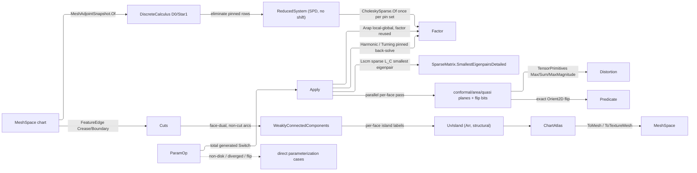

# [RASM_PARAMETERIZATION_FLATTEN]

`Flatten` solves UV parameterization from its variational energy: one `ParamOp` union folded by one `Flatten.Apply` lowers a disk-topology chart into the plane over the `Rasm.Meshing` discrete-exterior-calculus substrate. Every pinned solve eliminates the boundary rows, so the interior operator factors as an SPD system with exact constraints; a penalty or diagonal-shift formulation is the refused failure class.

Rebuild work composes the settled substrate: the `MeshAdjointSnapshot.Of` DEC handle for the cotangent `D0`/`Star1` operators, `CholeskySparse` and `SparseMatrix` for every direct and eigen solve, `Orient2D` the UV-flip floor, `FeatureEdge` the cut classifier, and QuikGraph `WeaklyConnectedComponents` the island labeler. `ChartAtlas` is the structural carrier the reconciliation `Encode` content-addresses.

## [01]-[INDEX]

- [02]-[PARAMETERIZATION]: `ParamOp` folds over the DEC substrate through the eliminated pinned solve into the content-keyed `ChartAtlas`.

## [02]-[PARAMETERIZATION]

- Owner: `Flatten` mints the static parameterization surface and `ChartId` the one chart identity every island carries — island labels alone, so a fault raised before islanding carries its own boundary or spectrum evidence rather than a negative sentinel every reader decodes.
- Cases: each `ParamOp` case carries its chart, its constraint payload, and its policy row, so `Apply` discriminates on the value alone — `Harmonic` pins an optional boundary polyline and `Turning` an optional turning angle per boundary vertex, and both lower through the one `FlattenBoundary` pinned Dirichlet back-solve, so the boundary-constrained modality is one solve with two pin sources.
- Entry: `Flatten.Apply(ParamOp)` rides the `Fin<ChartAtlas>` result, `ChartAtlas.Project<TOut>` its one typed egress — the host LSCM lane stays its own `SegmentKernel.ParameterizeFlattenDetailed` entry, so a caller names which formulation ran; the admitted `MeshSpace` is not re-validated, every genuine gate faults typed, and `ChartAtlas.ToMesh`/`ToTextureMesh` re-emit the chart with UV coordinates or the islands as 2D geometry. `UvIsland.Boundary(Context)` projects the island's oriented boundary loops onto the `Meshing/intersect` `Chain` carrier — outer CCW, holes CW off face winding — so every downstream nesting or development consumer reads one walker instead of re-deriving the cycle walk.
- Auto: modality dispatch is the union's total generated `Switch`, and every arm lowers the same `MeshDec.Of` DEC composition, differing only in the energy. `Assemble` scores distortion in one partition-disjoint parallel per-face pass, folds the distortion through `TensorPrimitives`, labels islands through QuikGraph over the face-dual, and refuses any flip typed.
- Law: bijectivity is atlas ADMISSION, never a stored column — `Assemble` reads the first flipped face slot and refuses the chart typed through `FlippedChart`, so every `ChartAtlas` a consumer holds is flip-free by construction and no `Distortion` field restates the verdict.
- Law: degeneracy is a LANE verdict, never an exact-zero read of a float — the reference triangle gates on `Context.For(ToleranceLane.Area)` and the UV singular values on `.For(ToleranceLane.Collapse)`, both hoisted off `MeshDec` once per run. A face inside either band carries NO map: `Jacobian` answers `Option`, the pass sets a degenerate bit, and `Assemble` lowers `DegenerateInput` before one distortion figure is claimed, so a degenerate chart can no longer pass the bijectivity gate on an untouched UV triangle.
- Law: the ARAP budget is `Cell.Converge` over one `Atom<Fin<Solved>>`; the transition supplies the terminal state, and an unconverged run leaves through typed `ParameterizationUnconverged` alone.
- Law: `ParamPolicy` has a private constructor and one admitting `Of`, so an inadmissible policy is unrepresentable and no entry re-tests a bool the value already proved.
- Law: boundary cycles have ONE walker — `Cycles.Of` over a functional successor map, shared by `UvIsland.Boundary` and `MeshDec.BoundaryLoops`, with one open-chain refusal instead of two divergent ones. It REFUSES QuikGraph's `StronglyConnectedComponents`, which answers the component set where this owner's whole product is the cyclic order the winding, the pin ring, and `IntegrateBoundary` read.
- Exemption: the `Assemble` distortion planes are pooled single-writer scratch leased and released inside the one method, and the `MeshDec`/`UvIsland` boundary tables are `Dictionary`/`HashSet` rebuilt inside one fold and dropped — none is a startup-admitted table, so none freezes. `ReducedSystem` memoizes ONE pin set on the `MeshDec` capsule and the memo rides `Option`, never a nullable tuple.
- Output: `Distortion` carries the conformal, area, and quasi-conformal distortion and the iteration count — the evidence the `Rasm.Fabrication` nesting strain gate reads; the exact-`Orient2D` bijectivity verdict is the atlas's admission gate, so it rides no field. `SolveResidual` is the one column every arm measures — the maximum U/V true residual the `LinearSolution` carries off the reduced factor, or the eigensolver's `MaxResidual` — read whole off the matrix owner and never projected away; `ConvergenceDelta`, `FactorNonZeros`, and `LscmEigenvalue` are `Option` because the arms measure different subsets: only ARAP iterates and carries a step delta, the eigen arm holds no Cholesky factor, and only the eigen arm has λ₃ of the conformal operator, which is the eigenvalue itself and never a gap to its neighbour.
- Packages: `Rasm.Meshing` (`MeshSpace`, `MeshAdjointSnapshot.Of` the DEC handle, `MeshEdit` soup + freeze), `Rasm.Domain` (`Context`/`ToleranceLane` the two degeneracy bands, `Cell.Converge` the ARAP driver), `Rasm.Processing` (`FeatureEdge`/`MeshFeatureKind` cut source), `Rasm.Numerics` (`SparseMatrix`/`CholeskySparse` solve owners, `Predicate.Orient2D` flip floor, `EpsilonPolicy` the residual anchor, `ResultProjection`/`ProjectionRow` the atlas egress), `Rhino.Geometry`, QuikGraph (face-dual `WeaklyConnectedComponents`), System.Numerics.Tensors (`TensorPrimitives` distortion folds), CommunityToolkit.HighPerformance (`MemoryOwner`/`ParallelHelper`), Rasm.Domain, Thinktecture.Runtime.Extensions, LanguageExt.Core (`Atom`/`Fin`).
- Growth: a new modality is one `ParamOp` case and one generated-`Switch` arm lowering the same substrate; a new distortion measure is one pooled plane and one `Distortion` field; a new constraint mode is one `ParamPolicy` column with its default on `Canonical` and its optional at `Of`, or one op-case payload; a new cut source is one `MeshFeatureKind` row.
- Boundary: the parameterization is the one polymorphic `ParamOp` union, never a sibling flattener-class family; every solve composes the `matrix.md` owners, never a raw `CSparse` or MathNet factorization; the DEC substrate is reached only through the public `MeshAdjointSnapshot.Of` handle, never a Geometry-side re-assembly or the internal `LaplacianCache`; the UV-flip verdict is the exact `Orient2D` sign, never a float signed-area band; a cut splits a chart into islands rather than discarding a region.

```csharp
// --- [IMPORTS] -------------------------------------------------------------------------
using System;
using System.Collections.Generic;
using System.Linq;
using System.Numerics.Tensors;
using System.Runtime.InteropServices;
using CommunityToolkit.HighPerformance.Buffers;
using CommunityToolkit.HighPerformance.Helpers;
using LanguageExt;
using QuikGraph;
using QuikGraph.Algorithms;
using Rasm.Domain;
using Rasm.Meshing;
using Rasm.Numerics;
using Rhino.Geometry;
using Thinktecture;
using static LanguageExt.Prelude;
using EdgeKeySet = System.Collections.Generic.HashSet<(int, int)>;
using IndexSet = System.Collections.Generic.HashSet<int>;
using Dimension = Rasm.Numerics.Dimension;
using Matrix2 = (double M00, double M01, double M10, double M11);
using Solved = (double[] U, double[] V, int Iterations, double Residual, LanguageExt.Option<int> FactorNonZeros, LanguageExt.Option<double> LscmEigenvalue, LanguageExt.Option<double> Delta);

namespace Rasm.Processing;

// --- [TYPES] ---------------------------------------------------------------------------
[ValueObject<int>(KeyMemberName = "Value", KeyMemberAccessModifier = AccessModifier.Public)]
public readonly partial struct ChartId;

// --- [CONSTANTS] -----------------------------------------------------------------------
public sealed record ParamPolicy {
    private ParamPolicy(PositiveMagnitude residual, Dimension iterations, Dimension eigen, VectorAngle crease, Dimension parallelFloor) =>
        (ResidualTolerance, MaxIterations, EigenBudget, CreaseDihedral, ParallelFloor) = (residual, iterations, eigen, crease, parallelFloor);

    public PositiveMagnitude ResidualTolerance { get; }
    public Dimension MaxIterations { get; }
    public Dimension EigenBudget { get; }
    public VectorAngle CreaseDihedral { get; }
    public Dimension ParallelFloor { get; }

    internal const double CreaseDihedralRadians = Math.PI / 6.0;

    public static readonly ParamPolicy Canonical = new(
        residual: PositiveMagnitude.Create(value: EpsilonPolicy.SqrtEpsilon),
        iterations: Dimension.Create(value: 64), eigen: Dimension.Create(value: 200),
        crease: VectorAngle.Create(value: CreaseDihedralRadians), parallelFloor: Dimension.Create(value: 4_096));

    public static Fin<ParamPolicy> Of(
        Option<double> residualTolerance = default, Option<double> creaseDihedral = default,
        Option<Dimension> maxIterations = default, Option<Dimension> eigenBudget = default,
        Option<Dimension> parallelFloor = default) {
        return from residual in residualTolerance.TraverseM(
                   value => FactoryBridge.Accept<PositiveMagnitude>(candidate: value)).As()
               from crease in creaseDihedral.TraverseM(
                   value => FactoryBridge.Accept<VectorAngle>(candidate: value)).As()
               let angle = crease.IfNone(Canonical.CreaseDihedral)
               from _ in guard(angle.Value < Math.PI, new KernelFault.InvalidInput())
               select new ParamPolicy(residual.IfNone(Canonical.ResidualTolerance),
                   maxIterations.IfNone(Canonical.MaxIterations), eigenBudget.IfNone(Canonical.EigenBudget),
                   angle, parallelFloor.IfNone(Canonical.ParallelFloor));
    }
}

// --- [MODELS] --------------------------------------------------------------------------
public sealed record UvIsland(ChartId Chart, Arr<int> Vertices, Arr<(int A, int B, int C)> Faces, Arr<Point2d> Uv) {
    public Fin<Seq<Chain>> Boundary(Context context) {
        double weld = context.For(ToleranceLane.Weld).Value;
        Dictionary<int, int> local = new(Vertices.Count);
        for (int i = 0; i < Vertices.Count; i++) local[Vertices[i]] = i;
        Dictionary<(int A, int B), int> census = new(Faces.Count * 3);
        foreach ((int a, int b, int c) in Faces)
            foreach ((int u, int v) in (ReadOnlySpan<(int, int)>)[(a, b), (b, c), (c, a)]) {
                (int lo, int hi) = u < v ? (u, v) : (v, u);
                census[(lo, hi)] = census.TryGetValue((lo, hi), out int count) ? count + 1 : 1;
            }
        Dictionary<int, int> successor = new();
        foreach ((int a, int b, int c) in Faces)
            foreach ((int u, int v) in (ReadOnlySpan<(int, int)>)[(a, b), (b, c), (c, a)]) {
                if (census[u < v ? (u, v) : (v, u)] != 1) continue;
                if (!successor.TryAdd(u, v)) return Fin.Fail<Seq<Chain>>(new GeometryFault.DegenerateInput(Kind.Mesh, u, "island-boundary: branching"));
            }
        return Cycles.Of(successor)
            .Bind(loops => loops.TraverseM(loop => {
                Polyline points = new();
                foreach (int at in loop) {
                    Point2d uv = Uv[local[at]];
                    Point3d point = new(uv.X, uv.Y, 0.0);
                    if (points.Count == 0 || points[^1].DistanceTo(point) > weld) points.Add(point);
                }
                if (points.Count < 3) {
                    return Fin.Fail<Chain>(new GeometryFault.DegenerateInput(Kind.Mesh, loop[0], "island-boundary: loop collapsed under weld"));
                }
                points.Add(points[0]);
                return Fin.Succ(new Chain(points));
            }).As())
            .Bind(chains => Acceptance.Value(value: chains.Strict()));
    }
}

public sealed record Distortion(
    double MaxConformal,
    double MeanConformal,
    double MaxArea,
    double MinArea,
    double MeanArea,
    double MaxQuasiConformal,
    int Iterations,
    double SolveResidual,
    Option<double> ConvergenceDelta,
    Option<int> FactorNonZeros,
    Option<double> LscmEigenvalue);

public sealed record ChartAtlas(MeshSpace Source, Seq<UvIsland> Islands, Seq<FeatureEdge> Cuts, Distortion Distortion) {
    internal Fin<TOut> Project<TOut>() {
        ChartAtlas self = this;
        return ResultProjection.Rows<ChartAtlas, TOut>(self: self,
            ProjectionRow.Of<Seq<UvIsland>>(() => Fin.Succ(self.Islands)),
            ProjectionRow.Of<Seq<FeatureEdge>>(() => Fin.Succ(self.Cuts)),
            ProjectionRow.Of<Distortion>(() => Fin.Succ(self.Distortion)),
            ProjectionRow.Of<MeshSpace>(() => self.ToMesh()));
    }

    public Fin<MeshSpace> ToMesh() {
        using MeshEdit edit = MeshEdit.Of(Source);
        Dictionary<(int, int, int), int> faceAt = new(edit.FaceCount);
        for (int f = 0; f < edit.FaceCount; f++) { faceAt[Cyclic(edit.Face(f))] = f; }
        foreach (UvIsland island in Islands) {
            Dictionary<int, int> at = new(island.Vertices.Count);
            for (int i = 0; i < island.Vertices.Count; i++) { at[island.Vertices[i]] = i; }
            foreach ((int a, int b, int c) in island.Faces)
                edit.SetCornerUv(faceAt[Cyclic((a, b, c))], island.Uv[at[a]], island.Uv[at[b]], island.Uv[at[c]]);
        }
        return edit.ToSpace();
    }

    private static (int, int, int) Cyclic((int A, int B, int C) t) =>
        t.A <= t.B && t.A <= t.C ? (t.A, t.B, t.C) : t.B <= t.C ? (t.B, t.C, t.A) : (t.C, t.A, t.B);

    public Fin<MeshSpace> ToTextureMesh() {
        List<Point3d> vertices = new();
        List<(int A, int B, int C)> faces = new();
        foreach (UvIsland island in Islands) {
            Dictionary<int, int> remap = new(island.Vertices.Count);
            for (int i = 0; i < island.Vertices.Count; i++) {
                remap[island.Vertices[i]] = vertices.Count;
                vertices.Add(new Point3d(island.Uv[i].X, island.Uv[i].Y, 0.0));
            }
            foreach ((int a, int b, int c) in island.Faces) faces.Add((remap[a], remap[b], remap[c]));
        }
        using MeshEdit edit = MeshEdit.Of(CollectionsMarshal.AsSpan(vertices), CollectionsMarshal.AsSpan(faces), Source.Tolerance);
        return edit.ToSpace();
    }
}

// --- [OPERATIONS] ----------------------------------------------------------------------
[Union(ConversionFromValue = ConversionOperatorsGeneration.None)]
public abstract partial record ParamOp {
    private ParamOp() { }

    public sealed record Harmonic(MeshSpace Chart, Option<Polyline> Boundary, ParamPolicy Policy) : ParamOp;
    public sealed record Lscm(MeshSpace Chart, ParamPolicy Policy) : ParamOp;
    public sealed record Arap(MeshSpace Chart, ParamPolicy Policy) : ParamOp;
    public sealed record Turning(MeshSpace Chart, Option<Arr<double>> TurningAngles, ParamPolicy Policy) : ParamOp;
}

public static class Flatten {
    public static readonly BenchClaim DistortionClaim = new(
        Claim: nameof(Distortion),
        VectorizedLane: "TensorPrimitives.Max/Sum/MaxMagnitude over the per-face distortion planes",
        ReferenceLane: "scalar element loops over the same planes",
        SpeedupFloor: 1.0);

    public static Fin<ChartAtlas> Apply(ParamOp op) {
        (MeshSpace chart, ParamPolicy policy) = op.Switch(
            harmonic: static value => (value.Chart, value.Policy),
            lscm: static value => (value.Chart, value.Policy),
            arap: static value => (value.Chart, value.Policy),
            turning: static value => (value.Chart, value.Policy));
        return MeshDec.Of(chart, policy, token).Bind(dec =>
            op.Switch(
                state: (Dec: dec, Key: token),
                harmonic: static (s, value) => FlattenHarmonic(value, s.Dec, s.Key),
                lscm: static (s, value) => FlattenLscm(s.Dec, value.Policy, s.Key),
                arap: static (s, value) => FlattenArap(s.Dec, value.Policy, s.Key),
                turning: static (s, value) => FlattenTurning(value, s.Dec, s.Key))
            .Bind(solved => Assemble(solved, chart, policy, dec, token)));
    }

    // --- [FLATTEN]
    static Fin<Solved> FlattenHarmonic(ParamOp.Harmonic op, MeshDec dec) =>
        dec.Disk().Bind(loop => op.Boundary.Match(
            Some: boundary => boundary.Count >= 2 && boundary.Length > 0.0
                ? Fin.Succ(Resample(boundary, loop.Length))
                : Fin.Fail<Point2d[]>(new GeometryFault.DegenerateInput(Kind.Curve, boundary.Count, "harmonic pin: degenerate boundary polyline")),
            None: () => Fin.Succ(UnitCircle(loop.Length)))
            .Bind(pinned => FlattenBoundary(dec, loop, pinned)));

    const int GaugeModes = 2;

    static Fin<Solved> FlattenLscm(MeshDec dec, ParamPolicy policy) =>
        dec.Loops.Length == 0
            ? Fin.Fail<Solved>(new GeometryFault.InvalidChartBoundary(0, None))
            : SparseMatrix.FromTriplets(Dimension.Create(2 * dec.VertexCount), Dimension.Create(2 * dec.VertexCount), dec.ConformalTriplets())
                .Bind(conformal => conformal.SmallestEigenpairsDetailed(k: GaugeModes + 1, tolerance: policy.ResidualTolerance.Value, budget: policy.EigenBudget))
                .Bind(eigen => eigen.PairsIn(expected: EigenOrder.Ascending).Bind(pairs => pairs.Count > GaugeModes
                    ? Fin.Succ(SplitComplex(dec, pairs[GaugeModes], eigen.Evidence.Iterations.IfNone(0), eigen.MaxResidual))
                    : Fin.Fail<Solved>(new GeometryFault.IncompleteParameterizationSpectrum(GaugeModes + 1, pairs.Count))));

    static Fin<Solved> FlattenArap(MeshDec dec, ParamPolicy policy) =>
        FlattenLscm(dec, policy).Bind(seed => {
            int[] gauge = [dec.Loops[0][0]];
            double tolerance = policy.ResidualTolerance.Value;
            return dec.Reduced(gauge).Bind(system => {
                using MemoryOwner<double> gradientU = MemoryOwner<double>.Allocate(dec.VertexCount, AllocationMode.Clear);
                using MemoryOwner<double> gradientV = MemoryOwner<double>.Allocate(dec.VertexCount, AllocationMode.Clear);
                Atom<Fin<Solved>> cell = Atom(value: Fin.Succ(seed));
                Transition<Fin<Solved>> driven = Cell.Converge(
                    cell: cell,
                    step: state => Some(state.Bind(active => Settled(active.Delta) ? Fin.Succ(active) : Step(active))),
                    settled: state => state.Match(Succ: active => Settled(active.Delta), Fail: static _ => true),
                    budget: policy.MaxIterations,
                    declined: new KernelFault.InvalidResult());
                return driven.Current.Bind(state => Settled(state.Delta)
                    ? Fin.Succ(state)
                    : Fin.Fail<Solved>(new GeometryFault.ParameterizationUnconverged(state.Delta, state.Iterations)));

                bool Settled(Option<double> delta) => delta.Exists(value => value <= tolerance);

                Fin<Solved> Step(Solved state) =>
                    dec.LocalRotations(state.U, state.V).Bind(rotations => {
                        dec.RotatedGradient(rotations, axis: 0, sink: gradientU.Memory);
                        dec.RotatedGradient(rotations, axis: 1, sink: gradientV.Memory);
                        return (from solvedU in system.Solve(k => state.U[gauge[k]], Some<ReadOnlyMemory<double>>(gradientU.Memory))
                                from solvedV in system.Solve(k => state.V[gauge[k]], Some<ReadOnlyMemory<double>>(gradientV.Memory))
                                select (U: solvedU, V: solvedV)).Map(solved => {
                            double[] nextU = system.Scatter(gauge, k => state.U[gauge[k]], solved.U.Solution);
                            double[] nextV = system.Scatter(gauge, k => state.V[gauge[k]], solved.V.Solution);
                            Span<double> delta = gradientU.Span;
                            TensorPrimitives.Subtract(nextU, state.U, delta);
                            double largest = TensorPrimitives.MaxMagnitude(delta);
                            TensorPrimitives.Subtract(nextV, state.V, delta);
                            largest = Math.Max(largest, TensorPrimitives.MaxMagnitude(delta));
                            return new Solved(nextU, nextV, state.Iterations + 1,
                                Math.Max(solved.U.Residual, solved.V.Residual), Some(system.FactorNonZeros), None, Some(largest));
                        });
                    });
            });
        });

    static Fin<Solved> FlattenTurning(ParamOp.Turning op, MeshDec dec) =>
        dec.Disk().Bind(loop => {
            Arr<double> turning = op.TurningAngles.IfNone(() =>
                new Arr<double>([.. Enumerable.Repeat(2.0 * Math.PI / loop.Length, loop.Length)]));
            return turning.Count != loop.Length || !turning.ForAll(static angle => ValidityClaim.Finite(value: angle))
                ? Fin.Fail<Solved>(new GeometryFault.DegenerateInput(Kind.Mesh, turning.Count, "boundary turning: finite angle per boundary vertex"))
                : FlattenBoundary(dec, loop, dec.IntegrateBoundary(loop, turning));
        });

    static Fin<Solved> FlattenBoundary(MeshDec dec, int[] loop, Point2d[] pinned) =>
        dec.Reduced(loop).Bind(system =>
            from solvedU in system.Solve(k => pinned[k].X)
            from solvedV in system.Solve(k => pinned[k].Y)
            select new Solved(
                system.Scatter(loop, k => pinned[k].X, solvedU.Solution),
                system.Scatter(loop, k => pinned[k].Y, solvedV.Solution),
                1, Math.Max(solvedU.Residual, solvedV.Residual), Some(system.FactorNonZeros), None, None));

    static Solved SplitComplex(
        MeshDec dec, (double Eigenvalue, Arr<double> Eigenvector) pair, int iterations, double residual) {
        int n = dec.VertexCount;
        double[] u = new double[n];
        double[] v = new double[n];
        for (int i = 0; i < n; i++) { u[i] = pair.Eigenvector[i]; v[i] = pair.Eigenvector[n + i]; }
        return new Solved(u, v, iterations, residual, None, Some(pair.Eigenvalue), None);
    }

    // --- [SCORE_AND_ASSEMBLE]
    static Fin<ChartAtlas> Assemble(Solved solved, MeshSpace chartSpace, ParamPolicy policy, MeshDec dec) {
        int vertices = dec.VertexCount, faces = dec.FaceCount;
        using MemoryOwner<double> planes = MemoryOwner<double>.Allocate((2 * vertices) + (3 * faces), AllocationMode.Clear);
        using MemoryOwner<bool> verdicts = MemoryOwner<bool>.Allocate(2 * faces, AllocationMode.Clear);
        Memory<double> u = planes.Memory.Slice(0, vertices), v = planes.Memory.Slice(vertices, vertices);
        Memory<double> conformal = planes.Memory.Slice(2 * vertices, faces);
        Memory<double> area = planes.Memory.Slice((2 * vertices) + faces, faces);
        Memory<double> quasi = planes.Memory.Slice((2 * vertices) + (2 * faces), faces);
        Memory<bool> flip = verdicts.Memory.Slice(0, faces), degenerate = verdicts.Memory.Slice(faces, faces);
        solved.U.CopyTo(u.Span);
        solved.V.CopyTo(v.Span);
        ParallelHelper.For(0, dec.FaceCount,
            new DistortionPass(dec, u, v, conformal, area, quasi, flip, degenerate, dec.CollapseFloor),
            policy.ParallelFloor.Value);
        int invalid = degenerate.Span.IndexOf(true);
        if (invalid >= 0) return Fin.Fail<ChartAtlas>(new GeometryFault.DegenerateInput(Kind.Mesh, invalid, "parameterization: degenerate reference triangle"));
        int flipped = flip.Span.IndexOf(true);
        (Seq<UvIsland> islands, ChartId flippedChart) = Islands(u, v, dec, Math.Max(flipped, 0));
        Distortion distortion = Fold(conformal.Span, area.Span, quasi.Span, dec.FaceCount, solved);
        return flipped < 0
            ? Fin.Succ(new ChartAtlas(chartSpace, islands, dec.Cuts, distortion))
            : Fin.Fail<ChartAtlas>(new GeometryFault.FlippedChart(flippedChart, distortion.MaxConformal));
    }

    readonly struct DistortionPass(MeshDec dec, ReadOnlyMemory<double> u, ReadOnlyMemory<double> v, Memory<double> conformal, Memory<double> area, Memory<double> quasi, Memory<bool> flip, Memory<bool> degenerate, double collapseFloor) : IAction {
        public void Invoke(int f) {
            (int a, int b, int c) = dec.Face(f);
            (Point2d ua, Point2d ub, Point2d uc) = (At(a), At(b), At(c));
            if (dec.JacobianSingularValues(f, ua, ub, uc).Case is not ValueTuple<double, double> sigma) {
                degenerate.Span[f] = true;
                return;
            }
            (double s1, double s2) = sigma;
            if (s2 <= collapseFloor || (s1 + s2) <= collapseFloor) {
                degenerate.Span[f] = true;
                return;
            }
            conformal.Span[f] = s1 / s2;
            area.Span[f] = s1 * s2;
            quasi.Span[f] = (s1 - s2) / (s1 + s2);
            flip.Span[f] = Predicate.Orient2D(Lift(ua), Lift(ub), Lift(uc)) == Sign.Negative;

            Point2d At(int vertex) => new(u.Span[vertex], v.Span[vertex]);
            static Point3d Lift(Point2d p) => new(p.X, p.Y, 0.0);
        }
    }

    static Distortion Fold(ReadOnlySpan<double> c, ReadOnlySpan<double> a, ReadOnlySpan<double> q, int n, Solved solved) {
        return new Distortion(
            MaxConformal: TensorPrimitives.Max(c), MeanConformal: TensorPrimitives.Sum(c) / n,
            MaxArea: TensorPrimitives.Max(a), MinArea: TensorPrimitives.Min(a), MeanArea: TensorPrimitives.Sum(a) / n,
            MaxQuasiConformal: TensorPrimitives.MaxMagnitude(q),
            Iterations: solved.Iterations, SolveResidual: solved.Residual, ConvergenceDelta: solved.Delta,
            FactorNonZeros: solved.FactorNonZeros, LscmEigenvalue: solved.LscmEigenvalue);
    }

    static (Seq<UvIsland> Islands, ChartId Probe) Islands(
        ReadOnlyMemory<double> u, ReadOnlyMemory<double> v, MeshDec dec, int probeFace) {
        AdjacencyGraph<int, SEdge<int>> dual = new(allowParallelEdges: false);
        dual.AddVertexRange(Enumerable.Range(0, dec.FaceCount));
        foreach (((int a, int b), int left, int right) in dec.InteriorEdges()) {
            if (!dec.IsCutEdge(a, b)) dual.AddEdge(new SEdge<int>(left, right));
        }
        Dictionary<int, int> components = new(dec.FaceCount);
        int count = dual.WeaklyConnectedComponents(components);
        List<int>[] vertices = new List<int>[count];
        List<(int A, int B, int C)>[] faces = new List<(int A, int B, int C)>[count];
        IndexSet[] seen = new IndexSet[count];
        for (int id = 0; id < count; id++) { vertices[id] = []; faces[id] = []; seen[id] = []; }
        for (int face = 0; face < dec.FaceCount; face++) {
            int id = components[face];
            (int a, int b, int c) = dec.Face(face);
            faces[id].Add((a, b, c));
            if (seen[id].Add(a)) vertices[id].Add(a);
            if (seen[id].Add(b)) vertices[id].Add(b);
            if (seen[id].Add(c)) vertices[id].Add(c);
        }
        Seq<UvIsland> islands = toSeq(Enumerable.Range(0, count).Select(id => new UvIsland(
            ChartId.Create(id), toArray(vertices[id]), toArray(faces[id]),
            toArray(vertices[id].Select(vertex => new Point2d(u.Span[vertex], v.Span[vertex])))))).Strict();
        return (islands, ChartId.Create(components[probeFace]));
    }

    // --- [PRIMITIVES]
    static Point2d[] UnitCircle(int count) =>
        [.. Enumerable.Range(0, count).Select(i => { double t = 2.0 * Math.PI * i / count; return new Point2d(Math.Cos(t), Math.Sin(t)); })];

    static Point2d[] Resample(Polyline boundary, int count) {
        double[] cumulative = new double[boundary.Count];
        for (int v = 1; v < boundary.Count; v++) cumulative[v] = cumulative[v - 1] + boundary[v - 1].DistanceTo(boundary[v]);
        double step = cumulative[^1] / count;
        return [.. Enumerable.Range(0, count).Select(i => {
            double target = i * step;
            int hit = System.Array.BinarySearch(cumulative, target);
            int segment = Math.Min(hit >= 0 ? hit : ~hit - 1, boundary.Count - 2);
            double span = cumulative[segment + 1] - cumulative[segment];
            Point3d p = boundary.PointAt(segment + (span > 0.0 ? (target - cumulative[segment]) / span : 0.0));
            return new Point2d(p.X, p.Y);
        })];
    }
}

// --- [COMPOSITION] ---------------------------------------------------------------------
file static class Cycles {
    internal static Fin<Seq<Seq<int>>> Of(Dictionary<int, int> successor) {
        Seq<Seq<int>> loops = [];
        IndexSet seen = new(successor.Count);
        foreach (int seed in successor.Keys.OrderBy(static value => value)) {
            if (!seen.Add(seed)) continue;
            Seq<int> loop = Seq(seed);
            int at = seed;
            while (true) {
                if (!successor.TryGetValue(at, out int step))
                    return Fin.Fail<Seq<Seq<int>>>(new GeometryFault.DegenerateInput(Kind.Mesh, at, "boundary: open half-edge chain"));
                if (step == seed) break;
                if (!seen.Add(step))
                    return Fin.Fail<Seq<Seq<int>>>(new GeometryFault.DegenerateInput(Kind.Mesh, step, "boundary: two half-edges share one head"));
                loop = loop.Add(step);
                at = step;
            }
            loops = loops.Add(loop);
        }
        return loops.IsEmpty
            ? Fin.Fail<Seq<Seq<int>>>(new GeometryFault.DegenerateInput(Kind.Mesh, None, "boundary: no closed loop"))
            : Fin.Succ(loops);
    }
}

file sealed record ReducedSystem(CholeskySparse Factor, int[] Map, (int Interior, int PinnedSlot, double Weight)[] Couplings, int InteriorCount) {
    public int FactorNonZeros => Factor.FactorNonZeros;

    public Fin<LinearSolution> Solve(
        Func<int, double> pinnedValue, Option<ReadOnlyMemory<double>> source = default) {
        double[] rhs = new double[InteriorCount];
        source.Iter(memory => {
            ReadOnlySpan<double> plane = memory.Span;
            for (int vertex = 0; vertex < Map.Length; vertex++)
                if (Map[vertex] >= 0) rhs[Map[vertex]] = plane[vertex];
        });
        foreach ((int i, int slot, double w) in Couplings) rhs[i] += w * pinnedValue(slot);
        return Factor.SolveDetailed(new Arr<double>(rhs));
    }

    public double[] Scatter(int[] pinned, Func<int, double> pinnedValue, Arr<double> interior) {
        double[] full = new double[Map.Length];
        for (int vertex = 0; vertex < Map.Length; vertex++) { if (Map[vertex] >= 0) full[vertex] = interior[Map[vertex]]; }
        for (int k = 0; k < pinned.Length; k++) full[pinned[k]] = pinnedValue(k);
        return full;
    }
}

file sealed class MeshDec {
    public readonly DiscreteCalculus Calculus;
    public readonly int VertexCount;
    public readonly int FaceCount;
    public readonly Context Tolerance;
    public readonly int[][] Loops;
    public readonly Seq<FeatureEdge> Cuts;
    readonly Mesh native;
    readonly EdgeKeySet cutEdges;
    Option<(int[] Pins, ReducedSystem System)> reduced = None;

    MeshDec(DiscreteCalculus calculus, Mesh native, Context tolerance, int[][] loops, Seq<FeatureEdge> cuts, EdgeKeySet cutEdges) {
        (Calculus, this.native, Tolerance, Loops, Cuts, this.cutEdges) = (calculus, native, tolerance, loops, cuts, cutEdges);
        (VertexCount, FaceCount) = (native.Vertices.Count, native.Faces.Count);
    }

    public double AreaFloor => Tolerance.For(ToleranceLane.Area).Value;
    public double CollapseFloor => Tolerance.For(ToleranceLane.Collapse).Value;

    public static Fin<MeshDec> Of(MeshSpace chart, ParamPolicy policy) =>
        from snapshot in MeshAdjointSnapshot.Of(chart)
        from _ in guard(snapshot.FaceCount > 0, new GeometryFault.DegenerateInput(Kind.Mesh, snapshot.FaceCount, "parameterization: faceless chart"))
        from featurePolicy in MeshFeaturePolicy.Of(dihedralRadians: policy.CreaseDihedral.Value, space: chart, faceRegions: Option<Arr<int>>.None)
        from features in SegmentKernel.DetectFeatureEdgesDetailed(space: chart, policy: featurePolicy)
        let native = chart.DuplicateNative()
        let cuts = features.Edges.Filter(static e => e.Kind.Equals(MeshFeatureKind.Crease) || e.Kind.Equals(MeshFeatureKind.Boundary))
        let cutEdges = cuts.Map(static e => Order(e.A, e.B)).ToHashSet()
        from loops in BoundaryLoops(native)
        select new MeshDec(snapshot.Calculus, native, chart.Tolerance, loops, cuts, cutEdges);

    public Fin<int[]> Disk() =>
        Loops.Length == 1 && Loops[0].Length >= 3
            ? Fin.Succ(Loops[0])
            : Fin.Fail<int[]>(new GeometryFault.InvalidChartBoundary(Loops.Length, Loops.Length == 1 ? Some(Loops[0].Length) : None));

    public Fin<ReducedSystem> Reduced(int[] pinned) {
        if (reduced.Filter(held => held.Pins.AsSpan().SequenceEqual(pinned)).Map(static held => held.System).Case is ReducedSystem hit) {
            return Fin.Succ(hit);
        }
        Dictionary<int, int> slot = new(pinned.Length);
        for (int k = 0; k < pinned.Length; k++) slot[pinned[k]] = k;
        int[] map = new int[VertexCount];
        int interior = 0;
        for (int vertex = 0; vertex < VertexCount; vertex++) map[vertex] = slot.ContainsKey(vertex) ? -1 : interior++;
        List<(int Row, int Col, double Value)> triplets = new();
        List<(int Interior, int PinnedSlot, double Weight)> couplings = new();
        using MemoryOwner<double> diagonalOwner = MemoryOwner<double>.Allocate(interior, AllocationMode.Clear);
        Span<double> diagonal = diagonalOwner.Span;
        foreach ((int i, int j, double w) in StiffnessEdges()) {
            (int ri, int rj) = (map[i], map[j]);
            if (ri >= 0) diagonal[ri] += w;
            if (rj >= 0) diagonal[rj] += w;
            if (ri >= 0 && rj >= 0) { triplets.Add((ri, rj, -w)); triplets.Add((rj, ri, -w)); }
            else if (ri >= 0) couplings.Add((ri, slot[j], w));
            else if (rj >= 0) couplings.Add((rj, slot[i], w));
        }
        for (int d = 0; d < interior; d++) triplets.Add((d, d, diagonal[d]));
        return SparseMatrix.FromTriplets(Dimension.Create(interior), Dimension.Create(interior), triplets)
            .Bind(stiffness => CholeskySparse.Of(stiffness))
            .Map(factor => {
                ReducedSystem system = new(factor, map, [.. couplings], interior);
                reduced = Some(([.. pinned], system));
                return system;
            });
    }

    public IEnumerable<(int I, int J, double W)> StiffnessEdges() {
        DiscreteCalculus dec = Calculus;
        for (int e = 0; e < dec.D0.Rows.Value; e++) {
            int start = dec.D0.RowPtr[e], end = dec.D0.RowPtr[e + 1];
            if (end - start != 2) continue;
            yield return (dec.D0.ColInd[start], dec.D0.ColInd[start + 1], dec.Star1[e]);
        }
    }

    public IEnumerable<(int Row, int Col, double Value)> ConformalTriplets() {
        int n = VertexCount;
        foreach ((int i, int j, double w) in StiffnessEdges()) {
            yield return (i, i, w); yield return (j, j, w); yield return (i, j, -w); yield return (j, i, -w);
            yield return (n + i, n + i, w); yield return (n + j, n + j, w); yield return (n + i, n + j, -w); yield return (n + j, n + i, -w);
        }
        foreach (int[] loop in Loops) {
            for (int k = 0; k < loop.Length; k++) {
                (int i, int j) = (loop[k], loop[(k + 1) % loop.Length]);
                yield return (i, n + j, -0.5); yield return (n + j, i, -0.5);
                yield return (j, n + i, 0.5); yield return (n + i, j, 0.5);
            }
        }
    }

    public Fin<Matrix2[]> LocalRotations(double[] u, double[] v) {
        MeshDec self = this;
        return toSeq(Enumerable.Range(start: 0, count: FaceCount))
            .TraverseM(f => {
                (int a, int b, int c) = self.Face(f);
                return self.PolarRotation(f, new Point2d(u[a], v[a]), new Point2d(u[b], v[b]), new Point2d(u[c], v[c]))
                    .ToFin(new GeometryFault.DegenerateInput(Kind.Mesh, f, "parameterization: degenerate reference triangle"));
            })
            .As()
            .Map(static rotations => rotations.ToArray());
    }

    public void RotatedGradient(Matrix2[] rotations, int axis, Memory<double> sink) {
        Span<double> b = sink.Span;
        b.Clear();
        for (int f = 0; f < FaceCount; f++) {
            (int i, int j, int k) = Face(f);
            (double cotI, double cotJ, double cotK) = Cotangents(f);
            AccumulateRotated(b, rotations[f], f, axis, i, j, k, cotI, cotJ, cotK);
        }
    }

    public Option<(double S1, double S2)> JacobianSingularValues(int face, Point2d ua, Point2d ub, Point2d uc) =>
        Jacobian(face, ua, ub, uc).Map(SingularValues);

    public (int A, int B, int C) Face(int face) { MeshFace mf = native.Faces.GetFace(face); return (mf.A, mf.B, mf.C); }

    public IEnumerable<((int U, int V) Edge, int FaceA, int FaceB)> InteriorEdges() {
        Dictionary<(int, int), int> first = new(3 * FaceCount);
        for (int f = 0; f < FaceCount; f++) {
            (int a, int b, int c) = Face(f);
            foreach ((int u, int v) in Sides(a, b, c)) {
                if (first.TryGetValue((u, v), out int other)) yield return ((u, v), other, f);
                else first[(u, v)] = f;
            }
        }

        static IEnumerable<(int, int)> Sides(int a, int b, int c) {
            yield return Order(a, b); yield return Order(b, c); yield return Order(c, a);
        }
    }

    public bool IsCutEdge(int u, int v) => cutEdges.Contains(Order(u, v));

    public Point2d[] IntegrateBoundary(int[] loop, Arr<double> turning) {
        Point2d[] curve = new Point2d[loop.Length];
        double angle = 0.0;
        Point2d cursor = new(0.0, 0.0);
        for (int k = 0; k < loop.Length; k++) {
            curve[k] = cursor;
            double length = Vertex(loop[k]).DistanceTo(Vertex(loop[(k + 1) % loop.Length]));
            cursor += new Vector2d(length * Math.Cos(angle), length * Math.Sin(angle));
            angle += turning[k];
        }
        Vector2d gap = curve[0] - cursor;
        for (int k = 0; k < loop.Length; k++) curve[k] += ((double)k / loop.Length) * gap;
        return curve;
    }

    (Point3d A, Point3d B, Point3d C) FacePoints(int face) {
        (int a, int b, int c) = Face(face);
        return (Vertex(a), Vertex(b), Vertex(c));
    }

    Point3d Vertex(int index) { Point3f v = native.Vertices[index]; return new Point3d(v.X, v.Y, v.Z); }

    (double CotI, double CotJ, double CotK) Cotangents(int face) {
        (Point3d a, Point3d b, Point3d c) = FacePoints(face);
        double floor = AreaFloor;
        return (Cotangent(b, a, c, floor), Cotangent(c, b, a, floor), Cotangent(a, c, b, floor));
    }

    Option<Matrix2> PolarRotation(int face, Point2d ua, Point2d ub, Point2d uc) =>
        Jacobian(face, ua, ub, uc).Bind(jacobian => {
            (double s1, double s2) = SingularValues(jacobian);
            if (s1 + s2 <= CollapseFloor) return Option<Matrix2>.None;
            double det = (jacobian.M00 * jacobian.M11) - (jacobian.M01 * jacobian.M10);
            double scale = 1.0 / (s1 + s2);
            double r00 = (jacobian.M00 + jacobian.M11) * scale, r01 = (jacobian.M01 - jacobian.M10) * scale;
            return Some(det < 0.0 ? new Matrix2(r00, -r01, -r01, -r00) : new Matrix2(r00, r01, -r01, r00));
        });

    (Point2d Rb, Point2d Rc) Reference(int face) {
        (Point3d pa, Point3d pb, Point3d pc) = FacePoints(face);
        Vector3d ab = pb - pa, ac = pc - pa;
        Vector3d x = ab; x.Unitize();
        Vector3d normal = Vector3d.CrossProduct(ab, ac); normal.Unitize();
        Vector3d y = Vector3d.CrossProduct(normal, x);
        return (new Point2d(ab.Length, 0.0), new Point2d(ac * x, ac * y));
    }

    Option<Matrix2> Jacobian(int face, Point2d ua, Point2d ub, Point2d uc) {
        (Point2d rb, Point2d rc) = Reference(face);
        double det = rb.X * rc.Y;
        if (Math.Abs(det) <= AreaFloor) return Option<Matrix2>.None;
        (double u1x, double u2x, double u1y, double u2y) = (ub.X - ua.X, uc.X - ua.X, ub.Y - ua.Y, uc.Y - ua.Y);
        return Some(new Matrix2(
            u1x * rc.Y / det, ((u2x * rb.X) - (u1x * rc.X)) / det,
            u1y * rc.Y / det, ((u2y * rb.X) - (u1y * rc.X)) / det));
    }

    void AccumulateRotated(Span<double> b, Matrix2 rotation, int face, int axis, int i, int j, int k, double cotI, double cotJ, double cotK) {
        (Point3d pi, Point3d pj, Point3d pk) = FacePoints(face);
        Vector3d eij = pj - pi, ejk = pk - pj, eki = pi - pk;
        (double rx, double ry) = (axis == 0 ? rotation.M00 : rotation.M10, axis == 0 ? rotation.M01 : rotation.M11);
        b[i] += cotK * (rx * eij.X + ry * eij.Y) - cotJ * (rx * eki.X + ry * eki.Y);
        b[j] += cotI * (rx * ejk.X + ry * ejk.Y) - cotK * (rx * eij.X + ry * eij.Y);
        b[k] += cotJ * (rx * eki.X + ry * eki.Y) - cotI * (rx * ejk.X + ry * ejk.Y);
    }

    static double Cotangent(Point3d apex, Point3d u, Point3d v, double areaFloor) {
        Vector3d a = u - apex, b = v - apex;
        double cross = Vector3d.CrossProduct(a, b).Length;
        return cross <= areaFloor ? 0.0 : (a * b) / cross;
    }

    static (double S1, double S2) SingularValues(Matrix2 m) {
        double e = (m.M00 + m.M11) * 0.5, f = (m.M00 - m.M11) * 0.5, g = (m.M10 + m.M01) * 0.5, h = (m.M10 - m.M01) * 0.5;
        double q = Math.Sqrt(e * e + h * h), r = Math.Sqrt(f * f + g * g);
        return (q + r, Math.Abs(q - r));
    }

    static (int, int) Order(int u, int v) => u < v ? (u, v) : (v, u);

    static Fin<int[][]> BoundaryLoops(Mesh mesh) {
        EdgeKeySet directed = new(3 * mesh.Faces.Count);
        for (int face = 0; face < mesh.Faces.Count; face++) {
            MeshFace row = mesh.Faces.GetFace(face);
            directed.Add((row.A, row.B)); directed.Add((row.B, row.C)); directed.Add((row.C, row.A));
        }
        Dictionary<int, int> next = new();
        foreach ((int u, int v) in directed) if (!directed.Contains((v, u))) next[u] = v;
        return next.Count == 0
            ? Fin.Succ(System.Array.Empty<int[]>())
            : Cycles.Of(next).Map(static loops => loops.Map(static loop => loop.ToArray()).ToArray());
    }
}
```



## [03]-[RESEARCH]

<!-- source-only: research row template:
[TOKEN]-[OPEN|BLOCKED]: <exact question>; <verification route>.
-->

(none)
