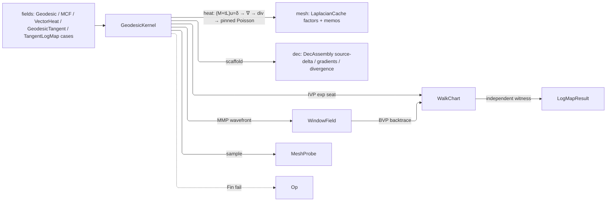

# [RASM_DISTANCE_GEODESICS]

`Geodesics` owns the on-mesh distance-and-tangent-transport suite over `MeshSpace`: every solver runs against the shared `LaplacianCache`, so repeated sampling of one distance, curvature, wavefront, or transport field pays a single solve. `fields` `ScalarField`/`VectorField` case names delegate their bodies here as frozen contract, and every linear system rides the `matrix` owners this page never re-derives.

Every linear solve rides the `matrix` owners — `CholeskySparse.SolveDetailed` factors and `SparseMatrix.SingularSolveDetailed` under the pinned min-zero gauge, each `LinearSolution` READ rather than projected away — while the heat scaffold composes the `dec` source-delta, gradient, and divergence operators as settled. Memoization rides `LaplacianCache`'s type-keyed `Memoized` entry over the frozen `IntrinsicMesh` snapshot and the scalar-heat and connection Cholesky factors; `FrameBundle` and `MeshProbe` are the one tangent-frame and closest-face owners shared with the sibling shape page.

## [01]-[INDEX]

- [02]-[HEAT_DISTANCE]: heat-method geodesic distance, geodesic tangent, and implicit MCF as cache-memoized per-vertex fields sampled through `MeshProbe`.
- [03]-[EXACT_GEODESICS]: MMP window propagation, the one `WalkChart` tracer over IVP/BVP/overlay seats, and the BVP source backtrace with its independent distance witness.
- [04]-[TANGENT_TRANSPORT]: vector-heat parallel transport, the three-arm `LogMapAlgorithm` log-map surface, and the `LogMapTrace` evidence.

## [02]-[HEAT_DISTANCE]

- Owner: cache probes are the admitted values themselves (memo identity = value identity: the ordered-distinct source `Seq`, the `(timeStep, iterations)` pair, `unit` for parameterless computations whose result type keeps the slot distinct); `FrameBundle` the frame memo seating the per-vertex tangent frames on the snapshot cache — the ONE tangent encode/decode owner this page and the sibling shape page share, refusing typed at a vertex whose normal never seated; `MeshProbe` the shared closest-face sampling substrate (`ClosestFace`, scalar/complex barycentric interpolation, the scale-derived search distance `max(tolerance, mean edge)` seated at the closest-point probe); the `GeodesicKernel` heat-distance arms.
- Entry: `GeodesicKernel.HeatGeodesicAt(space, sources, sample, key)` → `Fin<double>`; `GeodesicKernel.GeodesicTangentAt(space, sources, sample, key)` → `Fin<Vector3d>`; `GeodesicKernel.MeanCurvatureMagnitudeAt(space, timeStep, iterations, sample, key)` → `Fin<double>` — all reached through the frozen `ScalarField.Geodesic`/`MeanCurvatureFlow` and `VectorField.GeodesicTangent` case delegations; sources are deduplicated and ordered before probing the cache so permuted source sets hit one memo.
- Auto: heat pipeline guards the intrinsic snapshot un-flipped (heat distance on a flipped IDT is `Unsupported`, never silently extrinsic), selects the `MeshLaplacian.IntrinsicDelaunay` Laplacian, seats the Crane time `t = h²` off the cached mean edge length, solves `(M+tL)u = δ` through the cached scalar-heat Cholesky, normalizes the per-face gradient field, scatters the cotan vertex divergence, and closes with the pinned singular Poisson solve (`GaugePolicy.Pinned([.. sources], mass, GaugeShift.MinZero)`) shifted so the minimum is zero at the sources — distances are nonnegative by construction. MCF factors `(M + tL)` ONCE and backward-Euler iterates the three coordinate axes as mass-weighted solves (`TraverseM` over axes), returning per-vertex displacement magnitudes. Geodesic-tangent sampling reads the per-face gradient of the cached distance field at the closest face, rejecting degenerate faces.
- Output: the distance/displacement fields are cached `Arr<double>` per-vertex carriers; failure evidence routes the typed fault channel (`InvalidInput` for empty/out-of-range sources or non-positive time, `InvalidResult` for degenerate scale, `Unsupported` for flipped intrinsic snapshots).
- Law: every sparse solve READS its `LinearSolution` through the one `Solved` gate — `IsValid` folds the stop's usability — so an unusable factorization refuses typed instead of caching a divergent field as a distance.
- Boundary: the `dec` scaffold (`SourceDelta`/`FaceGradients`/`Divergence`) composes as settled; `MeshProbe` is the one closest-face interpolation owner the sibling shape page composes; the heat time is scale-derived (`h²`), since transport spread is vector heat's semantic and distance carries none.

```csharp
// --- [IMPORTS] -------------------------------------------------------------------------
using System;
using System.Collections.Generic;
using System.Linq;
using System.Numerics;
using System.Numerics.Tensors;
using System.Runtime.InteropServices;
using LanguageExt;
using Rasm.Domain;
using Rasm.Meshing;
using Rasm.Numerics;
using Rhino;
using Rhino.Geometry;
using Thinktecture;
using static LanguageExt.Prelude;
using IndexSet = System.Collections.Generic.HashSet<int>;
using IntrinsicEdge = Rasm.Meshing.MeshKernel.IntrinsicEdge;
using IntrinsicMesh = Rasm.Meshing.MeshKernel.IntrinsicMesh;
using Dimension = Rasm.Numerics.Dimension;

namespace Rasm.Processing;

// --- [MODELS] --------------------------------------------------------------------------
internal sealed record FrameBundle(Vector3d[] X, Vector3d[] Y, Vector3d[] N, bool[] Seated, int DegenerateVertexCount) {
    internal static Fin<FrameBundle> Of(MeshSpace space) =>
        space.Cache.Memoized(probe: unit, compute: () => Fin.Succ(Compute(mesh: space.Native)));
    internal Option<Complex> Tangent(Vector3d direction, int vertex) =>
        vertex >= 0 && vertex < Seated.Length && Seated[vertex]
            ? Some(new Complex(real: direction * X[vertex], imaginary: direction * Y[vertex]))
            : Option<Complex>.None;
    private static FrameBundle Compute(Mesh mesh) {
        int n = mesh.Vertices.Count;
        using Mesh active = mesh.DuplicateMesh();
        _ = active.FaceNormals.ComputeFaceNormals();
        _ = active.Normals.ComputeNormals();
        Vector3d[] normals = new Vector3d[n]; Vector3d[] xAxes = new Vector3d[n]; Vector3d[] yAxes = new Vector3d[n];
        bool[] seated = new bool[n]; int degenerate = 0;
        for (int v = 0; v < n; v++) {
            Vector3d normal = v < active.Normals.Count ? (Vector3d)active.Normals[index: v] : Vector3d.ZAxis;
            Vector3d tx = normal.IsValid && !normal.IsTiny() && normal.Unitize() ? VectorFrame.SeedPerpendicular(axis: normal) : Vector3d.Zero;
            seated[v] = tx.IsValid && !tx.IsTiny() && tx.Unitize();
            if (!seated[v]) { degenerate++; normal = Vector3d.ZAxis; tx = Vector3d.XAxis; }
            normals[v] = normal; xAxes[v] = tx; yAxes[v] = Vector3d.CrossProduct(a: normal, b: tx);
        }
        return new FrameBundle(X: xAxes, Y: yAxes, N: normals, Seated: seated, DegenerateVertexCount: degenerate);
    }
}

// --- [OPERATIONS] ----------------------------------------------------------------------
internal static class MeshProbe {
    internal static Fin<T> ClosestFace<T>(MeshSpace space, Point3d sample, Func<Mesh, MeshFace, double[], int, Fin<T>> project) {
        MeshPoint meshPoint = space.Native.ClosestMeshPoint(testPoint: sample,
            maximumDistance: Math.Max(space.Tolerance.Absolute.Value, space.Cache.MeanEdgeLength));
        return meshPoint is null || meshPoint.FaceIndex < 0
            ? Fin.Fail<T>(new KernelFault.InvalidResult())
            : project(space.Native, space.Native.Faces[index: meshPoint.FaceIndex], meshPoint.T, meshPoint.FaceIndex);
    }
    internal static Fin<double> ScalarOn(MeshSpace space, Point3d sample, Arr<double> perVertex) =>
        ClosestFace(space, sample, (_, face, weights, _) => {
            double value = (weights[0] * perVertex[face.A]) + (weights[1] * perVertex[face.B]) + (weights[2] * perVertex[face.C]);
            return Acceptance.Value(face.IsQuad ? value + (weights[3] * perVertex[face.D]) : value);
        });
    internal static Fin<Vector3d> ComplexBlend(MeshSpace space, Point3d sample, Complex[] perVertex, Func<Complex, Vector3d, Vector3d, Vector3d> decode) =>
        FrameBundle.Of(space: space).Bind(frames =>
            ClosestFace(space: space, sample: sample, project: (_, face, weights, _) => Acceptance.Value(value:
                BarycentricVector(face: face, weights: weights, at: vertex => decode(perVertex[vertex], frames.X[vertex], frames.Y[vertex])))));
    internal static Vector3d BarycentricVector(MeshFace face, double[] weights, Func<int, Vector3d> at) =>
        (weights[0] * at(face.A)) + (weights[1] * at(face.B)) + (weights[2] * at(face.C)) + (face.IsQuad ? weights[3] * at(face.D) : Vector3d.Zero);
}

internal static partial class GeodesicKernel {
    internal static Fin<Arr<double>> Solved(Fin<LinearSolution> solve) =>
        solve.Bind(solved => solved.IsValid ? Fin.Succ(solved.Solution) : Fin.Fail<Arr<double>>(new KernelFault.InvalidResult()));

    // --- [HEAT_METHOD]
    internal static Fin<double> HeatGeodesicAt(MeshSpace space, Seq<int> sources, Point3d sample) =>
        from distances in EnsureGeodesicDistances(space: space, sources: sources)
        from value in MeshProbe.ScalarOn(space: space, sample: sample, perVertex: distances)
        select value;
    internal static Fin<Vector3d> GeodesicTangentAt(MeshSpace space, Seq<int> sources, Point3d sample) =>
        from distances in EnsureGeodesicDistances(space: space, sources: sources)
        from tangent in Fin.Succ(DecAssembly.FaceGradients(mesh: space.Native, u: distances))
        from value in MeshProbe.ClosestFace(space: space, sample: sample, project: (mesh, face, _, faceIndex) => {
            if (!face.IsTriangle) return Fin.Fail<Vector3d>(error: new KernelFault.InvalidResult());
            double twoArea = Vector3d.CrossProduct(a: mesh.Vertices[index: face.B] - mesh.Vertices[index: face.A], b: mesh.Vertices[index: face.C] - mesh.Vertices[index: face.A]).Length;
            return twoArea < EpsilonPolicy.ZeroTolerance ? Fin.Fail<Vector3d>(error: new KernelFault.InvalidResult()) : Acceptance.Value(value: tangent[faceIndex]);
        })
        select value;
    internal static Fin<Arr<double>> EnsureGeodesicDistances(MeshSpace space, Seq<int> sources) {
        int n = space.Native.Vertices.Count;
        Seq<int> ordered = toSeq(sources.AsIterable().Distinct().Order());
        double h = space.Cache.MeanEdgeLength;
        return ordered.IsEmpty || ordered.Exists(i => i < 0 || i >= n)
            ? Fin.Fail<Arr<double>>(new KernelFault.InvalidInput())
            : h <= EpsilonPolicy.ZeroTolerance
                ? Fin.Fail<Arr<double>>(new KernelFault.InvalidResult())
                : space.Cache.Memoized(probe: ordered,
                    compute: () => from imesh in space.Cache.IntrinsicMeshSnapshot()
                                   from _ in guard(!imesh.HasFlips, new KernelFault.Unsupported(InputType: typeof(IntrinsicMesh), OutputType: typeof(Arr<double>)))
                                   from laplacian in space.Laplacian(kind: MeshLaplacian.IntrinsicDelaunay)
                                   from heat in space.Cache.ScalarHeatCholesky(time: h * h)
                                   let delta = DecAssembly.SourceDelta(n: n, sources: ordered, mass: laplacian.MassLumped)
                                   from u in Solved(heat.SolveDetailed(rhs: delta, key: key))
                                   let gradient = DecAssembly.FaceGradients(mesh: space.Native, u: u)
                                   let divergence = DecAssembly.Divergence(mesh: space.Native, gradients: gradient)
                                   from distance in Solved(laplacian.Stiffness.SingularSolveDetailed(rhs: divergence, gauge: GaugePolicy.Pinned(indices: [.. ordered], mass: Some(laplacian.MassLumped), shift: GaugeShift.MinZero), context: space.Tolerance))
                                   select distance);
    }

    // --- [MEAN_CURVATURE_FLOW]
    internal static Fin<double> MeanCurvatureMagnitudeAt(MeshSpace space, double timeStep, int iterations, Point3d sample) {
        if (!double.IsFinite(x: timeStep) || timeStep <= 0.0 || iterations < 1)
            return Fin.Fail<double>(new KernelFault.InvalidInput());
        return from displacement in space.Cache.Memoized(probe: (timeStep, iterations), compute: () =>
                   from laplacian in space.Laplacian(kind: MeshLaplacian.IntrinsicDelaunay)
                   from system in MeshKernel.AssembleMassStiffnessSystem(laplacian: laplacian, stiffnessScale: timeStep)
                   from factor in CholeskySparse.Of(symmetric: system)
                   from displacement in IterateMcf(space: space, mass: laplacian.MassLumped, system: factor, iterations: iterations)
                   select displacement)
               from value in MeshProbe.ScalarOn(space: space, sample: sample, perVertex: displacement)
               select value;
    }
    private static Fin<Arr<double>> IterateMcf(MeshSpace space, Arr<double> mass, CholeskySparse system, int iterations) {
        int n = space.Native.Vertices.Count;
        double[][] coordinates = [new double[n], new double[n], new double[n]];
        for (int i = 0; i < n; i++) {
            Point3d v = space.Native.Vertices[index: i];
            coordinates[0][i] = v.X; coordinates[1][i] = v.Y; coordinates[2][i] = v.Z;
        }
        double[] weights = [.. mass.AsIterable()];
        return toSeq(Enumerable.Range(start: 0, count: iterations))
        .FoldM(coordinates, (current, _) => {
            double[][] rhs = [new double[n], new double[n], new double[n]];
            for (int axis = 0; axis < rhs.Length; axis++)
                TensorPrimitives.Multiply<double>(weights, current[axis], rhs[axis]);
            return toSeq(rhs).TraverseM(axis => Solved(system.SolveDetailed(rhs: new Arr<double>(axis), key: key))
                .Map(solution => solution.AsIterable().ToArray())).As().Map(axes => axes.AsIterable().ToArray());
        }).As()
        .Map(smoothed => {
            double[] magnitude = new double[n];
            for (int i = 0; i < n; i++) {
                Point3d before = space.Native.Vertices[index: i];
                magnitude[i] = new Vector3d(
                    x: smoothed[0][i] - before.X,
                    y: smoothed[1][i] - before.Y,
                    z: smoothed[2][i] - before.Z).Length;
            }
            return new Arr<double>(magnitude);
        });
    }
}
```

## [03]-[EXACT_GEODESICS]

- Owner: `GeodesicStop` (LengthReached/BoundaryHit/IterationCap/BarrierHit/TargetReached/DegenerateChart/AtSource) terminal vocabulary — `TargetReached` ABSORBS the tracer's stop-arrival flag, so a walk's terminal and its confirmation are one row rather than a row plus a bool the BVP had to read in pairs; `GeodesicTracePolicy` (step cap, vertex-snap band, barrier edge set) and `WindowPropagationPolicy` (windows-per-edge budget, backtrace hop cap, saddle cone-angle threshold, cut-locus reporting) with `Default` presets; `GeodesicWindow` the pure-scalar MMP window (`[b0,b1]` covered sub-interval, endpoint pseudosource distances, accumulated `sigma`, pseudosource id); `WindowField` the converged wavefront carrier over a CSR edge partition, with clamp/pseudosource/cut-locus/drop and pop-budget census; the `(source, policy)` memo probe — one converged wavefront per source per mesh snapshot; `GeodesicWalkMode` (Straightest/EdgeOverlay) and the `WalkTrace` tracer state; the `GeodesicKernel` propagation and walk arms.
- Cases: stop kinds (7); walk modes (2); tracer entries — IVP exp seat · BVP log replay · overlay edge-trace — three seats over ONE `WalkChart` loop.
- Exemption: the MMP frontier is a BCL `PriorityQueue` with its refused operator named in-fence — an event stream of minted, clipped, and evicted windows is not a relaxation over a static container, and QuikGraph carries no event queue. `GeodesicWalkMode`'s two columns stay INDEPENDENT bools: crossing capture and snap suppression answer different questions and no legal-corner law binds them, so a third seat may take either corner.
- Entry: `GeodesicKernel.PropagateWindows(imesh, source, policy, coneAngle)` → `Fin<(WindowField Field, double[] VertexDistance)>` (the converged field + MMP-exact vertex distances; the log-map consumer memoizes it per `(source, policy)` so repeated sampling of one source pays one wavefront); `GeodesicKernel.TraceStraightestGeodesic(imesh, mesh, frames, source, startFace, worldDir, traceLength, coneAngles, policy)` → `WalkTrace`; `GeodesicKernel.BacktraceGeodesicToSource(imesh, mesh, frames, field, source, targetFace, targetWeights, coneAngles, policy)` → `Option<(Option<Vector3d> Vector, double FieldDistance, Option<WalkTrace> Walk)>` — internal arms surfaced through the [04] log/exp map results; the `mesh` common-subdivision overlay seats the same `WalkChart` in `EdgeOverlay` mode, so ONE unfold kernel serves distance, log, exp, and overlay.
- Auto: wavefront propagation seeds every source-incident face's opposite edge (pseudosource projected to `(sx, sy≤0)` from endpoint distances), advances a `PriorityQueue` min-frontier keyed on `sigma + min(d0,d1)`, unfolds each popped window across its edge (apex laid flat by the law of cosines), updates the apex distance only inside the window's angular shadow (`WithinShadow` — the SAME predicate the BVP backtrace later uses for owning-window selection, so forward and backward provably agree), casts children onto the two far edges with the occlusion clamp `sy = −sqrt(max(0, d0²−sx²))` counted into the trace (the classic MMP saddle-overestimation fix), re-emits saddle pseudosources at interior vertices whose cone angle strictly exceeds the threshold, bounds the pop budget by `4·maxPerEdge·edgeCount` and REFUSES TYPED on a live frontier at the bound — a truncated wavefront reads as converged and publishes distances MMP never proved — closes stranded vertices with ONE Jacobi (snapshot-relaxed, order-independent) edge sweep — vertices still unreached keep `+∞`, the honest unreachable encoding that fails downstream interpolation rather than reading as on-source — and reports a cut-locus census on request. Window admission drops children wholly dominated by a cheaper covering window and evicts the farthest window at the per-edge budget. Tracing lays the start face flat (`va` at origin, `vb` on +x), shoots the seat-angle ray, exits faces by segment-ray intersection, unfolds the neighbor sharing the crossed edge's 2D placement (mirror-side sign load-bearing), snaps grazing exits inside `VertexSnap·edgeLength` into vertex passes continued by the half-cone bisector split (`theta_l = theta_r = theta/2`, the fan chained geometrically via `FaceAcrossEdge` — enumeration order is never rotation order), and terminates on length/boundary/vertex/cap. BVP backtrace recovers boundary conditions from the converged field — owning window at the target (the EXACT pseudosource-chart distance `σ + |(bary,0)−(sx,sy)|`, never an endpoint interpolation), saddle chain walked monotone toward the source with the confirmed first leg replayed through strip development (a chain pseudosource is a seeded saddle by construction, so no cone re-derivation) — then inverse-seats the source-outgoing chart angle to world and replays through `WalkChart`, so the walk's measured `Length` is an INDEPENDENT chart-geometry distance witnessed against the field distance, never the input echoed back; a bent geodesic returns the confirmed first leg's direction scaled by the target's field-exact distance (`|log| = d(p,q)`).
- Boundary: saddle threshold is a cone-angle gate seated at `2π` (`PositiveMagnitude`, unbounded above — a hyperbolic cone point carries total angle above `2π`) compared strictly `>`, so flat and convex vertices never seed pseudosources. Unfold, cast, walk, and strip loops are the named statement-kernel exemption — pure-scalar hot loops over the intrinsic geometry detached at the `IntrinsicMesh` freeze boundary, admitted through `Fin` at every entry. Unconfirmed bent paths publish an absent walk — projected as the honest `IterationCap` terminal — with the MMP-exact distance recorded and NO direction; the log vector is optional, so an unconfirmed arm publishes absence rather than a zero vector consumers scale. Chart-geometry refusals — a ray exiting no edge, a pinched fan, a cone below the floor — report `DegenerateChart`, so a caller never retries them under a larger step budget. Budgets and snap bands are policy rows. Boundary exits report `BoundaryHit`; a barrier stop reads the `GeodesicTracePolicy.Barrier` feature-edge set at the walk's exit test and terminates `BarrierHit` with the consumed arc recorded — barrier semantics are edge-crossing alone, so a vertex-snap continuation never tunnels custody the edge set does not spell.

```csharp
// --- [MODELS] --------------------------------------------------------------------------
[StructLayout(LayoutKind.Auto)]
public readonly record struct GeodesicTracePolicy(Dimension MaxSteps, UnitInterval VertexSnap, Option<Set<int>> Barrier) {
    public static readonly GeodesicTracePolicy Default = new(MaxSteps: Dimension.Create(value: 4096), VertexSnap: UnitInterval.Create(value: 1.0e-6), Barrier: None);
    public static Fin<GeodesicTracePolicy> Of(int maxSteps, double vertexSnap, Option<Set<int>> barrier = default) =>
        from steps in FactoryBridge.Accept<Dimension>(candidate: maxSteps)
        from snap in FactoryBridge.Accept<UnitInterval>(candidate: vertexSnap)
        select new GeodesicTracePolicy(MaxSteps: steps, VertexSnap: snap, Barrier: barrier);
}

[StructLayout(LayoutKind.Auto)]
public readonly record struct WindowPropagationPolicy(Dimension MaxWindowsPerEdge, Dimension BacktraceMaxHops, PositiveMagnitude SaddleAngleThreshold, bool ReportCutLocus) {
    public static readonly WindowPropagationPolicy Default = new(MaxWindowsPerEdge: Dimension.Create(value: 512), BacktraceMaxHops: Dimension.Create(value: 4096), SaddleAngleThreshold: PositiveMagnitude.Create(value: Math.Tau), ReportCutLocus: false);
    public static Fin<WindowPropagationPolicy> Of(int maxWindowsPerEdge, int backtraceMaxHops, double saddleAngleThreshold, bool reportCutLocus) =>
        from windows in FactoryBridge.Accept<Dimension>(candidate: maxWindowsPerEdge)
        from hops in FactoryBridge.Accept<Dimension>(candidate: backtraceMaxHops)
        from saddle in FactoryBridge.Accept<PositiveMagnitude>(candidate: saddleAngleThreshold)
        select new WindowPropagationPolicy(MaxWindowsPerEdge: windows, BacktraceMaxHops: hops, SaddleAngleThreshold: saddle, ReportCutLocus: reportCutLocus);
}

[StructLayout(LayoutKind.Auto)] internal readonly record struct GeodesicWindow(double B0, double B1, double D0, double D1, double Sigma, int Pseudosource);

[StructLayout(LayoutKind.Auto)]
internal readonly record struct WindowField(
    Seq<GeodesicWindow> Windows, Arr<int> EdgeOffsets,
    int OcclusionClampCount, int PseudosourceCount, int CutLocusCount, int DroppedWindowCount, int PopBudgetRemaining) {
    internal int EdgeCount => Math.Max(0, EdgeOffsets.Count - 1);
    internal ReadOnlySpan<GeodesicWindow> At(int edge) =>
        edge >= 0 && edge + 1 < EdgeOffsets.Count
            ? Windows.AsSpan()[EdgeOffsets[index: edge]..EdgeOffsets[index: edge + 1]]
            : [];
}

// --- [OPERATIONS] ----------------------------------------------------------------------
internal static partial class GeodesicKernel {
    [StructLayout(LayoutKind.Auto)] private readonly record struct PendingWindow(int Edge, int FromFace, double B0, double B1, double Sx, double Sy, double Sigma, int Pseudosource);
    [StructLayout(LayoutKind.Auto)] private record struct WindowCensus(int Clamps, int Pseudosources, int Drops);

    // --- [WINDOW_PROPAGATION]
    internal static Fin<(WindowField Field, double[] VertexDistance)> PropagateWindows(
        IntrinsicMesh imesh, int source, WindowPropagationPolicy policy, double[] coneAngle) {
        int edgeCount = imesh.EdgeCount; int vertexCount = imesh.VertexCount;
        double[] vertexDistance = new double[vertexCount];
        System.Array.Fill(array: vertexDistance, value: double.PositiveInfinity);
        vertexDistance[source] = 0.0;
        int maxPerEdge = policy.MaxWindowsPerEdge.Value;
        double saddleThreshold = policy.SaddleAngleThreshold.Value;
        List<GeodesicWindow>[] perEdge = new List<GeodesicWindow>[Math.Max(val1: edgeCount, val2: 0)];
        for (int e = 0; e < perEdge.Length; e++) perEdge[e] = [];
        PriorityQueue<PendingWindow, double> frontier = new();
        WindowCensus census = new(Clamps: 0, Pseudosources: 0, Drops: 0);
        _ = CastVertexWindows(frontier: frontier, perEdge: perEdge, maxPerEdge: maxPerEdge, imesh: imesh, vertex: source, sigma: 0.0, vertexDistance: vertexDistance, census: ref census);
        int popBudget = Math.Max(val1: 1, val2: maxPerEdge) * Math.Max(val1: edgeCount, val2: 1) * 4;
        int pops = 0;
        for (; frontier.Count > 0 && pops < popBudget; pops++) {
            PendingWindow win = frontier.Dequeue();
            IntrinsicEdge baseEdge = imesh.EdgeAt(index: win.Edge);
            int across = imesh.FaceAcrossEdge(faceIdx: win.FromFace, i: baseEdge.Lo, j: baseEdge.Hi);
            if (across < 0) continue;
            double baseLength = baseEdge.Length;
            int apex = imesh.OppositeVertex(faceIdx: across, i: baseEdge.Lo, j: baseEdge.Hi);
            double lLoApex = imesh.EdgeLengthOf(i: baseEdge.Lo, j: apex); double lHiApex = imesh.EdgeLengthOf(i: baseEdge.Hi, j: apex);
            if (!(baseLength > EpsilonPolicy.ZeroTolerance) || !(lLoApex > EpsilonPolicy.ZeroTolerance) || !(lHiApex > EpsilonPolicy.ZeroTolerance)) continue;
            double apexX = ((lLoApex * lLoApex) - (lHiApex * lHiApex) + (baseLength * baseLength)) / (2.0 * baseLength);
            double apexY = Math.Sqrt(d: Math.Max(val1: 0.0, val2: (lLoApex * lLoApex) - (apexX * apexX)));
            double apexDistanceDirect = win.Sigma + Math.Sqrt(d: ((apexX - win.Sx) * (apexX - win.Sx)) + ((apexY - win.Sy) * (apexY - win.Sy)));
            if (WithinShadow(sx: win.Sx, sy: win.Sy, b0: win.B0, b1: win.B1, px: apexX, py: apexY))
                vertexDistance[apex] = Math.Min(val1: vertexDistance[apex], val2: apexDistanceDirect);
            int eLoApex = imesh.IndexOfEdge(lo: Math.Min(val1: baseEdge.Lo, val2: apex), hi: Math.Max(val1: baseEdge.Lo, val2: apex));
            int eHiApex = imesh.IndexOfEdge(lo: Math.Min(val1: baseEdge.Hi, val2: apex), hi: Math.Max(val1: baseEdge.Hi, val2: apex));
            CastChild(frontier: frontier, perEdge: perEdge, maxPerEdge: maxPerEdge, imesh: imesh, fromFace: across, win: win, edgeIndex: eLoApex, near: baseEdge.Lo, nearX: 0.0, nearY: 0.0, farX: apexX, farY: apexY, census: ref census);
            CastChild(frontier: frontier, perEdge: perEdge, maxPerEdge: maxPerEdge, imesh: imesh, fromFace: across, win: win, edgeIndex: eHiApex, near: baseEdge.Hi, nearX: baseLength, nearY: 0.0, farX: apexX, farY: apexY, census: ref census);
            if (double.IsFinite(x: vertexDistance[apex]) && imesh.IsInteriorVertex(vertex: apex) && coneAngle[apex] > saddleThreshold
                && CastVertexWindows(frontier: frontier, perEdge: perEdge, maxPerEdge: maxPerEdge, imesh: imesh, vertex: apex, sigma: vertexDistance[apex], vertexDistance: vertexDistance, census: ref census) > 0)
                census.Pseudosources++;
        }
        if (frontier.Count > 0) return Fin.Fail<(WindowField Field, double[] VertexDistance)>(new KernelFault.InvalidResult(Detail: Some($"window-propagation:pop-budget:{popBudget}")));
        double[] vertexSnapshot = [.. vertexDistance];
        for (int e = 0; e < edgeCount; e++) {
            IntrinsicEdge edge = imesh.EdgeAt(index: e);
            if (!(edge.Length > EpsilonPolicy.ZeroTolerance)) continue;
            vertexDistance[edge.Lo] = Math.Min(val1: vertexDistance[edge.Lo], val2: vertexSnapshot[edge.Hi] + edge.Length);
            vertexDistance[edge.Hi] = Math.Min(val1: vertexDistance[edge.Hi], val2: vertexSnapshot[edge.Lo] + edge.Length);
        }
        int cutLocus = policy.ReportCutLocus ? CountCutLocus(imesh: imesh, perEdge: perEdge) : 0;
        int[] offsets = new int[perEdge.Length + 1];
        for (int e = 0; e < perEdge.Length; e++) offsets[e + 1] = offsets[e] + perEdge[e].Count;
        return Fin.Succ((
            Field: new WindowField(
                Windows: toSeq(Enumerable.Range(0, perEdge.Length).SelectMany(e => perEdge[e])), EdgeOffsets: new Arr<int>(offsets),
                OcclusionClampCount: census.Clamps, PseudosourceCount: census.Pseudosources, CutLocusCount: cutLocus,
                DroppedWindowCount: census.Drops, PopBudgetRemaining: Math.Max(0, popBudget - pops)),
            VertexDistance: vertexDistance));
    }
    private static (double Sx, double Sy, bool Clamped) ProjectPseudosource(double b0, double b1, double d0, double d1) {
        double span = b1 - b0;
        double sx = span > EpsilonPolicy.ZeroTolerance ? b0 + (((d0 * d0) - (d1 * d1) + (span * span)) / (2.0 * span)) : b0;
        double shadow = (d0 * d0) - ((sx - b0) * (sx - b0));
        return (sx, -Math.Sqrt(d: Math.Max(val1: 0.0, val2: shadow)), shadow < 0.0);
    }
    private static bool WithinShadow(double sx, double sy, double b0, double b1, double px, double py) {
        double cross0 = ((b0 - sx) * (py - sy)) - ((px - sx) * (0.0 - sy));
        double cross1 = ((b1 - sx) * (py - sy)) - ((px - sx) * (0.0 - sy));
        return (cross0 <= EpsilonPolicy.SqrtEpsilon && cross1 >= -EpsilonPolicy.SqrtEpsilon) || (cross0 >= -EpsilonPolicy.SqrtEpsilon && cross1 <= EpsilonPolicy.SqrtEpsilon);
    }
    private static void CastChild(PriorityQueue<PendingWindow, double> frontier, List<GeodesicWindow>[] perEdge, int maxPerEdge, IntrinsicMesh imesh, int fromFace, PendingWindow win, int edgeIndex, int near, double nearX, double nearY, double farX, double farY, ref WindowCensus census) {
        if (edgeIndex < 0 || edgeIndex >= perEdge.Length) return;
        IntrinsicEdge edge = imesh.EdgeAt(index: edgeIndex);
        if (!(edge.Length > EpsilonPolicy.ZeroTolerance)) return;
        double dNear = win.Sigma + Math.Sqrt(d: ((nearX - win.Sx) * (nearX - win.Sx)) + ((nearY - win.Sy) * (nearY - win.Sy)));
        double dFar = win.Sigma + Math.Sqrt(d: ((farX - win.Sx) * (farX - win.Sx)) + ((farY - win.Sy) * (farY - win.Sy)));
        (double d0, double d1) = edge.Lo == near ? (dNear, dFar) : (dFar, dNear);
        (double sx, double sy, bool clamped) = ProjectPseudosource(b0: 0.0, b1: edge.Length, d0: d0, d1: d1);
        if (clamped) census.Clamps++;
        if (!EnqueueWindow(frontier: frontier, perEdge: perEdge, maxPerEdge: maxPerEdge, edgeIndex: edgeIndex, fromFace: fromFace, b0: 0.0, b1: edge.Length, sx: sx, sy: sy, sigma: win.Sigma, pseudosource: win.Pseudosource)) census.Drops++;
    }
    private static int CastVertexWindows(PriorityQueue<PendingWindow, double> frontier, List<GeodesicWindow>[] perEdge, int maxPerEdge, IntrinsicMesh imesh, int vertex, double sigma, double[] vertexDistance, ref WindowCensus census) {
        int seeded = 0;
        foreach (int f in imesh.LiveFaceIndices()) {
            (int a, int b, int c) = imesh.Triangles[index: f]!.Value;
            if (a != vertex && b != vertex && c != vertex) continue;
            (int vL, int vH) = a == vertex ? (b, c) : b == vertex ? (c, a) : (a, b);
            int edgeIndex = imesh.IndexOfEdge(lo: Math.Min(val1: vL, val2: vH), hi: Math.Max(val1: vL, val2: vH));
            if (edgeIndex < 0) continue;
            IntrinsicEdge edge = imesh.EdgeAt(index: edgeIndex);
            if (!(edge.Length > EpsilonPolicy.ZeroTolerance)) continue;
            double dLo = sigma + imesh.EdgeLengthOf(i: vertex, j: edge.Lo); double dHi = sigma + imesh.EdgeLengthOf(i: vertex, j: edge.Hi);
            (double sx, double sy, bool clamped) = ProjectPseudosource(b0: 0.0, b1: edge.Length, d0: dLo, d1: dHi);
            if (clamped) census.Clamps++;
            vertexDistance[edge.Lo] = Math.Min(val1: vertexDistance[edge.Lo], val2: dLo);
            vertexDistance[edge.Hi] = Math.Min(val1: vertexDistance[edge.Hi], val2: dHi);
            if (EnqueueWindow(frontier: frontier, perEdge: perEdge, maxPerEdge: maxPerEdge, edgeIndex: edgeIndex, fromFace: f, b0: 0.0, b1: edge.Length, sx: sx, sy: sy, sigma: sigma, pseudosource: vertex)) seeded++;
            else census.Drops++;
        }
        return seeded;
    }
    private static bool EnqueueWindow(PriorityQueue<PendingWindow, double> frontier, List<GeodesicWindow>[] perEdge, int maxPerEdge, int edgeIndex, int fromFace, double b0, double b1, double sx, double sy, double sigma, int pseudosource) {
        if (edgeIndex < 0 || edgeIndex >= perEdge.Length || !(b1 > b0) || !double.IsFinite(x: sigma)) return false;
        double d0 = Math.Sqrt(d: ((b0 - sx) * (b0 - sx)) + (sy * sy));
        double d1 = Math.Sqrt(d: ((b1 - sx) * (b1 - sx)) + (sy * sy));
        if (!double.IsFinite(x: d0) || !double.IsFinite(x: d1)) return false;
        List<GeodesicWindow> windows = perEdge[edgeIndex];
        foreach (GeodesicWindow existing in windows)
            if (existing.B0 <= b0 + EpsilonPolicy.SqrtEpsilon && existing.B1 >= b1 - EpsilonPolicy.SqrtEpsilon
                && existing.Sigma + existing.D0 <= sigma + d0 + EpsilonPolicy.SqrtEpsilon && existing.Sigma + existing.D1 <= sigma + d1 + EpsilonPolicy.SqrtEpsilon)
                return false;
        if (windows.Count >= maxPerEdge) {
            int farthest = -1; double worst = sigma + Math.Min(val1: d0, val2: d1);
            for (int i = 0; i < windows.Count; i++) { double near = windows[index: i].Sigma + Math.Min(val1: windows[index: i].D0, val2: windows[index: i].D1); if (near > worst) { worst = near; farthest = i; } }
            if (farthest < 0) return false;
            windows.RemoveAt(index: farthest);
        }
        windows.Add(item: new GeodesicWindow(B0: b0, B1: b1, D0: d0, D1: d1, Sigma: sigma, Pseudosource: pseudosource));
        frontier.Enqueue(element: new PendingWindow(Edge: edgeIndex, FromFace: fromFace, B0: b0, B1: b1, Sx: sx, Sy: sy, Sigma: sigma, Pseudosource: pseudosource), priority: sigma + Math.Min(val1: d0, val2: d1));
        return true;
    }
    internal static double[] ConeAnglesOf(IntrinsicMesh imesh) {
        double[] total = new double[imesh.VertexCount];
        foreach (int f in imesh.LiveFaceIndices()) {
            (int a, int b, int c) = imesh.Triangles[index: f]!.Value;
            double lab = imesh.EdgeLengthOf(i: a, j: b); double lbc = imesh.EdgeLengthOf(i: b, j: c); double lca = imesh.EdgeLengthOf(i: c, j: a);
            total[a] += CornerAngle(opposite: lbc, left: lab, right: lca);
            total[b] += CornerAngle(opposite: lca, left: lab, right: lbc);
            total[c] += CornerAngle(opposite: lab, left: lca, right: lbc);
        }
        return total;
    }
    private static double CornerAngle(double opposite, double left, double right) {
        double denom = 2.0 * left * right;
        double cos = denom > EpsilonPolicy.ZeroTolerance ? ((left * left) + (right * right) - (opposite * opposite)) / denom : 1.0;
        return Math.Acos(d: Math.Min(val1: 1.0, val2: Math.Max(val1: -1.0, val2: cos)));
    }
    private static int CountCutLocus(IntrinsicMesh imesh, List<GeodesicWindow>[] perEdge) =>
        Enumerable.Range(start: 0, count: perEdge.Length).Count(e => {
            if (perEdge[e].Count < 2) return false;
            double[] reaches = perEdge[e]
                .GroupBy(static window => window.Pseudosource)
                .Select(static group => group.Min(static window => Math.Min(window.Sigma + window.D0, window.Sigma + window.D1)))
                .ToArray();
            double band = EpsilonPolicy.SqrtEpsilon * Math.Max(1.0, imesh.EdgeAt(index: e).Length);
            return reaches is { Length: >= 2 } && reaches.Max() - reaches.Min() > band;
        });

    // --- [WALK_CHART]
    internal readonly record struct GeodesicWalkMode(bool RecordCrossings, bool SuppressVertexSnap) {
        internal static readonly GeodesicWalkMode Straightest = new(RecordCrossings: false, SuppressVertexSnap: false);
        internal static readonly GeodesicWalkMode EdgeOverlay = new(RecordCrossings: true, SuppressVertexSnap: true);
    }
    internal readonly record struct WalkTrace(
        Vector3d InitialDirection, double Length, Arr<int> Faces, Arr<int> Edges,
        int VertexPassCount, GeodesicStop Stop, Arr<(int CutEdge, double U)> Crossings);
    internal static WalkTrace TraceStraightestGeodesic(IntrinsicMesh imesh, Mesh mesh, FrameBundle frames, int source, int startFace, Vector3d worldDir, double traceLength, double[] coneAngles, GeodesicTracePolicy policy) {
        (int a0, int b0, int c0) = imesh.Triangles[index: startFace]!.Value;
        (int va, int vb, int vc) = source == a0 ? (a0, b0, c0) : source == b0 ? (b0, c0, a0) : (c0, a0, b0);
        Vector3d worldEdge = (Vector3d)(mesh.Vertices[index: vb] - mesh.Vertices[index: va]);
        worldEdge -= worldEdge * frames.N[va] * frames.N[va];
        double seatAngle = worldEdge.IsValid && worldEdge.Length > EpsilonPolicy.ZeroTolerance && worldEdge.Unitize()
            ? Math.Atan2(y: Vector3d.CrossProduct(a: worldEdge, b: worldDir) * frames.N[va], x: worldEdge * worldDir)
            : 0.0;
        return WalkChart(imesh: imesh, startFace: startFace, va: va, vb: vb, vc: vc, seatAngle: seatAngle, seatedWorldDir: worldDir, traceLength: traceLength, coneAngles: coneAngles, mode: GeodesicWalkMode.Straightest, stopAtVertex: -1, policy: policy);
    }
    internal static WalkTrace WalkChart(IntrinsicMesh imesh, int startFace, int va, int vb, int vc, double seatAngle, Vector3d seatedWorldDir, double traceLength, double[] coneAngles, GeodesicWalkMode mode, int stopAtVertex, GeodesicTracePolicy policy) {
        List<int> pathFaces = []; List<int> crossedEdges = []; List<(int CutEdge, double U)> crossings = [];
        double snapFraction = mode.SuppressVertexSnap ? 0.0 : policy.VertexSnap.Value;
        double[] px = new double[3]; double[] py = new double[3];
        int[] vid = [va, vb, vc];
        LayoutFace(imesh: imesh, va: va, vb: vb, vc: vc, px: px, py: py);
        double qx = px[0], qy = py[0];
        double dx = Math.Cos(d: seatAngle), dy = Math.Sin(a: seatAngle);
        int face = startFace; double traversed = 0.0; GeodesicStop stop = GeodesicStop.IterationCap;
        int vertexPasses = 0;
        for (int step = 0; step < policy.MaxSteps.Value; step++) {
            pathFaces.Add(item: face);
            (int exitLocal, double exitT, double tHit) = RayExitOfFace(px: px, py: py, qx: qx, qy: qy, dx: dx, dy: dy);
            if (exitLocal < 0) { stop = GeodesicStop.DegenerateChart; break; }
            int ea = vid[exitLocal]; int eb = vid[(exitLocal + 1) % 3];
            double remaining = traceLength - traversed;
            double exitEdgeLength = imesh.EdgeLengthOf(i: ea, j: eb);
            double vertexFraction = policy.VertexSnap.Value;
            if (stopAtVertex >= 0 && exitEdgeLength > EpsilonPolicy.ZeroTolerance && tHit <= remaining + EpsilonPolicy.SqrtEpsilon
                && ((ea == stopAtVertex && exitT <= vertexFraction) || (eb == stopAtVertex && exitT >= 1.0 - vertexFraction))) {
                traversed += tHit; stop = GeodesicStop.TargetReached; break;
            }
            if (tHit >= remaining) { traversed = traceLength; stop = GeodesicStop.LengthReached; break; }
            traversed += tHit;
            bool nearStart = exitT <= snapFraction; bool nearEnd = exitT >= 1.0 - snapFraction;
            if ((nearStart || nearEnd) && exitEdgeLength > EpsilonPolicy.ZeroTolerance) {
                int hitVertex = nearStart ? ea : eb;
                bool advanced = ContinueThroughVertex(imesh: imesh, coneAngles: coneAngles, face: face, hitVertex: hitVertex, fromVertex: nearStart ? eb : ea).Match(
                    Right: landing => {
                        face = landing.Face; vid = [landing.Va, landing.Vb, landing.Vc];
                        LayoutFace(imesh: imesh, va: landing.Va, vb: landing.Vb, vc: landing.Vc, px: px, py: py);
                        qx = px[0]; qy = py[0]; dx = Math.Cos(d: landing.StartAngle); dy = Math.Sin(a: landing.StartAngle);
                        vertexPasses++;
                        return true;
                    },
                    Left: refused => { stop = refused; return false; });
                if (!advanced) break;
                continue;
            }
            int edgeIndex = imesh.IndexOfEdge(lo: ea, hi: eb);
            if (edgeIndex >= 0 && policy.Barrier.Exists(barrier => barrier.Contains(edgeIndex))) {
                stop = GeodesicStop.BarrierHit;
                break;
            }
            int across = edgeIndex < 0 ? -1 : imesh.FaceAcrossEdge(faceIdx: face, i: ea, j: eb);
            if (across < 0) { stop = GeodesicStop.BoundaryHit; break; }
            crossedEdges.Add(item: edgeIndex);
            if (mode.RecordCrossings) {
                IntrinsicEdge cut = imesh.EdgeAt(index: edgeIndex);
                crossings.Add(item: (CutEdge: edgeIndex, U: Math.Min(val1: 1.0, val2: Math.Max(val1: 0.0, val2: cut.Lo == ea ? exitT : 1.0 - exitT))));
            }
            double exX = qx + (tHit * dx); double exY = qy + (tHit * dy);
            (px, py, vid) = UnfoldNeighbor(imesh: imesh, face: across, ea: ea, eb: eb, sharedAx: px[exitLocal], sharedAy: py[exitLocal], sharedBx: px[(exitLocal + 1) % 3], sharedBy: py[(exitLocal + 1) % 3], interiorX: px[(exitLocal + 2) % 3], interiorY: py[(exitLocal + 2) % 3]);
            face = across; qx = exX; qy = exY;
        }
        if (pathFaces.Count == 0 || pathFaces[^1] != face) pathFaces.Add(item: face);
        return new WalkTrace(InitialDirection: seatedWorldDir, Length: traversed, Faces: [.. pathFaces], Edges: [.. crossedEdges], VertexPassCount: vertexPasses, Stop: stop, Crossings: [.. crossings]);
    }
    internal static void LayoutFace(IntrinsicMesh imesh, int va, int vb, int vc, double[] px, double[] py) {
        double lab = imesh.EdgeLengthOf(i: va, j: vb); double lac = imesh.EdgeLengthOf(i: va, j: vc); double lbc = imesh.EdgeLengthOf(i: vb, j: vc);
        px[0] = 0.0; py[0] = 0.0; px[1] = lab; py[1] = 0.0;
        double cx = lab > EpsilonPolicy.ZeroTolerance ? ((lac * lac) - (lbc * lbc) + (lab * lab)) / (2.0 * lab) : 0.0;
        px[2] = cx; py[2] = Math.Sqrt(d: Math.Max(val1: 0.0, val2: (lac * lac) - (cx * cx)));
    }
    private static (int ExitLocal, double ExitT, double THit) RayExitOfFace(double[] px, double[] py, double qx, double qy, double dx, double dy) {
        int bestEdge = -1; double bestT = double.MaxValue; double bestParam = 0.0;
        for (int e = 0; e < 3; e++) {
            int i = e; int j = (e + 1) % 3;
            double ex = px[j] - px[i]; double ey = py[j] - py[i];
            double denom = (dx * ey) - (dy * ex);
            if (Math.Abs(value: denom) < EpsilonPolicy.ZeroTolerance) continue;
            double wx = px[i] - qx; double wy = py[i] - qy;
            double t = ((wx * ey) - (wy * ex)) / denom;
            double u = ((wx * dy) - (wy * dx)) / denom;
            if (t > EpsilonPolicy.SqrtEpsilon && u >= -EpsilonPolicy.SqrtEpsilon && u <= 1.0 + EpsilonPolicy.SqrtEpsilon && t < bestT) {
                bestT = t; bestEdge = e; bestParam = Math.Min(val1: 1.0, val2: Math.Max(val1: 0.0, val2: u));
            }
        }
        return (bestEdge, bestParam, bestT);
    }
    private static (double[] Px, double[] Py, int[] Vid) UnfoldNeighbor(IntrinsicMesh imesh, int face, int ea, int eb, double sharedAx, double sharedAy, double sharedBx, double sharedBy, double interiorX, double interiorY) {
        int opp = imesh.OppositeVertex(faceIdx: face, i: ea, j: eb);
        double lOppA = imesh.EdgeLengthOf(i: opp, j: ea); double lOppB = imesh.EdgeLengthOf(i: opp, j: eb);
        double ux = sharedBx - sharedAx; double uy = sharedBy - sharedAy;
        double edge = Math.Sqrt(d: (ux * ux) + (uy * uy));
        double[] px = new double[3]; double[] py = new double[3]; int[] vid = [ea, eb, opp];
        px[0] = sharedAx; py[0] = sharedAy; px[1] = sharedBx; py[1] = sharedBy;
        if (edge <= EpsilonPolicy.ZeroTolerance) { px[2] = sharedAx; py[2] = sharedAy; return (px, py, vid); }
        double tx = ux / edge; double ty = uy / edge; double nx = -ty; double ny = tx;
        double along = ((lOppA * lOppA) - (lOppB * lOppB) + (edge * edge)) / (2.0 * edge);
        double perp = Math.Sqrt(d: Math.Max(val1: 0.0, val2: (lOppA * lOppA) - (along * along)));
        double sign = ((interiorX - sharedAx) * nx) + ((interiorY - sharedAy) * ny) >= 0.0 ? -1.0 : 1.0;
        px[2] = sharedAx + (along * tx) + (sign * perp * nx);
        py[2] = sharedAy + (along * ty) + (sign * perp * ny);
        return (px, py, vid);
    }
    private static Either<GeodesicStop, (int Face, int Va, int Vb, int Vc, double StartAngle)> ContinueThroughVertex(IntrinsicMesh imesh, double[] coneAngles, int face, int hitVertex, int fromVertex) {
        double half = (hitVertex >= 0 && hitVertex < coneAngles.Length ? coneAngles[hitVertex] : 0.0) * 0.5;
        if (!(half > EpsilonPolicy.ZeroTolerance)) return GeodesicStop.DegenerateChart;
        int cur = face; int enter = fromVertex; double accum = 0.0;
        for (int step = 0; step <= imesh.EdgeCount; step++) {
            (int a, int b, int c) = imesh.Triangles[index: cur]!.Value;
            (int p, int q) = a == hitVertex ? (b, c) : b == hitVertex ? (c, a) : (a, b);
            int exit = enter == p ? q : p;
            double corner = CornerAngle(opposite: imesh.EdgeLengthOf(i: enter, j: exit), left: imesh.EdgeLengthOf(i: hitVertex, j: enter), right: imesh.EdgeLengthOf(i: hitVertex, j: exit));
            if (accum + corner >= half - EpsilonPolicy.SqrtEpsilon)
                return (Face: cur, Va: hitVertex, Vb: enter, Vc: exit, StartAngle: Math.Max(val1: 0.0, val2: half - accum));
            accum += corner;
            int across = imesh.FaceAcrossEdge(faceIdx: cur, i: hitVertex, j: exit);
            if (across < 0) return GeodesicStop.BoundaryHit;
            cur = across; enter = exit;
        }
        return GeodesicStop.DegenerateChart;
    }

    // --- [BACKTRACE_BVP]
    internal static Option<(Option<Vector3d> Vector, double FieldDistance, Option<WalkTrace> Walk)> BacktraceGeodesicToSource(
        IntrinsicMesh imesh, Mesh mesh, FrameBundle frames, WindowField field,
        int source, int targetFace, double[] targetWeights, double[] coneAngles, WindowPropagationPolicy policy) {
        if (source < 0 || targetFace < 0 || targetWeights.Length < 3) return None;
        (int a, int b, int c) = imesh.Triangles[index: targetFace]!.Value;
        int[] faceVerts = [a, b, c];
        int maxHops = Math.Max(val1: 1, val2: policy.BacktraceMaxHops.Value);
        return from entry in OwningWindowAt(imesh: imesh, field: field, faceVerts: faceVerts, weights: targetWeights)
               where double.IsFinite(x: entry.FieldDistance) && entry.FieldDistance >= 0.0
               from trace in entry.Pseudosource == source
                   ? DirectLeg(imesh: imesh, mesh: mesh, frames: frames, field: field, source: source, targetFace: targetFace, targetWeights: targetWeights, coneAngles: coneAngles, fieldDistance: entry.FieldDistance, maxHops: maxHops)
                   : SaddleLeg(imesh: imesh, mesh: mesh, frames: frames, field: field, source: source, owningPseudosource: entry.Pseudosource, coneAngles: coneAngles, fieldDistance: entry.FieldDistance, maxHops: maxHops)
               select trace;
    }
    private static Option<(Option<Vector3d> Vector, double FieldDistance, Option<WalkTrace> Walk)> DirectLeg(IntrinsicMesh imesh, Mesh mesh, FrameBundle frames, WindowField field, int source, int targetFace, double[] targetWeights, double[] coneAngles, double fieldDistance, int maxHops) =>
        from target in ChartAngleToTargetPoint(imesh: imesh, source: source, targetFace: targetFace, weights: targetWeights).Match(
            Some: direct => Some((Angle: direct.Angle, ChartDistance: direct.ChartDistance, RootFace: targetFace)),
            None: () => StripAngleToTargetPoint(imesh: imesh, field: field, source: source, targetFace: targetFace, targetWeights: targetWeights, maxHops: maxHops))
        where target.RootFace >= 0 && target.ChartDistance > EpsilonPolicy.ZeroTolerance
        from seat in SeatSourceOutgoing(imesh: imesh, mesh: mesh, frames: frames, source: source, seatFace: target.RootFace, chartAngle: target.Angle)
        let forward = WalkChart(imesh: imesh, startFace: seat.StartFace, va: seat.Va, vb: seat.Vb, vc: seat.Vc, seatAngle: seat.ChartAngle, seatedWorldDir: seat.WorldDir, traceLength: target.ChartDistance, coneAngles: coneAngles, mode: GeodesicWalkMode.Straightest, stopAtVertex: -1, policy: GeodesicTracePolicy.Default)
        let vector = forward.Stop == GeodesicStop.LengthReached
            ? Some(fieldDistance * forward.InitialDirection)
            : Option<Vector3d>.None
        select (Vector: vector, FieldDistance: fieldDistance, Walk: Some(forward));
    private static Option<(Option<Vector3d> Vector, double FieldDistance, Option<WalkTrace> Walk)> SaddleLeg(IntrinsicMesh imesh, Mesh mesh, FrameBundle frames, WindowField field, int source, int owningPseudosource, double[] coneAngles, double fieldDistance, int maxHops) {
        int pivot = owningPseudosource; int firstSaddle = -1;
        GeodesicStop chainStop = GeodesicStop.IterationCap;
        for (int hop = 0; hop < maxHops; hop++) {
            if (pivot == source) { chainStop = GeodesicStop.LengthReached; break; }
            if (pivot < 0 || pivot >= imesh.VertexCount) return None;
            double pivotReach = SaddleReach(imesh: imesh, field: field, saddle: pivot);
            if (PseudosourceTowardSource(imesh: imesh, field: field, saddle: pivot, source: source).Case is not int next) return None;
            if (next == source) { firstSaddle = pivot; chainStop = GeodesicStop.LengthReached; break; }
            if (SaddleReach(imesh: imesh, field: field, saddle: next) >= pivotReach - EpsilonPolicy.SqrtEpsilon) break;
            pivot = next;
        }
        Option<(Option<Vector3d> Vector, double FieldDistance, Option<WalkTrace> Walk)> confirmed = chainStop != GeodesicStop.LengthReached || firstSaddle < 0
            ? None
            : from leg in StripAngleToVertex(imesh: imesh, field: field, source: source, target: firstSaddle, maxHops: maxHops)
              from seat in SeatSourceOutgoing(imesh: imesh, mesh: mesh, frames: frames, source: source, seatFace: leg.RootFace, chartAngle: leg.Angle)
              let legWalk = WalkChart(imesh: imesh, startFace: seat.StartFace, va: seat.Va, vb: seat.Vb, vc: seat.Vc, seatAngle: seat.ChartAngle, seatedWorldDir: seat.WorldDir, traceLength: leg.ChartDistance, coneAngles: coneAngles, mode: GeodesicWalkMode.Straightest, stopAtVertex: firstSaddle, policy: GeodesicTracePolicy.Default)
              where legWalk.Stop == GeodesicStop.TargetReached
              select (Vector: Some(fieldDistance * legWalk.InitialDirection), FieldDistance: SaddleReach(imesh: imesh, field: field, saddle: firstSaddle), Walk: Some(legWalk));
        return confirmed.IsSome
            ? confirmed
            : Some((Vector: Option<Vector3d>.None, FieldDistance: fieldDistance, Walk: Option<WalkTrace>.None));
    }
    private static Option<(int Pseudosource, double FieldDistance)> OwningWindowAt(IntrinsicMesh imesh, WindowField field, int[] faceVerts, double[] weights) {
        double best = double.PositiveInfinity;
        Option<(int Pseudosource, double FieldDistance)> owner = None;
        for (int e = 0; e < 3; e++) {
            int vi = faceVerts[e]; int vj = faceVerts[(e + 1) % 3];
            int edgeIndex = imesh.IndexOfEdge(lo: Math.Min(val1: vi, val2: vj), hi: Math.Max(val1: vi, val2: vj));
            if (edgeIndex < 0) continue;
            IntrinsicEdge edge = imesh.EdgeAt(index: edgeIndex);
            double wi = weights[e]; double wj = weights[(e + 1) % 3];
            double denom = wi + wj;
            double frac = denom > EpsilonPolicy.ZeroTolerance ? (edge.Lo == vi ? wj : wi) / denom : 0.5;
            double bary = Math.Min(val1: 1.0, val2: Math.Max(val1: 0.0, val2: frac)) * edge.Length;
            foreach (GeodesicWindow window in field.At(edge: edgeIndex)) {
                (double sx, double sy, _) = ProjectPseudosource(b0: window.B0, b1: window.B1, d0: window.D0, d1: window.D1);
                if (!WithinShadow(sx: sx, sy: sy, b0: window.B0, b1: window.B1, px: bary, py: 0.0)) continue;
                double here = window.Sigma + Math.Sqrt(d: ((bary - sx) * (bary - sx)) + (sy * sy));
                if (here < best) { best = here; owner = (window.Pseudosource, FieldDistance: here); }
            }
        }
        return owner;
    }
    private static double SaddleReach(IntrinsicMesh imesh, WindowField field, int saddle) {
        double best = double.PositiveInfinity;
        for (int e = 0; e < field.EdgeCount; e++) {
            IntrinsicEdge edge = imesh.EdgeAt(index: e);
            if (edge.Lo != saddle && edge.Hi != saddle) continue;
            foreach (GeodesicWindow window in field.At(edge: e)) {
                double reach = edge.Lo == saddle ? window.Sigma + window.D0 : window.Sigma + window.D1;
                if (reach < best) best = reach;
            }
        }
        return best;
    }
    private static Option<int> PseudosourceTowardSource(IntrinsicMesh imesh, WindowField field, int saddle, int source) {
        double best = double.PositiveInfinity;
        Option<int> next = None;
        for (int e = 0; e < field.EdgeCount; e++) {
            IntrinsicEdge edge = imesh.EdgeAt(index: e);
            if (edge.Lo != saddle && edge.Hi != saddle) continue;
            foreach (GeodesicWindow window in field.At(edge: e)) {
                if (window.Pseudosource == saddle) continue;
                double reach = window.Sigma + Math.Min(val1: window.D0, val2: window.D1);
                if (reach < best) { best = reach; next = window.Pseudosource; }
            }
        }
        return next.IsSome ? next : (saddle == source ? Some(source) : None);
    }
    private static Option<(double Angle, double ChartDistance)> ChartAngleToTargetPoint(IntrinsicMesh imesh, int source, int targetFace, double[] weights) {
        (int a, int b, int c) = imesh.Triangles[index: targetFace]!.Value;
        int sLocal = a == source ? 0 : b == source ? 1 : c == source ? 2 : -1;
        if (sLocal < 0) return None;
        (int va, int vb, int vc) = sLocal == 0 ? (a, b, c) : sLocal == 1 ? (b, c, a) : (c, a, b);
        (double w0, double w1, double w2) = sLocal == 0 ? (weights[0], weights[1], weights[2]) : sLocal == 1 ? (weights[1], weights[2], weights[0]) : (weights[2], weights[0], weights[1]);
        double[] px = new double[3]; double[] py = new double[3];
        LayoutFace(imesh: imesh, va: va, vb: vb, vc: vc, px: px, py: py);
        double tx = (w0 * px[0]) + (w1 * px[1]) + (w2 * px[2]);
        double ty = (w0 * py[0]) + (w1 * py[1]) + (w2 * py[2]);
        double radius = Math.Sqrt(d: (tx * tx) + (ty * ty));
        return radius > EpsilonPolicy.ZeroTolerance ? Some((Angle: Math.Atan2(y: ty, x: tx), ChartDistance: radius)) : None;
    }
    private static Option<(int StartFace, int Va, int Vb, int Vc, double ChartAngle, Vector3d WorldDir)> SeatSourceOutgoing(IntrinsicMesh imesh, Mesh mesh, FrameBundle frames, int source, int seatFace, double chartAngle) {
        if (seatFace < 0 || source < 0 || source >= frames.Seated.Length || !frames.Seated[source]) return None;
        (int a0, int b0, int c0) = imesh.Triangles[index: seatFace]!.Value;
        (int va, int vb, int vc) = source == a0 ? (a0, b0, c0) : source == b0 ? (b0, c0, a0) : (c0, a0, b0);
        Vector3d worldEdge = (Vector3d)(mesh.Vertices[index: vb] - mesh.Vertices[index: va]);
        worldEdge -= worldEdge * frames.N[va] * frames.N[va];
        if (!worldEdge.IsValid || !(worldEdge.Length > EpsilonPolicy.ZeroTolerance) || !worldEdge.Unitize()) worldEdge = frames.X[va];
        Vector3d worldPerp = Vector3d.CrossProduct(a: frames.N[va], b: worldEdge);
        Vector3d worldDir = (Math.Cos(d: chartAngle) * worldEdge) + (Math.Sin(a: chartAngle) * worldPerp);
        return worldDir.IsValid && worldDir.Unitize() ? Some((StartFace: seatFace, Va: va, Vb: vb, Vc: vc, ChartAngle: chartAngle, WorldDir: worldDir)) : None;
    }
    private static Option<(double Tx, double Ty, int RootFace)> DevelopStripToSource(IntrinsicMesh imesh, WindowField field, int source, int targetFace, double targetX, double targetY, int maxHops) {
        int face = targetFace;
        double[] px = new double[3]; double[] py = new double[3];
        (int a, int b, int c) = imesh.Triangles[index: face]!.Value;
        int[] vid = [a, b, c];
        LayoutFace(imesh: imesh, va: a, vb: b, vc: c, px: px, py: py);
        double tx = targetX; double ty = targetY;
        IndexSet seen = [face];
        for (int hop = 0; hop < maxHops; hop++) {
            int sLocal = vid[0] == source ? 0 : vid[1] == source ? 1 : vid[2] == source ? 2 : -1;
            if (sLocal >= 0) {
                (int fa, int fb, int fc) = imesh.Triangles[index: face]!.Value;
                int successor = fa == source ? fb : fb == source ? fc : fa;
                int nLocal = vid[0] == successor ? 0 : vid[1] == successor ? 1 : 2;
                double ox = px[sLocal]; double oy = py[sLocal];
                double ex = px[nLocal] - ox; double ey = py[nLocal] - oy;
                double elen = Math.Sqrt(d: (ex * ex) + (ey * ey));
                if (!(elen > EpsilonPolicy.ZeroTolerance)) return None;
                double cx = ex / elen; double cy = ey / elen;
                double rx = tx - ox; double ry = ty - oy;
                return ((rx * cx) + (ry * cy), (-rx * cy) + (ry * cx), face);
            }
            Option<(double Ix, double Iy)> image = StripSourceImage(imesh: imesh, field: field, vid: vid, px: px, py: py);
            if (image.IsNone) return None;
            (double ix, double iy) = image.IfNone((Ix: 0.0, Iy: 0.0));
            (int exitLocal, _, _) = RayExitOfFace(px: px, py: py, qx: tx, qy: ty, dx: ix - tx, dy: iy - ty);
            if (exitLocal < 0) return None;
            int ea = vid[exitLocal]; int eb = vid[(exitLocal + 1) % 3];
            int across = imesh.FaceAcrossEdge(faceIdx: face, i: ea, j: eb);
            if (across < 0 || !seen.Add(item: across)) return None;
            (px, py, vid) = UnfoldNeighbor(imesh: imesh, face: across, ea: ea, eb: eb, sharedAx: px[exitLocal], sharedAy: py[exitLocal], sharedBx: px[(exitLocal + 1) % 3], sharedBy: py[(exitLocal + 1) % 3], interiorX: px[(exitLocal + 2) % 3], interiorY: py[(exitLocal + 2) % 3]);
            face = across;
        }
        return None;
    }
    private static Option<(double Ix, double Iy)> StripSourceImage(IntrinsicMesh imesh, WindowField field, int[] vid, double[] px, double[] py) {
        double best = double.PositiveInfinity; Option<(double Ix, double Iy)> image = None;
        for (int e = 0; e < 3; e++) {
            int vi = vid[e]; int vj = vid[(e + 1) % 3];
            int edgeIndex = imesh.IndexOfEdge(lo: Math.Min(val1: vi, val2: vj), hi: Math.Max(val1: vi, val2: vj));
            if (edgeIndex < 0) continue;
            IntrinsicEdge edge = imesh.EdgeAt(index: edgeIndex);
            foreach (GeodesicWindow window in field.At(edge: edgeIndex)) {
                (double sx, double sy, _) = ProjectPseudosource(b0: window.B0, b1: window.B1, d0: window.D0, d1: window.D1);
                double reach = window.Sigma + Math.Min(val1: window.D0, val2: window.D1);
                if (reach >= best) continue;
                double ax = px[e]; double ay = py[e]; double bx = px[(e + 1) % 3]; double by = py[(e + 1) % 3];
                double frac = edge.Lo == vi ? sx / Math.Max(val1: edge.Length, val2: EpsilonPolicy.ZeroTolerance) : 1.0 - (sx / Math.Max(val1: edge.Length, val2: EpsilonPolicy.ZeroTolerance));
                double ux = bx - ax; double uy = by - ay; double ulen = Math.Sqrt(d: (ux * ux) + (uy * uy));
                if (!(ulen > EpsilonPolicy.ZeroTolerance)) continue;
                double tnx = ux / ulen; double tny = uy / ulen; double nx = -tny; double ny = tnx;
                double sign = ((px[(e + 2) % 3] - ax) * nx) + ((py[(e + 2) % 3] - ay) * ny) >= 0.0 ? -1.0 : 1.0;
                double along = frac * ulen;
                best = reach; image = (ax + (along * tnx) + (sign * Math.Abs(value: sy) * nx), ay + (along * tny) + (sign * Math.Abs(value: sy) * ny));
            }
        }
        return image;
    }
    private static Option<(double Angle, double ChartDistance, int RootFace)> StripAngleToTargetPoint(IntrinsicMesh imesh, WindowField field, int source, int targetFace, double[] targetWeights, int maxHops) {
        (int a, int b, int c) = imesh.Triangles[index: targetFace]!.Value;
        double[] px = new double[3]; double[] py = new double[3];
        LayoutFace(imesh: imesh, va: a, vb: b, vc: c, px: px, py: py);
        double tx = (targetWeights[0] * px[0]) + (targetWeights[1] * px[1]) + (targetWeights[2] * px[2]);
        double ty = (targetWeights[0] * py[0]) + (targetWeights[1] * py[1]) + (targetWeights[2] * py[2]);
        return DevelopStripToSource(imesh: imesh, field: field, source: source, targetFace: targetFace, targetX: tx, targetY: ty, maxHops: maxHops)
            .Bind(dev => Math.Sqrt(d: (dev.Tx * dev.Tx) + (dev.Ty * dev.Ty)) is double r && r > EpsilonPolicy.ZeroTolerance
                ? Some((Angle: Math.Atan2(y: dev.Ty, x: dev.Tx), ChartDistance: r, dev.RootFace)) : None);
    }
    private static Option<(double Angle, double ChartDistance, int RootFace)> StripAngleToVertex(IntrinsicMesh imesh, WindowField field, int source, int target, int maxHops) {
        int targetFace = FirstLiveFaceAt(imesh: imesh, vertex: target);
        if (targetFace < 0) return None;
        (int a, int b, int c) = imesh.Triangles[index: targetFace]!.Value;
        int tLocal = a == target ? 0 : b == target ? 1 : c == target ? 2 : -1;
        if (tLocal < 0) return None;
        double[] px = new double[3]; double[] py = new double[3];
        LayoutFace(imesh: imesh, va: a, vb: b, vc: c, px: px, py: py);
        double reach = SaddleReach(imesh: imesh, field: field, saddle: target);
        return DevelopStripToSource(imesh: imesh, field: field, source: source, targetFace: targetFace, targetX: px[tLocal], targetY: py[tLocal], maxHops: maxHops)
            .Bind(dev => {
                double radius = Math.Sqrt(d: (dev.Tx * dev.Tx) + (dev.Ty * dev.Ty));
                double band = EpsilonPolicy.SqrtEpsilon * Math.Max(val1: 1.0, val2: reach);
                return radius > EpsilonPolicy.ZeroTolerance && double.IsFinite(x: reach) && Math.Abs(value: radius - reach) <= band
                    ? Some((Angle: Math.Atan2(y: dev.Ty, x: dev.Tx), ChartDistance: radius, dev.RootFace)) : None;
            });
    }
}
```

## [04]-[TANGENT_TRANSPORT]

- Owner: the `(time, ordered sources)` cache probe; `LogMapAlgorithm` `[SmartEnum<int>]` (VectorHeat/Straightest/WindowPropagation); `LogMapTrace`/`LogMapResult` the log-map evidence on the validity fold with the path law as the declared gate; the `GeodesicKernel` transport arms.
- Entry: `GeodesicKernel.VectorHeatAt(space, sources, time, sample, key)` → `Fin<Vector3d>` (Sharp-Soliman-Crane parallel transport of tangent data — the frozen `VectorField.VectorHeat` case delegates here); `GeodesicKernel.LogMapAt(space, source, sample, time, algorithm, trace, windows, key)` → `Fin<LogMapResult>` — ONE log-map surface routing three algorithms through the generated `Switch` (a new `LogMapAlgorithm` row is a hard compile gate), Func-form so the allocating exact arms stay unevaluated until dispatch; `GeodesicKernel.StraightestLogMapAt(space, source, sample, policy, key)` → `Fin<LogMapResult>` (the IVP seat of the one tracer).
- Auto: vector-heat transport orders sources deterministically (vertex, then direction components — permuted source sets hit one memo), encodes each source tangent into the vertex frame as a mass-weighted complex (the scalar heat-method source convention), solves the connection system at symmetry 1 through the cached connection Cholesky and the magnitude/indicator scalars through the cached scalar-heat Cholesky, and recovers `unit(direction) · (magnitude/indicator)` per vertex — transported direction from the connection, transported magnitude from the ratio; sampling decodes per-vertex complexes through the frame bundle and blends barycentrically. Approximate log map scales the transported source tangent by the heat geodesic distance and records the magnitude residual; the exact exp map seats the world chord tangent and walks the straightest geodesic with the closing residual `|requested − traced|/requested`; the exact log map interpolates MMP-exact vertex distances barycentrically (an unreached island interpolates `+∞` and fails the result), backtraces the BVP, and accepts a direction ONLY when the backtrace reached the source with a finite ray AND the independent chart distance matches the field distance inside the scale-relative band (`RelativeResidual ≤ SqrtEpsilon`) — a confirmed saddle chain returns the first leg's initial direction scaled by the target's field distance (`|log| = d(p,q)`), while an unconfirmed bend, a wrong owning-window pick, or a degenerate ray disagrees the two witnesses and fails the projection rather than fabricating a direction.
- Output: `LogMapTrace` — algorithm, source vertex, optional magnitude residual and heat time, the degenerate-frame census, the path evidence (`Faces`/`Edges`/`Length`/`RelativeResidual`/vertex-pass count/stop), and the wavefront census (window/clamp/pseudosource/cut-locus/drop counts and the pop budget left). Postures derivable from `Algorithm` carry no column of their own; segment and crossing counts derive from `Faces.Count` and `Edges.Count`. Validity is the `ValidityClaim.All` fold — mechanical rows conjoined with the declared gate: `Faces.Count = Edges.Count + VertexPassCount + 1` whenever a stop is present and faces exist.
- Boundary: the near-source case returns the zero tangent under the `AtSource` terminal (log of the base point is zero, and nothing was traced); the two exact arms reject rather than degrade — `WindowPropagation` with an unconfirmed direction fails the projection while still carrying the MMP-exact distance in its trace, and a consumer wanting best-effort direction selects `VectorHeat` by row.

```csharp
// --- [TYPES] ---------------------------------------------------------------------------
[SmartEnum<int>]
public sealed partial class LogMapAlgorithm {
    public static readonly LogMapAlgorithm VectorHeat = new(key: 0);
    public static readonly LogMapAlgorithm Straightest = new(key: 1);
    public static readonly LogMapAlgorithm WindowPropagation = new(key: 2);
}

public enum GeodesicStop { LengthReached, BoundaryHit, IterationCap, BarrierHit, TargetReached, DegenerateChart, AtSource }

// --- [MODELS] --------------------------------------------------------------------------
[StructLayout(LayoutKind.Auto)]
public readonly record struct LogMapTrace(
    LogMapAlgorithm Algorithm, int SourceVertex,
    Option<double> MagnitudeResidual, Option<double> HeatTime, Arr<int> Faces, Arr<int> Edges,
    double Length, double RelativeResidual, int VertexPassCount,
    int DegenerateVertexCount = 0, Option<GeodesicStop> Stop = default,
    int WindowCount = 0, int OcclusionClampCount = 0,
    int PseudosourceCount = 0, int CutLocusCount = 0, int DroppedWindowCount = 0, Option<int> PopBudgetRemaining = default) : IValidityEvidence {
    public bool IsValid => ValidityClaim.All(
        Algorithm is not null && SourceVertex >= 0 && DegenerateVertexCount >= 0 && WindowCount >= 0 && OcclusionClampCount >= 0 && PseudosourceCount >= 0 && CutLocusCount >= 0 && DroppedWindowCount >= 0,
        ValidityClaim.Nonnegative(value: Length),
        ValidityClaim.Nonnegative(value: RelativeResidual),
        MagnitudeResidual.Map(static residual => double.IsFinite(residual) && residual >= 0.0).IfNone(noneValue: true) && HeatTime.Map(static time => double.IsFinite(time) && time > 0.0).IfNone(noneValue: true),
        PopBudgetRemaining.Map(static remaining => remaining >= 0).IfNone(noneValue: true),
        Faces.ForAll(static face => face >= 0) && Edges.ForAll(static edge => edge >= 0),
        !Stop.IsSome || Faces.IsEmpty || Faces.Count == Edges.Count + VertexPassCount + 1);
}

[StructLayout(LayoutKind.Auto)] public readonly record struct LogMapResult(Vector3d Vector, LogMapTrace Trace);

// --- [OPERATIONS] ----------------------------------------------------------------------
internal static partial class GeodesicKernel {
    // --- [VECTOR_HEAT]
    internal static Fin<Vector3d> VectorHeatAt(MeshSpace space, Seq<(int Vertex, Vector3d Direction)> sources, double time, Point3d sample) =>
        from cached in EnsureVectorHeat(space: space, sources: sources, time: time)
        from value in MeshProbe.ComplexBlend(space: space, sample: sample, perVertex: cached,
            decode: static (value, x, y) => (value.Real * x) + (value.Imaginary * y))
        select value;
    private static Fin<Complex[]> EnsureVectorHeat(MeshSpace space, Seq<(int Vertex, Vector3d Direction)> sources, double time) {
        int n = space.Native.Vertices.Count;
        Seq<(int Vertex, Vector3d Direction)> ordered = toSeq(sources.AsIterable()
            .OrderBy(static s => s.Vertex).ThenBy(static s => s.Direction.X).ThenBy(static s => s.Direction.Y).ThenBy(static s => s.Direction.Z));
        return ordered.IsEmpty || !double.IsFinite(x: time) || time <= 0.0
                || ordered.Exists(s => s.Vertex < 0 || s.Vertex >= n || !s.Direction.IsValid || s.Direction.IsTiny())
            ? Fin.Fail<Complex[]>(new KernelFault.InvalidInput())
            : space.Cache.Memoized(probe: (time, ordered), compute: () =>
                from frames in FrameBundle.Of(space: space)
                from laplacian in space.Laplacian(kind: MeshLaplacian.IntrinsicDelaunay)
                from connection in space.Cache.ConnectionCholesky(symmetry: 1, time: time, edgeAdjustment: None)
                from heat in space.Cache.ScalarHeatCholesky(time: time)
                let rhs = EncodeVectorHeatSources(n: n, sources: ordered, frames: frames, mass: laplacian.MassLumped)
                from direction in Solved(connection.SolveDetailed(rhs: rhs.StackedDirection, key: key))
                from magnitude in Solved(heat.SolveDetailed(rhs: rhs.Magnitude, key: key))
                from indicator in Solved(heat.SolveDetailed(rhs: rhs.Indicator, key: key))
                select RecoverVectorHeat(n: n, direction: direction, magnitude: magnitude, indicator: indicator));
    }
    private static (Arr<double> StackedDirection, Arr<double> Magnitude, Arr<double> Indicator) EncodeVectorHeatSources(
        int n, Seq<(int Vertex, Vector3d Direction)> sources, FrameBundle frames, Arr<double> mass) {
        double[] stacked = new double[2 * n]; double[] magnitude = new double[n]; double[] indicator = new double[n];
        for (int s = 0; s < sources.Count; s++) {
            (int v, Vector3d direction) = sources[s];
            if (frames.Tangent(direction, v).Case is not Complex seated) continue;
            double mv = mass[index: v];
            Complex tangent = mv * seated;
            stacked[v] += tangent.Real; stacked[v + n] += tangent.Imaginary;
            magnitude[v] += mv * direction.Length;
            indicator[v] += mv;
        }
        return (StackedDirection: new Arr<double>(stacked), Magnitude: new Arr<double>(magnitude), Indicator: new Arr<double>(indicator));
    }
    private static Complex[] RecoverVectorHeat(int n, Arr<double> direction, Arr<double> magnitude, Arr<double> indicator) {
        Complex[] result = new Complex[n];
        for (int v = 0; v < n; v++) {
            Complex raw = new(real: direction[index: v], imaginary: direction[index: v + n]);
            double mag = raw.Magnitude;
            Complex unit = mag > EpsilonPolicy.SqrtEpsilon ? raw / mag : Complex.Zero;
            double ind = indicator[index: v];
            result[v] = unit * (ind > EpsilonPolicy.SqrtEpsilon ? magnitude[index: v] / ind : 0.0);
        }
        return result;
    }

    // --- [LOG_MAP_SURFACE]
    internal static Fin<LogMapResult> LogMapAt(MeshSpace space, int source, Point3d sample, double time, LogMapAlgorithm algorithm, GeodesicTracePolicy trace, WindowPropagationPolicy windows) =>
        algorithm.Switch(
            state: (Space: space, Source: source, Sample: sample, Time: time, Trace: trace, Windows: windows),
            vectorHeat: static s => VectorHeatLogMapAt(space: s.Space, source: s.Source, sample: s.Sample, time: s.Time),
            straightest: static s => StraightestLogMapAt(space: s.Space, source: s.Source, sample: s.Sample, policy: s.Trace),
            windowPropagation: static s => WindowLogMapAt(space: s.Space, source: s.Source, sample: s.Sample, policy: s.Windows));

    private static (Vector3d Direction, double Chord) SeatChord(FrameBundle frames, Point3d from, Point3d to, int vertex) {
        Vector3d raw = to - from;
        raw -= raw * frames.N[vertex] * frames.N[vertex];
        double chord = raw.Length;
        return (raw.Unitize() ? raw : frames.X[vertex], chord);
    }
    private static Fin<LogMapResult> VectorHeatLogMapAt(MeshSpace space, int source, Point3d sample, double time) {
        int n = space.Native.Vertices.Count;
        if (source < 0 || source >= n || !double.IsFinite(x: time) || time <= 0.0) return Fin.Fail<LogMapResult>(new KernelFault.InvalidInput());
        return from frames in FrameBundle.Of(space: space)
               let seat = SeatChord(frames: frames, from: space.Native.Vertices[index: source], to: sample, vertex: source)
               from distances in EnsureGeodesicDistances(space: space, sources: Seq(source))
               from distance in MeshProbe.ScalarOn(space: space, sample: sample, perVertex: distances)
               from transported in VectorHeatAt(space: space, sources: Seq((Vertex: source, Direction: seat.Direction)), time: time, sample: sample)
               let length = transported.Length
               let residual = Math.Abs(value: length - distance)
               from tangent in distance <= space.Tolerance.Absolute.Value
                   ? Acceptance.Value(value: Vector3d.Zero)
                   : transported.IsValid && length > EpsilonPolicy.ZeroTolerance
                       ? Acceptance.Value(value: distance / length * transported)
                       : Fin.Fail<Vector3d>(new KernelFault.InvalidResult())
               select new LogMapResult(Vector: tangent, Trace: new LogMapTrace(
                   Algorithm: LogMapAlgorithm.VectorHeat, SourceVertex: source,
                   MagnitudeResidual: Some(residual), HeatTime: Some(time),
                   Faces: [], Edges: [], Length: distance, RelativeResidual: 0.0, VertexPassCount: 0,
                   DegenerateVertexCount: frames.DegenerateVertexCount,
                   Stop: distance <= space.Tolerance.Absolute.Value ? Some(GeodesicStop.AtSource) : Option<GeodesicStop>.None));
    }

    internal static Fin<LogMapResult> StraightestLogMapAt(MeshSpace space, int source, Point3d sample, GeodesicTracePolicy policy) {
        int n = space.Native.Vertices.Count;
        return source < 0 || source >= n
            ? Fin.Fail<LogMapResult>(new KernelFault.InvalidInput())
            : from frames in FrameBundle.Of(space: space)
              let seat = SeatChord(frames: frames, from: space.Native.Vertices[index: source], to: sample, vertex: source)
              from result in seat.Chord <= space.Tolerance.Absolute.Value
                  ? Acceptance.Value(value: Vector3d.Zero).Map(zero => new LogMapResult(Vector: zero, Trace: new LogMapTrace(
                        Algorithm: LogMapAlgorithm.Straightest, SourceVertex: source,
                        MagnitudeResidual: None, HeatTime: None, Faces: [], Edges: [],
                        Length: 0.0, RelativeResidual: 0.0, VertexPassCount: 0,
                        DegenerateVertexCount: frames.DegenerateVertexCount, Stop: Some(GeodesicStop.AtSource))))
                  : from imesh in space.Cache.IntrinsicMeshSnapshot()
                    from coneAngles in ConeAngles(space: space, imesh: imesh)
                    from startFace in FirstLiveFaceAt(imesh: imesh, vertex: source) switch { int face when face >= 0 => Fin.Succ(face), _ => Fin.Fail<int>(new KernelFault.InvalidResult()) }
                    let walk = TraceStraightestGeodesic(imesh: imesh, mesh: space.Native, frames: frames, source: source, startFace: startFace, worldDir: seat.Direction, traceLength: seat.Chord, coneAngles: coneAngles, policy: policy)
                    let logMap = new LogMapTrace(
                        Algorithm: LogMapAlgorithm.Straightest, SourceVertex: source,
                        MagnitudeResidual: None, HeatTime: None,
                        Faces: walk.Faces, Edges: walk.Edges,
                        Length: walk.Length,
                        RelativeResidual: seat.Chord > EpsilonPolicy.SqrtEpsilon ? Math.Abs(value: seat.Chord - walk.Length) / seat.Chord : 0.0,
                        VertexPassCount: walk.VertexPassCount,
                        DegenerateVertexCount: frames.DegenerateVertexCount, Stop: Some(walk.Stop))
                    from tangent in logMap.IsValid ? Acceptance.Value(value: walk.InitialDirection * walk.Length) : Fin.Fail<Vector3d>(new KernelFault.InvalidResult())
                    select new LogMapResult(Vector: tangent, Trace: logMap)
              select result;
    }

    private static Fin<LogMapResult> WindowLogMapAt(MeshSpace space, int source, Point3d sample, WindowPropagationPolicy policy) {
        int n = space.Native.Vertices.Count;
        return source < 0 || source >= n
            ? Fin.Fail<LogMapResult>(new KernelFault.InvalidInput())
            : from imesh in space.Cache.IntrinsicMeshSnapshot()
              from frames in FrameBundle.Of(space: space)
              from coneAngles in ConeAngles(space: space, imesh: imesh)
              from faceIndex in space.Cache.Memoized(probe: unit, compute: () => Fin.Succ(toHashMap(
                  imesh.LiveFaceIndices()
                      .Select(f => (Key: SortedTriple(imesh.Triangles[f]!.Value), Face: f))
                      .DistinctBy(static row => row.Key))))
              from wave in space.Cache.Memoized(probe: (source, policy),
                  compute: () => PropagateWindows(imesh: imesh, source: source, policy: policy, coneAngle: coneAngles))
              from result in MeshProbe.ClosestFace(space: space, sample: sample, project: (_, face, weights, _) => {
                  if (!face.IsTriangle) return Fin.Fail<LogMapResult>(new KernelFault.InvalidResult());
                  double distance = (weights[0] * wave.VertexDistance[face.A])
                      + (weights[1] * wave.VertexDistance[face.B])
                      + (weights[2] * wave.VertexDistance[face.C]);
                  if (!double.IsFinite(x: distance) || distance < 0.0) return Fin.Fail<LogMapResult>(new KernelFault.InvalidResult());
                  bool nearSource = distance <= space.Tolerance.Absolute.Value;
                  int intrinsicFace = faceIndex.Find(SortedTriple((face.A, face.B, face.C))).IfNone(() => FirstLiveFaceAt(imesh, face.A));
                  return BacktraceGeodesicToSource(imesh: imesh, mesh: space.Native, frames: frames, field: wave.Field, source: source, targetFace: intrinsicFace, targetWeights: weights, coneAngles: coneAngles, policy: policy).Match(
                      Some: trace => {
                          double witnessDistance = trace.FieldDistance;
                          double walkLength = trace.Walk.Map(static walk => walk.Length).IfNone(0.0);
                          double pathResidual = nearSource || witnessDistance <= EpsilonPolicy.SqrtEpsilon ? 0.0 : Math.Abs(value: walkLength - witnessDistance) / Math.Max(val1: witnessDistance, val2: EpsilonPolicy.SqrtEpsilon);
                          Option<Vector3d> recovered = trace.Vector.Filter(direction => direction.IsValid && direction.Length > EpsilonPolicy.ZeroTolerance && pathResidual <= EpsilonPolicy.SqrtEpsilon);
                          LogMapTrace logMap = new(
                              Algorithm: LogMapAlgorithm.WindowPropagation, SourceVertex: source,
                              MagnitudeResidual: None, HeatTime: None,
                              Faces: trace.Walk.Map(static walk => walk.Faces).IfNone([]), Edges: trace.Walk.Map(static walk => walk.Edges).IfNone([]),
                              Length: walkLength, RelativeResidual: pathResidual,
                              VertexPassCount: trace.Walk.Map(static walk => walk.VertexPassCount).IfNone(0),
                              DegenerateVertexCount: frames.DegenerateVertexCount,
                              Stop: Some(nearSource ? GeodesicStop.AtSource : trace.Walk.Map(static walk => walk.Stop).IfNone(GeodesicStop.IterationCap)),
                              WindowCount: wave.Field.Windows.Count, OcclusionClampCount: wave.Field.OcclusionClampCount,
                              PseudosourceCount: wave.Field.PseudosourceCount, CutLocusCount: wave.Field.CutLocusCount,
                              DroppedWindowCount: wave.Field.DroppedWindowCount, PopBudgetRemaining: Some(wave.Field.PopBudgetRemaining));
                          return nearSource
                              ? Acceptance.Value(value: Vector3d.Zero).Map(zero => new LogMapResult(Vector: zero, Trace: logMap))
                              : logMap.IsValid && recovered.Case is Vector3d direction
                                  ? Acceptance.Value(value: direction).Map(value => new LogMapResult(Vector: value, Trace: logMap))
                                  : Fin.Fail<LogMapResult>(new KernelFault.InvalidResult());
                      },
                      None: () => Fin.Fail<LogMapResult>(new KernelFault.InvalidResult()));
              })
              select result;
    }
    private static Fin<double[]> ConeAngles(MeshSpace space, IntrinsicMesh imesh) =>
        space.Cache.Memoized(probe: unit, compute: () => Fin.Succ(ConeAnglesOf(imesh: imesh)));
    private static (int A, int B, int C) SortedTriple((int A, int B, int C) face) {
        int lo = Math.Min(val1: face.A, val2: Math.Min(val1: face.B, val2: face.C));
        int hi = Math.Max(val1: face.A, val2: Math.Max(val1: face.B, val2: face.C));
        return (lo, face.A + face.B + face.C - lo - hi, hi);
    }
    private static int FirstLiveFaceAt(IntrinsicMesh imesh, int vertex) {
        int edge = imesh.FirstIncidentEdge(vertexIdx: vertex);
        if (edge < 0) return -1;
        IntrinsicEdge incident = imesh.EdgeAt(index: edge);
        return incident.Face0 >= 0 ? incident.Face0 : incident.Face1;
    }
}
```



## [05]-[RESEARCH]

<!-- source-only: research row template:
[TOKEN]-[OPEN|BLOCKED]: <exact question>; <verification route>.
-->

(none)
