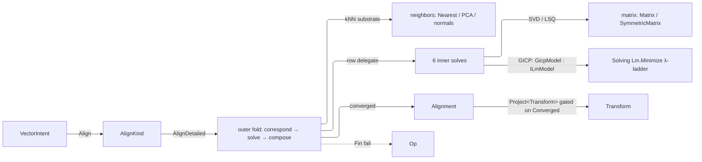

# [RASM_REGISTRATION_REGISTER]

Registration closes point-cloud alignment: two `VectorCloud` clusters enter, one gated `Transform` leaves, and every ICP variant rides one policy record and one solver body — rigid by default, similarity on the Procrustes lane when the policy asks for scale.

Correspondence rides the one `neighbors` substrate `NeighborKernel.GraphOf` and lands in the `transport` `CloudCorrespondenceSet`; every linear solve routes through the `matrix` owners; the GICP inner optimizer instantiates `Solving/solver.md`'s `ILmModel` over `Lm.Minimize`, composed never re-derived; admission and evidence validity fold through `validation`'s `ValidityClaim.All`.

## [01]-[INDEX]

- [02]-[REGISTRATION]: `AlignKind` dispatch, `AlignmentPolicy`, the `Alignment` evidence, and the `AlignKernel` solver body.

## [02]-[REGISTRATION]

- Owner: `AlignKind` mints the one dispatcher — each row's `CapabilitySet<AlignNeed>` declares what the estimation pass provisions for it, its delegate owns the inner solve, and one outer fold (correspond → reject → solve step → compose → converge) owns iteration for every row; `AlignNeed` is that provisioning vocabulary and `PoseFit` the rigid/similarity closing lane of the Procrustes seat; `AlignmentPolicy` is the one knob record, admitted monadically before any round runs and carrying LANES where it once carried epsilons — `Fit` picks the Procrustes closing row, `TrimFraction` trims each round's worst correspondences by quantile, and `CoarseLevels` runs a stride-subsampled coarse-to-fine schedule whose row map keeps every per-row array aligned; `AlignBands` resolves every threshold once off the clouds' own bound `Context`.
- Entry: `AlignDetailed` is the one entry, the variant riding the receiver row and an absent policy seating `AlignmentPolicy.Default`; `VectorIntent.Align` composes it, and `Alignment.Project<Transform>` gates on convergence, so a stalled run faults rather than yielding a half-aligned transform.
- Output: `Alignment` carries the run's transform, stop, iteration evidence, and final correspondence set with `RobustWeights` and `GicpSolve` nested inside it, projecting through the `AtomProjection` typed rows.
- Packages: TYoshimura.DoubleDouble mints the `ddouble` cost fold, Thinktecture.Runtime.Extensions the smart-enum row vocabulary and its delegate binding, `Rasm.Domain` the `CapabilitySet<AlignNeed>` provisioning column, the `Context`/`ToleranceLane` band derivation, the `Stat<Scalar>`/`Distribution<Scalar>` moment and order-statistic owners, the `Cell.Converge` round driver, and the `Fin`/`Option` rails, LanguageExt.Core the carriers and `Atom`, and System.Numerics.Tensors the mass fold.
- Law: the three provisioning bools collapsed into ONE `CapabilitySet<AlignNeed>` column read by set algebra at the single provision fold — NAMED LOSS: per-need compile-time exhaustiveness, bought back by the roster's own construction and by the one `Admits` read per need; the scale decision left the policy as a `PoseFit` row so the Procrustes seat carries its own closing arm instead of a ternary on a flag.
- Law: `FinalDelta` is `Option` — a run that measured no round states its absence rather than reporting an infinity the alignment's own finiteness claim then has to excuse.
- Law: every threshold on this rail derives from a `ToleranceLane` through `AlignBands`, so no member reaches an `EpsilonPolicy` anchor — the anchor is what a lane derives FROM, and reading it directly bypasses the one tolerance read. The two ROW floors stay named consts because they are ALGEBRAIC, not tolerances: `ProcrustesFloor` is the three correspondences a weighted rotation seat needs, `LinearizedFloor` the six an SE(3) row set needs, and each tracks the closing solve rather than the caller's kind.
- Law: the ROUND budget rides `Cell.Converge` over one `Atom<Fin<IcpState>>`; the transition's current state is the exact terminal state, while the LEVEL fold stays distinct because each level re-derives its own stride and row set.
- Law: `CloudCorrespondenceSet` is MEASURED or absent — an empty or massless set refuses typed instead of publishing rmse 0, median 0, and max 0, which are the exact figures a caller reads as a perfect alignment. Its order statistics ride ONE `Distribution<Scalar>` column and its weighted moment `Stat<Scalar>`, so no page-local sort forks either definition and no flattened quantile column stands beside the owner that holds it.
- Growth: a new ICP variant is one `AlignKind` row with its delegate and `Needs` set; a new provisioning demand is one `AlignNeed` row; a new closing lane is one `PoseFit` row; a new rejection rule, robust kernel, or schedule shape is one `AlignmentPolicy` column the standing fold reads; a new band is one `ToleranceLane` column read through `AlignBands` — zero new surfaces.
- Boundary: source-normal estimation runs once on the raw cluster and the round rotation transports the result — rigid equivariance leaves the two identical up to sign, and both consumers sign-align. GICP precision follows one spectral route: eigenvalues clamp at the ridge floor, the clamp is the nearest-SPD projection and `Regularized` counts it, so one path carries one correctness argument. `GicpModel` keys its memo on its parameters, so a `Linearize` the ladder reaches without a prior `Norm` rebuilds rather than assembling from another point's field, and a refused model reaches `GicpSolve` as `ModelRefused` instead of an exhausted budget. Every increment composes as an exact axis-angle rotation and translation; the Umeyama scale rides the Procrustes lane alone — the small-angle linearized rows and the GICP metric stay rigid, so a scale request never silently changes their model. Members stay behind the kernel owners, the statement kernels excepted as measured numeric hot loops under `Fin` admission, and every failure routes the `Op` rail.

```csharp
// --- [IMPORTS] -------------------------------------------------------------------------
using System;
using System.Collections.Generic;
using System.Linq;
using System.Numerics.Tensors;
using System.Runtime.InteropServices;
using DoubleDouble;
using LanguageExt;
using Rasm.Domain;
using Rasm.Numerics;
using Rasm.Solving;
using Rasm.Spatial;
using Rhino;
using Rhino.Geometry;
using Thinktecture;
using static LanguageExt.Prelude;
using Dimension = Rasm.Numerics.Dimension;
using Matrix = Rasm.Numerics.Matrix;

namespace Rasm.Processing;

// --- [TYPES] ---------------------------------------------------------------------------
[SmartEnum<int>]
public sealed partial class AlignmentStopKind {
    public static readonly AlignmentStopKind Converged = new(key: 0);
    public static readonly AlignmentStopKind MaxIterationsExhausted = new(key: 1);
    public static readonly AlignmentStopKind OptimizerStopped = new(key: 2);
}

[SmartEnum<int>]
public sealed partial class AlignmentOptimizerStopKind {
    public static readonly AlignmentOptimizerStopKind StepAccepted = new(key: 0);
    public static readonly AlignmentOptimizerStopKind StepBelowTolerance = new(key: 1);
    public static readonly AlignmentOptimizerStopKind BudgetExhausted = new(key: 2);
    public static readonly AlignmentOptimizerStopKind ModelRefused = new(key: 3);
}

internal readonly record struct AlignBands(double Neglect, double Convergence, double Residual, double Step, double Orientation, double Real, double Ridge) {
    internal static AlignBands Of(Context context, AlignmentPolicy policy) => new(
        Neglect: context.For(ToleranceLane.Neglect).Value,
        Convergence: context.For(policy.Convergence).Value,
        Residual: context.For(policy.Residual).Value,
        Step: context.For(policy.Step).Value,
        Orientation: context.For(ToleranceLane.Orientation).Value,
        Real: context.For(ToleranceLane.Real).Value,
        Ridge: context.For(policy.Ridge).Value);
}

[SmartEnum<string>]
public sealed partial class AlignNeed : ICapability<AlignNeed> {
    public static readonly AlignNeed TargetNormals = new("target-normals", rank: 0);
    public static readonly AlignNeed SourceNormals = new("source-normals", rank: 1);
    public static readonly AlignNeed Covariances   = new("covariances",    rank: 2);
    public int Rank { get; }
}

[SmartEnum<int>]
public sealed partial class PoseFit {
    public static readonly PoseFit Rigid = new(key: 0, AlignKernel.SeatRigid);
    public static readonly PoseFit Similarity = new(key: 1, AlignKernel.SeatSimilarity);
    [UseDelegateFromConstructor]
    internal partial Fin<(Transform Delta, Option<double> Scale)> Seat(
        Seq<Point3d> source, Seq<Point3d> target, Point3d srcCentroid, Point3d tgtCentroid, double[] weights, Transform rotation, double sourceSpread, AlignBands bands, Op key);
}

[SmartEnum<int>, BoundaryAdapter]
public sealed partial class AlignKind {
    public static readonly AlignKind Point = new(key: 0, needs: CapabilitySet<AlignNeed>.None,
        solveStep: static (source, match, current, policy, bands, key) => AlignKernel.SolvePointToPoint(source: source, target: match.Targets, rowMass: match.RowMass, current: current, policy: policy, bands: bands, key: key));
    public static readonly AlignKind Plane = new(key: 1, needs: CapabilitySet<AlignNeed>.Of(AlignNeed.TargetNormals),
        solveStep: static (source, match, current, _, bands, key) => AlignKernel.SolvePointToPlane(source: source, target: match.Targets, normals: match.Normals, rowMass: match.RowMass, current: current, bands: bands, key: key));
    public static readonly AlignKind Symmetric = new(key: 2, needs: CapabilitySet<AlignNeed>.Of(AlignNeed.TargetNormals, AlignNeed.SourceNormals),
        solveStep: static (source, match, current, _, bands, key) => AlignKernel.SolveSymmetric(source: source, target: match.Targets, normals: match.Normals, sourceNormals: match.SourceNormals, rowMass: match.RowMass, current: current, bands: bands, key: key));
    public static readonly AlignKind Robust = new(key: 3, needs: CapabilitySet<AlignNeed>.None,
        solveStep: static (source, match, current, policy, bands, key) => AlignKernel.SolveRobustProcrustes(source: source, target: match.Targets, residuals: match.Distances, rowMass: match.RowMass, current: current, policy: policy, bands: bands, key: key));
    public static readonly AlignKind NormalWeightedPointToPlane = new(key: 4, needs: CapabilitySet<AlignNeed>.Of(AlignNeed.TargetNormals, AlignNeed.SourceNormals),
        solveStep: static (source, match, current, _, bands, key) => AlignKernel.SolveNormalWeightedPointToPlane(source: source, target: match.Targets, targetNormals: match.Normals, sourceNormals: match.SourceNormals, rowMass: match.RowMass, current: current, bands: bands, key: key));
    public static readonly AlignKind Generalized = new(key: 5, needs: CapabilitySet<AlignNeed>.Of(AlignNeed.Covariances),
        solveStep: static (source, match, current, policy, bands, key) => AlignKernel.SolveGeneralizedIcp(source: source, match: match, current: current, policy: policy, bands: bands, key: key));

    public CapabilitySet<AlignNeed> Needs { get; }
    [UseDelegateFromConstructor] internal partial Fin<AlignmentStep> SolveStep(Seq<Point3d> source, AlignmentMatch match, Transform current, AlignmentPolicy policy, AlignBands bands, Op key);

    public Fin<Alignment> AlignDetailed(VectorCloud source, VectorCloud target, Option<AlignmentPolicy> policy = default, Op? key = null) =>
        AlignKernel.AlignClouds(kind: this, source: source, target: target, policy: policy.IfNone(AlignmentPolicy.Default), key: key.OrDefault());
}

// --- [MODELS] --------------------------------------------------------------------------
[BoundaryAdapter, StructLayout(LayoutKind.Auto)]
public readonly record struct AlignmentPolicy(
    Dimension MaxIterations, ToleranceLane Convergence, ToleranceLane Residual,
    ToleranceLane Step, ToleranceLane Ridge, UnitInterval RobustScale, Dimension OptimizerBudget,
    PoseFit Fit, Option<UnitInterval> TrimFraction, Dimension CoarseLevels) {
    public static readonly AlignmentPolicy Default = new(
        MaxIterations: Dimension.Create(value: 30),
        Convergence: ToleranceLane.Convergence, Residual: ToleranceLane.Residual,
        Step: ToleranceLane.Step, Ridge: ToleranceLane.Kkt,
        RobustScale: UnitInterval.Create(value: 0.1), OptimizerBudget: Dimension.Create(value: 8),
        Fit: PoseFit.Rigid, TrimFraction: Option<UnitInterval>.None, CoarseLevels: Dimension.Create(value: 1));
    internal Fin<AlignmentPolicy> Admit(Op key) {
        AlignmentPolicy self = this;
        return guard(ValidityClaim.All(
                ValidityClaim.CountAtLeast(count: self.MaxIterations.Value, floor: 1),
                ValidityClaim.Positive(value: self.RobustScale.Value),
                ValidityClaim.CountAtLeast(count: self.OptimizerBudget.Value, floor: 1),
                self.TrimFraction.Map(static f => f.Value < 1.0).IfNone(noneValue: true),
                ValidityClaim.CountAtLeast(count: self.CoarseLevels.Value, floor: 1)), key.InvalidInput())
            .ToFin().Map(_ => self);
    }
    internal SolvePolicy Ladder(AlignBands bands) => SolvePolicy.Canonical with {
        ResidualTolerance = PositiveMagnitude.Create(value: bands.Residual),
        StepFloor = bands.Step, MaxIterations = OptimizerBudget,
    };
}

[BoundaryAdapter, StructLayout(LayoutKind.Auto)]
public readonly record struct RobustWeights(double Scale, double MinWeight, double MaxWeight) : IValidityEvidence {
    public bool IsValid => ValidityClaim.All(
        ValidityClaim.Positive(value: Scale),
        ValidityClaim.Nonnegative(value: MinWeight),
        ValidityClaim.Nonnegative(value: MaxWeight),
        MinWeight <= MaxWeight);
}

[BoundaryAdapter, StructLayout(LayoutKind.Auto)]
public readonly record struct GicpSolve(
    AlignmentOptimizerStopKind Stop, int Iterations, double InitialCost, double FinalCost, double StepNorm,
    double TerminalLambda, double MeanMahalanobis, double MaxMahalanobis, int RegularizedCovarianceCount, double CovarianceRidge,
    PcaCensus SourcePca, PcaCensus TargetPca) : IValidityEvidence {
    public bool IsValid => ValidityClaim.All(
        Stop is not null && Iterations >= 0 && RegularizedCovarianceCount >= 0,
        ValidityClaim.Nonnegative(value: InitialCost),
        ValidityClaim.Nonnegative(value: FinalCost),
        ValidityClaim.Nonnegative(value: StepNorm),
        ValidityClaim.Positive(value: TerminalLambda),
        ValidityClaim.Nonnegative(value: MeanMahalanobis),
        ValidityClaim.Nonnegative(value: MaxMahalanobis),
        MeanMahalanobis <= MaxMahalanobis,
        ValidityClaim.Positive(value: CovarianceRidge),
        SourcePca.IsValid,
        TargetPca.IsValid);
}

internal readonly record struct AlignmentMatch(
    CloudCorrespondenceSet Correspondences, Point3d[] Targets, Vector3d[] Normals, Vector3d[] SourceNormals, double[] Distances,
    double[] RowMass, int[] TargetIndices, int[] SourceRows, Option<NeighborhoodPcaResult> SourcePca = default, Option<NeighborhoodPcaResult> TargetPca = default);

internal readonly record struct AlignmentStep(
    Transform Delta, Option<LinearSolution> Solve = default, Option<RobustWeights> Robust = default,
    Option<GicpSolve> Optimizer = default, Option<AlignmentStopKind> Stop = default,
    Option<double> Scale = default);

[BoundaryAdapter, StructLayout(LayoutKind.Auto)]
public readonly record struct Alignment(
    Transform Transform, AlignKind Kind, AlignmentStopKind Stop, int Iterations, Option<double> FinalDelta,
    Option<RobustWeights> Robust, CloudCorrespondenceSet Correspondences, Option<LinearSolution> Solve,
    Option<GicpSolve> Optimizer, Option<double> SimilarityScale) : IValidityEvidence {
    public bool IsValid => ValidityClaim.All(
        Kind is not null && Stop is not null && Transform.IsValid,
        ValidityClaim.CountAtLeast(count: Iterations, floor: 0),
        FinalDelta.Map(static delta => ValidityClaim.Nonnegative(value: delta).Holds).IfNone(noneValue: true),
        ValidityClaim.Evidence(Robust),
        ValidityClaim.Evidence(Solve),
        ValidityClaim.Evidence(Optimizer),
        SimilarityScale.Map(static scale => double.IsFinite(scale) && scale > 0.0).IfNone(noneValue: true));
    public Fin<TOut> Project<TOut>(Op key) {
        Alignment self = this;
        return AtomProjection.Rows<Alignment, TOut>(self: self, key: key,
            ProjectionRow.Of<Transform>(() => self.Stop.Equals(AlignmentStopKind.Converged)
                ? key.AcceptValue(value: self.Transform)
                : Fin.Fail<Transform>(key.InvalidResult())));
    }
}

// --- [OPERATIONS] ----------------------------------------------------------------------
internal static class AlignKernel {
    private const double WelschLogFloor = -700.0;
    private const double MadNormalConsistency = 1.4826;
    private static readonly Dimension ProcrustesFloor = Dimension.Create(value: 3);
    private static readonly Dimension LinearizedFloor = Dimension.Create(value: 6);

    private readonly record struct IcpState(Transform Current, Option<double> FinalDelta, int Iterations, AlignmentStep Step, Option<AlignmentStopKind> Stop);

    // --- [OUTER_FOLD]
    internal static Fin<Alignment> AlignClouds(AlignKind kind, VectorCloud source, VectorCloud target, AlignmentPolicy policy, Op key) =>
        from activePolicy in policy.Admit(key: key)
        from alignment in (source, target) switch {
            (VectorCloud.ClusterCase src, VectorCloud.ClusterCase tgt) => IcpAlign(source: src, target: tgt, kind: kind, policy: activePolicy, key: key),
            _ => Fin.Fail<Alignment>(error: key.InvalidInput()),
        }
        select alignment;

    private static Fin<Alignment> IcpAlign(VectorCloud.ClusterCase source, VectorCloud.ClusterCase target, AlignKind kind, AlignmentPolicy policy, Op key) =>
        from bands in Fin.Succ(AlignBands.Of(context: source.Tolerance, policy: policy))
        from neighborhoodPolicy in NeighborhoodPolicy.Of(context: source.Tolerance, key: key)
        from targetNormals in kind.Needs.Admits(AlignNeed.TargetNormals) ? NeighborKernel.OrientNormals(cluster: target, policy: neighborhoodPolicy, key: key).Map(static seq => seq.AsIterable().ToArray()) : Fin.Succ(System.Array.Empty<Vector3d>())
        from sourceNormals in kind.Needs.Admits(AlignNeed.SourceNormals) ? NeighborKernel.OrientNormals(cluster: source, policy: neighborhoodPolicy, key: key).Map(static seq => seq.AsIterable().ToArray()) : Fin.Succ(System.Array.Empty<Vector3d>())
        from sourcePca in kind.Needs.Admits(AlignNeed.Covariances) ? NeighborKernel.PcaOf(cluster: source, policy: neighborhoodPolicy, key: key).Map(Some) : Fin.Succ(Option<NeighborhoodPcaResult>.None)
        from targetPca in kind.Needs.Admits(AlignNeed.Covariances) ? NeighborKernel.PcaOf(cluster: target, policy: neighborhoodPolicy, key: key).Map(Some) : Fin.Succ(Option<NeighborhoodPcaResult>.None)
        from sourceMass in CloudKernel.MassOf(cluster: source, key: key)
        from targetMass in CloudKernel.MassOf(cluster: target, key: key)
        let nearestPolicy = neighborhoodPolicy with { NeighborCount = Dimension.Create(value: 1) }
        from final in toSeq(Enumerable.Range(start: 0, count: policy.CoarseLevels.Value)).Fold(
            initialState: Fin.Succ(new IcpState(Current: Transform.Identity, FinalDelta: Option<double>.None, Iterations: 0, Step: new AlignmentStep(Delta: Transform.Identity), Stop: Option<AlignmentStopKind>.None)),
            f: (levelAcc, level) => levelAcc.Bind(carried => {
                int stride = 1 << (policy.CoarseLevels.Value - 1 - level);
                int[] rows = stride == 1 ? [.. Enumerable.Range(start: 0, count: source.Vertices.Count)]
                    : [.. Enumerable.Range(start: 0, count: source.Vertices.Count).Where(i => i % stride == 0)];
                return Rounds(kind: kind, source: source, target: target, rows: rows, sourceMass: sourceMass, targetMass: targetMass,
                    targetNormals: targetNormals, sourceNormals: sourceNormals, sourcePca: sourcePca, targetPca: targetPca,
                    nearestPolicy: nearestPolicy, carried: carried, policy: policy, bands: bands, key: key);
            }))
        let fullRows = Enumerable.Range(start: 0, count: source.Vertices.Count).ToArray()
        from finalMatch in Correspond(source: source.Vertices, rows: fullRows, sourceMass: sourceMass, target: target, targetMass: targetMass, normals: targetNormals, sourceNormals: sourceNormals, current: final.Current, nearestPolicy: nearestPolicy, sourcePca: sourcePca, targetPca: targetPca, bands: bands, key: key)
        select new Alignment(Transform: final.Current, Kind: kind, Stop: final.Stop.IfNone(AlignmentStopKind.MaxIterationsExhausted), Iterations: final.Iterations, FinalDelta: final.FinalDelta,
            Robust: final.Step.Robust, Correspondences: finalMatch.Correspondences, Solve: final.Step.Solve, Optimizer: final.Step.Optimizer,
            SimilarityScale: final.Step.Scale);

    private static Fin<IcpState> Rounds(
        AlignKind kind, VectorCloud.ClusterCase source, VectorCloud.ClusterCase target, int[] rows,
        Arr<double> sourceMass, Arr<double> targetMass, Vector3d[] targetNormals, Vector3d[] sourceNormals,
        Option<NeighborhoodPcaResult> sourcePca, Option<NeighborhoodPcaResult> targetPca,
        NeighborhoodPolicy nearestPolicy, IcpState carried, AlignmentPolicy policy, AlignBands bands, Op key) {
        Atom<Fin<IcpState>> cell = Atom(value: Fin.Succ(carried with { Stop = Option<AlignmentStopKind>.None }));
        Transition<Fin<IcpState>> driven = Cell.Converge(
            cell: cell,
            step: state => Some(state.Bind(active => active.Stop.IsSome ? Fin.Succ(active) : Round(active))),
            settled: state => state.Match(Succ: static active => active.Stop.IsSome, Fail: static _ => true),
            budget: policy.MaxIterations,
            declined: key.InvalidResult());
        return driven.Current;

        Fin<IcpState> Round(IcpState state) =>
            from match in Correspond(source: source.Vertices, rows: rows, sourceMass: sourceMass, target: target, targetMass: targetMass, normals: targetNormals, sourceNormals: sourceNormals, current: state.Current, nearestPolicy: nearestPolicy, sourcePca: sourcePca, targetPca: targetPca, bands: bands, key: key)
            from active in RejectRows(source: source.Vertices, match: match, policy: policy, targetMass: targetMass, bands: bands, key: key)
            from step in kind.SolveStep(source: active.Source, match: active.Match, current: state.Current, policy: policy, bands: bands, key: key)
            let current = step.Delta * state.Current
            let finalDelta = DeltaMagnitude(delta: step.Delta)
            select new IcpState(Current: current, FinalDelta: Some(finalDelta), Iterations: state.Iterations + 1, Step: step,
                Stop: step.Stop.IsSome ? step.Stop : finalDelta < bands.Convergence ? Some(AlignmentStopKind.Converged) : Option<AlignmentStopKind>.None);
    }

    private static Fin<(Seq<Point3d> Source, AlignmentMatch Match)> RejectRows(Seq<Point3d> source, AlignmentMatch match, AlignmentPolicy policy, Arr<double> targetMass, AlignBands bands, Op key) =>
        policy.TrimFraction.Match(
            None: () => key.AcceptValue(value: (Source: toSeq(match.SourceRows.Select(row => source[index: row])), Match: match)),
            Some: trim => {
                int n = match.Distances.Length;
                int keep = Math.Max(val1: ProcrustesFloor.Value, val2: (int)Math.Ceiling(a: (1.0 - trim.Value) * n));
                if (keep >= n) return key.AcceptValue(value: (Source: toSeq(match.SourceRows.Select(row => source[index: row])), Match: match));
                double[] sorted = [.. match.Distances.Order()];
                double threshold = sorted[keep - 1];
                int[] kept = [.. Enumerable.Range(start: 0, count: n).Where(i => match.Distances[i] <= threshold)];
                List<CloudCorrespondence> items = new(capacity: kept.Length);
                foreach (int i in kept) items.Add(item: match.Correspondences.Items[index: i]);
                Point3d[] targets = [.. kept.Select(i => match.Targets[i])];
                double[] distances = [.. kept.Select(i => match.Distances[i])];
                double[] rowMass = [.. kept.Select(i => match.RowMass[i])];
                int[] targetIndices = [.. kept.Select(i => match.TargetIndices[i])];
                int[] sourceRows = [.. kept.Select(i => match.SourceRows[i])];
                Vector3d[] normals = match.Normals.Length == 0 ? [] : [.. kept.Select(i => match.Normals[i])];
                Vector3d[] rowSourceNormals = match.SourceNormals.Length == 0 ? [] : [.. kept.Select(i => match.SourceNormals[i])];
                return CorrespondenceSetOf(items: items, distances: distances, rowMass: rowMass, targetIndices: targetIndices, targetMass: targetMass, sourceCount: kept.Length, targetCount: match.Correspondences.TargetCount, bands: bands, key: key)
                    .Bind(set => key.AcceptValue(value: (
                        Source: toSeq(sourceRows.Select(row => source[index: row])),
                        Match: match with {
                            Correspondences = set,
                            Targets = targets, Normals = normals, SourceNormals = rowSourceNormals, Distances = distances,
                            RowMass = rowMass, TargetIndices = targetIndices, SourceRows = sourceRows,
                        })));
            });

    private static double DeltaMagnitude(Transform delta) {
        double diff = 0.0;
        for (int i = 0; i < 4; i++) for (int j = 0; j < 4; j++) diff += Math.Abs(value: delta[i, j] - (i == j ? 1.0 : 0.0));
        return diff;
    }

    private static Fin<AlignmentMatch> Correspond(Seq<Point3d> source, int[] rows, Arr<double> sourceMass, VectorCloud.ClusterCase target, Arr<double> targetMass, Vector3d[] normals, Vector3d[] sourceNormals, Transform current, NeighborhoodPolicy nearestPolicy, Option<NeighborhoodPcaResult> sourcePca, Option<NeighborhoodPcaResult> targetPca, AlignBands bands, Op key) {
        int n = rows.Length;
        Fin<Unit> admitted = from rowCount in Admit.CountAtLeast(count: n, minimum: 1, key: key)
                             from sourceCount in Admit.SameCount(expected: source.Count, key: key, counts: [sourceMass.Count])
                             from targetCount in Admit.SameCount(expected: target.Vertices.Count, key: key, counts: [targetMass.Count])
                             from normalCount in normals.Length == 0 ? Fin.Succ(unit) : Admit.SameCount(expected: target.Vertices.Count, key: key, counts: [normals.Length])
                             from sourceNormalCount in sourceNormals.Length == 0 ? Fin.Succ(unit) : Admit.SameCount(expected: source.Count, key: key, counts: [sourceNormals.Length])
                             from transform in guard(current.IsValid && rows.All(row => row >= 0 && row < source.Count), key.InvalidInput()).ToFin()
                             select unit;
        return admitted.Bind(_ => {
            Point3d[] transformed = [.. rows.Select(row => current * source[index: row])];
            return NeighborKernel.GraphOf(index: new NeighborIndex.CloudCase(Source: target), needles: transformed, policy: nearestPolicy, key: key).Bind(graph => target.UseIndex(key: key, project: indexed => key.Catch(() => {
                Point3d[] targets = new Point3d[n]; Vector3d[] rowNormals = normals.Length == 0 ? [] : new Vector3d[n];
                Vector3d[] rowSourceNormals = sourceNormals.Length == 0 ? [] : new Vector3d[n];
                double[] distances = new double[n]; double[] rowMass = new double[n]; int[] targetIndices = new int[n];
                List<CloudCorrespondence> items = new(capacity: n);
                for (int i = 0; i < n; i++) {
                    int row = rows[i];
                    Option<int> hit = graph.Ids.Length > i && graph.Ids[i].Length > 0 ? Some(graph.Ids[i][0]) : Option<int>.None;
                    if (hit.Case is not int nearest || nearest >= target.Vertices.Count || (normals.Length > 0 && nearest >= normals.Length)) return Fin.Fail<AlignmentMatch>(key.InvalidResult());
                    Point3d targetPoint = indexed.PointAt(index: nearest);
                    Vector3d residual = targetPoint - transformed[i];
                    double squared = residual.SquareLength;
                    targets[i] = targetPoint; distances[i] = Math.Sqrt(d: squared); rowMass[i] = sourceMass[index: row]; targetIndices[i] = nearest;
                    if (normals.Length > 0) rowNormals[i] = normals[nearest];
                    if (sourceNormals.Length > 0) rowSourceNormals[i] = sourceNormals[row];
                    items.Add(item: new CloudCorrespondence(SourceIndex: row, TargetIndex: nearest, SourcePoint: transformed[i], TargetPoint: targetPoint, Residual: residual,
                        Distance: distances[i], SquaredDistance: squared, SourceMass: Some(sourceMass[index: row]), TargetMass: Some(targetMass[index: nearest]),
                        CouplingMass: Some(sourceMass[index: row]), Confidence: Option<double>.None));
                }
                return CorrespondenceSetOf(items: items, distances: distances, rowMass: rowMass, targetIndices: targetIndices, targetMass: targetMass, sourceCount: n, targetCount: target.Vertices.Count, bands: bands, key: key)
                    .Map(set => new AlignmentMatch(Correspondences: set,
                        Targets: targets, Normals: rowNormals, SourceNormals: rowSourceNormals, Distances: distances, RowMass: rowMass, TargetIndices: targetIndices, SourceRows: rows, SourcePca: sourcePca, TargetPca: targetPca));
            })));
        });
    }

    private static Fin<CloudCorrespondenceSet> CorrespondenceSetOf(List<CloudCorrespondence> items, double[] distances, double[] rowMass, int[] targetIndices, Arr<double> targetMass, int sourceCount, int targetCount, AlignBands bands, Op key) {
        double totalMass = TensorPrimitives.Sum<double>(rowMass);
        if (distances.Length == 0 || totalMass <= bands.Neglect) { return Fin.Fail<CloudCorrespondenceSet>(key.InvalidResult()); }
        Seq<Scalar> rows = toSeq(distances).Map(static value => (Scalar)value);
        Seq<int> covered = toSeq(targetIndices).Distinct().Strict();
        return from spread in Distribution<Scalar>.Of(values: rows, percentiles: [90.0, 95.0], key: key, rule: Some(QuantileRule.NearestRank))
               from weighted in Stat<Scalar>.Of(values: rows, key: key, weights: Some(toSeq(rowMass)))
               select new CloudCorrespondenceSet(Items: toSeq(items), SourceCount: sourceCount, TargetCount: targetCount, NonZeroCount: items.Count,
                   TotalMass: totalMass, Rmse: Some(weighted.Rms), Distances: Some(spread),
                   CoveredSourceCount: sourceCount, CoveredTargetCount: covered.Count,
                   RetainedSourceMass: totalMass,
                   RetainedTargetMass: covered.Fold(0.0, (held, index) => held + targetMass[index: index]));
    }

    // --- [INNER_SOLVES]
    internal static Fin<AlignmentStep> SolvePointToPoint(Seq<Point3d> source, Point3d[] target, double[] rowMass, Transform current, AlignmentPolicy policy, AlignBands bands, Op key) =>
        SolveProcrustes(source: source, target: target, weights: rowMass, current: current, fit: policy.Fit, bands: bands, key: key)
            .Map(static aligned => new AlignmentStep(Delta: aligned.Delta, Scale: aligned.Scale));

    internal static Fin<AlignmentStep> SolvePointToPlane(Seq<Point3d> source, Point3d[] target, Vector3d[] normals, double[] rowMass, Transform current, AlignBands bands, Op key) =>
        SolveLinearizedRows(source: source, target: target, normals: normals, rowMass: rowMass, current: current, bands: bands, key: key, rowNormal: static (_, normal) => (Normal: normal, Weight: 1.0));

    internal static Fin<AlignmentStep> SolveSymmetric(Seq<Point3d> source, Point3d[] target, Vector3d[] normals, Vector3d[] sourceNormals, double[] rowMass, Transform current, AlignBands bands, Op key) =>
        Admit.SameCount(expected: source.Count, key: key, counts: [sourceNormals.Length]).Bind(_ => SolveLinearizedRows(
            source: source, target: target, normals: normals, rowMass: rowMass, current: current, bands: bands, key: key,
            rowNormal: (i, targetNormal) => {
                Vector3d rotated = current * sourceNormals[i];
                Vector3d sourceNormal = rotated * targetNormal < 0.0 ? -rotated : rotated;
                Vector3d combined = sourceNormal + targetNormal;
                _ = combined.Unitize();
                return (Normal: combined, Weight: 1.0);
            }));

    internal static Fin<AlignmentStep> SolveRobustProcrustes(Seq<Point3d> source, Point3d[] target, double[] residuals, double[] rowMass, Transform current, AlignmentPolicy policy, AlignBands bands, Op key) {
        int n = source.Count;
        return from count in AdmitAlignmentRows(source: source, target: target, weights: rowMass, minimum: ProcrustesFloor, key: key)
               from residualCount in Admit.SameCount(expected: count, key: key, counts: [residuals.Length])
               from finiteResiduals in Admit.AllFinite(residuals, key)
               from spread in Distribution<Scalar>.Of(
                   values: toSeq(residuals).Map(static residual => (Scalar)Math.Abs(value: residual)),
                   percentiles: Seq<double>(), key: key)
               let nu = Math.Max(val1: MadNormalConsistency * (double)spread.Median * policy.RobustScale.Value, val2: bands.Residual)
               let logs = residuals.Select(residual => -(residual * residual) / (2.0 * nu * nu)).ToArray()
               let offset = logs.Max()
               let weights = Enumerable.Range(start: 0, count: n).Select(i => rowMass[i] * Math.Exp(d: Math.Max(val1: logs[i] - offset, val2: WelschLogFloor))).ToArray()
               from aligned in SolveProcrustes(source: source, target: target, weights: weights, current: current, fit: policy.Fit, bands: bands, key: key)
               select new AlignmentStep(Delta: aligned.Delta, Robust: Some(new RobustWeights(Scale: nu, MinWeight: weights.Min(), MaxWeight: weights.Max())), Scale: aligned.Scale);
    }

    internal static Fin<AlignmentStep> SolveNormalWeightedPointToPlane(Seq<Point3d> source, Point3d[] target, Vector3d[] targetNormals, Vector3d[] sourceNormals, double[] rowMass, Transform current, AlignBands bands, Op key) =>
        Admit.SameCount(expected: source.Count, key: key, counts: [sourceNormals.Length]).Bind(_ => SolveLinearizedRows(
            source: source, target: target, normals: targetNormals, rowMass: rowMass, current: current, bands: bands, key: key,
            rowNormal: (i, normal) => (Normal: normal, Weight: Math.Sqrt(d: Math.Max(val1: Math.Abs(value: (current * sourceNormals[i]) * normal), val2: bands.Real)))));

    internal static Fin<AlignmentStep> SolveGeneralizedIcp(Seq<Point3d> source, AlignmentMatch match, Transform current, AlignmentPolicy policy, AlignBands bands, Op key) =>
        from sourcePca in match.SourcePca.ToFin(key.InvalidInput())
        from targetPca in match.TargetPca.ToFin(key.InvalidInput())
        from rows in AdmitAlignmentRows(source: source, target: match.Targets, weights: match.RowMass, minimum: ProcrustesFloor, key: key)
        from sourceRowCount in Admit.SameCount(expected: rows, key: key, counts: [match.SourceRows.Length])
        from sourceRows in guard(match.SourceRows.All(row => row >= 0 && row < sourcePca.Samples.Count), key.InvalidInput())
        from targetIndexCount in Admit.SameCount(expected: rows, key: key, counts: [match.TargetIndices.Length])
        from targetIndices in guard(match.TargetIndices.All(index => index >= 0 && index < targetPca.Samples.Count), key.InvalidInput())
        from seedField in PrecisionFieldOf(source: source, match: match, sourcePca: sourcePca, targetPca: targetPca, current: current, bands: bands, key: key)
        from initial in ObjectiveOf(source: source, match: match, precision: seedField, current: current, bands: bands, key: key)
        let model = new GicpModel(source: source, match: match, sourcePca: sourcePca, targetPca: targetPca, current: current, seedField: seedField, seedObjective: initial, bands: bands, key: key)
        from result in Lm.Minimize(model: model, policy: policy.Ladder(bands), key: key)
        select GicpStep(model: model, result: result, initial: initial, sourcePca: sourcePca, targetPca: targetPca, bands: bands);

    private static AlignmentStep GicpStep(GicpModel model, LmResult result, GicpObjective initial, NeighborhoodPcaResult sourcePca, NeighborhoodPcaResult targetPca, AlignBands bands) {
        double stepNorm = Math.Sqrt(d: result.Parameters.Sum(static value => value * value));
        GicpObjective at = result.Iterations == 0 ? initial : model.Objective;
        bool converged = result.Status == SolveStatus.Converged;
        AlignmentOptimizerStopKind stop = converged
            ? result.Iterations == 0 ? AlignmentOptimizerStopKind.StepBelowTolerance : AlignmentOptimizerStopKind.StepAccepted
            : model.LastFault.IsSome ? AlignmentOptimizerStopKind.ModelRefused
            : AlignmentOptimizerStopKind.BudgetExhausted;
        GicpSolve gicp = new(
            Stop: stop, Iterations: result.Iterations, InitialCost: (double)initial.Cost, FinalCost: (double)at.Cost, StepNorm: stepNorm,
            TerminalLambda: result.Lambda, MeanMahalanobis: at.MeanMahalanobis, MaxMahalanobis: at.MaxMahalanobis,
            RegularizedCovarianceCount: at.RegularizedCount, CovarianceRidge: at.Ridge, SourcePca: sourcePca.Census, TargetPca: targetPca.Census);
        Transform delta = result.Iterations == 0
            ? Transform.Identity
            : ComposeRigidTransform(
                omega: new Vector3d(x: result.Parameters[0], y: result.Parameters[1], z: result.Parameters[2]),
                translation: new Vector3d(x: result.Parameters[3], y: result.Parameters[4], z: result.Parameters[5]),
                bands: bands);
        return new AlignmentStep(Delta: delta, Optimizer: Some(gicp),
            Stop: !converged ? Some(AlignmentStopKind.OptimizerStopped)
                : result.Iterations == 0 ? Some(AlignmentStopKind.Converged)
                : Option<AlignmentStopKind>.None);
    }

    private static Fin<int> AdmitAlignmentRows(Seq<Point3d> source, Point3d[] target, double[] weights, Dimension minimum, Op key) =>
        from count in Admit.CountAtLeast(count: source.Count, minimum: minimum.Value, key: key).Map(_ => source.Count)
        from same in Admit.SameCount(expected: count, key: key, counts: [target.Length, weights.Length])
        from sourceFinite in Admit.AllFinite(points: source, key: key)
        from targetFinite in Admit.AllFinite(key: key, points: target)
        from mass in Admit.PositiveFiniteWeights(weights: weights, count: count, key: key)
        select count;

    // --- [PROCRUSTES]
    private static Fin<(Transform Delta, Option<double> Scale)> SolveProcrustes(Seq<Point3d> source, Point3d[] target, double[] weights, Transform current, PoseFit fit, AlignBands bands, Op key) {
        Seq<Point3d> transformedSource = toSeq(source.AsIterable().Select(p => current * p));
        Seq<Point3d> targetSeq = toSeq(target);
        return from rows in AdmitAlignmentRows(source: transformedSource, target: target, weights: weights, minimum: ProcrustesFloor, key: key)
               from srcCentroid in WeightedCentroidOf(points: transformedSource, weights: weights, bands: bands, key: key)
               from tgtCentroid in WeightedCentroidOf(points: targetSeq, weights: weights, bands: bands, key: key)
               from aligned in AlignViaCrossCovariance(source: transformedSource, target: targetSeq, srcCentroid: srcCentroid, tgtCentroid: tgtCentroid, weights: weights, fit: fit, bands: bands, key: key)
               select aligned;
    }

    private static Fin<Point3d> WeightedCentroidOf(Seq<Point3d> points, double[] weights, AlignBands bands, Op key) {
        Vector3d sum = Vector3d.Zero; double totalW = 0.0;
        for (int i = 0; i < points.Count; i++) { sum += weights[i] * (Vector3d)points[index: i]; totalW += weights[i]; }
        return totalW > bands.Neglect && RhinoMath.IsValidDouble(x: totalW)
            ? key.AcceptValue(value: Point3d.Origin + (sum / totalW))
            : Fin.Fail<Point3d>(key.InvalidResult());
    }

    private static Fin<(Transform Delta, Option<double> Scale)> AlignViaCrossCovariance(Seq<Point3d> source, Seq<Point3d> target, Point3d srcCentroid, Point3d tgtCentroid, double[] weights, PoseFit fit, AlignBands bands, Op key) {
        Dimension dim3 = Dimension.Create(value: 3);
        double[] cross = new double[9];
        double sourceSpread = 0.0;
        for (int i = 0; i < source.Count; i++) {
            double w = weights[i];
            Vector3d sv = source[index: i] - srcCentroid; Vector3d tv = target[index: i] - tgtCentroid;
            cross[0] += w * sv.X * tv.X; cross[1] += w * sv.X * tv.Y; cross[2] += w * sv.X * tv.Z;
            cross[3] += w * sv.Y * tv.X; cross[4] += w * sv.Y * tv.Y; cross[5] += w * sv.Y * tv.Z;
            cross[6] += w * sv.Z * tv.X; cross[7] += w * sv.Z * tv.Y; cross[8] += w * sv.Z * tv.Z;
            sourceSpread += w * sv.SquareLength;
        }
        return from h in Matrix.Of(rows: dim3, cols: dim3, entries: new Arr<double>(cross), key: key)
               from svd in h.DecomposeSvd(key: key)
               from vu in svd.V.Multiply(other: svd.U.Transpose(), key: key)
               from det in vu.Determinant(key: key)
               let diag = new[] { 1.0, 1.0, det >= 0.0 ? 1.0 : -1.0 }
               from d in Matrix.Of(rows: dim3, cols: dim3, entries: new Arr<double>([.. Enumerable.Range(start: 0, count: 9).Select(idx => (idx / 3) == (idx % 3) ? diag[idx / 3] : 0.0)]), key: key)
               from vd in svd.V.Multiply(other: d, key: key)
               from rot in vd.Multiply(other: svd.U.Transpose(), key: key)
               let rotation = RotationTransformOf(rotation: rot)
               from scaled in fit.Seat(source: source, target: target, srcCentroid: srcCentroid, tgtCentroid: tgtCentroid, weights: weights, rotation: rotation, sourceSpread: sourceSpread, bands: bands, key: key)
               select scaled;
    }

    internal static Fin<(Transform Delta, Option<double> Scale)> SeatRigid(Seq<Point3d> source, Seq<Point3d> target, Point3d srcCentroid, Point3d tgtCentroid, double[] weights, Transform rotation, double sourceSpread, AlignBands bands, Op key) =>
        key.AcceptValue(value: (Delta: WithTranslation(rotation: rotation, translation: tgtCentroid - (rotation * srcCentroid)), Scale: Option<double>.None));

    internal static Fin<(Transform Delta, Option<double> Scale)> SeatSimilarity(Seq<Point3d> source, Seq<Point3d> target, Point3d srcCentroid, Point3d tgtCentroid, double[] weights, Transform rotation, double sourceSpread, AlignBands bands, Op key) {
        if (sourceSpread <= bands.Neglect) return Fin.Fail<(Transform, Option<double>)>(key.InvalidResult());
        double projected = 0.0;
        for (int i = 0; i < source.Count; i++) {
            double w = weights[i];
            projected += w * ((target[index: i] - tgtCentroid) * (rotation * (source[index: i] - srcCentroid)));
        }
        double scale = projected / sourceSpread;
        if (!RhinoMath.IsValidDouble(x: scale) || scale <= bands.Neglect) return Fin.Fail<(Transform, Option<double>)>(key.InvalidResult());
        Transform similarity = Transform.Scale(anchor: Point3d.Origin, scaleFactor: scale) * rotation;
        return key.AcceptValue(value: (Delta: WithTranslation(rotation: similarity, translation: tgtCentroid - (similarity * srcCentroid)), Scale: Some(scale)));
    }

    private static Fin<AlignmentStep> SolveLinearizedRows(Seq<Point3d> source, Point3d[] target, Vector3d[] normals, double[] rowMass, Transform current, AlignBands bands, Op key, Func<int, Vector3d, (Vector3d Normal, double Weight)> rowNormal) {
        int n = source.Count;
        Fin<int> admitted = from count in AdmitAlignmentRows(source: source, target: target, weights: rowMass, minimum: LinearizedFloor, key: key)
                            from normalCount in Admit.SameCount(expected: count, key: key, counts: [normals.Length])
                            from finiteNormals in Admit.AllFinite(key, normals)
                            select count;
        return admitted.Bind(_ => {
            double[] aFlat = new double[n * 6]; double[] b = new double[n];
            for (int i = 0; i < n; i++) {
                (Vector3d rawNormal, double weight) = rowNormal(i, normals[i]);
                double massWeight = Math.Sqrt(d: rowMass[i]);
                if (!rawNormal.IsValid || rawNormal.SquareLength <= bands.Real * bands.Real || !RhinoMath.IsValidDouble(x: weight) || weight <= 0.0)
                    return Fin.Fail<AlignmentStep>(key.InvalidResult());
                Point3d p = current * source[index: i]; Point3d q = target[i]; Vector3d nrm = weight * massWeight * rawNormal;
                Vector3d cross = Vector3d.CrossProduct(a: (Vector3d)p, b: nrm);
                aFlat[(i * 6) + 0] = cross.X; aFlat[(i * 6) + 1] = cross.Y; aFlat[(i * 6) + 2] = cross.Z;
                aFlat[(i * 6) + 3] = nrm.X; aFlat[(i * 6) + 4] = nrm.Y; aFlat[(i * 6) + 5] = nrm.Z;
                b[i] = (q - p) * nrm;
            }
            return Matrix.Of(rows: Dimension.Create(value: n), cols: Dimension.Create(value: 6), entries: new Arr<double>(aFlat), key: key)
                .Bind(design => design.LeastSquaresDetailed(rhs: new Arr<double>(b), key: key))
                .Bind(solve => solve.Solution.Count == 6 && solve.Solution.ForAll(RhinoMath.IsValidDouble)
                    ? Fin.Succ(new AlignmentStep(
                        Delta: ComposeRigidTransform(omega: new Vector3d(x: solve.Solution[0], y: solve.Solution[1], z: solve.Solution[2]), translation: new Vector3d(x: solve.Solution[3], y: solve.Solution[4], z: solve.Solution[5]), bands: bands),
                        Solve: Some(solve)))
                    : Fin.Fail<AlignmentStep>(key.InvalidResult()));
        });
    }

    // --- [GICP]
    [StructLayout(LayoutKind.Auto)] private readonly record struct GicpObjective(ddouble Cost, double MeanMahalanobis, double MaxMahalanobis, int RegularizedCount, double Ridge);
    [StructLayout(LayoutKind.Auto)] private readonly record struct GicpPrecisionField(SymmetricMatrix[] Inverses, int RegularizedCount, double Ridge);

    private static Fin<GicpPrecisionField> PrecisionFieldOf(Seq<Point3d> source, AlignmentMatch match, NeighborhoodPcaResult sourcePca, NeighborhoodPcaResult targetPca, Transform current, AlignBands bands, Op key) =>
        toSeq(Enumerable.Range(start: 0, count: source.Count)).Fold(
            initialState: Fin.Succ((Inverses: new SymmetricMatrix[source.Count], Regularized: 0, Ridge: 0.0)),
            f: (acc, i) => acc.Bind(state =>
                PrecisionOf(current: current, source: sourcePca.Samples[index: match.SourceRows[i]].Covariance, target: targetPca.Samples[index: match.TargetIndices[i]].Covariance, bands: bands, key: key)
                    .Map(precision => { state.Inverses[i] = precision.Inverse; return (state.Inverses, state.Regularized + (precision.Regularized ? 1 : 0), Math.Max(val1: state.Ridge, val2: precision.Ridge)); })))
            .Map(state => new GicpPrecisionField(Inverses: state.Inverses, RegularizedCount: state.Regularized, Ridge: state.Ridge));

    [StructLayout(LayoutKind.Auto)] private readonly record struct GicpPrecision(SymmetricMatrix Inverse, bool Regularized, double Ridge);

    private static Fin<GicpPrecision> PrecisionOf(Transform current, SymmetricMatrix source, SymmetricMatrix target, AlignBands bands, Op key) {
        Span<double> rs = stackalloc double[9];
        for (int i = 0; i < 3; i++) for (int j = 0; j < 3; j++) { double sum = 0.0; for (int k = 0; k < 3; k++) sum += current[i, k] * source.At(i: k, j: j); rs[(i * 3) + j] = sum; }
        double[] upper = new double[6]; int slot = 0; double trace = 0.0;
        for (int i = 0; i < 3; i++) for (int j = i; j < 3; j++) {
            double rrt = 0.0;
            for (int k = 0; k < 3; k++) rrt += rs[(i * 3) + k] * current[j, k];
            double value = target.At(i: i, j: j) + rrt;
            if (i == j) trace += value;
            upper[slot++] = value;
        }
        double floor = Math.Max(val1: bands.Residual, val2: bands.Ridge * Math.Max(val1: Math.Abs(value: trace / 3.0), val2: 1.0));
        return from fused in SymmetricMatrix.Of(dim: Dimension.Create(value: 3), upper: new Arr<double>(upper), key: key)
               from eigen in fused.DecomposeEigenDetailed(key: key)
               from inverse in SpectralInverseOf(pairs: eigen.Pairs, floor: floor, key: key)
               select new GicpPrecision(Inverse: inverse.Matrix, Regularized: inverse.Clamped > 0, Ridge: floor);
    }

    private static Fin<(SymmetricMatrix Matrix, int Clamped)> SpectralInverseOf(Seq<(double Eigenvalue, Arr<double> Eigenvector)> pairs, double floor, Op key) {
        if (pairs.Count != 3) return Fin.Fail<(SymmetricMatrix, int)>(key.InvalidResult());
        double[] upper = new double[6]; int clamped = 0;
        foreach ((double eigenvalue, Arr<double> vector) in pairs) {
            double lambda = Math.Max(val1: eigenvalue, val2: floor);
            if (eigenvalue < floor) clamped++;
            double inv = 1.0 / lambda; int slot = 0;
            for (int i = 0; i < 3; i++) for (int j = i; j < 3; j++) upper[slot++] += inv * vector[index: i] * vector[index: j];
        }
        return Admit.AllFinite(upper, key)
            .Bind(_ => SymmetricMatrix.Of(dim: Dimension.Create(value: 3), upper: new Arr<double>(upper), key: key))
            .Map(matrix => (matrix, clamped));
    }

    private static Fin<GicpObjective> ObjectiveOf(Seq<Point3d> source, AlignmentMatch match, GicpPrecisionField precision, Transform current, AlignBands bands, Op key) =>
        key.Catch(() => {
            ddouble total = 0.0, massTotal = 0.0; double max = 0.0;
            for (int i = 0; i < source.Count; i++) {
                Point3d x = current * source[index: i];
                Vector3d r = match.Targets[i] - x;
                SymmetricMatrix inverse = precision.Inverses[i];
                double mahalanobis =
                    (r.X * ((inverse.At(i: 0, j: 0) * r.X) + (inverse.At(i: 0, j: 1) * r.Y) + (inverse.At(i: 0, j: 2) * r.Z)))
                    + (r.Y * ((inverse.At(i: 1, j: 0) * r.X) + (inverse.At(i: 1, j: 1) * r.Y) + (inverse.At(i: 1, j: 2) * r.Z)))
                    + (r.Z * ((inverse.At(i: 2, j: 0) * r.X) + (inverse.At(i: 2, j: 1) * r.Y) + (inverse.At(i: 2, j: 2) * r.Z)));
                if (!RhinoMath.IsValidDouble(x: mahalanobis) || mahalanobis < 0.0) return Fin.Fail<GicpObjective>(key.InvalidResult());
                ddouble mass = (ddouble)match.RowMass[i];
                total += mass * (ddouble)mahalanobis;
                massTotal += mass;
                max = Math.Max(val1: max, val2: mahalanobis);
            }
            double mean = massTotal > (ddouble)bands.Neglect ? (double)(total / massTotal) : (double)total;
            return RhinoMath.IsValidDouble(x: (double)total) && RhinoMath.IsValidDouble(x: mean)
                ? Fin.Succ(new GicpObjective(Cost: total, MeanMahalanobis: mean, MaxMahalanobis: max, RegularizedCount: precision.RegularizedCount, Ridge: precision.Ridge))
                : Fin.Fail<GicpObjective>(key.InvalidResult());
        });

    [StructLayout(LayoutKind.Auto)] private readonly record struct GicpMemo(double[] At, GicpPrecisionField Field, GicpObjective Objective);

    private sealed class GicpModel(
        Seq<Point3d> source, AlignmentMatch match, NeighborhoodPcaResult sourcePca, NeighborhoodPcaResult targetPca,
        Transform current, GicpPrecisionField seedField, GicpObjective seedObjective, AlignBands bands, Op key) : ILmModel {
        private GicpMemo memo = new(At: new double[6], Field: seedField, Objective: seedObjective);
        private Option<Error> lastFault = None;

        public int Dof => 6;
        public double[] Seed { get; } = new double[6];
        internal GicpObjective Objective => memo.Objective;
        internal Option<Error> LastFault => lastFault;

        public ddouble Norm(ReadOnlySpan<double> parameters) {
            double[] at = parameters.ToArray();
            Transform trial = TrialOf(parameters: parameters);
            return (from field in PrecisionFieldOf(source: source, match: match, sourcePca: sourcePca, targetPca: targetPca, current: trial, bands: bands, key: key)
                    from objective in ObjectiveOf(source: source, match: match, precision: field, current: trial, bands: bands, key: key)
                    select new GicpMemo(At: at, Field: field, Objective: objective))
                .Match(
                    Succ: held => { memo = held; return ddouble.Sqrt(held.Objective.Cost); },
                    Fail: fault => { lastFault = Some(fault); return (ddouble)double.PositiveInfinity; });
        }

        public (double[] PackedNormal, double[] Gradient) Linearize(ReadOnlySpan<double> parameters) {
            double[] at = parameters.ToArray();
            Transform trial = TrialOf(parameters: parameters);
            GicpPrecisionField field = memo.At.AsSpan().SequenceEqual(at) ? memo.Field : Rebuild(trial);
            double[] normal = new double[21]; double[] gradient = new double[6];
            for (int i = 0; i < source.Count && i < field.Inverses.Length; i++) {
                Point3d x = trial * source[index: i];
                Vector3d residual = match.Targets[i] - x;
                SymmetricMatrix precision = field.Inverses[i];
                double[] jacobian = JacobianOf(point: x);
                for (int a = 0; a < 6; a++) {
                    double weightedResidual = 0.0;
                    for (int r = 0; r < 3; r++)
                        weightedResidual += jacobian[(r * 6) + a] * ((precision.At(i: r, j: 0) * residual.X) + (precision.At(i: r, j: 1) * residual.Y) + (precision.At(i: r, j: 2) * residual.Z));
                    gradient[a] += match.RowMass[i] * weightedResidual;
                    for (int b = a; b < 6; b++) {
                        double weightedJacobian = 0.0;
                        for (int r = 0; r < 3; r++)
                            for (int c = 0; c < 3; c++)
                                weightedJacobian += jacobian[(r * 6) + a] * precision.At(i: r, j: c) * jacobian[(c * 6) + b];
                        normal[Lm.PackedIndex(n: 6, i: a, j: b)] += match.RowMass[i] * weightedJacobian;
                    }
                }
            }
            return (normal, gradient);

            GicpPrecisionField Rebuild(Transform trialAt) =>
                PrecisionFieldOf(source: source, match: match, sourcePca: sourcePca, targetPca: targetPca, current: trialAt, bands: bands, key: key)
                    .Match(Succ: static built => built, Fail: fault => { lastFault = Some(fault); return seedField; });
        }

        private Transform TrialOf(ReadOnlySpan<double> parameters) =>
            ComposeRigidTransform(
                omega: new Vector3d(x: parameters[0], y: parameters[1], z: parameters[2]),
                translation: new Vector3d(x: parameters[3], y: parameters[4], z: parameters[5]),
                bands: bands) * current;
    }

    private static double[] JacobianOf(Point3d point) => [
        0.0, -point.Z, point.Y, -1.0, 0.0, 0.0,
        point.Z, 0.0, -point.X, 0.0, -1.0, 0.0,
        -point.Y, point.X, 0.0, 0.0, 0.0, -1.0,
    ];

    private static Transform RotationTransformOf(Matrix rotation) {
        Transform xform = Transform.Identity;
        for (int i = 0; i < 3; i++) for (int j = 0; j < 3; j++) xform[i, j] = rotation.At(i: i, j: j);
        return xform;
    }

    private static Transform WithTranslation(Transform rotation, Vector3d translation) {
        Transform aligned = rotation;
        aligned[0, 3] = translation.X; aligned[1, 3] = translation.Y; aligned[2, 3] = translation.Z;
        return aligned;
    }

    private static Transform ComposeRigidTransform(Vector3d omega, Vector3d translation, AlignBands bands) {
        double theta = omega.Length;
        Transform rot = theta < bands.Orientation
            ? Transform.Identity
            : Transform.Rotation(angleRadians: theta, rotationAxis: omega / theta, rotationCenter: Point3d.Origin);
        return WithTranslation(rotation: rot, translation: translation);
    }
}
```



## [03]-[RESEARCH]

<!-- source-only: research row template:
[TOKEN]-[OPEN|BLOCKED]: <exact question>; <verification route>.
-->

(none)
