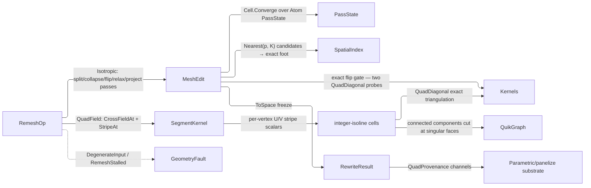

# [RASM_SIMPLIFICATION_REMESH]

`RemeshOp` owns predicate-gated mesh rewrite toward a target sampling: one `[Union]` folds isotropic edge-length equalization and cross-field quad extraction through a single `MeshEdit` arena under one exact projected-convexity flip gate.

Rebuild work composes the `Meshing/edit` arena as the sole position and face carrier, the exact `Kernels.QuadDiagonal` gate, the `Spatial/index` BVH re-projecting every relaxed vertex onto the original surface, the `segment` Knöppel owners `SegmentKernel.CrossFieldAt`/`StripeAt` over the admitting `VectorField.CrossField` factory, and the `Domain/results` `Cell.Converge` law bounding the pass budget. Every request scalar arrives as an admitted value object, so the entry gate reads shape alone.

## [01]-[INDEX]

- [02]-[REMESHING]: `Remeshing.Apply` folds isotropic equalization and cross-field quadding through one arena to `Fin<RewriteResult>`.

## [02]-[REMESHING]

- Owner: `Remeshing` mints the one static rewrite surface over `RemeshOp` the request `[Union]`, `RemeshPolicy` the `IValidityEvidence` policy row every pass reads, `RoSyOrder` the closed n-RoSy vocabulary, `PassVerdict` the pass fold's three terminal states, `PassState` its carried state, `RemeshTrace` the rewrite witness, `QuadProvenance` the quad substrate, and `RewriteResult` the carrier.
- Cases: `RemeshOp` rows `Isotropic` the edge-length equalizer and `QuadField` the field-guided quad extraction; target length and the quad arm's `RoSyOrder` ride as per-request data, the pass budget, hysteresis band, crease dihedral, and regular-valence pair as policy.
- Entry: `Apply(RemeshOp, Op?)` discriminates on the op case over `Fin` and reaches the kernel consumer API as `VectorIntent.Rewrite`, whose `RewriteCase` arm projects through `RewriteResult.Project<TOut>`; an inadmissible request routes `DegenerateInput` and a budget-exhausted rewrite `RemeshStalled` carrying the achieved deviation as an `Option` — a run that measured nothing states absence rather than echoing the target back as though it had hit it.
- Auto: `Apply` internalizes arena lifetime, the one original-surface BVH build, pass budgeting with its early convergence exit, feature and boundary pinning, and the quad arm's isotropic pre-conditioning, so a caller supplies the op and reads the trace.
- Law: the pass budget is `Cell.Converge` over one `Atom<PassState>`; the transition supplies the terminal state, and an unconverged budget lowers to `RemeshStalled`, never success-shaped fall-through. `PassState.Deviation` is `Option`, so "no pass measured" and "measured zero" stay distinguishable, and `Deviation` itself refuses an edgeless arena typed instead of publishing a fabricated mean the band would read as converged. The three terminal states are `PassVerdict` cases, so the terminal fold is one generated `Switch` with each arm carrying its own consequence.
- Law: `TargetLength` is `PositiveMagnitude` and every policy scalar an admitted value object, so `Admit` gates shape (a faceless mesh, an inverted hysteresis band) and never re-tests a range its carrier already holds. Quad arms carry `RoSyOrder`, whose key IS the order, and forward it to the `VectorField.CrossField` owner that proves the n-RoSy set.
- Exemption: the split/collapse/flip/relax passes and the quad-cell extraction are statement kernels over one single-writer arena; their `Dictionary`/`HashSet` tables are rebuilt per phase and dropped inside the fold, so none becomes a frozen table.
- Output: `RemeshTrace` witnesses every rewrite, carrying the deviation as the branch's one `Stat<Scalar>` band so mean, maximum, count, and spread arrive off one derivation; `QuadProvenance` rides `RewriteResult.Quads` on the quad arm alone and answers a typed refusal on a triangle rewrite.
- Packages: `Rasm.Meshing`, `Rasm.Spatial` (`SpatialIndex.ClosestOnTriangle` the one point-triangle refinement behind the BVH prune), `Rasm.Processing`, `Rasm.Numerics` (`ResultProjection`/`ProjectionRow` the rewrite egress), and `Rasm.Domain` (`Stat<Scalar>`/`Scalar` the deviation band; `Cell.Converge` the pass driver) are the composed kernel siblings over Rhino.Geometry at the boundary; QuikGraph's `ConnectedComponents` labels the patch decomposition, CommunityToolkit.HighPerformance's `IAction` drives the double-buffered relax sweep, and Thinktecture.Runtime.Extensions with LanguageExt.Core generate the op dispatch and carry its `Fin`/`Atom` types.
- Growth: a new rewrite modality is one `RemeshOp` case over the same pass machinery; a new n-RoSy order is one `RoSyOrder` row; a new terminal state is one `PassVerdict` case breaking the terminal `Switch` loudly; a new sizing law is one `RemeshPolicy.Sizing` producer — the hysteresis tests already read the per-position field; feature-vertex sliding is one relax-arm branch on the feature census; a new pass verb is one arm in `Pass`.
- Boundary: `RemeshOp` owns the author-kernel rewrite alone, and QuikGraph's adjacency graph never leaves the extraction.

```csharp
// --- [IMPORTS] -------------------------------------------------------------------------
using System;
using System.Collections.Generic;
using System.Linq;
using CommunityToolkit.HighPerformance.Buffers;
using CommunityToolkit.HighPerformance.Helpers;
using LanguageExt;
using LanguageExt.Common;
using QuikGraph;
using QuikGraph.Algorithms;
using Rasm.Domain;
using Rasm.Meshing;
using Rasm.Numerics;
using Rasm.Spatial;
using Rhino.Geometry;
using Thinktecture;
using static LanguageExt.Prelude;
using EdgeKeySet = System.Collections.Generic.HashSet<(int U, int V)>;
using IndexSet = System.Collections.Generic.HashSet<int>;
using Dimension = Rasm.Numerics.Dimension;

namespace Rasm.Processing;

// --- [CONSTANTS] -----------------------------------------------------------------------
public sealed record RemeshPolicy(
    Dimension Iterations, PositiveMagnitude SplitRatio, UnitInterval CollapseRatio, VectorAngle CreaseDihedral,
    UnitInterval ConvergenceBand, Dimension ProjectCandidates, Dimension ParallelFloor,
    Dimension InteriorValence, Dimension BoundaryValence,
    Option<Func<Point3d, double>> Sizing) : IValidityEvidence {
    const double CreaseDihedralRadians = 40.0 * Math.PI / 180.0;

    public static readonly RemeshPolicy Canonical = new(
        Iterations: Dimension.Create(value: 8), SplitRatio: PositiveMagnitude.Create(value: 4.0 / 3.0),
        CollapseRatio: UnitInterval.Create(value: 4.0 / 5.0), CreaseDihedral: VectorAngle.Create(value: CreaseDihedralRadians),
        ConvergenceBand: UnitInterval.Create(value: 0.2), ProjectCandidates: Dimension.Create(value: 8),
        ParallelFloor: Dimension.Create(value: 4_096),
        InteriorValence: Dimension.Create(value: 6), BoundaryValence: Dimension.Create(value: 4),
        Sizing: Option<Func<Point3d, double>>.None);

    public bool IsValid => ValidityClaim.All(SplitRatio.Value > 1.0, CollapseRatio.Value < 1.0);
}

// --- [MODELS] --------------------------------------------------------------------------
[SmartEnum<int>]
public sealed partial class RoSyOrder {
    public static readonly RoSyOrder Line = new(key: 2);
    public static readonly RoSyOrder Cross = new(key: 4);
    public static readonly RoSyOrder Hex = new(key: 6);
}

[Union(ConversionFromValue = ConversionOperatorsGeneration.None)]
public abstract partial record PassVerdict {
    private PassVerdict() { }

    public sealed record RunningCase : PassVerdict;
    public sealed record ConvergedCase : PassVerdict;
    public sealed record FaultedCase(Error Cause) : PassVerdict;
}

public sealed record RemeshTrace(
    double TargetLength, Stat<Scalar> Deviation, int Iterations,
    int Splits, int Collapses, int Flips, int FeatureEdges);

public sealed record QuadProvenance(Arr<int> Corners, Arr<int> PatchOf, Arr<double> U, Arr<double> V, Arr<int> SingularFaces);

public sealed record RewriteResult(MeshSpace Mesh, RemeshTrace Trace, Option<QuadProvenance> Quads) {
    internal Fin<TOut> Project<TOut>(Op key) {
        RewriteResult self = this;
        return ResultProjection.Rows<RewriteResult, TOut>(self: self, key: key,
            ProjectionRow.Of<MeshSpace>(() => Fin.Succ(self.Mesh)),
            ProjectionRow.Of<RemeshTrace>(() => Fin.Succ(self.Trace)),
            ProjectionRow.Of<QuadProvenance>(() => self.Quads.ToFin(key.Unsupported(inputType: typeof(RewriteResult), outputType: typeof(QuadProvenance)))));
    }
}

// --- [OPERATIONS] ----------------------------------------------------------------------
[Union(ConversionFromValue = ConversionOperatorsGeneration.None)]
public abstract partial record RemeshOp {
    private RemeshOp() { }

    public sealed record Isotropic(MeshSpace Mesh, PositiveMagnitude TargetLength, RemeshPolicy Policy) : RemeshOp;
    public sealed record QuadField(MeshSpace Mesh, PositiveMagnitude TargetLength, RoSyOrder Symmetry, RemeshPolicy Policy) : RemeshOp;
}

public static class Remeshing {
    public static Fin<RewriteResult> Apply(RemeshOp op, Op? key = null) =>
        op.Switch(
            state: key.OrDefault(),
            isotropic: static (token, i) => Admit(i.Mesh, i.Policy).Bind(_ =>
                Equalize(i.Mesh, i.TargetLength.Value, i.Policy, token).Map(static pair => new RewriteResult(pair.Space, pair.Trace, None))),
            quadField: static (token, q) => Admit(q.Mesh, q.Policy).Bind(_ => Quadrangulate(q, token)));

    static Fin<Unit> Admit(MeshSpace mesh, RemeshPolicy policy) =>
        mesh.Native.Faces.Count == 0 ? Fin.Fail<Unit>(new GeometryFault.DegenerateInput(Kind.Mesh, None, "empty mesh"))
        : !policy.IsValid ? Fin.Fail<Unit>(new GeometryFault.DegenerateInput(Kind.Mesh, None, "invalid remesh policy"))
        : Fin.Succ(unit);

    // --- [ISOTROPIC]
    sealed record PassState(
        int Rounds, int Splits, int Collapses, int Flips, int Features,
        Option<Stat<Scalar>> Deviation, PassVerdict Verdict) {
        internal static readonly PassState Seed = new(0, 0, 0, 0, 0, None, new PassVerdict.RunningCase());

        internal bool Settled => Verdict is not PassVerdict.RunningCase;
    }

    static Fin<(MeshSpace Space, RemeshTrace Trace)> Equalize(MeshSpace source, double target, RemeshPolicy policy, Op key) {
        using MeshEdit arena = MeshEdit.Of(source, ArenaPolicy.Canonical with { ParallelFloor = policy.ParallelFloor });
        return SourceIndex(source, key).Bind(frozen => {
            Func<Point3d, double> targetAt = policy.Sizing.Match(
                Some: field => (Func<Point3d, double>)(at => field(at) is > 0.0 and var local && double.IsFinite(local) ? local : target),
                None: () => _ => target);
            Atom<PassState> cell = Atom(value: PassState.Seed);
            Transition<PassState> driven = Cell.Converge(
                cell: cell,
                step: state => Some(state.Settled ? state : Pass(state)),
                settled: static state => state.Settled,
                budget: policy.Iterations,
                declined: key.InvalidResult());
            PassState terminal = driven.Current;
            return terminal.Verdict.Switch(
                state: (State: terminal, Policy: policy, Target: target, Arena: arena, Key: key),
                runningCase: static (s, _) => s.State.Deviation.Match(
                    Some: measured => measured.Mean <= s.Policy.ConvergenceBand.Value
                        ? Emit(s.Arena, s.Target, s.State, measured, s.Key)
                        : Fin.Fail<(MeshSpace, RemeshTrace)>(new GeometryFault.RemeshStalled(PositiveMagnitude.Create(value: s.Target), Some(s.Target * (1.0 + measured.Mean)), s.State.Rounds)),
                    None: () => Fin.Fail<(MeshSpace, RemeshTrace)>(new GeometryFault.RemeshStalled(PositiveMagnitude.Create(value: s.Target), Option<double>.None, 0))),
                convergedCase: static (s, _) => s.State.Deviation
                    .ToFin(s.Key.InvalidResult())
                    .Bind(measured => Emit(s.Arena, s.Target, s.State, measured, s.Key)),
                faultedCase: static (s, faulted) => Fin.Fail<(MeshSpace, RemeshTrace)>(faulted.Cause));

            PassState Pass(PassState state) {
                double featureAngle = policy.CreaseDihedral.Value;
                Edges edges = Edges.Of(arena, featureAngle);
                int features = edges.FeatureCount;
                int did = Split(arena, edges, targetAt, policy.SplitRatio.Value);
                edges = Edges.Of(arena, featureAngle);
                int killed = Collapse(arena, edges, targetAt, policy.CollapseRatio.Value, policy.SplitRatio.Value);
                edges = Edges.Of(arena, featureAngle);
                int turned = Flip(arena, edges, policy);
                Relax(arena, Edges.Of(arena, featureAngle));
                if (Project(arena, frozen, policy, key).Case is Error fault) {
                    return state with { Verdict = new PassVerdict.FaultedCase(fault) };
                }
                return Deviation(arena, targetAt, key).Match(
                    Succ: spread => state with {
                        Rounds = state.Rounds + 1, Splits = state.Splits + did, Collapses = state.Collapses + killed,
                        Flips = state.Flips + turned, Features = features, Deviation = Some(spread),
                        Verdict = did + killed + turned == 0 && spread.Mean <= policy.ConvergenceBand.Value
                            ? new PassVerdict.ConvergedCase()
                            : state.Verdict,
                    },
                    Fail: fault => state with { Verdict = new PassVerdict.FaultedCase(fault) });
            }
        });
    }

    static Fin<(MeshSpace Space, RemeshTrace Trace)> Emit(MeshEdit arena, double target, PassState state, Stat<Scalar> measured, Op key) =>
        arena.ToSpace(key).Map(space => (space, new RemeshTrace(
            target, measured, state.Rounds, state.Splits, state.Collapses, state.Flips, state.Features)));

    sealed record Edges(Dictionary<(int U, int V), (int F0, Option<int> F1)> Table, EdgeKeySet Feature, IndexSet Pinned, IndexSet Boundary) {
        public int FeatureCount => Feature.Count;

        public static Edges Of(MeshEdit arena, double featureAngle) {
            Dictionary<(int, int), (int F0, Option<int> F1)> table = [];
            for (int f = 0; f < arena.FaceCount; f++) {
                if (!arena.Alive(f)) { continue; }
                (int a, int b, int c) = arena.Face(f);
                foreach ((int u, int v) in (ReadOnlySpan<(int, int)>)[(a, b), (b, c), (c, a)]) {
                    (int cu, int cv) = (int.Min(u, v), int.Max(u, v));
                    table[(cu, cv)] = table.TryGetValue((cu, cv), out (int F0, Option<int> F1) held) ? (held.F0, Some(f)) : (f, Option<int>.None);
                }
            }
            EdgeKeySet feature = [];
            IndexSet pinned = [];
            IndexSet boundary = [];
            foreach (((int u, int v), (int f0, Option<int> f1)) in table) {
                if (f1.IsNone) {
                    boundary.Add(u);
                    boundary.Add(v);
                }
                bool crease = f1.Match(
                    Some: g => Vector3d.VectorAngle(Normal(arena, f0), Normal(arena, g)) > featureAngle,
                    None: static () => true);
                if (crease) {
                    feature.Add((u, v));
                    pinned.Add(u);
                    pinned.Add(v);
                }
            }
            return new Edges(table, feature, pinned, boundary);
        }

        static Vector3d Normal(MeshEdit arena, int f) {
            (int a, int b, int c) = arena.Face(f);
            return Vector3d.CrossProduct(arena.Position(b) - arena.Position(a), arena.Position(c) - arena.Position(a));
        }
    }

    static int Split(MeshEdit arena, Edges edges, Func<Point3d, double> targetAt, double splitRatio) {
        int did = 0;
        foreach (((int u, int v), (int f0, Option<int> f1)) in edges.Table.ToArray()) {
            Point3d mid = 0.5 * (arena.Position(u) + arena.Position(v));
            if (arena.Position(u).DistanceTo(arena.Position(v)) <= targetAt(mid) * splitRatio) { continue; }
            int m = arena.AddVertex(mid);
            Retile(arena, f0, u, v, m);
            f1.Iter(f => Retile(arena, f, u, v, m));
            did++;
        }
        return did;

        static void Retile(MeshEdit arena, int f, int u, int v, int m) {
            if (!arena.Alive(f)) { return; }
            (int a, int b, int c) = arena.Face(f);
            if (!Holds((a, b, c), u, v)) { return; }
            (int from, int to) = Follows(a, b, c, u, v) ? (u, v) : (v, u);
            int w = a != u && a != v ? a : b != u && b != v ? b : c;
            arena.SetFace(f, from, m, w);
            arena.AddFace(m, to, w);
        }
    }

    static bool Follows(int a, int b, int c, int u, int v) =>
        (a == u && b == v) || (b == u && c == v) || (c == u && a == v);

    static bool Holds((int A, int B, int C) face, int u, int v) =>
        (face.A == u || face.B == u || face.C == u) && (face.A == v || face.B == v || face.C == v);

    static int Collapse(MeshEdit arena, Edges edges, Func<Point3d, double> targetAt, double collapseRatio, double splitRatio) {
        Dictionary<int, List<int>> facesOf = [];
        for (int f = 0; f < arena.FaceCount; f++) {
            if (!arena.Alive(f)) { continue; }
            (int a, int b, int c) = arena.Face(f);
            foreach (int v in (ReadOnlySpan<int>)[a, b, c]) {
                (facesOf.TryGetValue(v, out List<int>? fs) ? fs : facesOf[v] = []).Add(f);
            }
        }
        Dictionary<int, IndexSet> neighbors = [];
        foreach (((int u, int v), _) in edges.Table) {
            (neighbors.TryGetValue(u, out IndexSet? nu) ? nu : neighbors[u] = []).Add(v);
            (neighbors.TryGetValue(v, out IndexSet? nv) ? nv : neighbors[v] = []).Add(u);
        }
        IndexSet dead = [];
        int did = 0;
        foreach (((int cu, int cv), (_, Option<int> f1)) in edges.Table) {
            if (dead.Contains(cu) || dead.Contains(cv)) { continue; }
            (int u, int v) = edges.Pinned.Contains(cu) ? (cv, cu) : (cu, cv);
            if (edges.Pinned.Contains(u)) { continue; }
            if (arena.Position(u).DistanceTo(arena.Position(v)) >= targetAt(0.5 * (arena.Position(u) + arena.Position(v))) * collapseRatio) { continue; }
            if (neighbors[u].Count(w => neighbors[v].Contains(w)) != (f1.IsNone ? 1 : 2)) { continue; }
            bool minted = facesOf.TryGetValue(u, out List<int>? around) && around.Where(arena.Alive).Any(f => {
                (int a, int b, int c) = arena.Face(f);
                foreach (int w in (ReadOnlySpan<int>)[a, b, c]) {
                    if (w != u && w != v && arena.Position(v).DistanceTo(arena.Position(w))
                        > targetAt(0.5 * (arena.Position(v) + arena.Position(w))) * splitRatio) { return true; }
                }
                return false;
            });
            if (minted) { continue; }
            foreach (int f in facesOf.TryGetValue(u, out List<int>? incident) ? incident : []) {
                if (!arena.Alive(f)) { continue; }
                (int a, int b, int c) = arena.Face(f);
                (a, b, c) = (a == u ? v : a, b == u ? v : b, c == u ? v : c);
                if (a == b || b == c || c == a) { arena.KillFace(f); }
                else {
                    arena.SetFace(f, a, b, c);
                    (facesOf.TryGetValue(v, out List<int>? vf) ? vf : facesOf[v] = []).Add(f);
                }
            }
            foreach (int w in neighbors[u].Where(w => w != v)) {
                neighbors[w].Remove(u);
                neighbors[w].Add(v);
                neighbors[v].Add(w);
            }
            neighbors[v].Remove(u);
            dead.Add(u);
            did++;
        }
        return did;
    }

    static int Flip(MeshEdit arena, Edges edges, RemeshPolicy policy) {
        Dictionary<int, int> valence = [];
        foreach (((int u, int v), _) in edges.Table) {
            valence[u] = valence.GetValueOrDefault(u) + 1;
            valence[v] = valence.GetValueOrDefault(v) + 1;
        }
        (int interior, int rim) = (policy.InteriorValence.Value, policy.BoundaryValence.Value);
        int did = 0;
        foreach (((int a0, int b0), (int f0, Option<int> f1Slot)) in edges.Table.ToArray()) {
            if (f1Slot.Case is not int f1 || edges.Feature.Contains((a0, b0)) || !arena.Alive(f0) || !arena.Alive(f1)) { continue; }
            if (!Holds(arena.Face(f0), a0, b0) || !Holds(arena.Face(f1), a0, b0)) { continue; }
            (int fa, int fb, int fc) = arena.Face(f0);
            (int a, int b) = Follows(fa, fb, fc, a0, b0) ? (a0, b0) : (b0, a0);
            if (Opposite(arena, f0, a, b).Case is not int c) { continue; }
            if (Opposite(arena, f1, a, b).Case is not int d || c == d) { continue; }
            int Deviate(int v, int delta) => Math.Abs(valence.GetValueOrDefault(v) + delta - (edges.Boundary.Contains(v) ? rim : interior));
            int before = Deviate(a, 0) + Deviate(b, 0) + Deviate(c, 0) + Deviate(d, 0);
            int after = Deviate(a, -1) + Deviate(b, -1) + Deviate(c, +1) + Deviate(d, +1);
            if (after >= before) { continue; }
            (Point3d pa, Point3d pb, Point3d pc, Point3d pd) =
                (arena.Position(a), arena.Position(b), arena.Position(c), arena.Position(d));
            if (!Kernels.QuadDiagonal(pa, pc, pb, pd) || !Kernels.QuadDiagonal(pc, pa, pd, pb)) { continue; }
            arena.SetFace(f0, a, d, c);
            arena.SetFace(f1, b, c, d);
            (valence[a], valence[b], valence[c], valence[d]) =
                (valence.GetValueOrDefault(a) - 1, valence.GetValueOrDefault(b) - 1, valence.GetValueOrDefault(c) + 1, valence.GetValueOrDefault(d) + 1);
            did++;
        }
        return did;
    }

    static Option<int> Opposite(MeshEdit arena, int f, int u, int v) {
        (int a, int b, int c) = arena.Face(f);
        return a != u && a != v ? Some(a) : b != u && b != v ? Some(b) : c != u && c != v ? Some(c) : Option<int>.None;
    }

    readonly struct RelaxAction(ReadOnlyMemory<Vector3d> accumulated, ReadOnlyMemory<double> weight, ReadOnlyMemory<Vector3d> normal, Memory<Point3d> position, ReadOnlyMemory<bool> pinned) : IAction {
        public void Invoke(int v) {
            if (pinned.Span[v] || weight.Span[v] <= EpsilonPolicy.ZeroTolerance) { return; }
            Point3d g = Point3d.Origin + ((1.0 / weight.Span[v]) * accumulated.Span[v]);
            Vector3d n = normal.Span[v];
            if (!n.Unitize()) { return; }
            Point3d p = position.Span[v];
            position.Span[v] = g + (((p - g) * n) * n);
        }
    }

    static void Relax(MeshEdit arena, Edges edges) {
        int n = arena.VertexCount;
        using MemoryOwner<Vector3d> accumulated = MemoryOwner<Vector3d>.Allocate(n, AllocationMode.Clear);
        using MemoryOwner<double> weight = MemoryOwner<double>.Allocate(n, AllocationMode.Clear);
        using MemoryOwner<Vector3d> normal = MemoryOwner<Vector3d>.Allocate(n, AllocationMode.Clear);
        using MemoryOwner<Point3d> position = MemoryOwner<Point3d>.Allocate(n, AllocationMode.Clear);
        using MemoryOwner<bool> pinned = MemoryOwner<bool>.Allocate(n, AllocationMode.Clear);
        for (int f = 0; f < arena.FaceCount; f++) {
            if (!arena.Alive(f)) { continue; }
            (int a, int b, int c) = arena.Face(f);
            Vector3d cross = Vector3d.CrossProduct(arena.Position(b) - arena.Position(a), arena.Position(c) - arena.Position(a));
            double area = 0.5 * cross.Length;
            Point3d centroid = (arena.Position(a) + arena.Position(b) + arena.Position(c)) / 3.0;
            foreach (int v in (ReadOnlySpan<int>)[a, b, c]) {
                accumulated.Span[v] += area * (Vector3d)centroid;
                weight.Span[v] += area;
                normal.Span[v] += cross;
            }
        }
        foreach (int v in edges.Pinned) { pinned.Span[v] = true; }
        for (int v = 0; v < n; v++) { position.Span[v] = arena.Position(v); }
        arena.Parallel(n, new RelaxAction(accumulated.Memory, weight.Memory, normal.Memory, position.Memory, pinned.Memory));
        for (int v = 0; v < n; v++) { arena.SetPosition(v, position.Span[v]); }
    }

    // --- [PROJECTION]
    sealed record Source(SpatialIndex Index, (Point3d A, Point3d B, Point3d C)[] Faces);

    static Fin<Source> SourceIndex(MeshSpace source, Op key) {
        using MeshEdit soup = MeshEdit.Of(source);
        BoundingBox[] boxes = new BoundingBox[soup.FaceCount];
        (Point3d A, Point3d B, Point3d C)[] corners = new (Point3d A, Point3d B, Point3d C)[soup.FaceCount];
        for (int f = 0; f < soup.FaceCount; f++) {
            boxes[f] = soup.Bounds(f);
            (int a, int b, int c) = soup.Face(f);
            corners[f] = (soup.Position(a), soup.Position(b), soup.Position(c));
        }
        return Spatial.Apply(new SpatialOp.Build(SpatialKind.Bvh, boxes, BuildPolicy.Canonical), key)
            .Bind(answer => answer is SpatialAnswer.Index built
                ? Fin.Succ(new Source(built.Value, corners))
                : Fin.Fail<Source>(key.InvalidResult()));
    }

    static Fin<Unit> Project(MeshEdit arena, Source source, RemeshPolicy policy, Op key) =>
        Range(0, arena.VertexCount).ToSeq().TraverseM(v => {
            Point3d p = arena.Position(v);
            return Spatial.Apply(new SpatialOp.Query(source.Index, new SpatialQuery.Nearest(p, policy.ProjectCandidates.Value)), key)
                .Bind(answer => answer is SpatialAnswer.Result { Value: QueryResult.Nearest hits }
                    ? Fin.Succ(hits.Ordered)
                    : Fin.Fail<Seq<int>>(key.InvalidResult()))
                .Map(hits => {
                    (Point3d at, Option<double> _) = hits.Fold(
                        (At: p, Distance: Option<double>.None),
                        (best, f) => {
                            (Point3d foot, double d) = SpatialIndex.ClosestOnTriangle(p, source.Faces[f].A, source.Faces[f].B, source.Faces[f].C);
                            return best.Distance.Map(held => d < held).IfNone(true) ? (foot, Some(d)) : best;
                        });
                    arena.SetPosition(v, at);
                    return unit;
                });
        }).As().Map(_ => unit);

    static Fin<Stat<Scalar>> Deviation(MeshEdit arena, Func<Point3d, double> targetAt, Op key) {
        Seq<Scalar> deviations = [];
        EdgeKeySet seen = [];
        for (int f = 0; f < arena.FaceCount; f++) {
            if (!arena.Alive(f)) { continue; }
            (int a, int b, int c) = arena.Face(f);
            foreach ((int u, int v) in (ReadOnlySpan<(int, int)>)[(a, b), (b, c), (c, a)]) {
                if (!seen.Add((int.Min(u, v), int.Max(u, v)))) { continue; }
                double local = targetAt(0.5 * (arena.Position(u) + arena.Position(v)));
                deviations = deviations.Add((Scalar)(Math.Abs(arena.Position(u).DistanceTo(arena.Position(v)) - local) / local));
            }
        }
        return Stat<Scalar>.Of(values: deviations, key: key);
    }

    // --- [QUAD_FIELD]
    static Fin<RewriteResult> Quadrangulate(RemeshOp.QuadField op, Op key) =>
        Equalize(op.Mesh, op.TargetLength.Value, op.Policy, key).Bind(pair => {
            MeshSpace space = pair.Space;
            double frequency = 1.0 / op.TargetLength.Value;
            (int a, int b, int c) = (space.Native.Faces[0].A, space.Native.Faces[0].B, space.Native.Faces[0].C);
            Point3d seed = space.Native.Vertices[a];
            Vector3d normal = Vector3d.CrossProduct(
                (Point3d)space.Native.Vertices[b] - space.Native.Vertices[a],
                (Point3d)space.Native.Vertices[c] - space.Native.Vertices[a]);
            return SegmentKernel.CrossFieldAt(space, op.Symmetry.Key, None, None, seed, key)
                .Bind(baseDir => Direction.Of(value: Vector3d.CrossProduct(normal, baseDir), context: space.Tolerance, key: key))
                .Bind(turned =>
                    from cross in VectorField.CrossField(space, op.Symmetry.Key, None, None, key)
                    from rotated in VectorField.CrossField(space, op.Symmetry.Key, Some(Seq((a, turned))), None, key)
                    select (Cross: cross, Rotated: rotated))
                .Bind(fields =>
                    (SampleStripes(space, fields.Cross, frequency, key).ToValidation(),
                     SampleStripes(space, fields.Rotated, frequency, key).ToValidation())
                        .Apply(static (us, vs) => (Us: us, Vs: vs)).As().ToFin()
                        .Bind(uv => ExtractQuads(space, uv.Us, uv.Vs, pair.Trace, key)));
        });

    static Fin<Arr<double>> SampleStripes(MeshSpace space, VectorField field, double frequency, Op key) =>
        Range(0, space.Native.Vertices.Count)
            .TraverseM(v => SegmentKernel.StripeAt(space, field, frequency, space.Native.Vertices[v], key)).As()
            .Map(static values => toArr(values));

    static readonly (long Du, long Dv)[] Ring = [(0, 0), (1, 0), (1, 1), (0, 1)];

    static Fin<RewriteResult> ExtractQuads(MeshSpace space, Arr<double> u, Arr<double> v, RemeshTrace trace, Op key) {
        using MeshEdit soup = MeshEdit.Of(space);
        IndexSet singular = [];
        Dictionary<(long Iu, long Iv), List<int>> cellFaces = [];
        for (int f = 0; f < soup.FaceCount; f++) {
            (int a, int b, int c) = soup.Face(f);
            (double du, double dv) = (Spread(u[a], u[b], u[c]), Spread(v[a], v[b], v[c]));
            if (du > 1.0 || dv > 1.0) { singular.Add(f); continue; }
            (long lu, long hu) = ((long)Math.Floor(Math.Min(u[a], Math.Min(u[b], u[c]))), (long)Math.Floor(Math.Max(u[a], Math.Max(u[b], u[c]))));
            (long lv, long hv) = ((long)Math.Floor(Math.Min(v[a], Math.Min(v[b], v[c]))), (long)Math.Floor(Math.Max(v[a], Math.Max(v[b], v[c]))));
            for (long iu = lu; iu <= hu; iu++) {
                for (long iv = lv; iv <= hv; iv++) {
                    (cellFaces.TryGetValue((iu, iv), out List<int>? fs) ? fs : cellFaces[(iu, iv)] = []).Add(f);
                }
            }
        }
        UndirectedGraph<int, SEdge<int>> adjacency = new(allowParallelEdges: false);
        adjacency.AddVertexRange(Enumerable.Range(0, soup.FaceCount).Where(f => !singular.Contains(f)));
        Dictionary<(int, int), int> byEdge = [];
        for (int f = 0; f < soup.FaceCount; f++) {
            if (singular.Contains(f)) { continue; }
            (int a, int b, int c) = soup.Face(f);
            foreach ((int p, int q) in (ReadOnlySpan<(int, int)>)[(a, b), (b, c), (c, a)]) {
                (int cp, int cq) = (int.Min(p, q), int.Max(p, q));
                if (byEdge.TryGetValue((cp, cq), out int g) && !singular.Contains(g)) { adjacency.AddEdge(new SEdge<int>(int.Min(f, g), int.Max(f, g))); }
                else { byEdge[(cp, cq)] = f; }
            }
        }
        Dictionary<int, int> faceComponent = [];
        adjacency.ConnectedComponents(faceComponent);

        using MeshEdit emit = MeshEdit.Of(ReadOnlySpan<Point3d>.Empty, ReadOnlySpan<(int, int, int)>.Empty, space.Tolerance);
        Dictionary<(long, long, int), int> interned = [];
        (List<double> uOut, List<double> vOut) = ([], []);
        (List<int> corners, List<int> patchOf) = ([], []);
        foreach ((long iu, long iv) in cellFaces.Keys.OrderBy(static cell => cell)) {
            Option<Seq<(Point3d At, int Face)>> ring = toSeq(Ring).Fold(
                Some(Seq<(Point3d At, int Face)>()),
                (acc, step) => acc.Bind(rows => Locate(soup, u, v, cellFaces, iu + step.Du, iv + step.Dv).Map(rows.Add)));
            if (ring.Case is not Seq<(Point3d At, int Face)> located) { continue; }
            int patch = faceComponent.GetValueOrDefault(located[0].Face);
            int[] quad = new int[4];
            for (int k = 0; k < 4; k++) {
                (long cu, long cv) = (iu + Ring[k].Du, iv + Ring[k].Dv);
                if (!interned.TryGetValue((cu, cv, patch), out int ordinal)) {
                    ordinal = emit.AddVertex(located[k].At);
                    interned[(cu, cv, patch)] = ordinal;
                    uOut.Add(cu);
                    vOut.Add(cv);
                }
                quad[k] = ordinal;
            }
            corners.AddRange(quad);
            patchOf.Add(patch);
            if (Kernels.QuadDiagonal(emit.Position(quad[0]), emit.Position(quad[1]), emit.Position(quad[2]), emit.Position(quad[3]))) {
                emit.AddFace(quad[0], quad[1], quad[2]);
                emit.AddFace(quad[0], quad[2], quad[3]);
            }
            else {
                emit.AddFace(quad[0], quad[1], quad[3]);
                emit.AddFace(quad[1], quad[2], quad[3]);
            }
        }
        return emit.ToSpace(key).Map(mesh => new RewriteResult(
            mesh, trace, Some(new QuadProvenance(toArr(corners), toArr(patchOf), toArr(uOut), toArr(vOut), toArr(singular.Order())))));
    }

    static Option<(Point3d At, int Face)> Locate(MeshEdit soup, Arr<double> u, Arr<double> v, Dictionary<(long Iu, long Iv), List<int>> cells, long cu, long cv) {
        foreach ((long du, long dv) in (ReadOnlySpan<(long, long)>)[(0, 0), (-1, 0), (0, -1), (-1, -1)]) {
            if (!cells.TryGetValue((cu + du, cv + dv), out List<int>? members)) { continue; }
            foreach (int f in members) {
                (int a, int b, int c) = soup.Face(f);
                double det = ((u[b] - u[a]) * (v[c] - v[a])) - ((u[c] - u[a]) * (v[b] - v[a]));
                if (Math.Abs(det) <= EpsilonPolicy.ZeroTolerance) { continue; }
                double wb = (((cu - u[a]) * (v[c] - v[a])) - ((cv - v[a]) * (u[c] - u[a]))) / det;
                double wc = (((cv - v[a]) * (u[b] - u[a])) - ((cu - u[a]) * (v[b] - v[a]))) / det;
                double wa = 1.0 - wb - wc;
                if (wa is < 0.0 or > 1.0 || wb is < 0.0 or > 1.0 || wc is < 0.0 or > 1.0) { continue; }
                (Point3d pa, Point3d pb, Point3d pc) = (soup.Position(a), soup.Position(b), soup.Position(c));
                return Some((new Point3d(
                    (wa * pa.X) + (wb * pb.X) + (wc * pc.X),
                    (wa * pa.Y) + (wb * pb.Y) + (wc * pc.Y),
                    (wa * pa.Z) + (wb * pb.Z) + (wc * pc.Z)), f));
            }
        }
        return None;
    }

    static double Spread(double a, double b, double c) => Math.Max(a, Math.Max(b, c)) - Math.Min(a, Math.Min(b, c));

}
```



## [03]-[DENSITY_BAR]

One owner per axis; each `[RESULT]` names the owner's one return type.

| [INDEX] | [AXIS_CONCERN] | [OWNER]          | [RESULT]                               | [CASES] |
| :-----: | :------------- | :--------------- | :------------------------------------- | :-----: |
|  [01]   | Remeshing      | `RemeshOp`       | `Remeshing.Apply → Fin<RewriteResult>` |    2    |
|  [02]   | Rewrite policy | `RemeshPolicy`   | value (`IValidityEvidence`)            |    —    |
|  [03]   | Pass fold      | `PassState`      | interior (`Atom` under `Schedule`)     |    3    |
|  [04]   | Evidence       | `RemeshTrace`    | carrier on the result                  |    —    |
|  [05]   | Quad substrate | `QuadProvenance` | carrier (`Option` on the result)       |    —    |

## [04]-[RESEARCH]

<!-- source-only: research row template:
[TOKEN]-[OPEN|BLOCKED]: <exact question>; <verification route>.
-->

(none)
