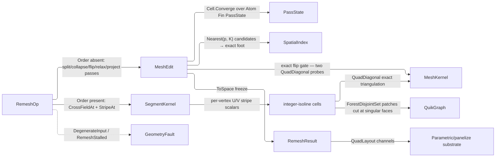

# [RASM_SIMPLIFICATION_REMESH]

`RemeshOp` owns predicate-gated mesh rewrite toward a target sampling: one request record whose optional n-RoSy order selects isotropic edge-length equalization or cross-field quad extraction, both folded through a single `MeshEdit` arena under one exact projected-convexity flip gate.

Rebuild work composes the `Meshing/edit` arena as the sole position and face carrier, the exact `MeshKernel.QuadDiagonal` gate, the `Spatial/index` BVH re-projecting every relaxed vertex onto the original surface, the `segment` Knöppel owners `SegmentKernel.CrossFieldAt`/`StripeAt` over the admitting `VectorField.CrossField` factory, and the `Domain/results` `Cell.Converge` law bounding the pass budget. Every request scalar arrives as an admitted value object, so the entry gate reads shape alone.

## [01]-[INDEX]

- [02]-[REMESHING]: `Remeshing.Apply` folds isotropic equalization and cross-field quadding through one arena to `Fin<RemeshResult>`.

## [02]-[REMESHING]

- Owner: `Remeshing` mints the one static rewrite surface over `RemeshOp` the request record, `RemeshPolicy` the `IValidityEvidence` policy row every pass reads, `PassState` the pass fold's carried state, `QuadLayout` the retained quad layout, and `RemeshResult` the one typed result carrying mesh, target, deviation band, pass tallies, and the optional layout.
- Cases: `RemeshOp` carries mesh, target length, policy, and `Option<RosyOrder>` `Order` — absent selects the edge-length equalizer, present the field-guided quad extraction over it; the pass budget, hysteresis band, crease dihedral, and per-position sizing ride as policy, and regular triangular valence — six interior, four on the boundary — is the flip objective's own law, never a policy target.
- Entry: `Apply(RemeshOp)` discriminates on the request shape over `Fin` — faceless mesh, invalid policy, present order, isotropic — in one structural switch, `RemeshResult` its one typed egress read by column; an inadmissible request routes `DegenerateInput` and a budget-exhausted rewrite `RemeshStalled` carrying the achieved deviation as an `Option` — a run that measured nothing states absence rather than echoing the target back as though it had hit it.
- Auto: `Apply` internalizes arena lifetime, the one original-surface BVH build, pass budgeting with its early convergence exit, feature and boundary pinning, and the quad arm's isotropic pre-conditioning, so a caller supplies the request and reads the result.
- Law: the pass budget is `Cell.Converge` over one `Atom<Fin<PassState>>`; a projection or deviation refusal terminates on `Fin`, the state carries only the convergence fact, and an unconverged budget lowers to `RemeshStalled`, never success-shaped fall-through. `PassState.Deviation` is `Option`, so "no pass measured" and "measured zero" stay distinguishable, and `Deviation` itself refuses an edgeless arena typed instead of publishing a fabricated mean the band would read as converged. The terminal fold is one `Bind` over the settled `Fin` — the failure arm IS the fault, the success arm reads the band and freezes the arena.
- Law: `TargetLength` is `PositiveMagnitude` and every policy scalar an admitted value object, so the entry switch gates shape (a faceless mesh, an inverted hysteresis band) and never re-tests a range its carrier already holds. Quad arms carry the `segment` `RosyOrder` row — the one closed n-RoSy vocabulary, admitted once at that owner — and forward it unprojected to the `VectorField.CrossField` factory and `SegmentKernel.CrossFieldAt`; `.Key` reads only inside the kernel's phase, power, and cache arithmetic.
- Exemption: the split/collapse/flip/relax passes and the quad-cell extraction are statement kernels over one single-writer arena; their `Dictionary`/`HashSet` tables are rebuilt per phase and dropped inside the fold, so none becomes a frozen table.
- Output: `RemeshResult` witnesses every rewrite in place — the admitted target, the pass tallies, and the deviation as the branch's one `Stat<Scalar>` band so mean, maximum, count, and spread arrive off one derivation; `QuadLayout` rides `RemeshResult.Quads` on the quad arm alone and reads `None` on a triangle rewrite, with no generic projection beside the columns.
- Packages: `Rasm.Meshing`, `Rasm.Spatial` (`SpatialIndex.ClosestOnTriangle` the one point-triangle refinement behind the BVH prune), `Rasm.Processing` (`RosyOrder` the forwarded order, `SegmentKernel` the field owner), `Rasm.Numerics` (`Dimension`/`PositiveMagnitude`/`UnitInterval`/`VectorAngle` the admitted policy scalars, `GeometryFault` the refusal family), and `Rasm.Domain` (`Stat<Scalar>`/`Scalar` the deviation band; `Cell.Converge` the pass driver) are the composed kernel siblings over Rhino.Geometry at the boundary; QuikGraph's `ForestDisjointSet` labels the patch decomposition — one set per nonsingular face, one `Union` per shared nonsingular edge, `FindSet` the retained representative, CommunityToolkit.HighPerformance's `IAction` drives the double-buffered relax sweep, and LanguageExt.Core carries the `Fin`/`Option`/`Validation`/`Atom` types.
- Growth: a new rewrite modality is one optional column on `RemeshOp` and one arm in the entry switch over the same pass machinery; a new n-RoSy order is one `RosyOrder` row at the `segment` owner; a new pass tally is one column on `PassState` carried onto `RemeshResult`; a new sizing law is one `RemeshPolicy.Sizing` producer answering `PositiveMagnitude`, so the inner loop reads admitted lengths with no fallback validation — the hysteresis tests already read the per-position field; feature-vertex sliding is one relax-arm branch on the feature census; a new pass verb is one arm in `Pass`.
- Boundary: `RemeshOp` owns the author-kernel rewrite alone.

```csharp
// --- [IMPORTS] -------------------------------------------------------------------------
using System;
using System.Collections.Generic;
using System.Linq;
using CommunityToolkit.HighPerformance.Buffers;
using CommunityToolkit.HighPerformance.Helpers;
using LanguageExt;
using QuikGraph.Collections;
using Rasm.Domain;
using Rasm.Meshing;
using Rasm.Numerics;
using Rasm.Spatial;
using Rhino.Geometry;
using static LanguageExt.Prelude;
using EdgeKeySet = System.Collections.Generic.HashSet<(int U, int V)>;
using IndexSet = System.Collections.Generic.HashSet<int>;
using Dimension = Rasm.Numerics.Dimension;

namespace Rasm.Processing;

// --- [CONSTANTS] -----------------------------------------------------------------------
public sealed record RemeshPolicy(
    Dimension Iterations, PositiveMagnitude SplitRatio, UnitInterval CollapseRatio, VectorAngle CreaseDihedral,
    UnitInterval ConvergenceBand, Dimension ProjectCandidates, Dimension ParallelFloor,
    Option<Func<Point3d, PositiveMagnitude>> Sizing) : IValidityEvidence {
    public static readonly RemeshPolicy Canonical = new(
        Iterations: Dimension.Create(value: 8), SplitRatio: PositiveMagnitude.Create(value: 4.0 / 3.0),
        CollapseRatio: UnitInterval.Create(value: 4.0 / 5.0),
        CreaseDihedral: VectorAngle.Create(value: 40.0 * Math.PI / 180.0),
        ConvergenceBand: UnitInterval.Create(value: 0.2), ProjectCandidates: Dimension.Create(value: 8),
        ParallelFloor: Dimension.Create(value: 4_096),
        Sizing: Option<Func<Point3d, PositiveMagnitude>>.None);

    public bool IsValid => ValidityClaim.All(SplitRatio.Value > 1.0, CollapseRatio.Value < 1.0);
}

// --- [MODELS] --------------------------------------------------------------------------
public sealed record RemeshOp(
    MeshSpace Mesh, PositiveMagnitude TargetLength, RemeshPolicy Policy,
    Option<RosyOrder> Order = default);

public sealed record QuadLayout(Arr<int> Corners, Arr<int> PatchOf, Arr<double> U, Arr<double> V, Arr<int> SingularFaces);

public sealed record RemeshResult(
    MeshSpace Mesh, PositiveMagnitude TargetLength, Stat<Scalar> Deviation,
    int Iterations, int Splits, int Collapses, int Flips, int FeatureEdges,
    Option<QuadLayout> Quads);

// --- [OPERATIONS] ----------------------------------------------------------------------
public static class Remeshing {
    public static Fin<RemeshResult> Apply(RemeshOp request) {
        return request switch {
            { Mesh.Native.Faces.Count: 0 } => Fin.Fail<RemeshResult>(
                new GeometryFault.DegenerateInput(Kind.Mesh, None, "empty mesh")),
            { Policy.IsValid: false } => Fin.Fail<RemeshResult>(
                new GeometryFault.DegenerateInput(Kind.Mesh, None, "invalid remesh policy")),
            { Order.Case: RosyOrder order } => Quadrangulate(request, order),
            _ => Equalize(request.Mesh, request.TargetLength, request.Policy),
        };
    }

    // --- [ISOTROPIC]
    sealed record PassState(
        int Iterations, int Splits, int Collapses, int Flips, int FeatureEdges,
        Option<Stat<Scalar>> Deviation, bool Converged);

    static Fin<RemeshResult> Equalize(
        MeshSpace source, PositiveMagnitude target, RemeshPolicy policy) {
        using MeshEdit arena = MeshEdit.Of(
            source, ArenaPolicy.Canonical with { ParallelFloor = policy.ParallelFloor });
        using MeshEdit original = MeshEdit.Of(source);
        BoundingBox[] boxes = new BoundingBox[original.FaceCount];
        (Point3d A, Point3d B, Point3d C)[] faces = new (Point3d, Point3d, Point3d)[original.FaceCount];
        for (int face = 0; face < original.FaceCount; face++) {
            boxes[face] = original.Bounds(face);
            (int a, int b, int c) = original.Face(face);
            faces[face] = (original.Position(a), original.Position(b), original.Position(c));
        }
        return SpatialIndex.Build(SpatialKind.Bvh, boxes, BuildPolicy.Canonical).Bind(index => {
            Func<Point3d, double> targetAt = policy.Sizing.Match<Func<Point3d, double>>(
                Some: field => point => field(point).Value,
                None: () => _ => target.Value);
            Atom<Fin<PassState>> cell = Atom(Fin.Succ(new PassState(0, 0, 0, 0, 0, None, false)));
            Fin<PassState> terminal = Cell.Converge(
                cell: cell,
                step: outcome => Some(outcome.Bind(Pass)),
                settled: outcome => outcome.Match(Succ: static state => state.Converged, Fail: static _ => true),
                budget: policy.Iterations,
                declined: new KernelFault.InvalidResult()).Current;
            return terminal.Bind(state => state.Deviation.Match(
                Some: measured => measured.Mean <= policy.ConvergenceBand.Value
                    ? arena.ToSpace().Map(space => new RemeshResult(
                        space, target, measured, state.Iterations, state.Splits, state.Collapses,
                        state.Flips, state.FeatureEdges, None))
                    : Fin.Fail<RemeshResult>(new GeometryFault.RemeshStalled(
                        target, Some(target.Value * (1.0 + measured.Mean)), state.Iterations)),
                None: () => Fin.Fail<RemeshResult>(new GeometryFault.RemeshStalled(target, None, 0))));

            Fin<PassState> Pass(PassState state) {
                double featureAngle = policy.CreaseDihedral.Value;
                Edges edges = Edges.Of(arena, featureAngle);
                int features = edges.Feature.Count;
                int splits = Split(arena, edges, targetAt, policy.SplitRatio.Value);
                edges = Edges.Of(arena, featureAngle);
                int collapses = Collapse(arena, edges, targetAt, policy.CollapseRatio.Value, policy.SplitRatio.Value);
                edges = Edges.Of(arena, featureAngle);
                int flips = Flip(arena, edges);
                Relax(arena, Edges.Of(arena, featureAngle));
                return Reproject()
                    .Bind(_ => Deviation(arena, targetAt))
                    .Map(spread => state with {
                        Iterations = state.Iterations + 1, Splits = state.Splits + splits,
                        Collapses = state.Collapses + collapses, Flips = state.Flips + flips,
                        FeatureEdges = features, Deviation = Some(spread),
                        Converged = splits + collapses + flips == 0
                            && spread.Mean <= policy.ConvergenceBand.Value,
                    });
            }

            Fin<Unit> Reproject() =>
                Range(0, arena.VertexCount).FoldM(unit, (_, vertex) => {
                    Point3d point = arena.Position(vertex);
                    return index.Query(point, policy.ProjectCandidates.Value).Map(hits => {
                        (Point3d at, Option<double> _) = hits.Fold(
                            (At: point, Distance: Option<double>.None),
                            (best, face) => {
                                (Point3d foot, double distance) = SpatialIndex.ClosestOnTriangle(
                                    point, faces[face].A, faces[face].B, faces[face].C);
                                return best.Distance.Map(held => distance < held).IfNone(true)
                                    ? (foot, Some(distance))
                                    : best;
                            });
                        arena.SetPosition(vertex, at);
                        return unit;
                    });
                }).As();
        });
    }

    sealed record Edges(Dictionary<(int U, int V), (int F0, Option<int> F1)> Table, EdgeKeySet Feature, IndexSet Pinned, IndexSet Boundary) {
        public static Edges Of(MeshEdit arena, double featureAngle) {
            Dictionary<(int, int), (int F0, Option<int> F1)> table = [];
            for (int f = 0; f < arena.FaceCount; f++) {
                if (!arena.Alive(f)) { continue; }
                (int a, int b, int c) = arena.Face(f);
                foreach ((int u, int v) in (ReadOnlySpan<(int, int)>)[(a, b), (b, c), (c, a)]) {
                    (int cu, int cv) = (int.Min(u, v), int.Max(u, v));
                    table[(cu, cv)] = table.TryGetValue((cu, cv), out (int F0, Option<int> F1) held) ? (held.F0, Some(f)) : (f, Option<int>.None);
                }
            }
            EdgeKeySet feature = [];
            IndexSet pinned = [];
            IndexSet boundary = [];
            foreach (((int u, int v), (int f0, Option<int> f1)) in table) {
                if (f1.IsNone) {
                    boundary.Add(u);
                    boundary.Add(v);
                }
                bool crease = f1.Match(
                    Some: adjacent => Vector3d.VectorAngle(FaceNormal(f0), FaceNormal(adjacent)) > featureAngle,
                    None: static () => true);
                if (crease) {
                    feature.Add((u, v));
                    pinned.Add(u);
                    pinned.Add(v);
                }
            }
            return new Edges(table, feature, pinned, boundary);

            Vector3d FaceNormal(int face) {
                (int a, int b, int c) = arena.Face(face);
                return Vector3d.CrossProduct(
                    arena.Position(b) - arena.Position(a), arena.Position(c) - arena.Position(a));
            }
        }
    }

    static int Split(MeshEdit arena, Edges edges, Func<Point3d, double> targetAt, double splitRatio) {
        int did = 0;
        foreach (((int u, int v), (int f0, Option<int> f1)) in edges.Table.ToArray()) {
            Point3d mid = 0.5 * (arena.Position(u) + arena.Position(v));
            if (arena.Position(u).DistanceTo(arena.Position(v)) <= targetAt(mid) * splitRatio) { continue; }
            int m = arena.AddVertex(mid);
            Retile(arena, f0, u, v, m);
            f1.Iter(f => Retile(arena, f, u, v, m));
            did++;
        }
        return did;

        static void Retile(MeshEdit arena, int f, int u, int v, int m) {
            if (!arena.Alive(f)) { return; }
            (int a, int b, int c) = arena.Face(f);
            if (!Holds((a, b, c), u, v)) { return; }
            (int from, int to) = Follows(a, b, c, u, v) ? (u, v) : (v, u);
            int w = a != u && a != v ? a : b != u && b != v ? b : c;
            arena.SetFace(f, from, m, w);
            arena.AddFace(m, to, w);
        }
    }

    static bool Follows(int a, int b, int c, int u, int v) =>
        (a == u && b == v) || (b == u && c == v) || (c == u && a == v);

    static bool Holds((int A, int B, int C) face, int u, int v) =>
        (face.A == u || face.B == u || face.C == u) && (face.A == v || face.B == v || face.C == v);

    static int Collapse(MeshEdit arena, Edges edges, Func<Point3d, double> targetAt, double collapseRatio, double splitRatio) {
        Dictionary<int, List<int>> facesOf = [];
        for (int f = 0; f < arena.FaceCount; f++) {
            if (!arena.Alive(f)) { continue; }
            (int a, int b, int c) = arena.Face(f);
            foreach (int v in (ReadOnlySpan<int>)[a, b, c]) {
                (facesOf.TryGetValue(v, out List<int>? fs) ? fs : facesOf[v] = []).Add(f);
            }
        }
        Dictionary<int, IndexSet> neighbors = [];
        foreach (((int u, int v), _) in edges.Table) {
            (neighbors.TryGetValue(u, out IndexSet? nu) ? nu : neighbors[u] = []).Add(v);
            (neighbors.TryGetValue(v, out IndexSet? nv) ? nv : neighbors[v] = []).Add(u);
        }
        IndexSet dead = [];
        int did = 0;
        foreach (((int cu, int cv), (_, Option<int> f1)) in edges.Table) {
            if (dead.Contains(cu) || dead.Contains(cv)) { continue; }
            (int u, int v) = edges.Pinned.Contains(cu) ? (cv, cu) : (cu, cv);
            if (edges.Pinned.Contains(u)) { continue; }
            if (arena.Position(u).DistanceTo(arena.Position(v)) >= targetAt(0.5 * (arena.Position(u) + arena.Position(v))) * collapseRatio) { continue; }
            if (neighbors[u].Count(w => neighbors[v].Contains(w)) != (f1.IsNone ? 1 : 2)) { continue; }
            bool stretches = facesOf.TryGetValue(u, out List<int>? around) && around.Where(arena.Alive).Any(f => {
                (int a, int b, int c) = arena.Face(f);
                foreach (int w in (ReadOnlySpan<int>)[a, b, c]) {
                    if (w != u && w != v && arena.Position(v).DistanceTo(arena.Position(w))
                        > targetAt(0.5 * (arena.Position(v) + arena.Position(w))) * splitRatio) { return true; }
                }
                return false;
            });
            if (stretches) { continue; }
            foreach (int f in facesOf.TryGetValue(u, out List<int>? incident) ? incident : []) {
                if (!arena.Alive(f)) { continue; }
                (int a, int b, int c) = arena.Face(f);
                (a, b, c) = (a == u ? v : a, b == u ? v : b, c == u ? v : c);
                if (a == b || b == c || c == a) { arena.KillFace(f); }
                else {
                    arena.SetFace(f, a, b, c);
                    (facesOf.TryGetValue(v, out List<int>? vf) ? vf : facesOf[v] = []).Add(f);
                }
            }
            foreach (int w in neighbors[u].Where(w => w != v)) {
                neighbors[w].Remove(u);
                neighbors[w].Add(v);
                neighbors[v].Add(w);
            }
            neighbors[v].Remove(u);
            dead.Add(u);
            did++;
        }
        return did;
    }

    static int Flip(MeshEdit arena, Edges edges) {
        Dictionary<int, int> valence = [];
        foreach (((int u, int v), _) in edges.Table) {
            valence[u] = valence.GetValueOrDefault(u) + 1;
            valence[v] = valence.GetValueOrDefault(v) + 1;
        }
        int did = 0;
        foreach (((int a0, int b0), (int f0, Option<int> f1Slot)) in edges.Table.ToArray()) {
            if (f1Slot.Case is not int f1 || edges.Feature.Contains((a0, b0)) || !arena.Alive(f0) || !arena.Alive(f1)) { continue; }
            if (!Holds(arena.Face(f0), a0, b0) || !Holds(arena.Face(f1), a0, b0)) { continue; }
            (int fa, int fb, int fc) = arena.Face(f0);
            (int a, int b) = Follows(fa, fb, fc, a0, b0) ? (a0, b0) : (b0, a0);
            if (Opposite(f0, a, b).Case is not int c) { continue; }
            if (Opposite(f1, a, b).Case is not int d || c == d) { continue; }
            int Deviate(int vertex, int delta) => Math.Abs(
                valence.GetValueOrDefault(vertex) + delta - (edges.Boundary.Contains(vertex) ? 4 : 6));
            int before = Deviate(a, 0) + Deviate(b, 0) + Deviate(c, 0) + Deviate(d, 0);
            int after = Deviate(a, -1) + Deviate(b, -1) + Deviate(c, +1) + Deviate(d, +1);
            if (after >= before) { continue; }
            (Point3d pa, Point3d pb, Point3d pc, Point3d pd) =
                (arena.Position(a), arena.Position(b), arena.Position(c), arena.Position(d));
            if (!MeshKernel.QuadDiagonal(pa, pc, pb, pd) || !MeshKernel.QuadDiagonal(pc, pa, pd, pb)) { continue; }
            arena.SetFace(f0, a, d, c);
            arena.SetFace(f1, b, c, d);
            (valence[a], valence[b], valence[c], valence[d]) =
                (valence.GetValueOrDefault(a) - 1, valence.GetValueOrDefault(b) - 1, valence.GetValueOrDefault(c) + 1, valence.GetValueOrDefault(d) + 1);
            did++;
        }
        return did;

        Option<int> Opposite(int face, int u, int v) {
            (int a, int b, int c) = arena.Face(face);
            return a != u && a != v ? Some(a)
                : b != u && b != v ? Some(b)
                : c != u && c != v ? Some(c)
                : None;
        }
    }

    readonly struct RelaxAction(ReadOnlyMemory<Vector3d> accumulated, ReadOnlyMemory<double> weight, ReadOnlyMemory<Vector3d> normal, Memory<Point3d> position, ReadOnlyMemory<bool> pinned) : IAction {
        public void Invoke(int v) {
            if (pinned.Span[v] || weight.Span[v] <= EpsilonPolicy.ZeroTolerance) { return; }
            Point3d g = Point3d.Origin + ((1.0 / weight.Span[v]) * accumulated.Span[v]);
            Vector3d n = normal.Span[v];
            if (!n.Unitize()) { return; }
            Point3d p = position.Span[v];
            position.Span[v] = g + (((p - g) * n) * n);
        }
    }

    static void Relax(MeshEdit arena, Edges edges) {
        int n = arena.VertexCount;
        using MemoryOwner<Vector3d> accumulated = MemoryOwner<Vector3d>.Allocate(n, AllocationMode.Clear);
        using MemoryOwner<double> weight = MemoryOwner<double>.Allocate(n, AllocationMode.Clear);
        using MemoryOwner<Vector3d> normal = MemoryOwner<Vector3d>.Allocate(n, AllocationMode.Clear);
        using MemoryOwner<Point3d> position = MemoryOwner<Point3d>.Allocate(n, AllocationMode.Clear);
        using MemoryOwner<bool> pinned = MemoryOwner<bool>.Allocate(n, AllocationMode.Clear);
        for (int f = 0; f < arena.FaceCount; f++) {
            if (!arena.Alive(f)) { continue; }
            (int a, int b, int c) = arena.Face(f);
            Vector3d cross = Vector3d.CrossProduct(arena.Position(b) - arena.Position(a), arena.Position(c) - arena.Position(a));
            double area = 0.5 * cross.Length;
            Point3d centroid = (arena.Position(a) + arena.Position(b) + arena.Position(c)) / 3.0;
            foreach (int v in (ReadOnlySpan<int>)[a, b, c]) {
                accumulated.Span[v] += area * (Vector3d)centroid;
                weight.Span[v] += area;
                normal.Span[v] += cross;
            }
        }
        foreach (int v in edges.Pinned) { pinned.Span[v] = true; }
        for (int v = 0; v < n; v++) { position.Span[v] = arena.Position(v); }
        arena.Parallel(n, new RelaxAction(accumulated.Memory, weight.Memory, normal.Memory, position.Memory, pinned.Memory));
        for (int v = 0; v < n; v++) { arena.SetPosition(v, position.Span[v]); }
    }

    // --- [DEVIATION]
    static Fin<Stat<Scalar>> Deviation(MeshEdit arena, Func<Point3d, double> targetAt) {
        Seq<Scalar> deviations = [];
        EdgeKeySet seen = [];
        for (int f = 0; f < arena.FaceCount; f++) {
            if (!arena.Alive(f)) { continue; }
            (int a, int b, int c) = arena.Face(f);
            foreach ((int u, int v) in (ReadOnlySpan<(int, int)>)[(a, b), (b, c), (c, a)]) {
                if (!seen.Add((int.Min(u, v), int.Max(u, v)))) { continue; }
                double local = targetAt(0.5 * (arena.Position(u) + arena.Position(v)));
                deviations = deviations.Add((Scalar)(Math.Abs(arena.Position(u).DistanceTo(arena.Position(v)) - local) / local));
            }
        }
        return Stat<Scalar>.Of(values: deviations);
    }

    // --- [QUAD_FIELD]
    static Fin<RemeshResult> Quadrangulate(RemeshOp request, RosyOrder order) =>
        Equalize(request.Mesh, request.TargetLength, request.Policy).Bind(remesh => {
            MeshSpace space = remesh.Mesh;
            double frequency = 1.0 / request.TargetLength.Value;
            (int a, int b, int c) = (space.Native.Faces[0].A, space.Native.Faces[0].B, space.Native.Faces[0].C);
            Point3d seed = space.Native.Vertices[a];
            Vector3d normal = Vector3d.CrossProduct(
                (Point3d)space.Native.Vertices[b] - space.Native.Vertices[a],
                (Point3d)space.Native.Vertices[c] - space.Native.Vertices[a]);
            return SegmentKernel.CrossFieldAt(space, order, None, None, seed)
                .Bind(baseDirection => Direction.Of(
                    Vector3d.CrossProduct(normal, baseDirection), space.Tolerance))
                .Bind(rotated =>
                    (Stripes(None).ToValidation(),
                     Stripes(Some(Seq((a, rotated)))).ToValidation())
                        .Apply(static (u, v) => (U: u, V: v)).As().ToFin()
                        .Bind(uv => ExtractQuads(remesh, uv.U, uv.V)));

            Fin<Arr<double>> Stripes(Option<Seq<(int Vertex, Direction Hint)>> constraints) =>
                VectorField.CrossField(space, order, constraints, None)
                    .Bind(field => Range(0, space.Native.Vertices.Count)
                        .TraverseM(vertex => SegmentKernel.StripeAt(
                            space, field, frequency, space.Native.Vertices[vertex])).As())
                    .Map(static values => toArray(values));
        });

    static readonly (long Du, long Dv)[] Ring = [(0, 0), (1, 0), (1, 1), (0, 1)];

    static Fin<RemeshResult> ExtractQuads(RemeshResult remesh, Arr<double> u, Arr<double> v) {
        MeshSpace space = remesh.Mesh;
        using MeshEdit soup = MeshEdit.Of(space);
        IndexSet singular = [];
        Dictionary<(long Iu, long Iv), List<int>> cellFaces = [];
        for (int f = 0; f < soup.FaceCount; f++) {
            (int a, int b, int c) = soup.Face(f);
            (double du, double dv) = (
                Math.Max(u[a], Math.Max(u[b], u[c])) - Math.Min(u[a], Math.Min(u[b], u[c])),
                Math.Max(v[a], Math.Max(v[b], v[c])) - Math.Min(v[a], Math.Min(v[b], v[c])));
            if (du > 1.0 || dv > 1.0) { singular.Add(f); continue; }
            (long lu, long hu) = ((long)Math.Floor(Math.Min(u[a], Math.Min(u[b], u[c]))), (long)Math.Floor(Math.Max(u[a], Math.Max(u[b], u[c]))));
            (long lv, long hv) = ((long)Math.Floor(Math.Min(v[a], Math.Min(v[b], v[c]))), (long)Math.Floor(Math.Max(v[a], Math.Max(v[b], v[c]))));
            for (long iu = lu; iu <= hu; iu++) {
                for (long iv = lv; iv <= hv; iv++) {
                    (cellFaces.TryGetValue((iu, iv), out List<int>? fs) ? fs : cellFaces[(iu, iv)] = []).Add(f);
                }
            }
        }
        ForestDisjointSet<int> patches = new(capacity: soup.FaceCount - singular.Count);
        for (int face = 0; face < soup.FaceCount; face++) {
            if (!singular.Contains(face)) { patches.MakeSet(face); }
        }
        Dictionary<(int, int), int> byEdge = [];
        for (int face = 0; face < soup.FaceCount; face++) {
            if (singular.Contains(face)) { continue; }
            (int a, int b, int c) = soup.Face(face);
            foreach ((int p, int q) in (ReadOnlySpan<(int, int)>)[(a, b), (b, c), (c, a)]) {
                (int cp, int cq) = (int.Min(p, q), int.Max(p, q));
                if (byEdge.TryGetValue((cp, cq), out int adjacent) && !singular.Contains(adjacent)) {
                    patches.Union(face, adjacent);
                }
                else { byEdge[(cp, cq)] = face; }
            }
        }

        using MeshEdit emit = MeshEdit.Of(ReadOnlySpan<Point3d>.Empty, ReadOnlySpan<(int, int, int)>.Empty, space.Tolerance);
        Dictionary<(long, long, int), int> interned = [];
        (List<double> uOut, List<double> vOut) = ([], []);
        (List<int> corners, List<int> patchOf) = ([], []);
        foreach ((long iu, long iv) in cellFaces.Keys.OrderBy(static cell => cell)) {
            Option<Seq<(Point3d At, int Face)>> ring = toSeq(Ring).Fold(
                Some(Seq<(Point3d At, int Face)>()),
                (acc, step) => acc.Bind(rows => Locate(iu + step.Du, iv + step.Dv).Map(rows.Add)));
            if (ring.Case is not Seq<(Point3d At, int Face)> located) { continue; }
            int patch = patches.FindSet(located[0].Face);
            int[] quad = new int[4];
            for (int k = 0; k < 4; k++) {
                (long cu, long cv) = (iu + Ring[k].Du, iv + Ring[k].Dv);
                if (!interned.TryGetValue((cu, cv, patch), out int ordinal)) {
                    ordinal = emit.AddVertex(located[k].At);
                    interned[(cu, cv, patch)] = ordinal;
                    uOut.Add(cu);
                    vOut.Add(cv);
                }
                quad[k] = ordinal;
            }
            corners.AddRange(quad);
            patchOf.Add(patch);
            if (MeshKernel.QuadDiagonal(emit.Position(quad[0]), emit.Position(quad[1]), emit.Position(quad[2]), emit.Position(quad[3]))) {
                emit.AddFace(quad[0], quad[1], quad[2]);
                emit.AddFace(quad[0], quad[2], quad[3]);
            }
            else {
                emit.AddFace(quad[0], quad[1], quad[3]);
                emit.AddFace(quad[1], quad[2], quad[3]);
            }
        }
        return emit.ToSpace().Map(mesh => remesh with {
            Mesh = mesh,
            Quads = Some(new QuadLayout(
                toArray(corners), toArray(patchOf), toArray(uOut), toArray(vOut), toArray(singular.Order()))),
        });

        Option<(Point3d At, int Face)> Locate(long cu, long cv) {
            foreach ((long du, long dv) in (ReadOnlySpan<(long, long)>)[(0, 0), (-1, 0), (0, -1), (-1, -1)]) {
                if (!cellFaces.TryGetValue((cu + du, cv + dv), out List<int>? members)) { continue; }
                foreach (int face in members) {
                    (int a, int b, int c) = soup.Face(face);
                    double det = ((u[b] - u[a]) * (v[c] - v[a])) - ((u[c] - u[a]) * (v[b] - v[a]));
                    if (Math.Abs(det) <= EpsilonPolicy.ZeroTolerance) { continue; }
                    double wb = (((cu - u[a]) * (v[c] - v[a])) - ((cv - v[a]) * (u[c] - u[a]))) / det;
                    double wc = (((cv - v[a]) * (u[b] - u[a])) - ((cu - u[a]) * (v[b] - v[a]))) / det;
                    double wa = 1.0 - wb - wc;
                    if (wa is < 0.0 or > 1.0 || wb is < 0.0 or > 1.0 || wc is < 0.0 or > 1.0) { continue; }
                    (Point3d pa, Point3d pb, Point3d pc) = (soup.Position(a), soup.Position(b), soup.Position(c));
                    return Some((new Point3d(
                        (wa * pa.X) + (wb * pb.X) + (wc * pc.X),
                        (wa * pa.Y) + (wb * pb.Y) + (wc * pc.Y),
                        (wa * pa.Z) + (wb * pb.Z) + (wc * pc.Z)), face));
                }
            }
            return None;
        }
    }
}
```



## [03]-[DENSITY_BAR]

One owner per axis; each `[RESULT]` names the owner's one return type.

| [INDEX] | [AXIS_CONCERN] | [OWNER]        | [RESULT]                                        | [CASES] |
| :-----: | :------------- | :------------- | :---------------------------------------------- | :-----: |
|  [01]   | Remeshing      | `RemeshOp`     | `Remeshing.Apply → Fin<RemeshResult>`           |    —    |
|  [02]   | Rewrite policy | `RemeshPolicy` | value (`IValidityEvidence`)                     |    —    |
|  [03]   | Pass fold      | `PassState`    | interior (`Atom<Fin>` under `Cell.Converge`)    |    —    |
|  [04]   | Result         | `RemeshResult` | carrier (`Fin`), tallies and band as columns    |    —    |
|  [05]   | Quad layout    | `QuadLayout`   | carrier (`Option` on the result)                |    —    |

## [04]-[RESEARCH]

<!-- source-only: research row template:
[TOKEN]-[OPEN|BLOCKED]: <exact question>; <verification route>.
-->

(none)
