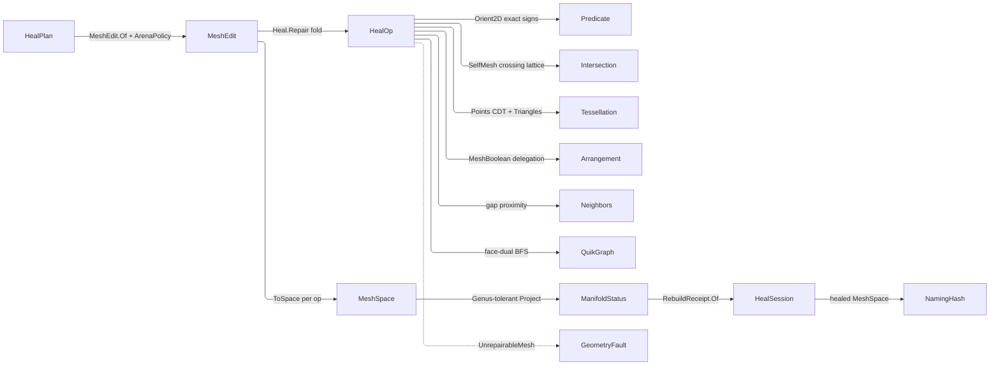

# [RASM_HEALING_REPAIR]

`Heal.Repair` folds the closed `HealOp` algebra over one `MeshEdit` arena and publishes a healed `MeshSpace` with its typed receipt chain. Repair stays total over its input class — a non-manifold, boundaried, or odd-Euler mesh heals rather than failing — and mints no content hash.

Rebuilds compose the un-gated Genus-tolerant `TopologyReceipt` projection as the before/after topology witness; every failure lowers onto the `GeometryFault` union, `UnrepairableMesh` carrying the residual defect count — the arena's surviving non-manifold edges, or the shell count a severed boolean returns to a session that admits one arena. Every band the kernels read is a `ToleranceLane` derived off the arena's own bound `Context` (`MeshEdit.Tolerance`), so no scalar tolerance rides `RepairPolicy` and no kernel takes a context parameter beside its arena.

## [01]-[INDEX]

- [02]-[HEALING]: `Heal.Repair` folds the `HealOp` algebra over one arena under `RepairPolicy` admission, threading each op's after-status forward as the next before and the mutation-free `Incidence` fold forward as arena-interior scratch.

## [02]-[HEALING]

- Owner: `HealOp` is the closed repair algebra `Heal.Repair` folds; `HealStage` mints the one heal-modality vocabulary and, through its `Receipt` column, the one typed receipt per stage; `Cut` is the per-face retile row whose two cases carry the two plane carriages a constrained retile admits; `RepairPolicy` carries lanes and one budget alone, `HealPlan` admitting its shape at `Of`.
- Entry: `Heal.Repair` is the one entrypoint over every modality, discriminating on `HealPlan`.
- Auto: every author-kernel is a pure-managed arena fold composing the `Predicate` exact-sign floor and the `Axis.DominantOf` plane admission, reading its bands off `edit.Tolerance` under the lanes the plan policy names.
- Law: `HealStage.Receipt` is the ONE stage-to-receipt table and each row stamps itself onto `RebuildReceipt.Stage`, so a mispaired stage is unrepresentable and the inverse table a reader used to check by eye is gone; the mint rides `Fin`, so the boolean arm's missing arrangement evidence and the split's missing incidence carry lower typed instead of fabricating an empty receipt or re-measuring the arena.
- Law: `HealStage.RebuildsTopology` and `HealStage.Collects` are two INDEPENDENT axes with no legal-corner law — the first selects the re-anchor contribution, the second the terminal debris sweep — so they stay a bool pair rather than one capability set, and every corner is admissible.
- Law: the retile's arena maps key on EXACT `Point3d` equality, never a rounded lattice: `Tessellation.Triangles` hands back coordinates that are bit-identical readbacks of the soup corners and of `Implicit.Round()`, so equality is the ordinal. Sub-ulp near-misses therefore mint a distinct vertex, which is the sliver the terminal weld/degenerate sweep collects — the quantum is zero and the debris is scheduled, never rounded away.
- Exemption: `Incidence`, the `Recut` patch table, and the retile's arena maps are mutable `Dictionary`/`HashSet` inside a single-writer span kernel and stay so — each is built, mutated, and dropped inside one fold with no reader past it.
- Receipt: `HealSession` carries one typed `RebuildReceipt` per applied op; `before[n] = after[n-1]` threads the status pair so N ops cost N+1 projections, and the affected-entity seed reads the arena dirty bitsets admission clears. `Incidence` rides forward as arena-interior scratch spared a recomputation inside a mutation-free run, and the split's carried fold IS the residual `ManifoldReceipt` records — one authority, so the gate and the receipt cannot report two numbers.
- Packages: `Rasm.Meshing`, `Rasm.Processing`, `Rasm.Numerics`, `Rasm.Spatial`, QuikGraph, Thinktecture.Runtime.Extensions, LanguageExt.Core.
- Growth: a new modality is one `HealStage` row, one `HealOp` case, and one typed `RebuildReceipt` case; a new band is one `ToleranceLane` column on `RepairPolicy` at `Of`; a new spatial or exact primitive routes its owning sibling as a consumer-contract row.
- Boundary: crossing, CDT, and boolean classification stay `Intersection`/`Tessellation`/`Arrangement` property, point proximity the `Spatial` neighbor lane. `RepairPolicy.Retile` names the constrained CDT stage, never remeshing; a composed sibling fault propagates unwrapped, and a collapse or re-mesh preserves every load-bearing feature.

```csharp
// --- [RUNTIME_PRELUDE] -----------------------------------------------------------------
using System;
using System.Collections.Generic;
using System.Linq;
using CommunityToolkit.HighPerformance.Buffers;
using LanguageExt;
using QuikGraph;
using QuikGraph.Algorithms;
using QuikGraph.Algorithms.Search;
using Rasm.Domain;
using Rasm.Meshing;
using Rasm.Numerics;
using Rasm.Spatial;
using Rhino.Geometry;
using Thinktecture;
using static LanguageExt.Prelude;
using FaceKeySet = System.Collections.Generic.HashSet<(int, int, int)>;
using IndexSet = System.Collections.Generic.HashSet<int>;
using Dimension = Rasm.Numerics.Dimension;

namespace Rasm.Processing;

// --- [TYPES] ---------------------------------------------------------------------------
[SmartEnum<string>]
[KeyMemberEqualityComparer<ComparerAccessors.StringOrdinal, string>]
[KeyMemberComparer<ComparerAccessors.StringOrdinal, string>]
public sealed partial class HealStage {
    public static readonly HealStage Weld = new("weld", rebuildsTopology: true, collects: true,
        mint: Some<Func<HealOp>>(static () => new HealOp.DuplicateWeld()),
        receipt: static seed => Fin.Succ<RebuildReceipt>(new RebuildReceipt.WeldReceipt(
            HealStage.Weld, seed.Context.For(seed.Policy.Arena.Weld), seed.Before, seed.After, seed.Vertices)));
    public static readonly HealStage Degenerate = new("degenerate", rebuildsTopology: true, collects: true,
        mint: Some<Func<HealOp>>(static () => new HealOp.DegenerateCollapse()),
        receipt: static seed => Fin.Succ<RebuildReceipt>(new RebuildReceipt.DegenerateReceipt(
            HealStage.Degenerate, seed.Context.For(seed.Policy.Sliver), seed.Before, seed.After, seed.Faces)));
    public static readonly HealStage Gap = new("gap", rebuildsTopology: true, collects: false,
        mint: Some<Func<HealOp>>(static () => new HealOp.GapClose()),
        receipt: static seed => Fin.Succ<RebuildReceipt>(new RebuildReceipt.GapReceipt(
            HealStage.Gap, seed.Context.For(seed.Policy.Gap), seed.Before, seed.After, seed.Faces, seed.Vertices)));
    public static readonly HealStage Manifold = new("manifold", rebuildsTopology: true, collects: false,
        mint: Some<Func<HealOp>>(static () => new HealOp.ManifoldRepair()),
        receipt: static seed => seed.Carry.ToFin(seed.Key.InvalidResult()).Map(settled =>
            (RebuildReceipt)new RebuildReceipt.ManifoldReceipt(
                HealStage.Manifold, seed.Policy.MaxManifoldPasses, settled.NonManifold().Count,
                seed.Before, seed.After, seed.Faces, seed.Vertices)));
    public static readonly HealStage Orient = new("orient", rebuildsTopology: false, collects: false,
        mint: Some<Func<HealOp>>(static () => new HealOp.OrientNormals()),
        receipt: static seed => Fin.Succ<RebuildReceipt>(new RebuildReceipt.OrientReceipt(
            HealStage.Orient, seed.Before, seed.After, seed.Faces)));
    public static readonly HealStage SelfIntersect = new("self-intersect", rebuildsTopology: true, collects: false,
        mint: Some<Func<HealOp>>(static () => new HealOp.SelfIntersectResolve()),
        receipt: static seed => Fin.Succ<RebuildReceipt>(new RebuildReceipt.SelfIntersectReceipt(
            HealStage.SelfIntersect, seed.Before, seed.After, seed.Faces, seed.Vertices)));
    public static readonly HealStage Boolean = new("boolean", rebuildsTopology: true, collects: false, mint: None,
        receipt: static seed => seed.Merge.ToFin(seed.Key.InvalidResult()).Map(merge =>
            (RebuildReceipt)new RebuildReceipt.MergeReceipt(
                HealStage.Boolean, merge.Op, merge.Receipt, seed.Before, seed.After,
                seed.ExtentFaces, seed.ExtentVertices)));

    public bool RebuildsTopology { get; }
    public bool Collects { get; }
    public Option<Func<HealOp>> Mint { get; }

    [UseDelegateFromConstructor]
    internal partial Fin<RebuildReceipt> Receipt(ReceiptSeed seed);
}

[Union(ConversionFromValue = ConversionOperatorsGeneration.None)]
public abstract partial record Cut {
    private Cut() { }

    public sealed record Pierced(int A, int B, int Face) : Cut;
    public sealed record Coplanar(int A, int B, int CarrierU, int CarrierV) : Cut;

    public (int A, int B) Pair =>
        Switch(pierced: static p => (p.A, p.B), coplanar: static c => (c.A, c.B));
}

// --- [CONSTANTS] -----------------------------------------------------------------------
public sealed record RepairPolicy(
    ToleranceLane Gap, ToleranceLane Sliver, Dimension MaxManifoldPasses,
    ArenaPolicy Arena, IntersectPolicy Intersect, TessellationPolicy Retile, ArrangementPolicy Arrangement) : IValidityEvidence {
    public static readonly RepairPolicy Canonical = new(
        Gap: ToleranceLane.Closure, Sliver: ToleranceLane.Area,
        MaxManifoldPasses: Dimension.Create(value: 8),
        Arena: ArenaPolicy.Canonical, Intersect: IntersectPolicy.Canonical,
        Retile: TessellationPolicy.Constrained, Arrangement: ArrangementPolicy.Canonical);

    public bool IsValid => ValidityClaim.All(Intersect.IsValid, Retile.IsValid, Arrangement.IsValid);

    [BoundaryAdapter]
    public static Fin<RepairPolicy> Of(
        int maxManifoldPasses,
        Option<ToleranceLane> gap = default, Option<ToleranceLane> sliver = default, Option<ArenaPolicy> arena = default,
        Option<IntersectPolicy> intersect = default, Option<TessellationPolicy> retile = default,
        Option<ArrangementPolicy> arrangement = default, Op? key = null) =>
        key.OrDefault().AcceptValidated<Dimension>(candidate: maxManifoldPasses)
            .Map(passes => new RepairPolicy(gap.IfNone(ToleranceLane.Closure), sliver.IfNone(ToleranceLane.Area), passes,
                arena.IfNone(ArenaPolicy.Canonical), intersect.IfNone(IntersectPolicy.Canonical),
                retile.IfNone(TessellationPolicy.Constrained), arrangement.IfNone(ArrangementPolicy.Canonical)));
}

// --- [MODELS] --------------------------------------------------------------------------
public sealed record HealPlan(MeshSpace Input, Seq<HealOp> Ops, RepairPolicy Policy) : IValidityEvidence {
    public bool IsValid => ValidityClaim.All(ValidityClaim.CountAtLeast(count: Ops.Count, floor: 1), Policy.IsValid);

    [BoundaryAdapter]
    public static Fin<HealPlan> Of(MeshSpace input, Option<Seq<HealOp>> ops = default, Option<RepairPolicy> policy = default, Op? key = null) {
        Op op = key.OrDefault();
        Seq<HealOp> sequence = ops.IfNone(() => Heal.Standard);
        return from space in op.AcceptInput(input)
               from _ in guard(!sequence.IsEmpty, op.InvalidInput()).ToFin()
               select new HealPlan(space, sequence, policy.IfNone(RepairPolicy.Canonical));
    }
}

internal readonly record struct HealStep(MeshEdit Edit, Option<(BooleanOp Op, BooleanReceipt Receipt)> Merge, Option<Incidence> Carry) {
    public static HealStep Same(MeshEdit edit) => new(edit, None, None);

    public static HealStep Carrying(MeshEdit edit, Incidence current) => new(edit, None, Some(current));
}

// --- [OPERATIONS] ----------------------------------------------------------------------
[Union(ConversionFromValue = ConversionOperatorsGeneration.None)]
public abstract partial record HealOp {
    private HealOp() { }

    public sealed record DuplicateWeld : HealOp;
    public sealed record DegenerateCollapse : HealOp;
    public sealed record GapClose : HealOp;
    public sealed record ManifoldRepair : HealOp;
    public sealed record OrientNormals : HealOp;
    public sealed record SelfIntersectResolve : HealOp;
    public sealed record Boolean(BooleanOp Op, MeshSpace Tool) : HealOp;

    public HealStage Stage =>
        Switch(
            duplicateWeld:        static _ => HealStage.Weld,
            degenerateCollapse:   static _ => HealStage.Degenerate,
            gapClose:             static _ => HealStage.Gap,
            manifoldRepair:       static _ => HealStage.Manifold,
            orientNormals:        static _ => HealStage.Orient,
            selfIntersectResolve: static _ => HealStage.SelfIntersect,
            boolean:              static _ => HealStage.Boolean);

    internal Fin<HealStep> Apply(MeshEdit edit, MeshSpace current, RepairPolicy policy, Op key, Option<Incidence> carry) =>
        Switch(
            state: (Edit: edit, Current: current, Policy: policy, Key: key, Carry: carry),
            duplicateWeld:        static (s, _) => Fin.Succ(HealStep.Same(Kernels.WeldDuplicates(s.Edit))),
            degenerateCollapse:   static (s, _) => Heal.Collapse(s.Edit, s.Policy),
            gapClose:             static (s, _) => Heal.Close(s.Edit, s.Policy, s.Key, s.Carry),
            manifoldRepair:       static (s, _) => Heal.Split(s.Edit, s.Policy, s.Carry),
            orientNormals:        static (s, _) => Heal.Orient(s.Edit, s.Carry),
            selfIntersectResolve: static (s, _) => Heal.Resolve(s.Edit, s.Current, s.Policy, s.Key),
            boolean:              static (s, b) => Heal.Merge(b, s.Current, s.Policy, s.Key));
}

internal readonly struct Incidence {
    internal readonly Dictionary<(int U, int V), List<int>> Edges;
    Incidence(Dictionary<(int U, int V), List<int>> edges) => Edges = edges;

    internal static Incidence Of(MeshEdit edit) {
        Dictionary<(int U, int V), List<int>> edges = new(3 * edit.FaceCount);
        for (int f = 0; f < edit.FaceCount; f++) {
            if (!edit.Alive(f)) continue;
            (int a, int b, int c) = edit.Face(f);
            Note(edges, a, b, f); Note(edges, b, c, f); Note(edges, c, a, f);
        }
        return new Incidence(edges);

        static void Note(Dictionary<(int U, int V), List<int>> edges, int u, int v, int f) =>
            (edges.TryGetValue(Key(u, v), out List<int>? faces) ? faces : edges[Key(u, v)] = []).Add(f);
    }

    internal static (int U, int V) Key(int u, int v) => u < v ? (u, v) : (v, u);

    internal Arr<(int Tail, int Head, int Face)> Boundary(MeshEdit edit) =>
        toArr(Edges.Where(static row => row.Value.Count == 1).Select(row => {
            (int a, int b, int c) = edit.Face(row.Value[0]);
            (int u, int v) = row.Key;
            (int tail, int head) = (a == u && b == v) || (b == u && c == v) || (c == u && a == v) ? (u, v) : (v, u);
            return (tail, head, row.Value[0]);
        }));

    internal Arr<((int U, int V) Edge, List<int> Fans)> NonManifold() =>
        toArr(Edges.Where(static row => row.Value.Count > 2).Select(static row => (row.Key, row.Value)));

    internal AdjacencyGraph<int, TaggedEdge<int, (int U, int V)>> Dual(MeshEdit edit) {
        AdjacencyGraph<int, TaggedEdge<int, (int U, int V)>> dual = new(allowParallelEdges: true);
        dual.AddVertexRange(Enumerable.Range(0, edit.FaceCount).Where(edit.Alive));
        foreach (((int U, int V) edge, List<int> faces) in Edges.Where(static row => row.Value.Count == 2)) {
            dual.AddEdge(new TaggedEdge<int, (int U, int V)>(faces[0], faces[1], edge));
            dual.AddEdge(new TaggedEdge<int, (int U, int V)>(faces[1], faces[0], edge));
        }
        return dual;
    }
}

public static class Heal {
    public static readonly Seq<HealOp> Standard = Minted(static _ => true) + Minted(static stage => stage.Collects);

    static Seq<HealOp> Minted(Func<HealStage, bool> admits) =>
        toSeq(HealStage.Items).Filter(admits).Bind(static stage => stage.Mint.ToSeq()).Map(static mint => mint());

    [BoundaryAdapter]
    public static Fin<HealSession> Repair(HealPlan plan, Op? key = null) {
        Op op = key.OrDefault();
        Context context = plan.Input.Tolerance;
        MeshEdit live = MeshEdit.Of(plan.Input, plan.Policy.Arena);
        try {
            return Status(plan.Input, context, op).Bind(first =>
                plan.Ops.Fold(
                    Fin.Succ((Space: plan.Input, Status: first, Receipts: Seq<RebuildReceipt>(), Carry: Option<Incidence>.None)),
                    (acc, heal) => acc.Bind(state =>
                        from step in heal.Apply(live, state.Space, plan.Policy, op, state.Carry)
                        from space in Publish(step)
                        from after in Status(space, context, op)
                        from receipt in heal.Stage.Receipt(ReceiptSeed.Of(plan.Policy, state.Status, after, live, step, op))
                        select (Space: space, Status: after, Receipts: state.Receipts.Add(receipt), step.Carry)))
                .Map(state => new HealSession(Input: plan.Input, Healed: state.Space, Receipts: state.Receipts)));
        }
        finally { live.Dispose(); }

        Fin<MeshSpace> Publish(HealStep step) {
            if (!ReferenceEquals(step.Edit, live)) { live.Dispose(); live = step.Edit; }
            return live.ToSpace(op);
        }
    }

    internal static Fin<ManifoldStatus> Status(MeshSpace space, Context context, Op key) =>
        VectorIntent.Topology(space, key)
            .Bind(intent => intent.Project<(int Euler, int BoundaryComponents, bool IsManifold, bool IsOriented, int NonManifoldEdges, Option<int> Genus)>(context: context, key: key))
            .Map(ManifoldStatus.Of);

    // --- [DEGENERATE_COLLAPSE]
    internal static Fin<HealStep> Collapse(MeshEdit edit, RepairPolicy policy) {
        double areaFloor = edit.Tolerance.For(policy.Sliver).Value;
        FaceKeySet seen = new();
        for (int f = 0; f < edit.FaceCount; f++) {
            if (!edit.Alive(f)) continue;
            (int a, int b, int c) = edit.Face(f);
            if (a == b || b == c || c == a || !seen.Add(Sorted(a, b, c))) { edit.KillFace(f); continue; }
            (Point3d pa, Point3d pb, Point3d pc) = (edit.Position(a), edit.Position(b), edit.Position(c));
            if (Axis.DominantOf(pa, pb, pc).Case is not Axis axis) { edit.KillFace(f); continue; }
            if (Predicate.Orient2D(pa, pb, pc, axis) == Sign.Zero
                || 0.5 * Vector3d.CrossProduct(pb - pa, pc - pa).Length < areaFloor) { edit.KillFace(f); }
        }
        return Fin.Succ(HealStep.Same(edit));

        static (int, int, int) Sorted(int a, int b, int c) {
            (int lo, int hi) = (int.Min(a, int.Min(b, c)), int.Max(a, int.Max(b, c)));
            return (lo, a + b + c - lo - hi, hi);
        }
    }

    // --- [GAP_CLOSE]
    internal static Fin<HealStep> Close(MeshEdit edit, RepairPolicy policy, Op key, Option<Incidence> carry) {
        Incidence incidence = carry.IfNone(() => Incidence.Of(edit));
        Arr<(int Tail, int Head, int Face)> rim = incidence.Boundary(edit);
        if (rim.Count < 2) return Fin.Succ(HealStep.Carrying(edit, incidence));
        double span = edit.Tolerance.For(policy.Gap).Value;
        Point3d[] heads = [.. rim.Map(h => edit.Position(h.Head))];
        return NeighborIndex.Of(new NeighborSource.StaticCase(toSeq(rim.Map(h => edit.Position(h.Tail)))), key)
            .Bind(index => NeighborKernel.GraphOf(index: index, needles: heads, count: Option<int>.None, radius: Some(span), key: key))
            .Map(graph => Bridge(edit, rim, graph.Ids, span, incidence));
    }

    static HealStep Bridge(MeshEdit edit, Arr<(int Tail, int Head, int Face)> rim, int[][] candidates, double span, Incidence incidence) {
        List<(int I, int J, double Gap)> pairs = new();
        for (int i = 0; i < rim.Count; i++) {
            foreach (int j in candidates[i]) {
                if (j == i) continue;
                double forward = edit.Position(rim[i].Head).DistanceTo(edit.Position(rim[j].Tail));
                double backward = edit.Position(rim[j].Head).DistanceTo(edit.Position(rim[i].Tail));
                if (backward <= span) pairs.Add((i, j, double.Max(forward, backward)));
            }
        }
        pairs.Sort(static (l, r) => l.Gap.CompareTo(r.Gap) is int rank and not 0 ? rank : (l.I, l.J).CompareTo((r.I, r.J)));
        IndexSet used = new();
        foreach ((int i, int j, _) in pairs) {
            if (used.Contains(i) || used.Contains(j)) continue;
            ((int a, int b), (int c, int d)) = ((rim[i].Tail, rim[i].Head), (rim[j].Tail, rim[j].Head));
            if (a != d) edit.AddFace(b, a, d);
            if (b != c) edit.AddFace(b, d, c);
            used.Add(i); used.Add(j);
        }
        return used.Count == 0 ? HealStep.Carrying(edit, incidence) : HealStep.Same(edit);
    }

    // --- [MANIFOLD_REPAIR]
    internal static Fin<HealStep> Split(MeshEdit edit, RepairPolicy policy, Option<Incidence> carry) {
        Dimension passes = policy.MaxManifoldPasses;
        Atom<(Option<int> Found, Incidence Last)> cell = Atom(value: (Found: Option<int>.None, Last: carry.IfNone(() => Incidence.Of(edit))));
        Transition<(Option<int> Found, Incidence Last)> driven = Cell.Converge(
            cell: cell,
            step: state => Some(state.Found == Some(0)
                ? state
                : SplitPass(edit, state.Found.IsNone ? state.Last : Incidence.Of(edit))),
            settled: static state => state.Found == Some(0),
            budget: passes,
            declined: new GeometryFault.UnrepairableMesh(HealStage.Manifold, Some(passes), cell.Value.Last.NonManifold().Count));
        (Option<int> found, Incidence last) = driven.Current;
        if (found == Some(0)) return Fin.Succ(HealStep.Carrying(edit, last));
        Incidence settled = Incidence.Of(edit);
        int remaining = settled.NonManifold().Count;
        return remaining == 0
            ? Fin.Succ(HealStep.Carrying(edit, settled))
            : Fin.Fail<HealStep>(new GeometryFault.UnrepairableMesh(HealStage.Manifold, Some(passes), remaining));

        static (Option<int> Found, Incidence Last) SplitPass(MeshEdit edit, Incidence incidence) {
            Arr<((int U, int V) Edge, List<int> Fans)> rows = incidence.NonManifold();
            foreach (((int u, int v), List<int> fans) in rows) {
                foreach (int extra in fans.Skip(2)) {
                    int du = edit.AddVertex(edit.Position(u));
                    int dv = edit.AddVertex(edit.Position(v));
                    (int a, int b, int c) = edit.Face(extra);
                    edit.SetFace(extra, Re(a, u, du, v, dv), Re(b, u, du, v, dv), Re(c, u, du, v, dv));
                }
            }
            return (Some(rows.Count), incidence);

            static int Re(int corner, int u, int du, int v, int dv) => corner == u ? du : corner == v ? dv : corner;
        }
    }

    // --- [ORIENT_NORMALS]
    internal static Fin<HealStep> Orient(MeshEdit edit, Option<Incidence> carry) {
        Incidence incidence = carry.IfNone(() => Incidence.Of(edit));
        AdjacencyGraph<int, TaggedEdge<int, (int U, int V)>> dual = incidence.Dual(edit);
        Dictionary<int, int> shell = new(edit.FaceCount);
        dual.WeaklyConnectedComponents(shell);
        Dictionary<int, int> seeds = new();
        for (int f = 0; f < edit.FaceCount; f++) {
            if (edit.Alive(f) && shell.TryGetValue(f, out int component)) seeds.TryAdd(component, f);
        }
        foreach (int seed in seeds.Values) {
            BreadthFirstSearchAlgorithm<int, TaggedEdge<int, (int U, int V)>> walk = new(dual);
            walk.TreeEdge += arc => {
                if (SameTraversal(edit.Face(arc.Source), edit.Face(arc.Target), arc.Tag)) {
                    (int a, int b, int c) = edit.Face(arc.Target);
                    edit.SetFace(arc.Target, a, c, b);
                }
            };
            walk.Compute(seed);
        }
        return Fin.Succ(HealStep.Carrying(edit, incidence));

        static bool SameTraversal((int A, int B, int C) f, (int A, int B, int C) g, (int U, int V) edge) =>
            Directed(f, edge) == Directed(g, edge);

        static bool Directed((int A, int B, int C) t, (int U, int V) e) =>
            (t.A == e.U && t.B == e.V) || (t.B == e.U && t.C == e.V) || (t.C == e.U && t.A == e.V);
    }

    // --- [SELF_INTERSECT_RESOLVE]
    internal static Fin<HealStep> Resolve(MeshEdit edit, MeshSpace current, RepairPolicy policy, Op key) =>
        Intersection.Apply(new IntersectOp.SelfMesh(current, policy.Intersect), key)
            .Bind(result => result is IntersectResult.Chains hit
                ? Fin.Succ(hit.Lattice)
                : Fin.Fail<CrossLattice>(key.InvalidResult()))
            .Bind(lattice => lattice.Segments.Length == 0 && lattice.Coplanar.Length == 0
                ? Fin.Succ(HealStep.Same(edit))
                : Recut(edit, current, lattice, policy, key));

    static Fin<HealStep> Recut(MeshEdit edit, MeshSpace current, CrossLattice lattice, RepairPolicy policy, Op key) {
        using MeshEdit soup = MeshEdit.Of(current, policy.Arena);
        using MemoryOwner<int> arenaFace = MemoryOwner<int>.Allocate(soup.FaceCount, AllocationMode.Clear);
        for (int f = 0, live = 0; f < edit.FaceCount; f++) {
            if (edit.Alive(f)) { arenaFace.Span[live++] = f; }
        }
        Dictionary<int, List<Cut>> patches = new();
        foreach ((int a, int b, int fa, int fb) in lattice.Segments) {
            if (a == b) continue;
            Note(patches, fa, new Cut.Pierced(a, b, fb)); Note(patches, fb, new Cut.Pierced(a, b, fa));
        }
        foreach ((int a, int b, int fa, int fb, int cu, int cv, _) in lattice.Coplanar) {
            if (a == b) continue;
            Note(patches, fa, new Cut.Coplanar(a, b, cu, cv)); Note(patches, fb, new Cut.Coplanar(a, b, cu, cv));
        }
        if (patches.Count == 0) return Fin.Succ(HealStep.Same(edit));
        Dictionary<Point3d, int> minted = new();
        return toSeq(patches.OrderBy(static patch => patch.Key)).Strict()
            .TraverseM(patch => Subdivide(edit, soup, lattice, arenaFace.Memory.Span[patch.Key], patch.Key, patch.Value, minted, policy, key))
            .As()
            .Map(_ => HealStep.Same(edit));

        static void Note(Dictionary<int, List<Cut>> patches, int face, Cut row) =>
            (patches.TryGetValue(face, out List<Cut>? rows) ? rows : patches[face] = []).Add(row);
    }

    static Fin<Unit> Subdivide(MeshEdit edit, MeshEdit soup, CrossLattice lattice, int face, int latticeFace, List<Cut> cuts, Dictionary<Point3d, int> minted, RepairPolicy policy, Op key) {
        (int s0, int s1, int s2) = soup.Face(latticeFace);
        (Point3d pa, Point3d pb, Point3d pc) = (soup.Position(s0), soup.Position(s1), soup.Position(s2));
        List<Implicit> rows = new(3 + cuts.Count) { new(pa), new(pb), new(pc) };
        Dictionary<CrossKey, int> slotOf = new();
        return Axis.DominantOf(pa, pb, pc, key).Bind(plane => {
            Vector3d normal = Vector3d.CrossProduct(pb - pa, pc - pa);
            Vector3d lift = new(plane.Key == 0 ? 1.0 : 0.0, plane.Key == 1 ? 1.0 : 0.0, plane.Key == 2 ? 1.0 : 0.0);
            bool mirrored = (plane.Key == 0 ? normal.X : plane.Key == 1 ? normal.Y : normal.Z) < 0.0;
            List<Conform> conforms = new(cuts.Count);
            foreach (Cut cut in cuts) {
                (Point3d p, Point3d q, Point3d r) = cut.Switch(
                    state: (Soup: soup, Lift: lift),
                    pierced:  static (s, c) => Corners(s.Soup, c.Face),
                    coplanar: static (s, c) => (s.Soup.Position(c.CarrierU), s.Soup.Position(c.CarrierV), s.Soup.Position(c.CarrierU) + s.Lift));
                (int a, int b) = cut.Pair;
                conforms.Add(new Conform.Crossing(Intern(a), Intern(b), p, q, r));
            }
            (int u, int v, int w) = edit.Face(face);
            Dictionary<Point3d, int> corner = new() { [pa] = u, [pb] = v, [pc] = w };
            return Tessellation.Build(new TessellationOp.Points(
                    TessellationKind.Triangulation, [.. rows], toSeq(conforms), policy.Retile, plane, Some((pa, pb, pc))), key)
                .Bind(tess => tess.Triangles(key))
                .Map(tris => Splice(edit, face,
                    toArr(tris.Faces.AsIterable().Map(f => (tris.Corners[f.A], tris.Corners[f.B], tris.Corners[f.C]))),
                    corner, minted, mirrored));
        });

        int Intern(int row) {
            Crossing crossing = lattice.Rows[row];
            if (slotOf.TryGetValue(crossing.Key, out int at)) return at;
            rows.Add(crossing.Point);
            return slotOf[crossing.Key] = rows.Count - 1;
        }

        static (Point3d P, Point3d Q, Point3d R) Corners(MeshEdit soup, int at) {
            (int a, int b, int c) = soup.Face(at);
            return (soup.Position(a), soup.Position(b), soup.Position(c));
        }
    }

    static Unit Splice(MeshEdit edit, int face, Arr<(Point3d A, Point3d B, Point3d C)> triangles, Dictionary<Point3d, int> corner, Dictionary<Point3d, int> minted, bool mirrored) {
        edit.KillFace(face);
        foreach ((Point3d ta, Point3d tb, Point3d tc) in triangles) {
            (int u, int v, int w) = (Arena(ta), Arena(tb), Arena(tc));
            if (mirrored) edit.AddFace(u, w, v); else edit.AddFace(u, v, w);
        }
        return unit;

        int Arena(Point3d p) =>
            corner.TryGetValue(p, out int at) ? at
            : minted.TryGetValue(p, out int seam) ? seam
            : minted[p] = edit.AddVertex(p);
    }

    // --- [BOOLEAN]
    internal static Fin<HealStep> Merge(HealOp.Boolean op, MeshSpace current, RepairPolicy policy, Op key) =>
        Arrangement.Apply(new ArrangementOp.MeshBoolean(Seq(current, op.Tool), op.Op, policy.Arrangement), key)
            .Bind(result => result switch {
                ArrangementResult.Boolean { Shells: [MeshSpace solid] } merged =>
                    Fin.Succ(new HealStep(MeshEdit.Of(solid, policy.Arena), Some((op.Op, merged.Receipt)), None)),
                ArrangementResult.Boolean severed =>
                    Fin.Fail<HealStep>(new GeometryFault.UnrepairableMesh(HealStage.Boolean, Option<Dimension>.None, severed.Shells.Count)),
                _ => Fin.Fail<HealStep>(key.InvalidResult()),
            });
}
```



## [03]-[DENSITY_BAR]

One owner per axis; capability is a case, row, or column.

| [INDEX] | [AXIS_CONCERN]   | [OWNER]         | [RAIL]                                             | [CASES] |
| :-----: | :--------------- | :-------------- | :------------------------------------------------- | :-----: |
|  [01]   | Healing rail     | `Heal`/`HealOp` | `Heal.Repair(HealPlan, Op?) → Fin<HealSession>`    |    7    |
|  [02]   | Heal modality    | `HealStage`     | `stage.Receipt(ReceiptSeed) → Fin<RebuildReceipt>` |    7    |
|  [03]   | Retile row       | `Cut`           | interior (plane carriage)                          |    2    |
|  [04]   | Policy row       | `RepairPolicy`  | `RepairPolicy.Of → Fin<RepairPolicy>`              |    —    |
|  [05]   | Request carrier  | `HealPlan`      | `HealPlan.Of → Fin<HealPlan>`                      |    —    |
|  [06]   | Shared incidence | `Incidence`     | interior (arena-tier scratch)                      |    3    |

## [04]-[RESEARCH]

<!-- source-only: research row template:
[TOKEN]-[OPEN|BLOCKED]: <exact question>; <verification route>.
[SPLIT_MEMBER]-[OPEN]: does `shape-core` expose `split_all`; verify against the member rail.
-->

(none)
