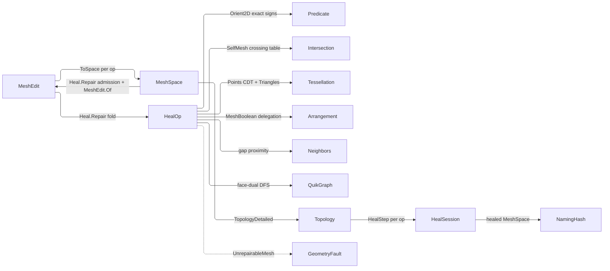

# [RASM_HEALING_REPAIR]

`Heal.Repair` folds the closed `HealOp` algebra over one `MeshEdit` arena and publishes a healed `MeshSpace` with its typed step chain. Repair stays total over its input class — a non-manifold, boundaried, or odd-Euler mesh heals rather than failing — and mints no content hash.

Rebuilds read the un-gated `Rasm.Meshing` `Topology` witness whole as the before/after topology pair; every failure lowers onto the `GeometryFault` union, `UnrepairableMesh` carrying the residual defect count — the arena's surviving non-manifold edges, or the shell count a severed boolean returns to a session that admits one arena. Every band the kernels read is a `ToleranceLane` derived off the arena's own bound `Context` (`MeshEdit.Tolerance`), so no scalar tolerance rides `RepairPolicy` and no kernel takes a context parameter beside its arena.

## [01]-[INDEX]

- [02]-[HEALING]: `Heal.Repair` folds the `HealOp` algebra over one arena under `RepairPolicy` admission, threading each op's after-status forward as the next before and the mutation-free `Incidence` fold forward as arena-interior scratch.

## [02]-[HEALING]

- Owner: `HealOp` is the closed repair algebra `Heal.Repair` folds; `HealStage` is the keyless heal-modality vocabulary every `HealOp` case selects at construction and each `HealStep` carries; `RepairPolicy` carries lanes and one budget alone.
- Entry: `Heal.Repair(MeshSpace, Option<Seq<HealOp>>, Option<RepairPolicy>)` is the one entrypoint over every modality — it admits the input, defaults the sequence to `Heal.Standard` and the policy to `RepairPolicy.Canonical`, refuses an empty sequence typed, and allocates the arena only past admission.
- Auto: every author-kernel is a pure-managed arena fold composing the `Predicate` exact-sign floor and the `Axis.DominantOf` plane admission, reading its bands off `edit.Tolerance` under the lanes the policy names.
- Law: `HealOp.Stage` is a root column each case selects at construction through the one private base constructor, so a mispaired stage is unrepresentable and no table re-answers it; `Heal.Repair` reads the changed sets, residual, and boolean evidence through ONE generated `HealOp.Switch` over the op it already selected, and a missing split carry or boolean census leaves its axis `None` for the step's own witness to refuse, never a fabricated empty step or a re-measured arena.
- Law: the retile's arena maps key on EXACT `Point3d` equality, never a rounded grid: `Tessellation.Triangles` hands back coordinates that are bit-identical readbacks of the soup corners and of `ImplicitPoint.Round()`, so equality is the ordinal. Sub-ulp near-misses therefore mint a distinct vertex, which is the sliver the terminal weld/degenerate sweep collects — the quantum is zero and the debris is scheduled, never rounded away.
- Exemption: `Incidence`, the `Recut` patch table, and the retile's arena maps are mutable `Dictionary`/`HashSet` inside a single-writer span kernel and stay so — each is built, mutated, and dropped inside one fold with no reader past it. The manifold split's pass loop is the same single-writer kernel — the arena owns the state and the admitted `ManifoldPasses` budget owns the bound, so no cell, transition, or schedule stands between them.
- Law: `HealSession` carries one typed `HealStep` per applied op; `before[n] = after[n-1]` threads the status pair so N ops cost N+1 projections, and the affected-entity seed reads the arena dirty bitsets admission clears. `Incidence` rides forward as arena-interior scratch spared a recomputation inside a mutation-free run, and the split's carried fold IS the residual `HealStep.Residual` records — one authority, so the gate and the step cannot report two numbers.
- Packages: `Rasm.Meshing`, `Rasm.Processing`, `Rasm.Numerics`, `Rasm.Spatial`, QuikGraph, Thinktecture.Runtime.Extensions, LanguageExt.Core.
- Growth: a new modality is one keyless `HealStage` row, one `HealOp` case selecting it, and its arm in the `Heal.Repair` step fold and `HealStep.IsValid`, with `Heal.Standard` spelling its own order; a new band is one `ToleranceLane` column on `RepairPolicy`; a new spatial or exact primitive routes its owning sibling as a consumer-contract row.
- Boundary: crossing, CDT, and boolean classification stay `Intersection`/`Tessellation`/`Arrangement` property, point proximity the `Spatial` neighbor lane. `RepairPolicy.Tessellation` names the constrained CDT stage, never remeshing; a composed sibling fault propagates unwrapped, and a collapse or re-mesh preserves every load-bearing feature.

```csharp
// --- [IMPORTS] -------------------------------------------------------------------------
using System;
using System.Collections.Generic;
using System.Linq;
using CommunityToolkit.HighPerformance.Buffers;
using LanguageExt;
using QuikGraph;
using QuikGraph.Algorithms.Search;
using Rasm.Domain;
using Rasm.Meshing;
using Rasm.Numerics;
using Rasm.Spatial;
using Rhino.Geometry;
using Thinktecture;
using static LanguageExt.Prelude;
using Cut = LanguageExt.Either<
    (int A, int B, int Face),
    (int A, int B, int CarrierU, int CarrierV)>;
using Dimension = Rasm.Numerics.Dimension;
using RepairEdit = (
    Rasm.Meshing.MeshEdit Edit,
    LanguageExt.Option<(Rasm.Meshing.BooleanOp Op, Rasm.Meshing.BooleanCensus Census)> Boolean,
    LanguageExt.Option<Rasm.Processing.Incidence> Incidence);

namespace Rasm.Processing;

// --- [TYPES] ---------------------------------------------------------------------------
[SmartEnum]
public sealed partial class HealStage {
    public static readonly HealStage Weld = new();
    public static readonly HealStage Degenerate = new();
    public static readonly HealStage Gap = new();
    public static readonly HealStage Manifold = new();
    public static readonly HealStage Orient = new();
    public static readonly HealStage SelfIntersect = new();
    public static readonly HealStage Boolean = new();
}

// --- [CONSTANTS] -----------------------------------------------------------------------
public sealed record RepairPolicy(
    ToleranceLane Gap, ToleranceLane Sliver, Dimension ManifoldPasses,
    ArenaPolicy Arena, IntersectPolicy Intersection, TessellationPolicy Tessellation, ArrangementPolicy Arrangement) {
    public static readonly RepairPolicy Canonical = new(
        Gap: ToleranceLane.Closure, Sliver: ToleranceLane.Area,
        ManifoldPasses: Dimension.Create(value: 8),
        Arena: ArenaPolicy.Canonical, Intersection: IntersectPolicy.Canonical,
        Tessellation: TessellationPolicy.Constrained, Arrangement: ArrangementPolicy.Canonical);
}

// --- [OPERATIONS] ----------------------------------------------------------------------
[Union(ConversionFromValue = ConversionOperatorsGeneration.None)]
public abstract partial record HealOp {
    private HealOp(HealStage stage) => Stage = stage;

    public sealed record Weld() : HealOp(HealStage.Weld);
    public sealed record Degenerate() : HealOp(HealStage.Degenerate);
    public sealed record Gap() : HealOp(HealStage.Gap);
    public sealed record Manifold() : HealOp(HealStage.Manifold);
    public sealed record Orient() : HealOp(HealStage.Orient);
    public sealed record SelfIntersect() : HealOp(HealStage.SelfIntersect);
    public sealed record Boolean(BooleanOp Op, MeshSpace Tool) : HealOp(HealStage.Boolean);

    public HealStage Stage { get; }

    internal Fin<RepairEdit> Apply(MeshEdit edit, MeshSpace current, RepairPolicy policy, Option<Incidence> incidence) =>
        Switch(
            state: (Edit: edit, Current: current, Policy: policy, Incidence: incidence),
            weld:          static (s, _) => Fin.Succ<RepairEdit>((s.Edit.Weld(), None, None)),
            degenerate:    static (s, _) => Heal.Collapse(s.Edit, s.Policy),
            gap:           static (s, _) => Heal.Close(s.Edit, s.Policy, s.Key, s.Incidence),
            manifold:      static (s, _) => Heal.Split(s.Edit, s.Policy, s.Incidence),
            orient:        static (s, _) => Heal.Orient(s.Edit, s.Incidence),
            selfIntersect: static (s, _) => Heal.Resolve(s.Edit, s.Current, s.Policy, s.Key),
            boolean:       static (s, b) => Heal.Boolean(b, s.Current, s.Policy, s.Key));
}

internal readonly struct Incidence {
    internal readonly Dictionary<(int U, int V), List<int>> Edges;
    Incidence(Dictionary<(int U, int V), List<int>> edges) => Edges = edges;

    internal static Incidence Of(MeshEdit edit) {
        Dictionary<(int U, int V), List<int>> edges = new(3 * edit.FaceCount);
        for (int f = 0; f < edit.FaceCount; f++) {
            if (!edit.Alive(f)) continue;
            (int a, int b, int c) = edit.Face(f);
            Note(edges, a, b, f); Note(edges, b, c, f); Note(edges, c, a, f);
        }
        return new Incidence(edges);

        static void Note(Dictionary<(int U, int V), List<int>> edges, int u, int v, int f) {
            (int U, int V) edge = u < v ? (u, v) : (v, u);
            (edges.TryGetValue(edge, out List<int>? faces) ? faces : edges[edge] = []).Add(f);
        }
    }

    internal Arr<(int Tail, int Head)> Boundary(MeshEdit edit) =>
        toArray(Edges.Where(static row => row.Value.Count == 1).Select(row => {
            (int a, int b, int c) = edit.Face(row.Value[0]);
            (int u, int v) = row.Key;
            (int tail, int head) = (a == u && b == v) || (b == u && c == v) || (c == u && a == v) ? (u, v) : (v, u);
            return (tail, head);
        }));

    internal Arr<((int U, int V) Edge, List<int> Fans)> NonManifold() =>
        toArray(Edges.Where(static row => row.Value.Count > 2).Select(static row => (row.Key, row.Value)));
}

public static class Heal {
    public static readonly Seq<HealOp> Standard = toSeq<HealOp>([
        new HealOp.Weld(), new HealOp.Degenerate(), new HealOp.Gap(), new HealOp.Manifold(),
        new HealOp.Orient(), new HealOp.SelfIntersect(), new HealOp.Weld(), new HealOp.Degenerate()]);

    public static Fin<HealSession> Repair(
        MeshSpace input, Option<Seq<HealOp>> ops = default,
        Option<RepairPolicy> policy = default) {
        Seq<HealOp> sequence = ops.IfNone(() => Standard);
        RepairPolicy repair = policy.IfNone(RepairPolicy.Canonical);
        return from space in Admit.Value(input)
               from _ in guard(!sequence.IsEmpty, new KernelFault.InvalidInput())
               from session in Run(space)
               select session;

        Fin<HealSession> Run(MeshSpace admitted) {
            MeshEdit live = MeshEdit.Of(admitted, repair.Arena);
            try {
                return MeshKernel.TopologyDetailed(admitted).Bind(first =>
                    sequence.Fold(
                        Fin.Succ((Space: admitted, Status: first, Steps: Seq<HealStep>(), Incidence: Option<Incidence>.None)),
                        (acc, heal) => acc.Bind(state =>
                            from edit in heal.Apply(live, state.Space, repair, state.Incidence)
                            from space in Publish(edit)
                            from after in MeshKernel.TopologyDetailed(space)
                            select (Space: space, Status: after, Steps: state.Steps.Add(Step(heal, edit, state.Status, after)), edit.Incidence)))
                    .Map(state => new HealSession(admitted, state.Space, repair, state.Steps)));
            }
            finally { live.Dispose(); }

            Fin<MeshSpace> Publish(RepairEdit edit) {
                if (!ReferenceEquals(edit.Edit, live)) { live.Dispose(); live = edit.Edit; }
                return live.ToSpace();
            }

            HealStep Step(HealOp heal, RepairEdit edit, Topology before, Topology after) {
                (Set<int> Vertices, Set<int> Faces, Option<int> Residual, Option<(BooleanOp Op, BooleanCensus Census)> Boolean) shape =
                    heal.Switch<(MeshEdit Arena, RepairEdit Edit), (Set<int>, Set<int>, Option<int>, Option<(BooleanOp Op, BooleanCensus Census)>)>(
                        state: (Arena: live, Edit: edit),
                        weld:          static (s, _) => (toSet(s.Arena.DirtyVertices()), Set<int>(), None, None),
                        degenerate:    static (s, _) => (Set<int>(), toSet(s.Arena.DirtyFaces()), None, None),
                        gap:           static (s, _) => (toSet(s.Arena.DirtyVertices()), toSet(s.Arena.DirtyFaces()), None, None),
                        manifold:      static (s, _) => (toSet(s.Arena.DirtyVertices()), toSet(s.Arena.DirtyFaces()),
                            s.Edit.Incidence.Map(static carried => carried.NonManifold().Count), None),
                        orient:        static (s, _) => (Set<int>(), toSet(s.Arena.DirtyFaces()), None, None),
                        selfIntersect: static (s, _) => (toSet(s.Arena.DirtyVertices()), toSet(s.Arena.DirtyFaces()), None, None),
                        boolean:       static (s, _) => (toSet(Range(0, s.Arena.VertexCount)), toSet(Range(0, s.Arena.FaceCount)), None, s.Edit.Boolean));
                return new HealStep(heal.Stage, before, after, shape.Vertices, shape.Faces, shape.Residual, shape.Boolean);
            }
        }
    }

    // --- [DEGENERATE_COLLAPSE]
    internal static Fin<RepairEdit> Collapse(MeshEdit edit, RepairPolicy policy) {
        double areaFloor = edit.Tolerance.For(policy.Sliver).Value;
        System.Collections.Generic.HashSet<(int, int, int)> seen = new();
        for (int f = 0; f < edit.FaceCount; f++) {
            if (!edit.Alive(f)) continue;
            (int a, int b, int c) = edit.Face(f);
            if (a == b || b == c || c == a || !seen.Add(Sorted(a, b, c))) { edit.KillFace(f); continue; }
            (Point3d pa, Point3d pb, Point3d pc) = (edit.Position(a), edit.Position(b), edit.Position(c));
            if (Axis.DominantOf(Vector3d.CrossProduct(pb - pa, pc - pa)).Case is not Axis axis) { edit.KillFace(f); continue; }
            if (Predicate.Orient2D(pa, pb, pc, axis) == Sign.Zero
                || 0.5 * Vector3d.CrossProduct(pb - pa, pc - pa).Length < areaFloor) { edit.KillFace(f); }
        }
        return Fin.Succ<RepairEdit>((edit, None, None));

        static (int, int, int) Sorted(int a, int b, int c) {
            (int lo, int hi) = (int.Min(a, int.Min(b, c)), int.Max(a, int.Max(b, c)));
            return (lo, a + b + c - lo - hi, hi);
        }
    }

    // --- [GAP_CLOSE]
    internal static Fin<RepairEdit> Close(MeshEdit edit, RepairPolicy policy, Option<Incidence> carried) {
        Incidence incidence = carried.IfNone(() => Incidence.Of(edit));
        Arr<(int Tail, int Head)> rim = incidence.Boundary(edit);
        if (rim.Count < 2) return Fin.Succ<RepairEdit>((edit, None, Some(incidence)));
        double span = edit.Tolerance.For(policy.Gap).Value;
        Point3d[] heads = [.. rim.Map(h => edit.Position(h.Head))];
        return NeighborIndex.Of(new NeighborSource.PointsCase(toSeq(rim.Map(h => edit.Position(h.Tail)))))
            .Bind(index => FactoryBridge.Accept<PositiveMagnitude>(candidate: span)
                .Bind(reach => NeighborKernel.GraphOf(index: index, needles: heads, count: Option<Dimension>.None, radius: Some(reach))))
            .Map(RepairEdit (graph) => {
                List<(int I, int J, double Gap)> pairs = new();
                for (int i = 0; i < rim.Count; i++) {
                    foreach (int j in graph.Ids[i]) {
                        if (j == i) continue;
                        double forward = edit.Position(rim[i].Head).DistanceTo(edit.Position(rim[j].Tail));
                        double backward = edit.Position(rim[j].Head).DistanceTo(edit.Position(rim[i].Tail));
                        if (backward <= span) pairs.Add((i, j, double.Max(forward, backward)));
                    }
                }
                pairs.Sort(static (l, r) => l.Gap.CompareTo(r.Gap) is int rank and not 0 ? rank : (l.I, l.J).CompareTo((r.I, r.J)));
                System.Collections.Generic.HashSet<int> used = new();
                foreach ((int i, int j, _) in pairs) {
                    if (used.Contains(i) || used.Contains(j)) continue;
                    ((int a, int b), (int c, int d)) = ((rim[i].Tail, rim[i].Head), (rim[j].Tail, rim[j].Head));
                    if (a != d) edit.AddFace(b, a, d);
                    if (b != c) edit.AddFace(b, d, c);
                    used.Add(i); used.Add(j);
                }
                return (edit, None, used.Count == 0 ? Some(incidence) : None);
            });
    }

    // --- [MANIFOLD_REPAIR]
    internal static Fin<RepairEdit> Split(MeshEdit edit, RepairPolicy policy, Option<Incidence> incidence) {
        Incidence current = incidence.IfNone(() => Incidence.Of(edit));
        for (int pass = 0; pass < policy.ManifoldPasses.Value; pass++) {
            Arr<((int U, int V) Edge, List<int> Fans)> rows = current.NonManifold();
            if (rows.IsEmpty) return Fin.Succ<RepairEdit>((edit, None, Some(current)));
            foreach (((int u, int v), List<int> fans) in rows) {
                foreach (int face in fans.Skip(2)) {
                    int du = edit.AddVertex(edit.Position(u));
                    int dv = edit.AddVertex(edit.Position(v));
                    (int a, int b, int c) = edit.Face(face);
                    edit.SetFace(face, Replace(a, u, du, v, dv), Replace(b, u, du, v, dv), Replace(c, u, du, v, dv));
                }
            }
            current = Incidence.Of(edit);
        }
        int remaining = current.NonManifold().Count;
        return remaining == 0
            ? Fin.Succ<RepairEdit>((edit, None, Some(current)))
            : Fin.Fail<RepairEdit>(new GeometryFault.UnrepairableMesh(
                HealStage.Manifold, Some(policy.ManifoldPasses), remaining));

        static int Replace(int corner, int u, int du, int v, int dv) =>
            corner == u ? du : corner == v ? dv : corner;
    }

    // --- [ORIENT_NORMALS]
    internal static Fin<RepairEdit> Orient(MeshEdit edit, Option<Incidence> carried) {
        Incidence incidence = carried.IfNone(() => Incidence.Of(edit));
        AdjacencyGraph<int, TaggedEdge<int, (int U, int V)>> dual = new(allowParallelEdges: true);
        dual.AddVertexRange(Enumerable.Range(0, edit.FaceCount).Where(edit.Alive));
        foreach (((int U, int V) edge, List<int> faces) in incidence.Edges.Where(static row => row.Value.Count == 2)) {
            dual.AddEdge(new TaggedEdge<int, (int U, int V)>(faces[0], faces[1], edge));
            dual.AddEdge(new TaggedEdge<int, (int U, int V)>(faces[1], faces[0], edge));
        }
        DepthFirstSearchAlgorithm<int, TaggedEdge<int, (int U, int V)>> walk = new(dual) {
            ProcessAllComponents = true,
        };
        walk.TreeEdge += arc => {
            if (SameTraversal(edit.Face(arc.Source), edit.Face(arc.Target), arc.Tag)) {
                (int a, int b, int c) = edit.Face(arc.Target);
                edit.SetFace(arc.Target, a, c, b);
            }
        };
        walk.Compute();
        return Fin.Succ<RepairEdit>((edit, None, Some(incidence)));

        static bool SameTraversal((int A, int B, int C) f, (int A, int B, int C) g, (int U, int V) edge) =>
            Directed(f, edge) == Directed(g, edge);

        static bool Directed((int A, int B, int C) t, (int U, int V) e) =>
            (t.A == e.U && t.B == e.V) || (t.B == e.U && t.C == e.V) || (t.C == e.U && t.A == e.V);
    }

    // --- [SELF_INTERSECT_RESOLVE]
    internal static Fin<RepairEdit> Resolve(MeshEdit edit, MeshSpace current, RepairPolicy policy) {
        return Intersection.Apply(new IntersectOp.SelfMesh(current, policy.Intersection))
            .Bind(result => result.Switch(
                points:   static _ => Fin.Fail<CrossTable>(new KernelFault.InvalidResult()),
                segments: static _ => Fin.Fail<CrossTable>(new KernelFault.InvalidResult()),
                chains:   static hit => Fin.Succ(hit.Table)))
            .Bind(table => table.Segments.Count == 0 && table.Coplanar.Count == 0
                ? Fin.Succ<RepairEdit>((edit, None, None))
                : Recut(table));

        Fin<RepairEdit> Recut(CrossTable table) {
            using MeshEdit soup = MeshEdit.Of(current, policy.Arena);
            using MemoryOwner<int> arenaFace = MemoryOwner<int>.Allocate(soup.FaceCount, AllocationMode.Clear);
            for (int f = 0, live = 0; f < edit.FaceCount; f++) {
                if (edit.Alive(f)) { arenaFace.Span[live++] = f; }
            }
            Dictionary<int, List<Cut>> patches = new();
            foreach ((int a, int b, int fa, int fb) in table.Segments) {
                if (a == b) continue;
                Note(patches, fa, new Cut.Left((a, b, fb))); Note(patches, fb, new Cut.Left((a, b, fa)));
            }
            foreach ((int a, int b, int fa, int fb, int cu, int cv, _) in table.Coplanar) {
                if (a == b) continue;
                Note(patches, fa, new Cut.Right((a, b, cu, cv))); Note(patches, fb, new Cut.Right((a, b, cu, cv)));
            }
            if (patches.Count == 0) return Fin.Succ<RepairEdit>((edit, None, None));
            Dictionary<Point3d, int> minted = new();
            return toSeq(patches.OrderBy(static patch => patch.Key))
                .TraverseM(patch => Subdivide(arenaFace.Memory.Span[patch.Key], patch.Key, patch.Value))
                .As()
                .Map(RepairEdit (_) => (edit, None, None));

            static void Note(Dictionary<int, List<Cut>> patches, int face, Cut row) =>
                (patches.TryGetValue(face, out List<Cut>? rows) ? rows : patches[face] = []).Add(row);

            Fin<Unit> Subdivide(int face, int tableFace, List<Cut> cuts) {
                (int s0, int s1, int s2) = soup.Face(tableFace);
                (Point3d pa, Point3d pb, Point3d pc) = (soup.Position(s0), soup.Position(s1), soup.Position(s2));
                List<ImplicitPoint> rows = new(3 + cuts.Count) { new(pa), new(pb), new(pc) };
                Dictionary<CrossKey, int> slotOf = new();
                return Axis.DominantOf(Vector3d.CrossProduct(pb - pa, pc - pa)).Bind(plane => {
                    Vector3d normal = Vector3d.CrossProduct(pb - pa, pc - pa);
                    Vector3d lift = plane.Basis;
                    bool mirrored = plane.Along(normal) < 0.0;
                    List<Conform> conforms = new(cuts.Count);
                    foreach (Cut cut in cuts) {
                        (int a, int b, Point3d p, Point3d q, Point3d r) = cut.Match(
                            Left: pierced => {
                                (Point3d P, Point3d Q, Point3d R) tri = Corners(soup, pierced.Face);
                                return (pierced.A, pierced.B, tri.P, tri.Q, tri.R);
                            },
                            Right: coplanar => (coplanar.A, coplanar.B, soup.Position(coplanar.CarrierU),
                                soup.Position(coplanar.CarrierV), soup.Position(coplanar.CarrierU) + lift));
                        conforms.Add(new Conform.Crossing(Intern(a), Intern(b), p, q, r));
                    }
                    (int u, int v, int w) = edit.Face(face);
                    Dictionary<Point3d, int> corner = new() { [pa] = u, [pb] = v, [pc] = w };
                    return Tessellation.Build(new TessellationOp.Points(
                            TessellationKind.Triangulation, [.. rows], toSeq(conforms), policy.Tessellation, plane, Some((pa, pb, pc))))
                        .Bind(static tess => tess.Triangles())
                        .Map(tris => {
                            edit.KillFace(face);
                            foreach ((int ta, int tb, int tc) in tris.Faces) {
                                (int ua, int ub, int uc) = (Arena(tris.Corners[ta]), Arena(tris.Corners[tb]), Arena(tris.Corners[tc]));
                                if (mirrored) edit.AddFace(ua, uc, ub); else edit.AddFace(ua, ub, uc);
                            }
                            return unit;

                            int Arena(Point3d point) =>
                                corner.TryGetValue(point, out int at) ? at
                                : minted.TryGetValue(point, out int made) ? made
                                : minted[point] = edit.AddVertex(point);
                        });
                });

                int Intern(int row) {
                    CrossTable.Row crossing = table.Rows[row];
                    if (slotOf.TryGetValue(crossing.Key, out int at)) return at;
                    rows.Add(crossing.Point);
                    return slotOf[crossing.Key] = rows.Count - 1;
                }

                static (Point3d P, Point3d Q, Point3d R) Corners(MeshEdit soup, int at) {
                    (int a, int b, int c) = soup.Face(at);
                    return (soup.Position(a), soup.Position(b), soup.Position(c));
                }
            }
        }
    }

    // --- [BOOLEAN]
    internal static Fin<RepairEdit> Boolean(HealOp.Boolean op, MeshSpace current, RepairPolicy policy) =>
        Arrangement.Apply(new ArrangementOp.MeshBoolean(Seq(current, op.Tool), policy.Arrangement))
            .Bind(result => result.Switch(
                state: (Policy: policy, Key: key),
                boolean: static (state, merged) => merged.Shells is [MeshSpace solid]
                    ? Fin.Succ<RepairEdit>((MeshEdit.Of(solid, state.Policy.Arena), Some((merged.Census)), None))
                    : Fin.Fail<RepairEdit>(new GeometryFault.UnrepairableMesh(
                        HealStage.Boolean, Option<Dimension>.None, merged.Shells.Count)),
                overlay: static (state, _) => Fin.Fail<RepairEdit>(new KernelFault.InvalidResult()),
                complex: static (state, _) => Fin.Fail<RepairEdit>(new KernelFault.InvalidResult())));
}
```



## [03]-[DENSITY_BAR]

One owner per axis; capability is a case, row, or column.

| [INDEX] | [AXIS_CONCERN]   | [OWNER]         | [RESULT]                                        | [CASES] |
| :-----: | :--------------- | :-------------- | :---------------------------------------------- | :-----: |
|  [01]   | Healing API      | `Heal`/`HealOp` | `Heal.Repair(MeshSpace, …) → Fin<HealSession>`  |    7    |
|  [02]   | Heal modality    | `HealStage`     | interior (root column on every `HealOp` case)   |    7    |
|  [03]   | Policy row       | `RepairPolicy`  | `RepairPolicy.Canonical` (policy row)           |    —    |
|  [04]   | Shared incidence | `Incidence`     | interior (arena-tier scratch)                   |    3    |

## [04]-[RESEARCH]

<!-- source-only: research row template:
[TOKEN]-[OPEN|BLOCKED]: <exact question>; <verification route>.
-->

(none)
