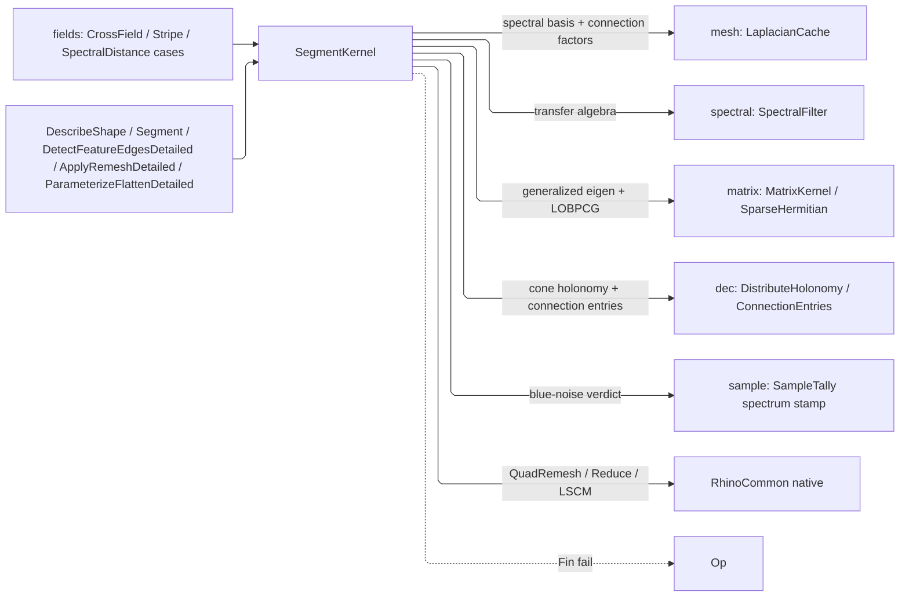

# [RASM_SHAPE_SEGMENT]

`SegmentKernel` owns spectral shape analysis and host-native restructure over the `mesh` substrate: spectral descriptors and distance, blue-noise sampling validation, feature-edge classification, `MeshSegmentation`, Knöppel globally-optimal direction fields with stripe patterns, and the RhinoCommon `QuadRemesh`/`Reduce`/LSCM restructure tier. Host restructure is capture — this page owns the native surface and never re-derives the first-principles counterparts.

Eigen systems ride the `matrix` owners — `MatrixKernel.GeneralizedEigenpairsDetailed` for normalized cuts, `SparseHermitian.SmallestEigenpairsDetailed` LOBPCG for the smoothest field; spectral bases and connection factors ride the `mesh` `LaplacianCache`, cone prescriptions the `dec` trivial-connection owner, sampling the `MeshProbe` substrate. Descriptor variants are each one `SpectralFilter` row and a segmentation algorithm one `MeshSegmentation` case; the `ScalarField.SpectralDistance`/`Stripe` and `VectorField.CrossField` cases delegate here.

## [01]-[INDEX]

- [02]-[DESCRIPTORS]: `MeshDescriptor` spectral descriptors, spectral distance, and the blue-noise sampling gate feeding the `sample` owner.
- [03]-[FEATURES]: dihedral and curvature feature-edge classification over `MeshFeatureKind` with scale-derived policy admission.
- [04]-[SEGMENTATION]: `MeshSegmentation` — one dispatch, one `Segmentation` evidence shape, over the shared scalar-derivation, adjacency, and component split.
- [05]-[DIRECTION_FIELDS]: Knöppel GODF cross fields and stripe patterns.
- [06]-[RESTRUCTURE]: host-native `QuadRemesh`/`Reduce` behind `RemeshKind` and native LSCM flatten with the distortion witness.

## [02]-[DESCRIPTORS]

- Owner: `MeshDescriptor` is one guarded `[ComplexValueObject]` over `(Filter, Sources, Policy)`, never a thinned ShapeDNA clone — the `spectral` `SpectralFilter` transfer algebra already spans the heat, wave, biharmonic, diffusion, and commute-time variants, so a descriptor variant is a filter row, a `MeshDescriptorKind` sibling enum re-listing filter names is the rejected duplicate vocabulary, and a one-case union around the same coordinates is a vacuous type test at every read.
- Entry: `DescribeShape<TOut>` projects output-typed through `ResultProjection` rows over one descriptor solve, so every projection is a pure read of the one result; `SpectralDistanceAt` and `ValidateSamplingSpectrum`, which stamps the blue-noise verdict into the `sample` result's tally, complete the arms.
- Auto: descriptors pull the cached `SpectralBasisBundle` — one generalized eigensolve per basis size per mesh snapshot, the cache-hit flag in `DescriptorSolve` — apply the filter, and project; the blue-noise gate bounds low-band energy against `SpectrumPolicy` — ceiling, basis cap, and low-mode count on one admitted value carrying its own provenance, never three page globals — and a total energy under the floor REFUSES rather than stamping a fabricated worst-case ratio.
- Boundary: output selection lives in `ProjectionRow` keys, so reflection branching in a solver body is the deleted form; DEC assembly is independent evidence its own owner builds, never an optional column on the descriptor solve; the descriptor family is closed over the filter algebra.

```csharp
// --- [IMPORTS] -------------------------------------------------------------------------
using System;
using System.Collections.Generic;
using System.Linq;
using System.Numerics;
using System.Numerics.Tensors;
using System.Runtime.InteropServices;
using System.Threading;
using LanguageExt;
using QuikGraph;
using QuikGraph.Algorithms;
using QuikGraph.Collections;
using Rasm.Domain;
using Rasm.Meshing;
using Rasm.Numerics;
using Rasm.Spatial;
using Rhino;
using Rhino.Geometry;
using Thinktecture;
using static LanguageExt.Prelude;
using Dimension = Rasm.Numerics.Dimension;

namespace Rasm.Processing;

// --- [TYPES] ---------------------------------------------------------------------------
[ComplexValueObject]
public readonly partial struct MeshDescriptor {
    public SpectralFilter Filter { get; }
    public Option<Seq<int>> Sources { get; }
    public SpectralDescriptorPolicy Policy { get; }

    static partial void ValidateFactoryArguments(ref ValidationError? validationError, ref SpectralFilter filter, ref Option<Seq<int>> sources, ref SpectralDescriptorPolicy policy) =>
        validationError = filter is not null && policy.IsValid
            ? null
            : new ValidationError(string.Join(" | ", new object?[] { "MeshDescriptor admits a spectral filter under a valid descriptor policy." }));
    public static Fin<MeshDescriptor> Spectral(
        SpectralFilter filter,
        Option<Seq<int>> sources = default,
        Option<SpectralDescriptorPolicy> policy = default) =>
        FactoryBridge.Accept<MeshDescriptor>(
            Validate(filter, sources, policy.IfNone(SpectralDescriptorPolicy.Raw), out MeshDescriptor value),
            value);
}


// --- [MODELS] --------------------------------------------------------------------------
[StructLayout(LayoutKind.Auto)]
public readonly record struct DescriptorSolve(
    DescriptorProfile Spectral, EigenSolution<double, Arr<double>> Eigen, bool Cached,
    int SkippedDegenerateFaces = 0) : IValidityEvidence {
    public bool IsValid => ValidityClaim.All(
        Spectral.IsValid, Eigen.IsValid,
        ValidityClaim.CountAtLeast(count: SkippedDegenerateFaces, floor: 0));
}

[StructLayout(LayoutKind.Auto)] public readonly record struct DescriptorResult(Arr<double> Values, DescriptorSolve Solve);

[StructLayout(LayoutKind.Auto)]
public readonly record struct SamplingSpectrum(
    int VertexCount, int SampleCount, int EigenpairCount,
    double LowFrequencyEnergy, double TotalEnergy, UnitInterval SuppressionRatio, UnitInterval ValidationThreshold) : IValidityEvidence {
    public bool Validated => SuppressionRatio.Value <= ValidationThreshold.Value;
    public bool IsValid => ValidityClaim.All(
        VertexCount >= 0 && SampleCount >= 0 && EigenpairCount >= 0,
        ValidityClaim.Nonnegative(value: LowFrequencyEnergy),
        ValidityClaim.Positive(value: TotalEnergy));
}

[StructLayout(LayoutKind.Auto)]
public readonly record struct SpectrumPolicy(UnitInterval LowFrequencyCeiling, Dimension BasisCap, Dimension LowModeCount) {
    public static readonly SpectrumPolicy Default = new(
        LowFrequencyCeiling: UnitInterval.Create(value: 0.5), BasisCap: Dimension.Create(value: 8), LowModeCount: Dimension.Create(value: 3));
    public static Fin<SpectrumPolicy> Of(double lowFrequencyCeiling, int basisCap, int lowModeCount) =>
        from ceiling in FactoryBridge.Accept<UnitInterval>(candidate: lowFrequencyCeiling)
                     from basis in FactoryBridge.Accept<Dimension>(candidate: basisCap)
                     from modes in FactoryBridge.Accept<Dimension>(candidate: lowModeCount)
                     from _ in guard(modes.Value <= basis.Value, new KernelFault.InvalidInput())
                     select new SpectrumPolicy(LowFrequencyCeiling: ceiling, BasisCap: basis, LowModeCount: modes);
}

// --- [OPERATIONS] ----------------------------------------------------------------------
internal static partial class SegmentKernel {
    internal static Fin<TOut> DescribeShape<TOut>(MeshSpace space, MeshDescriptor spec, int eigenpairs) =>
        from result in DescribeSpectralShape(space, spec, eigenpairs, key)
        from output in ResultProjection.Rows<DescriptorResult, TOut>(self: result, owner: typeof(MeshDescriptor),
            ProjectionRow.Of<DescriptorSolve>(() => Fin.Succ(result.Solve)),
            ProjectionRow.Of<SpectralDescriptor>(() => Fin.Succ(new SpectralDescriptor(result.Values, result.Solve.Spectral))),
            ProjectionRow.Of<DescriptorProfile>(() => Fin.Succ(result.Solve.Spectral)),
            ProjectionRow.Of<Arr<double>>(() => Fin.Succ(result.Values)))
        select output;
    internal static Fin<DescriptorResult> DescribeSpectralShape(MeshSpace space, MeshDescriptor spec, int eigenpairs) =>
        from bundle in space.Cache.SpectralBasisBundleOf(Dimension.Create(eigenpairs))
        from spectral in spec.Filter.Evaluate(bundle.Basis, spec.Sources, spec.Policy, key)
        select new DescriptorResult(spectral.Values,
            new DescriptorSolve(spectral.Profile, bundle.Eigen, bundle.Cached, bundle.SkippedDegenerateFaces));

    internal static Fin<double> SpectralDistanceAt(MeshSpace space, SpectralFilter filter, Seq<int> sources, int pairs, Point3d sample) =>
        from bundle in space.Cache.SpectralBasisBundleOf(k: Dimension.Create(value: pairs))
        from descriptor in filter.Evaluate(basis: bundle.Basis, sources: sources.IsEmpty ? Option<Seq<int>>.None : Some(sources))
        from interpolated in MeshProbe.ScalarOn(space: space, sample: sample, perVertex: descriptor.Values)
        select interpolated;

    internal static Fin<SampleKernel.Result> ValidateSamplingSpectrum(MeshSpace space, SampleKernel.Result result, Option<SpectrumPolicy> policy = default) =>
        result.Points.IsEmpty || space.Native.Vertices.Count < 3
            ? Fin.Succ(result)
            : policy.IfNone(SpectrumPolicy.Default) switch {
                SpectrumPolicy active =>
                    from bundle in space.Cache.SpectralBasisBundleOf(k: Dimension.Create(value: Math.Min(val1: active.BasisCap.Value, val2: Math.Max(val1: 1, val2: space.Native.Vertices.Count - 1))))
                    from spectrum in SamplingSpectrumOf(space: space, points: result.Points, basis: bundle.Basis, policy: active)
                    select result with { Tally = result.Tally with { Algorithm = result.Tally.Algorithm with {
                        Assurances = spectrum.Validated ? result.Tally.Algorithm.Assurances.With(SampleAssurance.MeshSpectrum) : result.Tally.Algorithm.Assurances,
                        Spectrum = Some(spectrum) } } },
            };
    private static Fin<SamplingSpectrum> SamplingSpectrumOf(MeshSpace space, Seq<Point3d> points, SpectralBasis basis, SpectrumPolicy policy) {
        int vertexCount = space.Native.Vertices.Count;
        if (basis.Eigenvectors.Count == 0 || points.IsEmpty) return Fin.Fail<SamplingSpectrum>(new KernelFault.InvalidInput());
        double[] indicator = new double[vertexCount];
        return from _ in points.TraverseM(point => MeshProbe.ClosestFace(space: space, sample: point, project: (_, face, weights, _) => {
                   indicator[face.A] += weights[0]; indicator[face.B] += weights[1]; indicator[face.C] += weights[2];
                   if (face.IsQuad) indicator[face.D] += weights[3];
                   return Fin.Succ(unit);
               })).As()
               from bands in SpectralEnergy(basis: basis, indicator: indicator, vertexCount: vertexCount, lowModes: policy.LowModeCount.Value)
               from ratio in bands.Total > EpsilonPolicy.SqrtEpsilon
                   ? Acceptance.Value(value: bands.Low / bands.Total)
                   : Fin.Fail<double>(new KernelFault.InvalidResult())
               from spectrum in Fin.Succ(new SamplingSpectrum(
                   VertexCount: vertexCount, SampleCount: points.Count, EigenpairCount: basis.Eigenvectors.Count,
                   LowFrequencyEnergy: bands.Low, TotalEnergy: bands.Total,
                   SuppressionRatio: UnitInterval.Create(value: Math.Max(val1: 0.0, val2: Math.Min(val1: 1.0, val2: ratio))),
                   ValidationThreshold: policy.LowFrequencyCeiling))
               from admitted in spectrum.IsValid ? Fin.Succ(spectrum) : Fin.Fail<SamplingSpectrum>(new KernelFault.InvalidResult())
               select admitted;
    }
    private static Fin<(double Low, double Total)> SpectralEnergy(SpectralBasis basis, double[] indicator, int vertexCount, int lowModes) {
        int lowLimit = Math.Min(val1: lowModes, val2: basis.Eigenvectors.Count);
        double low = 0.0, total = 0.0;
        for (int mode = 0; mode < basis.Eigenvectors.Count; mode++) {
            Arr<double> eigenvector = basis.Eigenvectors[index: mode];
            if (eigenvector.Count != vertexCount) return Fin.Fail<(double, double)>(new KernelFault.InvalidResult());
            double coefficient = TensorPrimitives.Dot<double>(indicator, [.. eigenvector.AsIterable()]);
            double energy = coefficient * coefficient;
            if (!double.IsFinite(x: energy)) return Fin.Fail<(double, double)>(new KernelFault.InvalidResult());
            total += energy;
            if (mode < lowLimit) low += energy;
        }
        return Fin.Succ((Low: low, Total: total));
    }
}
```

## [03]-[FEATURES]

- Owner: `MeshFeatureKind` the edge taxonomy and `FeatureEdges.Census` its one per-kind count stream; `MeshFeaturePolicy` derives the curvature threshold and smoothing scale from the mean edge length at admission while the dihedral threshold stays caller intent, and optional per-face regions turn region boundaries into features.
- Entry: `DetectFeatureEdgesDetailed` takes the admitted `MeshFeaturePolicy` alone — `MeshFeaturePolicy.Of` is the one admission boundary, so the kernel re-proves no gate.
- Auto: topology edges classify by connected-face census, then smooth two-face edges classify by the signed dihedral against the threshold — ridge or valley when the length-normalized curvature signal also clears the curvature threshold, plain crease otherwise; region-boundary classification precedes the angle tests when face regions are declared, and the curvature signal is endpoint-smoothed against single-edge noise, so a raw per-edge threshold is the rejected form.
- Boundary: ngon interiors are counted and skipped, never dropped, and the below-threshold remainder lands in `UnclassifiedEdges`; `FeatureEdges`'s own gate enforces both census reconciliations, so totality is recomputable from its fields, never a prose promise; per-face normals ride the memoized `MeshSpace.FaceNormals` column on the `Fin` result, so detection never mutates the frozen snapshot.

```csharp
// --- [TYPES] ---------------------------------------------------------------------------
[SmartEnum<int>]
public sealed partial class MeshFeatureKind {
    public static readonly MeshFeatureKind Boundary = new(key: 0);
    public static readonly MeshFeatureKind Crease = new(key: 1);
    public static readonly MeshFeatureKind NonManifold = new(key: 2);
    public static readonly MeshFeatureKind Unwelded = new(key: 3);
    public static readonly MeshFeatureKind NgonInterior = new(key: 4);
    public static readonly MeshFeatureKind Ridge = new(key: 5);
    public static readonly MeshFeatureKind Valley = new(key: 6);
    public static readonly MeshFeatureKind RegionBoundary = new(key: 7);
}

// --- [MODELS] --------------------------------------------------------------------------
[StructLayout(LayoutKind.Auto)]
public readonly record struct FeatureEdge(
    int A, int B, MeshFeatureKind Kind,
    Option<double> SignedDihedralRadians = default,
    Option<double> CurvatureSignal = default);

[StructLayout(LayoutKind.Auto)]
public readonly record struct FeatureEdges(
    Seq<FeatureEdge> Edges, HashMap<MeshFeatureKind, int> Census, double DihedralThresholdRadians, int UnclassifiedEdges = 0,
    double CurvatureThreshold = 0.0, double SmoothingScale = 0.0, int CurvatureFiniteVertices = 0,
    int TopologyVertexCount = 0, int TopologyEdgeCount = 0) : IValidityEvidence {
    public int CurvatureRejectedVertices => Math.Max(val1: 0, val2: TopologyVertexCount - CurvatureFiniteVertices);
    public bool IsValid => ValidityClaim.All(
        Census.Values.All(static count => count >= 0) && UnclassifiedEdges >= 0,
        CurvatureFiniteVertices >= 0 && TopologyVertexCount >= CurvatureFiniteVertices,
        ValidityClaim.Nonnegative(value: DihedralThresholdRadians),
        ValidityClaim.Nonnegative(value: CurvatureThreshold),
        ValidityClaim.Nonnegative(value: SmoothingScale),
        ValidityClaim.CountExactly(count: Edges.Count, expected: Census.Values.Sum()),
        ValidityClaim.CountExactly(count: TopologyEdgeCount, expected: Edges.Count + UnclassifiedEdges));
    internal Fin<TOut> Project<TOut>() {
        FeatureEdges self = this;
        return ResultProjection.Rows<FeatureEdges, TOut>(self: self,
            ProjectionRow.Of<Seq<FeatureEdge>>(() => Fin.Succ(self.Edges)),
            ProjectionRow.Of<Seq<(int A, int B)>>(() => Fin.Succ(toSeq(self.Edges.AsIterable()
                .Where(static edge => !edge.Kind.Equals(MeshFeatureKind.NgonInterior))
                .Select(static edge => (edge.A, edge.B))))));
    }
}

[StructLayout(LayoutKind.Auto)]
public readonly record struct MeshFeaturePolicy(VectorAngle DihedralThreshold, PositiveMagnitude CurvatureThreshold, PositiveMagnitude SmoothingScale, Option<Arr<int>> FaceRegions) {
    internal static Fin<MeshFeaturePolicy> Of(double dihedralRadians, MeshSpace space, Option<Arr<int>> faceRegions) =>
        from dihedral in FactoryBridge.Accept<VectorAngle>(candidate: dihedralRadians)
        from _ in guard(dihedral.Value > EpsilonPolicy.ZeroTolerance, new KernelFault.InvalidInput())
        let meanEdge = space.Cache.MeanEdgeLength
        from curvature in FactoryBridge.Accept<PositiveMagnitude>(candidate: 1.0 / Math.Max(val1: meanEdge, val2: space.Tolerance.Absolute.Value))
        from smooth in FactoryBridge.Accept<PositiveMagnitude>(candidate: Math.Max(val1: meanEdge, val2: space.Tolerance.Absolute.Value))
        from policy in new MeshFeaturePolicy(DihedralThreshold: dihedral, CurvatureThreshold: curvature, SmoothingScale: smooth, FaceRegions: faceRegions).Admit(space: space)
        select policy;
    internal Fin<MeshFeaturePolicy> Admit(MeshSpace space) {
        MeshFeaturePolicy self = this;
        return (from dihedral in FactoryBridge.Accept<VectorAngle>(candidate: self.DihedralThreshold.Value)
                from _ in guard(dihedral.Value > EpsilonPolicy.ZeroTolerance, new KernelFault.InvalidInput())
                from curvature in FactoryBridge.Accept<PositiveMagnitude>(candidate: self.CurvatureThreshold.Value)
                from smooth in FactoryBridge.Accept<PositiveMagnitude>(candidate: self.SmoothingScale.Value)
                select new MeshFeaturePolicy(DihedralThreshold: dihedral, CurvatureThreshold: curvature, SmoothingScale: smooth, FaceRegions: self.FaceRegions))
            .Bind(policy => policy.FaceRegions.Match(
                Some: active => guard(active.Count == space.Native.Faces.Count, new KernelFault.InvalidInput()).ToFin().Map(_ => policy),
                None: () => Fin.Succ(policy)));
    }
}

// --- [OPERATIONS] ----------------------------------------------------------------------
internal static partial class SegmentKernel {
    internal static Fin<FeatureEdges> DetectFeatureEdgesDetailed(MeshSpace space, MeshFeaturePolicy policy) =>
        space.FaceNormals().Map(faceNormals => {
            Mesh mesh = space.Native;
            (Arr<Option<double>> Edge, int FiniteVertices) curvature = EdgeCurvatureSignals(mesh: mesh, faceNormals: faceNormals, smoothingScale: policy.SmoothingScale.Value);
            List<FeatureEdge> features = new(capacity: mesh.TopologyEdges.Count);
            HashMap<MeshFeatureKind, int> census = HashMap<MeshFeatureKind, int>();
            int unclassified = 0;
            for (int e = 0; e < mesh.TopologyEdges.Count; e++) {
                int[] faces = mesh.TopologyEdges.GetConnectedFaces(topologyEdgeIndex: e);
                IndexPair p = mesh.TopologyEdges.GetTopologyVertices(topologyEdgeIndex: e);
                FeatureEdge Topological(MeshFeatureKind kind) => new(A: p.I, B: p.J, Kind: kind);
                Option<FeatureEdge> feature = faces.Length switch {
                    1 => Topological(MeshFeatureKind.Boundary),
                    > 2 => Topological(MeshFeatureKind.NonManifold),
                    2 when mesh.TopologyEdges.IsEdgeUnwelded(topologyEdgeIndex: e) => Topological(MeshFeatureKind.Unwelded),
                    2 when mesh.TopologyEdges.IsNgonInterior(topologyEdgeIndex: e) => Topological(MeshFeatureKind.NgonInterior),
                    2 => ClassifySmoothFeature(mesh: mesh, edge: e, faces: faces, faceNormals: faceNormals, policy: policy, edgeCurvature: curvature.Edge[index: e])
                        .Map(verdict => new FeatureEdge(A: p.I, B: p.J, Kind: verdict.Kind, SignedDihedralRadians: verdict.SignedDihedralRadians, CurvatureSignal: verdict.CurvatureSignal)),
                    _ => None,
                };
                if (feature.Case is not FeatureEdge edge) { unclassified++; continue; }
                features.Add(item: edge);
                census = census.AddOrUpdate(key: edge.Kind, Some: static count => count + 1, None: static () => 1);
            }
            return new FeatureEdges(Edges: toSeq(features), Census: census, DihedralThresholdRadians: policy.DihedralThreshold.Value, UnclassifiedEdges: unclassified,
                CurvatureThreshold: policy.CurvatureThreshold.Value, SmoothingScale: policy.SmoothingScale.Value,
                CurvatureFiniteVertices: curvature.FiniteVertices, TopologyVertexCount: mesh.TopologyVertices.Count, TopologyEdgeCount: mesh.TopologyEdges.Count);
        });
    private static Option<(MeshFeatureKind Kind, Option<double> SignedDihedralRadians, Option<double> CurvatureSignal)> ClassifySmoothFeature(Mesh mesh, int edge, int[] faces, Arr<Vector3d> faceNormals, MeshFeaturePolicy policy, Option<double> edgeCurvature) {
        double rawAngle = Vector3d.VectorAngle(a: faceNormals[index: faces[0]], b: faceNormals[index: faces[1]]);
        Line line = mesh.TopologyEdges.EdgeLine(topologyEdgeIndex: edge);
        Vector3d axis = line.To - line.From;
        double signedAngle = line.IsValid && axis.Unitize() && Vector3d.CrossProduct(a: faceNormals[index: faces[0]], b: faceNormals[index: faces[1]]) * axis < 0.0 ? -rawAngle : rawAngle;
        (MeshFeatureKind, Option<double>, Option<double>) Measured(MeshFeatureKind kind) =>
            (kind, double.IsFinite(x: signedAngle) ? Some(signedAngle) : None, edgeCurvature);
        if (policy.FaceRegions.Exists(regions => regions[index: faces[0]] != regions[index: faces[1]]))
            return Some(Measured(MeshFeatureKind.RegionBoundary));
        if (!double.IsFinite(x: rawAngle)) return None;
        bool highCurvature = edgeCurvature.Exists(signal => signal >= policy.CurvatureThreshold.Value);
        if (highCurvature && Math.Abs(value: signedAngle) >= policy.DihedralThreshold.Value)
            return Some(Measured(signedAngle >= 0.0 ? MeshFeatureKind.Ridge : MeshFeatureKind.Valley));
        return rawAngle >= policy.DihedralThreshold.Value ? Some(Measured(MeshFeatureKind.Crease)) : None;
    }
    private static (Arr<Option<double>> Edge, int FiniteVertices) EdgeCurvatureSignals(Mesh mesh, Arr<Vector3d> faceNormals, double smoothingScale) {
        Option<double>[] edgeSignals = [.. Enumerable.Repeat(element: Option<double>.None, count: mesh.TopologyEdges.Count)];
        double[] edgeLengths = new double[mesh.TopologyEdges.Count];
        double[] vertexSum = new double[mesh.TopologyVertices.Count];
        int[] vertexCount = new int[mesh.TopologyVertices.Count];
        for (int e = 0; e < mesh.TopologyEdges.Count; e++) {
            int[] faces = mesh.TopologyEdges.GetConnectedFaces(topologyEdgeIndex: e);
            Line line = mesh.TopologyEdges.EdgeLine(topologyEdgeIndex: e);
            if (faces.Length != 2 || !line.IsValid) continue;
            double length = line.Length;
            if (!double.IsFinite(x: length) || length <= EpsilonPolicy.SqrtEpsilon) continue;
            double angle = Vector3d.VectorAngle(a: faceNormals[index: faces[0]], b: faceNormals[index: faces[1]]);
            if (!double.IsFinite(x: angle)) continue;
            double signal = Math.Abs(value: angle) / length;
            edgeSignals[e] = Some(signal); edgeLengths[e] = length;
            IndexPair pair = mesh.TopologyEdges.GetTopologyVertices(topologyEdgeIndex: e);
            if (pair.I >= 0 && pair.I < vertexSum.Length) { vertexSum[pair.I] += signal; vertexCount[pair.I]++; }
            if (pair.J >= 0 && pair.J < vertexSum.Length) { vertexSum[pair.J] += signal; vertexCount[pair.J]++; }
        }
        for (int e = 0; e < mesh.TopologyEdges.Count; e++) {
            if (edgeSignals[e].Case is not double raw || edgeLengths[e] <= EpsilonPolicy.SqrtEpsilon) continue;
            IndexPair pair = mesh.TopologyEdges.GetTopologyVertices(topologyEdgeIndex: e);
            if (pair.I < 0 || pair.J < 0 || pair.I >= vertexSum.Length || pair.J >= vertexSum.Length || vertexCount[pair.I] == 0 || vertexCount[pair.J] == 0) continue;
            double endpointMean = ((vertexSum[pair.I] / vertexCount[pair.I]) + (vertexSum[pair.J] / vertexCount[pair.J])) * 0.5;
            double blend = edgeLengths[e] / Math.Max(val1: edgeLengths[e] + smoothingScale, val2: EpsilonPolicy.SqrtEpsilon);
            edgeSignals[e] = Some((blend * raw) + ((1.0 - blend) * endpointMean));
        }
        return (Edge: new Arr<Option<double>>(edgeSignals), FiniteVertices: vertexCount.Count(static count => count > 0));
    }
}
```

## [04]-[SEGMENTATION]

- Owner: `MeshSegmentation` `[Union]` carries one case per algorithm with monadic factories internalizing admission; `Segmentation` is the one evidence record for every algorithm, and `MeshSegmentationResult` carries face regions, majority-vote vertex regions, and the segmentation.
- Cases: a new algorithm is one union case and one dispatch arm.
- Entry: `Segment<TOut>` folds a generated total `Switch` over the union, projecting through `ResultProjection` rows — one entry, the algorithm is the case, `TOut` is the projection.
- Auto: every algorithm shares ONE scalar derivation, ONE memoized frozen face-adjacency graph, and ONE connected-component split, so a per-algorithm re-derivation is the deleted form; the normalized-cut affinity `σ` is scale-derived from the value range over `√faceCount`, never a knob, and clustering is deterministic farthest-first k-means with no RNG, and both round folds ride `Cell.Converge` — each step commits its explicit settlement fact, so no hand `while` shadows the schedule and normal completion never borrows `Refused`.
- Law: one `Segmentation` shape carries every algorithm — algorithm-specific evidence rides `Option` columns, never sibling types; the admitted request IS the algorithm identity and carries its own counts, budgets, and thresholds, so no roster mirrors the union's cases and no column echoes the request; a round fold that exhausts its budget refuses with the invalid-result fault, never a status row or a converged bool.
- Boundary: `UnassignedRegion = -1` is the interior packing alone — `RegionLabel` admits nonnegative ordinals and the result publishes `Option<RegionLabel>`, so absence never crosses the boundary as an int a consumer must decode by prose; a NaN scalar is a MASK the algorithms census and segment around, so a partial field segments its defined region; every factory admits through the admission gate, so an invalid request never constructs.

```csharp
// --- [TYPES] ---------------------------------------------------------------------------
[Union]
public abstract partial record MeshScalars {
    private MeshScalars() { }
    public sealed record PerVertexCase(Arr<double> Values) : MeshScalars;
    public sealed record PerFaceCase(Arr<double> Values) : MeshScalars;
    public static Fin<MeshScalars> PerVertex(Arr<double> values) => Admit(values).Map(static admitted => (MeshScalars)new PerVertexCase(Values: admitted));
    public static Fin<MeshScalars> PerFace(Arr<double> values) => Admit(values).Map(static admitted => (MeshScalars)new PerFaceCase(Values: admitted));
    private static Fin<Arr<double>> Admit(Arr<double> values) =>
        values.Count == 0 || !values.AsIterable().Any(double.IsFinite)
            ? Fin.Fail<Arr<double>>(new KernelFault.InvalidInput())
            : Fin.Succ(values);
}

[Union]
public abstract partial record MeshSegmentation {
    private MeshSegmentation() { }
    public sealed record ScalarThresholdCase(MeshScalars Values, double Threshold, ExtremumDirection Direction) : MeshSegmentation;
    public sealed record ScalarBandsCase(MeshScalars Values, Dimension BandCount) : MeshSegmentation;
    public sealed record SeededRegionGrowCase(MeshScalars Values, Seq<int> SeedFaces, PositiveMagnitude Tolerance, Dimension MaxIterations) : MeshSegmentation;
    public sealed record DescriptorClustersCase(MeshDescriptor Descriptor, Dimension Eigenpairs, Dimension RegionCount, Dimension MaxIterations, PositiveMagnitude Tolerance) : MeshSegmentation;
    public sealed record WatershedCase(MeshScalars Values, PositiveMagnitude MergeTolerance) : MeshSegmentation;
    public sealed record NormalizedCutCase(MeshScalars Values, Dimension MaxIterations, PositiveMagnitude Tolerance) : MeshSegmentation;
    public static Fin<MeshSegmentation> ScalarThreshold(MeshScalars values, double threshold, Option<ExtremumDirection> direction = default) =>
        from _ in Admit.Finite(value: threshold)
                                          select (MeshSegmentation)new ScalarThresholdCase(Values: values, Threshold: threshold, Direction: direction.IfNone(ExtremumDirection.Maximum));
    public static Fin<MeshSegmentation> ScalarBands(MeshScalars values, int bandCount) =>
        from count in FactoryBridge.Accept<Dimension>(candidate: bandCount) from _ in guard(bandCount > 1, new KernelFault.InvalidInput()) select (MeshSegmentation)new ScalarBandsCase(Values: values, BandCount: count);
    public static Fin<MeshSegmentation> SeededRegionGrow(MeshScalars values, Seq<int> seedFaces, double tolerance, int maxIterations) =>
        from _ in guard(!seedFaces.IsEmpty, new KernelFault.InvalidInput()) from eps in FactoryBridge.Accept<PositiveMagnitude>(candidate: tolerance) from cap in FactoryBridge.Accept<Dimension>(candidate: maxIterations) select (MeshSegmentation)new SeededRegionGrowCase(Values: values, SeedFaces: seedFaces, Tolerance: eps, MaxIterations: cap);
    public static Fin<MeshSegmentation> DescriptorClusters(MeshDescriptor descriptor, int eigenpairs, int regionCount, int maxIterations, double tolerance) =>
        from active in Optional(descriptor).ToFin(new KernelFault.InvalidInput()) from _ in guard(active.IsValid, new KernelFault.InvalidInput()) from pairs in FactoryBridge.Accept<Dimension>(candidate: eigenpairs) from regions in FactoryBridge.Accept<Dimension>(candidate: regionCount) from __ in guard(regionCount > 1, new KernelFault.InvalidInput()) from cap in FactoryBridge.Accept<Dimension>(candidate: maxIterations) from eps in FactoryBridge.Accept<PositiveMagnitude>(candidate: tolerance) select (MeshSegmentation)new DescriptorClustersCase(Descriptor: active, Eigenpairs: pairs, RegionCount: regions, MaxIterations: cap, Tolerance: eps);
    public static Fin<MeshSegmentation> Watershed(MeshScalars values, double mergeTolerance) =>
        from tolerance in FactoryBridge.Accept<PositiveMagnitude>(candidate: mergeTolerance) select (MeshSegmentation)new WatershedCase(Values: values, MergeTolerance: tolerance);
    public static Fin<MeshSegmentation> NormalizedCut(MeshScalars values, int maxIterations, double tolerance) =>
        from cap in FactoryBridge.Accept<Dimension>(maxIterations)
                                          from eps in FactoryBridge.Accept<PositiveMagnitude>(tolerance)
                                          select (MeshSegmentation)new NormalizedCutCase(values, cap, eps);
}

[ValueObject<int>]
public readonly partial struct RegionLabel {
    static partial void ValidateFactoryArguments(ref ValidationError? validationError, ref int value) =>
        validationError = value >= 0 ? null : new ValidationError(string.Join(" | ", new object?[] { "RegionLabel admits a nonnegative region ordinal." }));
    internal static Option<RegionLabel> Of(int packed) => packed >= 0 ? Some(Create(packed)) : Option<RegionLabel>.None;
}

// --- [MODELS] --------------------------------------------------------------------------
[StructLayout(LayoutKind.Auto)]
public readonly record struct Segmentation(
    MeshSegmentation Request, int RegionCount, Option<int> SeedCount,
    int AssignedFaceCount, int UnassignedFaceCount, int SkippedDegenerateFaces, int SkippedNonFiniteValues,
    Option<int> Iterations, Option<DescriptorSolve> DescriptorSolve = default,
    Option<double> NormalizedCutValue = default, Option<int> AffinityNonZeros = default,
    Option<int> WatershedSaddleCount = default, Option<EigenSolution<double, Arr<double>>> Eigen = default) : IValidityEvidence {
    public bool IsValid => ValidityClaim.All(
        Request is not null,
        RegionCount >= 0 && AssignedFaceCount >= 0 && UnassignedFaceCount >= 0 && SkippedDegenerateFaces >= 0 && SkippedNonFiniteValues >= 0,
        SeedCount.Map(static count => count >= 0).IfNone(noneValue: true) && Iterations.Map(static iter => iter >= 0).IfNone(noneValue: true),
        AffinityNonZeros.Map(static count => count >= 0).IfNone(noneValue: true) && WatershedSaddleCount.Map(static count => count >= 0).IfNone(noneValue: true),
        NormalizedCutValue.Map(static value => double.IsFinite(value) && value >= 0.0).IfNone(noneValue: true),
        ValidityClaim.Evidence(DescriptorSolve), ValidityClaim.Evidence(Eigen));
}

[StructLayout(LayoutKind.Auto)] public readonly record struct MeshSegmentationResult(Arr<Option<RegionLabel>> FaceRegions, Arr<Option<RegionLabel>> VertexRegions, Segmentation Segmentation);

// --- [OPERATIONS] ----------------------------------------------------------------------
internal static partial class SegmentKernel {
    private const int UnassignedRegion = -1;

    internal static Fin<TOut> Segment<TOut>(MeshSpace space, MeshSegmentation kind) =>
        kind.Switch(
            state: space,
            scalarThresholdCase: static (state, threshold) =>
                from scalars in SegmentationScalarsOf(mesh: state.Native, scalars: threshold.Values)
                from adjacency in FaceAdjacency(space: state)
                select ComponentsOf(mesh: state.Native, adjacency: adjacency, scalars: scalars, bucket: value => threshold.Direction.Within(candidate: value, best: threshold.Threshold, band: 0.0) ? 0 : UnassignedRegion,
                    draft: new Segmentation(Request: threshold, RegionCount: 0, SeedCount: None, AssignedFaceCount: 0, UnassignedFaceCount: 0, SkippedDegenerateFaces: 0, SkippedNonFiniteValues: 0, Iterations: None)),
            scalarBandsCase: static (state, bands) =>
                from scalars in SegmentationScalarsOf(mesh: state.Native, scalars: bands.Values)
                from band in scalars.Band.ToFin(new KernelFault.InvalidInput())
                from adjacency in FaceAdjacency(space: state)
                select ComponentsOf(mesh: state.Native, adjacency: adjacency, scalars: scalars,
                    bucket: value => Math.Abs(value: band.Max - band.Min) <= EpsilonPolicy.SqrtEpsilon ? 0 : Math.Min(val1: bands.BandCount.Value - 1, val2: Math.Max(val1: 0, val2: (int)Math.Floor(d: (value - band.Min) / ((band.Max - band.Min) / bands.BandCount.Value)))),
                    draft: new Segmentation(Request: bands, RegionCount: 0, SeedCount: None, AssignedFaceCount: 0, UnassignedFaceCount: 0, SkippedDegenerateFaces: 0, SkippedNonFiniteValues: 0, Iterations: None)),
            seededRegionGrowCase: static (state, grow) =>
                from scalars in SegmentationScalarsOf(mesh: state.Native, scalars: grow.Values)
                from adjacency in FaceAdjacency(space: state)
                from labels in RegionGrowLabels(mesh: state.Native, adjacency: adjacency, scalars: scalars.FaceValues, seeds: grow.SeedFaces, tolerance: grow.Tolerance.Value, budget: grow.MaxIterations)
                select ResultOf(mesh: state.Native, faceRegions: labels.Regions, scalars: scalars,
                    draft: new Segmentation(Request: grow, RegionCount: 0, SeedCount: Some(labels.SeedCount), AssignedFaceCount: 0, UnassignedFaceCount: 0, SkippedDegenerateFaces: 0, SkippedNonFiniteValues: 0, Iterations: Some(labels.Iterations))),
            descriptorClustersCase: static (state, clusters) =>
                from descriptor in DescribeSpectralShape(space: state, spec: clusters.Descriptor, eigenpairs: clusters.Eigenpairs.Value)
                from field in MeshScalars.PerVertex(values: descriptor.Values)
                from scalars in SegmentationScalarsOf(mesh: state.Native, scalars: field)
                from kmeans in ClusterLabels(values: scalars.FaceValues, count: clusters.RegionCount.Value, maxIterations: clusters.MaxIterations, tolerance: clusters.Tolerance.Value)
                from adjacency in FaceAdjacency(space: state)
                let labels = ConnectedComponents(adjacency: adjacency, buckets: kmeans.Labels)
                select ResultOf(mesh: state.Native, faceRegions: labels, scalars: scalars,
                    draft: new Segmentation(Request: clusters, RegionCount: 0, SeedCount: None, AssignedFaceCount: 0, UnassignedFaceCount: 0, SkippedDegenerateFaces: 0, SkippedNonFiniteValues: 0, Iterations: Some(kmeans.Iterations), DescriptorSolve: Some(descriptor.Solve))),
            watershedCase: static (state, watershed) =>
                from scalars in SegmentationScalarsOf(mesh: state.Native, scalars: watershed.Values)
                from _ in guard(scalars.FiniteCount > 0, new KernelFault.InvalidInput())
                from adjacency in FaceAdjacency(space: state)
                let basins = WatershedLabels(faceCount: state.Native.Faces.Count, adjacency: adjacency, scalars: scalars.FaceValues, mergeTolerance: watershed.MergeTolerance.Value)
                select ResultOf(mesh: state.Native, faceRegions: basins.Regions, scalars: scalars,
                    draft: new Segmentation(Request: watershed, RegionCount: 0, SeedCount: Some(basins.SeedCount), AssignedFaceCount: 0, UnassignedFaceCount: 0, SkippedDegenerateFaces: 0, SkippedNonFiniteValues: 0, Iterations: None, WatershedSaddleCount: Some(basins.SaddleCount))),
            normalizedCutCase: static (state, cut) =>
                from scalars in SegmentationScalarsOf(mesh: state.Native, scalars: cut.Values)
                from _ in guard(scalars.FiniteCount >= 2, new KernelFault.InvalidInput())
                from adjacency in FaceAdjacency(state, state.Key)
                from system in NormalizedCutSystemOf(adjacency, scalars.FaceValues, cut.Tolerance.Value, state.Key)
                from eigen in MatrixKernel.GeneralizedEigenpairsDetailed(system.Laplacian, system.Degree, k: 2)
                from projection in eigen.PairsIn(EigenOrder.Ascending, state.Key).Bind(pairs =>
                    pairs.Count >= 2 && pairs[1].Eigenvector.Count == scalars.FaceValues.Count && pairs[1].Eigenvector.ForAll(double.IsFinite)
                        ? Fin.Succ(pairs[1].Eigenvector)
                        : Fin.Fail<Arr<double>>(new KernelFault.InvalidResult()))
                from kmeans in ClusterLabels(
                    values: new Arr<double>([.. Enumerable.Range(0, projection.Count)
                        .Select(index => double.IsFinite(scalars.FaceValues[index]) ? projection[index] : double.NaN)]),
                    count: 2, maxIterations: cut.MaxIterations, tolerance: cut.Tolerance.Value)
                let labels = ConnectedComponents(adjacency: adjacency, buckets: kmeans.Labels)
                select ResultOf(mesh: state.Native, faceRegions: labels, scalars: scalars,
                    draft: new Segmentation(Request: cut, RegionCount: 0, SeedCount: None, AssignedFaceCount: 0, UnassignedFaceCount: 0, SkippedDegenerateFaces: 0, SkippedNonFiniteValues: 0, Iterations: Some(kmeans.Iterations),
                        NormalizedCutValue: NormalizedCutValue(adjacency: adjacency, scalars: scalars.FaceValues, labels: labels, sigma: system.Sigma), AffinityNonZeros: Some(system.AffinityNonZeros), Eigen: Some(eigen))))
            .Bind(result => ResultProjection.Rows<MeshSegmentationResult, TOut>(self: result, owner: typeof(MeshSegmentation),
                ProjectionRow.Of<Segmentation>(() => Fin.Succ(result.Segmentation)),
                ProjectionRow.Of<Arr<Option<RegionLabel>>>(() => Fin.Succ(result.FaceRegions))));

    // --- [FACE_ADJACENCY]
    private static Fin<ArrayUndirectedGraph<int, SEdge<int>>> FaceAdjacency(MeshSpace space) =>
        space.Cache.Memoized(probe: unit, compute: () => {
            Mesh mesh = space.Native;
            UndirectedGraph<int, SEdge<int>> graph = new(allowParallelEdges: false);
            graph.AddVertexRange(vertices: Enumerable.Range(start: 0, count: mesh.Faces.Count));
            for (int edge = 0; edge < mesh.TopologyEdges.Count; edge++) {
                int[] faces = mesh.TopologyEdges.GetConnectedFaces(topologyEdgeIndex: edge);
                for (int a = 0; a < faces.Length; a++)
                    for (int b = a + 1; b < faces.Length; b++)
                        graph.AddEdge(edge: new SEdge<int>(source: Math.Min(val1: faces[a], val2: faces[b]), target: Math.Max(val1: faces[a], val2: faces[b])));
            }
            return Fin.Succ(graph.ToArrayUndirectedGraph());
        });
    private static IEnumerable<int> AdjacentFaces(IUndirectedGraph<int, SEdge<int>> adjacency, int face) =>
        adjacency.ContainsVertex(vertex: face) ? adjacency.AdjacentEdges(vertex: face).Select(edge => edge.GetOtherVertex(vertex: face)) : [];

    // --- [SCALARS_AND_COMPONENTS]
    private static Fin<(Arr<double> FaceValues, int SkippedDegenerateFaces, int SkippedNonFiniteValues, int FiniteCount, Option<(double Min, double Max)> Band)>
        SegmentationScalarsOf(Mesh mesh, MeshScalars scalars) {
        Fin<(Arr<double>, int, int, int, Option<(double, double)>)> Build(Arr<double> values, int expected, Func<MeshFace, int, double> read) {
            if (values.Count != expected) return Fin.Fail<(Arr<double>, int, int, int, Option<(double, double)>)>(new KernelFault.InvalidInput());
            double[] faceValues = new double[mesh.Faces.Count];
            System.Array.Fill(array: faceValues, value: double.NaN);
            int skippedDegenerate = 0, skippedNonFinite = 0, finite = 0;
            Option<(double Min, double Max)> band = None;
            double meanEdge = MeshKernel.MeanEdgeLengthOf(mesh: mesh);
            double areaFloor = EpsilonPolicy.SqrtEpsilon * Math.Max(val1: EpsilonPolicy.SqrtEpsilon, val2: meanEdge * meanEdge);
            for (int f = 0; f < mesh.Faces.Count; f++) {
                MeshFace face = mesh.Faces[index: f];
                Point3d a = mesh.Vertices[index: face.A], b = mesh.Vertices[index: face.B], c = mesh.Vertices[index: face.C];
                double area = 0.5 * Vector3d.CrossProduct(a: b - a, b: c - a).Length;
                if ((face.IsTriangle ? area : area + (0.5 * Vector3d.CrossProduct(a: c - a, b: mesh.Vertices[index: face.D] - a).Length)) < areaFloor) { skippedDegenerate++; continue; }
                double value = read(face, f);
                if (!double.IsFinite(x: value)) { skippedNonFinite++; continue; }
                faceValues[f] = value;
                band = Some(band.Map(held => (Math.Min(val1: held.Min, val2: value), Math.Max(val1: held.Max, val2: value))).IfNone((value, value)));
                finite++;
            }
            return Fin.Succ((new Arr<double>(faceValues), skippedDegenerate, skippedNonFinite, finite, band));
        }
        return scalars.Switch(
            perVertexCase: row => Build(row.Values, mesh.Vertices.Count, (face, _) =>
                ((row.Values[index: face.A] + row.Values[index: face.B] + row.Values[index: face.C]) + (face.IsQuad ? row.Values[index: face.D] : 0.0)) / (face.IsQuad ? 4.0 : 3.0)),
            perFaceCase: row => Build(row.Values, mesh.Faces.Count, (_, index) => row.Values[index: index]));
    }
    private static MeshSegmentationResult ComponentsOf(Mesh mesh, IUndirectedGraph<int, SEdge<int>> adjacency, (Arr<double> FaceValues, int SkippedDegenerateFaces, int SkippedNonFiniteValues, int FiniteCount, Option<(double Min, double Max)> Band) scalars, Func<double, int> bucket, Segmentation draft) =>
        ResultOf(mesh: mesh, faceRegions: ConnectedComponents(adjacency: adjacency, buckets: [.. scalars.FaceValues.AsIterable().Select(value => double.IsFinite(x: value) ? bucket(arg: value) : UnassignedRegion)]), scalars: scalars, draft: draft);
    private static int[] ConnectedComponents(IUndirectedGraph<int, SEdge<int>> adjacency, int[] buckets) {
        UndirectedGraph<int, SEdge<int>> graph = new(allowParallelEdges: false);
        for (int face = 0; face < buckets.Length; face++) { if (buckets[face] >= 0) graph.AddVertex(v: face); }
        for (int face = 0; face < buckets.Length; face++) {
            if (buckets[face] < 0) continue;
            foreach (int next in AdjacentFaces(adjacency: adjacency, face: face))
                if (next > face && next < buckets.Length && buckets[next] == buckets[face]) graph.AddEdge(edge: new SEdge<int>(source: face, target: next));
        }
        Dictionary<int, int> component = new();
        _ = graph.ConnectedComponents(components: component);
        Dictionary<int, int> canonical = component
            .GroupBy(static entry => entry.Value)
            .OrderBy(static group => group.Min(static entry => entry.Key))
            .Select((group, label) => (Source: group.Key, Label: label))
            .ToDictionary(static entry => entry.Source, static entry => entry.Label);
        return [.. Enumerable.Range(start: 0, count: buckets.Length)
            .Select(face => buckets[face] < 0 ? UnassignedRegion : canonical[component[face]])];
    }

    // --- [WATERSHED]
    private static (int[] Regions, int SeedCount, int SaddleCount) WatershedLabels(int faceCount, IUndirectedGraph<int, SEdge<int>> adjacency, Arr<double> scalars, double mergeTolerance) {
        int[] regions = [.. Enumerable.Repeat(element: UnassignedRegion, count: faceCount)];
        ForestDisjointSet<int> basins = new(capacity: faceCount);
        double[] seedValue = new double[faceCount];
        int seedCount = 0, saddleCount = 0;
        void Merge(int left, int right) {
            int leftRoot = basins.FindSet(value: left), rightRoot = basins.FindSet(value: right);
            if (leftRoot == rightRoot) return;
            double keep = Math.Min(val1: seedValue[leftRoot], val2: seedValue[rightRoot]);
            _ = basins.Union(left: leftRoot, right: rightRoot);
            seedValue[basins.FindSet(value: leftRoot)] = keep;
        }
        foreach (int face in Enumerable.Range(start: 0, count: faceCount).Where(i => double.IsFinite(x: scalars[index: i])).OrderBy(i => scalars[index: i]).ThenBy(static i => i)) {
            int[] neighbors = [.. AdjacentFaces(adjacency: adjacency, face: face).Select(n => regions[n]).Where(static region => region >= 0).Select(region => basins.FindSet(value: region)).Distinct().Order()];
            if (neighbors.Length == 0) {
                basins.MakeSet(value: seedCount); seedValue[seedCount] = scalars[index: face]; regions[face] = seedCount; seedCount++;
                continue;
            }
            int best = neighbors.OrderBy(region => seedValue[basins.FindSet(value: region)]).ThenBy(static region => region).First();
            for (int i = 0; i < neighbors.Length; i++) {
                int other = neighbors[i];
                if (basins.AreInSameSet(left: other, right: best)) continue;
                if (Math.Abs(value: seedValue[basins.FindSet(value: other)] - seedValue[basins.FindSet(value: best)]) <= mergeTolerance) Merge(left: best, right: other);
                else saddleCount++;
            }
            regions[face] = basins.FindSet(value: best);
        }
        Dictionary<int, int> dense = new(capacity: seedCount);
        int nextRegion = 0;
        for (int f = 0; f < regions.Length; f++) {
            if (regions[f] < 0) continue;
            int root = basins.FindSet(value: regions[f]);
            if (!dense.TryGetValue(key: root, value: out int denseRegion)) { denseRegion = nextRegion++; dense.Add(key: root, value: denseRegion); }
            regions[f] = denseRegion;
        }
        return (Regions: regions, SeedCount: seedCount, SaddleCount: saddleCount);
    }

    // --- [REGION_GROW]
    private static Fin<(int[] Regions, int Iterations, int SeedCount)> RegionGrowLabels(Mesh mesh, IUndirectedGraph<int, SEdge<int>> adjacency, Arr<double> scalars, Seq<int> seeds, double tolerance, Dimension budget) {
        int faceCount = mesh.Faces.Count;
        int[] seedArray = [.. seeds.AsIterable()];
        if (seedArray.Any(seed => seed < 0 || seed >= faceCount || !double.IsFinite(x: scalars[index: seed]))) return Fin.Fail<(int[], int, int)>(new KernelFault.InvalidInput());
        int[] seeded = [.. Enumerable.Repeat(element: UnassignedRegion, count: faceCount)];
        List<double> anchors = new(capacity: seedArray.Length);
        for (int s = 0; s < seedArray.Length; s++)
            if (seeded[seedArray[s]] < 0) { seeded[seedArray[s]] = anchors.Count; anchors.Add(item: scalars[index: seedArray[s]]); }
        if (anchors.Count == 0) return Fin.Fail<(int[], int, int)>(new KernelFault.InvalidInput());
        bool Admits(int face, int region) =>
            seeded[face] < 0 && double.IsFinite(x: scalars[index: face]) && Math.Abs(value: scalars[index: face] - anchors[index: region]) <= tolerance;
        (int[] Regions, int Iterations, bool Converged) Round((int[] Regions, int Iterations, bool Converged) state) {
            int[] proposalRegion = [.. Enumerable.Repeat(element: UnassignedRegion, count: faceCount)];
            int[] proposalSource = [.. Enumerable.Repeat(element: int.MaxValue, count: faceCount)];
            for (int face = 0; face < faceCount; face++) {
                int region = state.Regions[face];
                if (region < 0) continue;
                foreach (int next in AdjacentFaces(adjacency: adjacency, face: face)) {
                    if (!Admits(face: next, region: region)) continue;
                    if (proposalRegion[next] < 0 || region < proposalRegion[next] || (region == proposalRegion[next] && face < proposalSource[next])) { proposalRegion[next] = region; proposalSource[next] = face; }
                }
            }
            bool changed = false;
            for (int face = 0; face < faceCount; face++)
                if (proposalRegion[face] >= 0) { state.Regions[face] = proposalRegion[face]; changed = true; }
            return (state.Regions, state.Iterations + (changed ? 1 : 0), !changed);
        }
        return Cell.Converge(
                cell: Atom(value: (Regions: seeded, Iterations: 0, Converged: false)),
                step: state => Some(Round(state)), settled: static state => state.Converged,
                budget: budget, declined: new KernelFault.InvalidResult())
            .Switch(
                state: (Key: key, SeedCount: anchors.Count),
                committed: static (s, row) => Fin.Succ((row.State.Regions, row.State.Iterations, s.SeedCount)),
                ceded: static (s, _) => Fin.Fail<(int[], int, int)>(new KernelFault.InvalidResult()),
                refused: static (_, row) => Fin.Fail<(int[], int, int)>(row.Cause),
                contended: static (s, _) => Fin.Fail<(int[], int, int)>(new KernelFault.InvalidResult()));
    }

    // --- [CLUSTERING]
    private static Fin<(int[] Labels, double[] Centers, int Iterations, bool Converged)> ClusterLabels(Arr<double> values, int count, Dimension maxIterations, double tolerance) {
        int[] valid = [.. Enumerable.Range(start: 0, count: values.Count).Where(i => double.IsFinite(x: values[index: i]))];
        if (valid.Length < count) return Fin.Fail<(int[], double[], int, bool)>(new KernelFault.InvalidInput());
        double[] centers = new double[count];
        centers[0] = valid.Min(i => values[index: i]);
        for (int c = 1; c < count; c++) {
            double bestValue = centers[0], bestDistance = double.NegativeInfinity;
            for (int i = 0; i < valid.Length; i++) {
                double value = values[index: valid[i]], nearest = double.PositiveInfinity;
                for (int j = 0; j < c; j++) nearest = Math.Min(val1: nearest, val2: Math.Abs(value: value - centers[j]));
                if (nearest > bestDistance || (Math.Abs(value: nearest - bestDistance) <= EpsilonPolicy.SqrtEpsilon && value < bestValue)) { bestDistance = nearest; bestValue = value; }
            }
            centers[c] = bestValue;
        }
        (int[] Labels, double[] Centers, int Iterations, bool Converged) Round((int[] Labels, double[] Centers, int Iterations, bool Converged) state) {
            double[] sums = new double[count], next = new double[count];
            int[] counts = new int[count];
            int[] labels = [.. state.Labels];
            for (int i = 0; i < valid.Length; i++) {
                double value = values[index: valid[i]];
                int nearest = 0;
                double best = Math.Abs(value: value - state.Centers[0]);
                for (int c = 1; c < count; c++) { double distance = Math.Abs(value: value - state.Centers[c]); if (distance < best) { best = distance; nearest = c; } }
                labels[valid[i]] = nearest; sums[nearest] += value; counts[nearest]++;
            }
            double shift = 0.0;
            for (int c = 0; c < count; c++) { next[c] = counts[c] > 0 ? sums[c] / counts[c] : state.Centers[c]; shift = Math.Max(val1: shift, val2: Math.Abs(value: next[c] - state.Centers[c])); }
            return (labels, next, state.Iterations + 1, shift <= tolerance);
        }
        int[] unlabeled = [.. Enumerable.Repeat(element: UnassignedRegion, count: values.Count)];
        return Cell.Converge(
                cell: Atom(value: (Labels: unlabeled, Centers: centers, Iterations: 0, Converged: false)),
                step: state => Some(Round(state)), settled: static state => state.Converged,
                budget: maxIterations, declined: new KernelFault.InvalidResult())
            .Switch(
                state: key,
                committed: static (k, row) => row.State.Labels.Any(static label => label >= 0) ? Fin.Succ(row.State) : Fin.Fail<(int[], double[], int, bool)>(new KernelFault.InvalidResult()),
                ceded: static (k, _) => Fin.Fail<(int[], double[], int, bool)>(new KernelFault.InvalidResult()),
                refused: static (_, row) => Fin.Fail<(int[], double[], int, bool)>(row.Cause),
                contended: static (k, _) => Fin.Fail<(int[], double[], int, bool)>(new KernelFault.InvalidResult()));
    }

    // --- [NORMALIZED_CUT]
    private static Fin<(SparseMatrix Laplacian, SparseMatrix Degree, int AffinityNonZeros, double Sigma)> NormalizedCutSystemOf(IUndirectedGraph<int, SEdge<int>> adjacency, Arr<double> scalars, double tolerance) {
        int faceCount = adjacency.VertexCount;
        double[] degree = new double[faceCount];
        Option<(double Min, double Max)> band = None;
        for (int i = 0; i < scalars.Count; i++) {
            double value = scalars[index: i];
            if (!double.IsFinite(x: value)) continue;
            band = Some(band.Map(held => (Math.Min(val1: held.Min, val2: value), Math.Max(val1: held.Max, val2: value))).IfNone((value, value)));
        }
        double range = band.Map(held => Math.Max(val1: held.Max - held.Min, val2: tolerance)).IfNone(tolerance);
        double sigma = Math.Max(val1: tolerance, val2: range / Math.Max(val1: 1.0, val2: Math.Sqrt(d: faceCount)));
        List<(int Row, int Col, double Value)> laplacian = new(capacity: (adjacency.EdgeCount * 2) + faceCount), mass = new(capacity: faceCount);
        int affinities = 0;
        for (int f = 0; f < faceCount; f++) {
            double vf = scalars[index: f];
            if (!double.IsFinite(x: vf)) continue;
            foreach (int n in AdjacentFaces(adjacency: adjacency, face: f)) {
                if (n <= f) continue;
                double vn = scalars[index: n];
                if (!double.IsFinite(x: vn)) continue;
                double diff = vf - vn;
                double weight = Math.Exp(d: -(diff * diff) / (2.0 * sigma * sigma));
                if (!double.IsFinite(x: weight) || weight <= EpsilonPolicy.SqrtEpsilon) continue;
                laplacian.Add(item: (f, n, -weight)); laplacian.Add(item: (n, f, -weight));
                degree[f] += weight; degree[n] += weight;
                affinities += 2;
            }
        }
        for (int f = 0; f < faceCount; f++) {
            laplacian.Add(item: (f, f, degree[f]));
            mass.Add(item: (f, f, degree[f] > EpsilonPolicy.SqrtEpsilon ? degree[f] : 1.0));
        }
        Dimension dim = Dimension.Create(value: faceCount);
        return affinities == 0
            ? Fin.Fail<(SparseMatrix, SparseMatrix, int, double)>(new KernelFault.InvalidInput())
            : from stiffness in SparseMatrix.FromTriplets(rows: dim, cols: dim, triplets: laplacian)
              from degreeMatrix in SparseMatrix.FromTriplets(rows: dim, cols: dim, triplets: mass)
              select (Laplacian: stiffness, Degree: degreeMatrix, AffinityNonZeros: affinities, Sigma: sigma);
    }
    private static Option<double> NormalizedCutValue(IUndirectedGraph<int, SEdge<int>> adjacency, Arr<double> scalars, int[] labels, double sigma) {
        int maxRegion = labels.Where(static label => label >= 0).DefaultIfEmpty(defaultValue: UnassignedRegion).Max();
        if (maxRegion < 0) return None;
        double[] assoc = new double[maxRegion + 1], cut = new double[maxRegion + 1];
        for (int f = 0; f < labels.Length; f++) {
            int lf = labels[f];
            double vf = scalars[index: f];
            if (lf < 0 || !double.IsFinite(x: vf)) continue;
            foreach (int n in AdjacentFaces(adjacency: adjacency, face: f)) {
                if (n <= f || n >= labels.Length) continue;
                int ln = labels[n];
                double vn = scalars[index: n];
                if (ln < 0 || !double.IsFinite(x: vn)) continue;
                double diff = vf - vn;
                double weight = Math.Exp(d: -(diff * diff) / (2.0 * sigma * sigma));
                if (!double.IsFinite(x: weight) || weight <= EpsilonPolicy.SqrtEpsilon) continue;
                assoc[lf] += weight; assoc[ln] += weight;
                if (lf == ln) continue;
                cut[lf] += weight; cut[ln] += weight;
            }
        }
        double value = 0.0;
        for (int region = 0; region < assoc.Length; region++)
            if (assoc[region] > EpsilonPolicy.SqrtEpsilon) value += cut[region] / assoc[region];
        return double.IsFinite(x: value) ? Some(value) : None;
    }

    // --- [RESULT_FOLD]
    private static MeshSegmentationResult ResultOf(Mesh mesh, int[] faceRegions, (Arr<double> FaceValues, int SkippedDegenerateFaces, int SkippedNonFiniteValues, int FiniteCount, Option<(double Min, double Max)> Band) scalars, Segmentation draft) {
        int assigned = faceRegions.Count(static label => label >= 0);
        List<int>[] incident = [.. Enumerable.Range(start: 0, count: mesh.Vertices.Count).Select(static _ => new List<int>())];
        for (int f = 0; f < mesh.Faces.Count; f++) {
            int region = faceRegions[f];
            if (region < 0) continue;
            MeshFace face = mesh.Faces[index: f];
            incident[face.A].Add(item: region); incident[face.B].Add(item: region); incident[face.C].Add(item: region);
            if (face.IsQuad) incident[face.D].Add(item: region);
        }
        return new MeshSegmentationResult(
            FaceRegions: new Arr<Option<RegionLabel>>([.. faceRegions.Select(RegionLabel.Of)]),
            VertexRegions: new Arr<Option<RegionLabel>>([.. incident.Select(static regions => regions.Count == 0 ? Option<RegionLabel>.None : RegionLabel.Of(regions.GroupBy(static r => r).OrderByDescending(static g => g.Count()).ThenBy(static g => g.Key).First().Key))]),
            Segmentation: draft with {
                RegionCount = faceRegions.Where(static label => label >= 0).Distinct().Count(),
                AssignedFaceCount = assigned, UnassignedFaceCount = faceRegions.Length - assigned,
                SkippedDegenerateFaces = scalars.SkippedDegenerateFaces, SkippedNonFiniteValues = scalars.SkippedNonFiniteValues,
            });
    }
}
```

## [05]-[DIRECTION_FIELDS]

- Owner: `CrossFieldKey` the value-identity cache probe — order with canonically ordered constraints and cones, so permuted prescriptions hit one memo; the GODF arms and the stripe scalar.
- Entry: `CrossFieldAt` returns the n-RoSy representative direction and `StripeAt` the field-aligned level-set scalar, the `VectorField.CrossField` and `ScalarField.Stripe` case delegates; `order` arrives as the closed `RosyOrder` row every caller admits once at that owner and `frequency` admits its positive finite gate ONCE here — so a direct kernel caller meets the same gate the field factories admit through and no interior arm re-proves the order; `.Key` reads only inside the phase, power, and cache arithmetic.
- Auto: the smoothest field solves the smallest eigenpair of the Hermitian connection Laplacian by the `matrix` LOBPCG owner with the residual tolerance RELATIVE to `SparseHermitian.FrobeniusScale` and the ceiling from `KrylovPolicy.BlockBudget` — both read from their owners, so a page-local norm walk or a magic iteration constant is the rejected form, and the gate accepts ONLY `EigenSolveStop.ResidualConverged`; the constrained field rescales hints by the mass B-norm, so hint energy is independent of hint count, and its penalty shift derives from the same operator scale rather than an absolute reciprocal wearing a time argument; cone prescriptions route the `dec` trivial-connection owner as edge adjustments, the holonomy composed, never re-derived.
- Boundary: per-vertex normalization floors at `ZeroTolerance`, so a zero connection component decodes to the zero vector, not NaN; the connection transport angles are the `mesh` signpost rows (`MeshKernel.ConnectionEntriesOf`), the SAME rows the cached real-block `ConnectionCholesky` assembles from, so a page-local transport-angle derivation is the deleted fourth path, and the Hermitian eigen path and the real-block Cholesky path are two discretizations of one operator from the same entries.

```csharp
// --- [TYPES] ---------------------------------------------------------------------------
[SmartEnum<int>]
public sealed partial class RosyOrder {
    public static readonly RosyOrder Vector = new(key: 1);
    public static readonly RosyOrder Line = new(key: 2);
    public static readonly RosyOrder Cross = new(key: 4);
    public static readonly RosyOrder Hex = new(key: 6);
}

// --- [OPERATIONS] ----------------------------------------------------------------------
[StructLayout(LayoutKind.Auto)]
internal readonly record struct CrossFieldKey(RosyOrder Order, Option<Arr<(int Vertex, Direction Hint)>> Constraints, Option<Arr<(int Vertex, double HolonomyDeficit)>> Cones) {
    internal static CrossFieldKey Of(RosyOrder order, Option<Seq<(int Vertex, Direction Hint)>> constraints, Option<Seq<(int Vertex, double HolonomyDeficit)>> cones) =>
        new(Order: order,
            Constraints: constraints.Map(static values => new Arr<(int Vertex, Direction Hint)>([.. values.AsIterable().OrderBy(static row => row.Vertex).ThenBy(static row => row.Hint.Value.X).ThenBy(static row => row.Hint.Value.Y).ThenBy(static row => row.Hint.Value.Z)])),
            Cones: cones.Map(static values => new Arr<(int Vertex, double HolonomyDeficit)>([.. values.AsIterable().OrderBy(static row => row.Vertex).ThenBy(static row => row.HolonomyDeficit)])));
}

internal static partial class SegmentKernel {
    // --- [CROSS_FIELD]
    internal static Fin<Vector3d> CrossFieldAt(MeshSpace space, RosyOrder order, Option<Seq<(int Vertex, Direction Hint)>> constraints, Option<Seq<(int Vertex, double HolonomyDeficit)>> cones, Point3d sample) =>
        from cached in space.Cache.Memoized(probe: CrossFieldKey.Of(order, constraints, cones), compute: () =>
            from adjustment in cones.TraverseM(values =>
                from mesh in space.Cache.IntrinsicMeshSnapshot()
                from result in DecAssembly.DistributeHolonomy(space, mesh,
                    values.Map(c => (c.Vertex, ConeIndex: c.HolonomyDeficit / (2.0 * Math.PI))))
                select result).As()
            from field in constraints.Match(
                Some: hints => SolveConstrainedCrossField(space, order, hints, adjustment, key),
                None: () => SolveSmoothestCrossField(space, order, adjustment, key))
            select field)
        from value in MeshProbe.ComplexBlend(space: space, sample: sample, perVertex: cached,
            decode: (value, x, y) => {
                double angle = Math.Atan2(y: value.Imaginary, x: value.Real) / order.Key;
                Vector3d direction = (Math.Cos(d: angle) * x) + (Math.Sin(a: angle) * y);
                _ = direction.Unitize();
                return direction;
            })
        select value;
    private static Fin<Complex[]> SolveSmoothestCrossField(MeshSpace space, RosyOrder order, Option<Arr<double>> edgeAdjustment) =>
        BuildConnectionLaplacian(space: space, order: order, edgeAdjustment: edgeAdjustment)
            .Bind(connection => connection.SmallestEigenpairsDetailed(
                    k: 1,
                    tolerance: EpsilonPolicy.SqrtEpsilon * connection.FrobeniusScale,
                    budget: KrylovPolicy.BlockBudget(order: connection.Order, blocks: 1))
                .Bind(eigen => eigen.Stop.Equals(EigenSolveStop.ResidualConverged) ? Fin.Succ(eigen.Pairs) : Fin.Fail<Seq<(double Eigenvalue, Arr<Complex> Eigenvector)>>(new KernelFault.InvalidResult())))
            .Bind(pairs => pairs.Count > 0 ? Fin.Succ(pairs[index: 0]) : Fin.Fail<(double Eigenvalue, Arr<Complex> Eigenvector)>(error: new KernelFault.InvalidResult()))
            .Map(head => NormalizePhases(eigenvector: head.Eigenvector));
    private static Fin<SparseHermitian> BuildConnectionLaplacian(MeshSpace space, RosyOrder order, Option<Arr<double>> edgeAdjustment) =>
        from imesh in space.Cache.IntrinsicMeshSnapshot()
        from entries in MeshKernel.ConnectionEntriesOf(space: space, imesh: imesh, edgeAdjustment: edgeAdjustment, policy: SignpostPolicy.Default)
        from result in SparseHermitian.FromTriplets(order: Dimension.Create(value: space.Native.Vertices.Count),
            upperTriplets: entries.Rows.Bind(Seq<(int Row, int Col, Complex Value)> (row) => [
                (row.I, row.I, new Complex(real: row.Weight, imaginary: 0.0)),
                (row.J, row.J, new Complex(real: row.Weight, imaginary: 0.0)),
                (row.I, row.J, -row.Weight * Complex.FromPolarCoordinates(magnitude: 1.0, phase: order.Key * row.Rho))]))
        select result;
    private static Fin<Complex[]> SolveConstrainedCrossField(MeshSpace space, RosyOrder order, Seq<(int Vertex, Direction Hint)> hints, Option<Arr<double>> edgeAdjustment) {
        int n = space.Native.Vertices.Count;
        return from frames in FrameBundle.Of(space: space)
               from laplacian in space.Laplacian(kind: MeshLaplacian.IntrinsicDelaunay)
               let qHat = EncodeAndRescaleHints(n: n, hints: hints, frames: frames, order: order, mass: laplacian.MassLumped)
               let rhs = new Arr<double>([
                   .. Enumerable.Range(start: 0, count: n).Select(v => (laplacian.MassLumped[index: v] * qHat[v]).Real),
                   .. Enumerable.Range(start: 0, count: n).Select(v => (laplacian.MassLumped[index: v] * qHat[v]).Imaginary)])
               from connection in BuildConnectionLaplacian(space: space, order: order, edgeAdjustment: edgeAdjustment)
               from factor in space.Cache.ConnectionCholesky(symmetry: order.Key, time: connection.FrobeniusScale / EpsilonPolicy.SqrtEpsilon, edgeAdjustment: edgeAdjustment)
               from solution in GeodesicKernel.Solved(factor.SolveDetailed(rhs: rhs))
               select NormalizePhases(eigenvector: new Arr<Complex>([.. Enumerable.Range(start: 0, count: n).Select(v => new Complex(real: solution[index: v], imaginary: solution[index: v + n]))]));
    }
    private static Complex[] EncodeAndRescaleHints(int n, Seq<(int Vertex, Direction Hint)> hints, FrameBundle frames, RosyOrder order, Arr<double> mass) {
        Complex[] qHat = new Complex[n];
        for (int s = 0; s < hints.Count; s++) {
            (int v, Direction hint) = hints[index: s];
            if (v < 0 || v >= n || frames.Tangent(direction: hint.Value, vertex: v).Case is not Complex tangent) continue;
            double magnitude = tangent.Magnitude;
            if (magnitude < EpsilonPolicy.SqrtEpsilon) continue;
            qHat[v] = Complex.Pow(value: tangent / magnitude, power: order.Key);
        }
        double bNormSq = 0.0;
        for (int v = 0; v < n; v++) bNormSq += mass[index: v] * (qHat[v] * Complex.Conjugate(qHat[v])).Real;
        double bNorm = Math.Sqrt(d: bNormSq);
        if (bNorm > EpsilonPolicy.SqrtEpsilon) for (int v = 0; v < n; v++) qHat[v] /= bNorm;
        return qHat;
    }
    private static Complex[] NormalizePhases(Arr<Complex> eigenvector) {
        int n = eigenvector.Count;
        Complex[] result = new Complex[n];
        for (int i = 0; i < n; i++) {
            Complex c = eigenvector[index: i];
            double m = c.Magnitude;
            result[i] = m > EpsilonPolicy.ZeroTolerance ? c / m : Complex.Zero;
        }
        return result;
    }
    // --- [STRIPE_PATTERN]
    internal static Fin<double> StripeAt(MeshSpace space, VectorField crossField, double frequency, Point3d sample) =>
        from _ in guard(double.IsFinite(frequency) && frequency > 0.0, new KernelFault.InvalidInput())
        from cross in crossField.SampleVector(sample: sample, context: space.Tolerance)
        from frames in FrameBundle.Of(space: space)
        from value in MeshProbe.ClosestFace(space: space, sample: sample, project: (_, face, weights, _) => {
            Vector3d frameX = MeshProbe.BarycentricVector(face: face, weights: weights, at: vertex => frames.X[vertex]);
            Vector3d frameY = MeshProbe.BarycentricVector(face: face, weights: weights, at: vertex => frames.Y[vertex]);
            _ = frameX.Unitize(); _ = frameY.Unitize();
            double angle = Math.Atan2(y: cross * frameY, x: cross * frameX);
            return Acceptance.Value(value: Math.Cos(d: frequency * angle));
        })
        select value;
}
```

## [06]-[RESTRUCTURE]

- Owner: `QuadTarget`, `QuadGuideInfluence`, `QuadPreserveEdges`, and `RemeshKind` unions; `RemeshCapture`/`FlattenCapture` evidence including the optional unwrap symmetry plane; the host-capture arms.
- Entry: `ApplyRemeshDetailed` folds a generated total `Switch` over `RemeshKind`; `ParameterizeFlattenDetailed` unwraps a `Seq<MeshSpace>` part family into ONE shared UV space over the full `MeshUnwrapMethod` roster (LSCM default, ABFPP, ARAP) with an optional symmetry plane and the edge-length distortion witness — a single part is the one-element family, never a sibling overload; the capture echoes the selecting method and the UV array projects from the output mesh's texture coordinates on request.
- Auto: the quad arm translates the typed target into `QuadRemeshParameters` through one named conversion constant for the native `[0,100]` adaptive unit, threads guide curves and face blocks, and echoes the full pre/post topology into the capture; the simplify arm captures the native reduce error text as failure detail; flatten runs LSCM, verifies texture-coordinate/vertex parity, and derives the edge-length distortion RMS under the energy-minimizing global scale as its quality witness.
- Boundary: this tier captures the RhinoCommon `QuadRemesh`/`Reduce`/LSCM surface and never re-derives the first-principles restructure counterparts; a native failure disposes the partial output and routes the typed fault channel with the native error text preserved as detail — failure IS the result, so a status enum whose only stampable row is `Completed` is deleted rather than carried as constant evidence, and a capture column mirroring that text is a second owner of one fault identity; captures carry the admitted request beside the pre/post topology, so a remesh is reproducible from its capture alone and no column echoes a request field the case already stores — the simplify snapshot columns survive only because `ReduceMeshParameters` is a mutable foreign carrier; an invalid native output REFUSES at construction rather than constructing a capture whose stored verdict goes stale the moment the mesh moves.

```csharp
// --- [TYPES] ---------------------------------------------------------------------------
[SmartEnum<int>]
public sealed partial class QuadGuideInfluence {
    public static readonly QuadGuideInfluence Approximate = new(key: 0);
    public static readonly QuadGuideInfluence InterpolateRing = new(key: 1);
    public static readonly QuadGuideInfluence InterpolateLoop = new(key: 2);
}

[SmartEnum<int>]
public sealed partial class QuadPreserveEdges {
    public static readonly QuadPreserveEdges Off = new(key: 0);
    public static readonly QuadPreserveEdges Smart = new(key: 1);
    public static readonly QuadPreserveEdges Strict = new(key: 2);
}

[Union]
public abstract partial record QuadTarget {
    private QuadTarget() { }
    public sealed record EdgeLengthCase(PositiveMagnitude Length) : QuadTarget;
    public sealed record QuadCountCase(Dimension Count, UnitInterval AdaptiveSize, bool AdaptiveQuadCount) : QuadTarget;
    public static Fin<QuadTarget> EdgeLength(double length) =>
        FactoryBridge.Accept<PositiveMagnitude>(candidate: length).Map(static value => (QuadTarget)new EdgeLengthCase(Length: value));
    public static Fin<QuadTarget> QuadCount(int count, double adaptiveSize, bool adaptiveQuadCount = true) =>
        from quads in FactoryBridge.Accept<Dimension>(candidate: count) from size in FactoryBridge.Accept<UnitInterval>(candidate: adaptiveSize) select (QuadTarget)new QuadCountCase(Count: quads, AdaptiveSize: size, AdaptiveQuadCount: adaptiveQuadCount);
}

[Union]
public abstract partial record RemeshKind {
    private RemeshKind() { }
    public sealed record QuadCase(QuadTarget Target, bool DetectHardEdges, QuadGuideInfluence GuideInfluence, QuadPreserveEdges PreserveEdges, QuadRemeshSymmetryAxis SymmetryAxis, Arr<Curve> GuideCurves, Arr<int> FaceBlocks) : RemeshKind;
    public sealed record SimplifyCase(ReduceMeshParameters Parameters) : RemeshKind;
    public static Fin<RemeshKind> Quad(QuadTarget target, bool detectHardEdges = true, Option<QuadGuideInfluence> guideInfluence = default, Option<QuadPreserveEdges> preserveEdges = default, QuadRemeshSymmetryAxis symmetryAxis = QuadRemeshSymmetryAxis.None, Seq<Curve> guideCurves = default, Seq<int> faceBlocks = default) =>
        from curves in guideCurves.IsEmpty ? Fin.Succ(Arr<Curve>.Empty) : guideCurves.AsIterable().All(static curve => curve is { IsValid: true }) ? Fin.Succ(new Arr<Curve>([.. guideCurves.AsIterable()])) : Fin.Fail<Arr<Curve>>(new KernelFault.InvalidInput())
                     from blocks in faceBlocks.IsEmpty ? Fin.Succ(Arr<int>.Empty) : faceBlocks.AsIterable().All(static index => index >= 0) ? Fin.Succ(new Arr<int>([.. faceBlocks.AsIterable()])) : Fin.Fail<Arr<int>>(new KernelFault.InvalidInput())
                     select (RemeshKind)new QuadCase(Target: target, DetectHardEdges: detectHardEdges, GuideInfluence: guideInfluence.IfNone(QuadGuideInfluence.Approximate), PreserveEdges: preserveEdges.IfNone(QuadPreserveEdges.Off), SymmetryAxis: symmetryAxis, GuideCurves: curves, FaceBlocks: blocks);
    public static Fin<RemeshKind> Simplify(ReduceMeshParameters parameters) =>
        Optional(parameters).ToFin(new KernelFault.InvalidInput())
                .Bind(active => guard(active.DesiredPolygonCount >= 1, new KernelFault.InvalidInput()).Bind(_ => Fin.Succ<RemeshKind>(new SimplifyCase(Parameters: active))));
}

// --- [MODELS] --------------------------------------------------------------------------
[StructLayout(LayoutKind.Auto)]
public readonly record struct RemeshCapture(
    RemeshKind Request, int PreVertexCount, int PreFaceCount, int PostVertexCount, int PostFaceCount,
    Option<int> DesiredPolygonCount = default, Option<bool> AllowDistortion = default,
    Option<int> Accuracy = default, Option<bool> NormalizeMeshSize = default,
    int FaceTagCount = 0, int LockedComponentCount = 0) : IValidityEvidence {
    public Option<double> FaceRatio =>
        PreFaceCount == 0 ? None : Some((double)PostFaceCount / PreFaceCount);
    public bool TopologyChanged => PreVertexCount != PostVertexCount || PreFaceCount != PostFaceCount;
    public bool IsValid => ValidityClaim.All(
        Request is not null,
        PreVertexCount >= 0 && PreFaceCount >= 0 && PostVertexCount >= 0 && PostFaceCount >= 0 && FaceTagCount >= 0 && LockedComponentCount >= 0,
        DesiredPolygonCount.Map(static count => count >= 1).IfNone(noneValue: true));
}

[StructLayout(LayoutKind.Auto)]
public readonly record struct RestructureResult(Mesh Mesh, RemeshCapture Capture) {
    internal Fin<TOut> Project<TOut>() {
        RestructureResult self = this;
        return ResultProjection.Rows<RestructureResult, TOut>(self: self,
            ProjectionRow.Of<Mesh>(() => Acceptance.Value(value: self.Mesh)),
            ProjectionRow.Of<RemeshCapture>(() => Fin.Succ(self.Capture)));
    }
}

[StructLayout(LayoutKind.Auto)]
public readonly record struct FlattenCapture(
    int VertexCount, int BoundaryComponents, MeshUnwrapMethod Method,
    Option<Plane> SymmetryPlane, Option<double> EdgeLengthDistortionRms) : IValidityEvidence {
    public bool IsValid => ValidityClaim.All(VertexCount >= 0 && BoundaryComponents >= 0,
        SymmetryPlane.Map(static plane => plane.IsValid).IfNone(noneValue: true),
        EdgeLengthDistortionRms.Map(static value => double.IsFinite(value) && value >= 0.0).IfNone(noneValue: true));
}

[StructLayout(LayoutKind.Auto)]
public readonly record struct FlattenResult(Mesh Mesh, FlattenCapture Capture) {
    internal Fin<TOut> Project<TOut>() {
        FlattenResult self = this;
        return ResultProjection.Rows<FlattenResult, TOut>(self: self,
            ProjectionRow.Of<Arr<Point2d>>(() => Fin.Succ(new Arr<Point2d>(
                [.. self.Mesh.TextureCoordinates.Select(static uv => new Point2d(uv.X, uv.Y))]))),
            ProjectionRow.Of<FlattenCapture>(() => Fin.Succ(self.Capture)),
            ProjectionRow.Of<Mesh>(() => Acceptance.Value(value: self.Mesh)));
    }
}

// --- [OPERATIONS] ----------------------------------------------------------------------
internal static partial class SegmentKernel {
    private const double NativeAdaptiveScale = 100.0;

    internal static Fin<RestructureResult> ApplyRemeshDetailed(RemeshKind kind, MeshSpace space) =>
        kind.Switch(
            state: (Space: space, Key: key),
            quadCase: static (state, quad) => Try.lift(() => {
                QuadRemeshParameters parameters = new() {
                    DetectHardEdges = quad.DetectHardEdges, GuideCurveInfluence = quad.GuideInfluence.Key,
                    PreserveMeshArrayEdgesMode = quad.PreserveEdges.Key, SymmetryAxis = quad.SymmetryAxis,
                };
                quad.Target.Switch(state: parameters,
                    edgeLengthCase: static (target, edge) => target.TargetEdgeLength = edge.Length.Value,
                    quadCountCase: static (target, count) =>
                        (target.TargetQuadCount, target.AdaptiveSize, target.AdaptiveQuadCount) =
                        (count.Count.Value, count.AdaptiveSize.Value * NativeAdaptiveScale, count.AdaptiveQuadCount));
                Mesh? result = state.Space.Native.QuadRemesh(faceBlocks: quad.FaceBlocks.AsIterable(), parameters: parameters, guideCurves: quad.GuideCurves.AsIterable(), progress: null, cancelToken: CancellationToken.None);
                if (result is { IsValid: true })
                    return Fin.Succ(new RestructureResult(Mesh: result, Capture: TopologyOf(kind: quad, source: state.Space.Native, output: result)));
                result?.Dispose();
                return Fin.Fail<RestructureResult>(error: new KernelFault.InvalidResult());
            }).Run().Bind(static inner => inner);
    private static RemeshCapture TopologyOf(RemeshKind kind, Mesh source, Mesh output) =>
        new(Request: kind, PreVertexCount: source.Vertices.Count, PreFaceCount: source.Faces.Count, PostVertexCount: output.Vertices.Count, PostFaceCount: output.Faces.Count);

    // --- [FLATTEN]
    internal static Fin<Seq<FlattenResult>> ParameterizeFlattenDetailed(Seq<MeshSpace> spaces, Option<MeshUnwrapMethod> method = default, Option<Plane> symmetryPlane = default) => Try.lift(() => {
        MeshUnwrapMethod unwrapMethod = method.IfNone(MeshUnwrapMethod.LSCM);
        if (spaces.IsEmpty || symmetryPlane.Exists(static plane => !plane.IsValid))
            return Fin.Fail<Seq<FlattenResult>>(error: new KernelFault.InvalidInput());
        Mesh[] meshes = [.. spaces.Map(static part => part.Native.DuplicateMesh())];
        try {
            using MeshUnwrapper unwrapper = new(meshes);
            symmetryPlane.IfSome(plane => unwrapper.SymmetryPlane = plane);
            return !unwrapper.Unwrap(method: unwrapMethod) || meshes.Any(static part => part.TextureCoordinates.Count != part.Vertices.Count)
                ? Fin.Fail<Seq<FlattenResult>>(error: new KernelFault.InvalidResult())
                : toSeq(meshes).TraverseM(part => {
                    Option<double> UvEdge(int faceIndex, IndexPair pair) {
                        int[] topology = part.TopologyVertices.IndicesFromFace(faceIndex: faceIndex);
                        MeshFace face = part.Faces[faceIndex];
                        int count = face.IsQuad ? 4 : 3;
                        if (topology.Length < count) return None;
                        for (int corner = 0; corner < count; corner++) {
                            int next = (corner + 1) % count;
                            if (!((topology[corner] == pair.I && topology[next] == pair.J) || (topology[corner] == pair.J && topology[next] == pair.I))) continue;
                            int a = face[corner], b = face[next];
                            if (a < 0 || b < 0 || a >= part.TextureCoordinates.Count || b >= part.TextureCoordinates.Count) return None;
                            Point2f uvA = part.TextureCoordinates[a], uvB = part.TextureCoordinates[b];
                            double uvLength = Math.Sqrt(d: ((uvA.X - uvB.X) * (uvA.X - uvB.X)) + ((uvA.Y - uvB.Y) * (uvA.Y - uvB.Y)));
                            return double.IsFinite(x: uvLength) && uvLength > EpsilonPolicy.SqrtEpsilon ? Some(uvLength) : None;
                        }
                        return None;
                    }
                    (double Numerator, double Denominator, double SumRatio, double SumRatioSquared, int Comparable) distortion =
                        toSeq(Enumerable.Range(start: 0, count: part.TopologyEdges.Count)).Fold(
                            initialState: (Numerator: 0.0, Denominator: 0.0, SumRatio: 0.0, SumRatioSquared: 0.0, Comparable: 0),
                            f: (held, edge) => part.TopologyEdges.EdgeLine(topologyEdgeIndex: edge) switch {
                                { IsValid: true } modelEdge when double.IsFinite(x: modelEdge.Length) && modelEdge.Length > EpsilonPolicy.SqrtEpsilon =>
                                    toSeq(part.TopologyEdges.GetConnectedFaces(topologyEdgeIndex: edge)).Fold(
                                        initialState: held,
                                        f: (inner, faceIndex) => UvEdge(faceIndex, part.TopologyEdges.GetTopologyVertices(topologyEdgeIndex: edge))
                                            .Map(uvLength => (uvLength / modelEdge.Length) switch {
                                                double ratio => (
                                                    inner.Numerator + (modelEdge.Length * uvLength), inner.Denominator + (uvLength * uvLength),
                                                    inner.SumRatio + ratio, inner.SumRatioSquared + (ratio * ratio), inner.Comparable + 1),
                                            })
                                            .IfNone(inner)),
                                _ => held,
                            });
                    Option<double> rms =
                        distortion.Denominator > EpsilonPolicy.SqrtEpsilon && distortion.Comparable > 0 && distortion.Numerator / distortion.Denominator is double scale
                        && double.IsFinite(x: scale) && scale > EpsilonPolicy.SqrtEpsilon
                        && Math.Sqrt(d: Math.Max(val1: 0.0, val2: ((scale * scale * distortion.SumRatioSquared) - (2.0 * scale * distortion.SumRatio) + distortion.Comparable) / distortion.Comparable)) is double value
                        && double.IsFinite(x: value)
                            ? Some(value)
                            : Option<double>.None;
                    Mesh output = part.DuplicateMesh();
                    if (!output.IsValid) { output.Dispose(); return Fin.Fail<FlattenResult>(error: new KernelFault.InvalidResult()); }
                    return Fin.Succ(new FlattenResult(Mesh: output, Capture: new FlattenCapture(
                        VertexCount: output.Vertices.Count, BoundaryComponents: output.GetNakedEdges()?.Length ?? 0,
                        Method: unwrapMethod, SymmetryPlane: symmetryPlane, EdgeLengthDistortionRms: rms)));
                }).As();
        }
        finally { foreach (Mesh part in meshes) part.Dispose(); }
    }).Run().Bind(static inner => inner);
}
```



## [07]-[DENSITY_BAR]

One owner per axis; capability is a case, arm, or policy column, never a sibling surface. `[RESULT]` cells name the one return type each owner exposes, and each owner kind rides the indexed note below.

| [INDEX] | [CONCERN]         | [OWNER]                                 | [RESULT]                                         | [CASES] |
| :-----: | :---------------- | :-------------------------------------- | :----------------------------------------------- | :-----: |
|  [01]   | Shape descriptors | `MeshDescriptor`                        | `DescribeShape<TOut> → Fin<TOut>`                |    —    |
|  [02]   | Blue-noise gate   | `SamplingSpectrum`                      | `ValidateSamplingSpectrum → Fin<SampleKernel.Result>` |    —    |
|  [03]   | Feature edges     | `MeshFeatureKind` + `MeshFeaturePolicy` | `DetectFeatureEdgesDetailed → Fin<FeatureEdges>` |    8    |
|  [04]   | Segmentation      | `MeshSegmentation` + `Segment<TOut>`    | `Segment<TOut> → Fin<TOut>`                      |    6    |
|  [05]   | Direction fields  | `CrossFieldKey`                         | `CrossFieldAt → Fin<Vector3d>`                   |    3    |
|  [06]   | Stripe scalar     | stripe arm                              | `StripeAt → Fin<double>`                         |    —    |
|  [07]   | Host restructure  | `RemeshKind`/`QuadTarget`               | `ApplyRemeshDetailed → Fin<RestructureResult>`   |   2+2   |
|  [08]   | Evidence          | typed result family                     | gated `Fin` projections                          |    —    |
|  [09]   | RoSy order        | `RosyOrder`                          | closed row whose key IS the phase order          |    4    |

- [01]-[SHAPE_DESCRIPTORS]: descriptor value object over the `spectral` filter algebra with typed projection rows.
- [02]-[BLUE_NOISE_GATE]: gate arm — low-band energy bound stamped into the `sample` tally.
- [03]-[FEATURE_EDGES]: `FeatureEdges` — edge taxonomy, scale-derived policy, censused edge set.
- [04]-[SEGMENTATION]: `MeshSegmentation` `[Union]`, one dispatch, one `Segmentation` shape over the shared kernels.
- [05]-[DIRECTION_FIELDS]: GODF arms — smoothest LOBPCG, constrained Cholesky, cone-prescribed, one memo.
- [06]-[STRIPE_SCALAR]: cross-field-aligned level-set over blended vertex frames.
- [07]-[HOST_RESTRUCTURE]: `ApplyRemeshDetailed` and the flatten arm — host-capture unions with request-carrying captures.
- [08]-[EVIDENCE]: `ValidityClaim.All` fold, declared gates, `ResultProjection` rows.
- [09]-[ROSY_ORDER]: `RosyOrder` — the closed {1,2,4,6} order admitted once, its `Key` read only in phase arithmetic.

Flood, grow, cluster, affinity, and UV-accumulation loops are the named statement-kernel exemption — measured label/graph hot loops behind `Fin` admission; the `QuadRemesh`/`Reduce`/LSCM arms are the named platform-forced boundary, native calls returning nullable results converted at the boundary.

## [08]-[RESEARCH]

<!-- source-only: research row template:
[TOKEN]-[OPEN|BLOCKED]: <exact question>; <verification route>.
-->

(none)
