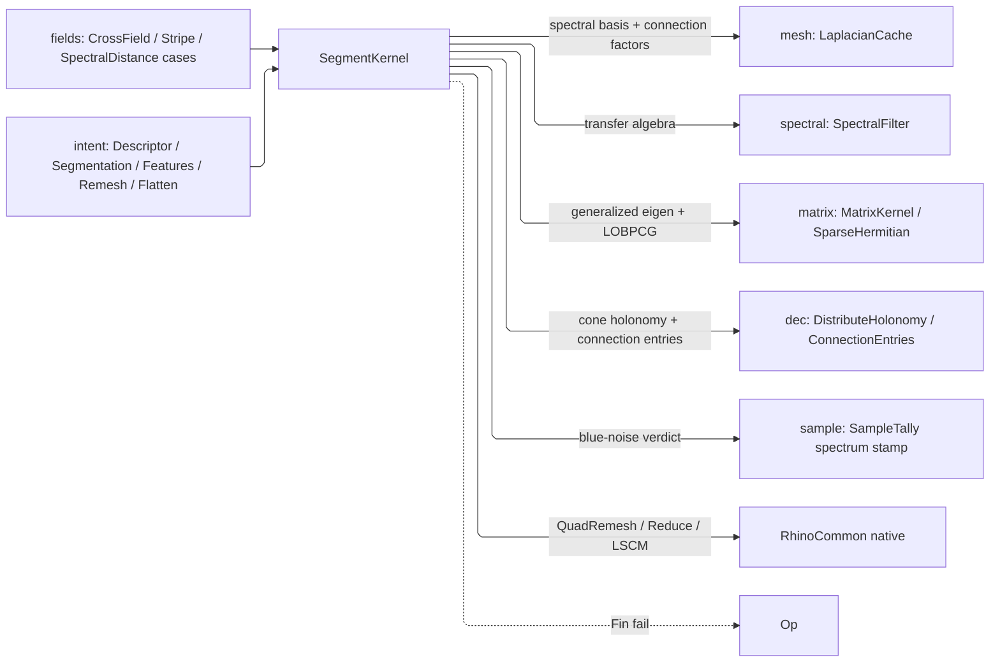

# [RASM_SHAPE_SEGMENT]

`SegmentKernel` owns spectral shape analysis and host-native restructure over the `mesh` substrate: spectral descriptors and distance, blue-noise sampling validation, feature-edge classification, `MeshSegmentation`, Knöppel globally-optimal direction fields with stripe patterns, and the RhinoCommon `QuadRemesh`/`Reduce`/LSCM restructure tier. Host restructure is capture — this page owns the native surface and never re-derives the first-principles counterparts.

Eigen systems ride the `matrix` owners — `MatrixKernel.GeneralizedEigenpairsDetailed` for normalized cuts, `SparseHermitian.SmallestEigenpairsDetailed` LOBPCG for the smoothest field; spectral bases and connection factors ride the `mesh` `LaplacianCache`, cone prescriptions the `dec` trivial-connection owner, sampling the `MeshProbe` substrate. Descriptor variants are each one `SpectralFilter` row and a segmentation algorithm one `MeshSegmentation` case; the `ScalarField.SpectralDistance`/`Stripe` and `VectorField.CrossField` cases delegate here.

## [01]-[INDEX]

- [02]-[DESCRIPTORS]: `MeshDescriptor` spectral descriptors, spectral distance, and the blue-noise sampling gate feeding the `sample` owner.
- [03]-[FEATURES]: dihedral and curvature feature-edge classification over `MeshFeatureKind` with scale-derived policy admission.
- [04]-[SEGMENTATION]: `MeshSegmentation` — one dispatch, one `Segmentation` evidence shape, over the shared scalar-derivation, adjacency, and component split.
- [05]-[DIRECTION_FIELDS]: Knöppel GODF cross fields and stripe patterns.
- [06]-[RESTRUCTURE]: host-native `QuadRemesh`/`Reduce` behind `RemeshKind` and native LSCM flatten with the distortion witness.

## [02]-[DESCRIPTORS]

- Owner: `MeshDescriptor` is one guarded `[ComplexValueObject]` over `(Filter, Sources, Policy)`, never a thinned ShapeDNA clone — the `spectral` `SpectralFilter` transfer algebra already spans the heat, wave, biharmonic, diffusion, and commute-time variants, so a descriptor variant is a filter row, a `MeshDescriptorKind` sibling enum re-listing filter names is the rejected duplicate vocabulary, and a one-case union around the same coordinates is a vacuous type test at every read.
- Entry: `DescribeShape<TOut>` projects output-typed through `ResultProjection` rows and computes the assembly witness ONLY when `TOut` carries it, so a value projection never pays a DEC build; `SpectralDistanceAt` and `ValidateSamplingSpectrum`, which stamps the blue-noise verdict into the `sample` result's tally, complete the arms.
- Auto: descriptors pull the cached `SpectralBasisBundle` — one generalized eigensolve per basis size per mesh snapshot, the cache-hit flag in `DescriptorSolve` — apply the filter, and project; the blue-noise gate bounds low-band energy against `SpectrumPolicy` — ceiling, basis cap, and low-mode count on one admitted value carrying its own provenance, never three page globals — and a total energy under the floor REFUSES rather than stamping a fabricated worst-case ratio.
- Boundary: output selection lives in `ProjectionRow` keys, so reflection branching in a solver body is the deleted form, and the ONE sanctioned entry-level type test is the lazy-assembly gate; the descriptor family is closed over the filter algebra.

```csharp
// --- [IMPORTS] -------------------------------------------------------------------------
using System;
using System.Collections.Generic;
using System.Linq;
using System.Numerics;
using System.Numerics.Tensors;
using System.Runtime.InteropServices;
using System.Threading;
using LanguageExt;
using QuikGraph;
using QuikGraph.Algorithms;
using QuikGraph.Collections;
using Rasm.Domain;
using Rasm.Meshing;
using Rasm.Numerics;
using Rasm.Spatial;
using Rhino;
using Rhino.Geometry;
using Thinktecture;
using static LanguageExt.Prelude;
using Dimension = Rasm.Numerics.Dimension;

namespace Rasm.Processing;

// --- [TYPES] ---------------------------------------------------------------------------
[ComplexValueObject]
public readonly partial struct MeshDescriptor {
    public SpectralFilter Filter { get; }
    public Option<Seq<int>> Sources { get; }
    public SpectralDescriptorPolicy Policy { get; }

    static partial void ValidateFactoryArguments(ref ValidationError? validationError, ref SpectralFilter filter, ref Option<Seq<int>> sources, ref SpectralDescriptorPolicy policy) =>
        validationError = filter is not null && policy.IsValid
            ? null
            : new ValidationError(string.Join(" | ", new object?[] { "MeshDescriptor admits a spectral filter under a valid descriptor policy." }));
    public static Fin<MeshDescriptor> Spectral(
        SpectralFilter filter,
        Option<Seq<int>> sources = default,
        Option<SpectralDescriptorPolicy> policy = default,
        Op? key = null) =>
        key.OrDefault().AcceptValidated<MeshDescriptor>(
            Validate(filter, sources, policy.IfNone(SpectralDescriptorPolicy.Raw), out MeshDescriptor value),
            value);
}


// --- [MODELS] --------------------------------------------------------------------------
[StructLayout(LayoutKind.Auto)]
public readonly record struct DescriptorSolve(
    DescriptorProfile Spectral, EigenSolution<double, Arr<double>> Eigen, bool Cached,
    int RequestedEigenpairs, int ReturnedEigenpairs,
    int SkippedDegenerateFaces = 0, Option<SpectralAssembly> Assembly = default) : IValidityEvidence {
    public bool IsValid => ValidityClaim.All(
        Spectral.IsValid,
        Eigen.IsValid,
        RequestedEigenpairs >= 1 && ReturnedEigenpairs > 0 && ReturnedEigenpairs <= RequestedEigenpairs,
        ValidityClaim.CountAtLeast(count: SkippedDegenerateFaces, floor: 0),
        ValidityClaim.Evidence(Assembly));
}

[StructLayout(LayoutKind.Auto)] public readonly record struct DescriptorResult(Arr<double> Values, DescriptorSolve Solve);

[StructLayout(LayoutKind.Auto)]
public readonly record struct SamplingSpectrum(
    int VertexCount, int SampleCount, int EigenpairCount,
    double LowFrequencyEnergy, double TotalEnergy, UnitInterval SuppressionRatio, UnitInterval ValidationThreshold) : IValidityEvidence {
    public bool Validated => SuppressionRatio.Value <= ValidationThreshold.Value;
    public bool IsValid => ValidityClaim.All(
        VertexCount >= 0 && SampleCount >= 0 && EigenpairCount >= 0,
        ValidityClaim.Nonnegative(value: LowFrequencyEnergy),
        ValidityClaim.Positive(value: TotalEnergy));
}

[StructLayout(LayoutKind.Auto)]
public readonly record struct SpectrumPolicy(UnitInterval LowFrequencyCeiling, Dimension BasisCap, Dimension LowModeCount) {
    public static readonly SpectrumPolicy Default = new(
        LowFrequencyCeiling: UnitInterval.Create(value: 0.5), BasisCap: Dimension.Create(value: 8), LowModeCount: Dimension.Create(value: 3));
    public static Fin<SpectrumPolicy> Of(double lowFrequencyCeiling, int basisCap, int lowModeCount, Op? key = null) =>
        key.OrDefault() switch {
            Op op => from ceiling in op.AcceptValidated<UnitInterval>(candidate: lowFrequencyCeiling)
                     from basis in op.AcceptValidated<Dimension>(candidate: basisCap)
                     from modes in op.AcceptValidated<Dimension>(candidate: lowModeCount)
                     from _ in guard(modes.Value <= basis.Value, op.InvalidInput())
                     select new SpectrumPolicy(LowFrequencyCeiling: ceiling, BasisCap: basis, LowModeCount: modes),
        };
}

// --- [OPERATIONS] ----------------------------------------------------------------------
internal static partial class SegmentKernel {
    internal static Fin<TOut> DescribeShape<TOut>(MeshSpace space, MeshDescriptor kind, int eigenpairs, Op key) =>
        from descriptor in DescribeSpectralShape(space: space, spec: kind, eigenpairs: eigenpairs,
            includeAssembly: typeof(TOut) == typeof(DescriptorResult) || typeof(TOut) == typeof(DescriptorSolve), key: key)
        from output in ProjectDescriptor<TOut>(descriptor: descriptor, key: key)
        select output;
    internal static Fin<DescriptorResult> DescribeSpectralShape(MeshSpace space, MeshDescriptor spec, int eigenpairs, Op key) =>
        DescribeSpectralShape(space: space, spec: spec, eigenpairs: eigenpairs, includeAssembly: false, key: key);
    private static Fin<DescriptorResult> DescribeSpectralShape(MeshSpace space, MeshDescriptor spec, int eigenpairs, bool includeAssembly, Op key) =>
        from bundle in space.Cache.SpectralBasisBundleOf(k: Dimension.Create(value: eigenpairs), key: key)
        from spectral in spec.Filter.Evaluate(basis: bundle.Basis, sources: spec.Sources, policy: spec.Policy, key: key)
        from assembly in includeAssembly ? DecAssembly.Build(space: space, key: key).Map(calculus => Some(calculus.Assembly)) : Fin.Succ(Option<SpectralAssembly>.None)
        select new DescriptorResult(Values: spectral.Values, Solve: new DescriptorSolve(Spectral: spectral.Profile, Eigen: bundle.Eigen, Cached: bundle.Cached, RequestedEigenpairs: eigenpairs, ReturnedEigenpairs: bundle.Eigen.ReturnedPairs, SkippedDegenerateFaces: bundle.SkippedDegenerateFaces, Assembly: assembly));
    private static Fin<TOut> ProjectDescriptor<TOut>(DescriptorResult descriptor, Op key) =>
        ResultProjection.Rows<DescriptorResult, TOut>(self: descriptor, key: key, owner: typeof(MeshDescriptor),
            ProjectionRow.Of<DescriptorSolve>(() => Fin.Succ(descriptor.Solve)),
            ProjectionRow.Of<SpectralDescriptor>(() => Fin.Succ(new SpectralDescriptor(Values: descriptor.Values, Profile: descriptor.Solve.Spectral))),
            ProjectionRow.Of<DescriptorProfile>(() => Fin.Succ(descriptor.Solve.Spectral)),
            ProjectionRow.Of<Arr<double>>(() => Fin.Succ(descriptor.Values)));

    internal static Fin<double> SpectralDistanceAt(MeshSpace space, SpectralFilter filter, Seq<int> sources, int pairs, Point3d sample, Op key) =>
        from bundle in space.Cache.SpectralBasisBundleOf(k: Dimension.Create(value: pairs), key: key)
        from descriptor in filter.Evaluate(basis: bundle.Basis, sources: sources.IsEmpty ? Option<Seq<int>>.None : Some(sources), key: key)
        from interpolated in MeshProbe.ScalarOn(space: space, sample: sample, perVertex: descriptor.Values, key: key)
        select interpolated;

    internal static Fin<SampleResult> ValidateSamplingSpectrum(MeshSpace space, SampleResult result, Op key, Option<SpectrumPolicy> policy = default) =>
        result.Points.IsEmpty || result.Tally.Algorithm.IsNone || space.Native.Vertices.Count < 3
            ? Fin.Succ(result)
            : policy.IfNone(SpectrumPolicy.Default) switch {
                SpectrumPolicy active =>
                    from bundle in space.Cache.SpectralBasisBundleOf(k: Dimension.Create(value: Math.Min(val1: active.BasisCap.Value, val2: Math.Max(val1: 1, val2: space.Native.Vertices.Count - 1))), key: key)
                    from spectrum in SamplingSpectrumOf(space: space, points: result.Points, basis: bundle.Basis, policy: active, key: key)
                    select result with { Tally = result.Tally with { Algorithm = result.Tally.Algorithm.Map(algorithm => algorithm with {
                        Assurances = spectrum.Validated ? algorithm.Assurances.With(SampleAssurance.MeshSpectrum) : algorithm.Assurances,
                        Spectrum = Some(spectrum) }) } },
            };
    private static Fin<SamplingSpectrum> SamplingSpectrumOf(MeshSpace space, Seq<Point3d> points, SpectralBasis basis, SpectrumPolicy policy, Op key) {
        int vertexCount = space.Native.Vertices.Count;
        if (basis.Eigenvectors.Count == 0 || points.IsEmpty) return Fin.Fail<SamplingSpectrum>(key.InvalidInput());
        double[] indicator = new double[vertexCount];
        return from _ in points.TraverseM(point => MeshProbe.ClosestFace(space: space, sample: point, key: key, project: (_, face, weights, _) => {
                   indicator[face.A] += weights[0]; indicator[face.B] += weights[1]; indicator[face.C] += weights[2];
                   if (face.IsQuad) indicator[face.D] += weights[3];
                   return Fin.Succ(unit);
               })).As()
               from bands in SpectralEnergy(basis: basis, indicator: indicator, vertexCount: vertexCount, lowModes: policy.LowModeCount.Value, key: key)
               from ratio in bands.Total > EpsilonPolicy.SqrtEpsilon
                   ? key.AcceptValue(value: bands.Low / bands.Total)
                   : Fin.Fail<double>(key.InvalidResult())
               from spectrum in Fin.Succ(new SamplingSpectrum(
                   VertexCount: vertexCount, SampleCount: points.Count, EigenpairCount: basis.Eigenvectors.Count,
                   LowFrequencyEnergy: bands.Low, TotalEnergy: bands.Total,
                   SuppressionRatio: UnitInterval.Create(value: Math.Max(val1: 0.0, val2: Math.Min(val1: 1.0, val2: ratio))),
                   ValidationThreshold: policy.LowFrequencyCeiling))
               from admitted in spectrum.IsValid ? Fin.Succ(spectrum) : Fin.Fail<SamplingSpectrum>(key.InvalidResult())
               select admitted;
    }
    private static Fin<(double Low, double Total)> SpectralEnergy(SpectralBasis basis, double[] indicator, int vertexCount, int lowModes, Op key) {
        int lowLimit = Math.Min(val1: lowModes, val2: basis.Eigenvectors.Count);
        double low = 0.0, total = 0.0;
        for (int mode = 0; mode < basis.Eigenvectors.Count; mode++) {
            Arr<double> eigenvector = basis.Eigenvectors[index: mode];
            if (eigenvector.Count != vertexCount) return Fin.Fail<(double, double)>(key.InvalidResult());
            double coefficient = TensorPrimitives.Dot<double>(indicator, [.. eigenvector.AsIterable()]);
            double energy = coefficient * coefficient;
            if (!double.IsFinite(x: energy)) return Fin.Fail<(double, double)>(key.InvalidResult());
            total += energy;
            if (mode < lowLimit) low += energy;
        }
        return Fin.Succ((Low: low, Total: total));
    }
}
```

## [03]-[FEATURES]

- Owner: `MeshFeatureKind` the edge taxonomy and `FeatureEdges.Census` its one per-kind count stream; `MeshFeaturePolicy` derives the curvature threshold and smoothing scale from the mean edge length at admission while the dihedral threshold stays caller intent, and optional per-face regions turn region boundaries into features.
- Entry: `DetectFeatureEdgesDetailed` seats the derived policy from a dihedral angle or admits a full policy — one concept, input-shape discrimination.
- Auto: topology edges classify by connected-face census, then smooth two-face edges classify by the signed dihedral against the threshold — ridge or valley when the length-normalized curvature signal also clears the curvature threshold, plain crease otherwise; region-boundary classification precedes the angle tests when face regions are declared, and the curvature signal is endpoint-smoothed against single-edge noise, so a raw per-edge threshold is the rejected form.
- Boundary: ngon interiors are counted and skipped, never dropped, and the below-threshold remainder lands in `UnclassifiedEdges`; `FeatureEdges`'s own gate enforces both census reconciliations, so totality is recomputable from its fields, never a prose promise; per-face normals ride the memoized `MeshSpace.FaceNormals` column on the `Fin` result, so detection never mutates the frozen snapshot.

```csharp
// --- [TYPES] ---------------------------------------------------------------------------
[SmartEnum<int>]
public sealed partial class MeshFeatureKind {
    public static readonly MeshFeatureKind Boundary = new(key: 0);
    public static readonly MeshFeatureKind Crease = new(key: 1);
    public static readonly MeshFeatureKind NonManifold = new(key: 2);
    public static readonly MeshFeatureKind Unwelded = new(key: 3);
    public static readonly MeshFeatureKind NgonInteriorSkipped = new(key: 4);
    public static readonly MeshFeatureKind Ridge = new(key: 5);
    public static readonly MeshFeatureKind Valley = new(key: 6);
    public static readonly MeshFeatureKind RegionBoundary = new(key: 7);
}

// --- [MODELS] --------------------------------------------------------------------------
[StructLayout(LayoutKind.Auto)]
public readonly record struct FeatureVerdict(MeshFeatureKind Kind, Option<double> DihedralRadians, Option<double> SignedDihedralRadians, Option<double> CurvatureSignal) {
    internal static FeatureVerdict Topological(MeshFeatureKind kind) => new(Kind: kind, DihedralRadians: None, SignedDihedralRadians: None, CurvatureSignal: None);
}

[StructLayout(LayoutKind.Auto)] public readonly record struct FeatureEdge(int A, int B, FeatureVerdict Verdict);

[StructLayout(LayoutKind.Auto)]
public readonly record struct FeatureEdges(
    Seq<FeatureEdge> Edges, HashMap<MeshFeatureKind, int> Census, double DihedralThresholdRadians, int UnclassifiedEdges = 0,
    double CurvatureThreshold = 0.0, double SmoothingScale = 0.0, int CurvatureFiniteVertices = 0,
    int TopologyVertexCount = 0, int TopologyEdgeCount = 0) : IValidityEvidence {
    public int CurvatureRejectedVertices => Math.Max(val1: 0, val2: TopologyVertexCount - CurvatureFiniteVertices);
    public int CountOf(MeshFeatureKind kind) => Census.Find(key: kind).IfNone(0);
    public bool IsValid => ValidityClaim.All(
        Census.Values.All(static count => count >= 0) && UnclassifiedEdges >= 0,
        CurvatureFiniteVertices >= 0 && TopologyVertexCount >= CurvatureFiniteVertices,
        ValidityClaim.Nonnegative(value: DihedralThresholdRadians),
        ValidityClaim.Nonnegative(value: CurvatureThreshold),
        ValidityClaim.Nonnegative(value: SmoothingScale),
        ValidityClaim.CountExactly(count: Edges.Count, expected: Census.Values.Sum()),
        ValidityClaim.CountExactly(count: TopologyEdgeCount, expected: Edges.Count + UnclassifiedEdges));
    internal Fin<TOut> Project<TOut>(Op key) {
        FeatureEdges self = this;
        return ResultProjection.Rows<FeatureEdges, TOut>(self: self, key: key,
            ProjectionRow.Of<Seq<FeatureEdge>>(() => Fin.Succ(self.Edges)),
            ProjectionRow.Of<Seq<(int A, int B)>>(() => Fin.Succ(toSeq(self.Edges.AsIterable()
                .Where(static edge => !edge.Verdict.Kind.Equals(MeshFeatureKind.NgonInteriorSkipped))
                .Select(static edge => (edge.A, edge.B))))));
    }
}

[StructLayout(LayoutKind.Auto)]
public readonly record struct MeshFeaturePolicy(VectorAngle DihedralThreshold, PositiveMagnitude CurvatureThreshold, PositiveMagnitude SmoothingScale, Option<Arr<int>> FaceRegions) {
    internal static Fin<MeshFeaturePolicy> Of(double dihedralRadians, MeshSpace space, Option<Arr<int>> faceRegions, Op key) =>
        from dihedral in key.AcceptValidated<VectorAngle>(candidate: dihedralRadians)
        from _ in guard(dihedral.Value > EpsilonPolicy.ZeroTolerance, key.InvalidInput())
        let meanEdge = space.Cache.MeanEdgeLength
        from curvature in key.AcceptValidated<PositiveMagnitude>(candidate: 1.0 / Math.Max(val1: meanEdge, val2: space.Tolerance.Absolute.Value))
        from smooth in key.AcceptValidated<PositiveMagnitude>(candidate: Math.Max(val1: meanEdge, val2: space.Tolerance.Absolute.Value))
        from policy in new MeshFeaturePolicy(DihedralThreshold: dihedral, CurvatureThreshold: curvature, SmoothingScale: smooth, FaceRegions: faceRegions).Admit(space: space, key: key)
        select policy;
    internal Fin<MeshFeaturePolicy> Admit(MeshSpace space, Op key) {
        MeshFeaturePolicy self = this;
        return (from dihedral in key.AcceptValidated<VectorAngle>(candidate: self.DihedralThreshold.Value)
                from _ in guard(dihedral.Value > EpsilonPolicy.ZeroTolerance, key.InvalidInput())
                from curvature in key.AcceptValidated<PositiveMagnitude>(candidate: self.CurvatureThreshold.Value)
                from smooth in key.AcceptValidated<PositiveMagnitude>(candidate: self.SmoothingScale.Value)
                select new MeshFeaturePolicy(DihedralThreshold: dihedral, CurvatureThreshold: curvature, SmoothingScale: smooth, FaceRegions: self.FaceRegions))
            .Bind(policy => policy.FaceRegions.Match(
                Some: active => guard(active.Count == space.Native.Faces.Count, key.InvalidInput()).ToFin().Map(_ => policy),
                None: () => Fin.Succ(policy)));
    }
}

// --- [OPERATIONS] ----------------------------------------------------------------------
internal static partial class SegmentKernel {
    private readonly record struct FeatureCurvatureSignals(Arr<Option<double>> Edge, int FiniteVertices);

    internal static Fin<FeatureEdges> DetectFeatureEdgesDetailed(MeshSpace space, double dihedralRadians, Op key) =>
        from policy in MeshFeaturePolicy.Of(dihedralRadians: dihedralRadians, space: space, faceRegions: Option<Arr<int>>.None, key: key)
        from features in DetectFeatureEdgesDetailed(space: space, policy: policy, key: key)
        select features;
    internal static Fin<FeatureEdges> DetectFeatureEdgesDetailed(MeshSpace space, MeshFeaturePolicy policy, Op key) =>
        policy.Admit(space: space, key: key).Bind(activePolicy => space.FaceNormals(key: key).Map(faceNormals => {
            Mesh mesh = space.Native;
            FeatureCurvatureSignals curvature = EdgeCurvatureSignals(mesh: mesh, faceNormals: faceNormals, smoothingScale: activePolicy.SmoothingScale.Value);
            List<FeatureEdge> features = new(capacity: mesh.TopologyEdges.Count);
            HashMap<MeshFeatureKind, int> census = HashMap<MeshFeatureKind, int>.Empty;
            int unclassified = 0;
            for (int e = 0; e < mesh.TopologyEdges.Count; e++) {
                int[] faces = mesh.TopologyEdges.GetConnectedFaces(topologyEdgeIndex: e);
                IndexPair p = mesh.TopologyEdges.GetTopologyVertices(topologyEdgeIndex: e);
                Option<FeatureVerdict> feature = faces.Length switch {
                    1 => Some(FeatureVerdict.Topological(MeshFeatureKind.Boundary)),
                    > 2 => Some(FeatureVerdict.Topological(MeshFeatureKind.NonManifold)),
                    2 when mesh.TopologyEdges.IsEdgeUnwelded(topologyEdgeIndex: e) => Some(FeatureVerdict.Topological(MeshFeatureKind.Unwelded)),
                    2 when mesh.TopologyEdges.IsNgonInterior(topologyEdgeIndex: e) => Some(FeatureVerdict.Topological(MeshFeatureKind.NgonInteriorSkipped)),
                    2 => ClassifySmoothFeature(mesh: mesh, edge: e, faces: faces, faceNormals: faceNormals, policy: activePolicy, edgeCurvature: curvature.Edge[index: e]),
                    _ => None,
                };
                if (feature.Case is not FeatureVerdict verdict) { unclassified++; continue; }
                features.Add(item: new FeatureEdge(A: p.I, B: p.J, Verdict: verdict));
                census = census.AddOrUpdate(key: verdict.Kind, Some: static count => count + 1, None: static () => 1);
            }
            return new FeatureEdges(Edges: toSeq(features), Census: census, DihedralThresholdRadians: activePolicy.DihedralThreshold.Value, UnclassifiedEdges: unclassified,
                CurvatureThreshold: activePolicy.CurvatureThreshold.Value, SmoothingScale: activePolicy.SmoothingScale.Value,
                CurvatureFiniteVertices: curvature.FiniteVertices, TopologyVertexCount: mesh.TopologyVertices.Count, TopologyEdgeCount: mesh.TopologyEdges.Count);
        }));
    private static Option<FeatureVerdict> ClassifySmoothFeature(Mesh mesh, int edge, int[] faces, Arr<Vector3d> faceNormals, MeshFeaturePolicy policy, Option<double> edgeCurvature) {
        double rawAngle = Vector3d.VectorAngle(a: faceNormals[index: faces[0]], b: faceNormals[index: faces[1]]);
        double signedAngle = SignedDihedral(mesh: mesh, edge: edge, faces: faces, faceNormals: faceNormals, angle: rawAngle);
        FeatureVerdict Measured(MeshFeatureKind kind) => new(
            Kind: kind,
            DihedralRadians: double.IsFinite(x: rawAngle) ? Some(rawAngle) : None,
            SignedDihedralRadians: double.IsFinite(x: signedAngle) ? Some(signedAngle) : None,
            CurvatureSignal: edgeCurvature);
        if (policy.FaceRegions.Exists(regions => regions[index: faces[0]] != regions[index: faces[1]]))
            return Some(Measured(MeshFeatureKind.RegionBoundary));
        if (!double.IsFinite(x: rawAngle)) return None;
        bool highCurvature = edgeCurvature.Exists(signal => signal >= policy.CurvatureThreshold.Value);
        if (highCurvature && Math.Abs(value: signedAngle) >= policy.DihedralThreshold.Value)
            return Some(Measured(signedAngle >= 0.0 ? MeshFeatureKind.Ridge : MeshFeatureKind.Valley));
        return rawAngle >= policy.DihedralThreshold.Value ? Some(Measured(MeshFeatureKind.Crease)) : None;
    }
    private static double SignedDihedral(Mesh mesh, int edge, int[] faces, Arr<Vector3d> faceNormals, double angle) {
        Line line = mesh.TopologyEdges.EdgeLine(topologyEdgeIndex: edge);
        if (!line.IsValid) return angle;
        Vector3d axis = line.To - line.From;
        if (!axis.Unitize()) return angle;
        double sign = Vector3d.CrossProduct(a: faceNormals[index: faces[0]], b: faceNormals[index: faces[1]]) * axis;
        return sign < 0.0 ? -angle : angle;
    }
    private static FeatureCurvatureSignals EdgeCurvatureSignals(Mesh mesh, Arr<Vector3d> faceNormals, double smoothingScale) {
        Option<double>[] edgeSignals = [.. Enumerable.Repeat(element: Option<double>.None, count: mesh.TopologyEdges.Count)];
        double[] edgeLengths = new double[mesh.TopologyEdges.Count];
        double[] vertexSum = new double[mesh.TopologyVertices.Count];
        int[] vertexCount = new int[mesh.TopologyVertices.Count];
        for (int e = 0; e < mesh.TopologyEdges.Count; e++) {
            int[] faces = mesh.TopologyEdges.GetConnectedFaces(topologyEdgeIndex: e);
            Line line = mesh.TopologyEdges.EdgeLine(topologyEdgeIndex: e);
            if (faces.Length != 2 || !line.IsValid) continue;
            double length = line.Length;
            if (!double.IsFinite(x: length) || length <= EpsilonPolicy.SqrtEpsilon) continue;
            double angle = Vector3d.VectorAngle(a: faceNormals[index: faces[0]], b: faceNormals[index: faces[1]]);
            if (!double.IsFinite(x: angle)) continue;
            double signal = Math.Abs(value: angle) / length;
            edgeSignals[e] = Some(signal); edgeLengths[e] = length;
            IndexPair pair = mesh.TopologyEdges.GetTopologyVertices(topologyEdgeIndex: e);
            if (pair.I >= 0 && pair.I < vertexSum.Length) { vertexSum[pair.I] += signal; vertexCount[pair.I]++; }
            if (pair.J >= 0 && pair.J < vertexSum.Length) { vertexSum[pair.J] += signal; vertexCount[pair.J]++; }
        }
        for (int e = 0; e < mesh.TopologyEdges.Count; e++) {
            if (edgeSignals[e].Case is not double raw || edgeLengths[e] <= EpsilonPolicy.SqrtEpsilon) continue;
            IndexPair pair = mesh.TopologyEdges.GetTopologyVertices(topologyEdgeIndex: e);
            if (pair.I < 0 || pair.J < 0 || pair.I >= vertexSum.Length || pair.J >= vertexSum.Length || vertexCount[pair.I] == 0 || vertexCount[pair.J] == 0) continue;
            double endpointMean = ((vertexSum[pair.I] / vertexCount[pair.I]) + (vertexSum[pair.J] / vertexCount[pair.J])) * 0.5;
            double blend = edgeLengths[e] / Math.Max(val1: edgeLengths[e] + smoothingScale, val2: EpsilonPolicy.SqrtEpsilon);
            edgeSignals[e] = Some((blend * raw) + ((1.0 - blend) * endpointMean));
        }
        return new FeatureCurvatureSignals(Edge: new Arr<Option<double>>(edgeSignals), FiniteVertices: vertexCount.Count(static count => count > 0));
    }
}
```

## [04]-[SEGMENTATION]

- Owner: `MeshSegmentation` `[Union]` carries one case per algorithm with monadic factories internalizing admission; `Segmentation` is the one evidence record for every algorithm, and `MeshSegmentationResult` carries face regions, majority-vote vertex regions, and the segmentation.
- Cases: a new algorithm is one union case and one dispatch arm.
- Entry: `Segment<TOut>` folds a generated total `Switch` over the union, projecting through `ResultProjection` rows — one entry, the algorithm is the case, `TOut` is the projection.
- Auto: every algorithm shares ONE scalar derivation, ONE memoized frozen face-adjacency graph, and ONE connected-component split, so a per-algorithm re-derivation is the deleted form; the normalized-cut affinity `σ` is scale-derived from the value range over `√faceCount`, never a knob, and clustering is deterministic farthest-first k-means with no RNG, and both round folds ride `Cell.Converge` — each step commits its explicit settlement fact, so no hand `while` shadows the schedule and normal completion never borrows `Refused`.
- Law: one `Segmentation` shape carries every algorithm — algorithm-specific evidence rides `Option` columns, never sibling types.
- Boundary: `UnassignedRegion = -1` is the interior packing alone — `RegionLabel` admits nonnegative ordinals and the result publishes `Option<RegionLabel>`, so absence never crosses the boundary as an int a consumer must decode by prose; a NaN scalar is a MASK the algorithms census and segment around, so a partial field segments its defined region; every factory admits through the `Op` gate, so an invalid request never constructs.

```csharp
// --- [TYPES] ---------------------------------------------------------------------------
[Union]
public abstract partial record MeshScalars {
    private MeshScalars() { }
    public sealed record PerVertexCase(Arr<double> Values) : MeshScalars;
    public sealed record PerFaceCase(Arr<double> Values) : MeshScalars;
    public static Fin<MeshScalars> PerVertex(Arr<double> values, Op? key = null) => Admit(candidate: new PerVertexCase(Values: values), key: key.OrDefault());
    public static Fin<MeshScalars> PerFace(Arr<double> values, Op? key = null) => Admit(candidate: new PerFaceCase(Values: values), key: key.OrDefault());
    public Arr<double> Values => Switch(perVertexCase: static row => row.Values, perFaceCase: static row => row.Values);
    internal int Expected(Mesh mesh) => Switch(state: mesh, perVertexCase: static (m, _) => m.Vertices.Count, perFaceCase: static (m, _) => m.Faces.Count);
    internal double FaceValue(MeshFace face, int index) => Switch(
        state: (Face: face, Index: index),
        perVertexCase: static (s, row) => ((row.Values[index: s.Face.A] + row.Values[index: s.Face.B] + row.Values[index: s.Face.C])
            + (s.Face.IsQuad ? row.Values[index: s.Face.D] : 0.0)) / (s.Face.IsQuad ? 4.0 : 3.0),
        perFaceCase: static (s, row) => row.Values[index: s.Index]);
    private static Fin<MeshScalars> Admit(MeshScalars candidate, Op key) =>
        candidate.Values.Count == 0 || !candidate.Values.AsIterable().Any(double.IsFinite)
            ? Fin.Fail<MeshScalars>(key.InvalidInput())
            : Fin.Succ(candidate);
}

[Union]
public abstract partial record MeshSegmentation {
    private MeshSegmentation() { }
    public sealed record ScalarThresholdCase(MeshScalars Values, double Threshold, ExtremumDirection Direction) : MeshSegmentation;
    public sealed record ScalarBandsCase(MeshScalars Values, Dimension BandCount) : MeshSegmentation;
    public sealed record SeededRegionGrowCase(MeshScalars Values, Seq<int> SeedFaces, PositiveMagnitude Tolerance, Dimension MaxIterations) : MeshSegmentation;
    public sealed record DescriptorClustersCase(MeshDescriptor Descriptor, Dimension Eigenpairs, Dimension RegionCount, Dimension MaxIterations, PositiveMagnitude Tolerance) : MeshSegmentation;
    public sealed record WatershedCase(MeshScalars Values, PositiveMagnitude MergeTolerance) : MeshSegmentation;
    public sealed record NormalizedCutCase(MeshScalars Values, Dimension RegionCount, Dimension Eigenpairs, Dimension MaxIterations, PositiveMagnitude Tolerance) : MeshSegmentation;
    public static Fin<MeshSegmentation> ScalarThreshold(MeshScalars values, double threshold, Option<ExtremumDirection> direction = default, Op? key = null) =>
        key.OrDefault() switch { Op op => from _ in op.Finite(value: threshold)
                                          select (MeshSegmentation)new ScalarThresholdCase(Values: values, Threshold: threshold, Direction: direction.IfNone(ExtremumDirection.Maximum)) };
    public static Fin<MeshSegmentation> ScalarBands(MeshScalars values, int bandCount, Op? key = null) =>
        key.OrDefault() switch { Op op => from count in op.AcceptValidated<Dimension>(candidate: bandCount) from _ in guard(bandCount > 1, op.InvalidInput()) select (MeshSegmentation)new ScalarBandsCase(Values: values, BandCount: count) };
    public static Fin<MeshSegmentation> SeededRegionGrow(MeshScalars values, Seq<int> seedFaces, double tolerance, int maxIterations, Op? key = null) =>
        key.OrDefault() switch { Op op => from _ in guard(!seedFaces.IsEmpty, op.InvalidInput()) from eps in op.AcceptValidated<PositiveMagnitude>(candidate: tolerance) from cap in op.AcceptValidated<Dimension>(candidate: maxIterations) select (MeshSegmentation)new SeededRegionGrowCase(Values: values, SeedFaces: seedFaces, Tolerance: eps, MaxIterations: cap) };
    public static Fin<MeshSegmentation> DescriptorClusters(MeshDescriptor descriptor, int eigenpairs, int regionCount, int maxIterations, double tolerance, Op? key = null) =>
        key.OrDefault() switch { Op op => from active in Optional(descriptor).ToFin(op.InvalidInput()) from _ in guard(active.IsValid, op.InvalidInput()) from pairs in op.AcceptValidated<Dimension>(candidate: eigenpairs) from regions in op.AcceptValidated<Dimension>(candidate: regionCount) from __ in guard(regionCount > 1, op.InvalidInput()) from cap in op.AcceptValidated<Dimension>(candidate: maxIterations) from eps in op.AcceptValidated<PositiveMagnitude>(candidate: tolerance) select (MeshSegmentation)new DescriptorClustersCase(Descriptor: active, Eigenpairs: pairs, RegionCount: regions, MaxIterations: cap, Tolerance: eps) };
    public static Fin<MeshSegmentation> Watershed(MeshScalars values, double mergeTolerance, Op? key = null) =>
        key.OrDefault() switch { Op op => from tolerance in op.AcceptValidated<PositiveMagnitude>(candidate: mergeTolerance) select (MeshSegmentation)new WatershedCase(Values: values, MergeTolerance: tolerance) };
    public static Fin<MeshSegmentation> NormalizedCut(MeshScalars values, int regionCount, int eigenpairs, int maxIterations, double tolerance, Op? key = null) =>
        key.OrDefault() switch { Op op => from regions in op.AcceptValidated<Dimension>(candidate: regionCount) from _ in guard(regionCount > 1, op.InvalidInput()) from pairs in op.AcceptValidated<Dimension>(candidate: eigenpairs) from __ in guard(eigenpairs > 1, op.InvalidInput()) from cap in op.AcceptValidated<Dimension>(candidate: maxIterations) from eps in op.AcceptValidated<PositiveMagnitude>(candidate: tolerance) select (MeshSegmentation)new NormalizedCutCase(Values: values, RegionCount: regions, Eigenpairs: pairs, MaxIterations: cap, Tolerance: eps) };
}

[SmartEnum<int>]
public sealed partial class MeshSegmentationAlgorithm {
    public static readonly MeshSegmentationAlgorithm ScalarThresholdComponents = new(key: 0);
    public static readonly MeshSegmentationAlgorithm ScalarBandComponents = new(key: 1);
    public static readonly MeshSegmentationAlgorithm SeededRegionGrow = new(key: 2);
    public static readonly MeshSegmentationAlgorithm DescriptorScalarClusters = new(key: 3);
    public static readonly MeshSegmentationAlgorithm WatershedBasins = new(key: 4);
    public static readonly MeshSegmentationAlgorithm NormalizedCut = new(key: 5);
}

[ValueObject<int>]
public readonly partial struct RegionLabel {
    static partial void ValidateFactoryArguments(ref ValidationError? validationError, ref int value) =>
        validationError = value >= 0 ? null : new ValidationError(string.Join(" | ", new object?[] { "RegionLabel admits a nonnegative region ordinal." }));
    internal static Option<RegionLabel> Of(int packed) => packed >= 0 ? Some(Create(packed)) : Option<RegionLabel>.None;
}

[SmartEnum<int>]
public sealed partial class MeshSegmentationStatus {
    public static readonly MeshSegmentationStatus Completed = new(key: 0);
    public static readonly MeshSegmentationStatus MaxIterationsExhausted = new(key: 1);
}

// --- [MODELS] --------------------------------------------------------------------------
[StructLayout(LayoutKind.Auto)]
public readonly record struct Segmentation(
    MeshSegmentationAlgorithm Algorithm, MeshSegmentationStatus Status, int RequestedRegionCount, int RegionCount, int SeedCount,
    int AssignedFaceCount, int UnassignedFaceCount, int SkippedDegenerateFaces, int SkippedNonFiniteValues, Option<int> Iterations,
    Option<int> MaxIterations, Option<double> Tolerance, Option<double> Threshold, Option<DescriptorSolve> Descriptor, Option<LinearSolution> Solve,
    Option<double> NormalizedCutValue = default, Option<int> AffinityNonZeros = default, Option<int> WatershedSaddleCount = default,
    Option<EigenSolution<double, Arr<double>>> Eigen = default) : IValidityEvidence {
    public bool IsValid {
        get {
            Option<int> maxIterations = MaxIterations;
            return ValidityClaim.All(
                Algorithm is not null && Status is not null,
                RequestedRegionCount >= 0 && RegionCount >= 0 && SeedCount >= 0 && AssignedFaceCount >= 0 && UnassignedFaceCount >= 0 && SkippedDegenerateFaces >= 0 && SkippedNonFiniteValues >= 0,
                Iterations.Map(iter => iter >= 0 && maxIterations.Map(max => max >= iter).IfNone(noneValue: true)).IfNone(noneValue: true),
                AffinityNonZeros.Map(static count => count >= 0).IfNone(noneValue: true) && WatershedSaddleCount.Map(static count => count >= 0).IfNone(noneValue: true),
                Tolerance.Map(static value => double.IsFinite(value) && value >= 0.0).IfNone(noneValue: true) && Threshold.Map(double.IsFinite).IfNone(noneValue: true) && NormalizedCutValue.Map(static value => double.IsFinite(value) && value >= 0.0).IfNone(noneValue: true),
                ValidityClaim.Evidence(Descriptor), ValidityClaim.Evidence(Solve), ValidityClaim.Evidence(Eigen));
        }
    }
}

[StructLayout(LayoutKind.Auto)] public readonly record struct MeshSegmentationResult(Arr<Option<RegionLabel>> FaceRegions, Arr<Option<RegionLabel>> VertexRegions, Segmentation Segmentation);

// --- [OPERATIONS] ----------------------------------------------------------------------
internal static partial class SegmentKernel {
    private const int UnassignedRegion = -1;
    [StructLayout(LayoutKind.Auto)] private readonly record struct FaceAdjacencyKey();
    private readonly record struct SegmentationScalars(Arr<double> FaceValues, int SkippedDegenerateFaces, int SkippedNonFiniteValues, int FiniteCount, Option<(double Min, double Max)> Band);
    private readonly record struct SegmentationRun(MeshSegmentationAlgorithm Algorithm, int RequestedRegionCount, int SeedCount, MeshSegmentationStatus Status, Option<int> Iterations, Option<int> MaxIterations, Option<double> Tolerance, Option<double> Threshold, Option<DescriptorSolve> Descriptor, Option<LinearSolution> Solve = default, Option<double> NormalizedCutValue = default, Option<int> AffinityNonZeros = default, Option<int> WatershedSaddleCount = default, Option<EigenSolution<double, Arr<double>>> Eigen = default);
    private readonly record struct WatershedState(int[] Regions, int SeedCount, int SaddleCount);
    private readonly record struct ClusterState(int[] Labels, double[] Centers, int Iterations, bool Converged);
    private readonly record struct NormalizedCutSystem(SparseMatrix Laplacian, SparseMatrix Degree, int AffinityNonZeros, double Sigma);

    internal static Fin<TOut> Segment<TOut>(MeshSpace space, MeshSegmentation kind, Op key) =>
        kind.Switch(
            state: (Space: space, Key: key),
            scalarThresholdCase: static (state, threshold) =>
                from scalars in SegmentationScalarsOf(mesh: state.Space.Native, scalars: threshold.Values, key: state.Key)
                from adjacency in FaceAdjacency(space: state.Space, key: state.Key)
                select ComponentsOf(mesh: state.Space.Native, adjacency: adjacency, scalars: scalars, bucket: value => threshold.Direction.Within(candidate: value, best: threshold.Threshold, band: 0.0) ? 0 : UnassignedRegion,
                    run: new SegmentationRun(Algorithm: MeshSegmentationAlgorithm.ScalarThresholdComponents, RequestedRegionCount: 1, SeedCount: 0, Status: MeshSegmentationStatus.Completed, Iterations: Option<int>.None, MaxIterations: Option<int>.None, Tolerance: Option<double>.None, Threshold: Some(threshold.Threshold), Descriptor: Option<DescriptorSolve>.None)),
            scalarBandsCase: static (state, bands) =>
                from scalars in SegmentationScalarsOf(mesh: state.Space.Native, scalars: bands.Values, key: state.Key)
                from band in scalars.Band.ToFin(state.Key.InvalidInput())
                from adjacency in FaceAdjacency(space: state.Space, key: state.Key)
                select ComponentsOf(mesh: state.Space.Native, adjacency: adjacency, scalars: scalars, bucket: value => BandIndexOf(value: value, band: band, count: bands.BandCount.Value),
                    run: new SegmentationRun(Algorithm: MeshSegmentationAlgorithm.ScalarBandComponents, RequestedRegionCount: bands.BandCount.Value, SeedCount: 0, Status: MeshSegmentationStatus.Completed, Iterations: Option<int>.None, MaxIterations: Option<int>.None, Tolerance: Option<double>.None, Threshold: Option<double>.None, Descriptor: Option<DescriptorSolve>.None)),
            seededRegionGrowCase: static (state, grow) =>
                from scalars in SegmentationScalarsOf(mesh: state.Space.Native, scalars: grow.Values, key: state.Key)
                from adjacency in FaceAdjacency(space: state.Space, key: state.Key)
                from labels in RegionGrowLabels(mesh: state.Space.Native, adjacency: adjacency, scalars: scalars.FaceValues, seeds: grow.SeedFaces, tolerance: grow.Tolerance.Value, budget: grow.MaxIterations, key: state.Key)
                select ResultOf(mesh: state.Space.Native, faceRegions: labels.Regions, scalars: scalars,
                    run: new SegmentationRun(Algorithm: MeshSegmentationAlgorithm.SeededRegionGrow, RequestedRegionCount: labels.SeedCount, SeedCount: labels.SeedCount, Status: labels.Status, Iterations: Some(labels.Iterations), MaxIterations: Some(grow.MaxIterations.Value), Tolerance: Some(grow.Tolerance.Value), Threshold: Option<double>.None, Descriptor: Option<DescriptorSolve>.None)),
            descriptorClustersCase: static (state, clusters) =>
                from descriptor in DescribeSpectralShape(space: state.Space, spec: clusters.Descriptor, eigenpairs: clusters.Eigenpairs.Value, key: state.Key)
                from field in MeshScalars.PerVertex(values: descriptor.Values, key: state.Key)
                from scalars in SegmentationScalarsOf(mesh: state.Space.Native, scalars: field, key: state.Key)
                from kmeans in ClusterLabels(values: scalars.FaceValues, count: clusters.RegionCount.Value, maxIterations: clusters.MaxIterations, tolerance: clusters.Tolerance.Value, key: state.Key)
                from adjacency in FaceAdjacency(space: state.Space, key: state.Key)
                let labels = ConnectedComponents(adjacency: adjacency, buckets: kmeans.Labels)
                select ResultOf(mesh: state.Space.Native, faceRegions: labels, scalars: scalars,
                    run: new SegmentationRun(Algorithm: MeshSegmentationAlgorithm.DescriptorScalarClusters, RequestedRegionCount: clusters.RegionCount.Value, SeedCount: 0, Status: kmeans.Converged ? MeshSegmentationStatus.Completed : MeshSegmentationStatus.MaxIterationsExhausted, Iterations: Some(kmeans.Iterations), MaxIterations: Some(clusters.MaxIterations.Value), Tolerance: Some(clusters.Tolerance.Value), Threshold: Option<double>.None, Descriptor: Some(descriptor.Solve))),
            watershedCase: static (state, watershed) =>
                from scalars in SegmentationScalarsOf(mesh: state.Space.Native, scalars: watershed.Values, key: state.Key)
                from _ in guard(scalars.FiniteCount > 0, state.Key.InvalidInput())
                from adjacency in FaceAdjacency(space: state.Space, key: state.Key)
                let basins = WatershedLabels(faceCount: state.Space.Native.Faces.Count, adjacency: adjacency, scalars: scalars.FaceValues, mergeTolerance: watershed.MergeTolerance.Value)
                select ResultOf(mesh: state.Space.Native, faceRegions: basins.Regions, scalars: scalars,
                    run: new SegmentationRun(Algorithm: MeshSegmentationAlgorithm.WatershedBasins, RequestedRegionCount: basins.SeedCount, SeedCount: basins.SeedCount, Status: MeshSegmentationStatus.Completed, Iterations: Option<int>.None, MaxIterations: Option<int>.None, Tolerance: Some(watershed.MergeTolerance.Value), Threshold: Option<double>.None, Descriptor: Option<DescriptorSolve>.None, WatershedSaddleCount: Some(basins.SaddleCount))),
            normalizedCutCase: static (state, cut) =>
                from scalars in SegmentationScalarsOf(mesh: state.Space.Native, scalars: cut.Values, key: state.Key)
                from _ in guard(scalars.FiniteCount >= cut.RegionCount.Value, state.Key.InvalidInput())
                from adjacency in FaceAdjacency(space: state.Space, key: state.Key)
                from system in NormalizedCutSystemOf(adjacency: adjacency, scalars: scalars.FaceValues, tolerance: cut.Tolerance.Value, key: state.Key)
                from eigen in MatrixKernel.GeneralizedEigenpairsDetailed(stiffness: system.Laplacian, mass: system.Degree, k: Math.Min(val1: cut.Eigenpairs.Value, val2: Math.Max(val1: 1, val2: state.Space.Native.Faces.Count - 1)), key: state.Key)
                from projection in FiedlerProjection(eigen: eigen, expectedCount: scalars.FaceValues.Count, key: state.Key)
                let masked = MaskByScalars(projection: projection, scalars: scalars.FaceValues)
                from kmeans in ClusterLabels(values: masked, count: cut.RegionCount.Value, maxIterations: cut.MaxIterations, tolerance: cut.Tolerance.Value, key: state.Key)
                let labels = ConnectedComponents(adjacency: adjacency, buckets: kmeans.Labels)
                select ResultOf(mesh: state.Space.Native, faceRegions: labels, scalars: scalars,
                    run: new SegmentationRun(Algorithm: MeshSegmentationAlgorithm.NormalizedCut, RequestedRegionCount: cut.RegionCount.Value, SeedCount: 0, Status: kmeans.Converged ? MeshSegmentationStatus.Completed : MeshSegmentationStatus.MaxIterationsExhausted, Iterations: Some(kmeans.Iterations), MaxIterations: Some(cut.MaxIterations.Value), Tolerance: Some(cut.Tolerance.Value), Threshold: Option<double>.None, Descriptor: Option<DescriptorSolve>.None, NormalizedCutValue: NormalizedCutValue(adjacency: adjacency, scalars: scalars.FaceValues, labels: labels, sigma: system.Sigma), AffinityNonZeros: Some(system.AffinityNonZeros), Eigen: Some(eigen))))
            .Bind(result => ResultProjection.Rows<MeshSegmentationResult, TOut>(self: result, key: key, owner: typeof(MeshSegmentation),
                ProjectionRow.Of<Segmentation>(() => Fin.Succ(result.Segmentation)),
                ProjectionRow.Of<Arr<Option<RegionLabel>>>(() => Fin.Succ(result.FaceRegions))));

    // --- [FACE_ADJACENCY]
    private static Fin<ArrayUndirectedGraph<int, SEdge<int>>> FaceAdjacency(MeshSpace space, Op key) =>
        space.Cache.Memoized(probe: new FaceAdjacencyKey(), compute: () => Fin.Succ(FaceAdjacencyOf(mesh: space.Native)));
    private static ArrayUndirectedGraph<int, SEdge<int>> FaceAdjacencyOf(Mesh mesh) {
        UndirectedGraph<int, SEdge<int>> graph = new(allowParallelEdges: false);
        graph.AddVertexRange(vertices: Enumerable.Range(start: 0, count: mesh.Faces.Count));
        for (int edge = 0; edge < mesh.TopologyEdges.Count; edge++) {
            int[] faces = mesh.TopologyEdges.GetConnectedFaces(topologyEdgeIndex: edge);
            for (int a = 0; a < faces.Length; a++)
                for (int b = a + 1; b < faces.Length; b++)
                    graph.AddEdge(edge: new SEdge<int>(source: Math.Min(val1: faces[a], val2: faces[b]), target: Math.Max(val1: faces[a], val2: faces[b])));
        }
        return graph.ToArrayUndirectedGraph();
    }
    private static IEnumerable<int> AdjacentFaces(IUndirectedGraph<int, SEdge<int>> adjacency, int face) =>
        adjacency.ContainsVertex(vertex: face) ? adjacency.AdjacentEdges(vertex: face).Select(edge => edge.GetOtherVertex(vertex: face)) : [];

    // --- [SCALARS_AND_COMPONENTS]
    private static Fin<SegmentationScalars> SegmentationScalarsOf(Mesh mesh, MeshScalars scalars, Op key) =>
        scalars.Values.Count == scalars.Expected(mesh: mesh)
            ? Fin.Succ(FaceScalarsOf(mesh: mesh, scalars: scalars))
            : Fin.Fail<SegmentationScalars>(key.InvalidInput());
    private static SegmentationScalars FaceScalarsOf(Mesh mesh, MeshScalars scalars) {
        double[] faceValues = new double[mesh.Faces.Count];
        System.Array.Fill(array: faceValues, value: double.NaN);
        int skippedDegenerate = 0, skippedNonFinite = 0, finite = 0;
        Option<(double Min, double Max)> band = None;
        double meanEdge = MeshKernel.MeanEdgeLengthOf(mesh: mesh);
        double areaFloor = EpsilonPolicy.SqrtEpsilon * Math.Max(val1: EpsilonPolicy.SqrtEpsilon, val2: meanEdge * meanEdge);
        for (int f = 0; f < mesh.Faces.Count; f++) {
            MeshFace face = mesh.Faces[index: f];
            Point3d a = mesh.Vertices[index: face.A], b = mesh.Vertices[index: face.B], c = mesh.Vertices[index: face.C];
            double area = 0.5 * Vector3d.CrossProduct(a: b - a, b: c - a).Length;
            if ((face.IsTriangle ? area : area + (0.5 * Vector3d.CrossProduct(a: c - a, b: mesh.Vertices[index: face.D] - a).Length)) < areaFloor) { skippedDegenerate++; continue; }
            double value = scalars.FaceValue(face: face, index: f);
            if (!double.IsFinite(x: value)) { skippedNonFinite++; continue; }
            faceValues[f] = value;
            band = Some(band.Map(held => (Math.Min(val1: held.Min, val2: value), Math.Max(val1: held.Max, val2: value))).IfNone((value, value)));
            finite++;
        }
        return new SegmentationScalars(FaceValues: new Arr<double>(faceValues), SkippedDegenerateFaces: skippedDegenerate, SkippedNonFiniteValues: skippedNonFinite, FiniteCount: finite, Band: band);
    }
    private static int BandIndexOf(double value, (double Min, double Max) band, int count) =>
        !double.IsFinite(x: value) ? UnassignedRegion : Math.Abs(value: band.Max - band.Min) <= EpsilonPolicy.SqrtEpsilon ? 0 : Math.Min(val1: count - 1, val2: Math.Max(val1: 0, val2: (int)Math.Floor(d: (value - band.Min) / ((band.Max - band.Min) / count))));
    private static MeshSegmentationResult ComponentsOf(Mesh mesh, IUndirectedGraph<int, SEdge<int>> adjacency, SegmentationScalars scalars, Func<double, int> bucket, SegmentationRun run) =>
        ResultOf(mesh: mesh, faceRegions: ConnectedComponents(adjacency: adjacency, buckets: [.. scalars.FaceValues.AsIterable().Select(value => double.IsFinite(x: value) ? bucket(arg: value) : UnassignedRegion)]), scalars: scalars, run: run);
    private static int[] ConnectedComponents(IUndirectedGraph<int, SEdge<int>> adjacency, int[] buckets) {
        UndirectedGraph<int, SEdge<int>> graph = new(allowParallelEdges: false);
        for (int face = 0; face < buckets.Length; face++) { if (buckets[face] >= 0) graph.AddVertex(v: face); }
        for (int face = 0; face < buckets.Length; face++) {
            if (buckets[face] < 0) continue;
            foreach (int next in AdjacentFaces(adjacency: adjacency, face: face))
                if (next > face && next < buckets.Length && buckets[next] == buckets[face]) graph.AddEdge(edge: new SEdge<int>(source: face, target: next));
        }
        Dictionary<int, int> component = new();
        _ = graph.ConnectedComponents(components: component);
        Dictionary<int, int> canonical = component
            .GroupBy(static entry => entry.Value)
            .OrderBy(static group => group.Min(static entry => entry.Key))
            .Select((group, label) => (Source: group.Key, Label: label))
            .ToDictionary(static entry => entry.Source, static entry => entry.Label);
        return [.. Enumerable.Range(start: 0, count: buckets.Length)
            .Select(face => buckets[face] < 0 ? UnassignedRegion : canonical[component[face]])];
    }

    // --- [WATERSHED]
    private static WatershedState WatershedLabels(int faceCount, IUndirectedGraph<int, SEdge<int>> adjacency, Arr<double> scalars, double mergeTolerance) {
        int[] regions = [.. Enumerable.Repeat(element: UnassignedRegion, count: faceCount)];
        ForestDisjointSet<int> basins = new(capacity: faceCount);
        double[] seedValue = new double[faceCount];
        int seedCount = 0, saddleCount = 0;
        void Merge(int left, int right) {
            int leftRoot = basins.FindSet(value: left), rightRoot = basins.FindSet(value: right);
            if (leftRoot == rightRoot) return;
            double keep = Math.Min(val1: seedValue[leftRoot], val2: seedValue[rightRoot]);
            _ = basins.Union(left: leftRoot, right: rightRoot);
            seedValue[basins.FindSet(value: leftRoot)] = keep;
        }
        foreach (int face in Enumerable.Range(start: 0, count: faceCount).Where(i => double.IsFinite(x: scalars[index: i])).OrderBy(i => scalars[index: i]).ThenBy(static i => i)) {
            int[] neighbors = [.. AdjacentFaces(adjacency: adjacency, face: face).Select(n => regions[n]).Where(static region => region >= 0).Select(region => basins.FindSet(value: region)).Distinct().Order()];
            if (neighbors.Length == 0) {
                basins.MakeSet(value: seedCount); seedValue[seedCount] = scalars[index: face]; regions[face] = seedCount; seedCount++;
                continue;
            }
            int best = neighbors.OrderBy(region => seedValue[basins.FindSet(value: region)]).ThenBy(static region => region).First();
            for (int i = 0; i < neighbors.Length; i++) {
                int other = neighbors[i];
                if (basins.AreInSameSet(left: other, right: best)) continue;
                if (Math.Abs(value: seedValue[basins.FindSet(value: other)] - seedValue[basins.FindSet(value: best)]) <= mergeTolerance) Merge(left: best, right: other);
                else saddleCount++;
            }
            regions[face] = basins.FindSet(value: best);
        }
        Dictionary<int, int> dense = new(capacity: seedCount);
        int nextRegion = 0;
        for (int f = 0; f < regions.Length; f++) {
            if (regions[f] < 0) continue;
            int root = basins.FindSet(value: regions[f]);
            if (!dense.TryGetValue(key: root, value: out int denseRegion)) { denseRegion = nextRegion++; dense.Add(key: root, value: denseRegion); }
            regions[f] = denseRegion;
        }
        return new WatershedState(Regions: regions, SeedCount: seedCount, SaddleCount: saddleCount);
    }

    // --- [REGION_GROW]
    private readonly record struct GrowState(int[] Regions, int Iterations, bool Converged);

    private static Fin<(int[] Regions, int Iterations, MeshSegmentationStatus Status, int SeedCount)> RegionGrowLabels(Mesh mesh, IUndirectedGraph<int, SEdge<int>> adjacency, Arr<double> scalars, Seq<int> seeds, double tolerance, Dimension budget, Op key) {
        int faceCount = mesh.Faces.Count;
        int[] seedArray = [.. seeds.AsIterable()];
        if (seedArray.Any(seed => seed < 0 || seed >= faceCount || !double.IsFinite(x: scalars[index: seed]))) return Fin.Fail<(int[], int, MeshSegmentationStatus, int)>(key.InvalidInput());
        int[] seeded = [.. Enumerable.Repeat(element: UnassignedRegion, count: faceCount)];
        List<double> anchors = new(capacity: seedArray.Length);
        for (int s = 0; s < seedArray.Length; s++)
            if (seeded[seedArray[s]] < 0) { seeded[seedArray[s]] = anchors.Count; anchors.Add(item: scalars[index: seedArray[s]]); }
        if (anchors.Count == 0) return Fin.Fail<(int[], int, MeshSegmentationStatus, int)>(key.InvalidInput());
        bool Admits(int face, int region) =>
            seeded[face] < 0 && double.IsFinite(x: scalars[index: face]) && Math.Abs(value: scalars[index: face] - anchors[index: region]) <= tolerance;
        GrowState Round(GrowState state) {
            int[] proposalRegion = [.. Enumerable.Repeat(element: UnassignedRegion, count: faceCount)];
            int[] proposalSource = [.. Enumerable.Repeat(element: int.MaxValue, count: faceCount)];
            for (int face = 0; face < faceCount; face++) {
                int region = state.Regions[face];
                if (region < 0) continue;
                foreach (int next in AdjacentFaces(adjacency: adjacency, face: face)) {
                    if (!Admits(face: next, region: region)) continue;
                    if (proposalRegion[next] < 0 || region < proposalRegion[next] || (region == proposalRegion[next] && face < proposalSource[next])) { proposalRegion[next] = region; proposalSource[next] = face; }
                }
            }
            bool changed = false;
            for (int face = 0; face < faceCount; face++)
                if (proposalRegion[face] >= 0) { state.Regions[face] = proposalRegion[face]; changed = true; }
            return state with { Iterations = state.Iterations + (changed ? 1 : 0), Converged = !changed };
        }
        Transition<GrowState> convergence = Cell.Converge(
            cell: Atom(value: new GrowState(Regions: seeded, Iterations: 0, Converged: false)),
            step: state => Some(Round(state)), settled: static state => state.Converged,
            budget: budget, declined: key.InvalidResult());
        return convergence switch {
            Transition<GrowState>.Refused refused => Fin.Fail<(int[], int, MeshSegmentationStatus, int)>(refused.Cause),
            _ => Fin.Succ((convergence.Current.Regions, convergence.Current.Iterations,
                convergence is Transition<GrowState>.Contended ? MeshSegmentationStatus.MaxIterationsExhausted : MeshSegmentationStatus.Completed, anchors.Count)),
        };
    }

    // --- [CLUSTERING]
    private static Fin<ClusterState> ClusterLabels(Arr<double> values, int count, Dimension maxIterations, double tolerance, Op key) {
        int[] valid = [.. Enumerable.Range(start: 0, count: values.Count).Where(i => double.IsFinite(x: values[index: i]))];
        if (valid.Length < count) return Fin.Fail<ClusterState>(key.InvalidInput());
        double[] centers = new double[count];
        centers[0] = valid.Min(i => values[index: i]);
        for (int c = 1; c < count; c++) {
            double bestValue = centers[0], bestDistance = double.NegativeInfinity;
            for (int i = 0; i < valid.Length; i++) {
                double value = values[index: valid[i]], nearest = double.PositiveInfinity;
                for (int j = 0; j < c; j++) nearest = Math.Min(val1: nearest, val2: Math.Abs(value: value - centers[j]));
                if (nearest > bestDistance || (Math.Abs(value: nearest - bestDistance) <= EpsilonPolicy.SqrtEpsilon && value < bestValue)) { bestDistance = nearest; bestValue = value; }
            }
            centers[c] = bestValue;
        }
        ClusterState Round(ClusterState state) {
            double[] sums = new double[count], next = new double[count];
            int[] counts = new int[count];
            int[] labels = [.. state.Labels];
            for (int i = 0; i < valid.Length; i++) {
                double value = values[index: valid[i]];
                int nearest = 0;
                double best = Math.Abs(value: value - state.Centers[0]);
                for (int c = 1; c < count; c++) { double distance = Math.Abs(value: value - state.Centers[c]); if (distance < best) { best = distance; nearest = c; } }
                labels[valid[i]] = nearest; sums[nearest] += value; counts[nearest]++;
            }
            double shift = 0.0;
            for (int c = 0; c < count; c++) { next[c] = counts[c] > 0 ? sums[c] / counts[c] : state.Centers[c]; shift = Math.Max(val1: shift, val2: Math.Abs(value: next[c] - state.Centers[c])); }
            return new ClusterState(Labels: labels, Centers: next, Iterations: state.Iterations + 1, Converged: shift <= tolerance);
        }
        ClusterState settled = Cell.Converge(
            cell: Atom(value: new ClusterState(Labels: [.. Enumerable.Repeat(element: UnassignedRegion, count: values.Count)], Centers: centers, Iterations: 0, Converged: false)),
            step: state => Some(Round(state)), settled: static state => state.Converged,
            budget: maxIterations, declined: key.InvalidResult()).Current;
        return settled.Labels.Any(static label => label >= 0)
            ? Fin.Succ(settled)
            : Fin.Fail<ClusterState>(key.InvalidResult());
    }

    // --- [NORMALIZED_CUT]
    private static Fin<NormalizedCutSystem> NormalizedCutSystemOf(IUndirectedGraph<int, SEdge<int>> adjacency, Arr<double> scalars, double tolerance, Op key) {
        int faceCount = adjacency.VertexCount;
        double[] degree = new double[faceCount];
        Option<(double Min, double Max)> band = None;
        for (int i = 0; i < scalars.Count; i++) {
            double value = scalars[index: i];
            if (!double.IsFinite(x: value)) continue;
            band = Some(band.Map(held => (Math.Min(val1: held.Min, val2: value), Math.Max(val1: held.Max, val2: value))).IfNone((value, value)));
        }
        double range = band.Map(held => Math.Max(val1: held.Max - held.Min, val2: tolerance)).IfNone(tolerance);
        double sigma = Math.Max(val1: tolerance, val2: range / Math.Max(val1: 1.0, val2: Math.Sqrt(d: faceCount)));
        List<(int Row, int Col, double Value)> laplacian = new(capacity: (adjacency.EdgeCount * 2) + faceCount), mass = new(capacity: faceCount);
        int affinities = 0;
        for (int f = 0; f < faceCount; f++) {
            double vf = scalars[index: f];
            if (!double.IsFinite(x: vf)) continue;
            foreach (int n in AdjacentFaces(adjacency: adjacency, face: f)) {
                if (n <= f) continue;
                double vn = scalars[index: n];
                if (!double.IsFinite(x: vn)) continue;
                double diff = vf - vn;
                double weight = Math.Exp(d: -(diff * diff) / (2.0 * sigma * sigma));
                if (!double.IsFinite(x: weight) || weight <= EpsilonPolicy.SqrtEpsilon) continue;
                laplacian.Add(item: (f, n, -weight)); laplacian.Add(item: (n, f, -weight));
                degree[f] += weight; degree[n] += weight;
                affinities += 2;
            }
        }
        for (int f = 0; f < faceCount; f++) {
            laplacian.Add(item: (f, f, degree[f]));
            mass.Add(item: (f, f, degree[f] > EpsilonPolicy.SqrtEpsilon ? degree[f] : 1.0));
        }
        Dimension dim = Dimension.Create(value: faceCount);
        return affinities == 0
            ? Fin.Fail<NormalizedCutSystem>(key.InvalidInput())
            : from stiffness in SparseMatrix.FromTriplets(rows: dim, cols: dim, triplets: laplacian, key: key)
              from degreeMatrix in SparseMatrix.FromTriplets(rows: dim, cols: dim, triplets: mass, key: key)
              select new NormalizedCutSystem(Laplacian: stiffness, Degree: degreeMatrix, AffinityNonZeros: affinities, Sigma: sigma);
    }
    private static Fin<Arr<double>> FiedlerProjection(EigenSolution<double, Arr<double>> eigen, int expectedCount, Op key) =>
        eigen.PairsIn(expected: EigenOrder.Ascending, key: key).Bind(pairs =>
            pairs.Count >= 2 && pairs[1].Eigenvector.Count == expectedCount && pairs[1].Eigenvector.ForAll(double.IsFinite)
                ? Fin.Succ(pairs[1].Eigenvector)
                : Fin.Fail<Arr<double>>(key.InvalidResult()));
    private static Arr<double> MaskByScalars(Arr<double> projection, Arr<double> scalars) =>
        new([.. Enumerable.Range(start: 0, count: projection.Count).Select(i => double.IsFinite(x: scalars[index: i]) ? projection[index: i] : double.NaN)]);
    private static Option<double> NormalizedCutValue(IUndirectedGraph<int, SEdge<int>> adjacency, Arr<double> scalars, int[] labels, double sigma) {
        int maxRegion = labels.Where(static label => label >= 0).DefaultIfEmpty(defaultValue: UnassignedRegion).Max();
        if (maxRegion < 0) return None;
        double[] assoc = new double[maxRegion + 1], cut = new double[maxRegion + 1];
        for (int f = 0; f < labels.Length; f++) {
            int lf = labels[f];
            double vf = scalars[index: f];
            if (lf < 0 || !double.IsFinite(x: vf)) continue;
            foreach (int n in AdjacentFaces(adjacency: adjacency, face: f)) {
                if (n <= f || n >= labels.Length) continue;
                int ln = labels[n];
                double vn = scalars[index: n];
                if (ln < 0 || !double.IsFinite(x: vn)) continue;
                double diff = vf - vn;
                double weight = Math.Exp(d: -(diff * diff) / (2.0 * sigma * sigma));
                if (!double.IsFinite(x: weight) || weight <= EpsilonPolicy.SqrtEpsilon) continue;
                assoc[lf] += weight; assoc[ln] += weight;
                if (lf == ln) continue;
                cut[lf] += weight; cut[ln] += weight;
            }
        }
        double value = 0.0;
        for (int region = 0; region < assoc.Length; region++)
            if (assoc[region] > EpsilonPolicy.SqrtEpsilon) value += cut[region] / assoc[region];
        return double.IsFinite(x: value) ? Some(value) : None;
    }

    // --- [RESULT_FOLD]
    private static MeshSegmentationResult ResultOf(Mesh mesh, int[] faceRegions, SegmentationScalars scalars, SegmentationRun run) {
        int assigned = faceRegions.Count(static label => label >= 0);
        int regionCount = faceRegions.Where(static label => label >= 0).Distinct().Count();
        Segmentation segmentation = new(Algorithm: run.Algorithm, Status: run.Status, RequestedRegionCount: run.RequestedRegionCount, RegionCount: regionCount, SeedCount: run.SeedCount, AssignedFaceCount: assigned, UnassignedFaceCount: faceRegions.Length - assigned, SkippedDegenerateFaces: scalars.SkippedDegenerateFaces, SkippedNonFiniteValues: scalars.SkippedNonFiniteValues, Iterations: run.Iterations, MaxIterations: run.MaxIterations, Tolerance: run.Tolerance, Threshold: run.Threshold, Descriptor: run.Descriptor, Solve: run.Solve, NormalizedCutValue: run.NormalizedCutValue, AffinityNonZeros: run.AffinityNonZeros, WatershedSaddleCount: run.WatershedSaddleCount, Eigen: run.Eigen);
        return new MeshSegmentationResult(
            FaceRegions: new Arr<Option<RegionLabel>>([.. faceRegions.Select(RegionLabel.Of)]),
            VertexRegions: VertexRegionsOf(mesh: mesh, faceRegions: faceRegions), Segmentation: segmentation);
    }
    private static Arr<Option<RegionLabel>> VertexRegionsOf(Mesh mesh, int[] faceRegions) {
        List<int>[] incident = [.. Enumerable.Range(start: 0, count: mesh.Vertices.Count).Select(static _ => new List<int>())];
        for (int f = 0; f < mesh.Faces.Count; f++) {
            int region = faceRegions[f];
            if (region < 0) continue;
            MeshFace face = mesh.Faces[index: f];
            incident[face.A].Add(item: region); incident[face.B].Add(item: region); incident[face.C].Add(item: region);
            if (face.IsQuad) incident[face.D].Add(item: region);
        }
        return new Arr<Option<RegionLabel>>([.. incident.Select(static regions => regions.Count == 0 ? Option<RegionLabel>.None : RegionLabel.Of(regions.GroupBy(static r => r).OrderByDescending(static g => g.Count()).ThenBy(static g => g.Key).First().Key))]);
    }
}
```

## [05]-[DIRECTION_FIELDS]

- Owner: `CrossFieldKey` the value-identity cache probe — symmetry with canonically ordered constraints and cones, so permuted prescriptions hit one memo; the GODF arms and the stripe scalar.
- Entry: `CrossFieldAt` returns the n-RoSy representative direction and `StripeAt` the field-aligned level-set scalar, the `VectorField.CrossField` and `ScalarField.Stripe` case delegates; each admits its raw ingress ONCE — `symmetry` into the closed `RosySymmetry` row, positive finite frequency — so a direct kernel caller meets the same gate the field factories admit through and no interior arm re-proves the order.
- Auto: the smoothest field solves the smallest eigenpair of the Hermitian connection Laplacian by the `matrix` LOBPCG owner with the residual tolerance RELATIVE to `SparseHermitian.FrobeniusScale` and the ceiling from `KrylovPolicy.BlockBudget` — both read from their owners, so a page-local norm walk or a magic iteration constant is the rejected form, and the gate accepts ONLY `EigenSolveStop.ResidualConverged`; the constrained field rescales hints by the mass B-norm, so hint energy is independent of hint count, and its penalty shift derives from the same operator scale rather than an absolute reciprocal wearing a time argument; cone prescriptions route the `dec` trivial-connection owner as edge adjustments, the holonomy composed, never re-derived.
- Boundary: per-vertex normalization floors at `ZeroTolerance`, so a zero connection component decodes to the zero vector, not NaN; the connection transport angles are the `mesh` signpost rows (`MeshKernel.ConnectionEntriesOf`), the SAME rows the cached real-block `ConnectionCholesky` assembles from, so a page-local transport-angle derivation is the deleted fourth path, and the Hermitian eigen path and the real-block Cholesky path are two discretizations of one operator from the same entries.

```csharp
// --- [TYPES] ---------------------------------------------------------------------------
[SmartEnum<int>]
public sealed partial class RosySymmetry {
    public static readonly RosySymmetry Line = new(key: 1);
    public static readonly RosySymmetry Cross2 = new(key: 2);
    public static readonly RosySymmetry Cross4 = new(key: 4);
    public static readonly RosySymmetry Hex6 = new(key: 6);
    public double Phase => Key;
}

// --- [OPERATIONS] ----------------------------------------------------------------------
[StructLayout(LayoutKind.Auto)]
internal readonly record struct CrossFieldKey(RosySymmetry Symmetry, Option<Arr<(int Vertex, Direction Hint)>> Constraints, Option<Arr<(int Vertex, double HolonomyDeficit)>> Cones) {
    internal static CrossFieldKey Of(RosySymmetry symmetry, Option<Seq<(int Vertex, Direction Hint)>> constraints, Option<Seq<(int Vertex, double HolonomyDeficit)>> cones) =>
        new(Symmetry: symmetry,
            Constraints: constraints.Map(static values => new Arr<(int Vertex, Direction Hint)>([.. values.AsIterable().OrderBy(static row => row.Vertex).ThenBy(static row => row.Hint.Value.X).ThenBy(static row => row.Hint.Value.Y).ThenBy(static row => row.Hint.Value.Z)])),
            Cones: cones.Map(static values => new Arr<(int Vertex, double HolonomyDeficit)>([.. values.AsIterable().OrderBy(static row => row.Vertex).ThenBy(static row => row.HolonomyDeficit)])));
}

internal static partial class SegmentKernel {
    // --- [CROSS_FIELD]
    internal static Fin<Vector3d> CrossFieldAt(MeshSpace space, int symmetry, Option<Seq<(int Vertex, Direction Hint)>> constraints, Option<Seq<(int Vertex, double HolonomyDeficit)>> cones, Point3d sample, Op key) =>
        from rosy in key.AcceptValidated<RosySymmetry>(candidate: symmetry)
        from cached in space.Cache.Memoized(probe: CrossFieldKey.Of(symmetry: rosy, constraints: constraints, cones: cones),
            compute: () => ComputeCrossField(space: space, symmetry: rosy, constraints: constraints, cones: cones, key: key))
        from value in MeshProbe.ComplexBlend(space: space, sample: sample, perVertex: cached, key: key,
            decode: (value, x, y) => DecodeRosy(value: value, xAxis: x, yAxis: y, symmetry: rosy))
        select value;
    private static Fin<Complex[]> ComputeCrossField(MeshSpace space, RosySymmetry symmetry, Option<Seq<(int Vertex, Direction Hint)>> constraints, Option<Seq<(int Vertex, double HolonomyDeficit)>> cones, Op key) =>
        ResolveEdgeAdjustment(space: space, cones: cones, key: key).Bind(adjustment =>
            constraints.IsSome
                ? SolveConstrainedCrossField(space: space, symmetry: symmetry, hints: constraints.IfNone(toSeq<(int, Direction)>([])), edgeAdjustment: adjustment, key: key)
                : SolveSmoothestCrossField(space: space, symmetry: symmetry, edgeAdjustment: adjustment, key: key));
    private static Fin<Option<Arr<double>>> ResolveEdgeAdjustment(MeshSpace space, Option<Seq<(int Vertex, double HolonomyDeficit)>> cones, Op key) =>
        cones.IsNone
            ? Fin.Succ(Option<Arr<double>>.None)
            : from imesh in space.Cache.IntrinsicMeshSnapshot(key: key)
              from adjustment in DecAssembly.DistributeHolonomy(space: space, imesh: imesh, cones: cones.IfNone(toSeq<(int, double)>([])).Map(c => (c.Vertex, ConeIndex: c.HolonomyDeficit / (2.0 * Math.PI))), key: key)
              select Some(adjustment);
    private static Fin<Complex[]> SolveSmoothestCrossField(MeshSpace space, RosySymmetry symmetry, Option<Arr<double>> edgeAdjustment, Op key) =>
        BuildConnectionLaplacian(space: space, symmetry: symmetry, edgeAdjustment: edgeAdjustment, key: key)
            .Bind(connection => connection.SmallestEigenpairsDetailed(
                    k: 1,
                    tolerance: EpsilonPolicy.SqrtEpsilon * connection.FrobeniusScale,
                    budget: KrylovPolicy.BlockBudget(order: connection.Order, blocks: 1),
                    key: key)
                .Bind(eigen => eigen.Stop.Equals(EigenSolveStop.ResidualConverged) ? Fin.Succ(eigen.Pairs) : Fin.Fail<Seq<(double Eigenvalue, Arr<Complex> Eigenvector)>>(key.InvalidResult())))
            .Bind(pairs => pairs.Count > 0 ? Fin.Succ(pairs[index: 0]) : Fin.Fail<(double Eigenvalue, Arr<Complex> Eigenvector)>(error: key.InvalidResult()))
            .Map(head => NormalizePhases(eigenvector: head.Eigenvector));
    private static Fin<SparseHermitian> BuildConnectionLaplacian(MeshSpace space, RosySymmetry symmetry, Option<Arr<double>> edgeAdjustment, Op key) =>
        from imesh in space.Cache.IntrinsicMeshSnapshot(key: key)
        from entries in MeshKernel.ConnectionEntriesOf(space: space, imesh: imesh, edgeAdjustment: edgeAdjustment, policy: SignpostPolicy.Default, key: key)
        let n = space.Native.Vertices.Count
        let triplets = AssembleHermitianTriplets(entries: entries.Rows, symmetry: symmetry)
        from result in SparseHermitian.FromTriplets(order: Dimension.Create(value: n), upperTriplets: triplets, key: key)
        select result;
    private static List<(int Row, int Col, Complex Value)> AssembleHermitianTriplets(Seq<(int I, int J, double Weight, double Rho)> entries, RosySymmetry symmetry) {
        List<(int, int, Complex)> triplets = new(capacity: entries.Count * 3);
        for (int e = 0; e < entries.Count; e++) {
            (int i, int j, double w, double rho) = entries[index: e];
            triplets.Add(item: (i, i, new Complex(real: w, imaginary: 0.0)));
            triplets.Add(item: (j, j, new Complex(real: w, imaginary: 0.0)));
            triplets.Add(item: (i, j, -w * Complex.FromPolarCoordinates(magnitude: 1.0, phase: symmetry.Phase * rho)));
        }
        return triplets;
    }
    private static Fin<Complex[]> SolveConstrainedCrossField(MeshSpace space, RosySymmetry symmetry, Seq<(int Vertex, Direction Hint)> hints, Option<Arr<double>> edgeAdjustment, Op key) {
        int n = space.Native.Vertices.Count;
        return from frames in FrameBundle.Of(space: space, key: key)
               from laplacian in space.Laplacian(kind: MeshLaplacian.IntrinsicDelaunay, key: key)
               let qHat = EncodeAndRescaleHints(n: n, hints: hints, frames: frames, symmetry: symmetry, mass: laplacian.MassLumped)
               let rhs = StackMassWeighted(n: n, qHat: qHat, mass: laplacian.MassLumped)
               from connection in BuildConnectionLaplacian(space: space, symmetry: symmetry, edgeAdjustment: edgeAdjustment, key: key)
               from factor in space.Cache.ConnectionCholesky(symmetry: symmetry.Key, time: connection.FrobeniusScale / EpsilonPolicy.SqrtEpsilon, edgeAdjustment: edgeAdjustment, key: key)
               from solution in GeodesicKernel.Solved(factor.SolveDetailed(rhs: rhs, key: key), key: key)
               select NormalizePhases(eigenvector: ReassembleComplex(n: n, real: solution));
    }
    private static Complex[] EncodeAndRescaleHints(int n, Seq<(int Vertex, Direction Hint)> hints, FrameBundle frames, RosySymmetry symmetry, Arr<double> mass) {
        Complex[] qHat = new Complex[n];
        for (int s = 0; s < hints.Count; s++) {
            (int v, Direction hint) = hints[index: s];
            if (v < 0 || v >= n || frames.Tangent(direction: hint.Value, vertex: v).Case is not Complex tangent) continue;
            double magnitude = tangent.Magnitude;
            if (magnitude < EpsilonPolicy.SqrtEpsilon) continue;
            qHat[v] = Complex.Pow(value: tangent / magnitude, power: symmetry.Key);
        }
        double bNormSq = 0.0;
        for (int v = 0; v < n; v++) bNormSq += mass[index: v] * (qHat[v] * Complex.Conjugate(qHat[v])).Real;
        double bNorm = Math.Sqrt(d: bNormSq);
        if (bNorm > EpsilonPolicy.SqrtEpsilon) for (int v = 0; v < n; v++) qHat[v] /= bNorm;
        return qHat;
    }
    private static Arr<double> StackMassWeighted(int n, Complex[] qHat, Arr<double> mass) {
        double[] rhs = new double[2 * n];
        for (int v = 0; v < n; v++) { Complex value = mass[index: v] * qHat[v]; rhs[v] += value.Real; rhs[v + n] += value.Imaginary; }
        return new Arr<double>(rhs);
    }
    private static Arr<Complex> ReassembleComplex(int n, Arr<double> real) {
        Complex[] result = new Complex[n];
        for (int v = 0; v < n; v++) result[v] = new Complex(real: real[index: v], imaginary: real[index: v + n]);
        return new Arr<Complex>(result);
    }
    private static Complex[] NormalizePhases(Arr<Complex> eigenvector) {
        int n = eigenvector.Count;
        Complex[] result = new Complex[n];
        for (int i = 0; i < n; i++) {
            Complex c = eigenvector[index: i];
            double m = c.Magnitude;
            result[i] = m > EpsilonPolicy.ZeroTolerance ? c / m : Complex.Zero;
        }
        return result;
    }
    private static Vector3d DecodeRosy(Complex value, Vector3d xAxis, Vector3d yAxis, RosySymmetry symmetry) {
        double angle = Math.Atan2(y: value.Imaginary, x: value.Real) / symmetry.Phase;
        Vector3d result = (Math.Cos(d: angle) * xAxis) + (Math.Sin(a: angle) * yAxis);
        _ = result.Unitize();
        return result;
    }

    // --- [STRIPE_PATTERN]
    internal static Fin<double> StripeAt(MeshSpace space, VectorField crossField, double frequency, Point3d sample, Op key) =>
        from _ in guard(double.IsFinite(frequency) && frequency > 0.0, key.InvalidInput())
        from cross in crossField.SampleVector(sample: sample, context: space.Tolerance, key: key)
        from frames in FrameBundle.Of(space: space, key: key)
        from value in MeshProbe.ClosestFace(space: space, sample: sample, key: key, project: (_, face, weights, _) => {
            Vector3d frameX = MeshProbe.BarycentricVector(face: face, weights: weights, at: vertex => frames.X[vertex]);
            Vector3d frameY = MeshProbe.BarycentricVector(face: face, weights: weights, at: vertex => frames.Y[vertex]);
            _ = frameX.Unitize(); _ = frameY.Unitize();
            double angle = Math.Atan2(y: cross * frameY, x: cross * frameX);
            return key.AcceptValue(value: Math.Cos(d: frequency * angle));
        })
        select value;
}
```

## [06]-[RESTRUCTURE]

- Owner: `QuadTarget`, `QuadGuideInfluence`, `QuadPreserveEdges`, and `RemeshKind` unions; `RemeshCapture`/`FlattenCapture` evidence including the optional unwrap symmetry plane; the host-capture arms.
- Entry: `ApplyRemeshDetailed` folds a generated total `Switch` over `RemeshKind`; `ParameterizeFlattenDetailed` runs the native unwrap over the full `MeshUnwrapMethod` roster (LSCM default, ABFPP, ARAP) with an optional symmetry plane and the edge-length distortion witness, the mesh-set overload unwrapping a part family into ONE shared UV space; the capture echoes the selecting method.
- Auto: the quad arm translates the typed target into `QuadRemeshParameters` through one named conversion constant for the native `[0,100]` adaptive unit, threads guide curves and face blocks, and echoes the full pre/post topology into the capture; the simplify arm captures the native reduce error text as failure detail; flatten runs LSCM, verifies texture-coordinate/vertex parity, and derives the edge-length distortion RMS under the energy-minimizing global scale as its quality witness.
- Boundary: this tier captures the RhinoCommon `QuadRemesh`/`Reduce`/LSCM surface and never re-derives the first-principles restructure counterparts; a native failure disposes the partial output and routes the `Op` channel with the native error text preserved as detail — failure IS the result, so a status enum whose only stampable row is `Completed` is deleted rather than carried as constant evidence, and a capture column mirroring that text is a second owner of one fault identity; captures echo every native parameter, so a remesh is reproducible from its capture alone; an invalid native output REFUSES at construction rather than constructing a capture whose stored verdict goes stale the moment the mesh moves.

```csharp
// --- [TYPES] ---------------------------------------------------------------------------
[SmartEnum<int>]
public sealed partial class QuadGuideInfluence {
    public static readonly QuadGuideInfluence Approximate = new(key: 0);
    public static readonly QuadGuideInfluence InterpolateRing = new(key: 1);
    public static readonly QuadGuideInfluence InterpolateLoop = new(key: 2);
}

[SmartEnum<int>]
public sealed partial class QuadPreserveEdges {
    public static readonly QuadPreserveEdges Off = new(key: 0);
    public static readonly QuadPreserveEdges Smart = new(key: 1);
    public static readonly QuadPreserveEdges Strict = new(key: 2);
}

[Union]
public abstract partial record QuadTarget {
    private QuadTarget() { }
    public sealed record EdgeLengthCase(PositiveMagnitude Length) : QuadTarget;
    public sealed record QuadCountCase(Dimension Count, UnitInterval AdaptiveSize, bool AdaptiveQuadCount) : QuadTarget;
    public static Fin<QuadTarget> EdgeLength(double length, Op? key = null) =>
        key.OrDefault().AcceptValidated<PositiveMagnitude>(candidate: length).Map(static value => (QuadTarget)new EdgeLengthCase(Length: value));
    public static Fin<QuadTarget> QuadCount(int count, double adaptiveSize, bool adaptiveQuadCount = true, Op? key = null) =>
        key.OrDefault() switch { Op op => from quads in op.AcceptValidated<Dimension>(candidate: count) from size in op.AcceptValidated<UnitInterval>(candidate: adaptiveSize) select (QuadTarget)new QuadCountCase(Count: quads, AdaptiveSize: size, AdaptiveQuadCount: adaptiveQuadCount) };
}

[Union]
public abstract partial record RemeshKind {
    private RemeshKind() { }
    public sealed record QuadCase(QuadTarget Target, bool DetectHardEdges, QuadGuideInfluence GuideInfluence, QuadPreserveEdges PreserveEdges, QuadRemeshSymmetryAxis SymmetryAxis, Arr<Curve> GuideCurves, Arr<int> FaceBlocks) : RemeshKind;
    public sealed record SimplifyCase(ReduceMeshParameters Parameters) : RemeshKind;
    public static Fin<RemeshKind> Quad(QuadTarget target, bool detectHardEdges = true, Option<QuadGuideInfluence> guideInfluence = default, Option<QuadPreserveEdges> preserveEdges = default, QuadRemeshSymmetryAxis symmetryAxis = QuadRemeshSymmetryAxis.None, Seq<Curve> guideCurves = default, Seq<int> faceBlocks = default, Op? key = null) =>
        key.OrDefault() switch {
            Op op => from curves in guideCurves.IsEmpty ? Fin.Succ(Arr<Curve>.Empty) : guideCurves.AsIterable().All(static curve => curve is { IsValid: true }) ? Fin.Succ(new Arr<Curve>([.. guideCurves.AsIterable()])) : Fin.Fail<Arr<Curve>>(op.InvalidInput())
                     from blocks in faceBlocks.IsEmpty ? Fin.Succ(Arr<int>.Empty) : faceBlocks.AsIterable().All(static index => index >= 0) ? Fin.Succ(new Arr<int>([.. faceBlocks.AsIterable()])) : Fin.Fail<Arr<int>>(op.InvalidInput())
                     select (RemeshKind)new QuadCase(Target: target, DetectHardEdges: detectHardEdges, GuideInfluence: guideInfluence.IfNone(QuadGuideInfluence.Approximate), PreserveEdges: preserveEdges.IfNone(QuadPreserveEdges.Off), SymmetryAxis: symmetryAxis, GuideCurves: curves, FaceBlocks: blocks),
        };
    public static Fin<RemeshKind> Simplify(ReduceMeshParameters parameters, Op? key = null) =>
        key.OrDefault() switch {
            Op op => Optional(parameters).ToFin(op.InvalidInput())
                .Bind(active => guard(active.DesiredPolygonCount >= 1, op.InvalidInput()).Bind(_ => Fin.Succ<RemeshKind>(new SimplifyCase(Parameters: active)))),
        };
}

// --- [MODELS] --------------------------------------------------------------------------
[StructLayout(LayoutKind.Auto)]
public readonly record struct RemeshCapture(
    RemeshKind Kind, int PreVertexCount, int PreFaceCount, int PostVertexCount, int PostFaceCount,
    Option<double> ReductionRatio, Option<double> TargetLength = default, Option<int> TargetQuadCount = default,
    Option<double> AdaptiveSize = default, Option<bool> AdaptiveQuadCount = default, Option<bool> HardEdgePreservationRequested = default,
    Option<QuadGuideInfluence> GuideInfluence = default, Option<QuadPreserveEdges> PreserveEdges = default, Option<QuadRemeshSymmetryAxis> SymmetryAxis = default,
    int GuideCurveCount = 0, int FaceBlockCount = 0, Option<int> DesiredPolygonCount = default, Option<bool> AllowDistortion = default,
    Option<int> Accuracy = default, Option<bool> NormalizeMeshSize = default, int FaceTagCount = 0, int LockedComponentCount = 0) : IValidityEvidence {
    public bool TopologyChanged => PreVertexCount != PostVertexCount || PreFaceCount != PostFaceCount;
    public bool IsValid => ValidityClaim.All(
        Kind is not null,
        PreVertexCount >= 0 && PreFaceCount >= 0 && PostVertexCount >= 0 && PostFaceCount >= 0 && GuideCurveCount >= 0 && FaceBlockCount >= 0 && FaceTagCount >= 0 && LockedComponentCount >= 0,
        ReductionRatio.Map(static value => double.IsFinite(value) && value >= 0.0).IfNone(noneValue: true),
        TargetLength.Map(static value => double.IsFinite(value) && value > 0.0).IfNone(noneValue: true) && AdaptiveSize.Map(static value => double.IsFinite(value) && value >= 0.0).IfNone(noneValue: true),
        TargetQuadCount.Map(static count => count >= 1).IfNone(noneValue: true) && DesiredPolygonCount.Map(static count => count >= 1).IfNone(noneValue: true));
}

[StructLayout(LayoutKind.Auto)]
public readonly record struct RemeshResult(Mesh Mesh, RemeshCapture Capture) {
    internal Fin<TOut> Project<TOut>(Op key) {
        RemeshResult self = this;
        return ResultProjection.Rows<RemeshResult, TOut>(self: self, key: key,
            ProjectionRow.Of<Mesh>(() => key.AcceptValue(value: self.Mesh)),
            ProjectionRow.Of<RemeshCapture>(() => Fin.Succ(self.Capture)));
    }
}

[StructLayout(LayoutKind.Auto)]
public readonly record struct FlattenCapture(int VertexCount, int UvCount, int TextureCoordinateCount, int BoundaryComponents, MeshUnwrapMethod Method, Option<Plane> SymmetryPlane, Option<double> EdgeLengthDistortionRms) : IValidityEvidence {
    public bool IsValid => ValidityClaim.All(
        VertexCount >= 0 && UvCount >= 0 && TextureCoordinateCount >= 0 && BoundaryComponents >= 0,
        SymmetryPlane.Map(static plane => plane.IsValid).IfNone(noneValue: true),
        EdgeLengthDistortionRms.Map(static value => double.IsFinite(value) && value >= 0.0).IfNone(noneValue: true));
}

[StructLayout(LayoutKind.Auto)]
public readonly record struct FlattenResult(Arr<Point2d> Uvs, Mesh Mesh, FlattenCapture Capture) {
    internal Fin<TOut> Project<TOut>(Op key) {
        FlattenResult self = this;
        return ResultProjection.Rows<FlattenResult, TOut>(self: self, key: key,
            ProjectionRow.Of<Arr<Point2d>>(() => Fin.Succ(self.Uvs)),
            ProjectionRow.Of<FlattenCapture>(() => Fin.Succ(self.Capture)),
            ProjectionRow.Of<Mesh>(() => key.AcceptValue(value: self.Mesh)));
    }
}

// --- [OPERATIONS] ----------------------------------------------------------------------
internal static partial class SegmentKernel {
    private const double NativeAdaptiveScale = 100.0;

    internal static Fin<RemeshResult> ApplyRemeshDetailed(RemeshKind kind, MeshSpace space, Op key) =>
        kind.Switch(
            state: (Space: space, Key: key),
            quadCase: static (state, quad) => state.Key.Catch(() => {
                QuadRemeshParameters parameters = QuadParametersOf(quad: quad);
                Mesh? result = state.Space.Native.QuadRemesh(faceBlocks: quad.FaceBlocks.AsIterable(), parameters: parameters, guideCurves: quad.GuideCurves.AsIterable(), progress: null, cancelToken: CancellationToken.None);
                if (result is { IsValid: true })
                    return Fin.Succ(new RemeshResult(Mesh: result, Capture: QuadCaptureOf(quad: quad, parameters: parameters, source: state.Space.Native, output: result)));
                result?.Dispose();
                return Fin.Fail<RemeshResult>(error: state.Key.InvalidResult());
            },
            simplifyCase: static (state, simplify) => state.Key.Catch(() => {
                Mesh clone = state.Space.Native.DuplicateMesh();
                if (clone.Reduce(parameters: simplify.Parameters) && clone.IsValid)
                    return Fin.Succ(new RemeshResult(Mesh: clone, Capture: ReduceCaptureOf(kind: simplify, source: state.Space.Native, output: clone)));
                clone.Dispose();
                return Fin.Fail<RemeshResult>(error: state.Key.InvalidResult(detail: Optional(simplify.Parameters.Error).Filter(static text => !string.IsNullOrWhiteSpace(value: text)).Case as string));
            }));
    private static QuadRemeshParameters QuadParametersOf(RemeshKind.QuadCase quad) {
        QuadRemeshParameters parameters = new() { DetectHardEdges = quad.DetectHardEdges, GuideCurveInfluence = quad.GuideInfluence.Key, PreserveMeshArrayEdgesMode = quad.PreserveEdges.Key, SymmetryAxis = quad.SymmetryAxis };
        switch (quad.Target) {
            case QuadTarget.EdgeLengthCase edge: parameters.TargetEdgeLength = edge.Length.Value; break;
            case QuadTarget.QuadCountCase count:
                parameters.TargetQuadCount = count.Count.Value;
                parameters.AdaptiveSize = count.AdaptiveSize.Value * NativeAdaptiveScale;
                parameters.AdaptiveQuadCount = count.AdaptiveQuadCount;
                break;
        }
        return parameters;
    }
    private static RemeshCapture QuadCaptureOf(RemeshKind.QuadCase quad, QuadRemeshParameters parameters, Mesh source, Mesh output) =>
        TopologyOf(kind: quad, source: source, output: output) with {
            TargetLength = quad.Target is QuadTarget.EdgeLengthCase edge ? Some(edge.Length.Value) : Option<double>.None,
            TargetQuadCount = quad.Target is QuadTarget.QuadCountCase ? Some(parameters.TargetQuadCount) : Option<int>.None,
            AdaptiveSize = Some(parameters.AdaptiveSize), AdaptiveQuadCount = Some(parameters.AdaptiveQuadCount),
            HardEdgePreservationRequested = Some(quad.DetectHardEdges), GuideInfluence = Some(quad.GuideInfluence),
            PreserveEdges = Some(quad.PreserveEdges), SymmetryAxis = Some(quad.SymmetryAxis),
            GuideCurveCount = quad.GuideCurves.Count, FaceBlockCount = quad.FaceBlocks.Count,
        };
    private static RemeshCapture ReduceCaptureOf(RemeshKind.SimplifyCase kind, Mesh source, Mesh output) =>
        TopologyOf(kind: kind, source: source, output: output) with {
            DesiredPolygonCount = Some(kind.Parameters.DesiredPolygonCount), AllowDistortion = Some(kind.Parameters.AllowDistortion),
            Accuracy = Some(kind.Parameters.Accuracy), NormalizeMeshSize = Some(kind.Parameters.NormalizeMeshSize),
            FaceTagCount = kind.Parameters.FaceTags?.Length ?? 0, LockedComponentCount = kind.Parameters.LockedComponents?.Length ?? 0,
        };
    private static RemeshCapture TopologyOf(RemeshKind kind, Mesh source, Mesh output) =>
        new(Kind: kind, PreVertexCount: source.Vertices.Count, PreFaceCount: source.Faces.Count, PostVertexCount: output.Vertices.Count, PostFaceCount: output.Faces.Count,
            ReductionRatio: source.Faces.Count == 0 ? Option<double>.None : Some((double)output.Faces.Count / source.Faces.Count));

    // --- [FLATTEN]
    internal static Fin<FlattenResult> ParameterizeFlattenDetailed(MeshSpace space, Op key, Option<MeshUnwrapMethod> method = default, Option<Plane> symmetryPlane = default) => key.Catch(() => {
        MeshUnwrapMethod unwrapMethod = method.IfNone(MeshUnwrapMethod.LSCM);
        if (symmetryPlane.Exists(static plane => !plane.IsValid))
            return Fin.Fail<FlattenResult>(error: key.InvalidInput());
        using Mesh mesh = space.Native.DuplicateMesh();
        using MeshUnwrapper unwrapper = new(mesh);
        symmetryPlane.IfSome(plane => unwrapper.SymmetryPlane = plane);
        if (!unwrapper.Unwrap(method: unwrapMethod) || mesh.TextureCoordinates.Count != mesh.Vertices.Count)
            return Fin.Fail<FlattenResult>(error: key.InvalidResult());
        return ResultOf(mesh: mesh, unwrapMethod: unwrapMethod, symmetryPlane: symmetryPlane, key: key);
    });

    internal static Fin<Seq<FlattenResult>> ParameterizeFlattenDetailed(Seq<MeshSpace> spaces, Op key, Option<MeshUnwrapMethod> method = default, Option<Plane> symmetryPlane = default) => key.Catch(() => {
        MeshUnwrapMethod unwrapMethod = method.IfNone(MeshUnwrapMethod.LSCM);
        if (spaces.IsEmpty || symmetryPlane.Exists(static plane => !plane.IsValid))
            return Fin.Fail<Seq<FlattenResult>>(error: key.InvalidInput());
        Mesh[] meshes = [.. spaces.Map(static part => part.Native.DuplicateMesh())];
        try {
            using MeshUnwrapper unwrapper = new(meshes);
            symmetryPlane.IfSome(plane => unwrapper.SymmetryPlane = plane);
            return !unwrapper.Unwrap(method: unwrapMethod) || meshes.Any(static part => part.TextureCoordinates.Count != part.Vertices.Count)
                ? Fin.Fail<Seq<FlattenResult>>(error: key.InvalidResult())
                : toSeq(meshes).TraverseM(part => ResultOf(mesh: part, unwrapMethod: unwrapMethod, symmetryPlane: symmetryPlane, key: key)).As();
        }
        finally { foreach (Mesh part in meshes) part.Dispose(); }
    });

    [StructLayout(LayoutKind.Auto)]
    private readonly record struct UvDistortionAccumulator(double Numerator, double Denominator, double SumRatio, double SumRatioSquared, int Comparable) {
        internal static readonly UvDistortionAccumulator Empty = new(Numerator: 0.0, Denominator: 0.0, SumRatio: 0.0, SumRatioSquared: 0.0, Comparable: 0);
        internal UvDistortionAccumulator Plus(double modelLength, double uvLength) =>
            (uvLength / modelLength) switch {
                double ratio => this with {
                    Numerator = Numerator + (modelLength * uvLength), Denominator = Denominator + (uvLength * uvLength),
                    SumRatio = SumRatio + ratio, SumRatioSquared = SumRatioSquared + (ratio * ratio), Comparable = Comparable + 1,
                },
            };
        internal Option<double> Rms =>
            Denominator > EpsilonPolicy.SqrtEpsilon && Comparable > 0 && Numerator / Denominator is double scale
            && double.IsFinite(x: scale) && scale > EpsilonPolicy.SqrtEpsilon
            && Math.Sqrt(d: Math.Max(val1: 0.0, val2: ((scale * scale * SumRatioSquared) - (2.0 * scale * SumRatio) + Comparable) / Comparable)) is double rms
            && double.IsFinite(x: rms)
                ? Some(rms)
                : Option<double>.None;
    }

    private static Fin<FlattenResult> ResultOf(Mesh mesh, MeshUnwrapMethod unwrapMethod, Option<Plane> symmetryPlane, Op key) {
        Arr<Point2d> uvs = new([.. mesh.TextureCoordinates.Select(static t => new Point2d(x: t.X, y: t.Y))]);
        Mesh output = mesh.DuplicateMesh();
        if (!output.IsValid) { output.Dispose(); return Fin.Fail<FlattenResult>(error: key.InvalidResult()); }
        int boundaryComponents = output.GetNakedEdges()?.Length ?? 0;
        UvDistortionAccumulator distortion = toSeq(Enumerable.Range(start: 0, count: output.TopologyEdges.Count)).Fold(
            initialState: UvDistortionAccumulator.Empty,
            f: (held, edge) => output.TopologyEdges.EdgeLine(topologyEdgeIndex: edge) switch {
                { IsValid: true } modelEdge when double.IsFinite(x: modelEdge.Length) && modelEdge.Length > EpsilonPolicy.SqrtEpsilon =>
                    toSeq(output.TopologyEdges.GetConnectedFaces(topologyEdgeIndex: edge)).Fold(
                        initialState: held,
                        f: (inner, faceIndex) => UvEdgeLength(mesh: output, uvs: uvs, faceIndex: faceIndex, pair: output.TopologyEdges.GetTopologyVertices(topologyEdgeIndex: edge))
                            .Map(uvLength => inner.Plus(modelLength: modelEdge.Length, uvLength: uvLength)).IfNone(inner)),
                _ => held,
            });
        return Fin.Succ(new FlattenResult(Uvs: uvs, Mesh: output, Capture: new FlattenCapture(VertexCount: output.Vertices.Count, UvCount: uvs.Count, TextureCoordinateCount: output.TextureCoordinates.Count, BoundaryComponents: boundaryComponents, Method: unwrapMethod, SymmetryPlane: symmetryPlane, EdgeLengthDistortionRms: distortion.Rms)));
    }
    private static Option<double> UvEdgeLength(Mesh mesh, Arr<Point2d> uvs, int faceIndex, IndexPair pair) {
        int[] topology = mesh.TopologyVertices.IndicesFromFace(faceIndex: faceIndex);
        MeshFace face = mesh.Faces[faceIndex];
        int count = face.IsQuad ? 4 : 3;
        if (topology.Length < count) return None;
        for (int corner = 0; corner < count; corner++) {
            int next = (corner + 1) % count;
            if (!((topology[corner] == pair.I && topology[next] == pair.J) || (topology[corner] == pair.J && topology[next] == pair.I))) continue;
            int a = FaceVertexAt(face: face, corner: corner);
            int b = FaceVertexAt(face: face, corner: next);
            if (a < 0 || b < 0 || a >= uvs.Count || b >= uvs.Count) return None;
            Point2d uvA = uvs[index: a]; Point2d uvB = uvs[index: b];
            double uvLength = Math.Sqrt(d: ((uvA.X - uvB.X) * (uvA.X - uvB.X)) + ((uvA.Y - uvB.Y) * (uvA.Y - uvB.Y)));
            return double.IsFinite(x: uvLength) && uvLength > EpsilonPolicy.SqrtEpsilon ? Some(uvLength) : None;
        }
        return None;
    }
    private static int FaceVertexAt(MeshFace face, int corner) => corner switch { 0 => face.A, 1 => face.B, 2 => face.C, _ => face.D };
}
```



## [07]-[DENSITY_BAR]

One owner per axis; capability is a case, arm, or policy column, never a sibling surface. `[RESULT]` cells name the one return type each owner exposes, and each owner kind rides the indexed note below.

| [INDEX] | [CONCERN]         | [OWNER]                                 | [RESULT]                                         | [CASES] |
| :-----: | :---------------- | :-------------------------------------- | :----------------------------------------------- | :-----: |
|  [01]   | Shape descriptors | `MeshDescriptor`                        | `DescribeShape<TOut> → Fin<TOut>`                |    —    |
|  [02]   | Blue-noise gate   | `SamplingSpectrum`                      | `ValidateSamplingSpectrum → Fin<SampleResult>`   |    —    |
|  [03]   | Feature edges     | `MeshFeatureKind` + `MeshFeaturePolicy` | `DetectFeatureEdgesDetailed → Fin<FeatureEdges>` |    8    |
|  [04]   | Segmentation      | `MeshSegmentation` + `Segment<TOut>`    | `Segment<TOut> → Fin<TOut>`                      |    6    |
|  [05]   | Direction fields  | `CrossFieldKey`                         | `CrossFieldAt → Fin<Vector3d>`                   |    3    |
|  [06]   | Stripe scalar     | stripe arm                              | `StripeAt → Fin<double>`                         |    —    |
|  [07]   | Host restructure  | `RemeshKind`/`QuadTarget`               | `ApplyRemeshDetailed → Fin<RemeshResult>`        |   2+2   |
|  [08]   | Evidence          | typed result family                     | gated `Fin` projections                          |    —    |
|  [09]   | RoSy order        | `RosySymmetry`                          | closed row carrying its own phase                |    4    |

- [01]-[SHAPE_DESCRIPTORS]: descriptor value object over the `spectral` filter algebra with typed projection rows.
- [02]-[BLUE_NOISE_GATE]: gate arm — low-band energy bound stamped into the `sample` tally.
- [03]-[FEATURE_EDGES]: `FeatureEdges` — edge taxonomy, scale-derived policy, censused edge set.
- [04]-[SEGMENTATION]: `MeshSegmentation` `[Union]`, one dispatch, one `Segmentation` shape over the shared kernels.
- [05]-[DIRECTION_FIELDS]: GODF arms — smoothest LOBPCG, constrained Cholesky, cone-prescribed, one memo.
- [06]-[STRIPE_SCALAR]: cross-field-aligned level-set over blended vertex frames.
- [07]-[HOST_RESTRUCTURE]: `ApplyRemeshDetailed` and the flatten arm — host-capture unions with parameter-echo captures.
- [08]-[EVIDENCE]: `ValidityClaim.All` fold, declared gates, `ResultProjection` rows.
- [09]-[ROSY_ORDER]: `RosySymmetry` — the closed {1,2,4,6} order admitted once, its `Phase` the one int-to-double seat.

Flood, grow, cluster, affinity, and UV-accumulation loops are the named statement-kernel exemption — measured label/graph hot loops behind `Fin` admission; the `QuadRemesh`/`Reduce`/LSCM arms are the named platform-forced boundary, native calls returning nullable results converted at the boundary.

## [08]-[RESEARCH]

<!-- source-only: research row template:
[TOKEN]-[OPEN|BLOCKED]: <exact question>; <verification route>.
-->

(none)
