# [RASM_FITTING_FIT]

`Fit` recovers the best-fit analytic primitive from a noisy `Point3d` cloud: one `FitOp` runs an efficient-RANSAC sampler under a truncated-cost robust consensus, then refines the winner to its orthogonal-distance minimum. Kind is DATA — `Kinds` arity alone separates a pinned single fit from a multi-kind competition under one shared cost threshold — and a cloud carrying no requested primitive routes the `GeometryFault` channel, never a fabricated best-fit.

Refinement INSTANTIATES the `Solving/solver` `Lm.Minimize` functor through a `FitModel : ILmModel` supplying the analytic-`Gradient` model alone; the λ-ladder stays the functor's. Sampling composes the `Spatial/neighbors` kd-tree lane, `CloudKernel.CovarianceOf` the one cloud-PCA fold, and the `Numerics/matrix` owners every minimal solve under the caller's `Op` key; a `NeedsNormals` kind seeds off the `Rasm.Spatial` `VectorCloudMetric.OrientedNormals` field computed UPSTREAM of the boundary, and `Fitted`/`FitPrimitive` ARE the identities `Spatial/reconciliation` `Encode` content-addresses.

## [01]-[INDEX]

- [02]-[FITTING]: `Fit.Apply` folds kind vocabulary, consensus sampling, and orthogonal refine into one typed `Fitted`.

## [02]-[FITTING]

- Owner: `FitKind` `[SmartEnum<string>]` binds the primitive-kind vocabulary, each row carrying its arity columns, its declared `IDrawLane` ordinal, its `Rasm.Domain` `Carrier` for typed faults, and its `Minimal`/`Unpack` behavior delegates, so kind selection is vocabulary data; `FitPrimitive` `[Union]` carries the analytic geometry behind one generated-`Switch` fold per behavior; `ConsensusScore` and `DrawOrder` `[SmartEnum<int>]` name the ORTHOGONAL cost and draw-order axes over one sampler; `FitPolicy` is the policy record whose `Of(Context, Op)` factory admits its unit-interval columns and composes the `SolvePolicy` refine ladder, `FitOp` the ONE request record, `Candidate` the consensus carrier, `FitModel` the `ILmModel` instantiation, `Fitted` the typed evidence, `Fit` the static surface.
- Entry: `Fit.Apply(FitOp, Context, Op?) → Fin<Fitted>` is the one fitting entrypoint; its `Context.Absolute` band sets the inlier threshold through `FitPolicy.Threshold` while the refine ladder is one `SolvePolicy` minted off the same `Context`, never a domain-local epsilon; the two minimal-solver degeneracy gates read `ToleranceLane.Collinear` and `ToleranceLane.Cocircular` SQUARED, both determinants being second-order in the chart. Admission ACCUMULATES every defect through one `Validation<Error, T>` traverse exiting `.ToFin()`, each `GeometryFault.DegenerateInput` carrying its kind `Carrier` and the offending index; a consensus never reaching `FitPolicy.InlierFloor` routes `GeometryFault.FitFault` carrying the MEASURED fraction, while a kind whose every trial burned routes `DegenerateInput` instead — no candidate measured a fraction to report.
- Auto: one `Apply` call internalizes the pipeline — kd-tree index built once, draw order derived, per-kind adaptive-budget draw and score, lowest cost kept across kinds, `InlierFloor` gated, winner refined — so a caller supplies data and policy alone, and the trial budget re-estimates downward as the inlier fraction rises inside one `IO.FoldWhile` whose halting predicate reads the folded budget.
- Law: `Fitted` is typed `IValidityEvidence` over the refined primitive and its consensus evidence; `Inliers` rides the admitted INDEX roster so the value hashes structurally; `Rasm.Bim` reconstruction reads `Primitive`+`Inliers` to mint a `ReconstructionPrimitive`+`ElementPredicate`, and the learned-segmentation peer graduates onto this SAME shape.
- Packages: `Rasm.Spatial` (`CloudKernel.CovarianceOf`), `Rasm.Numerics` (`SymmetricMatrix.DecomposeEigenDetailed` + `EigenSolution.PairsIn`, `Matrix.SolveDetailed`/`LeastSquaresDetailed`, `EpsilonPolicy`), `Rhino.Geometry` (`Point3d`/`Vector3d`/`Plane`/`Sphere`/`Cylinder`/`Circle`/`Line` carriers), `Rasm.Solving` (`Lm.Minimize`/`ILmModel`/`SolvePolicy`/`Lm.PackedIndex`), `Spatial/neighbors` (`NeighborIndex.Of`/`NeighborSource.StaticCase`/`NeighborKernel.GraphOf`), `Rasm.Domain` (`Deterministic.Draw`/`Draw.At`/`Draw.State`/`Deterministic.NextBelow` — the bound draw and its lane suffixes — `UnitInterval`/`PositiveMagnitude`, and `IDrawLane<FitKind>`, the DECLARED lane the prefix reads), TYoshimura.DoubleDouble (`ddouble`/`ddouble.Sqrt`/`ddouble.Erf`/`ddouble.Exp`/`ddouble.Log` + `DoubleDoubleEnumerableExpand.Sum`), Thinktecture.Runtime.Extensions (`[Union]`/`[SmartEnum<string>]`/`[SmartEnum<int>]`/`[UseDelegateFromConstructor]`, generated `Switch`), LanguageExt.Core (`Fin`/`Validation`/`Seq`/`Arr`/`Option`/`IO.FoldWhile` under `Schedule.recurs`, the one trial-budget owner, accumulating `Traverse`), BCL inbox (`[InlineArray]`).
- Growth: a new fittable primitive is ONE `FitKind` row and one `FitPrimitive` case with its fold arms — or, where its chart derivative resists hand differentiation, its `Distance` arm alone stated over the `Solving/solver` `Dual<ddouble>` scalar and admitted through an `IDualResidual` conformance beside `FitModel`, the derived Jacobian being exact on either route; a new consensus cost is ONE `ConsensusScore` row's `Cost` delegate, a new draw strategy ONE `DrawOrder` row, a new refine knob one `SolvePolicy` column on the shared ladder; multi-primitive extraction is a consumer fold over `Apply` with inlier masking, never a second sampler.
- Boundary: one `Fit.Apply` over one `FitOp` owns fitting entirely — never a per-kind fitter family nor a `Detect` surface — and every `FitPrimitive` dispatch is the compile-exhaustive generated `Switch`, so a new case breaks every fold arm loudly. Consensus defaults to the truncated-cost M-estimator (`Msac`) with the MLESAC mixture likelihood one `ConsensusScore` row beside it, both under the two-gate law: distance band AND `Agreement ≥ NormalBand` whenever the op carries normals, so a plane cutting a cylinder's diameter collects distance-near points whose normals disagree and charges them the saturated `t²`; the score folds accumulate at 106 bits so the likelihood row's cancelling terms survive a hundred-thousand-point reduce. Bounded-support pruning is exact by saturation and gates on the cost row's own `Saturating` column — a saturating candidate exposing `Support` scores its ball and charges every outside point `t²`, while a non-saturating cost row (the mixture NLL, still rising past the band) and a kind exposing no `Support` both reduce the full cloud. Refinement minimizes true orthogonal distance with every `Gradient` arm closed-form, and every draw reads a lane SUFFIX off ONE `Deterministic.Draw` whose prefix binds `FitPolicy.Seed` to the requested kinds' DECLARED `IDrawLane` ordinals at the `Apply` entry, so a fit replays across runtimes AND across roster edits — a positional `Items.IndexOf` lane re-seeds every standing fit on a mid-roster insert, which is why the ordinal is data on the row. The candidate shuffle, each kind's competition, and each trial's minimal set are then INDEPENDENT sub-streams, decorrelated by their lane paths rather than by ordering inside one sequence, and each replays alone. `Apply` is total over `Fin`: declared refusals are `GeometryFault` cases, and a foreign raise crosses `Op.Catch` unchanged; the score reduce, the minimal-draw rejection loops, and the `Gradient` arms are the named span-kernel statement exemption.

```csharp
// --- [IMPORTS] -------------------------------------------------------------------------
using System;
using System.Collections.Generic;
using System.Linq;
using System.Runtime.CompilerServices;
using System.Threading;
using DoubleDouble;
using LanguageExt;
using LanguageExt.Common;
using Rasm.Domain;
using Rasm.Numerics;
using Rasm.Spatial;
using Rhino.Geometry;
using Thinktecture;
using static LanguageExt.Prelude;
using Dimension = Rasm.Numerics.Dimension;
using Matrix = Rasm.Numerics.Matrix;

namespace Rasm.Solving;

// --- [TYPES] ---------------------------------------------------------------------------
[SmartEnum<string>]
[KeyMemberEqualityComparer<ComparerAccessors.StringOrdinal, string>]
[KeyMemberComparer<ComparerAccessors.StringOrdinal, string>]
public sealed partial class FitKind : IDrawLane<FitKind> {
    public static readonly FitKind Plane    = new("plane",    lane: 0L, minimalSamples: 3, freeParameters: 3, needsNormals: false, carrier: Kind.Plane,    MinimalPlane,    UnpackPlane);
    public static readonly FitKind Sphere   = new("sphere",   lane: 1L, minimalSamples: 4, freeParameters: 4, needsNormals: false, carrier: Kind.Sphere,   MinimalSphere,   UnpackSphere);
    public static readonly FitKind Cylinder = new("cylinder", lane: 2L, minimalSamples: 6, freeParameters: 6, needsNormals: false, carrier: Kind.Cylinder, MinimalCylinder, UnpackCylinder);
    public static readonly FitKind Cone     = new("cone",     lane: 3L, minimalSamples: 7, freeParameters: 6, needsNormals: true,  carrier: Kind.Cone,     MinimalCone,     UnpackCone);
    public static readonly FitKind Torus    = new("torus",    lane: 4L, minimalSamples: 8, freeParameters: 7, needsNormals: true,  carrier: Kind.Torus,    MinimalTorus,    UnpackTorus);
    public static readonly FitKind Line     = new("line",     lane: 5L, minimalSamples: 2, freeParameters: 4, needsNormals: false, carrier: Kind.Line,     MinimalLine,     UnpackLine);
    public static readonly FitKind Circle   = new("circle",   lane: 6L, minimalSamples: 3, freeParameters: 6, needsNormals: false, carrier: Kind.Circle,   MinimalCircle,   UnpackCircle);

    public long Lane { get; }
    public int MinimalSamples { get; }
    public int FreeParameters { get; }
    public bool NeedsNormals { get; }
    public Kind Carrier { get; }

    [UseDelegateFromConstructor]
    public partial Fin<FitPrimitive> Minimal(Point3d[] cloud, int[] draw, Option<Vector3d[]> normals, Context tolerance, Op key);

    [UseDelegateFromConstructor]
    public partial FitPrimitive Unpack(ReadOnlySpan<double> parameters);

    static readonly Lazy<Unit> WidestParameters = new(
        static () => Items.Max(static row => row.FreeParameters) == PartialRow.Arity
            ? unit
            : throw new InvalidOperationException($"PartialRow arity {PartialRow.Arity} is under FitKind's widest FreeParameters"),
        LazyThreadSafetyMode.ExecutionAndPublication);
    internal static Unit Widest => WidestParameters.Value;

    // --- [MINIMAL_SOLVERS]
    static Fin<FitPrimitive> MinimalPlane(Point3d[] cloud, int[] draw, Option<Vector3d[]> normals, Context tolerance, Op key) {
        Point3d a = cloud[draw[0]], b = cloud[draw[1]], c = cloud[draw[2]];
        Vector3d normal = Vector3d.CrossProduct(b - a, c - a);
        return normal.IsTiny()
            ? Fin.Fail<FitPrimitive>(new GeometryFault.DegenerateInput(Kind.Plane, draw[0], "collinear-sample"))
            : Fin.Succ((FitPrimitive)new FitPrimitive.Plane(new Rhino.Geometry.Plane(a, normal)));
    }

    static Fin<FitPrimitive> MinimalSphere(Point3d[] cloud, int[] draw, Option<Vector3d[]> normals, Context tolerance, Op key) {
        Point3d a = cloud[draw[0]], b = cloud[draw[1]], c = cloud[draw[2]], d = cloud[draw[3]];
        return Matrix.Of(
                Dimension.Create(3), Dimension.Create(3),
                new Arr<double>([b.X - a.X, b.Y - a.Y, b.Z - a.Z, c.X - a.X, c.Y - a.Y, c.Z - a.Z, d.X - a.X, d.Y - a.Y, d.Z - a.Z]), key)
            .Bind(lhs => lhs.SolveDetailed(new Arr<double>([0.5 * (Sq(b) - Sq(a)), 0.5 * (Sq(c) - Sq(a)), 0.5 * (Sq(d) - Sq(a))]), key))
            .MapFail(cause => new GeometryFault.DegenerateInput(Kind.Sphere, draw[0], "coplanar-sample") + cause)
            .Map(solved => {
                Point3d origin = new(solved.Solution[0], solved.Solution[1], solved.Solution[2]);
                return (FitPrimitive)new FitPrimitive.Sphere(new Rhino.Geometry.Sphere(origin, origin.DistanceTo(a)));
            });
    }

    static Fin<FitPrimitive> MinimalCylinder(Point3d[] cloud, int[] draw, Option<Vector3d[]> normals, Context tolerance, Op key) {
        Vector3d axis = normals.Match(
            Some: field => Vector3d.CrossProduct(field[draw[0]], field[draw[1]]),
            None: () => cloud[draw[1]] - cloud[draw[0]]);
        if (axis.IsTiny())
            return Fin.Fail<FitPrimitive>(new GeometryFault.DegenerateInput(Kind.Cylinder, draw[0], "degenerate-axis"));
        Vector3d n = Unit(axis);
        double azimuth = Math.Atan2(n.Y, n.X), polar = Math.Acos(Math.Clamp(n.Z, -1.0, 1.0));
        Vector3d u = AzimuthTangent(azimuth), v = PolarTangent(azimuth, polar);
        Option<(double U, double V)> section = normals.Match(
            Some: field => LineCross(
                InFrame(cloud[draw[0]] - Point3d.Origin, u, v), InFrame(field[draw[0]], u, v),
                InFrame(cloud[draw[1]] - Point3d.Origin, u, v), InFrame(field[draw[1]], u, v),
                band: tolerance.For(lane: ToleranceLane.Collinear).Value),
            None: () => Circumcenter(
                InFrame(cloud[draw[2]] - Point3d.Origin, u, v),
                InFrame(cloud[draw[3]] - Point3d.Origin, u, v),
                InFrame(cloud[draw[4]] - Point3d.Origin, u, v),
                band: tolerance.For(lane: ToleranceLane.Cocircular).Value));
        return section.Match(
            Some: c => {
                Point3d anchor = Point3d.Origin + c.U * u + c.V * v + ((cloud[draw[0]] - Point3d.Origin) * n) * n;
                return RadiusAbout(cloud, draw, anchor, n, key).Map(radius =>
                    (FitPrimitive)new FitPrimitive.Cylinder(new Rhino.Geometry.Cylinder(new Circle(new Rhino.Geometry.Plane(anchor, n), radius))));
            },
            None: () => Fin.Fail<FitPrimitive>(new GeometryFault.DegenerateInput(Kind.Cylinder, draw[0], "degenerate-section")));
    }

    static Fin<FitPrimitive> MinimalCone(Point3d[] cloud, int[] draw, Option<Vector3d[]> normals, Context tolerance, Op key) =>
        normals.Match(
            Some: field => {
                Point3d apex = ApexFromNormals(cloud, draw, field, key);
                Vector3d u0 = Unit(cloud[draw[0]] - apex), u1 = Unit(cloud[draw[1]] - apex), u2 = Unit(cloud[draw[2]] - apex);
                Vector3d axis = Vector3d.CrossProduct(u1 - u0, u2 - u0);
                if (axis.IsTiny())
                    return Fin.Fail<FitPrimitive>(new GeometryFault.DegenerateInput(Kind.Cone, draw[0], "degenerate-axis"));
                double half = HalfAngle(cloud, draw, apex, axis);
                return Fin.Succ((FitPrimitive)new FitPrimitive.Cone(apex, Unit(axis), half));
            },
            None: () => Fin.Fail<FitPrimitive>(new GeometryFault.DegenerateInput(Kind.Cone, None, "no-normal-field")));

    static Fin<FitPrimitive> MinimalTorus(Point3d[] cloud, int[] draw, Option<Vector3d[]> normals, Context tolerance, Op key) =>
        normals.Match(
            Some: field => {
                Vector3d axis = AxisFromNormals(draw, field);
                if (axis.IsTiny())
                    return Fin.Fail<FitPrimitive>(new GeometryFault.DegenerateInput(Kind.Torus, draw[0], "degenerate-axis"));
                Point3d center = Centroid(cloud, draw);
                (double major, double minor) = TorusRadii(cloud, draw, center, axis);
                return Fin.Succ((FitPrimitive)new FitPrimitive.Torus(center, Unit(axis), major, minor));
            },
            None: () => Fin.Fail<FitPrimitive>(new GeometryFault.DegenerateInput(Kind.Torus, None, "no-normal-field")));

    static Fin<FitPrimitive> MinimalLine(Point3d[] cloud, int[] draw, Option<Vector3d[]> normals, Context tolerance, Op key) {
        Point3d a = cloud[draw[0]], b = cloud[draw[1]];
        Vector3d direction = b - a;
        return direction.IsTiny()
            ? Fin.Fail<FitPrimitive>(new GeometryFault.DegenerateInput(Kind.Line, draw[0], "coincident-sample"))
            : Fin.Succ((FitPrimitive)new FitPrimitive.Line(new Rhino.Geometry.Line(a, b)));
    }

    static Fin<FitPrimitive> MinimalCircle(Point3d[] cloud, int[] draw, Option<Vector3d[]> normals, Context tolerance, Op key) {
        Point3d a = cloud[draw[0]], b = cloud[draw[1]], c = cloud[draw[2]];
        Vector3d normal = Vector3d.CrossProduct(b - a, c - a);
        if (normal.IsTiny())
            return Fin.Fail<FitPrimitive>(new GeometryFault.DegenerateInput(Kind.Circle, draw[0], "collinear-sample"));
        Vector3d n = Unit(normal);
        double azimuth = Math.Atan2(n.Y, n.X), polar = Math.Acos(Math.Clamp(n.Z, -1.0, 1.0));
        Vector3d u = AzimuthTangent(azimuth), v = PolarTangent(azimuth, polar);
        return Circumcenter(
                InFrame(a - Point3d.Origin, u, v), InFrame(b - Point3d.Origin, u, v), InFrame(c - Point3d.Origin, u, v),
                band: tolerance.For(lane: ToleranceLane.Cocircular).Value)
            .Match(
                Some: section => {
                    Point3d center = Point3d.Origin + section.U * u + section.V * v + (((a - Point3d.Origin) * n) * n);
                    return Fin.Succ((FitPrimitive)new FitPrimitive.Circle(
                        new Rhino.Geometry.Circle(new Rhino.Geometry.Plane(center, n), center.DistanceTo(a))));
                },
                None: () => Fin.Fail<FitPrimitive>(new GeometryFault.DegenerateInput(Kind.Circle, draw[0], "collinear-sample")));
    }

    static Vector3d AxisFromNormals(int[] draw, Vector3d[] normals) {
        Vector3d cross = Vector3d.CrossProduct(normals[draw[0]], normals[draw[1]]);
        return cross.IsTiny() ? normals[draw[0]] : cross;
    }

    static (double U, double V) InFrame(Vector3d w, Vector3d u, Vector3d v) => (w * u, w * v);

    static Option<(double U, double V)> LineCross((double U, double V) a, (double U, double V) da, (double U, double V) b, (double U, double V) db, double band) {
        double det = (da.U * db.V) - (da.V * db.U);
        if (Math.Abs(det) <= band * band) return None;
        double t = (((b.U - a.U) * db.V) - ((b.V - a.V) * db.U)) / det;
        return Some((a.U + t * da.U, a.V + t * da.V));
    }

    static Option<(double U, double V)> Circumcenter((double U, double V) a, (double U, double V) b, (double U, double V) c, double band) {
        double d = 2.0 * ((a.U * (b.V - c.V)) + (b.U * (c.V - a.V)) + (c.U * (a.V - b.V)));
        if (Math.Abs(d) <= band * band) return None;
        double a2 = (a.U * a.U) + (a.V * a.V), b2 = (b.U * b.U) + (b.V * b.V), c2 = (c.U * c.U) + (c.V * c.V);
        return Some((
            ((a2 * (b.V - c.V)) + (b2 * (c.V - a.V)) + (c2 * (a.V - b.V))) / d,
            ((a2 * (c.U - b.U)) + (b2 * (a.U - c.U)) + (c2 * (b.U - a.U))) / d));
    }

    static Point3d ApexFromNormals(Point3d[] cloud, int[] draw, Vector3d[] normals, Op key) {
        int n = draw.Length;
        double[] lhs = new double[n * 3];
        double[] rhs = new double[n];
        for (int i = 0; i < n; i++) {
            Vector3d nrm = Unit(normals[draw[i]]);
            (lhs[i * 3], lhs[(i * 3) + 1], lhs[(i * 3) + 2]) = (nrm.X, nrm.Y, nrm.Z);
            rhs[i] = nrm.X * cloud[draw[i]].X + nrm.Y * cloud[draw[i]].Y + nrm.Z * cloud[draw[i]].Z;
        }
        return Matrix.Of(Dimension.Create(n), Dimension.Create(3), new Arr<double>(lhs), key)
            .Bind(design => design.LeastSquaresDetailed(new Arr<double>(rhs), key))
            .Match(
                Succ: solved => new Point3d(solved.Solution[0], solved.Solution[1], solved.Solution[2]),
                Fail: _ => Centroid(cloud, draw));
    }

    static double HalfAngle(Point3d[] cloud, int[] draw, Point3d apex, Vector3d axis) {
        Vector3d unit = Unit(axis);
        double sum = 0.0;
        for (int i = 0; i < draw.Length; i++) {
            Vector3d rel = cloud[draw[i]] - apex;
            double along = Math.Abs(rel * unit);
            double radial = (rel - (rel * unit) * unit).Length;
            sum += Math.Atan2(radial, along);
        }
        return sum / draw.Length;
    }

    static Fin<double> RadiusAbout(Point3d[] cloud, int[] draw, Point3d origin, Vector3d axis, Op key) {
        Vector3d unit = Unit(axis);
        double sum = 0.0;
        for (int i = 0; i < draw.Length; i++) {
            Vector3d rel = cloud[draw[i]] - origin;
            sum += (rel - (rel * unit) * unit).Length;
        }
        double radius = sum / draw.Length;
        return radius <= 0.0
            ? Fin.Fail<double>(new GeometryFault.DegenerateInput(Kind.Cylinder, draw[0], "zero-radius"))
            : Fin.Succ(radius);
    }

    static (double Major, double Minor) TorusRadii(Point3d[] cloud, int[] draw, Point3d center, Vector3d axis) {
        Vector3d unit = Unit(axis);
        double majorSum = 0.0;
        double[] radial = new double[draw.Length];
        for (int i = 0; i < draw.Length; i++) {
            Vector3d rel = cloud[draw[i]] - center;
            radial[i] = (rel - (rel * unit) * unit).Length;
            majorSum += radial[i];
        }
        double major = majorSum / draw.Length;
        double minorSum = 0.0;
        for (int i = 0; i < draw.Length; i++) {
            Vector3d rel = cloud[draw[i]] - center;
            double along = rel * unit;
            double inPlane = radial[i] - major;
            minorSum += Math.Sqrt(inPlane * inPlane + along * along);
        }
        return (major, minorSum / draw.Length);
    }

    static Point3d Centroid(Point3d[] cloud, int[] draw) {
        Vector3d sum = Vector3d.Zero;
        foreach (int i in draw) sum += cloud[i] - Point3d.Origin;
        return Point3d.Origin + (1.0 / draw.Length) * sum;
    }

    // --- [CHART_REBUILD]
    static FitPrimitive UnpackPlane(ReadOnlySpan<double> p) {
        Vector3d foot = new(p[0], p[1], p[2]);
        Vector3d unit = foot.IsTiny() ? Vector3d.ZAxis : Unit(foot);
        return new FitPrimitive.Plane(new Rhino.Geometry.Plane(Point3d.Origin + foot, unit));
    }

    static FitPrimitive UnpackSphere(ReadOnlySpan<double> p) =>
        new FitPrimitive.Sphere(new Rhino.Geometry.Sphere(new Point3d(p[0], p[1], p[2]), Math.Max(p[3], 0.0)));

    static FitPrimitive UnpackCylinder(ReadOnlySpan<double> p) =>
        new FitPrimitive.Cylinder(new Rhino.Geometry.Cylinder(
            new Circle(new Rhino.Geometry.Plane(new Point3d(p[0], p[1], p[2]), AxisFrom(p[3], p[4])), Math.Max(p[5], 0.0))));

    static FitPrimitive UnpackCone(ReadOnlySpan<double> p) =>
        new FitPrimitive.Cone(new Point3d(p[0], p[1], p[2]), AxisFrom(p[3], p[4]), p[5]);

    static FitPrimitive UnpackTorus(ReadOnlySpan<double> p) =>
        new FitPrimitive.Torus(new Point3d(p[0], p[1], p[2]), AxisFrom(p[3], p[4]), Math.Max(p[5], 0.0), Math.Max(p[6], 0.0));

    static FitPrimitive UnpackLine(ReadOnlySpan<double> p) {
        Vector3d direction = AxisFrom(p[2], p[3]);
        Point3d anchor = Point3d.Origin + p[0] * AzimuthTangent(p[2]) + p[1] * PolarTangent(p[2], p[3]);
        return new FitPrimitive.Line(new Rhino.Geometry.Line(anchor, anchor + direction));
    }

    static FitPrimitive UnpackCircle(ReadOnlySpan<double> p) =>
        new FitPrimitive.Circle(new Rhino.Geometry.Circle(
            new Rhino.Geometry.Plane(new Point3d(p[0], p[1], p[2]), AxisFrom(p[3], p[4])), Math.Max(p[5], 0.0)));

    internal static Vector3d AxisFrom(double azimuth, double polar) =>
        new(Math.Sin(polar) * Math.Cos(azimuth), Math.Sin(polar) * Math.Sin(azimuth), Math.Cos(polar));

    internal static Vector3d AzimuthTangent(double azimuth) => new(-Math.Sin(azimuth), Math.Cos(azimuth), 0.0);

    internal static Vector3d PolarTangent(double azimuth, double polar) =>
        new(Math.Cos(polar) * Math.Cos(azimuth), Math.Cos(polar) * Math.Sin(azimuth), -Math.Sin(polar));

    internal static Vector3d Unit(Vector3d v) { double len = v.Length; return len == 0.0 ? v : (1.0 / len) * v; }

    static double Sq(Point3d p) => p.X * p.X + p.Y * p.Y + p.Z * p.Z;
}

[SmartEnum<int>]
public sealed partial class ConsensusScore {
    public static readonly ConsensusScore Msac = new(key: 0, inlierRatio: 1.0, saturating: true, Truncated);
    public static readonly ConsensusScore MaximumLikelihood = new(key: 1, inlierRatio: MixturePrior, saturating: false, MixtureNll);

    public double InlierRatio { get; }

    public bool Saturating { get; }

    [UseDelegateFromConstructor]
    public partial double Cost(double squaredDistance, double squaredThreshold);

    const double MixturePrior = 0.5;
    static readonly ddouble BandNormalization = ddouble.Erf(ddouble.Sqrt(2.0));

    static double Truncated(double d2, double t2) => Math.Min(d2, t2);

    static double MixtureNll(double d2, double t2) {
        double sigma2 = t2 / 4.0;
        ddouble inlier = ddouble.Exp(-(ddouble)d2 / (2.0 * sigma2)) / (ddouble.Sqrt(Math.Tau * sigma2) * BandNormalization);
        ddouble outlier = 0.5 / ddouble.Sqrt(t2);
        return (double)(-ddouble.Log((MixturePrior * inlier) + ((1.0 - MixturePrior) * outlier)));
    }
}

[SmartEnum<int>]
public sealed partial class DrawOrder {
    public static readonly DrawOrder Uniform      = new(key: 0);
    public static readonly DrawOrder QualityFront = new(key: 1);
    public static readonly DrawOrder Neighborhood = new(key: 2);
}

[InlineArray(PartialRow.Arity)]
public struct PartialRow {
    internal const int Arity = 7;
    double element0;
}

// --- [MODELS] --------------------------------------------------------------------------
public sealed record FitPolicy(
    ConsensusScore Score,
    DrawOrder Order,
    UnitInterval InlierFloor,
    UnitInterval Confidence,
    PositiveMagnitude InlierScale,
    UnitInterval NormalBand,
    int MaxTrials,
    long Seed,
    int Neighborhood,
    SolvePolicy Ladder) {
    public static Fin<FitPolicy> Of(Context context, Op key, Option<SolvePolicy> ladder = default) =>
        from floor in key.AcceptValidated<UnitInterval>(candidate: 0.5)
        from confidence in key.AcceptValidated<UnitInterval>(candidate: 0.999)
        from scale in key.AcceptValidated<PositiveMagnitude>(candidate: 2.5)
        from band in key.AcceptValidated<UnitInterval>(candidate: 0.9)
        from refine in ladder.Match(Some: Fin.Succ, None: () => SolvePolicy.Of(context: context, key: key))
        from admitted in new FitPolicy(
            Score: ConsensusScore.Msac, Order: DrawOrder.Uniform,
            InlierFloor: floor, Confidence: confidence, InlierScale: scale, NormalBand: band,
            MaxTrials: TrialCeiling, Seed: 0x5EED, Neighborhood: 32, Ladder: refine).Admit(key: key)
        select admitted;

    const int TrialCeiling = 1 << 16;

    internal Fin<FitPolicy> Admit(Op key) {
        FitPolicy self = this;
        return Rasm.Domain.Admit.Claims(key,
            (self.Confidence.Value < 1.0, nameof(Confidence)),
            (self.InlierFloor.Value > 0.0, nameof(InlierFloor)),
            (self.MaxTrials >= 1, nameof(MaxTrials)),
            (self.Neighborhood >= 1, nameof(Neighborhood))).Map(_ => self);
    }

    public double Threshold(double absolute) => InlierScale.Value * absolute;
}

[Union(ConversionFromValue = ConversionOperatorsGeneration.None)]
public abstract partial record FitPrimitive {
    private FitPrimitive() { }

    public sealed record Plane(Rhino.Geometry.Plane Surface) : FitPrimitive;
    public sealed record Sphere(Rhino.Geometry.Sphere Surface) : FitPrimitive;
    public sealed record Cylinder(Rhino.Geometry.Cylinder Surface) : FitPrimitive;
    public sealed record Cone(Point3d Apex, Vector3d Axis, double HalfAngle) : FitPrimitive;
    public sealed record Torus(Point3d Center, Vector3d Axis, double Major, double Minor) : FitPrimitive;
    public sealed record Line(Rhino.Geometry.Line Axis) : FitPrimitive;
    public sealed record Circle(Rhino.Geometry.Circle Curve) : FitPrimitive;

    public FitKind Kind =>
        Switch(
            plane:    static _ => FitKind.Plane,
            sphere:   static _ => FitKind.Sphere,
            cylinder: static _ => FitKind.Cylinder,
            cone:     static _ => FitKind.Cone,
            torus:    static _ => FitKind.Torus,
            line:     static _ => FitKind.Line,
            circle:   static _ => FitKind.Circle);

    public double Distance(Point3d query) =>
        Switch(
            state: query,
            plane:    static (q, pl) => pl.Surface.DistanceTo(q),
            sphere:   static (q, s) => q.DistanceTo(s.Surface.Center) - s.Surface.Radius,
            cylinder: static (q, c) => AxisDistance(c.Surface.Center, c.Surface.Axis, q) - c.Surface.Radius,
            cone:     static (q, k) => ConeDistance(k.Apex, k.Axis, k.HalfAngle, q),
            torus:    static (q, t) => TorusDistance(t.Center, t.Axis, t.Major, t.Minor, q),
            line:     static (q, ln) => AxisDistance(ln.Axis.From, ln.Axis.Direction, q),
            circle:   static (q, c) => TorusDistance(c.Curve.Center, c.Curve.Normal, c.Curve.Radius, 0.0, q));

    public PartialRow Gradient(Point3d query) {
        _ = FitKind.Widest;
        return Switch(
            state: query,
            plane:    static (q, pl) => PlaneGradient(q, pl),
            sphere:   static (q, s) => SphereGradient(q, s),
            cylinder: static (q, c) => CylinderGradient(q, c),
            cone:     static (q, k) => ConeGradient(q, k),
            torus:    static (q, t) => RevolveGradient(t.Center, t.Axis, t.Major, Some(t.Minor), q),
            line:     static (q, ln) => LineGradient(q, ln),
            circle:   static (q, c) => RevolveGradient(c.Curve.Center, c.Curve.Normal, c.Curve.Radius, None, q));
    }

    public double[] Pack() =>
        Switch(
            plane:    static pl => PackPlane(pl.Surface),
            sphere:   static s => [s.Surface.Center.X, s.Surface.Center.Y, s.Surface.Center.Z, s.Surface.Radius],
            cylinder: static c => [c.Surface.Center.X, c.Surface.Center.Y, c.Surface.Center.Z, Math.Atan2(c.Surface.Axis.Y, c.Surface.Axis.X), Math.Acos(Math.Clamp(FitKind.Unit(c.Surface.Axis).Z, -1.0, 1.0)), c.Surface.Radius],
            cone:     static k => [k.Apex.X, k.Apex.Y, k.Apex.Z, Math.Atan2(k.Axis.Y, k.Axis.X), Math.Acos(Math.Clamp(FitKind.Unit(k.Axis).Z, -1.0, 1.0)), k.HalfAngle],
            torus:    static t => [t.Center.X, t.Center.Y, t.Center.Z, Math.Atan2(t.Axis.Y, t.Axis.X), Math.Acos(Math.Clamp(FitKind.Unit(t.Axis).Z, -1.0, 1.0)), t.Major, t.Minor],
            line:     static ln => PackLine(ln.Axis),
            circle:   static c => [c.Curve.Center.X, c.Curve.Center.Y, c.Curve.Center.Z, Math.Atan2(c.Curve.Normal.Y, c.Curve.Normal.X), Math.Acos(Math.Clamp(FitKind.Unit(c.Curve.Normal).Z, -1.0, 1.0)), c.Curve.Radius]);

    public Option<(Point3d Center, double Reach)> Support(double threshold) =>
        Switch(
            state: threshold,
            plane:    static (_, _) => Option<(Point3d, double)>.None,
            sphere:   static (t, s) => Some((s.Surface.Center, s.Surface.Radius + t)),
            cylinder: static (_, _) => Option<(Point3d, double)>.None,
            cone:     static (_, _) => Option<(Point3d, double)>.None,
            torus:    static (t, r) => Some((r.Center, r.Major + r.Minor + t)),
            line:     static (_, _) => Option<(Point3d, double)>.None,
            circle:   static (t, c) => Some((c.Curve.Center, c.Curve.Radius + t)));

    public double Agreement(Point3d query, Vector3d normal) =>
        Switch(
            state: (Query: query, Normal: normal),
            plane:    static (s, pl) => Math.Abs(FitKind.Unit(s.Normal) * FitKind.Unit(pl.Surface.Normal)),
            sphere:   static (s, sp) => Math.Abs(FitKind.Unit(s.Normal) * FitKind.Unit(s.Query - sp.Surface.Center)),
            cylinder: static (s, c) => Math.Abs(FitKind.Unit(s.Normal) * AxisFrame(c.Surface.Center, FitKind.Unit(c.Surface.Axis), s.Query).Dir),
            cone:     static (s, k) => Math.Abs(FitKind.Unit(s.Normal) * ConeNormal(s.Query, k)),
            torus:    static (s, t) => Math.Abs(FitKind.Unit(s.Normal) * TorusNormal(s.Query, t)),
            line:     static (s, ln) => Perpendicularity(FitKind.Unit(s.Normal) * FitKind.Unit(ln.Axis.Direction)),
            circle:   static (s, c) => Perpendicularity(FitKind.Unit(s.Normal) * CircleTangent(s.Query, c)));

    // --- [GRADIENT_ARMS]
    static PartialRow PlaneGradient(Point3d query, Plane pl) {
        PartialRow row = new();
        Vector3d f = pl.Surface.Origin - Point3d.Origin;
        double rho = Math.Max(f.Length, EpsilonPolicy.ZeroTolerance);
        Vector3d u = (1.0 / rho) * f;
        Vector3d qv = query - Point3d.Origin;
        Vector3d perp = qv - (u * qv) * u;
        row[0] = perp.X / rho - u.X;
        row[1] = perp.Y / rho - u.Y;
        row[2] = perp.Z / rho - u.Z;
        return row;
    }

    static PartialRow SphereGradient(Point3d query, Sphere s) {
        PartialRow row = new();
        Vector3d e = query - s.Surface.Center;
        double rho = Math.Max(e.Length, EpsilonPolicy.ZeroTolerance);
        row[0] = -e.X / rho;
        row[1] = -e.Y / rho;
        row[2] = -e.Z / rho;
        row[3] = -1.0;
        return row;
    }

    static PartialRow CylinderGradient(Point3d query, Cylinder c) {
        PartialRow row = new();
        Vector3d axis = FitKind.Unit(c.Surface.Axis);
        (double along, double radial, Vector3d dir, Vector3d rel) = AxisFrame(c.Surface.Center, axis, query);
        double rg = Math.Max(radial, EpsilonPolicy.ZeroTolerance);
        Vector3d az = AxisAzimuth(axis), pol = AxisPolar(axis);
        row[0] = -dir.X;
        row[1] = -dir.Y;
        row[2] = -dir.Z;
        row[3] = -along * (rel * az) / rg;
        row[4] = -along * (rel * pol) / rg;
        row[5] = -1.0;
        return row;
    }

    static PartialRow ConeGradient(Point3d query, Cone k) {
        PartialRow row = new();
        Vector3d axis = FitKind.Unit(k.Axis);
        (double along, double radial, Vector3d dir, Vector3d rel) = AxisFrame(k.Apex, axis, query);
        double rg = Math.Max(radial, EpsilonPolicy.ZeroTolerance);
        double cos = Math.Cos(k.HalfAngle), sin = Math.Sin(k.HalfAngle);
        Vector3d az = AxisAzimuth(axis), pol = AxisPolar(axis);
        double angular = cos * along / rg + sin;
        row[0] = -cos * dir.X + sin * axis.X;
        row[1] = -cos * dir.Y + sin * axis.Y;
        row[2] = -cos * dir.Z + sin * axis.Z;
        row[3] = -(rel * az) * angular;
        row[4] = -(rel * pol) * angular;
        row[5] = -sin * radial - cos * along;
        return row;
    }

    static PartialRow RevolveGradient(Point3d center, Vector3d axis, double major, Option<double> minor, Point3d query) {
        PartialRow row = new();
        Vector3d unit = FitKind.Unit(axis);
        (double along, double radial, Vector3d dir, Vector3d rel) = AxisFrame(center, unit, query);
        double inPlane = radial - major;
        double w = Math.Max(Math.Sqrt((inPlane * inPlane) + (along * along)), EpsilonPolicy.ZeroTolerance);
        double rg = Math.Max(radial, EpsilonPolicy.ZeroTolerance);
        Vector3d az = AxisAzimuth(unit), pol = AxisPolar(unit);
        double angular = along * major / (w * rg);
        row[0] = -((inPlane * dir.X) + (along * unit.X)) / w;
        row[1] = -((inPlane * dir.Y) + (along * unit.Y)) / w;
        row[2] = -((inPlane * dir.Z) + (along * unit.Z)) / w;
        row[3] = (rel * az) * angular;
        row[4] = (rel * pol) * angular;
        row[5] = -inPlane / w;
        if (minor.IsSome) { row[6] = -1.0; }
        return row;
    }

    static PartialRow LineGradient(Point3d query, Line ln) {
        PartialRow row = new();
        double[] p = PackLine(ln.Axis);
        Vector3d n = FitKind.AxisFrom(p[2], p[3]);
        Vector3d u = FitKind.AzimuthTangent(p[2]);
        Vector3d v = FitKind.PolarTangent(p[2], p[3]);
        Point3d anchor = Point3d.Origin + p[0] * u + p[1] * v;
        (double along, double radial, Vector3d dir, Vector3d rel) = AxisFrame(anchor, n, query);
        double rg = Math.Max(radial, EpsilonPolicy.ZeroTolerance);
        double sinPolar = Math.Sin(p[3]), cosPolar = Math.Cos(p[3]);
        Vector3d w = new(Math.Cos(p[2]), Math.Sin(p[2]), 0.0);
        row[0] = -(dir * u);
        row[1] = -(dir * v);
        row[2] = dir * (p[0] * w - p[1] * cosPolar * u) - along * sinPolar * (rel * u) / rg;
        row[3] = -along * (rel * v) / rg;
        return row;
    }

    // --- [DISTANCE_KERNELS]
    static double AxisDistance(Point3d origin, Vector3d axis, Point3d query) {
        Vector3d rel = query - origin;
        Vector3d unit = FitKind.Unit(axis);
        double along = rel * unit;
        return (rel - along * unit).Length;
    }

    static double ConeDistance(Point3d apex, Vector3d axis, double halfAngle, Point3d query) {
        Vector3d rel = query - apex;
        Vector3d unit = FitKind.Unit(axis);
        double along = rel * unit;
        double radial = (rel - along * unit).Length;
        return Math.Cos(halfAngle) * radial - Math.Sin(halfAngle) * along;
    }

    static double TorusDistance(Point3d center, Vector3d axis, double major, double minor, Point3d query) {
        Vector3d rel = query - center;
        Vector3d unit = FitKind.Unit(axis);
        double along = rel * unit;
        double radial = (rel - along * unit).Length;
        double inPlane = radial - major;
        return Math.Sqrt(inPlane * inPlane + along * along) - minor;
    }

    static Vector3d ConeNormal(Point3d query, Cone k) {
        Vector3d axis = FitKind.Unit(k.Axis);
        (_, _, Vector3d dir, _) = AxisFrame(k.Apex, axis, query);
        return Math.Cos(k.HalfAngle) * dir - Math.Sin(k.HalfAngle) * axis;
    }

    static Vector3d TorusNormal(Point3d query, Torus t) {
        Vector3d axis = FitKind.Unit(t.Axis);
        (double along, double radial, Vector3d dir, _) = AxisFrame(t.Center, axis, query);
        double inPlane = radial - t.Major;
        double w = Math.Max(Math.Sqrt(inPlane * inPlane + along * along), EpsilonPolicy.ZeroTolerance);
        return (inPlane / w) * dir + (along / w) * axis;
    }

    static Vector3d CircleTangent(Point3d query, Circle c) {
        Vector3d axis = FitKind.Unit(c.Curve.Normal);
        (_, _, Vector3d dir, _) = AxisFrame(c.Curve.Center, axis, query);
        return Vector3d.CrossProduct(axis, dir);
    }

    static double Perpendicularity(double alignment) => Math.Sqrt(Math.Max(0.0, 1.0 - alignment * alignment));

    static (double Along, double Radial, Vector3d Dir, Vector3d Rel) AxisFrame(Point3d origin, Vector3d axis, Point3d query) {
        Vector3d rel = query - origin;
        double along = rel * axis;
        Vector3d g = rel - along * axis;
        double radial = g.Length;
        Vector3d dir = radial < EpsilonPolicy.ZeroTolerance ? Vector3d.Zero : (1.0 / radial) * g;
        return (along, radial, dir, rel);
    }

    static Vector3d AxisAzimuth(Vector3d axis) => new(-axis.Y, axis.X, 0.0);

    static Vector3d AxisPolar(Vector3d axis) {
        double rxy = Math.Max(Math.Sqrt(axis.X * axis.X + axis.Y * axis.Y), EpsilonPolicy.ZeroTolerance);
        return new Vector3d(axis.Z * axis.X / rxy, axis.Z * axis.Y / rxy, -rxy);
    }

    static double[] PackPlane(Rhino.Geometry.Plane plane) {
        Vector3d normal = FitKind.Unit(plane.Normal);
        double offset = normal * (plane.Origin - Point3d.Origin);
        return [normal.X * offset, normal.Y * offset, normal.Z * offset];
    }

    static double[] PackLine(Rhino.Geometry.Line line) {
        Vector3d n = FitKind.Unit(line.Direction);
        double azimuth = Math.Atan2(n.Y, n.X);
        double polar = Math.Acos(Math.Clamp(n.Z, -1.0, 1.0));
        Vector3d from = line.From - Point3d.Origin;
        Vector3d foot = from - (from * n) * n;
        return [foot * FitKind.AzimuthTangent(azimuth), foot * FitKind.PolarTangent(azimuth, polar), azimuth, polar];
    }
}

public sealed record FitOp(Seq<FitKind> Kinds, Point3d[] Cloud, Option<Vector3d[]> Normals, FitPolicy Policy);

public readonly record struct Candidate(FitPrimitive Primitive, Arr<int> Inliers, double Cost, int Trials) {
    public int InlierCount => Inliers.Count;
}

public sealed record Fitted(
    FitPrimitive Primitive,
    Arr<int> Inliers,
    double Residual,
    double Consensus,
    int Trials,
    int Iterations) : IValidityEvidence {
    public bool IsValid => ValidityClaim.All(
        Primitive is not null,
        ValidityClaim.CountAtLeast(count: Inliers.Count, floor: 1),
        ValidityClaim.Finite(Residual),
        ValidityClaim.Nonnegative(Residual),
        ValidityClaim.UnitInterval(Consensus),
        ValidityClaim.CountAtLeast(count: Trials, floor: 1),
        ValidityClaim.CountAtLeast(count: Iterations, floor: 0));
}

// --- [OPERATIONS] ----------------------------------------------------------------------
sealed class FitModel(FitPrimitive template, Point3d[] cloud, Arr<int> inliers) : ILmModel {
    public int Dof => template.Kind.FreeParameters;

    public double[] Seed { get; } = template.Pack();

    public ddouble Norm(ReadOnlySpan<double> parameters) {
        FitPrimitive at = template.Kind.Unpack(parameters);
        return ddouble.Sqrt(inliers
            .Select(index => { double d = at.Distance(cloud[index]); return (ddouble)d * d; })
            .Sum());
    }

    public (double[] PackedNormal, double[] Gradient) Linearize(ReadOnlySpan<double> parameters) {
        int m = Dof;
        double[] normal = new double[m * (m + 1) / 2];
        double[] gradient = new double[m];
        FitPrimitive at = template.Kind.Unpack(parameters);
        foreach (int index in inliers) {
            Point3d q = cloud[index];
            double residual = at.Distance(q);
            PartialRow partials = at.Gradient(q);
            for (int a = 0; a < m; a++) {
                gradient[a] += partials[a] * residual;
                for (int b = a; b < m; b++) normal[Lm.PackedIndex(m, a, b)] += partials[a] * partials[b];
            }
        }
        return (normal, gradient);
    }
}

public static class Fit {
    public static Fin<Fitted> Apply(FitOp op, Context tolerance, Op? key = null) {
        Op ok = key.OrDefault();
        return ok.Catch(() => {
            Deterministic.Draw draw = new(Seed: op.Policy.Seed, Prefix: [.. op.Kinds.Map(static kind => kind.Lane)]);
            int[] whole = [.. Enumerable.Range(0, op.Cloud.Length)];
            return Validate(op)
                .Bind(_ => NeighborIndex.Of(new NeighborSource.StaticCase(toSeq(op.Cloud)), ok))
                .Bind(index => Order(op.Cloud, op.Normals, op.Policy, tolerance, draw, ok)
                    .Bind(order => op.Kinds
                        .Fold(Option<Candidate>.None, (best, kind) => Draw(op.Cloud, op.Normals, index, order, whole, kind, op.Policy, tolerance, draw, ok).Match(
                            Some: next => Some(best.Case is Candidate held && held.Cost <= next.Cost ? held : next),
                            None: () => best))
                        .Match(
                            Some: best => Consensus(best, op, ok).Bind(fraction => fraction.Value < op.Policy.InlierFloor.Value
                                ? Fin.Fail<Fitted>(new GeometryFault.FitFault(fraction, op.Policy.InlierFloor))
                                : Refine(best, op.Cloud, op.Normals, index, whole, op.Policy, tolerance, ok)),
                            None: () => Fin.Fail<Fitted>(
                                new GeometryFault.DegenerateInput(Kind.PointCloud, None, "no-candidate")))));
        });
    }

    static Fin<UnitInterval> Consensus(Candidate best, FitOp op, Op key) =>
        key.AcceptValidated<UnitInterval>(candidate: (double)best.InlierCount / op.Cloud.Length);

    static Fin<FitOp> Validate(FitOp op) {
        int minimal = op.Kinds.Map(static kind => kind.MinimalSamples).Fold(0, Math.Max);
        Seq<int> badPoints = toSeq(op.Cloud).Map(static (point, index) => (Point: point, Index: index))
            .Filter(static row => !row.Point.IsValid).Map(static row => row.Index);
        Seq<int> badNormals = op.Normals.Match(
            Some: field => toSeq(field).Map(static (normal, index) => (Normal: normal, Index: index))
                .Filter(static row => !row.Normal.IsValid).Map(static row => row.Index),
            None: static () => Seq<int>());
        Seq<Validation<Error, Unit>> probes =
            (op.Kinds.IsEmpty
                ? Seq((Validation<Error, Unit>)new GeometryFault.DegenerateInput(Kind.PointCloud, None, "empty-kind-set"))
                : Seq<Validation<Error, Unit>>())
            + (op.Cloud.Length < minimal
                ? Seq((Validation<Error, Unit>)new GeometryFault.DegenerateInput(Kind.PointCloud, None, $"fewer-than-minimal:{op.Cloud.Length}<{minimal}"))
                : Seq<Validation<Error, Unit>>())
            + badPoints.Map(index =>
                (Validation<Error, Unit>)new GeometryFault.DegenerateInput(Kind.Point, index, "non-finite"))
            + op.Normals.Match(
                Some: field => field.Length != op.Cloud.Length
                    ? Seq((Validation<Error, Unit>)new GeometryFault.DegenerateInput(Kind.PointCloud, None, $"normals-arity:{field.Length}!={op.Cloud.Length}"))
                    : Seq<Validation<Error, Unit>>(),
                None: static () => Seq<Validation<Error, Unit>>())
            + badNormals.Map(index =>
                (Validation<Error, Unit>)new GeometryFault.DegenerateInput(Kind.PointCloud, index, "non-finite-normal"))
            + (op.Normals.IsNone
                ? op.Kinds.Filter(static kind => kind.NeedsNormals).Map(kind =>
                    (Validation<Error, Unit>)new GeometryFault.DegenerateInput(kind.Carrier, None, "no-normal-field"))
                : Seq<Validation<Error, Unit>>());
        return probes.Traverse(identity).As().Map(_ => op).ToFin();
    }

    // --- [CONSENSUS]
    const long ShuffleLane = 0L;
    const long TrialLane = 1L;

    static Option<Candidate> Draw(
        Point3d[] cloud, Option<Vector3d[]> normals, NeighborIndex index, int[] order, int[] whole,
        FitKind kind, FitPolicy policy, Context tolerance, Deterministic.Draw draw, Op key) {
        double threshold = policy.Threshold(tolerance.Absolute.Value);
        double t2 = threshold * threshold;
        Deterministic.Draw lane = draw.At(TrialLane, kind.Lane);
        return IO.pure(value: unit).FoldWhile(
                schedule: Schedule.recurs(times: policy.MaxTrials - 1),
                initialState: (Best: Option<Candidate>.None, Budget: policy.MaxTrials, Trial: 0),
                folder: (acc, _) => {
                    (Option<Candidate> best, int budget, int trial) = acc;
                    if (Sample(order, cloud, index, kind, policy, trial, lane, key).Case is not int[] sample) { return (best, budget, trial + 1); }
                    if (kind.Minimal(cloud, sample, normals, tolerance, key).Case is not FitPrimitive primitive) { return (best, budget, trial + 1); }
                    (double cost, Arr<int> inliers) = Score(primitive, cloud, normals, index, whole, policy, t2, threshold, key);
                    return best.Case is Candidate held && cost >= held.Cost
                        ? (best, budget, trial + 1)
                        : (Some(new Candidate(primitive, inliers, cost, trial + 1)),
                            AdaptiveBudget(inliers.Count, cloud.Length, kind.MinimalSamples, policy), trial + 1);
                },
                stateIs: static acc => acc.Trial < acc.Budget)
            .Run()
            .Best;
    }

    static (double Cost, Arr<int> Inliers) Score(
        FitPrimitive primitive, Point3d[] cloud, Option<Vector3d[]> normals, NeighborIndex index, int[] whole,
        FitPolicy policy, double t2, double threshold, Op key) =>
        policy.Score.Saturating
            ? primitive.Support(threshold).Match(
                Some: ball => NeighborKernel.GraphOf(index: index, needles: [ball.Center], count: Option<int>.None, radius: Some(ball.Reach), key: key).Match(
                    Succ: graph => Scored(primitive, cloud, graph.Ids[0], policy.Score.Cost(t2, t2) * (cloud.Length - graph.Ids[0].Length), normals, policy, t2, threshold),
                    Fail: _ => Scored(primitive, cloud, whole, ddouble.Zero, normals, policy, t2, threshold)),
                None: () => Scored(primitive, cloud, whole, ddouble.Zero, normals, policy, t2, threshold))
            : Scored(primitive, cloud, whole, ddouble.Zero, normals, policy, t2, threshold);

    static (double Cost, Arr<int> Inliers) Scored(
        FitPrimitive primitive, Point3d[] cloud, int[] domain, ddouble preCharge,
        Option<Vector3d[]> normals, FitPolicy policy, double t2, double threshold) {
        Func<int, bool> agrees = normals.Match(
            Some: field => (Func<int, bool>)(i => primitive.Agreement(cloud[i], field[i]) >= policy.NormalBand.Value),
            None: static () => static _ => true);
        ddouble cost = preCharge;
        List<int> inliers = new(domain.Length);
        foreach (int i in domain) {
            double d = primitive.Distance(cloud[i]);
            bool held = agrees(i);
            cost += held ? policy.Score.Cost(d * d, t2) : policy.Score.Cost(t2, t2);
            if (held && Math.Abs(d) <= threshold) { inliers.Add(i); }
        }
        return ((double)cost, new Arr<int>(inliers));
    }

    static int AdaptiveBudget(int inlierCount, int total, int minimalSamples, FitPolicy policy) {
        double fraction = (double)inlierCount / total;
        if (fraction <= 0.0) return policy.MaxTrials;
        double denom = Math.Log(1.0 - Math.Pow(fraction, minimalSamples));
        if (denom >= 0.0) return policy.MaxTrials;
        int estimate = (int)Math.Ceiling(Math.Log(1.0 - policy.Confidence.Value) / denom);
        return Math.Clamp(estimate, minimalSamples, policy.MaxTrials);
    }

    static Fin<int[]> Order(Point3d[] cloud, Option<Vector3d[]> normals, FitPolicy policy, Context tolerance, Deterministic.Draw draw, Op key) {
        int[] indices = [.. Enumerable.Range(0, cloud.Length)];
        return policy.Order == DrawOrder.QualityFront
            ? Quality(cloud, normals, tolerance, key).Map(quality => {
                Array.Sort(indices, (a, b) => quality[b].CompareTo(quality[a]));
                return indices;
            })
            : key.AcceptValue(Shuffled(indices, draw.At(ShuffleLane).State));
    }

    static Fin<double[]> Quality(Point3d[] cloud, Option<Vector3d[]> normals, Context tolerance, Op key) =>
        normals.Match(
            Some: field => key.AcceptValue(ModePrior(field)),
            None: () => CloudKernel.CovarianceOf(toSeq(cloud), Option<Arr<double>>.None, key)
                .Bind(stats => stats.Cov.DecomposeEigenDetailed(key).Bind(solved => solved.PairsIn(expected: EigenOrder.DescendingMagnitude, key: key)).Map(eigen => (stats.Mean, Eigen: eigen)))
                .Bind(pca => pca.Eigen.Count >= 3
                    ? key.AcceptValue(PlanarityPrior(cloud, pca.Mean, pca.Eigen, tolerance))
                    : Fin.Fail<double[]>(key.InvalidResult())));

    static double[] ModePrior(Vector3d[] field) {
        Vector3d mean = Vector3d.Zero;
        foreach (Vector3d n in field) mean += n;
        Vector3d mode = FitKind.Unit(mean);
        double[] quality = new double[field.Length];
        for (int i = 0; i < field.Length; i++) quality[i] = Math.Abs(field[i] * mode);
        return quality;
    }

    static double[] PlanarityPrior(Point3d[] cloud, Vector3d mean, Seq<(double Eigenvalue, Arr<double> Eigenvector)> eigen, Context tolerance) {
        Vector3d axis = new(eigen[2].Eigenvector[0], eigen[2].Eigenvector[1], eigen[2].Eigenvector[2]);
        double floor = Math.Max(Math.Sqrt(Math.Abs(eigen[2].Eigenvalue)), tolerance.Absolute.Value);
        double[] quality = new double[cloud.Length];
        for (int i = 0; i < cloud.Length; i++) {
            Vector3d rel = cloud[i] - (Point3d.Origin + mean);
            quality[i] = 1.0 / (1.0 + Math.Abs(rel * axis) / floor);
        }
        return quality;
    }

    static Fin<int[]> Sample(int[] order, Point3d[] cloud, NeighborIndex index, FitKind kind, FitPolicy policy, int trial, Deterministic.Draw lane, Op key) =>
        policy.Order.Switch(
            state: (Order: order, Cloud: cloud, Index: index, Kind: kind, Policy: policy, Trial: trial, State: lane.At(trial).State, Key: key),
            uniform: static s => {
                ulong draw = s.State;
                return s.Key.AcceptValue(UniformDraw(s.Order, s.Kind.MinimalSamples, ref draw));
            },
            qualityFront: static s => {
                int window = Math.Min(s.Order.Length, s.Kind.MinimalSamples + s.Trial);
                int[] sample = new int[s.Kind.MinimalSamples];
                sample[0] = s.Order[window - 1];
                ulong draw = s.State;
                for (int i = 1; i < sample.Length; i++) {
                    int pick;
                    do { pick = s.Order[Deterministic.NextBelow(state: ref draw, exclusiveCeiling: window - 1)]; } while (Array.IndexOf(sample, pick, 0, i) >= 0);
                    sample[i] = pick;
                }
                return s.Key.AcceptValue(sample);
            },
            neighborhood: static s => {
                ulong draw = s.State;
                int seed = s.Order[Deterministic.NextBelow(state: ref draw, exclusiveCeiling: s.Order.Length)];
                return NeighborKernel.GraphOf(index: s.Index, needles: [s.Cloud[seed]], count: Some(s.Policy.Neighborhood), radius: Option<double>.None, key: s.Key).Match(
                    Succ: graph => graph.Ids[0].Where(id => id != seed).ToArray() is var pool && pool.Length >= s.Kind.MinimalSamples - 1
                        ? s.Key.AcceptValue(NeighborhoodDraw(seed, pool, s.Kind.MinimalSamples, ref draw))
                        : s.Key.AcceptValue(UniformDraw(s.Order, s.Kind.MinimalSamples, ref draw)),
                    Fail: _ => s.Key.AcceptValue(UniformDraw(s.Order, s.Kind.MinimalSamples, ref draw)));
            });

    static int[] UniformDraw(int[] order, int count, ref ulong state) {
        int[] sample = new int[count];
        for (int i = 0; i < count; i++) {
            int pick;
            do { pick = order[Deterministic.NextBelow(state: ref state, exclusiveCeiling: order.Length)]; } while (Array.IndexOf(sample, pick, 0, i) >= 0);
            sample[i] = pick;
        }
        return sample;
    }

    static int[] NeighborhoodDraw(int seed, int[] pool, int count, ref ulong state) {
        int[] sample = new int[count];
        sample[0] = seed;
        for (int i = 1; i < count; i++) {
            int pick = Deterministic.NextBelow(state: ref state, exclusiveCeiling: pool.Length - (i - 1));
            sample[i] = pool[pick];
            (pool[pick], pool[pool.Length - i]) = (pool[pool.Length - i], pool[pick]);
        }
        return sample;
    }

    static int[] Shuffled(int[] source, ulong state) {
        int[] order = [.. source];
        for (int i = order.Length - 1; i > 0; i--) {
            int j = Deterministic.NextBelow(state: ref state, exclusiveCeiling: i + 1);
            (order[i], order[j]) = (order[j], order[i]);
        }
        return order;
    }

    // --- [REFINE]
    static Fin<Fitted> Refine(Candidate seed, Point3d[] cloud, Option<Vector3d[]> normals, NeighborIndex index, int[] whole, FitPolicy policy, Context tolerance, Op key) =>
        Lm.Minimize(new FitModel(seed.Primitive, cloud, seed.Inliers), policy.Ladder, key).Bind(result => {
            FitPrimitive refined = seed.Primitive.Kind.Unpack(result.Parameters.AsSpan());
            double threshold = policy.Threshold(tolerance.Absolute.Value);
            (double _, Arr<int> mask) = Score(refined, cloud, normals, index, whole, policy, threshold * threshold, threshold, key);
            return from residual in Rms(refined, cloud, mask, key)
                   from consensus in key.AcceptValidated<UnitInterval>(candidate: (double)mask.Count / cloud.Length)
                   select new Fitted(refined, mask, residual, consensus.Value, seed.Trials, result.Iterations);
        });

    static Fin<double> Rms(FitPrimitive shape, Point3d[] cloud, Arr<int> inliers, Op key) =>
        inliers.IsEmpty
            ? Fin.Fail<double>(key.InvalidResult())
            : key.AcceptValue((double)ddouble.Sqrt(inliers.Select(i => { double d = shape.Distance(cloud[i]); return (ddouble)d * d; }).Sum()) / Math.Sqrt(inliers.Count));
}

file static class FitVectorExtensions {
    public static bool IsTiny(this Vector3d v) => v.SquareLength <= EpsilonPolicy.ZeroTolerance * EpsilonPolicy.ZeroTolerance;
}
```

```mermaid
---
config:
  layout: elk
  flowchart:
    curve: linear
    padding: 25
---
flowchart LR
    accTitle: Primitive fit dispatch
    accDescr: One fit request admits, shares a kd-tree lane between draw and prefilter, competes kinds on cost, refines through the LM functor, and returns typed evidence.
    Op["FitOp (Seq&lt;FitKind&gt; · cloud · normals · policy)"] -->|accumulating Validation| Admit
    Admit -->|"NeighborIndex.Of(StaticCase) once"| KdTree["Supercluster kd-tree lane"]
    KdTree -->|"NAPSAC seed → GraphOf neighborhood"| Draw["normal-gated truncated-cost sampler per kind"]
    KdTree -->|"Support ball → GraphOf radius"| Shell["exact shell prefilter (sphere/torus/circle)"]
    Draw -->|"lowest cost across kinds"| Best[Candidate]
    Shell --> Draw
    Best -->|"FitModel : ILmModel"| Lm["Solving/solver Lm.Minimize"]
    Lm -->|"refined primitive + mask"| Fitted
    Fitted -->|"Primitive + Inliers"| Bim["Rasm.Bim reconstruction"]
    Op -.->|"low inlier / degenerate"| GeometryFault
```



## [03]-[DENSITY_BAR]

One owner per axis; capability is a case, row, or fold arm, never a sibling surface. Each `[RESULT]` cell names one return type: `Fin` over `GeometryFault` where a post-condition can fail, pure carriers for the projections.

| [INDEX] | [AXIS_CONCERN]    | [OWNER]          | [RESULT]                                  |
| :-----: | :---------------- | :--------------- | :---------------------------------------- |
|  [01]   | Primitive fit     | `Fit` + `FitOp`  | `Fit.Apply → Fin<Fitted>`                 |
|  [02]   | Fit kind          | `FitKind`        | `FitKind.Minimal → Fin<FitPrimitive>`     |
|  [03]   | Fitted geometry   | `FitPrimitive`   | `FitPrimitive.Distance`/`Gradient` (pure) |
|  [04]   | Consensus cost    | `ConsensusScore` | `ConsensusScore.Cost` (pure)              |
|  [05]   | Draw strategy     | `DrawOrder`      | dispatch row (pure)                       |
|  [06]   | Orthogonal refine | `FitModel`       | `Lm.Minimize → Fin<LmResult>` (composed)  |

- [01]-[PRIMITIVE_FIT]: one static entry over one request record.
- [02]-[FIT_KIND]: `[SmartEnum<string>]` rows carrying arity columns, the declared draw lane, behavior delegates, and the accessor-read `PartialRow` arity proof.
- [03]-[FITTED_GEOMETRY]: `[Union]` with one generated-`Switch` fold per analytic behavior.
- [04]-[CONSENSUS_COST]: `[SmartEnum<int>]` row binding its per-point `Cost` delegate.
- [05]-[DRAW_STRATEGY]: `[SmartEnum<int>]` rows over one sampler reading a `Deterministic.Draw` lane — cost and order stay orthogonal.
- [06]-[ORTHOGONAL_REFINE]: `ILmModel` instantiation — packed `JᵀJ`/`Jᵀr` scatter at 106-bit `Σd²`.

Every owner is pure-managed author-kernel composing the `Spatial/neighbors`, `Numerics/matrix`, and `Solving/solver` substrate; no live-host member beyond the stable native `Rhino.Geometry` value surface the `Numerics/atoms` substrate pins.

## [04]-[RESEARCH]

<!-- source-only: research row template:
[TOKEN]-[OPEN|BLOCKED]: <exact question>; <verification route>.
-->

(none)
