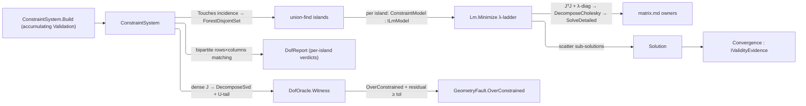

# [RASM_CONSTRAINTS_SOLVER]

`Rasm.Solving` owns one damped Gauss-Newton functor and the parametric-sketch algebra it serves. `Lm.Minimize` is the kernel's one nonlinear least-squares iterate: every `ILmModel` minimizes on one accept/reject λ-ladder folded by `Schedule.recurs` under one shared trial budget, rank deficiency past the ceiling routing to `GeometryFault.SingularSystem` and each `LinearSolution` READ rather than projected away, so an unusable factorization refuses instead of seating a NaN step. A model states its Jacobian in closed form or states its residual alone in forward-mode dual arithmetic and lets `DualModel` derive it exactly. Sketch solving closes over that functor — one closed `Constraint` `[Union]` residual-and-Jacobian algebra, `ConstraintSystem` folding incidence into union-find islands, `ConstraintSolver.Solve` returning `Solution`.

Solver geometry composes the settled `Point3d`/`Vector3d` vocabulary and routes every factorization through the `Numerics/matrix` owners. Caller `Op` keys thread through every owner, `ddouble` accumulates `Σr²`, and `GeometryFault` cases carry every failure; parameters stay raw `double` and public output is `Solution` with its distinct `Convergence`. Sibling `EntityKind` and local `SketchEntityKind` stay separate vocabularies.

## [01]-[INDEX]

- [02]-[LM_FUNCTOR]: `Lm.Minimize` the one damped Gauss-Newton iterate — an `LmPass` continue-or-done fold over the `ILmModel` residual+Jacobian floor and `SolvePolicy` ladder — with `Dual<T>`/`DualModel` deriving exact Jacobians from residual code alone, and `ObjectiveSense` the branch objective-direction vocabulary the maximizing consumers fold through.
- [03]-[CONSTRAINT_SOLVER]: `Constraint` algebra, union-find island decomposition, structural and witness `Determinacy` verdicts, and `ConstraintSolver.Solve` returning `Solution`.

## [02]-[LM_FUNCTOR]

- Owner: `ILmModel` mints the residual+Jacobian floor — `Dof`, `Seed`, the 106-bit `Norm`, and packed-upper `Linearize` — the open instance-interface seam every residual-row system implements; `IDualResidual` is the residual-only floor beside it and `DualModel` the adapter conforming one to the other; `Dual<T>` the forward-mode scalar those two differentiate through, satisfying `INumber`/`IRootFunctions`/`IPowerFunctions`/`IExponentialFunctions`/`ILogarithmicFunctions`/`ITrigonometricFunctions` at exactly the constraint set it demands of `T`; `SolvePolicy` the λ-ladder policy record whose `Of(Context, Op)` factory derives every threshold off its own lane and whose `Lower`/`Raise` clamp the ladder; `LmState` the internal trial carrier; `LmResult` the typed outcome registering `IValidityEvidence`; `Lm` the static functor surface.
- Cases: `SolveStatus` closes over the three ways an iterate ends — `Converged` on the residual tolerance, `Stationary` on a step floor the residual never cleared, `Exhausted` on a spent budget with a live descent direction — and its KEY ordinal IS the severity the island fold maxes over, so no bool accumulator re-states that ordering. `LmPass` is the continue-or-done carrier the driver folds and never interprets. The singular outcome rides the `Fin` failure rail as `GeometryFault.SingularSystem`, kept off the status vocabulary. `ObjectiveSense` `Minimize`/`Maximize` is the branch objective-direction vocabulary seated beside the status roster: the kernel iterate itself always minimizes, and a consumer whose objective points the other way folds `Sign * objective` through the row rather than a call-site sign literal — Compute's optimizer descent rows and Fabrication's orientation scoring compose these two cases, so direction spells once for the branch.
- Entry: `Lm.Minimize(ILmModel, SolvePolicy, Op?)` is the one nonlinear least-squares entrypoint. It routes `GeometryFault.SingularSystem(rank, dof)` when the damped normal matrix stays rank-deficient past `LambdaCeiling` — rank read as the `JᵀJ` eigen-rank through `SymmetricMatrix.DecomposeEigenDetailed`, counted spectral-radius-relative against `EpsilonPolicy.SqrtEpsilon`, a functor-computable witness needing no dense `J`; every other outcome is a success-carrier `LmResult` whose `Status` separates the converged fixpoint from the stationary one and both from the spent budget — a caller reads the row before consuming the vector, and a stationary or exhausted run wearing `Converged` is the killed shape.
- Auto: every foreign model member executes inside the `Op.Catch` funnel — policy and model admission reject a non-finite, non-monotone, or budget-uncrossable policy and a mis-shaped or non-finite seed, and no member runs outside the boundary. The iterate is ONE continue-or-done fold: `Pass` returns `LmPass.Running` or `LmPass.Settled`, `IO.FoldUntil` under `Schedule.recurs(MaxIterations)` threads the carrier as its own accumulator, and a fold still `Running` when the schedule stops IS the typed exhaustion — the accept ladder and the reject ladder are the same pass on one budget, and a rejected trial keeps its linearization because raising `λ` moves the damped diagonal alone. Convergence is `‖r‖₂ < ResidualTolerance`; a `‖δ‖₂ < StepFloor` step settles `Stationary` unless the residual it reached also clears the tolerance. A zero-diagonal column damps on the bare `λ` floor because multiplicative damping never regularizes an exact zero, holding that coordinate at the seed — the under-constrained manifold behavior the entry promises. One MathNet path `SymmetricMatrix.Of → DecomposeCholesky → SolveDetailed` mints `LinearSolution` gating each step all-finite, so an indefinite non-throwing factor fails the mint and the ladder climbs rather than accept a NaN step. The budget has ONE authority — the schedule counts every pass, accepted and rejected alike — so no ladder climb can outlive it, and objective comparison stays `ddouble` until the one result mint admits a `double` readout.
- Output: `LmResult` carries the outcome and its terminal row; the result mint rejects a 106-bit norm outside the `double` range before construction, and a caller reads `Status` before consuming an exhausted or stationary vector. A derived Jacobian mints no second result — the adapter is a model, so its evidence is the one `LmResult` the functor already returns under its `ValidityClaim.All` fold.
- Packages: `Rasm.Numerics` (`SymmetricMatrix`/`CholeskyResult`/`LinearSolution`/`Dimension`/`PositiveMagnitude`/`EpsilonPolicy` — the `Numerics/matrix` + `Numerics/atoms` owners), TYoshimura.DoubleDouble (`ddouble`/`ddouble.Sqrt`, the 106-bit objective the dual's value channel binds), System.Numerics.Tensors (`TensorPrimitives.Negate`/`Norm`/`Add`), Thinktecture.Runtime.Extensions (`[SmartEnum<int>]`/`[Union]`), LanguageExt.Core (`Fin`/`Option`/`IO.FoldUntil`/`Schedule.recurs`, the one repeat owner), BCL inbox (`System.Numerics` generic math — the operator, `INumber`, and function-group interfaces `Dual<T>` both demands and satisfies; `System.Globalization` `NumberStyles` at its text boundary).
- Growth: a new descent strategy is a `SolvePolicy` column selecting the step rule on the same `Pass`; a new terminal reason is one `SolveStatus` row read off the same fold; a new model is an `ILmModel` conformance, or an `IDualResidual` wrapped by `DualModel` where the residual is easier to state than its partials; a new elementary function under differentiation is one `Dual<T>.Chain` row; a new stop criterion is one policy column read at the convergence gate.
- Boundary: packed-upper `Linearize` is the functor's contract — `Lm.PackedIndex` mirrors `SymmetricMatrix.FlatIndex` so a model scatters the owner's own layout, and the adapter delegates to that one owner rather than spelling a fourth copy of the index arithmetic; `ILmModel.Norm` returns `ddouble` by contract, a model narrowing its objective to `double` re-introducing the summation cancellation the contract kills. Every Jacobian reaching the functor is EXACT from one of two sources — hand-coded closed form, or forward-mode duals, which differentiate rather than difference — and finite differencing halves the 106-bit objective, so it never mints a production Jacobian on this lane and stays the proof estate's differential oracle. `Dual<T>` closes that second source as a FIXPOINT of the generic-math floor — it satisfies precisely the six interfaces it constrains `T` by, so a kernel written once over that floor instantiates at `Dual<ddouble>` and a residual differentiates the body its forward evaluation reads, one transcription rather than a double-precision model beside a dual-arithmetic copy of it; `Dual<Dual<T>>` is second-order forward mode falling out of the same closure. `Dual<T>` carries its tangent as derivative PAYLOAD and never identity, so ordering, comparison, equality, and the hash read the value alone and two duals sharing a value are one number carrying two directions — the record's field-wise equality splits a number by which column seeded it and leaves `CompareTo` contradicting `==` at every tie. Finiteness reads BOTH channels because a finite value beside a dead tangent is a dead derivative: `IsNaN`/`IsInfinity`/`IsFinite` fold the pair, the directional infinities narrow by the value's own sign, and every other classification reads the value alone — so a poisoned partial fails the mint at the dual instead of after the `double` cast that hides it. Conversion is asymmetric by construction: a scalar lifts in as a CONSTANT with zero tangent, which is what resolves a foreign kernel's `CreateChecked` anchors, while lowering out is defined only on the constant sub-algebra and a seeded dual refuses rather than discard the derivative its caller is mid-chain on. `DualModel` costs `rows × dof` row evaluations where a closed-form arm costs `rows`, so it serves the small-`dof` lane the island economy already bounds while a wide model keeps its analytic arm. Damping expresses on the normal diagonal, the damped matrix is always SPD (Cholesky without pivoting), and the packed-upper `SymmetricMatrix` carries it, so the normal-equations form is chosen over QR-on-`J`, the `√λ`-stacked thin-QR alternative activating only past a conditioning budget. Damped-diagonal assembly inside `Step` and the `Dual<T>` text boundary — the span writer and the backward cut its reader takes — are the named statement exemptions; every failure routes `Fin` over `GeometryFault` except at the generic-math boundary itself, where the interface fixes the throwing contract: the scalar owner's own `Parse` carries it unwrapped and the foreign-operand raise sits on an EXPLICIT `IComparable.CompareTo(object?)` body, so no `Dual<T>`-typed call site can reach it.

```csharp
// --- [IMPORTS] -------------------------------------------------------------------------
using System;
using System.Globalization;
using System.Linq;
using System.Numerics;
using System.Numerics.Tensors;
using DoubleDouble;
using LanguageExt;
using LanguageExt.Common;
using Rasm.Domain;
using Rasm.Numerics;
using Thinktecture;
using static LanguageExt.Prelude;

namespace Rasm.Solving;

// --- [TYPES] ---------------------------------------------------------------------------
[SmartEnum<int>]
public sealed partial class SolveStatus {
    public static readonly SolveStatus Converged  = new(key: 0);
    public static readonly SolveStatus Stationary = new(key: 1);
    public static readonly SolveStatus Exhausted  = new(key: 2);

}

[SmartEnum<string>]
[KeyMemberEqualityComparer<ComparerAccessors.StringOrdinal, string>]
[KeyMemberComparer<ComparerAccessors.StringOrdinal, string>]
public sealed partial class ObjectiveSense {
    public static readonly ObjectiveSense Minimize = new("minimize", sign: 1.0);
    public static readonly ObjectiveSense Maximize = new("maximize", sign: -1.0);

    public double Sign { get; }
}

internal static class KeyedSeverity {
    internal static TSelf Worst<TSelf>(TSelf left, TSelf right) where TSelf : class, IKeyedObject<int> =>
        left.ToValue() >= right.ToValue() ? left : right;
}

// --- [MODELS] --------------------------------------------------------------------------
public sealed record SolvePolicy(
    double InitialLambda,
    double LambdaFloor,
    double LambdaCeiling,
    double LambdaUp,
    double LambdaDown,
    PositiveMagnitude ResidualTolerance,
    double StepFloor,
    Dimension MaxIterations) {
    public static Fin<SolvePolicy> Of(Context context, Op key, Option<Dimension> budget = default) {
        double convergence = context.For(lane: ToleranceLane.Convergence).Value;
        double initial = Math.Sqrt(d: convergence);
        double ceiling = 1.0 / convergence;
        int climbs = (int)Math.Ceiling(a: Math.Log(a: ceiling / initial, newBase: LadderFactor));
        return key.AcceptValidated<PositiveMagnitude>(candidate: ResidualCap.Converged.In(context: Some(context)))
            .Map(tolerance => new SolvePolicy(
                InitialLambda: initial,
                LambdaFloor: convergence * convergence,
                LambdaCeiling: ceiling,
                LambdaUp: LadderFactor,
                LambdaDown: LadderFactor,
                ResidualTolerance: tolerance,
                StepFloor: context.For(lane: ToleranceLane.Step).Value,
                MaxIterations: budget.IfNone(() => Dimension.Create(climbs * climbs))))
            .Bind(policy => policy.Admit(key: key));
    }

    const double LadderFactor = 10.0;

    internal Fin<SolvePolicy> Admit(Op key) {
        SolvePolicy self = this;
        return guard(
            double.IsFinite(self.InitialLambda)
            && double.IsFinite(self.LambdaFloor) && self.LambdaFloor > 0.0 && self.LambdaFloor <= self.InitialLambda
            && double.IsFinite(self.LambdaCeiling) && self.InitialLambda <= self.LambdaCeiling
            && double.IsFinite(self.LambdaUp) && self.LambdaUp > 1.0
            && double.IsFinite(self.LambdaDown) && self.LambdaDown > 1.0
            && double.IsFinite(self.ResidualTolerance.Value) && self.ResidualTolerance.Value > EpsilonPolicy.ZeroTolerance
            && double.IsFinite(self.StepFloor) && self.StepFloor > 0.0
            && Math.Log(self.LambdaCeiling / self.InitialLambda, self.LambdaUp) < self.MaxIterations.Value,
            key.InvalidInput()).ToFin().Map(_ => self);
    }

    internal double Lower(double lambda) => double.Max(lambda / LambdaDown, LambdaFloor);
    internal double Raise(double lambda) => lambda * LambdaUp;
}

readonly record struct LmNormal(double[] Packed, double[] Gradient);

readonly record struct LmState(double[] Parameters, ddouble Norm, double Lambda, int Iterations, Option<LmNormal> Normal);

[Union]
abstract partial record LmPass {
    private LmPass() { }
    public sealed record Running(LmState State) : LmPass;
    public sealed record Settled(LmState State, SolveStatus Status) : LmPass;
}

public sealed record LmResult(Arr<double> Parameters, double Norm, int Iterations, double Lambda, SolveStatus Status) : IValidityEvidence {
    public bool IsValid => ValidityClaim.All(
        ValidityClaim.Finite(Parameters.AsSpan()),
        ValidityClaim.Finite(Norm),
        ValidityClaim.Nonnegative(Norm),
        ValidityClaim.CountAtLeast(count: Iterations, floor: 0),
        ValidityClaim.Finite(Lambda),
        ValidityClaim.Positive(Lambda),
        Status is not null);
}

public readonly record struct Dual<T>(T Value, T Derivative)
    : INumber<Dual<T>>, IRootFunctions<Dual<T>>, IPowerFunctions<Dual<T>>,
      IExponentialFunctions<Dual<T>>, ILogarithmicFunctions<Dual<T>>, ITrigonometricFunctions<Dual<T>>
    where T : INumber<T>, IRootFunctions<T>, IPowerFunctions<T>, IExponentialFunctions<T>, ILogarithmicFunctions<T>, ITrigonometricFunctions<T> {
    static readonly T Two = T.CreateChecked(2);
    static readonly T Three = T.CreateChecked(3);
    static readonly T Ln2 = T.Log(Two);
    static readonly T Ln10 = T.Log(T.CreateChecked(10));
    const char Mark = 'ε';

    public static Dual<T> Of(T value) => new(Value: value, Derivative: T.Zero);
    public static Dual<T> Seeded(T value) => new(Value: value, Derivative: T.One);

    // --- [IDENTITY]
    public static Dual<T> Zero => Of(T.Zero);
    public static Dual<T> One => Of(T.One);
    public static Dual<T> AdditiveIdentity => Zero;
    public static Dual<T> MultiplicativeIdentity => One;
    public static Dual<T> E => Of(T.E);
    public static Dual<T> Pi => Of(T.Pi);
    public static Dual<T> Tau => Of(T.Tau);
    public static int Radix => T.Radix;

    // --- [ALGEBRA]
    public static Dual<T> operator +(Dual<T> left, Dual<T> right) => new(left.Value + right.Value, left.Derivative + right.Derivative);
    public static Dual<T> operator -(Dual<T> left, Dual<T> right) => new(left.Value - right.Value, left.Derivative - right.Derivative);
    public static Dual<T> operator +(Dual<T> value) => value;
    public static Dual<T> operator -(Dual<T> value) => new(-value.Value, -value.Derivative);
    public static Dual<T> operator *(Dual<T> left, Dual<T> right) =>
        new(left.Value * right.Value, (left.Value * right.Derivative) + (right.Value * left.Derivative));
    public static Dual<T> operator /(Dual<T> left, Dual<T> right) =>
        new(left.Value / right.Value, ((left.Derivative * right.Value) - (left.Value * right.Derivative)) / (right.Value * right.Value));
    public static Dual<T> operator %(Dual<T> left, Dual<T> right) =>
        (left.Value % right.Value) switch {
            var rem => new(rem, left.Derivative - (right.Derivative * ((left.Value - rem) / right.Value))),
        };
    public static Dual<T> operator ++(Dual<T> value) => value with { Value = value.Value + T.One };
    public static Dual<T> operator --(Dual<T> value) => value with { Value = value.Value - T.One };

    // --- [ORDER]
    public bool Equals(Dual<T> other) => Value.Equals(other.Value);
    public override int GetHashCode() => Value.GetHashCode();
    public int CompareTo(Dual<T> other) => Value.CompareTo(other.Value);
    int IComparable.CompareTo(object? value) => value switch {
        null => 1,
        Dual<T> other => CompareTo(other),
        _ => throw new ArgumentException($"expected {nameof(Dual<T>)}", nameof(value)),
    };

    public static bool operator <(Dual<T> left, Dual<T> right) => left.Value < right.Value;
    public static bool operator <=(Dual<T> left, Dual<T> right) => left.Value <= right.Value;
    public static bool operator >(Dual<T> left, Dual<T> right) => left.Value > right.Value;
    public static bool operator >=(Dual<T> left, Dual<T> right) => left.Value >= right.Value;

    static Dual<T> Pick(Dual<T> x, Dual<T> y, T chosen) => chosen.Equals(x.Value) ? x : y;
    public static Dual<T> MaxMagnitude(Dual<T> x, Dual<T> y) => Pick(x, y, T.MaxMagnitude(x.Value, y.Value));
    public static Dual<T> MaxMagnitudeNumber(Dual<T> x, Dual<T> y) => Pick(x, y, T.MaxMagnitudeNumber(x.Value, y.Value));
    public static Dual<T> MinMagnitude(Dual<T> x, Dual<T> y) => Pick(x, y, T.MinMagnitude(x.Value, y.Value));
    public static Dual<T> MinMagnitudeNumber(Dual<T> x, Dual<T> y) => Pick(x, y, T.MinMagnitudeNumber(x.Value, y.Value));

    // --- [CLASSIFICATION]
    public static bool IsFinite(Dual<T> value) => T.IsFinite(value.Value) && T.IsFinite(value.Derivative);
    public static bool IsNaN(Dual<T> value) => T.IsNaN(value.Value) || T.IsNaN(value.Derivative);
    public static bool IsInfinity(Dual<T> value) => !IsNaN(value) && (T.IsInfinity(value.Value) || T.IsInfinity(value.Derivative));
    public static bool IsPositiveInfinity(Dual<T> value) => IsInfinity(value) && T.IsPositiveInfinity(value.Value);
    public static bool IsNegativeInfinity(Dual<T> value) => IsInfinity(value) && T.IsNegativeInfinity(value.Value);
    public static bool IsCanonical(Dual<T> value) => T.IsCanonical(value.Value);
    public static bool IsComplexNumber(Dual<T> value) => T.IsComplexNumber(value.Value);
    public static bool IsEvenInteger(Dual<T> value) => T.IsEvenInteger(value.Value);
    public static bool IsImaginaryNumber(Dual<T> value) => T.IsImaginaryNumber(value.Value);
    public static bool IsInteger(Dual<T> value) => T.IsInteger(value.Value);
    public static bool IsNegative(Dual<T> value) => T.IsNegative(value.Value);
    public static bool IsNormal(Dual<T> value) => T.IsNormal(value.Value);
    public static bool IsOddInteger(Dual<T> value) => T.IsOddInteger(value.Value);
    public static bool IsPositive(Dual<T> value) => T.IsPositive(value.Value);
    public static bool IsRealNumber(Dual<T> value) => T.IsRealNumber(value.Value);
    public static bool IsSubnormal(Dual<T> value) => T.IsSubnormal(value.Value);
    public static bool IsZero(Dual<T> value) => T.IsZero(value.Value);

    // --- [CONVERSION]
    static bool Lift<TOther>(TOther value, Func<TOther, T> mode, out Dual<T> result) {
        result = Of(mode(arg: value));
        return true;
    }

    static bool Lower<TOther>(Dual<T> value, Func<T, TOther> mode, out TOther result) {
        bool constant = T.IsZero(value.Derivative);
        result = constant ? mode(arg: value.Value) : default!;
        return constant;
    }

    static bool INumberBase<Dual<T>>.TryConvertFromChecked<TOther>(TOther value, out Dual<T> result) => Lift(value, static v => T.CreateChecked(v), out result);
    static bool INumberBase<Dual<T>>.TryConvertFromSaturating<TOther>(TOther value, out Dual<T> result) => Lift(value, static v => T.CreateSaturating(v), out result);
    static bool INumberBase<Dual<T>>.TryConvertFromTruncating<TOther>(TOther value, out Dual<T> result) => Lift(value, static v => T.CreateTruncating(v), out result);
    static bool INumberBase<Dual<T>>.TryConvertToChecked<TOther>(Dual<T> value, out TOther result) => Lower(value, static v => TOther.CreateChecked(v), out result);
    static bool INumberBase<Dual<T>>.TryConvertToSaturating<TOther>(Dual<T> value, out TOther result) => Lower(value, static v => TOther.CreateSaturating(v), out result);
    static bool INumberBase<Dual<T>>.TryConvertToTruncating<TOther>(Dual<T> value, out TOther result) => Lower(value, static v => TOther.CreateTruncating(v), out result);

    // --- [CHAIN_RULE]
    public Dual<T> Chain(Func<T, T> value, Func<T, T, T> slope) =>
        value(arg: Value) switch { var v => new Dual<T>(Value: v, Derivative: slope(arg1: Value, arg2: v) * Derivative) };

    public static Dual<T> Abs(Dual<T> x) => x.Chain(static v => T.Abs(v), static (a, _) => T.IsNegative(a) ? -T.One : T.One);
    public static Dual<T> Sqrt(Dual<T> x) => x.Chain(static v => T.Sqrt(v), static (_, r) => T.One / (Two * r));
    public static Dual<T> Cbrt(Dual<T> x) => x.Chain(static v => T.Cbrt(v), static (_, r) => T.One / (Three * r * r));
    public static Dual<T> RootN(Dual<T> x, int n) => x.Chain(v => T.RootN(v, n), (a, r) => r / (T.CreateChecked(n) * a));

    public static Dual<T> Exp(Dual<T> x) => x.Chain(static v => T.Exp(v), static (_, e) => e);
    public static Dual<T> Exp2(Dual<T> x) => x.Chain(static v => T.Exp2(v), static (_, e) => Ln2 * e);
    public static Dual<T> Exp10(Dual<T> x) => x.Chain(static v => T.Exp10(v), static (_, e) => Ln10 * e);
    public static Dual<T> ExpM1(Dual<T> x) => x.Chain(static v => T.ExpM1(v), static (_, e) => e + T.One);
    public static Dual<T> Exp2M1(Dual<T> x) => x.Chain(static v => T.Exp2M1(v), static (_, e) => Ln2 * (e + T.One));
    public static Dual<T> Exp10M1(Dual<T> x) => x.Chain(static v => T.Exp10M1(v), static (_, e) => Ln10 * (e + T.One));

    public static Dual<T> Log(Dual<T> x) => x.Chain(static v => T.Log(v), static (a, _) => T.One / a);
    public static Dual<T> Log2(Dual<T> x) => x.Chain(static v => T.Log2(v), static (a, _) => T.One / (a * Ln2));
    public static Dual<T> Log10(Dual<T> x) => x.Chain(static v => T.Log10(v), static (a, _) => T.One / (a * Ln10));
    public static Dual<T> LogP1(Dual<T> x) => x.Chain(static v => T.LogP1(v), static (a, _) => T.One / (T.One + a));
    public static Dual<T> Log2P1(Dual<T> x) => x.Chain(static v => T.Log2P1(v), static (a, _) => T.One / ((T.One + a) * Ln2));
    public static Dual<T> Log10P1(Dual<T> x) => x.Chain(static v => T.Log10P1(v), static (a, _) => T.One / ((T.One + a) * Ln10));

    public static Dual<T> Sin(Dual<T> x) => x.Chain(static v => T.Sin(v), static (a, _) => T.Cos(a));
    public static Dual<T> Cos(Dual<T> x) => x.Chain(static v => T.Cos(v), static (a, _) => -T.Sin(a));
    public static Dual<T> Tan(Dual<T> x) => x.Chain(static v => T.Tan(v), static (_, t) => T.One + (t * t));
    public static Dual<T> Asin(Dual<T> x) => x.Chain(static v => T.Asin(v), static (a, _) => T.One / T.Sqrt(T.One - (a * a)));
    public static Dual<T> Acos(Dual<T> x) => x.Chain(static v => T.Acos(v), static (a, _) => -T.One / T.Sqrt(T.One - (a * a)));
    public static Dual<T> Atan(Dual<T> x) => x.Chain(static v => T.Atan(v), static (a, _) => T.One / (T.One + (a * a)));
    public static Dual<T> SinPi(Dual<T> x) => x.Chain(static v => T.SinPi(v), static (a, _) => T.Pi * T.CosPi(a));
    public static Dual<T> CosPi(Dual<T> x) => x.Chain(static v => T.CosPi(v), static (a, _) => -T.Pi * T.SinPi(a));
    public static Dual<T> TanPi(Dual<T> x) => x.Chain(static v => T.TanPi(v), static (_, t) => T.Pi * (T.One + (t * t)));
    public static Dual<T> AsinPi(Dual<T> x) => x.Chain(static v => T.AsinPi(v), static (a, _) => T.One / (T.Pi * T.Sqrt(T.One - (a * a))));
    public static Dual<T> AcosPi(Dual<T> x) => x.Chain(static v => T.AcosPi(v), static (a, _) => -T.One / (T.Pi * T.Sqrt(T.One - (a * a))));
    public static Dual<T> AtanPi(Dual<T> x) => x.Chain(static v => T.AtanPi(v), static (a, _) => T.One / (T.Pi * (T.One + (a * a))));

    public static (Dual<T> Sin, Dual<T> Cos) SinCos(Dual<T> x) =>
        T.SinCos(x.Value) switch { var (s, c) => (new(s, c * x.Derivative), new(c, -s * x.Derivative)) };

    public static (Dual<T> SinPi, Dual<T> CosPi) SinCosPi(Dual<T> x) =>
        T.SinCosPi(x.Value) switch { var (s, c) => (new(s, T.Pi * c * x.Derivative), new(c, -T.Pi * s * x.Derivative)) };

    public static Dual<T> Hypot(Dual<T> x, Dual<T> y) =>
        T.Hypot(x.Value, y.Value) switch {
            var h => new(h, ((x.Value * x.Derivative) + (y.Value * y.Derivative)) / h),
        };

    public static Dual<T> Log(Dual<T> x, Dual<T> newBase) =>
        T.Log(newBase.Value) switch {
            var lb => new(T.Log(x.Value) / lb,
                (x.Derivative / (x.Value * lb)) - (T.Log(x.Value) * newBase.Derivative / (newBase.Value * lb * lb))),
        };

    public static Dual<T> Pow(Dual<T> x, Dual<T> y) =>
        T.Pow(x.Value, y.Value) switch {
            var v => new(v, (y.Value * T.Pow(x.Value, y.Value - T.One) * x.Derivative)
                            + (T.IsZero(y.Derivative) ? T.Zero : v * T.Log(x.Value) * y.Derivative)),
        };

    // --- [TEXT]
    string TangentSign => T.IsNegative(Derivative) ? string.Empty : "+";

    public override string ToString() => ToString(format: null, provider: null);

    public string ToString(string? format, IFormatProvider? provider) =>
        $"{Value.ToString(format, provider)}{TangentSign}{Derivative.ToString(format, provider)}{Mark}";

    public bool TryFormat(Span<char> destination, out int charsWritten, ReadOnlySpan<char> format, IFormatProvider? provider) {
        charsWritten = 0;
        if (!Value.TryFormat(destination, out int head, format, provider)) { return false; }
        charsWritten = head + TangentSign.Length;
        if (charsWritten > destination.Length) { return false; }
        TangentSign.CopyTo(destination[head..]);
        if (!Derivative.TryFormat(destination[charsWritten..], out int tail, format, provider)) { return false; }
        charsWritten += tail;
        if (charsWritten >= destination.Length) { return false; }
        destination[charsWritten++] = Mark;
        return true;
    }

    static int Cut(ReadOnlySpan<char> s) {
        if (s.IsEmpty || s[^1] != Mark) { return -1; }
        for (int i = s.Length - 2; i > 0; i--) {
            if (s[i] is '+' or '-' && s[i - 1] is not ('e' or 'E')) { return i; }
        }
        return 0;
    }

    public static Dual<T> Parse(ReadOnlySpan<char> s, NumberStyles style, IFormatProvider? provider) =>
        Cut(s) switch {
            < 0 => new(T.Parse(s, style, provider), T.Zero),
            0 => new(T.Zero, T.Parse(s[..^1], style, provider)),
            var i => new(T.Parse(s[..i], style, provider), T.Parse(s[i..^1], style, provider)),
        };

    public static bool TryParse(ReadOnlySpan<char> s, NumberStyles style, IFormatProvider? provider, out Dual<T> result) {
        T value = T.Zero, slope = T.Zero;
        int cut = Cut(s);
        bool read = cut switch {
            < 0 => T.TryParse(s, style, provider, out value),
            0 => T.TryParse(s[..^1], style, provider, out slope),
            _ => T.TryParse(s[..cut], style, provider, out value) && T.TryParse(s[cut..^1], style, provider, out slope),
        };
        result = read ? new Dual<T>(value, slope) : default;
        return read;
    }

    public static Dual<T> Parse(string s, NumberStyles style, IFormatProvider? provider) => Parse(s.AsSpan(), style, provider);
    public static Dual<T> Parse(ReadOnlySpan<char> s, IFormatProvider? provider) => Parse(s, NumberStyles.Float | NumberStyles.AllowThousands, provider);
    public static Dual<T> Parse(string s, IFormatProvider? provider) => Parse(s.AsSpan(), provider);
    public static bool TryParse(string? s, NumberStyles style, IFormatProvider? provider, out Dual<T> result) => TryParse(s.AsSpan(), style, provider, out result);
    public static bool TryParse(ReadOnlySpan<char> s, IFormatProvider? provider, out Dual<T> result) => TryParse(s, NumberStyles.Float | NumberStyles.AllowThousands, provider, out result);
    public static bool TryParse(string? s, IFormatProvider? provider, out Dual<T> result) => TryParse(s.AsSpan(), provider, out result);
}

// --- [SERVICES] ------------------------------------------------------------------------
public interface ILmModel {
    int Dof { get; }
    double[] Seed { get; }
    ddouble Norm(ReadOnlySpan<double> parameters);
    (double[] PackedNormal, double[] Gradient) Linearize(ReadOnlySpan<double> parameters);
}

public interface IDualResidual {
    int Dof { get; }
    int Rows { get; }
    double[] Seed { get; }
    Dual<ddouble> Row(int index, ReadOnlySpan<Dual<ddouble>> parameters);
}

// --- [OPERATIONS] ----------------------------------------------------------------------
public static class Lm {
    internal static int PackedIndex(int n, int i, int j) => SymmetricMatrix.FlatIndex(n: n, i: i, j: j);

    [BoundaryAdapter]
    public static Fin<LmResult> Minimize(ILmModel model, SolvePolicy policy, Op? key = null) {
        Op op = key.OrDefault();
        return from activeModel in Admit.NotNull(value: model, key: op)
               from activePolicy in Admit.NotNull(value: policy, key: op).Bind(active => active.Admit(key: op))
               from admitted in AdmitModel(model: activeModel, key: op)
               from norm in Objective(model: activeModel, parameters: admitted.Seed, key: op)
               from result in Iterate(model: activeModel, dof: admitted.Dof, policy: activePolicy,
                   seed: new LmState(admitted.Seed, norm, activePolicy.InitialLambda, Iterations: 0, Normal: None), key: op)
               select result;
    }

    static Fin<(int Dof, double[] Seed)> AdmitModel(ILmModel model, Op key) => key.Catch(() => {
        int dof = model.Dof;
        double[]? source = model.Seed;
        return dof >= 0 && source is not null && source.Length == dof && TensorPrimitives.IsFiniteAll(source)
            ? Fin.Succ((Dof: dof, Seed: (double[])source.Clone()))
            : Fin.Fail<(int Dof, double[] Seed)>(key.InvalidInput());
    });

    static Fin<LmResult> Iterate(ILmModel model, int dof, SolvePolicy policy, LmState seed, Op key) =>
        IO.pure(value: unit).FoldUntil(
                schedule: Schedule.recurs(times: policy.MaxIterations.Value - 1),
                initialState: Fin.Succ<LmPass>(new LmPass.Running(State: seed)),
                folder: (acc, _) => acc.Bind(active => active.Switch(
                    state: (Model: model, Dof: dof, Policy: policy, Key: key),
                    running: static (s, live) => Pass(model: s.Model, dof: s.Dof, policy: s.Policy, state: live.State, key: s.Key),
                    settled: static (_, done) => Fin.Succ<LmPass>(done))),
                stateIs: static state => state.Match(Succ: static pass => pass is LmPass.Settled, Fail: static _ => true))
            .Run()
            .Bind(pass => pass.Switch(
                state: key,
                running: static (op, live) => Result(live.State, SolveStatus.Exhausted, op),
                settled: static (op, done) => Result(done.State, done.Status, op)));

    static Fin<LmPass> Pass(ILmModel model, int dof, SolvePolicy policy, LmState state, Op key) =>
        state.Norm < policy.ResidualTolerance.Value
            ? Fin.Succ<LmPass>(new LmPass.Settled(State: state, Status: SolveStatus.Converged))
        : dof == 0
            ? Fin.Succ<LmPass>(new LmPass.Settled(State: state, Status: SolveStatus.Stationary))
        : from normal in state.Normal.Match(
              Some: static held => Fin.Succ(held),
              None: () => Linearize(model: model, parameters: state.Parameters, dof: dof, key: key))
          from pass in state.Lambda > policy.LambdaCeiling
              ? Singular(normal: normal, dof: dof, key: key)
              : Trial(model: model, dof: dof, policy: policy, state: state, normal: normal, key: key)
          select pass;

    static Fin<LmPass> Trial(ILmModel model, int dof, SolvePolicy policy, LmState state, LmNormal normal, Op key) {
        double[] damped = (double[])normal.Packed.Clone();
        for (int i = 0; i < dof; i++) {
            int di = PackedIndex(dof, i, i);
            damped[di] = normal.Packed[di] > 0.0 ? normal.Packed[di] * (1.0 + state.Lambda) : state.Lambda;
        }
        double[] rhs = new double[dof];
        TensorPrimitives.Negate<double>(normal.Gradient, rhs);
        return Solved(
            solve: SymmetricMatrix.Of(Dimension.Create(dof), new Arr<double>(damped), key)
                .Bind(spd => spd.DecomposeCholesky(key))
                .Bind(chol => chol.SolveDetailed(new Arr<double>(rhs), key)),
            key: key)
            .Match(
                Succ: delta => Accept(model: model, policy: policy, state: state, normal: normal, delta: delta, key: key),
                Fail: _ => Fin.Succ(Reject(policy: policy, state: state, normal: normal)));
    }

    static Fin<Arr<double>> Solved(Fin<LinearSolution> solve, Op key) =>
        solve.Bind(solved => solved.IsValid ? Fin.Succ(solved.Solution) : Fin.Fail<Arr<double>>(key.InvalidResult()));

    static Fin<LmPass> Accept(ILmModel model, SolvePolicy policy, LmState state, LmNormal normal, Arr<double> delta, Op key) =>
        from trial in Advance(parameters: state.Parameters, delta: delta, key: key)
        from trialNorm in Objective(model: model, parameters: trial, key: key)
        select trialNorm < state.Norm
            ? Descend(policy: policy, state: state, trial: trial, trialNorm: trialNorm, stepNorm: TensorPrimitives.Norm<double>(delta.AsSpan()))
            : Reject(policy: policy, state: state, normal: normal);

    static LmPass Descend(SolvePolicy policy, LmState state, double[] trial, ddouble trialNorm, double stepNorm) =>
        state with { Parameters = trial, Norm = trialNorm, Iterations = state.Iterations + 1, Normal = None } switch {
            var moved => stepNorm < policy.StepFloor
                ? new LmPass.Settled(State: moved,
                    Status: trialNorm < policy.ResidualTolerance.Value ? SolveStatus.Converged : SolveStatus.Stationary)
                : new LmPass.Running(State: moved with { Lambda = policy.Lower(state.Lambda) }),
        };

    static LmPass Reject(SolvePolicy policy, LmState state, LmNormal normal) =>
        new LmPass.Running(State: state with { Lambda = policy.Raise(state.Lambda), Normal = Some(normal) });

    static Fin<LmPass> Singular(LmNormal normal, int dof, Op key) =>
        SymmetricMatrix.Of(Dimension.Create(dof), new Arr<double>(normal.Packed), key)
            .Bind(matrix => matrix.DecomposeEigenDetailed(key))
            .Map(static solved => solved.Pairs.Map(static p => Math.Abs(p.Eigenvalue)))
            .Map(spectrum => spectrum.Fold(0.0, Math.Max) is var radius && radius <= 0.0
                ? 0
                : spectrum.Count(v => v > EpsilonPolicy.SqrtEpsilon * radius))
            .Match(
                Succ: rank => Fin.Fail<LmPass>(new GeometryFault.SingularSystem(rank, dof)),
                Fail: Fin.Fail<LmPass>);

    static Fin<LmNormal> Linearize(ILmModel model, double[] parameters, int dof, Op key) =>
        key.Catch(() => {
            (double[] packedNormal, double[] gradient) = model.Linearize(parameters);
            long packedLength = (long)dof * (dof + 1L) / 2L;
            return packedLength <= int.MaxValue
                && packedNormal is not null && packedNormal.Length == packedLength && TensorPrimitives.IsFiniteAll(packedNormal)
                && gradient is not null && gradient.Length == dof && TensorPrimitives.IsFiniteAll(gradient)
                    ? Fin.Succ(new LmNormal(Packed: packedNormal, Gradient: gradient))
                    : Fin.Fail<LmNormal>(key.InvalidResult());
        });

    static Fin<ddouble> Objective(ILmModel model, double[] parameters, Op key) =>
        key.Catch(body: () => model.Norm(parameters) switch {
            ddouble norm when ddouble.IsFinite(norm) && ddouble.Sign(norm) >= 0 => Fin.Succ(norm),
            _ => Fin.Fail<ddouble>(key.InvalidResult()),
        });

    static Fin<double[]> Advance(double[] parameters, Arr<double> delta, Op key) {
        double[] next = (double[])parameters.Clone();
        TensorPrimitives.Add<double>(parameters, delta.AsSpan(), next);
        return TensorPrimitives.IsFiniteAll<double>(next)
            ? Fin.Succ(next)
            : Fin.Fail<double[]>(key.InvalidResult());
    }

    static Fin<LmResult> Result(LmState state, SolveStatus status, Op key) =>
        ddouble.IsFinite(state.Norm) && ddouble.Sign(state.Norm) >= 0 && state.Norm <= (ddouble)double.MaxValue
        && TensorPrimitives.IsFiniteAll<double>(state.Parameters)
        && double.IsFinite(state.Lambda) && state.Lambda > 0.0 && state.Iterations >= 0 && status is not null
            ? Fin.Succ(new LmResult(new Arr<double>(state.Parameters), (double)state.Norm, state.Iterations, state.Lambda, status))
            : Fin.Fail<LmResult>(key.InvalidResult());
}

public sealed class DualModel(IDualResidual residual) : ILmModel {
    public int Dof => residual.Dof;

    public double[] Seed => residual.Seed;

    public ddouble Norm(ReadOnlySpan<double> parameters) {
        Dual<ddouble>[] frozen = Frozen(parameters: parameters);
        ddouble sum = ddouble.Zero;
        for (int index = 0; index < residual.Rows; index++) {
            ddouble value = residual.Row(index: index, parameters: frozen).Value;
            sum += value * value;
        }
        return ddouble.Sqrt(sum);
    }

    public (double[] PackedNormal, double[] Gradient) Linearize(ReadOnlySpan<double> parameters) {
        int n = residual.Dof;
        Dual<ddouble>[] seeded = Frozen(parameters: parameters);
        double[] normal = new double[n * (n + 1) / 2];
        double[] gradient = new double[n];
        double[] partials = new double[n];
        for (int index = 0; index < residual.Rows; index++) {
            double value = 0.0;
            for (int column = 0; column < n; column++) {
                seeded[column] = Dual<ddouble>.Seeded(value: seeded[column].Value);
                Dual<ddouble> evaluated = residual.Row(index: index, parameters: seeded);
                seeded[column] = Dual<ddouble>.Of(value: seeded[column].Value);
                partials[column] = (double)evaluated.Derivative;
                value = (double)evaluated.Value;
            }
            for (int a = 0; a < n; a++) {
                gradient[a] += partials[a] * value;
                for (int b = a; b < n; b++) normal[Lm.PackedIndex(n: n, i: a, j: b)] += partials[a] * partials[b];
            }
        }
        return (PackedNormal: normal, Gradient: gradient);
    }

    static Dual<ddouble>[] Frozen(ReadOnlySpan<double> parameters) {
        Dual<ddouble>[] frozen = new Dual<ddouble>[parameters.Length];
        for (int index = 0; index < parameters.Length; index++) frozen[index] = Dual<ddouble>.Of(value: parameters[index]);
        return frozen;
    }
}
```

## [03]-[CONSTRAINT_SOLVER]

- Owner: `SketchEntityKind` `[SmartEnum<int>]` discriminates the parametric primitive, each row carrying its parameter `Arity`, a `Carrier` binding to the `Rasm.Domain` `Kind` so admission faults mint typed discriminants, and the `EndOf`/`RadiusOf` slice accessors answering `Option` for a slot the kind does not carry; `Entity` is one parametric-primitive algebra over every kind, carrying its kind and its `[Offset, Offset+Arity)` slice into the flat parameter vector; `Constraint` the closed relation `[Union]` whose generated-`Switch` `Residual`, `Touches`, and `RowCount` folds return residual rows with analytic partials, name the incident entities, and declare each case's row arity, with `WellFormed` derived off that pair; `ConstraintSystem` the immutable graph with accumulating `Build` admission and the accessor-backed `Islands`, `ResidualRows`, and `SeedVector` lazies; `Determinacy`/`RankProvenance`/`DofReport` the verdict vocabulary, its per-island adjudication evidence, and the `IslandVerdict` rows both totals derive from; `DofOracle` the rank-oracle roster fronting them; `ConstraintModel` the island-scoped `ILmModel`; `Convergence`/`Solution` the outcome pair; `ConstraintSolver` the static surface owning one oracle-taking `Analyze` and the island-folded `Solve`.
- Cases: `Constraint` is the closed relation `[Union]` the fence rosters; `Ground` is the gauge anchor whose absence leaves the rigid-body freedoms honestly under-constrained, and `Distance`, `Tangent`, and `OnCircle` carry squared residuals staying C¹ at coincident and zero-length configurations where the `√`-form Jacobian is undefined. `Determinacy` adds the witness-numeric `Redundant` row to the three structural verdicts — the redundant-but-consistent system a row count misclassifies as over-constrained — and its key ordinal carries the fold precedence every island roll-up maxes over. `AxisLock` names WHICH component a locked line holds constant, so the horizontal and vertical forms are one offset-addressed residual rather than a bool selecting between two transcriptions of the same difference. `SketchEntityKind` discriminates the parametric primitives, each row carrying its parameter arity.
- Entry: `ConstraintSolver.Solve(ConstraintSystem, SolvePolicy, Op?)` decomposes into islands, instantiates `ConstraintModel : ILmModel` per island, runs `Lm.Minimize` on each small normal system, scatters the sub-solutions back into one parameter vector, and gates the assembled result: `GeometryFault.OverConstrained` when the witness verdict is over-determined and the global residual stays past tolerance — a redundant-and-inconsistent system has no configuration, its payload carrying the dependent-row count `rows − rank(J)` at the witness — with `GeometryFault.SingularSystem` bubbling from any island's ladder; a well- or under-constrained system always solves, LM finding the nearest point on the manifold to the seed. `Analyze(system, oracle, key)` is the ONE determinacy read and `DofOracle` names which rank it adjudicates on — `RowCount` per-island arity, `Matching` the König refinement, `Witness` the numeric rank — every row carrying the `RankProvenance` it was decided by, so an SVD refusal that fell back to a count is legible rather than silent. `ConstraintSystem.Build` is the accumulating admission: every non-finite seed value, seed/arity mismatch, dangling reference (membership tests the full `Entity` value, so a mis-kinded reference at a valid offset is equally dangling), operand-kind mismatch, duplicate constraint, and the empty-system report exit together through one `Validation<Error, T>` traverse.
- Auto: `Islands` folds the entity↔constraint incidence through a transient `ForestDisjointSet` — every entity a singleton, every constraint one `Union` per operand past its head, `SetCount` the live island census and `FindSet` the grouping key — so the partition costs one near-constant-time pass and no container is minted for a question union-find answers directly; each component solves on its own `dof_island²` normal matrix instead of `ParameterCount²`, the decomposition that makes a many-sketch document solve at the cost of its largest island; an untouched entity is a zero-row island converging at iteration 0. Per island, `ConstraintModel` gathers the columns into a compact local vector over a single-writer global scratch (islands are column-disjoint, so the scratch never races), folds `Σr²` at 106-bit `ddouble`, and accumulates packed-upper `JᵀJ` + `Jᵀr` from the analytic partials with global→local remap, so the dense `J` never materializes on the LM lane. Residual scatter accumulates rather than overwrites because an arm can emit one column twice for a shared or self-aliased entity. `DofOracle.Matching` reads `MaximumBipartiteMatchingAlgorithm` cardinality as the König structural rank — row deficiency localizes over-constraint to its island and column surplus under-constraint, the locality a global row count is blind to. `DofOracle.Witness` runs PER ISLAND — `J(seed)` is block-diagonal under the island permutation, so each island's compact `rows_island × dof_island` dense block goes through `DecomposeSvd` and the fold is EQUAL to the global witness at `Σ dof_island²` cost, the same economy the solve fold buys; per island it reads true DOF `dof_island − Rank` and projects the residual onto the left-null space via the `SvdResult.U` tail — a vanishing tail is `Redundant`, redundant constraints that all hold — and island verdicts fold through `KeyedSeverity.Worst` over the row's own key ordinal with dependent rows summed.
- Output: `Solve` returns `Solution` carrying the converged parameters as `Arr<double>` and the typed `Convergence`, whose terminal λ is a MEASURED island reading — an island-free system refuses rather than certifying a seeded zero. `DofReport` is the diagnosis evidence a sketch UI reads to name which island over-constrains and by which oracle.
- Packages: `Rhino.Geometry` (`Point3d`/`Vector3d` for entity geometry), `Rasm.Numerics` (`SymmetricMatrix`/`CholeskyResult`/`Matrix`/`SvdResult`/`Dimension`/`PositiveMagnitude` — the `Numerics/matrix` + `Numerics/atoms` owners), QuikGraph (`ForestDisjointSet` the island partition; `AdjacencyGraph` + `MaximumBipartiteMatchingAlgorithm` the structural-rank walk), TYoshimura.DoubleDouble (`ddouble` + `DoubleDoubleEnumerableExpand.Sum`, the 106-bit `Σr²`), Thinktecture.Runtime.Extensions (`[Union]`/`[SmartEnum<int>]`/`[SmartEnum<string>]`/`[UseDelegateFromConstructor]`, generated `Switch`), CommunityToolkit.HighPerformance (`ReadOnlySpan2D` row projection for the U-tail gather), System.Numerics.Tensors (`TensorPrimitives.Dot`/`Norm` on the witness projection), LanguageExt.Core (`Fin`/`Option`/`Arr`/`Validation`/`Seq`, the accumulating `.Traverse` admission), BCL inbox.
- Growth: a new geometric relation is one `Constraint` case carrying its `Residual`, `Touches`, and `RowCount` arms over the same functor; a new parametric primitive is one `SketchEntityKind` row with its arity, `Carrier`, and slice accessors; a new rank adjudicator is one `DofOracle` row; a 3D sketch tier is one slice accessor widening over the same constraint algebra.
- Boundary: the relations differ only in residual expression and analytic partials, never in the iterate, so one `Constraint` `[Union]` with a generated-`Switch` fold owns them all — compile-exhaustive, a new case breaking `Residual`, `Touches`, and `RowCount` loudly while `WellFormed` derives off that pair and needs no arm; `Concentric` reuses the center-coincidence rows as sketch vocabulary over the one algebra. Every arm's Jacobian is EXACT and hand-coded closed form here, forward-mode duals being the functor's second exact source and a finite difference neither. Every `Numerics/matrix` call threads the caller's `Op` key, QuikGraph owns the partition and matching walks, and every graph verdict exits as a typed domain value. `ConstraintSystem` is immutable to its coordinates — `Arr<double>` carries the seed, so record equality reads the vector and no caller mutates one another reader folds — and the `ConstraintModel` scratch is the single-writer run-local exception that never escapes the model. Every failure lifts its direct `GeometryFault` case bare onto `Fin`, and the graph-assembly and scatter loops are the named span-kernel statement exemption.

```csharp
// --- [IMPORTS] -------------------------------------------------------------------------
using System;
using System.Collections.Frozen;
using System.Collections.Generic;
using System.Linq;
using System.Numerics.Tensors;
using CommunityToolkit.HighPerformance;
using DoubleDouble;
using LanguageExt;
using LanguageExt.Common;
using QuikGraph;
using QuikGraph.Algorithms;
using QuikGraph.Collections;
using Rasm.Domain;
using Rasm.Numerics;
using Rhino.Geometry;
using Thinktecture;
using static LanguageExt.Prelude;
using Dimension = Rasm.Numerics.Dimension;
using Matrix = Rasm.Numerics.Matrix;

namespace Rasm.Solving;

// --- [TYPES] ---------------------------------------------------------------------------
[SmartEnum<int>]
public sealed partial class SketchEntityKind {
    public static readonly SketchEntityKind Point = new(key: 0, arity: 2, carrier: Kind.Point,
        endOf: static (_, _) => None, radiusOf: static (_, _) => None);
    public static readonly SketchEntityKind Line = new(key: 1, arity: 4, carrier: Kind.Line,
        endOf: static (offset, p) => Some(new Point3d(p[offset + 2], p[offset + 3], 0.0)), radiusOf: static (_, _) => None);
    public static readonly SketchEntityKind Circle = new(key: 2, arity: 3, carrier: Kind.Circle,
        endOf: static (_, _) => None, radiusOf: static (offset, p) => Some(p[offset + 2]));

    public int Arity { get; }
    public Kind Carrier { get; }

    [UseDelegateFromConstructor] public partial Option<Point3d> EndOf(int offset, ReadOnlySpan<double> p);
    [UseDelegateFromConstructor] public partial Option<double> RadiusOf(int offset, ReadOnlySpan<double> p);
}

[SmartEnum<int>]
public sealed partial class Determinacy {
    public static readonly Determinacy Well      = new(key: 0);
    public static readonly Determinacy Under     = new(key: 1);
    public static readonly Determinacy Redundant = new(key: 2);
    public static readonly Determinacy Over      = new(key: 3);
}

[SmartEnum<string>]
public sealed partial class DofOracle {
    public static readonly DofOracle RowCount = new(key: "row-count", adjudicate: ConstraintSolver.CountRank);
    public static readonly DofOracle Matching = new(key: "matching", adjudicate: ConstraintSolver.MatchRank);
    public static readonly DofOracle Witness  = new(key: "witness", adjudicate: ConstraintSolver.WitnessRank);

    [UseDelegateFromConstructor] public partial DofReport Adjudicate(ConstraintSystem system, Op key);
}

[SmartEnum<int>]
public sealed partial class AxisLock {
    public static readonly AxisLock Horizontal = new(key: 0, component: 1);
    public static readonly AxisLock Vertical   = new(key: 1, component: 0);

    public int Component { get; }
}

// --- [MODELS] --------------------------------------------------------------------------
public readonly record struct Entity(SketchEntityKind Kind, int Offset) {
    public int Arity => Kind.Arity;

    public Point3d Origin(ReadOnlySpan<double> p) => new(p[Offset], p[Offset + 1], 0.0);

    public Option<Point3d> End(ReadOnlySpan<double> p) => Kind.EndOf(offset: Offset, p: p);
    public Option<double> Radius(ReadOnlySpan<double> p) => Kind.RadiusOf(offset: Offset, p: p);

    public Option<Vector3d> Direction(ReadOnlySpan<double> p) {
        Point3d origin = Origin(p);
        return Kind.EndOf(offset: Offset, p: p).Map(end => end - origin);
    }
}

public readonly record struct ResidualRow(double Value, Seq<(int Column, double Partial)> Partials);

[Union(ConversionFromValue = ConversionOperatorsGeneration.None)]
public abstract partial record Constraint {
    private Constraint() { }

    public sealed record Distance(Entity A, Entity B, double Target) : Constraint;
    public sealed record Angle(Entity A, Entity B, double Radians) : Constraint;
    public sealed record Coincident(Entity A, Entity B) : Constraint;
    public sealed record Concentric(Entity A, Entity B) : Constraint;
    public sealed record Parallel(Entity A, Entity B) : Constraint;
    public sealed record Perpendicular(Entity A, Entity B) : Constraint;
    public sealed record Tangent(Entity Line, Entity Circle) : Constraint;
    public sealed record PointOnLine(Entity Point, Entity Line) : Constraint;
    public sealed record Midpoint(Entity Point, Entity Line) : Constraint;
    public sealed record Axis(Entity Line, AxisLock Lock) : Constraint;
    public sealed record Equal(Entity A, Entity B) : Constraint;
    public sealed record Symmetric(Entity A, Entity B, Entity Axis) : Constraint;
    public sealed record Ground(Entity Point, double X, double Y) : Constraint;
    public sealed record Radius(Entity Circle, double Target) : Constraint;
    public sealed record OnCircle(Entity Point, Entity Circle) : Constraint;

    public Seq<ResidualRow> Residual(double[] p) =>
        Switch(
            state: p,
            distance:      static (p, d) => Seq(DistanceRow(d.A, d.B, d.Target, p)),
            angle:         static (p, a) => AngleRow(a.A, a.B, a.Radians, p).ToSeq(),
            coincident:    static (p, c) => CoincidentRows(c.A, c.B, p),
            concentric:    static (p, c) => CoincidentRows(c.A, c.B, p),
            parallel:      static (p, l) => CrossRow(l.A, l.B, p).ToSeq(),
            perpendicular: static (p, l) => DotRow(l.A, l.B, p).ToSeq(),
            tangent:       static (p, t) => TangentRow(t.Line, t.Circle, p).ToSeq(),
            pointOnLine:   static (p, o) => PointOnLineRow(o.Point, o.Line, p).ToSeq(),
            midpoint:      static (p, m) => MidpointRows(m.Point, m.Line, p).IfNone(Seq<ResidualRow>()),
            axis:          static (p, x) => AxisRow(x.Line, x.Lock, p).ToSeq(),
            equal:         static (p, e) => EqualRow(e.A, e.B, p).ToSeq(),
            symmetric:     static (p, s) => SymmetricRows(s.A, s.B, s.Axis, p).IfNone(Seq<ResidualRow>()),
            ground:        static (p, g) => GroundRows(g.Point, g.X, g.Y, p),
            radius:        static (p, r) => RadiusRow(r.Circle, r.Target, p).ToSeq(),
            onCircle:      static (p, o) => OnCircleRow(o.Point, o.Circle, p).ToSeq());

    public int RowCount =>
        Switch(
            distance:      static _ => 1,
            angle:         static _ => 1,
            coincident:    static _ => 2,
            concentric:    static _ => 2,
            parallel:      static _ => 1,
            perpendicular: static _ => 1,
            tangent:       static _ => 1,
            pointOnLine:   static _ => 1,
            midpoint:      static _ => 2,
            axis:          static _ => 1,
            equal:         static _ => 1,
            symmetric:     static _ => 2,
            ground:        static _ => 2,
            radius:        static _ => 1,
            onCircle:      static _ => 1);

    public Seq<Entity> Touches =>
        Switch(
            distance:      static d => Seq(d.A, d.B),
            angle:         static a => Seq(a.A, a.B),
            coincident:    static c => Seq(c.A, c.B),
            concentric:    static c => Seq(c.A, c.B),
            parallel:      static l => Seq(l.A, l.B),
            perpendicular: static l => Seq(l.A, l.B),
            tangent:       static t => Seq(t.Line, t.Circle),
            pointOnLine:   static o => Seq(o.Point, o.Line),
            midpoint:      static m => Seq(m.Point, m.Line),
            axis:          static x => Seq(x.Line),
            equal:         static e => Seq(e.A, e.B),
            symmetric:     static s => Seq(s.A, s.B, s.Axis),
            ground:        static g => Seq(g.Point),
            radius:        static r => Seq(r.Circle),
            onCircle:      static o => Seq(o.Point, o.Circle));

    public bool WellFormed(double[] p) => Residual(p).Count == RowCount;

    // --- [RESIDUAL_ROWS]
    static ResidualRow DistanceRow(Entity a, Entity b, double target, ReadOnlySpan<double> p) {
        Point3d pa = a.Origin(p), pb = b.Origin(p);
        double dx = pa.X - pb.X, dy = pa.Y - pb.Y;
        double r = dx * dx + dy * dy - target * target;
        return new ResidualRow(r, Seq(
            (a.Offset, 2.0 * dx), (a.Offset + 1, 2.0 * dy),
            (b.Offset, -2.0 * dx), (b.Offset + 1, -2.0 * dy)));
    }

    static Option<ResidualRow> AngleRow(Entity a, Entity b, double radians, ReadOnlySpan<double> p) {
        (Option<Vector3d> ua, Option<Vector3d> vb) = (a.Direction(p), b.Direction(p));
        return (ua, vb).Apply((u, v) => {
        double cross = u.X * v.Y - u.Y * v.X, dot = u.X * v.X + u.Y * v.Y;
        double denom = cross * cross + dot * dot;
        double inv = denom > EpsilonPolicy.ZeroTolerance * EpsilonPolicy.ZeroTolerance ? 1.0 / denom : 0.0;
        double r = Math.Atan2(cross, dot) - radians;
        double dAux = (v.Y * dot - v.X * cross) * inv, dAuy = (-v.X * dot - v.Y * cross) * inv;
        double dBvx = (-u.Y * dot - u.X * cross) * inv, dBvy = (u.X * dot - u.Y * cross) * inv;
        return new ResidualRow(r, Seq(
            (a.Offset, -dAux), (a.Offset + 1, -dAuy), (a.Offset + 2, dAux), (a.Offset + 3, dAuy),
            (b.Offset, -dBvx), (b.Offset + 1, -dBvy), (b.Offset + 2, dBvx), (b.Offset + 3, dBvy)));
        }).As();
    }

    static Seq<ResidualRow> CoincidentRows(Entity a, Entity b, ReadOnlySpan<double> p) {
        Point3d pa = a.Origin(p), pb = b.Origin(p);
        return Seq(
            new ResidualRow(pa.X - pb.X, Seq((a.Offset, 1.0), (b.Offset, -1.0))),
            new ResidualRow(pa.Y - pb.Y, Seq((a.Offset + 1, 1.0), (b.Offset + 1, -1.0))));
    }

    static Option<ResidualRow> CrossRow(Entity a, Entity b, ReadOnlySpan<double> p) {
        (Option<Vector3d> ua, Option<Vector3d> vb) = (a.Direction(p), b.Direction(p));
        return (ua, vb).Apply((u, v) => new ResidualRow(u.X * v.Y - u.Y * v.X, Seq(
            (a.Offset, -v.Y), (a.Offset + 1, v.X), (a.Offset + 2, v.Y), (a.Offset + 3, -v.X),
            (b.Offset, u.Y), (b.Offset + 1, -u.X), (b.Offset + 2, -u.Y), (b.Offset + 3, u.X)))).As();
    }

    static Option<ResidualRow> DotRow(Entity a, Entity b, ReadOnlySpan<double> p) {
        (Option<Vector3d> ua, Option<Vector3d> vb) = (a.Direction(p), b.Direction(p));
        return (ua, vb).Apply((u, v) => new ResidualRow((u.X * v.X) + (u.Y * v.Y), Seq(
            (a.Offset, -v.X), (a.Offset + 1, -v.Y), (a.Offset + 2, v.X), (a.Offset + 3, v.Y),
            (b.Offset, -u.X), (b.Offset + 1, -u.Y), (b.Offset + 2, u.X), (b.Offset + 3, u.Y)))).As();
    }

    static Option<ResidualRow> TangentRow(Entity line, Entity circle, ReadOnlySpan<double> p) {
        Point3d s = line.Origin(p), c = circle.Origin(p);
        (Option<Point3d> endOf, Option<double> radiusOf) = (line.End(p), circle.Radius(p));
        return (endOf, radiusOf).Apply((e, radius) => {
        double dx = e.X - s.X, dy = e.Y - s.Y;
        double cx = c.X - s.X, cy = c.Y - s.Y;
        double cross = dx * cy - dy * cx;
        double len2 = dx * dx + dy * dy;
        double invLen2 = len2 > EpsilonPolicy.ZeroTolerance * EpsilonPolicy.ZeroTolerance ? 1.0 / len2 : 0.0;
        double r = cross * cross * invLen2 - radius * radius;
        double g = cross * cross, gh = g * invLen2 * invLen2;
        double dStartX = (2.0 * cross * (dy - cy) * invLen2) - gh * (-2.0 * dx);
        double dStartY = (2.0 * cross * (cx - dx) * invLen2) - gh * (-2.0 * dy);
        double dEndX = (2.0 * cross * cy * invLen2) - gh * (2.0 * dx);
        double dEndY = (2.0 * cross * (-cx) * invLen2) - gh * (2.0 * dy);
        double dCenterX = 2.0 * cross * (-dy) * invLen2;
        double dCenterY = 2.0 * cross * dx * invLen2;
        return new ResidualRow(r, Seq(
            (line.Offset, dStartX), (line.Offset + 1, dStartY), (line.Offset + 2, dEndX), (line.Offset + 3, dEndY),
            (circle.Offset, dCenterX), (circle.Offset + 1, dCenterY), (circle.Offset + 2, -2.0 * radius)));
        }).As();
    }

    static Option<ResidualRow> PointOnLineRow(Entity point, Entity line, ReadOnlySpan<double> p) {
        Point3d q = point.Origin(p), s = line.Origin(p);
        return line.End(p).Map(e => new ResidualRow(((e.X - s.X) * (q.Y - s.Y)) - ((e.Y - s.Y) * (q.X - s.X)), Seq(
            (point.Offset, s.Y - e.Y), (point.Offset + 1, e.X - s.X),
            (line.Offset, e.Y - q.Y), (line.Offset + 1, q.X - e.X),
            (line.Offset + 2, q.Y - s.Y), (line.Offset + 3, s.X - q.X))));
    }

    static Option<Seq<ResidualRow>> MidpointRows(Entity point, Entity line, ReadOnlySpan<double> p) {
        Point3d q = point.Origin(p), s = line.Origin(p);
        return line.End(p).Map(e => Seq(
            new ResidualRow(q.X - (0.5 * (s.X + e.X)), Seq((point.Offset, 1.0), (line.Offset, -0.5), (line.Offset + 2, -0.5))),
            new ResidualRow(q.Y - (0.5 * (s.Y + e.Y)), Seq((point.Offset + 1, 1.0), (line.Offset + 1, -0.5), (line.Offset + 3, -0.5)))));
    }

    static Option<ResidualRow> AxisRow(Entity line, AxisLock axis, ReadOnlySpan<double> p) {
        int start = line.Offset + axis.Component, end = line.Offset + 2 + axis.Component;
        double delta = p[end] - p[start];
        return line.End(p).Map(_ => new ResidualRow(delta, Seq((start, -1.0), (end, 1.0))));
    }

    static Option<ResidualRow> EqualRow(Entity a, Entity b, ReadOnlySpan<double> p) {
        (Option<double> ra, Option<double> rb) = (a.Radius(p), b.Radius(p));
        Option<ResidualRow> radii = (ra, rb).Apply((left, right) =>
            new ResidualRow(left - right, Seq((a.Offset + 2, 1.0), (b.Offset + 2, -1.0)))).As();
        (Option<Vector3d> ua, Option<Vector3d> vb) = (a.Direction(p), b.Direction(p));
        Option<ResidualRow> spans = (ua, vb).Apply((u, v) => new ResidualRow(
            ((u.X * u.X) + (u.Y * u.Y)) - ((v.X * v.X) + (v.Y * v.Y)), Seq(
            (a.Offset, -2.0 * u.X), (a.Offset + 1, -2.0 * u.Y), (a.Offset + 2, 2.0 * u.X), (a.Offset + 3, 2.0 * u.Y),
            (b.Offset, 2.0 * v.X), (b.Offset + 1, 2.0 * v.Y), (b.Offset + 2, -2.0 * v.X), (b.Offset + 3, -2.0 * v.Y)))).As();
        return radii | spans;
    }

    static Option<Seq<ResidualRow>> SymmetricRows(Entity a, Entity b, Entity axis, ReadOnlySpan<double> p) {
        Point3d pa = a.Origin(p), pb = b.Origin(p), s = axis.Origin(p);
        return axis.End(p).Map(e => {
        double ax = e.X - s.X, ay = e.Y - s.Y;
        double mx = 0.5 * (pa.X + pb.X) - s.X, my = 0.5 * (pa.Y + pb.Y) - s.Y;
        double onAxis = ax * my - ay * mx;
        double chordX = pa.X - pb.X, chordY = pa.Y - pb.Y;
        double perp = chordX * ax + chordY * ay;
        return Seq(
            new ResidualRow(onAxis, Seq(
                (a.Offset, -0.5 * ay), (a.Offset + 1, 0.5 * ax), (b.Offset, -0.5 * ay), (b.Offset + 1, 0.5 * ax),
                (axis.Offset, ay - my), (axis.Offset + 1, mx - ax), (axis.Offset + 2, my), (axis.Offset + 3, -mx))),
            new ResidualRow(perp, Seq(
                (a.Offset, ax), (a.Offset + 1, ay), (b.Offset, -ax), (b.Offset + 1, -ay),
                (axis.Offset, -chordX), (axis.Offset + 1, -chordY), (axis.Offset + 2, chordX), (axis.Offset + 3, chordY))));
        });
    }

    static Seq<ResidualRow> GroundRows(Entity point, double x, double y, ReadOnlySpan<double> p) {
        Point3d q = point.Origin(p);
        return Seq(
            new ResidualRow(q.X - x, Seq((point.Offset, 1.0))),
            new ResidualRow(q.Y - y, Seq((point.Offset + 1, 1.0))));
    }

    static Option<ResidualRow> RadiusRow(Entity circle, double target, ReadOnlySpan<double> p) =>
        circle.Radius(p).Map(radius => new ResidualRow(radius - target, Seq((circle.Offset + 2, 1.0))));

    static Option<ResidualRow> OnCircleRow(Entity point, Entity circle, ReadOnlySpan<double> p) {
        Point3d q = point.Origin(p), c = circle.Origin(p);
        double dx = q.X - c.X, dy = q.Y - c.Y;
        return circle.Radius(p).Map(radius => new ResidualRow((dx * dx) + (dy * dy) - (radius * radius), Seq(
            (point.Offset, 2.0 * dx), (point.Offset + 1, 2.0 * dy),
            (circle.Offset, -2.0 * dx), (circle.Offset + 1, -2.0 * dy), (circle.Offset + 2, -2.0 * radius))));
    }
}

public readonly record struct ConstraintIsland(Seq<int> Entities, Seq<int> Constraints);

[SmartEnum<int>]
public sealed partial class RankProvenance {
    public static readonly RankProvenance Witnessed = new(key: 0);
    public static readonly RankProvenance Matched   = new(key: 1);
    public static readonly RankProvenance Counted   = new(key: 2);
}

public readonly record struct IslandVerdict(
    int Island, Determinacy Verdict, int FreeDof, int Deficiency, int Rank, RankProvenance Provenance);

public sealed record DofReport(Determinacy Verdict, Seq<IslandVerdict> Islands) : IValidityEvidence {
    public int StructuralRank => Islands.Sum(static row => row.Rank);
    public int MatchingDeficiency => Islands.Sum(static row => row.Deficiency);

    public bool IsValid => ValidityClaim.All(
        Verdict is not null,
        Islands.ForAll(static row =>
            row.Verdict is not null && row.Provenance is not null
            && row.FreeDof >= 0 && row.Deficiency >= 0 && row.Rank >= 0));
}

public sealed record ConstraintSystem(
    Seq<Entity> Entities,
    Seq<Constraint> Constraints,
    Arr<double> Seed,
    int ParameterCount) {
    internal Lazy<double[]> SeedVector { get; } = new(() => Seed.ToArray());

    internal Lazy<Seq<ConstraintIsland>> Islands { get; } = new(() => Decompose(Entities, Constraints));

    internal Lazy<int> ResidualRows { get; } = new(() => Constraints.Sum(static constraint => constraint.RowCount));
    [BoundaryAdapter]
    public static Fin<ConstraintSystem> Build(
        Seq<(SketchEntityKind Kind, double[] Initial)> entities, Seq<Constraint> constraints, Op? key = null) {
        List<Entity> placedList = new(entities.Count);
        int offset = 0;
        foreach ((SketchEntityKind Kind, double[] Initial) e in entities) { placedList.Add(new Entity(e.Kind, offset)); offset += e.Kind.Arity; }
        Seq<Entity> placed = toSeq(placedList);
        double[] seed = new double[offset];
        int cursor = 0;
        foreach ((SketchEntityKind Kind, double[] Initial) e in entities) {
            if (e.Initial.Length == e.Kind.Arity) e.Initial.CopyTo(seed, cursor);
            cursor += e.Kind.Arity;
        }
        LanguageExt.HashSet<Entity> placedSet = toHashSet(placed);
        Seq<Validation<Error, Unit>> probes =
            (entities.IsEmpty
                ? Seq((Validation<Error, Unit>)new GeometryFault.DegenerateInput(Kind.Point, None, "empty-system"))
                : Seq<Validation<Error, Unit>>())
            + entities.Map(static (item, index) => (Item: item, Index: index))
                .Filter(static row => row.Item.Initial.Length != row.Item.Kind.Arity)
                .Map(row => (Validation<Error, Unit>)new GeometryFault.DegenerateInput(row.Item.Kind.Carrier, row.Index, "seed-arity-mismatch"))
            + entities.Map(static (item, index) => (Item: item, Index: index))
                .Filter(static row => !TensorPrimitives.IsFiniteAll<double>(row.Item.Initial))
                .Map(row => (Validation<Error, Unit>)new GeometryFault.DegenerateInput(row.Item.Kind.Carrier, row.Index, "non-finite-seed"))
            + constraints.Map(static (constraint, index) => (Constraint: constraint, Index: index))
                .Filter(row => !row.Constraint.Touches.ForAll(entity => placedSet.Contains(entity)))
                .Map(row => (Validation<Error, Unit>)new GeometryFault.DegenerateInput(Kind.Point, row.Index, "dangling-entity-reference"))
            + constraints.Map(static (constraint, index) => (Constraint: constraint, Index: index))
                .Filter(row => row.Constraint.Touches.ForAll(entity => placedSet.Contains(entity)) && !row.Constraint.WellFormed(seed))
                .Map(row => (Validation<Error, Unit>)new GeometryFault.DegenerateInput(Kind.Point, row.Index, "operand-kind-mismatch"))
            + toSeq(constraints.CountBy(static constraint => constraint))
                .Filter(static group => group.Value > 1)
                .Map(group => (Validation<Error, Unit>)new GeometryFault.DegenerateInput(Kind.Point, None, $"duplicate-constraint:x{group.Value}"));
        return probes.Traverse(identity).As()
            .Map(_ => new ConstraintSystem(placed, constraints, new Arr<double>(seed), offset))
            .ToFin();
    }

    static Seq<ConstraintIsland> Decompose(Seq<Entity> entities, Seq<Constraint> constraints) {
        FrozenDictionary<int, int> byOffset = entities.Map(static (entity, ordinal) => (entity.Offset, Ordinal: ordinal))
            .ToDictionary(static row => row.Offset, static row => row.Ordinal)
            .ToFrozenDictionary();
        ForestDisjointSet<int> partition = new(capacity: entities.Count);
        for (int entity = 0; entity < entities.Count; entity++) partition.MakeSet(entity);
        int[] anchorOf = new int[constraints.Count];
        for (int constraint = 0; constraint < constraints.Count; constraint++) {
            Seq<Entity> touched = constraints[constraint].Touches;
            anchorOf[constraint] = byOffset[touched[0].Offset];
            for (int index = 1; index < touched.Count; index++) partition.Union(anchorOf[constraint], byOffset[touched[index].Offset]);
        }
        Dictionary<int, int> ordinalOfRoot = new(capacity: partition.SetCount);
        int[] islandOf = new int[entities.Count];
        for (int entity = 0; entity < entities.Count; entity++) {
            int root = partition.FindSet(entity);
            if (!ordinalOfRoot.TryGetValue(root, out int ordinal)) { ordinal = ordinalOfRoot.Count; ordinalOfRoot.Add(root, ordinal); }
            islandOf[entity] = ordinal;
        }
        Seq<int>[] entityRows = new Seq<int>[partition.SetCount];
        Seq<int>[] constraintRows = new Seq<int>[partition.SetCount];
        Array.Fill(entityRows, Seq<int>());
        Array.Fill(constraintRows, Seq<int>());
        for (int entity = 0; entity < entities.Count; entity++) entityRows[islandOf[entity]] = entityRows[islandOf[entity]].Add(entity);
        for (int constraint = 0; constraint < constraints.Count; constraint++) {
            int ordinal = islandOf[anchorOf[constraint]];
            constraintRows[ordinal] = constraintRows[ordinal].Add(constraint);
        }
        return toSeq(entityRows.Select((rows, ordinal) => new ConstraintIsland(Entities: rows, Constraints: constraintRows[ordinal])));
    }
}

public sealed record Convergence(
    SolveStatus Status,
    Determinacy Dof,
    double ResidualNorm,
    int Iterations,
    double TerminalLambda,
    int ResidualRows,
    int Islands) : IValidityEvidence {
    public bool IsValid => ValidityClaim.All(
        Status is not null && Dof is not null,
        ValidityClaim.Finite(ResidualNorm),
        ValidityClaim.Nonnegative(ResidualNorm),
        ValidityClaim.CountAtLeast(count: Iterations, floor: 0),
        ValidityClaim.CountAtLeast(count: ResidualRows, floor: 0),
        ValidityClaim.CountAtLeast(count: Islands, floor: 1),
        ValidityClaim.Finite(TerminalLambda),
        ValidityClaim.Positive(TerminalLambda));
}

public sealed record Solution(Arr<double> Parameters, Convergence Convergence);

// --- [OPERATIONS] ----------------------------------------------------------------------
internal static class ResidualFold {
    internal static ddouble Norm(this Seq<ResidualRow> rows) =>
        ddouble.Sqrt(rows.Map(static row => (ddouble)row.Value * row.Value).Sum());
}

internal sealed class ConstraintModel : ILmModel {
    readonly ConstraintSystem system;
    readonly Seq<int> constraints;
    readonly int[] columns;
    readonly FrozenDictionary<int, int> globalToLocal;
    readonly double[] scratch;

    ConstraintModel(ConstraintSystem system, ConstraintIsland island, double[] current, int[] columns, FrozenDictionary<int, int> local) {
        this.system = system;
        this.columns = columns;
        constraints = island.Constraints;
        globalToLocal = local;
        scratch = (double[])current.Clone();
        Seed = [.. columns.Select(column => current[column])];
    }

    internal static Fin<ConstraintModel> Of(ConstraintSystem system, ConstraintIsland island, double[] current, Op key) {
        int[] columns = [.. island.Entities.Bind(ordinal => {
            Entity entity = system.Entities[ordinal];
            return toSeq(Enumerable.Range(entity.Offset, entity.Arity));
        })];
        FrozenDictionary<int, int> local = columns
            .Select(static (column, index) => (Column: column, Index: index))
            .ToFrozenDictionary(static row => row.Column, static row => row.Index);
        return island.Constraints.ForAll(ordinal => system.Constraints[ordinal].Residual(current)
                .ForAll(row => row.Partials.ForAll(partial => local.ContainsKey(partial.Column))))
            ? Fin.Succ(new ConstraintModel(system, island, current, columns, local))
            : Fin.Fail<ConstraintModel>(key.InvalidInput());
    }

    public int Dof => columns.Length;

    public double[] Seed { get; }

    public ddouble Norm(ReadOnlySpan<double> parameters) {
        Scatter(parameters);
        double[] image = scratch;
        ConstraintSystem home = system;
        return constraints.Bind(ordinal => home.Constraints[ordinal].Residual(image)).Norm();
    }

    public (double[] PackedNormal, double[] Gradient) Linearize(ReadOnlySpan<double> parameters) {
        Scatter(parameters);
        int n = columns.Length;
        double[] normal = new double[n * (n + 1) / 2];
        double[] gradient = new double[n];
        foreach (int ordinal in constraints) {
            foreach (ResidualRow row in system.Constraints[ordinal].Residual(scratch)) {
                foreach ((int ci, double pi) in row.Partials) {
                    int li = globalToLocal[ci];
                    gradient[li] += pi * row.Value;
                    foreach ((int cj, double pj) in row.Partials) {
                        int lj = globalToLocal[cj];
                        if (lj >= li) normal[Lm.PackedIndex(n, li, lj)] += pi * pj;
                    }
                }
            }
        }
        return (normal, gradient);
    }

    void Scatter(ReadOnlySpan<double> parameters) {
        for (int local = 0; local < columns.Length; local++) scratch[columns[local]] = parameters[local];
    }
}

public static class ConstraintSolver {
    [BoundaryAdapter]
    public static DofReport Analyze(ConstraintSystem system, DofOracle oracle, Op? key = null) =>
        oracle.Adjudicate(system: system, key: key.OrDefault());

    internal static DofReport CountRank(ConstraintSystem system, Op key) {
        Seq<IslandVerdict> islands = system.Islands.Value.Map((island, ordinal) => {
            int rows = island.Constraints.Sum(ci => system.Constraints[ci].RowCount);
            int dofs = island.Entities.Sum(e => system.Entities[e].Arity);
            return new IslandVerdict(
                Island: ordinal,
                Verdict: rows > dofs ? Determinacy.Over : rows < dofs ? Determinacy.Under : Determinacy.Well,
                FreeDof: Math.Max(val1: dofs - rows, val2: 0),
                Deficiency: Math.Max(val1: rows - dofs, val2: 0),
                Rank: Math.Min(val1: rows, val2: dofs),
                Provenance: RankProvenance.Counted);
        }).Strict();
        return new DofReport(islands.Map(static row => row.Verdict).Fold(Determinacy.Well, KeyedSeverity.Worst), islands);
    }

    internal static DofReport MatchRank(ConstraintSystem system, Op key) {
        Seq<IslandVerdict> islands = system.Islands.Value.Map((island, ordinal) => {
            Seq<Seq<int>> rowColumns = island.Constraints
                .Bind(ci => system.Constraints[ci].Residual(system.SeedVector.Value))
                .Map(static row => toSeq(row.Partials.Map(static partial => partial.Column).Distinct()));
            Seq<int> columns = toSeq(rowColumns.Bind(identity).Distinct());
            FrozenDictionary<int, int> local = columns.Map(static (column, index) => (Column: column, Index: index))
                .ToDictionary(static row => row.Column, static row => row.Index)
                .ToFrozenDictionary();
            int rows = rowColumns.Count, parameters = columns.Count;
            AdjacencyGraph<int, SEdge<int>> graph = new();
            graph.AddVertexRange(Enumerable.Range(0, rows + parameters));
            rowColumns.Map(static (touched, row) => (Touched: touched, Row: row))
                .Iter(entry => entry.Touched.Iter(column => graph.AddEdge(new SEdge<int>(entry.Row, rows + local[column]))));
            int next = rows + parameters;
            MaximumBipartiteMatchingAlgorithm<int, SEdge<int>> matching = new(
                graph,
                sourceToVertices: Enumerable.Range(0, rows),
                verticesToSink: Enumerable.Range(rows, parameters),
                vertexFactory: () => next++,
                edgeFactory: static (source, target) => new SEdge<int>(source, target));
            matching.Compute();
            int rank = matching.MatchedEdges.Length;
            int deficiency = rows - rank;
            int freeDof = island.Entities.Sum(e => system.Entities[e].Arity) - rank;
            return new IslandVerdict(
                Island: ordinal,
                Verdict: deficiency > 0 ? Determinacy.Over : freeDof > 0 ? Determinacy.Under : Determinacy.Well,
                FreeDof: freeDof,
                Deficiency: deficiency,
                Rank: rank,
                Provenance: RankProvenance.Matched);
        }).Strict();
        return new DofReport(islands.Map(static row => row.Verdict).Fold(Determinacy.Well, KeyedSeverity.Worst), islands);
    }

    internal static DofReport WitnessRank(ConstraintSystem system, Op key) {
        Seq<IslandVerdict> islands = system.Islands.Value.Map((island, ordinal) => {
            (int rows, double[] r, Option<Matrix> jacobian, int dofs) = LinearizeIsland(system, island, system.SeedVector.Value, key);
            return rows == 0
                ? new IslandVerdict(ordinal, dofs > 0 ? Determinacy.Under : Determinacy.Well, dofs, 0, 0, RankProvenance.Counted)
                : jacobian.ToFin(key.InvalidResult()).Bind(j => j.DecomposeSvd(key)).Match(
                    Succ: svd => rows <= svd.Rank
                        ? new IslandVerdict(ordinal, dofs - svd.Rank > 0 ? Determinacy.Under : Determinacy.Well,
                            dofs - svd.Rank, 0, svd.Rank, RankProvenance.Witnessed)
                        : new IslandVerdict(ordinal, ConsistentAtWitness(svd, r, rows) ? Determinacy.Redundant : Determinacy.Over,
                            Math.Max(val1: dofs - svd.Rank, val2: 0), rows - svd.Rank, svd.Rank, RankProvenance.Witnessed),
                    Fail: _ => new IslandVerdict(ordinal,
                        rows > dofs ? Determinacy.Over : rows < dofs ? Determinacy.Under : Determinacy.Well,
                        Math.Max(val1: dofs - rows, val2: 0), Math.Max(val1: rows - dofs, val2: 0),
                        Math.Min(val1: rows, val2: dofs), RankProvenance.Counted));
        }).Strict();
        return islands.ForAll(static row => row.Rank == 0 && row.Deficiency == 0)
            ? new DofReport(Determinacy.Under, islands)
            : new DofReport(islands.Map(static row => row.Verdict).Fold(Determinacy.Well, KeyedSeverity.Worst), islands);
    }

    static (int Rows, double[] Residual, Option<Matrix> Jacobian, int LocalDofs) LinearizeIsland(ConstraintSystem system, ConstraintIsland island, double[] parameters, Op key) {
        Dictionary<int, int> local = [];
        int dofs = 0;
        foreach (int ordinal in island.Entities) {
            Entity entity = system.Entities[ordinal];
            for (int k = 0; k < entity.Arity; k++) local[entity.Offset + k] = dofs++;
        }
        List<ResidualRow> allRows = [];
        foreach (int ordinal in island.Constraints) allRows.AddRange(system.Constraints[ordinal].Residual(parameters));
        if (allRows.Count == 0) return (0, [], None, dofs);
        double[] r = new double[allRows.Count];
        double[] j = new double[allRows.Count * dofs];
        for (int row = 0; row < allRows.Count; row++) {
            r[row] = allRows[row].Value;
            foreach ((int column, double partial) in allRows[row].Partials) j[(row * dofs) + local[column]] += partial;
        }
        return (allRows.Count, r, Matrix.Of(Dimension.Create(allRows.Count), Dimension.Create(dofs), new Arr<double>(j), key).ToOption(), dofs);
    }

    static bool ConsistentAtWitness(SvdResult svd, double[] r, int rows) {
        ReadOnlySpan2D<double> tailRows = svd.U.Transpose().AsPlane();
        double[] tail = new double[rows - svd.Rank];
        for (int k = svd.Rank; k < rows; k++) tail[k - svd.Rank] = TensorPrimitives.Dot<double>(tailRows.GetRowSpan(k), r);
        return TensorPrimitives.Norm<double>(tail) <= EpsilonPolicy.SqrtEpsilon * Math.Max(TensorPrimitives.Norm<double>(r), 1.0);
    }

    [BoundaryAdapter]
    public static Fin<Solution> Solve(ConstraintSystem system, SolvePolicy policy, Op? key = null) {
        Op op = key.OrDefault();
        DofReport report = DofOracle.Witness.Adjudicate(system: system, key: op);
        Seq<ConstraintIsland> islands = system.Islands.Value;
        return islands.Fold(
                Fin.Succ((Parameters: system.SeedVector.Value.ToArray(), Iterations: 0, Terminal: Option<(double Lambda, SolveStatus Status)>.None)),
                (acc, island) => acc.Bind(state =>
                    ConstraintModel.Of(system: system, island: island, current: state.Parameters, key: op)
                        .Bind(model => Lm.Minimize(model, policy, op))
                        .Map(result => (
                            Scatter(state.Parameters, system, island, result.Parameters),
                            state.Iterations + result.Iterations,
                            Some(state.Terminal.Match(
                                Some: held => (Math.Max(held.Lambda, result.Lambda), KeyedSeverity.Worst(held.Status, result.Status)),
                                None: () => (result.Lambda, result.Status)))))))
            .Bind(state => state.Terminal.ToFin(op.InvalidInput()).Bind(terminal => {
                double norm = (double)system.Constraints.Bind(constraint => constraint.Residual(state.Parameters)).Norm();
                return report.Verdict == Determinacy.Over && norm >= policy.ResidualTolerance.Value
                    ? Fin.Fail<Solution>(new GeometryFault.OverConstrained(report.MatchingDeficiency, norm))
                    : Fin.Succ(new Solution(
                        new Arr<double>(state.Parameters),
                        new Convergence(terminal.Status, report.Verdict, norm, state.Iterations,
                            terminal.Lambda, system.ResidualRows.Value, islands.Count)));
            }));
    }

    static double[] Scatter(double[] parameters, ConstraintSystem system, ConstraintIsland island, Arr<double> local) {
        double[] next = (double[])parameters.Clone();
        int cursor = 0;
        foreach (int ordinal in island.Entities) {
            Entity entity = system.Entities[ordinal];
            for (int k = 0; k < entity.Arity; k++) next[entity.Offset + k] = local[cursor++];
        }
        return next;
    }

}
```



## [04]-[DENSITY_BAR]

One owner per axis; capability is a case, row, column, or fold arm, never a sibling surface. Each `[RAIL]` cell names one return rail: pure verdicts for total results and `Fin` for `GeometryFault` refusals.

| [INDEX] | [ROUTE]               | [AXIS_CONCERN]       | [OWNER]                   | [RAIL]                        |
| :-----: | :-------------------- | :------------------- | :------------------------ | :---------------------------- |
|  [01]   | `DAMPED_GAUSS_NEWTON` | Damped Gauss-Newton  | `Lm` + `ILmModel`         | `Minimize → Fin<LmResult>`    |
|  [02]   | `LADDER_POLICY`       | Ladder policy        | `SolvePolicy`             | policy value                  |
|  [03]   | `PARAMETRIC_ENTITY`   | Parametric primitive | `Entity`                  | `Origin → Point3d`            |
|  [04]   | `CONSTRAINT_ALGEBRA`  | Constraint algebra   | `Constraint`              | `Residual → Seq<ResidualRow>` |
|  [05]   | `DOF_VERDICT`         | DOF verdict          | `Determinacy`/`DofReport` | `Analyze(system, oracle)`     |
|  [06]   | `CONSTRAINT_GRAPH`    | Constraint graph     | `ConstraintSystem`        | `Build → Fin`                 |
|  [07]   | `SKETCH_SOLVE`        | Sketch solve         | `ConstraintSolver`        | `Solve → Fin<Solution>`       |
|  [08]   | `AUTO_JACOBIAN`       | Derived Jacobian     | `Dual<T>` + `DualModel`   | `Linearize → packed JᵀJ/Jᵀr`  |
|  [09]   | `OBJECTIVE_SENSE`     | Objective direction  | `ObjectiveSense`          | `Sign` (pure)                 |

- [DAMPED_GAUSS_NEWTON]: one λ-ladder functor over the residual+Jacobian floor; `LmPass` continue-or-done folded by `IO.FoldUntil`, packed-upper via `Lm.PackedIndex`.
- [LADDER_POLICY]: policy record (λ factors · `PositiveMagnitude` tolerance · step floor · `Dimension` budget) minted by `Of(Context, Op)`.
- [PARAMETRIC_ENTITY]: `record` over `SketchEntityKind` `[SmartEnum<int>]` with `Arity`/`Carrier` columns and `Option`-returning slice accessors.
- [CONSTRAINT_ALGEBRA]: `[Union]` + generated-`Switch` `Residual`/`Touches`/`RowCount` folds, analytic partials per arm.
- [DOF_VERDICT]: `Determinacy` `[SmartEnum<int>]` whose key ordinal is the island-fold precedence, adjudicated by one `DofOracle` row and stamped with its `RankProvenance`.
- [CONSTRAINT_GRAPH]: immutable graph + accumulating `Build` + accessor-backed `ForestDisjointSet` island decomposition.
- [SKETCH_SOLVE]: island fold instantiating `ConstraintModel : ILmModel` per component, scatter-recombine.
- [AUTO_JACOBIAN]: forward-mode dual scalar closing the generic-math floor it constrains on + the `IDualResidual` adapter scattering through `Lm.PackedIndex`.
- [OBJECTIVE_SENSE]: `[SmartEnum<string>]` two-row direction vocabulary whose `Sign` folds a maximizing objective onto the minimizing kernel; Compute and Fabrication compose the rows in place of folder-local twins.

Every owner is pure-managed author-kernel composing the `Numerics/matrix` and QuikGraph substrate with `ddouble` as the objective; no tier-3 native gate applies.

## [05]-[RESEARCH]

<!-- source-only: research row template:
[TOKEN]-[OPEN|BLOCKED]: <exact question>; <verification route>.
-->

(none)
