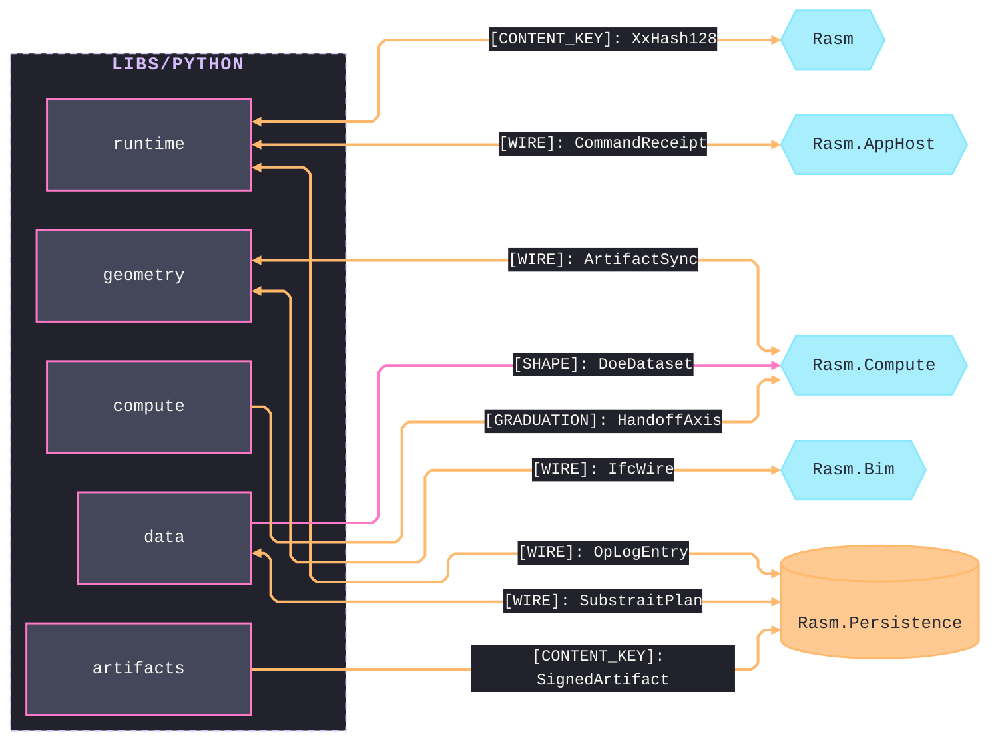

# [PYTHON_BRANCH_ARCHITECTURE]

`libs/python` is the host-free science, compute, data, geometry, and IFC companion. `runtime` mints the shared value shapes; `compute`, `data`, `geometry`, and `artifacts` compose them at their boundary.

## [01]-[DOMAIN_MAP]

```text codemap
libs/python/
├── runtime/    # Host-free execution foundation four siblings compose
├── compute/    # Offline scientific evidence that graduates through one rail
├── data/       # Portable data interchange: tabular, spatial, gridded, graph
├── geometry/   # Host-free geometry + IFC/BIM companion and cross-boundary owner
└── artifacts/  # Self-contained artifact-production utility under one ArtifactReceipt
```

## [02]-[SEAMS]



## [03]-[DEPENDENCY_DIRECTION]

`runtime` is the foundation and references no sibling; `compute`, `data`, `geometry`, and `artifacts` compose its owners at their boundary as settled vocabulary and mint no second copy. No package imports another package's interior.

Two named boundary compositions cross between consumers. `compute` composes the `data` DOE-frame admission arm (`FrameAdmission`/`FrameInterop`) as a study input — labelled arrays are `xarray` carriers `compute`'s array owner admits from any producer, owing no data seam. `compute` accepts `geometry` evidence through the graduation `HandoffAxis` case, crossing only on that rail. Each composes a published shape at the boundary; every other cross-folder fact rides a folder task.

Python couples to C# only at the wire. Seam registries record the package-level aggregate; file-level detail lives on the owning folder's design page and the cross-`libs/` ledger.

## [04]-[ADMISSION_POLICY]

One root manifest owns interpreter admission, dependency groups, version bounds, and `python_version` markers. This branch targets a normal-GIL CPython core; worker-lane exceptions stay in the root manifest until resolver evidence permits removal. Installation rationale stays in the manifest; package-local docs name capability, entrypoints, boundaries, and exclusions.

`protobuf` and `grpcio` are core runtime dependencies. `grpcio-tools` is codegen-only. Native rendering and OCCT/STEP concerns stay on their owning geometry/artifacts tasks and root-manifest admissions. `specklepy` is not a branch dependency.
