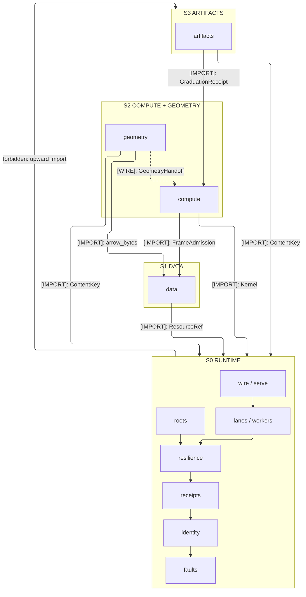
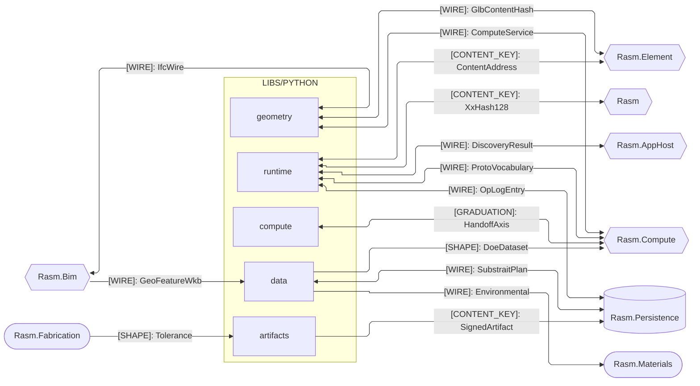
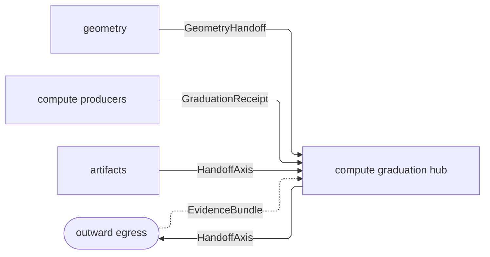
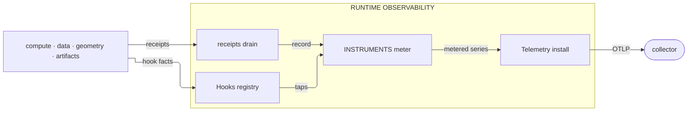

# [PYTHON_BRANCH_ARCHITECTURE]

`libs/python` is the host-free science, compute, data, geometry, and IFC companion. `runtime` mints the shared value shapes; `compute`, `data`, `geometry`, and `artifacts` compose them at their boundary.

## [01]-[DOMAIN_MAP]

```text codemap
libs/python/
├── runtime/    # Host-free execution foundation four siblings compose
├── compute/    # Offline scientific evidence that graduates through one rail
├── data/       # Portable data interchange: tabular, spatial, gridded, graph
├── geometry/   # Host-free geometry + IFC/BIM companion and cross-boundary owner
└── artifacts/  # Self-contained artifact-production utility under one ArtifactReceipt
```

## [02]-[STRATA]

- S0 `runtime` — imports no sibling and mints every shared rail exactly once; machinery a second sibling composes homes here, at the lowest stratum every consumer references, so a sibling extends a runtime owner by one row and mints no parallel.
- S1 `data` — composes runtime alone and publishes the surfaces its upper strata import: the tabular contract (`FrameAdmission`/`FrameInterop`) and the columnar `arrow_bytes` projection; the mesh and point-record shapes (`MeshPayload`, `PointRecordTable`) cross to geometry as seam payloads, never imports.
- S2 `compute` + `geometry` — peers composing runtime and data; no import crosses between them, so geometry evidence enters `compute` as `GeometryHandoff` wire data.
- S3 `artifacts` — composes runtime and compute's graduation handoff; geometry scene facts cross one-way as GLB bytes admitted through `SceneGrid.of_glb`, and no package imports another's interior — cross-package coupling is a published boundary import or a content-keyed wire.



## [03]-[SEAMS]

Python couples to C# only at the wire — content-keyed shapes cross serialized, never as imported code. Each edge freezes one {KIND, name, direction} representative at the owner's spelling; companion legs fold to prose — runtime↔Rasm.AppHost also carries `TraceContext` and `HlcStamp`, runtime↔Rasm.Compute an `XxHash128` leg, `ContentAddress` spells from the Element owner over the runtime `ContentKey` minting, and the graduation seam's reverse payload is `EvidenceBundle`, C#-owned as `GraduationEvidence`. File-level detail lives on the owning folder's design page and the cross-`libs/` ledger.



Every crossing decodes exactly once, at the owning package endpoint its edge names; a sibling composes the decoded vocabulary through that endpoint. Runtime's transport plane alone holds the branch proto vocabulary and its descriptor drift gate, grading schema drift at boot before the first RPC.

## [04]-[INTERNAL]

Branch evidence crosses outward through one spine: geometry's evidence graduates into `compute` as `GeometryHandoff` wire data, every compute producer folds its receipts onto the graduation hub, `artifacts` projects its graduating evidence onto the same axis, and the hub's `HandoffAxis` is the one egress all branch evidence crosses. Reverse evidence returns as `EvidenceBundle` and decodes at the same hub, so egress and return meet at one owner.



Telemetry converges the same way: runtime's observability owner is the branch's one emission substrate — `Hooks` registers every package's hook points under package-qualified ids, one `INSTRUMENTS` table owns every instrument as a row, and `Telemetry` alone installs OTLP egress at the composition root. A sibling's telemetry is a registration row on that owner — a hook point, an instrument row, a receipt folded through the drain — and its series leave the branch as opaque OTLP transport, never decoded branch vocabulary.



## [05]-[ROUTING]

| [INDEX] | [CHANGE]                            | [OWNER_SURFACE]                    | [SHAPE_OF_THE_EDIT]                              |
| :-----: | :---------------------------------- | :--------------------------------- | :----------------------------------------------- |
|  [01]   | machinery a second sibling composes | `runtime`                          | one S0 owner row every consumer imports          |
|  [02]   | a graduating evidence axis          | `compute/graduation/handoff.py`    | one `HandoffAxis` case                           |
|  [03]   | a branch metric or signal           | `runtime/observability/metrics.py` | one `INSTRUMENTS` row                            |
|  [04]   | a hook point                        | `runtime/observability/hooks.py`   | one `HookPoint` row under a package-qualified id |
|  [05]   | a C#-minted proto wire family       | `runtime/transport/shapes.py`      | one `PROTO_VOCABULARY` row the drift gate proves |
|  [06]   | a package dependency                | root `pyproject.toml`              | one admission row in the owning group            |

## [06]-[ADMISSION_POLICY]

One root manifest owns interpreter admission, dependency groups, version bounds, and `python_version` markers. This branch targets a normal-GIL CPython core; worker-lane exceptions stay in the root manifest until resolver evidence permits removal. Installation rationale stays in the manifest; package-local docs name capability, entrypoints, boundaries, and exclusions.

`protobuf` and `grpcio` are core runtime dependencies. `grpcio-tools` is codegen-only. Native rendering and OCCT/STEP concerns stay on their owning geometry/artifacts tasks and root-manifest admissions. `specklepy` is not a branch dependency.
