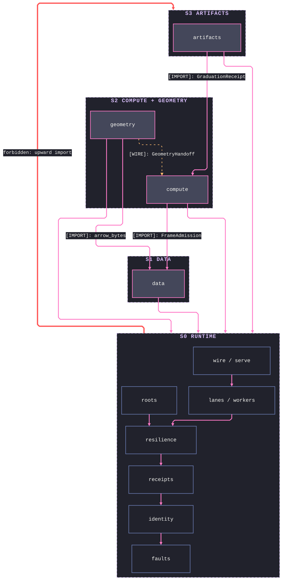
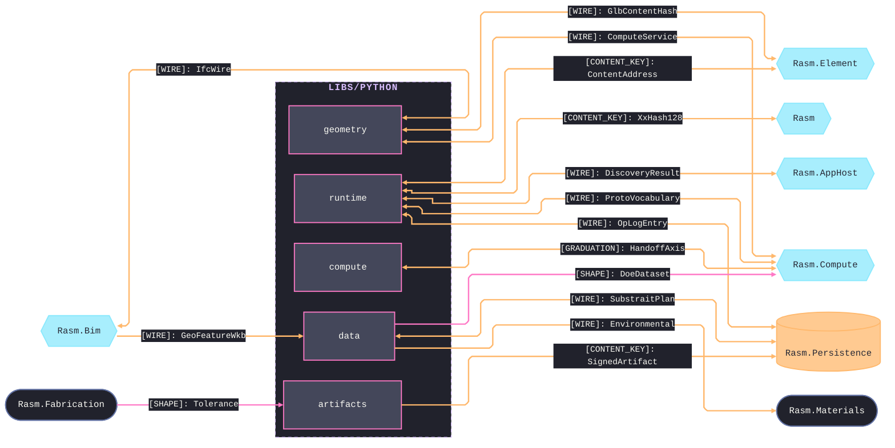

# [PYTHON_BRANCH_ARCHITECTURE]

`libs/python` is the host-free science, compute, data, geometry, and IFC companion. `runtime` mints the shared value shapes; `compute`, `data`, `geometry`, and `artifacts` compose them at their boundary.

## [01]-[DOMAIN_MAP]

```text codemap
libs/python/
├── runtime/    # Host-free execution foundation four siblings compose
├── compute/    # Offline scientific evidence that graduates through one rail
├── data/       # Portable data interchange: tabular, spatial, gridded, graph
├── geometry/   # Host-free geometry + IFC/BIM companion and cross-boundary owner
└── artifacts/  # Self-contained artifact-production utility under one ArtifactReceipt
```

## [02]-[STRATA]

- S0 `runtime` — mints every shared rail exactly once (`faults`/`resilience`, `identity`, `receipts`, `lanes`/`workers`, `roots`, `wire`/`serve`) and imports no sibling; worker, lane, retry, content-key, and receipt logic root here and nowhere else.
- S1 `data` — composes runtime alone and publishes the surfaces its upper strata import: the tabular contract (`FrameAdmission`/`FrameInterop`) and the columnar `arrow_bytes` projection; the mesh and point-record shapes (`MeshPayload`, `PointRecordTable`) cross to geometry as seam payloads, never imports.
- S2 `compute` + `geometry` — peers composing runtime plus data (compute imports `FrameAdmission`/`FrameInterop`, geometry imports `arrow_bytes`); no import crosses between them — geometry evidence enters compute as `GeometryHandoff` wire, and compute's graduation hub (`HandoffAxis`) is the one egress all branch evidence crosses.
- S3 `artifacts` — composes runtime plus compute's graduation handoff (`GraduationReceipt`); geometry scene facts cross as glb bytes admitted through `SceneGrid.of_glb` into `MeshScene`, and no package imports another's interior — cross-package coupling is a published boundary import or a content-keyed wire.



## [03]-[SEAMS]

Python couples to C# only at the wire — content-keyed shapes cross serialized, never as imported code. Each edge freezes one {KIND, name, direction} representative at the owner's verbatim spelling; companion legs fold to prose — runtime↔Rasm.AppHost also carries `TraceContext` and `HlcStamp`, runtime↔Rasm.Compute an `XxHash128` leg, runtime↔Rasm.Element's `ContentAddress` spells from the Element owner with the runtime `ContentKey` minting beneath it, and the graduation seam's reverse payload is `EvidenceBundle`, C#-owned as `GraduationEvidence`. This registry records the package-level aggregate; file-level detail lives on the owning folder's design page and the cross-`libs/` ledger.



## [04]-[ADMISSION_POLICY]

One root manifest owns interpreter admission, dependency groups, version bounds, and `python_version` markers. This branch targets a normal-GIL CPython core; worker-lane exceptions stay in the root manifest until resolver evidence permits removal. Installation rationale stays in the manifest; package-local docs name capability, entrypoints, boundaries, and exclusions.

`protobuf` and `grpcio` are core runtime dependencies. `grpcio-tools` is codegen-only. Native rendering and OCCT/STEP concerns stay on their owning geometry/artifacts tasks and root-manifest admissions. `specklepy` is not a branch dependency.
