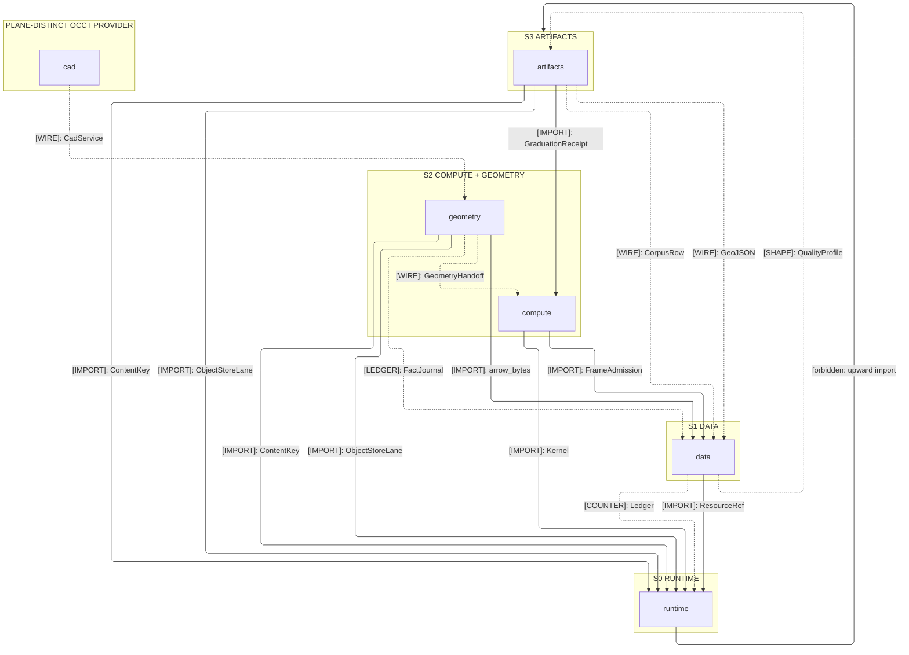
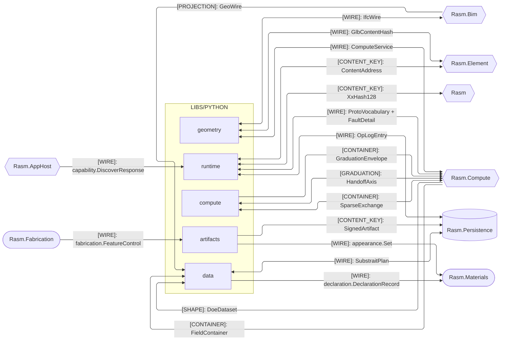
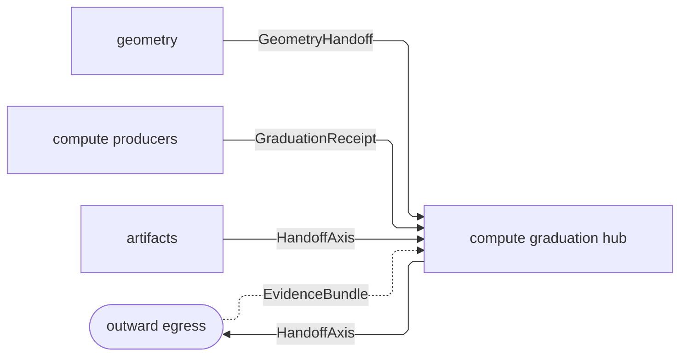
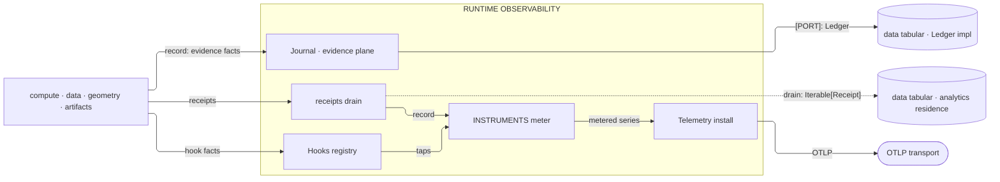

# [PYTHON_BRANCH_ARCHITECTURE]

`libs/python` orders the branch packages in acyclic upward-only import strata: the `runtime` floor, `data` above it, the `compute` and `geometry` peers over both, and `artifacts` beneath the app root. `rasm.contracts` enters from the `libs/contracts/gen/python` import root every package reads, and `cad` rides plane-distinct over runtime's transport floor alone.

## [01]-[DOMAIN_MAP]

```text codemap
libs/python/
├── runtime/    # Host-free execution foundation four siblings compose
├── compute/    # Offline scientific evidence that graduates through one rail
├── data/       # Portable data interchange: tabular, spatial, gridded, graph
├── geometry/   # Host-free geometry + IFC/BIM production and cross-boundary owner
├── artifacts/  # Publication and print-production engine under one ArtifactReceipt
└── cad/        # OCCT exact-modeling provider; generated CadService is its only branch boundary
```

## [02]-[STRATA]

Cross-package coupling is a published boundary import or a content-keyed wire; no package imports another's interior.

- S0 `runtime` — imports no sibling and mints every shared rail exactly once; a sibling extends a runtime owner by one row, never a parallel mint.
- `rasm.contracts` — admitted import root at `libs/contracts/gen/python`, never a stratum: generation authors every module, and siblings import it.
- S1 `cad` — plane-distinct exact-modeling provider over the import root and runtime's `transport/artifact` alone; no sibling imports its owners.
- S1 `data` — composes runtime alone; upper strata import its `FrameAdmission`/`FrameInterop` tabular contract and `arrow_bytes` columnar projection.
- S2 `compute` + `geometry` — peers over runtime and data; geometry evidence enters `compute` as `GeometryHandoff` wire, never an import.
- S2→S1 `geometry` lands its mesh facts on data's `FactJournal` ledger leg — a wire-grain crossing beside its `arrow_bytes` import.
- S3 `artifacts` — composes runtime and compute's graduation handoff; geometry scene facts cross one-way as GLB bytes through `SceneGrid.of_glb`.
- S3 data wires — `artifacts` lands `CorpusRow` and `GeoJSON` onto data's planes and reads back `QualityProfile`, wire-grain, never an import.
- S4 app root — the composing application seats outside `libs/python` and binds every declared port.
- S4 port law — `runtime` declares a port at S0, an upper stratum binds it at the root, and an unbound port refuses with typed evidence.
- S4 counter-edge — `data` supplies the `Ledger` the journal plane writes through, root-bound; S0 consumes the value, importing no owner.
- S4 sink law — `artifacts` declares `ProductSink`, the root binds it over runtime `ObjectStoreLane`, the streaming media sink composing directly.


```mermaid
---
config:
  layout: elk
  flowchart:
    curve: linear
    padding: 25
---
flowchart TB
    accTitle: Python branch import strata
    accDescr: Import strata from artifacts down to the runtime foundation, wire-grain crossings dashed beside the root-bound Ledger counter-edge.
    subgraph S3["S3 ARTIFACTS"]
        Artifacts[artifacts]
    end
    subgraph S2["S2 COMPUTE + GEOMETRY"]
        Compute[compute]
        Geometry[geometry]
    end
    subgraph S1["S1 DATA"]
        Data[data]
    end
    subgraph S0["S0 RUNTIME"]
        Runtime[runtime]
    end
    subgraph ISO["PLANE-DISTINCT OCCT PROVIDER"]
        Cad[cad]
    end
    Artifacts e1@-->|"[IMPORT]: GraduationReceipt"| Compute
    Artifacts e2@-->|"[IMPORT]: ContentKey"| Runtime
    Artifacts e3@-->|"[IMPORT]: ObjectStoreLane"| Runtime
    Artifacts e4@-.->|"[WIRE]: CorpusRow"| Data
    Artifacts e5@-.->|"[WIRE]: GeoJSON"| Data
    Data e6@-.->|"[SHAPE]: QualityProfile"| Artifacts
    Compute e7@-->|"[IMPORT]: FrameAdmission"| Data
    Compute e8@-->|"[IMPORT]: Kernel"| Runtime
    Geometry e9@-->|"[IMPORT]: arrow_bytes"| Data
    Geometry e10@-.->|"[WIRE]: GeometryHandoff"| Compute
    Geometry e11@-.->|"[LEDGER]: FactJournal"| Data
    Geometry e12@-->|"[IMPORT]: ContentKey"| Runtime
    Geometry e13@-->|"[IMPORT]: ObjectStoreLane"| Runtime
    Data e14@-->|"[IMPORT]: ResourceRef"| Runtime
    Data e15@-.->|"[COUNTER]: Ledger"| Runtime
    Artifacts ~~~ Compute
    Runtime f1@-->|"forbidden: upward import"| S3
    Cad e16@-.->|"[WIRE]: CadService"| Geometry
```

## [03]-[SEAMS]

Python meets peer branches through corpus contracts, serialized artifacts, and native publisher containers. Each edge freezes one `{KIND, name, direction}` representative at the endpoint spelling and folds its peer legs to prose: runtime↔Rasm.AppHost also carries `TraceContext` and `HlcStampWire`, runtime↔Rasm.Compute an `XxHash128` leg, and runtime↔Rasm.Persistence a bidirectional `[CONTRACT]: BackendContract` leg beside its drawn wire.

`ContentAddress` spells from the Element owner over the runtime `ContentKey` mint, and the graduation descriptor payload is `EvidenceBundle`, C#-spelled `GraduationEvidence`; its serving-population reference crosses separately as `GraduationEnvelope`.


```mermaid
---
config:
  layout: elk
  flowchart:
    curve: linear
    padding: 25
---
flowchart LR
    accTitle: Python branch C# seam registry
    accDescr: Python packages exchanging kinded contract shapes with their C# counterparts; every edge carries kind plus shape.
    subgraph python[LIBS/PYTHON]
        Geometry[geometry]
        Runtime[runtime]
        Compute[compute]
        Data[data]
        Artifacts[artifacts]
    end
    Bim{{Rasm.Bim}}
    Element{{Rasm.Element}}
    Rasm{{Rasm}}
    AppHost{{Rasm.AppHost}}
    RasmCompute{{Rasm.Compute}}
    Persistence[(Rasm.Persistence)]
    Materials([Rasm.Materials])
    Fabrication([Rasm.Fabrication])
    Geometry e1@<-->|"[WIRE]: IfcWire"| Bim
    Geometry e2@<-->|"[WIRE]: GlbContentHash"| Element
    Geometry e3@<-->|"[WIRE]: ComputeService"| RasmCompute
    Runtime e4@<-->|"[CONTENT_KEY]: ContentAddress"| Element
    Runtime e5@<-->|"[CONTENT_KEY]: XxHash128"| Rasm
    AppHost e6@-->|"[WIRE]: capability.DiscoverResponse"| Runtime
    Runtime e7@<-->|"[WIRE]: ProtoVocabulary + FaultDetail"| RasmCompute
    Runtime e8@<-->|"[WIRE]: OpLogEntry"| Persistence
    Compute e11@<-->|"[GRADUATION]: HandoffAxis"| RasmCompute
    RasmCompute e12@-->|"[SHAPE]: DoeDataset"| Data
    Data e13@<-->|"[WIRE]: SubstraitPlan"| Persistence
    Data e14@-->|"[WIRE]: declaration.DeclarationRecord"| Materials
    Bim e15@-->|"[PROJECTION]: GeoWire"| Data
    Artifacts e16@-->|"[WIRE]: appearance.Set"| Materials
    Artifacts e17@-->|"[CONTENT_KEY]: SignedArtifact"| Persistence
    Fabrication e18@-->|"[WIRE]: fabrication.FeatureControl"| Artifacts
    RasmCompute e19@-->|"[CONTAINER]: FieldContainer"| Data
    Compute e20@<-->|"[CONTAINER]: SparseExchange"| RasmCompute
    Compute e21@-->|"[CONTAINER]: GraduationEnvelope"| RasmCompute
```

Every crossing decodes exactly once, at the owning package endpoint its edge names; a sibling composes the decoded vocabulary through that endpoint. Generated `rasm.contracts` classes carry the branch proto vocabulary every folder imports, runtime's transport plane holds the generated-bindings edge — the served Connect applications, the one descriptor registry, and the two-way boot census over closure and generated services — and contract compatibility is the corpus emission's, never a runtime descriptor diff.

## [04]-[INTERNAL]

Branch evidence crosses outward through one spine: geometry's evidence graduates into `compute` as `GeometryHandoff` wire data, every compute producer folds its receipts onto the graduation hub, `artifacts` projects its graduating evidence onto the same axis, and the hub's `HandoffAxis` is the one egress all branch evidence crosses. Reverse evidence returns as `EvidenceBundle` and decodes at the same hub, so egress and return meet at one owner.


```mermaid
---
config:
  layout: elk
  flowchart:
    curve: linear
    padding: 25
---
flowchart LR
    accTitle: Python branch graduation spine
    accDescr: Producers fold evidence onto the compute graduation hub; one handoff axis crosses outward, the reverse envelope returns as dashed wire.
    Geometry[geometry] e1@-->|"GeometryHandoff"| Hub[compute graduation hub]
    Producers[compute producers] e2@-->|"GraduationReceipt"| Hub
    Artifacts[artifacts] e3@-->|"HandoffAxis"| Hub
    Hub e4@-->|"HandoffAxis"| Egress([outward egress])
    Egress e5@-.->|"EvidenceBundle"| Hub
```

Telemetry converges on runtime's observability owner: `Hooks` registers every package's hook points, one `INSTRUMENTS` table owns every instrument as a row, `Journal` owns the append-only evidence plane behind the `Ledger` port, and `Telemetry` alone installs OTLP egress. Siblings register on that owner as a hook point, an instrument row, a receipt folded through the drain, or a bound `Ledger`, and their series leave opaque on the OTLP transport. Journal facts are evidence truth; every metered series beside them rebuilds from the journal window.

`data` alone custodies the analytics residences that outlive a series window: it implements the `Ledger` port over its own commit and scan owners for the S4 root to bind, rows each durable plane on that same matrix, and lands each drained receipt stream into its residence through that same matrix, so history and health read one fact stream.


```mermaid
---
config:
  layout: elk
  flowchart:
    curve: linear
    padding: 25
---
flowchart LR
    accTitle: Python branch observability spine
    accDescr: How sibling facts, receipts, and evidence converge on runtime observability and leave through OTLP and the Ledger-bound journal.
    Siblings[compute · data · geometry · artifacts]
    subgraph runtime[RUNTIME OBSERVABILITY]
        Hooks[Hooks registry]
        Drain[receipts drain]
        Instruments[INSTRUMENTS meter]
        Journal[Journal · evidence plane]
        Telemetry[Telemetry install]
    end
    Ledger[(data tabular · Ledger impl)]
    Residence[(data tabular · analytics residence)]
    Egress([OTLP transport])
    Siblings e1@-->|"hook facts"| Hooks
    Siblings e2@-->|"receipts"| Drain
    Siblings e7@-->|"record: evidence facts"| Journal
    Hooks e3@-->|"taps"| Instruments
    Drain e4@-->|"record"| Instruments
    Journal e8@-->|"[PORT]: Ledger"| Ledger
    Drain e9@-.->|"drain: Iterable[Receipt]"| Residence
    Instruments e5@-->|"metered series"| Telemetry
    Telemetry e6@-->|"OTLP"| Egress
```

## [05]-[ROUTING]

| [INDEX] | [CHANGE]                            | [OWNER_SURFACE]                     | [SHAPE_OF_THE_EDIT]                                   |
| :-----: | :---------------------------------- | :---------------------------------- | :---------------------------------------------------- |
|  [01]   | machinery a second sibling composes | `runtime`                           | one S0 owner row every consumer imports               |
|  [02]   | a graduating evidence axis          | `compute/graduation/handoff.py`     | one `HandoffAxis` case                                |
|  [03]   | a branch metric or signal           | `runtime/observability/metrics.py`  | one `INSTRUMENTS` row                                 |
|  [04]   | a hook point                        | `runtime/observability/hooks.py`    | one `HookPoint` row under a package-qualified id      |
|  [05]   | an external proto wire family       | `libs/contracts/proto/…/<f>.proto`  | one message on its family source; consumers import it |
|  [06]   | a package dependency                | root `pyproject.toml`               | one admission row in the owning group                 |
|  [07]   | a durable evidence fact             | `runtime/observability/journal.py`  | one `Fact` case beside its `Retain` class             |
|  [08]   | a metered resource                  | `runtime/observability/journal.py`  | one `Resource` row in both branch spellings           |
|  [09]   | a retention class                   | `runtime/observability/journal.py`  | one `Retain` member with its window row               |
|  [10]   | an analytics residence              | `data/tabular/lakehouse.py`         | one row answering the estate residence floor          |
|  [11]   | a remote columnar query end         | `data/tabular/query.py`             | one `RemoteDriver` row on the one Flight plane        |
|  [12]   | a graded benchmark subject          | `runtime/observability/profiles.py` | one roster row at the owning folder                   |
|  [13]   | a store-reaching residence consumer | `runtime/transport/roots.py`        | one `store_handle` call carrying config+provider      |

## [06]-[ADMISSION_POLICY]

Root manifest owns the virtual workspace root, the Python 3.15 platform, dependency groups, version bounds, and `python_version` markers; member manifests hold distribution identity and bare-name edges, and `uv.lock` fixes every resolved version. Native wheels stopping below the floor ride the Forge python-overlay `.pth` behind one marker row `RULINGS.md` settles. Native rendering homes to `artifacts`, OCCT/STEP admission to `cad`, and every admission resolves its whole touch-point set live at `docs/laws/topology.md` `[MANIFEST_ADMISSION]`.
