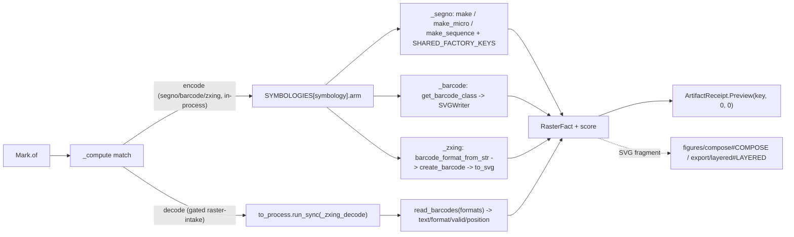

# [PY_ARTIFACTS_MARKS]

The machine-readable-mark owner. `Mark` is ONE owner over the host-free encoded-mark codec discriminating symbology over the closed `Symbology` vocabulary: segno (QR/Micro-QR and structured-append sequence generation with the full factory-parameter axis and dependency-free SVG serialization), python-barcode (the linear 1D symbology registry over `SVGWriter`), and zxing-cpp (the 2D-matrix DataMatrix/PDF417/Aztec/MaxiCode `create_barcode`/`Barcode.to_svg` dependency-free encode arm plus the `read_barcodes` decode inverse) — all importing on the cp315 core. One mark surface, not a per-symbology code class, not a per-operation function family, and not an erased `params` bag. Every generation arm serializes to a dependency-free SVG string needing no raster, so all three encode arms (segno, python-barcode, AND the zxing-cpp 2D-matrix arm) resolve synchronously on the cp315 core inside the async capsule — zxing-cpp source-builds its native pybind11 extension from sdist and imports on cp315 the way shapely/pyarrow source-build, so its 2D-matrix `Mark` arm is a true in-process arm beside the segno/python-barcode arms. The `Decode` op is the encode/decode round-trip inverse the generation arms cannot express, reading any encoded mark through zxing-cpp `read_barcodes`; it is the one arm that crosses the `faults`-owned `to_process.run_sync` subprocess seam onto the gated-band worker, ONLY because `read_barcodes` opens its raster through the gated-band Pillow `Image.open`, not because `zxingcpp` cannot import on the core. Every operation folds into one typed `RasterFact` and returns a `RuntimeRail[ArtifactReceipt]` whose `ArtifactReceipt.Preview` carries the content key and the default zero dimensions (the SVG path carries no pixel raster). `RasterFact` is declared on the gated-band `figures/raster#RASTER` owner; this page re-declares the minimal `(data, width, height, score)` shape so the in-process mark codec folds the same fact into the shared `ArtifactReceipt.Preview` without importing the gated-band owner.

## [01]-[INDEX]

- [01]-[MARK]: machine-readable-mark generation-and-decode owner over segno, python-barcode, and zxing-cpp — the `Symbology` vocabulary keyed against the `SYMBOLOGIES` segno/barcode/zxing member-acceptor table spanning QR/Micro-QR, linear 1D, and 2D-matrix classes, the `MarkOp` two-case family (`Encode` symbology generation folding to one in-process SVG `RasterFact`, `Decode` the round-trip inverse over `read_barcodes`), all dispatch-table-folded with zero re-discriminating arm.

## [02]-[MARK]

- Owner: `Mark` the one machine-readable-mark owner discriminating operation over the closed `MarkOp` family; `MarkOp` an `expression.tagged_union` whose every case carries its own typed payload, never a shared erased `params` dict; `RasterFact` the one typed result every arm folds into — `data`/`width`/`height`/`score` recovering the encoded SVG bytes, the default zero dimensions, and the designator/check-digit/decode score map — projected to `receipt/receipt#RECEIPT` `ArtifactReceipt.Preview` at the boundary; segno the QR/sequence arm, python-barcode the linear arm, and zxing-cpp the 2D-matrix arm folded by the `SYMBOLOGIES` row table, with the `Decode` round-trip the zxing-cpp `read_barcodes` inverse. The `SYMBOLOGIES` sub-axis table is the egress-grade collapse: a row carries a callable arm and its own settled package member, the op routes by one table lookup, never a per-operation sibling function and never a re-discriminating `match` inside an arm. The `Encode` op folds every `Symbology` through one of three SVG arms keyed by the row; the `Decode` op is the encode/decode inverse the generation arms cannot express, reading any encoded mark through the zxing-cpp `read_barcodes` decoder.
- Cases: `MarkOp` cases — `Encode(content, symbology, opts)` (the machine-readable-mark arm carrying the typed `Symbology` sub-axis — QR/Micro-QR/structured-append sequence over segno, the linear (1D) symbologies over the python-barcode registry, and the 2D-matrix DataMatrix/PDF417/Aztec/MaxiCode classes over zxing-cpp `create_barcode`/`Barcode.to_svg`, all serializing to the dependency-free SVG path) · `Decode(payload, formats)` (the round-trip inverse over zxing-cpp `read_barcodes`, recovering the encoded text, format, validity, and quad position from a raster mark) — matched by one total `match`/`case`; the QR-only literal is COLLAPSED into the `Encode` case whose `Symbology` row keys the encoder, and the 2D-matrix routing is RESOLVED by the zxing `SYMBOLOGIES` rows plus the `Decode` op, never a sibling op per symbology and never a separate-2D-matrix owner.
- Modality: `Mark.of` is the one modal-arity entrypoint discriminating on the `MarkOp` case shape — an `Encode` keys one mark from one `(content, symbology, opts)` payload, a `Decode` recovers every symbol in one raster through `read_barcodes`; the operation is the value's case, never an `encode`/`decode` knob and never a per-symbology `of` sibling.
- Entry: `Mark.of` is `async` over the runtime `async_boundary` and dispatches the `MarkOp` case, returning one `RuntimeRail[ArtifactReceipt]` whose `ArtifactReceipt.Preview` carries the content key and the default zero dimensions and whose `_facts` projection threads the designator/check-digit/decode score map — never an erased `object` a consumer re-validates; ALL three `Encode` arms (segno, python-barcode, AND the zxing-cpp 2D-matrix arm) resolve synchronously on the cp315 core inside the async capsule and render the code in-process with no Pillow dependency — segno serializers, the python-barcode `SVGWriter`, and zxing-cpp `create_barcode -> to_svg` each emit an SVG string needing no raster, and zxing-cpp source-builds and imports on cp315 so its dependency-free 2D-matrix path is a true in-process arm beside the segno/python-barcode arms; only the `Decode` op (which opens a raster through Pillow `Image.open`) crosses the runtime `reliability/faults#FAULT` `anyio.to_process.run_sync` subprocess seam onto the gated-band Pillow worker — the genuine separate-process crossing the gated `pillow` band needs because the cp315-core `execution/lanes#LANE` `to_interpreter.run_sync` subinterpreter offload shares the host interpreter version and cannot host the gated-band Pillow `read_barcodes` raster intake.
- Auto: `_compute` folds the case through one `match` — EVERY `Encode` (segno, python-barcode, OR zxing-cpp 2D-matrix) through `SYMBOLOGIES[symbology].arm` which carries its own package member, resolving in-process and returning a zero-dimension `RasterFact`: QR/Micro-QR/structured-append each a distinct segno factory row reached by `factory` over the `SHARED_FACTORY_KEYS` plus per-row `accepts` kwarg spread, never a re-`match` inside one arm; the linear (1D) symbologies through the python-barcode `get_barcode_class(name)` registry then `SVGWriter` render, the symbology resolved by registry name not a hand-picked sub-enum; the 2D-matrix rows through `_zxing` reaching the `SYMBOLOGIES[symbology].member` zxing `BarcodeFormat` via `barcode_format_from_str` then `create_barcode(content, fmt, **opts).to_svg(add_quiet_zones=True)` — all three encode arms emit dependency-free SVG on the cp315 core; the `Decode` op alone crosses `to_process.run_sync(_zxing_decode, payload, formats)` where the gated-band worker reaches `read_barcodes(image, formats=...)` over a Pillow-opened raster and stamps each symbol's `text`/`format`/`valid`/`position` onto the score map; the `_compute` `match` splits only on the in-process-encode-vs-gated-decode band (all three encode arms resolve in-process, the decode arm crosses the one `to_process.run_sync` seam), never a per-op subprocess call.
- Receipt: each operation folds into `RasterFact` and projects to `receipt/receipt#RECEIPT` `ArtifactReceipt.Preview(key, width, height)` at the rail boundary; the `Encode` arm reports the default zero dimensions (the SVG path carries no pixel raster) and stamps the resolved segno `designator` (version-and-error string), the python-barcode `get_fullcode` human-readable check digit, or the zxing resolved `format`/`ec_level` on the score map, and the `Decode` arm reports the decoded `text`/`format`/`valid`/`position` round-trip facts on the score map the rail consumer reads inline — threading those scores into the emitted `_facts` projection is the one `receipt/receipt#RECEIPT` `[SCORE_FACTS]` widening seam (the `preview` `_facts` arm projects `key`/`width`/`height` today), never a new receipt case and never silently claimed done on this page.
- Packages: `segno` (`make`/`make_micro`/`make_sequence`/`QRCode.save`/`QRCodeSequence.save`/`QRCode.designator`, the `error`/`version`/`mode`/`mask`/`encoding`/`boost_error`/`eci`/`micro`/`symbol_count` factory axis and the `dark`/`light` SVG serializer kwargs, dependency-free serializers), `python-barcode` (`get_barcode_class`/`PROVIDED_BARCODES`/`SVGWriter`/`Barcode.write`/`Barcode.get_fullcode`/`errors.BarcodeNotFoundError` linear (1D) symbologies, `installed: 0.16.1`), `zxing-cpp` (`create_barcode`/`BarcodeFormat`/`Barcode.to_svg`/`barcode_format_from_str` 2D-matrix DataMatrix/PDF417/Aztec/MaxiCode dependency-free SVG encode plus `read_barcodes`/`barcode_formats_from_str`/`BarcodeFormat.All`/`Position` decode inverse, `installed: 3.0.0` — un-gated, source-built from sdist on cp315, version via `importlib.metadata.version("zxing-cpp")` not `__version__`) on the cp315 core; `pillow` (`Image.open` opening the `Decode` raster) gated `python_version<'3.15'` and reached only inside the gated-band `_zxing_decode` worker; runtime (`content_identity.ContentIdentity`, `faults.RuntimeRail`/`async_boundary` and the `faults`-owned `anyio.to_process.run_sync` subprocess seam the Pillow-opening `Decode` arm crosses — the genuine separate-process crossing distinct from the cp315-core `execution/lanes#LANE` `to_interpreter.run_sync` subinterpreter offload, both settled at their owners), `receipt/receipt#RECEIPT` (`ArtifactReceipt`).
- Growth: a new segno factory parameter is one `SHARED_FACTORY_KEYS` entry or one per-row `accepts` key; a new segno symbol kind is one `SYMBOLOGIES` row carrying the segno factory member; a new linear symbology is already covered by the python-barcode `PROVIDED_BARCODES` registry (no new row); a new 2D-matrix symbology is one `SYMBOLOGIES` row carrying the zxing `BarcodeFormat` member on the `_zxing` arm — DataMatrix/PDF417/Aztec/MaxiCode all land that way, and any further creatable zxing format (Compact PDF417, rMQR) is one more row with zero new acceptor; a new decode scope is one `Symbology` member on the `Decode` formats tuple; zero new surface.
- Boundary: a per-symbology code class family, a per-package mark entrypoint, a separate-2D-matrix owner, and an erased `params` bag are the deleted forms; no UI, no live viewer; no pixel-raster image processing (the raster transform engine is `figures/raster#RASTER`'s pillow/scikit-image/pyvips surface). segno owns QR/Micro-QR/sequence generation and serialization with no Pillow dependency, removing the former `qrcode` Pillow leak; the python-barcode linear arm uses `SVGWriter` ONLY on the in-process core path (its `ImageWriter` PNG path needs Pillow and re-introduces the leak segno removed); python-barcode is strictly linear (1D) — DataMatrix/PDF417/Aztec/MaxiCode route to the zxing-cpp 2D-matrix arm in this same owner, never a phantom python-barcode member, and an unknown registry key raises `errors.BarcodeNotFoundError` mapped at the boundary; zxing-cpp source-builds from sdist and imports on the cp315 core (un-gated, no companion-band marker), and its `to_svg` is dependency-free (no Pillow on the SVG path), so the 2D-matrix `Encode` arm is a true in-process arm beside the segno/python-barcode arms and a mixed QR + linear + 2D-matrix label sheet folds into one SVG-fragment receipt stream, while the zxing `Decode` (`read_barcodes` over a Pillow-opened raster) is the encode/decode round-trip the segno/python-barcode arms cannot express; all three `Encode` arms and their media-free render run in-process on the cp315 core, and only the `Decode` raster-intake dispatches onto the `faults`-owned `to_process.run_sync` gated-band subprocess seam — a separate process the cp315-core `to_interpreter.run_sync` subinterpreter offload cannot replace for the gated Pillow `Image.open` — where the worker imports `zxingcpp`/`PIL` at boundary scope so no gated import lands on the core page. The emitted mark SVG composes outward: `figures/compose#COMPOSE` places and annotates it as one SVG source beside chart/table fragments, and `export/layered#LAYERED` binds it as a named editable layer for the Illustrator/InDesign hand-off; this owner emits the SVG fragment and routes the placement/layer authoring outward, growing neither a compose nor a layer-emit arm.

```python signature
from collections.abc import Callable
from enum import StrEnum
from io import BytesIO
from typing import Literal

from anyio import to_process
from expression import case, tag, tagged_union
from msgspec import Struct

from rasm.runtime.content_identity import ContentIdentity
from rasm.runtime.faults import RuntimeRail, async_boundary

from artifacts.receipt.receipt import ArtifactReceipt

type MarkOpTag = Literal["encode", "decode"]


class Symbology(StrEnum):
    QR = "qr"
    MICRO_QR = "micro-qr"
    QR_SEQUENCE = "qr-sequence"
    CODE128 = "code128"
    CODE39 = "code39"
    EAN13 = "ean13"
    EAN8 = "ean8"
    UPCA = "upca"
    ITF = "itf"
    CODABAR = "codabar"
    ISBN13 = "isbn13"
    ISSN = "issn"
    PZN = "pzn"
    GS1_128 = "gs1_128"
    DATA_MATRIX = "data-matrix"
    PDF417 = "pdf417"
    AZTEC = "aztec"
    MAXICODE = "maxicode"


class RasterFact(Struct, frozen=True):
    data: bytes
    width: int = 0
    height: int = 0
    score: dict[str, str] = {}


@tagged_union(frozen=True)
class MarkOp:
    tag: MarkOpTag = tag()
    encode: tuple[str, Symbology, dict[str, object]] = case()
    decode: tuple[bytes, tuple[Symbology, ...]] = case()

    @staticmethod
    def Encode(content: str, symbology: Symbology, opts: dict[str, object] = {}) -> "MarkOp":
        return MarkOp(encode=(content, symbology, opts))

    @staticmethod
    def Decode(payload: bytes, formats: tuple[Symbology, ...] = ()) -> "MarkOp":
        return MarkOp(decode=(payload, formats))


class Mark(Struct, frozen=True):
    op: MarkOp

    async def of(self) -> RuntimeRail[ArtifactReceipt]:
        return await async_boundary(f"mark.{self.op.tag}", self._compute)

    async def _compute(self) -> ArtifactReceipt:
        match self.op:
            case MarkOp(tag="encode", encode=(content, symbology, opts)):
                fact = SYMBOLOGIES[symbology].arm(content, symbology, opts)
            case MarkOp(tag="decode", decode=(payload, formats)):
                fact = await to_process.run_sync(_zxing_decode, payload, formats)
        return ArtifactReceipt.Preview(ContentIdentity.of(f"mark-{self.op.tag}", fact.data), fact.width, fact.height)
```

`RasterFact` is the one fact every arm yields — bytes plus dimensions plus the optional score map — so `_compute` projects one shape into `ArtifactReceipt.Preview` regardless of op, the `Encode` arms report the default zero dimensions (the SVG path carries no pixel raster), and the designator/check-digit/decode score rides the same fact map both the content-key seed and the `receipt#RECEIPT` `_facts` fold project to strings; the `MarkOp` payload is typed per case, never an erased `params` dict the arm re-validates. `RasterFact` is the gated-band `figures/raster#RASTER` owner's value object re-declared here (the minimal `(data, width, height, score)` shape) so the in-process mark codec folds the same fact into the shared `ArtifactReceipt.Preview` without importing the gated-band owner.

```python signature
class MarkArm(Struct, frozen=True):
    factory: str
    accepts: tuple[str, ...]
    arm: Callable[[str, Symbology, dict[str, object]], RasterFact]
    member: str = ""


SHARED_FACTORY_KEYS = ("error", "version", "mode", "mask", "encoding", "boost_error")
ZXING_CREATE_KEYS = ("ec_level", "width", "height", "scale", "margin")


def _segno(content: str, symbology: Symbology, opts: dict[str, object]) -> RasterFact:
    import segno

    row = SYMBOLOGIES[symbology]
    keys = SHARED_FACTORY_KEYS + row.accepts
    symbol = getattr(segno, row.factory)(content, **{key: opts[key] for key in keys if key in opts})
    sink = BytesIO()
    symbol.save(sink, kind="svg", scale=opts.get("scale", 1), border=opts.get("border"), dark=opts.get("dark", "#000"), light=opts.get("light"))
    designator = {"designator": symbol.designator} if row.factory != "make_sequence" else {"symbols": str(len(symbol))}
    return RasterFact(sink.getvalue(), score=designator)


def _barcode(content: str, symbology: Symbology, opts: dict[str, object]) -> RasterFact:
    import barcode

    symbol = barcode.get_barcode_class(symbology.value)(content, writer=barcode.writer.SVGWriter())
    sink = BytesIO()
    symbol.write(sink, options=opts.get("writer_options"), text=opts.get("text"))
    return RasterFact(sink.getvalue(), score={"fullcode": symbol.get_fullcode()})


def _zxing(content: str, symbology: Symbology, opts: dict[str, object]) -> RasterFact:
    import zxingcpp

    fmt = zxingcpp.barcode_format_from_str(SYMBOLOGIES[symbology].member)
    symbol = zxingcpp.create_barcode(content, fmt, **{key: opts[key] for key in ZXING_CREATE_KEYS if key in opts})
    svg = symbol.to_svg(scale=int(opts.get("scale", 1)), add_hrt=bool(opts.get("add_hrt", False)), add_quiet_zones=bool(opts.get("add_quiet_zones", True)))
    return RasterFact(svg.encode(), score={"format": str(symbol.format), "ec_level": symbol.ec_level})


def _zxing_decode(payload: bytes, formats: tuple[Symbology, ...]) -> RasterFact:
    import zxingcpp
    from PIL import Image

    scope = zxingcpp.barcode_formats_from_str(",".join(SYMBOLOGIES[s].member for s in formats)) if formats else zxingcpp.BarcodeFormat.All
    symbols = zxingcpp.read_barcodes(Image.open(BytesIO(payload)), formats=scope)
    score = {f"{index}": f"{symbol.text}|{symbol.format!s}|{symbol.valid}|{symbol.position!s}" for index, symbol in enumerate(symbols)}
    return RasterFact(payload, score={"count": str(len(symbols)), **score})


SYMBOLOGIES: dict[Symbology, MarkArm] = {
    Symbology.QR: MarkArm("make", ("eci", "micro"), _segno),
    Symbology.MICRO_QR: MarkArm("make_micro", (), _segno),
    Symbology.QR_SEQUENCE: MarkArm("make_sequence", ("symbol_count",), _segno),
    Symbology.CODE128: MarkArm("", (), _barcode),
    Symbology.CODE39: MarkArm("", (), _barcode),
    Symbology.EAN13: MarkArm("", (), _barcode),
    Symbology.EAN8: MarkArm("", (), _barcode),
    Symbology.UPCA: MarkArm("", (), _barcode),
    Symbology.ITF: MarkArm("", (), _barcode),
    Symbology.CODABAR: MarkArm("", (), _barcode),
    Symbology.ISBN13: MarkArm("", (), _barcode),
    Symbology.ISSN: MarkArm("", (), _barcode),
    Symbology.PZN: MarkArm("", (), _barcode),
    Symbology.GS1_128: MarkArm("", (), _barcode),
    Symbology.DATA_MATRIX: MarkArm("", (), _zxing, "DataMatrix"),
    Symbology.PDF417: MarkArm("", (), _zxing, "PDF417"),
    Symbology.AZTEC: MarkArm("", (), _zxing, "Aztec"),
    Symbology.MAXICODE: MarkArm("", (), _zxing, "MaxiCode"),
}
```

The `SYMBOLOGIES` table folds every symbology to one of three SVG arms with zero re-discrimination inside an arm: the segno arm reads its own `factory` and `accepts` columns so QR, Micro-QR, and the structured-append sequence are three distinct rows resolving three distinct segno factories (`make` / `make_micro` / `make_sequence`) through `getattr`. The `SHARED_FACTORY_KEYS` tuple threads the six common factory parameters (`error` for the L/M/Q/H redundancy row, `version`, `mode`, `mask`, `encoding`, and `boost_error`) that every segno factory accepts, and the per-row `accepts` column carries only the factory-specific keys — `eci`/`micro` on the `make` row, `symbol_count` on the `make_sequence` row, none on the `make_micro` row — so the key-filtered kwarg spread threads exactly the parameters each factory admits with no over-key crashing a factory that rejects it. The `make_sequence` row spans a large payload across multiple symbols in one `QRCodeSequence.save(kind="svg")` keyed by `symbol_count` rather than a hand-stitched concatenation, and the `RasterFact.score` carries the resolved `designator` (version and error level) on the `QRCode`-yielding `make`/`make_micro` rows and the spanned-symbol count (`len(QRCodeSequence)`, the `tuple[QRCode, ...]` length) on the sequence row. The python-barcode arm resolves the registry by `Symbology.value` against `PROVIDED_BARCODES`, carries the `get_fullcode` human-readable check digit on the score, and the `factory`/`accepts` columns stay blank on the linear rows. The zxing-cpp arm reads its own `member` column — the zxing `BarcodeFormat` display name (`DataMatrix` / `PDF417` / `Aztec` / `MaxiCode`) `barcode_format_from_str` resolves to the enum, never the separatorless `.name` re-parse the 3.0 `str()` rename breaks — then `create_barcode(content, fmt, **opts)` keyed by the `ZXING_CREATE_KEYS` (`ec_level`/`width`/`height`/`scale`/`margin`) filtered spread and `to_svg(add_quiet_zones=True)` for dependency-free output, stamping the resolved `format` and `ec_level` on the score; MaxiCode is creatable in zxing 3.0, so the `MAXICODE` row encodes rather than routing to a decode-only sibling. zxing-cpp source-builds from sdist and imports on the cp315 core, so the four 2D-matrix `_zxing` encode rows resolve in-process beside the segno/python-barcode arms (the `_compute` `encode` case dispatches every `Encode` through `SYMBOLOGIES[symbology].arm` in-process); only the `Decode` op crosses the `to_process.run_sync` seam, because `read_barcodes` opens its raster through the gated-band Pillow worker. No symbology mints a sibling owner; a new linear code is already a `PROVIDED_BARCODES` registry name, a new segno symbol kind is one row carrying its segno factory member and its factory-specific `accepts` keys, and a new 2D-matrix code is one row carrying its zxing `BarcodeFormat` member on the `_zxing` arm.

The `Decode` round-trip is the encode/decode inverse the segno and python-barcode generation arms cannot express: `_zxing_decode` builds the search scope from `barcode_formats_from_str(",".join(...))` over the requested `Symbology` members (or `BarcodeFormat.All` when unscoped — the `|` format-union operator is deprecated in 3.0, so the scope is a parsed string not an or-fold), opens the raster through Pillow `Image.open`, runs `read_barcodes(image, formats=scope)`, and stamps each decoded symbol's `text`/`format`/`valid`/`position` quad onto the score map keyed by symbol index plus a `count` total. It is the one arm crossing the gated `to_process.run_sync` band — `read_barcodes` accepts a PIL image, a numpy array, or a `zxingcpp.ImageView`, and the Pillow-opened raster path rides the gated-band worker — proving generation correctness from one decode pass (`create_barcode -> to_image -> read_barcodes` recovers the content with `valid=True` and the matching `format`), the round-trip a QR-only or linear-only owner cannot provide.



## [03]-[RESEARCH]

- [QR_SETTLED] [RESOLVED]: the in-process `segno.make`/`make_micro`/`make_sequence`/`QRCode.save(kind="svg")`/`QRCodeSequence.save(kind="svg")`/`QRCode.designator` spellings verify against the folder `.api` catalogue for `segno` on the cp315 core. The `segno` catalogue `[03]-[ENTRYPOINTS]` row [01] confirms `make(content, error=None, version=None, mode=None, mask=None, encoding=None, eci=False, micro=None, boost_error=True)`, row [03] `make_micro(content, error=None, version=None, mode=None, mask=None, encoding=None, boost_error=True)`, and row [04] `make_sequence(content, error=None, version=None, mode=None, mask=None, encoding=None, boost_error=True, symbol_count=None)` returning a `QRCodeSequence`, so the six `SHARED_FACTORY_KEYS` (`error`/`version`/`mode`/`mask`/`encoding`/`boost_error`) are SETTLED on every factory and the per-row `accepts` keys are SETTLED — `eci`/`micro` on the `make` row (the only factory the catalogue lists them on), none on `make_micro`, `symbol_count` on `make_sequence`. The key-filtered kwarg spread threads exactly the admitted parameters, so no over-key reaches a factory that rejects it. The `[02]-[PUBLIC_TYPES]` row confirms `QRCodeSequence` with the shared `save` serializer surface, and `[03]-[ENTRYPOINTS]` `QRCode.save(out, kind=None, **kw)` row plus the serializer-kwarg note confirm `scale`/`border`/`dark`/`light` flow through `**kw`, so the SVG `dark`/`light` foreground/background spellings are SETTLED. Structured-append spanning multiple symbols for a large payload is one `make_sequence` call plus one `QRCodeSequence.save(kind="svg")`, never a hand-stitched concatenation. The catalogue lists `QRCode.designator` on `QRCode` ONLY (row [14]), so the `make`/`make_micro` rows stamp `symbol.designator` and the `make_sequence` row stamps the spanned-symbol count instead — the `row.factory != "make_sequence"` guard never touches the `QRCodeSequence` designator surface. segno serializes SVG with no Pillow dependency, closing the former `qrcode` Pillow leak.
- [SEQUENCE_LEN] [RESOLVED]: the `len(QRCodeSequence)` spanned-symbol count on the `make_sequence` row's `RasterFact.score` is SETTLED. The `segno` `.api` `[02]-[PUBLIC_TYPES]` row [02] and the `[04]-[IMPLEMENTATION_LAW]` sequence-axis row confirm `QRCodeSequence` is a `tuple[QRCode, ...]` (a `tuple` subclass of `QRCode` symbols) spanning the structured-append set, so `len(symbol)` is the inherited `tuple.__len__` spanned-symbol count and the `[02]` capability line "a `QRCodeSequence` adds the symbol count" confirms the count is the sequence-receipt fact; the `make_sequence`/`QRCodeSequence.save(kind="svg")` legs and the `len()` count are settled with no further reflection needed.
- [BARCODE_SETTLED] [RESOLVED]: the python-barcode `get_barcode_class(name)`/`PROVIDED_BARCODES`/`barcode.writer.SVGWriter`/`Barcode.write(fp, options, text)`/`Barcode.get_fullcode`/`errors.BarcodeNotFoundError` registry and writer surface is SETTLED fence code against the folder `.api` catalogue for `python-barcode` (`installed: 0.16.1 reflected via assay api on cp315`). The catalogue `[03]-[ENTRYPOINTS]` row [03] confirms `get_barcode_class(name) -> type[Barcode]` (the same object as `get_class`), row [04] `PROVIDED_BARCODES` the sorted `list[str]` accepted name keys, `Barcode.write(fp, options=None, text=None) -> None` (row [02]), and `Barcode.get_fullcode()` the full human-readable code (row [05]), and `[02]-[PUBLIC_TYPES]` row [03] confirms `SVGWriter()` zero-arg construction (the default, dependency-free `xml.dom.minidom` SVG writer), so the `_barcode` body (including the `text` write argument and the `get_fullcode` check-digit score) and the linear `Symbology` rows (`CODE128`/`CODE39`/`EAN13`/`EAN8`/`UPCA`/`ITF`/`CODABAR`/`ISBN13`/`ISSN`/`PZN`/`GS1_128`) are settled — each `Symbology.value` is a `PROVIDED_BARCODES` name key resolving the full registry, never a hand-picked sub-enum that silently drops Codabar/ISBN, and an unknown key raises `errors.BarcodeNotFoundError` (row [02]) mapped at the boundary, never a bare `KeyError`. python-barcode is strictly linear (1D): the 2D-matrix DataMatrix/PDF417/Aztec/MaxiCode classes are NOT python-barcode members (the catalogue confirms linear-only) and route to the zxing-cpp 2D-matrix arm in this same owner, never a phantom python-barcode member. The `SVGWriter` is the ONLY admitted writer on the in-process core path (the `ImageWriter` PNG path needs Pillow and re-introduces the leak segno removed).
- [ZXING_SETTLED] [RESOLVED]: the zxing-cpp `create_barcode(content, format, **kwargs)`/`Barcode.to_svg(scale, add_hrt, add_quiet_zones)`/`read_barcodes(image, formats=...)`/`barcode_format_from_str`/`barcode_formats_from_str` surface is SETTLED fence code against the folder `.api` catalogue for `zxing-cpp` (`installed: 3.0.0` reflected by direct import on the cp315 floor; version via `importlib.metadata.version("zxing-cpp")`, the C++ extension carries no `__version__`). The catalogue `[03]-[ENTRYPOINTS]` row [01] confirms `create_barcode(content, format, **kwargs) -> Barcode` (error-correction/geometry ride `**kwargs` — `ec_level` a string `'L'`/`'M'`/`'Q'`/`'H'` for QR or an integer for Aztec/PDF417, plus `width`/`height`/`scale`/`margin`, NEVER a positional `ec_level`), row [02] `to_svg(scale=1, add_hrt=False, add_quiet_zones=True) -> str` dependency-free, row [06] `barcode_format_from_str(str) -> BarcodeFormat`, and `read_barcodes(image, formats=...) -> list[Barcode]` (row [01] of the decode scope) returning per-symbol `text`/`format`/`valid`/`position`/`orientation`/`error`/`content_type`/`ec_level`, so the `_zxing`/`_zxing_decode` bodies and the `DATA_MATRIX`/`PDF417`/`AZTEC`/`MAXICODE` rows are settled. Three 3.0 facts are load-bearing and verified by direct reflection: (1) `MaxiCode` is CREATABLE in 3.0 — `create_barcode("...", BarcodeFormat.MaxiCode).to_svg()` succeeds (the 2.x decode-only limitation was lifted by the writer rewrite), so the `MAXICODE` row encodes and is never recorded as decode-only; (2) the `BarcodeFormat` 3.0 ToString rename means `str(BarcodeFormat.X)` is the human display name WITH separators (`'Data Matrix'`/`'QR Code'`/`'Code 128'`/`'EAN-13'`/`'Micro QR Code'`) while `.name` is separatorless (`'DataMatrix'`/`'QRCode'`/`'Code128'`/`'EAN13'`) — the fence resolves a format through the `member` display name via `barcode_format_from_str` (which accepts both spellings), never by formatting the enum and re-parsing the separatorless name; (3) the `|` format-union operator is DEPRECATED in 3.0 (`pass array or tuple instead`), so the `Decode` scope is built from `barcode_formats_from_str(",".join(...))` and the all-formats default is the `BarcodeFormat.All` set member (no `BarcodeFormat.Any` exists and `BarcodeFormats()` is not zero-arg constructible). The encode/decode round-trip is verified: `create_barcode -> to_image -> read_barcodes` recovers the content with `valid=True` and the matching `format`. zxing-cpp is un-gated on cp315 — it ships no cp315 wheel and no abi3 wheel (newest wheel is cp314), so uv resolves the sdist and source-builds the native pybind11 extension on cp315 the same way shapely/pyarrow source-build, using the Parametric_Forge scientific toolchain (CMake + clang++) as the compiler substrate; the `zxingcpp` import resolves directly on the cp315 core, so the four 2D-matrix `Encode` rows render in-process beside the segno/python-barcode arms, and only the `Decode` op crosses the `faults`-owned `to_process.run_sync` seam because `read_barcodes` opens its raster through the gated-band Pillow worker.
- [DECODE_SEAM] [RESOLVED]: `_zxing_decode` is the one arm crossing the `python_version<'3.15'` band through `anyio.to_process.run_sync(_zxing_decode, payload, formats)`, importing `zxingcpp`/`PIL` at boundary scope inside the gated-band worker, never on the cp315-core owner; the zxing `read_barcodes`/`barcode_formats_from_str`/`BarcodeFormat.All` decode spellings and the `Position` quad (`str(position)` = `"x0xy0 x1xy1 x2xy2 x3xy3"`, the `.top_left`/`.top_right`/`.bottom_right`/`.bottom_left` corner `Point`s) verify against the folder `zxing-cpp` `.api` `[02]-[PUBLIC_TYPES]` rows [03]/[04] and `[03]-[ENTRYPOINTS]` decode rows, and the Pillow `Image.open` raster intake verifies against the folder `pillow` `.api`. The `zxingcpp` import itself resolves on the cp315 core (no companion-band gate) — the `Decode` arm crosses the `to_process.run_sync` seam ONLY because `read_barcodes` opens its raster through the gated-band Pillow `Image.open`, not because `zxingcpp` cannot import; the zxing `.api` `[04]` import-axis row confirms exactly this split (the SVG `create_barcode -> to_svg` path in-process, only the `to_image`/`read_barcodes` raster path on the gated-band Pillow worker). `_zxing_decode` is a module-level function dispatched by qualified name across the process seam (`to_process.run_sync` cannot target a bound method or closure), so it stays out of the `Mark` owner deliberately, not as a stray helper. The one open item is the branch-catalogue gap the sibling `figures/raster#RASTER_SEAM` already tracks: the branch `anyio` `.api` catalogue reflects `open_process`/`run_process`/`to_thread.run_sync`/`to_interpreter.run_sync` but no `to_process` row, so `assay api` reflection over `anyio.to_process` deepens the branch catalogue to match the settled owner spelling, never re-opening this fence.
- [RASTER_SPLIT] [RESOLVED]: the pixel-raster image-processing concern (pillow Thumbnail/Convert/Montage, the scikit-image 52-member Transform family, the pyvips fused-libvips provider, the python-magic media-detect gate) is split to the sibling `figures/raster#RASTER` owner — the genuine gated `python_version<'3.15'` subprocess-seam owner whose every arm crosses the `to_process.run_sync` band. This `marks` owner is the disjoint in-process cp315-core encoded-mark codec: the three encode arms resolve in-process and only the zxing `Decode` raster-intake crosses back to the gated band. `RasterFact` is declared on the gated-band `figures/raster#RASTER` owner and re-declared here as the minimal `(data, width, height, score)` shape so both producers fold into the shared `receipt/receipt#RECEIPT` `ArtifactReceipt.Preview` with no cross-owner import; the emitted mark SVG fragment composes outward to `figures/compose#COMPOSE` (placement/annotation) and `export/layered#LAYERED` (named editable layer), the consume edges those owners already declare.
