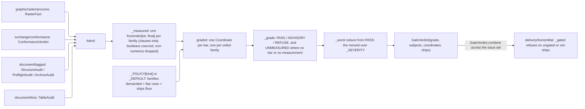

# [PY_ARTIFACTS_GATE]

`QualityGate` grades concrete producer facts and document audits against the policy for their artifact kind. `GateVerdict.combine` preserves the worst grade across an issue.

Absence is a GRADE, never a pass: `Grade.UNMEASURED` is the value a coordinate takes when the family never arrived or the supplied family never carried the axis, so a gate that passes what it never measured is unrepresentable rather than merely discouraged. Every coordinate reduces to one `Bar` row over one named numeric axis — a clause failure is the scalar `1.0`, a boolean verdict field the scalar `1.0`/`0.0` — so one policy grammar spans four heterogeneous producers, and a bar naming an axis its producer's own `Struct` never declares raises at IMPORT off the `structs.fields` derivation rather than reading `UNMEASURED` forever at a fold. The fold is associative over both axes: `Grade` is a monoid with `PASS` as identity taking the worst grade any coordinate reached, and `GateVerdict.combine` folds per-artifact verdicts into the one issue-wide verdict `delivery/transmittal#TRANSMITTAL`'s admission gate reads.

## [01]-[INDEX]

- [02]-[VERDICT]: the grade ladder, the bound and family vocabularies, the `Bar` threshold row, and the `Coordinate`/`GateVerdict` algebra closed under associative combination.
- [03]-[POLICIES]: the per-`ArtifactKind` `KindPolicy` rows, the clause-bar derivation off each producer's own clause vocabulary, the declared default row, and the import-time axis gate.
- [04]-[GATE]: the `QualityGate` owner — its accumulating shape-dispatched admission, the one normalized measurement projection per family, and the total `graded` fold.

## [02]-[VERDICT]

- Owner: `Grade` is the ONE closed severity ladder every family folds onto — `PASS`, `ADVISORY`, `UNMEASURED`, `REFUSE` — ranked by the `_SEVERITY` correspondence rather than by declaration order, so the fold is a `max` over one integer and a new grade is one member plus one row. `UNMEASURED` outranks `ADVISORY` and is outranked by `REFUSE` because an unmeasured axis is a worse epistemic state than a measured miss and a better one than a proved breach; whether it SHIPS is a policy row, never this ladder. `Bound` closes the comparison direction (`FLOOR` the value must reach, `CEILING` the value must not exceed) so a threshold literal never encodes its own direction in a name. `GateFamily` closes the contributing verdict producers and IS the `GateEvidence` case roster — one vocabulary, gated at import off `annotationlib.get_annotations`, never a hand-synced pair.
- Law: `Bar` is the ONE threshold row over `(family, axis, bound, threshold, breach)`, and it grades exactly one named numeric axis. A graded ladder is an `ADVISORY` row beside a `REFUSE` row over one axis, so a per-axis severity ramp costs one row and no field. `breach` defaults `REFUSE` because a declared bar states a requirement; an advisory bar names its softness explicitly at the row.
- Law: `Coordinate` carries `measured: Option[float]` and `bar: Option[Bar]`, and `_grade` reads BOTH: a coordinate holding no bar is a family the policy demanded and no evidence supplied, a coordinate holding a bar and no measurement is an axis the supplied family never carried, and both grade `UNMEASURED`. Neither ever grades `PASS`.
- Law: `GateVerdict` is closed under `combine` — worst grade, concatenated subjects, concatenated coordinates, CONJUNCTED `ships` — so the singular per-artifact verdict and the plural per-issue verdict are ONE value, never a `GateReport` sibling over a verdict block. `ships` conjuncts because a transmittal ships as a unit: one artifact its own kind row refuses sinks the set, and a sibling's pass vouches for nothing. `unmeasured` and `failing` DERIVE off the coordinate rows, so no set field mirrors what the rows already own.
- Boundary: no measurement of its own — every scalar arrives already measured by its producer, and this page re-runs no oracle, no metric, and no clause predicate. Rejected: a bare `bool` verdict a consumer cannot repair from; a `first-failure` abort that hides the sibling breaches one repair pass owes; a family whose absence defaults to pass; a threshold literal spliced into a predicate body instead of a row; a per-family verdict sibling type; a `Grade` ordering read off `StrEnum` declaration position.

```python
# --- [RUNTIME_PRELUDE] ------------------------------------------------------------------
from annotationlib import get_annotations
from collections import Counter
from enum import StrEnum
from typing import Final, Literal, Self, assert_never

from builtins import frozendict
from expression import Error, Nothing, Ok, Option, Some, case, tag, tagged_union
from expression.collections import Block, Map
from msgspec import Struct, structs

from rasm.artifacts.core.hooks import ArtifactKind, ArtifactsLeg
from rasm.artifacts.document.lens import TableAudit
from rasm.artifacts.document.tagged import ArchiveAudit, ArchiveCheck, PreflightAudit, PreflightCheck, StructureAudit, UaCheck
from rasm.artifacts.exchange.conformance import ConformanceVerdict
from rasm.artifacts.graphic.raster.process import RasterFact
from rasm.runtime.faults import TERMINAL, BoundaryFault, FaultRow, RuntimeRail, rostered
from rasm.runtime.identity import ContentKey

# --- [TYPES] ----------------------------------------------------------------------------

type GateSource = RasterFact | ConformanceVerdict | StructureAudit | PreflightAudit | ArchiveAudit | TableAudit


class Grade(StrEnum):
    PASS = "pass"
    ADVISORY = "advisory"
    UNMEASURED = "unmeasured"
    REFUSE = "refuse"


class Bound(StrEnum):
    FLOOR = "floor"
    CEILING = "ceiling"


class GateFamily(StrEnum):
    RASTER = "raster"
    STRUCTURE = "structure"
    PREFLIGHT = "preflight"
    ARCHIVE = "archive"
    CONFORMANCE = "conformance"
    LENS = "lens"


# --- [CONSTANTS] ------------------------------------------------------------------------

_SEVERITY: Final[frozendict[Grade, int]] = frozendict({Grade.PASS: 0, Grade.ADVISORY: 1, Grade.UNMEASURED: 2, Grade.REFUSE: 3})


# --- [TABLES] ---------------------------------------------------------------------------

GATE_REPEATED: Final[FaultRow[ArtifactsLeg]] = FaultRow(
    leg=ArtifactsLeg.GATE, point="evidence.census", arm="config", defect="repeated-family", retriability=TERMINAL, slots=("families",)
)
RAISES: Final[Block[FaultRow[ArtifactsLeg]]] = rostered(Block.singleton(GATE_REPEATED))

# --- [MODELS] ---------------------------------------------------------------------------


class Bar(Struct, frozen=True, gc=False):
    family: GateFamily
    axis: str
    bound: Bound
    threshold: float
    breach: Grade = Grade.REFUSE

    def holds(self, measured: float, /) -> bool:
        match self.bound:
            case Bound.FLOOR:
                return measured >= self.threshold
            case Bound.CEILING:
                return measured <= self.threshold
            case _ as unreachable:
                assert_never(unreachable)


class Coordinate(Struct, frozen=True, gc=False):
    subject: ContentKey
    kind: ArtifactKind
    family: GateFamily
    axis: str
    grade: Grade
    measured: Option[float] = Nothing
    bar: Option[Bar] = Nothing

    @classmethod
    def of(cls, kind: ArtifactKind, subject: ContentKey, family: GateFamily, axis: str, bar: Option[Bar], measured: Option[float], /) -> Self:
        return cls(subject=subject, kind=kind, family=family, axis=axis, grade=_grade(bar, measured), measured=measured, bar=bar)

    def render(self) -> str:
        return f"{self.family.value}.{self.axis}@{self.grade.value}"

    def facts(self) -> dict[str, object]:
        return {
            "subject": self.subject.hex,
            "kind": self.kind,
            "family": self.family.value,
            "axis": self.axis,
            "grade": self.grade.value,
            "measured": self.measured.to_optional(),
            "bound": self.bar.map(lambda row: row.bound.value).default_value(""),
            "threshold": self.bar.map(lambda row: row.threshold).to_optional(),
        }


class GateVerdict(Struct, frozen=True, gc=False):
    grade: Grade
    subjects: tuple[ContentKey, ...]
    coordinates: tuple[Coordinate, ...]
    ships: bool

    @property
    def failing(self) -> tuple[Coordinate, ...]:
        return tuple(row for row in self.coordinates if row.grade is not Grade.PASS)

    @property
    def unmeasured(self) -> frozenset[GateFamily]:
        return frozenset(row.family for row in self.coordinates if row.grade is Grade.UNMEASURED)

    @staticmethod
    def combine(left: "GateVerdict", right: "GateVerdict", /) -> "GateVerdict":
        return GateVerdict(
            grade=_worst(left.grade, right.grade),
            subjects=(*left.subjects, *right.subjects),
            coordinates=(*left.coordinates, *right.coordinates),
            ships=left.ships and right.ships,
        )

    def facts(self) -> dict[str, object]:
        return {
            "grade": self.grade.value,
            "subjects": len(self.subjects),
            "coordinates": len(self.coordinates),
            "failing": len(self.failing),
            "unmeasured": ",".join(sorted(family.value for family in self.unmeasured)),
            "ships": self.ships,
        }

    def render(self) -> str:
        return ";".join(row.render() for row in self.failing)


@tagged_union(frozen=True)
class GateEvidence:
    tag: Literal["raster", "structure", "preflight", "archive", "conformance", "lens"] = tag()
    raster: frozendict[str, float | str] = case()
    structure: StructureAudit = case()
    preflight: PreflightAudit = case()
    archive: ArchiveAudit = case()
    conformance: ConformanceVerdict = case()
    lens: TableAudit = case()


if frozenset(field for field in get_annotations(GateEvidence) if field != "tag") != frozenset(family.value for family in GateFamily):
    raise RuntimeError("GateFamily drifted from the GateEvidence case roster")
```

## [03]-[POLICIES]

- Owner: `KindPolicy` is the ONE per-`ArtifactKind` row — `families` the set this kind must measure, `bars` the threshold rows those families answer, `ships` the worst grade this kind may ship. `_POLICY` keys it by `ArtifactKind`; `_DEFAULT` is the DECLARED row every unlisted kind takes, and it names every family with no bar so an ungoverned kind grades `UNMEASURED` and publishes its own ignorance — a silent pass for an unlisted kind is the exact forged verdict this page exists to make unrepresentable.
- Law: `ships` is the tuning knob the transmittal reads, never a hardcoded `grade is Grade.REFUSE` at the consumer. A row declaring `Grade.ADVISORY` ships advisories and refuses both `UNMEASURED` and `REFUSE`; `_DEFAULT` declares `Grade.UNMEASURED` so an ungoverned kind still ships under a verdict that SAYS it measured nothing. Tightening a kind is one row edit with no code touched, which is the whole point of the table.
- Law: clause bars DERIVE from each producer's own clause vocabulary through `_clause_bars`, one row per member, so a new `UaCheck`/`PreflightCheck`/`ArchiveCheck` member is governed the moment its producer declares it and no roster is hand-kept here. `_SOFT_CLAUSES` names the exceptions alone — the clauses whose breach advises rather than refuses — because ISO 14289, ISO 15930, and ISO 19005 conformance is binary and the diagnostic clauses beside them are not normative.
- Law: thresholds this page seeds are POLICY it owns, because no standard fixes a perceptual or coverage bar; a clause bar's `breach`, by contrast, derives from its clause's normative standing at its own standard. `_LTV` demonstrates per-kind tuning without a second literal — the same row lands `REFUSE` on a transmittal and `ADVISORY` on a bare conformance check through `structs.replace`, so the two never drift apart by transcription.
- Auto: `_AXES` derives each STRUCT-backed family's admissible axis set off `structs.fields` joined with its clause vocabulary, and the `_UNGOVERNED` load gate raises when any bar names an axis its producer never declares. `RASTER` is the STATED exemption: producer score keys are an open vocabulary a `Transform` row mints at fold time, so a raster bar verifies against the live band and an axis the band never carried grades `UNMEASURED` — the correct reading, since a score nobody folded is a score nobody took.
- Growth: a new governed kind is one `_POLICY` row; a new bar is one `Bar` entry in an existing tuple; a graded ramp on an existing axis is a second `Bar` over the same axis with a softer `breach`; a new clause is zero edits here; a new family is one `GateFamily` member, one `GateEvidence` case, one `_measured` arm, one `_AXES` row, and its bars.
- Boundary: no threshold read from a host, an environment, or a caller flag — a per-call bar forks the verdict for the same artifact and destroys the comparability an issue register depends on. Rejected: a bars-empty row standing in for "ungoverned" while grading `PASS`; a boolean `strict` knob the row set already reconstructs; a clause roster restated here beside the producer's own enum.

```python
# --- [POLICIES] -------------------------------------------------------------------------

_SOFT_CLAUSES: Final[frozenset[str]] = frozenset({UaCheck.SYNTAX.value})


def _clause_bars(family: GateFamily, vocabulary: type[StrEnum], /) -> tuple[Bar, ...]:
    return tuple(
        Bar(family, clause.value, Bound.CEILING, 0.0, Grade.ADVISORY if clause.value in _SOFT_CLAUSES else Grade.REFUSE)
        for clause in vocabulary
    )


_STRUCTURE_BARS: Final[tuple[Bar, ...]] = (
    *_clause_bars(GateFamily.STRUCTURE, UaCheck),
    Bar(GateFamily.STRUCTURE, "structured_warnings", Bound.CEILING, 0.0, Grade.ADVISORY),
    Bar(GateFamily.STRUCTURE, "oracle_warnings", Bound.CEILING, 0.0, Grade.ADVISORY),
)
_PREFLIGHT_BARS: Final[tuple[Bar, ...]] = (
    *_clause_bars(GateFamily.PREFLIGHT, PreflightCheck),
    Bar(GateFamily.PREFLIGHT, "pdfx_warnings", Bound.CEILING, 0.0, Grade.ADVISORY),
)
_ARCHIVE_BARS: Final[tuple[Bar, ...]] = (
    *_clause_bars(GateFamily.ARCHIVE, ArchiveCheck),
    Bar(GateFamily.ARCHIVE, "oracle_warnings", Bound.CEILING, 0.0, Grade.ADVISORY),
)
_RASTER_BARS: Final[tuple[Bar, ...]] = (
    Bar(GateFamily.RASTER, "ssim", Bound.FLOOR, 0.98, Grade.ADVISORY),
    Bar(GateFamily.RASTER, "ssim", Bound.FLOOR, 0.95),
    Bar(GateFamily.RASTER, "psnr", Bound.FLOOR, 35.0, Grade.ADVISORY),
    Bar(GateFamily.RASTER, "psnr", Bound.FLOOR, 30.0),
    Bar(GateFamily.RASTER, "nrmse", Bound.CEILING, 0.05, Grade.ADVISORY),
    Bar(GateFamily.RASTER, "nrmse", Bound.CEILING, 0.10),
    Bar(GateFamily.RASTER, "blur", Bound.CEILING, 0.60, Grade.ADVISORY),
    Bar(GateFamily.RASTER, "blur", Bound.CEILING, 0.75),
)
_CONFORMANCE_BARS: Final[tuple[Bar, ...]] = (
    Bar(GateFamily.CONFORMANCE, "signature_valid", Bound.FLOOR, 1.0),
    Bar(GateFamily.CONFORMANCE, "trusted", Bound.FLOOR, 1.0),
    Bar(GateFamily.CONFORMANCE, "revoked", Bound.CEILING, 0.0),
    Bar(GateFamily.CONFORMANCE, "signatures_broken", Bound.CEILING, 0.0),
    Bar(GateFamily.CONFORMANCE, "fields_awaiting", Bound.CEILING, 0.0),
    Bar(GateFamily.CONFORMANCE, "docmdp_ok", Bound.FLOOR, 1.0),
    Bar(GateFamily.CONFORMANCE, "seed_value_ok", Bound.FLOOR, 1.0),
    Bar(GateFamily.CONFORMANCE, "timestamp_valid", Bound.FLOOR, 1.0),
    Bar(GateFamily.CONFORMANCE, "qualified", Bound.FLOOR, 1.0, Grade.ADVISORY),
    Bar(GateFamily.CONFORMANCE, "archival_timestamps_valid", Bound.FLOOR, 1.0, Grade.ADVISORY),
)
_LTV: Final[Bar] = Bar(GateFamily.CONFORMANCE, "ltv_complete", Bound.FLOOR, 1.0)
_LTV_SOFT: Final[Bar] = structs.replace(_LTV, breach=Grade.ADVISORY)
_LENS_BARS: Final[tuple[Bar, ...]] = (
    Bar(GateFamily.LENS, "ruled", Bound.FLOOR, 0.95, Grade.ADVISORY),
    Bar(GateFamily.LENS, "ruled", Bound.FLOOR, 0.85),
    Bar(GateFamily.LENS, "filled", Bound.FLOOR, 0.98, Grade.ADVISORY),
    Bar(GateFamily.LENS, "filled", Bound.FLOOR, 0.90),
)


class KindPolicy(Struct, frozen=True, gc=False):
    families: frozenset[GateFamily]
    bars: tuple[Bar, ...]
    ships: Grade = Grade.ADVISORY


_POLICY: Final[frozendict[ArtifactKind, KindPolicy]] = frozendict({
    "preview": KindPolicy(frozenset({GateFamily.RASTER}), _RASTER_BARS),
    "pdf": KindPolicy(
        frozenset({GateFamily.STRUCTURE, GateFamily.PREFLIGHT, GateFamily.ARCHIVE}), (*_STRUCTURE_BARS, *_PREFLIGHT_BARS, *_ARCHIVE_BARS)
    ),
    "egress": KindPolicy(frozenset({GateFamily.STRUCTURE}), _STRUCTURE_BARS),
    "document": KindPolicy(frozenset({GateFamily.STRUCTURE, GateFamily.LENS}), (*_STRUCTURE_BARS, *_LENS_BARS)),
    "verdict": KindPolicy(frozenset({GateFamily.CONFORMANCE}), (*_CONFORMANCE_BARS, _LTV_SOFT)),
    "transmittal": KindPolicy(
        frozenset({GateFamily.RASTER, GateFamily.STRUCTURE, GateFamily.PREFLIGHT, GateFamily.CONFORMANCE}),
        (*_RASTER_BARS, *_STRUCTURE_BARS, *_PREFLIGHT_BARS, *_CONFORMANCE_BARS, _LTV),
    ),
})
_DEFAULT: Final[KindPolicy] = KindPolicy(frozenset(GateFamily), (), Grade.UNMEASURED)

_AXES: Final[frozendict[GateFamily, frozenset[str]]] = frozendict({
    GateFamily.STRUCTURE: frozenset(field.name for field in structs.fields(StructureAudit)) | frozenset(clause.value for clause in UaCheck),
    GateFamily.PREFLIGHT: frozenset(field.name for field in structs.fields(PreflightAudit)) | frozenset(clause.value for clause in PreflightCheck),
    GateFamily.ARCHIVE: frozenset(field.name for field in structs.fields(ArchiveAudit)) | frozenset(clause.value for clause in ArchiveCheck),
    GateFamily.CONFORMANCE: frozenset(field.name for field in structs.fields(ConformanceVerdict)),
    GateFamily.LENS: frozenset(field.name for field in structs.fields(TableAudit)),
})
_UNGOVERNED: Final[frozenset[str]] = frozenset(
    f"{bar.family.value}.{bar.axis}"
    for policy in (*_POLICY.values(), _DEFAULT)
    for bar in policy.bars
    if bar.family in _AXES and bar.axis not in _AXES[bar.family]
)
if _UNGOVERNED:
    raise RuntimeError(f"gate bars name axes their producer never declares: {','.join(sorted(_UNGOVERNED))}")
```

## [04]-[GATE]

- Owner: `QualityGate` carries the artifact's `kind`, its `subject` content key, and the admitted `Block[GateEvidence]`; `graded()` is its total terminal. `of` shape-dispatches the closed `GateSource` union once, projecting `RasterFact` and `ConformanceVerdict` while admitting each document audit whole.
- Entry: `of(kind, subject, *sources)` returns `RuntimeRail[Self]` under the accumulating disposition. A repeated family refuses because `QualityGate` is per-artifact — two raster bands for one subject name two artifacts, and folding them hides whichever graded better.
- Auto: `_measured` is the ONE normalized projection, a total `match` answering `frozendict[str, float]` per family. `_numeric` reads every native numeric field off `structs.asdict` — booleans coerce, so a verdict flag is thresholdable with no per-field arm — and drops the non-numeric fields (`level`, `failures`, `pdf_version`, `pdfa_claim`) that carry no bar. `_clauses` projects the producer's WHOLE clause vocabulary, `0.0` passing and `1.0` failing, so a clean audit never reads `UNMEASURED` on a clause it actually ran. A raster band's string-valued scores (the `shift` tuple render) drop: a non-numeric score is unthresholdable, and a barred axis missing from the band grades `UNMEASURED`.
- Auto: `graded` folds in two passes and one reduce. Each `policy.bars` row mints one coordinate off its family's supplied projection; each family the policy DEMANDS and no evidence supplied mints one bar-less coordinate under the family's own name, so the `_DEFAULT` row carrying zero bars still publishes absence rather than an empty pass. The grade is `_worst` reduced from `Grade.PASS` over every coordinate — the monoid identity, so an artifact with no coordinates at all grades `PASS` only where its row demanded nothing, and `ships` compares that grade's severity against the row's own floor.
- Growth: a new verdict family is one `GateFamily` member, one `GateEvidence` case, one `_admitted` arm, one `_measured` arm, one `_AXES` row, and its bars — the two load gates and the `assert_never` tails break at import until every piece exists. A new governed kind is one `_POLICY` row; a new bar one tuple entry; a new grade one member and one `_SEVERITY` row. Zero new surface: the gate grows by member, case, and row, never by method.
- Boundary: `QualityGate` measures and renders nothing, mints no content key, creates no `ArtifactWork`, records no durable fact, and fires no hook. `delivery/transmittal#TRANSMITTAL` owns the refusal that acts on its verdict. No `beartype` ingress guard and no `LanePolicy`: nothing crosses a worker lane and every input is an already-admitted owner value, so the folder's `_GUARD` idiom has no boundary to guard here. Rejected: a `Result`-returning `graded` that lets a caller default past a verdict; a mutable score registry; a per-family `grade_*` verb family the closed union already discriminates; a threshold argument on the entrypoint.

```python
# --- [SERVICES] -------------------------------------------------------------------------


class QualityGate(Struct, frozen=True, gc=False):
    kind: ArtifactKind
    subject: ContentKey
    evidence: Block[GateEvidence] = Block.empty()

    @classmethod
    def of(cls, kind: ArtifactKind, subject: ContentKey, /, *sources: GateSource) -> RuntimeRail[Self]:
        admitted = Block.of_seq(sources).map(_admitted)
        held = admitted.choose(lambda outcome: outcome.to_option())
        repeated = frozenset(family for family, count in Counter(evidence.tag for evidence in held).items() if count > 1)
        severed = admitted.choose(lambda outcome: outcome.swap().to_option()).append(
            Block.singleton(GATE_REPEATED.raised(",".join(sorted(repeated))))
            if repeated
            else Block.empty()
        )
        return Ok(cls(kind=kind, subject=subject, evidence=held)) if severed.is_empty() else Error(severed.reduce(BoundaryFault.combine))

    def graded(self) -> GateVerdict:
        policy = _POLICY.get(self.kind, _DEFAULT)
        supplied = Map.of_seq([(evidence.tag, _measured(evidence)) for evidence in self.evidence])
        barred = Block.of_seq(policy.bars).map(
            lambda bar: Coordinate.of(
                self.kind,
                self.subject,
                bar.family,
                bar.axis,
                Some(bar),
                supplied.try_find(bar.family.value).bind(lambda axes: Option.of_optional(axes.get(bar.axis))),
            )
        )
        unfed = Block.of_seq(sorted(policy.families - frozenset(GateFamily(evidence.tag) for evidence in self.evidence))).map(
            lambda family: Coordinate.of(self.kind, self.subject, family, family.value, Nothing, Nothing)
        )
        coordinates = barred.append(unfed)
        grade = coordinates.fold(lambda held, row: _worst(held, row.grade), Grade.PASS)
        return GateVerdict(
            grade=grade, subjects=(self.subject,), coordinates=tuple(coordinates), ships=_SEVERITY[grade] <= _SEVERITY[policy.ships]
        )


# --- [OPERATIONS] -----------------------------------------------------------------------


def _worst(left: Grade, right: Grade, /) -> Grade:
    return left if _SEVERITY[left] >= _SEVERITY[right] else right


def _grade(bar: Option[Bar], measured: Option[float], /) -> Grade:
    match bar, measured:
        case Option(tag="some", some=row), Option(tag="some", some=value):
            return Grade.PASS if row.holds(value) else row.breach
        case _:
            return Grade.UNMEASURED


def _admitted(source: GateSource, /) -> RuntimeRail[GateEvidence]:
    match source:
        case RasterFact(score=scores):
            return Ok(GateEvidence(raster=scores))
        case ConformanceVerdict() as verdict:
            return Ok(GateEvidence(conformance=verdict))
        case StructureAudit() as audit:
            return Ok(GateEvidence(structure=audit))
        case PreflightAudit() as audit:
            return Ok(GateEvidence(preflight=audit))
        case ArchiveAudit() as audit:
            return Ok(GateEvidence(archive=audit))
        case TableAudit() as audit:
            return Ok(GateEvidence(lens=audit))
        case _ as unreachable:
            assert_never(unreachable)


def _numeric(evidence: Struct, /) -> frozendict[str, float]:
    return frozendict({name: float(value) for name, value in structs.asdict(evidence).items() if isinstance(value, float | int)})


def _clauses(vocabulary: type[StrEnum], failures: tuple[StrEnum, ...], /) -> frozendict[str, float]:
    return frozendict({clause.value: float(clause in failures) for clause in vocabulary})


def _measured(evidence: GateEvidence, /) -> frozendict[str, float]:
    match evidence:
        case GateEvidence(tag="raster", raster=scores):
            return frozendict({axis: float(value) for axis, value in scores.items() if isinstance(value, float | int)})
        case GateEvidence(tag="structure", structure=audit):
            return _numeric(audit) | _clauses(UaCheck, audit.failures)
        case GateEvidence(tag="preflight", preflight=audit):
            return _numeric(audit) | _clauses(PreflightCheck, audit.failures)
        case GateEvidence(tag="archive", archive=audit):
            return _numeric(audit) | _clauses(ArchiveCheck, audit.failures)
        case GateEvidence(tag="conformance", conformance=verdict):
            return _numeric(verdict)
        case GateEvidence(tag="lens", lens=audit):
            return _numeric(audit)
        case _ as unreachable:
            assert_never(unreachable)


# --- [EXPORTS] --------------------------------------------------------------------------

__all__ = ("Bar", "Bound", "Coordinate", "Grade", "GateEvidence", "GateFamily", "GateSource", "GateVerdict", "KindPolicy", "QualityGate")
```



## [05]-[RESEARCH]

<!-- source-only: research row template; every landed row opens on the list dash this placeholder omits, the census reading `^- [TOKEN]-[OPEN|BLOCKED]:` alone:
[TOKEN]-[OPEN|BLOCKED]: <exact question>; <verification route>.
-->

(none)
