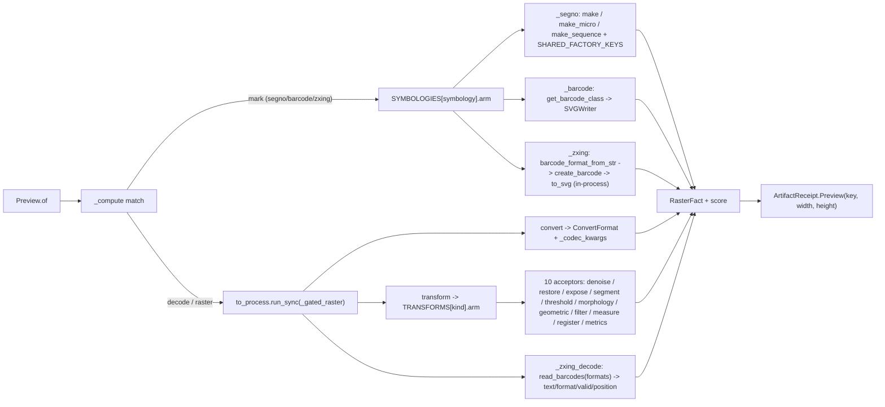

# [PY_ARTIFACTS_PREVIEW]

The raster image-processing and preview owner. `Preview` is ONE owner over the host-free imaging pipeline discriminating operation over the closed-payload `PreviewOp` family: pillow (I/O, resize, thumbnail, native AVIF/WebP codec conversion, montage) and scikit-image (restoration/deconvolution, exposure, segmentation, thresholding, morphology, geometric transform, filters/edges, feature and texture, region measurement, registration, and perceptual-quality metrics across the eleven-submodule catalogue) on the gated `python_version<'3.15'` band, segno (QR/Micro-QR and structured-append sequence generation with the full factory-parameter axis and dependency-free SVG serialization), python-barcode (the linear 1D symbology registry over `SVGWriter`), zxing-cpp (the 2D-matrix DataMatrix/PDF417/Aztec/MaxiCode `create_barcode`/`Barcode.to_svg` dependency-free encode arm plus the `read_barcodes` decode inverse — source-built from sdist and imported on the cp315 core), and python-magic (libmagic MIME detection) on the cp315 core. One preview/raster surface, not a per-media-type class family, not a per-operation function family, and not an erased `params` bag. The cp315-core process imports zxing-cpp directly (its native pybind11 extension source-builds on cp315 like shapely/pyarrow), so the dependency-free 2D-matrix `Mark` arm renders in-process beside the segno/python-barcode mark arms; the pillow/scikit-image raster arms and the zxing-cpp `Decode` inverse (which opens a raster through Pillow) cross the `faults`-owned `to_process.run_sync` subprocess seam onto the gated-band worker. Every operation returns a `RuntimeRail[ArtifactReceipt]`.

## [01]-[INDEX]

- [01]-[PREVIEW]: raster/preview/mark/decode/media-detection owner over pillow, scikit-image, segno, python-barcode, zxing-cpp, and python-magic — the closed-payload `PreviewOp` family folding into one typed `RasterFact`, a `Transform` scikit-image sub-axis spanning the eleven submodules carried on the `TRANSFORMS` member-acceptor-kwargs table, a `Symbology` mark sub-axis carried on the `SYMBOLOGIES` segno/barcode/zxing table spanning QR/Micro-QR, linear 1D, and 2D-matrix classes, a `Decode` round-trip op over `read_barcodes`, a `ConvertFormat` codec sub-axis, all dispatch-table-folded with zero re-discriminating arm.

## [02]-[PREVIEW]

- Owner: `Preview` the one raster-and-preview owner discriminating operation over the closed `PreviewOp` family; `PreviewOp` an `expression.tagged_union` whose every case carries its own typed payload, never a shared erased `params` dict; `RasterFact` the one typed result every arm folds into — `data`/`width`/`height`/`score` recovering the encoded bytes, the pixel dimensions, and the perceptual-quality/decode score map — projected to `receipt/receipt#RECEIPT` `ArtifactReceipt.Preview` at the boundary; the pillow image is the working surface, scikit-image the scientific-transform engine folded by the `TRANSFORMS` row table, segno the QR/sequence arm, python-barcode the linear arm, and zxing-cpp the 2D-matrix arm folded by the `SYMBOLOGIES` row table, python-magic the media-type gate. The two sub-axis tables are the egress-grade collapse: a row carries a callable arm and its own settled package member, the op routes by one table lookup, never a per-operation sibling function and never a re-discriminating `match` inside an arm. The `Decode` op is the round-trip inverse the segno/python-barcode arms cannot express, reading any encoded mark through the zxing-cpp `read_barcodes` decoder.
- Cases: `PreviewOp` cases — `Thumbnail(payload, size, fmt)` (pillow `Image.thumbnail` then `Image.save`) · `Convert(payload, codec, quality, effort)` (pillow `Image.save` keyed by the typed `ConvertFormat` codec, the native AVIF encode through the built-in `AvifImagePlugin` reached by `quality`/`effort` save kwargs) · `Montage(tiles, columns, cell, fmt)` (pillow grid composite over `Image.new`/`thumbnail`/`paste`) · `Transform(payload, kind, reference, mask, opts)` (the scikit-image arm carrying the typed `Transform` sub-axis — restoration/exposure/segmentation/thresholding/morphology/geometric-transform/filters/feature/measurement/registration families plus the six-row perceptual-quality metrics family, each one `TRANSFORMS` row carrying its submodule member, acceptor, and optional kwargs) · `Mark(content, symbology, opts)` (the machine-readable-mark arm carrying the typed `Symbology` sub-axis — QR/Micro-QR/structured-append sequence over segno, the linear (1D) symbologies over the python-barcode registry, and the 2D-matrix DataMatrix/PDF417/Aztec/MaxiCode classes over zxing-cpp `create_barcode`/`Barcode.to_svg`, all serializing to the dependency-free SVG path) · `Decode(payload, formats)` (the round-trip inverse over zxing-cpp `read_barcodes`, recovering the encoded text, format, validity, and quad position from a raster mark) — matched by one total `match`/`case`; the former QR-only literal is COLLAPSED into the `Mark` case whose `Symbology` row keys the encoder, the former one-shot SLIC is COLLAPSED into the `Transform` case whose `Transform` row keys the scikit-image family, the former separate-2D-matrix-owner routing note is RESOLVED by the zxing `SYMBOLOGIES` rows plus the `Decode` op, never a sibling op per symbology or per scikit-image call.
- Entry: `Preview.of` is `async` over the runtime `async_boundary` and dispatches the `PreviewOp` case, returning one `RuntimeRail[ArtifactReceipt]` whose `ArtifactReceipt.Preview` carries the content key and pixel dimensions and whose `_facts` projection threads the `METRICS`/decode score map — never an erased `object` a consumer re-validates; ALL three `Mark` arms (segno, python-barcode, AND the zxing-cpp 2D-matrix arm) resolve synchronously on the cp315 core inside the async capsule and render the code in-process with no Pillow dependency — segno serializers, the python-barcode `SVGWriter`, and zxing-cpp `create_barcode -> to_svg` each emit an SVG string needing no raster, and zxing-cpp source-builds and imports on cp315 so its dependency-free mark path is a true in-process arm beside the segno/python-barcode arms; the `Decode` op (which opens a raster through Pillow `Image.open`) and the `Thumbnail`/`Convert`/`Montage`/`Transform` raster arms cross the runtime `reliability/faults#FAULT` `anyio.to_process.run_sync` subprocess seam onto the gated-band pillow/scikit-image worker — the genuine separate-process crossing the gated `pillow`/`scikit-image` band needs because the cp315-core `execution/lanes#LANE` `to_interpreter.run_sync` subinterpreter offload shares the host interpreter version and cannot host those gated-band packages.
- Auto: `_compute` folds the case through one `match` — EVERY `Mark` (segno, python-barcode, OR zxing-cpp 2D-matrix) through `SYMBOLOGIES[symbology].arm` which carries its own package member, resolving in-process and returning a zero-dimension `RasterFact`: QR/Micro-QR/structured-append each a distinct segno factory row reached by `arm` over the `SHARED_FACTORY_KEYS` plus per-row `accepts` kwarg spread, never a re-`match` inside one arm; the linear (1D) symbologies through the python-barcode `get_barcode_class(name)` registry then `SVGWriter` render, the symbology resolved by registry name not a hand-picked sub-enum; the 2D-matrix rows through `_zxing` reaching the `SYMBOLOGIES[symbology].member` zxing `BarcodeFormat` via `barcode_format_from_str` then `create_barcode(content, fmt, **opts).to_svg(add_quiet_zones=True)` — all three mark arms emit dependency-free SVG on the cp315 core; the `Decode` op and the four raster cases through `to_process.run_sync(_gated_raster, op)` where the gated-band worker re-dispatches the case by `match` at boundary scope — the `Decode` reaching `read_barcodes(image, formats=...)` over a Pillow-opened raster and stamping each symbol's `text`/`format`/`valid`/`position` onto the score map, `Convert` reaching native AVIF through the `quality`/`effort` save kwargs, and `Transform` folding through the `TRANSFORMS[kind]` row whose `arm` selects one of ten acceptors and whose `member` names the submodule attribute the `getattr` fold resolves so the four denoise rows, the nine filter/edge rows, the five morphology rows, and the six metric rows each share one acceptor with zero parallel inline dispatch dict; the `_compute` `match` splits only on the in-process-mark-vs-gated-raster band (all three mark arms resolve in-process, the decode/raster arms cross the one `to_process.run_sync(_gated_raster, op)` seam), never a per-op subprocess call.
- Receipt: each operation folds into `RasterFact` and projects to `receipt/receipt#RECEIPT` `ArtifactReceipt.Preview(key, width, height)` at the rail boundary; the `Mark` arm reports the default zero dimensions (the SVG path carries no pixel raster), the `Decode` arm reports the decoded `text`/`format`/`valid` round-trip facts on the score map, and the `metrics` transform family carries its `structural_similarity`/`peak_signal_noise_ratio`/`mean_squared_error`/`normalized_root_mse`/`normalized_mutual_information`/`hausdorff_distance` perceptual-quality scores plus the `_measure`/`_register` region/blob/corner/shift facts on the `RasterFact.score` map the rail consumer reads inline — threading those scores into the emitted `_facts` projection is the one `receipt/receipt#RECEIPT` `[SCORE_FACTS]` widening seam (the `preview` `_facts` arm projects `key`/`width`/`height` today), never a new receipt case and never silently claimed done on this page.
- Packages: `segno` (`make`/`make_micro`/`make_sequence`/`QRCode.save`/`QRCodeSequence.save`/`QRCode.designator`, the `error`/`version`/`mode`/`mask`/`encoding`/`boost_error`/`eci`/`micro`/`symbol_count` factory axis and the `dark`/`light` SVG serializer kwargs, dependency-free serializers), `python-barcode` (`get_barcode_class`/`PROVIDED_BARCODES`/`SVGWriter`/`Barcode.write`/`Barcode.get_fullcode` linear (1D) symbologies, `installed: 0.16.1`), `zxing-cpp` (`create_barcode`/`BarcodeFormat`/`Barcode.to_svg`/`barcode_format_from_str` 2D-matrix DataMatrix/PDF417/Aztec/MaxiCode dependency-free SVG encode plus `read_barcodes`/`Barcode.to_image` decode inverse, `installed: 3.0.0` — un-gated, source-built from sdist on cp315, version via `importlib.metadata.version("zxing-cpp")` not `__version__`), `python-magic` (`from_buffer`/`Magic`) on the cp315 core; `pillow` (`Image`/`open`/`thumbnail`/`save`/`new`/`paste`/`fromarray`, native `AvifImagePlugin` on 12.2.0) and `scikit-image` (`restoration`/`exposure`/`segmentation`/`morphology`/`transform`/`measure`/`metrics`/`feature`/`filters`/`registration`/`color`/`util`/`io`) gated `python_version<'3.15'`; `numpy` (the `skimage` array backing plus the `digitize`/`linalg.norm`/`ones` PSF and flow-magnitude folds, and the zxing `Decode` array input); runtime (`content_identity.ContentIdentity`, `faults.RuntimeRail`/`async_boundary` and the `faults`-owned `anyio.to_process.run_sync` subprocess seam the gated raster arms and the Pillow-opening `Decode` arm cross — the genuine separate-process crossing distinct from the cp315-core `execution/lanes#LANE` `to_interpreter.run_sync` subinterpreter offload, both settled at their owners), `receipt/receipt#RECEIPT` (`ArtifactReceipt`).
- Growth: a new raster operation is one `PreviewOp` case plus one `_gated_raster` arm; a new scikit-image transform is one `Transform` row plus one `TRANSFORMS` table row carrying its submodule `member`, acceptor, and optional `kwargs` policy column — landing on the matching submodule acceptor with zero new acceptor when the submodule is already mined; a new segno factory parameter is one `SHARED_FACTORY_KEYS` entry or one per-row `accepts` key; a new segno symbol kind is one `SYMBOLOGIES` row carrying the segno factory member; a new codec format is one `ConvertFormat` row; a new linear symbology is already covered by the python-barcode `PROVIDED_BARCODES` registry (no new row); a new 2D-matrix symbology is one `SYMBOLOGIES` row carrying the zxing `BarcodeFormat` member on the `_zxing` arm — DataMatrix/PDF417/Aztec/MaxiCode all land that way, and any further creatable zxing format (Compact PDF417, rMQR) is one more row with zero new acceptor; zero new surface.
- Boundary: a per-media-type preview class family, a per-symbology code class, a per-scikit-image-call sibling function, and an erased `params` bag are the deleted forms; no UI, no live viewer. segno owns QR/Micro-QR/sequence generation and serialization with no Pillow dependency, removing the former `qrcode` Pillow leak; the python-barcode linear arm uses `SVGWriter` ONLY on the in-process core path (its `ImageWriter` PNG path needs Pillow and re-introduces the leak segno removed); python-barcode is strictly linear (1D) — DataMatrix/PDF417/Aztec/MaxiCode route to the zxing-cpp 2D-matrix arm, never a phantom python-barcode member, and the former separate-future-owner routing note is RESOLVED in this owner by the zxing `SYMBOLOGIES` rows plus the `Decode` round-trip op; zxing-cpp source-builds from sdist and imports on the cp315 core (un-gated, no companion-band marker), and its `to_svg` is dependency-free (no Pillow on the SVG path), so the 2D-matrix `Mark` arm is a true in-process arm beside the segno/python-barcode arms and a mixed QR + linear + 2D-matrix label sheet folds into one SVG-fragment receipt stream, while the zxing `Decode` (`read_barcodes` over a Pillow-opened raster) is the encode/decode round-trip the segno/python-barcode arms cannot express; native AVIF rides the already-admitted pillow with no new dependency (no `pillow-avif-plugin` exists on the manifest), the AVIF-specific `quality`/`effort` encode controls riding the `Image.save` kwargs the catalogue settles; all three `Mark` arms and their media-free render run in-process on the cp315 core; only `pillow` and `scikit-image` ride the gated `python_version<'3.15'` band and never resolve in the cp315-core process, so the raster arms and the Pillow-opening zxing `Decode` arm dispatch onto the `faults`-owned `to_process.run_sync` gated-band subprocess seam — a separate process the cp315-core `to_interpreter.run_sync` subinterpreter offload cannot replace for the gated `pillow`/`skimage` packages — where the worker imports `PIL`/`skimage` (and `zxingcpp` for the `read_barcodes` decode) at boundary scope so no gated import lands on the core page.

```python signature
from collections.abc import Callable
from enum import StrEnum
from typing import Literal

import numpy as np
from anyio import to_process
from expression import case, tag, tagged_union
from msgspec import Struct
from numpy.typing import NDArray

from rasm.runtime.content_identity import ContentIdentity
from rasm.runtime.faults import RuntimeRail, async_boundary

from artifacts.receipt.receipt import ArtifactReceipt

type PreviewOpTag = Literal["thumbnail", "convert", "montage", "transform", "mark", "decode"]
type Pixels = tuple[int, int]
type Frame = NDArray[np.uint8]


class Symbology(StrEnum):
    QR = "qr"
    MICRO_QR = "micro-qr"
    QR_SEQUENCE = "qr-sequence"
    CODE128 = "code128"
    CODE39 = "code39"
    EAN13 = "ean13"
    EAN8 = "ean8"
    UPCA = "upca"
    ITF = "itf"
    CODABAR = "codabar"
    ISBN13 = "isbn13"
    ISSN = "issn"
    PZN = "pzn"
    GS1_128 = "gs1_128"
    DATA_MATRIX = "data-matrix"
    PDF417 = "pdf417"
    AZTEC = "aztec"
    MAXICODE = "maxicode"


class Transform(StrEnum):
    DENOISE_BILATERAL = "denoise-bilateral"
    DENOISE_NL_MEANS = "denoise-nl-means"
    DENOISE_TV = "denoise-tv"
    DENOISE_WAVELET = "denoise-wavelet"
    INPAINT = "inpaint"
    ROLLING_BALL = "rolling-ball"
    DECONVOLVE = "deconvolve"
    CLAHE = "clahe"
    EQUALIZE = "equalize"
    RESCALE_INTENSITY = "rescale-intensity"
    MATCH_HISTOGRAMS = "match-histograms"
    GAMMA = "gamma"
    LOG = "log"
    SLIC = "slic"
    FELZENSZWALB = "felzenszwalb"
    WATERSHED = "watershed"
    CHAN_VESE = "chan-vese"
    UNSHARP = "unsharp"
    GAUSSIAN = "gaussian"
    MEDIAN = "median"
    SOBEL = "sobel"
    LAPLACE = "laplace"
    FRANGI = "frangi"
    BUTTERWORTH = "butterworth"
    GABOR = "gabor"
    CANNY = "canny"
    THRESHOLD_OTSU = "threshold-otsu"
    THRESHOLD_LOCAL = "threshold-local"
    THRESHOLD_MULTIOTSU = "threshold-multiotsu"
    SKELETONIZE = "skeletonize"
    OPENING = "opening"
    CLOSING = "closing"
    EROSION = "erosion"
    DILATION = "dilation"
    RESIZE = "resize"
    RESCALE = "rescale"
    ROTATE = "rotate"
    RADON = "radon"
    CONTOURS = "contours"
    ENTROPY = "entropy"
    HOG = "hog"
    BLOB = "blob"
    LBP = "lbp"
    CORNERS = "corners"
    OPTICAL_FLOW = "optical-flow"
    PHASE_CORRELATION = "phase-correlation"
    SSIM = "ssim"
    PSNR = "psnr"
    MSE = "mse"
    NRMSE = "nrmse"
    NMI = "nmi"
    HAUSDORFF = "hausdorff"


class ConvertFormat(StrEnum):
    PNG = "PNG"
    JPEG = "JPEG"
    WEBP = "WEBP"
    AVIF = "AVIF"
    TIFF = "TIFF"
    BMP = "BMP"


class RasterFact(Struct, frozen=True):
    data: bytes
    width: int = 0
    height: int = 0
    score: dict[str, str] = {}


@tagged_union(frozen=True)
class PreviewOp:
    tag: PreviewOpTag = tag()
    thumbnail: tuple[bytes, Pixels, ConvertFormat] = case()
    convert: tuple[bytes, ConvertFormat, int, int] = case()
    montage: tuple[tuple[bytes, ...], int, Pixels, ConvertFormat] = case()
    transform: tuple[bytes, Transform, bytes, bytes, dict[str, float]] = case()
    mark: tuple[str, Symbology, dict[str, object]] = case()
    decode: tuple[bytes, tuple[Symbology, ...]] = case()

    @staticmethod
    def Thumbnail(payload: bytes, size: Pixels, fmt: ConvertFormat = ConvertFormat.PNG) -> "PreviewOp":
        return PreviewOp(thumbnail=(payload, size, fmt))

    @staticmethod
    def Convert(payload: bytes, codec: ConvertFormat, quality: int = 80, effort: int = 4) -> "PreviewOp":
        return PreviewOp(convert=(payload, codec, quality, effort))

    @staticmethod
    def Montage(tiles: tuple[bytes, ...], columns: int, cell: Pixels, fmt: ConvertFormat = ConvertFormat.PNG) -> "PreviewOp":
        return PreviewOp(montage=(tiles, columns, cell, fmt))

    @staticmethod
    def Transform(payload: bytes, kind: Transform, reference: bytes = b"", mask: bytes = b"", opts: dict[str, float] = {}) -> "PreviewOp":
        return PreviewOp(transform=(payload, kind, reference, mask, opts))

    @staticmethod
    def Mark(content: str, symbology: Symbology, opts: dict[str, object] = {}) -> "PreviewOp":
        return PreviewOp(mark=(content, symbology, opts))

    @staticmethod
    def Decode(payload: bytes, formats: tuple[Symbology, ...] = ()) -> "PreviewOp":
        return PreviewOp(decode=(payload, formats))


class Preview(Struct, frozen=True):
    op: PreviewOp

    async def of(self) -> RuntimeRail[ArtifactReceipt]:
        return await async_boundary(f"preview.{self.op.tag}", self._compute)

    async def _compute(self) -> ArtifactReceipt:
        match self.op:
            case PreviewOp(tag="mark", mark=(content, symbology, opts)):
                fact = SYMBOLOGIES[symbology].arm(content, symbology, opts)
            case _:
                fact = await to_process.run_sync(_gated_raster, self.op)
        return ArtifactReceipt.Preview(ContentIdentity.of(f"preview-{self.op.tag}", fact.data), fact.width, fact.height)

    @staticmethod
    def media_type(payload: bytes) -> str:
        import magic

        return magic.from_buffer(payload, mime=True)
```

`RasterFact` is the one fact every arm yields — bytes plus dimensions plus the optional metrics score map — so `_compute` projects one shape into `ArtifactReceipt.Preview` regardless of op, the segno/barcode mark arms report the default zero dimensions (the SVG path carries no pixel raster), and the metrics score rides the same fact map both the content-key seed and the `receipt#RECEIPT` `_facts` fold project to strings; the `PreviewOp` payload is typed per case, never an erased `params` dict the arm re-validates.

```python signature
from io import BytesIO


class MarkArm(Struct, frozen=True):
    factory: str
    accepts: tuple[str, ...]
    arm: Callable[[str, Symbology, dict[str, object]], RasterFact]
    member: str = ""


SHARED_FACTORY_KEYS = ("error", "version", "mode", "mask", "encoding", "boost_error")
ZXING_CREATE_KEYS = ("ec_level", "width", "height", "scale", "margin")


def _segno(content: str, symbology: Symbology, opts: dict[str, object]) -> RasterFact:
    import segno

    row = SYMBOLOGIES[symbology]
    keys = SHARED_FACTORY_KEYS + row.accepts
    symbol = getattr(segno, row.factory)(content, **{key: opts[key] for key in keys if key in opts})
    sink = BytesIO()
    symbol.save(sink, kind="svg", scale=opts.get("scale", 1), border=opts.get("border"), dark=opts.get("dark", "#000"), light=opts.get("light"))
    designator = {"designator": symbol.designator} if row.factory != "make_sequence" else {"symbols": str(len(symbol))}
    return RasterFact(sink.getvalue(), score=designator)


def _barcode(content: str, symbology: Symbology, opts: dict[str, object]) -> RasterFact:
    import barcode

    symbol = barcode.get_barcode_class(symbology.value)(content, writer=barcode.writer.SVGWriter())
    sink = BytesIO()
    symbol.write(sink, options=opts.get("writer_options"), text=opts.get("text"))
    return RasterFact(sink.getvalue(), score={"fullcode": symbol.get_fullcode()})


def _zxing(content: str, symbology: Symbology, opts: dict[str, object]) -> RasterFact:
    import zxingcpp

    fmt = zxingcpp.barcode_format_from_str(SYMBOLOGIES[symbology].member)
    symbol = zxingcpp.create_barcode(content, fmt, **{key: opts[key] for key in ZXING_CREATE_KEYS if key in opts})
    svg = symbol.to_svg(scale=int(opts.get("scale", 1)), add_hrt=bool(opts.get("add_hrt", False)), add_quiet_zones=bool(opts.get("add_quiet_zones", True)))
    return RasterFact(svg.encode(), score={"format": str(symbol.format), "ec_level": symbol.ec_level})


SYMBOLOGIES: dict[Symbology, MarkArm] = {
    Symbology.QR: MarkArm("make", ("eci", "micro"), _segno),
    Symbology.MICRO_QR: MarkArm("make_micro", (), _segno),
    Symbology.QR_SEQUENCE: MarkArm("make_sequence", ("symbol_count",), _segno),
    Symbology.CODE128: MarkArm("", (), _barcode),
    Symbology.CODE39: MarkArm("", (), _barcode),
    Symbology.EAN13: MarkArm("", (), _barcode),
    Symbology.EAN8: MarkArm("", (), _barcode),
    Symbology.UPCA: MarkArm("", (), _barcode),
    Symbology.ITF: MarkArm("", (), _barcode),
    Symbology.CODABAR: MarkArm("", (), _barcode),
    Symbology.ISBN13: MarkArm("", (), _barcode),
    Symbology.ISSN: MarkArm("", (), _barcode),
    Symbology.PZN: MarkArm("", (), _barcode),
    Symbology.GS1_128: MarkArm("", (), _barcode),
    Symbology.DATA_MATRIX: MarkArm("", (), _zxing, "DataMatrix"),
    Symbology.PDF417: MarkArm("", (), _zxing, "PDF417"),
    Symbology.AZTEC: MarkArm("", (), _zxing, "Aztec"),
    Symbology.MAXICODE: MarkArm("", (), _zxing, "MaxiCode"),
}
```

The `SYMBOLOGIES` table folds every symbology to one of three SVG arms with zero re-discrimination inside an arm: the segno arm reads its own `factory` and `accepts` columns so QR, Micro-QR, and the structured-append sequence are three distinct rows resolving three distinct segno factories (`make` / `make_micro` / `make_sequence`) through `getattr`. The `SHARED_FACTORY_KEYS` tuple threads the six common factory parameters (`error` for the L/M/Q/H redundancy row, `version`, `mode`, `mask`, `encoding`, and `boost_error`) that every segno factory accepts, and the per-row `accepts` column carries only the factory-specific keys — `eci`/`micro` on the `make` row, `symbol_count` on the `make_sequence` row, none on the `make_micro` row — so the key-filtered kwarg spread threads exactly the parameters each factory admits with no over-key crashing a factory that rejects it. The `make_sequence` row spans a large payload across multiple symbols in one `QRCodeSequence.save(kind="svg")` keyed by `symbol_count` rather than a hand-stitched concatenation, and the `RasterFact.score` carries the resolved `designator` (version and error level) on the `QRCode`-yielding `make`/`make_micro` rows and the spanned-symbol count on the sequence row. The python-barcode arm resolves the registry by `Symbology.value` against `PROVIDED_BARCODES`, carries the `get_fullcode` human-readable check digit on the score, and the `factory`/`accepts` columns stay blank on the linear rows. The zxing-cpp arm reads its own `member` column — the zxing `BarcodeFormat` display name (`DataMatrix` / `PDF417` / `Aztec` / `MaxiCode`) `barcode_format_from_str` resolves to the enum, never the separatorless `.name` re-parse the 3.0 `str()` rename breaks — then `create_barcode(content, fmt, **opts)` keyed by the `ZXING_CREATE_KEYS` (`ec_level`/`width`/`height`/`scale`/`margin`) filtered spread and `to_svg(add_quiet_zones=True)` for dependency-free output, stamping the resolved `format` and `ec_level` on the score; MaxiCode is creatable in zxing 3.0, so the `MAXICODE` row encodes rather than routing to a decode-only sibling. zxing-cpp source-builds from sdist and imports on the cp315 core, so the four 2D-matrix `_zxing` mark rows resolve in-process beside the segno/python-barcode mark arms (the `_compute` `mark` case dispatches every `Mark` through `SYMBOLOGIES[symbology].arm` in-process); only the `Decode` op crosses the `to_process.run_sync` seam, because `read_barcodes` opens its raster through the gated-band Pillow worker. No symbology mints a sibling owner; a new linear code is already a `PROVIDED_BARCODES` registry name, a new segno symbol kind is one row carrying its segno factory member and its factory-specific `accepts` keys, and a new 2D-matrix code is one row carrying its zxing `BarcodeFormat` member on the `_zxing` arm.

```python signature
def _gated_raster(op: PreviewOp) -> RasterFact:
    from io import BytesIO

    from PIL import Image

    match op:
        case PreviewOp(tag="thumbnail", thumbnail=(payload, size, fmt)):
            image = Image.open(BytesIO(payload))
            image.thumbnail(size)
            sink = BytesIO()
            image.save(sink, format=fmt.value)
            return RasterFact(sink.getvalue(), *image.size)
        case PreviewOp(tag="convert", convert=(payload, codec, quality, effort)):
            image = Image.open(BytesIO(payload))
            sink = BytesIO()
            image.save(sink, format=codec.value, **_codec_kwargs(codec, quality, effort))
            return RasterFact(sink.getvalue(), *image.size)
        case PreviewOp(tag="montage", montage=(tiles, columns, cell, fmt)):
            grid = _grid(tiles, columns, cell)
            sink = BytesIO()
            grid.save(sink, format=fmt.value)
            return RasterFact(sink.getvalue(), *grid.size)
        case PreviewOp(tag="transform", transform=(payload, kind, reference, mask, opts)):
            from skimage import io as skio

            return TRANSFORMS[kind].arm(TransformInput(skio.imread(BytesIO(payload)), kind, reference, mask, opts))
        case PreviewOp(tag="decode", decode=(payload, formats)):
            return _zxing_decode(payload, formats)


def _zxing_decode(payload: bytes, formats: tuple[Symbology, ...]) -> RasterFact:
    from io import BytesIO

    import zxingcpp
    from PIL import Image

    scope = zxingcpp.barcode_formats_from_str(",".join(SYMBOLOGIES[s].member for s in formats)) if formats else zxingcpp.BarcodeFormat.All
    symbols = zxingcpp.read_barcodes(Image.open(BytesIO(payload)), formats=scope)
    score = {f"{index}": f"{symbol.text}|{symbol.format!s}|{symbol.valid}|{symbol.position!s}" for index, symbol in enumerate(symbols)}
    return RasterFact(payload, score={"count": str(len(symbols)), **score})


def _codec_kwargs(codec: ConvertFormat, quality: int, effort: int) -> dict[str, int]:
    return {
        ConvertFormat.AVIF: {"quality": quality, "speed": effort},
        ConvertFormat.WEBP: {"quality": quality, "method": effort},
        ConvertFormat.JPEG: {"quality": quality, "optimize": True},
    }.get(codec, {})


def _grid(tiles: tuple[bytes, ...], columns: int, cell: Pixels) -> "Image.Image":
    from io import BytesIO

    from PIL import Image

    cell_w, cell_h = cell
    rows = -(-len(tiles) // columns)
    grid = Image.new("RGBA", (columns * cell_w, rows * cell_h))
    for index, blob in enumerate(tiles):
        tile = Image.open(BytesIO(blob))
        tile.thumbnail(cell)
        row, col = divmod(index, columns)
        grid.paste(tile, (col * cell_w, row * cell_h))
    return grid
```

The native AVIF row is a pure `Convert` deepen on the already-admitted pillow: `Image.save(format="AVIF")` emits AVIF through the built-in `AvifImagePlugin` Pillow 12.2.0 ships, and the `_codec_kwargs` table keys each codec's encode controls by row so a codec reaches its native parameters by one row, never a per-format encoder and never a bare `quality=None`. The catalogue settles `quality`/`optimize` as save kwargs; the AVIF `speed` and WebP `method` encoder-effort spellings stay the one `[AVIF_SETTLED]` RESEARCH-deepen item until an `assay api` reflection pass captures the per-plugin save parameters. The `_grid` composite composes `Image.new`/`thumbnail`/`paste` with `divmod(index, columns)` yielding `(row, col)` directly, never a reversed-tuple slice.

The scikit-image `Transform` family is the egress-grade collapse over the eleven-submodule catalogue: a `TransformArm` row names the submodule `member` the acceptor resolves through one `getattr`, carries the acceptor `arm`, and threads the optional `kwargs` policy column, the `TRANSFORMS` table is keyed by the `Transform` value, and `_gated_raster` is one table lookup. Nine acceptors own the whole family with zero parallel inline dispatch dict — `_denoise` (the four `restoration` denoisers over `estimate_sigma`), `_restore` (inpaint biharmonic, rolling-ball background subtraction, Richardson-Lucy deconvolution), `_expose` (CLAHE, equalize, rescale, histogram match, gamma, log over the `is_low_contrast` gate), `_segment` (SLIC, Felzenszwalb, marker watershed, Chan-Vese over `regionprops_table` region counting), `_morphology` (Otsu-binarized skeletonize, opening, closing, erosion, dilation over the `disk` footprint factory), `_threshold` (Otsu, local, multi-Otsu over `np.digitize`), `_geometric` (resize, rescale, rotate, Radon sinogram), `_filter` (unsharp, gaussian, median, sobel, laplace, frangi, butterworth, gabor, canny over the edge-grayscale gate), `_measure` (marching-squares contours, Shannon entropy, HOG render, LoG blobs, LBP texture, Harris corners), and `_register` (TV-L1 optical-flow magnitude, sub-pixel phase correlation). The six `metrics` rows fold through one `_metrics` acceptor keyed by the row's `member`/`kwargs` columns — `structural_similarity`, `peak_signal_noise_ratio`, `mean_squared_error`, `normalized_root_mse`, `normalized_mutual_information`, and `hausdorff_distance` each stamping its perceptual-quality scalar onto the fact `score` map keyed by the `Transform` value, never a hand-built three-call dict and never a parallel metrics table.

```python signature
class TransformInput(Struct, frozen=True):
    image: Frame
    kind: Transform
    reference: bytes
    mask: bytes
    opts: dict[str, float]


class TransformArm(Struct, frozen=True):
    member: str
    arm: Callable[["TransformInput"], RasterFact]
    kwargs: dict[str, object] = {}


def _save_array(array: NDArray[np.floating | np.integer], score: dict[str, str]) -> RasterFact:
    from io import BytesIO

    from PIL import Image
    from skimage import util

    image = Image.fromarray(util.img_as_ubyte(array))
    sink = BytesIO()
    image.save(sink, format=ConvertFormat.PNG.value)
    return RasterFact(sink.getvalue(), *image.size, score)


def _luminance(frame: Frame) -> NDArray[np.floating]:
    from skimage import color

    return color.rgb2gray(frame) if frame.ndim == 3 else frame


def _denoise(input: TransformInput) -> RasterFact:
    from skimage import restoration

    member = getattr(restoration, TRANSFORMS[input.kind].member)
    sigma = restoration.estimate_sigma(input.image, channel_axis=-1)
    return _save_array(member(input.image, channel_axis=-1, **(input.opts or {"sigma": sigma})), {"sigma": f"{float(sigma):.6f}"})


def _restore(input: TransformInput) -> RasterFact:
    from io import BytesIO

    from skimage import io as skio, restoration

    member = getattr(restoration, TRANSFORMS[input.kind].member)
    match input.kind:
        case Transform.INPAINT:
            return _save_array(member(input.image, skio.imread(BytesIO(input.mask)), channel_axis=-1), {})
        case Transform.DECONVOLVE:
            sigma = restoration.estimate_sigma(input.image, channel_axis=-1)
            span = int(input.opts.get("psf", 5))
            psf = np.ones((span, span), dtype=np.float64) / float(span * span)
            return _save_array(member(input.image, psf, num_iter=int(input.opts.get("num_iter", 10)), channel_axis=-1), {"sigma": f"{float(sigma):.6f}"})
        case _:
            return _save_array(input.image - member(input.image, radius=input.opts.get("radius", 50.0)), {})


def _expose(input: TransformInput) -> RasterFact:
    from io import BytesIO

    from skimage import exposure, io as skio

    member = getattr(exposure, TRANSFORMS[input.kind].member)
    contrast = "low" if exposure.is_low_contrast(input.image) else "ok"
    match input.kind:
        case Transform.MATCH_HISTOGRAMS:
            return _save_array(member(input.image, skio.imread(BytesIO(input.reference)), channel_axis=-1), {"contrast": contrast})
        case _:
            return _save_array(member(input.image, **input.opts), {"contrast": contrast})


def _segment(input: TransformInput) -> RasterFact:
    from skimage import filters, measure, segmentation, util

    match input.kind:
        case Transform.WATERSHED:
            labels = segmentation.watershed(filters.sobel(_luminance(input.image)), markers=int(input.opts.get("markers", 250)))
        case Transform.CHAN_VESE:
            labels = segmentation.chan_vese(util.img_as_float(_luminance(input.image)), **input.opts).astype(int)
        case _:
            labels = getattr(segmentation, TRANSFORMS[input.kind].member)(input.image, channel_axis=-1, **input.opts)
    overlay = util.img_as_ubyte(segmentation.mark_boundaries(input.image, labels))
    return _save_array(overlay, {"regions": str(measure.regionprops_table(labels, properties=("label",))["label"].size)})


def _morphology(input: TransformInput) -> RasterFact:
    from skimage import filters, morphology, util

    gray = _luminance(input.image)
    binary = gray > filters.threshold_otsu(gray)
    footprint = morphology.disk(int(input.opts.get("radius", 1)))
    member = getattr(morphology, TRANSFORMS[input.kind].member)
    result = member(binary) if input.kind is Transform.SKELETONIZE else member(binary, footprint)
    return _save_array(util.img_as_ubyte(result), {})


def _threshold(input: TransformInput) -> RasterFact:
    from skimage import filters, util

    gray = _luminance(input.image)
    member = getattr(filters, TRANSFORMS[input.kind].member)
    cut = member(gray, **input.opts)
    mask = np.digitize(gray, cut) if input.kind is Transform.THRESHOLD_MULTIOTSU else gray > cut
    return _save_array(util.img_as_ubyte(mask / mask.max() if mask.max() else mask), {})


def _geometric(input: TransformInput) -> RasterFact:
    from skimage import transform

    member = getattr(transform, TRANSFORMS[input.kind].member)
    match input.kind:
        case Transform.RESIZE:
            warped = member(input.image, (int(input.opts.get("rows", 256)), int(input.opts.get("cols", 256))), anti_aliasing=True)
        case Transform.RESCALE:
            warped = member(input.image, input.opts.get("scale", 0.5), channel_axis=-1, anti_aliasing=True)
        case Transform.ROTATE:
            warped = member(input.image, input.opts.get("angle", 90.0), resize=True)
        case _:
            sinogram = member(_luminance(input.image))
            warped = sinogram / sinogram.max() if sinogram.max() else sinogram
    return _save_array(warped, {})


def _filter(input: TransformInput) -> RasterFact:
    from skimage import feature, filters

    edge = input.kind in {Transform.SOBEL, Transform.CANNY, Transform.LAPLACE, Transform.FRANGI, Transform.GABOR}
    module = feature if input.kind is Transform.CANNY else filters
    member = getattr(module, TRANSFORMS[input.kind].member)
    source = _luminance(input.image) if edge else input.image
    raw = member(source, **(({} if edge else {"channel_axis": -1}) | TRANSFORMS[input.kind].kwargs | input.opts))
    return _save_array(raw[0] if input.kind is Transform.GABOR else raw, {})


def _measure(input: TransformInput) -> RasterFact:
    from skimage import feature, measure, util

    gray = _luminance(input.image)
    match input.kind:
        case Transform.CONTOURS:
            contours = measure.find_contours(gray, level=input.opts.get("level", 0.5))
            return _save_array(input.image, {"contours": str(len(contours))})
        case Transform.ENTROPY:
            return _save_array(input.image, {"entropy": f"{measure.shannon_entropy(input.image):.6f}"})
        case Transform.LBP:
            codes = feature.local_binary_pattern(gray, P=8, R=1.0, method="uniform")
            return _save_array(util.img_as_ubyte(codes / codes.max()), {})
        case Transform.HOG:
            _, render = feature.hog(input.image, channel_axis=-1, visualize=True)
            return _save_array(render, {})
        case Transform.BLOB:
            blobs = feature.blob_log(gray, **input.opts)
            return _save_array(input.image, {"blobs": str(len(blobs))})
        case _:
            peaks = feature.corner_peaks(feature.corner_harris(gray), min_distance=int(input.opts.get("min_distance", 5)))
            return _save_array(input.image, {"corners": str(len(peaks))})


def _register(input: TransformInput) -> RasterFact:
    from io import BytesIO

    from skimage import io as skio, registration, util

    moving, reference = _luminance(input.image), _luminance(skio.imread(BytesIO(input.reference)))
    match input.kind:
        case Transform.PHASE_CORRELATION:
            shift, error, _ = registration.phase_cross_correlation(reference, moving, upsample_factor=10)
            return _save_array(input.image, {"shift": str(tuple(shift)), "error": f"{float(error):.6f}"})
        case _:
            flow = registration.optical_flow_tvl1(reference, moving)
            return _save_array(util.img_as_ubyte(np.linalg.norm(flow, axis=0) / np.linalg.norm(flow, axis=0).max()), {})


def _metrics(input: TransformInput) -> RasterFact:
    from io import BytesIO

    from skimage import io as skio, metrics

    reference = skio.imread(BytesIO(input.reference))
    row = TRANSFORMS[input.kind]
    value = getattr(metrics, row.member)(reference, input.image, **row.kwargs)
    return _save_array(input.image, {input.kind.value: f"{float(value):.6f}"})


TRANSFORMS: dict[Transform, TransformArm] = {
    Transform.DENOISE_BILATERAL: TransformArm("denoise_bilateral", _denoise),
    Transform.DENOISE_NL_MEANS: TransformArm("denoise_nl_means", _denoise),
    Transform.DENOISE_TV: TransformArm("denoise_tv_chambolle", _denoise),
    Transform.DENOISE_WAVELET: TransformArm("denoise_wavelet", _denoise),
    Transform.INPAINT: TransformArm("inpaint_biharmonic", _restore),
    Transform.ROLLING_BALL: TransformArm("rolling_ball", _restore),
    Transform.DECONVOLVE: TransformArm("richardson_lucy", _restore),
    Transform.CLAHE: TransformArm("equalize_adapthist", _expose),
    Transform.EQUALIZE: TransformArm("equalize_hist", _expose),
    Transform.RESCALE_INTENSITY: TransformArm("rescale_intensity", _expose),
    Transform.MATCH_HISTOGRAMS: TransformArm("match_histograms", _expose),
    Transform.GAMMA: TransformArm("adjust_gamma", _expose),
    Transform.LOG: TransformArm("adjust_log", _expose),
    Transform.SLIC: TransformArm("slic", _segment),
    Transform.FELZENSZWALB: TransformArm("felzenszwalb", _segment),
    Transform.WATERSHED: TransformArm("watershed", _segment),
    Transform.CHAN_VESE: TransformArm("chan_vese", _segment),
    Transform.UNSHARP: TransformArm("unsharp_mask", _filter),
    Transform.GAUSSIAN: TransformArm("gaussian", _filter),
    Transform.MEDIAN: TransformArm("median", _filter),
    Transform.SOBEL: TransformArm("sobel", _filter),
    Transform.LAPLACE: TransformArm("laplace", _filter),
    Transform.FRANGI: TransformArm("frangi", _filter),
    Transform.BUTTERWORTH: TransformArm("butterworth", _filter),
    Transform.GABOR: TransformArm("gabor", _filter, {"frequency": 0.6}),
    Transform.CANNY: TransformArm("canny", _filter),
    Transform.THRESHOLD_OTSU: TransformArm("threshold_otsu", _threshold),
    Transform.THRESHOLD_LOCAL: TransformArm("threshold_local", _threshold),
    Transform.THRESHOLD_MULTIOTSU: TransformArm("threshold_multiotsu", _threshold),
    Transform.SKELETONIZE: TransformArm("skeletonize", _morphology),
    Transform.OPENING: TransformArm("binary_opening", _morphology),
    Transform.CLOSING: TransformArm("binary_closing", _morphology),
    Transform.EROSION: TransformArm("binary_erosion", _morphology),
    Transform.DILATION: TransformArm("binary_dilation", _morphology),
    Transform.RESIZE: TransformArm("resize", _geometric),
    Transform.RESCALE: TransformArm("rescale", _geometric),
    Transform.ROTATE: TransformArm("rotate", _geometric),
    Transform.RADON: TransformArm("radon", _geometric),
    Transform.CONTOURS: TransformArm("find_contours", _measure),
    Transform.ENTROPY: TransformArm("shannon_entropy", _measure),
    Transform.HOG: TransformArm("hog", _measure),
    Transform.BLOB: TransformArm("blob_log", _measure),
    Transform.LBP: TransformArm("local_binary_pattern", _measure),
    Transform.CORNERS: TransformArm("corner_harris", _measure),
    Transform.OPTICAL_FLOW: TransformArm("optical_flow_tvl1", _register),
    Transform.PHASE_CORRELATION: TransformArm("phase_cross_correlation", _register),
    Transform.SSIM: TransformArm("structural_similarity", _metrics, {"channel_axis": -1, "data_range": 255}),
    Transform.PSNR: TransformArm("peak_signal_noise_ratio", _metrics, {"data_range": 255}),
    Transform.MSE: TransformArm("mean_squared_error", _metrics),
    Transform.NRMSE: TransformArm("normalized_root_mse", _metrics),
    Transform.NMI: TransformArm("normalized_mutual_information", _metrics),
    Transform.HAUSDORFF: TransformArm("hausdorff_distance", _metrics),
}
```



## [03]-[RESEARCH]

- [QR_SETTLED]: the in-process `segno.make`/`make_micro`/`make_sequence`/`QRCode.save(kind="svg")`/`QRCodeSequence.save(kind="svg")`/`QRCode.designator` and `python-magic.from_buffer(mime=True)` spellings verify against the folder `.api` catalogues for `segno`/`python-magic` on the cp315 core. The `segno` catalogue `[03]-[ENTRYPOINTS]` row [01] confirms `make(content, error=None, version=None, mode=None, mask=None, encoding=None, eci=False, micro=None, boost_error=True)`, row [03] `make_micro(content, error=None, version=None, mode=None, mask=None, encoding=None, boost_error=True)`, and row [04] `make_sequence(content, error=None, version=None, mode=None, mask=None, encoding=None, boost_error=True, symbol_count=None)` returning a `QRCodeSequence`, so the six `SHARED_FACTORY_KEYS` (`error`/`version`/`mode`/`mask`/`encoding`/`boost_error`) are SETTLED on every factory and the per-row `accepts` keys are SETTLED — `eci`/`micro` on the `make` row (the only factory the catalogue lists them on), none on `make_micro`, `symbol_count` on `make_sequence`. The key-filtered kwarg spread threads exactly the admitted parameters, so no over-key reaches a factory that rejects it. The `[02]-[PUBLIC_TYPES]` row confirms `QRCodeSequence` with the shared `save` serializer surface, and `[03]-[ENTRYPOINTS]` `QRCode.save(out, kind=None, **kw)` row plus the serializer-kwarg note confirm `scale`/`border`/`dark`/`light` flow through `**kw`, so the SVG `dark`/`light` foreground/background spellings are SETTLED. Structured-append spanning multiple symbols for a large payload is one `make_sequence` call plus one `QRCodeSequence.save(kind="svg")`, never a hand-stitched concatenation. The catalogue lists `QRCode.designator` on `QRCode` ONLY (row [11]), so the `make`/`make_micro` rows stamp `symbol.designator` and the `make_sequence` row stamps the spanned-symbol count instead — the `row.factory != "make_sequence"` guard never touches the `QRCodeSequence` designator surface. segno serializes SVG with no Pillow dependency, closing the former `qrcode` Pillow leak.
- [SEQUENCE_LEN]: the `len(QRCodeSequence)` spanned-symbol count on the `make_sequence` row's `RasterFact.score` is the one segno catalogue-deepen item. The `segno` `.api` `[02]-[PUBLIC_TYPES]` confirms `QRCodeSequence` as the structured-append multi-symbol sequence root but enumerates no `__len__` or `symbols`-count member, so the symbol-count spelling stays a marked RESEARCH item until an `assay api` reflection pass over `QRCodeSequence` captures the iteration/length surface; the `make_sequence`/`QRCodeSequence.save(kind="svg")` legs are settled, only the per-symbol count member deepens. Close-condition: `.api` carries the `QRCodeSequence` length or iteration row.
- [AVIF_SETTLED]: the native AVIF `Convert` row is SETTLED on the already-admitted pillow. The `pillow` catalogue `[01]-[PACKAGE_SURFACE]` confirms `installed: 12.2.0` and `[04]-[IMPLEMENTATION_LAW]` confirms `Image.save` keys the codec by the explicit `format` with quality/optimize/compression riding save kwargs, so `Image.save(format="AVIF")` emits AVIF through the built-in `AvifImagePlugin` Pillow 12.2.0 ships, needing no `pillow-avif-plugin` dependency (none exists on the manifest to reject). The `ConvertFormat` closed vocabulary keys the codec by row — `PNG`/`JPEG`/`WEBP`/`AVIF`/`TIFF`/`BMP` — so a new codec format is one row, never a per-format encoder. The catalogue settles `quality`/`optimize` as save kwargs (SETTLED on the `JPEG` row), but the AVIF `speed` and WebP `method` encoder-effort kwargs are NOT yet enumerated in the `pillow` `.api` rows — the `_codec_kwargs` AVIF/WebP effort spellings stay a marked RESEARCH-deepen seam until an `assay api` reflection pass captures the `AvifImagePlugin`/`WebPImagePlugin` save-encoder parameters on the gated `python_version<'3.15'` band. Close-condition: `.api` carries the per-plugin save-kwarg rows; the AVIF `format`/`quality` legs are settled, only the `speed`/`method` effort spellings deepen.
- [SCIKIT_TRANSFORM_SETTLED]: the `Transform` scikit-image family spans the eleven-submodule catalogue and is SETTLED fence code verified against the folder `.api` catalogue for `scikit-image`. The `restoration` arms (`denoise_bilateral`/`denoise_nl_means`/`denoise_tv_chambolle`/`denoise_wavelet`/`estimate_sigma`/`inpaint_biharmonic`/`rolling_ball`/`richardson_lucy`) verify against `[03]-[ENTRYPOINTS]` restoration scope rows [01]-[08]; the `exposure` arms (`equalize_adapthist`/`equalize_hist`/`rescale_intensity`/`match_histograms`/`adjust_gamma`/`adjust_log`/`is_low_contrast`) against exposure rows [01]-[06] and [08]; the `segmentation` arms (`slic`/`felzenszwalb`/`watershed`/`chan_vese`) against segmentation rows [01]-[03] and [05]; the `morphology` arms (`skeletonize`/`binary_opening`/`binary_closing`/`binary_erosion`/`binary_dilation`/`disk`) against morphology rows [01]-[04], [10], [11]; the `transform` arms (`resize`/`rescale`/`rotate`/`radon`) against geometric-transform rows [01]-[03] and [09]; the `filters` arms (`unsharp_mask`/`gaussian`/`median`/`sobel`/`laplace`/`frangi`/`butterworth`/`gabor`/`threshold_otsu`/`threshold_local`/`threshold_multiotsu`) against filtering rows [01]-[11]; the `feature` arms (`canny`/`hog`/`blob_log`/`corner_harris`/`corner_peaks`/`local_binary_pattern`) against feature rows [01]-[02], [06]-[07], [09]-[10]; the `measure` arms (`regionprops_table`/`find_contours`/`shannon_entropy`) against measurement rows [03], [04], [08]; the `registration` arms (`phase_cross_correlation`/`optical_flow_tvl1`) against registration rows [01], [03]; the `metrics` arms (`structural_similarity`/`peak_signal_noise_ratio`/`mean_squared_error`/`normalized_root_mse`/`normalized_mutual_information`/`hausdorff_distance`) against quality-metrics rows [01]-[06]; `color.rgb2gray`/`img_as_float`/`img_as_ubyte` against color and utility scope. The catalogue `[04]-[IMPLEMENTATION_LAW]` `channel_axis` law fixes the `channel_axis=-1` kwarg on every multichannel arm, the `data_range` law fixes the explicit `data_range=255` on the SSIM/PSNR metrics, and the structuring-element law fixes `disk` as the footprint factory the morphology arm reads rather than a hand-rolled array. The `TRANSFORMS` table is the SETTLED fold over ten transform acceptors — `_denoise`/`_restore`/`_expose`/`_segment`/`_morphology`/`_threshold`/`_geometric`/`_filter`/`_measure`/`_register` — plus the `_metrics` acceptor, each reading its own `TransformArm.member` through one `getattr(<submodule>, member)` and the metric rows additionally reading the `kwargs` policy column, so the four denoise rows, the nine filter/edge rows, the five morphology rows, the four geometric rows, the six measure/feature rows, and the six metric rows collapse into one acceptor each with zero parallel inline dispatch dict; the six perceptual-quality scalars ride the `RasterFact.score` fact keyed by the `Transform` value, and the former one-shot SLIC is one `Transform.SLIC` row of the table.
- [MARK_BOUNDARIES]: the `segmentation.mark_boundaries(image, labels)` label-overlay spelling the `_segment` acceptor renders is the one segmentation catalogue-deepen item. The `scikit-image` `.api` `[03]-[ENTRYPOINTS]` segmentation scope enumerates `find_boundaries` (row [07], the boolean boundary map) but not `mark_boundaries` (the RGB overlay composite), so the `mark_boundaries` spelling stays a marked RESEARCH item until an `assay api` reflection pass over `skimage.segmentation` captures the overlay surface; the `slic`/`felzenszwalb`/`watershed`/`chan_vese`/`regionprops_table` legs are settled, only the boundary-overlay render deepens. Close-condition: `.api` carries the `segmentation.mark_boundaries` row.
- [HOG_VISUALIZE]: the `feature.hog(image, channel_axis=-1, visualize=True)` HOG-render spelling is the one feature catalogue-deepen item. The `scikit-image` `.api` `[03]-[ENTRYPOINTS]` feature row [02] confirms `hog(image, orientations, pixels_per_cell, cells_per_block, ..., channel_axis)` but does not enumerate the `visualize` flag or the `(descriptor, hog_image)` two-tuple return inside the `...` span, so the `_, render = feature.hog(...)` destructure stays a marked RESEARCH item until an `assay api` reflection pass over `feature.hog` captures the `visualize` parameter and the tuple return; the `hog` descriptor leg is settled, only the `visualize` render flag deepens. Close-condition: `.api` carries the `feature.hog` `visualize` kwarg and tuple-return row.
- [BARCODE_SETTLED]: the python-barcode `get_barcode_class(name)`/`PROVIDED_BARCODES`/`barcode.writer.SVGWriter`/`Barcode.write(fp, options, text)`/`Barcode.get_fullcode` registry and writer surface is SETTLED fence code against the folder `.api` catalogue for `python-barcode` (`installed: 0.16.1 reflected via assay api on cp315`). The catalogue `[03]-[ENTRYPOINTS]` row [03] confirms `get_barcode_class(name) -> type[Barcode]`, row [02] `Barcode.write(fp, options=None, text=None) -> None`, and row [05] `Barcode.get_fullcode()` the full human-readable code, and `[02]-[PUBLIC_TYPES]` confirms `SVGWriter()` zero-arg construction, so the `_barcode` body (including the `text` write argument and the `get_fullcode` check-digit score) and the linear `Symbology` rows (`CODE128`/`CODE39`/`EAN13`/`EAN8`/`UPCA`/`ITF`/`CODABAR`/`ISBN13`/`ISSN`/`PZN`/`GS1_128`) are settled — each `Symbology.value` is a `PROVIDED_BARCODES` name key resolving the full registry, never a hand-picked sub-enum that silently drops Codabar/ISBN. python-barcode is strictly linear (1D): the 2D-matrix DataMatrix/PDF417/Aztec/MaxiCode classes are NOT python-barcode members (the catalogue confirms linear-only) and route to the zxing-cpp 2D-matrix arm in this same owner, never a phantom python-barcode member. The `SVGWriter` is the ONLY admitted writer on the in-process core path (the `ImageWriter` PNG path needs Pillow and re-introduces the leak segno removed).
- [ZXING_SETTLED]: the zxing-cpp `create_barcode(content, format, **kwargs)`/`Barcode.to_svg(scale, add_hrt, add_quiet_zones)`/`read_barcodes(image, formats=...)`/`barcode_format_from_str` surface is SETTLED fence code against the folder `.api` catalogue for `zxing-cpp` (`installed: 3.0.0` reflected by direct import on the cp315 floor; version via `importlib.metadata.version("zxing-cpp")`, the C++ extension carries no `__version__`). The catalogue `[03]-[ENTRYPOINTS]` confirms `create_barcode(content, format, **kwargs) -> Barcode` (error-correction/geometry ride `**kwargs` — `ec_level` a string `'L'`/`'M'`/`'Q'`/`'H'` for QR or an integer for Aztec/PDF417, plus `width`/`height`/`scale`/`margin`, NEVER a positional `ec_level`), `to_svg(scale=1, add_hrt=False, add_quiet_zones=True) -> str` dependency-free, and `read_barcodes(image, formats=...) -> list[Barcode]` returning per-symbol `text`/`format`/`valid`/`position`/`orientation`/`error`/`content_type`/`ec_level`, so the `_zxing`/`_zxing_decode` bodies and the `DATA_MATRIX`/`PDF417`/`AZTEC`/`MAXICODE` rows are settled. Three 3.0 facts are load-bearing and verified by direct reflection: (1) `MaxiCode` is CREATABLE in 3.0 — `create_barcode("...", BarcodeFormat.MaxiCode).to_svg()` succeeds (the 2.x decode-only limitation was lifted by the writer rewrite), so the `MAXICODE` row encodes and is never recorded as decode-only; (2) the `BarcodeFormat` 3.0 ToString rename means `str(BarcodeFormat.X)` is the human display name WITH separators (`'Data Matrix'`/`'QR Code'`/`'Code 128'`/`'EAN-13'`/`'Micro QR Code'`) while `.name` is separatorless (`'DataMatrix'`/`'QRCode'`/`'Code128'`/`'EAN13'`) — the fence resolves a format through the `member` display name via `barcode_format_from_str` (which accepts both spellings), never by formatting the enum and re-parsing the separatorless name; (3) the `|` format-union operator is DEPRECATED in 3.0 (`pass array or tuple instead`), so the `Decode` scope is built from `barcode_formats_from_str(",".join(...))` and the all-formats default is `BarcodeFormat.All` (no `BarcodeFormat.Any` exists and `BarcodeFormats()` is not zero-arg constructible). The encode/decode round-trip is verified: `create_barcode -> to_image -> read_barcodes` recovers the content with `valid=True` and the matching `format`. zxing-cpp is un-gated on cp315 — it ships no cp315 wheel and no abi3 wheel (newest wheel is cp314), so uv resolves the sdist and source-builds the native pybind11 extension on cp315 the same way shapely/pyarrow/pyogrio source-build, using the Parametric_Forge scientific toolchain (CMake + clang++) as the compiler substrate; the `zxingcpp` import resolves directly on the cp315 core, so the four 2D-matrix `Mark` rows render in-process beside the segno/python-barcode mark arms, and only the `Decode` op crosses the `faults`-owned `to_process.run_sync` seam because `read_barcodes` opens its raster through the gated-band Pillow worker.
- [RASTER_SEAM]: `_gated_raster` runs on the `python_version<'3.15'` band through `anyio.to_process.run_sync(_gated_raster, op)`, importing `PIL`/`skimage` at boundary scope inside the gated-band worker, never on the cp315-core owner; the pillow `Image.open`/`thumbnail`/`save`/`new`/`paste`/`fromarray` and the scikit-image `io.imread`/`restoration`/`exposure`/`segmentation`/`morphology`/`transform`/`filters`/`feature`/`measure`/`registration`/`metrics`/`color`/`util` submodule spellings verify against the folder `.api` catalogues for `pillow`/`scikit-image`, and the `np.digitize`/`np.linalg.norm`/`np.ones` folds ride the already-admitted `numpy` array backing. The `to_process.run_sync` subprocess seam is the spelling the runtime `reliability/faults#FAULT` owner has already settled as the boundary `async_boundary` closes over — a subinterpreter shares the host interpreter version and cannot host the cp313-band `pillow`/`scikit-image` packages, so the four raster cases cross this genuine separate-process seam rather than the cp315-core `execution/lanes#LANE` `to_interpreter.run_sync` subinterpreter offload, and `_gated_raster` is a module-level function dispatched by qualified name across the process seam (`to_process.run_sync` cannot target a bound method or closure), so it stays out of the `Preview` owner deliberately, not as a stray helper. The one open item is the branch-catalogue gap the sibling `figures/color#ICC_SEAM` already tracks: the branch `anyio` `.api` catalogue reflects `open_process`/`run_process`/`to_thread.run_sync`/`to_interpreter.run_sync` but no `to_process` row, so `assay api` reflection over `anyio.to_process` deepens the branch catalogue to match the settled owner spelling, never re-opening this fence. `_grid` composes the pillow grid composite over `Image.new`/`thumbnail`/`paste`, and `_save_array` re-encodes a scikit-image array to bytes through `util.img_as_ubyte` plus `Image.fromarray`.
