# [PY_ARTIFACTS_GRAPHIC_MARKS_DECODE]

The machine-readable-mark decode inverse. `_zxing_decode` is the encode/decode round-trip the segno and python-barcode generation arms of `graphic/marks/encode#MARK` cannot express: it reads any encoded mark through zxing-cpp `read_barcodes`, recovering the encoded text, format, validity, and quad position from a raster mark. It is the one `MarkOp` arm that crosses the `faults`-owned `anyio.to_process.run_sync` subprocess seam onto the gated-band worker — ONLY because `read_barcodes` opens its raster through the gated-band Pillow `Image.open`, not because `zxingcpp` cannot import on the cp315 core. This page owns the decoder worker and the decode-specific zxing spellings (`read_barcodes`/`barcode_formats_from_str`/`BarcodeFormat.All`/`Position`); the `Mark`/`MarkOp` owner and the `Encode` generation arms are `graphic/marks/encode#MARK`'s. `_zxing_decode` folds into the same shared `RasterFact` `(data, width, height, score)` shape so `Mark._compute`'s `decode` arm projects one `core/receipt#RECEIPT` `ArtifactReceipt.Preview` regardless of op, the decoded round-trip facts stamped on the fact `score` map keyed by symbol index plus a `count` total.

## [01]-[INDEX]

- [01]-[DECODE]: the zxing-cpp `read_barcodes` decode inverse over a Pillow-opened raster — the `_zxing_decode` module-level worker dispatched by qualified name across the `to_process.run_sync` gated-band seam, building the search scope from `barcode_formats_from_str(",".join(...))` over the requested `Symbology` members (or `BarcodeFormat.All` when unscoped) and stamping each decoded symbol's `text`/`format`/`valid`/`position` quad onto the `RasterFact.score` map keyed by symbol index plus a `count` total, the encode/decode round-trip a QR-only or linear-only owner cannot provide.

## [02]-[DECODE]

- Owner: `_zxing_decode` the one decode-inverse worker the `graphic/marks/encode#MARK` `Mark` owner's `Decode` arm dispatches; it is not a second `Mark`-style owner but the module-level gated-band function the `MarkOp.Decode` case reaches through `to_process.run_sync(_zxing_decode, payload, formats)`, dispatched by qualified name across the process seam (`to_process.run_sync` cannot target a bound method or closure), so the decoder body lives on its own page while the `Mark`/`MarkOp` owner spanning both ops stays on the encode page; zxing-cpp is the decode engine (`read_barcodes` over a Pillow-opened raster), pillow the gated-band `Image.open` raster intake. The `RasterFact` it folds into is the gated-band `graphic/raster/io#RASTER` owner's value object, re-declared minimally on the encode page; this page reads the same `(data, width, height, score)` shape so the decode worker yields the same fact the encode arms yield into the shared `ArtifactReceipt.Preview`.
- Cases: one decode arm — `Decode(payload, formats)` is the `MarkOp` case (declared on `graphic/marks/encode#MARK` because `MarkOp` is one polymorphic owner) whose body is `_zxing_decode`: the round-trip inverse over zxing-cpp `read_barcodes` recovering the encoded `text`, `format`, `valid`, and `position` quad from a raster mark, the search scope discriminated by the `formats` tuple (a scoped `barcode_formats_from_str` parse or the unscoped `BarcodeFormat.All` default) — never a per-symbology decode sibling, never an or-fold of the deprecated `|` format-union operator.
- Entry: the `Decode` op alone crosses the runtime `reliability/faults#FAULT` `anyio.to_process.run_sync` subprocess seam onto the gated-band Pillow worker — the genuine separate-process crossing the gated `pillow` band needs because the cp315-core `execution/lanes#LANE` `to_interpreter.run_sync` subinterpreter offload shares the host interpreter version and cannot host the gated-band Pillow `read_barcodes` raster intake. The `zxingcpp` import itself resolves on the cp315 core (no companion-band gate) — the `Decode` arm crosses the `to_process.run_sync` seam ONLY because `read_barcodes` opens its raster through the gated-band Pillow `Image.open`, not because `zxingcpp` cannot import. The worker imports `zxingcpp`/`PIL` at boundary scope inside the function so no gated import lands on the core page; the `Mark.of` entry, the `async_boundary` capsule, and the `_compute` `match` are `graphic/marks/encode#MARK`'s — this page contributes the gated-band decoder body the `decode` case dispatches.
- Auto: `_zxing_decode` builds the search scope from `barcode_formats_from_str(",".join(SYMBOLOGIES[s].member for s in formats))` over the requested `Symbology` members (or `BarcodeFormat.All` when unscoped — the `|` format-union operator is deprecated in 3.0, so the scope is a parsed string not an or-fold), opens the raster through Pillow `Image.open(BytesIO(payload))`, runs `read_barcodes(image, formats=scope)`, and stamps each decoded symbol's `text`/`format`/`valid`/`position` quad onto the score map keyed by symbol index plus a `count` total — proving generation correctness from one decode pass (`create_barcode -> to_image -> read_barcodes` recovers the content with `valid=True` and the matching `format`). It folds into the same `RasterFact` the encode arms yield, carrying the original `payload` bytes plus the decode score map, so `Mark._compute` projects `ArtifactReceipt.Preview(key, 0, 0)` (the decode path reports the default zero dimensions, the score map carries the recovered symbols).
- Receipt: the decode op folds into `RasterFact` and projects to `core/receipt#RECEIPT` `ArtifactReceipt.Preview(key, width, height)` at the rail boundary through the shared `Mark._compute`; the `Decode` arm reports the decoded `text`/`format`/`valid`/`position` round-trip facts on the score map the rail consumer reads inline — threading those scores into the emitted `_facts` projection is the one `core/receipt#RECEIPT` `[SCORE_FACTS]` widening seam (the `preview` `_facts` arm projects `key`/`width`/`height` today), never a new receipt case.
- Packages: `zxing-cpp` (`read_barcodes(image, formats=...) -> list[Barcode]` returning per-symbol `text`/`format`/`valid`/`position`/`orientation`/`error`/`content_type`/`ec_level`, `barcode_formats_from_str` the scope parse, `BarcodeFormat.All` the unscoped default, `Position` the decoded quad, `installed: 3.0.0` — un-gated, source-built from sdist on cp315) reached inside the gated-band worker; `pillow` (`Image.open` opening the `Decode` raster) gated `python_version<'3.15'` and reached only inside the gated-band `_zxing_decode` worker; `numpy` (the host pixel seam `read_barcodes` accepts beside a PIL image or a `zxingcpp.ImageView`); runtime (`faults` the `anyio.to_process.run_sync` subprocess seam the Pillow-opening `Decode` arm crosses — the genuine separate-process crossing distinct from the cp315-core `execution/lanes#LANE` `to_interpreter.run_sync` subinterpreter offload, both settled at their owners); `graphic/marks/encode#MARK` (the `Mark`/`MarkOp` owner, the `Symbology` vocabulary, the `SYMBOLOGIES` member table, and the shared `RasterFact` shape this worker reads).
- Growth: a new decode scope is one `Symbology` member on the `Decode` formats tuple resolved through the shared `SYMBOLOGIES[s].member` zxing `BarcodeFormat` display name — never a per-symbology decode sibling; a richer decode fact (the `orientation`/`error`/`content_type` zxing `Barcode` member) is one more stamp on the existing score map; zero new surface.
- Boundary: a per-symbology decode entrypoint, an or-fold of the deprecated `|` format-union operator beside the `barcode_formats_from_str` parse, and a second `Mark`-style decode owner beside the shared `MarkOp` family are the deleted forms; no UI, no live viewer; no generation (the three encode arms — segno QR/sequence, python-barcode linear, zxing 2D-matrix — are `graphic/marks/encode#MARK`'s); no pixel-raster image processing (the raster transform engines are `graphic/raster`'s). The decode raster-intake dispatches onto the `faults`-owned `to_process.run_sync` gated-band subprocess seam — a separate process the cp315-core `to_interpreter.run_sync` subinterpreter offload cannot replace for the gated Pillow `Image.open` — where the worker imports `zxingcpp`/`PIL` at boundary scope so no gated import lands on the core page; `read_barcodes` accepts a PIL image, a numpy array, or a `zxingcpp.ImageView`, and the Pillow-opened raster path rides the gated-band worker.

```python signature
from io import BytesIO

from artifacts.graphic.marks.encode import RasterFact, Symbology, SYMBOLOGIES


def _zxing_decode(payload: bytes, formats: tuple[Symbology, ...]) -> RasterFact:
    import zxingcpp
    from PIL import Image

    scope = zxingcpp.barcode_formats_from_str(",".join(SYMBOLOGIES[s].member for s in formats)) if formats else zxingcpp.BarcodeFormat.All
    symbols = zxingcpp.read_barcodes(Image.open(BytesIO(payload)), formats=scope)
    score = {f"{index}": f"{symbol.text}|{symbol.format!s}|{symbol.valid}|{symbol.position!s}" for index, symbol in enumerate(symbols)}
    return RasterFact(payload, score={"count": str(len(symbols)), **score})
```

The `Decode` round-trip is the encode/decode inverse the segno and python-barcode generation arms cannot express: `_zxing_decode` builds the search scope from `barcode_formats_from_str(",".join(...))` over the requested `Symbology` members (or `BarcodeFormat.All` when unscoped — the `|` format-union operator is deprecated in 3.0, so the scope is a parsed string not an or-fold), opens the raster through Pillow `Image.open`, runs `read_barcodes(image, formats=scope)`, and stamps each decoded symbol's `text`/`format`/`valid`/`position` quad onto the score map keyed by symbol index plus a `count` total. It is the one arm crossing the gated `to_process.run_sync` band — `read_barcodes` accepts a PIL image, a numpy array, or a `zxingcpp.ImageView`, and the Pillow-opened raster path rides the gated-band worker — proving generation correctness from one decode pass (`create_barcode -> to_image -> read_barcodes` recovers the content with `valid=True` and the matching `format`), the round-trip a QR-only or linear-only owner cannot provide.

```mermaid
flowchart LR
    Compute["graphic/marks/encode: Mark._compute"] -->|"decode (gated raster-intake)"| Worker["to_process.run_sync(_zxing_decode)"]
    Worker --> Scope["barcode_formats_from_str(...) | BarcodeFormat.All"]
    Scope --> Open["PIL Image.open(payload)"]
    Open --> Read["read_barcodes(image, formats=scope)"]
    Read --> Score["per-symbol text/format/valid/position + count"]
    Score --> Fact["RasterFact(payload, score)"]
    Fact --> Receipt["ArtifactReceipt.Preview(key, 0, 0)"]
```



## [03]-[RESEARCH]

- [ZXING_DECODE_SETTLED] [RESOLVED]: the zxing-cpp `read_barcodes(image, formats=...)`/`barcode_formats_from_str`/`BarcodeFormat.All` decode surface is SETTLED fence code against the folder `.api` catalogue for `zxing-cpp` (`installed: 3.0.0` reflected by direct import on the cp315 floor; version via `importlib.metadata.version("zxing-cpp")`, the C++ extension carries no `__version__`). The catalogue `[03]-[ENTRYPOINTS]` decode row confirms `read_barcodes(image, formats=...) -> list[Barcode]` returning per-symbol `text`/`format`/`valid`/`position`/`orientation`/`error`/`content_type`/`ec_level`, so the `_zxing_decode` body is settled. Two 3.0 facts are load-bearing and verified by direct reflection: (1) the `|` format-union operator is DEPRECATED in 3.0 (`pass array or tuple instead`), so the `Decode` scope is built from `barcode_formats_from_str(",".join(...))` and the all-formats default is the `BarcodeFormat.All` set member (no `BarcodeFormat.Any` exists and `BarcodeFormats()` is not zero-arg constructible); (2) the `Position` quad spelling — `str(position)` = `"x0xy0 x1xy1 x2xy2 x3xy3"`, the `.top_left`/`.top_right`/`.bottom_right`/`.bottom_left` corner `Point`s — verifies against the folder `zxing-cpp` `.api` `[02]-[PUBLIC_TYPES]` rows [03]/[04] and `[03]-[ENTRYPOINTS]` decode rows. The encode/decode round-trip is verified: `create_barcode -> to_image -> read_barcodes` recovers the content with `valid=True` and the matching `format`.
- [DECODE_SEAM] [RESOLVED]: `_zxing_decode` is the one arm crossing the `python_version<'3.15'` band through `anyio.to_process.run_sync(_zxing_decode, payload, formats)`, importing `zxingcpp`/`PIL` at boundary scope inside the gated-band worker, never on the cp315-core owner; the Pillow `Image.open` raster intake verifies against the folder `pillow` `.api`. The `zxingcpp` import itself resolves on the cp315 core (no companion-band gate) — the `Decode` arm crosses the `to_process.run_sync` seam ONLY because `read_barcodes` opens its raster through the gated-band Pillow `Image.open`, not because `zxingcpp` cannot import; the zxing `.api` `[04]` import-axis row confirms exactly this split (the SVG `create_barcode -> to_svg` path in-process on `graphic/marks/encode#MARK`, only the `to_image`/`read_barcodes` raster path on the gated-band Pillow worker here). `_zxing_decode` is a module-level function dispatched by qualified name across the process seam (`to_process.run_sync` cannot target a bound method or closure), so it stays out of the `Mark` owner deliberately, not as a stray helper. The one open item is the branch-catalogue gap the sibling `graphic/raster/io#RASTER_SEAM` already tracks: the branch `anyio` `.api` catalogue reflects `open_process`/`run_process`/`to_thread.run_sync`/`to_interpreter.run_sync` but no `to_process` row, so `assay api` reflection over `anyio.to_process` deepens the branch catalogue to match the settled owner spelling, never re-opening this fence.
- [SHARED_FACT] [RESOLVED]: `RasterFact` is declared on the gated-band `graphic/raster/io#RASTER` owner and re-declared minimally on `graphic/marks/encode#MARK` (the `(data, width, height, score)` shape) so the decode worker folds the same fact into the shared `core/receipt#RECEIPT` `ArtifactReceipt.Preview` with no cross-owner import of the gated-band owner; this page reads `RasterFact`/`Symbology`/`SYMBOLOGIES` from the encode page rather than re-declaring them, keeping the `Mark`/`MarkOp` owner and its vocabulary on one page and the gated-band decoder body on this one.
</content>
</invoke>
