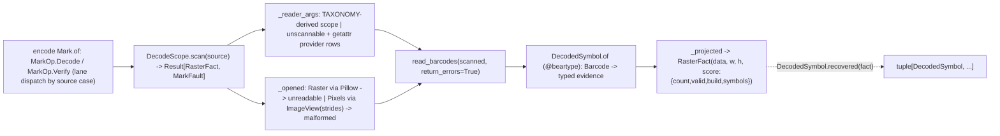

# [PY_ARTIFACTS_GRAPHIC_MARKS_DECODE]

Machine-readable-mark decode substrate owns the rich zxing-cpp `read_barcodes` inverse the segno and python-barcode generation arms cannot express. `DecodeScope.scan(source) -> Result[RasterFact, MarkFault]` is its ONE composable kernel. `graphic/marks/encode#MARK`'s `Mark` owner composes the kernel through `MarkOp.Decode` and `MarkOp.Verify` under one lane dispatch. Pillow source-open failures convert to `MarkFault.unreadable`, and wrong-rank, dtype, channel, or stride frames convert to `MarkFault.malformed` at the raising arm; no custom exception crosses a worker seam. `DecodeScope` collapses the whole detector axis into one frozen policy keyed by a `ScopeKind` seed. Format scope is either an explicit `Symbology` tuple derived through the ONE `TAXONOMY` carrier correspondence or a `FormatFamily` class member covering readable formats no `Symbology` member names. `DecodedSymbol` owns every admitted `zxingcpp.Barcode`, including precise `Barcode.format`, distinct `Barcode.symbology`, raw bytes, structural position, provider metadata, and typed error evidence.

`DecodeScope._scoped` reads `TAXONOMY[member]`, so an alias decodes as its physical carrier and a carrier-less member (`EAN14`) refuses with `MarkFault.unscannable`. One `scope: FormatFamily | tuple[Symbology, ...]` discriminant prevents explicit formats and a family from coexisting. Canonical detector vocabularies map to provider enums through member-name rows resolved at the `read_barcodes` edge. Every decoded symbol folds into `RasterFact.score` as one `msgspec.json` blob reconstructed by `DecodedSymbol.recovered`, beside numeric `COUNT`/`VALID`/`BUILD` summaries and real raster dimensions.

## [01]-[INDEX]

- [01]-[DECODE]: zxing-cpp `read_barcodes` substrate — `DecodeScope` owns detector policy, format scope, capability query, and scan; `DecodedSymbol` owns per-symbol admission and recovery; `TAXONOMY` derives explicit format scopes with typed `unscannable` refusal; `graphic/marks/encode#MARK` composes the shared `RasterFact`/`MarkFault` rail.

## [02]-[DECODE]

- Cases: `DecodeSource.Raster(payload)` carries encoded bytes, while `DecodeSource.Pixels(frame, fmt)` carries `NDArray[np.uint8]` plus explicit channel order into a custom-stride `ImageView`. `read_barcode` collapses into plural `read_barcodes`; a first-symbol consumer projects `DecodedSymbol.recovered(fact)[0]`. `return_errors=True` retains invalid symbols with `SymbolError` and provider message evidence.
- Modality: `DecodeScope.scan` decodes one source into the full `tuple[DecodedSymbol, ...]` the raster contains — within-raster plurality is `read_barcodes`'s `list[Barcode]`, across-raster plurality the `Mark.over` batch. `DecodeScope.of(kind, scope)` reads the `ScopeKind` seed and narrows format scope, and positional `scope` discriminates `FormatFamily | Symbology | Iterable[Symbology]` by value type in one `match`.
- Auto: `DecodeScope._opened` closes Pillow handles after `load` and detaches the admitted image, validates NumPy rank, dtype, extent, channel count, and positive strides before `ImageView`, and converts source failures once. `DecodeScope._scoped` derives format scope from `TAXONOMY`; `DecodeScope._reader_args` resolves canonical vocabulary at the provider edge; `DecodedSymbol.of` admits each `Barcode` through `@beartype`; `DecodeScope._projected` folds the symbols into `RasterFact(data, width, height, score)`.
- Receipt: this page mints none. `DecodeScope.scan` returns shared `RasterFact` data; `DecodeFact` keys numeric `COUNT`/`VALID`/`BUILD` and the `SYMBOLS` blob `DecodedSymbol.recovered` reconstructs. An open source with no symbol is absence (`count=0`), never a fault.
- Growth: a new decode seed is one `ScopeKind` row plus one `_SCOPES` value; a richer symbol fact one `DecodedSymbol` field; a new format class one `FormatFamily` member plus one `_FAMILY` row; a new detector or pixel mode one vocabulary member plus its provider-name row; a new source modality one `DecodeSource` case plus one `_opened` arm; a new symbology scope one `TAXONOMY` row.
- Boundary: no generation and no rail (the three encode arms, the `MarkOp` family, and the lane dispatch are `graphic/marks/encode#MARK`'s), no pixel-raster image processing (the raster transform/IO engines are `graphic/raster`'s, whose worker may hand this page an already-decoded `Pixels` frame so the scan needs no Pillow on that path), no UI, no live viewer. `read_barcodes` accepts a numpy array, a PIL image, a buffer, or a `zxingcpp.ImageView`; this page always declares the layout through `ImageView`. Deleted forms — a per-symbology decode entry, a `read_barcode`/`read_barcodes` sibling pair, the deprecated `|` format-union, a second carrier table beside `TAXONOMY`, a parallel decode fault enum or fault-bearing exception, a `text|format|valid|position` score cram, a silent drop of invalid symbols, a `mode`/`engine`/`gated` knob, an async sibling rail beside `Mark.of` — the correct form forecloses.

```python signature
# --- [RUNTIME_PRELUDE] ------------------------------------------------------------------
from collections.abc import Iterable
from copy import replace
from dataclasses import dataclass
from enum import StrEnum
from functools import lru_cache
from io import BytesIO
from typing import Self, assert_never

import msgspec
import numpy as np
from beartype import BeartypeConf, beartype
from builtins import frozendict
from expression import Error, Ok, Result

from rasm.artifacts.graphic.marks.mark import TAXONOMY, DecodeSource, MarkFault, PixelFormat, Symbology
from rasm.artifacts.graphic.raster.process import RasterFact

lazy import zxingcpp
lazy from PIL import Image

_CONTRACT = BeartypeConf(is_pep484_tower=True)

# --- [TYPES] ----------------------------------------------------------------------------
class SymbolError(StrEnum):  # per-symbol EVIDENCE return_errors=True keeps — never a rail fault
    CHECKSUM = "checksum"
    FORMAT = "format"
    UNSUPPORTED = "unsupported"
    UNKNOWN = "unknown"  # a provider Error.Type the mirror postdates; error_message keeps the provider detail


class ContentKind(StrEnum):
    TEXT = "text"
    BINARY = "binary"
    MIXED = "mixed"
    GS1 = "gs1"
    ISO15434 = "iso15434"
    UNKNOWN_ECI = "unknown-eci"
    UNKNOWN = "unknown"  # a provider ContentType member the mirror postdates — admission stays total under a zxingcpp roster growth


class DecodeFact(StrEnum):
    COUNT = "count"
    VALID = "valid"
    BUILD = "build"
    SYMBOLS = "symbols"


class Binarize(StrEnum):
    LOCAL = "local-average"
    GLOBAL = "global-histogram"
    FIXED = "fixed-threshold"
    BOOL = "bool-cast"


class TextRead(StrEnum):
    HRI = "hri"
    PLAIN = "plain"
    ECI = "eci"
    ESCAPED = "escaped"
    HEX = "hex"
    HEX_ECI = "hex-eci"


class EanAddOn(StrEnum):
    IGNORE = "ignore"
    READ = "read"
    REQUIRE = "require"


class ScopeKind(StrEnum):
    FAST = "fast"
    THOROUGH = "thorough"
    PURE = "pure"
    RETAIL = "retail"


class FormatFamily(StrEnum):
    READABLE = "readable"
    MATRIX = "matrix"
    LINEAR = "linear"
    RETAIL = "retail"
    GS1 = "gs1"
    INDUSTRIAL = "industrial"
    CREATABLE = "creatable"
    ALL = "all"


type FormatScope = FormatFamily | tuple[Symbology, ...]


# --- [MODELS] ---------------------------------------------------------------------------
class Quad(msgspec.Struct, frozen=True):
    top_left: tuple[int, int]
    top_right: tuple[int, int]
    bottom_right: tuple[int, int]
    bottom_left: tuple[int, int]


class DecodedSymbol(msgspec.Struct, frozen=True, omit_defaults=True):
    text: str
    raw: bytes
    symbology: str  # str(Barcode.format) — the precise decoded format ("EAN-13", "Micro QR Code")
    family: str  # str(Barcode.symbology) — the rolled-up family ("EAN/UPC", "QR Code"); distinct from format, never collapsed onto it
    content: ContentKind
    valid: bool
    orientation: int
    ec_level: str
    symbology_id: str
    position: Quad
    extra: tuple[tuple[str, str], ...]  # symbology-specific provider metadata, wire-stable pairs
    error: SymbolError | None = None
    error_message: str = ""

    @classmethod
    @beartype(conf=_CONTRACT)
    def of(cls, barcode: "zxingcpp.Barcode", /) -> Self:
        box = barcode.position
        return cls(
            text=barcode.text,
            raw=barcode.bytes,
            symbology=str(barcode.format),
            family=str(barcode.symbology),
            content=_CONTENT.get(barcode.content_type.name, ContentKind.UNKNOWN),
            valid=barcode.valid,
            orientation=barcode.orientation,
            ec_level=barcode.ec_level,
            symbology_id=barcode.symbology_identifier,
            position=Quad(
                top_left=(box.top_left.x, box.top_left.y),
                top_right=(box.top_right.x, box.top_right.y),
                bottom_right=(box.bottom_right.x, box.bottom_right.y),
                bottom_left=(box.bottom_left.x, box.bottom_left.y),
            ),
            extra=tuple((key, str(value)) for key, value in barcode.extra.items()),
            error=_ERROR.get(barcode.error.type.name, SymbolError.UNKNOWN) if barcode.error else None,
            error_message=barcode.error.message if barcode.error else "",
        )

    @classmethod
    def recovered(cls, fact: RasterFact, /) -> tuple[Self, ...]:
        return _DECODER.decode(fact.score[DecodeFact.SYMBOLS]) if DecodeFact.SYMBOLS in fact.score else ()


@dataclass(frozen=True, slots=True, kw_only=True)
class DecodeScope:
    scope: FormatScope = FormatFamily.READABLE
    try_rotate: bool = True
    try_invert: bool = True
    try_downscale: bool = True
    is_pure: bool = False
    binarize: Binarize = Binarize.LOCAL
    text_mode: TextRead = TextRead.HRI
    ean_add_on: EanAddOn = EanAddOn.IGNORE

    @classmethod
    def of(cls, kind: ScopeKind = ScopeKind.THOROUGH, scope: Symbology | Iterable[Symbology] | FormatFamily = FormatFamily.READABLE, /) -> Self:
        match scope:
            case FormatFamily() as family:
                return replace(_SCOPES[kind], scope=family)
            case Symbology() as lone:
                return replace(_SCOPES[kind], scope=(lone,))
            case _ as many:
                return replace(_SCOPES[kind], scope=tuple(many))

    def _scoped(self) -> Result[object, MarkFault]:
        match self.scope:
            case FormatFamily() as family:
                return Ok(getattr(zxingcpp.BarcodeFormat, _FAMILY[family]))
            case ():
                return Error(MarkFault(arity="empty decode scope"))  # an explicit zero-symbology scope never widens to READABLE
            case formats:
                dead = tuple(member for member in formats if TAXONOMY[member][1] is None)
                if dead:
                    return Error(MarkFault(unscannable=dead[0]))
                return Ok(zxingcpp.barcode_formats_from_str(",".join(TAXONOMY[member][1] for member in formats)))

    def _reader_args(self) -> Result[dict[str, object], MarkFault]:
        return self._scoped().map(
            lambda formats: {
                "formats": formats,
                "try_rotate": self.try_rotate,
                "try_invert": self.try_invert,
                "try_downscale": self.try_downscale,
                "is_pure": self.is_pure,
                "binarizer": getattr(zxingcpp.Binarizer, _BINARIZE[self.binarize]),
                "text_mode": getattr(zxingcpp.TextMode, _TEXT_MODE[self.text_mode]),
                "ean_add_on_symbol": getattr(zxingcpp.EanAddOnSymbol, _EAN[self.ean_add_on]),
                "return_errors": True,
            }
        )

    @staticmethod
    def _opened(source: DecodeSource, /) -> Result[tuple[object, bytes, int, int], MarkFault]:
        match source:
            case DecodeSource(tag="raster", raster=payload):
                try:
                    with Image.open(BytesIO(payload)) as opened:
                        opened.load()
                        image = opened.copy()
                except (Image.DecompressionBombError, OSError) as fault:
                    return Error(MarkFault(unreadable=type(fault).__name__))
                return Ok((image, payload, image.width, image.height))
            case DecodeSource(tag="pixels", pixels=(frame, pixfmt)):
                channels = _CHANNELS[pixfmt]
                actual = 1 if frame.ndim == 2 else int(frame.shape[2]) if frame.ndim == 3 else 0
                valid = (
                    frame.dtype == np.dtype(np.uint8)
                    and frame.ndim == (2 if channels == 1 else 3)
                    and actual == channels
                    and frame.shape[0] > 0
                    and frame.shape[1] > 0
                    and frame.strides[0] > 0
                    and frame.strides[1] >= channels * frame.itemsize
                    and (frame.ndim == 2 or frame.strides[2] == frame.itemsize)  # packed channels: a reversed- or planar-channel view never reaches ImageView
                )
                if not valid:
                    return Error(MarkFault(malformed=f"{frame.dtype}:{frame.shape}:{frame.strides}"))
                width, height = int(frame.shape[1]), int(frame.shape[0])
                try:
                    view = zxingcpp.ImageView(frame, width, height, getattr(zxingcpp.ImageFormat, _PIXEL[pixfmt]), int(frame.strides[0]), int(frame.strides[1]))
                except (TypeError, ValueError) as fault:
                    return Error(MarkFault(malformed=type(fault).__name__))
                return Ok((view, frame.tobytes(), width, height))
            case _ as unreachable:
                assert_never(unreachable)

    @staticmethod
    def _projected(data: bytes, width: int, height: int, symbols: tuple[DecodedSymbol, ...], /) -> RasterFact:
        return RasterFact(
            data,
            width,
            height,
            frozendict({
                DecodeFact.COUNT: float(len(symbols)),
                DecodeFact.VALID: float(sum(symbol.valid for symbol in symbols)),
                DecodeFact.BUILD: float(len(DecodeScope._roster())),
                DecodeFact.SYMBOLS: _SYMBOLS.encode(symbols).decode(),
            }),
        )

    @staticmethod
    @lru_cache(maxsize=1)
    def _roster() -> frozenset[str]:
        return frozenset(str(fmt) for fmt in zxingcpp.barcode_formats_list())

    def scan(self, source: DecodeSource, /) -> Result[RasterFact, MarkFault]:
        return self._reader_args().bind(
            lambda args: self._opened(source).map(
                lambda opened: self._projected(
                    opened[1],
                    opened[2],
                    opened[3],
                    tuple(DecodedSymbol.of(found) for found in zxingcpp.read_barcodes(opened[0], **args)),
                )
            )
        )

    def supported(self) -> Result[frozenset[str], MarkFault]:
        return self._scoped().map(lambda formats: frozenset(str(fmt) for fmt in zxingcpp.barcode_formats_list(formats)))


# --- [TABLES] ---------------------------------------------------------------------------
# Canonical provider names resolve at the call; no provider enum crosses a worker seam, and `TAXONOMY` remains the sole carrier correspondence.
_FAMILY: frozendict[FormatFamily, str] = frozendict({
    FormatFamily.READABLE: "AllReadable",
    FormatFamily.MATRIX: "AllMatrix",
    FormatFamily.LINEAR: "AllLinear",
    FormatFamily.RETAIL: "AllRetail",
    FormatFamily.GS1: "AllGS1",
    FormatFamily.INDUSTRIAL: "AllIndustrial",
    FormatFamily.CREATABLE: "AllCreatable",
    FormatFamily.ALL: "All",
})
_BINARIZE: frozendict[Binarize, str] = frozendict({
    Binarize.LOCAL: "LocalAverage",
    Binarize.GLOBAL: "GlobalHistogram",
    Binarize.FIXED: "FixedThreshold",
    Binarize.BOOL: "BoolCast",
})
_TEXT_MODE: frozendict[TextRead, str] = frozendict({
    TextRead.HRI: "HRI",
    TextRead.PLAIN: "Plain",
    TextRead.ECI: "ECI",
    TextRead.ESCAPED: "Escaped",
    TextRead.HEX: "Hex",
    TextRead.HEX_ECI: "HexECI",
})
_EAN: frozendict[EanAddOn, str] = frozendict({EanAddOn.IGNORE: "Ignore", EanAddOn.READ: "Read", EanAddOn.REQUIRE: "Require"})
_PIXEL: frozendict[PixelFormat, str] = frozendict({
    PixelFormat.RGB: "RGB",
    PixelFormat.BGR: "BGR",
    PixelFormat.RGBA: "RGBA",
    PixelFormat.BGRA: "BGRA",
    PixelFormat.ABGR: "ABGR",
    PixelFormat.ARGB: "ARGB",
    PixelFormat.LUM: "Lum",
    PixelFormat.LUMA: "LumA",
})
_CHANNELS: frozendict[PixelFormat, int] = frozendict({
    PixelFormat.RGB: 3,
    PixelFormat.BGR: 3,
    PixelFormat.RGBA: 4,
    PixelFormat.BGRA: 4,
    PixelFormat.ABGR: 4,
    PixelFormat.ARGB: 4,
    PixelFormat.LUM: 1,
    PixelFormat.LUMA: 2,
})
# Provider .name -> canonical rows, read off the live Barcode at admission; a name the row set postdates
# falls to the UNKNOWN member through `.get`, so scan stays railed under a provider roster growth.
_CONTENT: frozendict[str, ContentKind] = frozendict({
    "Text": ContentKind.TEXT,
    "Binary": ContentKind.BINARY,
    "Mixed": ContentKind.MIXED,
    "GS1": ContentKind.GS1,
    "ISO15434": ContentKind.ISO15434,
    "UnknownECI": ContentKind.UNKNOWN_ECI,
})
_ERROR: frozendict[str, SymbolError] = frozendict({"Checksum": SymbolError.CHECKSUM, "Format": SymbolError.FORMAT, "Unsupported": SymbolError.UNSUPPORTED})
_SCOPES: frozendict[ScopeKind, DecodeScope] = frozendict({
    ScopeKind.FAST: DecodeScope(try_rotate=False, try_invert=False, try_downscale=False),
    ScopeKind.THOROUGH: DecodeScope(),
    ScopeKind.PURE: DecodeScope(is_pure=True, try_rotate=False, try_downscale=False, binarize=Binarize.GLOBAL),
    ScopeKind.RETAIL: DecodeScope(ean_add_on=EanAddOn.READ, try_invert=False),
})
_SYMBOLS = msgspec.json.Encoder()
_DECODER = msgspec.json.Decoder(tuple[DecodedSymbol, ...])
# --- [EXPORTS] --------------------------------------------------------------------------
__all__ = [
    "Binarize",
    "ContentKind",
    "DecodeFact",
    "DecodeScope",
    "DecodedSymbol",
    "EanAddOn",
    "FormatFamily",
    "FormatScope",
    "Quad",
    "ScopeKind",
    "SymbolError",
    "TextRead",
]
```



## [03]-[RESEARCH]

<!-- source-only: research row template:
[TOKEN]-[OPEN|BLOCKED]: <exact question>; <verification route>.
-->

(none)
