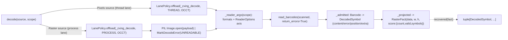

# [PY_ARTIFACTS_GRAPHIC_MARKS_DECODE]

Machine-readable-mark decode owner — the rich zxing-cpp `read_barcodes` inverse the segno and python-barcode generation arms cannot express. It owns the decode-specific shapes: `DecodeScope` collapses the whole `read_barcodes` detector axis into one frozen policy value keyed by a `ScopeKind` preset, the format scope either an explicit `Symbology` tuple or a `FormatFamily` class member covering readable formats no `Symbology` member names; `DecodedSymbol` is the per-symbol evidence owner every decoded `zxingcpp.Barcode` admits into, carrying the precise `Barcode.format` display name beside the distinct `Barcode.symbology` family rollup rather than a `text|format|valid|position` cram; `DecodeFault` is the closed fault vocabulary mapping zxing `ErrorType` plus the unreadable-raster and malformed-frame seams; `ContentKind` classifies the payload over zxing `ContentType`; and `DecodeSource`'s case decides the isolation lane. `decode(source, scope)` is the one public read entry — decoded payloads are data, never artifacts.

`Raster` opens untrusted bytes through the worker Pillow `Image.open` crash-isolated on the process lane, while the `Pixels` source decodes a trusted `numpy` frame on the thread lane because `read_barcodes` reads the already-decoded array directly with no pickle — both ride `LanePolicy.offload(..., retry=RetryClass.OCCT)`, never a synchronous decode on the loop nor a folder-minted limiter. Every decoded symbol folds into the shared `RasterFact` — the typed `tuple[DecodedSymbol, ...]` projected through `RasterFact.score` as one `msgspec.json` blob `recovered` reconstructs, plus a `count`/`valid` summary — with the real raster dimensions on the fact. `DecodeSource`/`PixelFormat`/`Symbology` are imported from `graphic/marks/mark#MARK` and `RasterFact` from `graphic/raster/process#PROCESS`; the three generation arms are `graphic/marks/encode#MARK`'s and neither behavior page imports the other.

## [01]-[INDEX]

- [01]-[DECODE]: the zxing-cpp `read_barcodes` decode inverse — `DecodeScope` (the detector axis plus format scope as one `ScopeKind`-keyed policy value), `DecodedSymbol` (the per-symbol evidence owner), `DecodeFault` (the closed fault vocabulary), `ContentKind` (the payload classification), and `DecodeSource` (the source family deciding the process-vs-thread lane) — all folding into the shared `RasterFact` behind the one public `decode()` read entry.

## [02]-[DECODE]

- Cases: `DecodeSource` — `Raster(payload)` the encoded raster bytes opened through the worker Pillow `Image.open`, `Pixels(frame, fmt)` a `numpy` `NDArray[np.uint8]` plus its `PixelFormat` channel order wrapped in a `zxingcpp.ImageView` so `read_barcodes` decodes it on a `to_thread` slot with the declared layout and no Pillow. Its band is the source case (`Raster` the gated process lane, `Pixels` the thread lane), never an `engine`/`gated` knob, and the channel order is the payload's `PixelFormat`, never a shape-inferred BGR/grayscale guess. `read_barcode` (first symbol) is collapsed into `read_barcodes` (every symbol) — "first symbol" is the consumer's `recovered(fact)[0]`, never a sibling entrypoint; `return_errors=True` keeps an invalid symbol as a typed per-symbol fact on `DecodedSymbol.error`, never a silent drop.
- Modality: `_zxing_decode` decodes one source into the full `tuple[DecodedSymbol, ...]` the raster contains — within-raster plurality is `read_barcodes`'s `list[Barcode]`, across-raster plurality the caller's fold over `decode()` per source. `DecodeScope.of(kind, scope)` reads the `ScopeKind` preset and narrows the format scope, the positional `scope` discriminating `FormatFamily | Symbology | Iterable[Symbology]` by value type in one `match`, never a `*formats` unpack, a parallel `family=`/`formats=` pair, or a `mode` flag. Detector tokens (`Binarize`/`TextRead`/`EanAddOn`) and `FormatFamily` are canonical `StrEnum` vocabularies, not the provider enums, so `DecodeScope` crosses the `to_process` seam carrying canonical values the worker remaps to zxing at the `read_barcodes` call.
- Auto: `_zxing_decode` matches the `DecodeSource` case, builds the `read_barcodes` keyword axis from `DecodeScope` through `_reader_args` (an explicit symbology scope is a `barcode_formats_from_str` parse over the total `_FORMAT` `Symbology -> BarcodeFormat` table, else `_FAMILY` resolves the `FormatFamily` class to its set-value — never the encode `SYMBOLOGIES.member` column empty for QR/linear, never the deprecated `|` format-union), runs `read_barcodes(scanned, return_errors=True)`, and admits each `Barcode` through the `@beartype`-contracted `_admitted` core into a `DecodedSymbol`. `_projected` folds the symbols into `RasterFact(data, width, height, score)` with the real raster dimensions and the `msgspec.json`-encoded blob, proving generation correctness from one decode pass.
- Receipt: the decode op folds into `RasterFact` and projects to `ArtifactReceipt.Preview(key, width, height)`, reporting the genuine raster `width`/`height` rather than the zero placeholder a dimensionless worker reported. Its `score` is a `frozendict[str, float | str]` keyed by `DecodeFact` — the native-`float` `COUNT`/`VALID`/`BUILD` (the `barcode_formats_list` decodable-roster size the linked build exposes, capability evidence beside the result) stamped un-coerced so they reach `Preview.scores` as numbers, and the `str` `SYMBOLS` blob `recovered` decodes back into `tuple[DecodedSymbol, ...]`. Threading those typed facts into the emitted `_facts` projection is `core/receipt#RECEIPT`'s one `[SCORE_FACTS]` widening seam, never a new receipt case. An unopenable source is a fault, not absence — the worker converts the Pillow error family on `Raster` into `MarkDecodeError(DecodeFault.UNREADABLE)` and a wrong-rank/dtype/channel `Pixels` frame into `MALFORMED`, folded onto the rail's boundary fault carrying the `DecodeFault`; a source that opens but carries no symbol is absence (`count=0`), never a fault.
- Growth: a new decode scope is one `ScopeKind` row plus one `_SCOPES` preset; a new symbology scope one `_FORMAT` row; a richer per-symbol fact one `DecodedSymbol` field off the captured `Barcode`; a new build-capability signal one `DecodeFact` row over the `barcode_formats_list` roster; a new per-symbol fault cause one `DecodeFault` member plus one `_ERROR` row, a source-open fault one `DecodeFault` member raised through `MarkDecodeError`; a new format-class scope one `FormatFamily` member plus one `_FAMILY` row; a new text-transcode mode one `TextRead` member plus one `_TEXT_MODE` row; a new pixel channel layout one `PixelFormat` member plus one `_PIXEL` row; a new source modality one `DecodeSource` case plus one worker arm; zero new surface.
- Boundary: no generation (the three encode arms are `graphic/marks/encode#MARK`'s), no pixel-raster image processing (the raster transform/IO engines are `graphic/raster`'s, whose worker may hand this page an already-decoded `Pixels` frame so the decode needs no Pillow and rides a `to_thread` slot), no UI, no live viewer. `read_barcodes` accepts a numpy array, a PIL image, a buffer, or a `zxingcpp.ImageView`; the `Raster` bytes path rides the crash-isolated `to_process` worker through `Image.open`, the `Pixels` frame path wraps the array in an `ImageView` on a `to_thread` slot, and the band is the `DecodeSource` case `decode()` dispatches. Deleted forms — a per-symbology decode entry, a `read_barcode`/`read_barcodes` sibling pair, the `|` format-union, the buggy `SYMBOLOGIES[s].member` scope, a `text|format|valid|position` score cram, a silent drop of invalid symbols, a `mode`/`engine`/`gated` knob — the correct form forecloses.

```python signature
# --- [TYPES] ----------------------------------------------------------------------------
from collections.abc import Iterable
from copy import replace
from dataclasses import dataclass
from enum import StrEnum
from typing import Literal, Self

import msgspec
import numpy as np
import zxingcpp
from expression import case, tag, tagged_union
from numpy.typing import NDArray

from rasm.runtime.faults import RuntimeRail
from rasm.runtime.lanes import LanePolicy, Modality
from rasm.runtime.resilience import RetryClass

from artifacts.graphic.marks.mark import DecodeSource, Frame, PixelFormat, Symbology
from artifacts.graphic.raster.process import RasterFact

lazy from PIL import Image


class DecodeFault(StrEnum):
    CHECKSUM = "checksum"
    FORMAT = "format"
    UNSUPPORTED = "unsupported"
    UNREADABLE = "unreadable"
    MALFORMED = "malformed"


class ContentKind(StrEnum):
    TEXT = "text"
    BINARY = "binary"
    MIXED = "mixed"
    GS1 = "gs1"
    ISO15434 = "iso15434"
    UNKNOWN_ECI = "unknown-eci"


class DecodeFact(StrEnum):
    COUNT = "count"
    VALID = "valid"
    BUILD = "build"
    SYMBOLS = "symbols"


class Binarize(StrEnum):
    LOCAL = "local-average"
    GLOBAL = "global-histogram"
    FIXED = "fixed-threshold"
    BOOL = "bool-cast"


class TextRead(StrEnum):
    HRI = "hri"
    PLAIN = "plain"
    ECI = "eci"
    ESCAPED = "escaped"
    HEX = "hex"
    HEX_ECI = "hex-eci"


class EanAddOn(StrEnum):
    IGNORE = "ignore"
    READ = "read"
    REQUIRE = "require"


class ScopeKind(StrEnum):
    FAST = "fast"
    THOROUGH = "thorough"
    PURE = "pure"
    RETAIL = "retail"


class FormatFamily(StrEnum):
    READABLE = "readable"
    MATRIX = "matrix"
    LINEAR = "linear"
    RETAIL = "retail"
    GS1 = "gs1"
    INDUSTRIAL = "industrial"
    CREATABLE = "creatable"
    ALL = "all"


# --- [MODELS] ---------------------------------------------------------------------------
class Quad(msgspec.Struct, frozen=True):
    top_left: tuple[int, int]
    top_right: tuple[int, int]
    bottom_right: tuple[int, int]
    bottom_left: tuple[int, int]


class DecodedSymbol(msgspec.Struct, frozen=True, omit_defaults=True):
    text: str
    raw: bytes
    symbology: str  # str(Barcode.format) — the precise decoded format ("EAN-13", "Micro QR Code")
    family: str  # str(Barcode.symbology) — the rolled-up family ("EAN/UPC", "QR Code"); distinct from format, never collapsed onto it
    content: ContentKind
    valid: bool
    orientation: int
    ec_level: str
    symbology_id: str
    position: Quad
    extra: dict[str, str]
    error: DecodeFault | None = None


@dataclass(frozen=True, slots=True, kw_only=True)
class DecodeScope:
    formats: tuple[Symbology, ...] = ()
    family: FormatFamily = FormatFamily.READABLE
    try_rotate: bool = True
    try_invert: bool = True
    try_downscale: bool = True
    is_pure: bool = False
    binarize: Binarize = Binarize.LOCAL
    text_mode: TextRead = TextRead.HRI
    ean_add_on: EanAddOn = EanAddOn.IGNORE

    @classmethod
    def of(cls, kind: ScopeKind = ScopeKind.THOROUGH, scope: Symbology | Iterable[Symbology] | FormatFamily = FormatFamily.READABLE, /) -> Self:
        match scope:
            case FormatFamily() as family:
                return replace(_SCOPES[kind], family=family)
            case Symbology() as lone:
                return replace(_SCOPES[kind], formats=(lone,))
            case _ as many:
                return replace(_SCOPES[kind], formats=tuple(many))


# --- [ERRORS] ---------------------------------------------------------------------------
class MarkDecodeError(Exception):
    def __init__(self, fault: DecodeFault, /) -> None:
        self.fault = fault
        super().__init__(fault)  # carry the enum (not its .value) so the raise round-trips pickling back across the to_process seam


# --- [TABLES] ---------------------------------------------------------------------------
# Total over Symbology so a scoped decode never KeyErrors _reader_args; the EAN/ISBN aliases fold onto their EAN13 carrier, the matrix rows onto their zxing readables.
_FORMAT: frozendict[Symbology, str] = frozendict({
    Symbology.QR: "QRCode",
    Symbology.MICRO_QR: "MicroQRCode",
    Symbology.QR_SEQUENCE: "QRCode",
    Symbology.CODE128: "Code128",
    Symbology.GS1_128: "Code128",
    Symbology.CODE39: "Code39",
    Symbology.PZN: "Code39",
    Symbology.EAN13: "EAN13",
    Symbology.ISBN13: "EAN13",
    Symbology.ISBN10: "EAN13",
    Symbology.ISSN: "EAN13",
    Symbology.EAN14: "EAN13",
    Symbology.EAN8: "EAN8",
    Symbology.UPCA: "UPCA",
    Symbology.ITF: "ITF",
    Symbology.CODABAR: "Codabar",
    Symbology.DATA_MATRIX: "DataMatrix",
    Symbology.PDF417: "PDF417",
    Symbology.COMPACT_PDF417: "CompactPDF417",
    Symbology.AZTEC: "Aztec",
    Symbology.MAXICODE: "MaxiCode",
    Symbology.RMQR: "RMQRCode",
})
_FAMILY: frozendict[FormatFamily, zxingcpp.BarcodeFormat] = frozendict({
    FormatFamily.READABLE: zxingcpp.BarcodeFormat.AllReadable,
    FormatFamily.MATRIX: zxingcpp.BarcodeFormat.AllMatrix,
    FormatFamily.LINEAR: zxingcpp.BarcodeFormat.AllLinear,
    FormatFamily.RETAIL: zxingcpp.BarcodeFormat.AllRetail,
    FormatFamily.GS1: zxingcpp.BarcodeFormat.AllGS1,
    FormatFamily.INDUSTRIAL: zxingcpp.BarcodeFormat.AllIndustrial,
    FormatFamily.CREATABLE: zxingcpp.BarcodeFormat.AllCreatable,
    FormatFamily.ALL: zxingcpp.BarcodeFormat.All,
})
_CONTENT: frozendict[zxingcpp.ContentType, ContentKind] = frozendict({
    zxingcpp.ContentType.Text: ContentKind.TEXT,
    zxingcpp.ContentType.Binary: ContentKind.BINARY,
    zxingcpp.ContentType.Mixed: ContentKind.MIXED,
    zxingcpp.ContentType.GS1: ContentKind.GS1,
    zxingcpp.ContentType.ISO15434: ContentKind.ISO15434,
    zxingcpp.ContentType.UnknownECI: ContentKind.UNKNOWN_ECI,
})
_ERROR: frozendict[zxingcpp.ErrorType, DecodeFault] = frozendict({
    zxingcpp.ErrorType.Checksum: DecodeFault.CHECKSUM,
    zxingcpp.ErrorType.Format: DecodeFault.FORMAT,
    zxingcpp.ErrorType.Unsupported: DecodeFault.UNSUPPORTED,
})
_BINARIZE: frozendict[Binarize, zxingcpp.Binarizer] = frozendict({
    Binarize.LOCAL: zxingcpp.Binarizer.LocalAverage,
    Binarize.GLOBAL: zxingcpp.Binarizer.GlobalHistogram,
    Binarize.FIXED: zxingcpp.Binarizer.FixedThreshold,
    Binarize.BOOL: zxingcpp.Binarizer.BoolCast,
})
_TEXT_MODE: frozendict[TextRead, zxingcpp.TextMode] = frozendict({
    TextRead.HRI: zxingcpp.TextMode.HRI,
    TextRead.PLAIN: zxingcpp.TextMode.Plain,
    TextRead.ECI: zxingcpp.TextMode.ECI,
    TextRead.ESCAPED: zxingcpp.TextMode.Escaped,
    TextRead.HEX: zxingcpp.TextMode.Hex,
    TextRead.HEX_ECI: zxingcpp.TextMode.HexECI,
})
_EAN: frozendict[EanAddOn, zxingcpp.EanAddOnSymbol] = frozendict({
    EanAddOn.IGNORE: zxingcpp.EanAddOnSymbol.Ignore,
    EanAddOn.READ: zxingcpp.EanAddOnSymbol.Read,
    EanAddOn.REQUIRE: zxingcpp.EanAddOnSymbol.Require,
})
_PIXEL: frozendict[PixelFormat, zxingcpp.ImageFormat] = frozendict({
    PixelFormat.RGB: zxingcpp.ImageFormat.RGB,
    PixelFormat.BGR: zxingcpp.ImageFormat.BGR,
    PixelFormat.RGBA: zxingcpp.ImageFormat.RGBA,
    PixelFormat.BGRA: zxingcpp.ImageFormat.BGRA,
    PixelFormat.ABGR: zxingcpp.ImageFormat.ABGR,
    PixelFormat.ARGB: zxingcpp.ImageFormat.ARGB,
    PixelFormat.LUM: zxingcpp.ImageFormat.Lum,
    PixelFormat.LUMA: zxingcpp.ImageFormat.LumA,
})
_SCOPES: frozendict[ScopeKind, DecodeScope] = frozendict({
    ScopeKind.FAST: DecodeScope(try_rotate=False, try_invert=False, try_downscale=False),
    ScopeKind.THOROUGH: DecodeScope(),
    ScopeKind.PURE: DecodeScope(is_pure=True, try_rotate=False, try_downscale=False, binarize=Binarize.GLOBAL),
    ScopeKind.RETAIL: DecodeScope(ean_add_on=EanAddOn.READ, try_invert=False),
})
_SYMBOLS = msgspec.json.Encoder()
_DECODER = msgspec.json.Decoder(tuple[DecodedSymbol, ...])
# The linked zxing build's decodable-format roster via barcode_formats_list — capability detection; the count rides every DecodeFact.BUILD row.
_ROSTER: frozenset[str] = frozenset(str(fmt) for fmt in zxingcpp.barcode_formats_list())
```

```python signature
# --- [OPERATIONS] -----------------------------------------------------------------------
from io import BytesIO
from typing import assert_never

from beartype import BeartypeConf, beartype

_CONTRACT = BeartypeConf(
    is_pep484_tower=True
)  # sibling parity with the encode _contracted weave: the pep484 numeric tower admits an int where a float hint stands at the foreign-pybind seam


@beartype(conf=_CONTRACT)
def _admitted(barcode: zxingcpp.Barcode, /) -> DecodedSymbol:
    box = barcode.position
    return DecodedSymbol(
        text=barcode.text,
        raw=barcode.bytes,
        symbology=str(barcode.format),
        family=str(barcode.symbology),
        content=_CONTENT[barcode.content_type],
        valid=barcode.valid,
        orientation=barcode.orientation,
        ec_level=barcode.ec_level,
        symbology_id=barcode.symbology_identifier,
        position=Quad(
            top_left=(box.top_left.x, box.top_left.y),
            top_right=(box.top_right.x, box.top_right.y),
            bottom_right=(box.bottom_right.x, box.bottom_right.y),
            bottom_left=(box.bottom_left.x, box.bottom_left.y),
        ),
        extra={key: str(value) for key, value in barcode.extra.items()},
        error=_ERROR.get(barcode.error.type) if barcode.error else None,
    )


def _reader_args(scope: DecodeScope, /) -> dict[str, object]:
    scoped = ",".join(_FORMAT[symbology] for symbology in scope.formats)
    return {
        "formats": zxingcpp.barcode_formats_from_str(scoped) if scoped else _FAMILY[scope.family],
        "try_rotate": scope.try_rotate,
        "try_invert": scope.try_invert,
        "try_downscale": scope.try_downscale,
        "is_pure": scope.is_pure,
        "binarizer": _BINARIZE[scope.binarize],
        "text_mode": _TEXT_MODE[scope.text_mode],
        "ean_add_on_symbol": _EAN[scope.ean_add_on],
        "return_errors": True,
    }


def _projected(data: bytes, width: int, height: int, symbols: tuple[DecodedSymbol, ...], /) -> RasterFact:
    # COUNT/VALID/BUILD stamp native floats onto the widened band so they reach Preview.scores un-coerced.
    score: frozendict[str, float | str] = frozendict({
        DecodeFact.COUNT: float(len(symbols)),
        DecodeFact.VALID: float(sum(symbol.valid for symbol in symbols)),
        DecodeFact.BUILD: float(len(_ROSTER)),
        DecodeFact.SYMBOLS: _SYMBOLS.encode(symbols).decode(),
    })
    return RasterFact(data, width, height, score)


def _zxing_decode(source: DecodeSource, scope: DecodeScope, /) -> RasterFact:
    match source:
        case DecodeSource(tag="raster", raster=payload):
            try:
                image = Image.open(BytesIO(payload))
                image.load()  # force decode in the seam so a DecompressionBomb/truncation fault converts here, not mid-read past the except
            except (Image.UnidentifiedImageError, Image.DecompressionBombError, OSError) as fault:
                raise MarkDecodeError(DecodeFault.UNREADABLE) from fault
            scanned, data, width, height = image, payload, image.width, image.height
        case DecodeSource(tag="pixels", pixels=(frame, pixfmt)):
            try:
                width, height = int(frame.shape[1]), int(frame.shape[0])
                # thread the frame's real byte strides so a cropped/sliced non-contiguous view from graphic/raster reads its true row/pixel layout, never a packed-row assumption
                scanned = zxingcpp.ImageView(frame, width, height, _PIXEL[pixfmt], int(frame.strides[0]), int(frame.strides[1]))
                data = frame.tobytes()
            except (IndexError, TypeError, ValueError) as fault:  # a wrong-rank/dtype/channel frame fails ImageView construction
                raise MarkDecodeError(DecodeFault.MALFORMED) from fault
        case _ as unreachable:
            assert_never(unreachable)
    symbols = tuple(_admitted(barcode) for barcode in zxingcpp.read_barcodes(scanned, **_reader_args(scope)))
    return _projected(data, width, height, symbols)


async def decode(source: DecodeSource, scope: DecodeScope | None = None, /) -> RuntimeRail[RasterFact]:
    # the ONE public read entry — no receipt, no ArtifactWork. Raster decodes untrusted bytes crash-isolated
    # on the process lane; a trusted Pixels frame shares the thread lane with no pickle, both runtime-owned.
    resolved = scope if scope is not None else DecodeScope.of()
    modality = Modality.PROCESS if source.tag == "raster" else Modality.THREAD
    return await LanePolicy.offload(_zxing_decode, source, resolved, modality=modality, retry=RetryClass.OCCT)


def recovered(fact: RasterFact, /) -> tuple[DecodedSymbol, ...]:
    return _DECODER.decode(fact.score[DecodeFact.SYMBOLS]) if DecodeFact.SYMBOLS in fact.score else ()


def supported(family: FormatFamily = FormatFamily.READABLE, /) -> frozenset[str]:
    return frozenset(str(fmt) for fmt in zxingcpp.barcode_formats_list(_FAMILY[family]))
```



## [03]-[RESEARCH]

<!-- source-only: research row template:
[TOKEN]-[OPEN|BLOCKED]: <exact question>; <verification route>.
-->

(none)
