# [PY_ARTIFACTS_GRAPHIC_MARKS_DECODE]

The machine-readable-mark decode owner — the rich zxing-cpp `read_barcodes` inverse the segno and python-barcode generation arms of `graphic/marks/encode#MARK` cannot express. The page owns five decode-specific shapes: `DecodeScope` collapses the entire `read_barcodes` detector axis (`formats`/`try_rotate`/`try_invert`/`try_downscale`/`is_pure`/`binarizer`/`text_mode`/`ean_add_on_symbol`) into ONE frozen policy value: a `ScopeKind` preset keys the detector tail and the format scope is either an explicit `Symbology` tuple or a `FormatFamily` class member (`AllMatrix`/`AllLinear`/`AllRetail`/`AllGS1`/`AllIndustrial`/`AllCreatable`/`AllReadable`/`All` — the zxing set-valued format classes, covering readable formats no `Symbology` member names); `DecodedSymbol` is the per-symbol evidence owner every decoded `zxingcpp.Barcode` is admitted into — `text`/`raw`/`symbology`/`content`/`valid`/`error`/`orientation`/`ec_level`/`symbology_id`/`position`/`extra`, never a `text|format|valid|position` string cram; `DecodeFault` is the closed decode-fault vocabulary mapping zxing `ErrorType` plus the unreadable-raster and malformed-pixel-frame seams; `ContentKind` classifies the decoded payload over zxing `ContentType`; and `DecodeSource` is the raster-bytes/typed-pixel-frame source family whose case decides the band, the `Pixels` case carrying its `PixelFormat` channel order so the frame crosses into `read_barcodes` through a `zxingcpp.ImageView` rather than a shape-inferred bare array. `_zxing_decode` is the `MarkOp.Decode` body the encode `Mark` owner dispatches: the `raster` source opens through the worker Pillow `Image.open` and crosses the `faults`-owned `to_process.run_sync` crash-isolated seam, while the `pixels` source decodes a `numpy` frame on an `anyio.to_thread.run_sync` slot because `read_barcodes` reads the trusted already-decoded array directly with no pickle — both crossings off the event loop under the one `_MARK_LANE` `CapacityLimiter`, never a synchronous decode inline on the loop. Every decoded symbol folds into the shared `RasterFact` shape — the typed `tuple[DecodedSymbol, ...]` projected through `RasterFact.score` as one `msgspec.json` blob recoverable by `recovered`, plus a `count`/`valid` summary — so `Mark._compute` lands one `core/receipt#RECEIPT` `ArtifactReceipt.Preview` carrying the real raster dimensions.

## [01]-[INDEX]

- [01]-[DECODE]: the zxing-cpp `read_barcodes` decode inverse as a rich owner — `DecodeScope` (the full detector axis plus the `Symbology`-tuple-or-`FormatFamily`-class format scope collapsed to one `ScopeKind`-keyed policy value), `DecodedSymbol` (the complete per-symbol evidence owner), `DecodeFault` (the closed `ErrorType`-plus-unreadable-plus-malformed fault vocabulary), `ContentKind` (the `ContentType` payload classification), and `DecodeSource` (the raster-bytes/typed-pixel-frame source family carrying its `PixelFormat` for a `zxingcpp.ImageView` decode, deciding the `to_process`-vs-`to_thread` offload band) — all folding into the shared `RasterFact` so `Mark._compute`'s `decode` arm projects one `ArtifactReceipt.Preview`, the encode/decode round-trip a QR-only or linear-only owner cannot provide.

## [02]-[DECODE]

- Cases: `DecodeSource` is the closed source family — `Raster(payload)` carrying the encoded raster bytes opened through the worker Pillow `Image.open`, and `Pixels(frame, fmt)` carrying a `numpy` `NDArray[np.uint8]` plus its `PixelFormat` channel order, wrapped in a `zxingcpp.ImageView` so `read_barcodes` decodes it on a `to_thread` slot with the declared channel layout and no Pillow — matched by one total `match`/`assert_never` inside the worker; the band is the source case (`Raster` the gated `to_process` seam, `Pixels` the `to_thread` slot), never an `engine`/`gated` knob, and the channel order is the `Pixels` payload's `PixelFormat`, never a shape-inferred BGR/grayscale guess (a bare three-channel array is read BGR, swapping the RGB luminance weights, and a four-channel array misreads entirely). `read_barcode` (first symbol) is COLLAPSED into `read_barcodes` (every symbol): a decode is always plural over the raster, and "first symbol" is the consumer's `recovered(fact)[0]` projection, never a sibling decode entrypoint. Per-symbol decode faults are NOT a second op: `return_errors=True` returns invalid symbols carrying their `Error`, admitted onto `DecodedSymbol.error`, so a checksum or format miss is a typed per-symbol fact rather than a silently dropped symbol.
- Modality: `_zxing_decode` decodes ONE source into the full `tuple[DecodedSymbol, ...]` the raster contains — within-raster plurality is `read_barcodes`'s `list[Barcode]`, never a per-symbol call. Across-raster plurality is the encode `Mark.of` entry's modality (one `MarkOp.Decode` per source), not re-derived here. `DecodeScope.of(kind, scope)` is the one scope builder: it reads the `ScopeKind` preset row and narrows the format scope, the positional `scope` discriminating `FormatFamily | Symbology | Iterable[Symbology]` by value type in one `match` so a class member, a lone symbology, and a tuple share one path, never a `*formats` unpack, a parallel `family=`/`formats=` pair, or a `mode` flag.
- Auto: `_zxing_decode` matches the `DecodeSource` case to the scanned image and the content-key bytes, builds the `read_barcodes` keyword axis from `DecodeScope` through `_reader_args` (an explicit symbology scope is a `barcode_formats_from_str` parse over the complete `_FORMAT` `Symbology -> BarcodeFormat` display-name table, else the `_FAMILY` table resolves the `FormatFamily` class to its `BarcodeFormat` set-value — `AllReadable` the default, `AllMatrix`/`AllLinear`/`AllRetail`/`AllGS1`/`AllIndustrial`/`AllCreatable`/`All` the other classes — never the `SYMBOLOGIES` encode table whose `member` column is empty for QR and linear rows, never the deprecated `|` format-union operator), runs `read_barcodes(scanned, **args)` with `return_errors=True`, and admits each `Barcode` through the `@beartype`-contracted `_admitted` core into a `DecodedSymbol` — `content` mapped from `ContentType` through `_CONTENT`, `error` mapped from `Error.type` through `_ERROR`, `position` built from the `Position` corner `Point`s, `extra` the `DataMask`/`Version`/`ECLevel` metadata dict stringified. `_projected` folds the `tuple[DecodedSymbol, ...]` into `RasterFact(data, width, height, score)` carrying the real raster dimensions and the `msgspec.json`-encoded symbol blob, proving generation correctness from one decode pass (`create_barcode -> to_image -> read_barcodes` recovers the content with `valid=True` and the matching `format`).
- Receipt: the decode op folds into `RasterFact` and projects to `core/receipt#RECEIPT` `ArtifactReceipt.Preview(key, width, height)` at the rail boundary through the shared `Mark._compute`, reporting the genuine raster `width`/`height` (`image.width`/`image.height` for `Raster`, `frame.shape` for `Pixels`) rather than the zero placeholder a dimensionless worker reported. The `score` is a `frozendict` keyed by the `DecodeFact` vocabulary — `COUNT`, `VALID`, and `SYMBOLS` (the `_SYMBOLS` `msgspec.json.Encoder` blob `recovered` decodes back into `tuple[DecodedSymbol, ...]`) — so the typed round-trip facts survive the process seam as wire bytes; threading those typed facts into the emitted `_facts` projection is the one `core/receipt#RECEIPT` `[SCORE_FACTS]` widening seam (the `preview` `_facts` arm projects `key`/`width`/`height` today), never a new receipt case. An unopenable source is a genuine fault, not absence: the worker converts the Pillow `UnidentifiedImageError`/`DecompressionBombError`/`OSError` family on the `Raster` arm into `MarkDecodeError(DecodeFault.UNREADABLE)`, and a wrong-rank/dtype/channel `Pixels` frame that fails `ImageView` construction into `MarkDecodeError(DecodeFault.MALFORMED)`, both lifted by the encode `async_boundary` onto `RuntimeRail.Error`; a source that opens but carries no symbol is absence — `count=0`, an empty symbol tuple — never a fault.
- Growth: a new decode scope is one `ScopeKind` row plus one `_SCOPES` preset (a frozen `DecodeScope` carrying its detector axis), the caller selecting it by one `ScopeKind` value rather than a knob set; a new symbology scope is one `_FORMAT` row mapping the `Symbology` to its zxing `BarcodeFormat` display name; a richer per-symbol fact is one `DecodedSymbol` field admitted from the already-captured `Barcode` surface; a new per-symbol decode-fault cause is one `DecodeFault` member plus one `_ERROR` row, while a source-open fault (`UNREADABLE`/`MALFORMED`) is one `DecodeFault` member raised directly through `MarkDecodeError`; a new format-class scope is one `FormatFamily` member plus one `_FAMILY` row; a new text-transcode mode is one `TextRead` member plus one `_TEXT_MODE` row; a new pixel channel layout is one `PixelFormat` member plus one `_PIXEL` row mapping it to the `zxingcpp.ImageFormat`; a new source modality is one `DecodeSource` case plus one worker arm (the `Pixels` `to_thread` arm is exactly that growth beside the gated `Raster` `to_process` arm); zero new surface.
- Boundary: a per-symbology decode entrypoint, a `read_barcode`/`read_barcodes` sibling pair, an or-fold of the deprecated `|` format-union operator, the buggy `SYMBOLOGIES[s].member` scope (empty for QR/linear), a `text|format|valid|position` score cram, a silent drop of invalid symbols, and a `mode`/`engine`/`gated` band knob are the deleted forms; no UI, no live viewer; no generation (the three encode arms — segno QR/sequence, python-barcode linear, zxing 2D-matrix — are `graphic/marks/encode#MARK`'s); no pixel-raster image processing (the raster transform/IO engines are `graphic/raster`'s, whose worker may hand this page a `Pixels` frame it has already decoded so the decode needs no Pillow and rides a `to_thread` slot rather than the gated `to_process` seam). `read_barcodes` accepts a numpy array, a PIL image, a buffer, or a typed `zxingcpp.ImageView`; the `Raster` bytes path rides the crash-isolated `to_process` worker through `Image.open`, the `Pixels` frame path wraps the array in an `ImageView` carrying its `PixelFormat` and rides a `to_thread` slot off the loop, and the band is the `DecodeSource` case the encode `_compute` arm dispatches.

```python signature
# --- [TYPES] ----------------------------------------------------------------------------
from collections.abc import Iterable
from copy import replace
from dataclasses import dataclass
from enum import StrEnum
from typing import Literal, Self

import msgspec
import numpy as np
import zxingcpp
from builtins import frozendict
from expression import case, tag, tagged_union
from numpy.typing import NDArray

from artifacts.graphic.marks.encode import RasterFact, Symbology

lazy from PIL import Image

type Frame = NDArray[np.uint8]


class DecodeFault(StrEnum):
    CHECKSUM = "checksum"
    FORMAT = "format"
    UNSUPPORTED = "unsupported"
    UNREADABLE = "unreadable"
    MALFORMED = "malformed"


class ContentKind(StrEnum):
    TEXT = "text"
    BINARY = "binary"
    MIXED = "mixed"
    GS1 = "gs1"
    ISO15434 = "iso15434"
    UNKNOWN_ECI = "unknown-eci"


class DecodeFact(StrEnum):
    COUNT = "count"
    VALID = "valid"
    SYMBOLS = "symbols"


class Binarize(StrEnum):
    LOCAL = "local-average"
    GLOBAL = "global-histogram"
    FIXED = "fixed-threshold"
    BOOL = "bool-cast"


class TextRead(StrEnum):
    HRI = "hri"
    PLAIN = "plain"
    ECI = "eci"
    ESCAPED = "escaped"
    HEX = "hex"
    HEX_ECI = "hex-eci"


class EanAddOn(StrEnum):
    IGNORE = "ignore"
    READ = "read"
    REQUIRE = "require"


class ScopeKind(StrEnum):
    FAST = "fast"
    THOROUGH = "thorough"
    PURE = "pure"
    RETAIL = "retail"


class FormatFamily(StrEnum):
    READABLE = "readable"
    MATRIX = "matrix"
    LINEAR = "linear"
    RETAIL = "retail"
    GS1 = "gs1"
    INDUSTRIAL = "industrial"
    CREATABLE = "creatable"
    ALL = "all"


class PixelFormat(StrEnum):
    RGB = "rgb"
    BGR = "bgr"
    RGBA = "rgba"
    BGRA = "bgra"
    ABGR = "abgr"
    ARGB = "argb"
    LUM = "luminance"
    LUMA = "luminance-alpha"


@tagged_union(frozen=True)
class DecodeSource:
    tag: Literal["raster", "pixels"] = tag()
    raster: bytes = case()
    pixels: tuple[Frame, PixelFormat] = case()

    @staticmethod
    def Raster(payload: bytes, /) -> "DecodeSource":
        return DecodeSource(raster=payload)

    @staticmethod
    def Pixels(frame: Frame, fmt: PixelFormat = PixelFormat.RGB, /) -> "DecodeSource":
        return DecodeSource(pixels=(frame, fmt))


# --- [MODELS] ---------------------------------------------------------------------------
class Quad(msgspec.Struct, frozen=True):
    top_left: tuple[int, int]
    top_right: tuple[int, int]
    bottom_right: tuple[int, int]
    bottom_left: tuple[int, int]


class DecodedSymbol(msgspec.Struct, frozen=True, omit_defaults=True):
    text: str
    raw: bytes
    symbology: str
    content: ContentKind
    valid: bool
    orientation: int
    ec_level: str
    symbology_id: str
    position: Quad
    extra: dict[str, str]
    error: DecodeFault | None = None


@dataclass(frozen=True, slots=True, kw_only=True)
class DecodeScope:
    formats: tuple[Symbology, ...] = ()
    family: FormatFamily = FormatFamily.READABLE
    try_rotate: bool = True
    try_invert: bool = True
    try_downscale: bool = True
    is_pure: bool = False
    binarize: Binarize = Binarize.LOCAL
    text_mode: TextRead = TextRead.HRI
    ean_add_on: EanAddOn = EanAddOn.IGNORE

    @classmethod
    def of(cls, kind: ScopeKind = ScopeKind.THOROUGH, scope: Symbology | Iterable[Symbology] | FormatFamily = FormatFamily.READABLE, /) -> Self:
        match scope:
            case FormatFamily() as family:
                return replace(_SCOPES[kind], family=family)
            case Symbology() as lone:
                return replace(_SCOPES[kind], formats=(lone,))
            case _ as many:
                return replace(_SCOPES[kind], formats=tuple(many))


# --- [ERRORS] ---------------------------------------------------------------------------
class MarkDecodeError(Exception):
    def __init__(self, fault: DecodeFault, /) -> None:
        self.fault = fault
        super().__init__(fault)  # carry the enum (not its .value) so the raise round-trips pickling back across the to_process seam


# --- [TABLES] ---------------------------------------------------------------------------
# Total over the closed Symbology family: every member maps so a scoped decode never KeyErrors _reader_args; the python-barcode EAN/ISBN aliases fold onto their EAN13 carrier, the matrix rows onto their zxing readables.
_FORMAT: frozendict[Symbology, str] = frozendict({
    Symbology.QR: "QRCode", Symbology.MICRO_QR: "MicroQRCode", Symbology.QR_SEQUENCE: "QRCode",
    Symbology.CODE128: "Code128", Symbology.GS1_128: "Code128", Symbology.CODE39: "Code39", Symbology.PZN: "Code39",
    Symbology.EAN13: "EAN13", Symbology.ISBN13: "EAN13", Symbology.ISBN10: "EAN13", Symbology.ISSN: "EAN13", Symbology.EAN14: "EAN13", Symbology.EAN8: "EAN8",
    Symbology.UPCA: "UPCA", Symbology.ITF: "ITF", Symbology.CODABAR: "Codabar",
    Symbology.DATA_MATRIX: "DataMatrix", Symbology.PDF417: "PDF417", Symbology.COMPACT_PDF417: "CompactPDF417", Symbology.AZTEC: "Aztec", Symbology.MAXICODE: "MaxiCode", Symbology.RMQR: "RMQRCode",
})
_FAMILY: frozendict[FormatFamily, zxingcpp.BarcodeFormat] = frozendict({
    FormatFamily.READABLE: zxingcpp.BarcodeFormat.AllReadable, FormatFamily.MATRIX: zxingcpp.BarcodeFormat.AllMatrix,
    FormatFamily.LINEAR: zxingcpp.BarcodeFormat.AllLinear, FormatFamily.RETAIL: zxingcpp.BarcodeFormat.AllRetail,
    FormatFamily.GS1: zxingcpp.BarcodeFormat.AllGS1, FormatFamily.INDUSTRIAL: zxingcpp.BarcodeFormat.AllIndustrial,
    FormatFamily.CREATABLE: zxingcpp.BarcodeFormat.AllCreatable, FormatFamily.ALL: zxingcpp.BarcodeFormat.All,
})
_CONTENT: frozendict[zxingcpp.ContentType, ContentKind] = frozendict({
    zxingcpp.ContentType.Text: ContentKind.TEXT, zxingcpp.ContentType.Binary: ContentKind.BINARY,
    zxingcpp.ContentType.Mixed: ContentKind.MIXED, zxingcpp.ContentType.GS1: ContentKind.GS1,
    zxingcpp.ContentType.ISO15434: ContentKind.ISO15434, zxingcpp.ContentType.UnknownECI: ContentKind.UNKNOWN_ECI,
})
_ERROR: frozendict[zxingcpp.ErrorType, DecodeFault] = frozendict({
    zxingcpp.ErrorType.Checksum: DecodeFault.CHECKSUM, zxingcpp.ErrorType.Format: DecodeFault.FORMAT,
    zxingcpp.ErrorType.Unsupported: DecodeFault.UNSUPPORTED,
})
_BINARIZE: frozendict[Binarize, zxingcpp.Binarizer] = frozendict({
    Binarize.LOCAL: zxingcpp.Binarizer.LocalAverage, Binarize.GLOBAL: zxingcpp.Binarizer.GlobalHistogram,
    Binarize.FIXED: zxingcpp.Binarizer.FixedThreshold, Binarize.BOOL: zxingcpp.Binarizer.BoolCast,
})
_TEXT_MODE: frozendict[TextRead, zxingcpp.TextMode] = frozendict({
    TextRead.HRI: zxingcpp.TextMode.HRI, TextRead.PLAIN: zxingcpp.TextMode.Plain, TextRead.ECI: zxingcpp.TextMode.ECI,
    TextRead.ESCAPED: zxingcpp.TextMode.Escaped, TextRead.HEX: zxingcpp.TextMode.Hex, TextRead.HEX_ECI: zxingcpp.TextMode.HexECI,
})
_EAN: frozendict[EanAddOn, zxingcpp.EanAddOnSymbol] = frozendict({
    EanAddOn.IGNORE: zxingcpp.EanAddOnSymbol.Ignore, EanAddOn.READ: zxingcpp.EanAddOnSymbol.Read,
    EanAddOn.REQUIRE: zxingcpp.EanAddOnSymbol.Require,
})
_PIXEL: frozendict[PixelFormat, zxingcpp.ImageFormat] = frozendict({
    PixelFormat.RGB: zxingcpp.ImageFormat.RGB, PixelFormat.BGR: zxingcpp.ImageFormat.BGR,
    PixelFormat.RGBA: zxingcpp.ImageFormat.RGBA, PixelFormat.BGRA: zxingcpp.ImageFormat.BGRA,
    PixelFormat.ABGR: zxingcpp.ImageFormat.ABGR, PixelFormat.ARGB: zxingcpp.ImageFormat.ARGB,
    PixelFormat.LUM: zxingcpp.ImageFormat.Lum, PixelFormat.LUMA: zxingcpp.ImageFormat.LumA,
})
_SCOPES: frozendict[ScopeKind, DecodeScope] = frozendict({
    ScopeKind.FAST: DecodeScope(try_rotate=False, try_invert=False, try_downscale=False),
    ScopeKind.THOROUGH: DecodeScope(),
    ScopeKind.PURE: DecodeScope(is_pure=True, try_rotate=False, try_downscale=False, binarize=Binarize.GLOBAL),
    ScopeKind.RETAIL: DecodeScope(ean_add_on=EanAddOn.READ, try_invert=False),
})
_SYMBOLS = msgspec.json.Encoder()
_DECODER = msgspec.json.Decoder(tuple[DecodedSymbol, ...])
```

`DecodeScope` is the KNOB_TEST collapse: the eight-argument `read_barcodes` detector tail becomes one frozen value the caller never spells field-by-field — `ScopeKind` keys the `_SCOPES` preset table (`FAST` the speed-first upright-clean path with rotation/inversion/downscale off, `THOROUGH` the all-on maximum-recovery default, `PURE` the single perfectly-framed synthetic symbol with `is_pure` and the global-histogram binarizer, `RETAIL` the EAN/UPC add-on read), and `DecodeScope.of` narrows the format scope onto the chosen preset — an explicit `Symbology` tuple or a `FormatFamily` class, discriminated by value type in one `match`. The detector tokens (`Binarize`/`TextRead`/`EanAddOn`) and the `FormatFamily` scope are canonical `StrEnum` vocabularies, not the provider enums, so `DecodeScope` crosses the `to_process` seam carrying canonical values the worker remaps to `zxingcpp.Binarizer`/`TextMode`/`EanAddOnSymbol`/`BarcodeFormat` through the `_BINARIZE`/`_TEXT_MODE`/`_EAN`/`_FAMILY` tables at the `read_barcodes` call — zxing names stay at the provider edge, canonical names cross every internal boundary. `DecodedSymbol` is the SHAPE_BUDGET collapse of the full decode result: one frozen `msgspec.Struct` over the eleven `Barcode` read properties, doubling as the canonical owner and its own wire form because its natural home is crossing the process seam as `msgspec.json` and landing on the receipt; `error: DecodeFault | None` carries a per-symbol checksum/format/unsupported miss as a typed field, never a dropped symbol. `_FORMAT` is the complete decode-direction `Symbology -> BarcodeFormat` display-name table, total over the closed `Symbology` family so no scoped member faults the `_reader_args` lookup — the encode `SYMBOLOGIES.member` column is empty for QR and linear rows (those encode through segno/python-barcode, not zxing), so scoping a QR or linear decode through it builds an empty format string; `_FORMAT` maps every `Symbology` (the GS1-128/PZN/ISBN-10/ISBN-13/ISSN/EAN-14 aliases folding onto their `Code128`/`Code39`/`EAN13` physical carriers — the python-barcode `EuropeanArticleNumber14`/`InternationalStandardBookNumber10` subclasses render through the EAN13 machinery, so they decode as EAN13 — and the Compact-PDF417 and rMQR rows onto their `CompactPDF417`/`RMQRCode` zxing readables), the inverse the round-trip needs. `_FAMILY` is the complementary class-scope table mapping each `FormatFamily` member to its zxing set-valued `BarcodeFormat` (`AllReadable`/`AllMatrix`/`AllLinear`/`AllRetail`/`AllGS1`/`AllIndustrial`/`AllCreatable`/`All`), so a caller scopes a whole symbology class — including readable formats with no `Symbology` member like `Code93`/`UPCE`/`DataBar`/`MicroPDF417` — in one value rather than enumerating `_FORMAT` rows.

```python signature
# --- [OPERATIONS] -----------------------------------------------------------------------
from io import BytesIO
from typing import assert_never

from beartype import beartype


@beartype
def _admitted(barcode: zxingcpp.Barcode, /) -> DecodedSymbol:
    box = barcode.position
    return DecodedSymbol(
        text=barcode.text,
        raw=barcode.bytes,
        symbology=str(barcode.format),
        content=_CONTENT[barcode.content_type],
        valid=barcode.valid,
        orientation=barcode.orientation,
        ec_level=barcode.ec_level,
        symbology_id=barcode.symbology_identifier,
        position=Quad(
            top_left=(box.top_left.x, box.top_left.y),
            top_right=(box.top_right.x, box.top_right.y),
            bottom_right=(box.bottom_right.x, box.bottom_right.y),
            bottom_left=(box.bottom_left.x, box.bottom_left.y),
        ),
        extra={key: str(value) for key, value in barcode.extra.items()},
        error=_ERROR.get(barcode.error.type) if barcode.error else None,
    )


def _reader_args(scope: DecodeScope, /) -> dict[str, object]:
    scoped = ",".join(_FORMAT[symbology] for symbology in scope.formats)
    return {
        "formats": zxingcpp.barcode_formats_from_str(scoped) if scoped else _FAMILY[scope.family],
        "try_rotate": scope.try_rotate,
        "try_invert": scope.try_invert,
        "try_downscale": scope.try_downscale,
        "is_pure": scope.is_pure,
        "binarizer": _BINARIZE[scope.binarize],
        "text_mode": _TEXT_MODE[scope.text_mode],
        "ean_add_on_symbol": _EAN[scope.ean_add_on],
        "return_errors": True,
    }


def _projected(data: bytes, width: int, height: int, symbols: tuple[DecodedSymbol, ...], /) -> RasterFact:
    valid = sum(symbol.valid for symbol in symbols)
    score = frozendict({DecodeFact.COUNT: str(len(symbols)), DecodeFact.VALID: str(valid), DecodeFact.SYMBOLS: _SYMBOLS.encode(symbols).decode()})
    return RasterFact(data, width, height, score)


def _zxing_decode(source: DecodeSource, scope: DecodeScope, /) -> RasterFact:
    match source:
        case DecodeSource(tag="raster", raster=payload):
            try:
                image = Image.open(BytesIO(payload))
                image.load()  # force decode in the seam so a DecompressionBomb/truncation fault converts here, not mid-read past the except
            except (Image.UnidentifiedImageError, Image.DecompressionBombError, OSError) as fault:
                raise MarkDecodeError(DecodeFault.UNREADABLE) from fault
            scanned, data, width, height = image, payload, image.width, image.height
        case DecodeSource(tag="pixels", pixels=(frame, pixfmt)):
            try:
                width, height = int(frame.shape[1]), int(frame.shape[0])
                scanned, data = zxingcpp.ImageView(frame, width, height, _PIXEL[pixfmt]), frame.tobytes()
            except (IndexError, TypeError, ValueError) as fault:  # a wrong-rank/dtype/channel frame fails ImageView construction
                raise MarkDecodeError(DecodeFault.MALFORMED) from fault
        case _ as unreachable:
            assert_never(unreachable)
    symbols = tuple(_admitted(barcode) for barcode in zxingcpp.read_barcodes(scanned, **_reader_args(scope)))
    return _projected(data, width, height, symbols)


def recovered(fact: RasterFact, /) -> tuple[DecodedSymbol, ...]:
    return _DECODER.decode(fact.score[DecodeFact.SYMBOLS]) if DecodeFact.SYMBOLS in fact.score else ()
```

`_admitted` is the thin pure admission core stacked under the `@beartype` foreign-admission contract: a `zxingcpp.Barcode` is a foreign pybind value, so the one decorator proves both the inbound `Barcode` and the outbound `DecodedSymbol` shape at the seam where provider material becomes a domain owner — the retry/telemetry/span weaves ride the encode `async_boundary` caller, never re-built around a deterministic in-subprocess decode. The core never branches on success-or-failure: every `Barcode` admits, a checksum or format miss landing on `error` through the `_ERROR` table rather than aborting, so the rail decision is fixed at the source — an unreadable raster is the disjunctive abort the worker raises as `MarkDecodeError`, a found-but-invalid symbol is the conjunctive evidence kept on `DecodedSymbol.error`, a no-symbol raster is plain absence (`count=0`). `_zxing_decode` is the one body the encode `Mark` owner dispatches: it matches the `DecodeSource` case to the scanned image and the content-key bytes, imports Pillow only on the `Raster` arm (forcing the decode through `image.load()` inside the seam so the `UnidentifiedImageError`/`DecompressionBombError`/`OSError` family converts into the typed `DecodeFault.UNREADABLE` the `async_boundary` lifts before any deferred pixel read escapes the `except` mid-decode), wraps the `Pixels` frame in a `zxingcpp.ImageView` carrying its declared `PixelFormat` so the channel order is honored (a wrong-rank/dtype/channel frame that fails `ImageView` construction converts into `DecodeFault.MALFORMED` rather than escaping as a raw `IndexError`/`TypeError`/`ValueError`), and folds every `Barcode` into the shared `RasterFact` through `_projected`. `MarkDecodeError` carries the `DecodeFault` enum as its single argument so the raise pickles back across the `to_process` seam intact rather than reconstructing from a bare `str`. `recovered` is the inverse projection the rail consumer reads: the `_DECODER` reconstructs the typed `tuple[DecodedSymbol, ...]` from the `RasterFact.score[DecodeFact.SYMBOLS]` blob, so the typed decode evidence survives the `to_process` seam as `msgspec.json` wire bytes and the consumer never re-parses a `text|format|valid|position` string.

```mermaid
flowchart LR
    Compute["graphic/marks/encode: Mark._compute (decode arm)"] -->|"Raster source (to_process)"| Worker["to_process.run_sync(_zxing_decode)"]
    Compute -->|"Pixels source (to_thread)"| Direct["to_thread.run_sync(_zxing_decode)"]
    Worker --> Open["PIL Image.open(payload) | MarkDecodeError(UNREADABLE)"]
    Direct --> Args
    Open --> Args["_reader_args(scope): formats + ReaderOptions axis"]
    Args --> Read["read_barcodes(scanned, return_errors=True)"]
    Read --> Admit["_admitted: Barcode -> DecodedSymbol (content/error/position/extra)"]
    Admit --> Fact["_projected -> RasterFact(data, w, h, score:{count,valid,symbols})"]
    Fact --> Receipt["ArtifactReceipt.Preview(key, width, height)"]
    Fact -.->|"recovered(fact)"| Typed["tuple[DecodedSymbol, ...]"]
```



## [03]-[RESEARCH]

- [FAULT_AND_CONTENT] [RESOLVED]: `ErrorType` verifies as `Checksum`/`Format`/`Unsupported`/`None` and `Barcode.error` is `None` on a clean symbol or a `zxingcpp.Error` carrying `.type` (an `ErrorType`) and `.message` on an invalid one, so `DecodeFault` closes the vocabulary over the three real `ErrorType` causes plus the `UNREADABLE` raster-open seam and the `MALFORMED` pixel-frame seam, and `_ERROR` maps `error.type` onto the three per-symbol causes; the malformed-frame seam is verified — a 1-D, a 4-channel, a `float64`, and a 0×0 array each raise `IndexError`/`TypeError`/`ValueError` at `ImageView` construction or read, converted to `MarkDecodeError(DecodeFault.MALFORMED)` rather than escaping the worker. `return_errors=True` is load-bearing — without it an invalid symbol is dropped, with it the symbol returns and its fault lands on `DecodedSymbol.error`. `ContentType` verifies as `Text`/`Binary`/`Mixed`/`GS1`/`ISO15434`/`UnknownECI`, mapped onto `ContentKind` through `_CONTENT`, so a decoded payload's kind is a typed classification (a GS1 application-identifier stream vs a binary blob vs ECI text) rather than an untyped string. `extra` verifies as a `dict` (`{'DataMask', 'Version', 'ECLevel'}` on a QR symbol), captured stringified onto `DecodedSymbol.extra`.
- [FORMAT_SCOPE] [RESOLVED]: `barcode_formats_from_str("QRCode,Code128,DataMatrix,EAN13,Aztec,PDF417,CompactPDF417,MaxiCode,Codabar,ITF,UPCA,EAN8,MicroQRCode,Code39,RMQRCode")` parses cleanly (every `_FORMAT` value is a verified `BarcodeFormat` display name, both separator spellings accepted, `barcode_formats_from_str("CompactPDF417")` and `("RMQRCode")` resolving to `Compact PDF417`/`rMQR Code`), and `BarcodeFormat.AllReadable` is the verified readable-format set for the unscoped default. The `_FORMAT` table is total over the closed `Symbology` family — every member maps so a `DecodeScope.of(kind, Symbology.RMQR)`-style explicit scope never `KeyError`s the `_reader_args` lookup, the `EAN14`/`ISBN10` python-barcode subclasses folding onto their `EAN13` carrier and `COMPACT_PDF417`/`RMQR` onto the `CompactPDF417`/`RMQRCode` readables. The set-valued format classes `AllMatrix`/`AllLinear`/`AllRetail`/`AllGS1`/`AllIndustrial`/`AllCreatable`/`All` all verify as `read_barcodes(formats=...)` scopes (a DataMatrix decoded under `AllMatrix`/`AllGS1`/`AllCreatable`/`AllReadable`/`All` and was correctly rejected under `AllLinear`/`AllRetail`/`AllIndustrial`), so the `_FAMILY` table admits a `FormatFamily` class scope reaching readable formats with no `Symbology` member — `Code93`/`UPCE`/`DataBar*`/`MicroPDF417`. The encode `SYMBOLOGIES` table is NOT the decode scope source — its `member` column is empty on the QR/Micro-QR/sequence and the eleven linear rows (they encode through segno and python-barcode, not zxing), so the prior `",".join(SYMBOLOGIES[s].member ...)` built a broken format string for any QR or linear scope; `_FORMAT` is the complete decode-direction map, with GS1-128/PZN/ISBN-10/ISBN-13/ISSN/EAN-14 folding onto their `Code128`/`Code39`/`EAN13` physical carriers and Compact-PDF417/rMQR onto their `CompactPDF417`/`RMQRCode` readables.
- [SHARED_FACT] [RESOLVED]: `RasterFact` is the `graphic/raster/io#RASTER` owner's value object re-declared minimally on `graphic/marks/encode#MARK` (the `(data, width, height, score)` shape), and the decode worker folds the same fact so `Mark._compute` projects one `ArtifactReceipt.Preview` regardless of op with no cross-owner import of the worker owner. The typed `tuple[DecodedSymbol, ...]` projects through `RasterFact.score[DecodeFact.SYMBOLS]` as a `msgspec.json` blob (`_SYMBOLS` encodes, `_DECODER`/`recovered` decode), so the typed evidence crosses the process seam as wire bytes; the `[SCORE_FACTS]` widening seam that threads those facts into the `core/receipt#RECEIPT` `_facts` projection is the sibling-tracked open item, never re-opened here.
